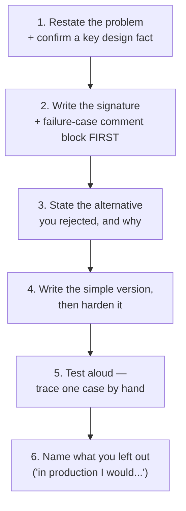
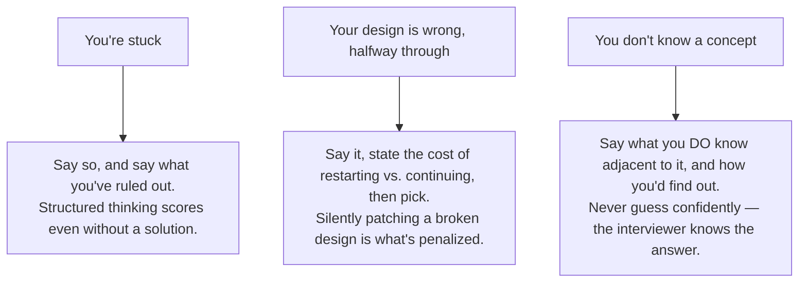

# Chapter 27 — Technical Interview: Concepts and Coding

This chapter is already a cram sheet in the book — forty concept answers at
the length an interview actually wants (2-4 sentences, not a lecture), plus
eight coding problems that keep recurring across agentic-loop interviews.
Our job here is just to organize it for fast self-testing: cover the answer,
ask yourself the question aloud, then check.

## How the Technical Round Is Scored

**Correctness is necessary and rarely sufficient — interviewers score four
things, and three of them are invisible unless you talk.**

| Dimension | What it's really asking |
|---|---|
| Problem framing | Did you restate the problem, ask about inputs, state assumptions before writing? |
| Solution shape | Did you choose a reasonable structure, and can you say why you rejected the alternative? |
| Production instincts | Error handling, bounds, types, and the failure case you handled without being asked |
| Communication | Continuous narration, receptiveness to hints, honest handling of what you don't know |

> **🎯 OpenAI Interview Pointer**
> Open every problem by writing the function signature with types, then a comment block listing the failure cases you intend to handle — before any logic. It takes 90 seconds, demonstrates production instincts immediately, and gives the interviewer an early chance to redirect you. The book notes candidates who do this are scored higher on *identical final code*.

## Forty Concepts, Self-Test Style — Foundations

*Cover the right column. Answer aloud. Then check.*

| Question | Answer at interview length |
|---|---|
| What is an agent? | A system that pursues a goal by repeatedly selecting actions, executing them, observing results, and updating state — where the sequence and count of actions aren't fixed in advance. The discriminating property is autonomy over control flow. |
| Agent vs. workflow? | A workflow's graph is fixed at design time; an agent's next step depends on what it observed. Workflows give predictable latency/cost/tests; agents handle unenumerated inputs, and you pay for that in variance. |
| The six components? | Orchestrator, reasoning model, tool gateway, memory, guardrails, observability. The model never touches the environment — that's what makes the gateway the security boundary. |
| Why bound a loop four ways? | Step ceiling catches oscillation, token budget catches a giant re-read observation, wall clock catches slow dependencies passing their own timeouts, a no-progress detector catches identical repeated calls burning budget without changing state. |
| Tool error vs. denial? | A tool error is a recoverable observation — feed it back. An authorization denial terminates the run — feeding it back invites the model to search for a workaround. |
| When *not* to build an agent? | The task is deterministic, verification is impossible/expensive, error cost is asymmetric and unbounded, or the latency budget is below loop time. |
| Why do input tokens dominate cost? | Most implementations resend the full history every step, so input tokens grow roughly quadratically in step count — doubling steps roughly quadruples the input bill. |
| The verification heuristic? | Commercial viability tracks the cost of *checking* the agent's work more than model capability. Name the oracle before designing anything. |

## Forty Concepts, Self-Test Style — Reasoning and Models

| Question | Answer at interview length |
|---|---|
| Test-time compute? | Additional inference-time computation spent on one input before the final answer — via deliberation, sampling, search, or self-verification. Allocated per request, so it's a budget you route, not a model property. |
| Reasoning model vs. chain-of-thought prompting? | Prompting elicits tokens that *correlate* with correctness. A reasoning model is trained via RL on checkable outcomes, so the deliberation is the mechanism itself — robust to prompt rewording. |
| Where to spend reasoning budget? | The plan step — per-step accuracy compounds multiplicatively, and the plan gates every later step. Minimal effort on extraction/formatting, where deliberation adds cost and can cause drift. |
| ReAct vs. ReWOO? | ReAct interleaves reasoning and acting (each action conditioned on the last observation), serialized. ReWOO plans once with placeholders and executes deterministically — two model calls, parallel execution, at the cost of planning before evidence exists. |
| When does self-consistency work? | When the answer space is small and discrete, so samples collide and a majority is meaningful. Useless for open prose. |
| When does reflection work? | Only when the critic has an information advantage — a test result, schema validation, a retrieval the generator didn't do. A critic with the same context and model mostly agrees with itself. |
| Reasoning tokens? | Hidden deliberation tokens are billed and often exceed visible output on hard problems. Meter them separately; alert on their ratio to output tokens. |
| Routing reasoning effort? | A cascade: deterministic signals resolve most traffic free, a small classifier resolves the ambiguous remainder, a failed verification escalates one tier. Record the routing reason on the span. |

## Forty Concepts, Self-Test Style — Tools, Context, and Memory

| Question | Answer at interview length |
|---|---|
| The agent-computer interface? | The complete surface the agent perceives and affects the world through: tools, names, descriptions, schemas, result shapes, error semantics, authorization. Its design sets the ceiling on agent reliability. |
| The five tool result states? | Success, empty, invalid, denied, unavailable. Conflating empty/unavailable causes retry storms; conflating denied/invalid teaches the agent to route around policy. |
| Why filter the advertised tool list? | Advertising only tools the principal may call raises selection accuracy (shorter list) and prevents disclosing privileged tooling. |
| Tool count limits? | Selection degrades past roughly 40 tools. Combine principal filtering, façade namespacing with an operation enum, embedding-based retrieval, and hierarchical routing. |
| Context engineering, defined? | Systematic construction of the model's input each step: selection, compression, ordering, and a total budget with a defined eviction policy. Four operations: write, select, compress, isolate. |
| Why fixed section order? | Keeps the prompt prefix byte-stable so provider caching works, and makes any step's context reconstructable from a trace. |
| The global truncation danger? | Truncating from the front evicts system instructions and policy — long runs start behaving like a general assistant with production credentials. Evict inside sections; mark instructions non-evictable. |
| Context rot? | Accuracy degrades as the window fills, and material in the *middle* is retrieved less reliably. A run with 3 well-chosen observations often beats the same run with 12. |
| Sub-agent isolation? | A subtask runs in its own window, returns a compact conclusion — parent grows by hundreds of tokens instead of thousands. Link the sub-agent trace so auditability survives. |
| The four memory tiers? | Working (the window), episodic (vector index over documents), semantic (relational/graph, versioned), procedural (versioned artifacts behind an evaluation gate). |
| Why not put facts in a vector store? | A fact with one correct value, retrieved by similarity, returns several plausible alternatives with no way to choose. Use exact lookup instead. |
| Reciprocal rank fusion? | Combine result lists by ordinal position: score each doc as Σ 1/(k+rank) across lists (k≈60 conventional). Scale-free, no normalization needed, stable across reindexing. |

> **🎯 OpenAI Interview Pointer**
> This cluster maps almost 1:1 onto Tools/Context/Memory eval dimensions. If your panel is Agent-Evals-heavy, the "five tool result states" and "why not a vector store" questions are near-certain — both are already flagged elsewhere in this series as common follow-ups.

## The Eight Recurring Coding Problems

**Eight implementation problems recur across agentic-loop interviews — know
what each one tests and the extension an interviewer will layer on.**

| Problem | What it tests | Likely extension |
|---|---|---|
| 1. Bounded loop | Termination reasoning, result shape | Add a fifth bound, or make it concurrent |
| 2. Typed retry | Knowing what *not* to retry | Honor a server retry hint, share a deadline |
| 3. Context assembly | Budgeting and eviction policy | Make it cache-friendly |
| 4. Rank fusion | Scale-free combination, determinism | Weight retrievers, then rescore with a cross-encoder |
| 5. Token bucket | Rate limiting, fairness | Make it distributed and atomic |
| 6. Stream parser | Partial chunks, resume, duplicates | Backpressure when the consumer is slow |
| 7. Semantic fingerprinting | Normalization judgment | Why this normalizer is wrong for a cache key |
| 8. Trajectory evaluator | Assertions over paths | Run it deterministically in CI |

> **🔍 Deep Dive: two traps interviewers specifically probe**
> **Typed retry (#2):** never retry a `denied` or `invalid` result — only genuinely retryable statuses. Always apply *full* jitter (not equal or no jitter — both leave retries synchronized across concurrent runs, turning a degraded dependency into an outage). Honor a server-provided `retry-after` hint over your own backoff schedule.
> **Semantic fingerprinting (#7):** a no-progress detector needs to catch an agent *rewording* the same query — so it normalizes and sorts tokens before hashing, meaning "did revenue exceed cost" collides with "did cost exceed revenue." That's exactly right for detecting a stalled agent and exactly wrong for a cache key, where that same collision would serve a wrong cached answer. **Progress detection wants recall; cache keys want precision — the same normalizer cannot serve both.** Interviewers ask this as a deliberate follow-up to problem 7.

## What Strong Live Coding Sounds Like

**A compressed transcript pattern for any of the eight problems — six moves, each one earning a specific scored dimension.**

**Key points**
- Move 6 is the one most candidates skip, and it's the one that reads as senior — naming a known limitation beats hoping nobody notices it.
- Move 3 (state the rejected alternative) earns "solution shape" even when the interviewer never asked for alternatives.

## Recovering When It Goes Wrong

**Three situations, three specific moves — narrate the recovery, don't silently patch.**

**Key points**
- **Take a hint immediately, and say so** ("that's a better direction, let me take it"). Defending a weaker approach after a hint is scored down on receptiveness — the easiest of the four dimensions to lose.

---

## Cheat Sheet

| Concept | The one thing to remember |
|---|---|
| Scoring | 4 dimensions, 3 invisible unless you narrate — signature + failure cases first, always |
| Concept answers | 2-4 sentences, not a lecture — length isn't depth, and the round is timed |
| Eight coding problems | Retry: never retry denied/invalid, always full jitter. Fingerprinting: recall for progress, precision for cache keys — different normalizers |
| Live coding pattern | Restate → signature+failures → rejected alternative → simple-then-harden → test aloud → name what's left out |
| Recovery | Stuck: say what you ruled out. Wrong: say so, pick a direction. Don't know: say what's adjacent, how you'd find out |
