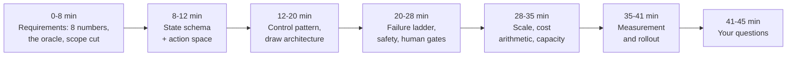
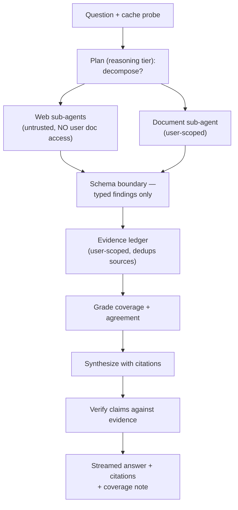
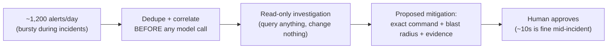
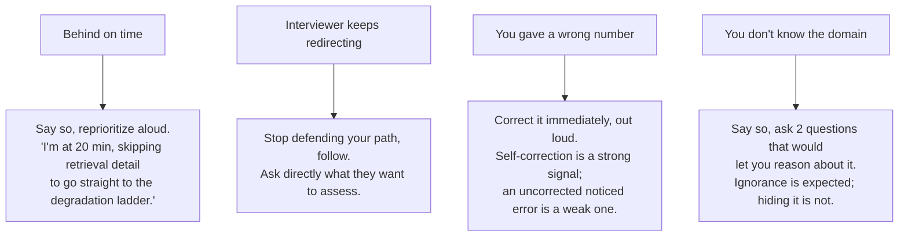

# Chapter 28 — System Design Interview: Agentic Systems

Everything in Part VII becomes a performance here: a repeatable 45-minute
script, two fully worked designs with the arithmetic said out loud, the
follow-up bank interviewers reach for, and the rubric that separates a
senior signal from a staff one.

## The Forty-Five Minute Script

**Time is the binding constraint. Twenty minutes on requirements produces an
incomplete design; two minutes produces a generic one. Rehearse against a
clock until the pacing is automatic.**

**Key points**
- Miss the first 8 minutes and every later answer is guesswork. Miss the last 5 and you forfeit the leveling signal.
- Three opening moves, every time: **restate the problem in one sentence**, **ask for the eight numbers** (throughput, latency, horizon, accuracy, cost, autonomy, data class, recovery), **name the oracle and cut scope** ("how will we know a run succeeded" + "I'll treat X as out of scope unless you want it in").

> **🎯 OpenAI Interview Pointer**
> Close the requirements phase by restating everything as one sentence, then ask "is that the system?" It costs 20 seconds and is consistently marked as a strong signal — it's literally what a technical lead does at the start of a real project. Cheap, high-leverage, easy to forget under pressure.

## Worked Design One: A Deep Research Agent at Consumer Scale

**A read-only, citation-grounded research agent for ~100K daily users — walked through the same script, with the arithmetic said aloud.**

**Key points**
- **Requirements, condensed:** ~40K research runs/day (peak 3x mean), p95 under 90s with first signal under 3s, 3-12 step horizon, success = every claim cited to a source a reviewer would accept, $0.20/run ceiling, **read-only** (no writes → no approval subsystem needed, say so explicitly), public web + user docs (per-user isolation required).
- **State carries:** run/user identity, goal, a dependency-aware plan, an evidence list (with a *concatenating* merge rule — this is what prevents the fan-out data-loss defect from Ch. 2), tool errors, draft, verification score, step/replan counters, a budget dict summed across branches.
- **The arithmetic, aloud:** 40K/day peaked 3x ≈ 100 runs/min at peak; at p95=70s, Little's Law gives ~120 in-flight, so size concurrency around 170 at 70% utilization target. Naive 7-step cost ≈ 30K input tokens (blows the $0.20 budget) — three levers fix it: **sub-agent isolation** (parent sees hundreds of tokens, not raw pages — the single largest lever), **prefix caching** on stable instructions/tools, **tier routing** (small model for extraction/summarization, reasoning tier only for plan+verification).
- **Safety, the part worth volunteering unprompted:** reads private data + processes untrusted web content — but *no* external communication tool, so the third trifecta leg is absent... except the **rendered answer is itself a channel**, so an egress firewall on the rendering path (strip Markdown images, non-allowlisted links, fetch-inducing markup) is mandatory. Web sub-agents hold zero user-document scope — an injection in a fetched page can't reach the private corpus *even in principle*. That's privilege separation, stated explicitly.
- **The one metric that would prove the design wrong:** the grade distribution. If most runs grade poorly even after correction, the corpus — not the architecture — is the constraint, and you built the wrong thing.

## Worked Design Two: An Incident Response Agent for an SRE Team

**A write-capable, high-stakes agent under a 30-second latency floor — same script, different risk profile entirely.**

**Key points — the four decisions that matter more than the diagram:**
- **Read-only investigation, staged mitigation.** The agent may query anything, change nothing on its own — a 10-second human approval is acceptable mid-incident, an autonomous rollback on a wrong hypothesis is not.
- **The dependency inversion problem.** The agent depends on the observability stack — which is disproportionately likely to be degraded *during the incident it's investigating*. So: run outside the affected blast radius, treat every telemetry query as potentially `EMPTY` or `UNAVAILABLE`, and report which sources it *couldn't* reach. Source coverage is a first-class output field, not an afterthought.
- **Burst capacity.** 1,200 alerts/day is trivial; 400 alerts in 90 seconds during an incident is not. Deduplicate and correlate *before* invoking any model, cap concurrent investigations per service. One thorough investigation beats 400 shallow ones.
- **Measurement:** time to first useful output, hypothesis precision (confirmed in post-incident review), source coverage per investigation, approval decision time, later reversal rate on approved mitigations. **The falsifying metric is hypothesis precision** — below a threshold, responders stop reading the output, and an ignored incident tool is worse than none, because it still consumes attention during the incident.

> **🎯 OpenAI Interview Pointer**
> Notice both worked designs volunteer the trifecta/safety analysis *before being asked*. That's a repeated, deliberate signal in this book: naming the security boundary unprompted reads as senior-level threat modeling, not box-checking.

## Follow-Up Questions and the Shape of a Strong Answer

**The interviewer's follow-up bank — and what separates a real answer from a generic one.**

| Follow-up | Shape of a strong answer |
|---|---|
| How does this scale 10x? | Name the *binding constraint* first (usually provider quota), then the arithmetic, then which lever you'd pull and its cost |
| What breaks first? | A specific component with a specific symptom and the metric that reveals it — never "hallucinations" |
| How do you know it works? | The oracle, sampled online measurement, the offline gate, and the offline suite's power limitation |
| What if the model gets worse? | Version pinning, evaluation before adoption, canary with guardrails, automatic rollback, a second provider behind an adapter |
| How much does it cost? | The per-run arithmetic derived aloud, the blended figure, the levers with expected effect |
| Where's the security boundary? | The gateway, the trifecta analysis, egress control on both the tool path and the rendering path |
| What would you cut for a 2-week version? | A specific reduced scope that still has an oracle and a failure ladder — and what you would NOT cut, and why |
| How do you handle a bad actor? | Rate limits, a cost governor per principal, anomalous tool-sequence detection — and that prompt defenses are rate-reducers, not boundaries |

> **🎯 OpenAI Interview Pointer**
> "What breaks first?" is the one to rehearse most. The book's own example of the *wrong* answer: "hallucinations." The *right* shape: "the web search tool returns empty result sets during a partial outage, the agent treats empty as valid, we ship an ungrounded response with no citations — the signal is citation-free answer rate, the fix is a typed result distinguishing empty from unavailable." Same idea, four times the value — a symptom, a mechanism, a metric, and a fix, in one breath.

## The Levelling Rubric

**What each level actually sounds like out loud — not a judgment of who you are, a description of what to say.**

| Level | Sounds like | Missing |
|---|---|---|
| Mid | Correct components, names a framework, describes a working happy path | Numbers, failure design, trade-offs stated as choices |
| Senior | Requirements as numbers, names the control pattern *and the rejected alternative*, walks a degradation ladder, does cost arithmetic | Organizational consequences, migration path, second-order effects |
| Staff | All of the above, plus: what to build first and why, what to deliberately *not* build, how the design changes at 10x, the measurement that would falsify it | Little — at this level differences are about scope of influence |

> **🔍 Deep Dive: depth on one component vs. breadth across the whole design**
> A 45-minute round rewards covering the whole design at consistent depth *first*, then offering depth explicitly: "I can go deeper on the evaluation layer or the cost model — which is more useful to you?" Letting the interviewer choose beats guessing, and turns a monologue into a conversation. Candidates who go deep unprompted usually pick the component *they* know best rather than the one being assessed, and run out of time before the failure/measurement sections — which is exactly where the leveling signal lives.

## Recovering a Round That Has Gone Sideways

**Four specific moves for four specific ways a round goes wrong.**

**Key points**
- Interviewers respect explicit prioritization and penalize silent overruns — the failure mode isn't running out of time, it's running out of time *without saying so*.

---

## Cheat Sheet

| Concept | The one thing to remember |
|---|---|
| The 45-minute script | 8 min requirements (the 8 numbers + oracle + scope cut) buys the rest; last 5 min is where leveling happens |
| Deep research agent | Sub-agent isolation is the single largest cost lever; volunteer the trifecta analysis before being asked |
| Incident response agent | Read-only investigation + staged mitigation; treat your own observability stack as potentially degraded |
| Follow-up bank | "What breaks first" needs a symptom + mechanism + metric + fix — never a category like "hallucinations" |
| Leveling rubric | Senior = numbers + rejected alternatives + degradation ladder. Staff = what NOT to build + the falsifying metric |
| Recovery | Always narrate the recovery — silent overruns and uncorrected errors are worse than the mistakes themselves |
