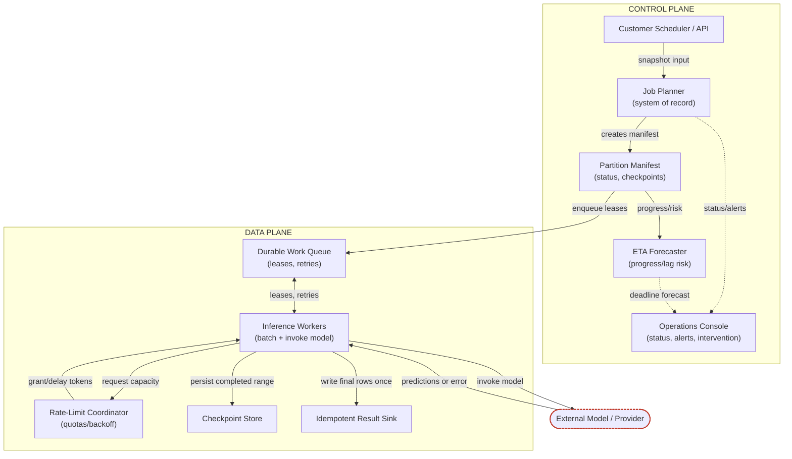
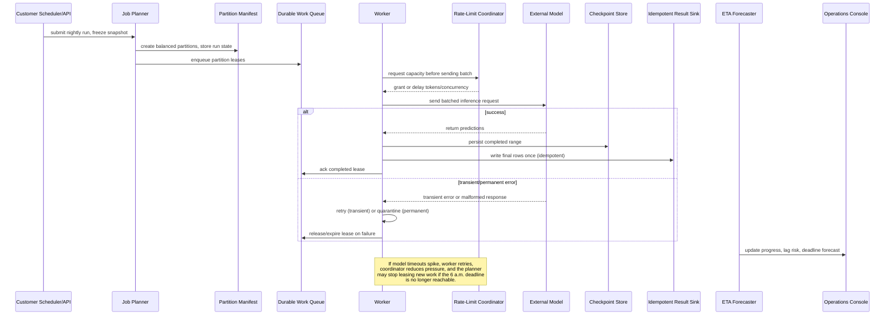
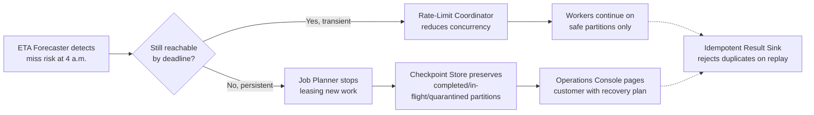
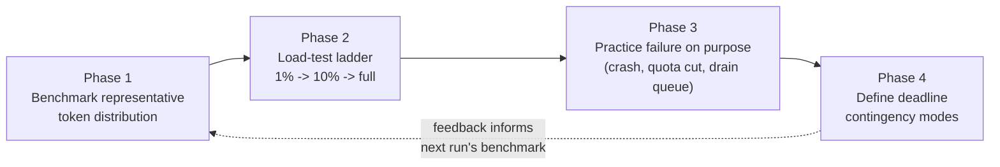

# Chapter 10: Design a High-Volume Batch Inference System

*Source: THE FORWARD DEPLOYED ENGINEER SYSTEM DESIGN INTERVIEW: 20 REAL-WORLD AI SYSTEM DESIGN INTERVIEWS, Chapter 10*

## 1. The Customer Problem and Discovery

**Key Points**
- The prompt sounds simple ("classify 100 million records every night before 6:00 a.m.") but the room immediately splits into three different definitions of success — a feature request, a workflow, and a business result are not the same thing.
- The strong restatement is: **complete a replayable, cost-controlled batch by deadline with clear recovery decisions when behind schedule.**
- Four stakeholder groups matter, and each is "hiring" the platform for a different job: data platform teams, model owners, business consumers, and on-call operators.
- A weak restatement jumps straight to components ("a batch classifier with a fast inference service and a scheduler"); a strong one names the outcome and the recovery contract instead.
- Discovery should leave you with five concrete artifacts in your head — scope, assumptions, risks, owners, success metrics — even if you never write them down.
- The interview reward is not guessing every detail correctly; it's converting ambiguity into a testable plan.

### The customer problem, restated

You walk into the customer meeting expecting a straightforward system design prompt, and the room immediately splits into three different definitions of success. The business owner says, "We just need classifications ready by morning." The data platform lead says, "Only if it doesn't break the warehouse." The on-call engineer says, "Only if we can rerun it safely when the model or upstream feed fails." That disagreement is the real interview problem.

A strong FDE answer starts by turning the prompt into a measurable outcome: **complete a replayable, cost-controlled batch by deadline with clear recovery decisions when behind schedule.** The feature request is not the same as the workflow, and the workflow is not the same as the business result. The request is to classify 100 million records every night before 6:00 a.m. under model, rate, cost, and downstream capacity limits. The result is not "run inference"; it is "the right consumers get usable outputs on time, with a known recovery path if the run slips."

### Who cares, and why

The first useful move is stakeholder mapping. If you skip this, you design for the wrong success criterion.

- **Data platform teams** care about throughput, orchestration, lineage, storage pressure, and whether the pipeline can be replayed without manual cleanup.
- **Model owners** care about model versioning, input contract stability, evaluation quality, and whether the batch uses the approved artifact.
- **Business consumers** care about the classifications being ready in time for their downstream processes and whether the results are trustworthy enough to act on.
- **On-call operators** care about alert fatigue, retries, partial completion, backfills, and how quickly they can determine whether to continue, pause, or rerun.

A concrete stakeholder map example for this prompt could look like this:

- **End user:** the morning operations team that consumes the classifications before planning or outreach begins.
- **Operator:** the on-call data platform engineer who restarts failed jobs, checks lag, and decides whether a partial run is safe.
- **Security owner:** the team that reviews access to source records, output storage, logs, and any sensitive features or predictions.
- **Executive sponsor:** the business owner who cares about whether the system reliably supports the morning workflow and justifies its cost.

In an FDE interview, naming these groups does more than show empathy. It reveals which decisions belong to which owner. The business does not decide batch retry semantics. The on-call engineer does not decide whether a stale classification is acceptable for a campaign. The model owner does not own the downstream SLA. This division is how you keep the architecture aligned with reality instead of with a single enthusiastic stakeholder.

### Restate the problem without picking a solution

A clean opening answer can sound like this:

> "We need a nightly batch inference system that classifies about 100 million records and finishes before 6:00 a.m. The design has to account for model rate limits, cost constraints, and downstream capacity so the output is usable by morning. I'd first clarify who consumes the results, what happens if we're behind schedule, and what replay and audit requirements exist before choosing the execution architecture."

That answer is deliberately technology-neutral. It avoids assuming microservices, Spark, a particular queue, or a specific model provider. It also signals a core FDE habit: **discovery before architecture**.

A weak restatement sounds feature-first:

> "We should build a batch classifier with a fast inference service and a scheduler."

That version jumps straight to components and misses the decision the customer actually needs. A corrected outcome-first restatement is:

> "The customer needs reliable nightly classification results delivered before business users need them, with predictable cost and a clear recovery path when the batch falls behind."

The difference is subtle but important. The first version names tools. The second names value.

### Ask fewer, higher-leverage questions

Interview time is limited, so discovery must be selective. The goal is not to collect every possible detail; it is to find the few unknowns that change the design materially. Ask questions that separate the design into branches:

1. **Who consumes the output, and what breaks if it is late?** This tells you whether the deadline is hard, soft, or tiered by customer segment.
2. **Can the batch be partial, or must it be all-or-nothing?** This determines retry strategy, checkpointing, and downstream handoff.
3. **What happens when the job is behind at 4 a.m.?** This surfaces the recovery decision: speed up, reduce scope, use a fallback model, or ship partial results.
4. **How often does the model change, and who approves it?** This affects version pinning, validation, and rollout controls.
5. **What downstream system receives the classifications, and what capacity does it actually have?** This prevents you from designing a pipeline that finishes inference but overwhelms the consumer.
6. **What audit, retention, or residency constraints apply?** This changes storage, logging, and data movement decisions.

These questions are high leverage because each one changes a fundamental design axis: SLA, consistency, cost, operating model, or compliance boundary. When the interviewer withholds information, state assumptions explicitly. For example: "If the customer says nothing about partial completion, I'll assume the batch may produce partial outputs only if downstream consumers can tolerate them and the system records exactly what was completed." That kind of assumption ledger shows maturity without pretending certainty.

### What discovery should produce

Discovery is not a vague conversation. It should leave you with five concrete artifacts in your head, even if you never write them down during the interview:

- **Scope:** nightly classification only, or also retraining, labeling, and backfill jobs
- **Assumptions:** record size, input freshness, output format, acceptable lateness, retry policy
- **Risks:** model rate limits, upstream data delay, downstream overload, and late-run recovery
- **Owners:** who approves model changes, who owns orchestration, who receives the results, who is paged
- **Success metrics:** batch completion by deadline, replayability, cost per run, and recovery clarity when behind schedule

That last point matters. A business outcome metric is not "number of predictions made." It is something the customer can defend: did the right people get the right classifications by the time they needed them, at a cost the business accepts, with an explicit answer for what happens when the batch slips?

### Why this framing matters in the job

This is the FDE difference between a generic system designer and someone who can operate at the customer boundary. The role is not just to produce an architecture; it is to translate ambiguity into execution. In real work, stakeholders often agree on a request while disagreeing on workflow, risk, and success. An FDE who can surface that mismatch early saves the customer from building the wrong thing and saves the team from spending cycles optimizing the wrong bottleneck.

The architecture starts only after you can say whose workflow changes and how success will be measured. Until then, "design the system" is just a clever way to avoid the harder question: **what outcome is the customer actually buying?**

### 90-second interview answer

If you need a compact opening in the interview, use this shape:

> "The prompt is to classify about 100 million records every night and finish before 6:00 a.m., but the real design target is to deliver a replayable, cost-controlled batch with clear recovery decisions if we fall behind. I'd start by mapping the stakeholders: data platform teams, model owners, business consumers, and on-call operators. Then I'd clarify whether partial results are acceptable, what the downstream consumer can absorb, what audit or retention rules exist, and who owns model approval. If the interviewer doesn't specify those, I'd state assumptions explicitly so the design stays testable. Only after that would I choose the execution architecture, because the workflow and success criteria determine the architecture — not the other way around."

That framing gives you a defensible starting point for the rest of the design conversation.

## 2. Clarifying Questions, Requirements, and Constraints

**Key Points**
- The incomplete brief is the test, not a trick: choose the highest-risk unknowns and state assumptions explicitly rather than freezing.
- The single highest-leverage question is usually whether the batch must finish all-at-once or whether partial results have value — it determines completion strategy, checkpointing cadence, and how much cost you can spend on the last 10%.
- A six-branch question tree ties each question to a concrete architectural decision.
- Requirements split cleanly into **functional** (what the pipeline must do) and **nonfunctional** (how well it must do it).
- A strict must/should/could ladder lets you defend scope decisions under partial answers.
- The MVP is three capabilities; everything else is explicitly out of scope until the baseline is stable.
- A requirement-to-component traceability table proves the architecture isn't just a list of services — every service answers a named requirement.

### Start by forcing the hidden constraint into the open

The first thing to learn in this kind of interview is that the prompt is incomplete on purpose. In the running scenario, the interviewer may confirm the nightly volume and the 6:00 a.m. deadline, then stop there. That is not a trap; it is the test. A strong FDE does not freeze when the customer answers only half the questions. They choose the highest-risk unknowns, state assumptions clearly, and keep moving.

If you are only allowed a few minutes of discovery, protect the constraint that most changes the architecture: whether the batch must finish all-at-once or whether partial results have value. That one answer determines whether you design for strict completion, progressive delivery, or a fallback degraded mode. Everything else — batch sizing, worker count, retry strategy, checkpointing cadence, and how much cost you can spend on the last 10% — depends on that decision.

### A concise question tree that changes the design

Use a short, purposeful question tree instead of a long requirements interview. Each branch exists because it changes a concrete design choice, not because it is nice to know.

- **Input size, source, and partitioning:** How many records, where do they come from, and how are they naturally split today? If the source is already partitioned by tenant, region, or date, you can align work units with those boundaries. If not, you may need a preprocessing step to create independent chunks. This question tells you whether the system can scale through embarrassingly parallel work or whether the ingestion layer becomes part of the design.
- **Processing window and partial-result value:** Must the entire job finish before the deadline, or can the customer consume partial output while the remainder catches up? If partial results are useful, you can design a monotonic progress model and a clear handoff for late records. If not, your plan must prioritize deadline protection over evenness of work.
- **Tokens and model throughput per record:** How large is each record after prompt construction, and how many model tokens does one inference typically consume? This influences batching, rate limiting, throughput planning, and cost exposure. A record that fits comfortably in a small prompt behaves very differently from one that drags in long context or large attachments.
- **Provider rate limits and batch APIs:** Does the model provider offer native batch endpoints, async job submission, or only synchronous requests? What global and per-tenant limits apply? This answer can move the design from a simple worker pool to a submission scheduler that must smooth traffic, prioritize tenants, and avoid bursts.
- **Ordering, deduplication, and retry semantics:** Does the downstream system require original ordering, or only exactly-once logical results? Are retries allowed to create duplicates if the sink can dedupe, or must the producer guarantee idempotency? This determines how you checkpoint progress, how you name output artifacts, and whether you can safely replay failed partitions.
- **Cost ceiling and degraded modes:** Is there a hard spend cap? If the system is behind schedule, should it increase cost to catch up, reduce model quality, skip low-value records, or alert a human to extend the deadline? This is the answer that keeps the design from quietly turning into an uncontrolled compute bill.

That question set does more than collect facts. It creates the design boundaries. Once you ask these questions, you can turn a vague batch request into a set of testable commitments.

### Separate functional requirements from nonfunctional constraints

The interview is easier to defend when you classify what the system must do versus how well it must do it.

**Functional requirements** describe the behavior of the pipeline:

- partition work independently
- schedule and autoscale workers
- batch model calls where appropriate
- rate-limit globally and by tenant
- checkpoint progress and write idempotently
- forecast completion and invoke contingency plans

**Nonfunctional requirements** describe the quality bar:

- finish by deadline
- no missing or duplicate logical results
- bounded cost
- restart without full replay

The distinction matters because it stops requirements drift. "Batch the model calls" is a feature. "Finish by deadline" is a constraint. "Scale workers up and down" is a mechanism, not an outcome. In the interview, saying these out loud proves you know how to translate customer language into system behavior.

No equation is needed in this section; the important quantitative implication is simply that all later capacity math must be framed against the deadline, the available budget, and the provider limits you confirmed during discovery.

### Prioritize with must, should, and could

When the interviewer gives only partial answers, you need a principled way to choose what to build first. Use a strict priority ladder:

- **Must:** independent partitioning, deadline protection, idempotent writes, and restartable execution. Without these, the batch cannot complete safely.
- **Should:** autoscaling, batching where it actually improves throughput, and global plus per-tenant rate limiting. These improve efficiency and fairness, but the system can still function without perfect optimization.
- **Could:** advanced ranking of low-value records, richer per-customer scheduling policies, or manual override tooling for exceptional tenants. Useful later, but not part of the minimum viable design.

This is also where you keep the scope boundary honest. The goal is not to solve every possible batch-processing problem. The goal is to solve one specific batch with the smallest architecture that can survive real failure.

### The MVP and what it deliberately does not do

A good MVP for this scenario contains three core capabilities: **partition work independently; schedule and autoscale workers; batch model calls where appropriate.** Those are the minimum pieces that let the system exploit parallelism, absorb load, and stay within provider constraints.

Everything else is explicitly out of scope until the baseline is stable:

- no cross-job optimization across unrelated customer workloads
- no complex per-record interactive feedback loop
- no custom model training pipeline in the batch path
- no support for arbitrary ad hoc query workloads
- no attempt to guarantee optimal cost in every failure mode

These exclusions are not laziness; they are protection against solution sprawl. The more responsibilities the batch engine takes on, the harder it is to reason about deadline risk and recovery behavior.

### Assumption risk is a design problem, not a footnote

The interviewer answering only half the questions forces you to choose reasonable assumptions. The professional move is not to hide those assumptions; it is to surface them and defend why they are safe enough.

For example, you might assume that records can be partitioned by input shard without cross-record dependency, that late records can be retried in the next run if they miss the cutoff, and that downstream consumers can tolerate eventual completion as long as the final output is correct and auditable. Those assumptions are powerful because they let you design for independent replay rather than global lockstep execution.

But assumptions also create risk. If a record depends on another record's result, then simple parallelization can break correctness. If a tenant expects strict completion with no late data, then a degraded mode that skips low-priority work may violate the business contract. If the provider's batch API has different semantics from synchronous calls, then a naive retry loop may duplicate output. Good candidates call out those risks before they become hidden production bugs.

### What to protect first when the answers are incomplete

When you do not get full clarification, protect the constraint that is hardest to recover later. In this case that is usually the deadline, followed closely by result integrity. A late but correct job can often be rerun or explained. A job that silently drops records or emits duplicates is much harder to trust.

So the design conversation should bias toward:

1. independent partitions that can be retried safely
2. checkpointed progress so a failed worker does not force a full replay
3. idempotent output writes so duplicates are suppressed at the sink
4. global and tenant-aware rate limits so provider limits do not turn into cascading failures
5. completion forecasting so the system can warn early and trigger a contingency plan rather than discovering failure at 5:59 a.m.

That ordering is interview gold because it shows you understand both the business outcome and the operational reality.

### Requirement-to-component traceability

A fast way to prove design discipline is to connect each requirement to a component or control. You do not need a huge matrix; you need a readable chain from requirement to implementation.

| Requirement | Design element |
|---|---|
| Partition work independently | Input sharding, partition metadata, and per-shard task queues |
| Schedule and autoscale workers | Queue depth monitoring, worker pool, and autoscaling policy |
| Batch model calls where appropriate | Request bundling layer and provider batch submission path |
| Rate-limit globally and by tenant | Central admission controller and tenant quota enforcement |
| Checkpoint progress and write idempotently | Durable checkpoint store and idempotent output sink |
| Forecast completion and invoke contingency plans | Progress estimator and alerting / fallback controller |
| Finish by deadline | Scheduling policy that favors the critical path |
| No missing or duplicate logical results | Idempotency keys, replay-safe writes, and reconciliation checks |
| Bounded cost | Spend guardrails, batch sizing policy, and degraded-mode rules |
| Restart without full replay | Partition-level checkpoints and resumable task state |

This table is useful in the interview because it shows that the architecture is not just a list of services. Each service exists to satisfy a named requirement.

### A compact interview answer you can reuse

If the interviewer keeps the answers partial, say something like this:

> "Given the missing details, I'm going to assume the records are independently partitionable, partial results are only useful if they're explicit and auditable, and the highest-risk constraint is finishing by the deadline without duplicates. That means I'll prioritize shardable work, checkpointed progress, idempotent writes, and rate limiting before I optimize for cost or advanced scheduling. If any of those assumptions are wrong, the design changes in specific ways, so I'd want to validate them early."

That answer shows judgment, not just architecture vocabulary. It also signals that you know how to protect delivery under ambiguity, which is one of the clearest markers of an FDE.

### Job-market signal

This section is also where the interview becomes a proxy for real on-the-job behavior. FDE teams want people who can discover requirements in conversation, separate hard constraints from preferences, and turn uncertainty into a stable scope. That combination shows customer empathy, prioritization, and the ability to keep a delivery moving when the environment is incomplete or changing.

### Takeaway

The right way to begin a high-volume batch inference design is not to sketch services first; it is to extract the few questions that most change the architecture, label the assumptions you have to make, and turn them into prioritized requirements. If you do that well, the rest of the interview becomes much easier to defend.

## 3. Scale Estimates, SLOs, and Capacity

**Key Points**
- The first pass at this problem is usually too optimistic ("a queue, a few workers, and a model endpoint") — the correction is to stop arguing from intuition and start with the envelope.
- The core throughput formula is $$RPS_{required}=\frac{N_{records}}{T_{window}}\times(1+h)$$ — for 100M records over a 6-hour window, the floor is ~4,630 rps, rising to ~5,320 rps with 15% headroom.
- Multiplying by tokens per record turns the batch from "a lot of records" into a sustained token factory — and this estimate is usually the one that most affects partitioning and component choice.
- Average load can hide peak load; a batch that looks smooth on average can still miss the deadline if one partition is slow or delayed.
- A sensitivity table (current batch vs. 10x growth) tests whether the architecture is embarrassingly underbuilt or overengineered.
- SLOs should mirror the customer workflow, not just infrastructure health: availability, latency, freshness, quality, security, and cost.
- Show a range instead of a false-precision point estimate — the number that changes the architecture is usually the tail, not the mean.

### Start with the throughput math, then stress it

The first pass at this problem is usually too optimistic: "We just need a queue, a few workers, and a model endpoint." That sounds plausible at average load, but it quietly ignores the deadline, the retry rate, and the fact that the last 5% of a batch is often the hardest. In an FDE interview, the correction is to stop arguing from intuition and start with the envelope: how many records, how long the window lasts, how many tokens or model calls each record implies, and how much slack you need for stragglers and cleanup.

For the core scenario, the batch contains 100 million records and must finish in six hours. If you divide records by seconds, you get the minimum sustained rate before retries:

$$RPS_{required}=\frac{N_{records}}{T_{window}}\times(1+h)$$

With $N_{records}$ = 100,000,000 and $T_{window}$ = 6 × 3600 = 21,600 seconds, the base rate is about 4,630 records per second. That is the first number worth saying out loud. It is not a design yet; it is the floor. Once you add explicit headroom $h$ for retries, stragglers, and final reconciliation, the true operating target rises. If you choose even a modest 15% headroom, the planning rate becomes roughly 5,320 records per second. The point of the formula is not mathematical elegance; it is to stop people from treating the deadline as if it were a nominal average instead of a hard constraint.

Now multiply by tokens per record to estimate model throughput. If each record produces a prompt of 250 input tokens and an output of 20 tokens, the model is processing 270 tokens per record before you count retries or resubmissions. At 4,630 records per second, the batch is no longer "a lot of records"; it is a sustained token factory with serious downstream implications. That estimate is the one that usually changes component choice: it tells you whether the bottleneck is ingestion, queue draining, model calls, post-processing, or writes to the output store. In interviews, that is a strong place to pause and say, "This estimate is the one that most affects partitioning, because it tells us whether we need to shard by record, by tenant, by time slice, or by model invocation pattern."

### Distinguish average load from peak load

Average throughput can hide the shape of the real workload. A batch that is smooth at the top of the hour can still miss the deadline if one partition is slow, one upstream source is delayed, or a subset of records repeatedly fail validation. So the design question is not only "How many records per second on average?" but also "What peak do we need to survive without collapsing the schedule?"

This is where headroom and growth factor become different tools. Headroom covers operational noise inside the same batch: retries, tail latency, and reconciliation. Growth factor covers the business assumption that next quarter's batch may be larger than today's. Keep them separate. A good interview answer states average, peak, growth, and headroom rather than pretending a single point estimate is enough. That is more honest and more useful to the customer.

A simple sensitivity table makes the trade-off visible:

| Scenario | Records | Window | Base rate | With 15% headroom |
|---|---|---|---|---|
| Current batch | 100M | 6 hours | ~4,630 rps | ~5,320 rps |
| 10x growth | 1B | 6 hours | ~46,300 rps | ~53,200 rps |

The 10x case is not there because you expect it tomorrow; it is there to test whether the architecture is embarrassingly underbuilt. If a design only works at today's load, it is fragile. If it works at 10x but requires absurd cost or complexity, it may be overengineered. The interview sweet spot is pragmatic elasticity: enough batching, sharding, and backpressure to absorb growth without inventing infrastructure you do not need.

### Tie SLOs to the customer workflow

The batch is not successful just because workers stayed busy. It is successful when the customer gets a usable result by the morning deadline, with enough accuracy and traceability to trust the output. That means the technical SLOs should mirror the business workflow.

For this system, the relevant indicators are:

- **Availability:** Can the batch pipeline accept and process work during its scheduled run window?
- **Latency:** How long does a record take from ingestion to classified output, and what is the end-to-end completion time for the whole batch?
- **Freshness:** How quickly after source data closes do the results become available to the downstream consumer?
- **Quality:** What error rate, confidence threshold, or validation pass rate is acceptable before results are published?
- **Security:** Are inputs, outputs, and prompts protected according to the customer's access and retention requirements?
- **Cost:** What is the cost per million records, and where does extra retry traffic or oversized prompts change that unit economics?

Notice how these are not just infrastructure metrics. They describe the customer promise. If the customer needs an export by 6:00 a.m. to feed a fraud review queue, then a "99.9% successful job" is not enough unless the late 0.1% still arrives in a form the downstream system can tolerate. In other words, the latency budget must include not only model inference time but also queueing, batching, writeback, validation, and reconciliation. A design that meets model latency but misses the end-to-end window still fails the customer.

### Show uncertainty instead of hiding it

Interviewers are usually not looking for false precision. They want to see whether you know how to communicate a range. Say what you know, what you assume, and what would change the answer. For example: "At 100 million records, I would plan for about 4,630 records per second before retries. If the average prompt is smaller than expected, model throughput becomes easier; if the tail of large records is heavier, we need more headroom or more aggressive partitioning. I would size the system around the tail, not the mean."

That phrasing does two things. First, it shows you understand sensitivity: the estimate that changes the architecture is usually not the average record size, but the long tail of large or slow records. Second, it shows you can defend a design without pretending the numbers are exact. The same logic applies to cost. Unit economics are not just "cheaper is better"; they are "how much does each record cost to classify, and what operational choices push that cost up or down?" If retries double token usage, or if stragglers keep workers warm for an extra hour, the marginal cost changes materially.

### Why this section matters in the interview

This is where a strong candidate avoids overengineering. Instead of jumping to exotic scheduling, specialized databases, or a custom distributed runtime, they make a disciplined sizing pass and let the numbers decide. That is a job-market signal in itself: employers want people who can make pragmatic capacity decisions under uncertainty, not just people who can name every possible distributed-systems pattern.

The right takeaway is simple: estimates are decision tools. Each number should justify an architectural choice or an operational limit. If the math says the batch needs 5,000-plus records per second with slack for retries, then the design has to explain how it achieves that rate, how it degrades when it slips, and how it tells the customer whether the morning deliverable is still on track. That is the bridge from discovery to architecture, and it is the standard you want to demonstrate before you draw the first component box.

## 4. Architecture and End-to-End Flow

**Key Points**
- Start the architecture discussion as a customer conversation, not a component list — "classify 100 million records every night, stay inside model and API quotas, control cost, and still give a clean recovery plan" implies a replayable pipeline, a durable notion of progress, and a decision point for continuing versus pausing.
- Nine components split cleanly into control-plane (job planner, partition manifest, ETA forecaster, operations console) and data-plane (durable work queue, rate-limit coordinator, inference workers, checkpoint store, result sink) concerns.
- Three trust boundaries matter: the customer input snapshot (must not silently drift), the model call (an external dependency that can time out, throttle, or return malformed responses), and publication (the result sink must be idempotent so replays don't duplicate).
- The happy path is seven steps: snapshot and manifest → partition → lease → batch and invoke under quotas → checkpoint → retry/quarantine → reconcile and publish.
- The sequence diagram captures both the happy path and the built-in failure handling (steps 4-7, 12).
- The strongest interview answer is the one that survives a live failure: a dependency failure at 2:17 a.m. should trigger a decision tree (reduce concurrency, split hot partitions, switch to fallback model, or stop and page), not a shrug.
- MVP is planner, manifest, queue, worker fleet, checkpointing, idempotent sink, and a basic ETA panel — smarter rebalancing, historical prediction, and richer tooling are valuable but not prerequisites.

### Start with the customer request, not the boxes

A useful architecture discussion begins as a customer conversation: "Classify 100 million records every night before 6:00 a.m., stay inside model and API quotas, control cost, and still give us a clean recovery plan if the run falls behind." That request implies more than throughput. It implies a replayable pipeline, a stable cutoff for the nightly snapshot, and a durable notion of progress, and a decision point for when to keep pushing versus when to stop, quarantine, and resume later.

Now replay the same path with one dependency failure: the external model endpoint starts timing out at 2:17 a.m. The design question is no longer "Can we retry?" It is "Where do retries belong, what state is already durable, what work can be safely re-leased, and how does the operator know whether the batch can still finish on time?" That framing keeps the architecture tied to the customer outcome: complete a cost-controlled batch by deadline with clear recovery decisions when behind schedule.

### The component stack in dependency order

The system is easiest to reason about from the top down, because each layer owns a different kind of truth.

| Component | Responsibility | State owned | Why it exists |
|---|---|---|---|
| Job planner | Accepts the nightly run, freezes the input snapshot, and creates the batch plan | Run metadata, snapshot pointer, deadlines | Establishes the system of record for the run |
| Partition manifest | Lists balanced work units and their status | Partition IDs, ranges, attempts, checkpoints | Makes work replayable and auditable |
| Durable work queue | Hands out partitions to workers with leases | Lease state, visibility timeout, retry eligibility | Separates scheduling from execution |
| Rate-limit coordinator | Shapes outbound calls to stay under quota | Token budget, concurrency budget | Prevents self-inflicted throttling |
| Autoscaled inference workers | Batch records and call the model | Ephemeral execution state | Does the data-plane work |
| Checkpoint store | Persists completed ranges and partial progress | Last successful offset, result hashes | Enables recovery without rescanning everything |
| Idempotent result sink | Writes final classifications once per record | Final output by record key | Prevents duplicate publication |
| ETA forecaster | Estimates completion and lag risk | Progress rate, remaining work, backlog | Supports operator decisions |
| Operations console | Shows run status, warnings, and intervention controls | Human-facing incident and rollout state | Lets the customer trust the process |

The planner, manifest, ETA forecaster, and operations console are control-plane concerns. They coordinate the run. The workers and result sink are data-plane concerns. They move records through the model and into durable output. That distinction matters in interviews because it explains why not every component should be scaled the same way or updated at the same frequency.

### Top-down architecture and trust boundaries

A compact way to present the architecture is to mark where trust changes:



Trust boundary 1 is the customer input snapshot: after the planner freezes it, the rest of the run should not silently drift if upstream data changes. Trust boundary 2 is the model call: it is an external dependency, so the worker must assume timeouts, throttling, malformed responses, and partial failures. Trust boundary 3 is publication: the result sink should be idempotent so that replays do not create duplicate classifications.

### Happy path, step by step

1. **Snapshot input and build manifest.** The job planner records the source dataset version, the run deadline, and the run policy, then writes a partition manifest. This is the system of record for what "this batch" means.
2. **Split into balanced partitions.** The manifest breaks the snapshot into work units that are sized to reduce skew. The partitioning key should favor even processing cost, not just data locality; for example, record count alone may be a worse key than a combination of tenant, payload size band, or historical inference latency.
3. **Lease work to workers.** The durable queue hands a partition lease to an inference worker. This is an asynchronous boundary: the planner does not wait for every partition to finish, and workers do not hold the run hostage if they fail midstream.
4. **Batch and invoke model under quotas.** The worker groups records into model-sized batches and asks the rate-limit coordinator for capacity before sending requests. That coordinator is where backpressure lives: when the quota tightens, it slows leases or reduces per-worker concurrency rather than letting retries stampede the provider.
5. **Checkpoint result ranges.** After a successful response, the worker writes a checkpoint for the completed range and then writes the classified rows to the idempotent sink. Checkpoints are the durable memory of partial progress.
6. **Retry transient errors and quarantine permanent ones.** Timeout, 429, and short-lived upstream failures can be retried according to policy; malformed payloads, schema violations, or bad records should be quarantined with enough context for triage. The batch should not keep recycling obviously broken inputs.
7. **Reconcile manifest and publish completed dataset.** When all partitions are done, the planner marks the manifest complete, the ETA forecaster shows zero remaining work, and the operations console publishes the finished dataset or triggers downstream handoff.

### Sequence diagram: request to completion and failure handling



### Failure-path overlay: the 4 a.m. checkpoint

The strongest interview answer is the one that can continue when the model endpoint degrades. Suppose the batch is only 45% complete at 4 a.m. The ETA forecaster compares actual throughput against remaining work and flags a miss. The operations console should not just show red; it should answer three questions: can we still finish by 6:00 a.m., what lever should we pull first, and what is the blast radius if we keep going?

If the issue is temporary throttling, the rate-limit coordinator can reduce concurrency and preserve stability. If the issue is persistent and the forecast says the deadline is no longer reachable, the operator may choose to stop taking new leases, checkpoint everything completed so far, and page the customer with a recovery plan. That is the value of durable manifests and checkpoints: a partial batch is still useful if it is explicit, consistent, and resumable.

Architecture overlay at failure point:



- Customer scheduler/API remains healthy and is not the bottleneck.
- Job planner stops expanding the run if the ETA slips beyond the deadline.
- Partition manifest preserves completed, in-flight, and quarantined partitions.
- Durable work queue lets leases expire or be reissued safely.
- Rate-limit coordinator lowers pressure to avoid a retry storm.
- Inference workers continue only on partitions that are still safe to process.
- Checkpoint store prevents redoing already completed ranges.
- Idempotent result sink rejects duplicates during replay.
- ETA forecaster drives the operator decision in the console.

### What belongs in MVP, and what can wait

For an interview, the MVP is a planner, manifest, queue, worker fleet, checkpointing, idempotent sink, and a basic ETA panel. That is enough to prove replayability, rate safety, and deadline awareness.

Later evolution can add smarter partition rebalancing, historical throughput prediction, tenant-aware scheduling, finer-grained quarantine workflows, and richer operator tooling. Those are valuable, but they are not prerequisites for a credible first design. The common interview mistake is to treat those improvements as if they were the architecture itself.

### The interview signal

This design demonstrates that you can decompose a real customer problem and explain the same system to both business stakeholders and engineers. More importantly, it shows you understand that the diagram is only useful if you can narrate data, identity, state, and failure through it. If you cannot say who owns the snapshot, where the queue boundary sits, how backpressure works, and what happens at 4 a.m., the boxes are just decoration.

The practical takeaway is simple: draw the flow, but speak in obligations. Every component should exist because it protects deadline, cost, replayability, or operator confidence. Everything else is optional until the customer proves otherwise. This closes the architecture view and sets up the next section, where the same flow becomes concrete state, API contracts, and a small implementation slice.

## 5. Data Model, APIs, and Working Code

**Key Points**
- The batch job itself is treated as an owned record; work is split into leased partitions; and every write boundary is idempotent and versioned.
- Three core records: `BatchJob` (customer-facing unit of work), `Partition` (concurrency/recovery primitive), and `InferenceResult` (the per-record write artifact, keyed by `job_id + record_id + model_version`).
- Four API endpoints keep the surface small: create job, read status, pause, and replay only the failed partitions — each with explicit idempotency and conflict semantics.
- Idempotency and versioning are not bureaucracy — they are how replayability is preserved across duplicate requests, retries, and model changes.
- The smallest code path that proves the design: a `worker()` lease loop that reads a partition once, batches records, validates outputs, checkpoints, and writes idempotently — with distinct retry behavior for transient vs. validation errors.
- A four-step contract test proves duplicate job submission does not duplicate work; a failure-injection test proves a crash after the sink write still results in exactly one logical result per record.
- The whiteboard version deliberately omits multi-worker contention control, structured logging, metrics, tracing, cancellation handling, authentication, and request throttling — naming those omissions is part of the credible answer.

### The core records

The point where an architecture becomes interview-credible is the moment you can name the durable state, the contract boundary, and the smallest piece of code that proves the system is safe enough to run. For this batch inference problem, that means treating the batch job itself as an owned record, splitting work into leased partitions, and making every write boundary idempotent and versioned. If you cannot explain those three things cleanly, the rest of the design is still aspirational.

**BatchJob** is the customer-facing unit of work. It should have `id` as the primary key, plus `input_snapshot`, `deadline`, `model`, and `state`. `input_snapshot` is the immutable pointer to the exact dataset or manifest used for the run; it is the ownership boundary that makes replay possible. `deadline` is not decoration — it drives scheduling priority and pause/resume decisions. `model` identifies the model family or configured version being invoked. `state` moves through a small lifecycle such as `queued`, `running`, `paused`, `completed`, `failed`, or `replaying`. Retain the job record and its audit trail long enough to support recovery, operator review, and customer support, then expire or archive it according to policy.

**Partition** is the concurrency and recovery primitive for the job. Its primary key is typically a compound identity such as `job_id + partition_id`, where `partition_id` can be a deterministic range label or shard identifier derived from the input snapshot. `job_id` remains the foreign key back to the owning batch job, while `range` identifies the exact subset of records assigned to the lease. The lifecycle is deliberately short and operational: `available` when created, `leased` when a worker claims it, `completed` when all records in the range have been written and checkpointed, `retryable` when a transient failure returns it to the queue, and `abandoned` or `dead_lettered` after too many attempts. `lease` expires if a worker dies, `attempts` increments on each retry, and `completed_count` tracks progress for operators and scheduling decisions. Retain partition records at least through the job retention window so that audits, replay, and debugging can reconstruct exactly which work ran where; after that, archive or compact them according to operational policy.

**InferenceResult** is the per-record write artifact. Its primary key should be the logical identity of the output: `job_id + record_id + model_version`, or an equivalent key that prevents duplicate rows for the same record and model. The lifecycle is equally concrete: `pending` when the record has not yet been written, `written` when the sink upsert succeeds, `validated` when the typed boundary check passes, and `failed` when the output is rejected or cannot be persisted. `job_id` ties it to the batch, `record_id` identifies the source entity, `model_version` preserves replayability across model changes, `output` stores the classified result, and `status` explains whether the write is usable, partial, or failed. Retain results as long as the customer needs replay, audit, or downstream reconciliation; after that, either expire them or move them to cheaper storage according to policy and compliance requirements.

The important design choice is that this record is keyed by the business identity of the record plus the model version, not by worker or attempt. That is how duplicate work becomes harmless instead of dangerous.

### The API boundary

A clean batch system gives the customer a small, predictable API surface:

- `POST /v1/batch-jobs` creates a job.
- `GET /v1/batch-jobs/{id}` reads status, progress, and error summary.
- `POST /v1/batch-jobs/{id}/pause` stops new leases and preserves progress.
- `POST /v1/batch-jobs/{id}/replay-failures` reprocesses only failed or incomplete partitions.

For `POST /v1/batch-jobs`, require authentication, validate the manifest and model reference, and return a stable job identifier. Make the request idempotent with an explicit idempotency key so that a client retry does not create two jobs if the first response times out. The request should include the input snapshot pointer, target model, deadline, and optional routing or policy metadata. The response should include the job id, initial state, and a server-generated version or ETag. If the same idempotency key is reused with a different payload, reject it as a conflict rather than silently merging intent. Authentication failures return unauthorized or forbidden depending on whether the caller is unknown or merely underprivileged; validation errors return a client error with a list of malformed fields.

`GET /v1/batch-jobs/{id}` should be safe to call repeatedly and should return a read model, not a mutable object. Include progress, partition counts, failure counts, deadline, model version, current state, and a compact error summary that points to failed partitions without exposing unnecessary internals. If the job is unknown, return a standard not-found response. If the caller lacks access, return a permission error rather than revealing whether the job exists.

`POST /v1/batch-jobs/{id}/pause` should be protected by authorization and guarded by optimistic concurrency. The request should be empty or contain an optional expected version/ETag if the caller wants to ensure it is pausing the same state it last observed. The response should confirm whether the job transitioned to `paused`, was already paused, or was already terminal. If the job is completed or failed and can no longer be paused, return a state-conflict response rather than pretending the pause succeeded. If the caller retries the same pause request, the operation should remain harmless and return the same end state.

`POST /v1/batch-jobs/{id}/replay-failures` should also require authorization, because replay is a privileged operational action that can reconsume capacity and alter the job's observable history. The request should accept an optional idempotency key, an optional expected version/ETag, and a selector describing which failures to replay: all failed partitions, only a named subset, or only partitions failed after a specific checkpoint. The response should include the parent job id or child job id, the selected partition set, and the replay state such as `accepted`, `already_replayed`, or `not_replayable`. If the job has no failures, return a no-op response or conflict depending on product policy. If the job is still running, missing the required snapshot, or otherwise not replayable, return a state error with a stable machine-readable reason. If the same idempotency key is reused for the same replay intent, return the same replay outcome instead of creating a second replay attempt. That keeps the retry semantics consistent with job creation and pause.

### Why idempotency and versioning matter

This system touches multiple write boundaries: job creation, partition leasing, result upserts, checkpoint advancement, and state transitions. Every one of them needs an idempotency rule. A duplicate create must not create a duplicate job. A duplicate lease renewal must not invalidate the original lease. A duplicate result write must overwrite the same logical record rather than appending a second copy. A duplicate pause or replay request must be harmless if it was already applied.

Versioning matters for the same reason. When the model changes, the schema changes, or the validation policy changes, old and new results must remain distinguishable. That is why `model_version` belongs on `InferenceResult`, why the job record should carry a contract version, and why the API should evolve without making yesterday's batch unreadable today. Schema and contract versioning are not bureaucracy; they are how you preserve replayability.

### The smallest code path that proves the design

The candidate zooms into the highest-risk component and implements the smallest code path that proves the design can work safely. In this case, that means a worker loop that leases partitions, batches records, validates outputs, and writes idempotently.

```python
from __future__ import annotations

import asyncio
from dataclasses import dataclass
from typing import Any, Iterable, List, Protocol


class TransientError(Exception):
    pass


class ValidationError(Exception):
    pass


@dataclass(frozen=True)
class Record:
    record_id: str
    text: str


@dataclass(frozen=True)
class Output:
    record_id: str
    model_version: str
    label: str
    confidence: float


@dataclass(frozen=True)
class PartitionLease:
    id: str
    job_id: str
    range_start: int
    range_end: int
    lease_seconds: int


class Source(Protocol):
    async def read(self, range_start: int, range_end: int) -> list[Record]: ...


class Queue(Protocol):
    async def lease(self, job_id: str, seconds: int) -> PartitionLease | None: ...
    async def complete(self, partition_id: str) -> None: ...
    async def retry(self, partition_id: str, backoff: bool = True) -> None: ...


class Limiter(Protocol):
    async def acquire(self, tokens: int) -> None: ...


class Model(Protocol):
    async def classify_batch(self, records: list[Record]) -> list[dict[str, Any]]: ...


class Sink(Protocol):
    async def upsert_many(self, job_id: str, outputs: list[Output], key: str) -> None: ...


class Checkpoints(Protocol):
    async def advance(self, partition_id: str, record_id: str) -> None: ...


def chunked(items: list[Record], size: int) -> Iterable[list[Record]]:
    for i in range(0, len(items), size):
        yield items[i : i + size]


def estimate_tokens(records: list[Record]) -> int:
    return max(1, sum(len(r.text.split()) for r in records))


def validate_output(raw: dict[str, Any]) -> Output:
    try:
        record_id = str(raw["record_id"])
        model_version = str(raw["model_version"])
        label = str(raw["label"])
        confidence = float(raw["confidence"])
    except (KeyError, TypeError, ValueError) as exc:
        raise ValidationError("invalid model output") from exc

    if not record_id or not model_version or not label:
        raise ValidationError("missing required output fields")
    if confidence < 0.0 or confidence > 1.0:
        raise ValidationError("confidence out of range")
    return Output(record_id=record_id, model_version=model_version, label=label, confidence=confidence)


async def worker(job_id: str, queue: Queue, source: Source, limiter: Limiter, model: Model, sink: Sink, checkpoints: Checkpoints) -> None:
    while part := await queue.lease(job_id, seconds=120):
        try:
            records = await source.read(part.range_start, part.range_end)
            for batch in chunked(records, 64):
                await limiter.acquire(tokens=estimate_tokens(batch))
                raw_outputs = await model.classify_batch(batch)
                outputs = [validate_output(raw) for raw in raw_outputs]
                await sink.upsert_many(job_id, outputs, key="record_id")
                await checkpoints.advance(part.id, outputs[-1].record_id)
            await queue.complete(part.id)
        except TransientError:
            await queue.retry(part.id, backoff=True)
        except ValidationError:
            await queue.retry(part.id, backoff=False)
            raise
```

### Walking the code line by line

The exception types separate transient infrastructure failure from bad model output. `Record`, `Output`, and `PartitionLease` make the state explicit rather than passing anonymous dictionaries around. The protocol classes are deliberate interview scaffolding: they tell the reader which dependencies must exist without pretending the worker owns their implementation.

`chunked()` limits request size, which helps control token spend and downstream pressure. `estimate_tokens()` is intentionally simple; in production it would be model-specific and calibrated, but the design point is that admission control happens before the call, not after the quota breach.

`validate_output()` is the typed boundary. It converts untrusted model output into a validated domain object and rejects malformed or out-of-range results before they can reach storage. That is where policy checks belong too: schema checks, allowed-label checks, and any customer-specific redaction or escalation rule.

Inside `worker()`, the lease loop is the concurrency boundary. A partition is claimed, read once, processed in batches, written idempotently, and checkpointed after each batch. The checkpoint advances only after the sink write succeeds, which prevents false progress. `upsert_many(..., key="record_id")` is the central idempotency move: repeated work writes to the same logical row instead of creating duplicates. `queue.complete()` marks the partition done only after all batches succeed.

The `TransientError` path retries with backoff because this is usually the right behavior for timeouts, throttling, or temporary dependency loss. The `ValidationError` path is harsher: the worker retries the partition only if the failure is potentially attributable to a transient input or downstream issue, then re-raises so the job can surface a real data-quality problem. In a production system, you would separate poison-message handling, dead-letter routing, and operator alerts more explicitly.

### Contract test and failure injection

A useful contract test proves that duplicate submission does not duplicate logical work:

1. Create a batch job with an idempotency key.
2. Repeat the same `POST /v1/batch-jobs` request with the same key.
3. Confirm the same job id is returned and only one job exists.
4. Confirm `GET /v1/batch-jobs/{id}` shows a stable state transition history.

A failure-injection test should force the worker to fail after `upsert_many()` but before `complete()`. On retry, the sink must still contain one logical result per `record_id`, and the checkpoint must advance only once the partition is truly complete. That test is where optimistic concurrency shows its value: two workers may see work available, but only one lease holder should be able to finalize the partition.

### What the whiteboard version omits on purpose

The snippet leaves out multi-worker contention control, structured logging, metrics, tracing, cancellation handling, authentication, request throttling, and dead-letter routing. Those omissions are acceptable in an interview sketch only if you can name them and explain where they attach. The point is not to pretend the loop is production-complete; the point is to show that you know exactly which production concerns sit around it.

From a job-market perspective, this is the moment that separates an engineer who can draw systems from an FDE who can ship them. You are showing that you can move from architecture to concrete contracts, from contracts to typed state, and from typed state to a production-shaped implementation. That is the kind of answer that makes a design sound real.

The most credible interview takeaway is simple: a design answer becomes believable when its state transitions, API contracts, and failure-safe code are concrete. If you can explain who owns the snapshot, why duplicates become harmless, and why a failed batch can replay without corruption, you are already speaking the language of production.

## 6. Security, Reliability, and Failure Handling

**Key Points**
- The place a design stops being a diagram and starts being an operating system is the failure conversation — a strong FDE answer states retry policy, scope, evidence, and decision-maker up front, not just "we retry."
- Threat model the control plane, not just the model: scope workers to immutable input snapshots, avoid raw sensitive payloads in queue metadata, encrypt and restrict checkpoint/result stores, and keep an explicit audit trail of model/code/prompt/deployment identity per run.
- A failure policy by event uses four categories — fail closed, degrade, queue, human intervention — with named examples for each, so the business decides what mechanisms fail into rather than discovering it live.
- Five failure drills walked end to end: the 4 a.m. incident, provider quota reduction, a hot straggling partition, a worker crash after the model call (the replay-safety invariant), and result-sink throttling.
- The production sketch proves one specific invariant — a retried partition must not create duplicate logical outputs, and a checkpoint must only advance after the partition is truly complete — via a `worker_once()` simulated-crash function and a passing test.
- The lasting lesson: every external dependency and every irreversible action needs an explicit failure and recovery policy, stated before launch.

### The failure conversation is where the design becomes real

A strong interview answer does not just say "we retry." It answers: retry what, for how long, against which snapshot, with what evidence, and who gets paged when the system is no longer making its deadline.

Imagine security and operations interrupt the review with a blunt update: the nightly job is only 45% complete at 4 a.m. That is not just a latency problem; it is a decision problem. Do you slow the arrival rate, split the workload, relax freshness, drop low-priority tenants, or escalate to humans? The right response is to define failure policy up front, because every external dependency and irreversible action needs one.

### Threat model the control plane, not just the model

The most important security move in this system is to scope workers to immutable input snapshots. A worker should process a versioned partition or object snapshot that cannot change beneath it. That reduces ambiguity during retries and makes evidence replayable after an incident. It also limits blast radius: if one tenant's dataset is malformed or malicious, the worker should only touch that tenant's snapshot, not a mutable global table.

A second control is to avoid raw sensitive payloads in queue metadata. Queue messages should carry only opaque identifiers, snapshot versions, partition keys, and lease information. If the queue is inspected, exported, or replayed, it should not disclose the customer's actual records. The same logic applies to result and checkpoint stores: encrypt them, restrict access to least privilege, and treat checkpoint state as operationally sensitive because it reveals business data shape, progress, and possible partial outputs.

Auditability matters too. Keep an explicit record of model version, code version, prompt or feature schema version if applicable, and deployment identity for every batch run. That audit trail is not just for compliance theater; it is how you prove which artifact produced which result when a customer asks why yesterday's classification diverged from today's. Defense in depth means no single layer carries the whole burden: snapshot immutability, metadata hygiene, encryption, and version auditing all reinforce each other.

### Failure policy by event

A useful interview move is to make the policy explicit. Some conditions should **fail closed**, others should **degrade**, some should **queue**, and some should **demand human intervention**. For example, if authentication, authorization, or snapshot integrity fails, fail closed. If the result sink is briefly slow, degrade by buffering within a bounded queue and backpressure the workers. If the quota provider reduces capacity, queue remaining work and let the scheduler re-plan. If the batch is behind schedule far enough that downstream consumers cannot recover, require human intervention rather than silently pushing partial data into production.

A simple decision table makes that concrete:

| Failure policy | Example triggers |
|---|---|
| Fail closed | Broken snapshot hash, unauthorized worker, corrupted checkpoint, unknown model version |
| Degrade | Transient downstream throttling, temporary feature store slowness, short-lived queue depth spikes |
| Queue | Quota reduction, noncritical partition backlog, scheduled maintenance window |
| Human intervention | 45% complete at 4 a.m. with no plausible path to deadline, repeated sink throttling, repeated crash loop, or any case where delayed output is worse than no output |

That is the failure-policy lens interviewers want: you are not just describing mechanisms; you are deciding what the business should do when mechanisms fail.

### Walk the five failure drills end to end

**Drill 1 — the 4 a.m. incident.** Detection should come from batch progress metrics, partition-level completion counts, and deadline projections, not from waiting for the pager to ring at 5:59. Containment means freezing risky retries, preserving the current checkpoint, and snapshotting the evidence: lease holder, active partitions, error budget, queue depth, sink health, and provider quota state. Recovery depends on the gap. If the system can still finish by increasing concurrency within safe limits, do that. If not, shift to a degraded mode: prioritize high-value tenants, postpone low-priority partitions, or produce partial output with explicit status. Prevention means tightening scheduling assumptions, introducing earlier canaries, and making the deadline forecast visible long before the final hour.

**Drill 2 — provider quota reduction.** The detection signal is usually a spike in rate-limit responses or a drop in successful calls per minute. Containment is immediate backoff and a circuit breaker so workers stop hammering the dependency. Recovery is to re-balance across remaining capacity, reduce per-call batch size if possible, or defer lower-priority partitions. Prevention includes quota-aware scheduling, preflight capacity checks, and a runbook that tells operators which tenant classes can be paused first.

**Drill 3 — a hot partition that produces stragglers.** This is a different problem: the system is alive but unbalanced. Detect skew via partition duration histograms and worker idle time. Contain it by splitting the hot partition into smaller shards or reassigning it to more workers if the snapshot model permits. Recover by redistributing load and capping retries so one pathological shard does not monopolize the fleet. Prevent future skew by choosing partition keys with better cardinality and by detecting "elephant" tenants before the nightly run begins.

**Drill 4 — a worker crashes after the model call.** Here the invariant is that the output must be safe to replay. This is where idempotency and checkpoints matter. The worker should write results with a deterministic record key, then mark the partition complete only after all rows are durably written. On retry, the same record can be reprocessed without creating duplicates. If the crash occurred after model execution but before completion, the next attempt should be able to resume from the immutable snapshot and either overwrite identical results or skip already-finalized rows. That is one reason to preserve the input snapshot: the retry needs a stable source of truth.

**Drill 5 — the result sink throttles.** If the result sink throttles, the correct response is usually not to keep pushing harder. Apply bounded retries with jitter, then circuit-break the sink and slow intake upstream. If the sink stays unhealthy past the retry budget, move the affected partitions to a dead-letter path or a durable retry queue and page a human. The escalation policy should be visible in the runbook before launch, because "we will look into it" is not an operational plan.

### Production sketch with the invariant that matters

The interview-scale sketch below is intentionally narrow: it shows the replay safety invariant, not a full fleet manager. The teaching point is that a retried partition must not create duplicate logical outputs, and a checkpoint must only advance after the partition is truly complete.

```python
from __future__ import annotations

import asyncio
from dataclasses import dataclass
from typing import Iterable


@dataclass(frozen=True)
class Record:
    record_id: str
    features: dict[str, object]


class CheckpointStore:
    def __init__(self) -> None:
        self.completed_partitions: set[str] = set()

    async def is_complete(self, partition_id: str) -> bool:
        return partition_id in self.completed_partitions

    async def mark_complete(self, partition_id: str) -> None:
        self.completed_partitions.add(partition_id)


class ResultSink:
    def __init__(self) -> None:
        self._rows: dict[str, dict[str, object]] = {}

    async def upsert_many(self, rows: Iterable[dict[str, object]]) -> None:
        for row in rows:
            record_id = row["record_id"]
            self._rows[record_id] = dict(row)

    async def count_rows(self) -> int:
        return len(self._rows)

    async def count_distinct(self, field: str) -> int:
        if field != "record_id":
            raise ValueError("unsupported field")
        return len(self._rows)


checkpoint = CheckpointStore()
sink = ResultSink()


async def worker_once(crash_after: int | None = None) -> None:
    partition_id = "tenant-a:2026-01-01:shard-17"
    if await checkpoint.is_complete(partition_id):
        return

    records = [Record(record_id=str(i), features={"x": i}) for i in range(100)]
    written = 0
    batch: list[dict[str, object]] = []

    for record in records:
        batch.append({"record_id": record.record_id, "score": record.features["x"]})
        written += 1
        if crash_after is not None and written == crash_after:
            await sink.upsert_many(batch)
            raise RuntimeError("simulated crash after sink write")

    await sink.upsert_many(batch)
    await checkpoint.mark_complete(partition_id)


async def test_replayed_partition_has_one_result_per_record():
    await worker_once(crash_after=50)
    await worker_once()
    assert await sink.count_distinct("record_id") == await sink.count_rows()
```

The omission is deliberate. It leaves out authentication, multi-worker leasing, dead-letter routing, structured logging, metrics, and distributed tracing so you can explain where those concerns attach. In a real service, you would also harden the write path with tenant-scoped authorization, server-side encryption, a TTL or retention policy for transient state, and explicit cancellation handling so abandoned work does not continue consuming quota.

### What to say in the room

This section is where production judgment becomes visible. An FDE is expected to own safe rollout, support, and incident response, not merely the happy path. If you can say, "This design contains blast radius by tenant, region, workflow, and dependency; it retries only within a bounded policy; it preserves evidence before repair; and it escalates when the deadline is no longer recoverable," you are speaking like someone who can ship and support the system.

The lasting lesson is simple: every external dependency and every irreversible action needs an explicit failure and recovery policy. If you cannot say what happens when the quota shrinks, the sink slows, the worker crashes, or the batch falls behind, the design is not complete enough for production, even if it looks elegant on the whiteboard.

## 7. Delivery Plan, Observability, and Business Impact

**Key Points**
- The prototype becomes production only through a controlled reduction of uncertainty: a four-phase rollout (benchmark → load-test ladder → practiced failure → deadline contingency modes), each with explicit exit criteria and owners.
- A seven-metric scorecard separates throughput, quality, and business value — each metric needs a calculation, a source, an owner, and an alert threshold.
- Good observability tells a story linked to the customer outcome ("Will the batch complete by 6:00 a.m.?"), not just a wall of charts.
- Launch is incomplete without canarying, rollback, migration, training, support, and documentation — each named explicitly.
- The configurable/adapter/service/core-product boundary is a business decision: tenant-specific thresholds and deadlines are configuration; shared retry logic and checkpointing are a common service; replay semantics and the policy engine are core product.
- A risk register with owner, mitigation, and trigger for each named risk supports a disciplined go/no-go gate — engineering, operations, and the business jointly hold that gate.
- Ultimate success is not whether the pipeline looks elegant; it's whether the customer gets a replayable, cost-controlled batch by deadline with clear recovery decisions when behind schedule.

### Turning a working prototype into a production plan

The prototype works, but the customer's real question is sharper: when can this be trusted in production? At this point, the architecture stops being a drawing and becomes a delivery system with gates, owners, and measurable exit criteria. The job is not just to make the batch inference pipeline run; it is to make it safe to roll out, easy to observe, and useful enough that the business will keep paying for it.

### A four-phase rollout

Start by treating launch as a sequence of controlled reductions in uncertainty.

**Phase 1 — benchmark.** Benchmark the representative token distribution, not a toy sample. That means using a data slice that reflects short records, long records, edge-case payloads, and any known skew in model input length. If the input distribution is wrong, every later estimate is wrong: throughput, queue pressure, quota burn, and downstream lag all drift. The owner here is usually the platform or ML infrastructure engineer, with the data owner confirming the sample is representative and the product owner signing off that the sample reflects the operational workload.

**Phase 2 — load-test ladder.** Run at 1% traffic, then 10%, before opening the floodgates. The important detail is not the percentages themselves; it is the exit criteria. A 1% run should prove that input parsing, authentication, model invocation, sink writes, and checkpointing all hold under real concurrency. A 10% run should prove that retry behavior, throttling, and downstream capacity still fit inside the deadline envelope. The go/no-go gate belongs to the joint owner group: engineering, operations, and the business stakeholder who cares about the deadline. If the 1% gate fails, the 10% test is not "a little delayed"; it is blocked.

**Phase 3 — practice failure on purpose.** Crash the worker. Reduce quota. Kill a downstream dependency. Drain a queue and restore it. This is where the team learns whether the design's failure behavior is merely theoretical or actually rehearsed. The crash drill should confirm that replay is bounded, checkpoints are durable, and duplicate logical results stay detectable and low. The quota-reduction drill should prove that the system can degrade gracefully rather than oscillate between retry storms and starvation. The owner should be explicit: the batch platform team owns the crash drill, the model/API dependency owner owns quota behavior, and the on-call engineer owns the incident log and follow-up actions.

**Phase 4 — define deadline contingency modes before the job is late.** A batch that is only 45% complete at 4 a.m. should not trigger improvisation. It should trigger a pre-agreed mode with named owners: continue full accuracy until cutoff, switch to a cheaper or smaller model, reduce low-value record classes, narrow the scope to the highest-priority segments, or pause nonessential enrichment so the core classification finishes on time. These are business decisions as much as technical ones, so the product owner and operations lead need to be in the room before launch, not after the first missed deadline.



### The scorecard that makes the system legible

A production batch system needs a scorecard that separates throughput, quality, and business value instead of collapsing them into one vague "health" number. The minimum set for this system is:

- **records/sec:** how many records are successfully processed per unit time.
- **tokens/sec:** how much model input is being consumed, which often explains cost and quota pressure better than raw record counts.
- **completion forecast:** a live estimate of whether the batch will finish before the deadline.
- **retry rate:** the fraction of work that is being retried, which can expose bad inputs, dependency instability, or throttling.
- **straggler age:** how long the slowest unfinished partition has been running, which reveals tail latency and imbalance.
- **cost per million records:** the business view of efficiency, useful for comparing model choices, batching strategies, and retry overhead.
- **duplicate logical result count:** how many records appear to have been processed more than once in a way that matters to the business, even if the raw storage writes were technically idempotent.

Each metric needs four things: a calculation, a source, an owner, and an alert threshold.

| Metric | Calculation | Source | Owner | Illustrative alert threshold |
|---|---|---|---|---|
| records/sec | Completed records over time window | Worker telemetry and sink acknowledgments | Platform team | Sustained throughput drops below the forecast needed to finish by deadline |
| tokens/sec | Model input tokens over time window | Request logs / model client instrumentation | ML platform | Rises faster than the expected representative distribution |
| completion forecast | Completed work / remaining work + observed throughput | Operations | Crosses the deadline boundary with no contingency mode activated |
| retry rate | Retry counters / failure taxonomy | On-call | Rises above the normal band |
| straggler age | Partition timestamps | Batch orchestration | Oldest active partition ages beyond the time budget for recovery |
| cost per million records | Cloud billing + model usage logs | Finance / platform ops | Trends outside the approved budget envelope |
| duplicate logical result count | Comparing logical keys, not storage rows | Data engineering | Duplicates exceed the tolerated replay window |

### Dashboards that connect telemetry to customer value

Good observability is not a wall of charts. It is a story that links the customer outcome to the machine behavior. A useful dashboard for this system should begin with the outcome: "Will the batch complete by 6:00 a.m.?" Under that headline, show the completion forecast, remaining partitions, and deadline contingency mode. Next, show the operational levers that explain the forecast: records/sec, tokens/sec, retry rate, straggler age, queue depth, and downstream sink lag. Then show quality and correctness indicators: duplicate logical result count, rejected inputs, checkpoint freshness, and the number of partitions that were replayed.

That structure matters because it lets a non-specialist answer the right question quickly. A business user can see whether the run is on track. An operator can see which subsystem is slowing it down. An engineer can trace a spike in retry rate to a quota reduction or a bad input cohort. The dashboard should also distinguish technical health, model quality, adoption, and business outcome. Technical health is worker uptime, queue lag, and error rate. Model quality is whatever offline or sampled evaluation the customer uses to judge classification usefulness. Adoption is whether downstream teams actually consume the output. Business outcome is whether the customer meets the nightly deadline at acceptable cost.

### What to show in rollout, support, and adoption

A launch plan is incomplete until it includes canarying, rollback, migration, training, support, and documentation. Canarying here means letting a small slice of nightly work flow through the new path while the old path remains available as a fallback or comparison baseline. Rollback means you can stop new work, preserve checkpoints, and resume on the stable path without losing the ability to explain what happened. Migration means moving only the records and dependencies needed for each phase, not the entire workflow at once. Training means giving operators and downstream users a short runbook: what the normal run looks like, what a late run looks like, what to do when quotas shrink, and how to interpret the contingency modes. Support means naming who gets paged for data issues, quota issues, worker crashes, and sink delays. Documentation means the system is understandable when the people who built it are not in the room.

This is where the FDE role becomes broader than "just ship the model." The pattern that matters in the job market is delivery from prototype through adoption, feedback, and reusable learning. The system is not finished when the code merges; it is finished when the customer trusts it enough to depend on it, the operators can support it, and the product team can reuse the lessons in the next deployment.

### What becomes configurable, an adapter, a service, or core product

One of the strongest interview signals is the ability to separate one-off delivery work from reusable platform value. In a batch inference system, tenant-specific thresholds, deadline windows, model choice, and contingency policy often belong in configuration. Integrations with a particular customer warehouse, queue, or identity provider are usually adapters. Shared retry logic, checkpointing, rate-limiting wrappers, and metrics emission belong in a common service if they recur across deployments. The core product should be the pieces that are stable across customers: partition orchestration, safe replay semantics, observability primitives, and the policy engine that decides whether the system should keep pushing, degrade, or stop.

That boundary is not just an architecture preference; it is a business decision. The more you promote repeated work into the shared product, the more leverage the organization gets from each implementation. The more you leave customer-specific concerns in configuration and adapters, the easier it is to support different environments without forking the system into fragile copies.

### Risk register and go/no-go discipline

A practical rollout should always carry a risk register with owner, mitigation, and trigger. For example: "quota shrinks unexpectedly" belongs to the dependency owner, mitigation is a lower-rate contingency mode, and trigger is sustained throttling or forecast slippage. "Duplicate logical results rise" belongs to data engineering, mitigation is stricter idempotency checks and replay review, and trigger is a duplicate count above the tolerated threshold. "Sink latency spikes" belongs to platform ops or the downstream team, mitigation is buffering and backpressure, and trigger is queue age exceeding the recovery window. "Worker crash loop" belongs to the on-call owner, mitigation is rollback or reduced concurrency, and trigger is repeated restarts in the canary slice.

The go/no-go gate should be explicit: if the representative load test does not show stable throughput, if crash recovery has not been rehearsed, or if the contingency owner is not available, do not expand rollout. That sounds conservative until the batch misses one deadline because nobody wanted to say no.

### Chapter assets and where they fit

This section intentionally maps to the chapter's promised assets so the rollout plan is not just described in prose:

- **Diagram: chapter-10-architecture** — used to anchor the rollout, observability, and trust-boundary discussion in this section. It belongs next to the rollout and dashboard material because it shows the component relationships that the scorecard and contingency modes observe.
- **Diagram: chapter-10-sequence** — used to make the happy path and failure path concrete. It maps directly to the failure drills, canarying, rollback, and go/no-go gate discussion in this section.
- **Worksheet: chapter-10-interview** — used to practice the clarifying questions, estimates, and trade-offs that support the staged rollout plan described here. It maps to the rollout phases, metric definitions, and risk register because those are the talking points the worksheet should rehearse.

### The customer impact that justifies the system

The final measure is not whether the pipeline looks elegant; it is whether the customer gets a replayable, cost-controlled batch by deadline with clear recovery decisions when behind schedule. That is the business outcome. If the workflow becomes more predictable, the operator burden drops, downstream teams can trust the output window, and the customer can make a recurring nightly process part of normal operations instead of a fire drill, then the design has done its job.

The interview answer should end there: this system is successful only when users adopt it, the workflow improves, and the operating team can support it.

## 8. Interview Walkthrough, Trade-Offs, and Practice

**Key Points**
- Open with the outcome, not the diagram: state the customer problem in one sentence, then immediately ask the one clarifying question that prevents overbuilding the wrong axis.
- A practical 50-minute pacing plan runs discovery (0–5) → estimation (5–10) → architecture (10–18) → data/failure flow (18–25) → trade-offs (25–32) → security/operations (32–38) → follow-up drill (38–45) → concise close (45–50).
- Four trade-off pairs must be defended with a balanced verdict, not a slogan: larger batches vs. tail latency, provider API vs. self-hosting, dynamic repartitioning vs. manifest simplicity, and full quality vs. a fallback model at deadline risk.
- Follow-up questions are probes of operational maturity, not trick questions — "what do you do at 4 a.m. when only 45% is done," "how do you rebalance a hot partition," "how do you avoid paying twice after a timeout," and "when are partial results publishable" each have a concrete, defensible answer.
- Weak answers sound like architecture theater (lots of boxes, little operational logic) or optimize one metric while quietly breaking another — repair them by naming the trigger, the fallback, the recovery path, and the publish rule.
- A seven-dimension scoring rubric (discovery, estimation, architecture, depth, security, delivery, communication) tells you whether an answer is technically clever but not interview-strong.
- Practice regimen: one solo five-minute-opening exercise, one pair mock on the 4 a.m. failure point, and one implementation exercise sketching the manifest-driven batch runner.

### Minute zero: open with the outcome, not the diagram

Start by restating the customer problem in one sentence: the system must classify a very large nightly dataset before the business day begins, while staying within model, rate, cost, and downstream capacity limits. Then immediately ask a clarifying question that shows judgment: what matters most if everything cannot be perfect — deadline, accuracy, cost, or the ability to replay safely? That one question prevents you from overbuilding the wrong axis.

A strong interview opening is short, concrete, and directional: "I'll first pin down the batch deadline, correctness tolerance, and failure recovery expectations. Then I'll estimate throughput and identify the bottlenecks that actually threaten the schedule. After that I'll propose a partitioned ingestion and inference pipeline with idempotent writes, monitoring, and a deliberate fallback path if we're behind at 4 a.m."

That opening does three things at once: it frames the customer outcome, signals that you will spend time in proportion to risk, and invites the interviewer to redirect if they want to emphasize a different constraint. Do not spend five minutes drawing boxes before you know what problem the boxes need to solve.

### A practical 50-minute answer plan

Use your time as if you were operating the system: allocate attention where failure hurts.

- **Minutes 0–5: discovery.** Clarify batch size, deadline, acceptable freshness, model quality requirement, retry policy, and whether partial output is useful. Ask about input skew, downstream ingest windows, and whether the customer prefers exactness or timeliness when those conflict. State your assumptions out loud so the interviewer can correct them.
- **Minutes 5–10: estimation.** Estimate records per partition, model runtime per record or per thousand records, expected concurrency, and the available execution window. You are not trying to prove a perfect number; you are identifying whether the design fits in principle and where margin is thin.
- **Minutes 10–18: architecture.** Describe the control plane, queue or manifest, worker fleet, inference provider or self-hosted model, durable checkpointing, and result sink. Emphasize idempotency, replayability, and explicit publish gates.
- **Minutes 18–25: data flow and failure flow.** Walk through a normal run, then a degraded run. Show what happens when a worker fails, a partition runs hot, the provider throttles, or the batch falls behind schedule.
- **Minutes 25–32: trade-offs.** Compare larger batches versus tail latency, provider API versus self-hosting, dynamic repartitioning versus manifest simplicity, and full quality versus fallback model at deadline risk. This is where you demonstrate engineering taste, not just system vocabulary.
- **Minutes 32–38: security and operations.** Cover access control, data minimization, secret handling, auditability, rate-limit protection, observability, and safe retries. Tie each control to a concrete failure mode rather than listing best practices abstractly.
- **Minutes 38–45: follow-up drill.** Answer the hard questions the interviewer is likely to ask. If the batch is only 45% done at 4 a.m., what happens? If one partition is hot, how do you rebalance? If a timeout occurs, how do you avoid paying twice? When can partial results be published?
- **Minutes 45–50: concise close.** Summarize the design in ninety seconds, name the riskiest trade-off, and specify the first rollout gate. End as if you are handing the system to an operator: clear, bounded, and reversible.

### Trade-offs you must defend clearly

**Larger batches versus tail latency.** Larger batches reduce coordination overhead and can improve throughput, but they also create longer stragglers and make it harder to recover cleanly near the deadline. A good answer is not "always batch bigger"; it is "batch as large as needed for throughput, but small enough that a failed or slow partition can be retried without jeopardizing the whole window." The interviewer wants to hear that you understand batch size as a risk-control knob, not a universal optimization.

**Provider API versus self-hosting.** A provider API is usually faster to launch, easier to operate, and simpler to scale at first, but it adds dependency on external rate limits, pricing changes, and service behavior you do not fully control. Self-hosting gives more control over performance, model versioning, and data handling, but it raises infrastructure burden and failure surface area. The best answer is conditional: choose the provider when time-to-value and operational simplicity dominate, and choose self-hosting when latency control, cost predictability, or data residency pressures are strong enough to justify the extra burden.

**Dynamic repartitioning versus manifest simplicity.** Dynamic repartitioning helps you absorb skew and hot partitions, but it makes the scheduler, state tracking, and debugging more complex. A static manifest is easier to reason about, replay, and audit, especially in an interview-scale system. If you choose the simpler manifest first, you should still explain how you would detect skew and manually split or reschedule the offending slice rather than pretending the skew will not happen.

**Full quality versus a fallback model at deadline risk.** A high-quality model may produce better outputs, but if it risks missing the deadline, the customer may prefer a lower-quality fallback that completes on time and is clearly labeled. This is a business question as much as a technical one. The right framing is to define a publishability policy: if the primary model is behind schedule, switch to a lower-cost or lower-latency fallback for the remaining work only if the output is still useful and clearly marked.

### What to say when the interviewer presses on failure

The most useful follow-ups are not trick questions; they are probes of operational maturity.

**What do you do at 4 a.m. when only 45% is done?** First, stop pretending the original plan will magically recover. Reassess the remaining work against the deadline, identify whether the bottleneck is compute, a hot partition, provider throttling, or downstream backpressure, and choose the smallest intervention that restores schedule confidence. That may mean increasing worker concurrency if the system has headroom, splitting slow partitions, switching the remaining workload to a fallback model, or publishing only the subset that meets the correctness and policy bar. The key is to make the decision explicit rather than leaving the batch in limbo.

**How do you rebalance a hot partition?** Detect it early through partition-level lag, runtime histograms, and queue age. Then split the hot shard into smaller units using a deterministic key so the work remains replayable. If the partition is already in flight, do not duplicate records blindly; move only the unprocessed remainder and record the new ownership in the manifest or checkpoint store.

**How do you avoid paying twice after a timeout?** Use idempotency keys, durable checkpoints, and write-side deduplication so retries do not create duplicate chargeable work or duplicate records. A timeout should be treated as an ambiguous state: maybe the work completed, maybe it did not. The system must therefore record progress before or at commit boundaries, not only after the entire job finishes.

**When are partial results publishable?** Only when the customer has defined a policy for partial acceptance. Some workloads can publish completed partitions or a "best-effort by deadline" subset if each unit is independently valid and clearly labeled. Others require all-or-nothing semantics because downstream consumers cannot handle mixed vintages. If the answer is all-or-nothing, say so; if partial output is allowed, define the exact publish gate and the metadata that marks completeness.

### Deliberate challenge: the riskiest assumption

A good interviewer will challenge the assumption that the backlog is evenly distributed or that the model runtime is stable. That is the right challenge. Your response should not become defensive. Say, in effect: "If skew is worse than expected, I would treat partition imbalance as the first-class risk, because a few hot shards can dominate the batch window. I would size the system so that we can split or retry those shards without restarting the entire job."

That answer shows that you are not anchored to an idealized workload. You are designing for the messy case that actually breaks deadlines.

### Common weak answers and how to repair them

A weak answer often sounds like architecture theater: lots of boxes, little operational logic. Another weak pattern is to optimize one metric while ignoring the rest — such as chasing throughput while making retries unsafe, or minimizing cost while losing the deadline. A third weak pattern is vague confidence: "we'll just scale up" without saying what signal triggers scaling, what limit stops it, or what happens when scaling fails.

Repair these answers by adding specifics: what is the trigger, what is the fallback, what is the recovery path, and what is the publish rule? If you cannot explain those four things, the architecture is incomplete.

### Scoring rubric an interviewer can use

A strong candidate earns points across seven dimensions:

- **Discovery:** asks the right clarifying questions and surfaces hidden constraints early.
- **Estimation:** makes reasonable assumptions and uses them to test feasibility.
- **Architecture:** proposes a design that is replayable, observable, and safe to operate.
- **Depth:** can explain batch sizing, skew handling, retries, and publish gates in detail.
- **Security:** treats credentials, data access, and output handling as part of the design, not an afterthought.
- **Delivery:** understands rollout, monitoring, and what to do when the batch is behind schedule.
- **Communication:** stays structured, concise, and willing to revise assumptions when challenged.

If the candidate only scores high on architecture and low on delivery or communication, the answer may be technically clever but not interview-strong for an FDE role. FDE work is customer-facing and operationally grounded; the interview should reflect that.

### A ninety-second architecture summary

Here is the kind of closing summary that sounds senior without sounding rehearsed:

> "We have a nightly batch that must classify all records before the business deadline, so I would prioritize replayability, clear ownership, and deadline-aware recovery over exotic optimization. I'd partition the input into deterministic shards, track each shard in a durable manifest, and run workers that call either a provider API or a self-hosted model depending on the cost, latency, and control constraints. Every write would be idempotent, every shard would checkpoint progress, and every retry would be safe to rerun. I'd monitor shard lag, provider throttling, queue age, and downstream sink health so we can detect whether we're on track by the middle of the window. If we're behind at 4 a.m., I'd first identify the bottleneck, then decide whether to split hot partitions, raise concurrency, or switch the remaining work to a fallback model if the quality policy allows it. The main trade-off is between throughput and flexibility: larger batches improve efficiency, but smaller, deterministic units make recovery safer. I'd start rollout with a small representative slice, verify stable throughput and idempotent replay, and only then expand to the full nightly workload."

That summary directly connects the design to the business outcome: complete the batch on time, keep it replayable, control cost, and make recovery decisions explicit when things go wrong.

### Practice regimen before the interview

Do one solo exercise: write the opening five minutes from memory, including your first two clarifying questions and the assumption you are most willing to revise.

Do one pair mock: have your partner interrupt you at the 4 a.m. failure point and force you to choose among scaling, repartitioning, fallback, or partial publish. Your job is to defend the choice in under two minutes.

Do one implementation exercise: sketch the control flow for a manifest-driven batch runner and annotate where idempotency, checkpointing, and retry policy live. You are not memorizing code; you are building the habit of turning an abstract design into an operable system.

### What makes this answer job-market relevant

This is exactly the style of reasoning expected in FDE system-design interviews and in customer architecture conversations: start from the customer's outcome, translate it into constraints, expose the risk that matters most, and defend a safe, practical implementation path. The employer is not hiring someone who can merely name the parts of a batch pipeline. They are hiring someone who can guide a customer through a deadline-sensitive system, make trade-offs visible, and recover when reality diverges from the plan.

### Final takeaway

A strong answer is structured, quantitative, safe, customer-aware, and explicit about trade-offs. It says what matters, what may fail, what you will do first, and what you will not promise. That is what makes the design credible in a 45–60 minute interview and useful on the job.

## Coverage Notes

This tutorial was drafted after a full, gapless read of Chapter 10 (Kindle locations 8627–9416, confirmed against the clean Chapter 9/10 boundary at 8623/8627 and the clean Chapter 10/11 boundary at 9414/9417). One self-review pass was run against the fixed 20-item rubric; no further gaps were found that the source material could close, so only one pass was needed.

- **Fully covered (18/20):** feature→business-outcome reframing; stakeholder/persona mapping; clarifying questions that change the architecture; requirements split with prioritization; explicit non-goals/scope fence; back-of-envelope scale math; end-to-end architecture and data flow; data model and API contracts; named trade-off pairs with balanced verdicts; threat model/security controls; failure-mode and reliability drills; testing strategy (contract test + failure injection); layered evaluation metrics and observability; phased rollout with risk register and rollback gates; change-management/adoption narrative; structured communication plan and self-scoring rubric; build-vs-buy trade-off (provider API vs. self-hosting is addressed directly in Sections 4 and 8).
- **Partial (1/20):** *Unit economics / cost-driver breakdown (item 7).* The source treats cost qualitatively — a cost-per-million-records metric is named in the scorecard, and the throughput/token math implies cost drivers (retries, prompt size, headroom), but the chapter does not build a full formula tying token volume to a dollar figure the way some other chapters do. This tutorial preserves that qualitative treatment rather than inventing a cost model the source doesn't supply.
- **Absent (1/20):** *Regulatory or governance depth beyond data residency and audit trail (item 17).* The chapter mentions audit trail, retention, and residency constraints as discovery questions and as part of the threat model, but it does not name an external compliance framework (e.g., SOC 2, GDPR, HIPAA) or go deeper into governance processes. That absence is preserved here rather than fabricated.

No other rubric items required fabricated content. Responsible-AI framing (item 18) is present in the sense that the chapter treats "silently pushing partial or duplicate data into production" as a first-class risk to guard against — that framing is folded into Sections 6 and 7 rather than treated as a separate absent item, since it is directly supported by the source's failure-policy and publishability discussion.
