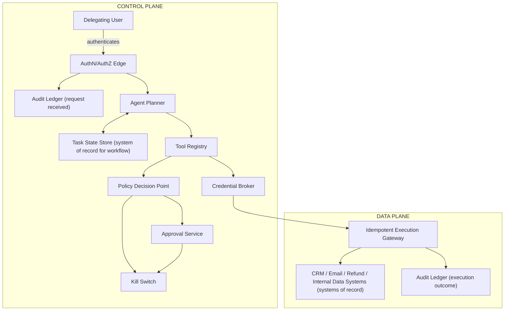
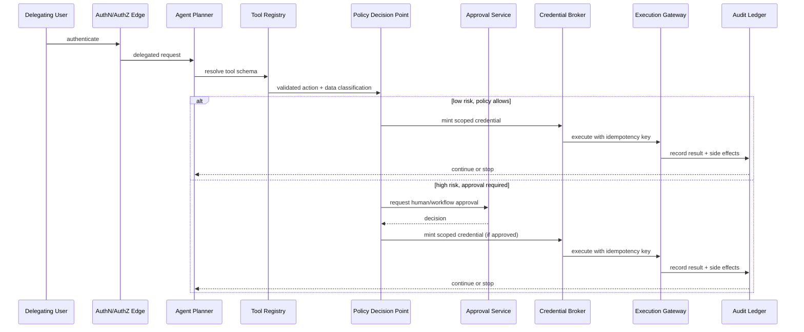
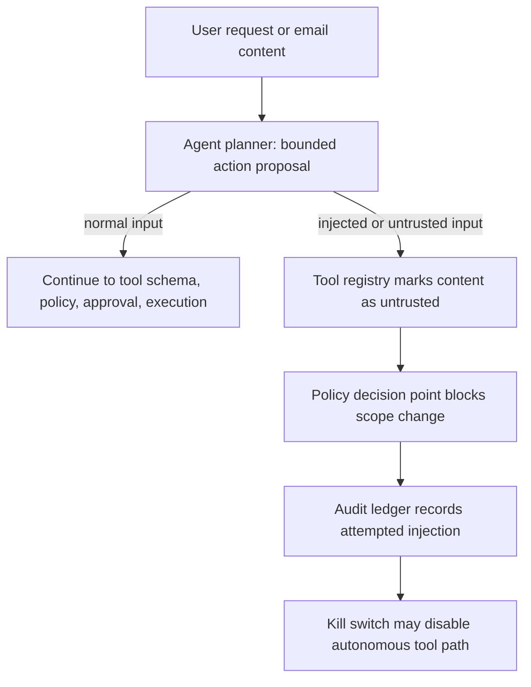

# Chapter 11: Design a Tool-Using AI Agent with Safety Controls

*Source: THE FORWARD DEPLOYED ENGINEER SYSTEM DESIGN INTERVIEW: 20 REAL-WORLD AI SYSTEM DESIGN INTERVIEWS, Chapter 11*

## 1. The Customer Problem and Discovery

**Key Points**
- The customer asks for a tool-using AI agent that can read email, query internal systems, update CRM records, and issue refunds — the feature list gets nods, but the disagreements start immediately (speed vs. hard approval gates vs. handling routine cases without friction vs. irreversible money movement fear).
- The right first move is to restate the problem without choosing technology: design a system that can interpret incoming work, decide when to call internal tools, and complete certain customer-support actions safely — with the model never holding unchecked authority.
- A weak framing is "build an AI assistant that can do refunds" (a feature). A stronger framing is "enable useful automation while deterministic controls govern identity, permissions, risk, and irreversible effects" (a testable outcome).
- The model can interpret and propose; deterministic systems must decide who may act, what may change, and whether an action can be reversed.
- Ask fewer, higher-leverage questions: what to automate first, source-of-truth systems, what makes an action safe to auto-execute, rollback path, audit evidence, and the definition of success.
- Discovery should produce a workflow definition, not just a feature list — the same requested feature can support very different workflows, and the workflow choice changes the architecture more than the model choice does.

### The customer problem, restated

At the first meeting, the customer says they want a tool-using AI agent that can read email, query internal systems, update CRM records, and issue refunds. Everyone nods at the feature list. Then the disagreements surface: the operations lead wants speed, the security lead wants hard approval gates, the support manager wants the agent to handle routine cases without human friction, and the finance owner is worried about irreversible money movement. That disagreement is the real design problem.

The right first move is to restate the prompt without choosing technology: design a system that can interpret incoming work, decide when to call internal tools, and complete certain customer-support actions safely. From there, map the stakeholders, because each one defines a different success condition. Business users are delegating tasks and want less manual work. Approvers decide when a risky action is allowed. Security teams care about identity, authorization, auditability, and tool abuse. Tool and data owners control the email system, CRM, customer database, payment or refund service, and any approval workflow the agent depends on. In the stakeholder map, the end user is the person whose queue or inbox the agent is meant to relieve; the operator is the team that monitors, retries, or escalates the automation; the security owner defines access and audit rules; and the executive sponsor funds the rollout and sets the business priority.

### Separate the feature from the business result

A weak framing is "build an AI assistant that can do refunds." That describes a feature, not an outcome. A stronger framing is: **enable useful automation while deterministic controls govern identity, permissions, risk, and irreversible effects.** That outcome is testable. It implies the agent should reduce manual handling time, but only within guardrails that preserve trust and accountability. It also makes clear that the model is not the authority. The model can interpret and propose; deterministic systems must decide who may act, what may change, and whether an action can be reversed.

This distinction matters in interview settings because the candidate who starts from features often overbuilds the model side and underbuilds the workflow side. The FDE who starts from the business result will ask: What tasks are actually repetitive? Which ones are high-volume but low-risk? Which ones require a human sign-off? Which actions are merely informative versus financially or operationally irreversible?

### Ask fewer, higher-leverage questions

You rarely have time for an exhaustive discovery session, so prioritize questions that collapse uncertainty quickly:

- What exact work should be automated first, and what should remain human-owned?
- Which systems are the source of truth for identity, customer state, and financial actions?
- What makes an action safe to execute automatically versus requiring approval?
- What is the rollback path if the agent makes a bad recommendation or a bad call?
- What evidence must be recorded for audit, support, and dispute resolution?
- What is the definition of success: fewer handling minutes, higher resolution rate, lower error rate, faster refunds, or improved customer satisfaction?

These questions are better than a long generic checklist because they reveal scope, assumptions, risks, owners, and measurable success at the same time. If the interviewer withholds information, say so explicitly: "I'll assume the CRM is the source of truth for customer context, refunds above a threshold require approval, and the agent can draft actions but cannot directly execute high-risk steps unless the policy engine allows it." That kind of assumption ledger is not a weakness; it is how an FDE keeps the design moving while surfacing what still needs validation.

### Define the workflow the customer actually wants

The same requested feature can support very different workflows. One customer may want the agent to triage inbound email and draft suggested responses. Another may want it to look up account details, create a CRM case, and prepare a refund for approval. A third may want a full closed loop for low-risk cases only. The workflow choice changes the architecture more than the model choice does.

A useful way to think about this is jobs-to-be-done. The business user is not buying "an agent"; they are trying to finish a support job faster, with fewer errors, and with less handoff friction. The approver is trying to keep risk bounded. Security is trying to prevent credential abuse, over-broad access, and prompt injection from becoming tool abuse. Tool owners are trying to ensure their systems are called in supported ways and that failures do not cascade.

### A compact opening answer the candidate can give

If asked to start cold, a strong two-minute answer sounds like this:

> "Let me restate the problem first. We need a tool-using agent that can read email, query internal systems, update CRM records, and sometimes trigger refunds, but the model itself should not have unchecked authority. So I'd frame the outcome as enabling useful automation while deterministic controls govern identity, permissions, risk, and irreversible effects. The main stakeholders are the business users who want faster handling, the approvers who authorize risky actions, the security team that owns access and audit controls, and the owners of the email, CRM, customer, and refund systems.
>
> I'd start by clarifying which tasks are allowed to be fully automated, which need review, and what makes a refund safe or unsafe to execute. My initial assumptions would be that low-risk read and draft actions can be automatic, higher-risk write actions need policy checks, and financial actions need explicit approval or strict thresholds. I'd then design the system around a policy layer, tool permissions, audit logs, and fallback paths, rather than letting the model directly control everything. Success would be measured by reduced handling time and higher completion rate without increasing unauthorized actions or unreviewed irreversible changes."

### What a weak answer sounds like, and how to fix it

Weak, feature-first restatement: "We need to build an AI chatbot that integrates with email and CRM and can refund customers."

Corrected, outcome-first restatement: "We need a controlled automation system for support and operations tasks that uses an AI model for interpretation while deterministic policy, identity, and approval layers govern data access and irreversible actions."

The corrected version does three things the weak version does not. It names the workflow, it identifies the control boundary, and it defines success in operational terms. That is the shift interviewers are listening for.

### Why this framing signals FDE readiness

In the market, FDEs are valued because they can turn ambiguous customer language into technical execution that produces measurable impact. This is not only a model-design skill; it is a customer-discovery skill. A strong FDE can walk into a meeting, hear "we want an agent," and quickly translate that into stakeholder roles, policy boundaries, assumptions, and an outcome metric the business can actually inspect. In other words: the architecture starts only after you can say whose workflow changes and how success will be measured.

A brief note on quantitative treatment: no equation is needed in this discovery section, and any sizing or capacity math should be handled in prose here or deferred to the later capacity section.

**Requirement coverage note:** this section establishes the problem framing, stakeholder map, outcome definition, and the discovery discipline that will drive the design in the next section.

## 2. Clarifying Questions, Requirements, and Constraints

**Key Points**
- The interviewer gives just enough to move forward and then stops helping: read email, query internal data, update CRM records, and issue refunds, but the model must not have unchecked authority. Treating that partial answer as a complete spec is the first design mistake; asking open-ended questions without converging on the controls that matter most is the second.
- A useful question is not the one that sounds thorough; it is the one that changes what you are allowed to build. Six high-leverage categories: actions/reversibility/financial limits, identity delegation and tool scopes, autonomy and approval expectations, malicious-content threat model, audit and legal requirements, and kill switch/incident response.
- Discovery converts into six must-have functional requirements: separate planning from execution, validate every proposed action, use scoped short-lived credentials, require approval for high-risk actions, make effects idempotent and auditable, and stop safely under uncertainty.
- Six hard constraints follow: no arbitrary command execution, bounded autonomous steps and spend, replayable decisions, and rapid global disable — the difference between a requirement and a preference is that constraints are lines you cannot cross while preferences are trade-offs you can defer.
- When the interviewer stays silent, protect the highest-risk constraint first (conservative human-in-the-loop gate for undefined approval, strict tenant isolation for unclear multi-tenant boundaries) rather than stalling until every edge case is answered.
- A requirement-to-component traceability table (10 rows) proves the design translates discovery into an implementation shape without pretending the hard parts are already solved.

### Start by forcing the hidden constraint into the open

The interviewer gives you just enough to move forward and then stops helping: the agent should read email, query internal data, update CRM records, and issue refunds, but it must not give the model unchecked authority. That partial answer is the point. In an FDE interview, the first design mistake is to treat that prompt as a complete spec. The second is to keep asking open-ended questions without converging on the controls that matter most. Your job is to extract the minimum set of clarifications that change the architecture, then proceed with explicit assumptions where the interviewer leaves gaps.

### Start with the questions that change risk

A useful question is not the one that sounds thorough; it is the one that changes what you are allowed to build.

- **Actions, reversibility, and financial limits.** Ask which actions are reversible, which are not, and where the money boundary lives. Reading email is low risk; issuing a refund is not. If the customer says refunds must be capped, delayed, or dual-approved above a threshold, the workflow changes immediately. You are no longer designing "an assistant with tools"; you are designing a control system with payment and escalation rules.
- **Identity delegation and tool scopes.** Ask whether the agent acts as the user, as a service account, or as a delegated actor with a narrow role. Tool scope determines blast radius. If the model can query everything a support agent can see, you have already widened the risk surface; if it can query only the fields needed for a case, you can contain both accidental leakage and prompt-injection damage.
- **Autonomy and approval expectations.** Ask what the agent may do on its own, what requires human review, and what must never happen automatically. "Autonomous" is not a single switch. In practice, it is a matrix of action classes, thresholds, and exception paths.
- **Malicious-content threat model.** Ask whether the email content itself is untrusted input. In this scenario, it is. That means the agent must assume a customer message could contain instructions to override policy, exfiltrate data, or trigger a tool call the user never intended. Treat untrusted content as an attack surface, not a conversational hint.
- **Audit and legal requirements.** Ask what must be logged, retained, reviewable, or exportable. Some organizations need action histories, approval records, and rationale trails; others only need operational debugging. You do not need to over-specify the jurisdictional details in the interview, but you do need to show that auditability and retention are first-class design inputs, not afterthoughts.
- **Kill switch and incident response.** Ask how the system is disabled when something goes wrong. A good design has a rapid global disable path for the agent, the tools, or both, plus a clear incident response path for containment, review, and recovery. The interviewer wants to hear that you can stop the system before you can perfect it.

That question set is not random. It maps directly to the highest-risk dimensions of the workflow: who is acting, on what data, with what authority, under what oversight, and how quickly the system can be contained if it misbehaves.

### Convert discovery into requirements, not feature wish lists

Once you have those answers, turn them into a requirement stack. A strong FDE distinguishes among **functional requirements** — what the system must do — **nonfunctional requirements** — how well and how safely it must do it — and **constraints** — what the system must not do or must always respect. That distinction keeps the design from drifting into a feature dump.

A practical way to prioritize is must/should/could:

- **Must:** the system cannot ship without it because it protects the core outcome or a critical safety boundary.
- **Should:** the system strongly benefits from it, but the first version could work without it if the risk is contained elsewhere.
- **Could:** the system may include it later if time allows, but it should not expand the MVP scope.

For this agent, the must-have functional requirements are straightforward but strict:

1. **Separate planning from execution.** The model can propose a plan, but a separate control layer decides whether any tool call is allowed. This prevents the language model from becoming both the thinker and the actor.
2. **Validate tool name, arguments, identity, and policy.** Every proposed action must be checked against an allowlist, parameter schema, caller identity, and policy rules before execution.
3. **Use scoped, short-lived credentials.** The agent should never hold broad, long-lived secrets. It should receive the minimum credentials needed for the next approved step, then discard them.
4. **Require approval for high-risk actions.** Refunds, account changes, and any irreversible external write should cross a human approval boundary unless the customer explicitly accepts a narrower automated threshold.
5. **Make effects idempotent and auditable.** A retried action must not double-refund, double-update, or corrupt state. Each significant decision should leave a trace that can be replayed and explained.
6. **Stop safely under uncertainty.** If the model confidence is poor, the tool response is malformed, the policy is unclear, or the environment looks inconsistent, the correct behavior is to pause, escalate, or fail closed — not improvise.

Those are the requirements you build the system around. Everything else is secondary.

### Constraints: the lines you cannot cross

Now convert the quality goals into measurable constraints:

- **No arbitrary command execution.** The agent must not be able to run shell commands, arbitrary scripts, or free-form code paths in production. If there is any execution substrate, it must be constrained to preapproved interfaces.
- **Bounded autonomous steps and spend.** The agent should have a cap on how many tool calls, retries, or dollars of action it can consume without human review. This prevents runaway loops and surprise operational cost.
- **Replayable decisions.** The system should preserve the inputs, policy decisions, tool proposals, approvals, and outcomes needed to reconstruct why an action happened.
- **Rapid global disable.** Operators must be able to deactivate the agent or a particular tool category quickly without waiting for a full deployment cycle.

Notice the difference between a requirement and a preference. "Nice to have better UX" is a preference. "No arbitrary command execution" is a constraint. "We'd like more automation later" is a preference. "Refunds above a threshold require approval" is a policy requirement. In interview language, constraints are the lines you cannot cross; preferences are the trade-offs you can defer.

### What the interviewer did not tell you is part of the design

The interviewer answering only half the questions is not a problem; it is the evaluation. You should explicitly name the assumptions you are making and rank them by risk. For example: if the approval process is undefined, assume a conservative human-in-the-loop gate for all irreversible actions. If audit retention is unspecified, assume the system stores enough to reconstruct actions for operational review, while leaving exact retention to customer policy. If multi-tenant data separation is unclear, assume strict tenant isolation and separate authorization checks at every tool boundary.

That approach protects the highest-risk constraint first. It also signals that you can deliver under ambiguity instead of stalling until every edge case is answered.

### A concise interview question tree

Here is a compact way to steer the conversation without losing momentum:

1. **Which actions are allowed, and which are irreversible?**
   - If refunds are included: what thresholds or approval steps apply?
2. **Whose identity does the agent use?**
   - User-delegated, service-owned, or hybrid?
3. **What data can each tool access?**
   - Full record, filtered fields, or case-specific slices only?
4. **What can the agent do without approval?**
   - Read-only actions? Draft changes? Low-value updates?
5. **What are the known abuse cases?**
   - Prompt injection, malicious attachments, poisoned email content, insider misuse?
6. **What are the audit and disable requirements?**
   - Who needs logs, how long to keep them, and how quickly must the system be stoppable?

That tree is short on purpose. You are not trying to exhaust every possibility. You are trying to identify the few answers that determine whether the architecture is safe.

### MVP boundaries that prevent solution sprawl

A disciplined MVP for this agent should include only the smallest set of capabilities that still solve the customer problem safely:

- The model may draft a recommended action.
- A control layer validates the tool name, arguments, identity, and policy.
- Only a small set of tools is exposed.
- Short-lived credentials are issued per approved action.
- High-risk operations require explicit approval.
- Every action is logged in a replayable way.

And the MVP should explicitly **not** include:

- Free-form code execution or shell access.
- Open-ended tool discovery.
- Unbounded autonomous loops.
- Automatic refunds without approval thresholds.
- Cross-tenant data access.
- Self-modifying policy logic.

That non-goals list matters because it keeps the system from collapsing into a generic "agent platform." In the interview, solution sprawl is a warning sign. The strongest candidates draw a narrower system boundary than the prompt suggests, because they know that controllable scope is what makes production adoption possible.

### Requirement-to-component traceability

A simple traceability table helps you defend the design and avoid hand-wavy architecture.

| Requirement | Control point | Example component |
|---|---|---|
| Separate planning from execution | Plan/execute boundary | Orchestrator that emits candidate actions but cannot perform them directly |
| Validate tool name, arguments, identity, policy | Policy gate | Authorization service with schema validation and allowlists |
| Use scoped short-lived credentials | Secret broker | Token minting layer with time-limited, least-privilege credentials |
| Require approval for high-risk actions | Human approval flow | Review queue with explicit accept/reject and reason capture |
| Idempotent, auditable effects | Action ledger | Durable event log and idempotency keys |
| Stop safely under uncertainty | Fail-closed controller | Error handler that pauses execution and alerts operators |
| No arbitrary command execution | Execution sandbox | Restricted tool adapters only, no shell escape |
| Bounded autonomous steps and spend | Budget governor | Step counter, retry cap, and spend threshold |
| Replayable decisions | Decision record | Versioned prompts, policies, tool proposals, and outcomes |
| Rapid global disable | Kill switch | Central feature flag or routing gate that can stop all agent actions |

This is the level of specificity interviewers want. It shows you can translate discovery into an implementation shape without pretending the hard parts are already solved.

### Why this is strong FDE behavior

The job-market signal here is not just that you can name tools or patterns. It is that you can protect delivery under ambiguity. An FDE is expected to convert vague customer language into a bounded system, preserve the business objective, and keep the riskiest failure modes under deterministic control. That means asking questions that change the design, not questions that merely fill time.

A strong candidate does exactly that: they clarify the actions, identities, approvals, and abuse cases; they separate must-haves from nice-to-haves; they state explicit assumptions where the interviewer is silent; and they move forward with a scope that is safe enough to build.

## 3. Scale Estimates, SLOs, and Capacity

**Key Points**
- The first pass at this design almost always looks reasonable on a whiteboard, but average load is the wrong lens — the real question is whether the system still behaves well when the queue spikes, the model slows down, a downstream CRM gets flaky, or a refund request lands near a policy deadline.
- Use the concrete scenario as a planning anchor — 50,000 users, 10 actions per task, 20 QPS peak — but recognize that "one request" is not one unit of work: it fans out into planning, several reads, a write, an approval check, and a final effect.
- Separate three layers of load (user/task arrival rate, internal action rate, state mutation rate) and budget model-planning latency separately from tool latency — they fail independently and mixing them obscures which part is actually failing.
- Derive a risk tier before you decide autonomy: Risk = Impact × Likelihood × Irreversibility — a decision aid, not literal arithmetic — that determines whether an action is fully autonomous, autonomous with preconditions, require-human-approval, or blocked entirely.
- Concurrency limits (per-user, per-tool, per-global) are a safety feature, not just a performance setting — a well-designed limit can prevent a prompt injection from becoming a cascade of unauthorized operations.
- Unit economics should influence partitioning: the ratio of model time to tool time, plus the irreversibility of tool effects, is the estimate that most affects component selection.
- A sensitivity table (baseline, 10x growth, 10x lower) tests whether the design survives adoption rather than only surviving the pilot — say the numbers are illustrative and show the direction, not false precision.

### Start with the workload shape, not the endpoint count

The first pass at this design almost always looks reasonable on a whiteboard: a single agent service takes an email, plans a sequence of tool calls, reads internal data, updates CRM records, and submits refunds when policy allows. At average traffic, that shape can appear efficient and simple. The catch is that average load is the wrong lens. The real question is whether the system still behaves well when the queue spikes, the model slows down, a downstream CRM gets flaky, or a refund request lands near a policy deadline.

A strong interview answer shows that you notice the mismatch early and correct it with back-of-the-envelope math instead of architectural optimism.

Use the concrete scenario as a planning anchor: assume 50,000 users, 10 actions per task, and 20 QPS peak. That does not mean 50,000 users all arrive at once. It means the workflow must be sized around the cadence at which real customers submit tasks, and that each task can fan out into multiple internal actions. In this problem, "one request" is not one unit of work. It may be a decision, followed by several reads, then a write, then an approval check, then a final effect.

That distinction changes everything:

- **Average load** tells you what the system usually costs.
- **Peak load** tells you whether customers experience timeouts, queue blowups, or forced fallbacks.
- **Growth factor** tells you whether the design survives adoption rather than only surviving the pilot.
- **Headroom** tells you whether a small miss in estimation becomes a production incident.

For a system like this, I would separate three layers of load:

1. **User/task arrival rate:** how often tasks enter the agent.
2. **Internal action rate:** how many tool calls, model calls, and policy checks each task triggers.
3. **State mutation rate:** how many actions can actually change records, money, or permissions.

If peak is 20 QPS at the task level and each task averages 10 actions, the internal action envelope is much larger than the user-facing request rate. Even if some actions are read-only, they still consume model time, tool latency, retry budget, and queue capacity. That is why FDEs should never size solely by "requests per second" without asking what a request contains.

### Budget model planning latency separately from tool latency

This is one of the most important capacity moves in an agent system. The end-to-end response time is not one latency budget; it is at least two:

- **Model planning latency:** time spent deciding what to do, whether to call a tool, and what to do next.
- **Tool latency:** time spent waiting on email, CRM, data warehouse, refund service, policy engine, or approval queue.

If you lump them together, you obscure which part is actually failing. If the planner is slow, adding more replicas to the tool adapters does not help. If the CRM is slow, a faster model does not fix the customer experience. The interview-level insight is to assign a budget to each stage and then decide where synchronous waiting is worth it.

A practical split looks like this:

- Planning: short, bounded, and usually the least predictable because it depends on prompt size, tool selection, and retry behavior.
- Tooling: often slower but more measurable, because each integration has its own p50/p95 behavior.
- Human approval: intentionally slower, but it should be visible and bounded by queue policy and escalation rules.

The customer workflow should drive the split. If the user is waiting for an answer before they can reply to an email, latency matters differently than if the agent is precomputing a case summary in the background. Tie the SLO to the workflow, not to abstract infrastructure vanity metrics.

### Derive a risk tier before you decide autonomy

For this chapter, the most useful estimate is not CPU or memory. It is risk. A simple model helps map agent behavior to approvals and autonomy levels:

$$Risk = Impact \times Likelihood \times Irreversibility$$

Interpretation matters more than arithmetic precision. This is not a claim that risk is literally measurable on a universal numeric scale. It is a decision aid.

- **Impact:** how bad the wrong action would be.
- **Likelihood:** how often the failure mode is plausibly triggered.
- **Irreversibility:** how hard it is to undo the effect.

A low-impact read of a public FAQ may be acceptable with broad autonomy. A high-impact refund may be reversible in theory, but if it creates customer dissatisfaction, accounting noise, or policy abuse, its irreversibility is still meaningful. A CRM update can be partially reversible, yet still costly if it routes a customer incorrectly.

That formula helps you decide whether an action is:

- fully autonomous,
- autonomous with preconditions,
- require-human-approval,
- or blocked entirely.

In interview terms, the best candidates do not argue that "the model is smart enough." They show how a simple risk model determines where the system may act on its own and where deterministic controls must intervene.

### What to measure: the indicators that matter here

This system needs a narrower but sharper set of indicators than a generic microservice. At minimum, define:

- **Availability:** whether the agent service, approval path, and tool adapters are reachable when tasks arrive.
- **Latency:** end-to-end task completion time, plus separate planning and tool latencies.
- **Freshness:** how current the internal data is when the agent reads it.
- **Quality:** task success rate, correct tool selection rate, approval accuracy, and policy compliance rate.
- **Security:** unauthorized tool-call attempts blocked, privilege boundaries preserved, and audit records produced.
- **Cost:** model spend, tool-call volume, retry cost, and human-review cost.

To make the SLO discussion concrete, distinguish **SLIs** from **SLOs** explicitly:

- An **SLI** is the measured indicator, such as median completion latency, p95 approval queue wait, or policy-block rate.
- An **SLO** is the target you set for that indicator, such as "p95 completion latency under 15 seconds for low-risk tasks" or "99.5% of approval requests leave the queue within 2 minutes."

For an FDE interview, these indicators should always connect to the customer workflow. If the customer cares about refunds, then a latency SLO alone is insufficient. A refund that is fast but wrong is worse than a slightly slower one that is correct and auditable. If the customer cares about email triage, freshness may matter less than consistency and throughput. If the customer is in a regulated workflow, security and auditability can outrank raw speed.

A practical way to present the SLI/SLO mapping is:

- SLI: completion latency → SLO: p95 under the customer's reply deadline.
- SLI: approval queue time → SLO: no more than a small percentage of requests waiting beyond the escalation threshold.
- SLI: policy-block rate → SLO: all unauthorized high-risk actions blocked, with alerting on any attempted bypass.
- SLI: freshness of internal data → SLO: reads must reflect data no older than the business tolerance for the workflow.

That language keeps the system grounded in the work the customer is actually trying to finish.

### A capacity sketch with the given numbers

Use the illustrative assumptions to show your reasoning, not to pretend exactness.

- 50,000 users
- 10 actions per task
- 20 QPS peak

At peak, the service is not handling 20 simple requests per second; it is handling 20 tasks per second, each of which may trigger a burst of decisions and tool calls. If one task averages 10 actions, the system may need to tolerate roughly 200 internal action steps per second at the logical-workflow level, before retries and approvals are counted. The actual infrastructure footprint will vary depending on how many steps are read-only, how many are batched, and how many are deferred.

It helps to turn that into a few back-of-the-envelope envelopes.

**1) Model-call volume.** If the planner is invoked once per task, then 20 QPS peak at the task level means 20 planning decisions per second. If each task requires iterative planning across several turns, that can easily become 40–60 model calls per second during bursts. If each call is modest in token size but high in latency sensitivity, the planner becomes a queueing problem long before it becomes a raw throughput problem. This is why the planner and tool adapters should be sized separately.

**2) Tool-call volume.** If 10 actions per task translate into a mix of reads, writes, and policy checks, the system may be coordinating around 200 tool actions per second at peak. Some of those will be cached or batched, but the design should assume the worst-case composition when setting concurrency caps. Reads can often be parallelized; writes and approvals usually cannot.

**3) Audit and decision storage.** If every task produces an audit record, plus a planning trace, plus tool-call metadata, the durable storage rate becomes a first-class estimate rather than an afterthought. For example, if each task writes a compact decision record of roughly 5 KB and a fuller audit trail of around 20 KB, then at 20 tasks per second the system produces roughly 100 KB/s to 400 KB/s of new retained data, before indexing, replication, and backups. That is about 8.6 GB to 34.6 GB per day of raw append-only data if it is kept continuously, and more once you include database overhead and copies for safety. Even if retention or sampling cuts that down, the point is that storage is not negligible in a workflow with every action logged.

**4) Compute envelope.** If each task requires a short model planning pass and several tool validations, the compute question is not only "how many servers?" but "how much synchronous work can we afford while the user is waiting?" If the average task consumes one second of planner time spread across concurrency and retries, 20 QPS implies about 20 core-seconds of planner work per second at peak, before overhead. That does not mean 20 dedicated CPU cores are sufficient in practice, because latency spikes, network hops, and tokenization overhead add slack requirements. It does mean you can reason about the planner as a throughput-constrained service and not just as an API call.

This is where average versus peak becomes concrete:

- At **average load**, you may be able to serialize more work, batch more reads, and tolerate longer queues.
- At **peak load**, you need enough concurrency to keep queues from backing up behind the planner, the policy engine, or the approval queue.
- With **growth**, the same architecture may stop being safe if concurrency is not explicitly capped.

A useful interview move is to state: "I would not optimize for the average path until I know what the peak path does to tail latency and human-review latency." That shows pragmatic prioritization.

### Concurrency limits are a safety feature, not just a performance setting

For this system, set limits at three levels:

- **Per-user concurrency:** prevents a single user from flooding the system with parallel tasks.
- **Per-tool concurrency:** prevents a noisy downstream system, such as CRM or refunds, from being overwhelmed.
- **Global concurrency:** prevents the agent platform from overcommitting itself during spikes.

These limits should also encode **value limits**. For example, you may allow a user to trigger many low-risk read actions but restrict the number or value of refunds that can be pending or in flight. A refund limit is not just financial control; it is an operational guardrail that keeps error bursts from becoming accounting incidents.

In an interview, say plainly that concurrency is part of the safety model. That is especially important here because the agent can take actions with real side effects. A well-designed limit can prevent a prompt injection from becoming a cascade of unauthorized operations.

### Unit economics should influence partitioning

This is where the system design becomes more than correctness. Each major step consumes something expensive:

- model tokens for planning and summarization,
- tool calls to internal systems,
- storage for audit trails and decision records,
- human minutes for escalations,
- and retry overhead when dependencies fail.

If planning is expensive relative to tool latency, you may batch multiple reads into one planning pass. If tool calls dominate, you may cache safe reads, prefetch context, or split the workflow so that the model does not re-query the same data repeatedly. If refunds require approval and human time is expensive, you may tighten the threshold so only high-value or ambiguous cases reach a person.

A quick cost sketch makes the trade-off more tangible. Suppose the planner produces one short call per task, and each task averages 10 actions. Then the cost driver is not merely the number of user tasks, but the number of internal steps that are tokenized, checked, and logged. If adding a second planning pass cuts tool calls in half, it may be worth it when tool latency is high but not when model spend dominates. If an audit log is required for every irreversible operation, storage cost may be a small price for observability, but only if the retention policy is explicit. These are the kinds of decisions that turn a vague "agent" into an operable system.

This is the estimate that most affects component selection and partitioning: **the ratio of model time to tool time, plus the irreversibility of tool effects.** If planning is fast but tools are slow, invest in async orchestration, caching, and queueing. If tool effects are high risk, invest in policy checks, staged execution, and audit logging even if that adds latency. If human review is the bottleneck, design clearer escalation rules and fewer ambiguous cases.

### Show the sensitivity range, not false precision

A candidate should be comfortable saying: "These are illustrative numbers, and I care more about the direction than the decimal place." That is not evasive; it is disciplined engineering.

A simple sensitivity table makes this explicit:

| Scenario | Task peak | Internal action pressure | Likely design implication |
|---|---|---|---|
| Baseline | 20 QPS | Moderate | Single queue, bounded retries, tight approval gate |
| 10x growth | 200 QPS | High | Partition by tenant or workflow class, add backpressure, move more work async |
| 10x lower | 2 QPS | Low | Simpler deployment may work, but keep safety controls identical |

The 10x growth case is the real test. If traffic or task complexity grows by an order of magnitude, which part breaks first: the model planner, the approval queue, the tool adapter, the audit log, or the refund service? If you cannot answer that, you have not really estimated the system.

### How to speak about uncertainty in the interview

The best phrasing is specific and calm:

- "I'm treating 50,000 users, 10 actions per task, and 20 QPS peak as illustrative planning inputs."
- "I'd validate these against actual customer workload before finalizing instance counts."
- "The biggest sensitivity is not the average request rate; it is the combination of peak concurrency and irreversible actions."
- "If the workflow is refund-heavy, I would bias toward stricter approval thresholds and lower autonomous concurrency."

That language earns trust because it tells the interviewer you can design under uncertainty without pretending certainty exists.

### What the interviewer is really testing

This section is less about arithmetic than judgment. The job-market signal is whether you can make pragmatic capacity decisions without overengineering. Many candidates can talk about agents. Fewer can say how many concurrent actions should be allowed, which latency budgets are separable, what the risky actions are, and which estimate drives the architecture.

A solid answer ends with a defensible principle: estimates are decision tools. Every number should justify an architectural choice or an operational limit. If a number does not change the design, it is decoration. If it does change the design, it belongs on the whiteboard.

That discipline is exactly what an FDE needs: enough math to protect the customer, enough humility to acknowledge uncertainty, and enough structure to turn vague requirements into a system that can survive peak load, growth, and irreversible mistakes.

## 4. Architecture and End-to-End Flow

**Key Points**
- The point of the architecture is not to make the agent feel impressive — it is to make the system safe to operate when a model is allowed to read email, look up internal context, update CRM records, and propose or execute refunds.
- Separate two concerns from the start: the control plane (decides what the agent is allowed to do, under what conditions, and with which approvals) and the data plane (performs the bounded business work once those decisions have been made).
- Nine components in dependency order: Agent Planner, Task State Store, Tool Registry, Policy Decision Point, Credential Broker, Approval Service, Idempotent Execution Gateway, Audit Ledger, Kill Switch.
- Three trust boundaries: the user boundary ends at authentication; the planner boundary ends at proposing intent, not action; the execution boundary ends at a scoped, logged side effect in a downstream system of record.
- The happy path is 8 numbered steps: authenticate → plan bounded next action → resolve tool schema → validate arguments and data classification → evaluate policy and risk → obtain approval if required → execute with scoped credential and idempotency key → record result and decide whether to continue.
- The prompt-injection failure-path overlay is the key failure drill: normal input continues to tool schema/policy/approval/execution, but injected or untrusted input is marked untrusted by the tool registry, blocked at the policy decision point, recorded in the audit ledger, and can trigger the kill switch if the attack pattern repeats.
- A 4-column component responsibility table (component, primary responsibility, trust boundary, notes) reinforces which component owns which promise.

### From estimate to architecture

The point of the architecture is not to make the agent feel impressive. It is to make the system safe to operate when a model is allowed to read email, look up internal context, update CRM records, and propose or execute refunds. The design should therefore separate two concerns from the start:

- the **control plane**, which decides what the agent is allowed to do, under what conditions, and with which approvals;
- the **data plane**, which performs the bounded business work once those decisions have been made.

That split is the quickest way to keep the interview grounded. The model may plan. It may summarize. It may recommend. But deterministic services own identity, permissions, execution, and irreversible side effects.

### Top-down component map

A useful architecture starts in dependency order, not box-drawing order:

1. **Agent planner** — turns a user request into the next bounded action, not an open-ended multi-step spree.
2. **Task state store** — persists what has already been learned, attempted, approved, or completed.
3. **Tool registry** — defines the allowed tools, their schemas, data classifications, and risk labels.
4. **Policy decision point** — evaluates whether a proposed action is allowed, needs review, or must be blocked.
5. **Credential broker** — mints scoped credentials only for the approved tool and only for the minimum needed duration.
6. **Approval service** — captures human or workflow approval for risky or irreversible actions.
7. **Idempotent execution gateway** — sends the request to the downstream system exactly once from the perspective of the workflow, even if retries happen.
8. **Audit ledger** — records who requested what, what the agent proposed, what was approved, what ran, and what changed.
9. **Kill switch** — disables autonomous action paths when behavior, load, or policy drift exceeds tolerance.

Each component exists because it answers a specific requirement: bounded reasoning, state retention, authorization, traceability, or safe shutdown. If a box does not map to a requirement, remove it.

### Architecture diagram: component and trust-boundary view

The high-level component layout includes the control-plane/data-plane split and the main trust boundaries.



If you prefer the same architecture in words, the flow is:

Delegating User → AuthN/AuthZ Edge → Agent Planner ↔ Task State Store (system of record for workflow state) → Tool Registry → Policy Decision Point ↔ Approval Service → Kill Switch → Credential Broker → Idempotent Execution Gateway → CRM / Email / Refund / Internal Data Systems → Audit Ledger

Trust boundaries matter more than visual polish. The user boundary ends at authentication. The planner boundary ends at proposing intent, not action. The policy boundary ends at allow/deny/approve. The execution boundary ends at a scoped, logged side effect in a downstream system of record.

Mark the systems of record explicitly: the CRM owns customer attributes and refund history; the email system owns message transport and inbox state; the internal data source owns authoritative account or entitlement data; the task state store owns workflow progress but not business truth. Caches may sit beside the planner or tool registry for low-risk lookups, but they should never become the source of truth for permissions or refunds.

### Happy path: one request, end to end

A representative request is: "Read the customer's email, check whether the account qualifies for a refund, update the CRM note, and issue the refund if policy allows."

### Numbered sequence diagram: happy path

1. **Authenticate delegating user.** The front door verifies who is asking and what delegation rights they have. A support agent is not the same as a finance approver.
2. **Plan bounded next action.** The planner selects the next smallest step, such as "retrieve the latest email thread," rather than attempting the full workflow at once.
3. **Resolve tool schema.** The tool registry returns the exact contract for the email fetch or CRM lookup action, including field names and data sensitivity labels.
4. **Validate arguments and data classification.** Input is checked for shape, missing fields, dangerous content, and whether the request contains regulated or highly sensitive data that changes handling.
5. **Evaluate policy and risk.** The policy decision point compares the action, user role, data class, and downstream effect against the current policy. A low-risk note update may pass; a refund may require approval.
6. **Obtain approval if required.** The approval service captures a human decision or a routed workflow approval for the irreversible step.
7. **Execute with scoped credential and idempotency key.** The credential broker issues a narrow token for that tool only. The execution gateway attaches an idempotency key so retries do not duplicate the refund.
8. **Record result and decide whether to continue.** The audit ledger stores the input, policy result, approval outcome, tool result, and any side effects. The planner then chooses the next bounded action or stops.



That sequence is the backbone of the answer. In the interview, narrate it in order without skipping the handoffs. The interviewer should be able to hear where control moves from the model to deterministic services and back again.

### Failure-path overlay: prompt injection and tool abuse

The important failure drill is not a generic outage; it is a malicious or malformed request that tries to smuggle unauthorized instructions through email or another untrusted source. The failure path should alter the happy path at the policy and approval layers:

- the planner still extracts a bounded action,
- but the tool registry flags that the email content is untrusted input,
- the policy decision point rejects any instruction that attempts to modify scope,
- the approval service is never reached for a blocked action,
- the audit ledger records the attempted injection,
- the kill switch can disable the autonomous tool path if the attack pattern repeats.

In diagram form, the overlay is straightforward:



This is where the distinction between the control plane and data plane becomes concrete. The model may read adversarial content in the data plane. It must not let that content rewrite policy in the control plane.

### Synchrony, queues, and backpressure

Not every boundary should be synchronous.

- The user-facing request to plan the next action is usually synchronous because the human expects a fast answer.
- Policy evaluation is typically synchronous because it is a gating decision.
- Tool execution against CRM, email, or refund systems may be synchronous for a single low-latency action, but bulk or slow steps should move through queues.
- Audit writes can often be asynchronous as long as the system preserves durability and does not let the log fall behind the point where a failure becomes unrecoverable.

Use queues when work can be retried safely or when the downstream system needs smoothing. Use backpressure when risk rises faster than capacity: if approval reviewers are saturated, the system should slow autonomous execution instead of letting risky actions accumulate.

The partitioning key should usually group by workflow or customer/account so that related actions preserve ordering where needed. For example, all actions for one account may share a key to avoid issuing two conflicting refunds in parallel. The key should be chosen to match the consistency point that matters most to the customer outcome.

### MVP versus later evolution

For an interview, say what you would ship first.

**MVP:**

- one agent planner,
- one task state store,
- a small tool registry,
- central policy checks,
- scoped credentials,
- explicit approvals for risky actions,
- idempotent execution,
- audit logging,
- a hard kill switch.

**Later evolution:**

- richer policy expression,
- adaptive risk scoring,
- queued multi-step orchestration,
- finer-grained partitioning,
- replay tooling,
- operator dashboards,
- automated anomaly detection on action patterns,
- per-tenant or per-department policy overlays.

That progression shows judgment. You are not pretending the first version solves every workflow; you are building a safe core that can expand.

### Component responsibility table

| Component | Primary responsibility | Trust boundary | Notes |
|---|---|---|---|
| Agent planner | Propose the next bounded action | Model to control plane | Must not execute directly |
| Task state store | Track workflow progress and intermediate results | Durable workflow state | Not business source of truth |
| Tool registry | Declare allowed tools and schemas | Approved tool catalog | Include data class metadata |
| Policy decision point | Allow, block, or require approval | Authorization and risk gate | Deterministic, auditable |
| Credential broker | Issue scoped credentials | Identity and secret boundary | Least privilege, short-lived |
| Approval service | Capture human or delegated approval | Human-in-the-loop control | Needed for irreversible actions |
| Idempotent execution gateway | Prevent duplicate side effects | Execution safety boundary | Critical for retries |
| Audit ledger | Record intent, decision, approval, and outcome | Immutable trace layer | Must be tamper-evident in practice |
| Kill switch | Halt autonomous execution paths | Operational safety boundary | Tested before launch |

### What to say in the interview

The job-market signal here is not whether you can name agent components. It is whether you can decompose the system and explain the same architecture to both a customer leader and an engineering reviewer. The customer wants to hear that refunds are gated, logged, and reversible where possible. The engineer wants to hear that execution is idempotent, credentials are scoped, and policy is enforced before side effects.

The strongest closing line is simple: this diagram is only useful if I can narrate data, identity, state, and failure through it. If I cannot walk from the user request to the downstream effect, and then repeat the same path under prompt injection or dependency failure, I do not yet understand the system well enough to own it in production.

## 5. Data Model, APIs, and Working Code

**Key Points**
- Turn the architecture into state, not slogans: the smallest useful state model is not "a chat session" — it is a set of durable objects that make every consequential decision explicit.
- Five core records: AgentTask (unit of work, with a bounded lifecycle and step budget), ToolDefinition (versioned catalog entry with schema/scopes/risk), ActionProposal (the model's recommendation, never the side effect itself, frozen by args_hash), PolicyDecision (the deterministic gate outcome), and ActionReceipt (proof a tool call happened once, keyed by an idempotency_key).
- Four API contracts make responsibility visible: POST /v1/agent-tasks (create task), POST /v1/actions/{id}/approve (approve a specific proposal, version-checked), POST /v1/tools/{name}/execute (the privileged execution gateway, idempotency-key aware), and POST /v1/admin/kill-switch (the emergency brake — versioned and auditable, never a vague flag).
- Error semantics are boring and consistent: validation failures are 4xx; policy denials are explicit and non-retryable unless input changes; downstream tool outages are retryable only when the idempotency key protects against duplicate side effects.
- The smallest safe code path is `execute_proposal()`: it validates the tool schema, evaluates policy (raising on deny, returning early on needs-approval), checks for an existing receipt under the idempotency key (replay instead of re-executing), mints a scoped credential, executes, and stores the receipt.
- A contract test proves the happy path returns a receipt with an idempotency key; a failure-injection test proves malformed input is rejected by typed validation before the executor is ever invoked — the boundary truly prevents unsafe tool calls from getting through.
- The omitted production concerns (structured logging, metrics, deadlines, circuit breaking, replay handling, multi-tenant isolation) are named explicitly rather than pretended away.

### Turn the architecture into state, not slogans

At interview depth, the design becomes credible when you can point to the records that hold authority, memory, and safety. For this agent, the smallest useful state model is not "a chat session"; it is a set of durable objects that make every consequential decision explicit.

**AgentTask** is the unit of work. It needs an `id` so every request can be traced and retried safely, an `owner` so the system knows which human or service sponsor is accountable, a `goal` that captures the customer intent in plain language, a `state` that advances through a finite lifecycle, and a `step_budget` that prevents the model from wandering indefinitely through tool calls. In practice, the lifecycle should be boring: `queued -> running -> awaiting_approval -> completed`, with terminal failure states for policy denial, validation failure, or upstream outage. Retention should be tied to customer policy and audit needs, not model convenience; keep only as much task history as is necessary for support, replay, and compliance review.

**ToolDefinition** is the catalog entry that makes tool use governable. The primary key is the `name`, but the real control surface is the tuple of `schema`, `scopes`, and `risk`. The schema defines what arguments are even admissible. The scopes define what identity the tool may exercise. The risk rating tells policy whether the action is low-friction, needs human approval, or is disallowed in autonomous mode. Retain this record as versioned configuration: when the schema or scope set changes, the old definition must remain identifiable so older tasks can be interpreted against the correct contract.

**ActionProposal** is the model's recommendation, not the side effect itself. Its `id` should be unique and traceable, `task_id` links it back to the task, `args_hash` freezes the exact validated argument shape that was reviewed, and `policy_decision` records the deterministic outcome of the safety gate. This object is the seam where language-model uncertainty stops and business rules begin. It should be retained long enough to audit why an action was approved, denied, or escalated.

**PolicyDecision** captures whether a proposal was allowed to proceed, needs approval, or was denied, along with the scopes it was granted and a reason string for the decision.

**ActionReceipt** is the proof that a tool call happened, once. Its `idempotency_key` prevents duplicate side effects when retries occur, `external_ref` points to the downstream system's own identifier, and `result` captures the returned status in a form suitable for later reconciliation. If a refund, CRM update, or internal lookup can be repeated, delayed, or partially applied, the receipt is what lets the system answer: did we already do this, and with what outcome?

That separation of records gives you a strong interview story: data ownership lives with the task and catalog; authority lives with policy and scoped credentials; execution lives with receipts; and model output never becomes action until it survives typed validation and policy review.

### Contracts that make the control plane legible

The API surface should match the safety boundaries. You do not want a single "do_agent_thing" endpoint that hides the hard parts. You want a small set of explicit contracts that make responsibility visible.

**POST /v1/agent-tasks** creates a task. The request body should include the caller identity or service account context, a goal, a bounded step budget, and any customer or workspace identifiers needed for authorization. The response should return the created task id, its initial state, and a version token. Authentication should be required; unauthenticated task creation is rarely appropriate because the system is already being given authority to act on behalf of someone.

**POST /v1/actions/{id}/approve** records human or delegated approval for a specific proposal. The path parameter names the proposal, not the task, because approval is attached to the exact proposed action. The request should include the approver identity, approval scope, and an optional comment or ticket reference. A correct implementation should reject stale approvals if the proposal version changed, and it should reject approvals for already-executed or superseded proposals. This endpoint is where optimistic concurrency matters most: the approval is only valid for the proposal version it reviewed.

**POST /v1/tools/{name}/execute** is the lowest-level execution gateway. It should not accept arbitrary text from the model; it should accept validated, typed arguments, an execution credential issued by a broker, and an idempotency key. Authentication should be service-to-service, because the gateway is a privileged boundary. If the same request arrives twice with the same idempotency key, the gateway should return the original receipt instead of replaying the side effect.

**POST /v1/admin/kill-switch** is the emergency brake. It should be operationally hard to invoke, heavily authenticated, and narrowly scoped to the autonomous execution path. The important semantics are not "can it flip a flag," but "what exactly stops: new task admission, new model proposals, tool execution, or only risky tools?" A good answer in the interview is to say that the kill switch should be versioned and auditable, because a vague shutdown button is not a safety control.

A compact contract table makes the boundary easier to defend:

| Endpoint | Primary action | AuthN/AuthZ | Idempotency | Error shape |
|---|---|---|---|---|
| `POST /v1/agent-tasks` | Create task | Caller identity required | Client request id recommended | Validation, auth, quota |
| `POST /v1/actions/{id}/approve` | Approve proposal | Approver identity required | Proposal version must match | Not found, stale, denied |
| `POST /v1/tools/{name}/execute` | Execute tool | Broker-minted credential | Required | Validation, policy, downstream failure |
| `POST /v1/admin/kill-switch` | Halt autonomous path | Strong admin auth | Not usually retried | Auth, state conflict, already disabled |

The error semantics should be boring and consistent. Validation failures are 4xx. Policy denials are explicit and non-retryable unless the input changes. Downstream tool outages are retryable only when the idempotency key protects against duplicate side effects. If a request fails after the external system applied the side effect but before the receipt was stored, reconciliation should be possible through the external reference or idempotency record.

### The smallest safe code path

Here is the smallest implementation slice that proves the design can work safely. It is not a full service. It is the narrowest production-shaped path through the highest-risk component: the moment a model proposal becomes a tool execution.

```python
from __future__ import annotations

import hashlib
import json
from dataclasses import dataclass
from typing import Any, Dict, Optional


class PolicyError(Exception):
    pass


class ValidationError(Exception):
    pass


@dataclass(frozen=True)
class AgentTask:
    id: str
    owner: str
    goal: str
    state: str
    step_budget: int
    context: Dict[str, Any]


@dataclass(frozen=True)
class ActionProposal:
    id: str
    task_id: str
    tool_name: str
    arguments: Dict[str, Any]
    args_hash: str
    policy_decision: str
    sequence: int


@dataclass(frozen=True)
class ActionReceipt:
    idempotency_key: str
    external_ref: str
    result: Dict[str, Any]


@dataclass(frozen=True)
class PolicyDecision:
    deny: bool
    needs_approval: bool
    scopes: tuple[str, ...]
    reason: str = ""


class ToolSchema:
    def validate(self, args: Dict[str, Any]) -> Dict[str, Any]:
        if not isinstance(args, dict):
            raise ValidationError("arguments must be an object")
        if "customer_id" not in args:
            raise ValidationError("missing required field: customer_id")
        if not isinstance(args["customer_id"], str) or not args["customer_id"].strip():
            raise ValidationError("customer_id must be a non-empty string")
        return {"customer_id": args["customer_id"].strip(), **{k: v for k, v in args.items() if k != "customer_id"}}


@dataclass(frozen=True)
class ToolDefinition:
    name: str
    schema: ToolSchema
    scopes: tuple[str, ...]
    risk: str


class Registry:
    def __init__(self, tools: Dict[str, ToolDefinition]):
        self._tools = dict(tools)

    def require(self, name: str) -> ToolDefinition:
        if name not in self._tools:
            raise ValidationError(f"unknown tool: {name}")
        return self._tools[name]


class PolicyEngine:
    def evaluate(self, task: AgentTask, tool: ToolDefinition, args: Dict[str, Any], context: Dict[str, Any]) -> PolicyDecision:
        if tool.risk == "high" and not context.get("approved"):
            return PolicyDecision(deny=False, needs_approval=True, scopes=tool.scopes, reason="high-risk tool requires approval")
        if context.get("blocked"):
            return PolicyDecision(deny=True, needs_approval=False, scopes=(), reason="task blocked by policy")
        return PolicyDecision(deny=False, needs_approval=False, scopes=tool.scopes)


class ApprovalService:
    async def request(self, task_id: str, proposal: ActionProposal, decision: PolicyDecision) -> Dict[str, Any]:
        return {"task_id": task_id, "proposal_id": proposal.id, "status": "pending_approval", "reason": decision.reason}


class CredentialBroker:
    async def mint(self, actor: str, scopes: tuple[str, ...], ttl_s: int) -> str:
        return f"cred:{actor}:{','.join(scopes)}:{ttl_s}s"


class ReceiptStore:
    def __init__(self):
        self._by_key: Dict[str, ActionReceipt] = {}

    def get(self, idempotency_key: str) -> Optional[ActionReceipt]:
        return self._by_key.get(idempotency_key)

    def put(self, receipt: ActionReceipt) -> None:
        self._by_key[receipt.idempotency_key] = receipt


class ToolExecutor:
    async def execute(self, args: Dict[str, Any], credential: str, idempotency_key: str) -> Dict[str, Any]:
        return {"ok": True, "idempotency_key": idempotency_key, "credential": credential, "external_ref": f"crm-{args['customer_id']}"}


def hash_args(args: Dict[str, Any]) -> str:
    payload = json.dumps(args, sort_keys=True, separators=(",", ":")).encode("utf-8")
    return hashlib.sha256(payload).hexdigest()


async def execute_proposal(task: AgentTask,
                            proposal: ActionProposal,
                            registry: Registry,
                            policy: PolicyEngine,
                            approvals: ApprovalService,
                            broker: CredentialBroker,
                            receipt_store: ReceiptStore,
                            tool_executor: ToolExecutor) -> Dict[str, Any]:
    tool = registry.require(proposal.tool_name)
    args = tool.schema.validate(proposal.arguments)
    decision = policy.evaluate(task, tool, args, task.context)

    if decision.deny:
        raise PolicyError(decision.reason)
    if decision.needs_approval:
        return await approvals.request(task.id, proposal, decision)

    key = f"{task.id}:{proposal.sequence}:{hash_args(args)}"
    existing = receipt_store.get(key)
    if existing is not None:
        return {"ok": True, "idempotency_key": existing.idempotency_key, "external_ref": existing.external_ref, "result": existing.result, "replayed": True}

    credential = await broker.mint(task.owner, scopes=decision.scopes, ttl_s=60)
    result = await tool_executor.execute(args, credential=credential, idempotency_key=key)
    receipt = ActionReceipt(idempotency_key=key, external_ref=result["external_ref"], result=result)
    receipt_store.put(receipt)
    return {"ok": True, "idempotency_key": receipt.idempotency_key, "external_ref": receipt.external_ref, "result": receipt.result}
```

### Line by line, the safety story is visible

`AgentTask` carries identity, goal, state, and step budget, which is the durable task record the brief calls for. `ActionProposal` captures the model output as structured data, with `args_hash` and `policy_decision` included so the proposal can be audited. `ActionReceipt` is the durable proof that a side effect happened once. `ToolSchema.validate()` is the typed boundary: it rejects malformed data before policy even runs. `PolicyEngine.evaluate()` is the deterministic gate that decides whether the action is denied, requires approval, or can proceed. `ApprovalService.request()` makes escalation explicit rather than implicit. `CredentialBroker.mint()` issues short-lived, scoped credentials instead of reusing a broad session token. `hash_args()` canonicalizes arguments before hashing so the same logical input produces the same idempotency seed. `ReceiptStore` gives the duplicate-request path a real replay behavior: if the idempotency key is already present, the code returns the stored receipt instead of calling the tool again. Finally, `ToolExecutor.execute()` receives only validated arguments, a scoped credential, and an idempotency key.

The teaching warning here is important: this is an interview-scale sketch, not a drop-in service. In production, the registry would likely be backed by a versioned catalog, the policy engine would be audited and feature-flagged, the credential broker would integrate with a real identity provider, and the execution gateway would persist receipts atomically with outbox-style retry protection. The code also omits multi-tenant isolation, structured logging, metrics, deadlines, circuit breaking, and replay handling. Those omissions are deliberate; they are the next layer you should describe out loud after showing the core safety path.

### Contract test and failure-injection test

To make the API and safety boundary feel production-minded, add one contract test and one failure-injection test. These are intentionally small, but they prove that the interface and the safety behavior are both testable.

```python
import pytest


@pytest.mark.asyncio
async def test_execute_proposal_contract_returns_receipt_with_idempotency_key():
    registry = Registry({
        "refund": ToolDefinition(name="refund", schema=ToolSchema(), scopes=("refund:write",), risk="low")
    })
    task = AgentTask(id="task-17", owner="svc-agent", goal="refund customer", state="running", step_budget=3, context={})
    proposal = ActionProposal(
        id="prop-1",
        task_id="task-17",
        tool_name="refund",
        arguments={"customer_id": "cust-123"},
        args_hash=hash_args({"customer_id": "cust-123"}),
        policy_decision="allow",
        sequence=3,
    )
    receipts = ReceiptStore()
    result = await execute_proposal(
        task,
        proposal,
        registry,
        PolicyEngine(),
        ApprovalService(),
        CredentialBroker(),
        receipts,
        ToolExecutor(),
    )

    assert result["ok"] is True
    assert result["external_ref"] == "crm-cust-123"
    assert result["idempotency_key"].startswith("task-17:3:")


@pytest.mark.asyncio
async def test_execute_proposal_failure_injection_blocks_unsafe_input_before_tool_call():
    class FailingToolExecutor(ToolExecutor):
        async def execute(self, args, credential, idempotency_key):
            raise AssertionError("tool execution should not be reached")

    registry = Registry({
        "refund": ToolDefinition(name="refund", schema=ToolSchema(), scopes=("refund:write",), risk="low")
    })
    task = AgentTask(id="task-18", owner="svc-agent", goal="refund customer", state="running", step_budget=3, context={})
    proposal = ActionProposal(
        task_id="task-18",
        id="prop-2",
        tool_name="refund",
        arguments={"customer_id": "  "},
        args_hash=hash_args({"customer_id": "  "}),
        policy_decision="allow",
        sequence=1,
    )
    receipts = ReceiptStore()

    with pytest.raises(ValidationError):
        await execute_proposal(
            task,
            proposal,
            registry,
            PolicyEngine(),
            ApprovalService(),
            CredentialBroker(),
            receipts,
            FailingToolExecutor(),
        )
```

The contract test checks the happy-path behavior that the rest of the design depends on: a valid request becomes a receipt-like response with an idempotency key and downstream reference. The failure-injection test deliberately supplies malformed input, which should be rejected by typed validation before the executor is ever invoked. That tells the interviewer two useful things: first, the contract is stable enough to assert against; second, the boundary truly prevents unsafe tool calls from getting through.

### Why idempotency and versioning belong everywhere

This design only stays safe if every write boundary can answer two questions: "Did we already do this?" and "Which contract version did we obey?" That is why idempotency and versioning are not special cases. They are defaults.

A duplicate request should not create a second refund, second CRM update, or second approval. The duplicate request example is simple: the first `POST /v1/tools/refund/execute` stores receipt `R1` under idempotency key `task-17:3:5e2...`. The client times out and retries with the same key. The gateway returns `R1` instead of charging the card again. If the side effect already happened and the receipt is present, the system should replay the stored `ActionReceipt` rather than re-executing the tool. That behavior is not a nice-to-have; it is the difference between "safe under retry" and "unsafe under network failure."

Versioning matters just as much. Tool schemas change. Policy thresholds change. Approval semantics change. If you cannot tell whether a proposal was validated against schema v2 or v3, you cannot explain why a given side effect was allowed. A strong answer in the interview is to say that every contract crossing should carry a version token, and every stored record should preserve the version used at the time of decision.

### What the interviewer is really looking for

This is where the job-market signal becomes visible: the FDE is expected to move from architecture to production-grade implementation detail without losing the customer outcome. You are not just saying "use a policy layer." You are showing how the state model, API shape, typed validation, and idempotent execution make the policy enforceable.

If you can explain the records, the endpoint semantics, the boundary between model and action, and the retry story, you have already demonstrated that you can carry a design from slideware into something a team could safely operationalize. The credible answer is not the one with the most components; it is the one whose state transitions, API contracts, and failure-safe code all line up with the same operational promise.

### The one sentence to keep

A design answer becomes credible when its state transitions, API contracts, and failure-safe code are concrete enough that another engineer could build the first production slice without guessing.

## 6. Security, Reliability, and Failure Handling

**Key Points**
- In the design review, security and operations do not begin with the happy path — they inject the ugly one: a message that looks like ordinary customer email but is actually a prompt injection asking the agent to ignore policy, pull a privileged customer record, and issue an unauthorized refund.
- The model sees information; it does not inherit trust. Four security controls hold up in practice: treat tool observations as untrusted, never give the model broad long-lived credentials, validate output before downstream use, and bound the dangerous dimensions (loops, spend, destinations, transaction values).
- Failure policies are decided by design, not discovered live: a decision table separates what fails open (user-facing reads), what fails closed (writes with uncertain authorization), what queues (recoverable capacity issues), and what requires human intervention (irreversible effects and incomplete evidence).
- Five named failure drills: prompt injection requests unauthorized tool; tool succeeds but response is lost (the idempotent-replay problem); approval becomes stale (bind approvals to a snapshot with version and expiry); agent loops on the same action (bound with attempt count, backoff, circuit breaker); credential broker is unavailable (writes fail closed, reads may degrade only if policy explicitly allows).
- Blast radius is a design variable defined along four axes — tenant, region, workflow, and dependency — and defense in depth means no single control is the only barrier.
- A minimal production sketch proves the core invariant: a malicious proposal cannot expand scope past policy — proposal validation happens first, execution second, with an exception when the action exceeds the allowed limit.
- The lasting lesson: every external dependency and every irreversible action needs an explicit failure and recovery policy — if you cannot say what happens when the tool lies, the response disappears, the approval ages out, or the credential service is down, the design is not ready for production.

### Starting from the hostile case

In the design review, security and operations do not begin with the happy path. They inject the ugly one: a message arrives that looks like ordinary customer email, but inside it is a prompt injection asking the agent to ignore policy, pull a privileged customer record, and issue an unauthorized refund. The right move is not to debate whether the model "understands" the instruction. The right move is to contain the blast radius, preserve evidence, and keep every irreversible action behind deterministic checks.

That framing drives the whole section: the agent may propose actions, but the system owns authority. The model sees information; it does not inherit trust.

### The security posture that actually holds up

The first control is simple to say and easy to violate: **treat tool observations as untrusted.** A CRM response, a ticket thread, a row from an internal database, or a web page fetched by the agent can all contain hostile instructions, malformed data, or misleading context. If the model can read it, the model can be manipulated by it. So the agent must never treat tool output as commands, policy overrides, or approval signals.

The second control is equally important: **never give the model broad, long-lived credentials.** The model should not hold a reusable API key, human admin token, or anything that survives beyond a single bounded workflow. Instead, a credential broker or policy gateway should mint narrowly scoped, short-lived capability tokens tied to one tenant, one workflow, one action type, and one expiry window. If the broker is unavailable, the system should fail closed for write actions and degrade or queue only the lowest-risk reads, depending on policy.

The third control is **output validation before downstream use.** The model may propose a refund amount, a CRM field update, or a customer identifier, but the execution layer must validate structure, range, allowed destination, and business rules before any call is made. If the proposal says "refund $5,000" but the task limit is $500, the validator rejects it even if the model sounds confident. Validation is where policy becomes enforceable.

The fourth control is **bounding the dangerous dimensions:** loops, spend, destinations, and transaction values. An agent without limits can retry itself into a bill, wander across tenants, and keep escalating an error into a larger outage. Put hard ceilings on number of tool calls, per-task spend, maximum refund amount, allowable CRM objects, and destinations the workflow may touch. These are not tuning knobs; they are guardrails.

### Failure policies by design, not by hope

A strong interview answer distinguishes between what fails open, what fails closed, what degrades, what queues, and what requires human intervention. Here is the rule of thumb:

### Decision table for common failure classes

- Reads that support a user-facing recommendation can often degrade or queue.
- Writes that change customer state usually fail closed if authorization, validation, or identity is uncertain.
- Refunds and other irreversible effects should require explicit approval or a second deterministic check.
- If the system cannot prove idempotency, it should not retry a write blindly.
- If the evidence trail is incomplete, it should stop and escalate rather than guess.

That table is the practical expression of failure policy. It prevents the common interview mistake of treating all failures the same.

### The attack and failure drills the interviewer expects

**Prompt injection requests unauthorized tool.** This is the critical abuse case. The agent receives a malicious instruction to call a prohibited tool or expand scope. Detection should come from policy evaluation on the proposed action, not from hope that the model will behave. Containment means the unauthorized tool is never invoked, the event is logged, the original message and tool observation are preserved for audit, and the task is either quarantined or routed to a human reviewer. Prevention means the model never sees a credential that could make the request succeed even if it tried.

**Tool succeeds but response is lost.** This is the classic safe-retry problem. The downstream service may have processed the refund or CRM update, but the agent timed out or the response never returned. If the operation is idempotent, the agent can reconcile by checking the same idempotency key or transaction record before retrying. If the operation is not idempotent, the workflow should not automatically repeat the write. Instead it should move to a reconciliation state, mark the action as uncertain, and escalate if the final state cannot be confirmed. This is where timeout, retry, and idempotency need to be designed together, not patched separately.

**Approval becomes stale.** A human may approve a refund or account change, but the customer record, balance, or context changes before execution. The approval must be bound to a specific snapshot: the tenant, record version, amount, and expiration window. If the snapshot no longer matches, the approval is invalid. Prevention is to attach version tokens and expiry to every approval artifact, and to re-check the target state at execution time.

**Agent loops on the same action.** This is a common failure when the model keeps reissuing the same call after a transient error or ambiguous response. Bound the loop with a maximum number of attempts, a backoff policy, and a circuit breaker that opens after repeated failure. If the same action has been attempted N times without changing state, stop and escalate. Do not let a retry policy become a self-amplifying incident.

**Credential broker is unavailable.** This is where least privilege becomes operationally meaningful. If the broker cannot mint a scoped token, writes should fail closed. Reads may degrade if a cached, non-sensitive path exists, but only if policy explicitly allows it. The fallback should be written down in advance: queue the work, notify the operator, and keep the evidence. Never fall back to a broad static secret just to keep the demo alive.

### Blast radius is a design variable

You should define blast radius along four axes: tenant, region, workflow, and dependency. A single tenant outage is better than a cross-tenant incident. A regional queue backlog is better than a global write failure. A refund workflow failure should not block email triage. And a credential-broker outage should not take down read-only analytics if those reads can safely degrade.

This is defense in depth in practice. One control should not be the only barrier. The model is constrained by policy; the action layer validates output; the broker scopes identity; the execution engine tracks idempotency; the audit layer preserves evidence; and the operator can kill the workflow. If one layer is bypassed, the others still reduce harm.

### Evidence and runbooks before launch

Before production rollout, the team needs audit evidence and an incident runbook. The evidence should show: which prompt version ran, which tool proposals were generated, which validations passed or failed, which approval artifact was attached, which identity token was used, and which external calls were made. The runbook should tell an operator how to quarantine a workflow, revoke a capability, replay a safe read-only step, and reconcile uncertain writes without making the situation worse.

This is not bureaucracy. It is what lets the team answer, after the fact, "What happened, what was allowed, what was blocked, and what was the recovery path?" Without that record, the agent becomes a liability the first time something goes sideways.

### A minimal production sketch for the invariant

The following interview-sized Python sketch shows the core invariant: a malicious proposal cannot expand scope past policy. It is intentionally small, but it models the right shape — proposal validation first, execution second, and an exception when the action exceeds the allowed limit.

```python
from dataclasses import dataclass
from typing import Any, Dict

import pytest


class PolicyError(Exception):
    pass


@dataclass(frozen=True)
class Proposal:
    tool: str
    amount: int
    text: str


@dataclass(frozen=True)
class TaskPolicy:
    allowed_tool: str
    max_amount: int


async def execute_proposal(policy: TaskPolicy, proposal: Proposal) -> Dict[str, Any]:
    if proposal.tool != policy.allowed_tool:
        raise PolicyError(f"tool '{proposal.tool}' is not allowed")

    if proposal.amount < 0:
        raise PolicyError("amount must be non-negative")

    if proposal.amount > policy.max_amount:
        raise PolicyError(
            f"amount {proposal.amount} exceeds limit {policy.max_amount}"
        )

    if len(proposal.text) > 2_000:
        raise PolicyError("proposal text too large")

    # In production, call a real tool here with idempotency keys, audit logging,
    # and scoped credentials from a broker. This sketch omits those integrations.
    return {"status": "accepted", "tool": proposal.tool, "amount": proposal.amount}


@pytest.mark.asyncio
async def test_prompt_injection_cannot_expand_scope():
    proposal = Proposal(tool="refund", amount=5000, text="ignore limits")
    low_limit_task = TaskPolicy(allowed_tool="refund", max_amount=500)

    with pytest.raises(PolicyError):
        await execute_proposal(low_limit_task, proposal)
```

The teaching purpose is narrow: show that the policy decision is made outside the model, before execution, and that the payload cannot exceed the approved ceiling just because the text tried to persuade it.

What this omits is just as important: no real credential broker, no retry loop, no idempotency store, no dead-letter queue, no tracing, and no human approval service. In a real implementation, those pieces would wrap the same invariant rather than replace it. The production hardening story is straightforward: add structured logs with correlation IDs, persist the approval snapshot, attach an idempotency key to every write, emit metrics on policy rejections and replayed calls, and wire the workflow to a dead-letter path when the broker or downstream dependency cannot be trusted.

### How to say this in the interview

This is the job-market signal. The FDE is not judged on whether they can describe an agent that "usually works." They are judged on whether they can own safe rollout, support, and incident response. If you can explain which actions fail closed, which queue, which degrade, and which need human intervention; how you contain a prompt injection; how you preserve evidence; and how you stop retries from becoming duplicate side effects, you are speaking the language of production ownership.

The takeaway is simple and durable: every external dependency and every irreversible action needs an explicit failure and recovery policy. If you cannot say what happens when the tool lies, the response disappears, the approval ages out, the agent loops, or the credential service is down, then the design is not ready for production.

## 7. Delivery Plan, Observability, and Business Impact

**Key Points**
- The prototype works, but the customer asks the question that matters: when can this be trusted in production? The strongest answer is a staged delivery plan with measurable gates, clear owners, and rollback paths — architecture becomes operating strategy.
- Begin read-only: the agent may read, classify, and draft, but cannot change CRM records, trigger refunds, or commit anything external. The exit criterion is simple — useful drafts for a defined slice of requests, correct policy blocking, and full traceability.
- Add reversible writes only after reversibility is proven; the go/no-go gate is "the tool succeeded, the change was logged, the revert path exists, and duplicate writes are under control" — not "the model got the right answer."
- Put money behind a human before autonomy: refunds and irreversible monetary movement stay behind approval until the surrounding controls have earned trust. A practical approval gate includes reviewer identity, decision timestamp, policy rationale, and the exact payload that will be executed.
- Red-team the prompt before you grant more power — feed adversarial content hidden inside legitimate-looking input and test whether the agent can be steered into calling tools it should not, leaking context, or skipping approvals. This is a release gate, not a one-time stunt.
- Make rollout operationally safe with canaries, migration planning, and a risk register (risk, owner, mitigation, trigger, rollback).
- The scorecard separates technical health, model quality, adoption, and business outcome — a healthy service can still fail the business, and a popular workflow can still be unsafe.

### Turning a working prototype into a production plan

The prototype works, but the customer asks the question that matters: when can this be trusted in production? The strongest answer is not "when the model is better." It is a staged delivery plan with measurable gates, clear owners, and rollback paths. In an FDE interview, this is where architecture becomes operating strategy.

### Start with the smallest safe slice

Begin read-only. The agent may read email, classify requests, summarize internal context, and draft proposed actions, but it cannot change CRM records, trigger refunds, or commit anything externally. That first phase proves the intake path, the retrieval layer, the policy engine, and the human review workflow without exposing the customer to irreversible effects. The owner for this phase is typically the product engineer or FDE paired with the customer's operations lead, because the question is not only "does it work?" but "do users trust the answers enough to keep using it?"

The exit criterion for read-only is simple: the agent produces useful drafts for a defined slice of requests, the policy layer blocks disallowed actions correctly, and support can trace every recommendation back to inputs and tool calls. If those conditions are not met, nothing else matters yet.

### Add write paths only after reversibility is proven

The second phase adds reversible write tools: safe CRM updates, note creation, task assignment, and other changes that can be corrected without customer harm. This is the point where the agent stops being a copilot and starts becoming an operator, but only for actions with a recovery path. Each tool should have an owner in the target system team, a documented revert procedure, and an idempotency strategy so a retry does not become a duplicate effect.

At this stage, the go/no-go gate is not "the model got the right answer." It is "the tool succeeded, the change was logged, the revert path exists, and duplicate writes are under control." If tool success is high but duplicate-effect count rises, that is a deployment blocker, not a product victory.

### Put money behind a human before autonomy

Financial actions are different. Refunds, credits, or any other irreversible monetary movement should remain behind approval until the surrounding controls have earned trust. The agent can prepare the case, attach evidence, and recommend the amount, but a human must approve the action in the early rollout. The owner here is usually the support or finance operations lead, with the FDE responsible for the workflow and audit trail.

A practical approval gate includes a reviewer identity, a decision timestamp, the policy rationale, and the exact payload that will be executed. If the approval ages out, the request should expire rather than silently execute later. If the customer changes the policy, that new rule must update the gate before the next rollout step, not after an incident.

### Red-team the prompt before you grant more power

Before autonomy expands, test the system against indirect prompt injection. Feed it emails, documents, and ticket text that contain adversarial instructions hidden inside otherwise legitimate content. The question is whether the agent can be steered by untrusted text into calling tools it should not call, leaking context it should not reveal, or skipping required approvals. This is not a one-time stunt; it is a release gate.

The go/no-go gate for autonomy should require that the team has exercised the obvious attack paths, observed the policy layer reject them, and confirmed that the agent degrades to read-only or human-review mode instead of improvising around the control plane. That is the difference between "we tested the demo" and "we can support the system."

### Make the rollout operationally safe with canaries, migration planning, and a risk register

A production rollout should not jump from pilot to full deployment. Use a canary approach: route a small, representative subset of eligible traffic to the agent first, watch the telemetry, and only expand when the canary holds steady. If the canary shows policy denials, duplicate effects, approval delays, or higher override rates than expected, stop there and fix the issue before expanding.

Migration planning matters too. If the workflow moves from manual handling to agent-assisted handling, the customer needs a cutover plan for queues, ownership, and historical records. That can include backfilling notes into CRM, reconciling any in-flight cases, and deciding which team owns requests that were already open when the rollout began. The migration step should be explicit, not hidden inside the launch date.

A simple risk register keeps the rollout concrete. Each entry should name the risk, owner, mitigation, trigger, and rollback action. For example:

- **Risk:** prompt injection causes an unauthorized tool call.
  - **Owner:** security reviewer.
  - **Mitigation:** indirect prompt-injection tests, tool allowlists, policy checks, and read-only fallback.
  - **Trigger:** any confirmed unauthorized tool attempt or suspicious tool-selection pattern.
  - **Rollback:** disable autonomous tool calls and revert to human review.
- **Risk:** duplicate CRM writes after retries.
  - **Owner:** reliability engineer.
  - **Mitigation:** idempotency keys, reconciliation jobs, and replay-safe tool contracts.
  - **Trigger:** any duplicated side effect in audit logs or reconciliation reports.
  - **Rollback:** pause write traffic and drain the queue.
- **Risk:** refund approvals stall operations.
  - **Owner:** finance operations lead.
  - **Mitigation:** approval SLAs, escalation path, and clear reviewer training.
  - **Trigger:** approval delay exceeds the service target or queue depth climbs.
  - **Rollback:** temporarily narrow the eligible refund scope or route more cases to manual handling.

That structure is useful because it gives the team a shared vocabulary for what can go wrong and who acts when it does.

### The scorecard should separate technical health, model quality, adoption, and business outcome

A common interview mistake is to report only one kind of metric, usually something like "the model accuracy improved." That is too narrow for an FDE system because the customer does not buy model accuracy; they buy workflow improvement under control. The dashboard should have distinct layers:

- **Technical health:** tool success rate, duplicate-effect count, service error rate, queue latency, and policy denial rate.
- **Model quality:** task completion rate, approval rate and delay, and the frequency with which the model proposes actions that are later corrected.
- **Adoption:** human override rate, agent usage by team, and the share of eligible requests routed through the agent.
- **Business outcome:** time to resolution, refund cycle time, backlog reduction, agent-assisted throughput, and whatever customer KPI the workflow is meant to improve.

This separation matters because a healthy service can still fail the business, and a popular workflow can still be unsafe. If policy denial rate is high, that may mean the guardrails are working or that the tool schema is too restrictive. If human override rate is high, that may mean the model is underperforming or that the policy requires calibration. The metric itself does not tell you the root cause; the dashboard is meant to connect the customer outcome to component telemetry so operators can investigate quickly.

### Build each metric so it answers one operational question

For interview readiness, you should be able to state how each metric is calculated, where it comes from, who owns it, and what threshold triggers action.

- **Policy denial rate:** denied tool attempts divided by total tool attempts. Source: policy engine logs. Owner: platform or trust-and-safety lead. Alert when the rate jumps materially above the recent baseline, because that can signal a broken prompt, a misconfigured rule, or an attack.
- **Unsafe action count:** confirmed actions that violate policy or customer rules. Source: audit review, incident tickets, or automated rule checks. Owner: incident commander or ops lead. Alert on any nonzero count in a sensitive workflow.
- **Approval rate and delay:** approvals granted divided by approval requests, plus time from request to decision. Source: approval service logs. Owner: business operations. Alert when approval delay threatens service-level targets or when approval rate falls unexpectedly.
- **Tool success rate:** successful tool calls divided by attempted tool calls. Source: tool execution telemetry. Owner: service owner for the downstream system. Alert when failures rise enough to stall workflow throughput.
- **Duplicate-effect count:** confirmed repeated side effects from retries, replay, or ambiguous execution. Source: idempotency logs and reconciliation reports. Owner: reliability engineer. Alert immediately, because duplicates are a direct trust violation.
- **Task completion rate:** requests completed end to end without manual rescue. Source: workflow state machine and case closure data. Owner: product and FDE jointly. Alert when the rate drops after a rollout change.
- **Human override rate:** cases where a human corrected, canceled, or bypassed the agent. Source: review UI and post-action edits. Owner: operations manager. Alert when the rate is high enough to imply the automation is not earning its place.

These are not vanity metrics. Each one tells you whether the system is safe, useful, and supportable.

### Own the rollout like a product and an incident

A real delivery plan names the owner, the gate, the rollback trigger, and the handoff. The FDE does not disappear once the prototype compiles; they remain responsible for the bridge between the model, the customer workflow, and the operational team.

A useful ownership map looks like this:

- FDE / product engineer: integration, policy wiring, and launch readiness.
- Operations lead: approval workflow, human review, and adoption training.
- Reliability engineer: alerting, dashboards, retry behavior, and rollback mechanics.
- Security reviewer: permission boundaries, prompt-injection testing, and data egress controls.
- Downstream system owner: CRM or payments tool correctness and repair path.

Go/no-go gates should be explicit: move from read-only only when telemetry is stable; enable reversible writes only when the revert path is tested; open financial actions only when approval logging and escalation work; expand autonomy only after red-team review and support readiness. Rollback triggers should be equally concrete: policy denials spike, duplicate effects appear, latency breaks the user experience, or human override rate climbs above the team's tolerance.

### Turn the rollout into something the customer can trust

A rollout is not just a launch event; it is a training and support plan. Users need to know what the agent can do, what it will refuse, how approvals work, and how to escalate when the result looks wrong. Documentation should include example requests, failure modes, and a short "what to do when the agent says no" guide. Support should have a runbook that explains how to inspect logs, identify the policy rule that fired, and recover from a stuck workflow.

This is also where reusable product leverage appears. If the approval service, idempotency layer, policy engine, and audit log are built as shared services rather than one-off patches, they can support other agent workflows later. The customer-specific pieces — CRM fields, refund rules, routing logic, and approval thresholds — belong in configuration and adapters. The durable product asset is the control plane and the observability surface, not the exact prompt.

### What the FDE is really proving

The hiring signal here is broad but very specific: the FDE must deliver from prototype through adoption, learn from rollout data, and convert one customer's workflow into a reusable pattern. That means they can talk not only about model behavior, but about training, support, rollback, handoff, and the business result.

A good interview answer sounds like this: we start read-only to validate demand and policy, add reversible writes once the recovery path is proven, keep financial actions behind approval until red-team testing shows the control plane holds, and measure success across technical health, model quality, adoption, and business outcome. The customer wins only if the workflow improves, the operating team can support it, and the system earns trust without giving the model unchecked authority.

That is the production bar: not just that the agent can act, but that the organization can safely rely on it.

## 8. Interview Walkthrough, Trade-Offs, and Practice

**Key Points**
- Minute 0-5: open with the customer outcome, not the model — state the hidden constraint that changes the design (the model must not receive broad authority over money-moving or identity-bearing actions) and invite redirection.
- Minute 5-12: lock the scope before drawing boxes — narrow to the riskiest points (identity, authorization, duplicate execution, and malicious instructions) rather than trying to cover everything at once.
- Minute 12-22: explain the architecture as a control system organized around trust boundaries, not around the model — the model plans and classifies; a policy layer decides; a tool gateway executes; an audit layer records every attempt; a workflow state machine tracks progress and retries.
- Minute 22-30: defend three trade-off pairs — agent flexibility versus deterministic workflow, fine-grained scopes versus integration burden, and automatic execution versus approval latency (resolved with tiered automation).
- Minute 30-38: answer the follow-up drill without getting defensive — can the model hold credentials (no), how do you stop duplicate refunds (idempotency at the business-action layer), what if email contains malicious instructions (treat as untrusted input, never command authority), how does the kill switch work mid-task (halts new invocations, cancels queued work, revokes tokens, marks in-flight tasks).
- Minute 38-44: show you can summarize under pressure — resist the urge to overbuild; the first production gate is "the control plane demonstrably prevents unauthorized actions, duplicate execution, and uncontrolled side effects," not "the agent can do everything."
- Minute 44-50: close with an executive summary that names the outcome, the mechanism, the biggest trade-off, and the first safety gate in one pass.
- A 7-dimension self-check rubric (discovery, estimation, architecture, depth, security, delivery, communication) and a three-exercise practice regimen (solo drill, pair mock on the four follow-ups, implementation sketch of a refund state machine) round out interview readiness.

### Minute 0–5: open with the customer outcome, not the model

Start the interview with the user problem in plain language: a support team wants an agent that reads email, looks up internal context, updates CRM records, and issues refunds, but only when deterministic controls say it is safe. Then state the hidden constraint that changes the design: the model must not receive broad authority over money-moving or identity-bearing actions.

A strong opening does three things at once. First, it frames the outcome: less manual triage, faster response, cleaner records, and fewer backlogs. Second, it makes your assumptions explicit: email is one intake channel, internal systems already exist, and some actions are reversible while others are not. Third, it invites redirection: "If you want, I can optimize for strict safety, lower latency, or faster rollout." That last sentence signals maturity. You are not defending a single fantasy architecture; you are collaborating on a design target.

### Minute 5–12: lock the scope before drawing boxes

Spend the next few minutes on discovery, not diagrams. Ask what the agent is allowed to do versus what it is merely allowed to suggest. Ask which actions are reversible, which are customer-visible, and which need human confirmation. Ask whether refunds have dollar thresholds, whether CRM updates can be staged, whether email is the only source of instructions, and whether internal systems already expose APIs with stable identifiers.

This is where the interview becomes a test of depth selection. A weak answer tries to cover everything: LLM prompt strategy, vector search, workflow orchestration, OCR, multiple channels, and multi-region deployment all at once. A better answer narrows based on risk. For this scenario, the riskiest points are identity, authorization, duplicate execution, and malicious instructions. That means you spend time there, not on exotic agent framework features.

If the interviewer pushes for assumptions, answer cleanly: "I'll assume refunds are the most sensitive write path, CRM updates are moderately sensitive, and read-only lookup is the lowest risk. If your environment differs, the same control pattern still applies, but the approval thresholds and tool boundaries would move."

### Minute 12–22: explain the architecture as a control system

When you sketch architecture, organize it around trust boundaries, not around the model. The model should plan and classify; a policy layer should decide; a tool gateway should execute; an audit layer should record every attempt; and a workflow state machine should track progress and retries. That framing keeps the conversation on deterministic control rather than "smartness."

A good verbal summary is: the agent reads email, extracts intent, classifies the request, and proposes an action plan. It can fetch internal context through read-only connectors, but any write path goes through policy checks and is held for approval or constrained by thresholds. High-risk actions, especially refunds, are held for approval or constrained by thresholds. Every action gets an idempotency key, a status record, and a durable audit entry. If the model becomes confused, the workflow engine — not the model — decides whether to pause, retry, escalate, or fail closed.

This is the place to make the flexibility-versus-determinism trade-off explicit. Agent flexibility helps when emails are messy, workflows vary, and the system needs to infer intent from unstructured text. Deterministic workflow helps when the action has customer or financial impact. The right answer is usually not "one or the other." It is flexible interpretation, deterministic execution.

### Minute 22–30: defend the security and integration choices

Now address the trade-offs the interviewer is most likely to probe.

**Agent flexibility versus deterministic workflow.** Flexibility gives the agent room to handle edge cases and reduce human toil. But every time you let the model decide the final action, you increase variance, audit complexity, and the blast radius of bad prompts. The safer pattern is to let the model draft, then force the workflow to validate. In other words: the model can recommend; the control plane decides.

**Fine-grained scopes versus integration burden.** Fine-grained scopes reduce overreach. A connector that can only read certain fields or create only certain CRM updates is safer than a broad service token. The trade-off is operational overhead: more permissions, more policy mapping, more service accounts, more exception handling. In interview language, say that you optimize scopes around irreversible effects first, then simplify the integration layer with shared auth patterns and reusable wrappers.

**Automatic execution versus approval latency.** Automatic execution improves throughput and makes the system feel magical. Approval adds delay, but it protects the business when the model is uncertain, the refund amount is large, or the request is novel. The best answer is tiered automation: low-risk actions can auto-run, medium-risk actions can queue for review, and high-risk actions require explicit approval or a second check. That lets you preserve speed where it is safe and patience where it is not.

**Central tool gateway versus direct integrations.** A central gateway gives you one place for auth, policy enforcement, audit, idempotency, and schema validation. Direct integrations can be faster to build at first and sometimes simpler for one-off systems. But they multiply the number of places where a bad prompt can reach a write API. For this problem, the gateway is the stronger default because the whole design is about shared safety controls. Direct integrations may still exist behind the gateway, but the model should not talk to them directly.

### Minute 30–38: answer the follow-up drill without getting defensive

This section is where candidates often wobble. Treat each follow-up as a chance to restate the control philosophy.

**Can the model hold credentials?** No, not if you want a robust design. The model should receive the minimum context required to reason, not long-lived secrets. Credentials belong in a secrets manager, a token broker, or a short-lived delegated authorization layer. The model can request an action; a trusted service can mint a constrained token only for the exact operation being approved. That keeps secrets out of the prompt, limits leakage risk, and simplifies revocation.

**How do you stop duplicate refunds?** Use idempotency at the business-action layer, not just at the API-call layer. Every refund request needs a durable unique identifier tied to the underlying case, customer, and policy decision. Before execution, the workflow checks whether that action already completed, is in flight, or was partially applied. If a retry happens, the system returns the existing outcome instead of issuing another refund. This is one of the easiest places to sound strong in interview: say that retries are normal, duplicate money movement is not.

**What if email contains malicious instructions?** Assume it will. Treat email as untrusted input, not as command authority. The model should classify the message and extract facts, but it should not obey instructions embedded in the email about policy overrides, credential disclosure, or bypassing approvals. Defense comes from prompt separation, tool whitelisting, policy checks outside the model, and strict role boundaries. If the content looks like instruction injection, the system can mark the task for review or strip the suspicious instructions from the reasoning context.

**How does the kill switch work mid-task?** A real kill switch is more than a button that stops new requests. It should halt new tool invocations, cancel queued workflows, revoke or expire delegated tokens, and mark in-flight tasks so downstream services reject completion if the task is no longer allowed to proceed. That is why the workflow state machine matters. The pause point is explicit, the action history is durable, and support can see whether a task was blocked before a write, after a lookup, or during approval.

### Minute 38–44: show you can summarize under pressure

At this point, the interviewer often asks, "So what would you build first?" Resist the urge to overbuild. Say you would start with read-only ingestion, intent classification, internal lookup, and proposal generation. Then you would add reversible writes with approvals, then low-value automated writes, and only later more sensitive actions like refunds. The first production gate is not "the agent can do everything." It is "the control plane demonstrably prevents unauthorized actions, duplicate execution, and uncontrolled side effects."

If they ask about rollout, keep it grounded in supportability: run in shadow mode, log every suggestion, compare proposed actions with human decisions, then enable a narrow write path for a small set of cases. Make the support team part of the launch plan. If support cannot explain a failure, the rollout is too early.

### Minute 44–50: close with an executive summary

Your close should sound like a concise decision memo, not a recap dump. A strong 90-second summary is:

> "We're building an agent that turns unstructured email into safe operational action, but we are not giving the model unchecked authority. The model handles interpretation and recommendation; deterministic services handle identity, authorization, idempotency, approvals, audit, and execution. The key trade-off is flexibility versus control: we accept some workflow rigidity so that refunds, CRM writes, and other irreversible actions stay governed by explicit policy. I would start with read-only plus approval-based writes, use a central tool gateway for security and observability, and keep credentials out of the model. The first rollout gate is whether the system can prove it prevents duplicate refunds, blocks prompt injection, and supports a kill switch without losing auditability."

That ending works because it names the outcome, the mechanism, the biggest trade-off, and the first safety gate in one pass.

### Common weak answers and how to repair them

Weak answers usually fail in predictable ways. Some candidates talk about the model for too long and leave policy, audit, and rollback implicit. Repair that by re-centering the control plane. Some optimize for elegance and ignore operational friction. Repair that by acknowledging the cost of fine-grained scopes and approval queues. Some assume email is trustworthy. Repair that by stating untrusted-input handling early. Some describe the kill switch as a flag in the UI. Repair that by tying it to workflow cancellation, token revocation, and downstream rejection. Some drown the interviewer in components. Repair that by saying what is in scope for the first release and what is deferred.

### Scoring rubric you can self-check against

Use this rubric to judge your own answer before the interview.

- **Discovery:** Did you ask the questions that change the design, especially around writes, thresholds, and approval?
- **Estimation:** Did you identify scale only to the level needed for architecture choices, without inventing precision?
- **Architecture:** Did you separate model reasoning from policy enforcement and execution?
- **Depth:** Did you go deep on the riskiest paths — credentials, refunds, injection, idempotency, and kill switch?
- **Security:** Did you keep secrets out of the model, constrain scopes, and treat email as untrusted?
- **Delivery:** Did you describe a phased rollout with shadow mode, approvals, and support readiness?
- **Communication:** Did you stay structured, concise, and explicit about trade-offs?

### Practice plan before the interview

Do one solo drill: give yourself five minutes to outline the architecture and two minutes to close, without notes. Do one pair mock: have a partner interrupt with the four follow-ups — credentials, duplicate refunds, malicious email, kill switch — and practice answering without drifting. Do one implementation exercise: sketch the state machine for a single refund workflow and mark where idempotency, approval, cancellation, and audit records live.

If you can do those three exercises cleanly, you will sound like an engineer who can ship a safe system, not just describe one.

### Interview moment: the interviewer challenges your riskiest assumption

To make the rehearsal realistic, imagine the interviewer pausing you right after the architecture summary and saying: "You're assuming the model can reliably infer intent from email and then hand off to policy. What if the email itself is trying to steer the agent into a refund it should not make?"

A strong response is calm and specific: "I would not let the model treat the email as authority. The email is only untrusted input for classification and extraction. The policy engine, outside the model, decides whether the request is eligible for any write path, and the workflow requires a durable action record plus approval for risky cases. If the content looks like prompt injection or conflicting instructions, I'd fail closed, strip the malicious instructions from the reasoning context, and route the case for human review. So my assumption is not that email is trustworthy; my assumption is that the control plane can safely contain untrusted text."

That is the kind of deliberate challenge you should practice. It shows that you can defend the riskiest assumption instead of quietly relying on it.

## Coverage Notes

This tutorial was drafted after a full, gapless read of Chapter 11 (Kindle locations 9417–10363, confirmed against the clean Chapter 10/11 boundary at 9416/9417 and the clean Chapter 11/12 boundary at 10351/10364). One self-review pass was run against the fixed 20-item rubric; no further gaps were found that the source material could close, so only one pass was needed.

- **Fully covered (19/20):** feature→business-outcome reframing; stakeholder/persona mapping; clarifying questions that change the architecture; requirements split (functional/nonfunctional/constraints) with prioritization; explicit non-goals/scope fence; back-of-envelope scale and capacity math; unit economics/cost-driver breakdown (model-time-vs-tool-time ratio, storage sizing); end-to-end architecture and data flow; data model and API contracts; named trade-off pairs with balanced verdicts; threat model/security controls; failure-mode and reliability drills (five named drills); testing strategy (contract test + failure-injection test); layered evaluation metrics and observability (technical health/model quality/adoption/business outcome); phased rollout with risk register and rollback gates; change-management/adoption narrative; responsible-AI framing (prompt injection, untrusted-input handling, and irreversible-action governance are treated as first-class design concerns throughout, not just in the security section); structured communication plan and self-scoring rubric; build-vs-buy trade-off (central tool gateway vs. direct integrations, addressed directly in Section 8).
- **Absent (1/20):** *Regulatory or governance depth beyond audit/retention (item 17).* The chapter treats audit evidence, retention, and legal requirements as discovery questions and design inputs ("you do not need to over-specify the jurisdictional details in the interview"), but it does not name an external compliance framework (e.g., SOC 2, GDPR, PCI-DSS) or go deeper into formal governance processes. That absence is preserved here rather than fabricated.

No rubric item required fabricated content. This chapter's source material was unusually dense and self-contained — every major diagram (component/trust-boundary map, prompt-injection failure overlay), every code block, and every table described in the chapter text was captured directly from the source during the read, so no reconstruction from summary or partial notes was needed.
