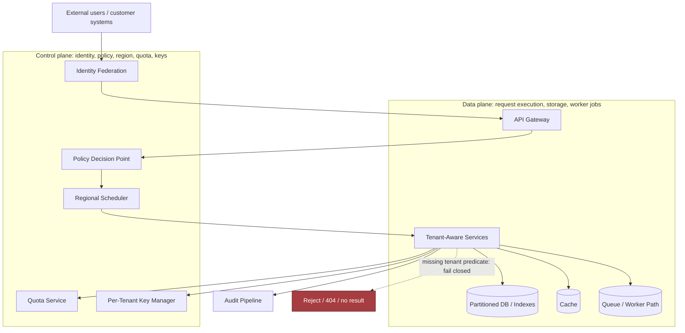
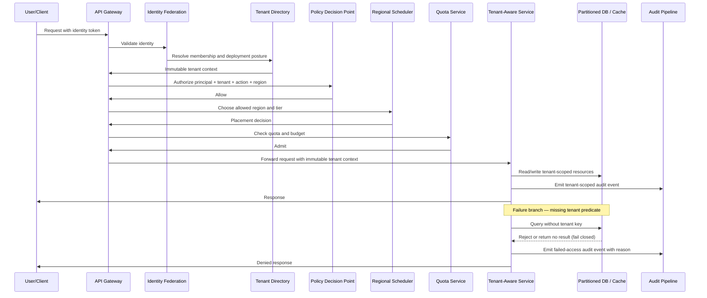
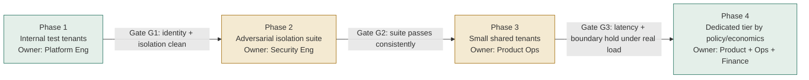

# Chapter 2: Design a Secure Multi-Tenant AI Platform

*Source: "The Forward Deployed Engineer System Design Interview: 20 Real-World AI & Enterprise Scenarios" — Chapter 2.*
*Tutorial format: FDE Chapter Tutorial Builder — self-reviewed against the decomposition rubric, 1 pass.*

---

## 1. The Customer Problem and Discovery

**Key Points**
- The headline ask ("one AI application for 500 enterprise tenants, tenant isolation, predictable performance, regional controls") hides a disagreement between four stakeholders about what "isolation" and "success" actually mean.
- The first discipline is separating the requested **feature** (a multi-tenant AI platform) from the **business result** (a cost-efficient shared platform with defensible isolation and dedicated options for exceptional customers).
- A small set of six high-leverage questions — not twenty — should collapse the biggest uncertainties before any architecture is drawn.
- Every clarifying question should produce four things: scope, assumptions, risks, and owners.
- A strong opening answer states the business outcome, names the four stakeholders, and postpones technology choices — a weak answer jumps straight to "Kubernetes, a vector database, and a model gateway."
- The architecture only starts to matter once you can state whose workflow changes and how success will be measured.

### A meeting before the architecture exists

A customer meeting is where this problem becomes real. The sponsor says, "We need one AI application for 500 enterprise customers, and we need tenant isolation, predictable performance, and regional controls." The tenant administrator nods and adds, "Also make it easy for our business teams to onboard without waiting on platform tickets." The security auditor pushes back: "We need evidence that one tenant cannot read another tenant's data, even under failure." The platform operator wants the simplest possible shared system. The hidden disagreement is not about features; it is about workflow, risk, and what success means when the platform is under stress.

Restated plainly, the prompt is: design a shared AI platform for many enterprise tenants that preserves isolation, performance, and residency constraints while still being economical to run.

The first discipline in an FDE interview is to separate the requested feature from the underlying business result. The feature is a multi-tenant AI platform. The business result is: offer a cost-efficient shared platform with defensible isolation and dedicated options for exceptional customers. That distinction matters because a candidate who jumps straight to "Kubernetes, a vector database, and a model gateway" has not yet answered the customer question. The customer does not buy containers; they buy confidence that a shared service can scale safely across tenant boundaries.

### Who cares, and what do they care about

Map the stakeholders before you sketch the system:

- **Tenant end users** want a fast, reliable, useful AI experience with the right data and no cross-tenant exposure.
- **Tenant administrators** want control over access, configuration, usage, and regional placement.
- **Platform operators** want a shared control plane that is observable, supportable, and cheap enough to operate at scale.
- **Security and compliance auditors** want evidence: policies, logs, boundaries, retention rules, and clear isolation guarantees.

The same platform answer must serve all four, but not in the same way. End users judge usefulness. Administrators judge manageability. Operators judge service health. Auditors judge control evidence. If you omit any of these, the design will look elegant and fail in practice.

A useful jobs-to-be-done lens is: "When a tenant adopts this platform, what job are they hiring it to do?" For end users, the job might be "summarize internal content and answer questions without exposing anyone else's data." For administrators, it may be "configure policy once and safely roll it out." For operators, it is "run one shared fleet without noisy neighbors dominating the system." For auditors, it is "prove that access and residency constraints are enforced consistently."

### Discovery that becomes a testable outcome

You do not get to ask twenty questions in a 45-minute interview. You need a small set of high-leverage questions that collapse uncertainty quickly. The best questions are the ones that change the architecture materially:

1. Which tenant data classes are in scope, and which are explicitly out of scope?
2. Are regional controls hard requirements, soft preferences, or customer-specific exceptions?
3. What does "predictable performance" mean here: throughput, latency, queue time, or fairness across tenants?
4. Which tenants can share infrastructure, and which require dedicated options?
5. What evidence do auditors need: logs, policy snapshots, access reviews, or data lineage?
6. What are the most expensive failure modes: data leakage, unavailable service, slow inference, or misrouted traffic?

Notice what these questions produce: scope, assumptions, risks, owners, and measurable success. Scope tells you what to include. Assumptions tell you what you are temporarily accepting because the interviewer did not specify it. Risks tell you what can break the design. Owners tell you who responds when it breaks. Success tells you how to tell whether the system helped the customer.

A concise assumption ledger is part of the answer, not an appendix. For example: "Assume tenants bring their own identity provider," "assume regional restrictions apply to stored data and inference logs," "assume premium customers may pay for dedicated capacity," and "assume model selection is already approved by the customer." Stating assumptions early prevents vague architecture drift later.

### Two minutes of strong opening answer

A good interview opening sounds like this:

> "We need to support a single AI application for 500 enterprise tenants while preserving tenant isolation, predictable performance, and regional controls. I'd start by clarifying which tenants are shared, which require dedicated capacity, what data can cross regional boundaries, and what success looks like for end users versus administrators, operators, and auditors. My default assumption is a shared control plane with tenant-aware data and inference paths, strong authorization at every boundary, and an escape hatch for premium tenants who need dedicated infrastructure or stricter residency. I'll first define the business outcome in measurable terms, then derive the minimum set of discovery questions, risks, and constraints before choosing the architecture."

That answer does three things well: it frames the problem, names the stakeholders, and postpones premature technology choices.

A weak version sounds like this: "We should use microservices, Kubernetes, and row-level security to build a secure AI platform." That is feature-first and solution-first. It may be technically plausible, but it skips the customer outcome. The corrected outcome-first version is: "We need a shared AI platform that tenants can trust with sensitive data, while the business can still operate it economically and reserve dedicated capacity for outliers."

### Discovery under time pressure

The business outcome should be stated in a form that can be checked after launch: offer a cost-efficient shared platform with defensible isolation and dedicated options for exceptional customers. That sentence is powerful because it encodes the trade-off. Shared infrastructure reduces cost. Defensible isolation reduces risk. Dedicated options handle the customers whose risk or performance profile makes sharing inappropriate.

From there, the architecture only begins after the workflow is clear. Who starts the request? Where does identity enter? Which tenant attributes travel with the request? Where does data get filtered? What region can store what? Which components are shared, and which are tenant-scoped? Those are architecture questions, but they only matter once the user journey and the business result are known.

### What to say in the interview

If you need a compact response, anchor it in this order: prompt, stakeholders, outcome, assumptions, then next questions. That order demonstrates judgment. It tells the interviewer that you can translate ambiguous customer language into technical execution and measurable impact, which is exactly the core FDE skill.

The takeaway is simple: the architecture starts only after you can say whose workflow changes and how success will be measured. If you cannot state that clearly, you are still in feature land, not design land. Once you can, every later choice — data model, auth boundary, deployment topology, observability, and premium dedicated tier — has a customer reason attached to it.

**Equation note:** No new equation is required in this section. When you later estimate capacity or latency budgets, keep the math tied to the customer outcome rather than treating it as a standalone exercise.

---

## 2. Clarifying Questions, Requirements, and Constraints

**Key Points**
- Separate the conversation into four buckets: functional requirements, nonfunctional requirements, explicit exclusions, and hard constraints.
- Six deep-dive questions — shared vs. dedicated deployment, regional/regulatory boundaries, tenant-specific keys/retention, private networking/SSO, workload skew, and availability/recovery/audit — each earn their place because they change a major design choice.
- Functional requirements should be prioritized with **must / should / could**, tied directly to the shared-versus-dedicated decision.
- Safety goals must be converted into measurable, enforceable system behavior (zero cross-tenant reads/writes, bounded resource contention, tenant-scoped blast radius) — not left as vague adjectives.
- Stating what the MVP explicitly does **not** support is as important as stating what it does — it prevents solution sprawl.
- A traceability table (requirement → owning component) proves you are designing a system with ownership, not collecting a wish list.

### The first move: turn an ambiguous request into a design boundary

The interviewer has already given you the headline problem: one AI application, 500 enterprise customers, tenant isolation, predictable performance, and regional controls. In this section, the trap is not technical difficulty; it is premature certainty. The interviewer answers only half the questions, so the candidate has to decide which assumptions are safe, which ones are dangerous, and which unanswered detail would most distort the architecture if ignored.

Start by separating the conversation into four buckets: functional requirements, nonfunctional requirements, explicit exclusions, and hard constraints. That structure keeps you from designing a generic platform when the customer really needs a platform with a narrow, enforceable operating envelope.

### Questions that change the architecture

Each clarifying question should earn its place by affecting a major design choice.

- **Shared versus dedicated deployment expectations:** Ask whether every tenant must share the same control plane and data plane, or whether some customers require a dedicated environment. This determines whether you build one universal topology with tiered isolation or a hybrid model with an explicit premium tier.
- **Regional and regulatory boundaries:** Ask which tenants are allowed to store or process data in which regions, and whether any customers have residency, retention, or audit preferences that override default placement. This changes routing, storage, backup, and logging design.
- **Tenant-specific models, keys, and retention:** Ask whether tenants can bring their own model endpoint, encryption key, or retention policy. This affects configuration management, secrets handling, and how much policy must be enforced at runtime rather than at provisioning time.
- **Private networking and SSO requirements:** Ask whether traffic must stay on private links, whether the platform must integrate with corporate identity providers, and whether service-to-service calls need mTLS or a similar network control. This shapes ingress, authentication, and trust boundaries.
- **Workload skew and noisy-neighbor tolerance:** Ask whether some tenants are dramatically heavier than others, whether batchy workloads coexist with interactive ones, and how much latency variance is acceptable. This decides whether you need per-tenant quotas, admission control, queue isolation, or reserved capacity.
- **Availability, recovery, and audit objectives:** Ask what uptime and recovery expectations matter most, how quickly a tenant must be recoverable after a failure, and what administrative actions must be auditable. This determines redundancy, backup strategy, immutable logging, and incident response design.

The purpose of each question is not to collect trivia. It is to expose the highest-risk constraint early enough that you can protect it.

### Converting answers into requirements

Once the interviewer gives partial answers, translate them into a prioritized requirement set.

**Functional requirements first.** For this scenario, the highest-value capabilities are the ones that make the platform operable as a multi-tenant system rather than a loosely shared demo:

1. **Tenant-aware control plane** to onboard tenants, assign policies, provision configuration, manage keys, and record administrative actions.
2. **Isolated data-plane request path** so every inference or application request carries tenant identity, policy context, and authorization checks through the entire call chain.
3. **Per-tenant policy, quotas, keys, and configuration** so the platform can enforce different limits, model choices, retention settings, and access rules without bespoke code paths.
4. **Regional routing and retention controls** so requests and stored artifacts can be directed to the correct region and retained or deleted according to tenant policy.
5. **Auditable administration** so the platform can answer who changed what, when, and under which tenant context.
6. **Dedicated deployment tier where justified** for exceptional customers whose isolation, performance, or contractual needs exceed the shared tier.

That order matters. The control plane is not a nice-to-have; it is the mechanism that makes the rest of the system manageable. Likewise, a dedicated tier is not the default answer. It is an explicit escape hatch for customers whose requirements are too expensive or too risky to satisfy in the shared path.

**Then convert safety goals into measurable constraints.** A strong candidate does not leave the quality bar vague. Instead, state it in the language of enforceable system behavior:

- **Zero cross-tenant reads or writes** means the system must not expose one tenant's data, prompts, embeddings, outputs, logs, or administrative state to another tenant through authorized or accidental paths.
- **Bounded resource contention** means one tenant's workload should not cause unbounded latency or throughput collapse for others. If the platform shares infrastructure, it must also share constraints.
- **Tenant-scoped blast radius** means a failed deployment, bad policy, or revoked credential should affect only the minimum necessary tenant set, not the entire fleet.

To make that prioritization usable in an interview, label each requirement as **must**, **should**, or **could**. Must covers the non-negotiables that define the product promise and protect the highest-risk failure modes: tenant-aware control plane, isolated data-plane path, per-tenant policy enforcement, regional controls where required, and auditable administration. Should covers strong defaults that materially improve the design but may be phased in or relaxed for the MVP, such as richer quota tuning or broader automation. Could covers enhancements that are valuable but not necessary to ship the first defensible version, such as advanced tenant analytics or optional convenience workflows. This scheme is helpful because it ties directly to the shared-versus-dedicated decision: if a tenant's requirement is a **must** that cannot be satisfied safely in the shared tier, that is your justification for a dedicated deployment path. If it is only a **could**, it should not expand the core design or delay launch.

### What the MVP does not support

A disciplined interview answer also states what is out of scope. That prevents solution sprawl and shows the interviewer that you understand delivery sequencing.

For the MVP, exclude the following unless the interviewer explicitly pushes for them:

- Arbitrary tenant-managed plugin execution inside the core platform
- Cross-region active-active writes for every tenant
- Fully custom per-tenant runtime stacks
- Unlimited per-request model swapping
- Manual exception handling for every onboarding request
- Ad hoc shared-secret administration outside the control plane

Why exclude them? Because each one expands the trust surface, complicates auditability, or creates a support burden that obscures the core promise: a secure shared platform with defensible isolation and a credible path to dedicated handling where needed.

### A concise interview question tree

Use a short question tree to keep the conversation moving:

1. Who are the tenants and what varies by tenant?
2. Which data must stay isolated, and at what levels: request, storage, logs, embeddings, admin actions?
3. Which tenants need regional placement or residency constraints?
4. Which customers need private networking, SSO, or dedicated deployment?
5. What workload shape do we expect: steady, bursty, skewed, or mixed?
6. What are the availability, recovery, and audit expectations?
7. What is explicitly out of scope for the first release?

That tree is intentionally small. It is enough to surface the high-risk branches without bogging the discussion down.

### Traceability: requirement to component

A useful interview habit is to tie each requirement to the component that enforces it. That shows you are not just collecting wish lists; you are designing a system with ownership.

| Requirement | Primary component or mechanism |
|---|---|
| Tenant-aware control plane | Tenant registry, provisioning workflow, admin API |
| Isolated data-plane request path | Auth gateway, request context propagation, policy enforcement point |
| Per-tenant policy, quotas, keys, and configuration | Policy store, quota service, secrets management, config service |
| Regional routing and retention controls | Traffic router, region-aware storage, retention scheduler |
| Auditable administration | Append-only audit log, admin event pipeline |
| Dedicated deployment tier | Separate cluster or namespace boundary with tenant-specific capacity |
| Zero cross-tenant reads or writes | Authorization checks, row-level or object-level isolation, test gates |
| Bounded resource contention | Quotas, admission control, queue isolation, autoscaling limits |
| Tenant-scoped blast radius | Deployment partitions, scoped rollout, tenant-level feature flags |
| Safe onboarding and offboarding | Provisioning workflows, deletion jobs, verification checks |

This traceability table is especially valuable in an FDE interview because it shows delivery discipline. If a requirement has no component, it is probably not real yet. If a component has no requirement, it is probably scope creep.

### How to answer when the interviewer stays vague

The interviewer may stop halfway through the clarification. That is deliberate. In that case, choose the assumptions that protect the most dangerous failure mode: a cross-tenant leak or policy violation. Say so plainly.

For example: "If we do not know tenant variability yet, I will assume the shared tier must support most customers, but I will design an explicit dedicated path for customers with stricter residency or performance needs. I would rather over-invest in tenant-aware control and policy enforcement than assume a shared model can absorb every edge case."

That response demonstrates judgment under uncertainty. It also signals that you are protecting the customer outcome instead of optimizing for architectural elegance.

### What the interviewer is listening for

This part of the interview is less about breadth than about control. A strong candidate asks questions that change the design, then converts the answers into priorities, constraints, exclusions, and ownership. That shows customer discovery, disciplined scoping, and a practical bias toward delivery under ambiguity. In job-market terms, that is exactly the behavior teams want from someone who will work directly with customers and still keep the platform safe, supportable, and reusable.

---

## 3. Scale Estimates, SLOs, and Capacity

**Key Points**
- Size for the load *shape* — average, peak, growth, and skew — not just the average; a plausible design at average traffic can fail exactly when customers feel pain.
- Illustrative working assumptions: 500 tenants, 50,000 active users, 200 QPS peak, 20x workload skew. The exact values matter less than turning them into decisions.
- Convert traffic into explicit **quotas and guardrails** at the tenant level: token quota, concurrency quota, burst quota, and reserved capacity for premium/dedicated customers.
- Anchor every SLO in the customer workflow, not in what the platform team prefers to measure — availability, latency, freshness, quality, security, and cost indicators all connect to a real customer job.
- Capacity math should be expressed as **headroom** above the naive peak, covering unexpected tenant concentration, retries, failover overhead, deploy-time capacity loss, and growth — not just "target exactly 200 QPS."
- A simple unit-economics equation ($C_{tenant} = C_{fixed}/N + C_{usage} + C_{isolation}$) makes the pooled-vs-isolated cost trade-off explicit and should be paired with a sensitivity view for 10x growth.
- Define the recovery bar (RPO/RTO, per-region and per-tier) *before* designing the happy path, and design an explicit "missing tenant predicate" test as part of the capacity/reliability story.

### Start with the load shape, not the average

The first architecture a candidate draws is usually plausible at average traffic and wrong at the moment customers feel pain. That is the trap in this scenario. If you only size for steady-state use, the system can look elegant on the whiteboard and still fail when a few large tenants spike at the same time, when a deadline turns a background workload into a burst, or when regional failover shifts load into a smaller pool.

For interview purposes, take the working assumptions as illustrative: 500 tenants, 50,000 active users, 200 QPS peak, and a 20x workload skew. The point is not the exact values; the point is to turn them into decisions.

A sensible first pass is to separate the math into four buckets:

- **Average load**: what the platform sees most of the time.
- **Peak load**: what the platform must survive without violating customer promises.
- **Growth factor**: how much headroom is needed before the next capacity project.
- **Skew**: how much of the traffic a small number of tenants can concentrate.

If the platform sees 200 QPS peak across 500 tenants, the average tenant is trivial on paper: 0.4 QPS. But with 20x skew, the largest tenants may drive a material share of peak traffic, so the system cannot rely on a "uniform tenant" assumption. That matters for queue sizing, cache partitioning, rate limiting, retry policy, and whether a noisy tenant can crowd out everyone else.

### Convert traffic into quotas and guardrails

The capacity question is not just "how many requests can we serve?" It is "how do we preserve quality when one tenant behaves like a mini-surge event?" A practical design usually needs both pooled capacity and per-tenant controls.

For example, if the platform exposes a shared AI service with token-based inference, you might estimate a **tenant token quota** and a **concurrency quota** separately:

- token quota: caps monthly or hourly usage to protect spend and fairness;
- concurrency quota: prevents a single tenant from saturating worker pools or model backends;
- burst quota: allows short spikes without immediate throttling;
- reserved capacity for premium or dedicated customers: protects contractual performance.

These are not only billing tools. They are control surfaces that let the operator keep the shared tier healthy while offering dedicated options for exceptional customers. The interview move is to show that you understand the trade-off: if quotas are too tight, customers see artificial failures; if they are too loose, one tenant can consume the shared budget and degrade everyone else.

### Anchor the SLOs in the customer workflow

A service-level objective should describe what the customer experiences, not what the platform team prefers to measure. For an AI platform, availability alone is insufficient. A customer cares whether the platform is usable during working hours, whether requests finish before their workflow times out, and whether data remains within the correct region.

Useful indicators here include:

- **Availability SLI/SLO**: successful requests or successful job completions over a defined window.
- **Latency SLI/SLO**: end-to-end response time for interactive work, or completion time for batch jobs.
- **Freshness**: time from source-data update to search/index/model-visible update.
- **Quality**: task success rate, grounded-answer rate, or human-accepted output rate, depending on the use case.
- **Security indicators**: authorization failures, policy denials, cross-tenant access attempts blocked, and audit-log completeness.
- **Cost indicators**: cost per request, cost per tenant, and cost per successful task.

A strong FDE answer explicitly ties each SLO to a customer workflow. For instance: "If this system powers internal support agents, then the latency budget must preserve the agent's interaction loop. If a response arrives after the human has already escalated manually, the request may be technically successful but functionally useless."

### Work the capacity estimate backward

Suppose a single request to the AI backend includes auth, policy evaluation, retrieval, model inference, and audit logging. The architecture choice changes if the latency budget is 2 seconds versus 15 seconds. Tight budgets favor fewer hops, stronger caching, smaller fan-out, and less cross-region dependency. Loose budgets allow more durable queues, asynchronous work, and post-processing.

This is where estimate quality affects partitioning. The most consequential estimate is often not total QPS but the **shape of peak concurrency after retries, fan-out, and long-tail latency** are included. A design that looks fine at 200 QPS can still collapse if one slow dependency holds many requests open and the retry policy multiplies load.

That is why you should talk in terms of **headroom**. If the expected peak is 200 QPS, a naive design that targets exactly 200 is already broken. You need margin for:

- unexpected tenant concentration,
- retried requests,
- failover overhead,
- deploy-time capacity loss,
- and growth before the next tuning cycle.

A conservative interview answer might say: "I would size the shared tier for average peak plus growth headroom, then isolate the largest or strictest tenants with reserved capacity or dedicated pools." That is pragmatic, not overengineered.

### Whiteboard the unit economics

The simplest useful economic model is:

$$ C_{\text{tenant}} = \frac{C_{\text{fixed}}}{N} + C_{\text{usage}} + C_{\text{isolation}} $$

Interpretation:

- $\frac{C_{\text{fixed}}}{N}$ is the shared platform cost spread across $N$ tenants: clusters, control plane, baseline observability, and common services.
- $C_{\text{usage}}$ is the variable cost a tenant directly drives: tokens, storage, retrieval, egress, and compute.
- $C_{\text{isolation}}$ is the premium a tenant's stronger separation costs: dedicated pools, stricter network boundaries, regional duplication, customer-specific encryption boundaries, or additional compliance controls.

This equation is valuable because it makes the business trade-off explicit. Pooled economics win when most tenants can share infrastructure safely. Stronger isolation is justified when the incremental risk, regulatory burden, or performance requirement exceeds the extra cost. In an interview, say that out loud: "I want to keep $C_{fixed}$ low through pooling, but I will pay $C_{isolation}$ only where the customer requirement actually demands it."

### Show uncertainty without hiding behind it

You do not earn points for fake precision. Say "average," "peak," "growth," and "headroom" rather than pretending that 200 QPS is a stable law of nature. Then give a sensitivity range. A simple sensitivity view for 10x growth might look like this:

| Assumption | Current illustrative case | 10x growth case |
|---|---|---|
| Tenants | 500 | 5,000 |
| Active users | 50,000 | 500,000 |
| Peak QPS | 200 | 2,000 |
| Skew | 20x | 20x or worse |
| Shared capacity strategy | pooled plus quotas | pooled plus stricter partitioning |
| Isolation posture | shared by default, dedicated for exceptions | more dedicated pools, more explicit regional controls |

The important lesson is not the table itself; it is what changes when scale jumps. At 10x growth, the cheap answer may stop working because noisy-neighbor risk, cache churn, and operational complexity become dominant. That is often the moment when the architecture shifts from "one shared tier with guardrails" to "tiered tenancy with explicit partitioning."

### Define the recovery bar before you design the happy path

Capacity is inseparable from reliability. If the platform must operate across regions, define the per-region recovery objective early: how much data loss is acceptable, how long the customer can wait, and whether every tenant gets the same recovery posture or only premium tenants do. Those choices influence replication, failover routing, queue durability, and whether the system can continue serving requests while one region is impaired.

Also define isolation tests up front. A good multi-tenant design is not only secure by intention; it is testable by failure drill. One critical drill is the **missing tenant predicate**: can a request, query, export, cache lookup, or admin action accidentally cross tenant boundaries if a filter is omitted? If that test is not part of the design story, the architecture is incomplete.

### What to say in the interview

A strong capacity answer sounds like this: "I will size for average, peak, and growth; reserve headroom for skew and failover; give each tenant token and concurrency quotas; and tie latency and availability targets to the customer's workflow. I prefer pooled economics for the common case, but I will pay for stronger isolation when the risk, performance, or regional requirement justifies it."

That is the practical mindset the role rewards: estimate enough to choose the right partitioning, defend the shared platform economically, and know exactly when the shared model needs an escape hatch.

---

## 4. Architecture and End-to-End Flow

**Key Points**
- A "multi-tenant AI platform" fails the interview if it is drawn as a row of generic services; a defensible design assigns each component a job, a trust boundary, and a place in the request path.
- The key coherence rule: **tenant identity is established once, becomes immutable, and then drives every downstream decision** — nothing later in the flow should "re-decide" tenancy from ad hoc metadata.
- There is a strict dependency order: identity federation → tenant directory → policy decision point → API gateway → tenant-aware services → partitioned databases/indexes → quota service → per-tenant key manager → regional scheduler → audit pipeline.
- Components split cleanly into a **control plane** (identity, policy, keys, regional placement) and a **data plane** (request execution, storage, caches, queues) — with control-plane changes being slower, more privileged, and more auditable than data-plane requests.
- The **happy path** is a 7-step sequence (authenticate → derive immutable tenant context → authorize → route to region/tier → apply quota → read/write tenant-scoped resources → emit audit event) that should be narrated as a trace, not a slogan.
- A named **failure overlay** — the missing tenant predicate — belongs on the diagram itself: any component that omits the tenant key must fail closed, not "return whatever matches."
- Ship an MVP with exactly one of each core component; treat dedicated clusters, richer SLOs, and premium tiers as later evolution, not prerequisites for a safe first release.

### The architecture is only real when every box owns a boundary

The fastest way to fail this interview is to draw a "multi-tenant AI platform" as a row of generic services and hope the reviewer fills in the safety details. A defensible design starts by assigning each component a job, a trust boundary, and a place in the request path. The customer is not buying boxes; they are buying a shared platform that can serve many enterprises without accidental cross-tenant exposure, while still leaving room for dedicated treatment when a customer's risk or performance profile demands it.

The key coherence rule is this: **tenant identity is established once, becomes immutable, and then drives every downstream decision**. Nothing later in the flow should "re-decide" tenancy from ad hoc metadata. Shared and dedicated service paths can both exist, but they must both consume the same authenticated tenant context.

Here is the dependency order that matters in practice:

1. **Identity federation** authenticates the human or workload through the customer's IdP.
2. **Tenant directory** maps the authenticated principal to one or more tenant memberships and the allowed deployment posture.
3. **Policy decision point** evaluates whether this principal, action, resource, and region combination is allowed.
4. **API gateway** enforces coarse request admission, rate shaping, and routing into the correct service tier.
5. **Tenant-aware services** execute business logic only after they receive an immutable tenant context.
6. **Partitioned databases and indexes** store tenant-scoped records using a partitioning key that makes the tenancy boundary explicit in the physical layout and in query predicates.
7. **Quota service** tracks concurrency, token, and budget limits so one tenant cannot starve the shared pool.
8. **Per-tenant key manager** issues or selects the encryption context associated with that tenant and deployment tier.
9. **Regional scheduler** decides which region and which cluster class may serve the request.
10. **Audit pipeline** records tenant-scoped activity for investigation, billing, and operational review.

That order is not decorative. Identity must come first because every later decision depends on who the caller is. Tenant context must become immutable as early as possible because downstream code should consume a value, not recompute a guess. Policy must happen before the expensive work begins. Regional routing must happen before data access, because region is a control-plane decision, not a late-stage optimization. Audit must happen after the action, but close enough to the event that the record is useful.

### Component responsibilities at a glance

| Component | Responsibility | Trust boundary | Plane |
|---|---|---|---|
| Identity federation | Authenticate the caller through the customer's identity provider and deliver verified claims | External customer boundary to platform boundary | Control plane |
| Tenant directory | Map identity to tenant membership, posture, and allowed regions | Platform authority boundary | Control plane |
| Policy decision point | Decide whether the requested action is permitted for this tenant, principal, and region | Privileged policy boundary | Control plane |
| API gateway | Admit, shape, and route requests; reject malformed or clearly disallowed traffic early | Edge boundary between internet/customer network and services | Data plane |
| Tenant-aware services | Execute business logic using immutable tenant context only | Service boundary inside the shared platform | Data plane |
| Partitioned databases and indexes | Persist tenant-scoped records with tenant-aware keys and query predicates | Storage boundary | Data plane |
| Quota service | Enforce concurrency, token, and budget limits per tenant or tier | Shared-resource governance boundary | Control plane with data-plane enforcement hooks |
| Per-tenant key manager | Select or issue tenant-specific encryption context and key material references | Key-management boundary | Control plane |
| Regional scheduler | Place workload into an allowed region and deployment tier | Placement and residency boundary | Control plane |
| Audit pipeline | Capture immutable tenant-scoped events for investigation and billing | Observability and compliance boundary | Data plane |

### Happy path, step by step

A good interview narration sounds like a trace, not a slogan:

1. **Authenticate identity** through the enterprise federation layer.
2. **Derive immutable tenant context** from the identity and request metadata; do not let downstream services reinterpret it.
3. **Authorize action against policy** at the policy decision point, including user role, tenant membership, resource type, and region eligibility.
4. **Route to allowed region and deployment tier** through the API gateway and regional scheduler.
5. **Apply quota and budget** before expensive inference, storage growth, or batch fan-out begins.
6. **Read and write only tenant-scoped resources** in the partitioned database, cache, and object store.
7. **Emit a tenant-scoped audit event** so the audit pipeline can preserve a complete operational trail.

The important interview move is to connect each step to a customer requirement. Federation exists because the customer wants to keep their own identity source. The tenant directory exists because one company may have multiple subsidiaries, business units, or environments. The policy layer exists because authorization must be explainable and centrally governed. Quotas exist because "shared" cannot mean "noisy neighbor." Regional scheduling exists because location control is part of the product promise, not a deployment afterthought. Audit exists because enterprise buyers need traceability, and operators need to prove what happened.

### Trust boundaries, state ownership, and consistency points

The architecture becomes credible when you can say which service owns which state and where consistency matters.

- **Control plane**: identity federation, tenant directory, policy decision point, regional scheduler, quota configuration, and key selection live here. They decide *who may do what, where, and under which limits*.
- **Data plane**: API gateway, tenant-aware services, databases, caches, queues, and inference workers live here. They *do the work*.

That separation matters because control-plane changes are usually slower, more privileged, and more auditable than data-plane requests. A tenant moving to a dedicated tier, for example, should look like a controlled configuration change, not an ad hoc code path in the request handler. The shared-versus-dedicated choice is therefore a placement and policy outcome, not a separate authorization model.

Consistency is strongest at the points where boundary mistakes become security incidents:

- The **tenant directory** is a system of record for membership and allowed posture.
- The **partitioned database** is a system of record for tenant data.
- The **quota service** is a system of record for usage enforcement.
- The **audit pipeline** is a system of record for traceability.

Caches can improve latency, but they are never the source of truth for tenant membership or authorization. Queues can smooth bursty workloads, but they must carry tenant identifiers and policy context explicitly, because backpressure is only safe when the worker knows which tenant it is slowing down. That is where **synchronous versus asynchronous boundaries** matter: authentication, authorization, quota admission, and region selection are synchronous; reporting, logging, offline enrichment, and some model post-processing may be asynchronous. If the request could cross a trust boundary or consume scarce capacity, it should not be deferred blindly to a background task.

### Top-down architecture sketch with failure overlay

A useful top-down architecture diagram should not just show components; it should show responsibility and failure containment. Here is the flow rendered as a diagram:



**Failure overlay: missing tenant predicate.** If a service, query builder, cache lookup, export job, or admin action omits the tenant key, the architecture should **fail closed**. The request should stop at the enforcement layer or return a rejected result, rather than reading "whatever matches." This overlay belongs on the diagram itself because it shows the interviewer that the tenancy boundary is enforced by design, not by developer memory.

### Sequence diagram: happy path and failure branch



A sequence diagram like this is useful because it makes the order of checks unambiguous. The interviewer can see where identity is established, where the tenant context becomes immutable, where authorization occurs, and where the system must not continue. If the missing-tenant-predicate case is not obvious from the diagram, the design is still too hand-wavy.

### MVP first, then controlled evolution

For an MVP, the candidate should keep the design focused: one policy service, one gateway, one tenant-aware application tier, one partitioned data store, one quota service, one regional control plane, and one audit stream. That is enough to prove isolation, performance shaping, and regional routing.

Later evolution adds nuance: dedicated customer clusters for exceptional tenants, per-service SLOs, richer workload classification, more granular policy language, and stronger compartmentalization between shared and premium tiers. The key is to show the interviewer that those are extensions, not prerequisites for the first safe release.

### Why this is a job-market signal

This architecture demonstrates the exact decomposition employers look for in a Forward Deployed Engineer: you can translate customer constraints into control-plane and data-plane boundaries, explain how the same system serves both engineering and customer stakeholders, and defend why a shared platform can still offer credible isolation. The strongest signal is not the diagram itself; it is the ability to narrate how identity, data, state, and failure move through it.

If you can do that cleanly, the diagram becomes a tool. If you cannot, it is only decoration.

---

## 5. Data Model, APIs, and Working Code

**Key Points**
- The moment a design interview becomes credible is when the abstract architecture turns into concrete state and enforceable contracts — name the records, the boundaries, and the write rules that make isolation real.
- Four core records carry the whole system: **Tenant** (root ownership object), **Membership** (identity-access join record), **UsageLedger** (accounting record), and **AuditEvent** (immutable accountability trail).
- Records should be treated as ownership boundaries, not just tables: Tenant is data ownership, Membership is authority, UsageLedger is commercial control, AuditEvent is defensibility.
- Four API endpoints prove the design: `POST /v1/tenants`, `POST /v1/tenant/{id}/inference`, `PUT /v1/tenant/{id}/policy`, `GET /v1/tenant/{id}/audit` — each with explicit purpose, authentication, idempotency, versioning, response, and error semantics.
- The single highest-risk code path is **tenant-aware request handling**: the smallest slice that proves the design can work safely is the request entry point, the authorization check, the scoped transaction, and the dispatch into tenant-aware logic — not the whole platform.
- Idempotency keys and optimistic concurrency (version/ETag) are required at every write boundary that can be retried — they solve two different problems (duplicate writes vs. lost updates) and both matter here.
- A contract test (isolation holds end-to-end) and a failure-injection test (a missing tenant key fails closed) are the two tests that prove the safety claim, not just describe it.

### Core records and lifecycle

The moment a design interview becomes credible is when the abstract architecture turns into concrete state and enforceable contracts. For a multi-tenant AI platform, that means the candidate stops talking about "tenant isolation" in the abstract and names the records, the boundaries, and the write rules that make isolation real.

Start with the four records that carry the whole system:

- **Tenant(id, region, tier, key_ref, retention_policy)**: the root ownership object. `id` is the primary key. `region` expresses where this tenant is allowed to run. `tier` separates shared, premium, and dedicated handling. `key_ref` points to the tenant-managed or platform-managed encryption key reference. `retention_policy` defines how long prompts, outputs, logs, and derived artifacts may be kept.
- **Membership(user_id, tenant_id, role, status)**: the identity-and-access join record. Its primary key is typically the composite of `user_id` and `tenant_id`, or a surrogate key plus a uniqueness constraint on that pair. Its lifecycle begins when a user is invited or provisioned, changes as roles are assigned, and ends when access is revoked or the tenant is deprovisioned.
- **UsageLedger(tenant_id, period, tokens, requests, cost)**: the accounting record. Its primary key is the composite of `tenant_id` and `period`, so each tenant has one ledger row per billing period. The period can be daily or monthly depending on billing needs. It accumulates consumption for quota enforcement, chargeback, and support investigations. Its lifecycle begins when the period opens, mutates during usage accrual, and becomes read-only or archived when the period closes according to the retention policy.
- **AuditEvent(tenant_id, actor, action, resource, decision)**: the immutable accountability trail. Its primary key is typically a generated event id, such as `event_id`, paired with `tenant_id` in the storage model or enforced as a globally unique primary key plus a tenant index. It records who did what, against which resource, and whether the system allowed it. Its lifecycle begins at write time, remains append-only, and is retained according to the tenant's audit policy, which is often longer than application logs.

The important design move is to treat these records as ownership boundaries, not just tables. `Tenant` is data ownership. `Membership` is authority. `UsageLedger` is commercial control. `AuditEvent` is defensibility. In an interview, that framing shows you understand the platform is not "just storage plus inference"; it is a system of controlled delegation.

Retention is part of the data model, not an afterthought. If a tenant's policy says prompts are retained for 30 days and audit records for longer, that policy needs to be attached to the tenant record or a versioned policy document referenced by it. Otherwise, every downstream service has to rediscover policy from brittle configuration.

### Contract surface the system exposes

A clean API set makes the state model legible:

- `POST /v1/tenants` creates a tenant.
- `POST /v1/tenant/{id}/inference` submits an inference request under a tenant.
- `PUT /v1/tenant/{id}/policy` updates tenant policy.
- `GET /v1/tenant/{id}/audit` retrieves audit history.

These endpoints are enough to prove the design; the rest can be inferred.

**`POST /v1/tenants`**
- *Purpose*: create a new tenant with region, tier, retention, and key reference.
- *Authentication*: admin or provisioning identity with explicit tenant-create permission.
- *Idempotency*: required. Creation is one of the easiest places to accidentally produce duplicates during retries. Clients should send an idempotency key, and the server should store the first successful result for that key and reject conflicting replays.
- *Response*: `201 Created` with tenant id, region, tier, policy version, and status. If the same idempotency key repeats with identical payload, return the original response. If the payload differs, return a conflict-style error.
- *Errors*: invalid region, unsupported tier, malformed key reference, or policy validation failure. The response should tell the caller what was rejected without exposing secrets.

**`POST /v1/tenant/{id}/inference`**
- *Purpose*: submit a tenant-scoped inference request.
- *Authentication*: the caller must present a tenant-aware identity. The request cannot be processed if tenant context is missing or inconsistent with the path parameter.
- *Idempotency*: required whenever the request can be retried or charged. A duplicate request should not double-charge usage or create duplicate side effects. The server should bind the idempotency key to tenant id, route version, and request body hash or canonical digest.
- *Response*: `200 OK` or `202 Accepted` depending on whether the call is synchronous or queued. Return a typed result envelope, not free-form model text directly.
- *Errors*: forbidden tenant access, quota exceeded, policy violation, invalid input schema, model timeout, or downstream unavailability.

**`PUT /v1/tenant/{id}/policy`**
- *Purpose*: update retention, region, tool-access, or inference policy.
- *Authentication*: tenant admin or platform operator, depending on policy scope.
- *Idempotency*: required. Policy updates should be safe to repeat.
- *Versioning*: required. Use optimistic concurrency with a version field or ETag so a stale writer does not silently overwrite a newer policy. If the supplied version is outdated, return a conflict and force the caller to refresh.
- *Response*: the new policy document and version.

**`GET /v1/tenant/{id}/audit`**
- *Purpose*: retrieve audit history.
- *Authentication*: least-privilege read access. Often this is limited to tenant admins, security reviewers, or support roles with explicit approval.
- *Response*: a paginated, tenant-scoped list of audit events.
- *Errors*: unauthorized access, invalid cursor, or tenant not found.

### The highest-risk component first

The candidate should zoom into the riskiest component: tenant-aware request handling. That is where a missing tenant predicate becomes a data leak. The smallest code path that proves the design can work safely is not the whole platform; it is the request entry point, the authorization check, the scoped transaction, and the dispatch into tenant-aware business logic.

Here is the interview-sized production sketch, expanded just enough to make the safety story concrete:

```python
from __future__ import annotations

from dataclasses import dataclass
from typing import Any, Protocol


@dataclass(frozen=True)
class TenantContext:
    tenant_id: str
    region: str
    roles: frozenset[str]


@dataclass(frozen=True)
class ApiError(Exception):
    status_code: int
    code: str
    message: str


class AuthService(Protocol):
    async def require_tenant_context(self, request: Any) -> TenantContext:
        ...


class PolicyService(Protocol):
    async def require(self, ctx: TenantContext, action: str) -> None:
        ...


class Transaction(Protocol):
    async def execute(self, fn):
        ...


class Database(Protocol):
    def transaction(self, *, settings: dict[str, str]):
        ...


class RouteDispatcher(Protocol):
    async def dispatch(self, request: Any, ctx: TenantContext, tx: Transaction) -> Any:
        ...


class Repository(Protocol):
    async def get_by_tenant(self, tenant_id: str, resource_id: str) -> dict[str, Any] | None:
        ...


class TenantScopedRepository:
    def __init__(self, repo: Repository, ctx: TenantContext) -> None:
        self._repo = repo
        self._ctx = ctx

    async def get(self, resource_id: str) -> dict[str, Any] | None:
        return await self._repo.get_by_tenant(self._ctx.tenant_id, resource_id)


async def handle(request: Any, auth: AuthService, policy: PolicyService, db: Database, routes: RouteDispatcher) -> Any:
    ctx = await auth.require_tenant_context(request)
    if not ctx.tenant_id:
        raise ApiError(401, "missing_tenant", "tenant context is required")

    await policy.require(ctx, action=getattr(request.route, "name", "unknown"))

    with db.transaction(settings={"app.tenant_id": ctx.tenant_id}) as tx:
        response = await routes.dispatch(request, ctx, tx)

    return response
```

### Line by line, what matters

- `from __future__ import annotations` keeps type hints lightweight and avoids forward-reference issues in a teaching sketch.
- `from dataclasses import dataclass` imports the decorator used to define immutable, typed records like `TenantContext` and `ApiError`.
- `from typing import Any, Protocol` brings in the minimal typing tools needed to model framework dependencies without binding the example to a specific web stack.
- `@dataclass(frozen=True)` on `TenantContext` makes the tenant identity immutable after authentication. That immutability matters because the rest of the request path should not be able to rewrite tenant identity mid-flight.
- `tenant_id: str`, `region: str`, and `roles: frozenset[str]` make the request context explicit. Tenant identity, region constraints, and role claims are all part of the authorization decision.
- `@dataclass(frozen=True)` on `ApiError` creates a structured exception type for predictable error handling.
- `status_code: int`, `code: str`, and `message: str` separate transport status from machine-readable error code and human-readable text. That helps clients and support teams diagnose failures without parsing arbitrary strings.
- `class AuthService(Protocol):` defines the authentication boundary as an interface rather than a concrete implementation.
- `async def require_tenant_context(self, request: Any) -> TenantContext:` says the auth layer must either return a valid tenant context or fail. It is not allowed to return a partially scoped request.
- `class PolicyService(Protocol):` defines authorization as a separate dependency, which makes the code easier to test and audit.
- `async def require(self, ctx: TenantContext, action: str) -> None:` expresses a policy check that is tenant-aware and action-specific.
- `class Transaction(Protocol):` is a placeholder for the unit of work or transaction wrapper used by the dispatch path.
- `async def execute(self, fn):` is included to show that real systems often wrap transactional work, even though this sketch does not use `execute` directly. Calling that out avoids confusion in an interview.
- `class Database(Protocol):` abstracts the database connection or pool.
- `def transaction(self, *, settings: dict[str, str]):` shows that the database transaction is opened with tenant-specific session settings, such as `app.tenant_id`.
- `class RouteDispatcher(Protocol):` defines the application router or handler multiplexer.
- `async def dispatch(self, request: Any, ctx: TenantContext, tx: Transaction) -> Any:` ensures downstream handlers receive both the request and the tenant context, not just the request.
- `class Repository(Protocol):` is the data access interface.
- `async def get_by_tenant(self, tenant_id: str, resource_id: str) -> dict[str, Any] | None:` is the critical method signature that prevents unscoped access by requiring a tenant id on every read.
- `class TenantScopedRepository:` is the wrapper that makes tenant context mandatory.
- `def __init__(self, repo: Repository, ctx: TenantContext) -> None:` captures both the underlying repository and the authenticated tenant context.
- `self._repo = repo` stores the base repository.
- `self._ctx = ctx` stores the immutable tenant context for later use.
- `async def get(self, resource_id: str) -> dict[str, Any] | None:` exposes a tenant-safe read method.
- `return await self._repo.get_by_tenant(self._ctx.tenant_id, resource_id)` is the enforcement point: the caller cannot choose a tenant id at the last second, because the wrapper binds the request to the authenticated tenant.
- `async def handle(request: Any, auth: AuthService, policy: PolicyService, db: Database, routes: RouteDispatcher) -> Any:` defines the entry point.
- `ctx = await auth.require_tenant_context(request)` authenticates the caller and extracts tenant context before any data access occurs.
- `if not ctx.tenant_id:` adds a defensive guard so a broken auth layer cannot silently pass an empty tenant id downstream.
- `raise ApiError(401, "missing_tenant", "tenant context is required")` fails closed with a clear, machine-readable reason.
- `await policy.require(ctx, action=getattr(request.route, "name", "unknown"))` checks authorization for the specific route or action.
- `with db.transaction(settings={"app.tenant_id": ctx.tenant_id}) as tx:` opens a transaction with tenant-scoped session settings. In a real implementation this could also set row-level security context, session variables, or request metadata.
- `response = await routes.dispatch(request, ctx, tx)` hands control to tenant-aware business logic while preserving the scoped context.
- `return response` returns the result only after the scoped route handler finishes successfully.

### Typed validation at the boundary

Model output should not flow raw into the rest of the system. Keep it behind typed validation and policy checks. In practice that means the inference response is parsed into a schema such as `InferenceResult`, then checked for forbidden fields, unsafe tool references, or policy violations before any persistence or downstream action.

This is one of the most common places to show senior judgment in an interview: the model is not the application boundary. The typed boundary is.

### Idempotency, versioning, and optimistic concurrency

Idempotency and versioning belong at every write boundary: creation endpoints, policy updates, billing side effects, and queue submission all need replay safety. The simplest implementation is an idempotency-key table keyed by tenant, endpoint, and key value. For mutable policy documents, use a version number or ETag, and reject stale writes with a conflict so the caller must re-read.

That combination gives you two distinct protections:

- **Idempotency key** stops duplicate writes from retries.
- **Optimistic concurrency** stops lost updates from concurrent writers.

A duplicate inference request is a good example. Suppose the client times out and retries with the same idempotency key. The second request should return the original result or a status representing the already-processed job, not run the model again and double-charge the tenant. If the client changes the prompt but reuses the same key, the server should reject the replay because the identity of the operation changed.

### Failure handling the whiteboard sketch leaves out

The sketch omits concurrency control, request validation, retries, and observability hooks that a production service would need. That omission is intentional in interview code, but you should name it out loud.

- **Concurrency**: protect the idempotency store with a unique constraint or transactional upsert.
- **Validation**: reject malformed tenant ids, unexpected regions, unsupported tiers, and oversized payloads before policy or model calls.
- **Retries**: retry only safe dependencies, and never blindly replay side-effecting operations without idempotency.
- **Observability**: log tenant id, request id, policy version, latency bucket, and error class; emit metrics for denied access, duplicate replays, quota hits, and model failures.

### Contract test and failure-injection test

A strong interview answer ends with a test that proves the safety claim.

**Contract test**: create a tenant, submit an inference request with the tenant context, and verify the response is returned with the same tenant id, a recorded audit event, and no access to another tenant's data. Repeat the exact inference request with the same idempotency key and confirm the system returns the same logical result without a second usage charge.

**Failure-injection test**: remove or corrupt the tenant context and call the repository through the request path. The test should fail closed with an authorization error before any data lookup occurs. This is the missing-tenant-predicate drill: if the code ever reaches an unscoped repository method, the test should flag it immediately.

### What this proves in the job interview

This is the point where the FDE signal becomes obvious. You are no longer just sketching boxes; you are moving from architecture into production-grade implementation details: explicit ownership, scoped repositories, idempotent writes, versioned policy updates, typed validation, and auditable failures. That is exactly how a candidate shows they can turn a customer promise into a safe system, not just a slide deck.

The design answer becomes credible when its state transitions, API contracts, and failure-safe code are concrete. Once those are concrete, the platform can be measured, defended, and extended without weakening tenant isolation.

---

## 6. Security, Reliability, and Failure Handling

**Key Points**
- The design review "turns hostile" the way real incidents do: it asks what happens when a tenant tries to cross a boundary, when a dependency is slow, and when the platform is under pressure from a single customer.
- The first non-negotiable rule: derive tenant context from verified identity, never from the request body — if the tenant id can arrive from a spoofable field, everything downstream (filters, cache keys, queue partitions, log redaction, vector-index lookup) is compromised.
- Least privilege and **defense in depth** across independently-enforcing layers (row, object, cache, queue, log, vector-index, key) means one missed check does not become a full breach — "blast radius" is your design unit: by tenant, by region, by workflow, by dependency.
- A fixed failure-response table (fail closed / degrade / queue-reroute-degrade, and *why*) is the artifact you should be ready to defend for each external dependency and irreversible action.
- The **missing tenant predicate** incident drill (detection → refusal & logging → containment → recovery → prevention) is the canonical walkthrough; the same detect/contain/recover/prevent shape repeats for cache-key, shared-queue, quota-exhaustion, and regional-outage incidents.
- Production failure behavior — timeouts, retries, idempotency, circuit breakers, dead-letter queues, and human escalation — is part of the design, not an operational afterthought.
- A compact pytest-based contract test proves the core invariant (a secret created under one tenant is invisible to another) at the API level, not only in the database.

### When the review turns hostile

The design review starts the way real incidents do: security and operations do not ask whether the happy path works. They ask what happens when a tenant tries to cross a boundary, when a dependency is slow, and when the platform is under pressure from a single customer. In this section, the key move is to treat safety as a behavior under stress, not a property that exists by declaration.

The first rule is simple and non-negotiable: derive tenant context from verified identity, never from the request body. If the tenant id arrives from a header, claim, session, or signed token, it can be authenticated and logged. If it arrives from a JSON field, it becomes an input that can be spoofed, replayed, or accidentally forwarded across tenants. That one choice shapes everything else: row-level filters, object ownership, cache keys, queue partitions, log redaction, and vector-index lookup must all consume the same verified tenant context.

Least privilege is the discipline behind that rule. Each service should only see the tenant scope it needs, and only for the operation it performs. Defense in depth means the database, cache, queue, application, and observability layers all enforce isolation independently, so one missed check does not become a full breach. Blast radius becomes your design unit: by tenant, by region, by workflow, by dependency.

### Isolation layers that must agree

A secure multi-tenant platform does not rely on one control. It layers several:

- **Row isolation**: database queries must include tenant predicates, and the database should enforce them where possible.
- **Object isolation**: files, blobs, and embeddings should be namespaced or separately authorized by tenant.
- **Cache isolation**: cache keys must include tenant id, and shared caches must not return data whose authorization context is ambiguous.
- **Queue isolation**: messages must not expose payload metadata across tenants, especially in shared dead-letter or retry channels.
- **Log isolation**: logs should never expose secrets, raw prompts, or cross-tenant identifiers that support reconstruction of another customer's state.
- **Vector-index isolation**: retrieval stores need tenant scoping at query time and at ingestion time, because semantic search can otherwise surface neighboring customer content.
- **Key isolation**: where required, use tenant-scoped encryption keys or tenant-scoped envelope encryption so a compromise does not immediately span the entire fleet.

This is why negative isolation tests matter. The platform should not merely pass a permission check once; it should actively prove that the wrong tenant cannot read, infer, cache, dequeue, or search another tenant's data. Automated tests should try to break the boundaries on purpose.

### The failure table you should be ready to defend

**Fail closed, degrade, queue, or escalate.** A candidate should be able to state the failure policy for each external dependency and irreversible action. Not every component should behave the same way.

| Scenario | Recommended behavior | Why |
|---|---|---|
| Missing tenant predicate | **Fail closed** immediately | An unscoped read/write is a security defect, not a transient error. |
| Cache key omits tenant id | **Fail closed** and invalidate affected entries | A shared cache hit can leak data across tenants even when the database is safe. |
| Shared queue leaks payload metadata | **Fail closed**, quarantine the queue, and rotate credentials if needed | Message metadata can reveal customer identity or workflow state. |
| One tenant exhausts model quota | **Degrade** for that tenant, not the whole platform | Shared capacity should protect neighbors and preserve fairness. |
| Regional control plane outage | **Queue, reroute, or degrade** depending on dependency criticality | Control-plane loss should not automatically take down data-plane operations if local enforcement still works. |

The important interview signal is not that you memorize the table; it is that you can explain why each item lands where it does. Security defects fail closed. Capacity pressure often degrades. Operational metadata leaks may require quarantine and human intervention. A regional control-plane outage may leave the system partially functional if local authorization and stored policy state still exist.

### Incident drill: missing tenant predicate

This is the critical drill from the design review. Security and operations inject the failure: a repository method is called without a tenant predicate. The candidate's job is to contain the impact, preserve evidence, and prevent recurrence.

**Detection**: the safest detection path is a combination of code review, automated tests, and runtime alerts for any query that reaches a repository without tenant scope. The signal should not depend on a customer filing a ticket. Denied-access metrics, anomalous cross-tenant access attempts, and query-shape instrumentation are all useful, but the primary guarantee is still in code and tests. In other words, the system should detect the missing predicate before it becomes data exposure, and if it reaches runtime, the request should be rejected as unsafe.

**Refusal and logging**: when the tenant predicate is missing or cannot be verified from trusted identity context, the platform must refuse the access path with a security error, not silently substitute a default tenant. The event should be logged as a policy violation with the authenticated identity, request trace, operation name, and the fact that the tenant scope was absent or invalid. The log must avoid leaking the underlying secret or any other tenant's data; the point is to preserve evidence, not to magnify exposure.

**Containment**: if the issue is discovered in pre-production, block release. If it appears in production, disable the offending feature path, rotate any potentially exposed credentials, freeze relevant logs and traces, and preserve forensic evidence. Do not "patch forward" before you have a clean record of what was queried, by whom, and under what tenant context. During retries or partial failure, the same unsafe request should continue to fail closed rather than being retried into a different tenant scope.

**Recovery**: re-run the affected requests through the corrected path, verify that every access is scoped, and validate that no cross-tenant result was returned. For irrecoverable exposure, involve the customer-facing and security escalation paths defined in the runbook. If retries were in flight, confirm that idempotency keys, queue entries, and replay logs do not allow the malformed request to bypass the fixed predicate check on reprocessing.

**Prevention**: add a negative test that fails if any unscoped repository method is reachable from the request path. Add static linting or query-shape checks where practical. Make the unscoped path hard to call, not merely undesirable. This is the concrete proof that the tenant boundary is enforced even when the system is under retry pressure or a downstream dependency is flaky.

### Walkthrough: cache key omits tenant id

A cache bug is different from a database bug because it can look harmless in isolation. The database may still be protected, but a shared cache can replay the wrong tenant's object if the key is missing tenant scope.

**Detection**: look for cache hits that return data for the wrong verified identity, especially on high-cardinality objects such as documents, search results, prompts, or generated outputs. Instrument cache keys so the tenant component is visible in metrics and traces, and add tests that assert tenant-specific cache namespaces.

**Containment**: disable the affected cache path or namespace, invalidate the suspect entries, and fall back to the source of truth. If the cache is used for auth-sensitive material, treat the event as a security incident rather than a performance bug.

**Recovery**: rebuild the cache from correctly scoped reads, re-check any responses that may have been served during the incident window, and confirm that no tenant observed another tenant's payload. If a cross-tenant response was possible, preserve the evidence and notify the appropriate response team.

**Prevention**: require tenant id in every cache key construction helper, centralize cache-key creation so it is hard to omit scope, and add negative tests that assert a cross-tenant lookup returns a miss, not a hit.

### Walkthrough: shared queue leaks payload metadata

Shared queues are risky because metadata can be enough to reveal the shape of another customer's workload even if the payload is encrypted. Retry counts, file names, workflow ids, or dead-letter headers can leak tenant identity or business intent.

**Detection**: scan queue messages and dead-letter records for tenant identifiers in headers, routing fields, or diagnostic attributes that should not be shared. Alert on messages whose metadata lacks the expected tenant-scoped envelope, and inspect retry channels for cross-tenant co-mingling.

**Containment**: stop consumers, quarantine the queue or dead-letter sink, and rotate credentials if the leak suggests unauthorized subscription or reprocessing. If the metadata exposure affected multiple tenants, freeze the affected pipeline before more messages flow through it.

**Recovery**: replay only the messages that can be proven safe, with a corrected envelope and routing rule. Reconstruct the backlog from source events if necessary, and confirm that each replayed message is delivered only to the verified tenant context.

**Prevention**: isolate queues by tenant where practical, or at minimum isolate the metadata envelope, routing key, and dead-letter path. Do not place raw business identifiers into shared retry channels. Add tests that assert queue metadata cannot identify another tenant's workflow.

### Walkthrough: one tenant exhausts model quota

A single tenant can accidentally or intentionally consume disproportionate model capacity. That is not a confidentiality breach, but it can become a reliability and fairness failure if the platform allows one customer to starve the rest.

**Detection**: watch per-tenant rate limits, token budgets, queue depth, p95 latency, and rejection counts. Alert on sudden growth in a tenant's prompt volume, repeated long-running jobs, or unusually large context windows that consume shared capacity.

**Containment**: enforce tenant-scoped quotas, slow that tenant's requests, or shed load only for the offending tenant. If the quota system itself is compromised, fail closed for the over-limit path rather than allowing uncontrolled consumption.

**Recovery**: restore service to the affected tenant once the quota window resets, the customer increases capacity, or an operator approves an exception. Check whether downstream backlogs need replay, and verify that neighbor tenants returned to their target latency band.

**Prevention**: define clear rate limits, admission control, and per-tenant fair scheduling. Keep a reserved pool or priority lane for operational traffic so a noisy tenant does not block incident response or administrative work.

### Walkthrough: regional control plane outage

A regional control plane outage is not always a full platform outage, but it is always a serious dependency event because policy distribution, deployment coordination, or configuration updates may be impaired.

**Detection**: monitor control-plane health separately from the data plane. A region can still serve requests while configuration propagation, key rotation, or rollout orchestration is degraded. Alert when the local authority source stops refreshing or when policy state becomes stale.

**Containment**: if local authorization, cached policy, and preloaded keys are sufficient, keep serving only the operations that can be verified safely in-region. If the system cannot prove that policy is current, fail closed for sensitive changes, queue noncritical writes, or reroute to a healthy region. Do not silently continue with stale control state for irreversible actions.

**Recovery**: restore the regional controller, reconcile any queued changes, and confirm that the local data plane is synchronized with the authoritative policy source before resuming full operation. Recheck any administrative actions that were deferred during the outage.

**Prevention**: design for stale-control tolerance explicitly. Cache the minimum necessary policy state locally, rehearse regional failover, and ensure that emergency access paths are distinct from normal control-plane dependencies. If a local component cannot validate policy freshness, it should require human intervention rather than guessing.

### Production failure behavior is part of the design

Timeouts, retries, idempotency, circuit breakers, dead-letter handling, and human escalation should be explicit.

- **Timeouts**: keep them tight enough that the platform does not pile up stale work, but long enough for normal variance.
- **Retries**: retry transient failures only; do not retry authorization failures or malformed requests.
- **Idempotency**: protect writes, billing events, and workflow triggers so that retries do not duplicate side effects.
- **Circuit breakers**: stop calling a dependency that is returning repeated failures or timeouts.
- **Dead-letter queues**: hold poison messages for inspection rather than reprocessing forever.
- **Human escalation**: require an operator when the issue concerns policy corruption, suspected isolation failure, or ambiguous tenant ownership.

That is the difference between a toy design and a production one: the system is honest about what it can recover automatically and what requires a human with authority.

### A compact proof that cross-tenant reads stay invisible

The following interview-sized test sketches one critical invariant: a secret created in one tenant must be invisible to another tenant. It is intentionally small enough to discuss in an interview, but the teaching point is real: verify the boundary at the API level, not only in the database.

```python
import pytest


class TenantSession:
    def __init__(self, tenant_id, store, next_id):
        self._tenant_id = tenant_id
        self._store = store
        self._next_id = next_id

    async def create_secret(self, value):
        secret_id = str(self._next_id())
        self._store[(self._tenant_id, secret_id)] = value
        return type("Secret", (), {"id": secret_id})()

    async def get_secret(self, secret_id):
        if (self._tenant_id, secret_id) not in self._store:
            return type("Response", (), {"status_code": 404})()
        return type("Response", (), {"status_code": 200, "value": self._store[(self._tenant_id, secret_id)]})()


class FakeApi:
    def __init__(self):
        self._store = {}
        self._next_id_value = 1

    def _next_id(self):
        current = self._next_id_value
        self._next_id_value += 1
        return current

    def as_tenant(self, tenant_id):
        if not tenant_id:
            raise ValueError("tenant context required")
        return TenantSession(tenant_id, self._store, self._next_id)


@pytest.mark.asyncio
async def test_cross_tenant_ids_are_invisible():
    api = FakeApi()
    created = await api.as_tenant("alpha").create_secret("A")
    response = await api.as_tenant("beta").get_secret(created.id)
    assert response.status_code == 404
```

The omissions are deliberate: this sketch does not show authentication middleware, request signing, database transactions, observability hooks, or retry wrappers. In a real implementation, those are exactly the pieces you harden next. But even this small test teaches the invariant that matters: another tenant should not learn whether an object exists.

### Audit evidence and runbooks before launch

Before production, the platform should have evidence that the controls are present and exercised: access logs showing tenant-derived context, negative isolation tests, role and permission reviews, queue and cache namespace checks, key-rotation procedures, and incident runbooks for suspected boundary failures. The operational question is not "do we have security?" The question is "can we prove the system fails in the right direction, and can we recover without widening the blast radius?"

That is what makes the architecture defensible in an interview and in production. Every external dependency and every irreversible action needs an explicit failure and recovery policy, because the absence of a policy is itself a policy — one that usually fails open.

---

## 7. Delivery Plan, Observability, and Business Impact

**Key Points**
- The question "when can this be trusted in production?" turns the interview from architecture-as-a-diagram into architecture-as-a-delivery-system — the right answer is a staged rollout with measurable gates, named owners, and rollback paths, not "ship everything at once."
- The mental model that matters: the platform is successful only when users adopt it, the workflow improves, *and* the operating team can support it — an FDE carries the system through adoption, feedback, and hardening, not just prototype delivery.
- Four rollout phases, each with an explicit owner, exit criteria, and go/no-go gate: (1) onboard internal test tenants, (2) run the adversarial isolation suite, (3) introduce small shared tenants, (4) offer a dedicated tier based on policy and economics.
- A good scorecard separates **technical health**, **model/task quality**, **adoption**, and **business outcome** metrics — blurring them together loses the ability to diagnose whether the problem is engineering, product fit, or customer behavior.
- Rollout is not only code promotion: canary, rollback, migration, training, and documentation all need named ownership, and the handoff between platform engineering, security, product, and SRE should be documented before the first customer is live.
- Decide explicitly what becomes **configuration** (varies per tenant, no code change), an **adapter** (absorbs external variance), a **shared service** (expensive to rebuild per tenant), or **core product** (defines platform identity) — re-implementing core-identity logic per customer is a warning sign.
- A realistic risk register names owner, mitigation, and trigger for each major risk (missing tenant predicate, cache bleed, misrouted regional traffic) — and the business impact statement ties the whole rollout back to a checkable customer outcome.

### From prototype confidence to production trust

The prototype works, but the customer asks when it can be trusted in production. That question changes the interview from architecture-as-a-diagram to architecture-as-a-delivery-system. The right answer is not "ship everything at once." It is a staged rollout with measurable gates, named owners, and rollback paths that let the team learn without exposing every tenant to the full blast radius of a new platform.

For this problem, the most useful mental model is simple: the platform is successful only when users adopt it, the workflow improves, and the operating team can support it. If any one of those three fails, the system is not done, no matter how elegant the design looks on paper. That is the job-market signal the interviewer is listening for: an FDE does not stop at prototype delivery; they carry the system through adoption, feedback, hardening, and the extraction of reusable product lessons.

### A four-phase rollout with explicit ownership

A credible rollout for this platform should read like an operational contract, not a wish list.

**Phase 1: onboard internal test tenants**
- *Owner*: platform engineering, with security and the product lead as reviewers.
- *Exit criteria*: authentication, tenant resolution, row-level filtering, storage partitioning, and logging all work against a small set of internal tenants. Every access path should carry tenant context end to end, and every admin action should be attributable. This is the cheapest place to find mistakes because the users are internal, the feedback loop is short, and the blast radius is controlled.
- *Go/no-go gate*: if identity propagation is inconsistent, if tenant-scoped data can be queried from the wrong context, or if support cannot trace a request in logs, the rollout stops.

**Phase 2: run the adversarial isolation suite**
- *Owner*: security engineering, with platform engineering responsible for fixes.
- *Exit criteria*: the team has a repeatable set of negative tests that try to break the tenant boundary. This includes cross-tenant object access, stale cache reads, replayed tokens, malformed filters, namespace collisions, and accidental omission of tenant predicates. The point is not to prove perfection; it is to prove that the system fails safely and that failures are visible quickly.
- *Go/no-go gate*: the suite must pass consistently before any external tenant is allowed in. A single unexplained boundary failure is enough to halt promotion, because the value of multi-tenancy disappears if one tenant can infer another tenant's data or activity.

**Phase 3: introduce small shared tenants**
- *Owner*: product operations, with support and reliability on call.
- *Exit criteria*: a limited set of low-risk customers move into the shared tier under conservative quotas and strict monitoring. This phase validates the real production trade-off: the platform must remain cost-efficient while preserving predictable performance. It also tests whether the support team can answer the questions customers actually ask — latency changes, quota errors, onboarding friction, and how isolation is enforced in practice.
- *Go/no-go gate*: shared-tenancy promotion continues only if the system preserves tenant boundaries, latency remains within target, and the operational team can explain every notable incident without guessing.

**Phase 4: offer a dedicated tier based on policy and economics**
- *Owner*: product management and platform operations, with finance and security input.
- *Exit criteria*: the business can justify a dedicated option for exceptional customers whose regulatory, residency, workload, or risk profile makes shared tenancy a poor fit. This is not a retreat from the shared platform; it is the productizing of exceptions. The dedicated tier should be a deliberate policy choice, not a chaotic special case buried in ticket comments.
- *Go/no-go gate*: the team must be able to explain when a customer belongs in shared tenancy, when they need dedicated capacity, and what the cost and support implications are for each path.

### What to measure, and why each metric exists

A good interview answer separates technical health, model quality, adoption, and business outcome metrics. If you blur those together, you lose the ability to diagnose whether the problem is engineering, product fit, or customer behavior.

A strong scorecard for this platform can include:

- **Isolation-test pass rate**: source is the adversarial test suite; owner is security engineering; alert if the pass rate falls below the agreed bar or any new boundary case fails unexpectedly. This is a technical health metric.
- **Cross-tenant incident count**: source is incident reports and audit logs; owner is the incident commander or platform reliability lead; alert on any non-zero confirmed incident. This is a severe technical health and trust metric.
- **Per-tenant p95 latency**: source is request telemetry segmented by tenant; owner is SRE or platform engineering; alert when the tenant-level tail latency exceeds the agreed SLO for a sustained period. This connects infrastructure behavior to customer experience.
- **Quota rejection rate**: source is request admission and quota logs; owner is platform operations with product review; alert when legitimate requests are rejected at a rate that indicates mis-sized quotas or poor onboarding. High rejection rates often mean customers are being forced to work around the platform.
- **Cost per tenant**: source is cloud billing mapped to tenant usage; owner is finance partnered with platform engineering; alert when a tenant class becomes materially more expensive than expected. This is the clearest business-efficiency metric.
- **Regional failover time**: source is game-day or failover drill measurements; owner is SRE; alert when recovery exceeds the agreed recovery target. This is a resilience metric that also affects customer trust.

Those metrics should sit beside two broader layers. Model quality metrics tell you whether the AI output is useful enough to keep users engaged. Adoption metrics tell you whether users are actually returning, completing workflows, and expanding usage. Business outcome metrics tell you whether the customer is getting the promised value: faster turnaround, lower manual review burden, fewer handoffs, or higher throughput. The interviewer wants to hear that you know how to connect the dashboard to the customer's job, not just to the cluster.

### Turning telemetry into a story the customer can trust

The most persuasive dashboard is one that traces a user outcome back to component telemetry. For example, if a tenant says document processing feels slow, the team should be able to see request arrival, quota admission, queue depth, model inference duration, retrieval latency, cache hit ratio, and regional routing in one chain. If the user outcome is "the system feels reliable," the platform should show low cross-tenant incident count, stable p95 latency per tenant, successful failovers, and a healthy isolation-test pass rate.

That linkage matters because observability is not just for operators. It is the evidence that the system's design claims are true in practice. In an FDE setting, it also becomes part of the customer conversation: the team can explain where time is spent, where a tenant is isolated, and what happens when a quota is reached. That turns speculation into diagnosis.

### How to operationalize the rollout

Rollout is not only about code promotion. It includes canary, rollback, migration, training, support, and documentation.

Canary means a tiny slice of internal or low-risk traffic gets the new path first. Rollback means the team can return to the prior configuration quickly without data loss or cross-tenant contamination. Migration means tenant metadata, quotas, and routing rules move in a controlled way, with validation at each step. Training means support and customer-facing teams know what the platform guarantees, what it does not guarantee, and how to respond to common tickets. Documentation means the customer and the operator both understand setup, limits, escalation paths, and the meaning of quota errors.

This is also where the interviewer may probe operational ownership. Be explicit: platform engineering owns the runtime, security owns boundary validation, support owns first-response triage, product owns tiering policy, and SRE owns service health and failover rehearsals. The rollout succeeds when each group knows its responsibility and when the handoff between groups is documented before the first customer is live.

### What becomes configuration, an adapter, a shared service, or core product

A mature platform team decides what should be standardized and what should remain flexible.

Configuration should cover tenant-specific quotas, region preferences, feature flags, retention settings, and routing policy. These are expected to vary per customer without changing core code.

Adapters should absorb external variance: identity providers, enterprise storage systems, logging sinks, and approval workflows. If a customer changes a connected system, the adapter changes; the core platform should not.

Shared services should include tenant registry, policy enforcement, usage metering, audit logging, and failover orchestration. These capabilities are expensive to rebuild per tenant and are central to the leverage of the shared platform.

Core product should hold the parts that define the platform's identity: tenant isolation, request admission, data access boundaries, observability primitives, and the internal APIs that make the rest of the system dependable. Anything that gets re-implemented for each customer is a warning sign that the "platform" is becoming a bundle of one-off projects.

### Risk register the interviewer will respect

A realistic risk register names the owner, mitigation, and trigger. For example: a missing tenant predicate is owned by platform engineering, mitigated by negative tests and code review checklists, and triggered by any request that reaches a non-tenant-scoped path. Cache bleed is owned by SRE and platform engineering, mitigated by tenant-keyed cache design and namespace validation, and triggered by any cache hit that crosses tenant boundaries. Misrouted regional traffic is owned by infra and security, mitigated by region-aware routing rules and deployment checks, and triggered by a route that sends protected data to an unauthorized region.

That style of answer demonstrates maturity. It shows you are not just describing happy-path architecture; you are showing how the organization will keep the system trustworthy after launch.

### The business impact statement

The final move in the interview is to tie the rollout back to the customer outcome: this platform is valuable only if it lets the provider offer a cost-efficient shared service with defensible isolation, while preserving a dedicated path for exceptional customers whose policy or economics require it. If the shared tier reduces cost but users do not adopt it, the work has not succeeded. If users adopt it but support cannot operate it, the work has not succeeded. If the system is fast but cannot prove tenant boundaries, the work has not succeeded.

That is the production standard the FDE is accountable for: not just a working prototype, but a supported product that customers trust, operations can run, and the company can reuse across accounts.

### Visual: rollout and metric layers

The accompanying rollout-and-metrics view should show two things at once: the sequence of phases from internal tenants to shared tenants to dedicated options, and the metric layer attached to each phase. The most important design choice is to make the gates visible. A reviewer should be able to point to any phase and answer three questions immediately: who owns it, what must be true before promotion, and what telemetry would force a rollback.



### The 90-second takeaway

A strong interview answer says: I would deliver this platform in four steps — internal tenants, adversarial isolation testing, small shared tenants, then a dedicated tier for customers whose policy or economics justify it. I would track isolation-test pass rate, cross-tenant incidents, per-tenant p95 latency, quota rejections, cost per tenant, and regional failover time, while also separating technical health from adoption and business outcomes. The rollout would have named owners, explicit go/no-go gates, rollback triggers, training, support, and documentation. The system is successful only when users adopt it, the workflow improves, and the operating team can support it.

That is the difference between a prototype and a product.

---

## 8. Interview Walkthrough, Trade-Offs, and Practice

**Key Points**
- A strong FDE answer is a controlled conversation, not a wall of architecture boxes: start with the customer outcome, surface the assumptions that actually change the design, spend time where the risk is highest, and end with a deployable recommendation the interviewer can challenge.
- A minute-by-minute 50-minute pacing plan runs: 0–5 frame the outcome → 5–12 discovery and assumptions → 12–18 rough sizing → 18–28 core architecture → 28–35 defend trade-offs → 35–42 walk failure cases and controls → 42–46 delivery and operability → 46–50 executive summary.
- Four trade-off pairs must be defended in balanced form, each tied to a customer outcome rather than a generic pros/cons list: shared vs. per-tenant database, namespace vs. cluster isolation, central vs. regional control plane, pooled vs. reserved inference capacity.
- Prepared answers for the likely follow-ups (why tenant_id-on-every-row is insufficient, how export/delete works, how to contain a noisy neighbor, when to move a customer to dedicated infrastructure) separate strong candidates from weak ones.
- Weak answers ("I'd just put tenant_id on every query," "I'd isolate everything," "the control plane can be centralized for all cases") should be named and repaired on the spot, not avoided.
- The scoring rubric spans discovery, estimation, architecture, depth, security, delivery, and communication — strong candidates in each dimension are contrasted explicitly against weak ones.
- Practice should include a worksheet, mock prompts, a solo/pair/implementation exercise plan, and a one-sentence compression of the entire 45–60 minute answer.

### A strong FDE answer is a controlled conversation

A strong FDE answer in this problem is not a wall of architecture boxes. It is a controlled conversation: you start with the customer outcome, surface the assumptions that actually change the design, spend time where the risk is highest, and end with a deployable recommendation the interviewer can challenge.

### Minute-by-minute 50-minute answer plan

**0–5 min: frame the outcome.** Open with: "I'm designing a cost-efficient shared AI platform for 500 enterprise customers, with defensible tenant isolation, predictable performance, and regional controls. I'll first clarify customer and compliance constraints, then size the workload, then propose an architecture and the trade-offs that would push specific customers to dedicated infrastructure." This does two things: it shows you understand the business goal, and it tells the interviewer how you will structure the rest of the answer.

To make the interview feel real, picture the first exchange:

> **Interviewer**: "Start from minute zero. What do you say?"
>
> **Candidate**: "I want to solve for customer outcome first: one AI application for 500 enterprise customers, with tenant isolation, predictable performance, and regional controls. I'll assume we want the cheapest shared platform that still has defensible isolation, then I'll ask what would force us to move some customers to dedicated options."
>
> **Interviewer**: "What if your cheapest-shared assumption is wrong?"
>
> **Candidate**: "Then I'd change the control boundary, not just the capacity. If the riskiest assumption is that shared storage is acceptable, I'd test whether any customer requires strict residency or dedicated inference capacity. If so, I'd bias the architecture toward stronger isolation and say so up front."

That short challenge matters: it shows you are not defending a favorite diagram; you are defending a decision under uncertainty.

**5–12 min: discovery and assumptions.** Ask the questions that change the design: Which data classes are allowed in which regions? Do customers need to bring their own keys? Do they need hard deletion guarantees or only best-effort retention policies? Is the workload bursty chat traffic, scheduled batch jobs, or both? What does "predictable performance" mean to the customer: p95 latency, throughput, or queueing delay? What is the highest-risk tenant action: uploads, prompts, retrieval, admin export, or model fine-tuning? State your assumptions aloud when the interviewer does not answer. Invite redirection: "If you want, I can bias toward stricter isolation or toward lower cost; the architecture changes materially depending on which matters more."

**12–18 min: size the system at a rough order of magnitude.** Keep this proportional to the risk, not the beauty of the diagram. You do not need exhaustive math here; you need enough to justify shared versus reserved capacity, and whether regional control must be centralized or distributed. Name the load drivers: number of tenants, peak concurrent requests per tenant, average request size, storage growth, and export/delete frequency. If the interviewer wants more, go deeper. If not, move on.

**18–28 min: present the core architecture.** Explain identity, request routing, policy enforcement, storage boundaries, inference path, and audit logging. For each path, say where tenant context is attached, where it is verified, and where it is impossible to bypass. Emphasize that the control plane decides policy; the data plane executes it. This is where you earn trust by talking about failure modes, not just happy paths.

**28–35 min: defend the major trade-offs.** Compare shared database versus database per tenant, namespace versus cluster isolation, central versus regional control plane, and pooled versus reserved inference capacity. Do not just list pros and cons; tie each option to a customer outcome, an operational burden, and a failure mode. When the interviewer probes, answer with the smallest set of facts that proves you understand the cost of each choice.

**35–42 min: walk the failure cases and controls.** Handle the likely follow-ups: why row-level tenant_id is not enough, how export/delete works, how noisy neighbors are contained, and when a customer graduates to dedicated infrastructure. This is where a candidate often collapses into slogans. Avoid that. Explain the enforcement stack: application checks, service-to-service auth, database policy, storage partitioning, quota enforcement, and audit trails.

**42–46 min: delivery and operability.** Close the loop by showing you can ship and support it: staged rollout, kill switches, tenant-migration workflow, support tooling, and telemetry that distinguishes platform health from customer adoption. Mention how the operating team would know when to intervene.

**46–50 min: executive summary.** Give a concise final answer: what you built, why it is the right default, which customers get dedicated infrastructure, and the first production gate you would insist on before broad launch. Keep it crisp enough that someone could read it back to leadership.

### Balanced answers to the core trade-offs

**Shared database versus database per tenant.** A shared database usually wins as the default because it lowers cost, simplifies fleet management, and keeps the product reusable. But it raises the bar on authorization, query filtering, backup design, export/delete, and incident containment. Database per tenant gives stronger blast-radius isolation and easier per-customer migration, but it can explode operational overhead, fragment schema management, and make product evolution slower. A strong answer is not "always shared" or "always separate"; it is "shared by default, with a pathway to dedicated storage when isolation, regulatory, or performance needs justify the cost."

**Namespace versus cluster isolation.** Namespace isolation is lighter and usually enough for many enterprise tenants if the platform has strong network policy, admission control, resource quotas, and service identity. Cluster isolation is more expensive but gives a harder boundary, fewer shared failure domains, and a cleaner story for highly sensitive customers. The practical interview answer is that namespace isolation is the common case, while dedicated clusters are a premium or exception path for customers whose risk profile cannot be safely served in a shared control plane.

**Central versus regional control plane.** A central control plane is simpler to operate and keeps policy consistent, but it can become a latency and residency problem if customer traffic, logs, or administrative actions must remain regional. A regional control plane improves locality and can reduce cross-region dependencies, but it increases duplication, rollout complexity, and policy drift risk. The strongest framing is usually central policy definition with regional enforcement, unless the customer's residency or availability requirements force local control.

**Pooled versus reserved inference capacity.** Pooled capacity is the cost-efficient default and fits the "shared platform" goal. Reserved capacity improves predictability for high-value customers, burst-sensitive workloads, or workloads with strict latency expectations. The trade-off is not only cost; it is also fairness. A pool needs backpressure, per-tenant quotas, and admission control, while reserved capacity needs scheduling and utilization management. A mature platform often supports both, with a tiered model rather than a single answer.

### Likely follow-up questions and strong answers

**Why is tenant_id on every row insufficient?** Because a row label is only one layer of defense, and it is easy to misuse or omit. One missed predicate in application code, one ad hoc query, one background job, or one admin tool can cross boundaries. Also, row tags do not by themselves solve storage-level backups, object storage access, search indexes, caches, analytics pipelines, or service-to-service authorization. The right answer is defense in depth: identity-aware request auth, policy enforcement in the data layer, tenant-scoped storage paths, isolated secrets, and monitoring for access anomalies.

**How does a tenant export and delete all its data?** You need a tenant inventory and a deletion workflow that spans every store, not just the primary database. The platform should know where tenant-owned data lives: relational rows, blobs, logs, embeddings, caches, queues, and derived artifacts. Export should assemble a complete package with clear ownership and time bounds. Deletion should be a coordinated job with verification, retention exceptions where required, and an auditable completion record. If the interviewer asks about backups, say plainly that backup deletion semantics are policy-specific and usually handled through retention windows and restore controls, not ad hoc surgical erasure.

**How do you contain a noisy neighbor?** Start with per-tenant quotas, rate limiting, concurrency caps, and workload classification. Then isolate the expensive parts: admission control before inference, queue partitioning, reserved capacity for premium tenants, and circuit breakers when a tenant exceeds its envelope. If the noisy neighbor is caused by a bug, you need fast detection and a kill switch. If it is caused by legitimate burst demand, you need fairness rather than punishment.

**When do you move a customer to dedicated infrastructure?** Move them when shared tenancy no longer satisfies the customer's risk, performance, or operational requirements at an acceptable cost. The trigger might be regulatory residency constraints, unusually strict latency SLOs, high-value workloads with low tolerance for contention, or customer policy that demands a harder boundary. The interview mistake is to make this a vague "big customers get dedicated." Better is: define measurable thresholds and an exception review path.

### What weak answers sound like, and how to repair them

**Weak answer**: "I'd just put tenant_id on every query." Repair it by naming the actual enforcement stack and the failure mode of a missed predicate.

**Weak answer**: "I'd isolate everything." Repair it by asking what "everything" means in cost and operations, then show the default shared design and the exception path.

**Weak answer**: "The control plane can be centralized for all cases." Repair it by separating policy management from data residency and regional execution.

**Weak answer**: "We'll autoscale if latency rises." Repair it by distinguishing capacity planning, queue control, fairness, and reserved tiers.

**Weak answer**: "Deletion is just a database delete." Repair it by tracing all the places tenant data can exist and by acknowledging retention and backup constraints.

**Weak answer**: "Noisy neighbors are rare, so we can ignore them." Repair it by showing a containment plan before the incident happens.

### Scoring rubric for the interview

**Discovery.** Strong candidates clarify the customer outcome, regional constraints, sensitivity of data, and what predictable performance means. Weak candidates jump straight to architecture.

**Estimation.** Strong candidates make explicit, defensible assumptions and use them only to guide major choices. Weak candidates either skip sizing or drown the interviewer in precision that does not change the design.

**Architecture.** Strong candidates define trust boundaries, control flow, data flow, and failure domains. Weak candidates draw boxes without explaining enforcement.

**Depth.** Strong candidates know where to go deep: isolation, delete/export, quotas, regional controls, and rollback. Weak candidates spread attention evenly across low-risk details.

**Security.** Strong candidates use layered controls and explain that security reduces risk rather than eliminating it. Weak candidates rely on a single check or imply absolute guarantees.

**Delivery.** Strong candidates show rollout gates, monitoring, supportability, and migration paths. Weak candidates stop at the design diagram.

**Communication.** Strong candidates lead with the outcome, narrate assumptions, invite redirection, and end with a crisp summary. Weak candidates sound like they are reading a whiteboard to themselves.

### Example answers to rehearse

**A 90-second architecture summary.** "I'd default to a shared platform because it gives the best cost and operational leverage across 500 enterprise customers. Each request carries authenticated tenant context; that context is enforced at the application boundary, in the data layer, and in storage and queue paths. I'd use namespace-level isolation plus network policy and quotas for the common case, with reserved inference capacity for premium or burst-sensitive customers and dedicated clusters or databases only when risk or performance requires it. The control plane would manage policy and rollout, while regional enforcement would preserve residency and latency constraints. The important part is defense in depth: one control alone is not enough. I'd verify tenant isolation with adversarial tests, monitor for cross-tenant access attempts, and define a clear export/delete workflow that spans all tenant-owned data stores."

**A follow-up drill: why is tenant_id on every row insufficient?** "Because it is only one line of defense. It doesn't protect caches, blob stores, indexes, background jobs, analytics tooling, or admin tooling, and it fails if a developer omits the predicate once. A secure system needs enforced policy in multiple layers, not a convention in application code."

**A trade-off debate: shared database versus database per tenant.** "I would start shared because it is cheaper, simpler to operate, and better for product reuse. But I'd keep a dedicated path for customers whose isolation, residency, or performance requirements justify the overhead. The decision is less about purity and more about which boundary actually matters for the customer and the business."

### Interview worksheet

Use this compact worksheet as the visible artifact you can speak from during practice or in the interview if you want to structure your answer quickly.

| Prompt | What to cover |
|---|---|
| Clarifying questions | Data classes, regions, BYOK, retention, performance definition, burst pattern, highest-risk action |
| Rough estimates | Tenant count, peak concurrency, storage growth, export/delete frequency, reserved-vs-pooled pressure |
| Core trade-offs | Shared DB vs per-tenant DB; namespace vs cluster; central vs regional control plane; pooled vs reserved inference |
| Safety checks | Why row-level tenant_id is insufficient; export/delete completeness; noisy-neighbor controls; dedicated-infra threshold |
| Rubric | Discovery, estimation, architecture, depth, security, delivery, communication |
| Mock prompts | "What if your cheapest-shared assumption is wrong?"; "How do you prove deletion?"; "What breaks under a noisy neighbor?" |

If you are using this section as a study guide, do the worksheet once before reading the sample answers, then again from memory after the sample answers.

### Mini practice plan

**Solo exercise.** Spend 10 minutes answering the prompt out loud, then record yourself and cut every sentence that does not change the design decision.

**Pair mock.** Have one person interrupt every time you say something vague like "secure," "scale," or "optimized," and force you to define the mechanism.

**Implementation exercise.** Take one enforcement point — row-level authorization, tenant-scoped export/delete, or per-tenant rate limiting — and write the production-minded version with tests, failure handling, and a rollback plan. The goal is not just code fluency; it is to connect implementation detail back to the interview narrative.

### A 45–60 minute response in one sentence

A strong answer is structured, quantitative, safe, customer-aware, and explicit about trade-offs: it shows how a shared AI platform can serve 500 enterprise customers with defensible isolation and predictable performance, while explaining exactly when and why a tenant should move to dedicated infrastructure.

That is the interview shape you should practice until it sounds natural.

---

## Coverage Notes (self-review against the decomposition rubric)

One review pass was run against the fixed 20-item / 4-phase decomposition rubric used in the standalone coverage-audit artifact and in the Chapter 1 tutorial. The draft already matched the source's own depth closely enough that a second or third pass found no further closeable gaps supported by the source material, so the review loop stopped after pass 1 (maximum allowed was 3).

**Fully covered (16 items):** feature → business-outcome reframing; stakeholder/persona mapping; clarifying questions that change the architecture; requirements split (functional/nonfunctional) with must/should/could prioritization; explicit non-goals/scope fence; back-of-envelope scale and capacity math; unit-economics/cost-driver breakdown; end-to-end architecture and data flow; data model and API contracts; named trade-off pairs with balanced verdicts; threat model and security controls; failure-mode and reliability drills; testing strategy (contract test, failure-injection test, negative isolation tests); layered evaluation metrics and observability; phased rollout with risk register and rollback gates; structured communication plan with a self-scoring rubric.

**Partial (1 item):** regulatory/governance depth. The chapter mentions auditor evidence requirements, residency/retention constraints, and compliance boundaries in several places, but it does not go deep into named regulatory frameworks (e.g., GDPR, HIPAA, data-processing-agreement mechanics) the way a dedicated compliance chapter would. Treat this as a layer to add yourself if the target role is regulation-heavy.

**Absent (2 items):** (1) build-vs-buy / vendor and model-selection trade-offs — the chapter does not discuss whether to buy an off-the-shelf multi-tenancy platform, an identity provider, or a model-serving vendor versus building in-house; it assumes the platform is being built. (2) Responsible-AI or bias framing beyond the obvious failure mode — this chapter is about tenancy, isolation, and platform reliability, not about model output quality, fairness, or bias; it does not address responsible-AI risk framing at all.

These three gaps are named honestly rather than invented content to force a checkmark. If you are using this tutorial for a live interview, bring your own point of view on vendor selection and responsible-AI framing as a supplementary layer — the source chapter does not supply it.
