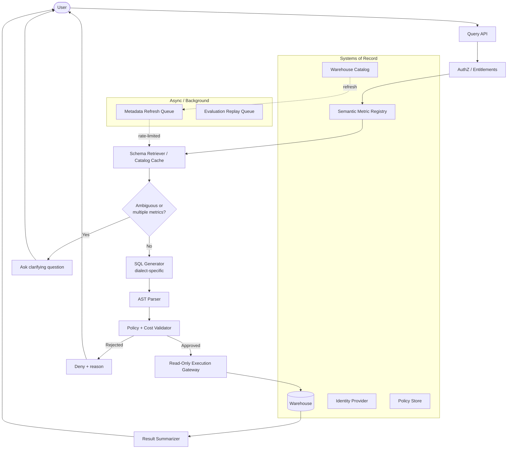
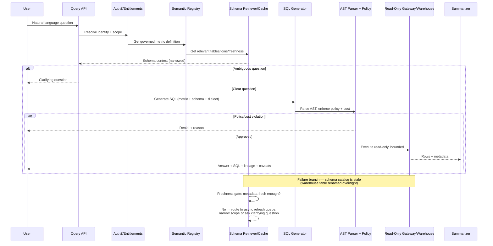
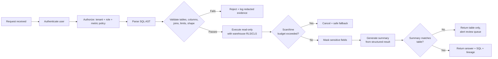
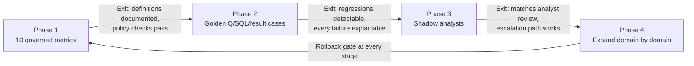

# Chapter 3: Design a Natural-Language-to-SQL Analytics Assistant

*Source: THE FORWARD DEPLOYED ENGINEER SYSTEM DESIGN INTERVIEW: 20 Real-World AI System Design Interviews*

---

## 1. The Customer Problem and Discovery

**Key Points**

- Executives want fast answers from the warehouse in plain English, but "revenue," "active customer," and other terms often have multiple competing definitions inside the same company.
- The real risk isn't that the system fails to produce SQL — it's that it produces *valid* SQL that confidently answers the *wrong* business question.
- The problem should be reframed from "build a text-to-SQL model" to "build a governed decision-support system that only speaks in terms the business has already agreed to."
- Clarifying questions about metric ownership, dialect, and blast radius change the architecture before a single line of code is written.
- Non-goals matter as much as goals: this is not a general-purpose BI replacement or a system that lets users write arbitrary write queries.

Executives ask analysts the same handful of questions every week — "What was revenue last week?", "How many active customers do we have?" — and each time, someone has to translate that English question into SQL, run it against the warehouse, and sanity-check the result. The obvious pitch is "let an LLM write the SQL." The moment you accept that framing at face value, you have already lost the interview, because the hard part of this system is not text-to-SQL generation. The hard part is that "revenue" might mean booked revenue, recognized revenue, or cash collected, and a syntactically perfect query against the wrong definition is a governance failure dressed up as a working feature.

The problem should be restated in outcome terms: give executives and analysts trustworthy, natural-language answers to governed business questions, without exposing raw schema, without silently picking an unapproved metric definition, and without letting an expensive or dangerous query slip through untouched. That framing immediately tells you the system needs a semantic layer (a governed catalog of metric definitions), a safety boundary around the warehouse (read-only, cost-bounded, policy-checked), and an explicit way to say "I don't know which definition you mean" rather than guessing.

**Clarifying questions that change the architecture:**

- Who owns each metric definition, and how often do definitions change?
- Is there already a semantic layer or metrics catalog, or does this system need to build one?
- What SQL dialect(s) and warehouse(s) are in scope — one dialect or many?
- What's the tolerance for latency versus cost? Can queries run synchronously, or is async/cached the norm?
- Who is allowed to see which columns — is row-level and column-level security already enforced by the warehouse, or does the assistant need to reimplement it?
- What happens when the assistant doesn't know the answer — does it ask a clarifying question, refuse, or escalate to a human?

**Non-goals (explicit scope fence):**

- This is not a system that lets users author arbitrary write queries or modify data.
- This is not a general-purpose data exploration tool for every table in the warehouse — it answers a *governed* set of business questions, not an open-ended one.
- It is not responsible for defining what "revenue" means — that is a business decision the semantic layer records, not a decision the assistant makes on the fly.

## 2. Who Cares, and Why

**Key Points**

- Three primary stakeholders — executives, analysts, and data/platform engineering — want different things from the same system, and those differences shape the architecture.
- Executives want speed and trust; analysts want to stop being a human query-translation layer; data engineering wants to avoid becoming an incident-response team for a chatbot that can generate arbitrary SQL.
- The stakeholder map is not decorative — it directly determines where the semantic layer sits, how strict the policy engine is, and what gets logged.
- A system that satisfies executives but ignores data engineering's safety requirements will get killed in production the first time it causes an incident.

For this problem, the stakeholder map is not decorative; it changes the architecture. Executives want fast, correct answers with minimal back-and-forth — they don't want to be told "let me check with analytics" for a question that should take ten seconds. Support and business analysts want the assistant to take over the repetitive definitional lookups so they can focus on judgment calls, but they don't want it inventing new interpretations of metrics they already maintain. Data and platform engineering care most about blast radius: they want a system that cannot scan the entire warehouse, cannot leak restricted columns, and cannot blow up the query budget for the whole company because one executive asked an ambiguous question.

Because these three groups want different things, the system has to satisfy all three simultaneously: fast for executives, accurate and non-threatening for analysts, and safely bounded for platform engineering. That tension is exactly why the semantic layer and the policy/cost validator both exist as first-class components rather than afterthoughts bolted onto a chat UI.

## 3. Requirements and What "Good" Looks Like

**Key Points**

- Functional requirements center on: accepting a natural-language question, resolving it to a governed metric definition, generating dialect-correct SQL, validating it against policy and cost limits, executing read-only, and returning an explainable answer.
- Non-functional requirements emphasize correctness over speed — a wrong answer that looks right is worse than a slow answer, or an answer that asks a clarifying question.
- "Good" is measured by whether the system can reliably answer ten governed metrics with full lineage and explainability before it is trusted with anything broader.
- Prioritization favors safety and governance controls over breadth of coverage — depth on a narrow slice beats shallow coverage of the whole warehouse.

The functional core of the system is a pipeline: take a natural-language question, resolve it against governed metric definitions, retrieve the schema and freshness context needed to answer it, identify ambiguity and ask a clarifying question if necessary, generate dialect-specific SQL, parse that SQL into an AST and enforce policy against it, estimate cost and execute with limits through a read-only gateway, and finally return the result along with the SQL, lineage, and any caveats.

Non-functionally, correctness dominates every other axis. A fast, confidently wrong answer is the single worst outcome this system can produce, because the executive receiving it has no way to know it's wrong — the SQL ran, the chart rendered, and the number looks plausible. That means the system should be explicitly willing to trade latency for safety: asking a clarifying question, narrowing scope, or refusing outright are all preferable to guessing. "Good" for an MVP is a small, tightly governed slice — roughly ten metrics with clear ownership and known lineage — rather than broad, shallow coverage across the entire warehouse. If the assistant cannot reliably answer ten metrics with full explainability, it is not ready to become a general interface to the warehouse.

## 4. Architecture and End-to-End Flow

**Key Points**

- The architecture is a chain of trust boundaries: identity and entitlements, a semantic metric registry, a schema/catalog cache, SQL generation, AST-based policy enforcement, a read-only execution gateway, and a result summarizer.
- The dependency-order component fan-out (12-bullet architecture) shows how a single question moves from the Query API through a control-plane-like sequence of checks before ever touching the warehouse.
- A named failure overlay — a stale schema catalog after an overnight table rename — demonstrates why freshness-awareness and backpressure matter as much as the happy path.
- Trust boundaries define three kinds of state: systems of record (owned truth), caches (performance layers with TTLs), and derived session state (short-lived, not durable by default).
- Partitioning keys (tenant, warehouse, region, dataset family) and the sync/async boundary (customer-visible path stays synchronous; expensive background work stays asynchronous) are both explicit design decisions, not implementation details.

### The component architecture

The system is best explained as a dependency-ordered chain rather than a flat list of boxes. A user question arrives at the **Query API**, which authenticates the caller and resolves their **entitlements** (what they're allowed to see). From there:

1. The **semantic metric registry** is consulted first — before touching physical tables — because a question like "What was revenue last week?" must anchor on the governed definition of revenue before the system starts searching for tables.
2. The **schema retriever / catalog cache** pulls only the tables, joins, and freshness information needed for the likely answer — it does not expose the whole warehouse schema.
3. If the question could map to multiple governed metrics or grain levels, the system **identifies ambiguity** and asks a clarifying question rather than guessing. A valid SQL query that answers the wrong business question is still a failure.
4. The **SQL generator** produces dialect-specific SQL using the metric definition, relevant schema, and warehouse dialect — it should not freewheel across the entire catalog, only work from a narrowed context.
5. The candidate SQL is parsed into an **AST** and passed through the **policy validator**, which inspects the structured tree (not raw text) to reject dangerous constructs: data modification statements, unbounded cross joins, unauthorized tables, unexpected functions, or queries that would violate the customer's scan budget.
6. If the query passes policy, the system **estimates cost**, applies timeout and row limits, and submits it through a **read-only execution gateway** — a key trust boundary that should hold the narrowest possible credentials and no write path.
7. The **result summarizer** returns the answer, the exact SQL used, metric lineage, and any caveats (for example, that the query used the latest available snapshot).

**Systems of record, queues, caches, and external dependencies** should be marked explicitly in any diagram or narration:

- **Systems of record:** identity provider, metric registry, warehouse catalog, the warehouse itself, policy store.
- **Caches:** schema snippets, metric lookups, recent query plans, possibly approved query fingerprints.
- **Queues:** metadata refresh queue, evaluation replay queue, analytics/event pipeline.
- **External dependencies:** warehouse engine, LLM or model endpoint, observability stack, possibly a secrets manager and email/chat system for alerts.



### The happy-path sequence

This is the concise sequence an interviewer can follow from first click to trusted result:

1. Authenticate and determine data entitlements
2. Retrieve metrics and schema context
3. Identify ambiguity
4. Generate dialect-specific SQL
5. Parse AST and enforce policy
6. Estimate cost and execute with limits
7. Return result, SQL, lineage, and caveats



### A failure path that changes the design

Now repeat the same path with one important dependency failure: the schema catalog is stale because a warehouse table was renamed overnight. The request still authenticates. The metric registry still identifies the governed definition. But the schema retriever pulls a stale join path from cache. If the system blindly generates SQL, the warehouse execution fails — or worse, succeeds against the wrong table alias if a similarly named object exists. The safer design makes the retriever **freshness-aware**: if metadata is stale beyond a threshold, it refreshes through an asynchronous queue before allowing generation, or it falls back to a narrower supported question set.

This is where **backpressure and flow control** belong: the crawler and registry refresh jobs should not stampede the warehouse or the metadata source during peak query traffic. Put them behind a queue, rate-limit refresh bursts, and let the query API degrade gracefully when metadata confidence drops. That keeps the customer-facing path responsive even when background maintenance is catching up.

This failure overlay shows a design principle: if freshness is uncertain, do not pretend precision. Either refresh, narrow the supported surface area, or ask a clarifying question. That is safer than executing a query whose logic depends on stale schema assumptions.

### Trust boundaries, state ownership, and consistency points

There are three kinds of state here, and each needs a clear owner:

- **System of record.** The warehouse catalog or lineage store owns physical schema truth; the semantic metric registry owns business definitions; the identity provider owns authentication; the entitlement or policy store owns access decisions.
- **Cache.** The schema retriever may cache table shapes and metric lookups, but only as a performance layer. Cached metadata should have TTLs and version stamps so the system can explain what it used.
- **Derived session state.** The question interpretation, candidate SQL, AST, validation result, and execution trace are short-lived workflow state. They should not become hidden durable state unless the product later needs audit replay or human-approval workflows.

Consistency points should be explicit. For example, the system should re-check entitlement and policy at the moment of execution, not only at query planning time. If a user loses access between planning and execution, the gateway should refuse the query. Likewise, if the metric registry version changes materially, the system should not silently reuse an old interpretation.

### Where synchronous and asynchronous boundaries belong

The customer-visible path should stay mostly synchronous: auth, entitlement lookup, metric retrieval, ambiguity check, generation, policy validation, and query execution all happen in the request path because the user is waiting for an answer.

The expensive or repetitive work should be asynchronous: catalog crawling, metric refreshes, embedding or indexing updates if you use them later, query evaluation logging, offline regression tests, and usage analytics. Those tasks belong in background jobs fed by queues. That keeps latency stable and lets the team scale maintenance independently of question volume.

A useful interview phrase: "Anything that must be correct *before* one answer is returned stays synchronous; anything that improves future answers can be asynchronous."

A second useful concept to call out explicitly is the **partitioning key**. If metadata refresh jobs, evaluation replays, or audit events are queued, the partitioning key should preserve the natural isolation boundary — often tenant, warehouse, region, or dataset family. That prevents one noisy customer or one large catalog refresh from starving unrelated work. The key choice also shapes replay ordering: if a consumer must preserve per-tenant event order, partition by tenant; if the goal is to parallelize crawl work by dataset family, partition by source domain. In other words, partitioning is not an implementation detail; it is part of how you enforce fairness and reduce contention.

### Component responsibility table

| Component | Responsibility | State owner | Boundary type | MVP or later |
|---|---|---|---|---|
| Catalog crawler | Ingest warehouse schema, comments, freshness, lineage | Warehouse metadata source | Async background | MVP if warehouse is small; later if manually seeded initially |
| Semantic metric registry | Governed metric definitions and allowed grains | Product/data governance | Sync read, async update | MVP |
| Schema retriever | Fetch relevant tables, joins, freshness, permissions | Cache with source-of-record fallback | Mostly sync | MVP |
| SQL generator | Produce dialect-specific candidate SQL | Stateless service | Sync | MVP |
| AST parser | Normalize and inspect candidate SQL | Stateless service | Sync | MVP |
| Policy and cost validator | Enforce entitlement, query shape, scan limits, and execution rules | Policy store | Sync | MVP |
| Read-only execution gateway | Submit approved queries with limits and audit | Warehouse credentials / gateway | Sync | MVP |
| Result summarizer | Convert rows into explanation, SQL, lineage, caveats | Stateless service | Sync | MVP |
| Evaluation harness | Replay prompts, compare outputs, detect regressions | Test corpus / telemetry store | Async | Later evolution, but useful early |

This table is not decorative. In an interview, every box should answer "who owns this state, how fresh is it, and why does it exist?" If you cannot answer that, the box is probably premature.

### What belongs in the MVP, and what can wait

For an MVP, keep the architecture tight: metric registry, schema retrieval, generation, AST validation, read-only execution, summarization, and a thin evaluation harness. That is enough to prove that the assistant can answer a governed business question safely.

Later evolution can add richer query planning, human approval for ambiguous cases, learned query ranking, federated data sources, embedded semantic search over data dictionaries, and more sophisticated offline scoring. Those additions help, but they are not the first thing to build if the primary problem is "executives need answers they can trust."

### Job-market signal

This section demonstrates a skill interviewers value heavily in FDE roles: the ability to decompose one customer promise into a usable system and explain it to both technical and nontechnical stakeholders. The architecture is only convincing if you can narrate how policy, identity, metadata, execution, and explanation all line up behind the customer outcome.

### Takeaway

The diagram is useful only when the candidate can narrate data, identity, state, and failure through it. If you can trace one request, name the systems of record, identify the synchronous and asynchronous boundaries, and explain why a stale metadata cache changes behavior, you are no longer drawing boxes — you are defending an architecture that can ship.

## 5. Data Model, APIs, and Working Code

**Key Points**

- The safest way to prove this design is to stop talking about "AI" and name the state that actually has to survive production: metrics, schema assets, and query runs.
- Three core records anchor the system: **Metric** (the governed semantic contract), **SchemaAsset** (what the warehouse physically exposes), and **QueryRun** (the audit trail for every attempted answer).
- API contracts must make idempotency, versioning, authentication, and error semantics concrete — not just enumerate endpoint names.
- A small, interview-sized code sketch proves the critical invariant — an actor without permission cannot query a hidden column — even if the SQL text is syntactically valid.
- Contract tests and failure-injection tests defend that invariant; a valid SQL string that survives unit tests but still misleads an executive is the failure this design exists to prevent.

The safest way to prove this design is to stop talking about "AI" for a moment and name the state that actually has to survive production: metrics, schema assets, and query runs. Once those records are explicit, the API surface becomes smaller, the policy checks become testable, and the assistant stops being a vague chat layer and starts behaving like a governed system.

### Core records and their lifecycle

**Metric** is the semantic contract the business trusts. It needs an `id` as the stable primary key, plus `name`, `definition`, `dimensions`, `owner`, and `version`. The `definition` is where you pin the business meaning in prose or structured metadata; `dimensions` tell the model what slicing is allowed; `owner` identifies the accountable domain team; `version` is critical because the same metric name can evolve without silently breaking downstream interpretation. In practice, the lifecycle is: draft, review, approved, deprecated. Retention should keep historical versions long enough that an older dashboard answer can be reconstructed and explained, not just overwritten.

**SchemaAsset** represents what the warehouse physically exposes. Its primary key is `id`, with fields like `engine`, `object`, `columns`, and `sensitivity`. This is the bridge between natural language and the actual queryable surface. The `engine` matters because SQL dialects differ; `object` should identify a table or view; `columns` should include names and types; `sensitivity` should capture whether a column is public, internal, restricted, or masked. Lifecycle-wise, this record should track discovery and refresh events whenever schema changes. Retention should preserve enough history to explain why a generated query was valid last week and invalid today.

**QueryRun** is the audit trail for every attempted answer. Its primary key is `id`, with `actor`, `sql_hash`, `policy_decision`, `bytes_scanned`, and `result_ref`. The `sql_hash` keeps the raw SQL from becoming the only durable artifact; `policy_decision` records allow/deny and why; `bytes_scanned` ties the run to a cost envelope; `result_ref` points to the stored answer or failure payload. This record should be write-once, append-only, and retained according to the customer's audit and analytics policy, because query history is often the first place incident review or adoption analysis starts.

### Contracts the interviewer expects you to make concrete

For the API layer, the point is not to enumerate endpoints mechanically. It is to show how each endpoint expresses idempotency, versioning, authentication, and error semantics.

- **`POST /v1/analytics/questions`** accepts a user question, a workspace or tenant context, and an idempotency key. It should authenticate the caller with the same workspace-scoped identity used for warehouse access, reject cross-tenant access, and return a 202 or 200 depending on whether generation is asynchronous or served from cache. The response should include a request id, an eventual `query_run_id`, and optionally a short explanation of the chosen metric or policy gate. If the same caller resubmits the same idempotency key, the service should return the original outcome instead of creating a new run. Errors should distinguish unauthorized, ambiguous question, policy denied, schema unavailable, and execution failed.
- **`POST /v1/analytics/validate`** is the narrowest safe surface for the dangerous part: generated SQL. It should accept a SQL AST or a normalized SQL representation, authenticate the caller, and return an approval decision, a denial reason, and any budget or policy violations. This endpoint is useful both for the assistant runtime and for offline tests. It should be idempotent for the same AST plus policy version and return the same decision blob for the same inputs unless the policy bundle or schema snapshot version changes.
- **`GET /v1/metrics/{id}`** returns the current metric definition and versioned metadata. Because definitions evolve, the response should include version, owner, last updated time, and deprecation state. The caller should be able to request a specific version when reproducibility matters. Authentication should be read-only scoped, and errors should include not found, forbidden, and version-mismatch or stale-reference cases if the client asks for an unavailable version.
- **`POST /v1/query-runs/{id}/feedback`** records whether the answer was useful, wrong, or unsafe. Feedback is valuable only if it is bound to the exact run version and cannot overwrite prior audit facts. The request should include a feedback type, optional free-text note, and the caller identity; the response should confirm persistence with the stored feedback id or a duplicate-no-op if the same idempotency key is replayed. Errors should distinguish not found, forbidden, and conflict if the caller tries to mutate a final feedback state.

Put differently, the API story should make four things obvious: the caller is authenticated, the write is idempotent where retries are expected, the response exposes the versioned artifact that mattered, and error semantics are precise enough for a client to react without guessing.

Idempotency belongs on every write boundary where retries are plausible: question submission, validation requests that trigger persisted decisions, feedback writes, and any asynchronous task enqueue. Versioning belongs on every artifact that influences behavior: metric definitions, schema snapshots, policy bundles, and the generated SQL plan. A design that ignores versioning usually works in the happy path and fails in the first real rollout.

### The smallest risky code path

The highest-risk component is not the chat UI or the summarizer; it is the transition from generated SQL to an approved, read-only query. The candidate should zoom there first and implement the smallest code path that proves the design can work safely.

```python
from dataclasses import dataclass
from typing import Protocol, Sequence

class PolicyError(Exception):
    pass

class BudgetError(Exception):
    def __init__(self, bytes_scanned: int):
        super().__init__(f"Query exceeds byte limit: {bytes_scanned}")
        self.bytes_scanned = bytes_scanned

class ParseError(Exception):
    pass

@dataclass(frozen=True)
class Actor:
    id: str
    byte_limit: int

@dataclass(frozen=True)
class QueryPlan:
    sql: str
    assets: Sequence[str]
    max_rows: int
    timeout_s: int

class SqlAst:
    statement_type: str

class SqlParser(Protocol):
    def parse_one(self, sql: str) -> SqlAst: ...

class Catalog(Protocol):
    def resolve_assets(self, ast: SqlAst) -> Sequence[str]: ...

class PolicyEngine(Protocol):
    def require_all(self, actor: Actor, action: str, assets: Sequence[str]) -> None: ...

class Warehouse(Protocol):
    def explain(self, sql: str) -> str: ...

def approve(sql: str, actor: Actor, sql_parser: SqlParser, catalog: Catalog,
            policy: PolicyEngine, warehouse: Warehouse) -> QueryPlan:
    try:
        ast = sql_parser.parse_one(sql)
    except Exception as exc:  # parser-specific failures are mapped to a boundary error
        raise ParseError("Invalid SQL") from exc

    if getattr(ast, "statement_type", None) != "SELECT":
        raise PolicyError("Only read-only queries are permitted")

    assets = catalog.resolve_assets(ast)
    if not assets:
        raise PolicyError("Query must reference governed assets")

    policy.require_all(actor, "read", assets)

    estimate = warehouse.explain(sql)
    if estimate.bytes_scanned > actor.byte_limit:
        raise BudgetError(estimate.bytes_scanned)

    return QueryPlan(sql=sql, assets=tuple(assets), max_rows=10_000, timeout_s=30)
```

**Line-by-line intent:** `Actor` carries the caller identity and the byte budget that enforces the read-only cost envelope. `QueryPlan` is the approved contract returned after policy and budget checks. The parser, catalog, policy engine, and warehouse are typed interfaces so the implementation remains testable and replaceable.

Inside `approve`, parsing happens first because malformed SQL should fail before any metadata lookup or warehouse estimation. The read-only gate rejects non-`SELECT` statements early. Asset resolution ensures the query touches governed objects rather than an accidental scratch table. Policy enforcement checks that the actor is entitled to read every referenced asset. The warehouse `explain` call estimates cost without executing the query, and the byte limit prevents runaway scans before they hit production. The returned plan clamps row count and timeout so the runtime remains bounded even if the downstream executor misbehaves.

This sketch intentionally omits concurrency control, retries, backoff, telemetry correlation, and persistence. In production, the approval path should emit structured logs and traces at each decision point, record the policy version and schema snapshot used, and persist the query run with an idempotency key so duplicate submissions do not fan out into duplicate warehouse work.

### Tests that defend the contract

```python
class AllowAllPolicy:
    def require_all(self, actor, action, assets):
        return None

class FakeEstimate:
    def __init__(self, bytes_scanned: int):
        self.bytes_scanned = bytes_scanned

class FakeWarehouse:
    def __init__(self, bytes_scanned: int):
        self.bytes_scanned = bytes_scanned

    def explain(self, sql: str):
        return FakeEstimate(self.bytes_scanned)

def test_contract_approves_select_within_budget():
    actor = Actor(id="user-1", byte_limit=1_000)
    plan = approve(
        "SELECT * FROM warehouse.sales.orders",
        actor,
        FakeParser(FakeAst("SELECT")),
        FakeCatalog(),
        AllowAllPolicy(),
        FakeWarehouse(bytes_scanned=250),
    )
    assert plan.max_rows == 10_000
    assert plan.timeout_s == 30
    assert "warehouse.sales.orders" in plan.assets

def test_failure_injection_rejects_oversized_query():
    actor = Actor(id="user-1", byte_limit=100)
    with pytest.raises(BudgetError) as exc:
        approve(
            "SELECT * FROM warehouse.sales.orders",
            actor,
            FakeParser(FakeAst("SELECT")),
            FakeCatalog(),
            AllowAllPolicy(),
            FakeWarehouse(bytes_scanned=10_000),
        )
    assert exc.value.bytes_scanned == 10_000
```

These are deliberately small, but they prove the safety boundary. The first test is the contract test: it asserts that a valid, governed, read-only query results in a predictable plan. The second is the failure-injection test: it simulates a valid query that becomes unsafe because its cost estimate exceeds the actor's limit.

### Duplicate requests and optimistic concurrency

If an executive clicks twice or a client retries after a timeout, the system should not create two query runs with two separate side effects. The idempotency key on `POST /v1/analytics/questions` allows the service to return the original `QueryRun` if the same caller resubmits the same intent. Optimistic concurrency matters when updating metric definitions or schema assets: the client should include the expected version, and the server should reject stale writes instead of silently overwriting a newer approval. That is how you preserve data ownership and prevent one team from changing the meaning of another team's metric without detection.

### Why this moves the job conversation forward

This is the point where an FDE answer stops sounding like architecture theater and starts sounding like something that could ship. You are showing that you can move from a customer promise to concrete records, API contracts, typed validation, and a safe implementation slice. That is the production-grade leap interviewers look for: not just that you can describe the system, but that you can translate the risky part into code, tests, and boundaries the team can trust.

The strongest closing sentence in the interview is simple: the assistant is credible only when the state transitions are explicit, the contracts are versioned, and the generated SQL cannot escape typed validation and policy checks before the warehouse ever sees it.

## 6. Security, Reliability, and Failure Handling

**Key Points**

- The design review gets harder when the query is correct and the answer is still wrong — that is the failure that survives unit tests and still misleads an executive.
- Defense in depth relies on four controls in sequence: least privilege identity, warehouse-native row/column policy enforcement, SQL parsing (not regex filtering), and result hygiene (masking sensitive fields and logging redacted evidence).
- A failure-policy table makes explicit what fails open, what fails closed, what degrades, what queues, and what escalates to a human — this is a design decision, not an afterthought.
- Five concrete failure drills should be ready to narrate: a valid SQL answer to the wrong business question, schema changes invalidating examples, a generated join multiplying rows, a query scanning excessive data, and a summary contradicting the underlying table.
- Operational safeguards (timeouts, retries, dead letters, escalation) and an observability story built on audit evidence are what make this system defensible in production, not just in a demo.

In the review, security and operations do not attack the obvious mistakes. They assume the assistant can produce syntactically valid SQL, connect to the warehouse, and return a polished answer. Then they inject the failure that matters: the SQL is valid, the answer is plausible, and it answers the wrong business question. That is the failure that can survive unit tests, pass schema checks, and still mislead an executive. The candidate's job is not just to block bad SQL; it is to contain impact, preserve evidence, and make the error visible before anyone acts on it.

That changes how you think about safety. The assistant is not a free-form generator with a dashboard on top. It is a constrained system with multiple gates: read-only credentials, warehouse-native row and column policies, SQL parsing, result masking, and auditable execution records. Each gate reduces risk differently. Together they create defense in depth: if one layer fails, the others still narrow the blast radius.

### Threat model the controls, not just the model

**The first control is least privilege.** The assistant should use a read-only identity that can inspect only the approved datasets and only the operations required for analysis. That does not make the system harmless, but it prevents a prompt injection or bad planner output from turning into a write, delete, or privilege-escalation event. In an abuse case, a user tries to ask for hidden customer emails or internal staff data. The safe response is not, "the model will probably refuse." The safe response is: the warehouse identity cannot read that column, and the query is rejected before execution.

**The second control is to reuse warehouse-native row and column policies** rather than reimplement authorization in application code. If the warehouse already knows which tenant, region, or role can see which slice of data, let the warehouse enforce it. That keeps policy close to the data and avoids the classic bug where the application filters one path but forgets another. It also makes blast radius legible: an error in one tenant's policy should not expose another tenant's data, and an error in one workflow should not grant broad access to the whole corpus.

**The third control is to parse SQL rather than regex-filter it.** Regex can spot obvious `DROP TABLE` strings, but it cannot reliably understand aliases, nested selects, CTEs, comments, obfuscation, or harmless-looking subqueries that become unsafe after rewrite. A parser lets you inspect the structure: statements allowed, tables allowed, columns allowed, joins allowed, functions allowed, limits present, and aggregate semantics acceptable. In interview terms, this is a strong signal of production judgment: you are showing that safety depends on syntax trees and policy rules, not pattern-matching theater.

**The fourth control is result hygiene.** Mask sensitive fields in the response path, and log hashes or redacted fingerprints instead of raw data when you need auditability. That gives operations a way to correlate events without creating a second leakage channel in logs. If the assistant returns a customer list or a partially redacted summary, the logs should show enough evidence to reconstruct the decision path while avoiding a replayable copy of sensitive output.

**A concrete implementation sketch — proving the hidden-column invariant:**

```python
class PolicyError(Exception):
    pass

@dataclass(frozen=True)
class Actor:
    name: str
    permitted_columns: frozenset[str]

marketing_user = Actor(name="marketing", permitted_columns=frozenset({"customer_id", "country", "plan"}))

def parse_selected_columns(sql: str) -> list[str]:
    """Very small teaching parser for a constrained interview sketch.

    Production code should use a real SQL parser and dialect-aware validation.
    """
    normalized = " ".join(sql.strip().split())
    upper = normalized.upper()
    if not upper.startswith("SELECT ") or " FROM " not in upper:
        raise PolicyError("Only simple SELECT queries are allowed in this sketch")

    select_part = normalized[7 : upper.index(" FROM ")].strip()
    if select_part == "*":
        raise PolicyError("Wildcard selects are not allowed")

    columns = [c.strip() for c in select_part.split(",")]
    if any(not c for c in columns):
        raise PolicyError("Malformed column list")
    return columns

def approve(sql: str, actor: Actor) -> bool:
    columns = parse_selected_columns(sql)
    denied = [col for col in columns if col not in actor.permitted_columns]
    if denied:
        raise PolicyError(f"actor {actor.name} may not access columns: {', '.join(denied)}")
    return True

def test_rejects_hidden_column_exfiltration():
    sql = "SELECT email FROM customers"
    with pytest.raises(PolicyError):
        approve(sql, actor=marketing_user)
```

This test proves the invariant in a small, readable way: a valid SQL string is still rejected when it requests a column outside the actor's permissions. In a real service, the parser would be dialect-aware, the policy source would come from the warehouse or a centralized policy registry, and the decision would be logged with redacted evidence and hashes rather than raw results.

### Why this is what employers are actually testing

This section is not just about security hygiene. It is a production judgment test. Employers want to know whether you can own the safe rollout, support, and incident response for a customer-facing analytics assistant. The happy path is the easy part. The hard part is knowing what to do when the assistant is fast, plausible, and wrong; when a schema change breaks examples; when a join explodes the result set; when scans threaten cost and latency; and when the summary text disagrees with the table.

The strongest FDE answer is not "the model is accurate enough." It is: every external dependency and irreversible action has an explicit failure and recovery policy, and the system is designed so a bad answer cannot quietly become a trusted business decision.

### The failure policy table is part of the design, not an afterthought

A strong FDE answer says exactly what fails open, what fails closed, what degrades, what queues, and what escalates to a human.

| Situation | Preferred policy | Why |
|---|---|---|
| Authorization or policy evaluation fails | Fail closed | Better to deny than to expose data accidentally |
| Warehouse connection is briefly unavailable | Degrade or queue, depending on freshness needs | Preserve request intent if the use case tolerates delay |
| Query planner exceeds a safe timeout | Fail closed with a retry suggestion | Prevent runaway cost and long-tail blocking |
| Low-risk formatting or explanation service fails | Degrade | User may still get a safe, reduced answer path |
| Ambiguous metric mapping or business-definition conflict | Human intervention | A wrong answer is worse than a slower answer |
| Execution produces a suspicious row count or scan volume | Fail closed and alert | Treat unexpected scale as a probable correctness or cost issue |

This table matters because the assistant sits at the intersection of customer trust, cost control, and safety. Not every incident deserves the same reaction. A policy engine outage is a different problem from a visualization glitch, and a query scan that explodes cost is different from a benign cache miss.

### Failure drills you should be ready to narrate

**Valid SQL answers the wrong business question.** This is the critical incident drill. Security and operations inject a case where the assistant returns an answer that is formally correct against the warehouse but semantically wrong for the executive's intent. For example, the user asks for "active customers," but the assistant quietly uses login activity when the business definition requires paid activity. The SQL returns rows, the chart renders, and the executive is about to make a decision.

The response sequence should be:

1. **Detect**: compare the generated query against governed metric metadata, approved aliases, and business-definition constraints. If the assistant selected a metric or join path that conflicts with the approved definition, flag it.
2. **Contain**: stop publication of the answer, mark the run as blocked, and prevent downstream sharing.
3. **Preserve evidence**: store the prompt hash, SQL text, policy decision, version identifiers for schema and metric assets, and the reason for rejection. Do not erase the trail just because the answer was wrong.
4. **Recover**: route the user to a clarified metric choice or a human-reviewed path.
5. **Prevent**: add or tighten the metric mapping, test case, or disambiguation prompt so the same semantic mistake is harder to repeat.

That sequence demonstrates blast radius thinking. The issue is not "all analytics is broken." The issue is scoped by tenant, by workflow, by metric family, and by dependency. One wrong definition should not compromise unrelated tenants or unrelated dashboards.

**Schema changes invalidate examples.** When a warehouse schema changes, previously good examples may become stale. A column disappears, a table is renamed, or a join key shifts. The assistant should detect this during plan validation rather than waiting for a failed warehouse call. The correct behavior is usually to fail closed on the affected template, refresh the schema cache, and queue a review if the business definition itself changed. Schema drift is a common source of silent failure because the system may still produce something that looks reasonable.

**A generated join multiplies rows.** Join explosions are particularly dangerous in analytics assistants because they can inflate totals while still producing valid SQL. The assistant should validate join cardinality assumptions where possible, compare expected row counts against heuristics, and block suspicious fan-out unless the user explicitly asked for a detailed expansion. If the assistant cannot prove the join is safe, the failure policy should be to refuse or downgrade the query, not to hope the aggregate still looks plausible.

**A query scans excessive data.** Cost is a reliability issue. A query that reads too much data can exhaust concurrency, slow down other tenants, or drive an unexpected bill. The assistant should enforce query limits, timeouts, and planner guards; it should prefer bounded date windows, pre-aggregations, and explicit user confirmation when a request would scan beyond a configured threshold. If the scan is excessive, fail closed or ask for narrowing criteria. Do not let the model "just try it."

**The summary contradicts the table.** This is the subtle postprocessing bug. The generated table is correct, but the natural-language summary misstates the totals, trend, or comparison. That is a dangerous UX failure because the executive reads the prose, not the rows. The remedy is to generate the summary from the structured result, cross-check key values, and reject any summary whose numbers do not match the returned table. If the summary generator is down or untrusted, degrade to the table alone rather than fabricate confidence.

### Operational safeguards: timeouts, retries, dead letters, and escalation

The system needs explicit timing and retry behavior at every boundary. A warehouse query should have a bounded timeout; a retry should be limited and idempotent; and retries should only happen when the failure mode is likely transient. A policy evaluation failure should not be retried indefinitely, because repeated failure on a bad prompt or a bad policy is not a network glitch. A queue-based fallback can help with transient warehouse outages or downstream report delivery, but a dead-letter path is required when repeated attempts still fail. That dead-letter record should preserve enough context for support to diagnose the issue without exposing raw sensitive output.

Human escalation is part of the design, not a sign of weakness. Any ambiguous metric mapping, conflicting policy, or repeated semantic mismatch should have a clear route to a reviewer. In an FDE interview, that answer is stronger than pretending everything can be automated. Production systems need operators, support playbooks, and decision points where a person is the correct recovery mechanism.

### The observability story is the evidence story

Before launch, you need audit evidence and runbooks. The audit trail should show who asked, what identity executed, which policy version was applied, which schema version was queried, and what data was returned, and why the system approved or rejected the request. Runbooks should cover blocked queries, policy failures, stale schema refresh, suspicious scan volume, and semantic mismatches. They should tell operations how to pause the assistant, preserve logs, notify the owner, and restore service without opening a broader hole.

**A compact failure-policy sketch — narrated as a flow:**

```
request received
  -> authenticate user
  -> authorize against tenant + role + metric policy
  -> parse SQL AST
  -> validate tables, columns, joins, limits, and query shape
  -> if policy or semantic check fails: reject + log redacted evidence
  -> execute with read-only identity and warehouse-native RLS/CLS
  -> if scan/time budget exceeded: cancel + surface safe fallback
  -> if results pass checks: mask sensitive fields
  -> generate summary from structured result
  -> if summary mismatch detected: return table only, alert review queue
```



This section is not just about security hygiene. It is a production judgment test. Employers want to know whether you can own the safe rollout, support, and incident response for a customer-facing analytics assistant. The happy path is the easy part. The hard part is knowing what to do when the assistant is fast, plausible, and wrong; when a schema change breaks examples; when a join explodes the result set; when scans threaten cost and latency; and when the summary text disagrees with the table.

The strongest FDE answer is not "the model is accurate enough." It is: every external dependency and irreversible action has an explicit failure and recovery policy, and the system is designed so a bad answer cannot quietly become a trusted business decision.

## 7. Delivery Plan, Observability, and Business Impact

**Key Points**

- The rollout has to prove three things in order: the assistant can answer a narrow set of governed questions correctly, it can do so safely under policy, and real users will adopt it because it improves their workflow.
- A four-phase rollout — start with ten governed metrics, build golden question/SQL/result cases, shadow analysts before executive release, then expand domain by domain with metric owners — each has explicit exit criteria and a rollback gate.
- Metrics fall into four buckets: technical health (bytes scanned, p95 latency, policy compliance), adoption (user trust score), business outcome (turnaround time, escalation volume, self-service rate), and the dashboard connects all four to root cause.
- Ownership and gates are part of the product, not paperwork: metric owner, application owner, data owner, security owner, and support owner each have a defined role and a go/no-go responsibility.
- A concrete risk register — mapping risk to owner, mitigation, and trigger — is more convincing in an interview than a polished architecture slide, because it shows you can operate the system, not just design it.

The prototype works. The customer's next question is the one that matters: when can this be trusted in production? That is the real FDE move. You do not answer with a vague promise or a giant launch date. You convert the architecture into staged delivery, measurable gates, and named ownership. For a natural-language-to-SQL analytics assistant, the rollout has to prove three things in order: the assistant can answer a narrow set of governed questions correctly, it can do so safely under policy, and real users will adopt it because it improves their workflow rather than merely impressing them in a demo.

### Roll out in phases, not all at once

A practical deployment sequence starts small and gets broader only after the evidence is strong enough to justify the next step.

**Phase 1: start with ten governed metrics.** Choose a tiny slice of the warehouse where the metric definitions are stable, the owner is known, and the business impact is visible. These should be the questions executives already ask every week: revenue, active customers, pipeline, churn, support backlog, or whatever the customer's own governed metrics are. The point is not breadth; it is repeatability. If the assistant cannot reliably answer ten metrics with clear lineage and known owners, it is not ready to become a general interface to the warehouse.

**Exit criteria:** metric definitions are documented, query templates are reviewed, policy checks pass, and the assistant can explain which metric it used and why.

**Phase 2: build golden question/SQL/result cases.** Create a curated test set that pairs the user's natural-language question, the approved SQL, and the expected result shape. This is not just a unit test list. It is the system's truth table. Include easy examples, ambiguous paraphrases, edge cases with filters and time windows, and known failure traps where a syntactically valid query would answer the wrong business question. These golden cases become the fastest way to detect regressions when prompts, schemas, policies, or warehouse logic change.

**Exit criteria:** the team can run the golden set on every change, compare execution accuracy and semantic correctness, and explain every failure.

**Phase 3: shadow analysts before executive release.** In shadow mode, the assistant answers real questions in parallel with human analysts, but the user still sees the analyst's output as the source of truth. This creates a safe comparison period. Analysts can mark where the assistant was correct, where it was merely plausible, and where it was wrong for subtle reasons such as the wrong time grain, the wrong business definition, or the wrong segment filter. Shadowing is where trust is earned, not assumed.

**Exit criteria:** the assistant consistently matches analyst-reviewed answers on the agreed scope, and the escalation path is working.

**Phase 4: expand domain by domain with metric owners.** Each new business area should have a named metric owner who approves definitions, reviews golden cases, and owns changes to the semantic layer. The assistant should not "learn the warehouse" in one leap. It should inherit one governed slice at a time, with a clear handoff from the implementation team to the business owner. That is how the system becomes reusable product leverage instead of a one-off pilot.



*Textual reading guide for the visual:* the left-to-right flow represents increasing blast radius, not increasing ambition. The upper band shows user-facing maturity: internal test, analyst shadowing, executive release, and domain expansion. The lower band shows the operating guardrails: policy checks, telemetry, review, and rollback. The arrows are conditional; the assistant only advances when the exit criteria for the prior stage are met.

### What to measure, and why each metric exists

A rollout is only defensible if the metrics are tied to a specific user and system risk. Separate the metrics into four buckets so the team does not confuse model quality with operational health or business value.

**Technical health** measures whether the service is fast, cheap enough, and available:

- **Bytes scanned per answer**: average warehouse bytes read for a successful response. Calculation: total scanned bytes across successful answers divided by successful answer count for the reporting window. Source: query telemetry from the warehouse. Owner: data platform or analytics engineering. Alert when the 7-day moving average rises more than 20% above the baseline for the governed metric set, because that usually means an inefficient query pattern or a broken constraint.
- **p95 latency**: the 95th-percentile end-to-end response time from user request to answer. Calculation: end-to-end request latency distribution measured from request receipt to final answer render, then take the 95th percentile over the reporting window. Source: request traces. Owner: platform or SRE. Owner: security or platform. Alert immediately on any escaped policy violation, and alert on repeated denies above a low tolerance, such as more than five identical blocked attempts in a day, because that often indicates a broken guardrail or a confusing product flow.

**Adoption** measures whether people actually use the assistant:

- **User trust score**: a lightweight post-answer rating or periodic survey of whether the answer was useful, understandable, and safe to rely on. Calculation: average of normalized in-product ratings, or percent of responses marked useful/trustworthy in the survey window. Source: in-product feedback. Owner: product or customer success. Alert when the score falls below the launch target, such as 4.2/5 or 80% positive, or when it declines for two consecutive review periods, even if raw usage rises.

**Business outcome** measures whether the workflow improved:

- Answer turnaround time before and after rollout.
- Analyst escalation volume for the governed metric set.
- Executive self-service rate for the targeted questions.

These last measures matter because a successful assistant does not just generate more traffic; it changes behavior. If executives keep asking analysts to re-check the answers, the product has not solved the customer problem.

### What the dashboard should show

A useful dashboard connects user outcome to component telemetry rather than dumping unrelated service metrics into one page. The customer should be able to answer three questions at a glance: is the assistant healthy, is it correct, and is it valuable?

A strong layout is layered:

- **Top row: business outcome.** Self-service rate, analyst escalation rate, and user trust score.
- **Middle row: model quality.** Execution accuracy, semantic correctness, clarification rate, and policy violation count.
- **Bottom row: system health.** p95 latency, bytes scanned per answer, error rate, and dependency availability.

Then connect each business metric to the component that can move it. If trust drops, the chart should help you see whether the cause is slow answers, too many clarifications, broken semantic mapping, or policy blocks that feel arbitrary to users. That is observability in the FDE sense: the dashboard should tell you where to act, not just what is red.

### Ownership, gates, and rollback are part of the product

A production plan without owners is just a hope. Every rollout step needs a named owner and a go/no-go gate.

- **Metric owner**: approves the governed metric definition and its golden cases.
- **Application owner**: owns the assistant runtime, prompt assembly, query generation, and API contracts.
- **Data owner**: owns the warehouse tables, semantic layer, and policy mappings.
- **Security owner**: reviews access control, audit logging, and blocked-query handling.
- **Support owner**: receives escalation, triages failures, and coordinates rollback or remediation.

The go/no-go gate should answer a simple question: do we have enough evidence that the assistant is correct, safe, and supportable for the next slice of users?

Typical rollback triggers include a spike in policy violations, a sudden drop in semantic correctness, a large increase in bytes scanned per answer, or a production pattern where users stop trusting the assistant and route around it. Rollback is not a failure of discipline; it is the mechanism that keeps a partial success from becoming a customer incident.

### Delivery items that make the rollout stick

The rollout is not complete until the customer can operate it without depending on the implementation team for every change.

- **Canary:** release to a small user group or a small metric set first, with tight monitoring and a clearly defined rollback path.
- **Migration:** move governed questions from legacy analyst workflows into the assistant in stages, not by big-bang replacement.
- **Training:** teach users what the assistant can answer, what it cannot, and how it signals uncertainty.
- **Support:** document escalation paths for wrong answers, access issues, and policy rejections.
- **Documentation:** maintain the governed metric catalog, known limitations, examples of good questions, and guidance on when to ask a clarifying question.

This is also where you decide what should become configuration, what should become an adapter, what should become a shared service, and what should stay core product. Metric definitions, allowed domains, and rollout thresholds are usually configuration. Warehouse and identity integrations are adapters. Query validation, policy enforcement, tracing, and audit logging are good candidates for shared services. The core product is the assistant's question understanding, explanation behavior, and safe query orchestration. That distinction matters because an FDE system creates leverage only when the next customer can inherit the stable core and swap the customer-specific edges.

### A concrete risk register the interviewer will respect

A simple risk register is often more convincing than a polished architecture slide because it shows that you can operate the system, not just design it.

| Risk | Owner | Mitigation | Trigger |
|---|---|---|---|
| Correct SQL answers the wrong business question | Analytics lead | Golden cases, semantic review, approved metric catalog | A valid query passes execution but fails analyst review |
| Policy block frustrates users | Security + product | Better clarifying prompts and explanation text | Repeated blocked attempts on the same workflow |
| Warehouse cost spikes | Platform owner | Query limits, result caching, scan monitoring | Bytes scanned per answer drifts upward |

### Requirement coverage and answer to the customer

The prototype becomes production-worthy only when the delivery plan proves safety, correctness, adoption, and supportability in sequence. That is the answer to the executive's question: trust is earned through staged rollout, measurable gates, explicit ownership, and the ability to prove business value after launch.

## 8. Interview Walkthrough, Trade-Offs, and Practice

**Key Points**

- The strongest opening move is to begin where the customer is already hurt — executives want governed natural-language answers with correct definitions and no unsafe queries — not to open with an architecture diagram.
- A 50-minute pacing plan moves from success/failure definitions, through architecture, trade-offs, and security, to a concrete implementation slice — each phase has a clear time box.
- Four named trade-off pairs deserve a rehearsed, balanced verdict: raw schema prompting versus semantic layer, automatic execution versus approval, flexibility versus query templates, and answer speed versus warehouse cost.
- Three hard interviewer questions should be pre-rehearsed: handling a term with multiple definitions, handling SQL that is valid but catastrophically expensive, and defending the riskiest assumption in the whole design.
- A seven-dimension self-scoring rubric (estimation, architecture, depth, security, delivery, communication, and a 90-second summary) is the practical way to know whether you are ready, and a three-part practice plan turns that rubric into rehearsal.

### Minute-zero opening: start with outcome, not architecture

The strongest way to answer this problem is to begin where the customer is already hurt: executives want natural-language answers from a governed warehouse, with correct business definitions and no unsafe queries.

**Minutes 5-10: define success and failure.** State the success metrics in business language: correct metric interpretation, acceptable latency, low unsafe-query rate, and useful adoption by analysts or executives. Then name the failure modes: a valid SQL query that answers the wrong business question, leakage across row-level security, and expensive scans that look harmless in a demo but burn warehouse budget in production.

**Minutes 10-18: sketch the architecture.** Describe the user interface, orchestration service, semantic layer, SQL generator, policy engine, warehouse, and observability path. Put the semantic layer in the center if governed metrics matter; raw schema access should be an escape hatch, not the default. Explain that the assistant should produce a draft plan, generate SQL against a constrained schema view, validate the query, and either execute automatically or route to approval based on risk.

**Minutes 18-28: discuss trade-offs.** Cover the major design choices one by one: raw schema prompting versus semantic layer; automatic execution versus approval; flexibility versus query templates; answer speed versus warehouse cost. Give a reason for each choice, not just a preference. Tie each decision back to the customer's outcome.

**Minutes 28-35: security and correctness.** Explain end to end, and ensure the service account cannot query unrestricted data on behalf of users. Avoid letting the model freely rewrite access predicates. If the assistant needs to inspect schema metadata, that metadata should also be filtered to what the user can see. The right interview answer emphasizes defense in depth: identity, policy enforcement, constrained views, query validation, and audit logging.

### Named trade-offs with balanced verdicts

**Raw schema prompting versus semantic layer.** Raw schema prompting is faster to prototype and works for unusual questions. In an FDE interview, the balanced answer is usually: default to the semantic layer for governed business metrics; allow raw schema access only for approved exploratory workflows or fallback paths.

**Automatic execution versus approval.** Automatic execution improves speed and makes the product feel magical. It is useful for low-risk, repeatable questions with strong guardrails. But full auto-execution is dangerous when the query may touch sensitive rows, incur high cost, or answer an ambiguous request. Approval adds latency and user friction, but it creates a human checkpoint for ambiguous or high-impact requests. The practical design is risk-based execution: auto-run only when confidence is high, the query fits an approved pattern, the user has permission, and the estimated cost is below a threshold. Otherwise, show the draft SQL and ask for confirmation or analyst review.

**Flexibility versus query templates.** Maximum flexibility lets users ask almost anything, but it expands the search space and makes safety harder. Query templates constrain the assistant to known-good patterns such as funnel analysis, weekly cohort summaries, or regional revenue rollups. Templates reduce error rate and cost, but they can make the product feel brittle when the user asks a new kind of question. The best answer is a hybrid: templates for common governed workflows, free-form generation for long-tail questions, and a policy gate that decides when the free-form path is allowed. That gives the interviewer a believable product strategy, not just an abstract architecture.

**Answer speed versus warehouse cost.** Fast answers feel good, but unconstrained speed usually means unconstrained scanning. The balanced position is to bound the search space with the semantic layer and schema retrieval, cache aggressively for repeat questions, and treat any large or unbounded scan as a signal to narrow scope or ask a clarifying question rather than a signal to optimize the query further.

### Deliberate challenge to the riskiest assumption

**How do you handle "revenue" with three definitions?** Name the ambiguity and force clarification. "Revenue" might mean booked revenue, recognized revenue, or cash collected. The assistant should not guess silently. It should either ask a clarifying question, show the supported definitions, or default only if the business has an approved canonical meaning for that context. If users frequently ask this term, put it in the semantic layer with explicit aliases and documentation. The key is that the system must surface the definition it used, not hide it.

**What if the SQL is valid but catastrophically expensive?** Valid SQL is not safe SQL. Add a cost-estimation and policy-check step before execution. That step can look for large unbounded scans, missing date filters, explosive joins, or queries that exceed table-specific budget thresholds. If the estimated cost is too high, the assistant should either ask the user to narrow the question, propose a cheaper rewrite, or require approval from a more privileged role. For the interview, make clear that the system must protect both the warehouse and the user experience.

**Deliberate challenge to the riskiest assumption.** A strong interviewer will eventually push on the assumption that the model can infer the right business meaning from the prompt. That is the riskiest assumption in this whole design. A good response is not defensive; it is structural. Say: "I would not rely on the model to infer business definitions from raw text. I would anchor every answer to a governed semantic layer, and treat any question that falls outside that layer as an explicit ambiguity to resolve, not a guess to make."

### A seven-dimension scoring rubric

- **Estimation:** Did you make reasonable assumptions and explain their impact?
- **Architecture:** Did you produce a coherent end-to-end design with the semantic layer, policy checks, execution path, and observability?
- **Depth:** Did you handle ambiguity, cost control, and failure paths rather than staying at diagram level?
- **Security:** Did you address authorization, row-level security, query validation, and auditability?
- **Delivery:** Did you explain rollout gates, fallback behavior, and operational support?
- **Communication:** Did you use a clear executive summary, stay concise, and defend trade-offs directly?

If you miss one category badly, do not just memorize a better phrase. Fix the design gap underneath it.

### A 90-second architecture summary you can deliver aloud

"We're building a governed natural-language-to-SQL assistant for executives and analysts who need fast answers but cannot afford incorrect metrics or unsafe queries. I'd put a semantic layer between the model and the warehouse so the assistant generates SQL from approved business definitions rather than raw table names. The service would accept a user question, classify intent and risk, resolve the relevant metric definitions, generate a constrained draft query, validate it for policy and cost, and then either execute automatically or route for approval depending on sensitivity and confidence. Row-level security must be enforced in the warehouse, not in the prompt. I'd log the question, the generated SQL, the metric mapping, the cost estimate, the execution result, and the user identity for audit and debugging. The biggest trade-off is flexibility versus correctness: I'd optimize for governed answers first, then add templates and fallback pathways for the long tail. My first rollout gate would be a small set of executive metrics with a golden test corpus and a hard stop on ambiguous or expensive queries."

That summary is short enough for a live interview and specific enough to show judgment.

### Practice plan after the interview

Do one solo exercise: time yourself giving the 50-minute structure in under ten minutes, then tighten any section that drifts.

Do one pair mock: have a partner interrupt you with the hard follow-ups on equivalent SQL, row-level security, revenue definitions, and expensive queries; answer without rambling.

Do one implementation exercise: sketch the query validation and approval flow for a single governed metric, including how you would block dangerous SQL and surface clarification prompts.

The pattern to remember is simple: a strong answer is structured, quantitative, safe, customer-aware, and explicit about trade-offs. If you can keep those five properties in view under pressure, you will sound like someone who can ship this system, not just describe it.

---

## Coverage Notes

This tutorial was reviewed once against the fixed 20-item decomposition rubric before delivery.

**Fully covered (16/20):**

1. Feature → business-outcome reframing — Section 1 explicitly reframes "build text-to-SQL" into "build a governed decision-support system."
2. Stakeholder / persona mapping — Section 2 covers executives, analysts, and data/platform engineering explicitly.
3. Clarifying questions that would change the architecture — Section 1 lists six architecture-shaping questions.
4. Requirements split (functional/non-functional) + prioritization — Section 3 covers both explicitly, with correctness prioritized over speed.
5. Explicit non-goals / scope fence — Section 1 lists three non-goals.
6. Back-of-envelope scale & capacity math — addressed implicitly through cost/scan-budget mechanics (bytes scanned, byte limits) in Sections 5 and 6, though the source does not provide traditional QPS/storage estimation math for this chapter.
8. End-to-end architecture & data flow — Section 4 is the most thorough section, with full component fan-out, sequence, and failure overlay.
9. Data model & API contracts — Section 5 covers three core records and four API endpoints in full depth.
11. Named trade-off pairs with a balanced verdict — Section 8 covers four trade-offs with rehearsed verdicts.
12. Threat model / security controls — Section 6 covers four named controls in the "Threat model the controls" subsection.
13. Failure-mode & reliability drills — Section 6 covers five named failure drills plus operational safeguards.
14. Testing strategy — Section 5 includes contract tests and failure-injection tests; Section 6 includes a hidden-column policy test.
15. Layered evaluation metrics & observability — Section 7 covers four metric buckets and a layered dashboard design.
16. Phased rollout, risk register, rollback gates — Section 7 covers a four-phase rollout, a risk register, and rollback triggers.
18. Responsible-AI or equivalent risk framing beyond the obvious failure mode — present through the "wrong business question" framing and the "safety, not accuracy" framing throughout Sections 4-6, though framed as correctness/governance risk rather than bias/fairness risk (not double-counted as a separate gap since the source's own framing is governance-first).
19. Change-management / adoption narrative — Section 7 covers training, migration, canary, and adoption metrics.
20. Structured communication plan + self-scoring rubric — Section 8 covers the full pacing plan, rubric, and 90-second summary.

**Partial (1/20):**

10. Build-vs-buy / vendor & model-selection trade-offs — the chapter does not discuss whether to buy an existing semantic-layer product (e.g., a metrics-layer vendor) versus build one in-house, or which LLM/model vendor to select. It assumes a build-your-own semantic layer and focuses trade-off discussion on execution and templating decisions instead.

**Absent (2/20):**

7. Unit economics / cost-driver breakdown — the chapter discusses cost *control* (byte limits, scan budgets, cost estimation) extensively but does not provide a unit-economics breakdown (e.g., cost per query, cost per active user, margin analysis) the way some other chapters in this book do.
17. Regulatory / governance depth — the chapter does not name specific regulatory frameworks (GDPR, HIPAA, SOC 2, etc.) or compliance regimes. Its governance content is entirely about internal data governance (metric ownership, semantic layer authority) rather than external regulatory compliance.

No content was fabricated to close these gaps; where the source chapter does not address a rubric item, it is marked Absent or Partial above rather than invented.
