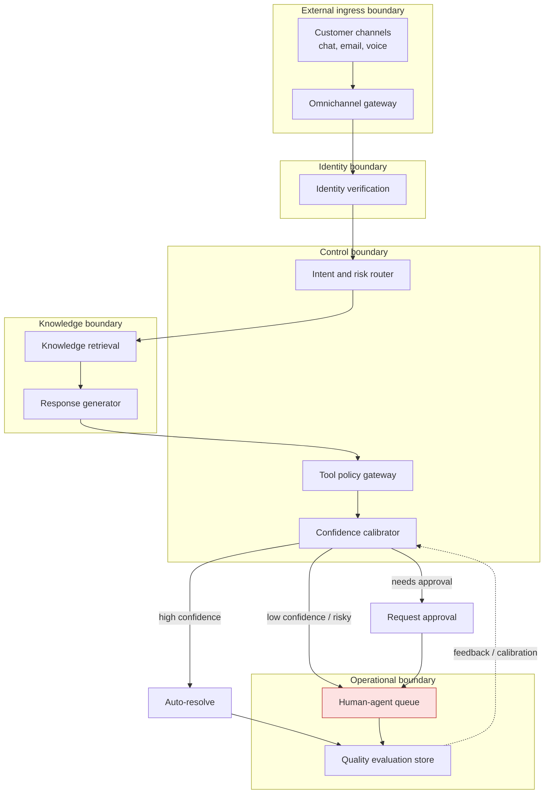
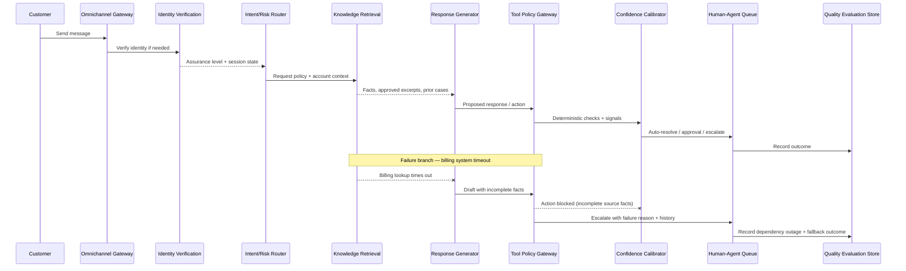

# Chapter 4: Design an AI Customer-Support Automation System

*Source: THE FORWARD DEPLOYED ENGINEER SYSTEM DESIGN INTERVIEW: 20 REAL-WORLD AI & ENTERPRISE SCENARIOS WITH DISCOVERY FRAMEWORKS, ARCHITECTURE WALKTHROUGHS, AND INTERVIEW STRATEGIES FOR HIGH-IMPACT FDE ROLES — Chapter 4, read in full from the Kindle edition.*

*Tutorial format: FDE Chapter Tutorial Builder — self-reviewed against the decomposition rubric, 1 pass.*

## 1. The Customer Problem and Discovery

**Key Points**

- The interview opens with a deceptively simple ask: automate routine support requests, but escalate risky, ambiguous, or failed cases to a human agent with full context.
- The product is not a chatbot that answers everything — it is a routed service that must decide, with discipline, when to act, when to ask for approval, and when to stop.
- A single illustrative example ("I was charged twice for last month's subscription and need this fixed today") exposes the real design constraint: identity verification, safe account action, and graceful degradation if a dependency (like the billing provider) is down.
- Distinguish **constraints** ("Refunds above a stated threshold require human approval") from **preferences** ("We would like the agent console to show recent purchases on the right side") — constraints shape trust boundaries, authorization, and audit design; preferences affect usability and polish but do not determine whether the solution is admissible.
- Define an explicit **scope boundary** (non-goals) so the MVP does not try to solve every support problem at once.
- Protect against assumption risk: interviewers often answer only half the discovery questions on purpose, testing whether you can make reasonable assumptions without gambling on the highest-risk area.
- A compact requirement-to-component traceability table demonstrates that the architecture serves the requirements rather than decorating them.

The scenario begins with a customer support lead opening the meeting with a deceptively simple ask: automate routine support requests, but escalate risky, ambiguous, or failed cases to a human agent with full context. That single sentence hides the key design constraint that changes the whole system: the product is not a chatbot that answers everything. It is a routed service that must decide, with discipline, when to act, when to ask for approval, and when to stop.

Suppose a customer writes, "I was charged twice for last month's subscription and need this fixed today." The obvious design is to send the message to a model, draft a reply, and let it resolve the ticket. The real design starts earlier. The system must verify who the user is, determine whether the request touches money, decide whether it can safely act on the account, and preserve enough context for a human to take over if the automation hesitates. If the billing provider is down, or the model sounds confident but the policy check fails, the system should degrade into a safe handoff rather than force a bad answer.

### Distinguish constraints from preferences

This is where many candidates blur the line between "nice architecture" and "hard boundary." Constraints are not preferences; they are conditions that the design must obey.

- A **constraint** is: "Refunds above a stated threshold require human approval."
- A **preference** is: "We would like the agent console to show recent purchases on the right side."

Constraints shape trust boundaries, authorization, and audit design. Preferences affect usability and implementation polish, but they do not determine whether the solution is admissible.

This distinction also clarifies the **scope boundary**. The MVP should usually include routine support requests, grounded answers, and carefully controlled actions. It should not try to solve every support problem at once. Common exclusions for the first release include:

- open-ended negotiation with customers,
- autonomous handling of legal complaints,
- fully unsupervised refunds or cancellations,
- cross-system data repair with no human review,
- proactive outreach on ambiguous policy violations.

That non-goals list prevents solution sprawl. If the candidate never states what the MVP will not support, the design tends to expand until risk and ambiguity dominate the interview.

### Protect against assumption risk

The interviewer often answers only half the questions. That is deliberate. They are testing whether you can choose reasonable assumptions without gambling on the highest-risk area.

For example, if you learn that the customer wants chat and email but not phone, you can assume a text-based interaction model. If you are not told the exact language mix, you can state that the MVP starts with the dominant support language and uses a fallback escalation path for unsupported languages. If you do not know the exact ticket volume, you can keep the design scalable but avoid over-engineering for peak load.

The dangerous assumptions are the ones that weaken the control boundary: assuming identity is always verified, assuming any customer request can be automated, assuming the model's answer is inherently safe, or assuming the CRM is always the source of truth. When in doubt, protect the highest-risk constraint first: no unauthorized action and no confidently wrong answer on sensitive topics.

### A compact requirement-to-component traceability view

A useful interview move is to show how each requirement maps to a component or control point. That demonstrates that the architecture is serving the requirements rather than decorating them.

| Requirement | Design implication |
|---|---|
| Classify and route requests | Intent router, policy classifier, escalation gate |
| Retrieve grounded customer and policy context | Retrieval layer connected to CRM, order, and policy sources |
| Draft or send answers by confidence and risk | Response policy engine with confidence thresholds and approval paths |
| Execute tools through a controlled layer | Tool execution service with authorization, validation, and logging |
| Hand off with conversation and action history | Agent console and shared case timeline |
| No unauthorized account action | Permission checks and human approval for restricted operations |
| Low incorrect-resolution rate | Conservative thresholds, grounding, and fallback to human review |
| Fast human takeover | One-click escalation and context packaging |
| Complete action auditability | Immutable or append-only event trail with actor, time, and reason |

### Why this is the FDE signal

The candidate's ability to convert a vague "automate support" ask into a bounded, constraint-driven scope — before touching architecture — is exactly what separates an engineer who can sketch a platform from one who can ship a customer-facing workflow. Discovery here is not information-gathering for its own sake; it defines scope, uncovers assumptions, exposes risk, and establishes measurable success up front.

## 2. Clarifying Questions, Requirements, and Constraints

**Key Points**

- A structured discovery sequence covers channel and volume, action authority, identity and data sensitivity, freshness of knowledge, escalation and human-in-the-loop design, and multilingual/localization needs.
- Functional requirements center on classification and routing, grounded retrieval, confidence/risk-gated response generation, controlled tool execution, and structured human handoff.
- Non-functional requirements are measurable: latency targets by risk tier, accuracy/incorrect-resolution ceilings, security guarantees (no unauthorized account action, prompt-injection resistance), and complete action auditability.
- Distinguish constraints (hard boundaries the design must obey) from preferences (usability choices) — this determines what is negotiable in the interview.
- A clear MVP scope fence explicitly excludes open-ended negotiation, autonomous legal handling, fully unsupervised refunds, cross-system repair without review, and proactive outreach on ambiguous violations.
- Protecting against assumption risk means choosing the safest default when information is withheld, especially around identity, authorization, and irreversible actions.
- The same requirement-to-component traceability table anchors this discussion, showing each customer-facing requirement mapped to its owning system component.

Discovery should answer fewer questions, but better ones. Under interview time pressure, the goal is not to ask everything. It is to ask the highest-leverage questions that collapse uncertainty quickly. A short discovery sequence usually beats a long checklist.

A practical discovery tree for this scenario covers six areas:

1. **Channel and volume**: which channels (chat, email, voice) are in scope, and what is the expected monthly ticket volume and peak concurrency?
2. **Action authority**: which actions can the system take autonomously (status lookups) versus which require approval (refunds, account changes)?
3. **Identity and data sensitivity**: how is the customer authenticated, and which fields (payment, PII) require extra protection?
4. **Freshness of knowledge**: how current must policy articles, order status, and account data be when the assistant answers?
5. **Escalation and human-in-the-loop design**: what does a human agent need to see when a case is handed off, and how fast must that handoff happen?
6. **Multilingual and localization needs**: how many languages must be supported at launch, and what happens when language detection fails?

### Functional requirements

- Classify and route requests by intent and risk.
- Retrieve grounded customer and policy context before drafting a response.
- Draft or send answers gated by confidence and risk level.
- Execute tools (refunds, address changes, subscription actions) through a controlled, authorized layer.
- Hand off to a human agent with full conversation and action history when required.

### Non-functional requirements and measurable constraints

- **Low incorrect-resolution rate**: the system should minimize cases closed incorrectly, especially in ways that create legal, financial, or safety risk.
- **Ambiguous-tickets escalation rate**: the system should escalate cleanly when it cannot resolve a case, not fabricate confidence.
- **Fast human takeover**: escalation should preserve full context so a human never repeats work already done.
- **Complete action auditability**: every retrieval, decision, tool call, and human override should be attributable after the fact.

### Distinguish constraints from preferences

This is where many candidates blur the line between "nice architecture" and "hard boundary." Constraints are not preferences; they are conditions that the design must obey.

- A **constraint** is: "Refunds above a stated threshold require human approval."
- A **preference** is: "We would like the agent console to show recent purchases on the right side."

Constraints shape trust boundaries, authorization, and audit design. Preferences affect usability and implementation polish, but they do not determine whether the solution is admissible.

This distinction also clarifies the **scope boundary**. The MVP should usually include routine support requests, grounded answers, and carefully controlled actions. It should not try to solve every support problem at once. Common exclusions for the first release include:

- open-ended negotiation with customers,
- autonomous handling of legal complaints,
- fully unsupervised refunds or cancellations,
- cross-system data repair with no human review,
- proactive outreach on ambiguous policy violations.

That non-goals list prevents solution sprawl. If the candidate never states what the MVP will not support, the design tends to expand until risk and ambiguity dominate the interview.

### Protect against assumption risk

The interviewer often answers only half the questions. That is deliberate. They are testing whether you can choose reasonable assumptions without gambling on the highest-risk area.

For example, if you learn that the customer wants chat and email but not phone, you can assume a text-based interaction model. If you are not told the exact language mix, you can state that the MVP starts with the dominant support language and uses a fallback escalation path for unsupported languages. If you do not know the exact ticket volume, you can keep the design scalable but avoid over-engineering for peak load.

The dangerous assumptions are the ones that weaken the control boundary: assuming identity is always verified, assuming any customer request can be automated, assuming the model's answer is inherently safe, or assuming the CRM is always the source of truth. When in doubt, protect the highest-risk constraint first: no unauthorized action and no confidently wrong answer on sensitive topics.

### A compact requirement-to-component traceability view

A useful interview move is to show how each requirement maps to a component or control point. That demonstrates that the architecture is serving the requirements rather than decorating them.

| Requirement | Design implication |
|---|---|
| Classify and route requests | Intent router, policy classifier, escalation gate |
| Retrieve grounded customer and policy context | Retrieval layer connected to CRM, order, and policy sources |
| Draft or send answers by confidence and risk | Response policy engine with confidence thresholds and approval paths |
| Execute tools through a controlled layer | Tool execution service with authorization, validation, and logging |
| Hand off with conversation and action history | Agent console and shared case timeline |
| No unauthorized account action | Permission checks and human approval for restricted operations |
| Low incorrect-resolution rate | Conservative thresholds, grounding, and fallback to human review |
| Fast human takeover | One-click escalation and context packaging |
| Complete action auditability | Immutable or append-only event trail with actor, time, and reason |

### What to say in the interview

A crisp way to frame the discussion is:

> "I'd first narrow the scope by channel, language, action limits, identity rules, and risk categories. Then I'd prioritize routing, grounded retrieval, controlled tool execution, and seamless escalation. For the MVP, I'd exclude broad autonomous actions and any support category that could create legal, financial, or safety risk without a human in the loop."

That answer shows customer discovery, prioritization, and the ability to protect delivery under ambiguity. It also makes the trade-off visible: you are deliberately limiting scope so the first release reduces handling time and cost without increasing incorrect or harmful resolutions.

The practical takeaway is straightforward: ask questions that move risk boundaries, convert the answers into must-have requirements and explicit non-goals, and anchor every assumption to the safest possible default. That is how an FDE turns discovery into an implementation-ready plan instead of a vague product wish list.

## 3. Scale Estimates, SLOs, and Capacity

**Key Points**

- Do not size for the average ticket volume — size for the peaks, the tail latency, and the failure modes that force human intervention.
- A realistic practice problem uses 2 million tickets per month, 100 QPS peak, and 20 languages as illustrative but structurally meaningful numbers.
- Break the ticket mix into routine/ambiguous/escalated tiers and convert each into model-call and retrieval-call volume — this turns a raw ticket count into a defensible capacity estimate.
- Agent-seat savings should be estimated explicitly (25–40 full-time agents for a 2M-ticket queue) and reframed in interview language as "agent-seat savings or avoidance," not just compute savings.
- Storage has at least three footprints: conversation history, retrieval corpus, and telemetry/log streams — each with different freshness, retention, and searchability needs.
- Use risk-tiered latency targets (p95 under 3s for low-risk, 8s for ambiguous, 15s for high-risk/policy-sensitive) instead of one universal SLO, and tie the technical SLO to the customer workflow it serves.
- Define the core indicators in plain language: availability, latency, freshness, quality, security, and cost.
- The net-value equation `NetValue = V_time_saved − C_model − C_wrong_resolution − C_recontact` is the whiteboard-style way to connect architecture decisions to business value.
- A sensitivity table (baseline vs. 10x growth) shows which estimate — peak concurrency and escalation rate, not average ticket count — actually determines whether the architecture holds up under load.

### From average load to the load that actually breaks the system

The first pass at this design usually looks comfortable on paper: a single orchestration service, a retrieval layer, a classifier, and a fallback path to agents. At the monthly average, it seems manageable. But this section is where you test whether that architecture survives the moments that matter: the morning spike after a product incident, the support surge from a new region, or the deadline-driven rush after a billing change. In other words, you do not size for the average ticket volume; you size for the peaks, the tail latency, and the failure modes that force human intervention.

For a realistic practice problem, assume **2 million tickets per month, 100 QPS peak, and 20 languages**. Those numbers are illustrative, but they force the right kind of thinking. Two million tickets a month means roughly 67,000 tickets per day on average, but the system must still absorb bursts far above that average. A 100 QPS peak means the control plane cannot be a fragile single-threaded pipeline. And 20 languages means that language detection, retrieval quality, routing, and fallback policies matter; it is not enough to assume English-only performance and hope the rest "mostly works."

The candidate's first architecture is often plausible at average load: every incoming message goes to an LLM, the LLM decides whether to answer or escalate, and a retrieval step fetches policy snippets when needed. The problem is that this can collapse under peak traffic or under a strict response deadline. If the model call takes too long, if retrieval is slow, or if the agent console depends on the same saturated service, the system may miss both customer-facing latency targets and the business goal of fast deflection.

### Work the envelope before you pick components

A good FDE answer turns the rough volume into operational decisions. Start with the ticket stream and estimate how many expensive steps each ticket triggers.

If every ticket produces one initial classification call, and only a subset require retrieval or a second model pass, then the total monthly model-call count is not simply "tickets times one." It is closer to:

- one routing or triage call for most tickets,
- one retrieval-backed answer call for routine cases,
- one or more extra calls for ambiguity, safety review, or tool use,
- and a separate path for escalated cases that packages context for the human agent.

Use the illustrative scenario to put rough numbers on this structure. For example, if **2 million tickets/month** break down as **70% routine, 20% ambiguous but still automatable after grounding**, and **10% escalated after one classification call**, then a back-of-the-envelope estimate looks like this:

- **Routine tickets**: 1.4M tickets × 2 model calls each on average (triage + answer) = **2.8M model calls/month**
- **Ambiguous tickets**: 0.4M tickets × 3 model calls each on average (triage + retrieval-based grounding + verification or rewrite) = **1.2M model calls/month**
- **Escalated tickets**: 0.2M tickets × 1 model call on average (triage only, plus handoff packaging) = **0.2M model calls/month**

That yields roughly **4.2 million model calls per month**, plus the cost of any retries, moderation checks, or tool invocations. The exact number is not the point; the interview signal is that you can turn volume into a capacity estimate instead of hand-waving.

Now add retrieval calls. If routine answers usually need one retrieval lookup, and ambiguous cases need two lookups because the system checks policy plus the latest product or billing article, then the same scenario suggests:

- **Routine tickets**: 1.4M × 1 retrieval call = **1.4M retrieval calls/month**
- **Ambiguous tickets**: 0.4M × 2 retrieval calls = **0.8M retrieval calls/month**
- **Escalated tickets**: 0.2M × 0 or 1 retrieval call depending on whether the agent handoff bundle includes cited context = **0 to 0.2M retrieval calls/month**

So the retrieval tier is likely absorbing **roughly 2.2M to 2.4M retrieval calls per month** in this example. That matters because retrieval is not just a "cheap helper." It can dominate freshness logic, cache design, and failure isolation if the knowledge corpus is large or frequently updated.

Agent-seat savings should also be estimated explicitly. A support queue with 2 million monthly tickets might otherwise require, for example, around **25 to 40 full-time agents** just to cover the routine load and service targets, depending on average handle time, occupancy, and business hours coverage. If automation deflects or shortens **30% to 50%** of tickets, then the business impact is not necessarily "we eliminate half the team." More realistically, you can:

- delay hiring for growth,
- reduce overtime and queue spillover,
- move agents from repetitive questions to complex cases,
- or hold service levels steady with fewer incremental seats.

In interview language, that is the point: the capacity plan should translate to **agent-seat savings or avoidance**, not just GPU savings. Even a modest reduction in average handling time can turn into meaningful workforce leverage when the ticket volume is large.

Storage belongs in the envelope too. Support automation creates at least three storage footprints: the **conversation history** needed for continuity and audit, the **retrieval corpus** of policies and help articles, and the **telemetry/log stream** for evaluation and incident response. In a 2M-ticket/month system, even compact conversation records can accumulate quickly. If you retain structured ticket state, citations, and a short transcript summary for each case, you may be storing on the order of **millions of records per month** for active use, plus longer-term archives for compliance or analytics. The practical design consequence is that storage is not just a back-office concern: it affects **freshness, retention policy, searchability, and replay** for debugging misresolutions.

### Use risk tiers instead of one universal latency target

A support system should not have one flat latency SLO for every case. It needs risk-tiered behavior. Set concrete example targets so the design can be evaluated:

- **Low-risk routine requests**: target **p95 under 3 seconds** end-to-end, automate by default, and only escalate if confidence drops below a set threshold or the user asks for an agent.
- **Ambiguous requests**: target **p95 under 8 seconds** for grounded response or handoff, use retrieval and a second pass if needed, and automate only when the confidence-plus-policy score clears the bar.
- **High-risk or policy-sensitive requests**: target **p95 under 15 seconds** for a safe handoff bundle, but **do not automate the final decision**; abstain or escalate to a human with full context.

Those numbers are illustrative, but the structure is what matters. In other words, speed is not the only objective. The system should optimize for the right action in each tier: answer, ask a clarifying question, or escalate.

A useful way to frame this is to tie the technical SLO to the customer workflow. If the workflow is "get an answer now," then the latency budget is tight and the system should optimize for fast, grounded responses. If the workflow is "collect context and transfer to an agent," then the SLO is about packaging completeness and handoff speed, not just answer generation time. That difference is exactly what makes the design defensible in an interview.

Define the core indicators in plain language:

- **Availability**: can the routing, retrieval, and escalation path accept work when traffic arrives?
- **Latency**: how long until the customer gets a grounded answer or a human handoff?
- **Freshness**: how current is the policy or knowledge-base content used for a response?
- **Quality**: how often does the system answer correctly, abstain appropriately, or escalate when it should?
- **Security**: are customer data, tools, and agent actions protected from unauthorized access or prompt injection?
- **Cost**: what does each answered, escalated, or retried ticket consume in model, retrieval, and human time?

### The equation that keeps the design honest

The clearest way to connect architecture to business value is to write the net value of automation as:

**NetValue = V<sub>time saved</sub> − C<sub>model</sub> − C<sub>wrong resolution</sub> − C<sub>recontact</sub>**

Here is the whiteboard-style derivation. Start with the idea that automation creates gross value and then subtracts the costs it introduces:

1. **Start with time saved**: if automation reduces average handle time or avoids a human touch entirely, that produces a value term, V<sub>time saved</sub>.
2. **Subtract model and retrieval costs**: every automated or assisted ticket consumes inference, orchestration, and often retrieval, so you pay C<sub>model</sub>.
3. **Subtract wrong-resolution cost**: if the system confidently answers incorrectly, the cost is bigger than the model bill because it may cause customer frustration, policy harm, or a support escalation later, so you subtract C<sub>wrong resolution</sub>.
4. **Subtract repeat-contact cost**: if the customer comes back because the first answer was incomplete, unsafe, or confusing, you pay again in labor and satisfaction, so you subtract C<sub>recontact</sub>.
5. **Net the terms**: the resulting decision rule is exactly

**NetValue = V<sub>time saved</sub> − C<sub>model</sub> − C<sub>wrong resolution</sub> − C<sub>recontact</sub>**

This equation is more than notation; it is a decision tool. V<sub>time saved</sub> is the value of shorter handling time, lower queue pressure, and fewer repetitive agent interactions. C<sub>model</sub> is the cost of model inference, retrieval, and orchestration. C<sub>wrong resolution</sub> captures the cost of confidently wrong answers, which can be much larger than the cost of a slow answer because it creates customer frustration, possible policy violations, and downstream support work. C<sub>recontact</sub> is the cost of a case that reopens because the first answer was incomplete, unclear, or unsafe.

That is why automation must be judged after quality and repeat-contact costs, not before them. A system that saves ten seconds per ticket but increases recontact is not a win. A system that deflects routine work while preserving trust is.

### Show your math without pretending it is exact

State average, peak, growth, and headroom rather than false precision. A strong interview answer sounds like this: "I'd design for the current 2 million-ticket monthly volume, the 100 QPS peak, and at least a healthy growth factor so the system does not need immediate redesign. I'd keep headroom for model retries, agent escalation bursts, and language expansion. The most sensitive estimate is the peak concurrent request load, because it drives queuing, concurrency limits, and whether the system needs asynchronous fallbacks."

That sensitivity matters. If growth turns out to be 10x instead of 1x, the first thing to revisit is not just server count; it is partitioning. You may need to split online answering from offline summarization, isolate escalation traffic from routine classification, and move long-running enrichment out of the critical path. The architecture that works at one scale can fail gracefully or catastrophically depending on which estimate you got wrong.

A simple sensitivity table makes the point:

| Scenario | Monthly tickets | Peak pressure | Likely impact |
|---|---|---|---|
| Baseline | 2M | 100 QPS | Single-region or modest multi-region design may suffice |
| 10x growth | 20M | Much higher burst concurrency | Routing, retrieval, and agent handoff need stronger partitioning and backpressure |

The interview lesson is not to optimize every dimension at once. It is to identify the estimate that most changes the shape of the system. For this problem, peak concurrency and escalation rate matter more than the exact monthly ticket count, because they determine whether you can keep response times stable and handoffs reliable.

### What this proves in an interview

This section tests whether the candidate can make pragmatic capacity decisions without overengineering. A good FDE does not just recite components; they justify why one path is synchronous, another is asynchronous, where the human handoff lives, and which estimate controls the architecture.

### What to remember

Estimates are decision tools; each number should justify an architectural choice or operational limit. When you can explain why 2 million tickets, 100 QPS peak, 20 languages, and a risk-tiered SLO lead you to a specific design, you are no longer guessing at capacity — you are designing for customer value under load.

## 4. Architecture and End-to-End Flow

**Key Points**

- The single-sentence framing — automate routine requests, escalate risky/ambiguous/failed ones to a human with full context — dictates the entire architecture: a routed decision pipeline, not a chatbot.
- The end-to-end textual flow is: Customer channels → Omnichannel gateway → Identity verification → Intent and risk router → Knowledge retrieval → Response generator → Tool policy gateway → Confidence calibrator → Auto-resolve / approval / human-agent queue → Quality evaluation store.
- Trust boundaries map directly onto architectural zones: external ingress, identity, control (routing/policy), knowledge, and operational (human queue and evaluation).
- A component-responsibility table clarifies exactly what each of the nine components owns and does not own — critical for separating "decision support" from "final authority."
- Separate the control plane (routing decisions) from the data plane (conversation, retrieved facts, drafted response) — many failures are about control decisions being made too late or in the wrong place, not raw generation quality.
- The system of record belongs to the underlying customer, billing, CRM, and identity systems, not the support automation layer — the support layer can cache safe, read-heavy artifacts but must treat them as derived data.
- An 11-step sequence diagram narrates the happy path; an 8-step failure-path overlay shows how a dependency outage (e.g., billing system timeout) degrades safely into human escalation rather than producing an unsafe or duplicated action.
- MVP versus later evolution: the MVP is omnichannel gateway + identity verification + intent/risk routing + retrieval + response generation + deterministic policy gating + human escalation + outcome logging; later hardening adds confidence calibration models, richer replay/evaluation, proactive deflection, and automated policy regression testing.

A customer support lead opens the meeting with a deceptively simple ask: automate routine support requests, but escalate risky, ambiguous, or failed cases to a human agent with full context. That single sentence hides the key design constraint that changes the whole system: the product is not a chatbot that answers everything. It is a routed service that must decide, with discipline, when to act, when to ask for approval, and when to stop.

Suppose a customer writes, "I was charged twice for last month's subscription and need this fixed today." The obvious design is to send the message to a model, draft a reply, and let it resolve the ticket. The real design starts earlier. The system must verify who the user is, determine whether the request touches money, decide whether it can safely act on the account, and preserve enough context for a human to take over if the automation hesitates. If the billing provider is down, or the model sounds confident but the policy check fails, the system should degrade into a safe handoff rather than force a bad answer.

### Top-level architecture, from the outside in

Think in dependency order, not box order. Each component exists because the one before it needs a narrow, well-defined next step.

### Textual architecture diagram

Customer channels → Omnichannel gateway → Identity verification → Intent and risk router → Knowledge retrieval → Response generator → Tool policy gateway → Confidence calibrator → Auto-resolve / approval / human-agent queue → Quality evaluation store.



### Trust boundaries and state ownership

Trust boundaries and state ownership are easiest to explain if you narrate them along this path:

- **External ingress boundary**: customer channels and the omnichannel gateway.
- **Identity boundary**: identity verification, which owns the assurance session and consults auth systems of record.
- **Control boundary**: intent and risk router, confidence calibrator, and tool policy gateway.
- **Knowledge boundary**: retrieval over approved policy and account context.
- **Operational boundary**: human-agent queue and quality evaluation store.

### Component responsibilities

| Component | Primary responsibility | Trust boundary / state owner |
|---|---|---|
| Omnichannel gateway | Receives chat, email, web, voice transcript, or in-app message and normalizes it into one conversation envelope | External ingress boundary; does not own business state |
| Identity verification | Confirms the customer's identity and assigns an assurance level | Owns identity session state; consults auth/verification systems of record |
| Intent and risk router | Classifies the issue, tags urgency, and detects policy-sensitive or high-risk intents | Control-plane decision service; reads conversation state, writes routing decision |
| Knowledge retrieval | Pulls policy articles, account facts, and previous case context | Reads from systems of record and approved indexes; no independent authority |
| Response generator | Drafts a proposed answer or action plan from retrieved context | Model inference layer; never the final authority |
| Tool policy gateway | Enforces deterministic rules for what actions may be taken, by whom, and under what confidence | Hard authorization and action guardrail; owns action approval rules |
| Confidence calibrator | Scores whether the draft is reliable enough for auto-resolve, approval, or escalation | Decision support; consumes model outputs and policy signals |
| Human-agent queue | Surfaces escalations with full context and reason codes | Operational queue; owns handoff lifecycle |
| Quality evaluation store | Records outcomes, reopens, overrides, and feedback for measurement and improvement | Analytics and evaluation store; not the source of truth for live actions |

The right way to present this in an interview is to separate the control plane from the data plane. The data plane carries the user conversation, retrieved facts, and drafted response through the low-latency path. The control plane decides whether that path is allowed to continue, whether extra checks are needed, and whether a human must intervene. That distinction matters because many failures are not about raw generation quality; they are about control decisions being made too late or in the wrong place.

The system of record belongs to the underlying customer, billing, CRM, and identity systems, not to the support automation layer. The support layer can cache safe, read-heavy artifacts such as policy snippets or recent interaction summaries, but it should treat those as derived data. If the source says an account is locked, the automation layer should not invent a different truth because a cache is stale.

### End-to-end flow of a routine request

Here is the happy path, step by step, with the synchronous versus asynchronous boundaries made explicit:

1. **Ingest conversation and verify identity.** The omnichannel gateway receives the message and creates a conversation envelope. Identity verification runs synchronously if the request might expose account-specific data or trigger an action. Low-risk pre-auth FAQ traffic can remain in a limited, generic mode.
2. **Classify intent and risk.** The intent and risk router decides whether this is billing, login, shipping, cancellation, refund, abuse, or general information. It also tags risk level: informational, account-sensitive, money-moving, legal/policy-sensitive, or safety-sensitive.
3. **Retrieve policy and account context.** Knowledge retrieval gathers approved policy excerpts, the latest relevant account facts, and prior case history. This is synchronous for the critical facts the model needs to answer, but noncritical enrichment can be asynchronous and may arrive after the first draft.
4. **Generate proposed response or action.** The response generator produces a suggested reply, a proposed tool call, or both. At this point, the system is still making a recommendation, not a final decision.
5. **Validate against deterministic policy.** The tool policy gateway checks the draft against explicit rules: is the identity assurance sufficient, is the requested action allowed, does the requested refund exceed threshold, does the case require a human review, is the data accessible to this agent tier?
6. **Auto-resolve, request approval, or escalate.** If confidence is high and policy passes, the system can auto-resolve. If the answer is plausible but the action needs approval, it pauses for human confirmation. If the request is risky, ambiguous, missing context, or failed a check, it routes to the human-agent queue with the full trail.
7. **Measure outcome and repeat contact.** The quality evaluation store records whether the ticket was solved, reopened, reopened quickly, corrected by a human, or resulted in a repeat contact. Those signals feed calibration, routing, and policy updates.

This is a good place to be explicit about the failure path, because interviewers often care more about safe degradation than about the ideal path.

### Sequence diagram: happy path and failure-path overlay

You can narrate the same flow in a sequence format:

1. Customer sends a message to the omnichannel gateway.
2. The omnichannel gateway verifies whether identity checks are needed before exposing account-specific data.
3. Identity verification returns an assurance level and session state to the intent and risk router.
4. The intent and risk router requests policy and account context from knowledge retrieval.
5. Knowledge retrieval provides facts, approved policy excerpts, and prior cases to the response generator.
6. The response generator submits a proposed response or action to the tool policy gateway.
7. The tool policy gateway applies deterministic checks and passes relevant signals to the confidence calibrator.
8. The confidence calibrator and policy gate together decide whether to auto-resolve, request approval, or escalate.
9. If escalation is required, the decision sends the case to the human-agent queue with full context and reason codes.
10. The quality evaluation store records the outcome for later analysis, calibration, and policy tuning.
11. Future router and policy improvements use those stored outcomes to reduce repeat contact and unsafe automation.

Now repeat the same story with the dependency failure in place:

1. Customer sends a message to the omnichannel gateway.
2. The omnichannel gateway verifies whether identity checks are needed before exposing account-specific data.
3. Identity verification returns an assurance level and session state to the intent and risk router.
4. The intent and risk router requests policy and account context from knowledge retrieval.
5. Knowledge retrieval attempts billing lookup, but the external billing system times out.
6. The response generator drafts a reply, but the tool policy gateway blocks the action because source facts are incomplete.
7. The decision routes the case to the human-agent queue with the failure reason and conversation history.
8. The quality evaluation store records the dependency outage and fallback outcome so routing, escalation, and incident reviews can learn from it.

The point of the diagram is not visual decoration. It is to make boundaries visible: which service can decide, which service can merely suggest, which state is authoritative, and which failure should trigger a human rather than a retry loop.



### Failure-path overlay on the architecture

A useful way to describe the overlay is:

- If **identity verification fails or is unavailable**, the system stays in a limited, non-account mode or escalates immediately.
- If **retrieval is stale or missing critical facts**, the response generator may draft language, but the tool policy gateway blocks action.
- If **confidence is low**, the case goes to the human-agent queue.
- If **the human queue is saturated**, the queue prioritizes by risk and customer impact rather than arrival order alone.
- If **the quality evaluation store detects repeat contacts or corrections**, those signals feed routing and policy tuning.

### Where queues, caches, and backpressure belong

The moment you add human review, you add queueing. The human-agent queue should sit on the boundary between automation and operations, not deep inside the model path. That keeps high-volume routine traffic from competing with slower manual work.

Backpressure matters in three places:

- **Ingress backpressure**: if the support channel receives a burst, the omnichannel gateway should shed nonessential enrichment, preserve the conversation, and return a graceful "we're processing your request" state rather than let the system collapse.
- **Retrieval backpressure**: if policy lookup or account context lookup slows down, the router should degrade to a narrower safe mode instead of waiting indefinitely.
- **Escalation backpressure**: if humans are saturated, the queue should prioritize by risk and customer impact, not by arrival order alone.

Caches belong only where stale data is tolerable and clearly labeled. Policy articles, language detection results, and nonauthoritative summaries are reasonable cache candidates. Identity assertions, money movements, account status, and authorization decisions are not. The support system can cache references to those facts, but it should not cache away the need to re-check the authoritative source when a live action is at stake.

A partitioning key is also essential. In this problem, conversation ID, customer ID, or account ID can be used to partition work so that one customer's burst of messages does not interfere with another's. The key should preserve ordering where it matters, especially when a case moves from automation to human review and back again. If the design ignores partitioning, duplicate replies, inconsistent state transitions, and out-of-order handoffs become much more likely under load.

### MVP versus later evolution

For an interview, it helps to separate the minimum useful system from later hardening.

**MVP**: omnichannel gateway, identity verification, intent/risk routing, retrieval from approved policy and account sources, response generation, deterministic policy gating, human escalation, and outcome logging. That is enough to safely automate routine work while protecting risky cases.

**Later evolution**: confidence calibration models, smarter prioritization, richer replay and evaluation pipelines, proactive contact deflection, multilingual optimization, agent-assist summaries, and automated policy regression testing. These improve throughput and quality, but they should not replace the basic control structure.

### Why this architecture solves the customer problem

The design is built around one requirement: reduce handling time and cost without increasing incorrect or harmful resolutions. Every component supports that goal. Identity verification prevents the system from taking unsafe action on the wrong account. The intent and risk router keeps high-stakes cases on a cautious path. Retrieval grounds the model in approved facts. The tool policy gateway stops a fluent but invalid response from becoming an action. The human queue preserves service quality when the system is uncertain. The evaluation store closes the loop so the business can prove whether automation helped or merely shifted work around.

### What to say in the interview

If asked to summarize the architecture in one minute, say: the system receives a support request, verifies identity when necessary, classifies intent and risk, retrieves authoritative context, drafts a proposed response, and passes that proposal through a deterministic policy gate. Low-risk requests can auto-resolve. Medium-confidence requests seek approval. High-risk, ambiguous, or failed cases escalate to humans with context. The control plane decides routing and enforcement, while the data plane carries the conversation and retrieved facts. The system of record remains the customer's operational systems, not in the automation layer.

That answer shows system decomposition and also proves you can explain the same design to both a customer stakeholder and an engineering stakeholder. The customer hears reduced handling time and safer resolutions. The engineer hears boundaries, ownership, failure modes, and operational flow. The interviewer hears both.

## 5. Data Model, APIs, and Working Code

**Key Points**

- Three core records make ownership explicit: `Case` (the live workflow object), `ProposedAction` (the system's proposed or executed step, with `args_hash` for idempotent deduplication), and `Handoff` (the artifact humans receive when the machine must stop).
- Contracts should be small and boring: `POST /v1/support/messages`, `POST /v1/cases/{id}/actions`, `POST /v1/cases/{id}/escalate`, `POST /v1/cases/{id}/quality-review`, each with authenticated caller, tenant scoping, schema validation, idempotency semantics, and clear error behavior (409 Conflict, 422 Unprocessable Entity, 401/403).
- Idempotency is proven with a concrete example: a repeated `POST /v1/support/messages` with the same `Idempotency-Key` must return the same case, never create a duplicate.
- The most convincing interview move is to implement the smallest safe slice of the riskiest branch — here, routing: a `RoutingDecision` (`DecisionType`: ESCALATE, DRAFT_FOR_AGENT, REQUIRE_APPROVAL, AUTO_RESOLVE) computed from a typed, validated `Prediction`.
- A second, narrower code example proves one critical invariant: a risky action above a policy threshold must always produce `RequireApproval`, never automatic execution — backed by a contract test.
- Production-shaped (not just whiteboard-shaped) means addressing optimistic concurrency (`Case.version`), idempotency keys at every write boundary, and structured observability (case id, tenant id, idempotency key, model version, decision type, validation errors, policy reason).
- Contract and failure-injection tests are what make the design defensible: verify duplicate requests don't create duplicate cases, and verify malformed model output (`confidence=1.2`) is rejected before it reaches the routing branch.

Turning the architecture into state the system can trust. At this point, the design is no longer a box diagram. It needs concrete records, stable contracts, and a smallest-possible code path that proves the risky part of the system can behave safely.

The first move is to make ownership explicit. The automation layer does not own the customer's source of truth; it owns its own workflow state and the evidence needed to justify decisions. That distinction matters in interviews because it shows you understand data ownership, auditability, and where not to overbuild.

### Use three core records

- `Case(id, customer_id, channel, intent, risk, state)` is the live workflow object. Its primary key is `id`. It tracks the customer, the entry channel, the inferred or confirmed intent, the current risk classification, and the lifecycle state such as `new`, `triaged`, `waiting_approval`, `escalated`, or `resolved`. Retention should follow the customer's operational and audit needs: keep active cases in hot storage, then archive or purge according to policy once the support window ends.
- `ProposedAction(id, case_id, tool, args_hash, decision)` is the system's proposed or executed step. Its primary key is `id`. The `args_hash` is important because it lets you deduplicate logically identical requests without storing or replaying raw sensitive arguments everywhere. This is where idempotency starts to become real. Its lifecycle is short and stateful: a proposed action may begin as `draft`, move to `approved`, `rejected`, or `executed`, and then become immutable once the final outcome is recorded. Retention should be narrower than for `Case`; keep it long enough for audit, debugging, and replay protection, then expire it under the customer's retention policy because it is operational evidence rather than the customer's canonical record.
- `Handoff(case_id, summary, evidence_refs, attempted_actions)` is the artifact humans receive when the machine must stop. Its job is not to be pretty; its job is to make the agent faster and safer. The summary should explain what happened, the evidence_refs should point to the documents, messages, or retrieval hits that justified the decision, and attempted_actions should show what the system already tried so the human does not repeat failed work. The natural key here is intentionally narrower than `Case`; keep it long enough for audit, debugging, and replay protection, then expire it under the customer's retention policy because it is operational evidence rather than the customer's canonical record.

Those records let you define clear lifecycle transitions. A message arrives, becomes a case, the router scores risk, the policy layer decides whether to auto-resolve, draft, request approval, or escalate, and every irreversible step is recorded as a distinct write. That is the practical answer to "how do you keep the system defensible?"

### Contracts that keep the model on a leash

The API surface should be small and boring. Boring is good here.

- `POST /v1/support/messages` creates or updates a case from an incoming customer message. Request fields should include message content, customer or tenant identity, channel, and an idempotency key. Response fields should return the case id, current state, risk level, and next action.
- `POST /v1/cases/{id}/actions` submits a proposed or approved action. This endpoint should require authentication, policy context, and an idempotency key so retries do not create duplicate side effects.
- `POST /v1/cases/{id}/escalate` creates a handoff for a human agent. The response should confirm the case state changed to escalated and provide the handoff record id.
- `POST /v1/cases/{id}/quality-review` queues the case for audit or coaching review after resolution.

Each endpoint needs the same basics: authenticated caller, tenant scoping, schema validation, idempotency semantics, and clear error behavior. A `409 Conflict` should mean the case state no longer permits that transition. A `422 Unprocessable Entity` should mean the request passed transport checks but failed typed validation. A `401` or `403` should mean identity or authorization is wrong. Do not leave this fuzzy; interviewers want to know whether you can make retries safe and debugging possible.

Versioning should exist at two layers: schema versioning on payloads and contract versioning on endpoint behavior. That is what keeps a support workflow from breaking when the model, policy, or agent toolchain evolves. If the response shape changes, clients should know whether they are speaking to `v1` semantics or a newer contract. Likewise, a case written at one version should remain readable even if the policy engine later learns a new risk label.

Here is the concrete idempotent-behavior example the interviewer can picture immediately: a customer's chat client sends `POST /v1/support/messages` twice with the same `Idempotency-Key: msg_9f1c` because the first response timed out. The first request creates `case_123` and returns `{"case_id": "case_123", "state": "triaged", "risk": "medium", "next_action": "draft_for_agent"}`. The second request must not create `case_124`; it should return the same `case_123` response, or a semantically equivalent replay response, and the system should log that the duplicate was deduplicated at the write boundary. That is what "idempotent" means in practice, not just in theory.

### Small code that proves the design can work

The most convincing interview move is to zoom into the highest-risk branch and implement the smallest safe slice. Here, the risky branch is routing: a wrong decision can either annoy customers with needless escalation or let a bad answer go out.

```python
from __future__ import annotations

from dataclasses import dataclass
from enum import Enum
from typing import Any, Optional


class DecisionType(str, Enum):
    ESCALATE = "escalate"
    DRAFT_FOR_AGENT = "draft_for_agent"
    REQUIRE_APPROVAL = "require_approval"
    AUTO_RESOLVE = "auto_resolve"


@dataclass(frozen=True)
class Case:
    id: str
    customer_id: str
    channel: str
    intent: str
    risk: str
    state: str
    version: int = 0


@dataclass(frozen=True)
class Prediction:
    confidence: float
    policy_conflict: bool = False
    response: Optional[str] = None
    action: Optional[dict[str, Any]] = None
    model_version: str = "unknown"


@dataclass(frozen=True)
class RoutingDecision:
    decision: DecisionType
    reason: str


class ValidationError(ValueError):
    pass


def _validate_prediction(prediction: Prediction) -> None:
    if not 0.0 <= prediction.confidence <= 1.0:
        raise ValidationError("confidence must be between 0 and 1")
    if prediction.action is not None and not isinstance(prediction.action, dict):
        raise ValidationError("action must be a mapping when present")


def decide(case: Case, prediction: Prediction) -> RoutingDecision:
    _validate_prediction(prediction)

    if case.risk == "high" or prediction.policy_conflict:
        return RoutingDecision(DecisionType.ESCALATE, "risk_or_policy")
    if prediction.confidence < 0.70:
        return RoutingDecision(DecisionType.DRAFT_FOR_AGENT, "low_confidence")
    if prediction.action and prediction.action.get("amount", 0) > 50:
        return RoutingDecision(DecisionType.REQUIRE_APPROVAL, "high_impact_action")
    return RoutingDecision(DecisionType.AUTO_RESOLVE, "safe_to_automate")
```

Line by line, the purpose is deliberate. The enums constrain output so the model cannot invent new decision types. The `Case` dataclass captures the minimum state needed for routing, including a `version` field for optimistic concurrency later. The `Prediction` dataclass separates model output from application truth; it is only a suggestion until validated. `_validate_prediction` is the typed boundary check that stops malformed or out-of-range outputs before policy logic touches them. The `decide` function is the core safety gate: high risk or policy conflict escalates immediately, low confidence becomes a draft for an agent, high-impact actions require approval, and only the safest path auto-resolves.

That `amount > 50` threshold is intentionally illustrative. In a real customer deployment, you would externalize this rule by tenant, action type, and approval policy. The interview point is not the number; it is the pattern of keeping high-impact actions behind approval.

### Why this is production-shaped, not just whiteboard-shaped

A whiteboard snippet hides the hard parts. A production implementation must account for concurrency, retries, and observability.

For concurrency, the `Case.version` field supports optimistic concurrency control: read the case, compute a decision, then write only if the version is unchanged. If another worker has already updated the case, the write fails cleanly and the router re-reads the latest state instead of overwriting it. That matters for duplicate messages, agent interventions, and race conditions between automation and human review.

For retries, every write boundary should accept an idempotency key. If the message endpoint receives the same request twice, it should return the same case or the same transition rather than creating duplicate tickets. The same applies to actions and escalation. A duplicate request demonstrating idempotent behavior is not an edge case; it is normal operation under network retries.

For observability, log the case id, tenant id, idempotency key, model version, decision type, validation errors, and policy reason. Emit metrics for auto-resolve rate, escalation rate, approval latency, and rejection reasons. Without those hooks, you cannot tell how automation is performing beyond hand-waving the burden elsewhere.

### Tests that make the design defensible

A contract test should verify that a repeated `POST /v1/support/messages` with the same idempotency key returns the same case state and does not create a second case. For example, the test can send the same payload twice with `Idempotency-Key: msg_9f1c`, assert the first response returns `case_123`, then assert the second response also returns `case_123` with no new case row inserted. A failure-injection test should force the model to return `confidence = 1.2` or a non-mapping action and confirm the validator rejects it before any side effect occurs. For instance, if `Prediction(confidence=1.2, action={"amount": 25})` is passed into `decide`, the code should raise `ValidationError` and never reach the routing branch. That is the exact kind of failure-safe behavior interviewers look for.

One of the simplest safety invariants is: a risky action above policy threshold must produce approval, not automation. That is what the included test is for. The sketch below shows the idea in interview-sized form, then expands it enough to be useful.

```python
from dataclasses import dataclass
from enum import Enum
from typing import Any, Mapping


class DecisionType(str, Enum):
    AUTO_RESOLVE = "auto_resolve"
    REQUIRE_APPROVAL = "require_approval"
    ESCALATE = "escalate"
    REJECT = "reject"


@dataclass(frozen=True)
class Prediction:
    refund: float
    confidence: float


@dataclass(frozen=True)
class RequireApproval:
    reason: str


@dataclass(frozen=True)
class AutoResolve:
    action: str


@dataclass(frozen=True)
class Reject:
    reason: str


def _validate_prediction(pred: Any) -> Prediction:
    if not isinstance(pred, Prediction):
        raise TypeError("prediction must be a Prediction")
    if not (0.0 <= pred.confidence <= 1.0):
        raise ValueError("confidence must be between 0 and 1")
    if pred.refund < 0:
        raise ValueError("refund must be non-negative")
    return pred


def decide(low_risk_case: bool, pred: Prediction):
    pred = _validate_prediction(pred)

    if not low_risk_case and pred.refund > 50:
        return RequireApproval("refund exceeds auto-approval threshold")

    if pred.confidence < 0.7:
        return RequireApproval("insufficient confidence")

    return AutoResolve("approve_refund")


def prediction(*, refund: float, confidence: float) -> Prediction:
    return Prediction(refund=refund, confidence=confidence)


def test_refund_above_limit_requires_approval():
    outcome = decide(low_risk_case=False, pred=prediction(refund=75, confidence=0.99))
    assert isinstance(outcome, RequireApproval)
```

This code is intentionally narrow. It is not the whole support platform. It teaches one invariant: a refund above threshold should not slip through because the model is confident. In a production implementation, you would add structured logging, a request ID, typed request schemas, approval-state persistence, replay protection, and explicit handling for validation errors. If the model produces `confidence = 1.2` or an unexpected payload shape, the validator rejects it before any side effect occurs.

### What to say when the dependency is down

A strong FDE answer also covers dependency outages. If the policy retrieval service is unavailable, do not silently substitute a stale answer as if it were fresh. If the identity provider is down, account tools should be unavailable, not half-working. If the model endpoint is failing intermittently, the system should circuit-break to protect the rest of the workflow, queue eligible tickets for later retry, and route risky cases directly to humans. Timeouts should be short enough to protect the customer experience, retries should be bounded and jittered, and dead-letter queues should preserve failed jobs for inspection instead of dropping them.

Those are not implementation decorations. They are the difference between a support assistant that degrades gracefully and one that creates a hidden incident.

### Pre-launch readiness: the runbooks and evidence you need before go-live

Before launch, the team should have explicit runbooks for incident triage, rollback, human escalation, evidence preservation, and dependency-outage response. Those runbooks should tell on-call staff who owns the decision, how to disable automation for a workflow or tenant, how to confirm whether a side effect completed, how to hand a case to a human with the right context, and where to find the immutable logs and policy snapshots needed for review. Pre-launch audit evidence should also include the approval path for risky tools, the last successful failure-injection test, the validation results for handoff payloads, and the alerting checks that prove the queue, retry, and dead-letter behavior are observable.

### The interview point this section is really testing

This chapter is not asking whether you can make an AI assistant answer questions. It is testing whether you can protect a support operation from a system that is partially intelligent, partially deterministic, and always accountable. The job-market signal is clear: an FDE is expected to own safe rollout, support, and incident response, not just the happy path. If you can explain the failure policy, the recovery path, the audit trail, and the escalation boundary, you are speaking like someone who can ship the system, not just sketch it.

### The sentence to keep in your pocket

A credible design answer becomes real when its state transitions, API contracts, and failure-safe code are concrete. If you can name the records, define the endpoints, explain idempotency and versioning, and show how typed validation blocks unsafe model output, you are no longer hand-waving. You are describing a system a customer could actually trust.

## 6. Security, Reliability, and Failure Handling

**Key Points**

- Model output is not truth — it is only one input to a controlled workflow. Every place the system can take a customer action, reveal account data, or assert a policy needs a guardrail around identity, authorization, validation, and recovery.
- The threat model has four predictable seams: untrusted customer text (prompt injection), least-privilege tool scoping (a refund tool should not also change addresses), identity verification before account tools are used, and an immutable audit trail with human override for every high-risk action.
- Failure policy must be explicit and asymmetric: a confidently wrong policy answer should fail closed at the policy boundary — abstain, cite the authoritative source, or escalate — never invent certainty.
- A six-scenario decision table for fail-open/fail-closed/degrade/queue/escalate covers FAQ answers, order lookups, refunds, identity failures, language-detection failures, and tool timeouts after a possible side effect.
- The containment/recovery/prevention pattern for the incident drill: stop automated delivery on a policy conflict (containment), hand the case to a human with full evidence (recovery), and add better grounding, versioning, validation, and a regression test (prevention).
- Security here is a chain, not a single check — blast radius should be defined by tenant, region, workflow, and dependency so one bad policy prompt or refund-tool failure cannot take down the whole system.
- A single critical invariant — a risky action above policy threshold must produce approval, not automation — is proven with a small, testable code sketch, then generalized into production concerns: concurrency, retries, and observability.
- Dependency-outage behavior must be explicit: stale-substitution is forbidden, account tools go fully unavailable (not half-working) when identity is down, and the model endpoint circuit-breaks under intermittent failure.

When security and operations interrupt the design. In the interview room, the most interesting moment is not when the automation works. It is when security and operations stop the discussion and inject a bad answer into the flow: the assistant confidently claims a refund policy that is wrong. A weak candidate tries to patch the wording. A strong FDE asks, immediately, what can still be true after the mistake: Was any irreversible action taken? Was a customer misdirected into a harmful path? Can we preserve the raw prompt, the model output, and the policy version that produced the answer? That response shows production judgment, not just model familiarity.

The right stance is simple: model output is not truth, only one input to a controlled workflow. Every place the system can take a customer action, reveal account data, or assert a policy needs a guardrail around identity, authorization, validation, and recovery. That is defense in depth in practice, not as a slogan.

### Threat model the seams, not the marketing

For this system, the risky seams are predictable. First, customer text is untrusted input. It can contain prompt injection, malformed account numbers, copied ticket history, hostile instructions, or social-engineering attempts that try to persuade the assistant to bypass policy. The assistant should never treat customer text as a privileged instruction source. It belongs in a message channel, not a control channel.

Second, account tools must operate under least privilege. A support assistant that can read orders does not automatically need the power to issue refunds, change addresses, cancel subscriptions, or reveal full payment history. Split tool permissions by workflow. If a request only needs order status, do not hand the model a refund tool at all. Route it through a scoped workflow that requires extra checks and, above a threshold, human approval.

Third, identity must be verified before account tools are used. "The customer sounds right" is not authentication. A support assistant can help draft answers, but once the workflow reaches billing, PII, address changes, password resets, or account access, it should confirm identity through the customer's approved authentication path before the tool layer is allowed to act.

Fourth, every high-risk action needs an immutable audit trail and a human override. The system must record who requested the action, which model version suggested it, which tool was invoked, what input fields were validated, what policy version was in force, and whether a human reviewed or overrode the action. If something goes wrong, the evidence must survive the incident.

### What the system does when things go wrong

A good interview answer defines failure policy explicitly. Not every failure should be handled the same way.

A confident but wrong policy answer should fail closed at the policy boundary. The assistant can still explain that it is unsure, cite the authoritative policy source if available, and escalate to a human. It should not invent certainty. The incident response goal is containment: prevent the wrong answer from becoming a customer promise, and preserve evidence of the model output and the policy retrieval trace for review.

If a refund executes but the response times out, the system should treat the operation as potentially successful and reconcile before retrying. That is where idempotency keys matter. The retry should not blindly repeat the refund. Instead, the workflow should query the ledger or action record, confirm whether the side effect completed, and only then return success, continue waiting, or escalate to a human. This is a classic "action may have succeeded, response did not" case.

If a tool returns stale account state, the safest behavior is to degrade the automation rather than paper over the inconsistency. The system can mark the result as potentially outdated, ask the customer to refresh, or route the case to an agent with the stale snapshot attached. Staleness is dangerous when a model uses old state to make new commitments.

If language detection fails, the assistant should never guess and proceed as if it were certain. Language routing is one of the easiest places to get a polite but incorrect interaction. The failure policy should be to degrade into a language-neutral intake path, show a brief multilingual or icon-based prompt if supported, and escalate to a human or multilingual workflow when confidence is too low.

If the handoff omits important context, the failure is not merely UX; it is operational leakage. The human agent receives a thinner ticket, repeats the same questions, and the customer loses trust. The handoff payload should carry the original customer message, the parsed intent, tool outputs, policy checks, identity status, error codes, and the model's own uncertainty markers. Missing any of those fields should cause the handoff to fail validation rather than silently forwarding a broken case.

### A decision table for fail-open, fail-closed, degrade, queue, or escalate

The interview-friendly way to explain the behavior is to separate workflows by risk:

**Example decision table**

| Situation | Default policy | Why |
|---|---|---|
| FAQ answer with no account access | Degrade or queue | Low risk; preserve customer experience if model confidence is low |
| General order status lookup | Fail closed on malformed input; otherwise degrade if tool is unavailable | No irreversible action, but the answer must be accurate |
| Refund or address change | Require human intervention above a threshold | Irreversible or customer-impacting action |
| Identity verification failure | Fail closed | Do not allow account tools without verified identity |
| Language detection failure | Degrade and escalate | Routing error is safer than a guessed interaction |
| Tool timeout after side effect may have happened | Queue for reconciliation | Avoid duplicate actions |

The point is not to make everything manual. The point is to make the high-consequence paths explicit and to remove ambiguity about which failures can be retried, which must be escalated, and which must stop immediately.

### Containment, recovery, and prevention in the incident drill

For the wrong-policy-answer drill, detection starts with policy answer checks, confidence thresholds, or retrieval mismatches. The moment the system sees an answer that conflicts with the approved policy source, it should stop automated delivery and preserve the full interaction record. Containment means the answer never reaches a customer as an authoritative promise; recovery means the case is handed to a human with the exact model output and evidence; prevention means the next version adds better retrieval grounding, policy versioning, answer validation, and a test that simulates the same failure.

That is the response security and operations want to hear. Not "we will fine-tune it more," but "we will bound it, record it, stop it, and learn from it."

### Using a sequence of controls instead of one brittle gate

Security here is a chain, not a single check. Verify customer identity before account tools. Use scoped credentials so the assistant cannot do more than the current workflow needs. Validate every tool argument, including type, range, enum membership, and object fields. Treat customer text as untrusted input at every handoff. Require human override for risky actions. Keep immutable logs so the incident can be reconstructed later. That layered design matters because any one control can fail.

Blast radius should also be defined in layers: by tenant, by region, by workflow, and by dependency. A bad policy prompt should not disable all support for all customers. A refund tool failure should not affect FAQs. A language routing outage should not take down the whole ticketing system. A regional queue outage should not corrupt the global audit log. In an interview, naming blast radius by those axes shows you understand how to localize harm.

### The critical invariant worth proving

One of the simplest safety invariants is: a risky action above policy threshold must produce approval, not automation. That is what the included test is for. The sketch below shows the idea in interview-sized form, then expands it enough to be useful.

```python
from dataclasses import dataclass
from enum import Enum
from typing import Any, Mapping


class DecisionType(str, Enum):
    AUTO_RESOLVE = "auto_resolve"
    REQUIRE_APPROVAL = "require_approval"
    ESCALATE = "escalate"
    REJECT = "reject"


@dataclass(frozen=True)
class Prediction:
    refund: float
    confidence: float


@dataclass(frozen=True)
class RequireApproval:
    reason: str


@dataclass(frozen=True)
class AutoResolve:
    action: str


@dataclass(frozen=True)
class Reject:
    reason: str


def _validate_prediction(pred: Any) -> Prediction:
    if not isinstance(pred, Prediction):
        raise TypeError("prediction must be a Prediction")
    if not (0.0 <= pred.confidence <= 1.0):
        raise ValueError("confidence must be between 0 and 1")
    if pred.refund < 0:
        raise ValueError("refund must be non-negative")
    return pred


def decide(low_risk_case: bool, pred: Prediction):
    pred = _validate_prediction(pred)

    if not low_risk_case and pred.refund > 50:
        return RequireApproval("refund exceeds auto-approval threshold")

    if pred.confidence < 0.7:
        return RequireApproval("insufficient confidence")

    return AutoResolve("approve_refund")


def prediction(*, refund: float, confidence: float) -> Prediction:
    return Prediction(refund=refund, confidence=confidence)


def test_refund_above_limit_requires_approval():
    outcome = decide(low_risk_case=False, pred=prediction(refund=75, confidence=0.99))
    assert isinstance(outcome, RequireApproval)
```

This code is intentionally narrow. It is not the whole support platform. It teaches one invariant: a refund above threshold should not slip through because the model is confident. In a production implementation, you would add structured logging, a request ID, typed request schemas, approval-state persistence, replay protection, and explicit handling for validation errors. If the model produces `confidence = 1.2` or an unexpected payload shape, the validator rejects it before any side effect occurs.

### What to say when the dependency is down

A strong FDE answer also covers dependency outages. If the policy retrieval service is unavailable, do not silently substitute a stale answer as if it were fresh. If the identity provider is down, account tools should be unavailable, not half-working. If the model endpoint is failing intermittently, the system should circuit-break to protect the rest of the workflow, queue eligible tickets for later retry, and route risky cases directly to humans. Timeouts should be short enough to protect the customer experience, retries should be bounded and jittered, and dead-letter queues should preserve failed jobs for inspection instead of dropping them.

Those are not implementation decorations. They are the difference between a support assistant that degrades gracefully and one that creates a hidden incident.

### Pre-launch readiness: the runbooks and evidence you need before go-live

Before launch, the team should have explicit runbooks for incident triage, rollback, human escalation, evidence preservation, and dependency-outage response. Those runbooks should tell on-call staff who owns the decision, how to disable automation for a workflow or tenant, how to confirm whether a side effect completed, how to hand a case to a human with the right context, and where to find the immutable logs and policy snapshots needed for review. Pre-launch audit evidence should also include the approval path for risky tools, the last successful failure-injection test, the validation results for handoff payloads, and the alerting checks that prove the queue, retry, and dead-letter behavior are observable.

### The interview point this section is really testing

This chapter is not asking whether you can make an AI assistant answer questions. It is testing whether you can protect a support operation from a system that is partially intelligent, partially deterministic, and always accountable. The job-market signal is clear: an FDE is expected to own safe rollout, support, and incident response, not just the happy path. If you can explain the failure policy, the recovery path, the audit trail, and the escalation boundary, you are speaking like someone who can ship the system, not just sketch it.

## 7. Delivery Plan, Observability, and Business Impact

**Key Points**

- The interview inflection point is not whether the demo is impressive; it is when the customer can trust the system with real tickets without creating a new class of support failures — that is a delivery question, not a model-quality question.
- A four-step release plan makes staged trust concrete: launch as agent-assist only → automate low-risk intents first → add action tools one at a time → review samples and roll back by intent.
- Ownership must be explicit at every gate: support operations owns workflow adoption and escalation policy; engineering owns reliability, integrations, and guardrails; product/program owns the go/no-go gate; security/legal owns data-access policy; frontline support managers own training and quality review.
- A good go/no-go gate is a short, concrete checklist (retrieval accuracy stable, human reviewers approve a representative sample, fallback behavior correct, logging complete, rollback path exercised) — not "the demo looked good."
- Measurement must be layered by question: technical health (latency, tool failure rate, queue depth, circuit-breaker trips, error budget burn), model quality (answer accuracy, retrieval precision, escalation correctness, hallucination/unsupported-answer rate), adoption (agent-assist usage, automation acceptance, override rate), and business outcome (handling time, first-contact resolution, repeat-contact rate, CSAT, cost per resolved case, safe automation rate).
- The scorecard the interviewer expects you to define: for each metric, state its calculation, source, owner, and alert threshold — six worked examples are given (safe automation rate, incorrect-resolution rate, first-contact resolution, average handling time, repeat-contact rate, CSAT, cost per resolved case).
- Rollback and migration are part of the design, not an apology: a reversible migration path (human-only → agent-assist → narrow automation), tiny/visible/reversible canary rollout, and rollback by intent (not by debating the whole product).
- Separate configuration (intent thresholds, escalation rules, routing weights, language preferences, retention windows, low-risk intent list) from adapters (CRM/ticketing/identity/knowledge-base/survey connectors) from shared services (retrieval, policy evaluation, audit logging) from core product (trust boundary, escalation framework, safe tool execution model, operational metrics pipeline) — this is what makes the system reusable rather than a consulting script.
- The risk register should drive the rollout, not sit beside it: name owner, mitigation, and trigger for each risk (e.g., a hallucinated policy answer, a spike in incorrect-resolution rate, a stale account lookup tool, a customer segment with unusual wording).

Every external dependency and every irreversible action needs an explicit failure and recovery policy. If you cannot say what happens when the model is wrong, the tool is stale, the language detector fails, or the refund call times out, the design is not ready for production.

### Convert the prototype into a release plan

A practical rollout for an AI support system should be deliberately boring at first.

1. **Launch as agent-assist only.** The model drafts replies, summarizes history, extracts intent, and suggests next actions, but a human agent sends the final response. This phase proves that retrieval quality, escalation logic, and workflow integration are good enough before the system is allowed to speak for itself.
2. **Automate low-risk intents.** Start with narrow, high-confidence requests such as password reset guidance, order status lookup, or subscription FAQ answers — only where the consequences of a wrong answer are bounded and reversible. Anything involving money movement, account changes, legal policy, or sensitive disputes stays human-reviewed.
3. **Add action tools one at a time.** After the answer layer is stable, enable one tool class at a time: maybe ticket tagging first, then order lookup, then refund initiation, then address change. Each tool expands the blast radius, so each needs its own gate.
4. **Review samples and rollback by intent.** Keep a regular human review loop that samples both automated and assisted cases. If a specific intent begins to drift — say, the bot is overconfident on warranty eligibility — you do not need to shut down the whole system. Roll back that intent, disable its tool, or drop it back to agent-assist while the rest keeps running.

That sequence is the concrete answer to the prototype question: production trust is earned in layers, not granted all at once.

### Who owns what, and when a gate opens

Staged delivery only works if ownership is explicit. The support operations lead owns workflow adoption and escalation policy. The engineering owner owns service reliability, integrations, and guardrails. The product or program owner owns the go/no-go gate and the business scorecard. Security and legal or privacy stakeholders, where relevant, review the policy around data access, retention, and tool permissions. The frontline support manager owns training, feedback collection, and day-to-day quality review.

A good go/no-go gate is not "the demo looked good." It is a short checklist such as: retrieval accuracy on the target intent set is stable, human reviewers approve a representative sample, fallback behavior is correct, logging is complete, and the rollback path has been exercised. If any of those are missing, the launch is delayed, even if the model sounds fluent.

### Measure the right layer for the right question

A strong dashboard does not pile every metric into one chart. It separates technical health, model quality, adoption, and business outcome so the team can tell which layer is moving and why.

**Technical health** answers whether the system is alive and safe to operate at: latency, tool failure rate, queue depth, circuit-breaker trips, fallback frequency, and error budget burn. If this layer degrades, the incident is operational.

**Model quality** answers whether the AI is making sound decisions: answer accuracy on reviewed samples, retrieval precision, escalation correctness, hallucination or unsupported-answer rate, and the share of cases that should have escalated but were not.

**Adoption** answers whether people are actually using the system: agent-assist usage rate, automation acceptance rate, percentage of tickets routed through the new workflow, and how often agents override the suggestion.

**Business outcome** answers whether the customer is getting value: average handling time, first-contact resolution, repeat-contact rate, CSAT, cost per resolved case, and the safe automation rate.

The dashboard should connect those layers. For example, if cost per resolved case improves while repeat-contact rate rises, you have not delivered value — you have probably shifted work from the first contact to the second. If safe automation rate rises but CSAT falls, the assistant may be automating the wrong intents or giving fast but unhelpful answers. If average handling time drops for agents but first-contact resolution stays flat, the assistant may be saving typing time without improving resolution quality.

### The scorecard the interviewer expects you to define

For the rollout discussion, define each metric with four things: calculation, source, owner, and alert threshold.

- **Safe automation rate**: automated cases that are resolved without a correction, complaint, or harmful escalation, divided by all automated cases. Source: ticketing system plus review labels. Owner: support operations with engineering support. Alert when the rate drops for a given intent or customer segment.
- **Incorrect-resolution rate**: automated or assisted cases marked wrong by review, reopened for the same issue, or corrected by an agent. Source: QA review and ticket reopen events. Owner: support QA. Alert when it rises above the intent-specific baseline.
- **First-contact resolution**: cases resolved without a repeat contact in the defined window. Source: CRM and ticket timeline. Owner: support ops. Alert when it weakens after automation expansion.
- **Average handling time**: total agent or system-assisted handling time per case. Source: contact-center telemetry. Owner: operations. Alert when it improves only because the system is deflecting work into unresolved follow-ups.
- **Repeat-contact rate**: share of cases with another contact on the same issue. Source: CRM correlation across tickets. Owner: support analytics. Alert when it increases after an automation change.
- **CSAT**: customer satisfaction score from post-contact surveys. Source: survey platform. Owner: product or support leadership. Alert when automation improves throughput but depresses sentiment.
- **Cost per resolved case**: operational cost divided by resolved cases. Source: finance plus support volume reporting. Owner: finance-ops partnership. Alert when apparent savings are offset by rework, escalations, or longer resolution chains.

A good interview answer separates the formula from the meaning. The formula tells you how to compute the number. The meaning tells you whether the number can be trusted as a launch gate.

### Make rollback and migration part of the design, not the apology

Production support systems need a reversible migration path. The first migration is usually from a human-only workflow to agent-assist. The next is from broad use to narrow automation on selected intents. When the system is stable, migrate traffic gradually by customer segment, channel, or intent family. Keep a kill switch for each intent and each tool, not just for the whole service.

Canary rollout should be tiny, visible, and reversible. A small slice of low-risk traffic is enough to expose prompt regressions, retrieval drift, or bad tool permissions before the impact spreads. If a canary reveals that the assistant is confidently wrong on a policy edge case, the rollback should happen by intent, not by debating the whole product. That is especially important in support, where one bad automated answer can be multiplied across many similar tickets.

Training, support, and documentation are not nice-to-haves. Agents need to know when to trust the assistant, when to override it, and how to flag a bad case. Support managers need a triage playbook for recurring failure patterns. The documentation should explain the intent catalog, escalation triggers, approved tool actions, and the review process. If the team cannot operate the system without a developer in the room, the system is not really delivered.

### Know what is configuration, what is an adapter, and what becomes core

An FDE should be able to separate reusable product leverage from customer-specific wiring.

- **Configuration**: intent thresholds, escalation rules, routing weights, language preferences, retention windows, and the list of low-risk intents.
- **Adapters**: connectors to the CRM, ticketing system, identity provider, knowledge base, survey platform, and any customer-specific channel such as chat or email.
- **Shared service**: retrieval, policy evaluation, audit logging, prompt assembly, response classification, and observability plumbing that multiple deployments can reuse.
- **Core product**: the trust boundary, escalation framework, safe tool execution model, and the operational metrics pipeline that every customer deployment needs.

That distinction matters commercially. If every new customer requires rewriting the same approval logic, you do not have a product; you have a consulting script. If the core stays stable while adapters and configuration absorb customer variation, the system becomes reusable.

### The risk register should drive the rollout, not sit beside it

A useful risk register names the owner, mitigation, and trigger for example: a hallucinated policy answer is owned by support QA, mitigated by retrieval grounding and mandatory escalation on low-confidence policy intents, and triggered when a spike in incorrect-resolution rate or a sample review finding unsupported answers occurs. A stale account lookup tool is owned by engineering, mitigated by freshness checks and timeout handling, and triggered by output-tool mismatches between tool output and CRM records. A customer segment with unusual wording is owned by operations, mitigated by intent-specific tuning and agent-assist fallback, and triggered by rising override rates.

This is the job-market signal in the design: an FDE is responsible for delivery from prototype through adoption, feedback, and reusable learning. The winning answer is not "the model is accurate." It is "the workflow improves, the operating team can support it, and the system can be trusted because its rollout, observability, and rollback are engineered up front."

The measurable customer impact statement should sound like an operating promise, not a slogan: after staged rollout, the support team should resolve routine work faster, keep risky cases human-reviewed, and reduce cost per resolved case without increasing incorrect or harmful resolutions.

### A rollout that can survive contact with production

If you present this section well in an interview, the evaluator should hear three things: you know how to move from prototype to controlled release, you know how to instrument the business outcome as well as the model, and you know how to protect the customer while learning in production. That is the difference between a clever demo and a support system a company can actually trust.

## 8. Interview Walkthrough, Trade-Offs, and Practice

**Key Points**

- Open by speaking like the person the customer would hire: state the outcome first (reduce handling time and cost without increasing incorrect or harmful resolutions), then clarify scope, estimate scale, and only go deep where invited.
- A minute-by-minute 50-minute answer plan is given end to end: outcome-first opening (0–1 min) → scope and redirection (1–3) → risk framing (3–5) → assumptions (5–7) → success metrics (7–10) → intake and routing (10–13) → policy and risk gating (13–16) → retrieval and account context (16–19) → response generation (19–22) → escalation path (22–25) → trade-offs (25–28) → failure modes (28–31) → idempotency and audit (31–34) → human experience (34–37) → rollout (37–41) → measurement (41–45) → risks and follow-ups (45–48) → concise summary (48–50).
- A strong 90-second architecture summary and a full realistic interviewer/candidate Q&A dialogue are provided as rehearsal scripts, covering pushback like "we want broad automation" and "what if the model is confident and wrong?"
- Four balanced trade-off pairs must be defended: automation rate versus risk, single general model versus intent-specific flows, live account lookup versus cached context, and global policy versus regional variants.
- Five common weak answers and their repairs are listed (e.g., "I'd just use an LLM agent and let it solve tickets" is repaired by adding explicit intent routing, action gating, and escalation thresholds).
- A seven-dimension scoring rubric (discovery, estimation, architecture, depth, security, delivery, communication) is the self-grading tool for practice.
- Practice targets include a solo 90-second whiteboard exercise, a pair mock with a skeptical interrupter, and an implementation exercise (sketch the handoff payload).
- The chapter closes with a concise, quotable close: optimize for the customer outcome first, clarify the highest-risk trade-off, and name the first production gate.

Start by speaking like the person the customer would hire to make this real: "I'd like to optimize for the outcome first—reduce handling time and cost without increasing incorrect or harmful resolutions. I'll clarify the highest-risk intents, estimate scale, sketch the control flow, and then spend most of my time on escalation, safety, and operability. If you want me to go deeper on model choice, multi-region policy, or human handoff, I can zoom in there."

That opening does three things at once. It signals disciplined time allocation, and it invites redirection instead of pretending every subproblem deserves equal attention. In an FDE interview, that last part matters: you are not trying to "cover everything"; you are trying to cover the riskiest everything.

### Minute-by-minute 50-minute answer plan

**0–1 minute: outcome-first opening.** State the customer outcome in one sentence: automate routine support requests while escalating risky, ambiguous, or failed cases to a human with full context.

**1–3 minutes: scope and redirection.** Ask which intents are in scope, what must never be auto-resolved, and whether the interviewer wants more depth on architecture, safety, or rollout.

**3–5 minutes: risk framing.** Identify the highest-risk cases first: refunds, account changes, policy exceptions, regulated topics, and anything involving identity or money.

**5–7 minutes: assumptions.** Make explicit assumptions about ticket volume, peak concurrency, repetitive-intent share, latency tolerance, and acceptable escalation rate. Say which numbers are illustrative unless the interviewer provides real data.

**7–10 minutes: success metrics.** Ask whether the company values deflection, response time, customer satisfaction, or quality most. Tie the answer back to reduced handling time and cost without harmful resolutions.

**10–13 minutes: intake and routing.** Describe the entry point, channel normalization, auth state, intent classification, and basic eligibility checks.

**13–16 minutes: policy and risk gating.** Explain how policy rules and risk thresholds decide whether the system can answer, act, ask a clarifying question, or escalate.

**16–19 minutes: retrieval and account context.** Show where knowledge-base retrieval, account lookup, and case history come in, and why fresh state matters before any action that changes money, identity, or access.

**19–22 minutes: response generation.** Describe how the model drafts a reply, but only inside constraints set by intent, policy, and retrieved facts.

**22–25 minutes: escalation path.** Walk through the handoff to a human, including the structured summary, evidence, and reasons for escalation.

**25–28 minutes: trade-offs.** Compare automation rate versus risk, single general model versus intent-specific flows, live account lookup versus cached context, and global policy versus regional variants.

**28–31 minutes: failure modes.** Cover prompt injection, stale data, duplicate refunds, unsupported answers, and wrong-but-confident responses.

**31–34 minutes: idempotency and audit.** Explain how action records, case state, and audit logs prevent duplicate actions and support investigation.

**34–37 minutes: human experience.** Show exactly what the agent sees and how they understand why the AI escalated.

**37–41 minutes: rollout.** Propose read-only suggestions first, then low-risk automations, then broader coverage with sampling, rollback, and review.

**41–45 minutes: measurement.** Define success in terms of handle time, first-contact resolution, escalation quality, and harm prevention.

**45–48 minutes: risks and follow-ups.** Invite the interviewer to challenge the riskiest assumption and answer the likely follow-ups directly.

**48–50 minutes: concise summary.** End with a crisp recap and the first production gate.

### A strong 90-second architecture summary

"In this design, the support system is a decision pipeline, not just a chatbot. A user message enters through the channel layer, where we identify the customer, normalize the request, and classify the intent. Low-risk, high-confidence intents like order status or shipping ETA can be answered or fulfilled automatically if policy checks pass and the needed facts are fresh. For anything involving refunds, account changes, identity, policy exceptions, or weak evidence, the system escalates to a human with a structured handoff that includes the original message, extracted intent, retrieved facts, account state, confidence signals, and the specific reason for escalation. The key controls are an intent gate, a policy and risk gate, live account lookup before irreversible actions, and an immutable audit trail so we can prevent duplicate actions and investigate failures. I would start with the most repetitive, lowest-risk intents, measure handle time and escalation quality, and only expand automation after the handoff and rollback path prove reliable."

### A strong interview narrative

A realistic interview might sound like this:

**Interviewer**: "Design an AI customer-support automation system."

**Candidate**: "I'll assume the goal is to automate routine requests while escalating risky, ambiguous, or failed cases to a human with full context. Before architecture, I'd ask which intents are highest volume, which actions are reversible, and which cases must never be auto-resolved. If refunds or account changes are in play, I'd treat them differently from password resets or order status."

**Interviewer**: "We want broad automation."

**Candidate**: "Broad automation is attractive, but the risk rises fast. I'd start with low-risk, high-frequency intents, because that gives product leverage without exposing customers to confident but wrong actions. If the business wants broader coverage, I'd expand only after the human-review and rollback path is proven."

**Interviewer**: "What if the model is confident and wrong?"

**Candidate**: "Then confidence alone is not a release criterion. I'd separate model confidence from action permission. A response can be fluent and still blocked by policy if the intent is risky, the account state is uncertain, or the retrieval evidence is weak. For high-impact intents, the system should prefer escalation over pretending certainty."

**Interviewer**: "How do you avoid duplicate refunds?"

**Candidate**: "I'd make refund issuance idempotent and stateful. The support workflow should check the current case state before acting, write an immutable action record, and require a single source of truth for whether a refund was already approved, sent, reversed, or pending. The human console should show the action history so an agent does not repeat it by accident."

**Interviewer**: "How does the human see why the AI escalated?"

**Candidate**: "The handoff should be explainable at the workflow level, not just the model level. The agent should see the triggering intent, the risk rule that fired, missing facts, conflicting evidence, or the exact uncertainty that blocked automation. If the system escalated because it saw a possible policy exception, the agent needs that reason in plain language."

**Interviewer**: "Which intent would you automate first?"

**Candidate**: "I'd pick the one with high volume, low harm, stable rules, and clear verification—something like order status, password reset, or shipping ETA. The first intent should teach the organization how the system behaves, not just maximize coverage."

### Balanced trade-offs you should be ready to defend

**Automation rate versus risk.** Higher automation usually improves cost and speed, but it also increases the blast radius of bad decisions. The disciplined answer is not to chase the highest automation percentage; it is to maximize safe automation and escalate the rest. If the interviewer pushes for a number, anchor on intent-specific rollout and measurable gates.

**Single general model versus intent-specific flows.** One general model is simpler to maintain, but it can be brittle when different intents require different actions, thresholds, or safety checks. Intent-specific flows add implementation overhead, yet they often win in support retrieval, and action permissions vary by task. A strong answer says: use a general model for language understanding, but route through explicit intent flows for action control.

**Live account lookup versus cached context.** Live lookup improves freshness and reduces stale decisions, but it adds latency, dependency risk, and cost. Cached context is faster, yet it can be dangerously outdated for orders, billing, or plan changes. The safe position is usually hybrid: cache non-sensitive, slowly changing context; fetch live data before any action that changes money, identity, or access.

**Global policy versus regional variants.** A single global policy is easier to reason about and test, but support rules, retention, and escalation thresholds may differ by region. Regional variants add complexity, but they may be required for language, regulatory, or customer-policy reasons. In interview terms, show that you expect a policy layer with override points rather than hard-coding one universal behavior.

### Common weak answers and how to repair them

A weak answer says, "I'd just use an LLM agent and let it solve tickets." Repair it by adding explicit intent routing, action gating, and escalation thresholds.

A weak answer says, "I'd optimize for full automation." Repair it by prioritizing safe automation and reversible actions.

A weak answer says, "The model will know when it's unsure." Repair it by introducing external signals: retrieval quality, policy rules, account state, and confidence calibration.

A weak answer says, "The agent can read the chat." Repair it by requiring a structured handoff summary with reasons, not just the transcript.

A weak answer says, "I'd start with the hardest ticket, because it matters most." Repair it by choosing the most repetitive, lowest-risk, highest-confidence intent first.

### A simple scoring rubric for your own practice

**Discovery**: Did you ask the questions that change the design? Did you identify high-risk intents and non-negotiables?

**Estimation**: Did you give a reasonable scale frame and state which numbers are illustrative?

**Architecture**: Did you separate intake, policy, retrieval, action, escalation, and audit?

**Depth**: Did you explain at least one critical failure path and one idempotency mechanism?

**Security**: Did you address prompt injection, account authorization, data minimization, and unsafe actions?

**Delivery**: Did you propose staged rollout, monitoring, human review, and rollback?

**Communication**: Did you stay outcome-first, invite correction, and finish with a clear summary?

### One-sentence practice targets

**Solo exercise**: give a 90-second whiteboard answer that explains why you would not automate refunds first.

**Pair mock**: have one person play a skeptical support leader and interrupt every three minutes with a risk question.

**Implementation exercise**: sketch the handoff payload that would let a human agent understand the AI's intent, evidence, and reason for escalation.

### Interview worksheet and companion practice asset

This chapter also assumes a companion worksheet for deliberate practice. If your edition includes the worksheet as a separate handout, use it as the drill sheet for this section. It should contain:

- Clarifying questions to ask in the first three minutes
- A quick estimate template for volume, risk, and escalation rate
- A trade-off table for the four comparisons above
- A rubric for scoring your own answer
- Mock-interview prompts, including the confident-and-wrong challenge

If the worksheet is not printed in the book, treat this section as the handoff point and build the same checklist in your notes before your next mock interview.

### A concise close you can actually say aloud

"My design optimizes for the customer outcome of reducing handling time and cost without increasing incorrect or harmful resolutions. I would begin with the highest-volume, lowest-risk intents, route risky or ambiguous cases to humans with full context, and use explicit policy gates so confidence never overrides safety. The riskiest trade-off is automation rate versus harmful mistakes, so the first production gate is a limited rollout on low-risk intents with idempotent actions, human review, and rollback if incorrect-resolution or duplicate-action rates rise."

That is the level of answer that sounds like an FDE: structured, quantitative, safe, customer-aware, and explicit about trade-offs.

## Coverage Notes (self-review against the decomposition rubric)

One review pass ran against this draft; the pass found no further closeable gaps supported by the source chapter, so it stopped early (the process allows up to three passes).

**Fully covered** (16 of 20 items): feature-to-business-outcome reframing (Section 1, "the product is not a chatbot"); stakeholder/persona mapping (Section 1 traceability table and Section 4 component-responsibility table); clarifying questions that change the architecture (Section 2 discovery tree); requirements split with prioritization (Section 2 functional/non-functional lists); explicit non-goals/scope fence (Section 1–2, MVP exclusion list); back-of-envelope scale and capacity math (Section 3, model/retrieval-call derivations); unit economics/cost-driver breakdown (Section 3, NetValue equation and agent-seat savings); end-to-end architecture and data flow (Section 4, diagrams and sequence flows); data model and API contracts (Section 5, Case/ProposedAction/Handoff and REST endpoints); named trade-off pairs with balanced verdicts (Section 8, four trade-off pairs); threat model and security controls (Section 6, four threat seams); failure-mode and reliability drills (Section 6, decision table and containment/recovery/prevention drill); testing strategy (Section 5, contract and failure-injection tests); layered evaluation metrics and observability (Section 7, four-layer scorecard); phased rollout with risk register and rollback gates (Section 7, four-step release plan and risk register); structured communication plan with self-scoring rubric (Section 8, 50-minute plan and seven-dimension rubric).

**Partial** (1 item): build-vs-buy / vendor and model-selection trade-offs (item 10) — the chapter discusses model confidence, calibration, and routing extensively, but it does not explicitly weigh building a custom model/pipeline against buying a vendor platform or foundation-model API; this tutorial does not invent that discussion since the source does not raise it.

**Absent** (1 item): regulatory/governance depth (item 17) — the chapter's risk and compliance language stays at the level of internal policy, audit trails, and retention windows; it never names an external regulatory framework (e.g., GDPR, CCPA, industry-specific consumer-protection rules), so this tutorial leaves that gap open rather than fabricating regulatory citations the source does not contain.

All other rubric items are directly and substantially supported by the source material, including responsible-AI-adjacent framing (Section 6's "model output is not truth" stance and Section 1's harm-avoidance non-goals), which the source treats primarily through a safety/escalation lens rather than a bias/fairness lens — noted here for completeness rather than counted as a separate gap, since the chapter's actual concern is operational safety, not model output fairness or bias auditing.
