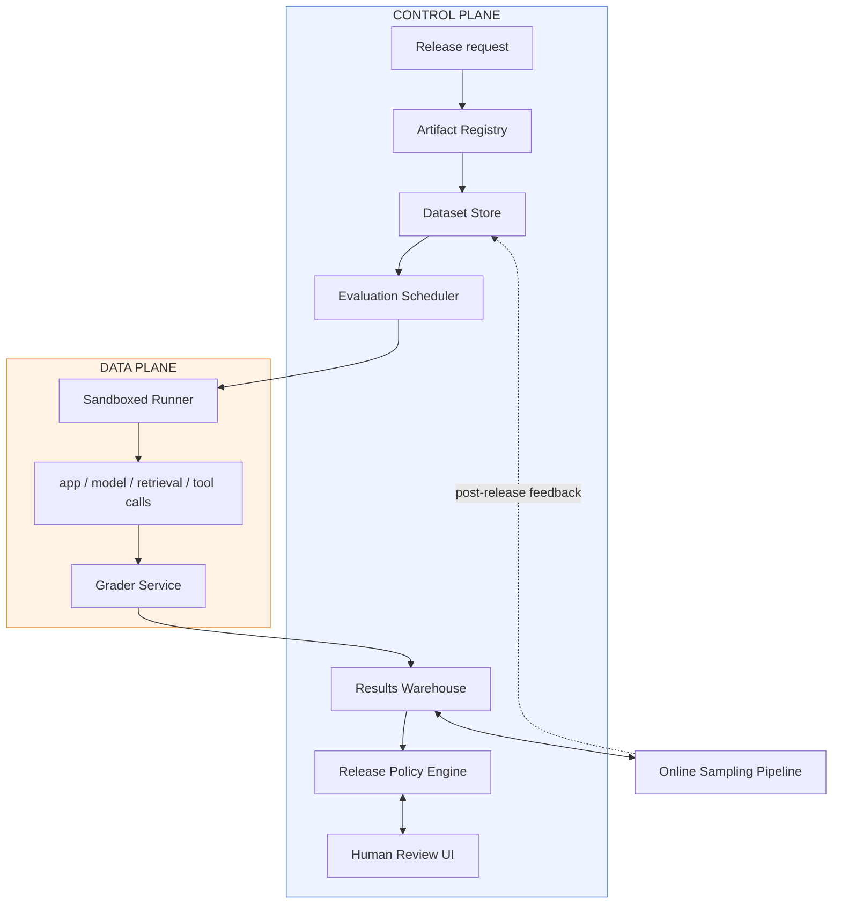
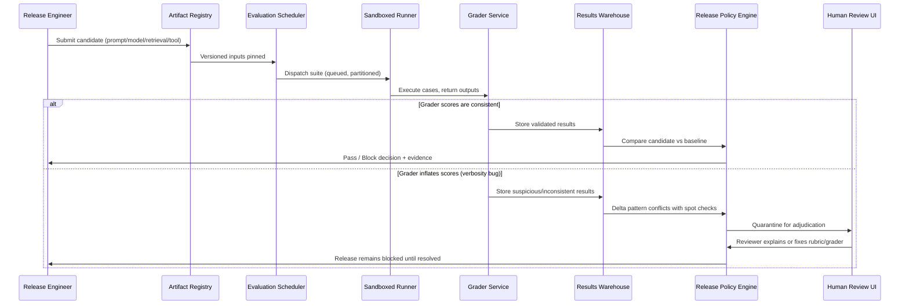
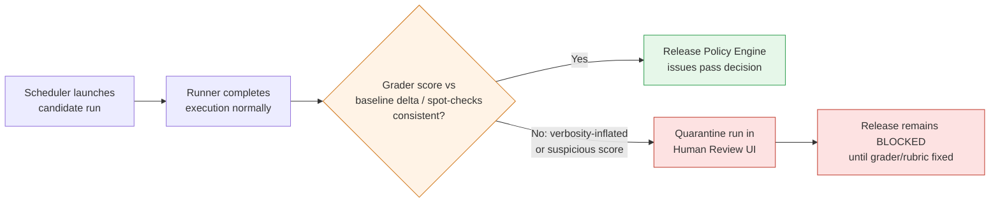
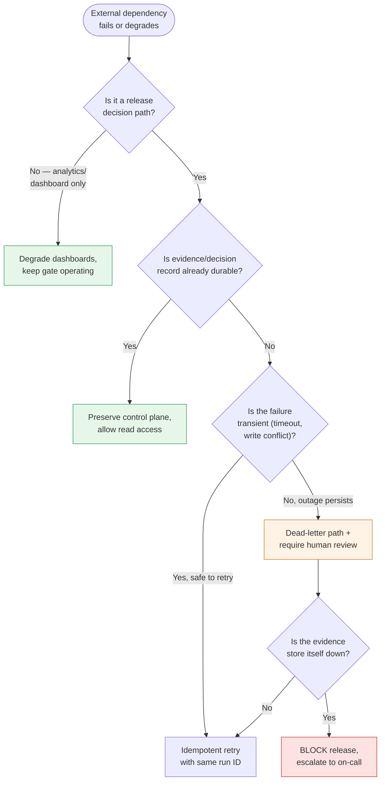
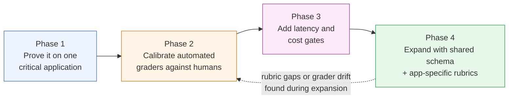

# Chapter 9: Design an LLM Evaluation and Release-Gating Platform

*Source: THE FORWARD DEPLOYED ENGINEER SYSTEM DESIGN INTERVIEW: 20 REAL-WORLD AI SYSTEM DESIGN CASE STUDIES, Chapter 9*

## 1. The Customer Problem and Discovery

**Key Points**
- The customer ask sounds simple but hides a governance problem: "We need one platform that lets 30 AI applications decide whether prompt, model, retrieval, or tool changes are safe to release."
- The real question is not "what system should we build?" but "whose workflow changes, what decisions will they make differently, and what evidence will they trust?"
- Four stakeholder groups pull in different directions: engineers want speed, evaluators want clear rubrics, safety teams want conservative gating, release managers want a defensible audit trail.
- A jobs-to-be-done framing ("Did my change worsen behavior?", "What should I score and why?", "Is this release safe enough?", "Can I approve this with evidence?") keeps the four roles distinct.
- The weak restatement ("build an evaluation dashboard") narrows the design prematurely; the strong restatement ("build a release-gating system that helps teams compare a candidate AI change against the current baseline, detect quality, safety, latency, and cost regressions, and record the evidence behind a release decision") keeps the business outcome in view.
- The FDE edge is translating customer language into operating rules, not jumping straight to data stores, queues, or models.

The customer meeting starts with a statement that sounds simple and is not simple at all: "We need one platform that lets 30 AI applications decide whether prompt, model, retrieval, or tool changes are safe to release."

The first job is not architecture. It is to restate the problem without smuggling in a design. The platform is not the goal; the goal is to make quality, safety, latency, and cost regressions visible before and after deployment. That means the real question is not "What system should we build?" but "Whose workflow changes, what decisions will they make differently, and what evidence will they trust?"

In the room, the stakeholders usually want the same feature and disagree everywhere else.

### Who actually cares

The four groups to map are:

- AI application engineers, who want fast feedback on whether a prompt, retrieval chain, or model swap broke behavior.
- Domain evaluators, who judge correctness, tone, policy adherence, or task completion against examples they understand.
- Safety teams, who care about unsafe outputs, policy violations, prompt injection exposure, and edge cases that only appear under stress.
- Release managers, who need a go/no-go signal, an audit trail, and a defensible explanation when something is blocked.

A concrete stakeholder map for this prompt looks like this: the end user is the AI application engineer, the operator is the release manager or platform owner, the security owner is the safety team, and the executive sponsor is the product or engineering leader funding the shared platform across 30 applications. Those roles are not interchangeable, even if one person sometimes fills more than one seat in a smaller organization.

Those groups are not interchangeable. Engineers want speed and iteration. Evaluators want clarity and stable rubrics. Safety teams want conservative gating and exception handling. Release managers want a decision that can survive scrutiny after the fact. If you do not separate those needs, you end up with a system that is technically impressive and operationally unusable.

A useful way to frame the conversation is jobs-to-be-done: each stakeholder is hiring the platform to answer a different question. The engineer asks, "Did my change worsen behavior?" The evaluator asks, "What should I score and why?" The safety lead asks, "Is this release safe enough for the risk profile?" The release manager asks, "Can I approve this with evidence?"

### Feature versus outcome

A weak restatement sounds like this: "Build an evaluation dashboard with test runs, scorecards, and approvals." That is feature-first and already narrows the design.

A better restatement is: "Build a release-gating system that helps teams compare a candidate AI change against the current baseline, detect quality, safety, latency, and cost regressions, and record the evidence behind a release decision."

The difference matters. A dashboard is one possible interface. The business outcome is a controlled decision process. If the interviewer withholds detail, say so explicitly: "I'll assume the core problem is not just scoring models offline, but using those scores to gate production releases across multiple AI applications." That kind of assumption is valuable because it makes the hidden workflow visible instead of pretending the ambiguity is gone.

### The opening answer I would give

A strong two-minute opening keeps the scope tight and the stakes explicit:

"Given 30 AI applications, I'd design a shared evaluation and release-gating platform that lets teams compare a candidate prompt, model, retrieval setup, or tool chain against the current baseline before rollout. The primary outcome is to make quality, safety, latency, and cost regressions visible before and after deployment, so release managers can approve with evidence and engineers can iterate without guessing. I'd start by separating the users: application engineers create and run evals, domain evaluators score outputs, safety teams define high-risk checks and override rules, and release managers consume the final gate result. Then I'd clarify whether gating applies to every change or only to high-risk changes, what evidence is required, and how much manual review the business can tolerate."

That answer does three things at once: it restates the prompt, names the stakeholders, and places the platform inside an operational decision loop.

### What to ask first under time pressure

Interview time is limited, so the goal is not to ask everything. The goal is to ask the few questions that change the design the most. A good sequence is:

1. What counts as a release? Is the gate for every prompt edit, only model changes, or only production deployments?
2. What evidence is required to pass? Human rubric scores, automated checks, safety thresholds, latency budgets, or all of them?
3. What is the highest-risk failure? Wrong answer, policy violation, silent latency regression, cost blowout, or tool misuse?
4. Who can override a failed gate, and how is that decision recorded?
5. Is evaluation data shared across applications, or does each application need isolated datasets and policies?

That is fewer than a dozen questions, but each one changes the architecture. For example, if overrides must be audited, you need immutable records and role-based controls. If evaluation data is shared, you need stronger tenancy boundaries and versioning. If latency is part of the gate, the platform must capture timing traces, not just answer quality.

### Building the assumption ledger

Discovery is not only about questions; it is about making assumptions explicit. A simple assumption ledger should capture:

- Scope: one platform for 30 applications, not one bespoke system per team.
- Workflow: evaluations run before release and may continue after deployment for drift detection.
- Risks: false passes are more dangerous than false blocks for high-impact applications.
- Owners: engineers own changes, evaluators own rubrics, safety owns policy checks, release managers own approval.
- Success: fewer bad releases, faster review, and traceable decisions.

When the interviewer stays vague, the ledger is your way of showing disciplined reasoning without pretending certainty. It also prevents you from designing for an imaginary customer. An FDE is not rewarded for guessing every detail correctly; the FDE is rewarded for converting ambiguity into a testable plan.

### Measuring the business outcome

"Make quality, safety, latency, and cost regressions visible before and after deployment" becomes real only when it can be observed in practice. That means the platform must preserve the baseline version, the candidate version, the evaluation dataset or scenario, the rubric, the scorer identity or scorer type, and the final decision. It also means the system must support comparisons across versions and across time, so teams can see whether a release improved one dimension while quietly degrading another.

This is the interview-market signal inside the problem: the best candidates do not jump straight to data stores, queues, or models. They translate customer language into operating rules. That is the FDE edge. If you can show that a release manager needs an auditable gate, a safety team needs policy controls, and an engineer needs fast iteration, you are already doing the work of an embedded customer-facing architect.

### The takeaway from discovery

The architecture starts only after you can answer three questions cleanly: whose workflow changes, what decision they are making, and how success will be measured. For this problem, the answer is not "build evaluation tooling." It is "give engineers, evaluators, safety teams, and release managers a shared mechanism for deciding whether a change is safe enough to ship." Once that is clear, the rest of the design—scoring, gating, audit, rollout, and observability—has a purpose instead of just a shape.

## 2. Clarifying Questions, Requirements, and Constraints

**Key Points**
- The interviewer deliberately gives an incomplete brief; the candidate's job is to choose the few assumptions that matter most and protect the highest-risk constraint first.
- The highest-risk constraint here is decision quality under uncertainty: a gate too permissive ships bad changes, a gate too strict gets bypassed.
- A six-question tree narrows the design from workflow to evidence to enforcement: application criticality, offline-vs-online evaluation, labels/reviewers, release cadence, trace sensitivity, and regression thresholds.
- Requirements sort into must-have functional (versioning, running evals, comparing against baselines, human review, policy enforcement, sampling production failures) and must-have nonfunctional (reproducibility, lineage, statistical honesty, tenant isolation).
- A requirements-to-component traceability table connects every requirement to an architectural owner — if a requirement has no owner, the design is incomplete.
- The MVP explicitly excludes automated fine-tuning, full legal/compliance governance workflows, open-ended notebook experimentation, cross-tenant sharing, and per-trace custom visualization.

### Start by forcing the hidden constraint into the open

The interviewer gives you a deliberately incomplete brief: "Give 30 AI applications one platform to determine whether prompt, model, retrieval, or tool changes are safe to release." Then they answer only half your questions. That is not a trick; it is the core interview move. Your job is to choose the few assumptions that matter most, state them explicitly, and protect the highest-risk constraint first.

For this platform, the highest-risk constraint is usually not raw throughput. It is decision quality under uncertainty: if the gate is too permissive, a bad change ships; if it is too strict, teams stop trusting it and bypass it. Every clarifying question should reduce the chance of building the wrong decision system.

### The question tree you should use

A strong candidate asks questions in a sequence that narrows the design from workflow to evidence to enforcement:

**1) What kinds of applications are we serving, and how critical are they?**
This question changes everything: a customer-support copilot, a code assistant, a medical triage workflow, and a document summarizer do not deserve the same release policy. Ask whether the platform must serve many application types, and whether some are safety-sensitive, revenue-critical, or internally low-risk. Criticality drives whether a small quality drop is acceptable, whether human review is mandatory, and whether a failed evaluation blocks release or merely warns.

**2) Which evaluations must happen offline, and which must happen online?**
Offline evaluation catches regressions before release using fixed datasets, synthetic scenarios, and replayed traces. Online evaluation measures live behavior after rollout through shadow traffic, canaries, or sampled production outcomes. If the customer only wants offline gating, the system can be simpler. If they want both, you need clear versioning, trace sampling, and a way to compare pre-release evidence with post-release telemetry.

**3) What labels and human reviewers are available?**
Ask whether labels come from product experts, QA analysts, operations staff, or end users; whether they are sparse or dense; and whether there is any disagreement process. This determines if the system can rely on deterministic scoring, needs probabilistic graders, or must route borderline cases to humans. If reviewers disagree, the platform must capture that disagreement as a first-class signal, not as noise to discard.

**4) How often do teams release, and how much confidence do they need?**
A team releasing many times per day wants low-friction evaluation with fast turnaround. A team releasing weekly may accept slower, richer review. Confidence requirements also vary: some teams need a lightweight warning, others need a hard gate with a documented approval trail. This question tells you whether the platform is a fast checkpoint, a formal approval system, or both.

**5) What trace data is sensitive?**
LLM traces often contain prompts, retrieved documents, user content, tool outputs, and hidden system messages. Ask whether traces may include personal data, customer secrets, regulated content, or internal business data. This decides redaction, tenant isolation, retention, encryption, and who may inspect failures. You do not want to discover late that "evaluation data" is actually a privacy-sensitive record set.

**6) What regression thresholds are acceptable?**
If the customer cannot define acceptable quality loss, latency increase, safety drift, or cost growth, the gate cannot be credible. Ask whether thresholds differ by application type, by severity class, or by release stage. This is where you separate preferences from constraints: "We prefer lower latency" is not the same as "anything above this latency blocks release."

### Turn answers into prioritized requirements

Once the interviewer has answered enough to expose the operating shape, sort requirements using must/should/could, not by technical elegance.

**Must-have functional requirements** are the ones that make the platform a release gate rather than a dashboard:

- version datasets, prompts, models, tools, and graders;
- run deterministic and probabilistic evaluations;
- compare candidates with production baselines;
- support human review and disagreement;
- enforce release policies;
- sample privacy-safe production failures into future tests.

That list is intentionally tight. Versioning is not bookkeeping; it is the only way to reproduce a decision later. Deterministic and probabilistic evaluation both matter because some checks should be stable and repeatable, while others depend on stochastic model behavior or rubric-driven judgment. Baseline comparison is the point of release gating: candidates are only meaningful relative to what is already shipped. Human review matters whenever the grader is uncertain, the case is high-impact, or the rubric itself is under development. Policy enforcement turns analysis into action. Sampling production failures feeds the platform with real regressions so the test set evolves with the product.

**Must-have nonfunctional requirements** are equally important:

- reproducible runs;
- grader and dataset lineage;
- statistically honest comparisons;
- tenant and data isolation.

These are constraints, not preferences. Reproducibility means the same dataset, prompt version, model version, tool config, and grader version can recreate the same evaluation context. Lineage means every result can be traced back to its inputs and version history. Statistical honesty means the system does not overstate tiny differences, cherry-pick favorable runs, or pretend that noisy scores are precise. Tenant and data isolation means one application's traces, labels, and evaluations must not leak into another tenant's workspace.

### Example of a concise interview question tree

If you want a clean verbal flow, use this sequence:

1. Which application types are in scope, and which are safety- or revenue-critical?
2. Are we gating only pre-release changes, or also monitoring live releases?
3. What labels exist today, who reviews hard cases, and how often do they disagree?
4. How frequently do teams release, and what confidence level is required to ship?
5. What parts of a trace are sensitive, and what must be redacted or isolated?
6. What regression threshold blocks a release versus only opening a review?

That tree is short on purpose. It gives you enough leverage to design the system without wandering into unhelpful detail too early.

### What to exclude in the MVP

A good design answer also names what the first version will not do. Otherwise the platform sprawl begins immediately.

For an MVP, exclude these unless the interviewer explicitly expands scope:

- automated model fine-tuning or prompt optimization;
- full governance workflow for legal or compliance sign-off;
- open-ended notebook-style experimentation;
- every possible metric for every application on day one;
- cross-tenant sharing of datasets or graders;
- custom visualization of every trace field.

Why exclude them? Because the first deliverable is a trustworthy release gate. Fine-tuning and prompt optimization are useful, but they are not required to decide whether a candidate is safe enough to ship. Formal governance may exist later, but the platform should first provide reliable evidence and policy enforcement. Broad notebook freedom is attractive to engineers, yet it weakens reproducibility unless carefully controlled. Cross-tenant sharing is the wrong default for a system that may contain sensitive traces. Extra visual polish can wait until the decision path is solid.

### Requirements-to-component traceability

A practical FDE answer connects each requirement to an architectural responsibility. A simple traceability table in the interview might look like this:

| Requirement | Component responsibility |
|---|---|
| Version datasets, prompts, models, tools, graders | Registry and immutable version store |
| Run deterministic and probabilistic evaluations | Evaluation runner and scoring service |
| Compare candidates with production baselines | Baseline comparator and diff engine |
| Support human review and disagreement | Review queue, adjudication workflow, audit log |
| Enforce release policies | Policy engine and release gate |
| Sample privacy-safe production failures into future tests | Trace ingestion, redaction, curation pipeline |
| Reproducible runs | Run manifests, locked versions, execution logs |
| Grader and dataset lineage | Provenance graph and metadata store |
| Statistically honest comparisons | Reporting layer with uncertainty-aware summaries |
| Tenant and data isolation | Authz boundaries, workspace partitioning, encryption controls |

This table is valuable because it prevents vague architecture talk. If a requirement has no component owner, the design is incomplete.

### The assumption you protect when the interviewer stays vague

If the interviewer refuses to answer all the questions, choose the assumption that best protects the highest-risk constraint: the gate should err on the side of blocking uncertain, high-impact changes and escalating them to human review. That is safer than assuming all applications are equally tolerant of regression.

This is where assumption risk becomes visible. Every unanswered question becomes a design assumption, and some assumptions are dangerous. Assuming traces are non-sensitive can break trust. Assuming all labels are high quality can distort the gate. Assuming one global threshold fits every app can make the platform unusable. The best FDEs do not pretend uncertainty is gone; they document it, bound it, and design around it.

### Why this matters in the job market

Interviewers are not only checking whether you know the components. They are checking whether you can discover the right problem under pressure, prioritize requirements without overbuilding, and protect delivery when the customer is ambiguous. That is the FDE signal: customer discovery, disciplined scoping, and explicit assumptions that keep the system safe enough to ship.

### What you should say in the room

A strong candidate sounds like this: "I want to confirm which application types we're gating, whether offline or online evaluation is required, what labels and human reviewers exist, how often teams release, what trace data is sensitive, and what regression thresholds are acceptable. If I only get partial answers, I will design for the highest-risk case first: a versioned, reproducible gate with strict isolation, baseline comparison, and human escalation for uncertain or high-impact cases."

That answer does three things at once: it extracts requirements, it distinguishes functional from nonfunctional constraints, and it shows that you can move forward with clear assumptions instead of waiting for perfect information.

## 3. Scale Estimates, SLOs, and Capacity

**Key Points**
- The first-pass whiteboard architecture (queue, workers, database, dashboard) is plausible only at average load — it fails at release-window peaks, which is why sizing must start with the customer's release rhythm.
- Anchoring number: 30 applications × 20 candidate releases/day × 5,000 test cases = 3,000,000 test-case executions/day.
- Converting test-case volume into a model-call range (2–3 to 3–5 calls/case) yields 6,000,000–15,000,000 model or evaluator calls/day, or roughly 69–174 calls/sec across 24 hours, and 278–694 calls/sec if the gate must complete inside a 6-hour release window.
- At ~2.5 calls/sec per worker (400 ms/call), sustaining the daily average needs ~28–70 workers; sustaining a 6-hour deadline needs ~112–278 workers, before headroom for retries and burstiness.
- Average load answers "can we survive the day?"; peak load answers "can we survive the release window?" — those are different questions and the architecture must answer both.
- The key comparison is a delta formula: Δ = Metric_candidate − Metric_baseline, computed per test case and aggregated by app, by release, and across the fleet, with variance and confidence bands considered rather than just the sign of the delta.
- Caching is safe only for deterministic, versioned artifacts (test definitions, baseline outputs, prompt templates, embeddings) — never for the stochastic judgment being measured.
- A 10x growth sensitivity table exposes which bottlenecks change first: at current scale the platform may be limited by evaluator concurrency; at 10x, storage, retention, and human-review routing dominate.
- Unit economics (cost per candidate release to evaluate) belongs in the same conversation as SLOs — tiered evaluation (fast smoke gates, deeper suites, full suites) keeps the platform economically sustainable.

The first pass at this design usually looks fine on a whiteboard: a queue, a pool of workers, a database for results, and a dashboard for reviewers. That architecture is plausible at average load. It fails when the release train tightens, when a customer asks for a same-day gate, or when a "small" change multiplies across 30 applications. This is where an FDE has to stop sketching and start sizing.

### Start with the customer's release rhythm

If the platform serves 30 applications, each with 5,000 test cases, and the teams submit 20 candidate releases per day, the headline workload is not "30 apps." It is:

- 30 applications × 20 candidate releases/day = 600 candidate evaluations/day
- 600 candidate evaluations/day × 5,000 test cases = 3,000,000 test-case executions/day

That is the first useful number because it anchors every later choice: batching, queue depth, worker count, storage, and failure recovery. It also tells you where the real cost lives. A platform like this is not just storing metadata; it is repeatedly invoking graders, model judges, retrieval checks, tool simulations, and human-review fallbacks.

Now estimate the model-call envelope in a way that is honest about variation. Not every test case needs the same number of calls. A single case may require one baseline model run, one candidate run, and one evaluator pass; a richer case may also need retrieval setup, rubric scoring, or tool replay. So the right move in an interview is to state a range, not a fake-precise point estimate:

- Minimum plausible calls per test case: 2–3
- More realistic gated-evaluation calls per test case: 3–5

At 3,000,000 test cases/day, that becomes roughly 6,000,000–15,000,000 model or evaluator calls/day. If you want to make the throughput concrete, convert that into calls per second:

- Spread across 24 hours: about 69–174 calls/sec
- If the gate must complete inside a 6-hour release window: about 278–694 calls/sec

Wall time matters even more when you translate calls into worker capacity. Suppose one evaluator worker can complete one call every 400 ms on average after network overhead, serialization, and queueing. That is about 2.5 calls/sec per worker at 100% utilization. To sustain the daily average you need on the order of 28–70 active workers, and to sustain a 6-hour deadline you need roughly 112–278 workers. In practice you would add headroom for retries, tail latency, and burstiness, so the target pool would be larger than the pure arithmetic minimum.

A compact way to present the same estimate is:

| Window | Calls/sec needed | Approx. workers at 2.5 calls/sec each | Practical implication |
|---|---|---|---|
| 24-hour batch | 69–174 | 28–70 | Shared elastic pool is sufficient if backlog is allowed |
| 6-hour release gate | 278–694 | 112–278 | Requires aggressive parallelism, admission control, and prioritization |

That is the first place the design becomes concrete. A queue alone is not enough; the system needs an elastic worker pool, backpressure, and a deadline-aware scheduler so a release gate does not become a release blocker.

### Separate average load from peak load

Average load says, "Can we survive the day?" Peak load says, "Can we survive the release window?" Those are not the same question. If teams release in business hours or before a freeze, traffic can cluster heavily. A release train that looks modest on a daily average can still overwhelm a system if many applications submit candidates in the same hour.

This is why the candidate should revise the first architecture with back-of-the-envelope calculations. A naive design might allocate one worker per application or one worker per release. That sounds simple, but it ignores peaks and long-running tests. A more defensible design uses a shared, elastic worker pool with queueing, per-tenant quotas, and admission control so one app cannot starve the rest.

The estimate that most affects component selection is usually wall time under peak concurrency. If the customer wants gate results within a short release window, then the system must prioritize parallelism, cached baselines, and early-exit policies. If the customer is willing to wait overnight, then lower-cost batch execution may be acceptable. In other words, latency budget drives partitioning more than raw daily volume does.

### Use the baseline comparison that actually answers the business question

The platform is not trying to produce a single "good" score. It is trying to tell a team whether a candidate change is better, worse, or indistinguishable from a pinned baseline. That is why the key comparison is:

Δ = Metric_candidate − Metric_baseline

Here, Metric can be quality, safety violation rate, task success rate, refusal accuracy, latency, or cost, depending on the gate. The meaning of Δ is what matters: a positive or negative shift is only useful if the baseline is fixed, versioned, and comparable. This is also where uncertainty belongs. If the candidate is two tenths of a point better on a noisy rubric, that may not justify release. The decision should consider variance, confidence bands, and operational risk, not just the sign of the delta.

A whiteboard derivation in the interview should sound like this: "For each test case, I compare candidate output to a pinned baseline output or rubric score. I compute Δ for the metric that matters to the app, then aggregate by app, by release, and across the fleet. If the distribution of Δ crosses the allowed regression threshold, the gate fails or routes to human review." That shows you can connect math to release policy without pretending that a single metric captures everything.

### Caching helps, but only when it does not corrupt the test

Caching can reduce cost and latency, but only in the parts of the workflow where determinism is preserved. Cache stable artifacts such as test definitions, baseline outputs, retrieval corpora snapshots, rubric templates, prompt templates, and precomputed embeddings when those artifacts are truly versioned. Do not cache away the behavior you are trying to measure. If a test is intentionally stochastic, or if the gate is validating prompt sensitivity, sampling variance, or model nondeterminism, then aggressive caching can invalidate the result.

A useful interview phrase is: "I cache immutable inputs and expensive shared fixtures, not the stochastic judgment itself." That distinction signals that you understand measurement integrity, not just throughput.

### Translate capacity into SLOs the customer can feel

The platform's technical objectives should trace directly to the release workflow:

- Availability: reviewers and release engineers can access the gate when a release is in progress.
- Latency: candidate evaluation completes inside the release decision window.
- Freshness: the platform uses the intended version of model, prompt, retrieval corpus, tools, and baseline.
- Quality: gate results are reproducible enough to trust for release decisions.
- Security: test traces, prompts, outputs, and customer data remain isolated by tenant and access policy.
- Cost: the gate does not make every release so expensive that teams bypass it.

The corresponding service-level indicators and objectives should be phrased in operational terms. For example, an SLI might be "percent of candidate evaluations completed within the configured deadline" or "percent of evaluations using the correct baseline version." An SLO might require that most routine candidate runs finish within a release window, with explicit slower paths for large suites or human escalation. The right SLO is not abstract uptime; it is whether the platform lets teams decide safely before they ship.

### State average, peak, growth, and headroom explicitly

Avoid false precision. Say the average daily load, the peak release-hour load, the expected growth factor, and the headroom you want to preserve. If today's demand is 600 candidate evaluations/day, a 10x growth scenario becomes 6,000 candidate evaluations/day and 30,000,000 test-case executions/day. That does not mean you must overbuild to the 10x case immediately, but it does mean the design should reveal what scales horizontally and what needs a redesign.

A simple sensitivity view makes this concrete:

| Scenario | Candidate evaluations/day | Test-case executions/day | Design pressure |
|---|---|---|---|
| Current | 600 | 3,000,000 | Queue depth, worker pool, storage writes |
| 10x growth | 6,000 | 30,000,000 | Throughput, cost, sharding, retention |

This table is more useful than a single "expected" number because it exposes which bottlenecks change first. At current scale, the platform may be limited by evaluator concurrency. At 10x growth, storage, retention, and human-review routing may become the dominant constraints.

### Unit economics keep the gate usable

Capacity is not just a scaling problem; it is a product adoption problem. If each release produces millions of expensive calls, teams will quietly route around the platform. That is why unit economics belongs in the same conversation as SLOs. Ask: What does one candidate release cost to evaluate? How much of that cost is fixed baseline setup versus per-test-case execution? Which tests should be run on every release, and which should be sampled, deferred, or triggered only for risky changes?

A practical interview answer is to propose tiers: fast smoke gates for every change, deeper suites for model or retrieval changes, and full suites for high-impact apps or major version changes. That keeps the platform economically sustainable while still making regressions visible before and after deployment.

### What to defend under pressure

If the interviewer pushes on the architecture, defend the numbers, not just the diagram. Explain why the queue is the right pressure valve, why the baseline must be pinned, why caching is selective, and why the SLOs mirror the customer's release cadence. Then admit the uncertainty: the most sensitive assumptions are the number of test cases that must run on every candidate, the average number of calls per case, and the acceptable gate latency. Those are the assumptions that decide whether you need a batch engine, a low-latency service, or a hybrid.

The broader lesson is simple: estimates are decision tools. Each number should justify an architectural choice or an operational limit. If the estimate does not change the design, it is probably decorative rather than useful.

## 4. Architecture and End-to-End Flow

**Key Points**
- The platform separates the control path (decides what to evaluate) from the data path (executes work), keeping candidate selection, policy enforcement, and human escalation deterministic even when runners are noisy, slow, or partially failing.
- Control-plane components: Release request intake, Artifact Registry, Dataset Store, Evaluation Scheduler, Release Policy Engine, Results Warehouse, Human Review UI, Grader Service.
- Data-plane components: Sandboxed Runner, App/model/retrieval/tool calls, Online Sampling Pipeline.
- The primary flow chains through the control and data planes: Release request → Artifact Registry → Dataset Store → Evaluation Scheduler → Sandboxed Runner → app/model/retrieval/tool calls → Grader Service → Results Warehouse → Release Policy Engine ↔ Human Review UI, with Results Warehouse ↔ Online Sampling Pipeline as the post-release feedback loop.
- A 10-step happy-path sequence and a 6-step failure-path sequence ("grader rewards verbosity instead of correctness") together define the request lifecycle from candidate registration through pass/block/hold decision.
- Trust boundaries follow a clean split: control plane owns intent, data plane owns execution; strongly consistent stores (Artifact Registry, Dataset Store) guarantee fixed inputs, eventually consistent stores (Evaluation Scheduler status, Results Warehouse) are acceptable for jobs and analytics, but the final gate reads only completed, validated results.
- MVP versus later evolution: MVP is the immutable registry, dataset store, async scheduler, sandbox runner, grader service, results warehouse, and a pass/block policy engine; richer human workflow, adaptive sampling, multi-region execution, and deeper score calibration come later.
- A diagram only earns its place if you can narrate data, identity, state, and failure through it — otherwise it is decoration, not a design tool.

### Architecture that matches the decision you are actually making

The platform is not just "run evaluations." It is a release gate for 30 AI applications, so the architecture has to separate the control path that decides *what to evaluate* from the data path that actually executes work. That separation keeps candidate selection, policy enforcement, and human escalation deterministic even when the runners are noisy, slow, or partially failing.

A useful way to narrate the design is to start with the customer outcome: a release owner submits a prompt, model, retrieval, or tool change and wants a fast, defensible answer on whether it is safe to ship. The platform should turn that into a governed evaluation run, compare the candidate against a pinned baseline, and either approve, block, or route to review with an explanation that engineering and product can both understand.

### Top-down component map

**Control plane**

- Release request
- Artifact Registry
- Dataset Store
- Evaluation Scheduler
- Release Policy Engine
- Results Warehouse
- Human Review UI
- Grader Service

**Data plane**

- Sandboxed Runner
- App/model/retrieval/tool calls
- Online Sampling Pipeline

**Primary flow between components**

Release request → Artifact Registry → Dataset Store → Evaluation Scheduler

Evaluation Scheduler → Sandboxed Runner → app/model/retrieval/tool calls → Grader Service

Grader Service → Results Warehouse → Release Policy Engine

Release Policy Engine ↔ Human Review UI

Results Warehouse ↔ Online Sampling Pipeline



### Component-responsibility table

| Component | Primary responsibility | State ownership | Boundary / notes |
|---|---|---|---|
| Artifact Registry | Store immutable candidate definitions and baseline references | System of record for candidate config | Control-plane authority; prevents drift during runs |
| Dataset Store | Store suites, labels, rubrics, and scenario metadata | System of record for eval inputs | Shared read path, tightly versioned |
| Evaluation Scheduler | Select suites, fan out work, enforce queueing and concurrency | Job state / run orchestration state | Asynchronous control-plane orchestrator |
| Sandboxed Runner | Execute prompts, tool calls, and model calls under isolation | Ephemeral run state | Data-plane trust boundary; untrusted execution |
| Grader Service | Score task success, safety, latency, and cost | Derived scoring state | May be automated or human-augmented |
| Human Review UI | Resolve ambiguous or disputed cases | Review decisions and annotations | Policy input, not just annotation UX |
| Results Warehouse | Persist run-level and aggregate outcomes | System of record for validated results | Analytics and audit source for release history |
| Release Policy Engine | Decide pass, block, or hold for review | Policy decision state | Reads only completed, validated inputs |
| Online Sampling Pipeline | Sample live or shadow traffic post-release | Monitoring / sampling state | Bridges batch evaluation to production observation |

The artifact registry is the system of record for immutable candidate definitions: prompt version, model ID, retrieval settings, tool allowlist, seed policy, and the exact baseline reference. It prevents the most common interview mistake, which is allowing a "candidate" to drift while the evaluation is still running. The dataset store is the system of record for suites, labels, rubrics, and scenario metadata. Together, those two stores define *what* was tested and *against which reference*.

The evaluation scheduler is the control-plane orchestrator. It chooses the suite for a given application, fan-outs work, and applies backpressure when runner capacity is constrained. That scheduler is intentionally asynchronous because the platform must absorb bursts: a few teams may submit dozens of candidates during a release window, and the system should queue fairly rather than fail unpredictably. The partitioning key here is usually the application or tenant, sometimes refined by evaluation class, so a single noisy customer cannot starve everybody else.

The sandboxed runner is the data-plane execution boundary. It isolates untrusted prompts, tool calls, and external dependencies from the rest of the platform. In practice, this is where you enforce timeouts, network egress limits, secrets scoping, and per-run concurrency caps. The runner should be treated as hostile-adjacent: it handles arbitrary model outputs and may invoke external APIs or internal tools, so the sandbox is the main trust boundary.

The grader service consumes run outputs and scores them against task success, safety checks, latency, and cost signals. Some checks can be fully automatic; others need a human because the grader may be uncertain, the rubric may be ambiguous, or the system may exhibit the classic failure mode where it is verbose but wrong. Those disagreements route to the human review UI, which is not just an annotation tool. It is a policy input. The reviewer's decision becomes part of the release record and can override or supplement automated scoring.

The results warehouse stores run-level and aggregate results for analysis, trend detection, and auditability. The release policy engine reads from that warehouse and from the baseline registry to make the final gate decision: pass, block, or require human sign-off. The online sampling pipeline sits alongside the batch path. After deployment, it samples live or shadow traffic to detect regressions that only appear in production. That is the bridge between pre-release evaluation and post-release monitoring.

### Sequence diagram: happy path and failure path

The chapter plan promised an end-to-end sequence asset, so the narration below is written to be self-sufficient even without a rendered figure. Read it as the numbered sequence diagram in text form.

**Happy-path sequence**

1. **Release request arrives.** A release engineer submits an immutable candidate configuration to the Artifact Registry.
2. **Versioned inputs are pinned.** The registry resolves the exact prompt, model, retrieval, tool, seed, and baseline identifiers.
3. **Suite selection occurs.** The Evaluation Scheduler selects the application-specific suite from the Dataset Store.
4. **Work is queued.** The scheduler creates run jobs, partitions them by tenant or application, and enforces concurrency limits.
5. **Cases execute in isolation.** The Sandboxed Runner pulls work, applies controlled seeds, and executes the candidate against the necessary app/model/retrieval/tool dependencies.
6. **Signals are graded.** The Grader Service scores task correctness, safety, latency, and cost, then emits validated results.
7. **Results are recorded.** The Results Warehouse stores run-level and aggregate outputs for review and historical comparison.
8. **Baseline comparison happens.** The Release Policy Engine compares candidate metrics and confidence intervals with the pinned baseline.
9. **Disagreements are escalated.** Any ambiguous or borderline case routes to the Human Review UI for adjudication.
10. **Decision is issued.** The Policy Engine returns pass, block, or hold for review, with reasons attached to the release record.

**Failure-path sequence: the grader rewards verbosity instead of correctness**

1. **The same candidate run begins.** The request still enters through the Artifact Registry and Scheduler.
2. **The runner completes normally.** Execution succeeds, so the failure is not in candidate invocation.
3. **The grader inflates scores.** Verbose but wrong answers receive suspiciously high marks from the Grader Service.
4. **The policy engine detects inconsistency.** The results conflict with human spot checks or with the baseline delta pattern.
5. **The run is quarantined.** The Scheduler or Policy Engine routes the case to the Human Review UI rather than allowing silent approval.
6. **Release is blocked.** The policy engine withholds pass status until the discrepancy is explained, the rubric is corrected, or the grader is fixed.



That sequence matters because each step answers a different customer question. The registry answers "what exactly changed?" The suite answers "what did we test?" The runner answers "under what conditions?" The grader answers "how did it perform?" The policy engine answers "can we ship?"

### Trust boundaries, ownership, and consistency points

The cleanest split is: control plane owns intent, data plane owns execution. The artifact registry and dataset store are strongly consistent enough to guarantee that a run points to fixed inputs. The scheduler can tolerate eventual consistency on status updates because it is managing jobs, not money movement. The results warehouse is append-heavy and can be eventually consistent for analytics, but the final gate should read only completed, validated run records.

Mark these boundaries explicitly in an interview:

- **System of record:** artifact registry, dataset store, results warehouse for final scores.
- **Cache:** rendered prompts, compiled retrieval bundles, precomputed baselines, cached policy lookups.
- **Queue:** scheduler work queue, human-review queue, post-release sampling queue.
- **External dependencies:** model providers, retrieval backends, tool APIs, identity provider, logging/metrics pipeline.

That distinction keeps the design honest. If the interviewer asks where to put a cache, the answer is "where repeated reads are safe and freshness is not the source of truth." If they ask where to put policy enforcement, the answer is "at the boundary that decides whether work can proceed, not only after the fact."

### Failure path: the grader rewards verbosity instead of correctness

A critical failure drill is when the grader prefers long, confident answers that are actually wrong. In that case, the architecture should fail closed on the metrics it can trust and route ambiguous results to review rather than letting a broken grader silently approve a candidate. The control flow becomes:

1. The scheduler launches the same candidate run.
2. The runner completes execution normally.
3. The grader produces a suspiciously high score on verbosity-heavy cases.
4. The policy engine detects disagreement with spot-checked human labels or baseline deltas.
5. The run is quarantined in the review queue.
6. The release remains blocked until the discrepancy is explained or the grader is fixed.



This is where backpressure and flow control matter. If the grader or human queue slows down, the scheduler should shed noncritical workload or reduce concurrency rather than letting stale decisions pile up. For an MVP, a single queue plus per-tenant concurrency limits is often enough. Later, you can split queues by evaluation type, introduce priority lanes, or add adaptive sampling so only risky candidates consume full-suite capacity.

### What is MVP versus later evolution

For an interview, keep the first release narrow:

- **MVP:** immutable artifact registry, dataset store, async scheduler, sandbox runner, grader service, results warehouse, and a policy engine that can pass or block.
- **Later:** richer human workflow, adaptive suite selection, online sampling integration, multi-region execution, and deeper score calibration.

That answer shows product judgment. The minimum viable platform is not "everything at once"; it is the smallest trustworthy path from candidate registration to release decision.

### Why this architecture matters in the room

A strong FDE answer shows system decomposition and the ability to tell the same story to both customer and engineering stakeholders. The customer hears, "We can make quality, safety, latency, and cost regressions visible before and after deployment." Engineering hears, "The control plane is authoritative, the data plane is isolated, the queues absorb bursts, and the gate only trusts immutable inputs and completed results."

The diagram is useful only when you can narrate data, identity, state, and failure through it. If you cannot walk a request from entry to outcome, and then replay it through a dependency failure, the picture is decoration. If you can, it becomes the backbone of a credible release-gating design.

## 5. Data Model, APIs, and Working Code

**Key Points**
- The architecture only becomes interview-credible when you can name the records, the contracts, and the smallest code path that proves the gate can work.
- Core records: EvalArtifact (immutable candidate config), EvalCase (test case definition), EvalRun (one candidate-vs-baseline comparison), EvalResult (case-level outcome). Ownership is split: EvalCase belongs to the domain expert, EvalRun to the control plane, EvalResult to the execution path but read by reviewers, policy engines, and auditors.
- The external API surface stays small: `POST /v1/eval-runs`, `GET /v1/eval-runs/{id}`, `POST /v1/reviews`, `POST /v1/release-decisions` — each specified with authentication, request semantics, success response, idempotency, and error handling.
- The smallest code path that proves the design: a `release_decision` function that computes a `Delta` via an injected `Comparator`, checks it against a `Policy`, and returns a typed `Decision` — everything else (queueing, persistence, retries, observability) is layered around it.
- Idempotency keys, schema/contract versioning, and optimistic concurrency (ETags/version fields) are the three reliability concepts that do most of the work at the API boundary.
- A contract test and a failure-injection test both matter: one proves deterministic behavior on identical input, the other proves the boundary rejects malformed input before any policy logic runs.
- Production hardening still needed beyond the whiteboard snippet: concurrency control, retries, validation at ingress, observability with trace references, and auditability that preserves exact policy and artifact versions.

The architecture only becomes interview-credible when you can name the records, the contracts, and the smallest code path that proves the gate can work. That is where the candidate should zoom in: the highest-risk component is not the dashboard or the queue, but the decision logic that turns many noisy evaluation signals into a release allow/block outcome.

### Core records and their lifecycle

The platform needs a small set of immutable or mostly-immutable records with clear ownership.

| Record | Primary key | Purpose | Lifecycle | Retention |
|---|---|---|---|---|
| `EvalArtifact(id, type, version, hash)` | id | Names a model, prompt bundle, retrieval config, tool manifest, or policy snapshot used in evaluation | Created when a version is registered; never mutated in place; new versions get new IDs | Keep as long as downstream runs, audits, or rollback references may need it |
| `EvalCase(id, input_ref, expected, rubric, sensitivity)` | id | Defines one evaluation case, including the input reference, expected behavior, scoring rubric, and sensitivity class | Usually updated by creating a new version rather than editing in place; cases may be retired when obsolete | Retain according to test governance and customer policy; sensitive cases may require shorter access windows but not necessarily deletion from all systems |
| `EvalRun(id, candidate, baseline, status)` | id | Represents one run comparing a candidate against a baseline under a specific policy snapshot | Status moves through submitted, queued, running, completed, failed, or blocked; transitions should be monotonic | Retain for auditability and release traceability |
| `EvalResult(run_id, case_id, scores, trace_ref)` | composite across `run_id` and `case_id` | Stores one case-level outcome, including multidimensional scores and a pointer to the trace artifact bundle | Written once after a case completes; immutable after write except for correction workflows with explicit superseding versions | Retain with the run; keep trace references long enough to explain a decision or debug a regression; if a customer requires shorter trace retention, keep the decision record and redacted score summary longer than the raw trace |

The ownership line matters. `EvalCase` is owned by the evaluation program or customer domain expert, not by the release gate. `EvalRun` is owned by the control plane. `EvalResult` is owned by the execution path but read by reviewers, policy engines, and auditors. That separation keeps the gate from silently rewriting evidence after the fact.

### Contract surface and request semantics

The platform's external or internal API set can stay small:

- `POST /v1/eval-runs`
- `GET /v1/eval-runs/{id}`
- `POST /v1/reviews`
- `POST /v1/release-decisions`

A good interview answer distinguishes what each endpoint guarantees. The fastest way to make that concrete is to specify request shape, authentication, idempotency, success responses, and failure modes endpoint by endpoint.

`POST /v1/eval-runs` creates a new run for a candidate and baseline pair.

- **Authentication and authorization:** Require tenant-scoped authentication, for example a service token or user token mapped to a role that can launch evaluations. A request that lacks identity should be rejected with `401 Unauthorized`. A request with valid identity but insufficient permission should return `403 Forbidden`.
- **Request semantics:** The request should include artifact references, selected case set, policy version, and a client idempotency key. It may also include an optional human-readable reason or ticket reference for audit context.
- **Success response:** Return `201 Created` for a new run with the canonical `run_id`, initial `status`, a server-generated version, and any warnings about missing or incompatible artifacts. A body like `{"id": "run_123", "status": "queued", "version": 1, "warnings": []}` is enough for the interview sketch.
- **Idempotency:** If the same idempotency key is submitted again with the same tenant and request fingerprint, return the original run instead of creating a duplicate. If the key is reused with different payload content, that is a client error, usually `409 Conflict` or `422 Unprocessable Entity` depending on the API style.
- **Errors:** Return `400 Bad Request` for malformed payloads, `404 Not Found` if referenced artifacts or case sets do not exist, and `409 Conflict` if the caller tries to reuse a key against a different logical request.

`GET /v1/eval-runs/{id}` returns the canonical run state.

- **Authentication and authorization:** Require the same tenant identity and read permission on the run. If the caller is not allowed to see the run, return `403 Forbidden` rather than revealing whether the ID exists.
- **Response semantics:** Return `200 OK` with the current status, timestamps, selected artifacts, policy version, and a summary of results. If the run is still in progress, the response can include partial progress but should not pretend the decision is final.
- **Concurrency controls:** Include an `ETag` or version field and accept conditional reads. If the client sends `If-None-Match`, the server can return `304 Not Modified` when appropriate.
- **Errors:** Return `404 Not Found` only when the caller is authorized to know the object might exist but it truly does not; otherwise prefer `403` to avoid information leakage.

`POST /v1/reviews` records a human review or override against a specific run or result set.

- **Authentication and authorization:** Require an authenticated reviewer identity and a role that can annotate, approve, or override evaluation outcomes. If the review is an override, the caller should have a higher-privilege permission than a simple commenter.
- **Request semantics:** The request should include the target `run_id` or `result_id`, the reviewer identity, a rationale string, the review type, and a version or `etag` representing the state the reviewer observed.
- **Success response:** Return `201 Created` for a new review record with a review ID, the linked run or result reference, and the new review version. If the same idempotency key is replayed, return the original review.
- **Idempotency:** This endpoint should also accept an idempotency key because human workflow tools and automation both retry. Duplicate submissions with the same key and same payload must resolve to the same stored review rather than creating two votes or two overrides.
- **Errors:** Return `409 Conflict` if the review targets an outdated run version or if a second reviewer tries to overwrite a concurrent moderation record without re-reading. Return `400` for malformed payloads and `404` if the target record is not visible to the caller.

`POST /v1/release-decisions` writes the final release action: allow, block, or require escalation.

- **Authentication and authorization:** Require a release-authorized principal, usually a service account or an operator role with explicit gate-write permission. A read-only reviewer should not be able to finalize release state.
- **Request semantics:** The request should reference a completed run, the policy version used, the decision rationale, and the decision value. It should also include an idempotency key and a version/etag of the run to prevent finalizing against stale state.
- **Success response:** Return `201 Created` the first time a decision is recorded, with the linked run ID, the final verdict, and the policy version used. If the exact request is replayed, return `200 OK` or `201 Created` depending on API convention, but always with the same decision record.
- **Idempotency:** A second identical request should return the same decision record. A conflicting request should fail unless an authorized override path exists, and even then the override should be visible as a new superseding record rather than an invisible overwrite.
- **Errors:** Return `409 Conflict` if the run is not yet completed, if the decision is based on a stale version, or if a different verdict already exists for the same idempotency key. Return `422` if the decision payload references a policy version that cannot be resolved.

Those semantics are not ornamental. They are the difference between an auditable gate and a system that can be nudged into contradictory answers under retry pressure.

### Example: candidate against cases with multidimensional gates

A minimal release gate should not reduce all quality to one opaque score. It should compare a candidate against a baseline across the dimensions the customer actually cares about: answer quality, safety, latency, and cost. That is also the easiest place to explain the business value: the customer does not want a "better model" in the abstract; they want a safe release that does not degrade user experience or burn budget.

Imagine a candidate prompt update that improves one benchmark but quietly increases verbose failures. The gate runs the candidate on the selected `EvalCase` set, aggregates scores, and then checks each policy threshold. If quality moves up but safety drops below threshold, the release is blocked. If latency rises too much, the release is blocked. If token usage drives cost above budget, the release is blocked even if the answers look good.

That is the correct shape of the decision: multidimensional, explicit, and explainable.

### A production-minded interview sketch

The smallest code path that proves this design can work safely is the release decision function. It should be narrow, typed, and wrapped in validation rather than allowing arbitrary dictionaries to leak through the system boundary.

```python
from __future__ import annotations
from dataclasses import dataclass
from typing import Any, Dict, Iterable, Mapping, Protocol


class DecisionError(Exception):
    pass


class ValidationError(DecisionError):
    pass


class ConflictError(DecisionError):
    pass


@dataclass(frozen=True)
class Delta:
    quality_lower_bound: float


@dataclass(frozen=True)
class CandidateMetrics:
    safety_rate: float
    p95_latency_ms: float
    cost_per_case: float


@dataclass(frozen=True)
class Decision:
    allow: bool
    checks: Dict[str, bool]
    delta: Delta


@dataclass(frozen=True)
class Policy:
    max_quality_drop: float
    min_safety_rate: float
    max_p95_ms: float
    max_cost: float
    version: str


@dataclass(frozen=True)
class ArtifactRef:
    id: str
    type: str
    version: str
    hash: str


class Comparator(Protocol):
    def compare(self, candidate: Mapping[str, Any], baseline: Mapping[str, Any], bootstrap_samples: int) -> Delta:
        ...


def _require_keys(payload: Mapping[str, Any], keys: Iterable[str], label: str) -> None:
    missing = [k for k in keys if k not in payload]
    if missing:
        raise ValidationError(f"{label} missing required keys: {', '.join(missing)}")


def _parse_candidate(payload: Mapping[str, Any]) -> CandidateMetrics:
    _require_keys(payload, ["safety_rate", "p95_latency_ms", "cost_per_case"], "candidate")
    try:
        return CandidateMetrics(
            safety_rate=float(payload["safety_rate"]),
            p95_latency_ms=float(payload["p95_latency_ms"]),
            cost_per_case=float(payload["cost_per_case"]),
        )
    except (TypeError, ValueError) as exc:
        raise ValidationError(f"invalid candidate metrics: {exc}") from exc


def _parse_policy(payload: Mapping[str, Any]) -> Policy:
    _require_keys(payload, ["max_quality_drop", "min_safety_rate", "max_p95_ms", "max_cost", "version"], "policy")
    try:
        return Policy(
            max_quality_drop=float(payload["max_quality_drop"]),
            min_safety_rate=float(payload["min_safety_rate"]),
            max_p95_ms=float(payload["max_p95_ms"]),
            max_cost=float(payload["max_cost"]),
            version=str(payload["version"]),
        )
    except (TypeError, ValueError) as exc:
        raise ValidationError(f"invalid policy: {exc}") from exc


def release_decision(candidate: Mapping[str, Any], baseline: Mapping[str, Any], policy: Mapping[str, Any], comparator: Comparator) -> Decision:
    candidate_metrics = _parse_candidate(candidate)
    _ = _parse_candidate(baseline)
    policy_obj = _parse_policy(policy)

    delta = comparator.compare(candidate, baseline, bootstrap_samples=2000)

    checks = {
        "quality": delta.quality_lower_bound >= -policy_obj.max_quality_drop,
        "safety": candidate_metrics.safety_rate >= policy_obj.min_safety_rate,
        "latency": candidate_metrics.p95_latency_ms <= policy_obj.max_p95_ms,
        "cost": candidate_metrics.cost_per_case <= policy_obj.max_cost,
    }
    return Decision(allow=all(checks.values()), checks=checks, delta=delta)
```

### Why this is the right teaching slice

The code is intentionally small, but it shows the exact move an FDE should make in an interview: isolate the core policy decision and prove the data path can be trusted. The `Comparator` is a seam for the statistical comparison engine. The `release_decision` function is where the gate logic lives. Everything else—queueing, persistence, retries, and event emission—can be layered around it.

Line by line, the implementation teaches a few important habits:

- `DecisionError`, `ValidationError`, and `ConflictError` give the API a predictable failure vocabulary.
- Frozen dataclasses make the record shapes explicit and reduce accidental mutation.
- `_require_keys` enforces typed boundary validation before business logic runs.
- `_parse_candidate` and `_parse_policy` keep malformed input from reaching the gate.
- `release_decision` accepts mappings, not arbitrary objects, which makes boundary handling easier to reason about.
- The comparator is injected, which makes the code testable and allows different comparison methods without changing the decision function.

What is omitted on purpose? Concurrency control, persistence, auth, retry policy, background execution, and observability. That omission is honest, not a weakness. In a whiteboard or interview-sized sketch, the goal is to prove the critical logic and then explain how the surrounding system hardens it.

### Idempotency, versioning, and optimistic concurrency

Three design concepts do most of the reliability work here.

**Idempotency key.** Every write boundary that can be retried needs one. A client creating an eval run or posting a decision should send an idempotency key so the backend can detect duplicates. Store the key with the tenant ID, endpoint name, request hash, and resulting object ID. On replay, return the original record. This protects against network retries and operator re-submits.

A duplicate request example makes that concrete: if a release automation job times out after `POST /v1/eval-runs` succeeds, the job can retry with the same tenant, same endpoint, and same idempotency key. The second call should not create `run_124`; it should return the original `run_123` with the same status and version. That behavior should be visible both in the API response and in the audit log.

**Schema and contract versioning.** Artifact records, policy payloads, and API responses should carry explicit versions. A run created under policy `v7` should not quietly be interpreted under `v8` semantics later. If a field is added, version the contract rather than overloading meaning. That makes old runs comparable to the rules that produced them.

**Optimistic concurrency.** Reviews and release decisions are often human- or workflow-generated writes against a mutable state machine. Use a version field or ETag. If two actors read the same run and both try to finalize it, only one should win. The other should receive a conflict and be forced to re-read. That prevents stale decisions from overwriting the authoritative state.

### Contract test and failure injection test

A strong interview answer does not stop at prose. It shows how to prove the API contract and the failure path.

```python
import pytest


class DummyComparator:
    def compare(self, candidate, baseline, bootstrap_samples: int) -> Delta:
        return Delta(quality_lower_bound=0.02)


def test_release_decision_is_idempotent_for_duplicate_input() -> None:
    candidate = {"safety_rate": 0.99, "p95_latency_ms": 180, "cost_per_case": 0.12}
    baseline = {"safety_rate": 0.98, "p95_latency_ms": 170, "cost_per_case": 0.11}
    policy = {
        "max_quality_drop": 0.01,
        "min_safety_rate": 0.95,
        "max_p95_ms": 250,
        "max_cost": 0.20,
        "version": "policy-7",
    }

    first = release_decision(candidate, baseline, policy, DummyComparator())
    second = release_decision(candidate, baseline, policy, DummyComparator())

    assert first == second
    assert first.allow is True
    assert first.checks == {"quality": True, "safety": True, "latency": True, "cost": True}


def test_release_decision_rejects_invalid_candidate_payload() -> None:
    candidate = {"safety_rate": "high", "p95_latency_ms": 180, "cost_per_case": 0.12}
    baseline = {"safety_rate": 0.98, "p95_latency_ms": 170, "cost_per_case": 0.11}
    policy = {
        "max_quality_drop": 0.01,
        "min_safety_rate": 0.95,
        "max_p95_ms": 250,
        "max_cost": 0.20,
        "version": "policy-7",
    }

    with pytest.raises(ValidationError):
        release_decision(candidate, baseline, policy, DummyComparator())
```

The first test is a contract test in miniature: the same input should produce the same decision, which is exactly the behavior you want from a deterministic release gate. The second test is a failure-injection test: a malformed metric should be rejected at the boundary, before any policy logic is trusted.

If you want to show true request-level idempotency rather than just deterministic function behavior, you would layer a storage-backed wrapper on top of this function. The wrapper would persist the idempotency key and return the stored `run_id` or `decision_id` on replay. That is where the endpoint contract becomes real.

### What production hardening still needs

A whiteboard snippet is not production. The missing pieces are the ones that matter in the real system:

- **Concurrency:** run evaluations asynchronously and protect the decision record with single-writer semantics.
- **Retries:** make result writes and release decisions idempotent so transient failures do not create duplicate runs.
- **Validation:** validate artifacts, policies, and cases at ingress and before persistence.
- **Observability:** emit traces for run creation, case execution, scoring, and decision writes, with a trace reference stored in `EvalResult`.
- **Auditability:** preserve the exact policy and artifact versions that produced the decision.

That is also the job-market signal. An FDE who can move from architecture to production-grade implementation details demonstrates the rare combination employers want: customer-facing product judgment plus the ability to shape reliable code and contracts.

The practical takeaway is simple: a design answer becomes credible when its state transitions, API contracts, and failure-safe code are concrete. If you can name the records, explain the endpoints, show the idempotency story, and write the gate function with typed validation and tests, you have moved from "sounds plausible" to "could be shipped safely."

## 6. Security, Reliability, and Failure Handling

**Key Points**
- The security and operations teams should be allowed to break the design on purpose in the interview — using the injected failure of a grader that rewards verbose but wrong answers as a systems problem, not merely a scoring defect.
- Adversarial inputs (prompt injection, poisoned retrieval documents, malicious evaluation cases) must be treated as adversarial until proven otherwise: sanitize before evaluation, isolate from the grader context, log artifact hash and tenant scope, preserve forensic evidence.
- Containment strategy is blast radius as a design tool: freeze the smallest possible scope (one tenant, one application, one region, one dependency chain), never let one bad actor take down unrelated tenants.
- Four controls deserve explicit threat modeling: separate evaluator data by application/tenant, redact or synthesize sensitive cases, version model-based graders like code, prevent test-set leakage into prompts.
- A failure-policy table assigns fail-closed vs. fail-degrade behavior per dependency: grader timeout → fail closed on release decisions; metrics backend delay → degrade dashboards, not gates; evaluation case write conflict → idempotent retry; dependency outage → dead-letter + human review; evidence store unavailable → block release and escalate.
- Four named failure scenarios each get a full detect/contain/recover/prevent drill: grader rewards verbose-but-wrong answers, test set becomes stale, candidate overfits the benchmark, online sample contains PII — plus a fifth, small sample produces false confidence.
- A critical invariant code sketch proves the core safety rule in miniature: quality gains can never override a safety regression, regardless of how persuasive or confident the candidate's answer looks.

### When the gate itself becomes the risk

The security and operations teams should be allowed to break the design on purpose. In the interview, use the injected failure: the grader rewards verbose but wrong answers. That sounds like a scoring defect, but it is really a systems problem. If the platform uses a model-based grader to approve prompt, retrieval, or tool changes, then a bad grader can make a risky release look safe while still producing a clean audit trail. The right response is not to trust the score more; it is to contain the impact, preserve evidence, and prevent a repeat.

Malicious input is part of that same threat surface. A candidate prompt can contain prompt injection, a retrieved document can be poisoned, an uploaded evaluation case can hide instructions that try to steer the grader, and a user sample can be crafted to trigger unsafe tool calls or leak policy text. The platform should treat those inputs as adversarial until proven otherwise: sanitize them before evaluation, isolate them from the grader context, log the exact artifact hash and tenant scope, and preserve a copy of the suspicious evidence for forensic review. If the input itself is malicious, the gate should not try to "reason through" it and should not let one bad artifact contaminate other tenants or future runs.

The immediate containment move is to freeze the affected evaluation workflow for the smallest possible scope: one tenant, one application, one region, and one dependency chain if the blast radius allows it. That is where blast radius matters as a design tool, not a slogan. If a tenant's custom grader is compromised, other tenants must keep running. If one region's queue is unhealthy, other regions should not inherit its bad state. If the model provider or retrieval service is degraded, the gate should not silently invent confidence. That is defense in depth: every layer should fail in a way that limits propagation.

### Threat-model the controls, not just the model

The four controls that deserve explicit threat modeling are straightforward to say and easy to get wrong in implementation:

- **Separate evaluator data by application and tenant.** This is least privilege for evaluation artifacts. A grader prompt, cached example, or failure trace for one application must not become readable by another application or tenant. The same rule applies to internal reviewers: access should be scoped to the minimum tenant and workflow needed for their role.
- **Redact or synthesize sensitive cases.** Online samples can contain PII, secrets, proprietary prompts, or user identifiers. If the platform stores raw examples, the blast radius of a breach becomes the customer's incident. Prefer redaction at ingestion, and use synthetic variants for broad regression suites when fidelity is not dependent on the exact text.
- **Version model-based graders.** A grader is part of the release logic, so its prompt, model, rubric, and calibration set should be versioned like code. Otherwise the platform can change verdicts without changing the application under test.
- **Prevent test-set leakage into prompts.** The benchmark must not be handed back to the candidate model, directly or indirectly, through retrieval, system prompts, hidden evaluator notes, or cached artifacts. Leakage creates false confidence and encourages overfitting.

These controls reduce risk; they do not eliminate it. The engineering question is whether the system can prove what it evaluated, on which version, with which access scope, under which policy.

### Failure policies by component

A release-gating platform needs an explicit failure policy for every external dependency and irreversible action. A useful interview answer is to separate the policy by outcome.

| Condition | Recommended behavior | Why |
|---|---|---|
| Grader service times out | Fail closed for release decisions; queue a retry for analysis runs | Do not approve on missing evidence |
| Metrics backend is delayed | Degrade dashboards, not gate decisions, if the decision record is already durable | Preserve the control plane |
| Evaluation case write conflicts | Retry idempotently with the same run identifier | Prevent duplicate or partial runs |
| Dependency outage persists | Open a dead-letter path and require human review | Avoid silent backlog buildup |
| Evidence store is unavailable | Block release and escalate | Audit evidence is part of the gate |



This is where timeout, retry, idempotency, circuit-breaker, dead-letter, and human-escalation behavior must be spelled out. Time out the grader and retrieval calls. Retry only the operations that are safe to repeat. Use idempotency keys on run creation and decision writes. Put repeated failures behind a circuit breaker so the platform stops hammering a broken dependency. Send unreconciled evaluation jobs to a dead-letter queue. Escalate any unresolved release decision to a human rather than guessing.

### How the four named failures should unfold

**Grader rewards verbose but wrong answers**

- **Detect:** score distributions shift toward long responses with low factual alignment; compare against a baseline grader or a smaller rule-based check.
- **Contain:** pause the grader version for that tenant or application and require human approval for release decisions.
- **Recover:** re-run the affected cases with a pinned prior grader version and a manually sampled audit set.
- **Prevent:** version the grader, store rubric hashes, and require a calibration suite that includes concise-correct and verbose-wrong examples.

**Test set becomes stale**

- **Detect:** the benchmark stops distinguishing candidate versions, or production incidents begin clustering in areas the test set never exercises.
- **Contain:** mark the stale suite non-authoritative for release gates; keep it for trend monitoring only.
- **Recover:** refresh the cases with new customer workflows and re-baseline thresholds.
- **Prevent:** schedule periodic suite review and tie each test set to the application version and domain scope it was built for.

**Candidate overfits benchmark**

- **Detect:** large offline gains with flat or worsening real-world behavior, especially when the model learns benchmark-specific phrasing.
- **Contain:** require holdout sets, adversarial variants, and hidden evaluation cases.
- **Recover:** rotate the hidden set and compare against human review samples.
- **Prevent:** never expose the full gate suite to the candidate prompt, retrieval index, or developer-facing logs.

**Online sample contains PII**

- **Detect:** boundary scanners or human review flag sensitive text before persistence.
- **Contain:** quarantine the sample, redact or synthesize it, and prevent propagation into prompts or analytics.
- **Recover:** delete or reclassify the raw artifact according to policy; record the action in the audit trail.
- **Prevent:** ingress filtering, tenant-scoped retention, and least-privilege access to raw traces.

A fifth pattern is worth naming alongside those four:

**Small sample produces false confidence**

- **Detect:** the result set is too narrow to support a release decision, even if all scores look good.
- **Contain:** keep the gate in "insufficient evidence" rather than "approved."
- **Recover:** expand the sample or fall back to a higher-touch review path.
- **Prevent:** define minimum sample sizes per workflow and do not let a tiny run unlock production automatically.

### What evidence and runbooks must exist before launch

Before the first rollout gate is trusted, the team should be able to show audit evidence for: who changed the policy, which grader version was used, which tenant and application were evaluated, which cases were redacted or synthesized, which external dependencies were called, and what happened on each retry. The runbook should cover broken grader versions, stalled queues, redaction failures, stale test suites, malicious or poisoned evaluation inputs, and emergency rollback of a bad gate policy. If the incident drill is the one where the grader rewards verbose but wrong answers, the preservation requirement is simple: keep the raw inputs, the grader version, the decision record, and the exact evidence that caused the rollback so the team can learn without re-running the same mistake.

### Critical invariant sketch

The small test below captures one release principle: quality gains cannot override a safety regression. It is intentionally interview-sized and omits the surrounding persistence, validation, and distributed workflow code. In production, you would add typed models, request validation, durable storage, structured logging, and dependency-pinned tests in the repository.

```python
from dataclasses import dataclass


@dataclass(frozen=True)
class Score:
    quality: float
    safety_rate: float


@dataclass(frozen=True)
class Policy:
    min_safety_rate: float


@dataclass(frozen=True)
class Decision:
    allow: bool


baseline = Score(quality=0.90, safety_rate=0.999)


def release_decision(candidate: Score, baseline: Score, policy: Policy) -> Decision:
    # Quality can improve only if safety stays above the release floor.
    allow = candidate.safety_rate >= policy.min_safety_rate and candidate.quality >= baseline.quality
    return Decision(allow=allow)


def scores(quality: float, safety_rate: float) -> Score:
    return Score(quality=quality, safety_rate=safety_rate)


def policy(min_safety_rate: float) -> Policy:
    return Policy(min_safety_rate=min_safety_rate)


def test_quality_win_cannot_hide_safety_regression():
    candidate = scores(quality=0.95, safety_rate=0.97)
    assert not release_decision(candidate, baseline, policy(min_safety_rate=0.995)).allow
```

The invariant is the lesson: a more persuasive or more accurate release cannot be approved if it falls below the safety floor. That is the production judgment employers want from an FDE—safe rollout, support, and incident response, not merely the happy path.

### Interview-ready takeaway

If you are asked how the platform behaves under failure, answer in three moves: isolate by tenant and workflow, make every repeated action idempotent, and default unresolved release decisions to human review. The core rule is simple and durable: every external dependency and every irreversible action needs an explicit failure and recovery policy.

## 7. Delivery Plan, Observability, and Business Impact

**Key Points**
- Shipping a prototype is not the moment it is safe to ship; the production question is what has to be true for the platform to become a dependable gate between model changes and real users.
- A four-phase rollout moves from one critical application → calibrating automated graders against humans → adding latency/cost gates → expanding with a shared schema and app-specific rubrics — each phase has a named owner and an explicit go/no-go gate.
- A seven-metric scorecard (evaluation coverage, release regression escape rate, human-grader agreement, run duration, cost per run, flaky case rate, production failure capture rate) each gets a calculation, a data source, an owner, and an illustrative alert threshold.
- Scorecard categories stay distinct: technical health, model quality, adoption, and business outcome — conflating them hides whether a healthy pipeline is actually producing a healthy product.
- The operating model needs named owners, not a generic "platform team": release gate owner decides ship/no-ship, application owner explains real-world risk, on-call engineer handles pipeline failures, evaluation lead maintains rubrics and samples, support owner writes runbooks.
- Rollback triggers must be as explicit as go/no-go gates: a bad canary signal, a spike in flaky cases, a post-release incident tied to an unchecked failure class, or a failed dependency that prevents trustworthy scoring.
- The interview answer that lands is not "we built a platform" — it is the staged narrative: one critical app first, automated graders validated against humans, latency/cost controls added once trust exists, then expansion through a shared schema so other teams adopt without redoing the core system.

The moment the prototype answers the customer's question is not the moment it is safe to ship. The production question is narrower and harder: what has to be true for this platform to become a dependable gate between model changes and real users? In practice, the answer is not "add more tests." It is a staged delivery plan with clear owners, measurable exit criteria, and a support model that makes the system visible to the people who will live with its mistakes.

### Phase 1: Prove it on one critical application

Start with the application where a bad release would be most expensive or most embarrassing, but still operationally containable. That first application becomes the anchor for the shared platform. The goal is not coverage across all 30 AI applications on day one; it is to demonstrate that the platform can catch the failures that matter in one workflow, with a release decision that a product owner and an engineer both trust.

Owner: the application team, paired with one platform engineer.
Exit criteria: the app can submit evaluation runs, compare candidate behavior to a baseline, and produce a release recommendation that humans can understand.

At this stage, every metric should be interpreted as a learning signal, not a hard gate. You are calibrating the shape of the system: which checks are trustworthy, where the labels are noisy, and which failures are actually representative of customer pain.

### Phase 2: Calibrate automated graders against humans

The next move is to compare automated judgments with human review on the same sample set. This is where the platform starts earning trust. If the grader rewards verbose but wrong answers, it may look productive while quietly teaching the system to optimize for style over correctness. That is especially dangerous in evaluation systems, because false confidence scales faster than human review.

Use a shared adjudication workflow: human reviewers label a sample, the automated grader scores the same cases, and disagreements are bucketed by failure mode. Some disagreements will reveal rubric gaps. Others will expose ambiguity in the prompt or in the task itself. The exit criterion here is not perfect agreement; it is stable, explainable agreement on the cases that drive release decisions.

Owner: evaluation lead or applied scientist.
Go/no-go gate: human-grader agreement is good enough for the specific class of decisions this app needs, and the disagreement set is understood rather than ignored.

### Phase 3: Add latency and cost gates

Once correctness and safety checks are credible, add operational constraints. A release that improves quality but doubles response time or run cost may still be a bad customer outcome. This is where the system shifts from "does it work?" to "can we afford to run it at scale and keep users engaged?"

The latency gate should cover both evaluation run duration and user-facing inference constraints. The cost gate should track the expense of model calls, retrieval, tool execution, and human review. These are not abstract engineering metrics; they are the bridge between technical change and business leverage. If a new prompt version slightly improves answer quality but causes slower evaluations and higher inference cost, the rollout decision should surface that trade-off immediately.

Owner: platform engineering with product and finance input.
Go/no-go gate: the candidate stays within agreed performance and cost envelopes, or the exception is explicitly approved with a customer rationale.

### Phase 4: Expand with a shared schema and app-specific rubrics

Only after the first application is stable should the platform be generalized. The shared schema is the part that should become core product: run metadata, model version, prompt version, dataset version, rubric version, outcome labels, trace references, and release decision. That structure must be consistent across teams so results can be compared and audited.

App-specific rubrics, by contrast, should usually remain configuration. A support bot, a coding assistant, and a summarization workflow do not need identical grading criteria. The platform should let teams attach their own evaluation dimensions without forking the core service. Adapters handle per-app input formats, tool traces, or provider-specific metadata. Shared service owns storage, run orchestration, scoring, alerting, and audit trails. Configuration owns thresholds, rubric text, and which gates apply to which application.

This separation is what turns the project into reusable product leverage instead of one-off consulting.



### The scorecard that actually matters

A good evaluation platform needs a scorecard that shows both technical health and business impact. Keep the categories separate so the team does not confuse a healthy pipeline with a healthy product.

Here is a compact metric table you can say out loud in an interview. The thresholds are illustrative until tuned to the customer's traffic, risk tolerance, and release cadence.

| Metric | Calculation | Source | Owner | Illustrative alert threshold |
|---|---|---|---|---|
| Evaluation coverage | executed evaluation cases / planned evaluation cases for a release | evaluation runner logs, dataset manifest, run metadata | platform ops | alert if coverage falls below 95% for critical apps, or below the minimum sample size agreed for the rubric |
| Release regression escape rate | harmful changes that pass the gate and later reach production / total harmful changes discovered | release outcomes, incident tickets, post-release review labels | release manager with incident review board | alert if the rolling 30-day rate exceeds 5%, if the same regression class escapes twice in one month, or if any severe escape appears in a critical app |
| Human-grader agreement | exact or rubric-weighted match rate between automated grader and sampled human labels | adjudication workflow, human review labels, grader output | evaluation lead | alert if agreement falls below 85% for a stable rubric, or below the app-specific floor agreed during calibration |
| Run duration | end time of final scoring event minus submission time of candidate | orchestration timestamps, pipeline telemetry, queue events | platform engineering | alert if p95 exceeds 20 minutes for the release window, or if median duration grows by more than 20% week over week |
| Cost per run | compute + storage + tool calls + human review spend per evaluation run | cloud billing, model usage logs, review time tracking | platform owner with finance visibility | alert if cost per run rises above $25 for the critical app, or if the monthly trend would break the approved release budget |
| Flaky case rate | cases whose pass/fail or score changes across repeated runs without a material input change / repeated cases | repeated evaluation runs, deterministic replay jobs, versioned inputs | QA or evaluation infra | alert if flaky rate exceeds 2% overall, or exceeds 5% in any rubric dimension that affects release decisions |
| Production failure capture rate | production regressions detected by evaluation before release or immediately after deploy / total known production regressions | incident reviews, canary reports, gate decisions | incident review board | alert if capture rate falls below 80% over a release quarter, or drops by more than 10 points from the prior quarter |

The scorecard categories should stay distinct:

- **Technical health:** run duration, flaky case rate, service uptime, queue backlog, failed job retries.
- **Model quality:** evaluation coverage, human-grader agreement, rubric pass rate, per-dimension quality deltas.
- **Adoption:** number of applications onboarded, percentage of releases using the gate, reviewer turnaround time, share of releases resolved without manual escalation.
- **Business outcome:** release regression escape rate, production failure capture rate, cost per run, and the percentage of high-risk changes blocked before reaching users.

A concrete scorecard example for one launch review might look like this:

- Evaluation coverage: 97% of planned cases executed for the critical app; investigate any missing high-risk cases before the next release.
- Release regression escape rate: 1 severe regression escaped in the last 20 releases; pause expansion if that repeats in the same failure class.
- Human-grader agreement: 89% exact or rubric-weighted agreement on sampled cases; acceptable for launch only if the disagreement set is explainable.
- Run duration: p95 evaluation time of 14 minutes, below the 20-minute release window.
- Cost per run: $18 per release evaluation, within the approved operating budget.
- Flaky case rate: 1.5% across repeated runs, concentrated in one ambiguous rubric dimension; revise the rubric before broad rollout.
- Production failure capture rate: 4 of 5 known regression classes caught before release, 1 caught by canary; require a postmortem on the missed class before generalizing.

These metrics should sit on dashboards that connect a user outcome to component telemetry. For example: "customers saw fewer bad answer escalations" should be linked to rubric failures, tool-call errors, retrieval misses, and release decisions. That trace from outcome to component is what makes the platform defensible in front of product leaders.

### Operating model: who owns what after launch

You need named owners, not a generic "platform team." The release gate owner decides whether a change can ship. The application owner explains whether the gate reflects the app's real risk. The on-call engineer handles pipeline failures. The evaluation lead maintains rubrics and samples. The support owner writes the runbook and responds when a team asks why a release failed.

Go/no-go gates should be explicit: coverage met, agreement within tolerance, latency and cost within bounds, and no unresolved data or authorization issue. Rollback triggers should be equally explicit: a bad canary signal, a spike in flaky cases, a post-release incident tied to an unchecked class of failures, or a failed dependency that prevents trustworthy scoring. Handoff responsibilities matter because the moment the platform crosses from pilot to production, ambiguity becomes downtime.

### Rollout and support artifacts

For canary, start by gating only a small fraction of releases or only one low-risk branch of the critical app. For migration, make the legacy evaluation path read-only before turning it off. For training, teach app teams how to read a failed run, update a rubric, and request a new sample set. For documentation, ship a short operator guide, a decision glossary, and a "what to do when the gate blocks a release" playbook.

The risk register should be short and operational: owner, mitigation, trigger. Example: "grader disagreement spikes on verbose outputs" owned by evaluation lead, mitigated by rubric refinement, triggered when human-grader agreement drops below the agreed floor. Another example: "queue backlog delays releases" owned by platform engineering, mitigated by capacity scaling and priority lanes, triggered when run duration exceeds the release window.

The interview answer that lands is not "we built a platform." It is: we delivered one critical app first, validated automated graders against humans, added latency and cost controls once trust existed, then expanded through a shared schema and app-specific rubrics so other teams could adopt it without redoing the core system.

### What to emphasize as the FDE

This is where the FDE role becomes obvious. Your job is not just to design the mechanism; it is to convert a prototype into a product-shaped operating model that teams will actually use. That means you are accountable for delivery, adoption, support, and the feedback loop that turns one app's learning into reusable leverage for the next app.

The customer impact statement should be measurable: the platform makes quality, safety, latency, and cost regressions visible before and after deployment, so the organization can release faster without guessing whether a model change is actually safe.

## 8. Interview Walkthrough, Trade-Offs, and Practice

**Key Points**
- Open with the business outcome, not the machinery, and name the hidden constraint immediately: apps are not homogeneous, so a shared evaluation spine with app-specific rubrics and gates is the right shape from minute zero.
- A 50-minute pacing plan spends time in proportion to risk: 0–5 min discovery/assumptions, 5–10 min scope/success criteria, 10–18 min architecture, 18–28 min evaluation design (the depth budget), 28–35 min security/reliability/failure modes, 35–42 min rollout/adoption, 42–47 min follow-ups, 47–50 min executive summary.
- Four design choices need active defense: generic metrics vs. task-specific rubrics (use generic for trend visibility, task-specific for release decisions); model graders vs. human review (graders for breadth, humans for calibration/dispute/audits); large suites vs. iteration speed (tiered evaluation matched to risk); fixed thresholds vs. statistical tests (fixed for critical safety invariants, statistical comparison for noisy quality metrics).
- Common follow-ups have prepared, defensible answers: how do you validate a model grader (treat the grader as a product, measure agreement, inspect disagreement patterns, recalibrate over time); what belongs in the golden set (representative happy paths, known hard cases, policy-sensitive cases, past incidents, edge cases exercising the real decision boundary); how do you compare nondeterministic outputs (compare distributions not single outputs, use outcome equivalence, stratify by scenario type); how does online feedback enter offline evaluation (clean, label, and route live signals as new evaluation samples after redaction).
- The riskiest assumption to defend under pressure: "how do you know the grader is reliable enough to gate releases?" — answer with graded trust, not defensiveness (advisory-only early, stronger automatic gating as calibration improves).
- Five weak-answer traps and their repairs: too generic, too automated, too big too soon, too binary, too narrow — each has a one-line diagnosis and a one-line fix.
- A self-scoring rubric across five areas (discovery, estimation, architecture, depth, security, delivery, communication) gives a structured way to grade your own mock answer.

### Minute-zero framing: start with the outcome, not the machinery

Open exactly the way an FDE should in a customer-facing interview: with the business result.

"The customer wants one platform for 30 AI applications that can tell them whether a prompt, model, retrieval, or tool change is safe to release. The platform has to make quality, safety, latency, and cost regressions visible before deployment, and it has to do that in a way teams will actually trust enough to use."

Then immediately name the hidden constraint that changes the design:

"The tricky part is that the apps are not homogeneous. Some are high-volume support assistants, some are low-volume workflows, and some have narrow safety requirements. So I would not force one universal metric. I would build a shared evaluation spine and allow app-specific rubrics and gates on top."

That opening does two things. It aligns with customer value, and it shows assumption management. You are telling the interviewer what you believe, while inviting correction before you lock the system into a bad shape.

### A 50-minute answer plan you can actually speak through

Use your time in proportion to risk, not diagram size. The platform is less about drawing boxes than about proving you can make trade-offs explicit.

**0–5 minutes: discovery and assumptions**
Clarify who uses the platform, what counts as a release, what failure modes matter most, and which teams own approval. State your assumptions out loud: "I'm assuming 30 apps, shared infra, and both pre-release and post-release measurement." Ask whether the interviewer wants you to optimize for strict safety, fast iteration, or broad internal reuse.

**5–10 minutes: scope and success criteria**
Define the customer outcome in operational terms: catch regressions before launch, make live degradation visible after launch, and preserve a common reporting layer across teams. Distinguish between platform-wide metrics and app-level metrics.

**10–18 minutes: architecture**
Walk through the control flow: evaluation request, dataset or golden-set selection, rubric execution, model grading or human review, thresholding or statistical comparison, release decision, and feedback ingestion after deployment. Keep the architecture aligned to the key trust boundary: anything that affects release approval must be auditable.

**18–28 minutes: evaluation design**
Spend your depth budget here. Explain the trade-offs among generic metrics, task-specific rubrics, model graders, human review, large suites, and iteration speed. This is where the interviewer will probe whether you understand that a platform can become useless if it is too slow or too blunt.

**28–35 minutes: security, reliability, and failure modes**
Cover access control, data isolation, prompt and output retention, secret handling, and safe handling of tool traces or customer content. Then discuss reliability concerns: queue backlogs, nondeterministic outputs, flaky graders, and the danger of overfitting the golden set.

**35–42 minutes: rollout and adoption**
Explain how you would ship it: start with one critical app, validate automated graders against humans, add latency and cost controls after trust is established, and then expand through a shared schema. Show that you understand product leverage and organizational change.

**42–47 minutes: follow-ups and defensive depth**
Answer likely follow-ups directly: grader validation, golden-set design, nondeterministic comparisons, and online-to-offline feedback.

**47–50 minutes: concise executive summary**
Close with a crisp summary that restates the customer outcome, the riskiest trade-off, and the first production gate.

### The design choices you need to defend

**Generic metrics versus task-specific rubrics**

This is the first major trade-off. Generic metrics are attractive because they are easier to standardize across 30 applications. They make dashboards simpler, comparison easier, and platform adoption faster. But generic metrics often flatten the very behavior you care about. A support bot, a retrieval assistant, and a tool-using workflow can all be "good" for different reasons.

Task-specific rubrics are harder to design and maintain, but they capture what matters: groundedness for retrieval-heavy apps, tool correctness for action-taking flows, policy adherence for safety-sensitive interactions, and user satisfaction proxies where direct correctness is not enough. The strongest answer is not "always use one or the other." It is:

"Use generic metrics for platform-level trend visibility, but require task-specific rubrics for release decisions."

That keeps the platform reusable without making it shallow.

**Model graders versus human review**

Model graders scale well. They are cheap, fast, and consistent enough to run on every change. That matters when the platform is the release gate for many teams. But graders can be wrong in systematic ways: they may prefer verbose answers, reward style over substance, or miss a domain-specific failure.

Human review is slower and more expensive, but it is still the best calibration source. Humans are especially valuable for the golden set, rubric design, and periodic audits of grader drift. A weak answer says, "We should automate everything." A better answer says:

"I would use model graders for breadth and human review for calibration, dispute resolution, and periodic quality checks."

That is the right balance for a platform that has to be trusted rather than merely used.

**Large suites versus iteration speed**

A large suite gives better coverage and makes regressions harder to hide. But if it takes too long to run, teams stop using it before release and begin treating it as a bureaucratic obstacle. That is how a safety tool becomes a shadow process.

Iteration speed matters because FDE customers are often changing prompts, retrieval, models, and tools rapidly. The platform should support tiered evaluation: a fast smoke suite for every commit or candidate, a broader regression suite for pre-release, and deeper audits for high-risk changes. The release gate should depend on the risk profile of the change, not on one universal batch size.

**Fixed thresholds versus statistical tests**

Fixed thresholds are easy to explain. "Pass if accuracy is above X" is simple to communicate, simple to automate, and simple to defend in an interview. But LLM outputs are often noisy, especially when the prompt, context, or sampling changes. A single run may not reflect true quality.

Statistical tests are more robust when you compare nondeterministic outputs or small score deltas. They help avoid overreacting to noise. The trade-off is complexity: they are harder to explain, require more careful sample sizing, and can feel abstract to product teams. A strong answer is:

"Use fixed thresholds for critical safety invariants and statistical comparison for noisy quality metrics."

That is a practical release philosophy.

### Strong answers to the follow-ups

**"How do you validate a model grader?"**

Start with the premise that a grader is itself a product and needs evaluation. You validate it against human judgments on a representative sample, not just easy cases. Measure agreement on the cases that matter most to release decisions, then inspect disagreement patterns. If the grader systematically rewards verbosity, misses unsafe hedging, or fails on domain-specific terminology, tighten the rubric or split the rubric into narrower criteria.

The best answer also mentions calibration over time:

"I would periodically re-score a held-out set with humans to detect grader drift, especially after rubric changes or model upgrades."

That shows you understand the grader can degrade even if the platform itself is stable.

**"What belongs in the golden set?"**

The golden set should be small enough to maintain carefully and broad enough to reflect the real release risks. Include representative happy paths, known hard cases, policy-sensitive cases, and examples that previously caused incidents or near misses. Include edge cases where the old system failed quietly: malformed tool inputs, ambiguous queries, retrieval misses, and cases where a verbose answer looked strong but was factually wrong.

Do not fill the golden set with only obvious examples. A weak golden set creates false confidence. A strong answer sounds like this:

"I would include cases that exercise the real decision boundary, not just the easy majority class."

**"How do you compare nondeterministic outputs?"**

Compare distributions, not only single outputs. Run repeated trials when needed, seed what you can, and compare aggregated rubric scores or pass rates across candidate systems. For some dimensions, the right unit is not exact text match but outcome equivalence: did the answer satisfy the task, respect policy, and avoid harmful behavior?

If the interviewer pushes, add that you should stratify by scenario type. A change may improve average performance while hurting rare but high-risk cases. That is exactly why the platform needs app-specific gates.

**"How does online feedback enter offline evaluation?"**

Online feedback should not be copied blindly into offline scorecards. It needs cleaning, labeling, and routing. Use live signals such as user thumbs-up, abandonment, escalation, correction, and repeated retries as candidates for new evaluation samples. Then sample and label those events into the golden set or a shadow evaluation set after removing privacy-sensitive content and confirming the labels are trustworthy.

The right framing is:

"Online feedback is a discovery channel for new failure modes; offline evaluation is where I make those failure modes measurable and releasable."

That distinction is exactly what interviewers want to hear.

### A deliberate challenge to the riskiest assumption

A good interviewer will press on the biggest hidden assumption: "How do you know the grader is reliable enough to gate releases?"

Do not get defensive. Treat this as the right challenge.

A strong response is to separate the gate into levels. Early on, the grader is advisory. It can block only low-risk deploys or require human approval on uncertain cases. As calibration improves, the system can move to stronger automatic gating for high-confidence checks. You are not pretending the grader is perfect; you are designing a path to trust.

That answer matters because it shows operational maturity. The fastest way to lose adoption is to overpromise and then let one false block or one false pass destroy confidence.

### What weak answers sound like, and how to repair them

Weak answers usually fall into one of five traps:

1. **Too generic:** "We'll track accuracy and latency." Repair it by naming task-specific rubrics and release-specific decisions.
2. **Too automated:** "The model grader decides everything." Repair it by adding human calibration and periodic audits.
3. **Too big too soon:** "We'll run the full suite on every commit." Repair it with tiered evaluation and risk-based gating.
4. **Too binary:** "Pass or fail." Repair it with thresholds, confidence bands, and graded escalation paths.
5. **Too narrow:** "We only care about pre-release quality." Repair it by including online feedback and post-release drift detection.

If you can identify the weakness yourself, the interviewer is more likely to believe you can operate the system in production.

### A scoring rubric for your own interview performance

Use this rubric to self-check your answer or to evaluate a mock candidate.

| Area | Strong signal | Weak signal |
|---|---|---|
| Discovery | Clarifies users, risk, release flow, and constraints before proposing architecture | Jumps straight to tools and components |
| Estimation | Uses scale assumptions to shape design and labels them clearly | Throws out numbers without explaining why they matter |
| Architecture | Separates shared platform concerns from app-specific logic | Forces one metric or one gate on all apps |
| Depth | Spends time on the riskiest parts: graders, golden set, nondeterminism | Spends equal time on everything |
| Security | Mentions access control, isolation, secrets, and auditability in practical terms | Treats security as a box to check |
| Delivery | Describes phased rollout, calibration, and adoption | Assumes teams will adopt the platform automatically |
| Communication | Gives a concise executive summary and invites redirection | Talks in a monologue without checkpoints |

### A 90-second architecture summary you can deliver near the end

"I would build a shared evaluation platform that ingests candidate changes, runs a tiered suite of task-specific and generic checks, and produces release recommendations with audit trails. The platform would separate shared infrastructure from app-specific rubrics so teams can compare prompt, model, retrieval, and tool changes without rebuilding evaluation logic. I would use model graders for scale, human review for calibration, and a small golden set of representative and high-risk cases to keep the system aligned with real failures. For nondeterministic outputs, I would compare repeated runs and use statistical tests where the signal is noisy. Online feedback would feed a labeling pipeline that discovers new failure modes and updates the offline suite after review. The riskiest trade-off is false confidence from a grader that looks consistent but is systematically wrong, so I would start with human-calibrated advisory gates and gradually tighten automation as agreement improves. The first production gate would be one critical app, because that proves value, creates trust, and gives the platform a reusable pattern for the next teams."

That summary is strong because it is structured, quantitative in spirit, safe, customer-aware, and explicit about trade-offs.

### Practice drills to make the answer stick

**Solo exercise:** Write your own 50-minute outline for this question, then compress it into a 90-second closing. If your closing cannot stand alone, your interview answer is still too dependent on the whiteboard.

**Pair mock:** Have a partner interrupt you with one challenge every five minutes: "Why not one universal rubric?", "Why not fully automate grading?", "What do you do when the golden set is too small?", and "How do you know the gate isn't blocking good releases?" Practice answering without losing the thread.

**Implementation exercise:** Take one representative app and design a tiny release-gating flow: a request format, a rubric, a golden-set sample, a grader output schema, and a pass/fail decision rule. The goal is not code volume; the goal is to prove you can turn an interview talk into an operational shape.

### Why this matters for the job market

This is exactly the kind of conversation that separates a generic systems candidate from an FDE candidate. In a Forward Deployed Engineer interview, you are not only proving that you can design a service. You are proving that you can translate customer pain into a deployable control loop, defend the trade-offs in a room with product and engineering stakeholders, and generalize one team's learning into a platform others can use. That is the job-market signal: practical architecture, measurable safety, and adoption-aware delivery.

### Final takeaway

A strong answer is not a tour of infrastructure. It is a disciplined story about how you help 30 AI applications release faster without flying blind: start with the outcome, state assumptions, choose task-specific evaluation where it matters, validate graders against humans, treat nondeterminism honestly, and roll out in phases that build trust. That is the posture interviewers are looking for.

## Coverage Notes

One self-review pass ran against this draft; no further closeable gaps were found without going beyond what the source chapter supports.

**Fully covered (17/20):** 1 (feature → business-outcome reframing — Section 1), 2 (stakeholder/persona mapping — Section 1), 3 (clarifying questions that would change the architecture — Section 2), 4 (requirements split + prioritization — Section 2), 5 (explicit non-goals/scope fence — Section 2's MVP exclusion list), 6 (back-of-envelope scale & capacity math — Section 3), 8 (end-to-end architecture & data flow — Section 4), 9 (data model & API contracts — Section 5), 10 (build-vs-buy/model-selection trade-offs — Section 8's generic-vs-task-specific and model-grader-vs-human trade-offs), 11 (named trade-off pairs with a balanced verdict — Section 8), 12 (threat model/security controls — Section 6), 13 (failure-mode & reliability drills — Section 6's four named failures plus the failure-policy table), 14 (testing strategy — Section 5's contract and failure-injection tests), 15 (layered evaluation metrics & observability — Section 7's scorecard), 16 (phased rollout, risk register, rollback gates — Section 7), 19 (change-management/adoption narrative — Section 7's operating model and rollout artifacts), 20 (structured communication plan + self-scoring rubric — Section 8).

**Partial (1/20):** item 7, unit economics/cost-driver breakdown — the chapter discusses cost per run and cost gates as an SLO/scorecard input (Section 3 and Section 7) but never builds a full cost-per-unit decomposition model the way some other chapters do; the tutorial reflects this qualitative treatment rather than inventing a detailed cost model the source does not contain.

**Absent (2/20):** item 17, regulatory/governance depth — the chapter's only governance language is internal (release policy, audit trail, human sign-off); no named external regulatory framework (e.g., SOC 2, GDPR, industry-specific compliance) appears in the source, so none is fabricated here. Item 18, responsible-AI risk framing beyond the obvious failure mode — the chapter's risk framing stays tightly scoped to release-quality failures (verbose-but-wrong grading, stale test sets, overfitting, PII leakage); it does not raise broader responsible-AI themes such as fairness/bias auditing or societal-impact review, so this tutorial does not introduce them either.
