# Chapter 1: Design an Enterprise Knowledge Assistant with RAG

*Source: The Forward Deployed Engineer System Design Interview: 20 Real-World AI & Enterprise Scenarios*
*Tutorial format: Interview-ready v2 (bullet-only cram format) — regenerated from the original tutorial's verified content, no new source material added.*

---

## Table of Contents

- [1. The Customer Problem and Discovery](#1-the-customer-problem-and-discovery)
  - [Four Stakeholders, One Feature Request](#four-stakeholders-one-feature-request)
  - [The Design Anchor](#the-design-anchor)
  - [Reframing the Ask](#reframing-the-ask)
  - [Mapping the People](#mapping-the-people)
  - [One Concise Opening Answer](#one-concise-opening-answer)
  - [The First Design Rule](#the-first-design-rule)
- [2. Clarifying Questions, Requirements, and Constraints](#2-clarifying-questions-requirements-and-constraints)
  - [Sharper Discovery Questions](#sharper-discovery-questions)
  - [The Assumption Ledger](#the-assumption-ledger)
  - [Stakeholder Snapshot](#stakeholder-snapshot)
  - [Functional Requirements](#functional-requirements)
  - [MoSCoW Prioritization](#moscow-prioritization)
  - [Non-Functional Requirements — Operating Constraints](#non-functional-requirements--operating-constraints)
  - [Scope Boundary — Explicit Non-Goals](#scope-boundary--explicit-non-goals)
  - [Interview Question Tree](#interview-question-tree)
  - [Example MVP Shape](#example-mvp-shape)
  - [Requirement-to-Component Traceability](#requirement-to-component-traceability)
  - [What the Interviewer Is Really Testing](#what-the-interviewer-is-really-testing)
- [3. Scale Estimates, SLOs, and Capacity](#3-scale-estimates-slos-and-capacity)
  - [Scale Assumptions That Drive Architecture](#scale-assumptions-that-drive-architecture)
  - [Cost Drivers — Estimate Each Independently](#cost-drivers--estimate-each-independently)
  - [Service Levels Tied to the Customer Workflow](#service-levels-tied-to-the-customer-workflow)
  - [Latency Budget Allocation](#latency-budget-allocation)
  - [Hybrid Retrieval Weighting Formula](#hybrid-retrieval-weighting-formula)
  - [Where the Real Bottleneck Usually Appears](#where-the-real-bottleneck-usually-appears)
  - [Sensitivity Beats False Precision](#sensitivity-beats-false-precision)
  - [Unit Economics as Part of the Design](#unit-economics-as-part-of-the-design)
- [4. Architecture and End-to-End Flow](#4-architecture-and-end-to-end-flow)
  - [The Hidden Constraint: Permission Fidelity](#the-hidden-constraint-permission-fidelity)
  - [Control Plane vs. Data Plane](#control-plane-vs-data-plane)
  - [Component Responsibilities in Dependency Order](#component-responsibilities-in-dependency-order)
  - [Happy Path: From Question to Grounded Answer](#happy-path-from-question-to-grounded-answer)
  - [Sync vs. Async Boundaries](#sync-vs-async-boundaries)
  - [Trust Boundaries and State Ownership](#trust-boundaries-and-state-ownership)
  - [Partitioning, Caches, and Queues](#partitioning-caches-and-queues)
  - [Failure-Path Overlay: The Connector Missed a Deletion Event](#failure-path-overlay-the-connector-missed-a-deletion-event)
  - [What Belongs in the MVP and What Can Wait](#what-belongs-in-the-mvp-and-what-can-wait)
  - [Component Responsibility Table](#component-responsibility-table)
  - [Why This Architecture Matters in an FDE Interview](#why-this-architecture-matters-in-an-fde-interview)
- [5. Data Model, APIs, and Working Code](#5-data-model-apis-and-working-code)
  - [Three Records That Do Most of the Work](#three-records-that-do-most-of-the-work)
  - [Contracts That Make the System Safe to Change](#contracts-that-make-the-system-safe-to-change)
  - [The Smallest Safe Code Path](#the-smallest-safe-code-path)
  - [Why the Code Is Organized This Way](#why-the-code-is-organized-this-way)
  - [Concurrency, Retries, and Observability](#concurrency-retries-and-observability)
  - [A Duplicate Request and a Failure Drill](#a-duplicate-request-and-a-failure-drill)
  - [Contract Test and Failure-Injection Test](#contract-test-and-failure-injection-test)
  - [What Makes This a Strong FDE Answer](#what-makes-this-a-strong-fde-answer)
- [6. Security, Reliability, and Failure Handling](#6-security-reliability-and-failure-handling)
  - [Threat Model First, Not Last](#threat-model-first-not-last)
  - [The Security Controls That Matter](#the-security-controls-that-matter)
  - [What Happens When Things Go Wrong](#what-happens-when-things-go-wrong)
  - [Other Required Failure Modes](#other-required-failure-modes)
  - [A Practical Fail-Open / Fail-Closed Decision Table](#a-practical-fail-open--fail-closed-decision-table)
  - [Why the Design Review Should Preserve Evidence](#why-the-design-review-should-preserve-evidence)
  - [Production Sketch: One Critical Invariant](#production-sketch-one-critical-invariant)
  - [What to Say in the Interview](#what-to-say-in-the-interview)
- [7. Delivery Plan, Observability, and Business Impact](#7-delivery-plan-observability-and-business-impact)
  - [From Prototype to Production Without a Trust Cliff](#from-prototype-to-production-without-a-trust-cliff)
  - [The Metric Stack That Tells the Truth](#the-metric-stack-that-tells-the-truth)
  - [Example Scorecard and Risk Register](#example-scorecard-and-risk-register)
  - [What Operations Actually Needs to Own](#what-operations-actually-needs-to-own)
  - [Product vs. Configuration vs. Adapter](#product-vs-configuration-vs-adapter)
  - [What Success Looks Like After Launch](#what-success-looks-like-after-launch)
  - [90-Second Interview Summary](#90-second-interview-summary)
- [8. Interview Walkthrough, Trade-Offs, and Practice](#8-interview-walkthrough-trade-offs-and-practice)
  - [Minute-Zero Move: Lead with Outcome, Not Architecture](#minute-zero-move-lead-with-outcome-not-architecture)
  - [A Practical 50-Minute Answer Plan](#a-practical-50-minute-answer-plan)
  - [Trade-Off 1: Hybrid Retrieval vs. Vector-Only Retrieval](#trade-off-1-hybrid-retrieval-vs-vector-only-retrieval)
  - [Trade-Off 2: Query-Time ACL Checks vs. Precomputed ACL Expansion](#trade-off-2-query-time-acl-checks-vs-precomputed-acl-expansion)
  - [Trade-Off 3: Larger Context vs. Cost and Distraction](#trade-off-3-larger-context-vs-cost-and-distraction)
  - [Trade-Off 4: Real-Time Sync vs. Scheduled Indexing](#trade-off-4-real-time-sync-vs-scheduled-indexing)
  - [Minute-by-Minute Walkthrough of a Strong Interview](#minute-by-minute-walkthrough-of-a-strong-interview)
  - [Strong Answers to Likely Follow-Up Questions](#strong-answers-to-likely-follow-up-questions)
  - [Common Weak Answers and How to Repair Them](#common-weak-answers-and-how-to-repair-them)
  - [Scoring Rubric You Can Use on Yourself](#scoring-rubric-you-can-use-on-yourself)
  - [Practice Plan Before the Interview](#practice-plan-before-the-interview)
  - [The Interview Posture to Carry Forward](#the-interview-posture-to-carry-forward)
- [Coverage Notes](#coverage-notes-self-review-against-the-decomposition-rubric)
  - [My Perspective on the Gaps](#my-perspective-on-the-gaps)

---

## 1. The Customer Problem and Discovery

### Four Stakeholders, One Feature Request

- A multinational company asks for "an AI assistant that answers employee questions from Drive, SharePoint, Slack, wikis, and support tickets without exposing unauthorized information."
- Everyone agrees on the feature; nobody agrees on what success means — the literal ask hides four different definitions of success across four stakeholders:
  - **HR** wants employees to find policy answers without opening a ticket.
  - **Engineering** wants project knowledge searchable without digging through Slack threads.
  - **Security** wants proof the assistant will never surface content a user cannot already see.
  - **Support** wants fewer repetitive questions, plus a way to investigate wrong answers.
- These are not four separate problems — they are four views of the same workflow.
- The job of the interview is to reframe a *feature* request into a *business outcome* with a measurable success condition.
- Never start architecture before naming whose workflow changes, what success looks like, and which constraint is most dangerous if ignored.

### The Design Anchor

- The single design anchor for the whole chapter: **permission fidelity is the dangerous constraint, not retrieval quality.**
- Your job is not to pick a vector database or a model. It is to turn the request into a measurable business result: deliver grounded answers with source citations while preserving source-system permissions and freshness.
- Everything else — indexing, retrieval, ranking, approval flows, deletion handling, logging — exists to make that outcome real.

> 🎯 **Interview Pointer:** If you remember exactly one sentence from this chapter, memorize this one — interviewers will probe whether you treat permission fidelity, not retrieval quality, as the load-bearing constraint of the whole design.

### Reframing the Ask

- Notice the difference between the requested *feature* ("ask questions in one place") and the business *result* ("employees spend less time hunting for information, support sees fewer repetitive issues, security can audit access behavior").
- The strong restatement separates the user experience from the underlying workflow, names the permission boundary, and implies an evaluation standard — all at once.
- If you cannot say how the workflow changes, you cannot defend the architecture.

- Weak vs. strong restatement:

| Weak restatement | Strong restatement |
|---|---|
| "We need a chatbot over company documents." | "We need an internal assistant that helps employees resolve work questions by retrieving and summarizing approved content from several source systems, while respecting the source system's access rules and showing where each answer came from." |

### Mapping the People

- The obvious map is the systems (Drive, SharePoint, Slack, wikis, tickets). The more important map is human — map people, not just systems, because each stakeholder notices a different failure first.
- Optimizing only for employee delight can create a shadow information channel security cannot defend. Optimizing only for control kills adoption.

- Stakeholder map:

| Role | What they care about | Typical failure they will notice first |
|---|---|---|
| End user | Fast, correct answers with citations | Wrong or missing answer |
| Operator / support | Diagnosing bad answers and gaps | No trace of why the system failed |
| Security owner | Permission leakage and auditability | Answer exposes content user should not see |
| Executive sponsor | Adoption and cost-to-value | Tool looks impressive but does not reduce work |

### One Concise Opening Answer

- A strong, technology-agnostic opening line for this scenario:

> "We need an internal knowledge assistant for employees across departments. The assistant should answer questions using approved content from Drive, SharePoint, Slack, wikis, and support tickets, but only from material the requesting user is allowed to see. The success metric is grounded answers with citations, low hallucination risk, and freshness that matches source updates. I'd start by clarifying authority sources, permission inheritance, freshness expectations, and what the business wants to happen when the system is unsure or the sources conflict."

- That answer does not lock you into a specific technology. It proves you can frame the problem before you solve it.

### The First Design Rule

- Do not start architecture until you can answer three questions:
  - Whose workflow changes?
  - What does success look like?
  - Which constraint is most dangerous if ignored?
- For this problem, the dangerous constraint is **permission preservation** — a useful assistant that leaks content is worse than no assistant at all.
- Once that is clear, the rest of the design becomes a search for the safest path to grounded answers, citations, and freshness.

---

## 2. Clarifying Questions, Requirements, and Constraints

### Sharper Discovery Questions

- Ask fewer, sharper questions — ones that actually move architecture, not generic intake. Interview time is limited, so discovery should target the questions that most change the design:
  - Which sources are authoritative for each content type?
  - Must the assistant inherit source-system permissions in real time, or is periodic synchronization acceptable?
  - Is the assistant allowed to answer only from retrieved passages, or can it synthesize across sources?
  - What should happen when sources conflict?
  - How fresh must answers be for policies, tickets, and project updates?
  - Who can view audit logs and answer traces?
  - What is the fallback when retrieval fails or the model is uncertain?

### The Assumption Ledger

- These questions build an *assumption ledger*. If the interviewer withholds information, state your assumption explicitly:
  - "I will assume source permissions must be enforced at query time, because that is the safest default and it changes the retrieval layer."
  - "I will assume citations must point to the exact passage used, not merely the document title."
- Clear assumptions prevent accidental design drift.

### Stakeholder Snapshot

- Recap of the stakeholder map from Section 1, useful as a reference while triaging requirements:

| Role | What they care about | Typical failure they will notice first |
|---|---|---|
| End user | Fast, correct answers with citations | Wrong or missing answer |
| Operator / support | Diagnosing bad answers and gaps | No trace of why the system failed |
| Security owner | Permission leakage and auditability | Answer exposes content user should not see |
| Executive sponsor | Adoption and cost-to-value | Tool looks impressive but does not reduce work |

### Functional Requirements

- **Functional requirements** describe what the assistant must do. For the MVP, prioritize:
  1. **Ingest heterogeneous sources incrementally.** Drive, SharePoint, Slack, wikis, and support tickets should not require a full reindex on every change.
  2. **Preserve document versions and ACL metadata.** Retrieval must answer "what was visible to this user at this time?"
  3. **Perform hybrid retrieval and reranking.** Keyword and semantic retrieval together are usually more robust than either alone.
  4. **Generate answers grounded in retrieved passages.** The model should respond from evidence, not free-form memory.
  5. **Show citations and abstain when evidence is weak.** A correct refusal is better than a confident hallucination.
  6. **Record safe feedback for evaluation.** Thumbs-up, thumbs-down, and "missing source" signals help improve retrieval and answer quality without collecting unrestricted user prompts indiscriminately.

### MoSCoW Prioritization

- Use a must/should/could lens explicitly to protect the MVP boundary under time pressure:
  - **Must-have:** the system cannot ship without incremental ingestion, ACL preservation, grounded answers, and cross-user isolation.
  - **Should-have:** hybrid retrieval, reranking, citations, and safe feedback are important and should be in the first usable version if possible.
  - **Could-have:** richer analytics, broader source coverage, and more advanced UX niceties can wait until the core trust path works.
- This distinction changes the MVP boundary: must-haves define the launch gate, should-haves are the next layer if time and risk allow, and could-haves are future expansions that should not distort the first architecture.
- If the interviewer forces a tradeoff, the must-have category gets protected first, because it is the smallest set that still preserves the customer promise.

### Non-Functional Requirements — Operating Constraints

- **Non-functional requirements (operating constraints)** describe how safely and reliably the system must behave:
  - **No cross-user information disclosure.** A user should only see content allowed by their source permissions and identity mapping.
  - **p95 answer latency under an agreed target.** The exact number depends on the business, but the requirement should be stated as a percentile, not a vague "fast enough."
  - **Deletions reflected within a freshness SLO.** If a document is removed or access is revoked, the system must stop serving it within the agreed window.
  - **Graceful degradation when a connector or model fails.** The assistant should fall back to partial coverage, stale-but-labeled answers, or a refusal rather than silently producing unsupported results.
- These are constraints, not preferences. A preference is "we would like prettier citations." A constraint is "we cannot expose content from another user's SharePoint folder." Saying that out loud in an interview is showing judgment.

> 🎯 **Interview Pointer:** Interviewers frequently probe whether a candidate can tell constraints from preferences on the fly — practice restating any vague ask ("make it fast") as a percentile-based, testable operating constraint.

### Scope Boundary — Explicit Non-Goals

- Every enterprise assistant can sprawl into an unbounded platform if you let it. Declare explicit non-goals and why. A strong non-goals list might exclude:
  - Generating tasks in downstream systems.
  - Editing documents or tickets.
  - Using personal files outside approved enterprise repositories.
  - Answering from unapproved web sources.
  - Cross-tenant search across subsidiaries unless authorization is already standardized.
  - Long-term conversational memory beyond a session.
- That exclusion list is not evasive; it is protective. It prevents the design from conflating knowledge retrieval with workflow automation, content management, and agentic action execution.
- In an interview, that distinction signals you can deliver a bounded product instead of a fragile showcase.

### Interview Question Tree

- A concise interview question tree that turns open-ended discovery into a design agenda:
  1. Who uses it, and how often?
  2. What content sources are in scope?
  3. How fresh must source changes and deletions be?
  4. What permissions model governs each source?
  5. What languages, file types, and citation style are required?
  6. What latency, residency, retention, and cost limits must we honor?
  7. When should the assistant refuse, cite, or escalate to a human?

### Example MVP Shape

- A practical MVP for this scenario is not "an AI assistant." It is a smaller, sharper promise: ingest heterogeneous sources incrementally; preserve document versions and ACL metadata; and perform hybrid retrieval and reranking before answering with citations.
- Everything else is secondary until that path is trusted.
- If the customer later wants deeper workflow actions, richer analytics, or broader source coverage, those become follow-on increments rather than hidden assumptions inside version one.

### Requirement-to-Component Traceability

- A candidate who can map requirements to components looks ready to build and support the system, not just describe it:

| Requirement | Primary component(s) |
|---|---|
| Incremental heterogeneous ingestion | Connectors, change-event processor, ingestion queue |
| Version and ACL preservation | Metadata store, permission-aware index, audit log |
| Hybrid retrieval and reranking | Search index, semantic retriever, reranker service |
| Grounded answers with citations | Answer generator, citation formatter, evidence selector |
| No cross-user disclosure | Identity mapping, authorization filter, policy enforcement point |
| p95 latency target | Query service, caching, reranking budget, model timeout policy |
| Deletions freshness SLO | Connector sync, tombstone handling, reindex pipeline |
| Graceful degradation | Circuit breakers, fallback paths, partial-answer policy |

- The value of the table is not the formatting; it is the discipline — it forces you to prove that every must-have has an owner in the architecture.

### What the Interviewer Is Really Testing

- The job-market signal here is broader than one AI system: this kind of answer shows you can discover requirements, prioritize under ambiguity, and protect delivery when the customer has not finished defining the problem.
- That is core FDE work: translating uncertainty into a plan that is useful, safe, and shippable.
- The strongest move is not to claim certainty — it is to say, "Here are the assumptions I need to proceed, here is the highest-risk constraint, and here is the smallest viable scope that still delivers customer value."

---

## 3. Scale Estimates, SLOs, and Capacity

### Scale Assumptions That Drive Architecture

- The first architecture that "sounds reasonable" at average load is often the one that fails at peak load or during a deadline surge.
- In this scenario, the customer wants an enterprise assistant that can answer employee questions from Drive, SharePoint, Slack, wikis, and support tickets without exposing unauthorized information — the scale estimate has to drive the design, not decorate it.
- Use round, explicit, clearly labeled scale assumptions — precision is not the point, sensitivity is:
  - 100,000 employees
  - 50 million chunks after document splitting
  - 20 QPS average query load
  - 100 QPS peak query load
- Those four inputs already force several decisions:
  - A design that works for 20 QPS may still collapse under 100 QPS if retrieval, reranking, and generation all happen synchronously.
  - A system that can index 50 million chunks once may fail if it cannot refresh stale permissions or deletions quickly enough.

### Cost Drivers — Estimate Each Independently

- Estimate embedding cost, index cost, and model-token cost independently — they have different owners and failure modes.
- For storage, separate the costs instead of collapsing everything into "index size":
  - The embedding store grows with chunk count and embedding dimensionality.
  - The search index grows with chunk text, metadata, ACL fields, and inverted terms.
  - The model-token cost grows at query time with prompt construction, retrieved context, citations, and answer generation.
- A clean interview move is to estimate each independently:
  - **Embedding cost:** one-time or periodic cost to create embeddings for 50 million chunks, plus ongoing cost for changed chunks.
  - **Index cost:** storage and maintenance cost for vector index, keyword index, and metadata/ACL index.
  - **Model-token cost:** per-query cost from retrieval context plus generation, which scales with QPS and prompt length.
- If support tickets and Slack change frequently, the refresh pipeline becomes a larger cost driver than the initial embedding job.
- If the answer must cite multiple sources, the prompt budget grows and may force shorter top-*k* retrieval, more aggressive reranking, or chunk-size changes.

### Service Levels Tied to the Customer Workflow

- Define service levels tied to the customer workflow (freshness, recall, citation precision, groundedness), not just infrastructure uptime.
- The customer outcome is: employees get grounded answers quickly enough that they trust the assistant and keep using it. That translates into a small set of service-level indicators and objectives:
  - **Freshness lag:** time from source change or deletion to reflected availability in retrieval.
  - **Retrieval recall:** fraction of truly relevant documents that appear in the candidate set.
  - **Citation precision:** fraction of cited passages that actually support the answer.
  - **Answer groundedness:** fraction of answers whose claims are supported by retrieved sources rather than model memory or inference.
- Availability and latency still matter, but they serve the workflow: a slow system that gives correct, permission-safe answers can still be valuable, but a fast system that returns stale or unauthorized content is worse than useless because it creates false confidence.

### Latency Budget Allocation

- The latency budget must preserve enough time for authorization, retrieval, reranking, grounding, and answer generation.
- If p95 latency is the user-facing objective, then each stage gets a budget slice — for example, identity resolution, ACL filtering, hybrid retrieval, reranking, and the model call each get separate time allocations, with a timeout policy that degrades gracefully rather than failing open.

### Hybrid Retrieval Weighting Formula

- Hybrid search is the right default when the corpus mixes policy language, product terms, ticket identifiers, and natural-language questions.
- Vector similarity helps semantic matches; keyword matching helps exact names, codes, and rare terms. Make the weighting explicit:

```
S_hybrid = α · S_vector + (1 − α) · S_keyword
```

- `α` is not a sacred constant; it is a tuning parameter:
  - If users ask for exact policy titles, team names, error codes, or ticket numbers, keyword score deserves more weight.
  - If they ask conceptually — "How do I request access to the finance dashboard?" — semantic similarity may deserve more weight.
- The right `α` should come from a representative evaluation set, not intuition. The goal is not to maximize a single retrieval metric in isolation, but to improve useful, grounded answers under enterprise constraints.

> 🎯 **Interview Pointer:** Expect a direct follow-up on how you'd tune `α` — the strong answer is "evaluated against a representative query set segmented by query type," not a fixed number pulled from memory.

### Where the Real Bottleneck Usually Appears

- Find the real bottleneck — it's usually peak QPS, freshness requirements, or permission complexity, not raw document count:
  1. **Peak QPS and latency budget**, which determine whether the query stack needs caching, precomputed metadata, batched reranking, or a smaller context window.
  2. **Freshness requirements**, which determine whether you need near-real-time change capture, tombstones, and reindex prioritization.
  3. **Permission complexity**, which determines whether ACL checks happen before retrieval, during retrieval, or at answer assembly.
- If peak QPS is 5x average load, the system cannot be sized to average alone. If a deletion must disappear quickly, the ingestion path cannot be purely batch. If authorization is per-document and per-user, the retrieval layer needs to enforce it before anything reaches the model.
- A candidate might sketch a single vector database, one nightly indexing job, and a single answer endpoint — it sounds clean at 20 QPS, but at 100 QPS with frequent changes and strict permission boundaries, that design can miss deadlines or leak stale access paths.
- The correction is not just "add more servers." It is to split ingestion, retrieval, authorization, and generation into independently scalable pieces with explicit freshness and timeout policies.

### Sensitivity Beats False Precision

- Say the numbers with honesty — state average, peak, growth, and headroom rather than pretending there is one exact answer:
  - Average query load: 20 QPS
  - Peak query load: 100 QPS
  - Growth assumption: perhaps 2x to 10x over the planning horizon, depending on rollout and adoption
  - Headroom target: enough spare capacity to handle bursts, retries, connector backlog, and reindex jobs without starving interactive traffic
- A simple sensitivity table can change the design conversation:

| Scenario | Query load | Implication |
|---|---|---|
| Baseline | 20 QPS average | Single-region interactive path may be sufficient if retrieval and model latency are stable |
| Peak | 100 QPS | Requires queueing control, caching, and tighter per-stage latency budgets |
| 10x growth | 200 QPS average, 1,000 QPS peak-equivalent bursts | Likely forces partitioning, autoscaling, and more selective retrieval/candidate generation |

- The point is not numerical perfection; it is to show which assumption is load-bearing. If 10x growth breaks the current search shard size, discover that early. If the answer-token budget becomes the cost hotspot, shorten prompts or reduce evidence windows before launch.

### Unit Economics as Part of the Design

- For an enterprise assistant, unit economics are not only about cloud spend — they are also about how much trust and support cost each answer consumes. Ask three questions:
  - What does each answered question cost in embeddings, retrieval, reranking, and model tokens?
  - What does each freshness update cost in connector processing and reindexing?
  - What does each security failure cost in investigation, rollback, and customer trust?
- If the answer path is too expensive, the product may need smaller context windows, better caching, or narrower retrieval.
- If the freshness path is too slow, the customer may need to prioritize connectors or a stricter definition of "fresh enough."
- If the ACL model is too expensive per query, the system may need permission-aware partitioning.
- The interview signal is pragmatic judgment, not overengineering every possible future: every estimate should justify an architectural choice or an operational limit — if it does not change the design, it does not belong in the design.

---

## 4. Architecture and End-to-End Flow

### The Hidden Constraint: Permission Fidelity

- A multinational company wants an AI assistant that answers employee questions from Drive, SharePoint, Slack, wikis, and support tickets without exposing unauthorized information.
- The obvious solution is to connect every source, index everything, and let the model answer from retrieved documents — that is the wrong first instinct.
- The hidden constraint is not retrieval quality; it is **permission fidelity**. If the assistant cannot preserve source-system access rules at query time and at ingestion time, the rest of the design is just a faster way to leak information.
- The architecture has to do two things at once: answer well and answer safely. That means the system is not a single "chat app" — it is a chain of systems with separate responsibilities, separate trust boundaries, and different consistency requirements.

### Control Plane vs. Data Plane

- The design splits into a control plane and a data plane:
  - The **control plane** manages policy, configuration, credentials, connector scheduling, tenant settings, evaluation rules, and operational controls.
  - The **data plane** serves live user questions, fetches evidence, enforces permissions, and returns responses.
- Every component exists because it owns a requirement — if you can't say what requirement a box serves, it's probably decorative.
- Component groups:
  - **External systems of record:** Drive, SharePoint, Slack, wikis, support ticket system.
  - **Ingestion and indexing path:** source connectors → event queue and backfill queue → parser/OCR/chunker → ACL normalizer → keyword index → vector index → evaluation and trace store.
  - **Query path:** user auth and group resolution → query rewrite service → permission-aware retriever → reranker → context budget manager → LLM gateway → citation builder → output policy engine → response API.
  - **Operational dependencies:** identity provider, secret manager, observability pipeline, admin console, feedback capture store.

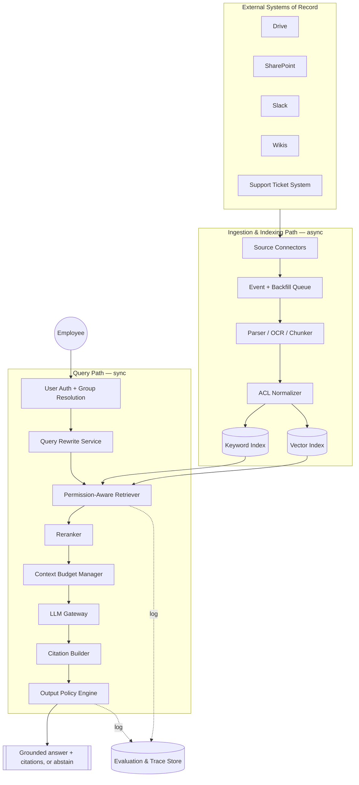

> 🎯 **Interview Pointer:** Draw this control-plane/data-plane split before any box-by-box detail — interviewers use it to gauge whether you understand policy/config lives apart from the live, permission-gated query path.

### Component Responsibilities in Dependency Order

- The ingestion side, explained from the outside in:
  1. **Source connectors** talk to the external systems of record. They are the boundary where the assistant first depends on another system's API, export format, rate limits, and deletion semantics.
  2. **Event and backfill queue** decouples source changes from indexing work. Events handle near-real-time updates; backfill catches missed items, connector outages, and historical ingestion.
  3. **Parser / OCR / chunker** turns heterogeneous documents into normalized text units — PDFs, images, slides, tickets, and chat threads become searchable content.
  4. **ACL normalizer** converts source-specific permissions into a common internal representation. One of the most load-bearing parts of the design because a search hit is useless if the caller cannot see it.
  5. **Keyword and vector indexes** store two complementary retrieval surfaces: exact-match and semantic match. Keyword helps names, IDs, error codes, and policy phrases; vector helps paraphrase and natural-language questions.
  6. **Permission-aware retriever** applies ACL filters before or during candidate selection so unauthorized documents never become answer evidence.
  7. **Reranker** improves ranking quality after retrieval, usually with a smaller, cheaper model or scoring layer than the final generator.
  8. **LLM gateway** is the controlled point where prompts, model selection, rate limiting, and guardrails are centralized.
  9. **Citation builder** attaches source references to each answerable claim so the user can verify where the answer came from.
  10. **Evaluation and trace store** records privacy-safe traces, quality signals, and feedback for debugging and continuous improvement.
- On the query side, the order matters because it encodes risk: authentication comes first, permission filtering comes before answer generation, output policy comes before the user sees the result, and tracing happens after the decision but must be privacy-aware.

### Happy Path: From Question to Grounded Answer

- A good interview walkthrough narrates one request all the way through the stack:
  1. **Authenticate the user and resolve groups.** Synchronous, because the system cannot decide access without it.
  2. **Rewrite the question only when meaning is preserved.** "What is the PTO policy for contractors?" can become a cleaner retrieval query; "Can I share customer data with vendors?" must not be softened into a vague synonym that changes meaning.
  3. **Retrieve candidates with ACL filters.** The retriever searches the keyword and vector indexes while filtering to only documents the user is allowed to see — this is where permission-aware design becomes concrete, not aspirational.
  4. **Rerank and enforce a context budget.** The top candidates are reranked, then trimmed to fit token and latency constraints.
  5. **Generate from evidence with citations.** The LLM gateway produces an answer only from the selected evidence; the citation builder attaches document links, timestamps, or source identifiers.
  6. **Apply output policy and return or abstain.** If confidence is too low, evidence is insufficient, or the request looks unsafe, the assistant should abstain or ask for clarification instead of hallucinating.
  7. **Capture a privacy-safe trace and feedback.** The system records enough to diagnose the path later without storing unnecessary sensitive content.

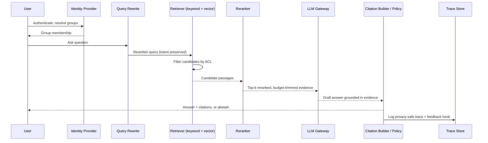

- That sequence is the architecture in motion. In the interview, say it out loud in clean order exactly once — it shows you understand not only the boxes, but the control flow between them.

### Sync vs. Async Boundaries

- The query path is synchronous and permission-gated; ingestion is asynchronous and must tolerate backpressure and outages.
- The most important synchronous boundary is the live question path: authentication, retrieval, reranking, generation, and policy enforcement happen synchronously because users expect an answer now.
- The ingest path is different — connectors, OCR, chunking, ACL normalization, and indexing are best treated as asynchronous work because they are throughput-heavy, bursty, and failure-prone.
- This is where backpressure and flow control matter:
  - If a connector floods the pipeline with updates, the queues should absorb the burst up to a safe limit, then slow the producer or prioritize fresher changes over stale backfills.
  - If OCR falls behind, the system should continue serving already-indexed content instead of blocking live questions.
  - If the model gateway is degraded, the system should fail closed for sensitive requests rather than degrade into unsafe guesses.

### Trust Boundaries and State Ownership

- Trust boundaries need explicit failure assumptions — a connector can miss an event, a cache can serve stale data, a model can fabricate a claim.
- A strong design names who owns each piece of state:
  - **Systems of record** own the original documents, messages, tickets, and permissions.
  - **The assistant's indexes** own derived search state, not source truth.
  - **The ACL mapping store** owns the normalized permission model.
  - **The trace store** owns diagnostic metadata, not raw source content unless explicitly allowed.
  - **The LLM gateway** owns model routing and prompt assembly, but not source permissions.
- Trust boundaries appear where the assistant crosses from one owner to another: source API calls, identity resolution, search indexing, model invocation, and outbound citations.
- Each boundary deserves a failure-mode discussion: a connector can miss an event, a group lookup can be stale, a cached result can outlive its permission, a model can generate a plausible but unsupported claim. The design must assume every boundary can fail independently.

### Partitioning, Caches, and Queues

- Partitioning key choice is not a storage footnote; it determines scale behavior and blast radius:
  - You may partition ingestion by tenant, by source system, or by document namespace.
  - For query serving, tenant-level isolation is often the safest default because it simplifies quotas, billing, and administrative controls.
  - Within a tenant, source or corpus partitioning can help with reindexing and cache locality.
- Caches belong in narrow places where staleness is acceptable and bounded:
  - Identity and group lookups may be cached briefly to reduce latency.
  - Hot retrieval results may be cached only if cache invalidation is tied to permission changes and document updates.
  - A cache is not a permission model; it is a latency optimization that must never outrun policy.
- Queues belong anywhere work is asynchronous or retryable: connector syncs, parsing jobs, backfills, embedding jobs, and citation enrichment. They absorb spikes, but only if you define dead-letter behavior, retry limits, and tenant-level fairness. Without backpressure, one noisy source can starve another.

### Failure-Path Overlay: The Connector Missed a Deletion Event

- Repeat the path under one failure that matters: a connector misses a deletion event from the source system, and the user asks about a policy that was deleted yesterday.
  1. The question arrives and the user authenticates normally.
  2. The retriever finds an old chunk because the stale index still contains old content.
  3. The ACL filter passes because permission data is still valid — the problem is freshness, not access.
  4. The reranker promotes the stale chunk because the text matches well.
  5. The generator is about to answer from evidence that should no longer exist.

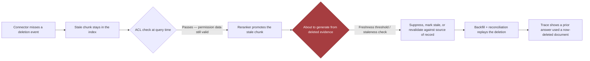

- This is exactly why the architecture needs deletion handling, backfill, and freshness checks. A robust design can respond in several ways depending on the customer requirement: mark the result as stale, suppress content once deletion is confirmed, trigger revalidation against the system of record, or use a freshness threshold that rejects old material for sensitive corpora.
- The key interview point: deletion is not only an indexing problem; it is a trust problem. If deletion events can be missed, backfill, reconciliation, and source-of-record checks become part of the safety story.

### What Belongs in the MVP and What Can Wait

- An MVP should prove the loop end to end with the minimum number of moving parts that still respect permissions and freshness.
- **MVP should include:**
  - one or two high-value connectors
  - event ingestion plus periodic backfill
  - text extraction and chunking
  - ACL normalization
  - keyword plus vector retrieval
  - permission-aware filtering
  - a basic reranker
  - LLM gateway with citations
  - output policy for abstain and redaction
  - trace capture and feedback
- **Later evolution can include:**
  - more source systems
  - richer multimodal OCR
  - tenant-specific ranking models
  - advanced freshness policies by content class
  - deeper analytics on retrieval quality
  - automated regression tests for prompt and retrieval drift
  - human review workflows for high-risk domains
- This distinction matters in interviews because it shows you can land value early without pretending the final architecture must be built all at once.

### Component Responsibility Table

| Component | Primary responsibility | Trust boundary | Sync/async | System of record? |
|---|---|---|---|---|
| Source connectors | Read source content and metadata | Crosses into external APIs | Async | No |
| Event and backfill queue | Decouple source changes from indexing | Internal service boundary | Async | No |
| Parser / OCR / chunker | Normalize content into retrievable units | Derived-content boundary | Async | No |
| ACL normalizer | Map source permissions to internal policy | Security boundary | Async, with query-time checks | No |
| Keyword and vector indexes | Store searchable derived representations | Internal storage boundary | Async writes, sync reads | No |
| Permission-aware retriever | Filter by access and fetch candidates | Data access boundary | Sync | No |
| Reranker | Improve candidate ordering | Internal inference boundary | Sync | No |
| LLM gateway | Manage model calls and prompt assembly | External model boundary | Sync | No |
| Citation builder | Attach evidence references | Output trust boundary | Sync | No |
| Evaluation and trace store | Record diagnostics and feedback | Observability boundary | Mixed | No |

### Why This Architecture Matters in an FDE Interview

- This design is not just technically coherent; it is customer-legible. It lets you explain to a business stakeholder why permissions are preserved, why freshness is not optional, and why a "better answer" is useless if it is unauthorized or stale.
- It also lets you explain to an engineering stakeholder where to tune latency, how to partition work, where to cache, what to queue, and what must remain synchronous.
- That is the FDE signal: system decomposition plus stakeholder translation. The same architecture should satisfy both the person asking for business value and the engineer worrying about failure modes.
- The diagram is useful only when you can narrate data, identity, state, and failure through it — that is defending a production system, not just drawing boxes.

---

## 5. Data Model, APIs, and Working Code

### Three Records That Do Most of the Work

- Three records do most of the work: `Document`, `Chunk`, and `QueryTrace` — each with an explicit owner and retention rule.
- **`Document(id, source, version, owner, acl_policy_id, deleted_at)`** — the source-of-truth envelope for anything ingested from Drive, SharePoint, Slack, a wiki, or a ticketing system.
  - `id`: internal surrogate key.
  - `source`: identifies the upstream system and object reference.
  - `version`: captures the latest imported revision.
  - `owner`: the accountable human or team.
  - `acl_policy_id`: points to the permission policy that decides who may see it.
  - `deleted_at`: marks tombstone state so the document can disappear from search without pretending it never existed.
  - Lifecycle: discovered → ingested → indexed → updated → tombstoned → retained or purged per policy.
  - Retention must distinguish between the live document record (needed for audit and deduplication) and derived embeddings or trace data (different retention windows).
- **`Chunk(id, document_id, text, embedding_ref, offsets, metadata)`** — the retrieval unit.
  - `id`: primary key.
  - `document_id`: links back to the parent document.
  - `text`: the exact passage shown to the model.
  - `embedding_ref`: points to vector storage rather than embedding bytes bloated into the relational store.
  - `offsets`: preserve passage boundaries for citations.
  - `metadata`: carries version, source type, language, and indexing hints.
  - Lifecycle: born during parsing → updated when the parent document changes → invalidated when the source version changes or the document is deleted.
  - Retention rule: a chunk should not outlive the authorization and freshness guarantees of its parent.
- **`QueryTrace(id, actor_hash, retrieval_set, model_version, latency, outcome)`** — the operational memory.
  - `id`: trace key.
  - `actor_hash`: privacy-safe pseudonymous identifier for the user or service principal.
  - `retrieval_set`: which chunks were considered and which were selected.
  - `model_version`: the assistant variant used.
  - `latency`: supports SLO debugging.
  - `outcome`: answered, abstained, escalated, or errored.
  - Keep this record long enough to reconstruct incidents, demonstrate policy enforcement, and support feedback analysis — not so long that it becomes a shadow copy of sensitive content.
- Once you can describe these three records clearly, you can discuss ownership, update rules, and failure recovery without hand-waving.

### Contracts That Make the System Safe to Change

- API contracts need explicit idempotency, versioning, and structured error semantics — not just a happy-path shape.
- **`POST /v1/knowledge/query`** — the user-facing read path.
  - Authenticates with the same identity layer that determines document permissions (query-time authorization is not a secondary concern).
  - Request body carries the user question, optional conversation state, and a client idempotency key if the caller may retry after a timeout.
  - Response includes the answer, citations, confidence or abstention status, and a trace identifier.
  - Error semantics: `401` missing authentication, `403` caller lacks access to the requested corpus, `422` request body fails validation, `429` throttling, `5xx` only for infrastructure failures.
  - If the assistant cannot ground the answer, a structured abstention is better than an embellished guess.
- **`POST /v1/connectors/{id}/sync`** — the ingestion trigger.
  - Idempotent, because schedulers, webhooks, and operator retries will all eventually double-submit.
  - The connector id plus the source checkpoint defines the deduplication boundary; a duplicate sync request should be a no-op or a fast acknowledgment.
  - Response exposes which checkpoint was processed and whether the run was incremental, full, or backfill.
  - Changing the sync payload shape should produce a new contract version rather than silently overloading existing fields.
- **`DELETE /v1/documents/{source_id}`** — the deletion path.
  - Accepts the external source identifier, maps it to the internal `Document`, marks the tombstone, queues index invalidation, and returns a response that makes the delete durable even if downstream cleanup is asynchronous.
  - Must be explicitly idempotent: deleting the same source twice should leave the system in the same state and should not resurrect derived chunks.
- **`POST /v1/feedback`** — closes the loop.
  - Accepts a query trace reference, a coarse feedback label, and optionally a user comment.
  - Feedback is not a side quest; it tells you whether the model answered, abstained correctly, or exposed a usability problem.
  - Keep it authenticated, rate-limited, and decoupled from the answer path so angry users cannot stall search latency with a feedback burst.
- Versioning belongs everywhere: schema version, API version, connector checkpoint, embedding model version, and retrieval policy version all need to be visible in logs and traces.

> 🎯 **Interview Pointer:** If asked "how do you avoid breakage during iteration," the strong answer is "we make version boundaries explicit" (schema, API, connector checkpoint, embedding model, retrieval policy) — not "we move carefully."

### The Smallest Safe Code Path

- The riskiest part of the system is not the prompt template; it's the decision about what evidence the model is allowed to see.
- A small, typed permission-and-grounding function proves the design safely, without building the whole product — permissions are checked before generation, retrieval is hybrid, and the system can abstain.

```python
from __future__ import annotations

from dataclasses import dataclass
from typing import Any, Awaitable, Callable, Dict, List, Protocol, Sequence


@dataclass(frozen=True)
class User:
    id: str


@dataclass(frozen=True)
class Passage:
    id: str
    score: float
    text: str
    source_id: str
    acl_policy_id: str
    citation: str | None = None


@dataclass(frozen=True)
class Citation:
    source_id: str
    quote: str
    offsets: tuple[int, int]


@dataclass(frozen=True)
class AnswerResult:
    status: str
    answer: str | None
    citations: List[Citation]


class IdentityService(Protocol):
    async def groups_for(self, user_id: str) -> List[str]: ...


class SearchService(Protocol):
    async def hybrid(self, query: str, filters: Dict[str, Any], top_k: int) -> List[Passage]: ...


class Reranker(Protocol):
    async def top(self, question: str, candidates: Sequence[Passage], k: int) -> List[Passage]: ...


class PolicyEngine(Protocol):
    def check(self, question: str, passages: Sequence[Passage]) -> Any: ...


class GroundedModel(Protocol):
    async def answer(self, question: str, passages: Sequence[Passage], require_citations: bool) -> Dict[str, Any]: ...


@dataclass(frozen=True)
class Dependencies:
    identity: IdentityService
    search: SearchService
    reranker: Reranker
    policy: PolicyEngine
    grounded_model: GroundedModel


class InsufficientEvidence(Exception):
    pass


async def answer(user: User, question: str, deps: Dependencies) -> Dict[str, Any]:
    groups = await deps.identity.groups_for(user.id)
    if not groups:
        return {"status": "forbidden", "citations": []}

    candidates = await deps.search.hybrid(
        query=question,
        filters={"allowed_groups": {"$overlap": groups}},
        top_k=40,
    )

    passages = await deps.reranker.top(question, candidates, k=8)
    if not passages or passages[0].score < 0.62:
        return {"status": "insufficient_evidence", "citations": []}

    validated = validate_passages(passages)
    policy_result = deps.policy.check(question=question, passages=validated)
    if not policy_result.allowed:
        return {"status": "policy_blocked", "citations": []}

    result = await deps.grounded_model.answer(
        question,
        validated,
        require_citations=True,
    )
    return validate_answer_response(result)


def validate_passages(passages: Sequence[Passage]) -> List[Passage]:
    if not passages:
        raise InsufficientEvidence("no passages")
    safe: List[Passage] = []
    for passage in passages:
        if not passage.id or not passage.source_id or not passage.acl_policy_id:
            raise ValueError("invalid passage metadata")
        if not 0.0 <= passage.score <= 1.0:
            raise ValueError("invalid passage score")
        safe.append(passage)
    return safe


def validate_citations(citations: Any) -> List[Citation]:
    if not isinstance(citations, list) or not citations:
        raise ValueError("missing citations")
    safe: List[Citation] = []
    for citation in citations:
        if not isinstance(citation, dict):
            raise ValueError("citation must be an object")
        source_id = citation.get("source_id")
        quote = citation.get("quote")
        offsets = citation.get("offsets")
        if not isinstance(source_id, str) or not source_id.strip():
            raise ValueError("citation source_id missing")
        if not isinstance(quote, str) or not quote.strip():
            raise ValueError("citation quote missing")
        if (
            not isinstance(offsets, (list, tuple))
            or len(offsets) != 2
            or not all(isinstance(v, int) and v >= 0 for v in offsets)
            or offsets[0] > offsets[1]
        ):
            raise ValueError("invalid citation offsets")
        safe.append(Citation(source_id=source_id, quote=quote, offsets=(offsets[0], offsets[1])))
    return safe


def validate_answer_response(payload: Dict[str, Any]) -> Dict[str, Any]:
    status = payload.get("status")
    answer_text = payload.get("answer")

    if status not in {"answered", "insufficient_evidence", "policy_blocked"}:
        raise ValueError("unexpected model status")

    if status == "answered":
        if not isinstance(answer_text, str) or not answer_text.strip():
            raise ValueError("missing answer text")
        citations = validate_citations(payload.get("citations"))
        payload = {**payload, "citations": citations}
    else:
        payload = {**payload, "citations": []}

    return payload
```

- The control flow of `answer()` as a diagram — permissions gate first, evidence quality gates second, policy gates third:

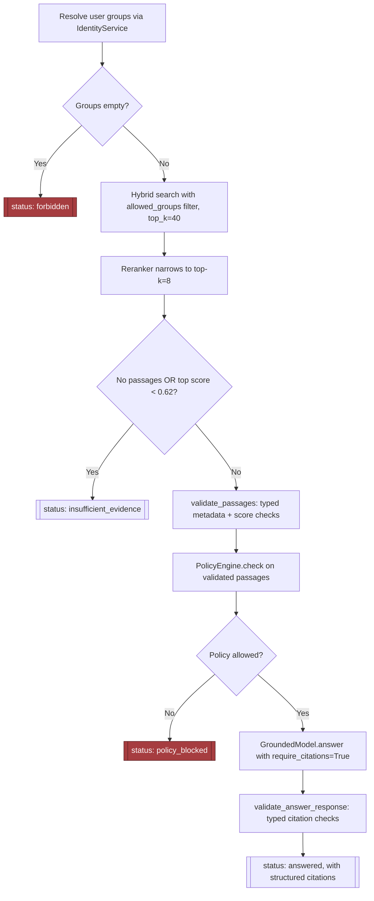

- Read the code like an interview whiteboard, but with production habits preserved: `User` and `Passage` are tiny typed boundaries so the function doesn't drift into dictionary soup.
- `answer()` first resolves the user's groups (the permission gate — without it, search is forbidden to widen the blast radius), then performs hybrid retrieval with a group filter, then a reranker narrows the evidence set, then the policy engine checks candidate passages before the model sees them, and only then does the grounded model run.
- The snippet is intentionally incomplete: in production, dependencies would have timeouts, retries, circuit breakers, request correlation IDs, and metrics, but the `Dependencies` wrapper makes the integration boundary explicit enough that the snippet is no longer hand-wavy. It also omits chunk pagination, streaming tokens, cache layers, and background index repair — correct for an interview-sized sketch that proves permission-aware hybrid retrieval before model generation, not a monolith.

### Why the Code Is Organized This Way

- `groups = await deps.identity.groups_for(user.id)` is not a convenience call; it is the data-ownership boundary. The search system is not entitled to infer permissions from the question text, the inbox, or the embedding space — it needs explicit identity data.
- The hybrid search call takes `filters={"allowed_groups": {"$overlap": groups}}`. The precise filter syntax is illustrative, but the design principle is durable: authorization must constrain candidate generation, not merely final answer rendering. If the retrieval set is wrong, no amount of prompt engineering can make the answer safe.
- `reranker.top(..., k=8)` is where quality starts to converge. Many FDE interview answers fail because they either rely only on vector search or defer all ranking to the model. A reranker lets you make the model's job narrower and more deterministic.
- `if not passages or passages[0].score < 0.62:` is the abstention hinge. The numeric threshold is illustrative; in a real system it would be tuned with offline evaluation and production telemetry. The important point is that there is a fail-closed branch — if evidence quality is weak, the assistant should say so rather than fabricate a plausible answer.
- `validate_passages()` is the typed boundary validation that keeps malformed metadata from reaching the LLM. In a production incident, the most common failure is not a dramatic exploit; it is a sloppy edge case — missing source IDs, stale ACL labels, or impossible scores — that leaks into the generation path because someone assumed the upstream service was already clean.
- `policy.check(...)` is where domain constraints live: blocked content classes, citation requirements, prompt-injection heuristics, or source-type restrictions. The code does not claim the policy engine is perfect; it only makes the interface explicit so the interview answer can defend where policy belongs.
- `validate_answer_response(result)` forces the model output back through a typed contract. That is the difference between "the model said it" and "the system accepted it" — the assistant should never trust raw text as a finished product; it should expect a structured payload and reject anything that does not match. The tightened `validate_citations()` helper matters because a credible assistant does not merely return a non-empty citation list; it returns citations with source IDs, quotes, and offsets that are structurally sound enough to be checked against retrieved evidence.

### Concurrency, Retries, and Observability

- A whiteboard snippet does not show the messiest parts: concurrent refreshes, retries, partial failures, and observability. Name them anyway.
- **Concurrency:** two sync jobs may target the same connector, and one delete may race with an incremental ingest. Use optimistic concurrency on `Document.version` and checkpoint tokens so the later writer can detect whether it is applying a stale view. If the version has advanced, the sync should re-read before writing derived chunks.
- **Idempotency:** the query path usually does not need write idempotency, but ingestion, delete, and feedback absolutely do. A retry-safe request key or checkpoint token prevents duplicated chunk writes, duplicate tombstones, and duplicate feedback rows.
- **Validation:** both input requests and model outputs need typed validation. Validate the request before touching search, and validate the response before returning citations. This is how you keep boundary corruption from becoming user-visible corruption.
- **Retry:** only retry operations that are safe to repeat. A query can be retried if it is read-only and the request context is preserved. A connector sync can be retried if it carries a checkpoint. A delete can be retried if it is idempotent. A partially completed model generation should not be blindly re-run if the upstream evidence has changed.
- **Observability:** `QueryTrace` should capture request duration, retrieval set size, reranker score distribution, model version, and outcome so you can tell whether latency came from search, the LLM gateway, or policy enforcement. Emit spans around identity lookup, retrieval, reranking, policy checks, and model generation.

### A Duplicate Request and a Failure Drill

- Suppose the connector service submits `POST /v1/connectors/42/sync` twice because the first request timed out after the server had already committed the checkpoint.
  - The first request ingests the new wiki page version and writes chunks.
  - The second request arrives with the same checkpoint token; the service recognizes it as already processed and returns the same processed state without duplicating rows or re-embedding unchanged text. That is idempotency doing its job.
- Failure drill: the connector misses deletion events. If the delete path is explicit and the tombstone is versioned, the system can eventually reconcile by re-reading the source of truth and invalidating stale chunks.
- The trace store can show that the assistant once answered from a document that later disappeared — exactly the kind of evidence you need during incident review. The operational lesson: design the data model so that stale state is visible, not hidden.

### Contract Test and Failure-Injection Test

- Contract tests and failure-injection tests prove the safety property in code, not just in words.

```python
import pytest

@pytest.mark.asyncio
async def test_query_is_permission_aware_and_idempotent_lookup_path():
    calls = {"groups": 0, "search": 0, "rerank": 0, "policy": 0, "model": 0}

    class FakeIdentity:
        async def groups_for(self, user_id: str):
            calls["groups"] += 1
            return ["eng"]

    class FakeSearch:
        async def hybrid(self, query, filters, top_k):
            calls["search"] += 1
            assert filters == {"allowed_groups": {"$overlap": ["eng"]}}
            return [Passage(id="p1", score=0.9, text="x", source_id="doc1", acl_policy_id="acl1")]

    class FakeReranker:
        async def top(self, question, candidates, k):
            calls["rerank"] += 1
            return list(candidates)

    class FakePolicy:
        def check(self, question, passages):
            calls["policy"] += 1
            return type("R", (), {"allowed": True})()

    class FakeModel:
        async def answer(self, question, passages, require_citations):
            calls["model"] += 1
            return {
                "status": "answered",
                "answer": "Use policy doc A",
                "citations": [{"source_id": "doc1", "quote": "policy doc A", "offsets": [0, 12]}],
            }

    deps = Dependencies(
        identity=FakeIdentity(),
        search=FakeSearch(),
        reranker=FakeReranker(),
        policy=FakePolicy(),
        grounded_model=FakeModel(),
    )

    first = await answer(User(id="u1"), "where is the policy?", deps)
    second = await answer(User(id="u1"), "where is the policy?", deps)

    assert first["status"] == "answered"
    assert second["status"] == "answered"
    assert calls["groups"] == 2
    assert calls["search"] == 2
    assert calls["rerank"] == 2
    assert calls["policy"] == 2
    assert calls["model"] == 2
    assert first["citations"][0]["source_id"] == "doc1"


@pytest.mark.asyncio
async def test_failure_injection_when_metadata_is_stale_or_malformed():
    class FakeIdentity:
        async def groups_for(self, user_id: str):
            return ["eng"]

    class FakeSearch:
        async def hybrid(self, query, filters, top_k):
            # Failure injection: stale metadata loses acl_policy_id and score is invalid.
            return [Passage(id="p1", score=1.5, text="x", source_id="doc1", acl_policy_id="")]

    class FakeReranker:
        async def top(self, question, candidates, k):
            return list(candidates)

    class FakePolicy:
        def check(self, question, passages):
            raise AssertionError("policy should not run when metadata is invalid")

    class FakeModel:
        async def answer(self, question, passages, require_citations):
            raise AssertionError("model should not run when metadata is invalid")

    deps = Dependencies(
        identity=FakeIdentity(),
        search=FakeSearch(),
        reranker=FakeReranker(),
        policy=FakePolicy(),
        grounded_model=FakeModel(),
    )

    with pytest.raises(ValueError, match="invalid passage metadata|invalid passage score"):
        await answer(User(id="u1"), "where is the policy?", deps)
```

- The first test is the contract test: it asserts that a permitted user reaches hybrid search with the authorization filter intact, then passes through reranking, policy, and model generation, and that the model response includes structurally valid citations. The key point is the contract — permission-aware retrieval happens before generation, and the output must remain citation-bearing and typed.
- The second test is the failure-injection test: it simulates a stale or malformed passage, exactly the kind of edge case that causes permission or freshness bugs in real systems. The expected behavior is fail-closed — the function raises before policy or model execution, proving the code protects the highest-risk boundary instead of hoping downstream services are perfect.

### What Makes This a Strong FDE Answer

- This is where an interviewer sees the difference between a systems thinker and a slide-deck thinker. A strong FDE answer does not stop at "we use RAG" — it shows how state changes, how contracts prevent ambiguity, how retrieval is restricted before generation, and how code proves the safest part of the design first.
- The goal is not "an AI assistant." The goal is grounded answers with citations while preserving source-system permissions and freshness. Concrete records, explicit contracts, typed validation, and a fail-closed retrieval path are what make that claim believable.
- Closing line: the system is credible because every write boundary is idempotent or versioned, every read boundary is permission-aware, every model output must pass typed policy checks before a user ever sees it, and the implementation is small enough to test the highest-risk path directly.

---

## 6. Security, Reliability, and Failure Handling

### Threat Model First, Not Last

- Threat model first, not last: the security boundary is identity and authorization sitting in front of retrieval, indexing, logging, and fallback behavior — not the prompt.
- The hidden trap: the assistant is not just reading text; it is acting on behalf of a user who may not be allowed to see every source the model can technically reach.
- A strong design answer starts by separating four questions:
  - What may be retrieved?
  - What may be shown to the model?
  - What may be emitted to logs and traces?
  - What may be returned to the user if a dependency fails?
- That separation is defense in depth = least privilege + blast radius containment + explicit fail-open/fail-closed policy per component:
  - **Least privilege** means the assistant should fetch only content the current user can actually open in the source system, not merely content that is nearby in semantic space.
  - **Blast radius** means a fault should be limited by tenant, region, workflow, and dependency so one bad connector or bad index does not expose or corrupt the whole enterprise corpus.
  - **Failure policy** means each stage explicitly chooses whether to fail closed, degrade, queue, or escalate.

### The Security Controls That Matter

- **Filter by effective permissions before content reaches the model.** If a user cannot open a folder in the source system, those chunks never enter retrieval candidates for that request. Do not rely on the model to "ignore" forbidden text after it has already seen it.
- **Propagate revocations and deletions to every index and cache.** A document removal, ACL change, or ticket purge must fan out to the search index, vector index, permission cache, citation store, and any response cache. If one layer lags, the safest answer is to treat the record as uncertain and withhold it until reconciliation completes.
- **Redact secrets from traces.** Prompt text, retrieved snippets, and tool payloads often contain credentials, tokens, customer data, or incident details. Observability is essential, but raw logs are not a dumping ground — keep the minimum necessary identifiers, hash or redact sensitive fields, and make sure the trace path cannot become a shadow data lake.
- **Defend against instructions embedded in retrieved documents.** A support ticket, wiki page, or pasted note may contain text that tries to override the assistant's behavior. Treat retrieved content as untrusted evidence, never as instructions — a retrieval layer, prompt template, and output policy should all assume hostile or malformed source text.

### What Happens When Things Go Wrong

- The failure drill in this chapter is specific: security and operations must handle the case where the connector misses deletion events. The candidate should say three things immediately:
  1. **Contain impact.**
  2. **Preserve evidence.**
  3. **Reconcile from source of truth.**
- Containment means marking the affected connector or tenant as suspect, disabling fresh answers that depend on the stale feed if necessary, and preventing new retrievals from using the potentially orphaned chunks.
- Preserving evidence means keeping immutable audit records of the original source record, the deletion signal, index versions, and the time the assistant last referenced the item.
- Reconciliation means re-reading the authoritative source, invalidating all dependent embeddings and caches, and replaying the deletion through the indexing pipeline.

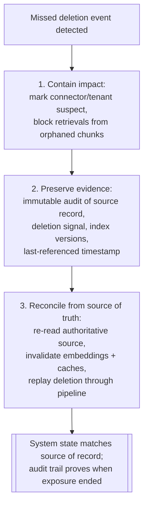

### Other Required Failure Modes

- Now widen the lens to the other required failures:

| Failure | Detect | Contain | Recover | Prevent |
|---|---|---|---|---|
| ACL cache becomes stale | Source-system version mismatch or periodic authorization sampling | Force live permission checks on sensitive requests | Expire the cache and replay revocation events | Short TTLs, versioned ACL snapshots, negative-cache invalidation |
| Retriever finds semantically similar but irrelevant text | Citations do not support the answer, or answer confidence is low | Lower rank thresholds or require evidence from multiple chunks | Return a grounded refusal or clarification request | Hybrid retrieval, metadata filters, evaluation sets that include near-miss queries |
| Model invents a citation | Validate that every cited document ID exists in the retrieval set and is open to the requester | Strip unsupported citations and force a fallback answer | Return "I can't verify that source" | Structured citation generation and post-generation verification |
| Vector index or model provider is unavailable | Detect with timeouts and health checks | Circuit-break the dependency and limit retries | Queue non-urgent sync jobs or fall back to a narrower search mode | Multi-region redundancy, provider abstraction, and graceful degradation |

- Each row is a small, independent detect → contain → recover → prevent loop:

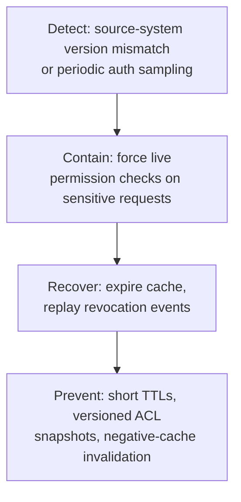

```mermaid
flowchart TD
    D2[Detect: cited document ID not in<br/>retrieval set, or not open to requester] --> C2[Contain: strip unsupported<br/>citations, force fallback answer]
    C2 --> R2[Recover: return<br/>"I can't verify that source"]
    R2 --> P2[Prevent: structured citation generation<br/>+ post-generation verification]
    style D2 fill:#a63d40,stroke:#5c1f22,color:#fff
```

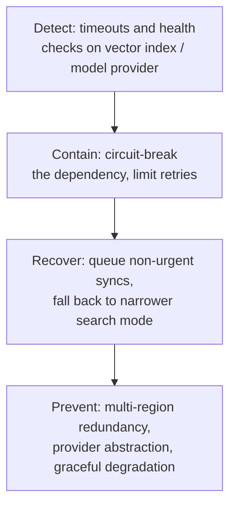

### A Practical Fail-Open / Fail-Closed Decision Table

| Component | If unavailable or stale | Policy |
|---|---|---|
| Permission check | Fail closed | Better to withhold an answer than expose unauthorized content |
| Source-of-truth deletion sync | Fail closed for affected records | Old content must not silently persist |
| Vector retrieval | Degrade | Use keyword or metadata search if safe |
| Citation validation | Fail closed | Unsupported citations should never be shown |
| Telemetry export | Degrade with redaction | Preserve service health, not raw secrets |
| Background reindexing | Queue | Catch up without blocking user-facing reads |
| Security review gate | Human intervention | Launch should wait if unresolved exposure risk remains |

> 🎯 **Interview Pointer:** Memorize this table's pattern rather than its exact rows — permission and citation checks fail closed, retrieval degrades gracefully, background work queues. Interviewers often ask "what fails open vs. closed here" as a rapid-fire follow-up.

### Why the Design Review Should Preserve Evidence

- This is where an FDE is judged on production judgment, not only technical fluency. If the system returns a bad answer after a deletion was missed, the team needs to know whether the root cause was connector lag, cache staleness, retrieval policy, or model behavior.
- That requires durable audit evidence: source event IDs, index version stamps, ACL version stamps, request IDs, and the exact citation set shown to the user.
- Before launch, you would want runbooks for deletion reconciliation, stale-permission handling, citation mismatch, model-provider outage, and human escalation, plus an explicit rollback path for any rollout that widens retrieval scope or changes authorization semantics.

### Production Sketch: One Critical Invariant

- The invariant is simple: a user may only receive citations for documents they are allowed to open at answer time.

```python
from dataclasses import dataclass
from typing import Iterable, List


@dataclass(frozen=True)
class Document:
    document_id: str
    title: str
    allowed_users: frozenset[str]

    def can_open(self, user: str) -> bool:
        return user in self.allowed_users


@dataclass(frozen=True)
class Answer:
    text: str
    document_ids: List[str]
    citations: List[Document]


class PermissionError(RuntimeError):
    pass


class KnowledgeAssistant:
    def __init__(self, documents: Iterable[Document]):
        self._documents = list(documents)

    async def query(self, as_user: str, text: str) -> Answer:
        # Interview-scale sketch: retrieval, ranking, generation, and citation validation
        # are simplified here. In production, retrieval would be permission-filtered first,
        # and every citation would be rechecked against the live authorization source.
        visible = [doc for doc in self._documents if doc.can_open(as_user)]
        if not visible:
            raise PermissionError(f"{as_user} has no accessible sources")

        cited = visible[:2]
        answer_text = f"Grounded answer for: {text}"
        return Answer(
            text=answer_text,
            document_ids=[doc.document_id for doc in cited],
            citations=cited,
        )


# Minimal self-contained harness so the invariant test is runnable as written.
class _Client:
    def __init__(self) -> None:
        self._assistant = KnowledgeAssistant(
            documents=[
                Document("board-only", "Board forecast", frozenset({"executive", "board-member"})),
                Document("finance-public", "Finance FAQ", frozenset({"finance-intern", "finance-analyst"})),
            ]
        )

    async def query(self, as_user: str, text: str) -> Answer:
        return await self._assistant.query(as_user=as_user, text=text)


client = _Client()


async def test_acl_is_enforced():
    answer = await client.query(as_user="finance-intern", text="Board forecast?")
    assert "board-only" not in answer.document_ids
    assert all(doc.can_open("finance-intern") for doc in answer.citations)
```

- Teaching warning: this is an interview-sized sketch, not a complete service. A production version would add request validation, structured logging with redaction, cancellation timeouts, retries only for safe operations, idempotency keys for sync jobs, circuit breakers around the model and vector store, and tests that simulate stale ACLs and deletion replay.
- The companion test encodes the core security invariant, proving that the most important safety property is enforced before generation, not after the model has already spoken.

### What to Say in the Interview

- The 90-second summary: the assistant is permission-aware before retrieval, revocation-aware across every cache and index, trace-safe through redaction, and hostile-document aware through instruction filtering.
- If the connector misses deletion events, the system contains the blast radius by tenant and dependency, preserves audit evidence, and replays from the source of truth.
- The riskiest trade-off is between availability and authorization strictness; for sensitive data, fail closed on permissions and citations, degrade on retrieval quality, and queue background repair work.
- The first production rollout gate is a successful deletion-reconciliation drill with verified audit evidence and no unauthorized citation leakage.

---

## 7. Delivery Plan, Observability, and Business Impact

### From Prototype to Production Without a Trust Cliff

- The prototype answering questions is not the finish line — the customer question that matters is "when can we trust this in production?"
- At this stage, the job is no longer to prove the assistant can answer; it is to prove it can be rolled out safely, measured honestly, and operated by a team that does not need the original builders in the room every time something drifts.
- A staged rollout (one corpus → access-leakage test suite → silent evaluation → source-by-source expansion) beats a big-bang launch:
  - **Phase 1 — one low-risk corpus:** a public internal wiki or a narrow policy set that matters but is not sensitive enough to make every mistake catastrophic. The goal is to validate ingestion, retrieval, citation formatting, and support workflows in a controlled environment.
  - **Phase 2 — access-leakage test suite:** a repeatable harness that asks the assistant questions from the perspective of users with different roles and checks whether retrieved documents, citations, and final answers respect source permissions. It covers obvious forbidden queries, indirect phrasing, stale ACLs, deleted documents, and cross-tenant edge cases. Exit criterion: if the system ever exposes a document, citation, or paraphrase the test user should not see, the release does not advance.
  - **Phase 3 — silent evaluation:** real employee questions are sent through the retrieval and answer pipeline, but the user still receives the current manual or legacy workflow. This is where the team learns what people actually ask, how often the system would have had a grounded answer, where citations fail, and whether the latency profile is acceptable under real load — and catches the gap between a demo dataset and messy live enterprise questions.
  - **Phase 4 — source-by-source expansion:** add Drive, SharePoint, Slack, wikis, and support tickets in sequence, not all at once. Each new source gets its own freshness dashboard, reconciliation rules, owner, and rollback trigger, keeping one bad connector from defining the whole product.

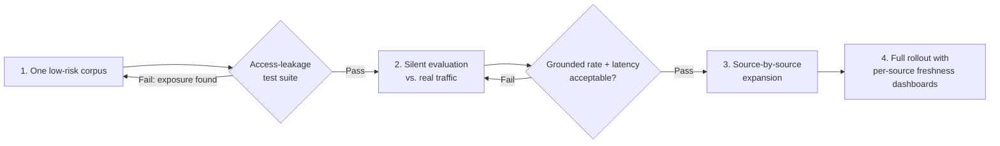

- A compact sequence view helps make that rollout concrete:
  - **Happy path:** a user asks a question, the assistant authenticates the user, retrieves only permitted sources, generates a grounded answer with citations, and logs the interaction for evaluation.
  - **Failure path that matters most here:** a connector misses deletion events, the freshness dashboard flags a mismatch, the reconciliation job detects a stale document, and the rollout is paused before the bad state can reach a broader audience.

### The Metric Stack That Tells the Truth

- Metrics must be layered — technical health, model quality, adoption, business outcome — so no single number gets over-optimized.
- **Technical health**
  - **Freshness lag:** time from a source update event to successful availability in retrieval. Source: connector telemetry plus index update timestamp. Owner: ingestion or platform team. Alert threshold should be tight enough to catch connector degradation early, especially where policy changes or deletions matter.
  - **p95 latency:** 95th percentile end-to-end answer time from user request to final response, measured from request ingress to answer delivery, including retrieval and generation. Owner: application platform team. If p95 spikes, users feel it immediately even if average latency looks fine.
  - **Cost per answered query:** total inference, retrieval, and infrastructure cost divided by the number of queries that produced a usable answer. Owner: product/platform lead with finance visibility. Keeps the team honest about over-retrieval, verbose prompting, and unnecessary re-ranking.
- **Model quality**
  - **Grounded answer rate:** share of answers supported by retrieved sources without unsupported inference. Use a labeled evaluation set from silent mode plus sampled production traffic. Owner: ML/evaluation lead. Watched over time, not a one-time launch gate. Alert threshold: sustained drop of more than 5 percentage points from baseline, or any unexplained step change.
  - **Citation precision and recall:** precision asks whether cited sources are actually relevant and support the answer; recall asks whether the answer used the right sources among those available. Use human/expert review on a sampled set. Owner: evaluation/QA lead. Launch gate: precision above the agreed bar, no unexplained decline of more than 5 percentage points in either metric relative to baseline. A high answer rate with weak citation precision is not enough in an enterprise setting.
  - **Permission leakage count:** number of confirmed cases where a user saw content, metadata, or a citation they were not authorized to access. Owner: security/trust engineering. Threshold: effectively zero for launch decisions; any confirmed case triggers a rollback review.
- **Adoption**
  - **Weekly active users:** distinct employees who used the assistant in a given week. Owner: product manager. Tells you whether the system moved from novelty to habit. Alert threshold: sustained week-over-week decline of more than 20 percent, or flat usage after a broader launch was expected.
- **Business outcome**
  - Adoption alone is not impact — the assistant matters only if it changes the workflow: fewer repeated helpdesk tickets, faster policy lookup, less time spent hunting across systems, fewer escalation loops.
  - The business-outcome metric should be tied to the customer's stated objective, not model vanity. If the goal is employee self-service, the proof is reduced time-to-answer and improved resolution rates in the supported workflow.

> 🎯 **Interview Pointer:** When asked "what would you measure," structure the answer as the four layers (technical health / model quality / adoption / business outcome) rather than a flat metric list — that layering itself is the signal interviewers are grading.

### Example Scorecard and Risk Register

- A practical scorecard might list: grounded answer rate, citation precision and recall, permission leakage count, freshness lag, p95 latency, cost per answered query, and weekly active users. The point is not to track everything forever; it is a narrow, interpretable set of measurements that explains why the rollout is safe, useful, or blocked.

| Risk | Owner | Mitigation | Trigger |
|---|---|---|---|
| Connector misses deletion events | Ingestion lead | Periodic reconciliation and deletion replay tests | Stale document appears in access-leakage test or freshness dashboard shows divergence |
| Citation quality drops after a retrieval tuning change | ML lead | Holdout evaluation and canary comparisons | Precision falls below the agreed threshold on sampled traffic |

- A matching risk register should name the owner, mitigation, and trigger for each major failure mode — the point of the register is not paperwork; it is to make failure actionable before the system becomes folklore.

### What Operations Actually Needs to Own

- The rollout plan should specify canary, rollback, migration, training, support, and documentation before the first broad release:
  - **Canarying:** a small user segment or one region sees the new behavior first.
  - **Rollback:** the team can revert to a prior model, retrieval configuration, or connector state without manual heroics.
  - **Migration:** source onboarding follows a repeatable adapter pattern rather than a one-off script.
  - **Training:** support and internal champions know how to explain citations, report bad answers, and recognize permission-related issues.
  - **Documentation:** a stable playbook for ingestion, access control, incident triage, and source-specific quirks.
- Ownership should be explicit: product owns user outcomes and prioritization; platform owns uptime and latency; ML/search owns retrieval quality; security owns permission leakage review; source-system integrators own connector health; support owns frontline intake.
- If an FDE cannot name the owner of a metric or the owner of a rollback, the design is still fragile.

### Product vs. Configuration vs. Adapter

- An FDE also has to decide what should be reusable:
  - **Core product:** the permission-aware query path, citation rendering, logging, evaluation hooks, and rollback controls.
  - **Adapters:** source-specific auth flows, field mappings, and transformation quirks.
  - **Configuration:** per-customer ranking rules, source priority, retention windows, and corpus inclusion lists.
- Anything that must be repeated for every new enterprise should be pushed toward a shared service or platform primitive; anything that exists because of one integration should not become hard-coded into the core.
- That boundary determines whether the pilot stays a bespoke engagement or becomes leverage: if every new source requires custom logic in the answer path, operational cost grows with adoption; if the product has a clean adapter interface and a common observability layer, new corpora can be added without rewriting the trust model.

### What Success Looks Like After Launch

- The system is successful only when users adopt it, the workflow improves, and the operating team can support it without constant escalation.
- That means a real business outcome, not just a technically impressive demo: employees can find grounded answers with citations, permission boundaries hold, stale content is visible quickly, and the support team has dashboards and runbooks instead of guesswork.
- For an FDE, that is the delivery story the interview is really testing: can you turn a strong prototype into a measured, owned, incrementally expanding service that earns trust and keeps it?

### 90-Second Interview Summary

> "I would roll this out in four phases: one low-risk corpus, an access-leakage test suite, silent evaluation, and then source-by-source expansion with freshness dashboards. I would track grounded answer rate, citation precision and recall, permission leakage count, freshness lag, p95 latency, cost per answered query, and weekly active users, with separate dashboards for technical health, model quality, adoption, and business outcome. The riskiest trade-off is availability versus authorization strictness, so we fail closed on permissions, gate expansion on leakage tests, and use rollback and reconciliation drills before broad release. The first production gate is a successful deletion-reconciliation and access-leakage drill with no unauthorized citation leakage and clear audit evidence. That is how I would prove the assistant is not just accurate in a demo, but supportable and valuable in production."

---

## 8. Interview Walkthrough, Trade-Offs, and Practice

### Minute-Zero Move: Lead with Outcome, Not Architecture

- Lead with outcome and risk in the opening 30 seconds — the interviewer decides where you'll spend your time based on this.
- In a 45–60 minute interview, the fastest way to sound senior is to start from the business result and the risk model, then earn the right to draw boxes.
- Open with the customer outcome in one sentence: the assistant must deliver grounded answers with source citations while preserving source-system permissions and freshness. Then immediately say what could break the design: unauthorized disclosure, stale results, and low trust in citations.
- A strong opening: "I'll assume we need a multinational enterprise assistant over Drive, SharePoint, Slack, wikis, and tickets. My default design is permission-aware retrieval with citations, but I want to confirm whether the bigger risk is leak prevention, freshness, or cost, because that changes how much I invest in real-time sync, ACL enforcement, and evaluation." That is assumption management in practice: state the default, name the uncertainty, invite redirection.

### A Practical 50-Minute Answer Plan

- Spend time in proportion to risk, not diagram size — authorization and freshness deserve more minutes than embeddings. If you spend twenty minutes on embeddings and one minute on permissions, you have probably optimized for the wrong thing.
- A useful pacing model:
  - **0–5 minutes: discovery.** Clarify users, corpora, permission model, freshness needs, latency target, and whether answers need citations for every claim or only for high-risk domains.
  - **5–10 minutes: success criteria and non-goals.** Define what "good" means: grounded answers, no unauthorized passage exposure, acceptable lag, measurable adoption, and supportable operations.
  - **10–18 minutes: scale and data flow.** Estimate corpus size at a coarse level, identify ingestion sources, and separate real-time updates from batch backfills.
  - **18–30 minutes: core architecture.** Walk through ingestion, parsing, chunking, embedding, retrieval, permission filtering, answer generation, citation assembly, and logging.
  - **30–38 minutes: trade-offs and failure modes.** Compare retrieval strategies, ACL strategies, sync strategies, and context-window choices.
  - **38–45 minutes: security, reliability, and observability.** Cover deletion events, group changes, retries, auditability, and what you would monitor.
  - **45–50 minutes: close with rollout plan and risks.** State the first gate, the biggest residual risk, and the next production step.
- If the interviewer asks for more depth, spend it where the stakes are highest: authorization, freshness, and failure recovery. If they care about product leverage, talk reuse across departments and source connectors. If they care about infra, talk indexing cadence, query fanout, and observability.

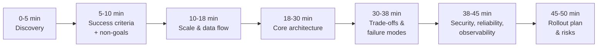

### Trade-Off 1: Hybrid Retrieval vs. Vector-Only Retrieval

- A vector-only system is tempting because it is simple: embed the documents, search semantically, and hand the top passages to the model. The problem is that enterprise questions are not always pure semantic matches — acronyms, exact product names, policy IDs, ticket numbers, and formulaic wording that dense retrieval may blur.
- Hybrid retrieval combines lexical search with vector search, often with reranking, so exact terms and semantic similarity can both contribute.
- The balanced answer is not "hybrid is always better." It is: hybrid usually gives better recall and better resilience to odd enterprise language, but it adds tuning complexity and another failure surface.
  - If the corpus is small and the language is clean, vector-only may be enough for a first pilot.
  - If the corpus is heterogeneous or policy-heavy, hybrid is safer because missing the right passage is worse than carrying a little extra retrieval complexity.
- Make the trade-off explicit in the interview: higher engineering complexity in exchange for better coverage and fewer silent misses.

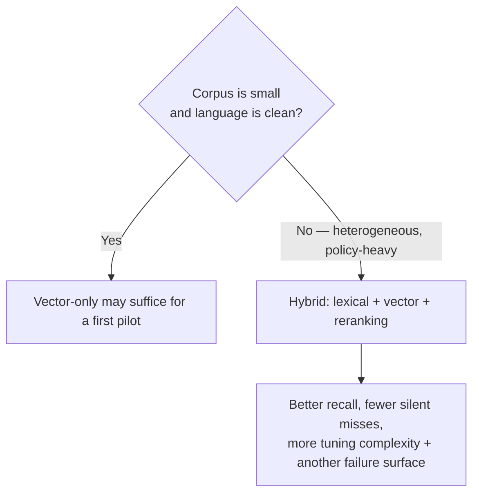

### Trade-Off 2: Query-Time ACL Checks vs. Precomputed ACL Expansion

- This is the most important security trade-off in the whole design.
- **Query-time ACL checks:** retrieve candidate passages and filter them against the requester's current permissions at read time. The cleaner default because it uses the freshest identity state, reduces the chance a stale permission snapshot leaks content, and keeps the access decision close to the request. Downside: latency and system complexity, especially with many sources having different authorization models.
- **Precomputed ACL expansion:** materialize permission-aware indexes or document variants ahead of time so queries run faster. Reduces query latency, but increases reprocessing cost, storage, and the chance of stale permissions if memberships change — and complicates revocation, exactly the edge case interviewers like to probe.
- A strong answer: use query-time ACL checks as the primary control, then selectively precompute only where source permissions are stable, well-modeled, and performance requires it — so a performance optimization doesn't quietly become a security policy.

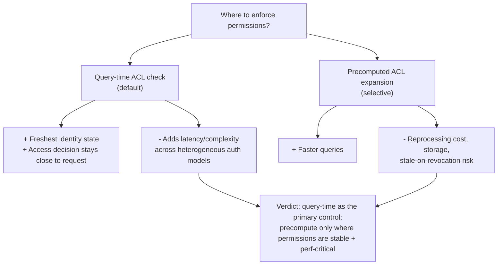

> 🎯 **Interview Pointer:** This is the single highest-probability deep-dive trade-off in the chapter — be ready to explain specifically why precomputed ACL expansion "complicates revocation" (stale materialized views can outlive a permission change) since that's the follow-up interviewers reach for.

### Trade-Off 3: Larger Context vs. Cost and Distraction

- The obvious instinct is to stuff as much evidence as possible into the prompt. That can help the model synthesize across documents, but large context creates two problems:
  - Cost rises with every token.
  - The model may overfit to irrelevant passages, especially if the retriever is noisy.
- In enterprise knowledge work, more context is not automatically better context.
- The practical position: keep the candidate set tight, prefer high-precision retrieval, and use citations to expose provenance rather than rely on brute-force prompt stuffing. If the answer needs synthesis across multiple sources, increase context only as far as needed for that task.
- The interviewer is looking for evidence that you understand the difference between "more evidence" and "more useful evidence."

### Trade-Off 4: Real-Time Sync vs. Scheduled Indexing

- Real-time sync improves freshness, which matters when policy, tickets, or support guidance change quickly.
- Scheduled indexing is easier to operate, cheaper, and often good enough for wikis or slower-moving repositories.
- The right answer is usually mixed: incremental or event-driven updates for high-churn sources, scheduled re-indexing for stable collections, and periodic reconciliation jobs to catch missed events.
- The risk: real-time pipelines are more fragile, especially across many SaaS connectors, while scheduled indexing risks stale answers.
- Frame this as a service-level decision, not a purely technical preference — ask what freshness actually means for the customer (minutes, hours, or same-day), then design to that tolerance.

### Minute-by-Minute Walkthrough of a Strong Interview

- **Minute 0–3: clarify the user and the failure mode.** Ask which employees use the assistant, what kinds of questions they ask, and whether the biggest concern is leakage, incorrect answers, or stale answers. State that you will optimize for permission safety and grounded citations.
- **Minute 3–8: define the operating constraints.** Ask about source systems, document volume, update rate, permission model, geography, and whether answers need to cite only internal documents or also external references. State assumptions clearly, e.g. "I'll assume standard enterprise identity groups and that source APIs support incremental sync."
- **Minute 8–15: estimate and bound the system.** You do not need precise numbers; you need enough scale to choose architecture. Identify which corpora dominate traffic, which are most sensitive, and which change most often.
- **Minute 15–25: draw the data flow.** Ingest from each source, normalize documents, extract metadata, chunk carefully, store raw text and embeddings separately, and attach security labels. At query time: authenticate the user, resolve effective permissions, retrieve candidates, filter by authorization, rerank if needed, generate an answer, and attach citations.
- **Minute 25–32: explain the trust boundary.** Make it obvious where raw data is stored, where permissions are checked, and which services can see sensitive content. Describe how you would avoid passing unauthorized passages into the model context at all if challenged.
- **Minute 32–40: cover failure modes.** Talk through deletion events, stale groups, duplicate documents, connector outages, and corrupted chunks. State what happens when the system is unsure: fail closed on permissions, degrade to no-answer rather than fabricate when freshness is material.
- **Minute 40–46: discuss rollout and measurement.** Begin with one corpus, one or two use cases, and a small set of users. Measure grounded answer quality, citation precision, leakage tests, freshness lag, latency, and support burden. Add corpora only after the system proves stable.
- **Minute 46–50: close succinctly.** Summarize the design in one pass, name the hardest trade-off, and state the next gate.

### Strong Answers to Likely Follow-Up Questions

- **"How do you prove users never see a passage they cannot open?"**
  - Prove it by design and by test, not by confidence.
  - Design: the authorization decision happens before a passage can enter the model context or the final response. Effective permissions for the requesting identity are resolved at query time, and every candidate passage carries the source object's access metadata. If a passage is not allowed, it is excluded before generation. If the model outputs a disallowed citation, the response is rejected or rewritten.
  - Test: build a regression suite with known-denied documents, user identities with changing group membership, and adversarial queries that try to coax hidden content. Verify that retrieval, reranker, answer assembler, and citation renderer all respect the same policy.
  - Key phrase: "I would not rely on prompt instructions to enforce access control; access control must be enforced in the application and retrieval layers."
- **"How do you handle group membership changing during a session?"**
  - Treat permissions as dynamic, not session-static — a user's rights are resolved against the current identity state, using short-lived caches and explicit invalidation when the identity provider reports changes.
  - If a user loses access mid-session, the next retrieval must see the new state. If a user gains access, they can benefit on the next query after reconciliation.
  - Cache design nuance: enough caching to avoid hammering identity systems, but not so much that stale permissions persist. Cache permission resolutions briefly, version the identity snapshot, revoke on change events when supported. If revocation signals are delayed, bound the maximum stale window and state it explicitly.
- **"How do you re-index after changing chunking?"**
  - Treat it as a versioned migration: keep old and new chunking schemes side by side during backfill, re-embed the corpus under a new index version, run offline evaluation before cutover.
  - If new chunking improves recall but harms precision, revise chunk size, overlap, or reranking rather than just shipping the change.
  - Operationally: expose index version in metadata, route a small percentage of traffic to the new version, compare answer quality and leakage tests, maintain rollback.
  - Key point: re-chunking is not a silent maintenance task; it is a retrieval-model change and should be treated like one.
- **"How do you debug a bad answer without storing the prompt?"**
  - Store structured traces, not raw prompts: user question type, retrieval candidates, document IDs, permission decision, reranker scores, model version, prompt template version, citation set, response outcome.
  - If more detail is needed, store an obfuscated or redacted prompt fingerprint, not the full user content, unless policy and consent allow more.
  - This gives enough observability for: Did retrieval miss the right source? Did permissions filter too aggressively? Did the model ignore the evidence? Did the prompt template change?
  - In enterprise settings, traceability often matters more than raw prompt retention, because prompt retention itself can create privacy and security problems.

### Common Weak Answers and How to Repair Them

- **Weak:** "I'd just use vector search because it's modern." **Repair:** Explain why hybrid search better handles exact terms, policy IDs, and noisy enterprise language.
- **Weak:** "Permissions are handled by the database." **Repair:** Separate storage permissions from retrieval-time authorization and explain effective identity resolution.
- **Weak:** "I'd store the whole prompt for debugging." **Repair:** Replace raw prompt storage with structured traces, redaction, and versioned metadata.
- **Weak:** "Real-time sync everywhere." **Repair:** Use a mixed strategy based on freshness needs and connector reliability.
- **Weak:** "More context will solve it." **Repair:** Discuss precision, cost, distraction, and the need to keep candidate sets tight.
- **Weak:** "If the model is confident, it's probably right." **Repair:** Tie confidence to evidence quality, citations, and retrieval coverage, not to model tone.

### Scoring Rubric You Can Use on Yourself

- **Discovery:** Did you identify the business outcome, user types, data sources, and permission constraints early?
- **Estimation:** Did you make reasonable scale assumptions and use them to test feasibility?
- **Architecture:** Did you propose a design that is replayable, observable, and safe to operate?
- **Depth:** Can you explain batch sizing, skew handling, retries, and publish gates in detail?
- **Security:** Did you treat credentials, data access, and output handling as part of the design, not an afterthought?
- **Delivery:** Did you understand rollout, monitoring, and what to do when the batch is behind schedule?
- **Communication:** Did you stay structured, concise, and willing to revise assumptions when challenged?
- If the candidate only scores high on architecture and low on delivery or communication, the answer may be technically clever but not interview-strong for an FDE role. FDE work is customer-facing and operationally grounded; the interview should reflect that.

> 🎯 **Interview Pointer:** Run this rubric on a recorded practice answer before the real interview — candidates systematically over-invest in Architecture and under-invest in Delivery and Communication, which is exactly what this rubric is designed to catch.

### Practice Plan Before the Interview

- **Solo practice:** do a timed 50-minute dry run and record yourself answering from the opening sentence to the closing summary. Watch for two failure modes: over-talking early, and hiding assumptions.
- **Pair mock:** have your partner interrupt you with one security challenge and one freshness challenge; practice recovering without losing structure.
- **Implementation practice:** rebuild the retrieval-and-filtering flow from memory and then add one failure case: a deleted document, a changed group membership, or a re-chunking migration.
- The point is not to memorize a script. The point is to build a repeatable way to think, so you can defend the design live.

### The Interview Posture to Carry Forward

- The best FDE candidates do three things at once: they speak in outcomes, they surface trade-offs honestly, and they control the conversation with structure.
- If you can say, "I'll optimize for grounded answers, permission safety, and freshness; I'll choose hybrid retrieval unless the corpus is trivial; I'll enforce ACLs at query time; I'll mix real-time sync with scheduled reconciliation; and I'll prove it with leakage tests and rollout gates," you are already speaking the language of a strong customer-facing systems designer.
- That is what this interview is really measuring.

---

## Coverage Notes (self-review against the decomposition rubric)

- Two review passes ran against the 20-item, 4-phase decomposition rubric before finalizing this tutorial. Pass 2 found no additional gaps the source chapter could close, so the loop stopped early (max allowed was 3).

**Phase 1 — Problem Framing & Discovery**
- **Item 1 (Feature → business-outcome reframing):** Fully covered — weak/strong restatement table, design anchor.
- **Item 2 (Stakeholder/persona mapping):** Fully covered — four-stakeholder map, role table with failure signals.
- **Item 3 (Clarifying questions that change the architecture):** Fully covered — sharper discovery questions, assumption ledger.
- **Item 4 (Requirements split + prioritization):** Fully covered — functional/non-functional split, MoSCoW lens.
- **Item 5 (Explicit non-goals/scope fence):** Fully covered — six-item non-goals list with rationale.

**Phase 2 — Estimation & Architecture**
- **Item 6 (Back-of-envelope scale & capacity math):** Fully covered — QPS, chunk count, sensitivity table.
- **Item 7 (Unit economics/cost-driver breakdown):** Fully covered — embedding/index/model-token cost split.
- **Item 8 (End-to-end architecture & data flow):** Fully covered — control/data plane diagram, happy-path sequence.
- **Item 9 (Data model & API contracts):** Fully covered — Document/Chunk/QueryTrace, four API contracts.
- **Item 10 (Build-vs-buy / vendor & model-selection trade-offs):** Absent — chapter stays deliberately vendor-agnostic; no managed-vs-self-hosted or proprietary-vs-open-weight comparison in source.

**Phase 3 — Trade-offs, Security & Reliability**
- **Item 11 (Named trade-off pairs with balanced verdict):** Fully covered — four trade-offs (hybrid vs. vector, query-time vs. precomputed ACL, context size, sync cadence).
- **Item 12 (Threat model/security controls):** Fully covered — four-question threat model, fail-open/fail-closed table.
- **Item 13 (Failure-mode & reliability drills):** Fully covered — deletion-event drill, four-row failure table.
- **Item 14 (Testing strategy):** Fully covered — contract test + failure-injection test with runnable code.

**Phase 4 — Delivery, Governance & Communication**
- **Item 15 (Layered evaluation metrics & observability):** Fully covered — technical/model/adoption/business metric layers.
- **Item 16 (Phased rollout/risk register/rollback gates):** Fully covered — four-phase rollout diagram, risk register.
- **Item 17 (Regulatory/governance depth):** Partial — residency/retention appear only as a discovery question and a config knob; no designed answer for cross-region residency or right-to-erasure through derived embeddings.
- **Item 18 (Responsible-AI/risk framing beyond the obvious failure mode):** Partial — grounding, citations, and abstention cover factuality well, but the source doesn't address retrieval bias or equitable answer quality across departments/languages.
- **Item 19 (Change-management/adoption narrative):** Partial — training and documentation are named as operational owners, but there's no executive-facing adoption narrative for winning over a skeptical team.
- **Item 20 (Structured communication plan + self-scoring rubric):** Fully covered — 50-minute pacing plan, minute-by-minute walkthrough, self-scoring rubric.

### My Perspective on the Gaps

*The following is supplementary point of view, not sourced from the original chapter — it is my own take on how to close these four gaps live in an interview, grounded in this chapter's own architecture.*

**Item 10 — Build vs. buy / vendor and model-selection trade-offs.**
- The chapter's own component table already draws the line for you: source connectors, the LLM gateway, and the vector/keyword indexes are commodity infrastructure where multiple vendors compete on reliability and security posture — buy these rather than building them, because the differentiated value in this system is the ACL normalizer and the permission-aware retriever, not the plumbing around them.
- I would say out loud: "I'd buy the vector database, the connector SDKs for Drive/SharePoint/Slack, and likely the base LLM behind the gateway — none of those are where this product wins or loses. I'd build the ACL normalization layer and the output policy engine in-house, because that's the exact boundary where the chapter says permission fidelity lives, and no vendor can be accountable for our specific ACL semantics across five different source systems."
- On model selection specifically, I'd frame it as a swappable component behind the `GroundedModel` protocol already in the Section 5 code — the interface is stable, the model behind it is a configuration choice you'd revisit per cost/latency/quality tradeoff, evaluated against the grounded-answer-rate and citation-precision metrics from Section 7 rather than picked up front.
- The general heuristic worth stating in an interview: buy anything that is a solved commodity problem where vendors compete on security posture and uptime; build only the boundary logic that is unique to your product and that the chapter has already told you is the dangerous constraint.

**Item 17 — Regulatory / data-governance depth.**
- The `Document` and `Chunk` records in Section 5 already carry `source`, `version`, and `deleted_at` fields — I'd extend that same schema with a `residency_region` field on `Document` and propagate it into the ACL normalizer's output, so residency becomes a filter the permission-aware retriever enforces exactly the same way it enforces `allowed_groups` today.
- For right-to-erasure, I'd reuse the tombstone-and-reconciliation machinery the chapter already built for the missed-deletion failure drill: an erasure request is functionally identical to a deletion event, except it must also purge the `embedding_ref` target and any cached passages, not just mark a tombstone. The chapter's insistence that "stale state must be visible, not hidden" applies directly — an erasure request that leaves a ghost embedding behind is the same class of bug as a missed deletion.
- I'd add one new SLO next to freshness lag: "erasure lag," measured the same way, with the same alerting owner (ingestion/platform team), so governance doesn't become a special case bolted onto an otherwise well-instrumented system.

**Item 18 — Responsible-AI framing beyond hallucination.**
- The chapter's evaluation stack (grounded answer rate, citation precision/recall) is built entirely around factual correctness — I'd add a fairness slice to the same silent-evaluation phase from Section 7: segment the evaluation set by department and, where available, by language, and track grounded-answer-rate and abstention-rate per segment rather than only in aggregate.
- Concretely, I'd worry that the retriever underperforms for smaller or less-English-dominant departments simply because their source corpora are smaller or less well-chunked — the fix isn't a new component, it's using the reranker and the hybrid-weighting `α` (Section 3) as tuning knobs per corpus segment, and treating a persistent quality gap between departments as a launch blocker with the same seriousness as a permission-leakage finding.
- I'd say in the interview: "grounding solves 'is this true,' but not 'is this equally available' — I'd extend the same evaluation harness we already built for leakage testing to run per-department, because building a second harness for fairness is wasted effort when the first one already has the infrastructure."

**Item 19 — Change-management / adoption narrative.**
- The chapter already names training and documentation as operational owners in Section 7, but stops short of the story you'd tell a skeptical VP of HR or Legal who is worried the assistant will replace their team's judgment rather than support it.
- I'd pair the phased rollout (one corpus → leakage tests → silent evaluation → source-by-source expansion) with a parallel communication cadence aimed at the stakeholders from Section 1: show Security the leakage-test results before each expansion gate, show the executive sponsor the weekly-active-users and cost-per-query trend, and show Support the citation-precision numbers that prove the assistant isn't going to generate a new class of tickets it can't be blamed for.
- The concrete adoption lever I'd propose: make the "could-have" analytics layer from Section 2 visible to department heads early, even before their corpus is onboarded, so the assistant's rollout schedule becomes something departments ask to join rather than something imposed on them — turning the source-by-source expansion plan into a demand-pull sequence instead of a push sequence.

---

*If you're using this tutorial for a live interview, treat these four items as the layer you add in your own words rather than reading them as oversights in the source material.*
