# Chapter 10: Design a High-Volume Batch Inference System

*Source: THE FORWARD DEPLOYED ENGINEER SYSTEM DESIGN INTERVIEW: 20 REAL-WORLD AI SYSTEM DESIGN INTERVIEWS, Chapter 10*

*Tutorial format: Interview-ready v2 (bullet-only cram format) — regenerated from the original tutorial's verified content, no new source material added.*

## Table of Contents

- [1. The Customer Problem and Discovery](#1-the-customer-problem-and-discovery)
  - [Reframing the Request as an Outcome](#reframing-the-request-as-an-outcome)
  - [Stakeholder Map](#stakeholder-map)
  - [Restate the Problem Without Picking a Solution](#restate-the-problem-without-picking-a-solution)
  - [High-Leverage Discovery Questions](#high-leverage-discovery-questions)
  - [What Discovery Should Produce](#what-discovery-should-produce)
  - [Why This Framing Matters, and the 90-Second Answer](#why-this-framing-matters-and-the-90-second-answer)
- [2. Clarifying Questions, Requirements, and Constraints](#2-clarifying-questions-requirements-and-constraints)
  - [The Incomplete Brief Is the Test](#the-incomplete-brief-is-the-test)
  - [A Question Tree That Changes the Design](#a-question-tree-that-changes-the-design)
  - [Functional vs. Nonfunctional Requirements](#functional-vs-nonfunctional-requirements)
  - [Must, Should, Could Prioritization](#must-should-could-prioritization)
  - [MVP and Explicit Non-Goals](#mvp-and-explicit-non-goals)
  - [Assumption Risk as a Design Problem](#assumption-risk-as-a-design-problem)
  - [What to Protect First When Answers Are Incomplete](#what-to-protect-first-when-answers-are-incomplete)
  - [Requirement-to-Component Traceability](#requirement-to-component-traceability)
  - [Compact Interview Answer and Job-Market Signal](#compact-interview-answer-and-job-market-signal)
- [3. Scale Estimates, SLOs, and Capacity](#3-scale-estimates-slos-and-capacity)
  - [Throughput Math, Then Stress It](#throughput-math-then-stress-it)
  - [Average Load vs. Peak Load](#average-load-vs-peak-load)
  - [SLOs Tied to the Customer Workflow](#slos-tied-to-the-customer-workflow)
  - [Showing Uncertainty Instead of Hiding It](#showing-uncertainty-instead-of-hiding-it)
- [4. Architecture and End-to-End Flow](#4-architecture-and-end-to-end-flow)
  - [Start with the Customer Request, Not the Boxes](#start-with-the-customer-request-not-the-boxes)
  - [The Component Stack in Dependency Order](#the-component-stack-in-dependency-order)
  - [Top-Down Architecture and Trust Boundaries](#top-down-architecture-and-trust-boundaries)
  - [Happy Path, Step by Step](#happy-path-step-by-step)
  - [Sequence Diagram: Request to Completion and Failure Handling](#sequence-diagram-request-to-completion-and-failure-handling)
  - [Failure-Path Overlay: The 4 a.m. Checkpoint](#failure-path-overlay-the-4-am-checkpoint)
  - [MVP Boundary and the Interview Signal](#mvp-boundary-and-the-interview-signal)
- [5. Data Model, APIs, and Working Code](#5-data-model-apis-and-working-code)
  - [The Core Records](#the-core-records)
  - [The API Boundary](#the-api-boundary)
  - [Why Idempotency and Versioning Matter](#why-idempotency-and-versioning-matter)
  - [The Smallest Code Path That Proves the Design](#the-smallest-code-path-that-proves-the-design)
  - [Walking the Code Line by Line](#walking-the-code-line-by-line)
  - [Contract Test and Failure Injection](#contract-test-and-failure-injection)
  - [What the Whiteboard Version Omits on Purpose](#what-the-whiteboard-version-omits-on-purpose)
- [6. Security, Reliability, and Failure Handling](#6-security-reliability-and-failure-handling)
  - [The Failure Conversation Is Where the Design Becomes Real](#the-failure-conversation-is-where-the-design-becomes-real)
  - [Threat Model the Control Plane, Not Just the Model](#threat-model-the-control-plane-not-just-the-model)
  - [Failure Policy by Event](#failure-policy-by-event)
  - [Drill 1 — The 4 a.m. Incident](#drill-1--the-4-am-incident)
  - [Drill 2 — Provider Quota Reduction](#drill-2--provider-quota-reduction)
  - [Drill 3 — A Hot Partition That Produces Stragglers](#drill-3--a-hot-partition-that-produces-stragglers)
  - [Drill 4 — A Worker Crashes After the Model Call](#drill-4--a-worker-crashes-after-the-model-call)
  - [Drill 5 — The Result Sink Throttles](#drill-5--the-result-sink-throttles)
  - [Production Sketch with the Invariant That Matters](#production-sketch-with-the-invariant-that-matters)
  - [What to Say in the Room](#what-to-say-in-the-room)
- [7. Delivery Plan, Observability, and Business Impact](#7-delivery-plan-observability-and-business-impact)
  - [Turning a Working Prototype into a Production Plan](#turning-a-working-prototype-into-a-production-plan)
  - [A Four-Phase Rollout](#a-four-phase-rollout)
  - [The Scorecard That Makes the System Legible](#the-scorecard-that-makes-the-system-legible)
  - [Dashboards That Connect Telemetry to Customer Value](#dashboards-that-connect-telemetry-to-customer-value)
  - [What to Show in Rollout, Support, and Adoption](#what-to-show-in-rollout-support-and-adoption)
  - [What Becomes Configurable, an Adapter, a Service, or Core Product](#what-becomes-configurable-an-adapter-a-service-or-core-product)
  - [Risk Register and Go/No-Go Discipline](#risk-register-and-gono-go-discipline)
  - [Chapter Assets and Where They Fit](#chapter-assets-and-where-they-fit)
  - [The Customer Impact That Justifies the System](#the-customer-impact-that-justifies-the-system)
- [8. Interview Walkthrough, Trade-Offs, and Practice](#8-interview-walkthrough-trade-offs-and-practice)
  - [Minute Zero: Open with the Outcome, Not the Diagram](#minute-zero-open-with-the-outcome-not-the-diagram)
  - [A Practical 50-Minute Answer Plan](#a-practical-50-minute-answer-plan)
  - [Trade-Offs You Must Defend Clearly](#trade-offs-you-must-defend-clearly)
  - [What to Say When the Interviewer Presses on Failure](#what-to-say-when-the-interviewer-presses-on-failure)
  - [Deliberate Challenge: The Riskiest Assumption](#deliberate-challenge-the-riskiest-assumption)
  - [Common Weak Answers and How to Repair Them](#common-weak-answers-and-how-to-repair-them)
  - [Scoring Rubric an Interviewer Can Use](#scoring-rubric-an-interviewer-can-use)
  - [A Ninety-Second Architecture Summary](#a-ninety-second-architecture-summary)
  - [Practice Regimen Before the Interview](#practice-regimen-before-the-interview)
  - [What Makes This Answer Job-Market Relevant, and the Final Takeaway](#what-makes-this-answer-job-market-relevant-and-the-final-takeaway)
- [Coverage Notes](#coverage-notes)
  - [My Perspective on the Gaps](#my-perspective-on-the-gaps)

## 1. The Customer Problem and Discovery

### Reframing the Request as an Outcome

- The prompt sounds simple ("classify 100 million records every night before 6:00 a.m.") but the room splits into three definitions of success at once:
  - Business owner: "We just need classifications ready by morning."
  - Data platform lead: "Only if it doesn't break the warehouse."
  - On-call engineer: "Only if we can rerun it safely when the model or upstream feed fails."
- That disagreement, not the throughput number, is the real interview problem.
- The strong restatement: **complete a replayable, cost-controlled batch by deadline with clear recovery decisions when behind schedule.**
- The request is to classify 100M records every night before 6:00 a.m. under model, rate, cost, and downstream capacity limits.
- The result is not "run inference" — it is "the right consumers get usable outputs on time, with a known recovery path if the run slips."

> 🎯 **Interview Pointer:** Lead with the outcome sentence verbatim (replayable, cost-controlled, deadline, recovery decisions) — interviewers use it as a checkpoint for whether you're solving the business problem or just the throughput problem.

### Stakeholder Map

- Stakeholder mapping is the first useful move — skipping it means designing for the wrong success criterion.
- Four stakeholder groups, each "hiring" the platform for a different job:
  - **Data platform teams** — throughput, orchestration, lineage, storage pressure, replayability without manual cleanup.
  - **Model owners** — model versioning, input contract stability, evaluation quality, use of the approved artifact.
  - **Business consumers** — classifications ready in time for downstream processes, and trustworthy enough to act on.
  - **On-call operators** — alert fatigue, retries, partial completion, backfills, speed of deciding continue/pause/rerun.
- Concrete stakeholder map for this prompt:
  - **End user:** the morning operations team consuming classifications before planning/outreach.
  - **Operator:** the on-call data platform engineer who restarts failed jobs, checks lag, and judges whether a partial run is safe.
  - **Security owner:** the team reviewing access to source records, output storage, logs, and sensitive features/predictions.
  - **Executive sponsor:** the business owner who cares whether the system reliably supports the morning workflow and justifies its cost.
- Naming these groups reveals which decisions belong to which owner:
  - The business does not decide batch retry semantics.
  - The on-call engineer does not decide whether a stale classification is acceptable for a campaign.
  - The model owner does not own the downstream SLA.
- This division keeps the architecture aligned with reality instead of with one enthusiastic stakeholder.

### Restate the Problem Without Picking a Solution

- A clean, technology-neutral opening answer:
  > "We need a nightly batch inference system that classifies about 100 million records and finishes before 6:00 a.m. The design has to account for model rate limits, cost constraints, and downstream capacity so the output is usable by morning. I'd first clarify who consumes the results, what happens if we're behind schedule, and what replay and audit requirements exist before choosing the execution architecture."
- It avoids assuming microservices, Spark, a particular queue, or a specific model provider — it signals **discovery before architecture**.
- A weak, feature-first restatement:
  > "We should build a batch classifier with a fast inference service and a scheduler."
- That version jumps straight to components and misses the decision the customer actually needs.
- A corrected, outcome-first restatement:
  > "The customer needs reliable nightly classification results delivered before business users need them, with predictable cost and a clear recovery path when the batch falls behind."
- The difference: the weak version names tools; the strong version names value.

### High-Leverage Discovery Questions

- Interview time is limited, so discovery must be selective — find the few unknowns that change the design materially, not every possible detail.
- Six branch-defining questions:
  1. **Who consumes the output, and what breaks if it is late?** — tells you whether the deadline is hard, soft, or tiered by customer segment.
  2. **Can the batch be partial, or must it be all-or-nothing?** — determines retry strategy, checkpointing, and downstream handoff.
  3. **What happens when the job is behind at 4 a.m.?** — surfaces the recovery decision: speed up, reduce scope, use a fallback model, or ship partial results.
  4. **How often does the model change, and who approves it?** — affects version pinning, validation, and rollout controls.
  5. **What downstream system receives the classifications, and what capacity does it actually have?** — prevents designing a pipeline that finishes inference but overwhelms the consumer.
  6. **What audit, retention, or residency constraints apply?** — changes storage, logging, and data movement decisions.
- Each question is high leverage because it changes a fundamental design axis: SLA, consistency, cost, operating model, or compliance boundary.
- When the interviewer withholds information, state assumptions explicitly, e.g.: "If the customer says nothing about partial completion, I'll assume the batch may produce partial outputs only if downstream consumers can tolerate them and the system records exactly what was completed."

> 🎯 **Interview Pointer:** Memorize the six-question tree by the design axis each one unlocks (SLA / retry strategy / versioning / downstream capacity / compliance) — interviewers often ask "why did you ask that?" and want the axis, not just the question.

### What Discovery Should Produce

- Discovery should leave you with five concrete artifacts, even if never written down:
  - **Scope:** nightly classification only, or also retraining, labeling, and backfill jobs.
  - **Assumptions:** record size, input freshness, output format, acceptable lateness, retry policy.
  - **Risks:** model rate limits, upstream data delay, downstream overload, late-run recovery.
  - **Owners:** who approves model changes, who owns orchestration, who receives results, who is paged.
  - **Success metrics:** batch completion by deadline, replayability, cost per run, recovery clarity when behind schedule.
- A business outcome metric is not "number of predictions made" — it is something the customer can defend: did the right people get the right classifications by the time they needed them, at an accepted cost, with an explicit answer for what happens when the batch slips?
- The FDE difference from a generic system designer: translating ambiguity into execution, not just producing an architecture.
- Stakeholders often agree on a request while disagreeing on workflow, risk, and success; surfacing that mismatch early saves the customer from building the wrong thing.
- The architecture starts only after you can say whose workflow changes and how success will be measured.

### Why This Framing Matters, and the 90-Second Answer

- Compact opening shape for the interview:
  > "The prompt is to classify about 100 million records every night and finish before 6:00 a.m., but the real design target is to deliver a replayable, cost-controlled batch with clear recovery decisions if we fall behind. I'd start by mapping the stakeholders: data platform teams, model owners, business consumers, and on-call operators. Then I'd clarify whether partial results are acceptable, what the downstream consumer can absorb, what audit or retention rules exist, and who owns model approval. If the interviewer doesn't specify those, I'd state assumptions explicitly so the design stays testable. Only after that would I choose the execution architecture, because the workflow and success criteria determine the architecture — not the other way around."
- That framing gives a defensible starting point for the rest of the design conversation.

## 2. Clarifying Questions, Requirements, and Constraints

### The Incomplete Brief Is the Test

- The prompt is incomplete on purpose: the interviewer may confirm nightly volume and the 6:00 a.m. deadline, then stop.
- That is not a trap — it is the test. A strong FDE does not freeze when given only half the answers; they choose the highest-risk unknowns, state assumptions clearly, and keep moving.
- If discovery time is short, protect the constraint that most changes the architecture: **whether the batch must finish all-at-once or whether partial results have value.**
- That single answer determines strict completion vs. progressive delivery vs. fallback degraded mode.
- Everything else — batch sizing, worker count, retry strategy, checkpointing cadence, and how much cost to spend on the last 10% — depends on that decision.

### A Question Tree That Changes the Design

- Use a short, purposeful question tree — each branch changes a concrete design choice, not "nice to know":
  - **Input size, source, and partitioning:** How many records, where from, how naturally split today? Pre-partitioned by tenant/region/date enables aligning work units; otherwise a preprocessing step is needed. Tells you whether the system scales via embarrassingly parallel work or whether ingestion becomes part of the design.
  - **Processing window and partial-result value:** Must the entire job finish before deadline, or can the customer consume partial output while the remainder catches up? If useful, design a monotonic progress model and a late-record handoff; if not, prioritize deadline protection over evenness of work.
  - **Tokens and model throughput per record:** Prompt size and typical model tokens per inference influence batching, rate limiting, throughput planning, and cost exposure. Small-prompt records behave very differently from long-context/large-attachment ones.
  - **Provider rate limits and batch APIs:** Native batch endpoints, async job submission, or only synchronous? Global and per-tenant limits? Can move the design from a simple worker pool to a submission scheduler that smooths traffic, prioritizes tenants, and avoids bursts.
  - **Ordering, deduplication, and retry semantics:** Does downstream need original ordering or only exactly-once logical results? Can retries create duplicates if the sink dedupes, or must the producer guarantee idempotency? Determines checkpointing, output-artifact naming, and safe partition replay.
  - **Cost ceiling and degraded modes:** Hard spend cap? If behind schedule, increase cost to catch up, reduce model quality, skip low-value records, or alert a human to extend the deadline? Keeps the design from quietly becoming an uncontrolled compute bill.
- This question set creates the design boundaries and turns a vague batch request into testable commitments.

### Functional vs. Nonfunctional Requirements

- Classifying what the system must do vs. how well it must do it makes the interview easier to defend.
- **Functional requirements** (pipeline behavior):
  - partition work independently
  - schedule and autoscale workers
  - batch model calls where appropriate
  - rate-limit globally and by tenant
  - checkpoint progress and write idempotently
  - forecast completion and invoke contingency plans
- **Nonfunctional requirements** (quality bar):
  - finish by deadline
  - no missing or duplicate logical results
  - bounded cost
  - restart without full replay
- The distinction stops requirements drift: "batch the model calls" is a feature, "finish by deadline" is a constraint, "scale workers up and down" is a mechanism, not an outcome.
- No equation is needed here — the key quantitative implication is that all later capacity math must be framed against the deadline, the available budget, and the confirmed provider limits.

### Must, Should, Could Prioritization

- With only partial answers, use a strict priority ladder:
  - **Must:** independent partitioning, deadline protection, idempotent writes, restartable execution — without these the batch cannot complete safely.
  - **Should:** autoscaling, batching where it improves throughput, global plus per-tenant rate limiting — improve efficiency and fairness but the system still functions without perfect optimization.
  - **Could:** advanced ranking of low-value records, richer per-customer scheduling policies, manual override tooling for exceptional tenants — useful later, not part of the minimum viable design.
- This is also where the scope boundary stays honest: solve one specific batch with the smallest architecture that can survive real failure, not every possible batch-processing problem.

### MVP and Explicit Non-Goals

- A good MVP contains three core capabilities:
  - partition work independently
  - schedule and autoscale workers
  - batch model calls where appropriate
- Those are the minimum pieces to exploit parallelism, absorb load, and stay within provider constraints.
- Explicitly out of scope until the baseline is stable:
  - no cross-job optimization across unrelated customer workloads
  - no complex per-record interactive feedback loop
  - no custom model training pipeline in the batch path
  - no support for arbitrary ad hoc query workloads
  - no attempt to guarantee optimal cost in every failure mode
- These exclusions protect against solution sprawl — more responsibilities make deadline risk and recovery behavior harder to reason about.

### Assumption Risk as a Design Problem

- When the interviewer answers only half the questions, the professional move is to surface assumptions and defend why they are safe enough — not hide them.
- Example safe assumptions: records can be partitioned by input shard without cross-record dependency; late records can be retried in the next run if they miss the cutoff; downstream consumers can tolerate eventual completion as long as the final output is correct and auditable.
- Those assumptions enable designing for independent replay rather than global lockstep execution.
- But assumptions also create risk:
  - If a record depends on another record's result, naive parallelization can break correctness.
  - If a tenant expects strict completion with no late data, a degraded mode that skips low-priority work may violate the business contract.
  - If the provider's batch API has different semantics from synchronous calls, a naive retry loop may duplicate output.
- Good candidates call out those risks before they become hidden production bugs.

### What to Protect First When Answers Are Incomplete

- Protect the constraint hardest to recover later: usually the deadline, followed closely by result integrity.
- A late but correct job can often be rerun or explained; a job that silently drops records or emits duplicates is much harder to trust.
- Bias the design conversation toward, in order:
  1. independent partitions that can be retried safely
  2. checkpointed progress so a failed worker does not force a full replay
  3. idempotent output writes so duplicates are suppressed at the sink
  4. global and tenant-aware rate limits so provider limits do not cascade into failures
  5. completion forecasting so the system warns early and triggers contingency rather than discovering failure at 5:59 a.m.
- That ordering shows understanding of both the business outcome and the operational reality.

### Requirement-to-Component Traceability

- A readable requirement-to-component chain proves the architecture isn't just a list of services:

| Requirement | Design element |
|---|---|
| Partition work independently | Input sharding, partition metadata, and per-shard task queues |
| Schedule and autoscale workers | Queue depth monitoring, worker pool, and autoscaling policy |
| Batch model calls where appropriate | Request bundling layer and provider batch submission path |
| Rate-limit globally and by tenant | Central admission controller and tenant quota enforcement |
| Checkpoint progress and write idempotently | Durable checkpoint store and idempotent output sink |
| Forecast completion and invoke contingency plans | Progress estimator and alerting / fallback controller |
| Finish by deadline | Scheduling policy that favors the critical path |
| No missing or duplicate logical results | Idempotency keys, replay-safe writes, and reconciliation checks |
| Bounded cost | Spend guardrails, batch sizing policy, and degraded-mode rules |
| Restart without full replay | Partition-level checkpoints and resumable task state |

- Each service exists to satisfy a named requirement — not decoration.

### Compact Interview Answer and Job-Market Signal

- Reusable answer when the interviewer keeps answers partial:
  > "Given the missing details, I'm going to assume the records are independently partitionable, partial results are only useful if they're explicit and auditable, and the highest-risk constraint is finishing by the deadline without duplicates. That means I'll prioritize shardable work, checkpointed progress, idempotent writes, and rate limiting before I optimize for cost or advanced scheduling. If any of those assumptions are wrong, the design changes in specific ways, so I'd want to validate them early."
- Shows judgment, not just architecture vocabulary — signals you can protect delivery under ambiguity, a clear FDE marker.
- FDE teams want people who discover requirements in conversation, separate hard constraints from preferences, and turn uncertainty into a stable scope — customer empathy, prioritization, and keeping delivery moving under incomplete/changing environments.
- **Takeaway:** begin by extracting the few questions that most change the architecture, labeling assumptions, and turning them into prioritized requirements — not by sketching services first.

## 3. Scale Estimates, SLOs, and Capacity

### Throughput Math, Then Stress It

- The first pass is usually too optimistic: "a queue, a few workers, and a model endpoint" — plausible at average load, but ignores the deadline, the retry rate, and that the last 5% of a batch is often hardest.
- The correction: stop arguing from intuition, start with the envelope — records, window length, tokens/model calls per record, slack for stragglers and cleanup.
- Core throughput formula:

$$RPS_{required}=\frac{N_{records}}{T_{window}}\times(1+h)$$

- With $N_{records}$ = 100,000,000 and $T_{window}$ = 6 × 3600 = 21,600 seconds, the base rate is about **4,630 records/second** — the floor, not a design.
- Adding 15% headroom $h$ for retries, stragglers, and reconciliation raises the planning rate to about **5,320 records/second**.
- The formula's point: stop treating the deadline as a nominal average instead of a hard constraint.
- Multiplying by tokens per record: 250 input + 20 output tokens = 270 tokens/record before retries/resubmissions. At 4,630 rps, this is a sustained token factory with real downstream implications.
- That token estimate usually changes component choice — ingestion, queue draining, model calls, post-processing, or writes to the output store — and is the number that most affects partitioning (by record, tenant, time slice, or model invocation pattern).

> 🎯 **Interview Pointer:** Be ready to derive 4,630 rps and 5,320 rps live from the formula — interviewers want to see you build the number, not just recite it, and want to hear headroom (operational noise) explicitly separated from growth factor (business assumption).

### Average Load vs. Peak Load

- Average throughput can hide the real workload shape — a batch smooth at the top of the hour can still miss the deadline if one partition is slow, one upstream source is delayed, or a subset of records repeatedly fails validation.
- Design question is not only average rps but also the peak needed to survive without collapsing the schedule.
- Headroom vs. growth factor are different tools:
  - **Headroom** covers operational noise inside the same batch: retries, tail latency, reconciliation.
  - **Growth factor** covers the business assumption that next quarter's batch may be larger.
  - Keep them separate; state average, peak, growth, and headroom rather than one point estimate.
- Sensitivity table:

| Scenario | Records | Window | Base rate | With 15% headroom |
|---|---|---|---|---|
| Current batch | 100M | 6 hours | ~4,630 rps | ~5,320 rps |
| 10x growth | 1B | 6 hours | ~46,300 rps | ~53,200 rps |

- The 10x row isn't an expectation for tomorrow — it tests whether the architecture is embarrassingly underbuilt (fragile) or overengineered (absurd cost/complexity at 10x).
- Interview sweet spot: pragmatic elasticity — enough batching, sharding, and backpressure to absorb growth without inventing unneeded infrastructure.

### SLOs Tied to the Customer Workflow

- The batch is successful only when the customer gets a usable result by the morning deadline, with enough accuracy and traceability to trust it — so technical SLOs should mirror the business workflow.
- Relevant indicators:
  - **Availability:** Can the pipeline accept and process work during its scheduled run window?
  - **Latency:** Time from ingestion to classified output per record, and end-to-end completion time for the whole batch.
  - **Freshness:** How quickly after source data closes do results become available downstream?
  - **Quality:** Acceptable error rate, confidence threshold, or validation pass rate before publishing.
  - **Security:** Are inputs, outputs, and prompts protected per the customer's access/retention requirements?
  - **Cost:** Cost per million records, and where retry traffic or oversized prompts change unit economics.
- These describe the customer promise, not just infrastructure metrics: a "99.9% successful job" is not enough unless the late 0.1% still arrives in a downstream-tolerable form.
- The latency budget must include queueing, batching, writeback, validation, and reconciliation — not just model inference time. Meeting model latency but missing the end-to-end window still fails the customer.

### Showing Uncertainty Instead of Hiding It

- Interviewers want to see a communicated range, not false precision:
  > "At 100 million records, I would plan for about 4,630 records per second before retries. If the average prompt is smaller than expected, model throughput becomes easier; if the tail of large records is heavier, we need more headroom or more aggressive partitioning. I would size the system around the tail, not the mean."
- This shows sensitivity understanding (the tail of large/slow records changes the architecture, not average record size) and defends the design without pretending exactness.
- Same logic applies to cost: unit economics are "how much does each record cost to classify, and what operational choices push that cost up or down?" — retries doubling token usage, or stragglers keeping workers warm an extra hour, change marginal cost materially.
- A strong candidate avoids overengineering here — a disciplined sizing pass over exotic scheduling, specialized databases, or a custom distributed runtime is the job-market signal: pragmatic capacity decisions under uncertainty, not pattern-naming.
- **Takeaway:** estimates are decision tools — each number should justify an architectural choice or operational limit. If the math says 5,000-plus rps with slack for retries, the design must explain how it achieves that rate, how it degrades when it slips, and how it tells the customer whether the morning deliverable is still on track.

## 4. Architecture and End-to-End Flow

### Start with the Customer Request, Not the Boxes

- The architecture conversation begins as a customer conversation: "Classify 100 million records every night before 6:00 a.m., stay inside model and API quotas, control cost, and still give us a clean recovery plan if the run falls behind."
- That implies more than throughput: a replayable pipeline, a stable cutoff for the nightly snapshot, a durable notion of progress, and a decision point for pushing on vs. stopping/quarantining/resuming.
- Replaying the path with a dependency failure (external model endpoint timing out at 2:17 a.m.) reframes the question from "Can we retry?" to "Where do retries belong, what state is already durable, what work can be safely re-leased, and how does the operator know whether the batch can still finish on time?"
- This keeps the architecture tied to the outcome: complete a cost-controlled batch by deadline with clear recovery decisions when behind schedule.

### The Component Stack in Dependency Order

- The system reads top-down because each layer owns a different kind of truth.

| Component | Responsibility | State owned | Why it exists |
|---|---|---|---|
| Job planner | Accepts the nightly run, freezes the input snapshot, and creates the batch plan | Run metadata, snapshot pointer, deadlines | Establishes the system of record for the run |
| Partition manifest | Lists balanced work units and their status | Partition IDs, ranges, attempts, checkpoints | Makes work replayable and auditable |
| Durable work queue | Hands out partitions to workers with leases | Lease state, visibility timeout, retry eligibility | Separates scheduling from execution |
| Rate-limit coordinator | Shapes outbound calls to stay under quota | Token budget, concurrency budget | Prevents self-inflicted throttling |
| Autoscaled inference workers | Batch records and call the model | Ephemeral execution state | Does the data-plane work |
| Checkpoint store | Persists completed ranges and partial progress | Last successful offset, result hashes | Enables recovery without rescanning everything |
| Idempotent result sink | Writes final classifications once per record | Final output by record key | Prevents duplicate publication |
| ETA forecaster | Estimates completion and lag risk | Progress rate, remaining work, backlog | Supports operator decisions |
| Operations console | Shows run status, warnings, and intervention controls | Human-facing incident and rollout state | Lets the customer trust the process |

- Planner, manifest, ETA forecaster, operations console = **control-plane** concerns (coordinate the run).
- Workers and result sink = **data-plane** concerns (move records through the model into durable output).
- This distinction matters because not every component should be scaled the same way or updated at the same frequency.

### Top-Down Architecture and Trust Boundaries

- A compact way to present the architecture marks where trust changes.

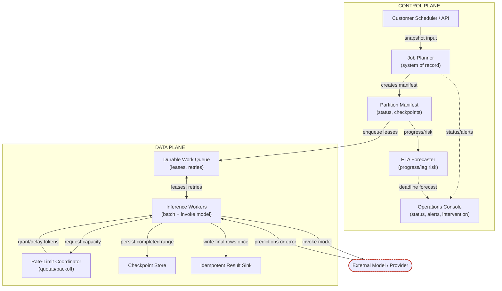

- Trust boundary 1 — customer input snapshot: after the planner freezes it, the rest of the run should not silently drift if upstream data changes.
- Trust boundary 2 — the model call: an external dependency, so the worker must assume timeouts, throttling, malformed responses, and partial failures.
- Trust boundary 3 — publication: the result sink should be idempotent so replays do not create duplicate classifications.

### Happy Path, Step by Step

1. **Snapshot input and build manifest.** The job planner records the source dataset version, run deadline, and run policy, then writes a partition manifest — the system of record for what "this batch" means.
2. **Split into balanced partitions.** The manifest breaks the snapshot into work units sized to reduce skew. The partitioning key should favor even processing cost, not just data locality (e.g., a combination of tenant, payload size band, or historical inference latency may beat record count alone).
3. **Lease work to workers.** The durable queue hands a partition lease to an inference worker — an asynchronous boundary: the planner doesn't wait for every partition to finish, and workers don't hold the run hostage if they fail midstream.
4. **Batch and invoke model under quotas.** The worker groups records into model-sized batches and asks the rate-limit coordinator for capacity first. That coordinator is where backpressure lives — when quota tightens, it slows leases or reduces per-worker concurrency instead of letting retries stampede the provider.
5. **Checkpoint result ranges.** After a successful response, the worker writes a checkpoint for the completed range, then writes classified rows to the idempotent sink. Checkpoints are the durable memory of partial progress.
6. **Retry transient errors and quarantine permanent ones.** Timeout/429/short-lived upstream failures are retried per policy; malformed payloads, schema violations, or bad records are quarantined with enough context for triage. The batch should not keep recycling obviously broken inputs.
7. **Reconcile manifest and publish completed dataset.** When all partitions are done, the planner marks the manifest complete, the ETA forecaster shows zero remaining work, and the operations console publishes the finished dataset or triggers downstream handoff.

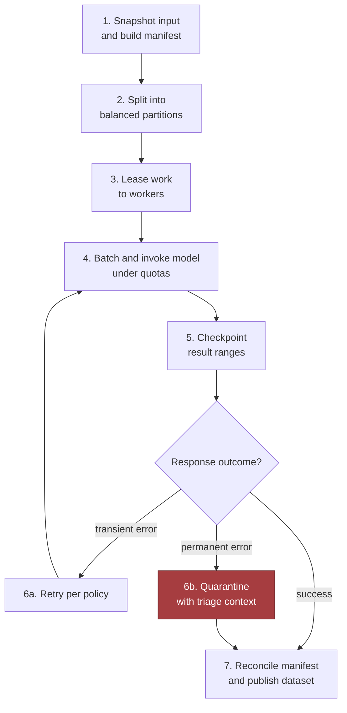

### Sequence Diagram: Request to Completion and Failure Handling

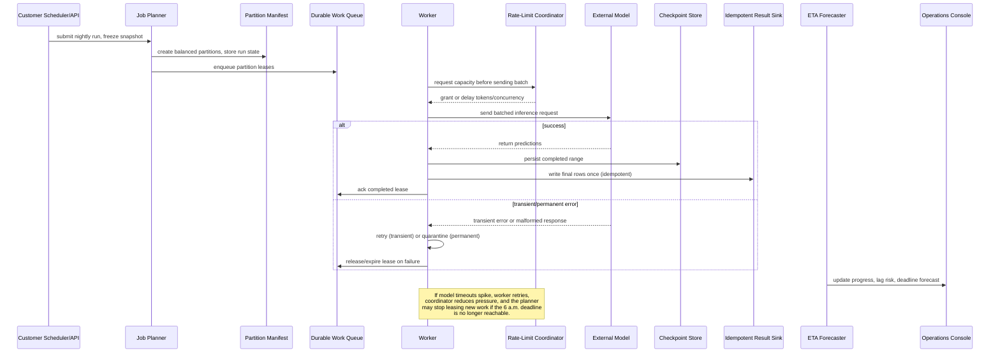

### Failure-Path Overlay: The 4 a.m. Checkpoint

- The strongest answer is the one that continues when the model endpoint degrades: suppose the batch is only 45% complete at 4 a.m.
- The ETA forecaster compares actual throughput against remaining work and flags a miss.
- The operations console should not just show red — it should answer: can we still finish by 6:00 a.m., what lever to pull first, and what is the blast radius if we keep going?
- If temporary throttling: the rate-limit coordinator reduces concurrency and preserves stability.
- If persistent and the deadline is no longer reachable: the operator stops taking new leases, checkpoints everything completed so far, and pages the customer with a recovery plan.
- Value of durable manifests and checkpoints: a partial batch is still useful if it is explicit, consistent, and resumable.

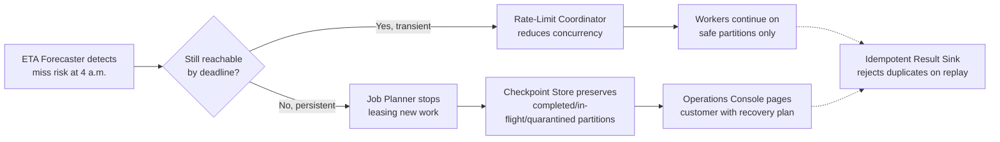

- Customer scheduler/API remains healthy and is not the bottleneck.
- Job planner stops expanding the run if the ETA slips beyond the deadline.
- Partition manifest preserves completed, in-flight, and quarantined partitions.
- Durable work queue lets leases expire or be reissued safely.
- Rate-limit coordinator lowers pressure to avoid a retry storm.
- Inference workers continue only on partitions still safe to process.
- Checkpoint store prevents redoing already completed ranges.
- Idempotent result sink rejects duplicates during replay.
- ETA forecaster drives the operator decision in the console.

> 🎯 **Interview Pointer:** The 4 a.m. scenario is the chapter's signature follow-up — rehearse the three-question response (still reachable? what lever first? what's the blast radius?) so it comes out fluently under pressure.

### MVP Boundary and the Interview Signal

- MVP: planner, manifest, queue, worker fleet, checkpointing, idempotent sink, and a basic ETA panel — enough to prove replayability, rate safety, and deadline awareness.
- Later evolution: smarter partition rebalancing, historical throughput prediction, tenant-aware scheduling, finer-grained quarantine workflows, richer operator tooling — valuable, but not prerequisites for a credible first design. The common mistake is treating these as the architecture itself.
- The design demonstrates decomposing a real customer problem and explaining the same system to business stakeholders and engineers.
- The diagram is only useful if you can narrate data, identity, state, and failure through it — who owns the snapshot, where the queue boundary sits, how backpressure works, what happens at 4 a.m.
- **Takeaway:** draw the flow, but speak in obligations — every component exists to protect deadline, cost, replayability, or operator confidence; everything else is optional until the customer proves otherwise.

## 5. Data Model, APIs, and Working Code

### The Core Records

- An architecture becomes interview-credible when you can name the durable state, the contract boundary, and the smallest code path proving the system is safe enough to run.
- That means: treat the batch job as an owned record, split work into leased partitions, and make every write boundary idempotent and versioned.
- **BatchJob** — the customer-facing unit of work.
  - Primary key `id`, plus `input_snapshot`, `deadline`, `model`, `state`.
  - `input_snapshot`: immutable pointer to the exact dataset/manifest used for the run — the ownership boundary that makes replay possible.
  - `deadline`: drives scheduling priority and pause/resume decisions.
  - `model`: identifies the model family or configured version being invoked.
  - `state`: moves through `queued`, `running`, `paused`, `completed`, `failed`, `replaying`.
  - Retention: keep the job record and audit trail long enough for recovery, operator review, and customer support, then expire/archive per policy.
- **Partition** — the concurrency and recovery primitive for the job.
  - Primary key typically `job_id + partition_id` (deterministic range label or shard identifier derived from the input snapshot).
  - `job_id`: foreign key to the owning batch job. `range`: exact subset of records assigned to the lease.
  - Lifecycle: `available` → `leased` → `completed`; `retryable` on transient failure; `abandoned`/`dead_lettered` after too many attempts.
  - `lease` expires if a worker dies; `attempts` increments on retry; `completed_count` tracks progress.
  - Retention: keep through the job retention window for audits/replay/debugging, then archive/compact per policy.
- **InferenceResult** — the per-record write artifact.
  - Primary key: the logical identity of the output — `job_id + record_id + model_version` (or equivalent) to prevent duplicate rows for the same record and model.
  - Lifecycle: `pending` → `written` (sink upsert succeeds) → `validated` (typed boundary check passes); `failed` if output is rejected or cannot be persisted.
  - `job_id` ties it to the batch, `record_id` identifies the source entity, `model_version` preserves replayability across model changes, `output` stores the classified result, `status` explains usable/partial/failed.
  - Retention: as long as needed for replay, audit, or downstream reconciliation, then expire or move to cheaper storage per policy and compliance requirements.
- The important design choice: this record is keyed by the business identity of the record plus model version, not by worker or attempt — that is how duplicate work becomes harmless instead of dangerous.

> 🎯 **Interview Pointer:** Be ready to justify the `InferenceResult` composite key (`job_id + record_id + model_version`) unprompted — it's the single fact that makes replay-safety and idempotent writes work together, and interviewers often probe "why not just record_id?"

### The API Boundary

- A small, predictable API surface:
  - `POST /v1/batch-jobs` creates a job.
  - `GET /v1/batch-jobs/{id}` reads status, progress, and error summary.
  - `POST /v1/batch-jobs/{id}/pause` stops new leases and preserves progress.
  - `POST /v1/batch-jobs/{id}/replay-failures` reprocesses only failed or incomplete partitions.
- **`POST /v1/batch-jobs`:**
  - Requires authentication; validates the manifest and model reference; returns a stable job identifier.
  - Idempotent via an explicit idempotency key so a client retry does not create two jobs on a timed-out response.
  - Request includes input snapshot pointer, target model, deadline, optional routing/policy metadata.
  - Response includes job id, initial state, and a server-generated version/ETag.
  - Reusing the same idempotency key with a different payload is rejected as a conflict, not silently merged.
  - Authentication failures return unauthorized/forbidden depending on unknown vs. underprivileged caller; validation errors return a client error listing malformed fields.
- **`GET /v1/batch-jobs/{id}`:**
  - Safe to call repeatedly; returns a read model, not a mutable object.
  - Includes progress, partition counts, failure counts, deadline, model version, current state, and a compact error summary pointing to failed partitions without exposing internals.
  - Unknown job → standard not-found response; caller lacking access → permission error (not confirming/denying existence).
- **`POST /v1/batch-jobs/{id}/pause`:**
  - Protected by authorization and guarded by optimistic concurrency.
  - Request is empty or carries an optional expected version/ETag.
  - Response confirms transition to `paused`, already-paused, or already-terminal.
  - If completed/failed (no longer pausable) → state-conflict response, not a pretend success.
  - Retried pause requests remain harmless and return the same end state.
- **`POST /v1/batch-jobs/{id}/replay-failures`:**
  - Requires authorization — replay is a privileged operational action that can reconsume capacity and alter observable history.
  - Request accepts an optional idempotency key, optional expected version/ETag, and a selector (all failed partitions, a named subset, or partitions failed after a specific checkpoint).
  - Response includes the parent/child job id, the selected partition set, and replay state (`accepted`, `already_replayed`, `not_replayable`).
  - No failures → no-op or conflict per product policy.
  - Still running, missing required snapshot, or otherwise not replayable → state error with a stable machine-readable reason.
  - Reused idempotency key for the same replay intent → same replay outcome, not a second attempt (consistent with job creation and pause semantics).

### Why Idempotency and Versioning Matter

- Multiple write boundaries need idempotency rules: job creation, partition leasing, result upserts, checkpoint advancement, state transitions.
  - A duplicate create must not create a duplicate job.
  - A duplicate lease renewal must not invalidate the original lease.
  - A duplicate result write must overwrite the same logical record rather than appending a second copy.
  - A duplicate pause or replay request must be harmless if already applied.
- Versioning matters for the same reason: when the model, schema, or validation policy changes, old and new results must remain distinguishable.
  - `model_version` belongs on `InferenceResult`; the job record carries a contract version; the API evolves without making yesterday's batch unreadable today.
- Schema and contract versioning are not bureaucracy — they are how replayability is preserved.

### The Smallest Code Path That Proves the Design

- Zoom into the highest-risk component and implement the smallest code path that proves safety: a worker loop that leases partitions, batches records, validates outputs, and writes idempotently.

```python
from __future__ import annotations

import asyncio
from dataclasses import dataclass
from typing import Any, Iterable, List, Protocol


class TransientError(Exception):
    pass


class ValidationError(Exception):
    pass


@dataclass(frozen=True)
class Record:
    record_id: str
    text: str


@dataclass(frozen=True)
class Output:
    record_id: str
    model_version: str
    label: str
    confidence: float


@dataclass(frozen=True)
class PartitionLease:
    id: str
    job_id: str
    range_start: int
    range_end: int
    lease_seconds: int


class Source(Protocol):
    async def read(self, range_start: int, range_end: int) -> list[Record]: ...


class Queue(Protocol):
    async def lease(self, job_id: str, seconds: int) -> PartitionLease | None: ...
    async def complete(self, partition_id: str) -> None: ...
    async def retry(self, partition_id: str, backoff: bool = True) -> None: ...


class Limiter(Protocol):
    async def acquire(self, tokens: int) -> None: ...


class Model(Protocol):
    async def classify_batch(self, records: list[Record]) -> list[dict[str, Any]]: ...


class Sink(Protocol):
    async def upsert_many(self, job_id: str, outputs: list[Output], key: str) -> None: ...


class Checkpoints(Protocol):
    async def advance(self, partition_id: str, record_id: str) -> None: ...


def chunked(items: list[Record], size: int) -> Iterable[list[Record]]:
    for i in range(0, len(items), size):
        yield items[i : i + size]


def estimate_tokens(records: list[Record]) -> int:
    return max(1, sum(len(r.text.split()) for r in records))


def validate_output(raw: dict[str, Any]) -> Output:
    try:
        record_id = str(raw["record_id"])
        model_version = str(raw["model_version"])
        label = str(raw["label"])
        confidence = float(raw["confidence"])
    except (KeyError, TypeError, ValueError) as exc:
        raise ValidationError("invalid model output") from exc

    if not record_id or not model_version or not label:
        raise ValidationError("missing required output fields")
    if confidence < 0.0 or confidence > 1.0:
        raise ValidationError("confidence out of range")
    return Output(record_id=record_id, model_version=model_version, label=label, confidence=confidence)


async def worker(job_id: str, queue: Queue, source: Source, limiter: Limiter, model: Model, sink: Sink, checkpoints: Checkpoints) -> None:
    while part := await queue.lease(job_id, seconds=120):
        try:
            records = await source.read(part.range_start, part.range_end)
            for batch in chunked(records, 64):
                await limiter.acquire(tokens=estimate_tokens(batch))
                raw_outputs = await model.classify_batch(batch)
                outputs = [validate_output(raw) for raw in raw_outputs]
                await sink.upsert_many(job_id, outputs, key="record_id")
                await checkpoints.advance(part.id, outputs[-1].record_id)
            await queue.complete(part.id)
        except TransientError:
            await queue.retry(part.id, backoff=True)
        except ValidationError:
            await queue.retry(part.id, backoff=False)
            raise
```

### Walking the Code Line by Line

- Exception types separate transient infrastructure failure from bad model output.
- `Record`, `Output`, and `PartitionLease` make state explicit rather than passing anonymous dictionaries.
- Protocol classes are deliberate interview scaffolding — they name the dependencies without pretending the worker owns their implementation.
- `chunked()` limits request size, controlling token spend and downstream pressure.
- `estimate_tokens()` is intentionally simple (production would be model-specific and calibrated) — the design point is admission control before the call, not after the quota breach.
- `validate_output()` is the typed boundary: converts untrusted model output into a validated domain object, rejecting malformed/out-of-range results before storage. Policy checks (schema, allowed-label, redaction/escalation rules) belong here too.
- Inside `worker()`, the lease loop is the concurrency boundary: a partition is claimed, read once, processed in batches, written idempotently, and checkpointed after each batch.
- The checkpoint advances only after the sink write succeeds — preventing false progress.
- `upsert_many(..., key="record_id")` is the central idempotency move: repeated work writes to the same logical row instead of creating duplicates.
- `queue.complete()` marks the partition done only after all batches succeed.
- `TransientError` retries with backoff — the right behavior for timeouts, throttling, or temporary dependency loss.
- `ValidationError` is harsher: the worker retries the partition only if potentially attributable to a transient input/downstream issue, then re-raises so the job can surface a real data-quality problem. A production system would separate poison-message handling, dead-letter routing, and operator alerts more explicitly.

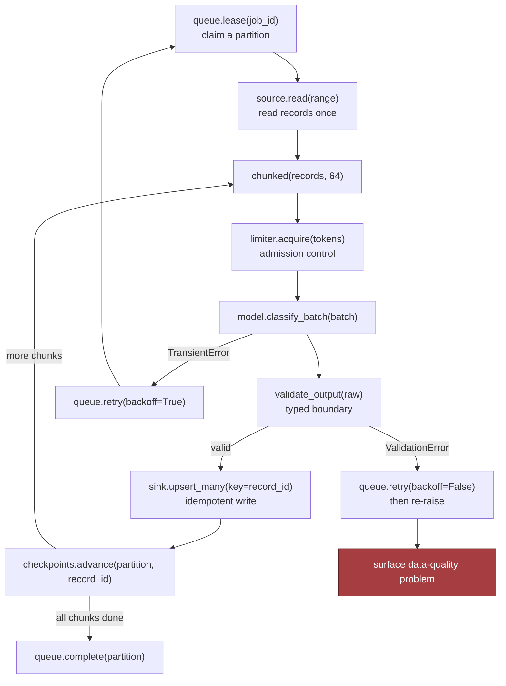

### Contract Test and Failure Injection

- A contract test proves duplicate submission does not duplicate logical work:
  1. Create a batch job with an idempotency key.
  2. Repeat the same `POST /v1/batch-jobs` request with the same key.
  3. Confirm the same job id is returned and only one job exists.
  4. Confirm `GET /v1/batch-jobs/{id}` shows a stable state transition history.
- A failure-injection test forces the worker to fail after `upsert_many()` but before `complete()`.
  - On retry, the sink must still contain one logical result per `record_id`, and the checkpoint must advance only once the partition is truly complete.
  - This is where optimistic concurrency shows its value: two workers may see work available, but only one lease holder should finalize the partition.

### What the Whiteboard Version Omits on Purpose

- The snippet leaves out: multi-worker contention control, structured logging, metrics, tracing, cancellation handling, authentication, request throttling, dead-letter routing.
- These omissions are acceptable in an interview sketch only if you can name them and explain where they attach — the point is showing which production concerns sit around the loop, not pretending it's production-complete.
- This is the moment separating an engineer who draws systems from an FDE who ships them: architecture → concrete contracts → typed state → production-shaped implementation.
- **Takeaway:** a design answer becomes believable when its state transitions, API contracts, and failure-safe code are concrete — explain who owns the snapshot, why duplicates become harmless, and why a failed batch can replay without corruption.

## 6. Security, Reliability, and Failure Handling

### The Failure Conversation Is Where the Design Becomes Real

- A strong answer doesn't just say "we retry" — it answers: retry what, for how long, against which snapshot, with what evidence, and who gets paged when the system stops making its deadline.
- Scenario: security and operations interrupt with a blunt update — the nightly job is only 45% complete at 4 a.m.
- Not just a latency problem — a decision problem: slow the arrival rate, split the workload, relax freshness, drop low-priority tenants, or escalate to humans?
- The right response is to define failure policy up front, because every external dependency and irreversible action needs one.

### Threat Model the Control Plane, Not Just the Model

- The most important security move: scope workers to immutable input snapshots.
  - A worker processes a versioned partition/object snapshot that cannot change beneath it.
  - Reduces ambiguity during retries and makes evidence replayable after an incident.
  - Limits blast radius: a malformed/malicious tenant dataset touches only that tenant's snapshot, not a mutable global table.
- Second control: avoid raw sensitive payloads in queue metadata.
  - Queue messages carry only opaque identifiers, snapshot versions, partition keys, and lease information.
  - If the queue is inspected, exported, or replayed, it should not disclose the customer's actual records.
  - Same logic applies to result and checkpoint stores: encrypt them, restrict access to least privilege, treat checkpoint state as operationally sensitive (reveals business data shape, progress, possible partial outputs).
- Auditability: keep an explicit record of model version, code version, prompt/feature schema version (if applicable), and deployment identity for every batch run.
  - Not compliance theater — it's how you prove which artifact produced which result when a customer asks why yesterday's classification diverged from today's.
  - Defense in depth: snapshot immutability, metadata hygiene, encryption, and version auditing all reinforce each other.

### Failure Policy by Event

- Make the policy explicit across four categories: **fail closed**, **degrade**, **queue**, **human intervention**.
  - Authentication, authorization, or snapshot integrity failure → fail closed.
  - Result sink briefly slow → degrade by buffering within a bounded queue and backpressure the workers.
  - Quota provider reduces capacity → queue remaining work, let the scheduler re-plan.
  - Batch behind schedule far enough that downstream consumers cannot recover → require human intervention rather than silently pushing partial data into production.

| Failure policy | Example triggers |
|---|---|
| Fail closed | Broken snapshot hash, unauthorized worker, corrupted checkpoint, unknown model version |
| Degrade | Transient downstream throttling, temporary feature store slowness, short-lived queue depth spikes |
| Queue | Quota reduction, noncritical partition backlog, scheduled maintenance window |
| Human intervention | 45% complete at 4 a.m. with no plausible path to deadline, repeated sink throttling, repeated crash loop, or any case where delayed output is worse than no output |

- This is the failure-policy lens interviewers want: deciding what the business should do when mechanisms fail, not just describing mechanisms.

> 🎯 **Interview Pointer:** Have one concrete trigger memorized per category (fail closed / degrade / queue / human intervention) — interviewers commonly ask you to classify a novel failure on the spot, and mapping it into this table is the fastest credible answer.

### Drill 1 — The 4 a.m. Incident

- **Detection:** batch progress metrics, partition-level completion counts, and deadline projections — not waiting for the pager at 5:59.
- **Containment:** freeze risky retries, preserve the current checkpoint, snapshot the evidence (lease holder, active partitions, error budget, queue depth, sink health, provider quota state).
- **Recovery:** depends on the gap — increase concurrency within safe limits if still reachable; otherwise shift to degraded mode (prioritize high-value tenants, postpone low-priority partitions, or produce partial output with explicit status).
- **Prevention:** tighten scheduling assumptions, introduce earlier canaries, make the deadline forecast visible long before the final hour.

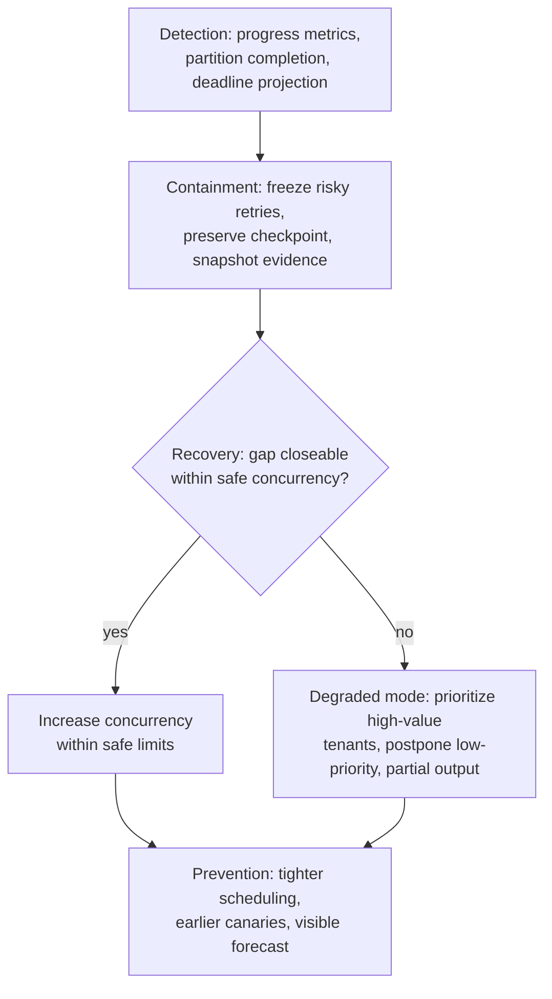

### Drill 2 — Provider Quota Reduction

- **Detection:** spike in rate-limit responses or a drop in successful calls per minute.
- **Containment:** immediate backoff and a circuit breaker so workers stop hammering the dependency.
- **Recovery:** re-balance across remaining capacity, reduce per-call batch size if possible, or defer lower-priority partitions.
- **Prevention:** quota-aware scheduling, preflight capacity checks, and a runbook naming which tenant classes can be paused first.

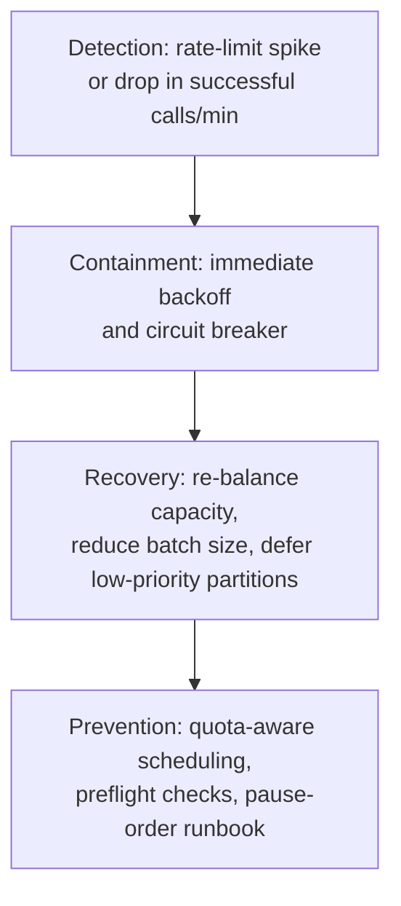

### Drill 3 — A Hot Partition That Produces Stragglers

- A different problem: the system is alive but unbalanced.
- **Detection:** partition duration histograms and worker idle time.
- **Containment:** split the hot partition into smaller shards or reassign to more workers if the snapshot model permits.
- **Recovery:** redistribute load and cap retries so one pathological shard doesn't monopolize the fleet.
- **Prevention:** choose partition keys with better cardinality; detect "elephant" tenants before the nightly run begins.

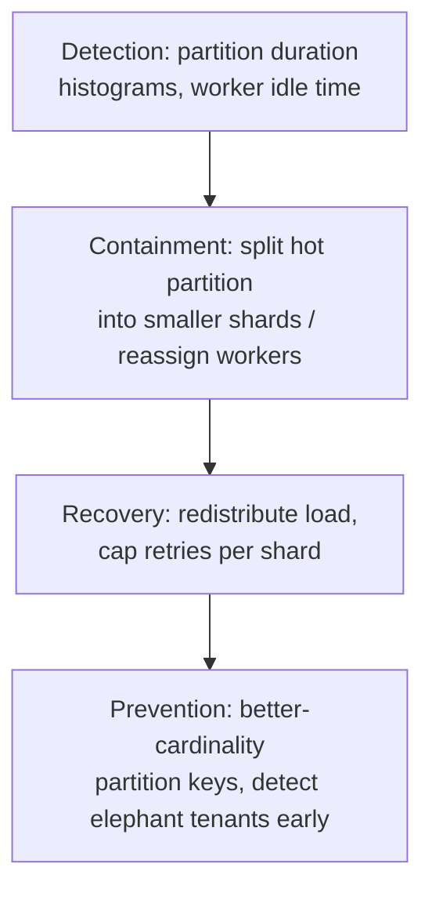

### Drill 4 — A Worker Crashes After the Model Call

- The invariant: output must be safe to replay. This is where idempotency and checkpoints matter.
- The worker writes results with a deterministic record key, then marks the partition complete only after all rows are durably written.
- On retry, the same record can be reprocessed without creating duplicates.
- If the crash occurred after model execution but before completion, the next attempt resumes from the immutable snapshot and either overwrites identical results or skips already-finalized rows.
- Reason to preserve the input snapshot: the retry needs a stable source of truth.

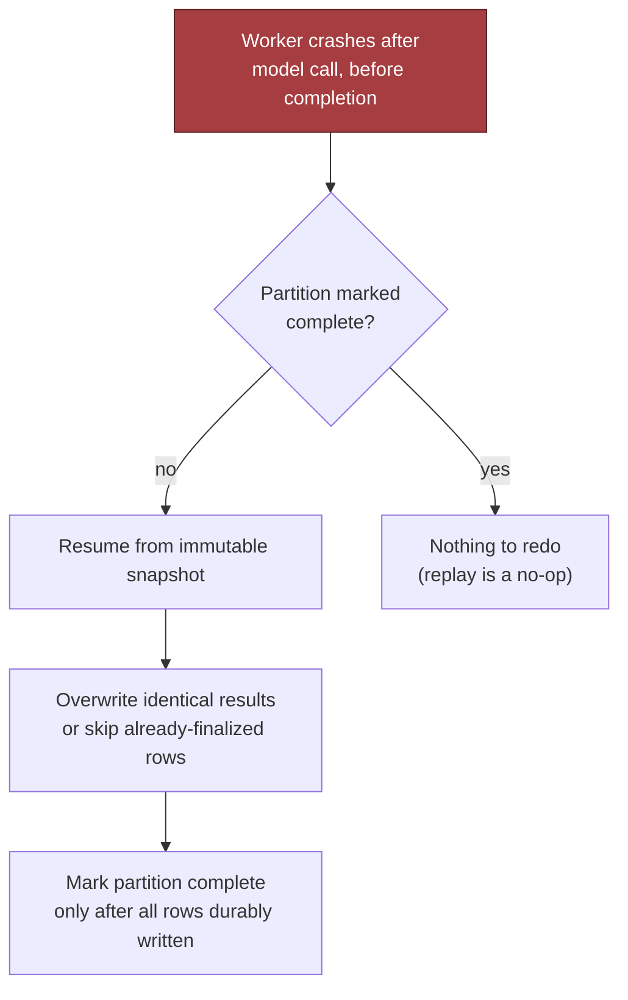

### Drill 5 — The Result Sink Throttles

- The correct response is usually not to push harder.
- Apply bounded retries with jitter, then circuit-break the sink and slow intake upstream.
- If the sink stays unhealthy past the retry budget, move affected partitions to a dead-letter path or a durable retry queue and page a human.
- The escalation policy should be visible in the runbook before launch — "we will look into it" is not an operational plan.

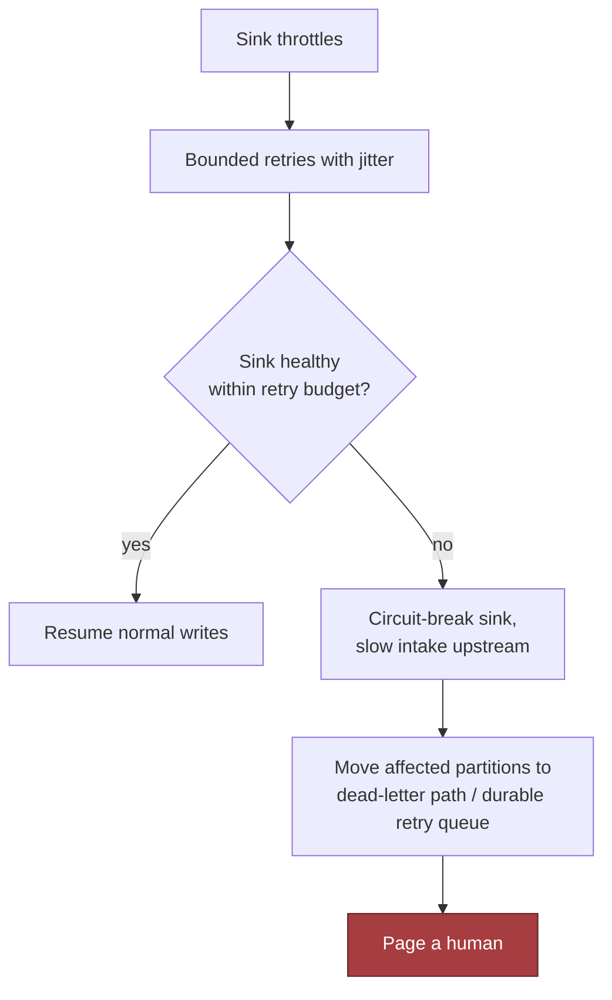

### Production Sketch with the Invariant That Matters

- The interview-scale sketch below is intentionally narrow — it shows the replay-safety invariant, not a full fleet manager: a retried partition must not create duplicate logical outputs, and a checkpoint must only advance after the partition is truly complete.

```python
from __future__ import annotations

import asyncio
from dataclasses import dataclass
from typing import Iterable


@dataclass(frozen=True)
class Record:
    record_id: str
    features: dict[str, object]


class CheckpointStore:
    def __init__(self) -> None:
        self.completed_partitions: set[str] = set()

    async def is_complete(self, partition_id: str) -> bool:
        return partition_id in self.completed_partitions

    async def mark_complete(self, partition_id: str) -> None:
        self.completed_partitions.add(partition_id)


class ResultSink:
    def __init__(self) -> None:
        self._rows: dict[str, dict[str, object]] = {}

    async def upsert_many(self, rows: Iterable[dict[str, object]]) -> None:
        for row in rows:
            record_id = row["record_id"]
            self._rows[record_id] = dict(row)

    async def count_rows(self) -> int:
        return len(self._rows)

    async def count_distinct(self, field: str) -> int:
        if field != "record_id":
            raise ValueError("unsupported field")
        return len(self._rows)


checkpoint = CheckpointStore()
sink = ResultSink()


async def worker_once(crash_after: int | None = None) -> None:
    partition_id = "tenant-a:2026-01-01:shard-17"
    if await checkpoint.is_complete(partition_id):
        return

    records = [Record(record_id=str(i), features={"x": i}) for i in range(100)]
    written = 0
    batch: list[dict[str, object]] = []

    for record in records:
        batch.append({"record_id": record.record_id, "score": record.features["x"]})
        written += 1
        if crash_after is not None and written == crash_after:
            await sink.upsert_many(batch)
            raise RuntimeError("simulated crash after sink write")

    await sink.upsert_many(batch)
    await checkpoint.mark_complete(partition_id)


async def test_replayed_partition_has_one_result_per_record():
    await worker_once(crash_after=50)
    await worker_once()
    assert await sink.count_distinct("record_id") == await sink.count_rows()
```

- The omission is deliberate: it leaves out authentication, multi-worker leasing, dead-letter routing, structured logging, metrics, and distributed tracing so you can explain where those concerns attach.
- A real service would also harden the write path with tenant-scoped authorization, server-side encryption, a TTL/retention policy for transient state, and explicit cancellation handling so abandoned work does not keep consuming quota.

### What to Say in the Room

- An FDE owns safe rollout, support, and incident response, not merely the happy path.
- Sample statement of ownership:
  > "This design contains blast radius by tenant, region, workflow, and dependency; it retries only within a bounded policy; it preserves evidence before repair; and it escalates when the deadline is no longer recoverable."
- **Lasting lesson:** every external dependency and every irreversible action needs an explicit failure and recovery policy. If you cannot say what happens when the quota shrinks, the sink slows, the worker crashes, or the batch falls behind, the design is not complete enough for production, even if it looks elegant on the whiteboard.

## 7. Delivery Plan, Observability, and Business Impact

### Turning a Working Prototype into a Production Plan

- The customer's real question is sharper than "does it work?": when can this be trusted in production?
- The architecture stops being a drawing and becomes a delivery system with gates, owners, and measurable exit criteria.
- The job is not just to make the pipeline run — it is to make it safe to roll out, easy to observe, and useful enough that the business keeps paying for it.

### A Four-Phase Rollout

- Treat launch as a sequence of controlled reductions in uncertainty.
- **Phase 1 — benchmark.** Benchmark the representative token distribution, not a toy sample (short records, long records, edge-case payloads, known skew). Wrong input distribution means every later estimate is wrong: throughput, queue pressure, quota burn, downstream lag. Owner: platform/ML infrastructure engineer, with the data owner confirming representativeness and the product owner signing off on operational fit.
- **Phase 2 — load-test ladder.** Run at 1%, then 10%, before opening the floodgates. The important detail is the exit criteria, not the percentages: a 1% run proves input parsing, authentication, model invocation, sink writes, and checkpointing hold under real concurrency; a 10% run proves retry behavior, throttling, and downstream capacity still fit the deadline envelope. Go/no-go gate belongs jointly to engineering, operations, and the business stakeholder. If the 1% gate fails, the 10% test is blocked, not "a little delayed."
- **Phase 3 — practice failure on purpose.** Crash the worker. Reduce quota. Kill a downstream dependency. Drain a queue and restore it. Confirms whether failure behavior is theoretical or rehearsed. Crash drill confirms bounded replay, durable checkpoints, and low/detectable duplicate logical results. Quota-reduction drill proves graceful degradation instead of retry-storm/starvation oscillation. Owners: batch platform team (crash drill), model/API dependency owner (quota behavior), on-call engineer (incident log and follow-up).
- **Phase 4 — define deadline contingency modes before the job is late.** A batch 45% complete at 4 a.m. should trigger a pre-agreed mode with named owners: continue full accuracy until cutoff, switch to a cheaper/smaller model, reduce low-value record classes, narrow scope to highest-priority segments, or pause nonessential enrichment. These are business decisions as much as technical ones — the product owner and operations lead must be in the room before launch, not after the first missed deadline.

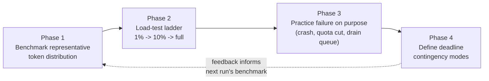

### The Scorecard That Makes the System Legible

- A production system needs a scorecard that separates throughput, quality, and business value instead of one vague "health" number.
- Minimum metric set:
  - **records/sec:** records successfully processed per unit time.
  - **tokens/sec:** model input consumed — often explains cost and quota pressure better than raw record counts.
  - **completion forecast:** live estimate of whether the batch finishes before deadline.
  - **retry rate:** fraction of work being retried — exposes bad inputs, dependency instability, or throttling.
  - **straggler age:** how long the slowest unfinished partition has been running — reveals tail latency and imbalance.
  - **cost per million records:** the business efficiency view, useful for comparing model choices, batching strategies, retry overhead.
  - **duplicate logical result count:** records that appear processed more than once in a way that matters to the business, even if storage writes were technically idempotent.
- Each metric needs a calculation, a source, an owner, and an alert threshold.

| Metric | Calculation | Source | Owner | Illustrative alert threshold |
|---|---|---|---|---|
| records/sec | Completed records over time window | Worker telemetry and sink acknowledgments | Platform team | Sustained throughput drops below the forecast needed to finish by deadline |
| tokens/sec | Model input tokens over time window | Request logs / model client instrumentation | ML platform | Rises faster than the expected representative distribution |
| completion forecast | Completed work / remaining work + observed throughput | Operations | Crosses the deadline boundary with no contingency mode activated |
| retry rate | Retry counters / failure taxonomy | On-call | Rises above the normal band |
| straggler age | Partition timestamps | Batch orchestration | Oldest active partition ages beyond the time budget for recovery |
| cost per million records | Cloud billing + model usage logs | Finance / platform ops | Trends outside the approved budget envelope |
| duplicate logical result count | Comparing logical keys, not storage rows | Data engineering | Duplicates exceed the tolerated replay window |

> 🎯 **Interview Pointer:** If asked "how do you know the batch will finish on time," the answer is the completion-forecast row — be ready to name its calculation (completed / remaining + observed throughput) and its alert trigger (crosses the deadline boundary with no contingency activated) from memory.

### Dashboards That Connect Telemetry to Customer Value

- Good observability is a story linking customer outcome to machine behavior, not a wall of charts.
- A useful dashboard begins with the outcome headline: "Will the batch complete by 6:00 a.m.?" — showing completion forecast, remaining partitions, and deadline contingency mode.
- Next, the operational levers explaining the forecast: records/sec, tokens/sec, retry rate, straggler age, queue depth, downstream sink lag.
- Then quality and correctness indicators: duplicate logical result count, rejected inputs, checkpoint freshness, number of replayed partitions.
- This structure lets a non-specialist answer the right question quickly:
  - A business user sees whether the run is on track.
  - An operator sees which subsystem is slowing it down.
  - An engineer traces a retry-rate spike to a quota reduction or bad input cohort.
- The dashboard should distinguish four layers: technical health (worker uptime, queue lag, error rate), model quality (offline/sampled evaluation), adoption (whether downstream teams actually consume output), and business outcome (whether the customer meets the nightly deadline at acceptable cost).

### What to Show in Rollout, Support, and Adoption

- A launch plan is incomplete without canarying, rollback, migration, training, support, and documentation.
  - **Canarying:** a small slice of nightly work flows through the new path while the old path remains available as fallback/comparison baseline.
  - **Rollback:** stop new work, preserve checkpoints, resume on the stable path without losing the ability to explain what happened.
  - **Migration:** move only the records and dependencies needed for each phase, not the entire workflow at once.
  - **Training:** a short runbook for operators/downstream users — normal run, late run, quota-shrink response, contingency-mode interpretation.
  - **Support:** name who gets paged for data issues, quota issues, worker crashes, and sink delays.
  - **Documentation:** the system stays understandable when the people who built it are not in the room.
- The FDE role is broader than "just ship the model" — delivery from prototype through adoption, feedback, and reusable learning. The system is finished when the customer trusts it enough to depend on it, operators can support it, and the product team can reuse the lessons in the next deployment.

### What Becomes Configurable, an Adapter, a Service, or Core Product

- A strong interview signal: separating one-off delivery work from reusable platform value.
  - **Configuration:** tenant-specific thresholds, deadline windows, model choice, contingency policy.
  - **Adapters:** integrations with a particular customer warehouse, queue, or identity provider.
  - **Common service (if recurring across deployments):** shared retry logic, checkpointing, rate-limiting wrappers, metrics emission.
  - **Core product (stable across customers):** partition orchestration, safe replay semantics, observability primitives, the policy engine deciding push/degrade/stop.
- This boundary is a business decision, not just an architecture preference: promoting repeated work into the shared product increases organizational leverage per implementation; leaving customer-specific concerns in configuration and adapters keeps different environments supportable without forking into fragile copies.

### Risk Register and Go/No-Go Discipline

- A practical rollout carries a risk register with owner, mitigation, and trigger for each named risk:
  - "Quota shrinks unexpectedly" — owner: dependency owner; mitigation: lower-rate contingency mode; trigger: sustained throttling or forecast slippage.
  - "Duplicate logical results rise" — owner: data engineering; mitigation: stricter idempotency checks and replay review; trigger: duplicate count above tolerated threshold.
  - "Sink latency spikes" — owner: platform ops or downstream team; mitigation: buffering and backpressure; trigger: queue age exceeding the recovery window.
  - "Worker crash loop" — owner: on-call owner; mitigation: rollback or reduced concurrency; trigger: repeated restarts in the canary slice.
- Go/no-go gate: if the representative load test does not show stable throughput, if crash recovery has not been rehearsed, or if the contingency owner is not available, do not expand rollout. Conservative-sounding until the batch misses one deadline because nobody wanted to say no.

### Chapter Assets and Where They Fit

- **Diagram: chapter-10-architecture** — anchors the rollout, observability, and trust-boundary discussion; shows the component relationships that the scorecard and contingency modes observe.
- **Diagram: chapter-10-sequence** — makes the happy path and failure path concrete; maps to the failure drills, canarying, rollback, and go/no-go gate discussion.
- **Worksheet: chapter-10-interview** — practices the clarifying questions, estimates, and trade-offs supporting the staged rollout plan; maps to the rollout phases, metric definitions, and risk register.

### The Customer Impact That Justifies the System

- The final measure is not elegance — it's whether the customer gets a replayable, cost-controlled batch by deadline with clear recovery decisions when behind schedule.
- If the workflow becomes more predictable, operator burden drops, downstream teams can trust the output window, and the customer makes a recurring nightly process part of normal operations instead of a fire drill — the design has done its job.
- The interview answer should end there: success only when users adopt it, the workflow improves, and the operating team can support it.

## 8. Interview Walkthrough, Trade-Offs, and Practice

### Minute Zero: Open with the Outcome, Not the Diagram

- Restate the customer problem in one sentence: classify a very large nightly dataset before the business day begins, while staying within model, rate, cost, and downstream capacity limits.
- Then immediately ask a judgment-signaling clarifying question: what matters most if everything cannot be perfect — deadline, accuracy, cost, or the ability to replay safely?
- That question prevents overbuilding the wrong axis.
- A strong, short, concrete, directional opening:
  > "I'll first pin down the batch deadline, correctness tolerance, and failure recovery expectations. Then I'll estimate throughput and identify the bottlenecks that actually threaten the schedule. After that I'll propose a partitioned ingestion and inference pipeline with idempotent writes, monitoring, and a deliberate fallback path if we're behind at 4 a.m."
- This frames the customer outcome, signals proportional time allocation to risk, and invites redirection. Do not spend five minutes drawing boxes before knowing what problem they need to solve.

### A Practical 50-Minute Answer Plan

- Allocate attention where failure hurts:
  - **Minutes 0–5: discovery.** Clarify batch size, deadline, acceptable freshness, model quality requirement, retry policy, whether partial output is useful. Ask about input skew, downstream ingest windows, exactness vs. timeliness preference. State assumptions out loud.
  - **Minutes 5–10: estimation.** Records per partition, model runtime per record/thousand records, expected concurrency, available execution window — identify whether the design fits in principle and where margin is thin, not a perfect number.
  - **Minutes 10–18: architecture.** Control plane, queue/manifest, worker fleet, inference provider or self-hosted model, durable checkpointing, result sink. Emphasize idempotency, replayability, explicit publish gates.
  - **Minutes 18–25: data flow and failure flow.** Walk a normal run, then a degraded run — worker failure, hot partition, provider throttling, falling behind schedule.
  - **Minutes 25–32: trade-offs.** Larger batches vs. tail latency, provider API vs. self-hosting, dynamic repartitioning vs. manifest simplicity, full quality vs. fallback model at deadline risk — demonstrates engineering taste, not just vocabulary.
  - **Minutes 32–38: security and operations.** Access control, data minimization, secret handling, auditability, rate-limit protection, observability, safe retries — tie each control to a concrete failure mode.
  - **Minutes 38–45: follow-up drill.** 45% done at 4 a.m.? Hot partition rebalance? Avoiding paying twice after a timeout? When are partial results publishable?
  - **Minutes 45–50: concise close.** Summarize in ninety seconds, name the riskiest trade-off, specify the first rollout gate — end as if handing the system to an operator: clear, bounded, reversible.

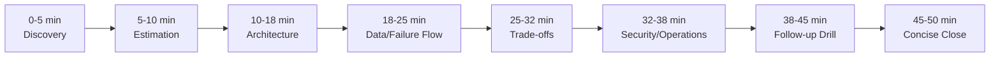

> 🎯 **Interview Pointer:** The pacing plan itself is worth memorizing block-by-block — running out of time before reaching trade-offs or the failure drill is one of the most common ways a technically strong answer scores as "not interview-strong."

### Trade-Offs You Must Defend Clearly

- **Larger batches vs. tail latency.** Larger batches reduce coordination overhead and improve throughput, but create longer stragglers and make recovery near the deadline harder. Not "always batch bigger" — "batch as large as needed for throughput, but small enough that a failed or slow partition can be retried without jeopardizing the whole window." Batch size is a risk-control knob, not a universal optimization.
- **Provider API vs. self-hosting.** Provider API: faster to launch, easier to operate, simpler to scale at first, but adds dependency on external rate limits, pricing changes, and uncontrolled service behavior. Self-hosting: more control over performance, model versioning, and data handling, but raises infrastructure burden and failure surface area. Conditional answer: choose the provider when time-to-value and operational simplicity dominate; choose self-hosting when latency control, cost predictability, or data residency pressures justify the extra burden.
- **Dynamic repartitioning vs. manifest simplicity.** Dynamic repartitioning absorbs skew and hot partitions but makes the scheduler, state tracking, and debugging more complex. A static manifest is easier to reason about, replay, and audit at interview scale. If choosing the simpler manifest first, still explain how you'd detect skew and manually split/reschedule the offending slice.
- **Full quality vs. a fallback model at deadline risk.** A high-quality model may produce better outputs, but if it risks the deadline, the customer may prefer a lower-quality, clearly-labeled fallback that completes on time. A business question as much as a technical one — define a publishability policy: switch the remaining work to a lower-cost/lower-latency fallback only if the output is still useful and clearly marked.

> 🎯 **Interview Pointer:** For each trade-off pair, practice stating the balanced verdict in one sentence before the justification — interviewers penalize slogans ("always batch bigger," "self-host for control") much more than they reward extra detail.

### What to Say When the Interviewer Presses on Failure

- These are probes of operational maturity, not trick questions.
- **What do you do at 4 a.m. when only 45% is done?** Stop pretending the original plan will magically recover. Reassess remaining work against the deadline, identify whether the bottleneck is compute, a hot partition, provider throttling, or downstream backpressure, and choose the smallest intervention that restores schedule confidence: increase worker concurrency if there's headroom, split slow partitions, switch remaining workload to a fallback model, or publish only the subset meeting the correctness/policy bar. Make the decision explicit rather than leaving the batch in limbo.
- **How do you rebalance a hot partition?** Detect early via partition-level lag, runtime histograms, and queue age. Split the hot shard into smaller units using a deterministic key so work remains replayable. If already in flight, don't duplicate records blindly — move only the unprocessed remainder and record new ownership in the manifest/checkpoint store.
- **How do you avoid paying twice after a timeout?** Use idempotency keys, durable checkpoints, and write-side deduplication so retries don't create duplicate chargeable work or duplicate records. Treat a timeout as an ambiguous state (maybe it completed, maybe not) — record progress before or at commit boundaries, not only after the entire job finishes.
- **When are partial results publishable?** Only when the customer has defined a policy for partial acceptance. Some workloads can publish completed partitions or a "best-effort by deadline" subset if each unit is independently valid and clearly labeled. Others require all-or-nothing semantics because downstream consumers cannot handle mixed vintages. State which regime applies and, if partial, define the exact publish gate and completeness metadata.

### Deliberate Challenge: The Riskiest Assumption

- A good interviewer challenges the assumption that the backlog is evenly distributed or that model runtime is stable — that is the right challenge, and the response should not become defensive.
- Sample response:
  > "If skew is worse than expected, I would treat partition imbalance as the first-class risk, because a few hot shards can dominate the batch window. I would size the system so that we can split or retry those shards without restarting the entire job."
- Shows you're not anchored to an idealized workload — you're designing for the messy case that actually breaks deadlines.

### Common Weak Answers and How to Repair Them

- Weak pattern 1: **architecture theater** — lots of boxes, little operational logic.
- Weak pattern 2: **optimizing one metric while ignoring the rest** — chasing throughput while making retries unsafe, or minimizing cost while losing the deadline.
- Weak pattern 3: **vague confidence** — "we'll just scale up" without naming the trigger signal, the limit that stops it, or what happens when scaling fails.
- Repair by adding specifics: what is the trigger, what is the fallback, what is the recovery path, and what is the publish rule. If you cannot explain those four things, the architecture is incomplete.

### Scoring Rubric an Interviewer Can Use

- Seven dimensions:
  - **Discovery:** asks the right clarifying questions, surfaces hidden constraints early.
  - **Estimation:** makes reasonable assumptions and uses them to test feasibility.
  - **Architecture:** proposes a design that is replayable, observable, and safe to operate.
  - **Depth:** can explain batch sizing, skew handling, retries, and publish gates in detail.
  - **Security:** treats credentials, data access, and output handling as part of the design, not an afterthought.
  - **Delivery:** understands rollout, monitoring, and what to do when the batch is behind schedule.
  - **Communication:** stays structured, concise, and willing to revise assumptions when challenged.
- A candidate scoring high only on architecture but low on delivery or communication may be technically clever but not interview-strong for an FDE role, since FDE work is customer-facing and operationally grounded.

### A Ninety-Second Architecture Summary

> "We have a nightly batch that must classify all records before the business deadline, so I would prioritize replayability, clear ownership, and deadline-aware recovery over exotic optimization. I'd partition the input into deterministic shards, track each shard in a durable manifest, and run workers that call either a provider API or a self-hosted model depending on the cost, latency, and control constraints. Every write would be idempotent, every shard would checkpoint progress, and every retry would be safe to rerun. I'd monitor shard lag, provider throttling, queue age, and downstream sink health so we can detect whether we're on track by the middle of the window. If we're behind at 4 a.m., I'd first identify the bottleneck, then decide whether to split hot partitions, raise concurrency, or switch the remaining work to a fallback model if the quality policy allows it. The main trade-off is between throughput and flexibility: larger batches improve efficiency, but smaller, deterministic units make recovery safer. I'd start rollout with a small representative slice, verify stable throughput and idempotent replay, and only then expand to the full nightly workload."

- This summary directly connects the design to the business outcome: complete the batch on time, keep it replayable, control cost, and make recovery decisions explicit when things go wrong.

### Practice Regimen Before the Interview

- **Solo exercise:** write the opening five minutes from memory, including your first two clarifying questions and the assumption you are most willing to revise.
- **Pair mock:** have your partner interrupt you at the 4 a.m. failure point and force a choice among scaling, repartitioning, fallback, or partial publish — defend the choice in under two minutes.
- **Implementation exercise:** sketch the control flow for a manifest-driven batch runner and annotate where idempotency, checkpointing, and retry policy live — the goal is building the habit of turning an abstract design into an operable system, not memorizing code.

### What Makes This Answer Job-Market Relevant, and the Final Takeaway

- This is exactly the reasoning style expected in FDE system-design interviews and customer architecture conversations: start from the customer's outcome, translate it into constraints, expose the riskiest issue, and defend a safe, practical implementation path.
- The employer is not hiring someone who can merely name the parts of a batch pipeline — they want someone who can guide a customer through a deadline-sensitive system, make trade-offs visible, and recover when reality diverges from the plan.
- **Final takeaway:** a strong answer is structured, quantitative, safe, customer-aware, and explicit about trade-offs. It says what matters, what may fail, what you will do first, and what you will not promise — that is what makes the design credible in a 45–60 minute interview and useful on the job.

## Coverage Notes

This tutorial was drafted after a full, gapless read of Chapter 10 (Kindle locations 8627–9416, confirmed against the clean Chapter 9/10 boundary at 8623/8627 and the clean Chapter 10/11 boundary at 9414/9417). One self-review pass was run against the fixed 20-item rubric; no further gaps were found that the source material could close, so only one pass was needed.

**Phase 1 — Problem Framing & Discovery**
- **Item 1 (feature → business-outcome reframing):** Fully covered — Section 1 restates the request as a replayable, cost-controlled deadline outcome.
- **Item 2 (stakeholder/persona mapping):** Fully covered — four groups plus end user/operator/security owner/executive sponsor map.
- **Item 3 (clarifying questions that change the architecture):** Fully covered — six-question tree in Section 2 tied to design axes.
- **Item 4 (requirements split + prioritization):** Fully covered — functional/nonfunctional split and must/should/could ladder in Section 2.
- **Item 5 (explicit non-goals/scope fence):** Fully covered — MVP exclusions list in Section 2.

**Phase 2 — Estimation & Architecture**
- **Item 6 (back-of-envelope scale & capacity math):** Fully covered — throughput formula, rps figures, sensitivity table in Section 3.
- **Item 7 (unit economics/cost-driver breakdown):** Partial — cost treated qualitatively; no full token-to-dollar formula.
- **Item 8 (end-to-end architecture & data flow):** Fully covered — component stack, trust boundaries, happy path, sequence diagram in Section 4.
- **Item 9 (data model & API contracts):** Fully covered — BatchJob/Partition/InferenceResult and four endpoints in Section 5.
- **Item 10 (build-vs-buy/vendor & model-selection trade-offs):** Fully covered — provider API vs. self-hosting addressed directly in Sections 4 and 8.

**Phase 3 — Trade-offs, Security & Reliability**
- **Item 11 (named trade-off pairs with balanced verdict):** Fully covered — four pairs in Section 8.
- **Item 12 (threat model/security controls):** Fully covered — control-plane threat model in Section 6.
- **Item 13 (failure-mode & reliability drills):** Fully covered — five drills in Section 6.
- **Item 14 (testing strategy):** Fully covered — contract test and failure-injection test in Section 5.

**Phase 4 — Delivery, Governance & Communication**
- **Item 15 (layered evaluation metrics & observability):** Fully covered — seven-metric scorecard and dashboard layers in Section 7.
- **Item 16 (phased rollout/risk register/rollback gates):** Fully covered — four-phase rollout and risk register in Section 7.
- **Item 17 (regulatory/governance depth):** Absent — no named external compliance framework (SOC 2, GDPR, HIPAA) or deeper governance process beyond audit trail, retention, and residency mentions.
- **Item 18 (responsible-AI/risk framing beyond the obvious failure mode):** Fully covered — silently pushing partial/duplicate data into production treated as a first-class risk in Sections 6 and 7.
- **Item 19 (change-management/adoption narrative):** Fully covered — canarying, rollback, migration, training, support, documentation in Section 7.
- **Item 20 (structured communication plan + self-scoring rubric):** Fully covered — 50-minute pacing plan and seven-dimension scoring rubric in Section 8.

### My Perspective on the Gaps

*The following is supplementary perspective, not sourced from the original chapter — it reflects my own view on how to address the two identified gaps in a live interview for this chapter's scenario.*

**Item 7 — Unit economics / cost-driver breakdown.**
- I would build the missing dollar formula live from numbers the chapter already gives: at 270 tokens/record and ~5,320 rps planning rate, that's roughly 1.43M tokens/second sustained, or about 5.15B tokens across the 6-hour window for 100M records — then apply the provider's per-million-token price to get a cost-per-run figure and divide by 100 to get cost per million records.
- I'd explicitly separate the fixed cost driver (base 270 tokens/record) from the variable multipliers the chapter names qualitatively — retries (each retry re-spends the full 270 tokens), headroom (the 15% buffer is itself a cost line, not just a capacity line), and stragglers (workers held open past the 6-hour window burn compute even if token volume doesn't grow).
- Concretely, I'd say something like: "If retry rate holds at 5%, that's roughly 5% more token spend on top of the base 5.15B tokens; if it spikes to 20% during a provider degradation, cost roughly quadruples for that slice of records — so the cost ceiling from Section 2's discovery questions should be wired directly into the rate-limit coordinator's backoff behavior, not treated as a separate finance concern."
- This ties the gap directly back to the architecture already built: the rate-limit coordinator and the degraded-mode decision in Section 6 are exactly the levers that convert an abstract "bounded cost" nonfunctional requirement into an enforced dollar ceiling.

**Item 17 — Regulatory/governance depth beyond data residency and audit trail.**
- For a batch classification system processing 100M records nightly, I would name the two most likely applicable frameworks depending on the record type the interviewer implies: if records include personal data, GDPR/CCPA-style purpose limitation and data minimization apply directly to the `input_snapshot` and `InferenceResult` retention policy already defined in Section 5; if the customer is regulated (finance, healthcare), SOC 2 or HIPAA-style access-control and change-management evidence requirements apply to the audit trail already named in Section 6.
- I'd propose extending the existing audit trail (model version, code version, prompt schema version, deployment identity per run) with a governance-specific addition: a per-run "processing basis" field recorded alongside `BatchJob`, so that if a regulator or customer auditor later asks "why was this record classified," the answer traces to both the technical artifact (model_version) and the legal basis for processing it.
- I would also connect this to the risk register in Section 7 — a governance gap is itself a risk-register line item ("regulatory review required before expanding to a new data category") with an owner (legal/compliance) and a trigger (onboarding a new tenant whose records fall under a new regulatory regime), rather than treating compliance as a one-time gate outside the operational rollout process.
- The honest framing for the interview is to say plainly: "the chapter's audit trail and residency controls give me the mechanism, but I'd explicitly ask the customer which regulatory framework applies before claiming compliance, because the technical controls (encryption, access restriction, audit logging) are necessary but not sufficient without a named framework to test them against."
