# Chapter 11: Design a Tool-Using AI Agent with Safety Controls

*Source: THE FORWARD DEPLOYED ENGINEER SYSTEM DESIGN INTERVIEW: 20 REAL-WORLD AI SYSTEM DESIGN INTERVIEWS, Chapter 11*

*Tutorial format: Interview-ready v2 (bullet-only cram format) — regenerated from the original tutorial's verified content, no new source material added.*

## Table of Contents

- [1. The Customer Problem and Discovery](#1-the-customer-problem-and-discovery)
  - [Restating the Problem and Mapping Stakeholders](#restating-the-problem-and-mapping-stakeholders)
  - [Feature vs. Business Outcome](#feature-vs-business-outcome)
  - [High-Leverage Discovery Questions](#high-leverage-discovery-questions)
  - [Define the Workflow the Customer Actually Wants](#define-the-workflow-the-customer-actually-wants)
  - [A Compact Opening Answer](#a-compact-opening-answer)
  - [Weak vs. Corrected Framing](#weak-vs-corrected-framing)
  - [Why This Framing Signals FDE Readiness](#why-this-framing-signals-fde-readiness)
- [2. Clarifying Questions, Requirements, and Constraints](#2-clarifying-questions-requirements-and-constraints)
  - [Force the Hidden Constraint into the Open](#force-the-hidden-constraint-into-the-open)
  - [Six Questions That Change Risk](#six-questions-that-change-risk)
  - [Requirements, Not Feature Wish Lists](#requirements-not-feature-wish-lists)
  - [Six Must-Have Functional Requirements](#six-must-have-functional-requirements)
  - [Constraints: The Lines You Cannot Cross](#constraints-the-lines-you-cannot-cross)
  - [What the Interviewer Withholds Is Part of the Design](#what-the-interviewer-withholds-is-part-of-the-design)
  - [A Concise Interview Question Tree](#a-concise-interview-question-tree)
  - [MVP Boundaries That Prevent Solution Sprawl](#mvp-boundaries-that-prevent-solution-sprawl)
  - [Requirement-to-Component Traceability](#requirement-to-component-traceability)
  - [Why This Is Strong FDE Behavior](#why-this-is-strong-fde-behavior)
- [3. Scale Estimates, SLOs, and Capacity](#3-scale-estimates-slos-and-capacity)
  - [Workload Shape, Not Endpoint Count](#workload-shape-not-endpoint-count)
  - [Budget Model-Planning Latency Separately from Tool Latency](#budget-model-planning-latency-separately-from-tool-latency)
  - [Derive a Risk Tier Before Deciding Autonomy](#derive-a-risk-tier-before-deciding-autonomy)
  - [What to Measure: SLIs and SLOs](#what-to-measure-slis-and-slos)
  - [A Capacity Sketch with the Given Numbers](#a-capacity-sketch-with-the-given-numbers)
  - [Concurrency Limits Are a Safety Feature](#concurrency-limits-are-a-safety-feature)
  - [Unit Economics Should Influence Partitioning](#unit-economics-should-influence-partitioning)
  - [Show the Sensitivity Range, Not False Precision](#show-the-sensitivity-range-not-false-precision)
  - [How to Speak About Uncertainty](#how-to-speak-about-uncertainty)
  - [What the Interviewer Is Really Testing](#what-the-interviewer-is-really-testing)
- [4. Architecture and End-to-End Flow](#4-architecture-and-end-to-end-flow)
  - [Control Plane vs. Data Plane](#control-plane-vs-data-plane)
  - [Top-Down Component Map](#top-down-component-map)
  - [Architecture Diagram and Trust Boundaries](#architecture-diagram-and-trust-boundaries)
  - [Happy Path: One Request, End to End](#happy-path-one-request-end-to-end)
  - [Failure-Path Overlay: Prompt Injection and Tool Abuse](#failure-path-overlay-prompt-injection-and-tool-abuse)
  - [Synchrony, Queues, and Backpressure](#synchrony-queues-and-backpressure)
  - [MVP vs. Later Evolution](#mvp-vs-later-evolution)
  - [Component Responsibility Table](#component-responsibility-table)
  - [What to Say in the Interview](#what-to-say-in-the-interview)
- [5. Data Model, APIs, and Working Code](#5-data-model-apis-and-working-code)
  - [Turn the Architecture into State](#turn-the-architecture-into-state)
  - [Contracts That Make the Control Plane Legible](#contracts-that-make-the-control-plane-legible)
  - [The Smallest Safe Code Path](#the-smallest-safe-code-path)
  - [Line by Line, the Safety Story Is Visible](#line-by-line-the-safety-story-is-visible)
  - [Contract Test and Failure-Injection Test](#contract-test-and-failure-injection-test)
  - [Why Idempotency and Versioning Belong Everywhere](#why-idempotency-and-versioning-belong-everywhere)
  - [What the Interviewer Is Really Looking For](#what-the-interviewer-is-really-looking-for)
- [6. Security, Reliability, and Failure Handling](#6-security-reliability-and-failure-handling)
  - [Starting from the Hostile Case](#starting-from-the-hostile-case)
  - [The Security Posture That Actually Holds Up](#the-security-posture-that-actually-holds-up)
  - [Failure Policies by Design, Not by Hope](#failure-policies-by-design-not-by-hope)
  - [Failure Drill: Prompt Injection Requests Unauthorized Tool](#failure-drill-prompt-injection-requests-unauthorized-tool)
  - [Failure Drill: Tool Succeeds but Response Is Lost](#failure-drill-tool-succeeds-but-response-is-lost)
  - [Failure Drill: Approval Becomes Stale](#failure-drill-approval-becomes-stale)
  - [Failure Drill: Agent Loops on the Same Action](#failure-drill-agent-loops-on-the-same-action)
  - [Failure Drill: Credential Broker Is Unavailable](#failure-drill-credential-broker-is-unavailable)
  - [Blast Radius Is a Design Variable](#blast-radius-is-a-design-variable)
  - [Evidence and Runbooks Before Launch](#evidence-and-runbooks-before-launch)
  - [A Minimal Production Sketch for the Invariant](#a-minimal-production-sketch-for-the-invariant)
  - [How to Say This in the Interview](#how-to-say-this-in-the-interview)
- [7. Delivery Plan, Observability, and Business Impact](#7-delivery-plan-observability-and-business-impact)
  - [Turning a Working Prototype into a Production Plan](#turning-a-working-prototype-into-a-production-plan)
  - [Start with the Smallest Safe Slice](#start-with-the-smallest-safe-slice)
  - [Add Write Paths Only After Reversibility Is Proven](#add-write-paths-only-after-reversibility-is-proven)
  - [Put Money Behind a Human Before Autonomy](#put-money-behind-a-human-before-autonomy)
  - [Red-Team the Prompt Before You Grant More Power](#red-team-the-prompt-before-you-grant-more-power)
  - [Canaries, Migration Planning, and the Risk Register](#canaries-migration-planning-and-the-risk-register)
  - [The Scorecard: Technical Health, Model Quality, Adoption, Business Outcome](#the-scorecard-technical-health-model-quality-adoption-business-outcome)
  - [Build Each Metric to Answer One Operational Question](#build-each-metric-to-answer-one-operational-question)
  - [Own the Rollout Like a Product and an Incident](#own-the-rollout-like-a-product-and-an-incident)
  - [Turn the Rollout into Something the Customer Can Trust](#turn-the-rollout-into-something-the-customer-can-trust)
  - [What the FDE Is Really Proving](#what-the-fde-is-really-proving)
- [8. Interview Walkthrough, Trade-Offs, and Practice](#8-interview-walkthrough-trade-offs-and-practice)
  - [The 50-Minute Pacing Plan](#the-50-minute-pacing-plan)
  - [Minute 0-5: Open with the Customer Outcome](#minute-0-5-open-with-the-customer-outcome)
  - [Minute 5-12: Lock the Scope Before Drawing Boxes](#minute-5-12-lock-the-scope-before-drawing-boxes)
  - [Minute 12-22: Explain the Architecture as a Control System](#minute-12-22-explain-the-architecture-as-a-control-system)
  - [Minute 22-30: Defend the Security and Integration Trade-Offs](#minute-22-30-defend-the-security-and-integration-trade-offs)
  - [Minute 30-38: Answer the Follow-Up Drill Without Getting Defensive](#minute-30-38-answer-the-follow-up-drill-without-getting-defensive)
  - [Minute 38-44: Summarize Under Pressure](#minute-38-44-summarize-under-pressure)
  - [Minute 44-50: Close with an Executive Summary](#minute-44-50-close-with-an-executive-summary)
  - [Common Weak Answers and How to Repair Them](#common-weak-answers-and-how-to-repair-them)
  - [Scoring Rubric You Can Self-Check Against](#scoring-rubric-you-can-self-check-against)
  - [Practice Plan Before the Interview](#practice-plan-before-the-interview)
  - [Interview Moment: The Interviewer Challenges Your Riskiest Assumption](#interview-moment-the-interviewer-challenges-your-riskiest-assumption)
- [Coverage Notes](#coverage-notes)
  - [My Perspective on the Gaps](#my-perspective-on-the-gaps)

## 1. The Customer Problem and Discovery

### Restating the Problem and Mapping Stakeholders

- Customer asks for an agent that reads email, queries internal systems, updates CRM records, and issues refunds — everyone nods at the feature list, then disagreements surface immediately:
  - Operations lead wants speed.
  - Security lead wants hard approval gates.
  - Support manager wants routine cases handled without human friction.
  - Finance owner fears irreversible money movement.
- That disagreement **is** the real design problem.
- Right first move: restate the prompt without choosing technology — design a system that can interpret incoming work, decide when to call internal tools, and complete certain customer-support actions safely.
- Stakeholder map:
  - **Business users** — delegating tasks, want less manual work.
  - **Approvers** — decide when a risky action is allowed.
  - **Security teams** — care about identity, authorization, auditability, tool abuse.
  - **Tool and data owners** — control email, CRM, customer database, payment/refund service, and any approval workflow the agent depends on.
  - **End user** — the person whose queue/inbox the agent relieves.
  - **Operator** — the team that monitors, retries, or escalates the automation.
  - **Security owner** — defines access and audit rules.
  - **Executive sponsor** — funds the rollout, sets business priority.

> 🎯 **Interview Pointer:** The stakeholder map is a fast way to show maturity in the first two minutes — naming business users, approvers, security, and tool/data owners separately (not just "the customer") signals you understand that each stakeholder defines a different success condition.

### Feature vs. Business Outcome

- Weak framing: "build an AI assistant that can do refunds" — a feature, not an outcome.
- Stronger framing: **"enable useful automation while deterministic controls govern identity, permissions, risk, and irreversible effects"** — a testable outcome.
  - Implies the agent should reduce manual handling time, but only within guardrails that preserve trust and accountability.
  - Makes clear the model is not the authority: the model can interpret and propose; deterministic systems must decide who may act, what may change, and whether an action can be reversed.
- Candidates who start from features often overbuild the model side and underbuild the workflow side.
- The FDE who starts from the business result asks:
  - What tasks are actually repetitive?
  - Which are high-volume but low-risk?
  - Which require human sign-off?
  - Which actions are merely informative versus financially/operationally irreversible?

### High-Leverage Discovery Questions

- You rarely have time for exhaustive discovery, so prioritize questions that collapse uncertainty quickly:
  - What exact work should be automated first, and what should remain human-owned?
  - Which systems are the source of truth for identity, customer state, and financial actions?
  - What makes an action safe to execute automatically versus requiring approval?
  - What is the rollback path if the agent makes a bad recommendation or a bad call?
  - What evidence must be recorded for audit, support, and dispute resolution?
  - What is the definition of success: fewer handling minutes, higher resolution rate, lower error rate, faster refunds, or improved customer satisfaction?
- These questions reveal scope, assumptions, risks, owners, and measurable success simultaneously — better than a long generic checklist.
- If the interviewer withholds information, state the assumption explicitly: e.g., "I'll assume the CRM is the source of truth for customer context, refunds above a threshold require approval, and the agent can draft actions but cannot directly execute high-risk steps unless the policy engine allows it."
- That assumption ledger is not a weakness — it's how an FDE keeps the design moving while surfacing what still needs validation.

### Define the Workflow the Customer Actually Wants

- The same requested feature can support very different workflows:
  - Triage inbound email and draft suggested responses.
  - Look up account details, create a CRM case, and prepare a refund for approval.
  - A full closed loop for low-risk cases only.
- The workflow choice changes the architecture more than the model choice does.
- Jobs-to-be-done framing:
  - Business user is trying to finish a support job faster, with fewer errors and less handoff friction — not "buying an agent."
  - Approver is trying to keep risk bounded.
  - Security is trying to prevent credential abuse, over-broad access, and prompt injection from becoming tool abuse.
  - Tool owners are trying to ensure their systems are called in supported ways and that failures do not cascade.

### A Compact Opening Answer

- A strong two-minute cold-open:

> "Let me restate the problem first. We need a tool-using agent that can read email, query internal systems, update CRM records, and sometimes trigger refunds, but the model itself should not have unchecked authority. So I'd frame the outcome as enabling useful automation while deterministic controls govern identity, permissions, risk, and irreversible effects. The main stakeholders are the business users who want faster handling, the approvers who authorize risky actions, the security team that owns access and audit controls, and the owners of the email, CRM, customer, and refund systems.
>
> I'd start by clarifying which tasks are allowed to be fully automated, which need review, and what makes a refund safe or unsafe to execute. My initial assumptions would be that low-risk read and draft actions can be automatic, higher-risk write actions need policy checks, and financial actions need explicit approval or strict thresholds. I'd then design the system around a policy layer, tool permissions, audit logs, and fallback paths, rather than letting the model directly control everything. Success would be measured by reduced handling time and higher completion rate without increasing unauthorized actions or unreviewed irreversible changes."

### Weak vs. Corrected Framing

- Weak, feature-first: "We need to build an AI chatbot that integrates with email and CRM and can refund customers."
- Corrected, outcome-first: "We need a controlled automation system for support and operations tasks that uses an AI model for interpretation while deterministic policy, identity, and approval layers govern data access and irreversible actions."
- The corrected version names the workflow, identifies the control boundary, and defines success in operational terms — that shift is what interviewers listen for.

### Why This Framing Signals FDE Readiness

- FDEs are valued for turning ambiguous customer language into technical execution that produces measurable impact — a customer-discovery skill, not only a model-design skill.
- A strong FDE can walk into "we want an agent" and quickly translate it into stakeholder roles, policy boundaries, assumptions, and an outcome metric the business can inspect.
- The architecture starts only after you can say whose workflow changes and how success will be measured.
- No equation is needed in discovery; sizing/capacity math is handled in prose here or deferred to the capacity section.
- **Requirement coverage note (source):** this section establishes the problem framing, stakeholder map, outcome definition, and the discovery discipline that drives the rest of the design.

## 2. Clarifying Questions, Requirements, and Constraints

### Force the Hidden Constraint into the Open

- Interviewer gives just enough to move forward, then stops helping: agent should read email, query internal data, update CRM records, and issue refunds, but must not have unchecked authority.
- First design mistake: treat that partial answer as a complete spec.
- Second design mistake: keep asking open-ended questions without converging on the controls that matter most.
- Job: extract the minimum set of clarifications that change the architecture, then proceed with explicit assumptions where the interviewer leaves gaps.

### Six Questions That Change Risk

- A useful question is not the one that sounds thorough — it's the one that changes what you're allowed to build.
- **Actions, reversibility, and financial limits.** Which actions are reversible vs. not, and where the money boundary lives. If refunds must be capped, delayed, or dual-approved above a threshold, the workflow changes immediately — you're designing a control system with payment/escalation rules, not "an assistant with tools."
- **Identity delegation and tool scopes.** Does the agent act as the user, a service account, or a delegated actor with a narrow role? Tool scope determines blast radius — full-record query access widens risk; case-specific field access contains accidental leakage and prompt-injection damage.
- **Autonomy and approval expectations.** What may the agent do on its own, what requires human review, what must never happen automatically? "Autonomous" is a matrix of action classes, thresholds, and exception paths, not a single switch.
- **Malicious-content threat model.** Is email content untrusted input? (Yes, in this scenario.) The agent must assume a customer message could contain instructions to override policy, exfiltrate data, or trigger an unintended tool call — treat untrusted content as an attack surface, not a conversational hint.
- **Audit and legal requirements.** What must be logged, retained, reviewable, or exportable? Don't over-specify jurisdictional detail in the interview, but show auditability/retention are first-class design inputs, not afterthoughts.
- **Kill switch and incident response.** How is the system disabled when something goes wrong? Need a rapid global disable path for the agent, the tools, or both, plus a clear incident response path for containment, review, and recovery. The interviewer wants to hear you can stop the system before you can perfect it.
- This question set maps directly to the highest-risk dimensions: who is acting, on what data, with what authority, under what oversight, and how quickly the system can be contained.

### Requirements, Not Feature Wish Lists

- Distinguish **functional requirements** (what the system must do), **nonfunctional requirements** (how well/safely it must do it), and **constraints** (what it must not do / must always respect) — keeps the design from drifting into a feature dump.
- Prioritize with must/should/could:
  - **Must:** cannot ship without it — protects core outcome or a critical safety boundary.
  - **Should:** strongly benefits, but v1 could work without it if risk is contained elsewhere.
  - **Could:** may include later if time allows; should not expand MVP scope.

### Six Must-Have Functional Requirements

1. **Separate planning from execution.** The model can propose a plan; a separate control layer decides whether any tool call is allowed — prevents the model from being both thinker and actor.
2. **Validate tool name, arguments, identity, and policy.** Every proposed action must be checked against an allowlist, parameter schema, caller identity, and policy rules before execution.
3. **Use scoped, short-lived credentials.** The agent never holds broad, long-lived secrets — receives the minimum credentials needed for the next approved step, then discards them.
4. **Require approval for high-risk actions.** Refunds, account changes, and any irreversible external write cross a human approval boundary unless the customer explicitly accepts a narrower automated threshold.
5. **Make effects idempotent and auditable.** A retried action must not double-refund, double-update, or corrupt state; each significant decision leaves a replayable, explainable trace.
6. **Stop safely under uncertainty.** If model confidence is poor, the tool response is malformed, policy is unclear, or the environment looks inconsistent, the correct behavior is to pause, escalate, or fail closed — not improvise.

> 🎯 **Interview Pointer:** Memorize these six as a set — interviewers commonly ask "what are the must-haves for this agent?" cold, and rattling them off in order (plan/execute split → validation → scoped credentials → approval → idempotency/audit → fail-safe) is a strong, fast signal.

### Constraints: The Lines You Cannot Cross

- **No arbitrary command execution.** No shell commands, arbitrary scripts, or free-form code paths in production; any execution substrate must be constrained to preapproved interfaces.
- **Bounded autonomous steps and spend.** Cap on tool calls, retries, or dollars of action consumable without human review — prevents runaway loops and surprise operational cost.
- **Replayable decisions.** Preserve inputs, policy decisions, tool proposals, approvals, and outcomes needed to reconstruct why an action happened.
- **Rapid global disable.** Operators must be able to deactivate the agent or a particular tool category quickly, without a full deployment cycle.
- Distinction: "Nice to have better UX" is a preference. "No arbitrary command execution" is a constraint. "We'd like more automation later" is a preference. "Refunds above a threshold require approval" is a policy requirement. Constraints are lines you cannot cross; preferences are trade-offs you can defer.

### What the Interviewer Withholds Is Part of the Design

- The interviewer answering only half the questions is not a problem — it's the evaluation.
- Name assumptions explicitly and rank by risk:
  - Approval process undefined → assume a conservative human-in-the-loop gate for all irreversible actions.
  - Audit retention unspecified → assume the system stores enough to reconstruct actions for operational review, leaving exact retention to customer policy.
  - Multi-tenant separation unclear → assume strict tenant isolation and separate authorization checks at every tool boundary.
- This protects the highest-risk constraint first and signals you can deliver under ambiguity instead of stalling until every edge case is answered.

### A Concise Interview Question Tree

1. **Which actions are allowed, and which are irreversible?** — If refunds included: what thresholds or approval steps apply?
2. **Whose identity does the agent use?** — User-delegated, service-owned, or hybrid?
3. **What data can each tool access?** — Full record, filtered fields, or case-specific slices only?
4. **What can the agent do without approval?** — Read-only actions? Draft changes? Low-value updates?
5. **What are the known abuse cases?** — Prompt injection, malicious attachments, poisoned email content, insider misuse?
6. **What are the audit and disable requirements?** — Who needs logs, how long to keep them, how quickly must the system be stoppable?
- Short on purpose — the goal is the few answers that determine whether the architecture is safe, not exhausting every possibility.

### MVP Boundaries That Prevent Solution Sprawl

- MVP should include:
  - The model may draft a recommended action.
  - A control layer validates the tool name, arguments, identity, and policy.
  - Only a small set of tools is exposed.
  - Short-lived credentials are issued per approved action.
  - High-risk operations require explicit approval.
  - Every action is logged in a replayable way.
- MVP should explicitly **not** include:
  - Free-form code execution or shell access.
  - Open-ended tool discovery.
  - Unbounded autonomous loops.
  - Automatic refunds without approval thresholds.
  - Cross-tenant data access.
  - Self-modifying policy logic.
- The non-goals list keeps the system from collapsing into a generic "agent platform." Solution sprawl is a warning sign; the strongest candidates draw a narrower system boundary than the prompt suggests.

### Requirement-to-Component Traceability

- A simple traceability table helps defend the design and avoid hand-wavy architecture:

| Requirement | Control point | Example component |
|---|---|---|
| Separate planning from execution | Plan/execute boundary | Orchestrator that emits candidate actions but cannot perform them directly |
| Validate tool name, arguments, identity, policy | Policy gate | Authorization service with schema validation and allowlists |
| Use scoped short-lived credentials | Secret broker | Token minting layer with time-limited, least-privilege credentials |
| Require approval for high-risk actions | Human approval flow | Review queue with explicit accept/reject and reason capture |
| Idempotent, auditable effects | Action ledger | Durable event log and idempotency keys |
| Stop safely under uncertainty | Fail-closed controller | Error handler that pauses execution and alerts operators |
| No arbitrary command execution | Execution sandbox | Restricted tool adapters only, no shell escape |
| Bounded autonomous steps and spend | Budget governor | Step counter, retry cap, and spend threshold |
| Replayable decisions | Decision record | Versioned prompts, policies, tool proposals, and outcomes |
| Rapid global disable | Kill switch | Central feature flag or routing gate that can stop all agent actions |

### Why This Is Strong FDE Behavior

- The signal is not naming tools/patterns — it's protecting delivery under ambiguity.
- An FDE converts vague customer language into a bounded system, preserves the business objective, and keeps the riskiest failure modes under deterministic control.
- A strong candidate: clarifies actions/identities/approvals/abuse cases; separates must-haves from nice-to-haves; states explicit assumptions where the interviewer is silent; moves forward with a scope that is safe enough to build.

## 3. Scale Estimates, SLOs, and Capacity

### Workload Shape, Not Endpoint Count

- The first pass at this design almost always looks reasonable on a whiteboard: one agent service takes an email, plans tool calls, reads internal data, updates CRM, submits refunds when policy allows.
- Average load is the wrong lens — the real question is whether the system still behaves well when the queue spikes, the model slows down, a downstream CRM gets flaky, or a refund lands near a policy deadline.
- Planning anchor: **50,000 users, 10 actions per task, 20 QPS peak.**
  - Not "50,000 users arrive at once" — the workflow must be sized around real submission cadence, and each task fans out into multiple internal actions.
  - "One request" is not one unit of work — it may be a decision, several reads, a write, an approval check, and a final effect.
- Four lenses:
  - **Average load** — what the system usually costs.
  - **Peak load** — whether customers experience timeouts, queue blowups, or forced fallbacks.
  - **Growth factor** — whether the design survives adoption, not just the pilot.
  - **Headroom** — whether a small estimation miss becomes a production incident.
- Separate three layers of load:
  1. **User/task arrival rate** — how often tasks enter the agent.
  2. **Internal action rate** — how many tool calls, model calls, and policy checks each task triggers.
  3. **State mutation rate** — how many actions can actually change records, money, or permissions.
- At 20 QPS peak with 10 actions/task, the internal action envelope is much larger than the user-facing request rate; even read-only actions consume model time, tool latency, retry budget, and queue capacity — never size solely by "requests per second" without asking what a request contains.

### Budget Model-Planning Latency Separately from Tool Latency

- End-to-end response time is at least two latency budgets:
  - **Model planning latency** — time deciding what to do, whether to call a tool, what to do next.
  - **Tool latency** — time waiting on email, CRM, data warehouse, refund service, policy engine, or approval queue.
- Lumping them together obscures which part is failing: a slow planner isn't fixed by more tool-adapter replicas; a slow CRM isn't fixed by a faster model. Assign a budget per stage, then decide where synchronous waiting is worth it.
- Practical split:
  - **Planning** — short, bounded, least predictable (depends on prompt size, tool selection, retry behavior).
  - **Tooling** — often slower but more measurable (each integration has its own p50/p95).
  - **Human approval** — intentionally slower, but visible and bounded by queue policy/escalation rules.
- Tie the SLO to the customer workflow, not abstract infrastructure vanity metrics (e.g., a user waiting to reply to an email needs a different latency treatment than a background case summary).

### Derive a Risk Tier Before Deciding Autonomy

- Most useful estimate here is not CPU/memory — it's risk:

$$Risk = Impact \times Likelihood \times Irreversibility$$

- Not literal arithmetic — a decision aid, not a claim that risk is measurable on a universal numeric scale.
  - **Impact** — how bad the wrong action would be.
  - **Likelihood** — how often the failure mode is plausibly triggered.
  - **Irreversibility** — how hard it is to undo the effect.
- Examples: a low-impact read of a public FAQ may be acceptable with broad autonomy; a refund may be technically reversible but still meaningfully irreversible due to customer dissatisfaction, accounting noise, or policy abuse; a CRM update can be partially reversible yet still costly if it misroutes a customer.
- The formula determines whether an action is: fully autonomous, autonomous with preconditions, require-human-approval, or blocked entirely.

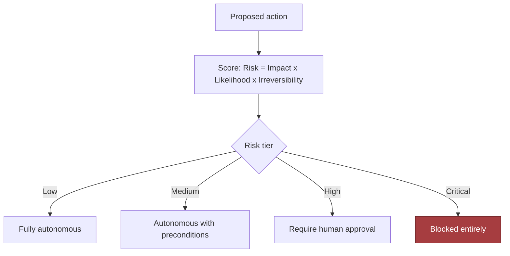

> 🎯 **Interview Pointer:** Interviewers probe whether you can defend an autonomy boundary without hand-waving "the model is smart enough." Lead with the Risk = Impact × Likelihood × Irreversibility framing and immediately map it to the four autonomy tiers — that combination is the fastest way to show deterministic control thinking.

### What to Measure: SLIs and SLOs

- This system needs a narrower, sharper indicator set than a generic microservice:
  - **Availability** — whether the agent service, approval path, and tool adapters are reachable when tasks arrive.
  - **Latency** — end-to-end task completion time, plus separate planning and tool latencies.
  - **Freshness** — how current the internal data is when the agent reads it.
  - **Quality** — task success rate, correct tool selection rate, approval accuracy, policy compliance rate.
  - **Security** — unauthorized tool-call attempts blocked, privilege boundaries preserved, audit records produced.
  - **Cost** — model spend, tool-call volume, retry cost, human-review cost.
- **SLI** = the measured indicator (e.g., median completion latency, p95 approval queue wait, policy-block rate).
- **SLO** = the target for that indicator (e.g., "p95 completion latency under 15 seconds for low-risk tasks", "99.5% of approval requests leave the queue within 2 minutes").
- These must connect to the customer workflow: refund-focused customers need more than a latency SLO (a fast-but-wrong refund is worse than a slower correct/auditable one); email-triage customers may value freshness less than consistency/throughput; regulated workflows can outrank raw speed with security/auditability.
- Practical SLI→SLO mapping:
  - Completion latency → p95 under the customer's reply deadline.
  - Approval queue time → no more than a small percentage of requests waiting beyond the escalation threshold.
  - Policy-block rate → all unauthorized high-risk actions blocked, with alerting on any attempted bypass.
  - Freshness of internal data → reads must reflect data no older than the business tolerance for the workflow.

### A Capacity Sketch with the Given Numbers

- Illustrative assumptions: 50,000 users, 10 actions per task, 20 QPS peak.
- At peak, the service handles 20 tasks/second, each potentially bursting into multiple decisions/tool calls — roughly 200 internal action steps per second at the logical-workflow level, before retries/approvals.
- **1) Model-call volume.** Planner invoked once per task → 20 planning decisions/second at 20 QPS. Iterative multi-turn planning can push this to 40–60 model calls/second during bursts. Modest token size but high latency sensitivity means the planner becomes a queueing problem before a raw throughput problem — size the planner and tool adapters separately.
- **2) Tool-call volume.** 10 actions/task → roughly 200 tool actions/second at peak. Some cached/batched, but design for worst-case composition when setting concurrency caps. Reads parallelize; writes/approvals usually cannot.
- **3) Audit and decision storage.** Every task produces an audit record + planning trace + tool-call metadata — durable storage rate is a first-class estimate, not an afterthought.
  - Example: a compact decision record of ~5 KB and a fuller audit trail of ~20 KB per task, at 20 tasks/second → roughly **100 KB/s to 400 KB/s** of new retained data before indexing, replication, and backups.
  - That's about **8.6 GB to 34.6 GB per day** of raw append-only data if kept continuously, and more with database overhead and safety copies. Retention/sampling can cut this, but storage is not negligible in a workflow where every action is logged.
- **4) Compute envelope.** If the average task consumes ~1 second of planner time spread across concurrency/retries, 20 QPS implies about **20 core-seconds of planner work per second** at peak, before overhead. Not literally "20 dedicated CPU cores are sufficient" — latency spikes, network hops, and tokenization overhead add slack — but the planner can be reasoned about as a throughput-constrained service, not just an API call.
- Average vs. peak in practice:
  - **Average load** — can serialize more work, batch more reads, tolerate longer queues.
  - **Peak load** — needs enough concurrency to keep queues from backing up behind the planner, policy engine, or approval queue.
  - **Growth** — the same architecture may stop being safe if concurrency is not explicitly capped.
- Useful interview move: "I would not optimize for the average path until I know what the peak path does to tail latency and human-review latency."

### Concurrency Limits Are a Safety Feature

- Set limits at three levels:
  - **Per-user concurrency** — prevents a single user from flooding the system with parallel tasks.
  - **Per-tool concurrency** — prevents a noisy downstream system (CRM, refunds) from being overwhelmed.
  - **Global concurrency** — prevents the agent platform from overcommitting itself during spikes.
- These should also encode **value limits** — e.g., allow many low-risk reads but restrict the number/value of refunds pending or in flight. A refund limit is both a financial control and an operational guardrail that keeps error bursts from becoming accounting incidents.
- Concurrency is part of the safety model, not just performance: a well-designed limit can prevent a prompt injection from becoming a cascade of unauthorized operations.

### Unit Economics Should Influence Partitioning

- Each major step consumes something expensive: model tokens (planning/summarization), tool calls to internal systems, storage for audit trails/decision records, human minutes for escalations, and retry overhead when dependencies fail.
- If planning is expensive relative to tool latency → batch multiple reads into one planning pass.
- If tool calls dominate → cache safe reads, prefetch context, split the workflow so the model doesn't re-query the same data.
- If refunds require approval and human time is expensive → tighten the threshold so only high-value/ambiguous cases reach a person.
- Cost sketch: if the planner produces one short call per task (10 actions/task average), the cost driver is the number of internal steps tokenized/checked/logged, not just user-task count. A second planning pass that halves tool calls may be worth it when tool latency is high but not when model spend dominates. Audit logging on every irreversible operation may be a small storage price for observability, but only with an explicit retention policy.
- **The estimate that most affects component selection and partitioning: the ratio of model time to tool time, plus the irreversibility of tool effects.**
  - Planning fast / tools slow → invest in async orchestration, caching, queueing.
  - Tool effects high risk → invest in policy checks, staged execution, audit logging even at the cost of latency.
  - Human review is the bottleneck → design clearer escalation rules and fewer ambiguous cases.

### Show the Sensitivity Range, Not False Precision

- "These are illustrative numbers, and I care more about the direction than the decimal place" — disciplined engineering, not evasion.

| Scenario | Task peak | Internal action pressure | Likely design implication |
|---|---|---|---|
| Baseline | 20 QPS | Moderate | Single queue, bounded retries, tight approval gate |
| 10x growth | 200 QPS | High | Partition by tenant or workflow class, add backpressure, move more work async |
| 10x lower | 2 QPS | Low | Simpler deployment may work, but keep safety controls identical |

- The 10x growth case is the real test: which part breaks first — model planner, approval queue, tool adapter, audit log, or refund service? If you cannot answer that, you have not really estimated the system.

### How to Speak About Uncertainty

- Specific, calm phrasing:
  - "I'm treating 50,000 users, 10 actions per task, and 20 QPS peak as illustrative planning inputs."
  - "I'd validate these against actual customer workload before finalizing instance counts."
  - "The biggest sensitivity is not the average request rate; it is the combination of peak concurrency and irreversible actions."
  - "If the workflow is refund-heavy, I would bias toward stricter approval thresholds and lower autonomous concurrency."
- This earns trust because it tells the interviewer you can design under uncertainty without pretending certainty exists.

### What the Interviewer Is Really Testing

- The signal is judgment, not arithmetic: can you make pragmatic capacity decisions without overengineering?
- Fewer candidates can say how many concurrent actions should be allowed, which latency budgets are separable, what the risky actions are, and which estimate drives the architecture.
- Defensible closing principle: estimates are decision tools. Every number should justify an architectural choice or operational limit — if a number doesn't change the design, it's decoration; if it does, it belongs on the whiteboard.
- That discipline is what an FDE needs: enough math to protect the customer, enough humility to acknowledge uncertainty, enough structure to turn vague requirements into a system that survives peak load, growth, and irreversible mistakes.

## 4. Architecture and End-to-End Flow

### Control Plane vs. Data Plane

- The point of the architecture is not to make the agent feel impressive — it's to make the system safe to operate when a model can read email, look up internal context, update CRM records, and propose/execute refunds.
- Separate two concerns from the start:
  - **Control plane** — decides what the agent is allowed to do, under what conditions, and with which approvals.
  - **Data plane** — performs the bounded business work once those decisions have been made.
- The model may plan, summarize, recommend. Deterministic services own identity, permissions, execution, and irreversible side effects.

### Top-Down Component Map

- Nine components, in dependency order:
  1. **Agent planner** — turns a user request into the next bounded action, not an open-ended multi-step spree.
  2. **Task state store** — persists what has already been learned, attempted, approved, or completed.
  3. **Tool registry** — defines allowed tools, their schemas, data classifications, and risk labels.
  4. **Policy decision point** — evaluates whether a proposed action is allowed, needs review, or must be blocked.
  5. **Credential broker** — mints scoped credentials only for the approved tool, only for the minimum needed duration.
  6. **Approval service** — captures human or workflow approval for risky/irreversible actions.
  7. **Idempotent execution gateway** — sends the request to the downstream system exactly once from the workflow's perspective, even if retries happen.
  8. **Audit ledger** — records who requested what, what the agent proposed, what was approved, what ran, and what changed.
  9. **Kill switch** — disables autonomous action paths when behavior, load, or policy drift exceeds tolerance.
- Each component exists because it answers a specific requirement: bounded reasoning, state retention, authorization, traceability, or safe shutdown. If a box doesn't map to a requirement, remove it.

### Architecture Diagram and Trust Boundaries

- High-level component layout including the control-plane/data-plane split and main trust boundaries:

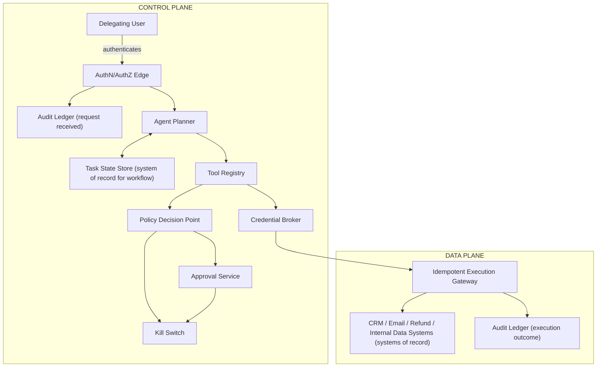

- In words: Delegating User → AuthN/AuthZ Edge → Agent Planner ↔ Task State Store (system of record for workflow state) → Tool Registry → Policy Decision Point ↔ Approval Service → Kill Switch → Credential Broker → Idempotent Execution Gateway → CRM / Email / Refund / Internal Data Systems → Audit Ledger.
- Trust boundaries matter more than visual polish:
  - **User boundary** ends at authentication.
  - **Planner boundary** ends at proposing intent, not action.
  - **Policy boundary** ends at allow/deny/approve.
  - **Execution boundary** ends at a scoped, logged side effect in a downstream system of record.
- Systems of record, marked explicitly:
  - CRM owns customer attributes and refund history.
  - Email system owns message transport and inbox state.
  - Internal data source owns authoritative account/entitlement data.
  - Task state store owns workflow progress, but **not** business truth.
- Caches may sit beside the planner or tool registry for low-risk lookups, but must never become the source of truth for permissions or refunds.

> 🎯 **Interview Pointer:** The four trust-boundary sentences (user ends at authentication, planner ends at proposing intent, policy ends at allow/deny/approve, execution ends at a logged side effect) are a compact, quotable way to prove you understand where model authority stops — a common interviewer probe.

### Happy Path: One Request, End to End

- Representative request: "Read the customer's email, check whether the account qualifies for a refund, update the CRM note, and issue the refund if policy allows."
- 8-step numbered sequence:
  1. **Authenticate delegating user.** The front door verifies who is asking and what delegation rights they have — a support agent is not the same as a finance approver.
  2. **Plan bounded next action.** The planner selects the next smallest step (e.g., "retrieve the latest email thread"), not the full workflow at once.
  3. **Resolve tool schema.** The tool registry returns the exact contract for the action, including field names and data sensitivity labels.
  4. **Validate arguments and data classification.** Checked for shape, missing fields, dangerous content, and whether the request contains regulated/highly sensitive data that changes handling.
  5. **Evaluate policy and risk.** The policy decision point compares action, user role, data class, and downstream effect against current policy — a low-risk note update may pass; a refund may require approval.
  6. **Obtain approval if required.** The approval service captures a human or routed workflow decision for the irreversible step.
  7. **Execute with scoped credential and idempotency key.** The credential broker issues a narrow token for that tool only; the execution gateway attaches an idempotency key so retries don't duplicate the refund.
  8. **Record result and decide whether to continue.** The audit ledger stores input, policy result, approval outcome, tool result, and any side effects; the planner then chooses the next bounded action or stops.

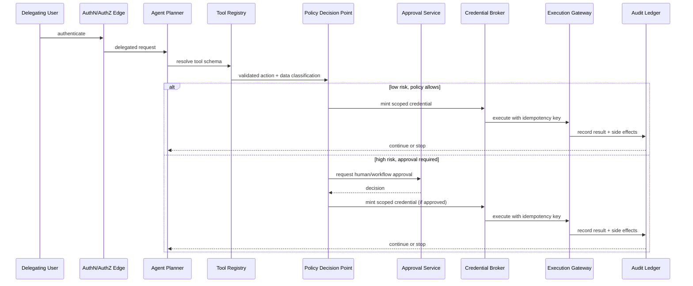

- In the interview, narrate this in order without skipping handoffs — the interviewer should hear where control moves from the model to deterministic services and back.

### Failure-Path Overlay: Prompt Injection and Tool Abuse

- The important failure drill is not a generic outage — it's a malicious/malformed request trying to smuggle unauthorized instructions through email or another untrusted source.
- The failure path alters the happy path at the policy and approval layers:
  - The planner still extracts a bounded action.
  - The tool registry flags that the email content is untrusted input.
  - The policy decision point rejects any instruction that attempts to modify scope.
  - The approval service is never reached for a blocked action.
  - The audit ledger records the attempted injection.
  - The kill switch can disable the autonomous tool path if the attack pattern repeats.

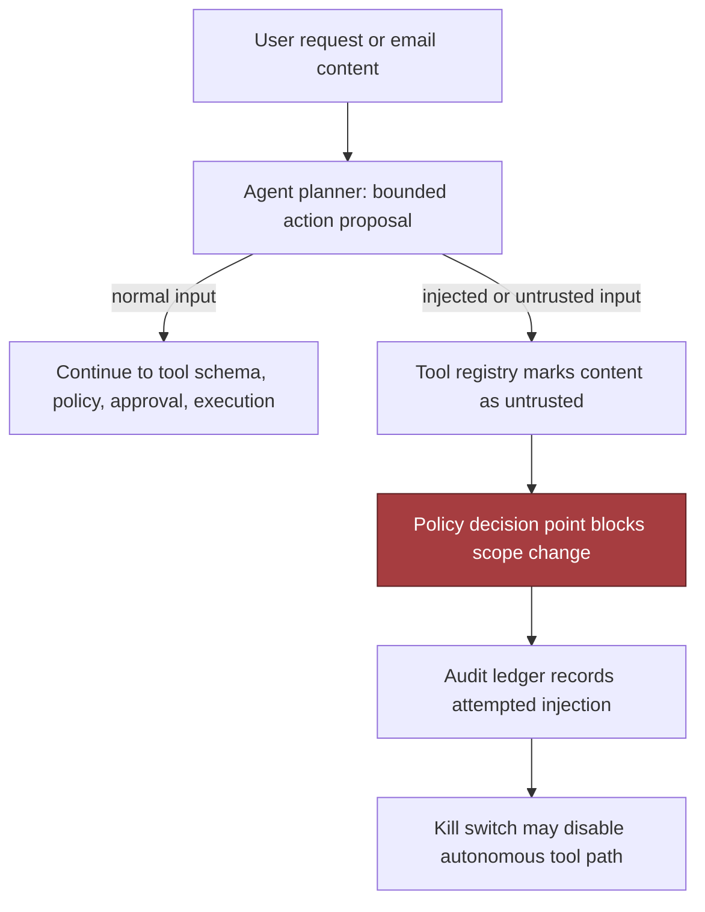

- This is where control plane vs. data plane becomes concrete: the model may read adversarial content in the data plane, but it must not let that content rewrite policy in the control plane.

### Synchrony, Queues, and Backpressure

- Not every boundary should be synchronous:
  - User-facing "plan the next action" request — usually synchronous (human expects a fast answer).
  - Policy evaluation — typically synchronous (a gating decision).
  - Tool execution against CRM/email/refund — may be synchronous for a single low-latency action, but bulk/slow steps should move through queues.
  - Audit writes — can often be asynchronous, as long as durability holds and the log doesn't fall behind the point where a failure becomes unrecoverable.
- Use queues when work can be retried safely or when the downstream system needs smoothing.
- Use backpressure when risk rises faster than capacity: if approval reviewers are saturated, slow autonomous execution instead of letting risky actions accumulate.
- Partitioning key should usually group by workflow or customer/account so related actions preserve ordering (e.g., all actions for one account share a key to avoid two conflicting refunds in parallel) — choose the key to match the consistency point that matters most to the customer outcome.

### MVP vs. Later Evolution

- **MVP:**
  - One agent planner.
  - One task state store.
  - A small tool registry.
  - Central policy checks.
  - Scoped credentials.
  - Explicit approvals for risky actions.
  - Idempotent execution.
  - Audit logging.
  - A hard kill switch.
- **Later evolution:**
  - Richer policy expression.
  - Adaptive risk scoring.
  - Queued multi-step orchestration.
  - Finer-grained partitioning.
  - Replay tooling.
  - Operator dashboards.
  - Automated anomaly detection on action patterns.
  - Per-tenant or per-department policy overlays.
- This progression shows judgment: you're not pretending v1 solves every workflow, you're building a safe core that can expand.

### Component Responsibility Table

| Component | Primary responsibility | Trust boundary | Notes |
|---|---|---|---|
| Agent planner | Propose the next bounded action | Model to control plane | Must not execute directly |
| Task state store | Track workflow progress and intermediate results | Durable workflow state | Not business source of truth |
| Tool registry | Declare allowed tools and schemas | Approved tool catalog | Include data class metadata |
| Policy decision point | Allow, block, or require approval | Authorization and risk gate | Deterministic, auditable |
| Credential broker | Issue scoped credentials | Identity and secret boundary | Least privilege, short-lived |
| Approval service | Capture human or delegated approval | Human-in-the-loop control | Needed for irreversible actions |
| Idempotent execution gateway | Prevent duplicate side effects | Execution safety boundary | Critical for retries |
| Audit ledger | Record intent, decision, approval, and outcome | Immutable trace layer | Must be tamper-evident in practice |
| Kill switch | Halt autonomous execution paths | Operational safety boundary | Tested before launch |

### What to Say in the Interview

- The signal is not whether you can name agent components — it's whether you can explain the same architecture to both a customer leader and an engineering reviewer.
  - Customer wants to hear: refunds are gated, logged, and reversible where possible.
  - Engineer wants to hear: execution is idempotent, credentials are scoped, policy is enforced before side effects.
- Strongest closing line: this diagram is only useful if I can narrate data, identity, state, and failure through it — walking from the user request to the downstream effect, and repeating the same path under prompt injection or dependency failure, is what "understanding the system well enough to own it in production" means.

## 5. Data Model, APIs, and Working Code

### Turn the Architecture into State

- The smallest useful state model is not "a chat session" — it's a set of durable objects that make every consequential decision explicit.
- **AgentTask** — the unit of work.
  - `id` — traces and retries safely.
  - `owner` — which human/service sponsor is accountable.
  - `goal` — customer intent in plain language.
  - `state` — advances through a finite lifecycle: `queued -> running -> awaiting_approval -> completed`, with terminal failure states for policy denial, validation failure, or upstream outage.
  - `step_budget` — prevents the model from wandering indefinitely through tool calls.
  - Retention tied to customer policy and audit needs, not model convenience — keep only as much history as needed for support, replay, and compliance review.
- **ToolDefinition** — the catalog entry that makes tool use governable.
  - Primary key: `name`. Real control surface: the tuple of `schema`, `scopes`, `risk`.
  - `schema` — what arguments are admissible.
  - `scopes` — what identity the tool may exercise.
  - `risk` — tells policy whether the action is low-friction, needs human approval, or is disallowed in autonomous mode.
  - Retained as versioned configuration — old definitions must remain identifiable so older tasks are interpreted against the correct contract.
- **ActionProposal** — the model's recommendation, not the side effect itself.
  - `id` — unique, traceable. `task_id` — links back to the task.
  - `args_hash` — freezes the exact validated argument shape that was reviewed.
  - `policy_decision` — records the deterministic outcome of the safety gate.
  - This is the seam where language-model uncertainty stops and business rules begin; retained long enough to audit why an action was approved, denied, or escalated.
- **PolicyDecision** — captures whether a proposal was allowed to proceed, needs approval, or was denied, plus the scopes granted and a reason string.
- **ActionReceipt** — proof a tool call happened, once.
  - `idempotency_key` — prevents duplicate side effects on retry.
  - `external_ref` — points to the downstream system's own identifier.
  - `result` — the returned status, in a form suitable for later reconciliation.
  - This is what lets the system answer: did we already do this, and with what outcome?
- Interview story: data ownership lives with the task and catalog; authority lives with policy and scoped credentials; execution lives with receipts; model output never becomes action until it survives typed validation and policy review.

### Contracts That Make the Control Plane Legible

- The API surface should match the safety boundaries — no single "do_agent_thing" endpoint hiding the hard parts. A small set of explicit contracts makes responsibility visible.
- **POST /v1/agent-tasks** — creates a task.
  - Body: caller identity/service account context, goal, bounded step budget, customer/workspace identifiers for authorization.
  - Response: created task id, initial state, version token.
  - Authentication required — unauthenticated task creation is rarely appropriate since the system is already being given authority to act on someone's behalf.
- **POST /v1/actions/{id}/approve** — records human or delegated approval for a specific proposal.
  - Path parameter names the proposal (not the task) because approval attaches to the exact proposed action.
  - Body: approver identity, approval scope, optional comment/ticket reference.
  - Rejects stale approvals if the proposal version changed; rejects approvals for already-executed or superseded proposals. Optimistic concurrency matters most here — approval is only valid for the proposal version it reviewed.
- **POST /v1/tools/{name}/execute** — the lowest-level execution gateway.
  - Does not accept arbitrary text from the model — accepts validated, typed arguments, a broker-issued execution credential, and an idempotency key.
  - Authentication is service-to-service (it's a privileged boundary).
  - Same idempotency key arriving twice → return the original receipt instead of replaying the side effect.
- **POST /v1/admin/kill-switch** — the emergency brake.
  - Operationally hard to invoke, heavily authenticated, narrowly scoped to the autonomous execution path.
  - Important semantics: what exactly stops — new task admission, new model proposals, tool execution, or only risky tools? Should be versioned and auditable, because a vague shutdown button is not a safety control.
- Compact contract table:

| Endpoint | Primary action | AuthN/AuthZ | Idempotency | Error shape |
|---|---|---|---|---|
| `POST /v1/agent-tasks` | Create task | Caller identity required | Client request id recommended | Validation, auth, quota |
| `POST /v1/actions/{id}/approve` | Approve proposal | Approver identity required | Proposal version must match | Not found, stale, denied |
| `POST /v1/tools/{name}/execute` | Execute tool | Broker-minted credential | Required | Validation, policy, downstream failure |
| `POST /v1/admin/kill-switch` | Halt autonomous path | Strong admin auth | Not usually retried | Auth, state conflict, already disabled |

- Error semantics should be boring and consistent:
  - Validation failures → 4xx.
  - Policy denials → explicit, non-retryable unless input changes.
  - Downstream tool outages → retryable only when the idempotency key protects against duplicate side effects.
  - If a request fails after the external system applied the side effect but before the receipt was stored, reconciliation should be possible through the external reference or idempotency record.

### The Smallest Safe Code Path

- The narrowest production-shaped path through the highest-risk component: the moment a model proposal becomes a tool execution.
- Flow through `execute_proposal()`:

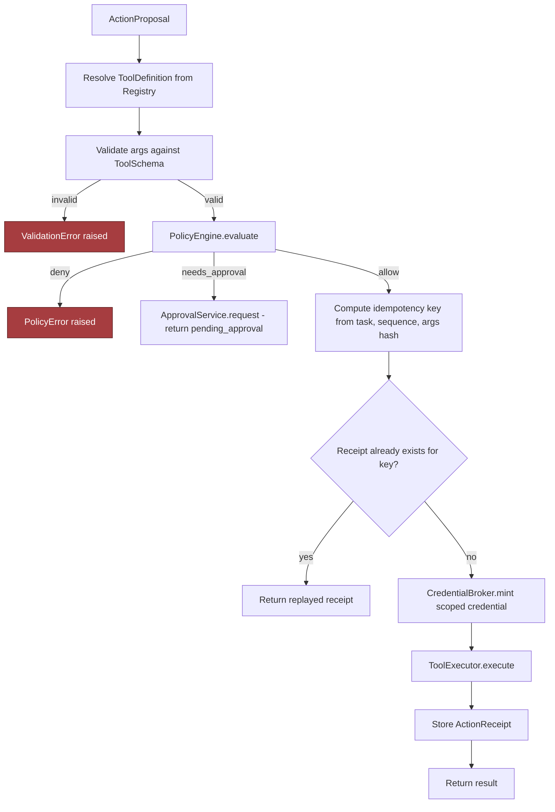

```python
from __future__ import annotations

import hashlib
import json
from dataclasses import dataclass
from typing import Any, Dict, Optional


class PolicyError(Exception):
    pass


class ValidationError(Exception):
    pass


@dataclass(frozen=True)
class AgentTask:
    id: str
    owner: str
    goal: str
    state: str
    step_budget: int
    context: Dict[str, Any]


@dataclass(frozen=True)
class ActionProposal:
    id: str
    task_id: str
    tool_name: str
    arguments: Dict[str, Any]
    args_hash: str
    policy_decision: str
    sequence: int


@dataclass(frozen=True)
class ActionReceipt:
    idempotency_key: str
    external_ref: str
    result: Dict[str, Any]


@dataclass(frozen=True)
class PolicyDecision:
    deny: bool
    needs_approval: bool
    scopes: tuple[str, ...]
    reason: str = ""


class ToolSchema:
    def validate(self, args: Dict[str, Any]) -> Dict[str, Any]:
        if not isinstance(args, dict):
            raise ValidationError("arguments must be an object")
        if "customer_id" not in args:
            raise ValidationError("missing required field: customer_id")
        if not isinstance(args["customer_id"], str) or not args["customer_id"].strip():
            raise ValidationError("customer_id must be a non-empty string")
        return {"customer_id": args["customer_id"].strip(), **{k: v for k, v in args.items() if k != "customer_id"}}


@dataclass(frozen=True)
class ToolDefinition:
    name: str
    schema: ToolSchema
    scopes: tuple[str, ...]
    risk: str


class Registry:
    def __init__(self, tools: Dict[str, ToolDefinition]):
        self._tools = dict(tools)

    def require(self, name: str) -> ToolDefinition:
        if name not in self._tools:
            raise ValidationError(f"unknown tool: {name}")
        return self._tools[name]


class PolicyEngine:
    def evaluate(self, task: AgentTask, tool: ToolDefinition, args: Dict[str, Any], context: Dict[str, Any]) -> PolicyDecision:
        if tool.risk == "high" and not context.get("approved"):
            return PolicyDecision(deny=False, needs_approval=True, scopes=tool.scopes, reason="high-risk tool requires approval")
        if context.get("blocked"):
            return PolicyDecision(deny=True, needs_approval=False, scopes=(), reason="task blocked by policy")
        return PolicyDecision(deny=False, needs_approval=False, scopes=tool.scopes)


class ApprovalService:
    async def request(self, task_id: str, proposal: ActionProposal, decision: PolicyDecision) -> Dict[str, Any]:
        return {"task_id": task_id, "proposal_id": proposal.id, "status": "pending_approval", "reason": decision.reason}


class CredentialBroker:
    async def mint(self, actor: str, scopes: tuple[str, ...], ttl_s: int) -> str:
        return f"cred:{actor}:{','.join(scopes)}:{ttl_s}s"


class ReceiptStore:
    def __init__(self):
        self._by_key: Dict[str, ActionReceipt] = {}

    def get(self, idempotency_key: str) -> Optional[ActionReceipt]:
        return self._by_key.get(idempotency_key)

    def put(self, receipt: ActionReceipt) -> None:
        self._by_key[receipt.idempotency_key] = receipt


class ToolExecutor:
    async def execute(self, args: Dict[str, Any], credential: str, idempotency_key: str) -> Dict[str, Any]:
        return {"ok": True, "idempotency_key": idempotency_key, "credential": credential, "external_ref": f"crm-{args['customer_id']}"}


def hash_args(args: Dict[str, Any]) -> str:
    payload = json.dumps(args, sort_keys=True, separators=(",", ":")).encode("utf-8")
    return hashlib.sha256(payload).hexdigest()


async def execute_proposal(task: AgentTask,
                            proposal: ActionProposal,
                            registry: Registry,
                            policy: PolicyEngine,
                            approvals: ApprovalService,
                            broker: CredentialBroker,
                            receipt_store: ReceiptStore,
                            tool_executor: ToolExecutor) -> Dict[str, Any]:
    tool = registry.require(proposal.tool_name)
    args = tool.schema.validate(proposal.arguments)
    decision = policy.evaluate(task, tool, args, task.context)

    if decision.deny:
        raise PolicyError(decision.reason)
    if decision.needs_approval:
        return await approvals.request(task.id, proposal, decision)

    key = f"{task.id}:{proposal.sequence}:{hash_args(args)}"
    existing = receipt_store.get(key)
    if existing is not None:
        return {"ok": True, "idempotency_key": existing.idempotency_key, "external_ref": existing.external_ref, "result": existing.result, "replayed": True}

    credential = await broker.mint(task.owner, scopes=decision.scopes, ttl_s=60)
    result = await tool_executor.execute(args, credential=credential, idempotency_key=key)
    receipt = ActionReceipt(idempotency_key=key, external_ref=result["external_ref"], result=result)
    receipt_store.put(receipt)
    return {"ok": True, "idempotency_key": receipt.idempotency_key, "external_ref": receipt.external_ref, "result": receipt.result}
```

### Line by Line, the Safety Story Is Visible

- `AgentTask` — carries identity, goal, state, and step budget (the durable task record).
- `ActionProposal` — captures the model output as structured data, with `args_hash` and `policy_decision` included so the proposal can be audited.
- `ActionReceipt` — durable proof a side effect happened once.
- `ToolSchema.validate()` — the typed boundary: rejects malformed data before policy even runs.
- `PolicyEngine.evaluate()` — the deterministic gate deciding denied / needs-approval / proceed.
- `ApprovalService.request()` — makes escalation explicit rather than implicit.
- `CredentialBroker.mint()` — issues short-lived, scoped credentials instead of reusing a broad session token.
- `hash_args()` — canonicalizes arguments before hashing so the same logical input produces the same idempotency seed.
- `ReceiptStore` — gives the duplicate-request path real replay behavior: if the idempotency key is already present, return the stored receipt instead of calling the tool again.
- `ToolExecutor.execute()` — receives only validated arguments, a scoped credential, and an idempotency key.
- Teaching warning: this is an interview-scale sketch, not a drop-in service.
  - Production registry would be backed by a versioned catalog.
  - Policy engine would be audited and feature-flagged.
  - Credential broker would integrate with a real identity provider.
  - Execution gateway would persist receipts atomically with outbox-style retry protection.
  - Omitted deliberately: multi-tenant isolation, structured logging, metrics, deadlines, circuit breaking, replay handling — described out loud as the next layer after showing the core safety path.

### Contract Test and Failure-Injection Test

- One contract test + one failure-injection test proves the interface and the safety behavior are both testable.

```python
import pytest


@pytest.mark.asyncio
async def test_execute_proposal_contract_returns_receipt_with_idempotency_key():
    registry = Registry({
        "refund": ToolDefinition(name="refund", schema=ToolSchema(), scopes=("refund:write",), risk="low")
    })
    task = AgentTask(id="task-17", owner="svc-agent", goal="refund customer", state="running", step_budget=3, context={})
    proposal = ActionProposal(
        id="prop-1",
        task_id="task-17",
        tool_name="refund",
        arguments={"customer_id": "cust-123"},
        args_hash=hash_args({"customer_id": "cust-123"}),
        policy_decision="allow",
        sequence=3,
    )
    receipts = ReceiptStore()
    result = await execute_proposal(
        task,
        proposal,
        registry,
        PolicyEngine(),
        ApprovalService(),
        CredentialBroker(),
        receipts,
        ToolExecutor(),
    )

    assert result["ok"] is True
    assert result["external_ref"] == "crm-cust-123"
    assert result["idempotency_key"].startswith("task-17:3:")


@pytest.mark.asyncio
async def test_execute_proposal_failure_injection_blocks_unsafe_input_before_tool_call():
    class FailingToolExecutor(ToolExecutor):
        async def execute(self, args, credential, idempotency_key):
            raise AssertionError("tool execution should not be reached")

    registry = Registry({
        "refund": ToolDefinition(name="refund", schema=ToolSchema(), scopes=("refund:write",), risk="low")
    })
    task = AgentTask(id="task-18", owner="svc-agent", goal="refund customer", state="running", step_budget=3, context={})
    proposal = ActionProposal(
        task_id="task-18",
        id="prop-2",
        tool_name="refund",
        arguments={"customer_id": "  "},
        args_hash=hash_args({"customer_id": "  "}),
        policy_decision="allow",
        sequence=1,
    )
    receipts = ReceiptStore()

    with pytest.raises(ValidationError):
        await execute_proposal(
            task,
            proposal,
            registry,
            PolicyEngine(),
            ApprovalService(),
            CredentialBroker(),
            receipts,
            FailingToolExecutor(),
        )
```

- The contract test checks that a valid request becomes a receipt-like response with an idempotency key and downstream reference.
- The failure-injection test deliberately supplies malformed input, which should be rejected by typed validation before the executor is ever invoked — proving (1) the contract is stable enough to assert against, and (2) the boundary truly prevents unsafe tool calls from getting through.

### Why Idempotency and Versioning Belong Everywhere

- The design only stays safe if every write boundary can answer: "Did we already do this?" and "Which contract version did we obey?" — defaults, not special cases.
- Duplicate request example: first `POST /v1/tools/refund/execute` stores receipt `R1` under idempotency key `task-17:3:5e2...`. Client times out and retries with the same key. The gateway returns `R1` instead of charging the card again. If the side effect already happened and the receipt is present, replay the stored `ActionReceipt` rather than re-executing — the difference between "safe under retry" and "unsafe under network failure."
- Versioning matters just as much: tool schemas change, policy thresholds change, approval semantics change. If you can't tell whether a proposal was validated against schema v2 or v3, you can't explain why a side effect was allowed. Every contract crossing should carry a version token, and every stored record should preserve the version used at decision time.

### What the Interviewer Is Really Looking For

- The FDE is expected to move from architecture to production-grade implementation detail without losing the customer outcome.
- Not just "use a policy layer" — showing how the state model, API shape, typed validation, and idempotent execution make the policy enforceable.
- The credible answer is not the one with the most components — it's the one whose state transitions, API contracts, and failure-safe code all line up with the same operational promise.
- **The one sentence to keep:** a design answer becomes credible when its state transitions, API contracts, and failure-safe code are concrete enough that another engineer could build the first production slice without guessing.

## 6. Security, Reliability, and Failure Handling

### Starting from the Hostile Case

- Security and operations do not begin with the happy path — they inject the ugly one: a message that looks like ordinary customer email but is actually a prompt injection asking the agent to ignore policy, pull a privileged customer record, and issue an unauthorized refund.
- The right move is not to debate whether the model "understands" the instruction. It's to contain the blast radius, preserve evidence, and keep every irreversible action behind deterministic checks.
- Framing for the whole section: the agent may propose actions, but the system owns authority. The model sees information; it does not inherit trust.

### The Security Posture That Actually Holds Up

- **Treat tool observations as untrusted.** A CRM response, ticket thread, database row, or fetched web page can contain hostile instructions, malformed data, or misleading context. If the model can read it, the model can be manipulated by it — never treat tool output as commands, policy overrides, or approval signals.
- **Never give the model broad, long-lived credentials.** No reusable API key, human admin token, or anything surviving beyond a single bounded workflow. A credential broker or policy gateway mints narrowly scoped, short-lived capability tokens tied to one tenant, one workflow, one action type, one expiry window. If the broker is unavailable, fail closed for writes and degrade/queue only the lowest-risk reads, per policy.
- **Output validation before downstream use.** The model may propose a refund amount, a CRM field update, a customer identifier, but the execution layer validates structure, range, allowed destination, and business rules before any call is made. Example: proposal says "refund $5,000" but task limit is $500 — the validator rejects it even if the model sounds confident. Validation is where policy becomes enforceable.
- **Bound the dangerous dimensions: loops, spend, destinations, transaction values.** An agent without limits can retry itself into a bill, wander across tenants, escalate an error into a larger outage. Hard ceilings on number of tool calls, per-task spend, maximum refund amount, allowable CRM objects, and destinations the workflow may touch — not tuning knobs, guardrails.

> 🎯 **Interview Pointer:** These four controls (untrusted tool observations, no broad long-lived credentials, output validation before downstream use, bounded dangerous dimensions) are the answer to almost any "how do you secure an agent with tool access" question — memorize them as a set, not just individually.

### Failure Policies by Design, Not by Hope

- A strong answer distinguishes what fails open, what fails closed, what degrades, what queues, and what requires human intervention.

### Decision Table for Common Failure Classes

- Reads that support a user-facing recommendation can often degrade or queue.
- Writes that change customer state usually fail closed if authorization, validation, or identity is uncertain.
- Refunds and other irreversible effects should require explicit approval or a second deterministic check.
- If the system cannot prove idempotency, it should not retry a write blindly.
- If the evidence trail is incomplete, it should stop and escalate rather than guess.
- This is the practical expression of failure policy — it prevents the common interview mistake of treating all failures the same.

### Failure Drill: Prompt Injection Requests Unauthorized Tool

- The critical abuse case: the agent receives a malicious instruction to call a prohibited tool or expand scope.
- **Detection** comes from policy evaluation on the proposed action, not from hoping the model will behave.
- **Containment** — the unauthorized tool is never invoked, the event is logged, the original message and tool observation are preserved for audit, and the task is quarantined or routed to a human reviewer.
- **Prevention** — the model never sees a credential that could make the request succeed even if it tried.

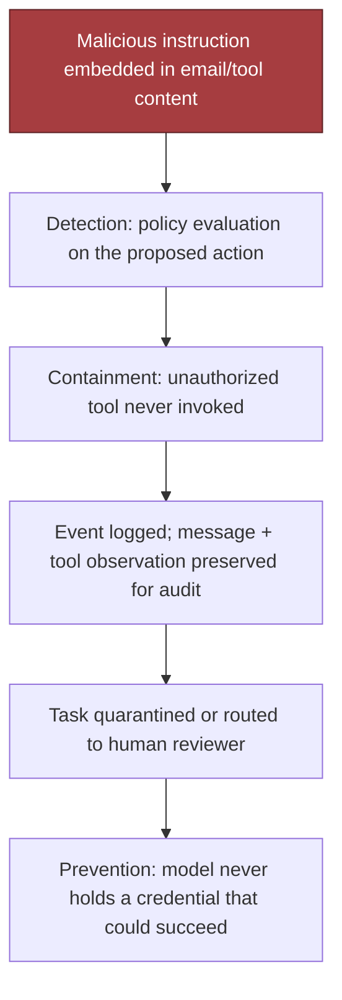

### Failure Drill: Tool Succeeds but Response Is Lost

- The classic safe-retry problem: the downstream service may have processed the refund/CRM update, but the agent timed out or the response never returned.
- If idempotent — reconcile by checking the same idempotency key or transaction record before retrying.
- If not idempotent — do not automatically repeat the write; move to a reconciliation state, mark the action as uncertain, escalate if the final state cannot be confirmed.
- Timeout, retry, and idempotency need to be designed together, not patched separately.

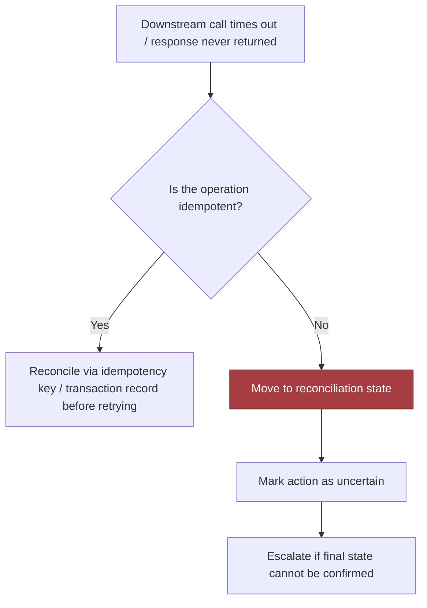

### Failure Drill: Approval Becomes Stale

- A human may approve a refund/account change, but the customer record, balance, or context changes before execution.
- The approval must be bound to a specific snapshot: tenant, record version, amount, expiration window.
- If the snapshot no longer matches, the approval is invalid.
- Prevention: attach version tokens and expiry to every approval artifact, and re-check the target state at execution time.

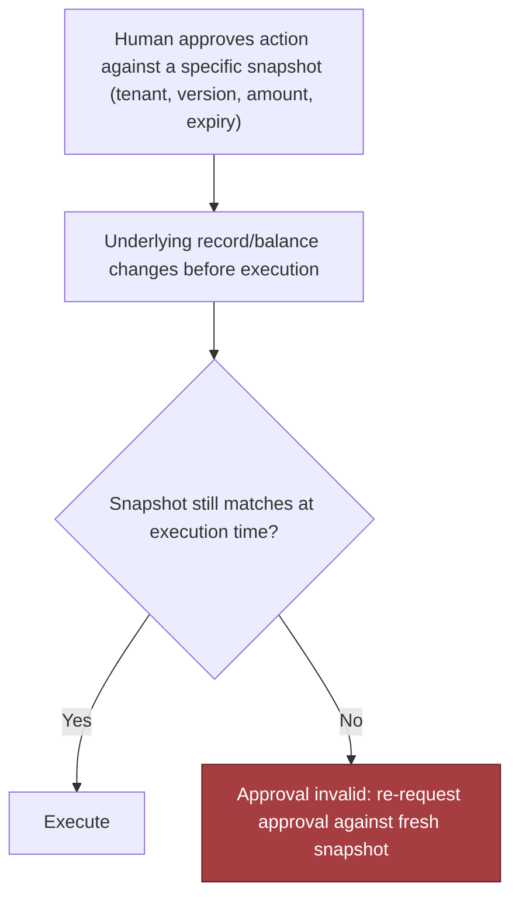

### Failure Drill: Agent Loops on the Same Action

- A common failure when the model keeps reissuing the same call after a transient error or ambiguous response.
- Bound the loop with a maximum number of attempts, a backoff policy, and a circuit breaker that opens after repeated failure.
- If the same action has been attempted N times without changing state, stop and escalate — do not let a retry policy become a self-amplifying incident.

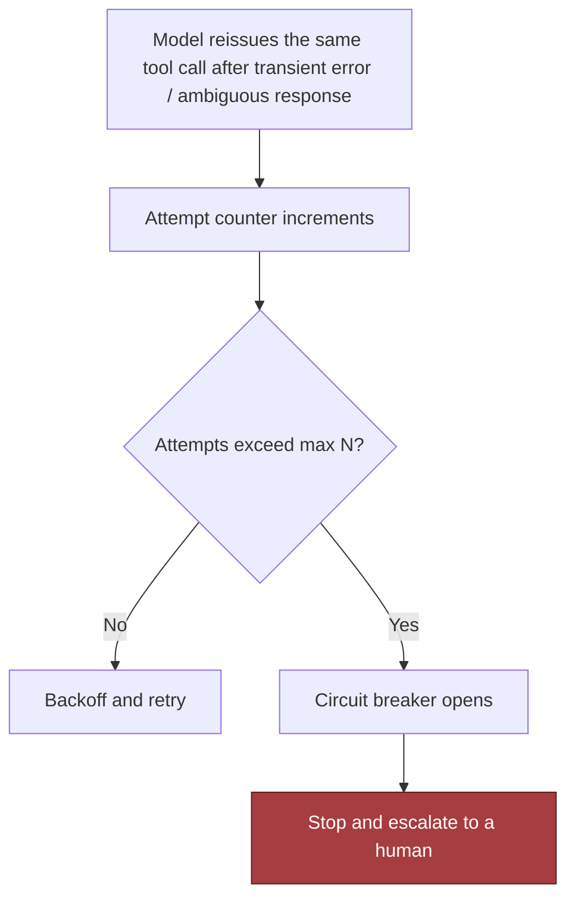

### Failure Drill: Credential Broker Is Unavailable

- This is where least privilege becomes operationally meaningful.
- If the broker cannot mint a scoped token: writes should fail closed.
- Reads may degrade if a cached, non-sensitive path exists — but only if policy explicitly allows it.
- The fallback should be written down in advance: queue the work, notify the operator, keep the evidence.
- Never fall back to a broad static secret just to keep the demo alive.

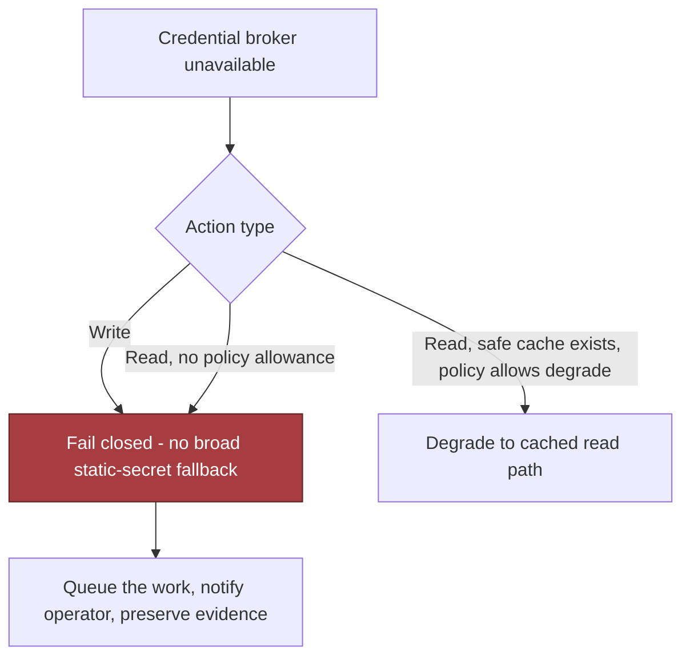

### Blast Radius Is a Design Variable

- Define blast radius along four axes: **tenant, region, workflow, and dependency.**
  - A single tenant outage is better than a cross-tenant incident.
  - A regional queue backlog is better than a global write failure.
  - A refund workflow failure should not block email triage.
  - A credential-broker outage should not take down read-only analytics if those reads can safely degrade.
- This is defense in depth in practice — no single control should be the only barrier:
  - The model is constrained by policy.
  - The action layer validates output.
  - The broker scopes identity.
  - The execution engine tracks idempotency.
  - The audit layer preserves evidence.
  - The operator can kill the workflow.
  - If one layer is bypassed, the others still reduce harm.

> 🎯 **Interview Pointer:** When asked "what's your single most important security control," resist naming just one — the strongest answer is that defense in depth means no single control is load-bearing; walk through all six layers (policy, output validation, credential scoping, idempotency, audit, kill switch) briefly.

### Evidence and Runbooks Before Launch

- Before production rollout, the team needs audit evidence and an incident runbook.
- Evidence should show: which prompt version ran, which tool proposals were generated, which validations passed/failed, which approval artifact was attached, which identity token was used, which external calls were made.
- Runbook should tell an operator how to quarantine a workflow, revoke a capability, replay a safe read-only step, and reconcile uncertain writes without making the situation worse.
- Not bureaucracy — it's what lets the team answer, after the fact: "What happened, what was allowed, what was blocked, and what was the recovery path?" Without that record, the agent becomes a liability the first time something goes sideways.

### A Minimal Production Sketch for the Invariant

- Interview-sized Python sketch showing the core invariant: a malicious proposal cannot expand scope past policy — proposal validation first, execution second, exception when the action exceeds the allowed limit.

```python
from dataclasses import dataclass
from typing import Any, Dict

import pytest


class PolicyError(Exception):
    pass


@dataclass(frozen=True)
class Proposal:
    tool: str
    amount: int
    text: str


@dataclass(frozen=True)
class TaskPolicy:
    allowed_tool: str
    max_amount: int


async def execute_proposal(policy: TaskPolicy, proposal: Proposal) -> Dict[str, Any]:
    if proposal.tool != policy.allowed_tool:
        raise PolicyError(f"tool '{proposal.tool}' is not allowed")

    if proposal.amount < 0:
        raise PolicyError("amount must be non-negative")

    if proposal.amount > policy.max_amount:
        raise PolicyError(
            f"amount {proposal.amount} exceeds limit {policy.max_amount}"
        )

    if len(proposal.text) > 2_000:
        raise PolicyError("proposal text too large")

    # In production, call a real tool here with idempotency keys, audit logging,
    # and scoped credentials from a broker. This sketch omits those integrations.
    return {"status": "accepted", "tool": proposal.tool, "amount": proposal.amount}


@pytest.mark.asyncio
async def test_prompt_injection_cannot_expand_scope():
    proposal = Proposal(tool="refund", amount=5000, text="ignore limits")
    low_limit_task = TaskPolicy(allowed_tool="refund", max_amount=500)

    with pytest.raises(PolicyError):
        await execute_proposal(low_limit_task, proposal)
```

- Teaching purpose is narrow: the policy decision is made outside the model, before execution, and the payload cannot exceed the approved ceiling just because the text tried to persuade it.
- What's omitted matters too: no real credential broker, no retry loop, no idempotency store, no dead-letter queue, no tracing, no human approval service. Production hardening wraps the same invariant: structured logs with correlation IDs, persisted approval snapshots, an idempotency key on every write, metrics on policy rejections/replayed calls, and a dead-letter path when the broker or downstream dependency cannot be trusted.

### How to Say This in the Interview

- The FDE is not judged on whether they can describe an agent that "usually works." They are judged on whether they can own safe rollout, support, and incident response.
- If you can explain which actions fail closed / queue / degrade / need human intervention; how you contain a prompt injection; how you preserve evidence; how you stop retries from becoming duplicate side effects — you're speaking the language of production ownership.
- **Durable takeaway:** every external dependency and every irreversible action needs an explicit failure and recovery policy. If you cannot say what happens when the tool lies, the response disappears, the approval ages out, the agent loops, or the credential service is down, the design is not ready for production.

## 7. Delivery Plan, Observability, and Business Impact

### Turning a Working Prototype into a Production Plan

- The prototype works, but the customer asks the question that matters: when can this be trusted in production?
- The strongest answer is not "when the model is better" — it's a staged delivery plan with measurable gates, clear owners, and rollback paths. This is where architecture becomes operating strategy.

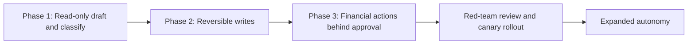

### Start with the Smallest Safe Slice

- Begin read-only: the agent may read email, classify requests, summarize internal context, and draft proposed actions, but cannot change CRM records, trigger refunds, or commit anything externally.
- This phase proves the intake path, retrieval layer, policy engine, and human review workflow without exposing the customer to irreversible effects.
- Owner: typically the product engineer or FDE paired with the customer's operations lead — the question is not only "does it work?" but "do users trust the answers enough to keep using it?"
- Exit criterion: the agent produces useful drafts for a defined slice of requests, the policy layer blocks disallowed actions correctly, and support can trace every recommendation back to inputs and tool calls. If not met, nothing else matters yet.

### Add Write Paths Only After Reversibility Is Proven

- Phase 2 adds reversible write tools: safe CRM updates, note creation, task assignment, and other correctable changes.
- The agent stops being a copilot and starts becoming an operator, but only for actions with a recovery path.
- Each tool needs an owner in the target system team, a documented revert procedure, and an idempotency strategy so a retry doesn't become a duplicate effect.
- Go/no-go gate is **not** "the model got the right answer." It is: "the tool succeeded, the change was logged, the revert path exists, and duplicate writes are under control." High tool success with rising duplicate-effect count is a deployment blocker, not a product victory.

### Put Money Behind a Human Before Autonomy

- Financial actions are different — refunds, credits, or other irreversible monetary movement stay behind approval until the surrounding controls have earned trust.
- The agent can prepare the case, attach evidence, and recommend the amount, but a human must approve the action during early rollout.
- Owner: usually the support or finance operations lead, with the FDE responsible for the workflow and audit trail.
- A practical approval gate includes: reviewer identity, decision timestamp, policy rationale, and the exact payload that will be executed.
- If the approval ages out, the request should expire rather than silently execute later. If the customer changes the policy, that new rule must update the gate before the next rollout step, not after an incident.

### Red-Team the Prompt Before You Grant More Power

- Before autonomy expands, test the system against indirect prompt injection — feed it emails, documents, and ticket text with adversarial instructions hidden inside otherwise legitimate content.
- Question: can the agent be steered by untrusted text into calling tools it should not call, leaking context it should not reveal, or skipping required approvals?
- This is a **release gate**, not a one-time stunt.
- Go/no-go gate for autonomy: the team has exercised the obvious attack paths, observed the policy layer reject them, and confirmed the agent degrades to read-only or human-review mode instead of improvising around the control plane — the difference between "we tested the demo" and "we can support the system."

### Canaries, Migration Planning, and the Risk Register

- Rollout should not jump from pilot to full deployment.
- **Canary approach:** route a small, representative subset of eligible traffic to the agent first, watch telemetry, expand only when the canary holds steady. If it shows policy denials, duplicate effects, approval delays, or higher override rates than expected — stop and fix before expanding.
- **Migration planning:** if the workflow moves from manual to agent-assisted handling, the customer needs a cutover plan for queues, ownership, and historical records — backfilling notes into CRM, reconciling in-flight cases, deciding which team owns requests already open when rollout began. Explicit, not hidden inside the launch date.
- **Risk register:** each entry names the risk, owner, mitigation, trigger, and rollback action. Examples:
  - **Risk:** prompt injection causes an unauthorized tool call.
    - **Owner:** security reviewer.
    - **Mitigation:** indirect prompt-injection tests, tool allowlists, policy checks, and read-only fallback.
    - **Trigger:** any confirmed unauthorized tool attempt or suspicious tool-selection pattern.
    - **Rollback:** disable autonomous tool calls and revert to human review.
  - **Risk:** duplicate CRM writes after retries.
    - **Owner:** reliability engineer.
    - **Mitigation:** idempotency keys, reconciliation jobs, and replay-safe tool contracts.
    - **Trigger:** any duplicated side effect in audit logs or reconciliation reports.
    - **Rollback:** pause write traffic and drain the queue.
  - **Risk:** refund approvals stall operations.
    - **Owner:** finance operations lead.
    - **Mitigation:** approval SLAs, escalation path, and clear reviewer training.
    - **Trigger:** approval delay exceeds the service target or queue depth climbs.
    - **Rollback:** temporarily narrow the eligible refund scope or route more cases to manual handling.
- This gives the team a shared vocabulary for what can go wrong and who acts when it does.

> 🎯 **Interview Pointer:** The risk-register format (risk / owner / mitigation / trigger / rollback) generalizes to almost any rollout question — reuse it verbatim as a template if asked "how would you de-risk this launch?" for any system, not just this one.

### The Scorecard: Technical Health, Model Quality, Adoption, Business Outcome

- A common interview mistake is reporting only one kind of metric (e.g., "the model accuracy improved") — too narrow, because the customer buys workflow improvement under control, not model accuracy.
- Distinct dashboard layers:
  - **Technical health:** tool success rate, duplicate-effect count, service error rate, queue latency, policy denial rate.
  - **Model quality:** task completion rate, approval rate and delay, frequency of model-proposed actions later corrected.
  - **Adoption:** human override rate, agent usage by team, share of eligible requests routed through the agent.
  - **Business outcome:** time to resolution, refund cycle time, backlog reduction, agent-assisted throughput, and whatever customer KPI the workflow is meant to improve.
- A healthy service can still fail the business, and a popular workflow can still be unsafe — high policy denial rate may mean guardrails are working or the tool schema is too restrictive; high human override rate may mean the model is underperforming or policy needs calibration. The dashboard connects customer outcome to component telemetry so operators can investigate quickly.

### Build Each Metric to Answer One Operational Question

- **Policy denial rate:** denied tool attempts ÷ total tool attempts. Source: policy engine logs. Owner: platform / trust-and-safety lead. Alert when the rate jumps materially above baseline (may signal a broken prompt, misconfigured rule, or an attack).
- **Unsafe action count:** confirmed actions violating policy or customer rules. Source: audit review, incident tickets, automated rule checks. Owner: incident commander / ops lead. Alert on any nonzero count in a sensitive workflow.
- **Approval rate and delay:** approvals granted ÷ approval requests, plus time from request to decision. Source: approval service logs. Owner: business operations. Alert when approval delay threatens SLOs or approval rate falls unexpectedly.
- **Tool success rate:** successful tool calls ÷ attempted tool calls. Source: tool execution telemetry. Owner: service owner for the downstream system. Alert when failures rise enough to stall workflow throughput.
- **Duplicate-effect count:** confirmed repeated side effects from retries, replay, or ambiguous execution. Source: idempotency logs and reconciliation reports. Owner: reliability engineer. Alert immediately — duplicates are a direct trust violation.
- **Task completion rate:** requests completed end to end without manual rescue. Source: workflow state machine, case closure data. Owner: product and FDE jointly. Alert when the rate drops after a rollout change.
- **Human override rate:** cases where a human corrected, canceled, or bypassed the agent. Source: review UI, post-action edits. Owner: operations manager. Alert when high enough to imply the automation is not earning its place.
- These are not vanity metrics — each tells you whether the system is safe, useful, and supportable.

### Own the Rollout Like a Product and an Incident

- A real delivery plan names the owner, the gate, the rollback trigger, and the handoff. The FDE remains responsible for the bridge between the model, the customer workflow, and the operational team.
- Ownership map:
  - **FDE / product engineer:** integration, policy wiring, launch readiness.
  - **Operations lead:** approval workflow, human review, adoption training.
  - **Reliability engineer:** alerting, dashboards, retry behavior, rollback mechanics.
  - **Security reviewer:** permission boundaries, prompt-injection testing, data egress controls.
  - **Downstream system owner:** CRM or payments tool correctness and repair path.
- Go/no-go gates should be explicit: move from read-only only when telemetry is stable; enable reversible writes only when the revert path is tested; open financial actions only when approval logging and escalation work; expand autonomy only after red-team review and support readiness.
- Rollback triggers should be equally concrete: policy denials spike, duplicate effects appear, latency breaks the user experience, or human override rate climbs above the team's tolerance.

### Turn the Rollout into Something the Customer Can Trust

- A rollout is a training and support plan, not just a launch event.
- Users need to know: what the agent can do, what it will refuse, how approvals work, how to escalate when the result looks wrong.
- Documentation should include example requests, failure modes, and a short "what to do when the agent says no" guide.
- Support should have a runbook explaining how to inspect logs, identify the policy rule that fired, and recover from a stuck workflow.
- Reusable product leverage: if the approval service, idempotency layer, policy engine, and audit log are built as shared services (not one-off patches), they can support other agent workflows later. Customer-specific pieces (CRM fields, refund rules, routing logic, approval thresholds) belong in configuration and adapters. The durable product asset is the control plane and observability surface, not the exact prompt.

### What the FDE Is Really Proving

- The FDE must deliver from prototype through adoption, learn from rollout data, and convert one customer's workflow into a reusable pattern — talking not only about model behavior but training, support, rollback, handoff, and business result.
- Good interview answer: start read-only to validate demand and policy, add reversible writes once the recovery path is proven, keep financial actions behind approval until red-team testing shows the control plane holds, and measure success across technical health, model quality, adoption, and business outcome.
- The customer wins only if the workflow improves, the operating team can support it, and the system earns trust without giving the model unchecked authority.
- **The production bar:** not just that the agent can act, but that the organization can safely rely on it.

## 8. Interview Walkthrough, Trade-Offs, and Practice

### The 50-Minute Pacing Plan

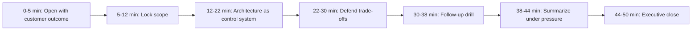

### Minute 0-5: Open with the Customer Outcome

- Start with the user problem in plain language: a support team wants an agent that reads email, looks up internal context, updates CRM records, and issues refunds, but only when deterministic controls say it's safe.
- State the hidden constraint that changes the design: the model must not receive broad authority over money-moving or identity-bearing actions.
- A strong opening does three things at once:
  1. Frames the outcome: less manual triage, faster response, cleaner records, fewer backlogs.
  2. Makes assumptions explicit: email is one intake channel, internal systems already exist, some actions are reversible while others are not.
  3. Invites redirection: "If you want, I can optimize for strict safety, lower latency, or faster rollout." — signals maturity, collaborating on a design target rather than defending a single fantasy architecture.

### Minute 5-12: Lock the Scope Before Drawing Boxes

- Spend this time on discovery, not diagrams. Ask:
  - What is the agent allowed to do versus merely allowed to suggest?
  - Which actions are reversible, customer-visible, or need human confirmation?
  - Do refunds have dollar thresholds? Can CRM updates be staged? Is email the only instruction source? Do internal systems already expose APIs with stable identifiers?
- This is a test of depth selection. A weak answer tries to cover everything (LLM prompt strategy, vector search, orchestration, OCR, multiple channels, multi-region) at once. A better answer narrows based on risk — for this scenario, the riskiest points are identity, authorization, duplicate execution, and malicious instructions.
- If pushed for assumptions: "I'll assume refunds are the most sensitive write path, CRM updates are moderately sensitive, and read-only lookup is the lowest risk. If your environment differs, the same control pattern still applies, but the approval thresholds and tool boundaries would move."

### Minute 12-22: Explain the Architecture as a Control System

- Organize the architecture sketch around trust boundaries, not the model: the model plans and classifies; a policy layer decides; a tool gateway executes; an audit layer records every attempt; a workflow state machine tracks progress and retries.
- Verbal summary: the agent reads email, extracts intent, classifies the request, proposes an action plan; it can fetch internal context through read-only connectors, but any write path goes through policy checks and is held for approval or constrained by thresholds; high-risk actions (especially refunds) are held for approval or constrained by thresholds; every action gets an idempotency key, a status record, and a durable audit entry; if the model becomes confused, the workflow engine — not the model — decides whether to pause, retry, escalate, or fail closed.
- This is where the flexibility-vs-determinism trade-off becomes explicit: flexibility helps when emails are messy and workflows vary; determinism helps when the action has customer/financial impact. The right answer is usually flexible interpretation, deterministic execution — not "one or the other."

### Minute 22-30: Defend the Security and Integration Trade-Offs

- **Agent flexibility vs. deterministic workflow.** Flexibility handles edge cases and reduces human toil, but letting the model decide the final action increases variance, audit complexity, and blast radius. Safer pattern: the model drafts, the workflow validates. The model recommends; the control plane decides.
- **Fine-grained scopes vs. integration burden.** Fine-grained scopes reduce overreach (a connector that reads only certain fields is safer than a broad service token), at the cost of more permissions, more policy mapping, more service accounts, more exception handling. Optimize scopes around irreversible effects first, then simplify the integration layer with shared auth patterns and reusable wrappers.
- **Automatic execution vs. approval latency.** Automatic execution improves throughput and feels magical; approval adds delay but protects the business when the model is uncertain, the refund is large, or the request is novel. Best answer: tiered automation — low-risk auto-run, medium-risk queue for review, high-risk require explicit approval or a second check.
- **Central tool gateway vs. direct integrations.** A central gateway gives one place for auth, policy enforcement, audit, idempotency, and schema validation. Direct integrations are faster at first but multiply the places a bad prompt can reach a write API. The gateway is the stronger default here because the whole design is about shared safety controls; direct integrations may still exist behind the gateway, but the model should not talk to them directly.

> 🎯 **Interview Pointer:** Interviewers frequently probe exactly these four pairs — rehearse the "give a little here to protect X" shape of each answer (e.g., "we accept approval latency to protect against irreversible financial harm") so the trade-off sounds resolved, not merely listed.

### Minute 30-38: Answer the Follow-Up Drill Without Getting Defensive

- **Can the model hold credentials?** No. The model should receive the minimum context required to reason, not long-lived secrets. Credentials belong in a secrets manager, token broker, or short-lived delegated authorization layer. The model requests an action; a trusted service mints a constrained token only for the exact operation being approved — keeps secrets out of the prompt, limits leakage risk, simplifies revocation.
- **How do you stop duplicate refunds?** Idempotency at the business-action layer, not just the API-call layer. Every refund request needs a durable unique identifier tied to the case, customer, and policy decision; before execution, the workflow checks whether the action already completed, is in flight, or was partially applied. On retry, return the existing outcome instead of issuing another refund. Retries are normal, duplicate money movement is not.
- **What if email contains malicious instructions?** Assume it will. Treat email as untrusted input, not command authority. The model classifies the message and extracts facts, but does not obey instructions embedded in the email about policy overrides, credential disclosure, or bypassing approvals. Defense: prompt separation, tool whitelisting, policy checks outside the model, strict role boundaries. If the content looks like instruction injection, mark the task for review or strip the suspicious instructions from the reasoning context.
- **How does the kill switch work mid-task?** More than a button that stops new requests — it should halt new tool invocations, cancel queued workflows, revoke or expire delegated tokens, and mark in-flight tasks so downstream services reject completion if the task is no longer allowed to proceed. This is why the workflow state machine matters: the pause point is explicit, the action history is durable, and support can see whether a task was blocked before a write, after a lookup, or during approval.

### Minute 38-44: Summarize Under Pressure

- When asked "So what would you build first?", resist the urge to overbuild.
- Sequence: start with read-only ingestion, intent classification, internal lookup, and proposal generation → add reversible writes with approvals → then low-value automated writes → only later more sensitive actions like refunds.
- First production gate: not "the agent can do everything" — it's "the control plane demonstrably prevents unauthorized actions, duplicate execution, and uncontrolled side effects."
- On rollout: keep it grounded in supportability — run in shadow mode, log every suggestion, compare proposed actions with human decisions, then enable a narrow write path for a small set of cases. Make the support team part of the launch plan. If support cannot explain a failure, the rollout is too early.

### Minute 44-50: Close with an Executive Summary

- Close should sound like a concise decision memo, not a recap dump. A strong 90-second summary:

> "We're building an agent that turns unstructured email into safe operational action, but we are not giving the model unchecked authority. The model handles interpretation and recommendation; deterministic services handle identity, authorization, idempotency, approvals, audit, and execution. The key trade-off is flexibility versus control: we accept some workflow rigidity so that refunds, CRM writes, and other irreversible actions stay governed by explicit policy. I would start with read-only plus approval-based writes, use a central tool gateway for security and observability, and keep credentials out of the model. The first rollout gate is whether the system can prove it prevents duplicate refunds, blocks prompt injection, and supports a kill switch without losing auditability."

- Works because it names the outcome, the mechanism, the biggest trade-off, and the first safety gate in one pass.

### Common Weak Answers and How to Repair Them

- Talk about the model too long, leave policy/audit/rollback implicit → **repair:** re-center the control plane.
- Optimize for elegance, ignore operational friction → **repair:** acknowledge the cost of fine-grained scopes and approval queues.
- Assume email is trustworthy → **repair:** state untrusted-input handling early.
- Describe the kill switch as a UI flag → **repair:** tie it to workflow cancellation, token revocation, and downstream rejection.
- Drown the interviewer in components → **repair:** say what is in scope for the first release and what is deferred.

### Scoring Rubric You Can Self-Check Against

- **Discovery:** Did you ask the questions that change the design, especially around writes, thresholds, and approval?
- **Estimation:** Did you identify scale only to the level needed for architecture choices, without inventing precision?
- **Architecture:** Did you separate model reasoning from policy enforcement and execution?
- **Depth:** Did you go deep on the riskiest paths — credentials, refunds, injection, idempotency, and kill switch?
- **Security:** Did you keep secrets out of the model, constrain scopes, and treat email as untrusted?
- **Delivery:** Did you describe a phased rollout with shadow mode, approvals, and support readiness?
- **Communication:** Did you stay structured, concise, and explicit about trade-offs?

### Practice Plan Before the Interview

- **Solo drill:** five minutes to outline the architecture, two minutes to close, without notes.
- **Pair mock:** have a partner interrupt with the four follow-ups (credentials, duplicate refunds, malicious email, kill switch), practice answering without drifting.
- **Implementation exercise:** sketch the state machine for a single refund workflow and mark where idempotency, approval, cancellation, and audit records live.
- If you can do those three cleanly, you sound like an engineer who can ship a safe system, not just describe one.

### Interview Moment: The Interviewer Challenges Your Riskiest Assumption

- Imagine the interviewer pausing right after the architecture summary: "You're assuming the model can reliably infer intent from email and then hand off to policy. What if the email itself is trying to steer the agent into a refund it should not make?"
- A strong response is calm and specific:

> "I would not let the model treat the email as authority. The email is only untrusted input for classification and extraction. The policy engine, outside the model, decides whether the request is eligible for any write path, and the workflow requires a durable action record plus approval for risky cases. If the content looks like prompt injection or conflicting instructions, I'd fail closed, strip the malicious instructions from the reasoning context, and route the case for human review. So my assumption is not that email is trustworthy; my assumption is that the control plane can safely contain untrusted text."

- Practice defending the riskiest assumption instead of quietly relying on it.

## Coverage Notes

This tutorial was drafted after a full, gapless read of Chapter 11 (Kindle locations 9417–10363, confirmed against the clean Chapter 10/11 boundary at 9416/9417 and the clean Chapter 11/12 boundary at 10351/10364). One self-review pass was run against the fixed 20-item rubric; no further gaps were found that the source material could close, so only one pass was needed. No rubric item required fabricated content — every major diagram, code block, and table described in the chapter text was captured directly from the source during the read.

**Phase 1 — Problem Framing & Discovery**
- **Item 1 (Feature → business-outcome reframing):** Fully covered — Section 1 restates "AI assistant for refunds" as a testable outcome.
- **Item 2 (Stakeholder/persona mapping):** Fully covered — Section 1 names business users, approvers, security, tool/data owners, operator, sponsor.
- **Item 3 (Clarifying questions that change the architecture):** Fully covered — Section 2's six risk-changing question categories.
- **Item 4 (Requirements split + prioritization):** Fully covered — Section 2 functional/nonfunctional/constraint split with must/should/could.
- **Item 5 (Explicit non-goals/scope fence):** Fully covered — Section 2 MVP "must not include" list.

**Phase 2 — Estimation & Architecture**
- **Item 6 (Back-of-envelope scale & capacity math):** Fully covered — Section 3's model-call, tool-call, storage, and compute envelopes.
- **Item 7 (Unit economics/cost-driver breakdown):** Fully covered — Section 3's model-time-vs-tool-time ratio and storage sizing.
- **Item 8 (End-to-end architecture & data flow):** Fully covered — Section 4's nine-component map and control/data-plane split.
- **Item 9 (Data model & API contracts):** Fully covered — Section 5's five records and four endpoint contracts.
- **Item 10 (Build-vs-buy/vendor & model-selection trade-offs):** Fully covered — Section 8's central tool gateway vs. direct integrations trade-off.

**Phase 3 — Trade-offs, Security & Reliability**
- **Item 11 (Named trade-off pairs with balanced verdict):** Fully covered — Section 8's four trade-off pairs, each resolved.
- **Item 12 (Threat model/security controls):** Fully covered — Section 6's four security controls and hostile-case framing.
- **Item 13 (Failure-mode & reliability drills):** Fully covered — Section 6's five named failure drills.
- **Item 14 (Testing strategy):** Fully covered — Section 5's contract test + failure-injection test.

**Phase 4 — Delivery, Governance & Communication**
- **Item 15 (Layered evaluation metrics & observability):** Fully covered — Section 7's technical health/model quality/adoption/business outcome scorecard.
- **Item 16 (Phased rollout/risk register/rollback gates):** Fully covered — Section 7's staged rollout and risk register.
- **Item 17 (Regulatory/governance depth):** Absent — the chapter treats audit evidence, retention, and legal requirements as discovery questions and design inputs, explicitly saying "you do not need to over-specify the jurisdictional details in the interview," but never names an external compliance framework (e.g., SOC 2, GDPR, PCI-DSS) or goes deeper into formal governance processes.
- **Item 18 (Responsible-AI/risk framing beyond the obvious failure mode):** Fully covered — prompt injection, untrusted-input handling, and irreversible-action governance treated as first-class concerns throughout, not just in the security section.
- **Item 19 (Change-management/adoption narrative):** Fully covered — Section 7's training, support runbooks, and adoption plan.
- **Item 20 (Structured communication plan + self-scoring rubric):** Fully covered — Section 8's pacing plan and 7-dimension rubric.

### My Perspective on the Gaps

**Item 17 — Regulatory or governance depth beyond audit/retention.** *(Supplementary perspective, not sourced from the original chapter.)*

- The chapter's Audit Ledger and Approval Service components already carry most of what a governance framework needs — they're just not named against one. In a live interview I'd explicitly map them: the Audit Ledger's tamper-evident, replayable decision records are the raw material for a SOC 2 change-management control; the Credential Broker's scoped, short-lived tokens map directly to PCI-DSS's least-privilege access requirement if refunds touch payment data; and the Approval Service's reviewer-identity-plus-rationale capture is exactly the artifact a GDPR or CCPA data-subject-request audit would ask for when a customer disputes an automated refund decision.
- I'd say out loud that which framework applies depends on what the refund/CRM data actually contains — PCI-DSS if card data flows through the refund tool, GDPR/CCPA if EU/CA customer PII is processed, SOC 2 almost by default if this is a B2B SaaS vendor selling to enterprises. Naming the trigger condition, not just the framework, is what shows judgment rather than buzzword-dropping.
- Concretely, I'd extend the Tool Registry's risk label (already `low`/`high` in the code) with a data-classification tag (e.g., `pii`, `pci`, `none`) so the Policy Decision Point can route regulated-data actions to a stricter approval path and a longer, framework-specific retention period — reusing the existing gates rather than bolting on a separate compliance subsystem.
- General heuristic to say out loud: treat regulatory depth as a routing input to controls you already built for safety, not as a new set of components — the same policy/audit/approval machinery that stops prompt injection is what a SOC 2 auditor or GDPR regulator will actually want to see evidence of.
