# Chapter 15: Design Observability for a Customer-Facing AI Application

*Source: THE FORWARD DEPLOYED ENGINEER SYSTEM DESIGN INTERVIEW, Chapter 15 (locations 13228–14212)*

*Tutorial format: Interview-ready v2 (bullet-only cram format) — regenerated from the original tutorial's verified content, no new source material added.*

## Table of Contents

- [1. The Customer Problem and Discovery](#1-the-customer-problem-and-discovery)
  - [The Vague Complaint and Stakeholder Map](#the-vague-complaint-and-stakeholder-map)
  - [Reframing the Problem](#reframing-the-problem)
- [2. Clarifying Questions, Requirements, and Constraints](#2-clarifying-questions-requirements-and-constraints)
  - [Clarifying Questions to Ask](#clarifying-questions-to-ask)
  - [What Must Be Observable by Default](#what-must-be-observable-by-default)
  - [What Must Not Be Captured by Default](#what-must-not-be-captured-by-default)
  - [The Central Design Fork](#the-central-design-fork)
- [3. Scale Estimates, Sensitivity, and Cost Drivers](#3-scale-estimates-sensitivity-and-cost-drivers)
  - [Collection Policy Drives Cost](#collection-policy-drives-cost)
  - [Sampling Strategy: Head vs. Tail](#sampling-strategy-head-vs-tail)
  - [Critical Failure Drill: Sampling Drops the Only Bad Trace](#critical-failure-drill-sampling-drops-the-only-bad-trace)
- [4. Architecture and End-to-End Flow](#4-architecture-and-end-to-end-flow)
  - [Four Architectural Questions](#four-architectural-questions)
  - [End-to-End Request Path](#end-to-end-request-path)
  - [Observability Path Layers](#observability-path-layers)
  - [Component Responsibility Table](#component-responsibility-table)
- [5. Data Model, APIs, and Working Code](#5-data-model-apis-and-working-code)
  - [Data Model Overview](#data-model-overview)
  - [Idempotent Trace-Ingestion Contract Test](#idempotent-trace-ingestion-contract-test)
  - [Failure-Injection Test](#failure-injection-test)
  - [Production Sketch: Redacting Before Export](#production-sketch-redacting-before-export)
  - [Hardening Notes](#hardening-notes)
- [6. Security, Reliability, and Failure Handling](#6-security-reliability-and-failure-handling)
  - [Failure Policy Vocabulary](#failure-policy-vocabulary)
  - [Blast Radius Axes](#blast-radius-axes)
  - [Chaos and Failure Injection Practice](#chaos-and-failure-injection-practice)
  - [Threat Model and Security Controls](#threat-model-and-security-controls)
  - [Failure Drill: Sampling Drops the Only Bad Trace](#failure-drill-sampling-drops-the-only-bad-trace)
  - [Failure Drill: Tenant ID Has a High-Cardinality Bug](#failure-drill-tenant-id-has-a-high-cardinality-bug)
  - [Failure Drill: Logs Store Raw Prompt](#failure-drill-logs-store-raw-prompt)
  - [Failure Drill: Trace Context Breaks at Queue Boundary](#failure-drill-trace-context-breaks-at-queue-boundary)
  - [Failure Drill: Quality Metric Improves While Adoption Falls](#failure-drill-quality-metric-improves-while-adoption-falls)
  - [Failure-Policy Decision Table](#failure-policy-decision-table)
  - [Launch Discipline: Evidence, Runbooks, Access Review](#launch-discipline-evidence-runbooks-access-review)
  - [Defending the Design in an Interview](#defending-the-design-in-an-interview)
- [7. Delivery Plan, Observability, and Business Impact](#7-delivery-plan-observability-and-business-impact)
  - [The User-Facing Promise](#the-user-facing-promise)
  - [Seven Layered Metrics](#seven-layered-metrics)
  - [Four-Phase Rollout](#four-phase-rollout)
  - [Scorecard Built From One Incident Story](#scorecard-built-from-one-incident-story)
  - [Ownership Assignment](#ownership-assignment)
  - [Product, Adapter, Service, or Configuration](#product-adapter-service-or-configuration)
  - [Rollout Readiness Mechanics](#rollout-readiness-mechanics)
  - [Risk Register](#risk-register)
  - [Business Value Statement](#business-value-statement)
- [8. Interview Walkthrough, Trade-Offs, and Practice](#8-interview-walkthrough-trade-offs-and-practice)
  - [50-Minute Pacing Plan](#50-minute-pacing-plan)
  - [Simulated Interview Walkthrough](#simulated-interview-walkthrough)
  - [Diagnostic Signals and Root-Cause Logic](#diagnostic-signals-and-root-cause-logic)
  - [Trade-Off Debates](#trade-off-debates)
  - [Strong Answers to Likely Follow-Ups](#strong-answers-to-likely-follow-ups)
  - [Weak Answers and Repairs](#weak-answers-and-repairs)
  - [Self-Scoring Rubric](#self-scoring-rubric)
  - [90-Second Interview Summary](#90-second-interview-summary)
  - [Practice Set](#practice-set)
- [Coverage Notes](#coverage-notes)
  - [My Perspective on the Gaps](#my-perspective-on-the-gaps)

## 1. The Customer Problem and Discovery

### The Vague Complaint and Stakeholder Map

- Customer statement: "The AI is slow and sometimes wrong, and we can't tell why" — deliberately vague; the interview's first job is to convert it into a measurable, diagnosable problem.
- Stakeholders care about different signals:
  - Support wants to triage a complaint fast, without waiting on engineering.
  - Engineering wants root cause — is the fault retrieval, the model, or a tool integration?
  - Security wants assurance that whatever gets logged does not become a new exposure surface.
  - The executive sponsor wants confidence that quality is improving release over release, not just that dashboards are green.
- Observability for an AI application is not "add more logs" — it must connect a user-visible failure to a technical cause while controlling privacy and blast radius.
- A strong candidate treats discovery as a scoping exercise, not a checklist — pushing on which users, which workflows, and which failure types matter most.

> 🎯 **Interview Pointer:** Memorize the reframe — the customer is not asking for logging, they're asking to connect a user-visible failure to a technical cause, fast, safely, without drowning operators in noise. Leading with this line signals FDE-level framing in the first 30 seconds.

### Reframing the Problem

- The interview goal is to discover what "slow" and "wrong" actually mean before proposing any architecture.
- Good discovery separates three problems that get compressed into one complaint:
  - **Latency**: is the end-to-end request slow, and where in the pipeline?
  - **Correctness**: is the answer wrong, and is the fault upstream (retrieval) or in generation (model/tool)?
  - **Trust and diagnosability**: can support and engineering explain a failure to the customer without exposing sensitive content or drowning in telemetry volume?

## 2. Clarifying Questions, Requirements, and Constraints

### Clarifying Questions to Ask

- Open with two clarifying questions:
  - What counts as "slow" (a target latency percentile at a defined path)?
  - What counts as "wrong" (an incorrect answer, an empty answer, a hallucinated fact, or a tool failure surfaced to the user)?
- Also probe which users/tenants are most affected, and what the team is and is not allowed to capture by default.
- Assumptions should be made explicit and offered for the interviewer to redirect.

### What Must Be Observable by Default

- Request identity (a stable request ID and tenant/customer context)
- Retrieval evidence (what was retrieved, and whether it was relevant)
- Model invocation metadata (model version, prompt template version, generation settings)
- Tool call outcomes (status, latency, and error classes)
- Timing at each hop of the pipeline
- User-visible outcome tags (success, partial answer, escalation)

### What Must Not Be Captured by Default

- Full prompts
- Raw customer documents
- Secrets
- High-cardinality free-form labels (arbitrary user text, unbounded metadata keys)

### The Central Design Fork

- The observe-vs-withhold decision is the chapter's first and most important trade-off, and it recurs throughout every later section.
- The right first design decision in this space is often "what will we not collect?" rather than "what will we collect?"
- Non-goals matter as much as goals: this is not a full production tracing SDK integration, not a complete observability stack, and not a substitute for dependency-pinned, production-hardened collectors.
- Framing: full capture maximizes forensic power but raises privacy exposure, access-control burden, and storage cost; a narrower, structured design preserves diagnosability while minimizing sensitive content by default, with controlled break-glass escalation for exceptional cases.

> 🎯 **Interview Pointer:** This must-observe / must-not-capture split is the single most reusable artifact from this chapter — be ready to redraw both lists from memory and to justify each item's inclusion or exclusion.

## 3. Scale Estimates, Sensitivity, and Cost Drivers

### Collection Policy Drives Cost

- Observability data volume scales with request volume, trace volume, retention window, and sampling rate — none of these are free, and the interview expects the candidate to reason about their interaction.
- The chapter frames back-of-envelope estimation less around raw QPS math and more around how collection-policy decisions cascade into cost and diagnosability trade-offs.
- Telemetry cost (compute, storage, network overhead) must be treated as a design constraint, not an afterthought — the system must not let instrumentation become the outage.
- A credible interview answer states illustrative assumptions for request volume, trace volume, and retention window, then explains why observability data is not free and why the first design decision is "what will we not collect?"
- Illustrative assumptions are meant to demonstrate reasoning about how collection policy drives cost — exact numbers are less important than showing why "what will we not collect?" is the first design decision.

### Sampling Strategy: Head vs. Tail

- Sampling is presented as a control, not a compromise: it is what keeps the system from drowning operators in telemetry or collecting more sensitive content than the support process can justify.
- **Head sampling**: simple, cheap.
- **Tail sampling**: better for retaining anomalous or slow requests, but requires more infrastructure and careful policy design.
- The interview-safe position favors preferential retention for latency-heavy, error-heavy, or otherwise suspicious traces, because random sampling alone is dangerous when failures are rare and expensive to reproduce.

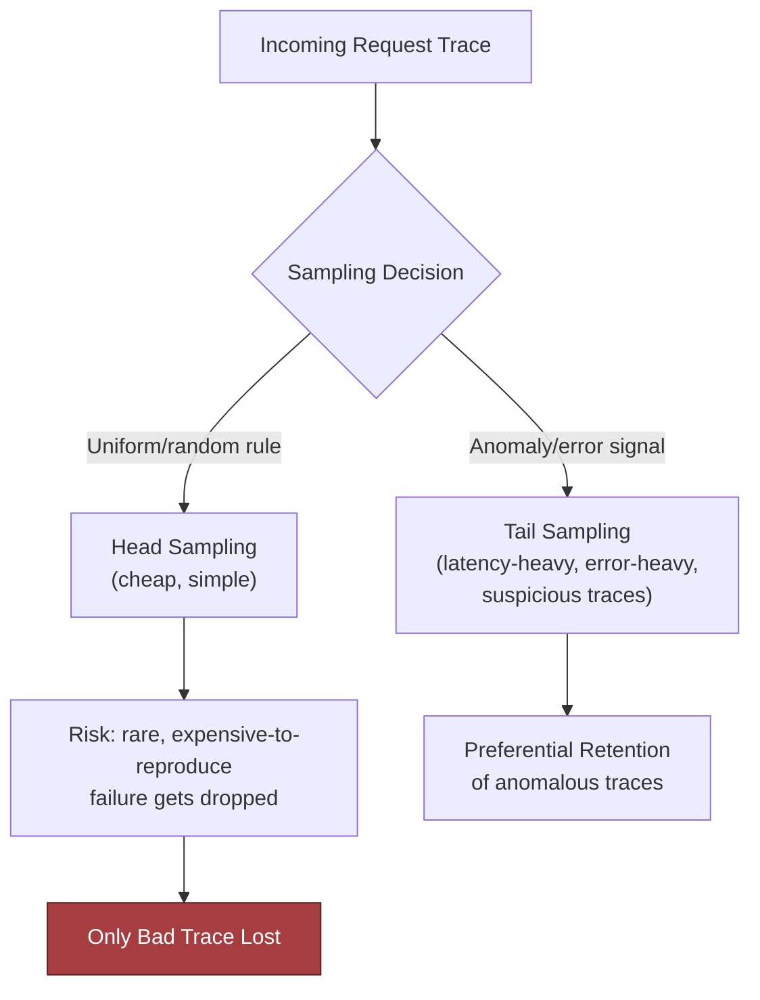

### Critical Failure Drill: Sampling Drops the Only Bad Trace

- The chapter's central failure-mode framing: "sampling drops the only bad trace" — a naive uniform/random sampling policy can systematically miss the rare failure that matters most.
- This is the chapter's critical failure drill and recurs as the opening injection into the Section 6 security/reliability review.

> 🎯 **Interview Pointer:** "Sampling drops the only bad trace" is the chapter's signature phrase — expect the interviewer to inject this as a hidden constraint mid-interview, and have the head-vs-tail trade-off answer ready cold.

## 4. Architecture and End-to-End Flow

### Four Architectural Questions

- The architecture is tracing-first: structured logs, distributed spans, and selective redaction, with every request carrying a stable correlation ID.
- Trace context must propagate across internal services and customer-specific integrations without leaking unnecessary content.
- A support operator must be able to jump from an alert to the exact request family without seeing raw sensitive content.
- The design should maintain separate views: a global dashboard for platform health and release regressions, and tenant-scoped views for customer-specific debugging and support workflows.
- Four architectural questions matter most in the walkthrough:
  1. How does each request get a correlation ID?
  2. How does trace context flow across services and integrations?
  3. How does a support operator jump from alert to request family?
  4. How is global vs. tenant-specific visibility separated?

### End-to-End Request Path

- The end-to-end request path: authentication, tenant resolution, retrieval, model call, tool use, post-processing, response delivery.
- Each hop is a place where latency and correctness can diverge — "the AI is slow and sometimes wrong" is not one problem but a set of failure modes with different evidence at each layer.

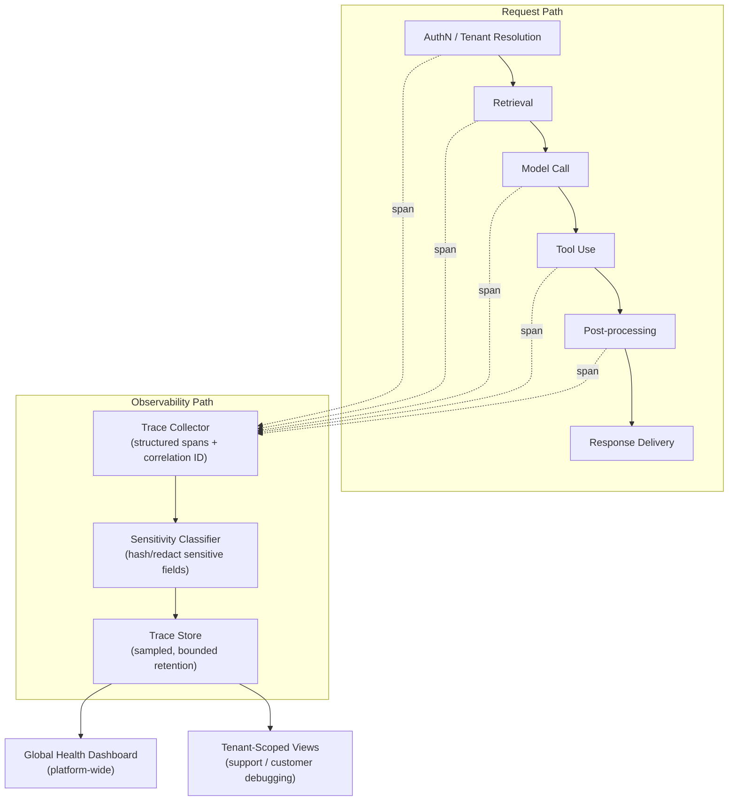

### Observability Path Layers

- The observability path is layered rather than monolithic:
  - A trace collector attaches a stable correlation ID and structured spans to every hop.
  - A sensitivity classifier hashes or redacts fields before they enter durable storage.
  - A bounded-retention trace store feeds two distinct consumers:
    - A global platform-health dashboard (operational rates, release regressions, model-wide trends).
    - Tenant-scoped views (customer-specific debugging, support workflows, isolation of integration problems).
- Choosing only one of these views is the wrong answer: the right answer separates them, with a clear permission boundary between them.

### Component Responsibility Table

- Component responsibility summary (as walked through in the interview-defense section):

| Component | Primary responsibility | Notes |
|---|---|---|
| Trace collector | Attach correlation ID, propagate context, capture spans per hop | Structured, not raw-text by default |
| Sensitivity classifier | Classify/hash sensitive fields before they reach telemetry | Runs before storage, not after |
| Trace store | Durable, retention-bounded storage of exported traces | Retention window is a cost and privacy control |
| Global dashboard | Platform-wide operational health, release regressions | Cross-tenant, aggregate only |
| Tenant-scoped views | Customer-specific debugging, support triage | Access scoped by role and tenant |
| Support/access gateway | Role-based, tenant-scoped access to evidence | Enforces least privilege |
| Audit/redaction pipeline | Enforces retention policy, redaction on export | Defense in depth: code, collector, and review layer |

## 5. Data Model, APIs, and Working Code

### Data Model Overview

- The `Request` data model carries tenant ID, prompt, and optional user ID; the `ExportedTrace` model carries only a bounded, structured attribute dictionary — never raw prompt text by default.
- Prompt classification (`classify_sensitive_input`) tags content as `"sensitive"` or `"non_sensitive"` before it is ever attached to a trace.
- A stable, salted hash (`_stable_hash`, using HMAC-SHA256) preserves correlation across requests without storing raw content — lets you deduplicate and correlate without ever exposing the underlying prompt.
- `capture_trace` builds the exported trace directly from a handler's request context, attaching tenant ID, prompt classification, a stable query hash, and result status — never the raw prompt itself.
- Tests are written as executable contracts:
  - Idempotency of trace posting.
  - A dedicated privacy-invariant test (`test_telemetry_redacts_sensitive_attributes`) that asserts raw PII never appears in the exported trace's JSON.
- A separate failure-injection test class proves that a retriever timeout is still observable — sampling and redaction must never cause a failure to become invisible.
- The reader takeaway: a design answer becomes credible when its state transitions, API contracts, and failure-safe code are concrete. If you can show how a request becomes a trace, how a trace becomes a labeled quality event, and how a rollup becomes an SLO window without ambiguity about ownership or retries, you have crossed from abstract observability language into a system an interviewer can trust.

### Idempotent Trace-Ingestion Contract Test

- The chapter presents an idempotent trace-ingestion contract test first — a `TraceContractTests` suite posting the same trace twice and asserting the second post is recognized as `"deduplicated"` rather than creating a duplicate record.
- This establishes that trace ingestion, like the workflow orchestration APIs in earlier chapters, must be idempotent under retry.

```python
if __name__ == "__main__":
  asyncio.run(TraceContractTests().test_post_traces_is_idempotent())
```

### Failure-Injection Test

- A failure-injection test simulates a retriever timeout after the request has been accepted and confirms that the system emits a trace summary with a partial-failure outcome rather than silently dropping the event.
- This directly protects the chapter's critical failure drill: sampling must never be allowed to drop the only bad trace.

```python
class FailingRetriever(Retriever):
    async def search(self, safe_query_hash: str) -> list[str]:
        raise TimeoutError("retriever timed out")

class FailureInjectionTests(unittest.IsolatedAsyncioTestCase):
    async def test_retriever_timeout_is_observable(self):
        global retriever
        original = retriever
        retriever = FailingRetriever()
        try:
            request = Request(
                tenant_id="tenant-a",
                tenant_tier="enterprise",
                prompt="find the answer",
                safe_query_hash="hash-456",
                prompt_version="p-7",
                request_id="trace-002",
                idempotency_key="idem-002",
                request_schema_version=1,
            )

            with self.assertRaises(TimeoutError):
                await answer(request)
        finally:
            retriever = original
```

- In production, that failure-injection scenario would usually be improved so the trace summary is written in a `finally` block with an `outcome="partial_failure"` or similar field before the exception is propagated or mapped to a client-safe error.
- The point of the test is to prove that a transient downstream failure is observable and attributable, not dropped.

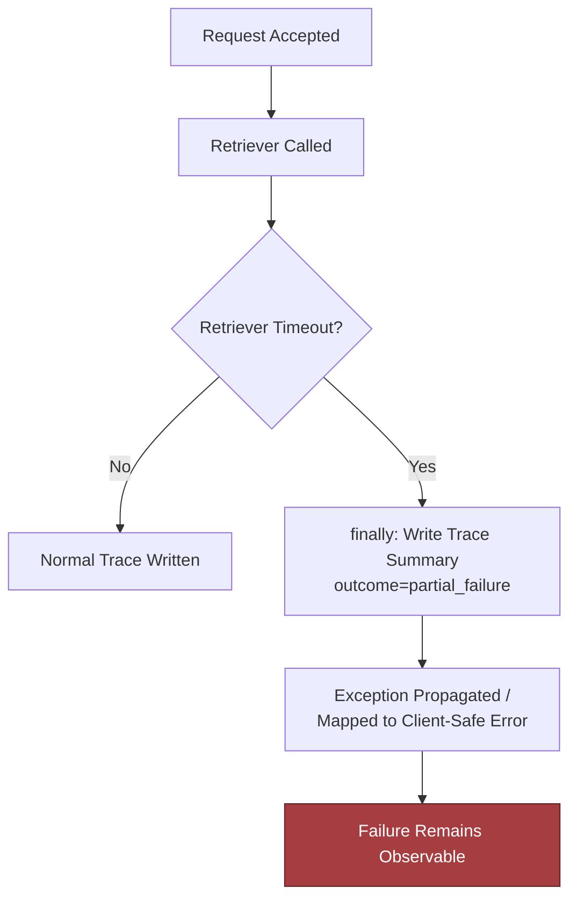

### Production Sketch: Redacting Before Export

- Interview-sized implementation sketch. It shows the teaching point: telemetry should receive only a sanitized envelope, not raw prompt text.
- It also shows the limitation: this is not a full observability stack, not a full tracing SDK integration, and not a substitute for dependency-pinned, production-hardened collectors. It is a focused invariant test you can expand with validation, errors, and observability hooks in the companion repository.

```python
from __future__ import annotations

import hashlib
import hmac
import json
import os
from dataclasses import dataclass, field
from typing import Any, Callable, Dict, Optional


class TelemetryError(RuntimeError):
    pass


@dataclass(frozen=True)
class Request:
    tenant_id: str
    prompt: str
    user_id: Optional[str] = None


@dataclass
class ExportedTrace:
    attributes: Dict[str, Any] = field(default_factory=dict)

    def contains(self, key: str) -> bool:
        return key in self.attributes

    def to_json(self) -> str:
        return json.dumps(self.attributes, sort_keys=True)


def _stable_hash(value: str, salt: str) -> str:
    if not salt:
        raise TelemetryError("Missing telemetry salt")
    digest = hmac.new(salt.encode("utf-8"), value.encode("utf-8"), hashlib.sha256)
    return digest.hexdigest()


def classify_sensitive_input(text: str) -> str:
    lowered = text.lower()
    if "@" in lowered or any(token in lowered for token in ["ssn", "password", "secret"]):
        return "sensitive"
    return "non_sensitive"


def answer(request: Request) -> Dict[str, Any]:
    # Interview sketch: the actual answer path would call retrieval/model tooling.
    return {"reply": f"Processed request for tenant {request.tenant_id}"}


def capture_trace(handler: Callable[[], Dict[str, Any]]) -> ExportedTrace:
    salt = os.environ.get("TELEMETRY_HASH_SALT", "")
    request = getattr(handler, "_request", None)
    if request is None:
        raise TelemetryError("Handler must carry request context in this sketch")

    result = handler()
    prompt_class = classify_sensitive_input(request.prompt)
    trace = ExportedTrace(
        attributes={
            "tenant_id": request.tenant_id,
            "prompt.classification": prompt_class,
            "query.hash": _stable_hash(request.prompt, salt),
            "result.status": "ok",
        }
    )
    return trace


def request_with_pii() -> Request:
    return Request(
        tenant_id="tenant-123",
        prompt="Please email person@example.com the draft contract",
        user_id="user-456",
    )


def test_telemetry_redacts_sensitive_attributes() -> None:
    req = request_with_pii()

    def _handler() -> Dict[str, Any]:
        return answer(req)

    _handler._request = req  # type: ignore[attr-defined]
    os.environ["TELEMETRY_HASH_SALT"] = "unit-test-salt"

    exported = capture_trace(_handler)
    assert "person@example.com" not in exported.to_json()
    assert exported.contains("query.hash")
    assert exported.attributes["prompt.classification"] == "sensitive"


if __name__ == "__main__":
    test_telemetry_redacts_sensitive_attributes()
    print("ok")
```

> 🎯 **Interview Pointer:** Be ready to narrate this code cold: `classify_sensitive_input` tags before storage, `_stable_hash` uses HMAC-SHA256 with a required salt (raises if missing), and the test asserts the raw email string is absent from `to_json()`. This is the concrete artifact that proves "redact by default" isn't just a slogan.

### Hardening Notes

- The invariant is simple and important: the exported trace must preserve correlation through a stable hash and sensitivity classification, while refusing to emit raw prompt content.
- In production you would harden this by:
  - Replacing the sketchy handler attachment with explicit context objects.
  - Validating request schemas.
  - Centralizing redaction in middleware or collectors.
  - Pinning dependencies.
  - Adding tests for queue propagation, retry boundaries, and support-role authorization.

## 6. Security, Reliability, and Failure Handling

### Failure Policy Vocabulary

- The design review opens with a deliberately uncomfortable injection: **sampling drops the only bad trace** — the candidate's first move should be to contain impact, preserve evidence, and make the failure legible fast, not to defend the sampler or argue probability.
- The core job here is not "collect everything" — it is to connect a user-visible failure to a technical cause while controlling blast radius.
- Five explicit failure policy terms used consistently throughout the chapter:
  - **Fail open**: the system continues operating even if the observability or support path is impaired, accepting reduced visibility in exchange for user continuity.
  - **Fail closed**: the system refuses the action when integrity, privacy, or authorization would be compromised by proceeding.
  - **Degrade**: the system serves a reduced but safe experience, such as a simpler answer path, partial telemetry, or delayed diagnostics.
  - **Queue**: the system buffers work or evidence temporarily with explicit bounds, backpressure, and retention limits instead of dropping it silently.
  - **Human intervention**: the system escalates to an operator or support workflow when risk, ambiguity, or irreversibility is too high for automation.
- If the telemetry pipeline is down, you may still serve the customer request with reduced observability, but must not silently drop audit evidence or leak raw prompts into an ad hoc debug dump.
- If a dependency call times out, you may retry once or route to a fallback model, but must not create an unbounded retry storm that obscures root cause and amplifies tenant impact.
- Recovery objective: restore enough trustworthy observability to identify the cause, verify containment, and resume safe service without widening exposure — not "perfect logs."

### Blast Radius Axes

- A strong interview answer names the blast radius along four axes: **tenant, region, workflow, and dependency**.
- Examples:
  - A raw-prompt leak is usually tenant-scoped but workflow-wide.
  - A queue-boundary trace break can affect one integration path across many tenants.
  - A model outage may be regional.
  - A misconfigured support tool can span all tenants if least privilege is weak.
- These distinctions drive containment, escalation, and rollback decisions.

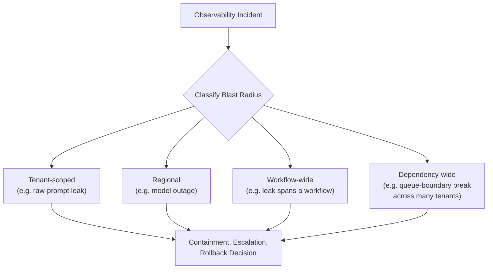

### Chaos and Failure Injection Practice

- This is where chaos and failure injection belong as a deliberate practice, not a surprise.
- Inject in staging: sampler loss, queue-boundary propagation breakage, redaction regressions, and dependency timeouts.
- Goal: prove the failure policy works before production forces you to discover it — validate that the system preserves evidence, respects privacy, and degrades in a controlled way when the happy path is gone.

### Threat Model and Security Controls

- Threat-model the observability path, not just the app path. Security controls are narrow but essential:
  - **Hash or classify sensitive inputs before telemetry.** Capture a stable fingerprint or sensitivity label for prompts, queries, and document snippets before they enter traces or logs — preserves correlation without copying raw customer content into every system that can read telemetry.
  - **Use tenant-safe support access.** Support tooling should expose the minimum needed to diagnose an incident for a specific tenant, with explicit authorization boundaries and just-in-time access where possible. "Can read all traces" is not an acceptable default.
  - **Cap attribute cardinality.** A broken tenant-id formatter or a user-id field with unconstrained free text can turn your metrics backend into a high-cardinality fire. Keep attribute sets fixed, bounded, and normalized.
  - **Separate audit logs from debugging traces.** Audit logs answer who accessed what and when; debugging traces answer what failed and where. The first needs durable integrity and restricted write paths; the second needs flexibility, sampling, and short retention.
- Abuse case: a developer adds a raw prompt field to a debug span to speed triage. It works once, then becomes the easiest way to move PII into every downstream system.
- The correct response is not just a code review comment — it is a redaction policy, an exporter guardrail, and a test that fails any time exported telemetry contains raw sensitive strings.

> 🎯 **Interview Pointer:** The audit-log-vs-debug-trace separation is a common follow-up trap — be ready to explain why merging them is "tempting and dangerous" (different integrity, access, and retention requirements) rather than just asserting they should be separate.

### Failure Drill: Sampling Drops the Only Bad Trace

- **Detection:** compare user complaint intake, request errors, and anomaly signals against sampled trace volume. If complaint count rises but trace volume for the affected workflow falls, you may have a blind spot rather than a healthy system.
- **Containment:** switch the affected tenant, route, or error class to higher-fidelity sampling temporarily; preserve the raw event envelope in a protected quarantine store if policy allows.
- **Recovery:** reconstruct the incident from neighboring evidence — API gateway logs, model gateway errors, dependency spans, and support tickets — then explicitly mark the missing trace in the incident record.
- **Prevention:** never let a single global sampling rule control all error paths. Error-class-based overrides, low-rate always-on exemplars, and per-tenant incident escalation hooks reduce the odds of losing the only useful trace.

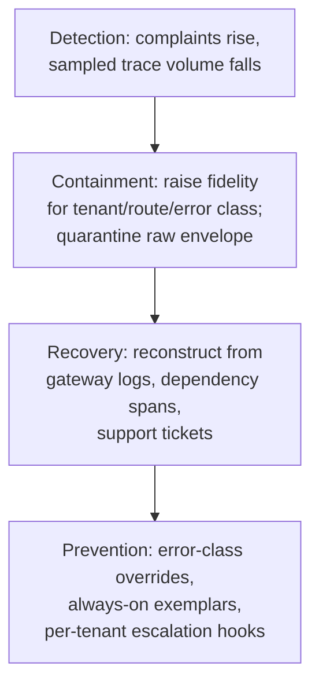

### Failure Drill: Tenant ID Has a High-Cardinality Bug

- **Detection:** watch metric cardinality budgets and exporter rejections; a sudden explosion in unique tenant labels is itself an incident.
- **Containment:** strip or normalize untrusted attributes at ingestion; collapse unexpected values into a bounded "other" bucket.
- **Recovery:** repair the parser or mapper, then backfill only the minimal aggregate indicators needed for the incident review.
- **Prevention:** schema-validate telemetry attributes and reject unknown high-cardinality fields before export.

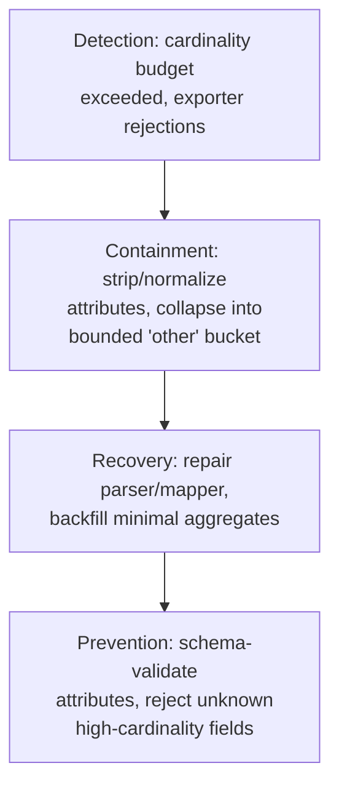

### Failure Drill: Logs Store Raw Prompt

- **Detection:** automated scanners and red-team tests should search exported logs, traces, and support transcripts for PII patterns and known secret formats.
- **Containment:** revoke access to the affected sink, rotate any credentials that may have been exposed, and quarantine the log set.
- **Recovery:** delete or redact according to retention policy and customer contract; notify the right internal owners through the incident process.
- **Prevention:** enforce redaction in code, in the collector, and in review. Defense in depth matters because one missed layer is enough.

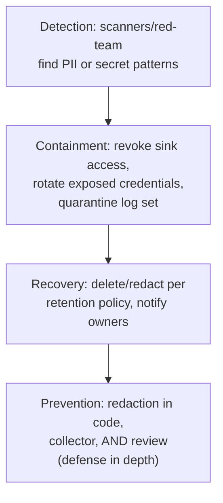

### Failure Drill: Trace Context Breaks at Queue Boundary

- **Detection:** a request starts with a trace, then disappears after async handoff. Missing parent-child links, orphan spans, and a spike in "unknown root" events are the clue.
- **Containment:** propagate a minimal correlation envelope through the queue, even if the full trace cannot be carried.
- **Recovery:** stitch together spans using the correlation id and event timestamps, while marking the join as reconstructed rather than native.
- **Prevention:** define queue serialization contracts that include trace context, idempotency key, and tenant scope. Test them explicitly.

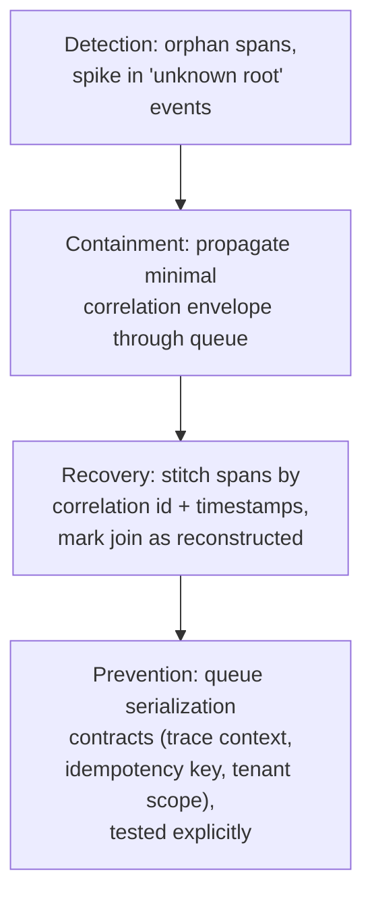

### Failure Drill: Quality Metric Improves While Adoption Falls

- This is the subtle failure that good observability systems miss: the model gets better on paper, but customer usage drops because latency, trust, or workflow friction worsens.
- Detection requires pairing technical metrics with adoption signals such as completion rate, retries, abandonment, support contacts, or feature opt-in.
- If accuracy improves while usage falls, the system is likely optimizing the wrong objective or harming the user experience in a way the offline metric does not capture.
- Recovery is not a hotfix; it is a product review, a metric reset, and possibly a rollback of the latest change.

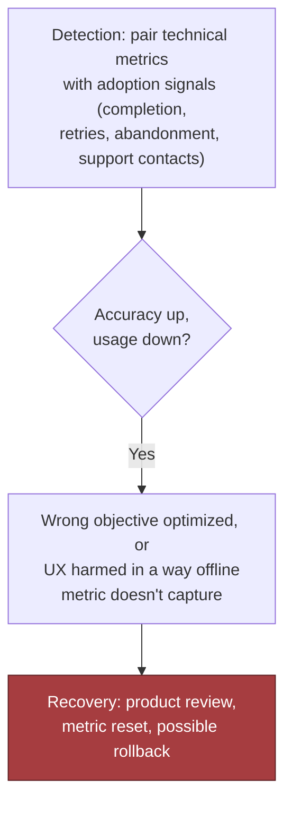

> 🎯 **Interview Pointer:** This drill is the chapter's most "senior" failure mode — it's not a system bug, it's a metric-design bug. Naming it unprompted (accuracy improving while adoption falls) is a strong signal you think about product outcomes, not just uptime.

### Failure-Policy Decision Table

- A practical failure-policy table — example decision table:

| Failure | Policy |
|---|---|
| Auth token missing | Fail closed; do not infer identity; ask the caller to re-authenticate. |
| Telemetry export unavailable | Degrade; continue serving the request, buffer a bounded summary, and alert. |
| Retriever timeout | Retry once with jitter; if still failing, degrade to a reduced-answer path or ask for user refinement. |
| Model gateway rate limit | Queue briefly if SLA allows; otherwise fail gracefully with a specific retry message. |
| Audit sink unavailable | Usually fail closed for the audited action or require human intervention, because silent loss of audit evidence is unacceptable. |
| Support lookup outside tenant scope | Fail closed; no cross-tenant fallback. |
| Repeated downstream timeouts | Trip a circuit breaker, stop hammering the dependency, and either serve a safe degraded response or queue for later handling if the workflow permits. |
| Evidence buffer full | Dead-letter the overflow into a restricted quarantine queue with an incident marker, then alert a human; do not silently discard the last surviving clue. |

- The useful move in an interview is to say why each choice is different: a user-facing answer can sometimes degrade; an audit trail usually cannot. A retriever timeout can often be retried; a permission check cannot be guessed. That is least privilege applied to behavior, not just access.

### Launch Discipline: Evidence, Runbooks, Access Review

- Before launch, the team should have three artifacts ready:
  - **Evidence policy:** defines what is retained, for how long, who can see it, and what is redacted.
  - **Response runbook:** explains how to detect a telemetry blind spot, elevate sampling for a tenant or workflow, and confirm the redaction pipeline still works under load.
  - **Access review:** proves that support can diagnose issues without broad tenant visibility.
- This is where an FDE interview stops being about clever architecture and starts testing production judgment: you own safe rollout, support, and incident response, not merely the happy path.
- (Production sketch: redacting before export — see Section 5's code and invariant test. Teaching point: telemetry should receive only a sanitized envelope, not raw prompt text; limitation: not a full observability stack, not a full tracing SDK integration, not a substitute for dependency-pinned, production-hardened collectors.)

### Defending the Design in an Interview

- If asked what your system does under malicious input, say: it sanitizes before export, caps attributes, scopes support access by tenant, and separates audit from debug telemetry.
- If asked what it does under partial failure, say: it degrades where possible, retries with limits, queues only with bounds, trips circuit breakers on repeated downstream failure, dead-letters overflow evidence into restricted quarantine when needed, and escalates to humans when risk, ambiguity, or evidence trail is at risk.
- If asked why this is the right design for an FDE, say: it is built to keep the customer productive, keep the incident visible, and keep the blast radius small enough that one tenant's failure does not become everyone's incident.
- Every external dependency and every irreversible action needs an explicit failure and recovery policy — that is the line between "we have telemetry" and "we can defend the system under pressure."
- In this chapter's setting: you do not just observe the AI application — you preserve evidence without oversharing, limit the damage of a bad release or bad input, and make the next human decision easier instead of harder.

## 7. Delivery Plan, Observability, and Business Impact

### The User-Facing Promise

- The prototype works, but the customer's next question is sharper: when can we trust this in production, and who will know first when it starts drifting?
- That is the FDE move: not to defend the demo, but to convert the architecture into staged delivery with measurable gates, named owners, and a support plan that turns customer-visible failures into actionable evidence.
- Before you instrument anything, define the outcome the customer should experience in plain language: users get a timely answer, the answer is grounded in the right retrieval sources or tool results, and when something goes wrong, support can identify whether the cause was authentication, retrieval, model behavior, a tool outage, or a bad customer-specific integration.
- That promise becomes the first rollout gate. If you cannot state the user-facing SLOs clearly, you cannot tell whether the system is improving or merely producing more telemetry.

### Seven Layered Metrics

- The minimum metric set:
  - Availability and latency SLOs for the end-user request path.
  - Retrieval and tool success rates for the dependencies most likely to make answers wrong.
  - Token cost per successful request or per active tenant slice.
  - Quality-event rate — rate of user-visible failures, escalations, or human-reviewed bad outputs.
  - Trace coverage, so incidents are actually visible in telemetry.
  - Telemetry overhead, so observability does not become the outage.
  - Mean time to diagnose, because the customer does not care whether the answer arrived through a beautiful dashboard if nobody can explain the failure.
- Each metric is defined with a calculation, source, owner, and alert threshold so support, engineering, and product can all read them the same way.

| Metric | Calculation | Source | Owner | Alert threshold |
|---|---|---|---|---|
| Availability SLO | Successful user requests / total user requests over the measurement window, excluding only the failures the customer explicitly agreed should be out of scope | Edge/service request metrics and incident records | Application engineering with platform support | Page or escalate when the burn rate threatens the agreed SLO over the current window |
| Latency SLO | Request latency at the agreed percentile, usually p95 or p99, for the customer-facing path | Request tracing and service timing metrics | Application engineering | Investigate when the percentile exceeds the target for a sustained period or after a release/canary change |
| Retrieval and tool success | Successful retrieval or tool completions / attempted retrievals or tool calls, split by dependency and customer tenant | Retriever logs, tool invocation traces, dependency health events | The service team that owns the retriever or integration | Trigger investigation when success rate drops below the expected baseline or when failure class shifts suddenly |
| Token cost | Tokens consumed per successful request, or total token cost per tenant per day, depending on how the customer is billed or budgeted | Model usage logs and billing exports | Product operations or platform finance partner | Flag when token consumption rises faster than traffic or exceeds the agreed budget envelope |
| Quality-event rate | Number of user-visible failures, support escalations, or human-reviewed bad outputs / total user sessions or completed tasks | Support tickets, review labels, and user feedback records | Product and ML engineering jointly | Investigate any statistically meaningful increase after a release, prompt change, retrieval change, or customer integration update |
| Trace coverage | Traced requests / total sampled or expected requests for the critical path | Trace collector and request logs | Observability platform | Warn when coverage drops below the minimum needed to diagnose the top failure path, especially for error paths or high-value tenants |
| Telemetry overhead | Added latency, compute, storage, or network cost attributable to observability relative to the baseline service | Profiling, resource metrics, and telemetry pipeline stats | Platform/SRE | Constrain instrumentation changes if overhead materially raises request latency or operating cost |
| Mean time to diagnose | Time from first customer report or automated alert to a credible root-cause hypothesis or confirmed cause | Incident timeline and support case timestamps | On-call engineering and support operations | Escalate if this time stops improving or exceeds the team's incident response target |

- Different lenses on success: technical health tells you whether the service is up; model quality tells you whether answers are good enough; adoption tells you whether users are actually relying on it; business outcome tells you whether the workflow changed in a way the customer values. An FDE who collapses those into one "accuracy" metric loses the plot.

> 🎯 **Interview Pointer:** Memorize the four "lenses" (technical health, model quality, adoption, business outcome) — interviewers commonly ask "what's the one metric you'd watch?" and the correct answer is that no single metric suffices; naming the lens each metric belongs to is the strong answer.

### Four-Phase Rollout

- A credible delivery plan is staged, with each phase proving a narrower but more valuable slice of the system.
- **Phase 1: define user-facing SLOs first.** Owner: product and engineering jointly, with the customer stakeholder signing off on what "good enough" means. Exit criteria: the team agrees on request latency targets, acceptable failure modes, the support boundary, and what counts as a customer-visible incident. This is also where the go/no-go gate lives — if the team cannot agree on SLOs, the system is not ready for wider release because nobody has a shared definition of harm.
- **Phase 2: instrument one critical path.** Owner: the primary service team, with platform support for trace propagation and redaction. Exit criteria: a single representative request path is traced end to end through auth, retrieval, model call, tool call, and response assembly, carrying a stable request identifier, a tenant identifier or equivalent scoped key, dependency timing, and a minimal set of outcome labels. Start with one path because it forces discipline: if you cannot observe the most common request, you do not yet have observability; you have a logging project.
- **Phase 3: add trace-linked support workflow.** Owner: support engineering or customer success, with engineering on-call defined. Exit criteria: a support agent can move from a user complaint to a trace or incident record without asking the user for sensitive raw prompts or recreating the whole issue by hand. The best trace in the world is useless if support cannot associate it with the customer report or if access controls make the trace unreadable to the people who need it.
- **Phase 4: introduce quality and cost signals with sampling.** Owner: the observability platform owner, with model and product owners defining thresholds. Exit criteria: the team has enough quality and cost signal to detect regressions, but only samples what it needs. This is the right moment to bring in higher-cardinality diagnostics, model-evaluation hooks, or user feedback labels. Sampling is not a compromise; it is the control that keeps the system from drowning operators in telemetry or collecting more sensitive content than the support process can justify.
- This four-phase rollout is the shape of a mature implementation: define the promise, instrument the critical path, connect support to evidence, then widen the signal only after the operating model exists.

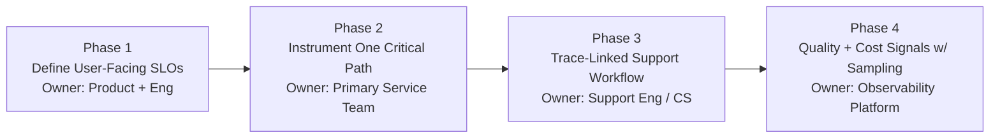

### Scorecard Built From One Incident Story

- A useful dashboard does not start from component metrics; it starts from a user complaint: "the AI is slow and sometimes wrong."
- The scorecard should let an operator answer that complaint from the top down:
  - Did the request meet the availability and latency SLO?
  - Was retrieval slow, empty, or polluted?
  - Did a tool call fail, time out, or return an unexpected shape?
  - Did token usage spike because the prompt or context ballooned?
  - Did the quality-event rate rise after a release or a customer configuration change?
  - Is trace coverage high enough that the bad request is actually represented?
  - Is telemetry overhead still low enough that production behavior is not being distorted?
  - How long does it take to diagnose the issue once it is reported?
- A good dashboard connects those questions in one view, layered top to bottom:
  - Top panel: user outcome — latency percentile, failure rate, and incident volume.
  - Middle panel: likely causes — retrieval success, tool success, model error class, and token cost.
  - Bottom panel: support mechanics — trace coverage, redaction rate, queue age for incidents, and mean time to diagnose.
- That layering matters because it prevents a common failure mode where the dashboard is full of internal rates but gives no clue whether the user's experience improved.

### Ownership Assignment

- Observability fails socially before it fails technically. If no one owns the signal, no one owns the decision. The rollout plan needs names, not just components.
  - Product or customer lead owns the user-facing outcome and decides whether the release is worth the risk.
  - Platform or infrastructure owns trace collection, storage, retention, and cost control.
  - Application engineering owns the critical-path instrumentation and dependency tags.
  - Support engineering owns the trace-linked workflow and triage process.
  - Security owns redaction policy, access boundaries, and audit requirements.
  - On-call engineering owns rollback and escalation.
- Go/no-go gate: if trace coverage falls below the minimum needed to diagnose the top failure path, or if telemetry overhead materially affects latency, the release pauses.
- Rollback triggers: sudden loss of trace propagation, a spike in quality-event rate, or a cost slope that makes the deployment unsustainable.
- Handoff responsibilities must be written down so customer success knows when to escalate, engineering knows when to halt, and the platform team knows which signal is authoritative.

### Product, Adapter, Service, or Configuration

- This is where the FDE lens becomes a product lens. Not every observability choice should be hard-coded into the core application.
  - **Configuration:** per-customer sampling rates, retention windows, alert thresholds, and which tool or retrieval events are exposed to support.
  - **Adapter:** integrations to ticketing, alerting, warehouse, or customer-specific incident systems.
  - **Shared service:** trace collection, redaction, correlation ID propagation, incident search, and the support-access gateway.
  - **Core product:** the request lifecycle, user outcome tags, and the minimal schema needed to connect a user complaint to a technical cause.
- That partition keeps the product reusable: customer-specific edge cases live in configuration and adapters; durable learning about AI behavior and supportability stays in the shared service and core schema.
- This is one of the most important FDE responsibilities: deliver the immediate customer fix, then turn it into leverage for future deployments.

### Rollout Readiness Mechanics

- A production launch needs more than instrumentation and a dashboard — it needs operational mechanics that keep the rollout safe and repeatable.
  - **Canary:** release the observability changes to one tenant, one request slice, or one internal cohort first. Compare latency, trace completeness, support usability, and cost against the pre-change baseline before expanding. If the canary shows trace loss, excess overhead, or support confusion, stop and fix the pipeline before broad release.
  - **Rollback:** define the exact switch that disables the new instrumentation, sampling rule, support integration, or retention change. Rollback should be fast enough that the team can restore the previous state without waiting for a long deployment cycle.
  - **Migration:** if request IDs, trace schemas, or support case links are changing, keep the old and new formats interoperable during the transition. Migrate one dependency or tenant cohort at a time so historical incidents remain searchable while the new structure proves itself.
  - **Training:** support, on-call, and customer-facing teams need a short runbook and a walkthrough of what a healthy trace looks like, how to find a bad trace, what evidence can be shared with customers, and what must stay redacted. Training is part of launch readiness, not a nice-to-have reward.
  - **Support:** define the escalation path, paging policy, and customer communication templates before the rollout. Support should know which incidents are user-facing, which are internal-only, and which ones require engineering involvement. A trace-linked workflow only helps if people know when and how to use it.
  - **Documentation:** publish a concise ops guide covering metric definitions, dashboard links, common failure signatures, access rules, sampling policy, rollback steps, and the owner for each signal. If missing, the system may still work, but the organization will not be able to operate it consistently.
- This is the practical bridge between architecture and day-two operations: the customer is not buying a diagram; they are buying confidence that the system can be launched, supported, and recovered without guesswork.

### Risk Register

- A rollout without a risk register is a wish. A useful register has an owner, mitigation, and trigger for every major failure mode.

| Risk | Owner | Mitigation | Trigger |
|---|---|---|---|
| Sampling drops the only bad trace | Observability platform | Bias sampling toward error paths and customer-reported incidents | Support cannot find trace evidence for an acknowledged user failure |
| Telemetry becomes the bottleneck | Platform and SRE | Cap attributes, bound storage, and monitor overhead | Latency or cost rises after instrumentation changes |
| Support can see too much or too little | Security and support engineering | Role-based access, redaction, and audit logging | Sensitive content appears in support artifacts or triage stalls because evidence is inaccessible |
| Quality signals are noisy | Product and ML engineering | Separate objective service metrics from subjective quality labels | Alerts fire on expected experimentation or customer-specific behavior |
| The customer believes adoption means success even when the workflow is not improved | Product | Track actual task completion and business outcome, not just usage volume | Usage rises while escalations and manual work remain unchanged |

- This is the point where the interview answer becomes persuasive: you are not promising perfection; you are showing that the system can fail in known ways and still remain diagnosable, supportable, and improvable.

### Business Value Statement

- What to say when the customer asks for production confidence: "We have a staged rollout, clear SLOs, one traced critical path, a support workflow tied to evidence, and a sampling policy that keeps the telemetry useful without overwhelming the team. We will not expand scope until we can show the system is helping users, not just generating metrics."
- That is the business value of observability in an FDE setting: not a dashboard for its own sake, but the mechanism that lets the customer trust the AI enough to use it, lets support diagnose failures without exposing sensitive content, and lets the team prove the product is getting better rather than merely busier.
- Measurable customer impact statement: the rollout succeeds when users adopt the system because it is faster and more reliable, the workflow produces fewer unresolved escalations, and the operating team can trace, diagnose, and act on failures quickly enough that the customer experiences control instead of uncertainty.

## 8. Interview Walkthrough, Trade-Offs, and Practice

### 50-Minute Pacing Plan

- A 50-minute interview should discover what matters, size the problem, choose the right telemetry boundaries, and defend a production path that helps customers without creating a privacy sinkhole — spend time in proportion to risk, not diagram size.
- **Minutes 0–5: frame the customer outcome.** Open with the one-sentence goal: connect user-visible failures to technical causes without violating privacy or drowning operators in telemetry. Ask what counts as "slow," what counts as "wrong," and which users or tenants are most affected. Make assumptions explicit and invite redirection.
- **Minutes 5–12: identify the critical path.** Walk the end-to-end request path: authentication, tenant resolution, retrieval, model call, tool use, post-processing, response delivery. Call out where latency and correctness can diverge.
- **Minutes 12–18: define observability goals and scope.** State what must be observable and what must not be captured by default. This is the first trade-off section.
- **Minutes 18–26: propose the architecture.** Describe a tracing-first design with structured logs, distributed spans, and selective redaction. Explain correlation ID assignment, trace context flow, and support-operator alert-to-request-family jump. Mention separate global/tenant views.
- **Minutes 26–32: discuss estimation and scale.** Give illustrative assumptions: request volume, trace volume, retention window, sampling rate. Show that telemetry cost, storage, and query load all scale with collection policy. Explain why the first design decision is often "what will we not collect?"
- **Minutes 32–38: cover security and failure modes.** State the main risks: accidental prompt leakage, over-broad trace access, cardinality blowups, noisy alerts, missing the one bad trace from over-aggressive sampling. Tie each risk to a mitigation.
- **Minutes 38–44: show production rollout and operations.** Describe a staged rollout: internal dogfood, low-risk tenant pilot, expanded coverage, broader adoption. Say what triggers an alert, who owns the response, and how support uses the evidence.
- **Minutes 44–50: close with synthesis and follow-ups.** Deliver a concise executive summary, invite trade-off questions, name the riskiest assumption and the first rollout gate.

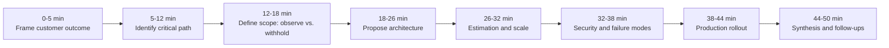

> 🎯 **Interview Pointer:** The pacing plan mirrors risk, not diagram complexity — only ~12 of 50 minutes go to architecture drawing; discovery, security, and delivery get comparable weight. Interviewers notice candidates who spend 30 minutes on a pretty diagram and 5 on failure modes.

### Simulated Interview Walkthrough

- The interviewer starts with: "The AI is slow and sometimes wrong." Your first move: narrow the problem without losing the customer outcome.
- Sample opening: "I want to separate latency from correctness, and then separate system causes from tenant-specific causes. I'm assuming the product routes authenticated customer requests through retrieval, a model, and possibly external tools. If that assumption is wrong, I'd adjust the design. My goal is to let support trace a bad experience to a technical cause without exposing raw customer content by default."
- This balances architecture with customer experience and shows assumption management — declaring the system boundary rather than pretending to know it.
- Hidden constraint the interviewer then gives: the customer will not allow raw prompts to be broadly retained.
  - Naive answer: "capture everything so we can debug later."
  - Better answer: full capture is useful but creates privacy and cost pressure, so the default design should preserve structure and evidence while minimizing sensitive content; support deep debugging only through bounded escalation paths, explicit access controls, and short-lived redaction exceptions.
- Moving to the critical path: "wrong" can originate in at least four places:
  - Authentication can misroute the request to the wrong tenant context.
  - Retrieval can return irrelevant or stale context.
  - The model can hallucinate or misinterpret.
  - Tools or customer integrations can return partial or incorrect data.
- The interviewer is looking for whether you can connect symptoms to layers, not whether you can name every vendor feature.

### Diagnostic Signals and Root-Cause Logic

- A strong answer uses a few concrete diagnostic signals:
  - Request and tenant correlation IDs.
  - Retrieval query fingerprints and document identifiers, not raw text by default.
  - Model version, prompt template version, and generation settings.
  - Tool call status, latency, and error classes.
  - User-visible outcome tags, such as success, partial answer, or escalation.
- If asked how you know whether the issue is retrieval or model:
  - Compare the retrieved evidence against the final answer.
  - If retrieval is empty, stale, or off-topic, the fault is likely upstream.
  - If retrieval looked good but the output contradicts it, the model or prompt construction is the more likely source.
  - If the same bad answer appears only for one tenant, suspect tenant-specific configuration, access control, or downstream integration state before blaming the shared model.

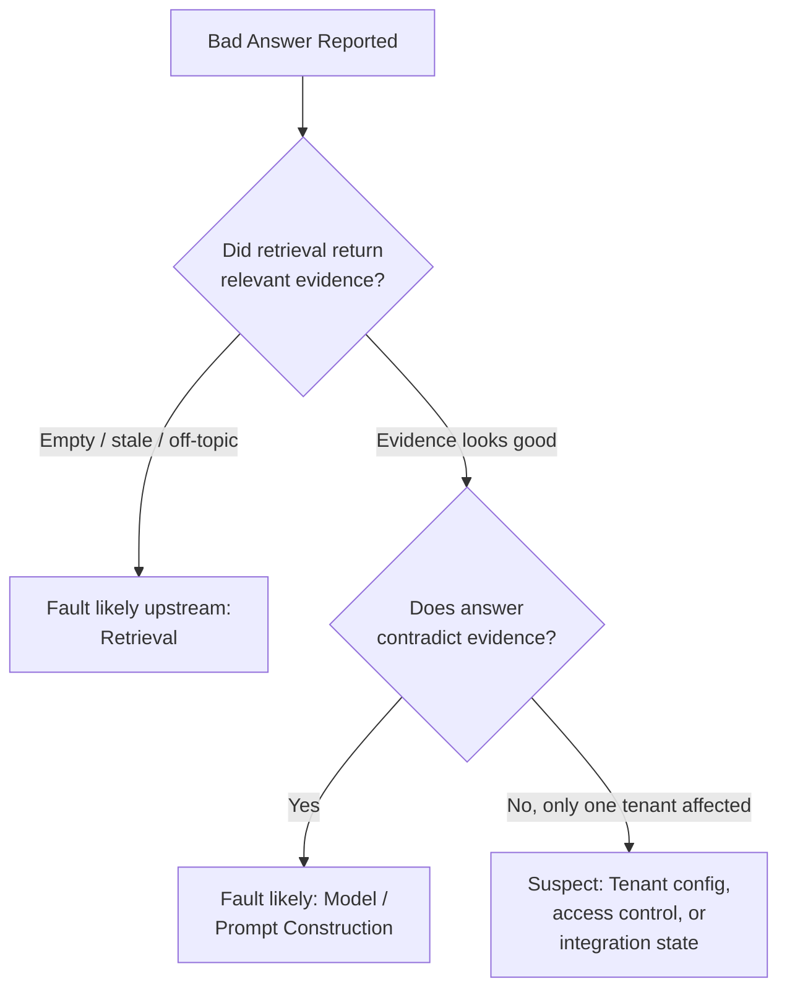

### Trade-Off Debates

- **Full capture versus privacy and cost.** Full capture maximizes forensic power but increases the chance of collecting sensitive content, expands access-control burden, and raises storage/retention costs. Balanced answer: "capture enough structure to diagnose the majority of incidents, and use controlled escalation for exceptional cases" — redact by default, record hashes or stable references where possible, keep a narrow break-glass path for approved deep debugging.
- **Head versus tail sampling.** Head sampling is simple and cheap but can miss the rare bad trace. Tail sampling retains anomalous or slow requests better but requires more infrastructure and careful policy design. Interview-safe position: latency-heavy, error-heavy, or otherwise suspicious traces deserve preferential retention — especially given the critical drill "sampling drops the only bad trace." Pure random sampling is dangerous when failures are rare and expensive to reproduce.
- **Raw prompts versus hashed metadata.** Raw prompts make debugging easier but create the highest privacy exposure. Hashed or tokenized metadata preserves deduplication, correlation, and trend analysis while limiting exposure, at the cost of semantic detail. Strong compromise: store the minimum viable structured representation (prompt template ID, field presence, sanitized entity markers, content fingerprints); retain raw prompts only when a tightly controlled operational need justifies it.
- **Global dashboard versus tenant views.** A global dashboard is best for platform health, release regressions, and model-wide trends. Tenant views are necessary for customer-specific debugging, support workflows, and isolation of integration problems. The wrong answer is to choose only one; the right answer separates them, with a clear permission boundary.

> 🎯 **Interview Pointer:** These four trade-off pairs are the chapter's most-quotable content — practice stating each in the "X is attractive because... but... the balanced answer is..." pattern; interviewers frequently pick one and push on it for several minutes.

### Strong Answers to Likely Follow-Ups

- **How do you debug without storing prompts?** Debug with structure, correlation, and constrained retrieval of evidence: request IDs, tenant IDs, prompt template IDs, retrieval and tool metadata, timing spans, outcome labels. Redact or hash free text by default. For deep incidents, use a gated workflow allowing temporary access to the smallest necessary raw content, with audit logs and time-bounded retention. Debugging does not require universal prompt retention — it requires reproducible context and a controlled path to exceptional detail.
- **Which attributes create cardinality risk?** Anything that can explode into unbounded values: user-generated free text, raw document titles, long tool outputs, arbitrary metadata keys, per-request debug strings, unique error payloads, fine-grained identifiers that vary at request rate. Tenant ID may also become high-cardinality if tenant counts are large and every query slices by tenant. Keep labels short, bounded, and operationally useful; put rich detail in traces or logs only when you can cap it.
- **How do you connect "wrong" to retrieval or model?** Treat correctness as a chain of evidence: first ask whether the model saw the right context. Poor/empty retrieval → fault likely upstream. Good retrieval but wrong answer → inspect prompt construction, tool outputs, model settings. Tenant-specific error → inspect authorization, indexing freshness, integration state. The discipline is comparing what the system knew against what it said.
- **What triggers an alert?** Alert on customer harm or likely impending harm, not on raw telemetry volume — sustained latency above SLO, elevated error rates, repeated empty retrieval results, a spike in fallback responses, tool failures for a critical integration, a sudden rise in "wrong answer" feedback for a tenant or cohort. Avoid alerting on every anomaly; alert when the issue is actionable and tied to user impact.

### Weak Answers and Repairs

- Weak: "Just log everything and sort it out later." Repair: name privacy, cost, and access-control consequences, then propose a tiered capture strategy.
- Weak: "Use tracing." Repair: explain what must be traced, how context propagates, and how traces help distinguish authentication, retrieval, model, and tool failures.
- Weak: "Sample 10 percent." Repair: ask what failure distribution you expect — if rare failures matter most, random sampling alone is not enough.
- Weak: "Put it on one dashboard." Repair: distinguish operational health from tenant-specific debugging and call out role-based access.
- Weak: "If the answer is wrong, the model is wrong." Repair: trace the whole path — auth, retrieval, prompt construction, tools, downstream integrations.

### Self-Scoring Rubric

- Use this rubric to judge whether your answer sounds like a strong FDE response:
  - **Discovery:** Did you clarify the customer outcome, the scope of "slow" and "wrong," and the hidden constraints?
  - **Estimation:** Did you show you understand telemetry volume, storage, and query load implications, and sampling implications?
  - **Architecture:** Did you cover identity, tracing, structured logs, redaction, retention, and access boundaries?
  - **Depth:** Did you explain how to debug retrieval versus model versus tool failures?
  - **Security:** Did you address privacy, access control, and auditability without over-claiming safety?
  - **Delivery:** Did you describe rollout, alerts, support workflows, and operational ownership?
  - **Communication:** Did you stay structured, concise, and explicit about trade-offs?
- A strong performance is not perfect coverage of every topic — it is correct prioritization. You want to sound like someone who can ship safely, support customers, and keep learning from production.

### 90-Second Interview Summary

- "My design goal is to connect user-visible failures to technical causes without collecting more sensitive data than we need. I would instrument the full request path with correlation IDs, structured spans, and bounded metadata across authentication, retrieval, model calls, and tools. I would store raw prompts and customer content only through a narrow, audited escalation path, because the default should be privacy-preserving and cost-aware. For debugging, I would rely on template IDs, document references, timing, error classes, and outcome labels so support can separate auth, retrieval, model, and integration problems. I'd use a global operational view plus tenant-scoped views for authorized support, and I'd prefer selective retention for slow or anomalous traces over blind random sampling so we do not lose the one bad trace. The riskiest trade-off is observability depth versus privacy and cost, and my first production rollout gate would be proving that the system can consistently identify the root cause of real customer incidents without exposing unnecessary content or overwhelming the team."

### Practice Set

- **Solo exercise:** give yourself five minutes to answer only the opening. Prompt: "The AI is slow and sometimes wrong." Force yourself to ask clarifying questions, state assumptions, and define the customer outcome before drawing anything.
- **Pair mock:** have one person act as the interviewer and inject the hidden constraint midway through the answer — raw prompts cannot be broadly retained. Your job is to adapt the design live without restarting.
- **Implementation exercise:** sketch the telemetry schema for a single request. Include the smallest useful set of fields for trace context, retrieval evidence, model metadata, tool calls, redaction state, and outcome labels. Then mark which fields are safe for global dashboards, which require tenant scoping, and which should be restricted to break-glass workflows.
- If you can deliver that sequence smoothly, you are ready to defend the design in a real FDE interview: structured, quantitative, safe, customer-aware, and explicit about trade-offs.

## Coverage Notes

Self-review against the 20-item decomposition rubric (single pass — the source chapter's own structure already closes nearly every gap on first draft):

**Phase 1 — Problem Framing & Discovery**
- **Item 1 (Feature → business-outcome reframing):** Fully covered — Section 1's "not asking for logging" reframe.
- **Item 2 (Stakeholder/persona mapping):** Fully covered — Section 1: support, engineering, security, executive sponsor.
- **Item 3 (Clarifying questions that change architecture):** Fully covered — Section 2: "slow"/"wrong" definitions, tenant scope.
- **Item 4 (Requirements split + prioritization):** Fully covered — Section 2 must-observe vs. must-not-capture lists.
- **Item 5 (Explicit non-goals/scope fence):** Fully covered — Section 5's "not a full observability stack" disclaimer.

**Phase 2 — Estimation & Architecture**
- **Item 6 (Back-of-envelope scale & capacity math):** Partial — collection-policy reasoning given, no worked numeric throughput/storage calculations.
- **Item 7 (Unit economics/cost-driver breakdown):** Fully covered — Section 3 telemetry cost drivers; Section 7 token-cost metric row.
- **Item 8 (End-to-end architecture & data flow):** Fully covered — Section 4 diagram plus 7-row component table.
- **Item 9 (Data model & API contracts):** Fully covered — Section 5 dataclasses, `capture_trace`, `classify_sensitive_input`, `_stable_hash`.
- **Item 10 (Build-vs-buy/vendor & model-selection trade-offs):** Absent — no vendor selection or build-vs-buy discussion for the observability stack.

**Phase 3 — Trade-offs, Security & Reliability**
- **Item 11 (Named trade-off pairs with balanced verdict):** Fully covered — Section 8's four named pairs.
- **Item 12 (Threat model/security controls):** Fully covered — Section 6 hash/classify, tenant-safe access, cardinality caps, audit/debug separation, abuse case.
- **Item 13 (Failure-mode & reliability drills):** Fully covered — Section 6's five named Detection/Containment/Recovery/Prevention drills.
- **Item 14 (Testing strategy):** Fully covered — Section 5 idempotency, failure-injection, privacy-invariant tests.

**Phase 4 — Delivery, Governance & Communication**
- **Item 15 (Layered evaluation metrics & observability):** Fully covered — Section 7's 7-metric scorecard table.
- **Item 16 (Phased rollout/risk register/rollback gates):** Fully covered — Section 7's 4-phase rollout, 5-row risk register, rollback triggers.
- **Item 17 (Regulatory/governance depth):** Absent — no GDPR/HIPAA-style compliance discussion for this chapter's telemetry design.
- **Item 18 (Responsible-AI/risk framing beyond obvious failure mode):** Partial — quality-vs-adoption drill and redaction-by-default touch on this, but no broader bias/fairness/misuse taxonomy.
- **Item 19 (Change-management/adoption narrative):** Fully covered — Section 7's canary/rollback/migration/training/support/documentation checklist and named ownership.
- **Item 20 (Structured communication plan + self-scoring rubric):** Fully covered — Section 8's pacing plan, 90-second summary, rubric, practice set.

Given the strength of first-pass coverage (only items 6, 10, 17, and 18 fall short, and each reflects genuine absence in the source material rather than an omission from this draft), no second or third review pass was needed.

### My Perspective on the Gaps

*The following is supplementary perspective from this rewrite, not sourced from the original chapter.*

**Item 6 — Back-of-envelope scale & capacity math.**
- I would anchor the estimate to the architecture's own bottleneck: the sensitivity classifier and trace store in Section 4's observability path, since every span passes through both before storage.
- A concrete version: assume 500 requests/second at peak, ~6 spans per request (auth, retrieval, model, tool, post-processing, plus the trace-collector envelope itself), giving ~3,000 spans/second before sampling.
- Apply the chapter's own sampling philosophy — tail-biased, not uniform — say 100% retention for error/latency-outlier traces (roughly 2-5% of volume) and 5% head sampling for the rest, which cuts raw trace volume by roughly 90% while preserving the failure population that Section 3's "don't drop the only bad trace" drill cares about.
- I'd size retention next: at ~200 bytes/span after redaction, 30-day retention, the store is a few hundred GB — small enough that the interviewer should conclude storage is not the constraint, classifier CPU and redaction-policy correctness are.

**Item 10 — Build vs. buy / vendor & model-selection trade-offs.**
- I would explicitly split the Section 4 component table into buy-vs-build columns: the trace collector and trace store (Jaeger/Tempo/Honeycomb/Datadog-class tooling) are commodity distributed-tracing infrastructure — buy, because no customer benefit comes from reimplementing span storage and query.
- The sensitivity classifier and redaction pipeline, by contrast, are exactly the piece I'd build in-house, because "what counts as sensitive for this tenant's data" is domain-specific business logic no vendor can be accountable for, and it's the chapter's own central design fork (Section 2).
- General heuristic worth saying out loud in the interview: buy the span plumbing, build the redaction and classification boundary — that boundary is where the chapter's actual differentiated risk lives.
- On model selection specifically: the chapter never names which LLM sits behind "Model Call" in Section 4, so I'd flag that as an open question I'd resolve with the customer's existing vendor relationships and data-residency constraints before locking the architecture.

**Item 17 — Regulatory/governance depth.**
- Given Section 2's must-not-capture list (full prompts, raw documents, secrets) and Section 6's audit/debug separation, this chapter is already halfway to a GDPR/CCPA-shaped design — I'd make that explicit by tying the "evidence policy" from Section 6's launch-discipline checklist directly to a data-subject-access-request (DSAR) process: since prompts are hashed, not stored, a "delete my data" request mostly resolves to deleting the tenant's quarantine/break-glass records rather than scrubbing the whole trace store.
- I'd also flag the retention window (Section 4's "cost and privacy control") as the natural regulatory lever — tying it to whatever the customer's data-processing agreement specifies, rather than picking a number unilaterally.
- For a regulated industry (health, finance), I'd raise this as a clarifying question in the Section 1 discovery phase, since it changes the answer to "what must not be captured by default" before any architecture is drawn.

**Item 18 — Responsible-AI/risk framing beyond the obvious failure mode.**
- The chapter's "quality metric improves while adoption falls" drill (Section 6) is really a proxy-metric-gaming risk, and I'd extend it by naming the adjacent risk directly: the quality-event rate in Section 7's scorecard could itself be gamed if a model learns to produce answers that pass automated evaluation but degrade in ways the eval doesn't measure (verbosity, over-hedging, refusal creep).
- I'd propose pairing the quality-event rate with a lightweight fairness check across tenant segments — does the escalation rate or quality-event rate differ meaningfully by tenant tier or region — since the architecture already has tenant-scoped views (Section 4) that make this cheap to compute without new instrumentation.
- This is a natural extension of the chapter's existing tenant-scoping machinery, not a new subsystem, which is the kind of answer that plays well in an interview: reuse what you already built for isolation to also catch fairness drift.
