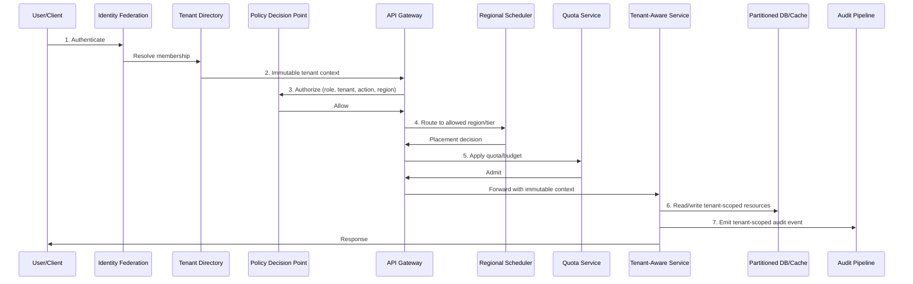
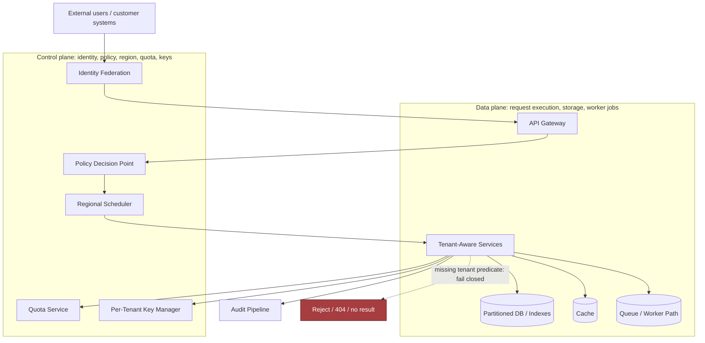
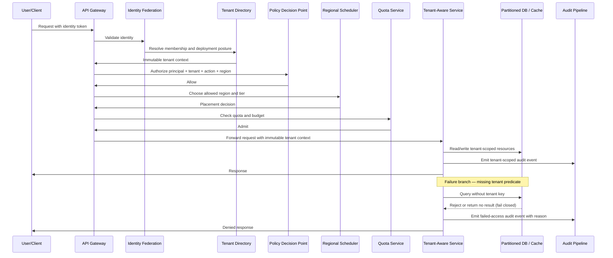
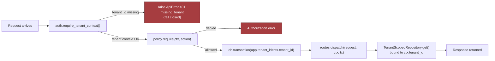
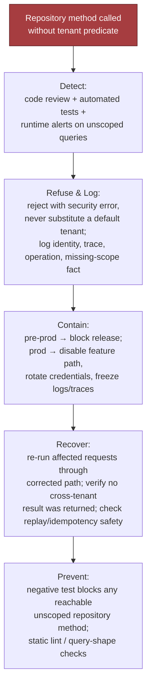
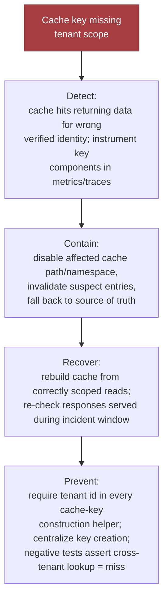
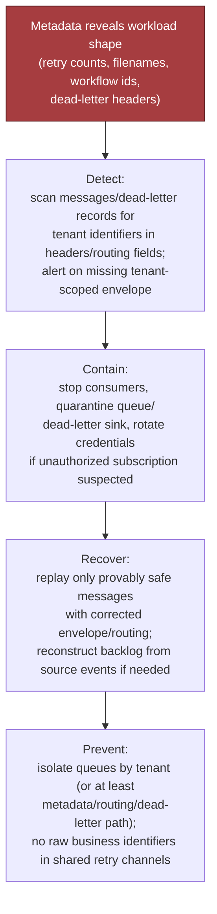
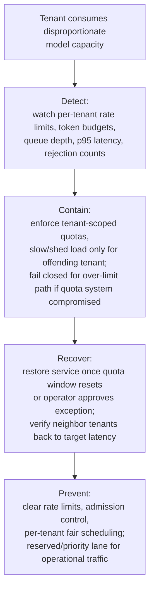
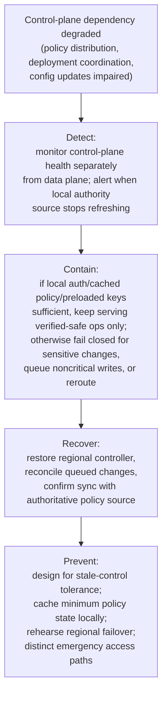
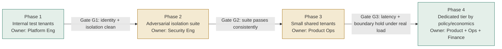

# Chapter 2: Design a Secure Multi-Tenant AI Platform

*Source: "The Forward Deployed Engineer System Design Interview: 20 Real-World AI & Enterprise Scenarios" — Chapter 2.*
*Tutorial format: Interview-ready v2 (bullet-only cram format) — regenerated from the original tutorial's verified content, no new source material added.*

---

## Table of Contents

- [1. The Customer Problem and Discovery](#1-the-customer-problem-and-discovery)
  - [Stakeholder Map](#stakeholder-map)
  - [High-Leverage Discovery Questions](#high-leverage-discovery-questions)
  - [Assumption Ledger](#assumption-ledger)
  - [Strong vs. Weak Opening Answers](#strong-vs-weak-opening-answers)
  - [Answer Order to Rehearse](#answer-order-to-rehearse)
- [2. Clarifying Questions, Requirements, and Constraints](#2-clarifying-questions-requirements-and-constraints)
  - [Four-Bucket Framing](#four-bucket-framing)
  - [Questions That Change the Architecture](#questions-that-change-the-architecture)
  - [Functional Requirements (Must / Should / Could)](#functional-requirements-must--should--could)
  - [Safety Goals as Measurable Constraints](#safety-goals-as-measurable-constraints)
  - [Explicit MVP Exclusions](#explicit-mvp-exclusions)
  - [Interview Question Tree](#interview-question-tree)
  - [Requirement-to-Component Traceability](#requirement-to-component-traceability)
  - [Handling Interviewer Silence](#handling-interviewer-silence)
- [3. Scale Estimates, SLOs, and Capacity](#3-scale-estimates-slos-and-capacity)
  - [Load Shape, Not the Average](#load-shape-not-the-average)
  - [Quotas and Guardrails](#quotas-and-guardrails)
  - [SLOs Anchored in Customer Workflow](#slos-anchored-in-customer-workflow)
  - [Capacity Headroom](#capacity-headroom)
  - [Unit-Economics Equation](#unit-economics-equation)
  - [10x Growth Sensitivity](#10x-growth-sensitivity)
  - [Recovery Bar and the Missing-Tenant-Predicate Test](#recovery-bar-and-the-missing-tenant-predicate-test)
- [4. Architecture and End-to-End Flow](#4-architecture-and-end-to-end-flow)
  - [Coherence Rule and Dependency Order](#coherence-rule-and-dependency-order)
  - [Component Responsibility Table](#component-responsibility-table)
  - [Happy Path, Step by Step](#happy-path-step-by-step)
  - [Control Plane vs. Data Plane](#control-plane-vs-data-plane)
  - [Architecture Diagram with Failure Overlay](#architecture-diagram-with-failure-overlay)
  - [Sequence Diagram: Happy Path and Failure Branch](#sequence-diagram-happy-path-and-failure-branch)
  - [MVP vs. Later Evolution](#mvp-vs-later-evolution)
- [5. Data Model, APIs, and Working Code](#5-data-model-apis-and-working-code)
  - [Core Records and Ownership](#core-records-and-ownership)
  - [API Contract Surface](#api-contract-surface)
  - [Tenant-Aware Request Handling (Highest-Risk Path)](#tenant-aware-request-handling-highest-risk-path)
  - [Code Walkthrough](#code-walkthrough)
  - [Typed Validation at the Boundary](#typed-validation-at-the-boundary)
  - [Idempotency and Optimistic Concurrency](#idempotency-and-optimistic-concurrency)
  - [What the Sketch Deliberately Omits](#what-the-sketch-deliberately-omits)
  - [Contract Test and Failure-Injection Test](#contract-test-and-failure-injection-test)
- [6. Security, Reliability, and Failure Handling](#6-security-reliability-and-failure-handling)
  - [The Non-Negotiable Rule](#the-non-negotiable-rule)
  - [Isolation Layers That Must Agree](#isolation-layers-that-must-agree)
  - [Failure-Response Table](#failure-response-table)
  - [Incident Drill: Missing Tenant Predicate](#incident-drill-missing-tenant-predicate)
  - [Incident Drill: Cache Key Omits Tenant ID](#incident-drill-cache-key-omits-tenant-id)
  - [Incident Drill: Shared Queue Leaks Payload Metadata](#incident-drill-shared-queue-leaks-payload-metadata)
  - [Incident Drill: One Tenant Exhausts Model Quota](#incident-drill-one-tenant-exhausts-model-quota)
  - [Incident Drill: Regional Control Plane Outage](#incident-drill-regional-control-plane-outage)
  - [Production Failure Behavior](#production-failure-behavior)
  - [Cross-Tenant Isolation Test](#cross-tenant-isolation-test)
  - [Audit Evidence Before Launch](#audit-evidence-before-launch)
- [7. Delivery Plan, Observability, and Business Impact](#7-delivery-plan-observability-and-business-impact)
  - [Production-Trust Mental Model](#production-trust-mental-model)
  - [Four-Phase Rollout](#four-phase-rollout)
  - [Rollout Flow Diagram](#rollout-flow-diagram)
  - [Scorecard Metrics](#scorecard-metrics)
  - [Telemetry-to-Story Linkage](#telemetry-to-story-linkage)
  - [Operationalizing the Rollout](#operationalizing-the-rollout)
  - [Configuration vs. Adapter vs. Shared Service vs. Core Product](#configuration-vs-adapter-vs-shared-service-vs-core-product)
  - [Risk Register](#risk-register)
  - [Business Impact Statement](#business-impact-statement)
  - [90-Second Takeaway](#90-second-takeaway)
- [8. Interview Walkthrough, Trade-Offs, and Practice](#8-interview-walkthrough-trade-offs-and-practice)
  - [50-Minute Pacing Plan](#50-minute-pacing-plan)
  - [Named Trade-Off Pairs](#named-trade-off-pairs)
  - [Common Follow-Ups](#common-follow-ups)
  - [Weak Answers and Repairs](#weak-answers-and-repairs)
  - [Scoring Rubric](#scoring-rubric)
  - [Rehearsal Answers](#rehearsal-answers)
  - [Interview Worksheet](#interview-worksheet)
  - [Practice Set](#practice-set)
  - [90-Second Summary](#90-second-summary)
- [Coverage Notes](#coverage-notes)

---

## 1. The Customer Problem and Discovery

### Stakeholder Map

- Headline ask: "one AI application for 500 enterprise tenants, tenant isolation, predictable performance, regional controls" — hides a disagreement between four stakeholders about what "isolation" and "success" mean.
- **Tenant end users** — want a fast, reliable, useful AI experience with the right data and no cross-tenant exposure.
- **Tenant administrators** — want control over access, configuration, usage, and regional placement; also want easy onboarding without platform tickets.
- **Platform operators** — want a shared control plane that is observable, supportable, and cheap to operate at scale.
- **Security and compliance auditors** — want evidence: policies, logs, boundaries, retention rules, clear isolation guarantees ("we need evidence that one tenant cannot read another tenant's data, even under failure").
- Jobs-to-be-done per stakeholder:
  - End users: "summarize internal content and answer questions without exposing anyone else's data."
  - Administrators: "configure policy once and safely roll it out."
  - Operators: "run one shared fleet without noisy neighbors dominating the system."
  - Auditors: "prove that access and residency constraints are enforced consistently."
- First discipline: separate the requested **feature** (a multi-tenant AI platform) from the **business result** (a cost-efficient shared platform with defensible isolation and dedicated options for exceptional customers).

> 🎯 **Interview Pointer:** Opening with "Kubernetes, a vector database, and a model gateway" signals feature-first thinking. Open with the business outcome and the four stakeholders instead — that's the FDE tell.

### High-Leverage Discovery Questions

- Only ~6 questions fit in a 45-minute interview — pick ones that materially change the architecture:
  1. Which tenant data classes are in scope, and which are explicitly out of scope?
  2. Are regional controls hard requirements, soft preferences, or customer-specific exceptions?
  3. What does "predictable performance" mean: throughput, latency, queue time, or fairness across tenants?
  4. Which tenants can share infrastructure, and which require dedicated options?
  5. What evidence do auditors need: logs, policy snapshots, access reviews, or data lineage?
  6. What are the most expensive failure modes: data leakage, unavailable service, slow inference, or misrouted traffic?
- Each question should produce four things: **scope**, **assumptions**, **risks**, **owners** — plus measurable success.

### Assumption Ledger

- State assumptions early instead of letting architecture drift later. Examples:
  - Assume tenants bring their own identity provider.
  - Assume regional restrictions apply to stored data and inference logs.
  - Assume premium customers may pay for dedicated capacity.
  - Assume model selection is already approved by the customer.

### Strong vs. Weak Opening Answers

- **Strong opening (paraphrased):** "Support 500 enterprise tenants preserving isolation, predictable performance, regional controls. I'd clarify shared vs. dedicated tenants, cross-region data limits, and success criteria per stakeholder. Default: shared control plane with tenant-aware data/inference paths, strong authorization at every boundary, and an escape hatch for premium tenants needing dedicated infrastructure."
  - Does three things well: frames the problem, names the stakeholders, postpones premature technology choices.
- **Weak answer:** "We should use microservices, Kubernetes, and row-level security to build a secure AI platform." — feature-first, solution-first, skips the customer outcome.
- **Corrected framing:** "We need a shared AI platform that tenants can trust with sensitive data, while the business can still operate it economically and reserve dedicated capacity for outliers."

### Answer Order to Rehearse

- Compact response order: **prompt → stakeholders → outcome → assumptions → next questions.**
- Architecture only starts once you can state whose workflow changes and how success will be measured.
- Once that's stated, every later choice (data model, auth boundary, deployment topology, observability, premium tier) has a customer reason attached to it.
- No new equation is needed in this section — later capacity/latency math should stay tied to the customer outcome, not become a standalone exercise.

---

## 2. Clarifying Questions, Requirements, and Constraints

### Four-Bucket Framing

- Separate the conversation into four buckets: **functional requirements**, **nonfunctional requirements**, **explicit exclusions**, **hard constraints**.
- The trap in this section isn't technical difficulty — it's premature certainty, since the interviewer only answers half the questions.

### Questions That Change the Architecture

- **Shared vs. dedicated deployment expectations** — determines one universal topology with tiered isolation vs. a hybrid model with an explicit premium tier.
- **Regional and regulatory boundaries** — changes routing, storage, backup, and logging design.
- **Tenant-specific models, keys, and retention** — affects configuration management, secrets handling, runtime vs. provisioning-time policy enforcement.
- **Private networking and SSO requirements** — shapes ingress, authentication, trust boundaries (mTLS or similar).
- **Workload skew and noisy-neighbor tolerance** — decides need for per-tenant quotas, admission control, queue isolation, reserved capacity.
- **Availability, recovery, and audit objectives** — determines redundancy, backup strategy, immutable logging, incident response design.

### Functional Requirements (Must / Should / Could)

- Ordered by value (order matters — control plane is foundational, dedicated tier is an escape hatch, not a default):
  1. **Tenant-aware control plane** — onboard tenants, assign policies, provision configuration, manage keys, record admin actions.
  2. **Isolated data-plane request path** — every request carries tenant identity, policy context, authorization through the whole call chain.
  3. **Per-tenant policy, quotas, keys, configuration** — different limits, model choices, retention, access rules without bespoke code paths.
  4. **Regional routing and retention controls** — direct requests/artifacts to the correct region; retain/delete per tenant policy.
  5. **Auditable administration** — answer who changed what, when, under which tenant context.
  6. **Dedicated deployment tier where justified** — explicit escape hatch for exceptional customers.
- Prioritization labels:
  - **Must** — non-negotiables protecting the highest-risk failure modes: tenant-aware control plane, isolated data-plane path, per-tenant policy enforcement, regional controls where required, auditable administration.
  - **Should** — strong defaults that can be phased in: richer quota tuning, broader automation.
  - **Could** — valuable but non-essential for MVP: advanced tenant analytics, optional convenience workflows.
  - If a tenant's **must** can't be satisfied safely in the shared tier → justification for a dedicated deployment path. A **could** should never expand core design or delay launch.

### Safety Goals as Measurable Constraints

- **Zero cross-tenant reads or writes** — no exposure of another tenant's data, prompts, embeddings, outputs, logs, or admin state through authorized or accidental paths.
- **Bounded resource contention** — one tenant's workload must not cause unbounded latency/throughput collapse for others; shared infrastructure must also share constraints.
- **Tenant-scoped blast radius** — a failed deployment, bad policy, or revoked credential affects only the minimum necessary tenant set.

### Explicit MVP Exclusions

- Exclude unless the interviewer explicitly pushes for them:
  - Arbitrary tenant-managed plugin execution inside the core platform
  - Cross-region active-active writes for every tenant
  - Fully custom per-tenant runtime stacks
  - Unlimited per-request model swapping
  - Manual exception handling for every onboarding request
  - Ad hoc shared-secret administration outside the control plane
- Reason: each one expands the trust surface, complicates auditability, or creates a support burden that obscures the core promise.

### Interview Question Tree

1. Who are the tenants and what varies by tenant?
2. Which data must stay isolated, and at what levels: request, storage, logs, embeddings, admin actions?
3. Which tenants need regional placement or residency constraints?
4. Which customers need private networking, SSO, or dedicated deployment?
5. What workload shape do we expect: steady, bursty, skewed, or mixed?
6. What are the availability, recovery, and audit expectations?
7. What is explicitly out of scope for the first release?

### Requirement-to-Component Traceability

- Tie each requirement to the component that enforces it — proves system design with ownership, not a wish list.

| Requirement | Primary component or mechanism |
|---|---|
| Tenant-aware control plane | Tenant registry, provisioning workflow, admin API |
| Isolated data-plane request path | Auth gateway, request context propagation, policy enforcement point |
| Per-tenant policy, quotas, keys, and configuration | Policy store, quota service, secrets management, config service |
| Regional routing and retention controls | Traffic router, region-aware storage, retention scheduler |
| Auditable administration | Append-only audit log, admin event pipeline |
| Dedicated deployment tier | Separate cluster or namespace boundary with tenant-specific capacity |
| Zero cross-tenant reads or writes | Authorization checks, row-level or object-level isolation, test gates |
| Bounded resource contention | Quotas, admission control, queue isolation, autoscaling limits |
| Tenant-scoped blast radius | Deployment partitions, scoped rollout, tenant-level feature flags |
| Safe onboarding and offboarding | Provisioning workflows, deletion jobs, verification checks |

> 🎯 **Interview Pointer:** If a requirement has no component, it's probably not real yet. If a component has no requirement, it's probably scope creep — say this explicitly when presenting the table.

### Handling Interviewer Silence

- If the interviewer stops halfway through clarification, choose assumptions that protect the most dangerous failure mode (cross-tenant leak or policy violation) and say so plainly.
- Example line: "If we do not know tenant variability yet, I will assume the shared tier must support most customers, but I will design an explicit dedicated path for customers with stricter residency or performance needs."
- What's being evaluated: judgment under uncertainty, disciplined scoping, and a practical bias toward delivery under ambiguity — not breadth of trivia.

---

## 3. Scale Estimates, SLOs, and Capacity

### Load Shape, Not the Average

- Size for the load **shape** — average, peak, growth, skew — not just the average; a design that's plausible at average traffic fails exactly when customers feel pain.
- Illustrative working assumptions (values matter less than the decisions they produce): **500 tenants, 50,000 active users, 200 QPS peak, 20x workload skew.**
- Four estimation buckets:
  - **Average load** — what the platform sees most of the time.
  - **Peak load** — what it must survive without violating customer promises.
  - **Growth factor** — headroom needed before the next capacity project.
  - **Skew** — how much traffic a small number of tenants can concentrate.
- At 200 QPS peak / 500 tenants, average tenant load looks trivial (0.4 QPS) — but 20x skew means a few large tenants can drive a material share of peak traffic. No "uniform tenant" assumption is safe for queue sizing, cache partitioning, rate limiting, retry policy, or noisy-neighbor protection.

### Quotas and Guardrails

- Core question: not "how many requests can we serve" but "how do we preserve quality when one tenant behaves like a mini-surge event?"
- Per-tenant controls to pair with pooled capacity:
  - **Token quota** — caps monthly/hourly usage to protect spend and fairness.
  - **Concurrency quota** — prevents a single tenant from saturating worker pools or model backends.
  - **Burst quota** — allows short spikes without immediate throttling.
  - **Reserved capacity** — protects contractual performance for premium/dedicated customers.
- Trade-off to name explicitly: quotas too tight → artificial customer-visible failures; quotas too loose → one tenant consumes the shared budget and degrades everyone else.

### SLOs Anchored in Customer Workflow

- SLOs should describe what the customer experiences, not what the platform team prefers to measure.
- **Availability SLI/SLO** — successful requests or job completions over a window.
- **Latency SLI/SLO** — end-to-end response time (interactive) or completion time (batch).
- **Freshness** — time from source-data update to search/index/model-visible update.
- **Quality** — task success rate, grounded-answer rate, human-accepted output rate.
- **Security indicators** — authorization failures, policy denials, blocked cross-tenant attempts, audit-log completeness.
- **Cost indicators** — cost per request, per tenant, per successful task.

> 🎯 **Interview Pointer:** Always tie an SLO to a workflow out loud — e.g. "if this powers internal support agents, the latency budget must preserve the agent's interaction loop, or a technically successful response arrives functionally useless."

### Capacity Headroom

- A single request touches auth, policy evaluation, retrieval, model inference, audit logging — latency budget (2s vs. 15s) changes the architecture (fewer hops/more caching vs. durable queues/async work).
- The most consequential estimate is often the **shape of peak concurrency after retries, fan-out, and long-tail latency** — not raw QPS.
- Targeting exactly the naive peak (e.g. exactly 200 QPS) is already broken. Reserve headroom for:
  - unexpected tenant concentration
  - retried requests
  - failover overhead
  - deploy-time capacity loss
  - growth before the next tuning cycle
- Pragmatic answer: "size the shared tier for average peak plus growth headroom, then isolate the largest/strictest tenants with reserved capacity or dedicated pools."

### Unit-Economics Equation

$$ C_{\text{tenant}} = \frac{C_{\text{fixed}}}{N} + C_{\text{usage}} + C_{\text{isolation}} $$

- $\frac{C_{\text{fixed}}}{N}$ — shared platform cost spread across $N$ tenants (clusters, control plane, baseline observability, common services).
- $C_{\text{usage}}$ — variable cost a tenant directly drives (tokens, storage, retrieval, egress, compute).
- $C_{\text{isolation}}$ — premium for stronger separation (dedicated pools, stricter network boundaries, regional duplication, customer-specific encryption, extra compliance controls).
- Pooled economics win when most tenants can share infrastructure safely; pay $C_{isolation}$ only where the customer requirement actually demands it — say this trade-off out loud in the interview.

### 10x Growth Sensitivity

| Assumption | Current illustrative case | 10x growth case |
|---|---|---|
| Tenants | 500 | 5,000 |
| Active users | 50,000 | 500,000 |
| Peak QPS | 200 | 2,000 |
| Skew | 20x | 20x or worse |
| Shared capacity strategy | pooled plus quotas | pooled plus stricter partitioning |
| Isolation posture | shared by default, dedicated for exceptions | more dedicated pools, more explicit regional controls |

- The important lesson isn't the table itself — it's what changes at scale: noisy-neighbor risk, cache churn, and operational complexity can become dominant at 10x, shifting the architecture from "one shared tier with guardrails" to "tiered tenancy with explicit partitioning."

### Recovery Bar and the Missing-Tenant-Predicate Test

- Define the per-region recovery objective (RPO/RTO) before designing the happy path: acceptable data loss, acceptable customer wait time, whether every tenant gets the same recovery posture or only premium tenants do.
- Those choices drive replication, failover routing, queue durability, and whether the system can keep serving requests while one region is impaired.
- Define isolation tests up front — the design must be testable by failure drill, not just secure by intention.
- **Missing tenant predicate drill:** can a request, query, export, cache lookup, or admin action accidentally cross tenant boundaries if a filter is omitted? If this test isn't part of the design story, the architecture is incomplete.

> 🎯 **Interview Pointer:** Closing line to rehearse: "I will size for average, peak, and growth; reserve headroom for skew and failover; give each tenant token and concurrency quotas; and tie latency and availability targets to the customer's workflow. I prefer pooled economics for the common case, but I will pay for stronger isolation when the risk, performance, or regional requirement justifies it."

---

## 4. Architecture and End-to-End Flow

### Coherence Rule and Dependency Order

- A "multi-tenant AI platform" drawn as a row of generic services fails the interview — every component needs a job, a trust boundary, and a place in the request path.
- **Key coherence rule:** tenant identity is established once, becomes immutable, and then drives every downstream decision — nothing later "re-decides" tenancy from ad hoc metadata.
- Strict dependency order (why: identity must come first; context must become immutable early; policy must happen before expensive work; region is control-plane, not late optimization; audit happens after the action but close to it):
  1. **Identity federation** — authenticates the human/workload through the customer's IdP.
  2. **Tenant directory** — maps principal to tenant membership(s) and allowed deployment posture.
  3. **Policy decision point** — evaluates principal + action + resource + region combination.
  4. **API gateway** — coarse admission, rate shaping, routing into correct service tier.
  5. **Tenant-aware services** — execute business logic only after receiving immutable tenant context.
  6. **Partitioned databases and indexes** — tenant-scoped storage, partitioning key explicit in physical layout and query predicates.
  7. **Quota service** — tracks concurrency, token, budget limits.
  8. **Per-tenant key manager** — issues/selects encryption context for tenant + deployment tier.
  9. **Regional scheduler** — decides which region/cluster class may serve the request.
  10. **Audit pipeline** — records tenant-scoped activity for investigation, billing, operational review.

### Component Responsibility Table

| Component | Responsibility | Trust boundary | Plane |
|---|---|---|---|
| Identity federation | Authenticate the caller through the customer's identity provider and deliver verified claims | External customer boundary to platform boundary | Control plane |
| Tenant directory | Map identity to tenant membership, posture, and allowed regions | Platform authority boundary | Control plane |
| Policy decision point | Decide whether the requested action is permitted for this tenant, principal, and region | Privileged policy boundary | Control plane |
| API gateway | Admit, shape, and route requests; reject malformed or clearly disallowed traffic early | Edge boundary between internet/customer network and services | Data plane |
| Tenant-aware services | Execute business logic using immutable tenant context only | Service boundary inside the shared platform | Data plane |
| Partitioned databases and indexes | Persist tenant-scoped records with tenant-aware keys and query predicates | Storage boundary | Data plane |
| Quota service | Enforce concurrency, token, and budget limits per tenant or tier | Shared-resource governance boundary | Control plane with data-plane enforcement hooks |
| Per-tenant key manager | Select or issue tenant-specific encryption context and key material references | Key-management boundary | Control plane |
| Regional scheduler | Place workload into an allowed region and deployment tier | Placement and residency boundary | Control plane |
| Audit pipeline | Capture immutable tenant-scoped events for investigation and billing | Observability and compliance boundary | Data plane |

### Happy Path, Step by Step

1. **Authenticate identity** through the enterprise federation layer.
2. **Derive immutable tenant context** from identity + request metadata; downstream services never reinterpret it.
3. **Authorize action against policy** — user role, tenant membership, resource type, region eligibility.
4. **Route to allowed region and deployment tier** via the API gateway and regional scheduler.
5. **Apply quota and budget** before expensive inference, storage growth, or batch fan-out.
6. **Read and write only tenant-scoped resources** in the partitioned database, cache, object store.
7. **Emit a tenant-scoped audit event** so the audit pipeline preserves a complete operational trail.

- Tie each step to a customer requirement when narrating: federation → customer keeps their own identity source; tenant directory → one company may have multiple subsidiaries/units; policy layer → authorization must be explainable and centrally governed; quotas → "shared" cannot mean "noisy neighbor"; regional scheduling → location control is part of the product promise; audit → enterprise buyers need traceability.



### Control Plane vs. Data Plane

- **Control plane** — identity federation, tenant directory, policy decision point, regional scheduler, quota configuration, key selection. Decides *who may do what, where, under which limits*. Changes here are slower, more privileged, more auditable.
- **Data plane** — API gateway, tenant-aware services, databases, caches, queues, inference workers. *Does the work.*
- A tenant moving to a dedicated tier should look like a controlled configuration change, not an ad hoc code path — the shared-vs-dedicated choice is a placement/policy outcome, not a separate authorization model.
- Systems of record (consistency matters most here — boundary mistakes here become security incidents):
  - **Tenant directory** — membership and allowed posture.
  - **Partitioned database** — tenant data.
  - **Quota service** — usage enforcement.
  - **Audit pipeline** — traceability.
- Caches improve latency but are never the source of truth for tenant membership/authorization. Queues must carry tenant identifiers and policy context explicitly — backpressure is only safe when the worker knows which tenant it's slowing down.
- Sync vs. async boundary: authentication, authorization, quota admission, region selection are **synchronous**; reporting, logging, offline enrichment, some post-processing may be **asynchronous**. If a request could cross a trust boundary or consume scarce capacity, don't defer it blindly to a background task.

### Architecture Diagram with Failure Overlay



- **Failure overlay — missing tenant predicate:** if a service, query builder, cache lookup, export job, or admin action omits the tenant key, the system must **fail closed** — stop at the enforcement layer or return a rejected result, never "read whatever matches." Belongs on the diagram itself, not just in prose.

### Sequence Diagram: Happy Path and Failure Branch



- If the missing-tenant-predicate case isn't obvious from the diagram, the design is still too hand-wavy — this is the diagnostic test for the diagram itself.

### MVP vs. Later Evolution

- **MVP scope:** one policy service, one gateway, one tenant-aware application tier, one partitioned data store, one quota service, one regional control plane, one audit stream — enough to prove isolation, performance shaping, and regional routing.
- **Later evolution:** dedicated customer clusters for exceptional tenants, per-service SLOs, richer workload classification, more granular policy language, stronger compartmentalization between shared and premium tiers.
- These are **extensions**, not prerequisites, for the first safe release.

> 🎯 **Interview Pointer:** The strongest signal isn't the diagram — it's narrating how identity, data, state, and failure move through it. Practice narrating the sequence diagram out loud, not just drawing the boxes.

---

## 5. Data Model, APIs, and Working Code

### Core Records and Ownership

- Four records carry the whole system — treat them as **ownership boundaries**, not just tables:

| Record | Fields | Ownership role |
|---|---|---|
| **Tenant** | `id, region, tier, key_ref, retention_policy` | Data ownership (root object) |
| **Membership** | `user_id, tenant_id, role, status` | Authority (identity ↔ access join) |
| **UsageLedger** | `tenant_id, period, tokens, requests, cost` | Commercial control (accounting) |
| **AuditEvent** | `tenant_id, actor, action, resource, decision` | Defensibility (immutable trail) |

- **Tenant** — `id` is PK; `region` = where the tenant is allowed to run; `tier` separates shared/premium/dedicated; `key_ref` points to encryption key reference; `retention_policy` defines how long prompts/outputs/logs/derived artifacts may be kept.
- **Membership** — PK is composite `(user_id, tenant_id)` or surrogate key + uniqueness constraint; lifecycle: invite/provision → role assignment → revocation/deprovision.
- **UsageLedger** — PK is composite `(tenant_id, period)`; one row per tenant per billing period (daily or monthly); accumulates consumption for quota enforcement, chargeback, support investigation; lifecycle: period opens → accrual → read-only/archived at close.
- **AuditEvent** — PK is generated `event_id` (+ tenant index or paired with `tenant_id`); append-only; retained per tenant audit policy, often longer than application logs.
- Retention is part of the data model, not an afterthought — attach the policy to the tenant record or a versioned policy document it references, or every downstream service has to rediscover policy from brittle config.

### API Contract Surface

- Four endpoints prove the design; the rest can be inferred: `POST /v1/tenants`, `POST /v1/tenant/{id}/inference`, `PUT /v1/tenant/{id}/policy`, `GET /v1/tenant/{id}/audit`.

- **`POST /v1/tenants`** — create tenant with region, tier, retention, key reference.
  - Auth: admin/provisioning identity with tenant-create permission.
  - Idempotency: required (send idempotency key; store first successful result; reject conflicting replays).
  - Response: `201 Created` (tenant id, region, tier, policy version, status); repeat with same key + identical payload → return original response; differing payload → conflict error.
  - Errors: invalid region, unsupported tier, malformed key reference, policy validation failure (never expose secrets).
- **`POST /v1/tenant/{id}/inference`** — submit tenant-scoped inference request.
  - Auth: caller must present tenant-aware identity; reject if tenant context missing or inconsistent with path param.
  - Idempotency: required whenever retryable/chargeable — bind key to tenant id + route version + body hash.
  - Response: `200 OK` or `202 Accepted` (sync vs. queued); return a typed result envelope, never free-form model text directly.
  - Errors: forbidden tenant access, quota exceeded, policy violation, invalid input schema, model timeout, downstream unavailability.
- **`PUT /v1/tenant/{id}/policy`** — update retention, region, tool-access, or inference policy.
  - Auth: tenant admin or platform operator depending on scope.
  - Idempotency: required.
  - Versioning: required — optimistic concurrency via version field/ETag; stale version → conflict, caller must refresh.
  - Response: new policy document + version.
- **`GET /v1/tenant/{id}/audit`** — retrieve audit history.
  - Auth: least-privilege read (tenant admins, security reviewers, approved support roles).
  - Response: paginated, tenant-scoped list of audit events.
  - Errors: unauthorized access, invalid cursor, tenant not found.

### Tenant-Aware Request Handling (Highest-Risk Path)

- This is where a missing tenant predicate becomes a data leak. The smallest safe-to-demo slice: **request entry point → authorization check → scoped transaction → dispatch into tenant-aware logic** — not the whole platform.



```python
from __future__ import annotations

from dataclasses import dataclass
from typing import Any, Protocol


@dataclass(frozen=True)
class TenantContext:
    tenant_id: str
    region: str
    roles: frozenset[str]


@dataclass(frozen=True)
class ApiError(Exception):
    status_code: int
    code: str
    message: str


class AuthService(Protocol):
    async def require_tenant_context(self, request: Any) -> TenantContext:
        ...


class PolicyService(Protocol):
    async def require(self, ctx: TenantContext, action: str) -> None:
        ...


class Transaction(Protocol):
    async def execute(self, fn):
        ...


class Database(Protocol):
    def transaction(self, *, settings: dict[str, str]):
        ...


class RouteDispatcher(Protocol):
    async def dispatch(self, request: Any, ctx: TenantContext, tx: Transaction) -> Any:
        ...


class Repository(Protocol):
    async def get_by_tenant(self, tenant_id: str, resource_id: str) -> dict[str, Any] | None:
        ...


class TenantScopedRepository:
    def __init__(self, repo: Repository, ctx: TenantContext) -> None:
        self._repo = repo
        self._ctx = ctx

    async def get(self, resource_id: str) -> dict[str, Any] | None:
        return await self._repo.get_by_tenant(self._ctx.tenant_id, resource_id)


async def handle(request: Any, auth: AuthService, policy: PolicyService, db: Database, routes: RouteDispatcher) -> Any:
    ctx = await auth.require_tenant_context(request)
    if not ctx.tenant_id:
        raise ApiError(401, "missing_tenant", "tenant context is required")

    await policy.require(ctx, action=getattr(request.route, "name", "unknown"))

    with db.transaction(settings={"app.tenant_id": ctx.tenant_id}) as tx:
        response = await routes.dispatch(request, ctx, tx)

    return response
```

### Code Walkthrough

- `TenantContext` is `@dataclass(frozen=True)` — tenant identity is **immutable** after authentication so downstream code can't rewrite it mid-flight; carries `tenant_id`, `region`, `roles`.
- `ApiError` is also frozen — separates transport status (`status_code`) from machine-readable `code` and human-readable `message` for clean diagnostics.
- `AuthService.require_tenant_context()` must return a valid tenant context or fail — never a partially scoped request.
- `PolicyService.require()` is tenant-aware and action-specific, kept as a separate dependency for testability/auditability.
- `Database.transaction(settings=...)` opens the transaction with tenant-specific session settings (e.g. `app.tenant_id`) — in a real implementation this could drive row-level security context.
- `RouteDispatcher.dispatch()` ensures downstream handlers receive both the request **and** the tenant context, not just the request.
- `Repository.get_by_tenant(tenant_id, resource_id)` is the critical signature — it prevents unscoped access by requiring a tenant id on every read.
- `TenantScopedRepository` wraps the base repository + context so a caller **cannot** choose a tenant id at the last second — the wrapper binds every call to the authenticated tenant.
- `handle()` walk: authenticate → fail closed if `tenant_id` missing (`401 missing_tenant`) → authorize action → open tenant-scoped transaction → dispatch to business logic → return response only after success.

### Typed Validation at the Boundary

- Model output must not flow raw into the rest of the system — parse into a schema (e.g. `InferenceResult`), then check for forbidden fields, unsafe tool references, or policy violations before persistence or downstream action.
- Senior-level interview signal: **the model is not the application boundary — the typed boundary is.**

### Idempotency and Optimistic Concurrency

- Required at every write boundary: creation endpoints, policy updates, billing side effects, queue submission.
- Simplest implementation: idempotency-key table keyed by tenant + endpoint + key value; for mutable policy docs, use version number/ETag and reject stale writes with a conflict.
- Two distinct protections:
  - **Idempotency key** — stops duplicate writes from retries.
  - **Optimistic concurrency** — stops lost updates from concurrent writers.
- Example: client times out and retries with the same idempotency key → return the original result, don't re-run the model / double-charge. If the client changes the prompt but reuses the key → reject the replay (operation identity changed).

### What the Sketch Deliberately Omits

- Name these out loud in the interview — they're intentionally left out of the whiteboard sketch:
  - **Concurrency** — protect the idempotency store with a unique constraint or transactional upsert.
  - **Validation** — reject malformed tenant ids, unexpected regions, unsupported tiers, oversized payloads before policy/model calls.
  - **Retries** — retry only safe dependencies; never blindly replay side-effecting operations without idempotency.
  - **Observability** — log tenant id, request id, policy version, latency bucket, error class; emit metrics for denied access, duplicate replays, quota hits, model failures.

### Contract Test and Failure-Injection Test

- **Contract test:** create a tenant → submit inference request with tenant context → verify response has same tenant id, a recorded audit event, no access to another tenant's data → repeat with same idempotency key → confirm same logical result, no second usage charge.
- **Failure-injection test:** remove/corrupt the tenant context, call the repository through the request path → must fail closed with an authorization error before any data lookup. This is the missing-tenant-predicate drill — if the code ever reaches an unscoped repository method, the test should flag it immediately.

> 🎯 **Interview Pointer:** The FDE signal here is moving from architecture boxes into production-grade implementation: explicit ownership, scoped repositories, idempotent writes, versioned policy updates, typed validation, auditable failures.

---

## 6. Security, Reliability, and Failure Handling

### The Non-Negotiable Rule

- Derive tenant context from **verified identity** — never from the request body. Header/claim/session/signed token → can be authenticated and logged. JSON field → spoofable, replayable, forwardable across tenants by accident.
- That one choice governs everything downstream: row-level filters, object ownership, cache keys, queue partitions, log redaction, vector-index lookup must all consume the **same verified tenant context**.
- **Least privilege** — each service sees only the tenant scope it needs, only for the operation it performs.
- **Defense in depth** — database, cache, queue, application, and observability layers all enforce isolation independently, so one missed check ≠ full breach.
- **Blast radius** is the design unit: by tenant, by region, by workflow, by dependency.

### Isolation Layers That Must Agree

- **Row isolation** — queries must include tenant predicates; database should enforce them where possible.
- **Object isolation** — files, blobs, embeddings namespaced or separately authorized by tenant.
- **Cache isolation** — cache keys must include tenant id; shared caches must not return data with ambiguous authorization context.
- **Queue isolation** — messages must not expose payload metadata across tenants, especially in shared dead-letter/retry channels.
- **Log isolation** — logs must never expose secrets, raw prompts, or cross-tenant identifiers that let someone reconstruct another customer's state.
- **Vector-index isolation** — tenant scoping needed at both query time and ingestion time (semantic search can otherwise surface neighboring customer content).
- **Key isolation** — tenant-scoped encryption keys / envelope encryption so a compromise doesn't span the entire fleet.
- Negative isolation tests matter: the platform should actively prove the wrong tenant **cannot** read, infer, cache, dequeue, or search another tenant's data — automated tests should try to break the boundaries on purpose.

### Failure-Response Table

| Scenario | Recommended behavior | Why |
|---|---|---|
| Missing tenant predicate | **Fail closed** immediately | An unscoped read/write is a security defect, not a transient error. |
| Cache key omits tenant id | **Fail closed** and invalidate affected entries | A shared cache hit can leak data across tenants even when the database is safe. |
| Shared queue leaks payload metadata | **Fail closed**, quarantine the queue, and rotate credentials if needed | Message metadata can reveal customer identity or workflow state. |
| One tenant exhausts model quota | **Degrade** for that tenant, not the whole platform | Shared capacity should protect neighbors and preserve fairness. |
| Regional control plane outage | **Queue, reroute, or degrade** depending on dependency criticality | Control-plane loss should not automatically take down data-plane operations if local enforcement still works. |

> 🎯 **Interview Pointer:** Memorize the *pattern*, not the table: security defects fail closed; capacity pressure degrades; metadata leaks quarantine + escalate to a human; control-plane loss depends on whether local enforcement still holds.

### Incident Drill: Missing Tenant Predicate



- **Detection** — code review + automated tests + runtime alerts for any query reaching a repository without tenant scope; should not depend on a customer filing a ticket; denied-access metrics, anomalous cross-tenant attempts, query-shape instrumentation help, but the primary guarantee is code + tests.
- **Refusal and logging** — refuse with a security error, never silently substitute a default tenant; log authenticated identity, request trace, operation name, and the fact scope was absent/invalid; log must not leak the underlying secret or another tenant's data.
- **Containment** — pre-production: block release. Production: disable the offending feature path, rotate potentially exposed credentials, freeze relevant logs/traces, preserve forensic evidence. Don't "patch forward" before a clean record exists. In-flight retries must keep failing closed, never retry into a different tenant scope.
- **Recovery** — re-run affected requests through the corrected path; verify every access is scoped and no cross-tenant result was returned; for irrecoverable exposure, engage customer-facing and security escalation paths; confirm idempotency keys/queue entries/replay logs can't bypass the fixed predicate check on reprocessing.
- **Prevention** — negative test that fails if any unscoped repository method is reachable; static linting/query-shape checks where practical; make the unscoped path hard to call, not merely undesirable.

### Incident Drill: Cache Key Omits Tenant ID



- A cache bug looks harmless in isolation — the database may stay protected, but a shared cache can replay the wrong tenant's object if the key misses tenant scope.
- If the cache holds auth-sensitive material, treat this as a **security incident**, not a performance bug.

### Incident Drill: Shared Queue Leaks Payload Metadata



- Risk: metadata can reveal another customer's workload shape even if the payload itself is encrypted.

### Incident Drill: One Tenant Exhausts Model Quota



- Not a confidentiality breach — a reliability/fairness failure if one customer can starve the rest.

### Incident Drill: Regional Control Plane Outage



- Not always a full platform outage — but always serious, since policy distribution, deployment coordination, or config updates may be impaired even while requests still flow.
- Never silently continue with stale control state for irreversible actions.

### Production Failure Behavior

- **Timeouts** — tight enough to avoid pile-ups of stale work, long enough for normal variance.
- **Retries** — retry transient failures only; never retry authorization failures or malformed requests.
- **Idempotency** — protect writes, billing events, workflow triggers so retries don't duplicate side effects.
- **Circuit breakers** — stop calling a dependency returning repeated failures/timeouts.
- **Dead-letter queues** — hold poison messages for inspection, not endless reprocessing.
- **Human escalation** — required for policy corruption, suspected isolation failure, or ambiguous tenant ownership.
- Difference between toy design and production design: the system is honest about what it can recover automatically vs. what requires a human with authority.

### Cross-Tenant Isolation Test

- Interview-sized test proving one invariant: a secret created under one tenant is invisible to another — verified at the **API level**, not only in the database.

```python
import pytest


class TenantSession:
    def __init__(self, tenant_id, store, next_id):
        self._tenant_id = tenant_id
        self._store = store
        self._next_id = next_id

    async def create_secret(self, value):
        secret_id = str(self._next_id())
        self._store[(self._tenant_id, secret_id)] = value
        return type("Secret", (), {"id": secret_id})()

    async def get_secret(self, secret_id):
        if (self._tenant_id, secret_id) not in self._store:
            return type("Response", (), {"status_code": 404})()
        return type("Response", (), {"status_code": 200, "value": self._store[(self._tenant_id, secret_id)]})()


class FakeApi:
    def __init__(self):
        self._store = {}
        self._next_id_value = 1

    def _next_id(self):
        current = self._next_id_value
        self._next_id_value += 1
        return current

    def as_tenant(self, tenant_id):
        if not tenant_id:
            raise ValueError("tenant context required")
        return TenantSession(tenant_id, self._store, self._next_id)


@pytest.mark.asyncio
async def test_cross_tenant_ids_are_invisible():
    api = FakeApi()
    created = await api.as_tenant("alpha").create_secret("A")
    response = await api.as_tenant("beta").get_secret(created.id)
    assert response.status_code == 404
```

- Deliberate omissions: authentication middleware, request signing, database transactions, observability hooks, retry wrappers — harden these next in a real implementation.
- The teaching point that survives even this small test: another tenant should not learn whether an object exists at all.

### Audit Evidence Before Launch

- Before production, have evidence the controls are present and exercised: access logs showing tenant-derived context, negative isolation tests, role/permission reviews, queue and cache namespace checks, key-rotation procedures, incident runbooks for suspected boundary failures.
- The operational question isn't "do we have security?" — it's "can we prove the system fails in the right direction, and can we recover without widening the blast radius?"
- Every external dependency and irreversible action needs an explicit failure and recovery policy — the absence of a policy is itself a policy, and it usually fails open.

---

## 7. Delivery Plan, Observability, and Business Impact

### Production-Trust Mental Model

- "When can this be trusted in production?" turns the interview from architecture-as-diagram into architecture-as-delivery-system.
- Right answer: a staged rollout with measurable gates, named owners, rollback paths — not "ship everything at once."
- Success model: the platform is successful only when **users adopt it**, **the workflow improves**, **and the operating team can support it**. If any one fails, the system isn't done regardless of design elegance.
- An FDE carries the system through adoption, feedback, hardening, and reusable product lessons — not just prototype delivery.

### Four-Phase Rollout

- **Phase 1 — Onboard internal test tenants**
  - Owner: platform engineering (security + product lead as reviewers).
  - Exit criteria: authentication, tenant resolution, row-level filtering, storage partitioning, and logging all work against internal tenants; every access path carries tenant context end to end; every admin action attributable.
  - Go/no-go: stop if identity propagation is inconsistent, tenant-scoped data is queryable from the wrong context, or support can't trace a request in logs.
- **Phase 2 — Run the adversarial isolation suite**
  - Owner: security engineering (platform engineering fixes issues).
  - Exit criteria: repeatable negative tests attempting to break the tenant boundary — cross-tenant object access, stale cache reads, replayed tokens, malformed filters, namespace collisions, missing tenant predicates. Goal: prove the system fails safely and failures are visible quickly, not prove perfection.
  - Go/no-go: suite must pass consistently before any external tenant is admitted — a single unexplained boundary failure halts promotion.
- **Phase 3 — Introduce small shared tenants**
  - Owner: product operations (support + reliability on call).
  - Exit criteria: a limited set of low-risk customers move into the shared tier under conservative quotas and strict monitoring; validates cost-efficiency vs. predictable performance and whether support can answer real customer questions.
  - Go/no-go: continue only if tenant boundaries hold, latency stays within target, and the operational team can explain every notable incident without guessing.
- **Phase 4 — Offer a dedicated tier based on policy and economics**
  - Owner: product management + platform operations (finance + security input).
  - Exit criteria: business can justify a dedicated option for exceptional customers whose regulatory, residency, workload, or risk profile makes shared tenancy a poor fit — a deliberate policy choice, not a chaotic special case.
  - Go/no-go: team must explain when a customer belongs in shared tenancy vs. dedicated capacity, and the cost/support implications of each.

### Rollout Flow Diagram



- A reviewer should be able to point to any phase and immediately answer: who owns it, what must be true before promotion, what telemetry would force a rollback.

### Scorecard Metrics

- Keep **technical health**, **model/task quality**, **adoption**, and **business outcome** metrics separate — blurring them loses the ability to diagnose whether a problem is engineering, product fit, or customer behavior.
- **Isolation-test pass rate** — source: adversarial suite; owner: security engineering; alert below agreed bar or any new boundary-case failure. (Technical health.)
- **Cross-tenant incident count** — source: incident reports/audit logs; owner: incident commander/platform reliability lead; alert on any non-zero confirmed incident. (Severe technical health + trust.)
- **Per-tenant p95 latency** — source: request telemetry segmented by tenant; owner: SRE/platform engineering; alert on sustained SLO breach.
- **Quota rejection rate** — source: admission/quota logs; owner: platform ops + product review; alert on rejection rate indicating mis-sized quotas or poor onboarding.
- **Cost per tenant** — source: billing mapped to tenant usage; owner: finance + platform engineering; alert when a tenant class becomes materially more expensive than expected.
- **Regional failover time** — source: game-day/failover drills; owner: SRE; alert when recovery exceeds the agreed target.
- Broader layers to mention: model quality (is output useful enough to retain users), adoption (are users returning/completing workflows/expanding usage), business outcome (faster turnaround, lower manual review burden, fewer handoffs, higher throughput).

### Telemetry-to-Story Linkage

- Trace a user outcome back to component telemetry, e.g. "document processing feels slow" → request arrival, quota admission, queue depth, model inference duration, retrieval latency, cache hit ratio, regional routing — all in one chain.
- "The system feels reliable" → low cross-tenant incident count, stable p95 latency per tenant, successful failovers, healthy isolation-test pass rate.
- Observability isn't just for operators — it's evidence the system's design claims are true in practice, and becomes part of the customer conversation (explain where time is spent, where a tenant is isolated, what happens at a quota limit).

### Operationalizing the Rollout

- Rollout spans more than code promotion: **canary** (tiny slice of low-risk traffic first), **rollback** (return to prior config quickly, no data loss/cross-tenant contamination), **migration** (tenant metadata/quotas/routing move with validation at each step), **training** (support/customer-facing teams know guarantees, non-guarantees, common-ticket response), **documentation** (setup, limits, escalation paths, quota-error meaning).
- Named ownership: platform engineering owns runtime; security owns boundary validation; support owns first-response triage; product owns tiering policy; SRE owns service health and failover rehearsals.
- Rollout succeeds when each group knows its responsibility and the handoff is documented before the first customer is live.

### Configuration vs. Adapter vs. Shared Service vs. Core Product

- **Configuration** — tenant-specific quotas, region preferences, feature flags, retention settings, routing policy; expected to vary per customer without code changes.
- **Adapters** — absorb external variance: identity providers, enterprise storage systems, logging sinks, approval workflows; if a customer's connected system changes, the adapter changes, not the core.
- **Shared services** — tenant registry, policy enforcement, usage metering, audit logging, failover orchestration; expensive to rebuild per tenant, central to the platform's leverage.
- **Core product** — tenant isolation, request admission, data access boundaries, observability primitives, internal APIs; defines the platform's identity.
- Warning sign: anything re-implemented per customer is a symptom of the "platform" becoming a bundle of one-off projects.

### Risk Register

| Risk | Owner | Mitigation | Trigger |
|---|---|---|---|
| Missing tenant predicate | Platform engineering | Negative tests, code review checklists | Any request reaching a non-tenant-scoped path |
| Cache bleed | SRE + platform engineering | Tenant-keyed cache design, namespace validation | Any cache hit crossing tenant boundaries |
| Misrouted regional traffic | Infra + security | Region-aware routing rules, deployment checks | A route sending protected data to an unauthorized region |

### Business Impact Statement

- This platform is valuable only if it lets the provider offer a cost-efficient shared service with defensible isolation, plus a dedicated path for exceptional customers whose policy or economics require it.
- Failure conditions to name explicitly: cost reduced but users don't adopt → not succeeded; users adopt but support can't operate it → not succeeded; system is fast but can't prove tenant boundaries → not succeeded.
- FDE production standard: not just a working prototype, but a supported product customers trust, operations can run, and the company can reuse across accounts.

### 90-Second Takeaway

> "I would deliver this platform in four steps — internal tenants, adversarial isolation testing, small shared tenants, then a dedicated tier for customers whose policy or economics justify it. I would track isolation-test pass rate, cross-tenant incidents, per-tenant p95 latency, quota rejections, cost per tenant, and regional failover time, while separating technical health from adoption and business outcomes. The rollout would have named owners, explicit go/no-go gates, rollback triggers, training, support, and documentation. The system is successful only when users adopt it, the workflow improves, and the operating team can support it."

---

## 8. Interview Walkthrough, Trade-Offs, and Practice

### 50-Minute Pacing Plan

- **0–5 min: frame the outcome.** Open with the business goal (cost-efficient shared platform, 500 tenants, defensible isolation, predictable performance, regional controls), state you'll clarify constraints → size the workload → propose architecture + trade-offs that push specific customers to dedicated infrastructure.
  - Sample exchange: Interviewer — "Start from minute zero. What do you say?" Candidate frames outcome + cheapest-safe-shared assumption. Interviewer probes — "What if your cheapest-shared assumption is wrong?" Candidate — "Then I'd change the control boundary, not just capacity" (test whether any customer needs strict residency/dedicated inference; bias architecture toward stronger isolation if so).
- **5–12 min: discovery and assumptions.** Which data classes are allowed in which regions? Do customers need to bring their own keys? Hard deletion or best-effort retention? Bursty chat, scheduled batch, or both? What does "predictable performance" mean (p95 latency, throughput, queueing delay)? Highest-risk tenant action (uploads, prompts, retrieval, admin export, fine-tuning)? State assumptions aloud when unanswered; invite redirection.
- **12–18 min: rough sizing.** Proportional to risk, not diagram beauty — enough to justify shared vs. reserved capacity and centralized vs. distributed regional control. Load drivers: tenant count, peak concurrent requests per tenant, average request size, storage growth, export/delete frequency.
- **18–28 min: core architecture.** Identity, request routing, policy enforcement, storage boundaries, inference path, audit logging — for each, state where tenant context is attached, verified, and impossible to bypass. Control plane decides policy; data plane executes it.
- **28–35 min: defend trade-offs.** Shared vs. per-tenant database, namespace vs. cluster isolation, central vs. regional control plane, pooled vs. reserved inference capacity — tie each to a customer outcome, operational burden, failure mode (not a generic pros/cons list).
- **35–42 min: failure cases and controls.** Why tenant_id-on-every-row isn't enough, how export/delete works, how noisy neighbors are contained, when a customer graduates to dedicated infrastructure. Explain the full enforcement stack (application checks, service-to-service auth, database policy, storage partitioning, quota enforcement, audit trails) — avoid collapsing into slogans.
- **42–46 min: delivery and operability.** Staged rollout, kill switches, tenant-migration workflow, support tooling, telemetry distinguishing platform health from customer adoption; mention when the operating team should intervene.
- **46–50 min: executive summary.** What you built, why it's the right default, which customers get dedicated infrastructure, and the first production gate you'd insist on before broad launch — crisp enough to read back to leadership.

### Named Trade-Off Pairs

- **Shared database vs. database per tenant** — shared wins by default (cost, fleet simplicity, product reuse) but raises the bar on authorization/filtering/backup/export-delete/incident containment. Per-tenant DB gives stronger blast-radius isolation and easier migration but can explode operational overhead and fragment schema management. Balanced verdict: "shared by default, with a pathway to dedicated storage when isolation, regulatory, or performance needs justify the cost."
- **Namespace vs. cluster isolation** — namespace is lighter and usually enough with strong network policy, admission control, resource quotas, service identity. Cluster isolation is more expensive but gives a harder boundary, fewer shared failure domains, cleaner story for sensitive customers. Balanced verdict: namespace is the common case, dedicated clusters are a premium/exception path.
- **Central vs. regional control plane** — central is simpler and keeps policy consistent but can become a latency/residency problem. Regional improves locality, reduces cross-region dependency, but increases duplication, rollout complexity, policy-drift risk. Balanced verdict: central policy definition with regional enforcement, unless residency/availability forces local control.
- **Pooled vs. reserved inference capacity** — pooled is the cost-efficient default fitting the "shared platform" goal. Reserved improves predictability for high-value/burst-sensitive/latency-strict workloads. Trade-off is cost **and** fairness — pool needs backpressure/quotas/admission control, reserved needs scheduling/utilization management. Balanced verdict: mature platforms often support both in a tiered model.

### Common Follow-Ups

- **Why is tenant_id on every row insufficient?** — one row label is only one defense layer; easy to misuse/omit in application code, ad hoc queries, background jobs, admin tools. Row tags don't cover backups, object storage access, search indexes, caches, analytics pipelines, service-to-service auth. Answer: defense in depth — identity-aware request auth, policy enforcement in the data layer, tenant-scoped storage paths, isolated secrets, anomaly monitoring.
- **How does a tenant export and delete all its data?** — need a tenant inventory + deletion workflow spanning every store (relational rows, blobs, logs, embeddings, caches, queues, derived artifacts). Export assembles a complete package with clear ownership/time bounds. Deletion is a coordinated job with verification, retention exceptions, auditable completion record. Backup deletion semantics are policy-specific (retention windows/restore controls), not ad hoc surgical erasure.
- **How do you contain a noisy neighbor?** — per-tenant quotas, rate limiting, concurrency caps, workload classification first; then isolate expensive parts (admission control before inference, queue partitioning, reserved capacity for premium tenants, circuit breakers past the envelope). Bug-caused noise → fast detection + kill switch. Legitimate burst demand → fairness, not punishment.
- **When do you move a customer to dedicated infrastructure?** — when shared tenancy no longer satisfies risk, performance, or operational requirements at acceptable cost. Triggers: regulatory residency constraints, unusually strict latency SLOs, high-value workloads with low tolerance for contention, customer policy demanding a harder boundary. Avoid vague "big customers get dedicated" — define measurable thresholds and an exception review path.

### Weak Answers and Repairs

| Weak answer | Repair |
|---|---|
| "I'd just put tenant_id on every query." | Name the actual enforcement stack and the failure mode of a missed predicate. |
| "I'd isolate everything." | Ask what "everything" means in cost/ops; show default shared design + exception path. |
| "The control plane can be centralized for all cases." | Separate policy management from data residency and regional execution. |
| "We'll autoscale if latency rises." | Distinguish capacity planning, queue control, fairness, and reserved tiers. |
| "Deletion is just a database delete." | Trace all places tenant data can exist; acknowledge retention/backup constraints. |
| "Noisy neighbors are rare, so we can ignore them." | Show a containment plan before the incident happens. |

### Scoring Rubric

- **Discovery** — strong: clarifies customer outcome, regional constraints, data sensitivity, meaning of "predictable performance." Weak: jumps straight to architecture.
- **Estimation** — strong: explicit, defensible assumptions used only to guide major choices. Weak: skips sizing or drowns in unneeded precision.
- **Architecture** — strong: defines trust boundaries, control flow, data flow, failure domains. Weak: draws boxes without explaining enforcement.
- **Depth** — strong: knows where to go deep (isolation, delete/export, quotas, regional controls, rollback). Weak: spreads attention evenly across low-risk details.
- **Security** — strong: layered controls, frames security as risk reduction not elimination. Weak: relies on a single check or implies absolute guarantees.
- **Delivery** — strong: shows rollout gates, monitoring, supportability, migration paths. Weak: stops at the design diagram.
- **Communication** — strong: leads with outcome, narrates assumptions, invites redirection, ends with a crisp summary. Weak: sounds like reading a whiteboard to itself.

### Rehearsal Answers

- **90-second architecture summary:** "I'd default to a shared platform because it gives the best cost and operational leverage across 500 enterprise customers. Each request carries authenticated tenant context; that context is enforced at the application boundary, in the data layer, and in storage and queue paths. I'd use namespace-level isolation plus network policy and quotas for the common case, with reserved inference capacity for premium or burst-sensitive customers and dedicated clusters or databases only when risk or performance requires it. The control plane would manage policy and rollout, while regional enforcement would preserve residency and latency constraints. Defense in depth is the point — one control alone is not enough. I'd verify tenant isolation with adversarial tests, monitor for cross-tenant access attempts, and define a clear export/delete workflow that spans all tenant-owned data stores."
- **Follow-up drill:** "Why is tenant_id on every row insufficient?" → "It's only one line of defense — it doesn't protect caches, blob stores, indexes, background jobs, analytics tooling, or admin tooling, and fails if a developer omits the predicate once. A secure system needs enforced policy in multiple layers, not a convention in application code."
- **Trade-off debate:** "Shared database vs. database per tenant" → "I'd start shared because it's cheaper, simpler to operate, and better for product reuse — but keep a dedicated path for customers whose isolation, residency, or performance requirements justify the overhead. It's less about purity, more about which boundary actually matters for the customer and the business."

### Interview Worksheet

| Prompt | What to cover |
|---|---|
| Clarifying questions | Data classes, regions, BYOK, retention, performance definition, burst pattern, highest-risk action |
| Rough estimates | Tenant count, peak concurrency, storage growth, export/delete frequency, reserved-vs-pooled pressure |
| Core trade-offs | Shared DB vs per-tenant DB; namespace vs cluster; central vs regional control plane; pooled vs reserved inference |
| Safety checks | Why row-level tenant_id is insufficient; export/delete completeness; noisy-neighbor controls; dedicated-infra threshold |
| Rubric | Discovery, estimation, architecture, depth, security, delivery, communication |
| Mock prompts | "What if your cheapest-shared assumption is wrong?"; "How do you prove deletion?"; "What breaks under a noisy neighbor?" |

- Study-guide use: do the worksheet once before reading the sample answers, then again from memory afterward.

### Practice Set

- **Solo exercise** — 10 minutes answering the prompt out loud; record yourself; cut every sentence that doesn't change a design decision.
- **Pair mock** — partner interrupts every time you say something vague ("secure," "scale," "optimized") and forces you to define the mechanism.
- **Implementation exercise** — take one enforcement point (row-level authorization, tenant-scoped export/delete, or per-tenant rate limiting) and write the production-minded version with tests, failure handling, rollback plan; connect implementation detail back to the interview narrative.

### 90-Second Summary

> A strong answer is structured, quantitative, safe, customer-aware, and explicit about trade-offs: it shows how a shared AI platform can serve 500 enterprise customers with defensible isolation and predictable performance, while explaining exactly when and why a tenant should move to dedicated infrastructure.

---

## Coverage Notes

One review pass was run against the fixed 20-item / 4-phase decomposition rubric (source tutorial's own review; not re-run for this v2 reformat, which preserves all rubric findings). Condensed per-item breakdown:

**Phase 1 — Problem Framing & Discovery**
- **Item 1 (Feature → business-outcome reframing):** Fully covered — Section 1, feature vs. business-result split.
- **Item 2 (Stakeholder/persona mapping):** Fully covered — Section 1, four-stakeholder map + jobs-to-be-done.
- **Item 3 (Clarifying questions that change architecture):** Fully covered — Section 2, six architecture-changing questions.
- **Item 4 (Requirements split + prioritization):** Fully covered — Section 2, functional/nonfunctional + must/should/could.
- **Item 5 (Explicit non-goals/scope fence):** Fully covered — Section 2, MVP exclusion list.

**Phase 2 — Estimation & Architecture**
- **Item 6 (Back-of-envelope scale/capacity math):** Fully covered — Section 3, load-shape and headroom math.
- **Item 7 (Unit economics/cost-driver breakdown):** Fully covered — Section 3, $C_{tenant}$ equation.
- **Item 8 (End-to-end architecture and data flow):** Fully covered — Section 4, dependency order + diagrams.
- **Item 9 (Data model and API contracts):** Fully covered — Section 5, four records + four endpoints.
- **Item 10 (Build-vs-buy / vendor and model-selection trade-offs):** Absent — chapter assumes the platform is being built; doesn't discuss buying an off-the-shelf multi-tenancy platform, IdP, or model-serving vendor vs. building in-house.

**Phase 3 — Trade-offs, Security & Reliability**
- **Item 11 (Named trade-off pairs, balanced verdict):** Fully covered — Section 8, four trade-off pairs.
- **Item 12 (Threat model/security controls):** Fully covered — Section 6, isolation layers + non-negotiable rule.
- **Item 13 (Failure-mode/reliability drills):** Fully covered — Section 6, five detect→contain→recover→prevent drills.
- **Item 14 (Testing strategy):** Fully covered — Sections 5 & 6, contract test, failure-injection test, negative isolation tests.

**Phase 4 — Delivery, Governance & Communication**
- **Item 15 (Layered evaluation metrics/observability):** Fully covered — Section 7, scorecard + telemetry linkage.
- **Item 16 (Phased rollout, risk register, rollback gates):** Fully covered — Section 7, four-phase rollout + risk register.
- **Item 17 (Regulatory/governance depth):** Partial — auditor evidence, residency/retention, compliance boundaries mentioned throughout, but no named regulatory frameworks (GDPR, HIPAA, DPA mechanics); add as a supplementary layer for regulation-heavy roles.
- **Item 18 (Responsible-AI/risk framing beyond the obvious failure mode):** Absent — chapter is about tenancy/isolation/platform reliability, not model output quality, fairness, or bias; bring your own point of view if needed.
- **Item 19 (Change-management/adoption narrative):** Fully covered — Section 7, production-trust mental model + operationalizing the rollout.
- **Item 20 (Structured communication plan + self-scoring rubric):** Fully covered — Section 8, pacing plan + scoring rubric.

**Gaps carried forward from the source tutorial (named honestly, not invented to force a checkmark):** build-vs-buy/vendor trade-offs (Item 10) and Responsible-AI/bias framing (Item 18) are absent from the source chapter; regulatory/governance depth (Item 17) is partial. Below is a supplementary point of view for each — bring this into the interview if the role calls for it, but treat it as added perspective, not something drawn from the source chapter.

### My Perspective on the Gaps

- **Item 10 — Build vs. buy / vendor and model-selection trade-offs.**
  - Identity/SSO: buy, don't build. Federating to enterprise IdPs (Okta, Azure AD, Ping) is a solved, deeply adversarial problem (SAML/OIDC edge cases, session revocation, MFA) — building it in-house burns months protecting a boundary that isn't your differentiator.
  - Multi-tenancy control plane primitives (policy engine, quota service): lean buy. Open-source policy engines (OPA/Cedar) or a managed entitlements service usually beat a bespoke DSL — the interview-winning move is showing you'd adopt one and explain what you'd still write yourself (the tenant-context binding and fail-closed enforcement points), since that binding logic is exactly where your platform's real IP and risk live.
  - Model serving/gateway: buy or rent the routing layer (a model gateway / LLM proxy) so you get provider failover, rate limiting, and cost accounting for free; build only the tenant-scoping wrapper around it, because that's the part a vendor can't know how to do for you.
  - Vector store / retrieval infra: buy for the common tier (managed vector DB with namespace-per-tenant support), reserve building custom sharding only for tenants whose scale or isolation requirement breaks the managed product's multi-tenancy model.
  - General heuristic to say out loud: **buy anything that is a solved commodity problem where vendors compete on security posture (identity, encryption, model serving); build only the tenant-boundary logic that is unique to your product and that no vendor can be accountable for.**

- **Item 17 — Regulatory/governance depth.**
  - For a BFSI-style customer base, the frameworks most likely to surface are GDPR/DPDP-style data-protection regimes (India's DPDP Act, EU GDPR), sector rules like RBI outsourcing/data-localization guidelines or HIPAA (if healthcare tenants exist), and contractual DPA (data-processing-agreement) mechanics with sub-processor disclosure.
  - Concretely, I'd map each regulatory theme to the architecture already built in this chapter rather than treating it as a new layer: data localization → the regional scheduler and partitioned-by-region storage already answer "where does this tenant's data live"; right-to-erasure/right-to-access → the export/delete workflow already described in Section 8's follow-up answers; processing transparency → the audit pipeline and traceability table already provide the evidence trail auditors ask for.
  - The one piece genuinely missing from the chapter is a **sub-processor and cross-border transfer story** — when a shared model provider or downstream vendor also touches tenant data, you need a documented data-flow map showing every third party that sees tenant content, since regulators and enterprise procurement teams will ask for it before signing.
  - Interview framing: name the specific regulation relevant to the customer vertical the interviewer gives you, then immediately tie it back to a component you already designed — that shows depth without inventing a new subsystem.

- **Item 18 — Responsible-AI / bias framing beyond the obvious failure mode.**
  - This chapter's failure modes are all about tenancy and access, not model behavior — so the natural Responsible-AI layer to add is tenant-scoped **model governance**, not general fairness/bias auditing (which matters more for chapters about model quality or evaluation).
  - Concretely: (1) per-tenant model/version pinning so a shared model upgrade can't silently change one tenant's output distribution without their consent; (2) content-safety filtering at the same typed-boundary point already described in Section 5 (the inference response schema), since that's the natural place to also check for policy-violating or harmful output before it reaches the tenant; (3) usage transparency — tenants should be able to see which model version and which retrieved context produced a given answer, both for their own auditability and for your incident response if a bad output needs tracing back to cause.
  - I'd also flag that "fail closed" isn't only a security posture here — for model output it means refusing to answer rather than guessing when retrieval returns no tenant-scoped context, which prevents a subtle failure mode where the model quietly answers from its own general knowledge and blurs the isolation guarantee the whole chapter is built around.
  - Interview framing: connect Responsible-AI back to the platform's core promise — "isolation" should extend to model behavior and provenance, not just data access, since a shared model that leaks stylistic or factual bleed between tenants is a softer version of the same trust violation the rest of this chapter defends against.
