# Chapter 3: Design a Natural-Language-to-SQL Analytics Assistant

*Source: THE FORWARD DEPLOYED ENGINEER SYSTEM DESIGN INTERVIEW: 20 Real-World AI System Design Interviews*

*Tutorial format: Interview-ready v2 (bullet-only cram format) — regenerated from the original tutorial's verified content, no new source material added.*

---

## Table of Contents

- [1. The Customer Problem and Discovery](#1-the-customer-problem-and-discovery)
  - [The Core Tension: Valid SQL, Wrong Answer](#the-core-tension-valid-sql-wrong-answer)
  - [Reframing the Problem in Outcome Terms](#reframing-the-problem-in-outcome-terms)
  - [Clarifying Questions That Change the Architecture](#clarifying-questions-that-change-the-architecture)
  - [Non-Goals: The Scope Fence](#non-goals-the-scope-fence)
- [2. Who Cares, and Why](#2-who-cares-and-why)
  - [The Stakeholder Map](#the-stakeholder-map)
  - [Why the Stakeholder Tension Shapes the Architecture](#why-the-stakeholder-tension-shapes-the-architecture)
- [3. Requirements and What "Good" Looks Like](#3-requirements-and-what-good-looks-like)
  - [Functional Requirements: The Pipeline](#functional-requirements-the-pipeline)
  - [Non-Functional Priorities: Correctness Over Speed](#non-functional-priorities-correctness-over-speed)
  - [Defining "Good" for an MVP](#defining-good-for-an-mvp)
- [4. Architecture and End-to-End Flow](#4-architecture-and-end-to-end-flow)
  - [The Component Architecture](#the-component-architecture)
  - [Systems of Record, Caches, Queues, and External Dependencies](#systems-of-record-caches-queues-and-external-dependencies)
  - [The Happy-Path Sequence](#the-happy-path-sequence)
  - [A Failure Path That Changes the Design](#a-failure-path-that-changes-the-design)
  - [Trust Boundaries, State Ownership, and Consistency Points](#trust-boundaries-state-ownership-and-consistency-points)
  - [Synchronous vs. Asynchronous Boundaries and Partitioning](#synchronous-vs-asynchronous-boundaries-and-partitioning)
  - [Component Responsibility Table](#component-responsibility-table)
  - [What Belongs in the MVP, and What Can Wait](#what-belongs-in-the-mvp-and-what-can-wait)
  - [Job-Market Signal and Takeaway](#job-market-signal-and-takeaway)
- [5. Data Model, APIs, and Working Code](#5-data-model-apis-and-working-code)
  - [Core Records and Their Lifecycle](#core-records-and-their-lifecycle)
  - [Contracts the Interviewer Expects You to Make Concrete](#contracts-the-interviewer-expects-you-to-make-concrete)
  - [The Smallest Risky Code Path](#the-smallest-risky-code-path)
  - [Tests That Defend the Contract](#tests-that-defend-the-contract)
  - [Duplicate Requests and Optimistic Concurrency](#duplicate-requests-and-optimistic-concurrency)
  - [Why This Moves the Job Conversation Forward](#why-this-moves-the-job-conversation-forward)
- [6. Security, Reliability, and Failure Handling](#6-security-reliability-and-failure-handling)
  - [The Failure That Survives Unit Tests](#the-failure-that-survives-unit-tests)
  - [Threat Model the Controls, Not Just the Model](#threat-model-the-controls-not-just-the-model)
  - [Proving the Hidden-Column Invariant](#proving-the-hidden-column-invariant)
  - [The Failure Policy Table](#the-failure-policy-table)
  - [Failure Drill 1: Valid SQL Answers the Wrong Business Question](#failure-drill-1-valid-sql-answers-the-wrong-business-question)
  - [Failure Drill 2: Schema Changes Invalidate Examples](#failure-drill-2-schema-changes-invalidate-examples)
  - [Failure Drill 3: A Generated Join Multiplies Rows](#failure-drill-3-a-generated-join-multiplies-rows)
  - [Failure Drill 4: A Query Scans Excessive Data](#failure-drill-4-a-query-scans-excessive-data)
  - [Failure Drill 5: The Summary Contradicts the Table](#failure-drill-5-the-summary-contradicts-the-table)
  - [Operational Safeguards: Timeouts, Retries, Dead Letters, Escalation](#operational-safeguards-timeouts-retries-dead-letters-escalation)
  - [The Observability Story Is the Evidence Story](#the-observability-story-is-the-evidence-story)
- [7. Delivery Plan, Observability, and Business Impact](#7-delivery-plan-observability-and-business-impact)
  - [What the Rollout Has to Prove](#what-the-rollout-has-to-prove)
  - [The Four-Phase Rollout](#the-four-phase-rollout)
  - [What to Measure, and Why Each Metric Exists](#what-to-measure-and-why-each-metric-exists)
  - [What the Dashboard Should Show](#what-the-dashboard-should-show)
  - [Ownership, Gates, and Rollback](#ownership-gates-and-rollback)
  - [Delivery Items That Make the Rollout Stick](#delivery-items-that-make-the-rollout-stick)
  - [A Concrete Risk Register](#a-concrete-risk-register)
  - [Requirement Coverage and Answer to the Customer](#requirement-coverage-and-answer-to-the-customer)
- [8. Interview Walkthrough, Trade-Offs, and Practice](#8-interview-walkthrough-trade-offs-and-practice)
  - [Minute-Zero Opening: Start With Outcome, Not Architecture](#minute-zero-opening-start-with-outcome-not-architecture)
  - [The 50-Minute Pacing Plan](#the-50-minute-pacing-plan)
  - [Named Trade-Offs With Balanced Verdicts](#named-trade-offs-with-balanced-verdicts)
  - [Deliberate Challenge to the Riskiest Assumption](#deliberate-challenge-to-the-riskiest-assumption)
  - [A Seven-Dimension Scoring Rubric](#a-seven-dimension-scoring-rubric)
  - [A 90-Second Architecture Summary You Can Deliver Aloud](#a-90-second-architecture-summary-you-can-deliver-aloud)
  - [Practice Plan After the Interview](#practice-plan-after-the-interview)
- [Coverage Notes](#coverage-notes)
  - [My Perspective on the Gaps](#my-perspective-on-the-gaps)

---

## 1. The Customer Problem and Discovery

### The Core Tension: Valid SQL, Wrong Answer

- Executives ask analysts the same handful of questions every week ("What was revenue last week?", "How many active customers do we have?"), and each time someone manually translates English into SQL, runs it, and sanity-checks the result.
- The naive pitch — "let an LLM write the SQL" — loses the interview immediately, because the hard part is not text-to-SQL generation.
- The real risk: "revenue" might mean booked revenue, recognized revenue, or cash collected. A syntactically perfect query against the wrong definition is a governance failure dressed up as a working feature.
- The system should never produce *valid* SQL that confidently answers the *wrong* business question — that failure mode is more dangerous than an outright error.

> 🎯 **Interview Pointer:** The single most important reframe in this chapter — memorize it verbatim: the danger isn't the system failing to produce SQL, it's producing *valid* SQL that confidently answers the *wrong* business question.

### Reframing the Problem in Outcome Terms

- Restate the problem in outcome terms: give executives and analysts trustworthy, natural-language answers to *governed* business questions.
  - Without exposing raw schema.
  - Without silently picking an unapproved metric definition.
  - Without letting an expensive or dangerous query slip through untouched.
- That framing implies the system needs three things from day one:
  - A semantic layer — a governed catalog of metric definitions.
  - A safety boundary around the warehouse — read-only, cost-bounded, policy-checked.
  - An explicit way to say "I don't know which definition you mean" rather than guessing.
- The problem should be reframed from "build a text-to-SQL model" to "build a governed decision-support system that only speaks in terms the business has already agreed to."

### Clarifying Questions That Change the Architecture

- Who owns each metric definition, and how often do definitions change?
- Is there already a semantic layer or metrics catalog, or does this system need to build one?
- What SQL dialect(s) and warehouse(s) are in scope — one dialect or many?
- What's the tolerance for latency versus cost? Can queries run synchronously, or is async/cached the norm?
- Who is allowed to see which columns — is row-level and column-level security already enforced by the warehouse, or does the assistant need to reimplement it?
- What happens when the assistant doesn't know the answer — does it ask a clarifying question, refuse, or escalate to a human?
- These questions matter because metric ownership, dialect, and blast radius change the architecture before a single line of code is written.

> 🎯 **Interview Pointer:** Interviewers reward candidates who ask these questions *before* sketching a diagram. If you jump straight to boxes and arrows, you'll likely be asked "how did you decide who owns 'revenue'?" — have an answer ready.

### Non-Goals: The Scope Fence

- This is not a system that lets users author arbitrary write queries or modify data.
- This is not a general-purpose data exploration tool for every table in the warehouse — it answers a *governed* set of business questions, not an open-ended one.
- It is not responsible for defining what "revenue" means — that is a business decision the semantic layer records, not a decision the assistant makes on the fly.

## 2. Who Cares, and Why

### The Stakeholder Map

- Three primary stakeholders want different things from the same system, and those differences directly shape the architecture:
  - **Executives** want fast, correct answers with minimal back-and-forth — they don't want to hear "let me check with analytics" for a question that should take ten seconds.
  - **Analysts** want the assistant to take over repetitive definitional lookups so they can focus on judgment calls — but they don't want it inventing new interpretations of metrics they already maintain.
  - **Data / platform engineering** care most about blast radius — they want a system that cannot scan the entire warehouse, cannot leak restricted columns, and cannot blow up the query budget company-wide because one executive asked an ambiguous question.
- The stakeholder map is not decorative — it directly determines where the semantic layer sits, how strict the policy engine is, and what gets logged.
- A system that satisfies executives but ignores data engineering's safety requirements will get killed in production the first time it causes an incident.

### Why the Stakeholder Tension Shapes the Architecture

- Because the three groups want different things, the system must satisfy all three simultaneously:
  - Fast for executives.
  - Accurate and non-threatening for analysts.
  - Safely bounded for platform engineering.
- That tension is exactly why the semantic layer and the policy/cost validator exist as first-class components rather than afterthoughts bolted onto a chat UI.

## 3. Requirements and What "Good" Looks Like

### Functional Requirements: The Pipeline

- The functional core is a pipeline:
  1. Take a natural-language question.
  2. Resolve it against governed metric definitions.
  3. Retrieve the schema and freshness context needed to answer it.
  4. Identify ambiguity and ask a clarifying question if necessary.
  5. Generate dialect-specific SQL.
  6. Parse that SQL into an AST and enforce policy against it.
  7. Estimate cost and execute with limits through a read-only gateway.
  8. Return the result along with the SQL, lineage, and any caveats.

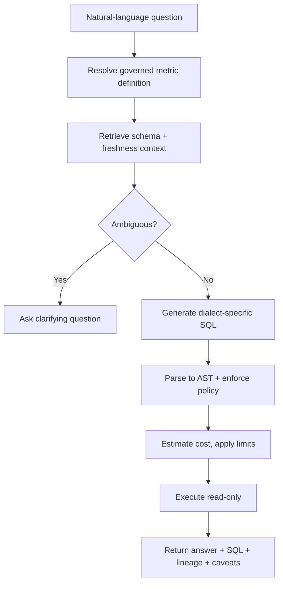

### Non-Functional Priorities: Correctness Over Speed

- Correctness dominates every other axis.
- A fast, confidently wrong answer is the single worst outcome this system can produce — the executive receiving it has no way to know it's wrong: the SQL ran, the chart rendered, and the number looks plausible.
- The system should explicitly trade latency for safety: asking a clarifying question, narrowing scope, or refusing outright are all preferable to guessing.
- Prioritization favors safety and governance controls over breadth of coverage — depth on a narrow slice beats shallow coverage of the whole warehouse.

### Defining "Good" for an MVP

- "Good" is measured by whether the system can reliably answer **ten governed metrics** with full lineage and explainability before it is trusted with anything broader.
- If the assistant cannot reliably answer ten metrics with full explainability, it is not ready to become a general interface to the warehouse.

## 4. Architecture and End-to-End Flow

### The Component Architecture

- The architecture is a chain of trust boundaries, best explained as a dependency-ordered chain rather than a flat list of boxes.
- A user question arrives at the **Query API**, which authenticates the caller and resolves their **entitlements** (what they're allowed to see). From there:
  1. The **semantic metric registry** is consulted first — before touching physical tables — because a question like "What was revenue last week?" must anchor on the governed definition of revenue before the system starts searching for tables.
  2. The **schema retriever / catalog cache** pulls only the tables, joins, and freshness information needed for the likely answer — it does not expose the whole warehouse schema.
  3. If the question could map to multiple governed metrics or grain levels, the system **identifies ambiguity** and asks a clarifying question rather than guessing. A valid SQL query that answers the wrong business question is still a failure.
  4. The **SQL generator** produces dialect-specific SQL using the metric definition, relevant schema, and warehouse dialect — it should not freewheel across the entire catalog, only work from a narrowed context.
  5. The candidate SQL is parsed into an **AST** and passed through the **policy validator**, which inspects the structured tree (not raw text) to reject dangerous constructs: data modification statements, unbounded cross joins, unauthorized tables, unexpected functions, or queries that would violate the customer's scan budget.
  6. If the query passes policy, the system **estimates cost**, applies timeout and row limits, and submits it through a **read-only execution gateway** — a key trust boundary that should hold the narrowest possible credentials and no write path.
  7. The **result summarizer** returns the answer, the exact SQL used, metric lineage, and any caveats (for example, that the query used the latest available snapshot).

### Systems of Record, Caches, Queues, and External Dependencies

- **Systems of record:** identity provider, metric registry, warehouse catalog, the warehouse itself, policy store.
- **Caches:** schema snippets, metric lookups, recent query plans, possibly approved query fingerprints.
- **Queues:** metadata refresh queue, evaluation replay queue, analytics/event pipeline.
- **External dependencies:** warehouse engine, LLM or model endpoint, observability stack, possibly a secrets manager and email/chat system for alerts.

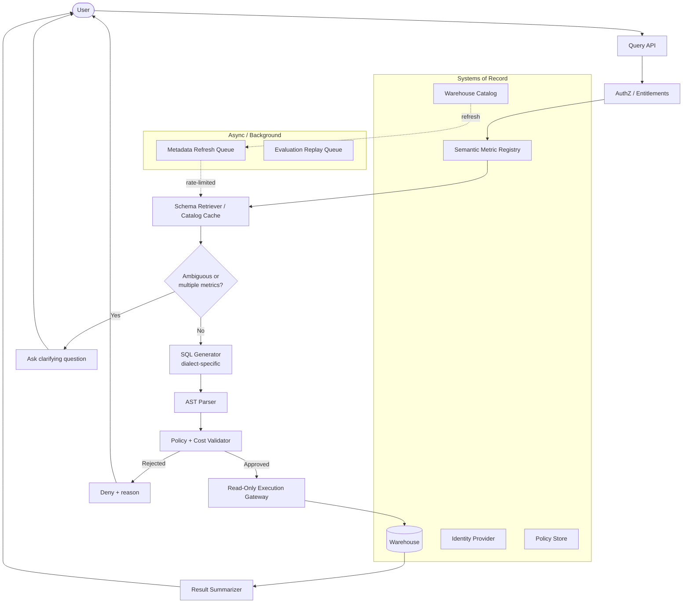

> 🎯 **Interview Pointer:** Be ready to narrate this diagram end-to-end, naming which boxes are systems of record vs. caches vs. queues. Interviewers use this to test whether you actually understand state ownership, not just whether you can draw boxes.

### The Happy-Path Sequence

- The concise sequence an interviewer can follow from first click to trusted result:
  1. Authenticate and determine data entitlements.
  2. Retrieve metrics and schema context.
  3. Identify ambiguity.
  4. Generate dialect-specific SQL.
  5. Parse AST and enforce policy.
  6. Estimate cost and execute with limits.
  7. Return result, SQL, lineage, and caveats.

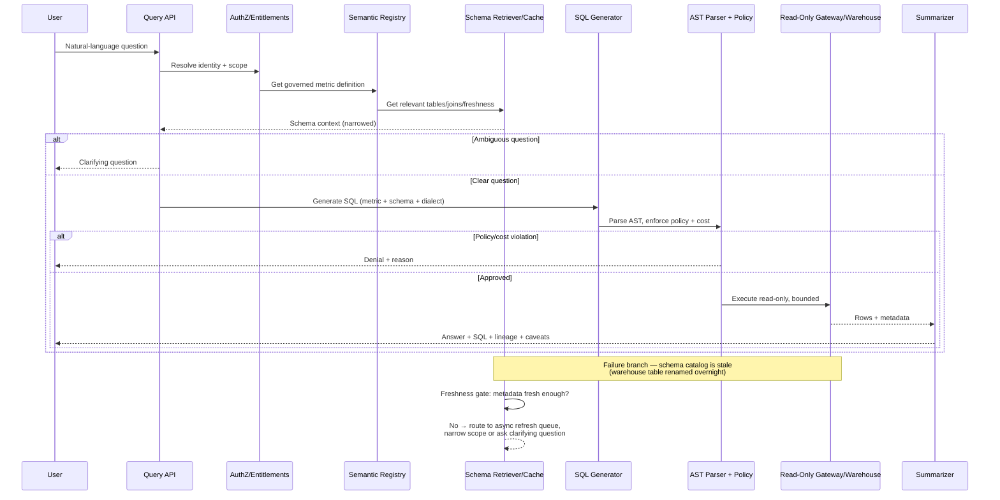

### A Failure Path That Changes the Design

- Named failure: the schema catalog is stale because a warehouse table was renamed overnight.
  - The request still authenticates.
  - The metric registry still identifies the governed definition.
  - The schema retriever pulls a stale join path from cache.
  - If the system blindly generates SQL, the warehouse execution fails — or worse, succeeds against the wrong table alias if a similarly named object exists.
- The safer design makes the retriever **freshness-aware**: if metadata is stale beyond a threshold, it refreshes through an asynchronous queue before allowing generation, or falls back to a narrower supported question set.
- **Backpressure and flow control** belong here: crawler and registry refresh jobs should not stampede the warehouse or metadata source during peak query traffic.
  - Put them behind a queue, rate-limit refresh bursts, and let the query API degrade gracefully when metadata confidence drops.
  - That keeps the customer-facing path responsive even when background maintenance is catching up.
- Design principle: if freshness is uncertain, do not pretend precision. Either refresh, narrow the supported surface area, or ask a clarifying question — safer than executing a query whose logic depends on stale schema assumptions.

### Trust Boundaries, State Ownership, and Consistency Points

- Three kinds of state, each with a clear owner:
  - **System of record.** The warehouse catalog or lineage store owns physical schema truth; the semantic metric registry owns business definitions; the identity provider owns authentication; the entitlement or policy store owns access decisions.
  - **Cache.** The schema retriever may cache table shapes and metric lookups, but only as a performance layer. Cached metadata should have TTLs and version stamps so the system can explain what it used.
  - **Derived session state.** Question interpretation, candidate SQL, AST, validation result, and execution trace are short-lived workflow state. They should not become hidden durable state unless the product later needs audit replay or human-approval workflows.
- Consistency points should be explicit:
  - Re-check entitlement and policy at the moment of execution, not only at query planning time.
  - If a user loses access between planning and execution, the gateway should refuse the query.
  - If the metric registry version changes materially, the system should not silently reuse an old interpretation.

### Synchronous vs. Asynchronous Boundaries and Partitioning

- The customer-visible path stays mostly synchronous: auth, entitlement lookup, metric retrieval, ambiguity check, generation, policy validation, and query execution — because the user is waiting for an answer.
- Expensive or repetitive work stays asynchronous: catalog crawling, metric refreshes, embedding/indexing updates, query evaluation logging, offline regression tests, usage analytics. These live in background jobs fed by queues.
- Useful interview phrase: "Anything that must be correct *before* one answer is returned stays synchronous; anything that improves future answers can be asynchronous."
- **Partitioning key** is an explicit design decision, not an implementation detail:
  - If metadata refresh jobs, evaluation replays, or audit events are queued, the partitioning key should preserve the natural isolation boundary — often tenant, warehouse, region, or dataset family.
  - Prevents one noisy customer or one large catalog refresh from starving unrelated work.
  - The key choice shapes replay ordering: partition by tenant to preserve per-tenant event order; partition by source domain to parallelize crawl work by dataset family.

### Component Responsibility Table

- Every component in the diagram should answer: who owns this state, how fresh is it, and why does it exist?

| Component | Responsibility | State owner | Boundary type | MVP or later |
|---|---|---|---|---|
| Catalog crawler | Ingest warehouse schema, comments, freshness, lineage | Warehouse metadata source | Async background | MVP if warehouse is small; later if manually seeded initially |
| Semantic metric registry | Governed metric definitions and allowed grains | Product/data governance | Sync read, async update | MVP |
| Schema retriever | Fetch relevant tables, joins, freshness, permissions | Cache with source-of-record fallback | Mostly sync | MVP |
| SQL generator | Produce dialect-specific candidate SQL | Stateless service | Sync | MVP |
| AST parser | Normalize and inspect candidate SQL | Stateless service | Sync | MVP |
| Policy and cost validator | Enforce entitlement, query shape, scan limits, and execution rules | Policy store | Sync | MVP |
| Read-only execution gateway | Submit approved queries with limits and audit | Warehouse credentials / gateway | Sync | MVP |
| Result summarizer | Convert rows into explanation, SQL, lineage, caveats | Stateless service | Sync | MVP |
| Evaluation harness | Replay prompts, compare outputs, detect regressions | Test corpus / telemetry store | Async | Later evolution, but useful early |

> 🎯 **Interview Pointer:** If an interviewer asks "why is this component here?" and you can't name its state owner and MVP-vs-later status from this table, that's a signal the box was premature — practice defending each row cold.

### What Belongs in the MVP, and What Can Wait

- MVP: metric registry, schema retrieval, generation, AST validation, read-only execution, summarization, and a thin evaluation harness — enough to prove the assistant can answer a governed business question safely.
- Later evolution: richer query planning, human approval for ambiguous cases, learned query ranking, federated data sources, embedded semantic search over data dictionaries, more sophisticated offline scoring.
- Those additions help, but are not the first thing to build if the primary problem is "executives need answers they can trust."

### Job-Market Signal and Takeaway

- This section demonstrates a skill FDE interviewers value heavily: decomposing one customer promise into a usable system and explaining it to both technical and nontechnical stakeholders.
- The architecture is only convincing if you can narrate how policy, identity, metadata, execution, and explanation all line up behind the customer outcome.
- The diagram is useful only when you can narrate data, identity, state, and failure through it.
- If you can trace one request, name the systems of record, identify sync/async boundaries, and explain why a stale metadata cache changes behavior, you are defending an architecture that can ship — not just drawing boxes.

## 5. Data Model, APIs, and Working Code

### Core Records and Their Lifecycle

- The safest way to prove this design is to stop talking about "AI" and name the state that actually has to survive production: metrics, schema assets, and query runs.
- Once those records are explicit, the API surface becomes smaller, the policy checks become testable, and the assistant stops being a vague chat layer and starts behaving like a governed system.
- **Metric** — the semantic contract the business trusts.
  - Fields: `id` (stable primary key), `name`, `definition`, `dimensions`, `owner`, `version`.
  - `definition` pins the business meaning in prose or structured metadata; `dimensions` tell the model what slicing is allowed; `owner` identifies the accountable domain team; `version` matters because the same metric name can evolve without silently breaking downstream interpretation.
  - Lifecycle: draft → review → approved → deprecated.
  - Retention should keep historical versions long enough that an older dashboard answer can be reconstructed and explained, not just overwritten.
- **SchemaAsset** — what the warehouse physically exposes; the bridge between natural language and the actual queryable surface.
  - Fields: `id` (primary key), `engine`, `object`, `columns`, `sensitivity`.
  - `engine` matters because SQL dialects differ; `object` identifies a table or view; `columns` includes names and types; `sensitivity` captures whether a column is public, internal, restricted, or masked.
  - Lifecycle tracks discovery and refresh events whenever schema changes.
  - Retention should preserve enough history to explain why a generated query was valid last week and invalid today.
- **QueryRun** — the audit trail for every attempted answer.
  - Fields: `id` (primary key), `actor`, `sql_hash`, `policy_decision`, `bytes_scanned`, `result_ref`.
  - `sql_hash` keeps the raw SQL from becoming the only durable artifact; `policy_decision` records allow/deny and why; `bytes_scanned` ties the run to a cost envelope; `result_ref` points to the stored answer or failure payload.
  - Should be write-once, append-only, retained per the customer's audit and analytics policy — query history is often the first place incident review or adoption analysis starts.

> 🎯 **Interview Pointer:** Memorize the three records and their primary purpose (Metric = semantic contract, SchemaAsset = physical surface, QueryRun = audit trail) — interviewers commonly ask "what state actually has to survive production here?" and this is the crisp answer.

### Contracts the Interviewer Expects You to Make Concrete

- The point of the API layer is not to enumerate endpoints mechanically — it's to show how each endpoint expresses idempotency, versioning, authentication, and error semantics.
- **`POST /v1/analytics/questions`** — accepts a user question, workspace/tenant context, and an idempotency key.
  - Authenticates the caller with the same workspace-scoped identity used for warehouse access; rejects cross-tenant access.
  - Returns 202 or 200 depending on whether generation is asynchronous or served from cache.
  - Response includes a request id, an eventual `query_run_id`, and optionally a short explanation of the chosen metric or policy gate.
  - Resubmitting the same idempotency key returns the original outcome instead of creating a new run.
  - Errors distinguish: unauthorized, ambiguous question, policy denied, schema unavailable, execution failed.
- **`POST /v1/analytics/validate`** — the narrowest safe surface for the dangerous part: generated SQL.
  - Accepts a SQL AST or normalized SQL representation, authenticates the caller.
  - Returns an approval decision, a denial reason, and any budget or policy violations.
  - Useful both for the assistant runtime and for offline tests.
  - Idempotent for the same AST + policy version; returns the same decision blob unless the policy bundle or schema snapshot version changes.
- **`GET /v1/metrics/{id}`** — returns the current metric definition and versioned metadata.
  - Response includes version, owner, last updated time, and deprecation state.
  - Caller can request a specific version when reproducibility matters.
  - Authentication is read-only scoped; errors include not found, forbidden, and version-mismatch/stale-reference cases.
- **`POST /v1/query-runs/{id}/feedback`** — records whether the answer was useful, wrong, or unsafe.
  - Bound to the exact run version and cannot overwrite prior audit facts.
  - Request includes feedback type, optional free-text note, caller identity; response confirms persistence with the stored feedback id or a duplicate-no-op if replayed.
  - Errors distinguish not found, forbidden, and conflict if the caller tries to mutate a final feedback state.
- The API story should make four things obvious: the caller is authenticated, the write is idempotent where retries are expected, the response exposes the versioned artifact that mattered, and error semantics are precise enough for a client to react without guessing.

### Idempotency and Versioning Rules

- Idempotency belongs on every write boundary where retries are plausible: question submission, validation requests that trigger persisted decisions, feedback writes, and any asynchronous task enqueue.
- Versioning belongs on every artifact that influences behavior: metric definitions, schema snapshots, policy bundles, and the generated SQL plan.
- A design that ignores versioning usually works in the happy path and fails in the first real rollout.

### The Smallest Risky Code Path

- The highest-risk component is not the chat UI or the summarizer — it's the transition from generated SQL to an approved, read-only query.
- The candidate should zoom there first and implement the smallest code path that proves the design can work safely.

```python
from dataclasses import dataclass
from typing import Protocol, Sequence

class PolicyError(Exception):
    pass

class BudgetError(Exception):
    def __init__(self, bytes_scanned: int):
        super().__init__(f"Query exceeds byte limit: {bytes_scanned}")
        self.bytes_scanned = bytes_scanned

class ParseError(Exception):
    pass

@dataclass(frozen=True)
class Actor:
    id: str
    byte_limit: int

@dataclass(frozen=True)
class QueryPlan:
    sql: str
    assets: Sequence[str]
    max_rows: int
    timeout_s: int

class SqlAst:
    statement_type: str

class SqlParser(Protocol):
    def parse_one(self, sql: str) -> SqlAst: ...

class Catalog(Protocol):
    def resolve_assets(self, ast: SqlAst) -> Sequence[str]: ...

class PolicyEngine(Protocol):
    def require_all(self, actor: Actor, action: str, assets: Sequence[str]) -> None: ...

class Warehouse(Protocol):
    def explain(self, sql: str) -> str: ...

def approve(sql: str, actor: Actor, sql_parser: SqlParser, catalog: Catalog,
            policy: PolicyEngine, warehouse: Warehouse) -> QueryPlan:
    try:
        ast = sql_parser.parse_one(sql)
    except Exception as exc:  # parser-specific failures are mapped to a boundary error
        raise ParseError("Invalid SQL") from exc

    if getattr(ast, "statement_type", None) != "SELECT":
        raise PolicyError("Only read-only queries are permitted")

    assets = catalog.resolve_assets(ast)
    if not assets:
        raise PolicyError("Query must reference governed assets")

    policy.require_all(actor, "read", assets)

    estimate = warehouse.explain(sql)
    if estimate.bytes_scanned > actor.byte_limit:
        raise BudgetError(estimate.bytes_scanned)

    return QueryPlan(sql=sql, assets=tuple(assets), max_rows=10_000, timeout_s=30)
```

- **Line-by-line intent:** `Actor` carries the caller identity and the byte budget that enforces the read-only cost envelope. `QueryPlan` is the approved contract returned after policy and budget checks. The parser, catalog, policy engine, and warehouse are typed interfaces so the implementation remains testable and replaceable.
- Inside `approve`: parsing happens first so malformed SQL fails before any metadata lookup or warehouse estimation; the read-only gate rejects non-`SELECT` statements early; asset resolution ensures the query touches governed objects rather than an accidental scratch table; policy enforcement checks the actor is entitled to read every referenced asset; the warehouse `explain` call estimates cost without executing, and the byte limit prevents runaway scans before they hit production; the returned plan clamps row count and timeout so the runtime remains bounded even if the downstream executor misbehaves.
- This sketch intentionally omits concurrency control, retries, backoff, telemetry correlation, and persistence. In production, the approval path should emit structured logs and traces at each decision point, record the policy version and schema snapshot used, and persist the query run with an idempotency key so duplicate submissions do not fan out into duplicate warehouse work.

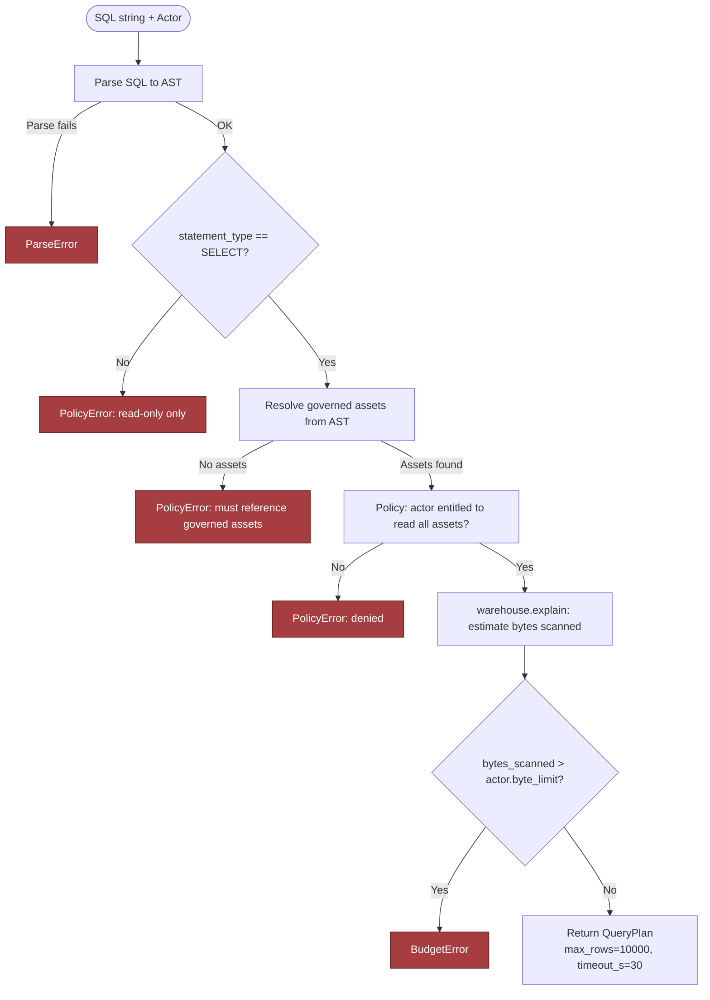

### Tests That Defend the Contract

```python
class AllowAllPolicy:
    def require_all(self, actor, action, assets):
        return None

class FakeEstimate:
    def __init__(self, bytes_scanned: int):
        self.bytes_scanned = bytes_scanned

class FakeWarehouse:
    def __init__(self, bytes_scanned: int):
        self.bytes_scanned = bytes_scanned

    def explain(self, sql: str):
        return FakeEstimate(self.bytes_scanned)

def test_contract_approves_select_within_budget():
    actor = Actor(id="user-1", byte_limit=1_000)
    plan = approve(
        "SELECT * FROM warehouse.sales.orders",
        actor,
        FakeParser(FakeAst("SELECT")),
        FakeCatalog(),
        AllowAllPolicy(),
        FakeWarehouse(bytes_scanned=250),
    )
    assert plan.max_rows == 10_000
    assert plan.timeout_s == 30
    assert "warehouse.sales.orders" in plan.assets

def test_failure_injection_rejects_oversized_query():
    actor = Actor(id="user-1", byte_limit=100)
    with pytest.raises(BudgetError) as exc:
        approve(
            "SELECT * FROM warehouse.sales.orders",
            actor,
            FakeParser(FakeAst("SELECT")),
            FakeCatalog(),
            AllowAllPolicy(),
            FakeWarehouse(bytes_scanned=10_000),
        )
    assert exc.value.bytes_scanned == 10_000
```

- These are deliberately small, but they prove the safety boundary.
  - The first test is the contract test: asserts a valid, governed, read-only query results in a predictable plan.
  - The second is the failure-injection test: simulates a valid query that becomes unsafe because its cost estimate exceeds the actor's limit.

### Duplicate Requests and Optimistic Concurrency

- If an executive clicks twice or a client retries after a timeout, the system should not create two query runs with two separate side effects.
- The idempotency key on `POST /v1/analytics/questions` lets the service return the original `QueryRun` if the same caller resubmits the same intent.
- Optimistic concurrency matters when updating metric definitions or schema assets: the client should include the expected version, and the server should reject stale writes instead of silently overwriting a newer approval.
- That is how you preserve data ownership and prevent one team from changing the meaning of another team's metric without detection.

### Why This Moves the Job Conversation Forward

- This is the point where an FDE answer stops sounding like architecture theater and starts sounding like something that could ship.
- You are showing that you can move from a customer promise to concrete records, API contracts, typed validation, and a safe implementation slice.
- That is the production-grade leap interviewers look for: not just describing the system, but translating the risky part into code, tests, and boundaries the team can trust.
- Strongest closing sentence: the assistant is credible only when the state transitions are explicit, the contracts are versioned, and the generated SQL cannot escape typed validation and policy checks before the warehouse ever sees it.

## 6. Security, Reliability, and Failure Handling

### The Failure That Survives Unit Tests

- The design review gets harder when the query is correct and the answer is still wrong — that is the failure that survives unit tests and still misleads an executive.
- Security and operations assume the assistant can produce syntactically valid SQL, connect to the warehouse, and return a polished answer — then inject the failure that matters: the SQL is valid, the answer is plausible, and it answers the wrong business question.
- The candidate's job is not just to block bad SQL; it is to contain impact, preserve evidence, and make the error visible before anyone acts on it.
- The assistant is a constrained system with multiple gates: read-only credentials, warehouse-native row and column policies, SQL parsing, result masking, and auditable execution records.
- Each gate reduces risk differently — together they create defense in depth: if one layer fails, the others still narrow the blast radius.

### Threat Model the Controls, Not Just the Model

- **Control 1 — Least privilege.** The assistant uses a read-only identity that can inspect only approved datasets and only the operations required for analysis.
  - Prevents a prompt injection or bad planner output from turning into a write, delete, or privilege-escalation event.
  - Abuse case: a user tries to ask for hidden customer emails or internal staff data. The safe response is not "the model will probably refuse" — it's that the warehouse identity cannot read that column, and the query is rejected before execution.
- **Control 2 — Reuse warehouse-native row/column policies** rather than reimplementing authorization in application code.
  - If the warehouse already knows which tenant, region, or role can see which slice of data, let the warehouse enforce it.
  - Keeps policy close to the data; avoids the classic bug where the application filters one path but forgets another.
  - Makes blast radius legible: an error in one tenant's policy should not expose another tenant's data; an error in one workflow should not grant broad access to the whole corpus.
- **Control 3 — Parse SQL rather than regex-filter it.**
  - Regex can spot obvious `DROP TABLE` strings but cannot reliably understand aliases, nested selects, CTEs, comments, obfuscation, or harmless-looking subqueries that become unsafe after rewrite.
  - A parser lets you inspect structure: statements allowed, tables allowed, columns allowed, joins allowed, functions allowed, limits present, aggregate semantics acceptable.
  - Interview signal: safety depends on syntax trees and policy rules, not pattern-matching theater.
- **Control 4 — Result hygiene.**
  - Mask sensitive fields in the response path; log hashes or redacted fingerprints instead of raw data when auditability is needed.
  - Gives operations a way to correlate events without creating a second leakage channel in logs.
  - If the assistant returns a customer list or a partially redacted summary, logs should show enough evidence to reconstruct the decision path while avoiding a replayable copy of sensitive output.

### Proving the Hidden-Column Invariant

- Concrete implementation sketch proving that an actor without permission cannot query a hidden column even if the SQL text is syntactically valid.

```python
class PolicyError(Exception):
    pass

@dataclass(frozen=True)
class Actor:
    name: str
    permitted_columns: frozenset[str]

marketing_user = Actor(name="marketing", permitted_columns=frozenset({"customer_id", "country", "plan"}))

def parse_selected_columns(sql: str) -> list[str]:
    """Very small teaching parser for a constrained interview sketch.

    Production code should use a real SQL parser and dialect-aware validation.
    """
    normalized = " ".join(sql.strip().split())
    upper = normalized.upper()
    if not upper.startswith("SELECT ") or " FROM " not in upper:
        raise PolicyError("Only simple SELECT queries are allowed in this sketch")

    select_part = normalized[7 : upper.index(" FROM ")].strip()
    if select_part == "*":
        raise PolicyError("Wildcard selects are not allowed")

    columns = [c.strip() for c in select_part.split(",")]
    if any(not c for c in columns):
        raise PolicyError("Malformed column list")
    return columns

def approve(sql: str, actor: Actor) -> bool:
    columns = parse_selected_columns(sql)
    denied = [col for col in columns if col not in actor.permitted_columns]
    if denied:
        raise PolicyError(f"actor {actor.name} may not access columns: {', '.join(denied)}")
    return True

def test_rejects_hidden_column_exfiltration():
    sql = "SELECT email FROM customers"
    with pytest.raises(PolicyError):
        approve(sql, actor=marketing_user)
```

- This test proves the invariant in a small, readable way: a valid SQL string is still rejected when it requests a column outside the actor's permissions.
- In a real service, the parser would be dialect-aware, the policy source would come from the warehouse or a centralized policy registry, and the decision would be logged with redacted evidence and hashes rather than raw results.
- This section is a production judgment test, not just security hygiene — employers want to know whether you can own the safe rollout, support, and incident response for a customer-facing analytics assistant.
- The strongest FDE answer is not "the model is accurate enough." It is: every external dependency and irreversible action has an explicit failure and recovery policy, and the system is designed so a bad answer cannot quietly become a trusted business decision.

### The Failure Policy Table

- A strong FDE answer says exactly what fails open, what fails closed, what degrades, what queues, and what escalates to a human. This is a design decision, not an afterthought.

| Situation | Preferred policy | Why |
|---|---|---|
| Authorization or policy evaluation fails | Fail closed | Better to deny than to expose data accidentally |
| Warehouse connection is briefly unavailable | Degrade or queue, depending on freshness needs | Preserve request intent if the use case tolerates delay |
| Query planner exceeds a safe timeout | Fail closed with a retry suggestion | Prevent runaway cost and long-tail blocking |
| Low-risk formatting or explanation service fails | Degrade | User may still get a safe, reduced answer path |
| Ambiguous metric mapping or business-definition conflict | Human intervention | A wrong answer is worse than a slower answer |
| Execution produces a suspicious row count or scan volume | Fail closed and alert | Treat unexpected scale as a probable correctness or cost issue |

- This table matters because the assistant sits at the intersection of customer trust, cost control, and safety.
- Not every incident deserves the same reaction: a policy engine outage differs from a visualization glitch, and a query scan that explodes cost differs from a benign cache miss.

> 🎯 **Interview Pointer:** Memorize the fail-open vs. fail-closed pattern by category (auth → closed, connectivity → degrade/queue, ambiguity → human, suspicious scan → closed + alert). This table is exactly the kind of artifact interviewers ask you to reproduce on a whiteboard.

### Failure Drill 1: Valid SQL Answers the Wrong Business Question

- The critical incident drill. The assistant returns an answer that is formally correct against the warehouse but semantically wrong for the executive's intent.
- Example: the user asks for "active customers," but the assistant quietly uses login activity when the business definition requires paid activity. The SQL returns rows, the chart renders, and the executive is about to make a decision.
- Response sequence:
  1. **Detect** — compare the generated query against governed metric metadata, approved aliases, and business-definition constraints; flag if the assistant selected a metric or join path that conflicts with the approved definition.
  2. **Contain** — stop publication of the answer, mark the run as blocked, prevent downstream sharing.
  3. **Preserve evidence** — store the prompt hash, SQL text, policy decision, version identifiers for schema and metric assets, and the reason for rejection. Do not erase the trail just because the answer was wrong.
  4. **Recover** — route the user to a clarified metric choice or a human-reviewed path.
  5. **Prevent** — add or tighten the metric mapping, test case, or disambiguation prompt so the same semantic mistake is harder to repeat.
- Demonstrates blast-radius thinking: the issue is scoped by tenant, workflow, metric family, and dependency — not "all analytics is broken." One wrong definition should not compromise unrelated tenants or dashboards.

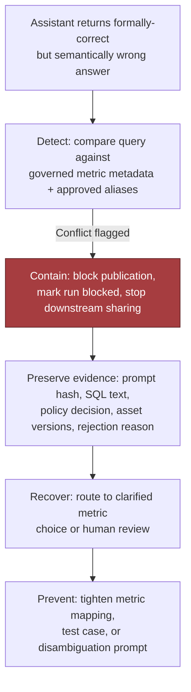

> 🎯 **Interview Pointer:** This is the headline failure drill of the whole chapter. Be able to narrate Detect → Contain → Preserve → Recover → Prevent from memory — it's the answer to "what happens when the model is confidently wrong?"

### Failure Drill 2: Schema Changes Invalidate Examples

- When a warehouse schema changes, previously good examples may become stale: a column disappears, a table is renamed, or a join key shifts.
- The assistant should detect this during plan validation rather than waiting for a failed warehouse call.
- Correct behavior: fail closed on the affected template, refresh the schema cache, and queue a review if the business definition itself changed.
- Schema drift is a common source of silent failure because the system may still produce something that looks reasonable.

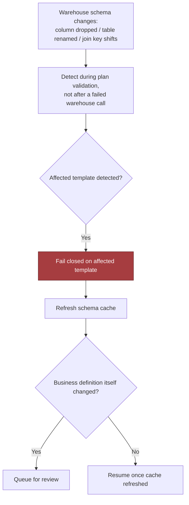

### Failure Drill 3: A Generated Join Multiplies Rows

- Join explosions are dangerous because they can inflate totals while still producing valid SQL.
- The assistant should validate join cardinality assumptions where possible, compare expected row counts against heuristics, and block suspicious fan-out unless the user explicitly asked for a detailed expansion.
- If the assistant cannot prove the join is safe, the failure policy is to refuse or downgrade the query — not to hope the aggregate still looks plausible.

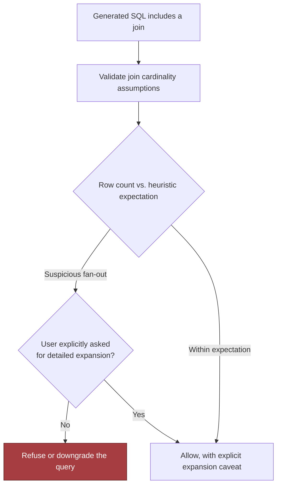

### Failure Drill 4: A Query Scans Excessive Data

- Cost is a reliability issue: a query that reads too much data can exhaust concurrency, slow down other tenants, or drive an unexpected bill.
- The assistant should enforce query limits, timeouts, and planner guards; prefer bounded date windows, pre-aggregations, and explicit user confirmation when a request would scan beyond a configured threshold.
- If the scan is excessive, fail closed or ask for narrowing criteria — do not let the model "just try it."

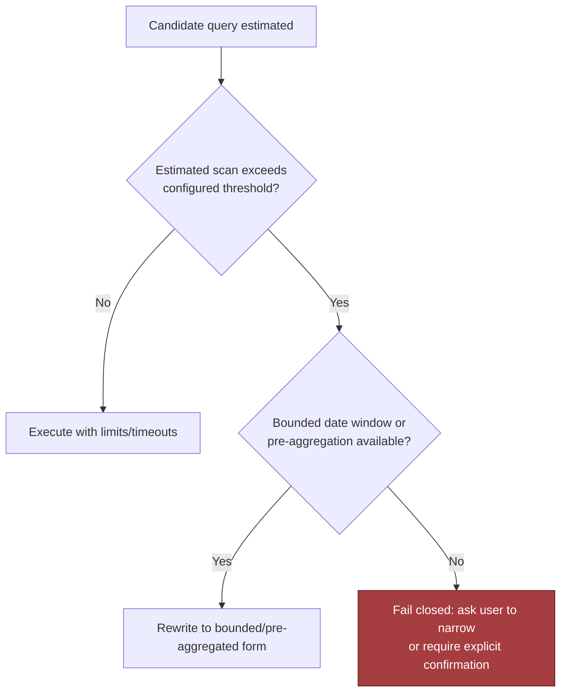

### Failure Drill 5: The Summary Contradicts the Table

- The subtle postprocessing bug: the generated table is correct, but the natural-language summary misstates the totals, trend, or comparison.
- Dangerous UX failure because the executive reads the prose, not the rows.
- Remedy: generate the summary from the structured result, cross-check key values, and reject any summary whose numbers do not match the returned table.
- If the summary generator is down or untrusted, degrade to the table alone rather than fabricate confidence.

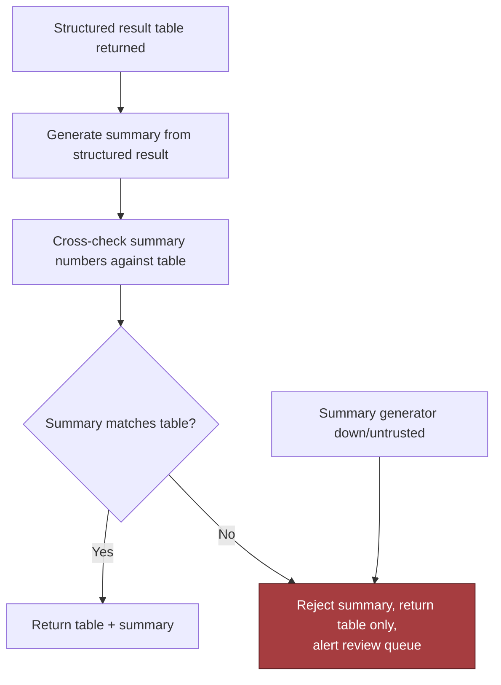

### Operational Safeguards: Timeouts, Retries, Dead Letters, Escalation

- Explicit timing and retry behavior at every boundary:
  - A warehouse query should have a bounded timeout.
  - A retry should be limited and idempotent, and should only happen when the failure mode is likely transient.
  - A policy evaluation failure should not be retried indefinitely — repeated failure on a bad prompt or bad policy is not a network glitch.
- A queue-based fallback can help with transient warehouse outages or downstream report delivery, but a dead-letter path is required when repeated attempts still fail.
  - The dead-letter record should preserve enough context for support to diagnose the issue without exposing raw sensitive output.
- Human escalation is part of the design, not a sign of weakness.
  - Any ambiguous metric mapping, conflicting policy, or repeated semantic mismatch should have a clear route to a reviewer.
  - Production systems need operators, support playbooks, and decision points where a person is the correct recovery mechanism.

### The Observability Story Is the Evidence Story

- Before launch, you need audit evidence and runbooks.
- The audit trail should show: who asked, what identity executed, which policy version was applied, which schema version was queried, what data was returned, and why the system approved or rejected the request.
- Runbooks should cover: blocked queries, policy failures, stale schema refresh, suspicious scan volume, semantic mismatches — and tell operations how to pause the assistant, preserve logs, notify the owner, and restore service without opening a broader hole.
- Compact failure-policy sketch, narrated as a flow:

```
request received
  -> authenticate user
  -> authorize against tenant + role + metric policy
  -> parse SQL AST
  -> validate tables, columns, joins, limits, and query shape
  -> if policy or semantic check fails: reject + log redacted evidence
  -> execute with read-only identity and warehouse-native RLS/CLS
  -> if scan/time budget exceeded: cancel + surface safe fallback
  -> if results pass checks: mask sensitive fields
  -> generate summary from structured result
  -> if summary mismatch detected: return table only, alert review queue
```

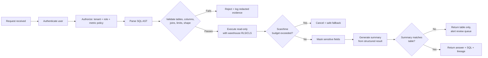

- This section is a production judgment test, not just security hygiene — the hard part is knowing what to do when the assistant is fast, plausible, and wrong; when a schema change breaks examples; when a join explodes the result set; when scans threaten cost and latency; and when the summary text disagrees with the table.
- The strongest FDE answer: every external dependency and irreversible action has an explicit failure and recovery policy, and the system is designed so a bad answer cannot quietly become a trusted business decision.

## 7. Delivery Plan, Observability, and Business Impact

### What the Rollout Has to Prove

- The prototype works — the customer's next question is "when can this be trusted in production?"
- The real FDE move: convert the architecture into staged delivery, measurable gates, and named ownership rather than a vague promise or a giant launch date.
- For this assistant, the rollout must prove three things in order:
  1. The assistant can answer a narrow set of governed questions correctly.
  2. It can do so safely under policy.
  3. Real users will adopt it because it improves their workflow rather than merely impressing them in a demo.

### The Four-Phase Rollout

- A practical deployment sequence starts small and gets broader only after the evidence is strong enough to justify the next step.
- **Phase 1: start with ten governed metrics.**
  - Choose a tiny slice of the warehouse where metric definitions are stable, the owner is known, and business impact is visible (revenue, active customers, pipeline, churn, support backlog, etc.).
  - The point is repeatability, not breadth.
  - **Exit criteria:** metric definitions documented, query templates reviewed, policy checks pass, assistant can explain which metric it used and why.
- **Phase 2: build golden question/SQL/result cases.**
  - A curated test set pairing the user's natural-language question, the approved SQL, and the expected result shape — the system's truth table, not just a unit test list.
  - Include easy examples, ambiguous paraphrases, edge cases with filters/time windows, and known failure traps where a syntactically valid query would answer the wrong business question.
  - Fastest way to detect regressions when prompts, schemas, policies, or warehouse logic change.
  - **Exit criteria:** team can run the golden set on every change, compare execution accuracy and semantic correctness, and explain every failure.
- **Phase 3: shadow analysts before executive release.**
  - The assistant answers real questions in parallel with human analysts, but the user still sees the analyst's output as the source of truth.
  - Analysts mark where the assistant was correct, merely plausible, or wrong for subtle reasons (wrong time grain, wrong business definition, wrong segment filter).
  - Shadowing is where trust is earned, not assumed.
  - **Exit criteria:** assistant consistently matches analyst-reviewed answers on the agreed scope, escalation path is working.
- **Phase 4: expand domain by domain with metric owners.**
  - Each new business area has a named metric owner who approves definitions, reviews golden cases, and owns changes to the semantic layer.
  - The assistant inherits one governed slice at a time, with a clear handoff from implementation team to business owner — this is how the system becomes reusable product leverage instead of a one-off pilot.

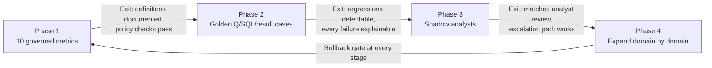

- *Reading guide:* the left-to-right flow represents increasing blast radius, not increasing ambition. The upper band is user-facing maturity (internal test, analyst shadowing, executive release, domain expansion); the lower band is operating guardrails (policy checks, telemetry, review, rollback). Arrows are conditional — the assistant only advances when the prior stage's exit criteria are met.

> 🎯 **Interview Pointer:** Know the four phases by name and their exit criteria cold — "start with 10 governed metrics → golden cases → shadow analysts → domain-by-domain expansion" is a rehearsed, quotable rollout narrative.

### What to Measure, and Why Each Metric Exists

- A rollout is only defensible if metrics are tied to a specific user and system risk. Separate into four buckets so the team does not confuse model quality with operational health or business value.
- **Technical health** — is the service fast, cheap enough, and available?
  - **Bytes scanned per answer**: average warehouse bytes read for a successful response. Calculation: total scanned bytes across successful answers ÷ successful answer count for the reporting window. Source: query telemetry from the warehouse. Owner: data platform or analytics engineering. Alert when the 7-day moving average rises more than 20% above baseline for the governed metric set (signals an inefficient query pattern or broken constraint).
  - **p95 latency**: 95th-percentile end-to-end response time from user request to answer. Calculation: end-to-end request latency distribution from request receipt to final answer render, 95th percentile over the reporting window. Source: request traces. Owner: platform/SRE, or security/platform. Alert immediately on any escaped policy violation, and on repeated denies above a low tolerance (e.g., more than five identical blocked attempts in a day — often indicates a broken guardrail or confusing product flow).
- **Adoption** — do people actually use the assistant?
  - **User trust score**: a lightweight post-answer rating or periodic survey of whether the answer was useful, understandable, and safe to rely on. Calculation: average of normalized in-product ratings, or percent of responses marked useful/trustworthy in the survey window. Source: in-product feedback. Owner: product or customer success. Alert when the score falls below the launch target (e.g., 4.2/5 or 80% positive), or declines for two consecutive review periods even if raw usage rises.
- **Business outcome** — did the workflow improve?
  - Answer turnaround time before and after rollout.
  - Analyst escalation volume for the governed metric set.
  - Executive self-service rate for the targeted questions.
  - These matter because a successful assistant does not just generate more traffic — it changes behavior. If executives keep asking analysts to re-check answers, the product has not solved the customer problem.

### What the Dashboard Should Show

- A useful dashboard connects user outcome to component telemetry rather than dumping unrelated service metrics into one page.
- The customer should be able to answer three questions at a glance: is the assistant healthy, is it correct, and is it valuable?
- A strong layout is layered:
  - **Top row: business outcome.** Self-service rate, analyst escalation rate, user trust score.
  - **Middle row: model quality.** Execution accuracy, semantic correctness, clarification rate, policy violation count.
  - **Bottom row: system health.** p95 latency, bytes scanned per answer, error rate, dependency availability.
- Connect each business metric to the component that can move it. If trust drops, the chart should help you see whether the cause is slow answers, too many clarifications, broken semantic mapping, or policy blocks that feel arbitrary.
- That is observability in the FDE sense: the dashboard should tell you where to act, not just what is red.

### Ownership, Gates, and Rollback

- A production plan without owners is just a hope. Every rollout step needs a named owner and a go/no-go gate.
  - **Metric owner** — approves the governed metric definition and its golden cases.
  - **Application owner** — owns the assistant runtime, prompt assembly, query generation, and API contracts.
  - **Data owner** — owns the warehouse tables, semantic layer, and policy mappings.
  - **Security owner** — reviews access control, audit logging, and blocked-query handling.
  - **Support owner** — receives escalation, triages failures, coordinates rollback or remediation.
- The go/no-go gate should answer: do we have enough evidence that the assistant is correct, safe, and supportable for the next slice of users?
- Typical rollback triggers: a spike in policy violations, a sudden drop in semantic correctness, a large increase in bytes scanned per answer, or users routing around the assistant because they stop trusting it.
- Rollback is not a failure of discipline; it is the mechanism that keeps a partial success from becoming a customer incident.

### Delivery Items That Make the Rollout Stick

- The rollout is not complete until the customer can operate it without depending on the implementation team for every change.
  - **Canary:** release to a small user group or small metric set first, with tight monitoring and a clearly defined rollback path.
  - **Migration:** move governed questions from legacy analyst workflows into the assistant in stages, not by big-bang replacement.
  - **Training:** teach users what the assistant can answer, what it cannot, and how it signals uncertainty.
  - **Support:** document escalation paths for wrong answers, access issues, and policy rejections.
  - **Documentation:** maintain the governed metric catalog, known limitations, examples of good questions, and guidance on when to ask a clarifying question.
- Decide what should become configuration vs. adapter vs. shared service vs. core product:
  - **Configuration:** metric definitions, allowed domains, rollout thresholds.
  - **Adapters:** warehouse and identity integrations.
  - **Shared services:** query validation, policy enforcement, tracing, audit logging.
  - **Core product:** the assistant's question understanding, explanation behavior, and safe query orchestration.
- This distinction matters because an FDE system creates leverage only when the next customer can inherit the stable core and swap the customer-specific edges.

### A Concrete Risk Register

- A simple risk register is often more convincing than a polished architecture slide because it shows you can operate the system, not just design it.

| Risk | Owner | Mitigation | Trigger |
|---|---|---|---|
| Correct SQL answers the wrong business question | Analytics lead | Golden cases, semantic review, approved metric catalog | A valid query passes execution but fails analyst review |
| Policy block frustrates users | Security + product | Better clarifying prompts and explanation text | Repeated blocked attempts on the same workflow |
| Warehouse cost spikes | Platform owner | Query limits, result caching, scan monitoring | Bytes scanned per answer drifts upward |

### Requirement Coverage and Answer to the Customer

- The prototype becomes production-worthy only when the delivery plan proves safety, correctness, adoption, and supportability in sequence.
- That is the answer to the executive's question: trust is earned through staged rollout, measurable gates, explicit ownership, and the ability to prove business value after launch.

## 8. Interview Walkthrough, Trade-Offs, and Practice

### Minute-Zero Opening: Start With Outcome, Not Architecture

- The strongest opening move: begin where the customer is already hurt — executives want governed natural-language answers with correct definitions and no unsafe queries — not an architecture diagram.

### The 50-Minute Pacing Plan

- **Minutes 5-10: define success and failure.**
  - State success metrics in business language: correct metric interpretation, acceptable latency, low unsafe-query rate, useful adoption by analysts/executives.
  - Name failure modes: a valid SQL query answering the wrong business question, leakage across row-level security, expensive scans that look harmless in a demo but burn warehouse budget in production.
- **Minutes 10-18: sketch the architecture.**
  - Describe the UI, orchestration service, semantic layer, SQL generator, policy engine, warehouse, and observability path.
  - Put the semantic layer in the center if governed metrics matter; raw schema access should be an escape hatch, not the default.
  - The assistant should produce a draft plan, generate SQL against a constrained schema view, validate the query, and either execute automatically or route to approval based on risk.
- **Minutes 18-28: discuss trade-offs.**
  - Cover the major design choices: raw schema prompting vs. semantic layer; automatic execution vs. approval; flexibility vs. query templates; answer speed vs. warehouse cost.
  - Give a reason for each choice, not just a preference; tie each decision back to the customer's outcome.
- **Minutes 28-35: security and correctness.**
  - Explain end to end; ensure the service account cannot query unrestricted data on behalf of users.
  - Avoid letting the model freely rewrite access predicates; if the assistant needs to inspect schema metadata, that metadata should also be filtered to what the user can see.
  - Emphasize defense in depth: identity, policy enforcement, constrained views, query validation, audit logging.

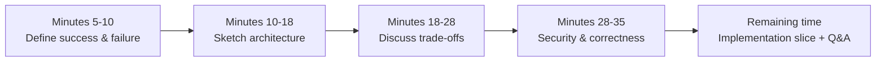

### Named Trade-Offs With Balanced Verdicts

- **Raw schema prompting versus semantic layer.**
  - Raw schema prompting is faster to prototype and works for unusual questions.
  - Balanced answer: default to the semantic layer for governed business metrics; allow raw schema access only for approved exploratory workflows or fallback paths.
- **Automatic execution versus approval.**
  - Automatic execution improves speed and makes the product feel magical; useful for low-risk, repeatable questions with strong guardrails.
  - Full auto-execution is dangerous when the query may touch sensitive rows, incur high cost, or answer an ambiguous request. Approval adds latency/friction but creates a human checkpoint.
  - Practical design: risk-based execution — auto-run only when confidence is high, the query fits an approved pattern, the user has permission, and estimated cost is below a threshold; otherwise show the draft SQL and ask for confirmation or analyst review.
- **Flexibility versus query templates.**
  - Maximum flexibility lets users ask almost anything but expands the search space and makes safety harder.
  - Query templates constrain the assistant to known-good patterns (funnel analysis, weekly cohort summaries, regional revenue rollups) — reduce error rate and cost but can feel brittle on new question types.
  - Best answer: a hybrid — templates for common governed workflows, free-form generation for long-tail questions, and a policy gate deciding when the free-form path is allowed.
- **Answer speed versus warehouse cost.**
  - Fast answers feel good, but unconstrained speed usually means unconstrained scanning.
  - Balanced position: bound the search space with the semantic layer and schema retrieval, cache aggressively for repeat questions, and treat any large or unbounded scan as a signal to narrow scope or ask a clarifying question — not a signal to optimize the query further.

> 🎯 **Interview Pointer:** These four trade-off pairs are the most likely "compare X vs. Y" follow-ups in the interview. Rehearse each one as: name it, give both sides, state the balanced/hybrid verdict, tie back to customer outcome.

### Deliberate Challenge to the Riskiest Assumption

- **How do you handle "revenue" with three definitions?**
  - Name the ambiguity and force clarification. "Revenue" might mean booked, recognized, or cash-collected revenue.
  - The assistant should not guess silently — ask a clarifying question, show the supported definitions, or default only if the business has an approved canonical meaning for that context.
  - If users frequently ask this, put it in the semantic layer with explicit aliases and documentation. The system must surface the definition it used, not hide it.
- **What if the SQL is valid but catastrophically expensive?**
  - Valid SQL is not safe SQL. Add a cost-estimation and policy-check step before execution, looking for large unbounded scans, missing date filters, explosive joins, or queries exceeding table-specific budget thresholds.
  - If estimated cost is too high: ask the user to narrow the question, propose a cheaper rewrite, or require approval from a more privileged role.
  - The system must protect both the warehouse and the user experience.
- **Deliberate challenge to the riskiest assumption.**
  - A strong interviewer will eventually push on the assumption that the model can infer the right business meaning from the prompt — the riskiest assumption in the whole design.
  - Rehearsed structural response: "I would not rely on the model to infer business definitions from raw text. I would anchor every answer to a governed semantic layer, and treat any question that falls outside that layer as an explicit ambiguity to resolve, not a guess to make."

> 🎯 **Interview Pointer:** "The riskiest assumption" question is a common closer. Have the exact rehearsed line ready — anchoring to the governed semantic layer rather than trusting the model to infer meaning — because a vague or defensive answer here reads as a design weakness.

### A Seven-Dimension Scoring Rubric

- **Estimation:** Did you make reasonable assumptions and explain their impact?
- **Architecture:** Did you produce a coherent end-to-end design with the semantic layer, policy checks, execution path, and observability?
- **Depth:** Did you handle ambiguity, cost control, and failure paths rather than staying at diagram level?
- **Security:** Did you address authorization, row-level security, query validation, and auditability?
- **Delivery:** Did you explain rollout gates, fallback behavior, and operational support?
- **Communication:** Did you use a clear executive summary, stay concise, and defend trade-offs directly?
- If you miss one category badly, do not just memorize a better phrase — fix the design gap underneath it.

### A 90-Second Architecture Summary You Can Deliver Aloud

- "We're building a governed natural-language-to-SQL assistant for executives and analysts who need fast answers but cannot afford incorrect metrics or unsafe queries. I'd put a semantic layer between the model and the warehouse so the assistant generates SQL from approved business definitions rather than raw table names. The service would accept a user question, classify intent and risk, resolve the relevant metric definitions, generate a constrained draft query, validate it for policy and cost, and then either execute automatically or route for approval depending on sensitivity and confidence. Row-level security must be enforced in the warehouse, not in the prompt. I'd log the question, the generated SQL, the metric mapping, the cost estimate, the execution result, and the user identity for audit and debugging. The biggest trade-off is flexibility versus correctness: I'd optimize for governed answers first, then add templates and fallback pathways for the long tail. My first rollout gate would be a small set of executive metrics with a golden test corpus and a hard stop on ambiguous or expensive queries."
- That summary is short enough for a live interview and specific enough to show judgment.

### Practice Plan After the Interview

- **Solo exercise:** time yourself giving the 50-minute structure in under ten minutes, then tighten any section that drifts.
- **Pair mock:** have a partner interrupt you with hard follow-ups on equivalent SQL, row-level security, revenue definitions, and expensive queries; answer without rambling.
- **Implementation exercise:** sketch the query validation and approval flow for a single governed metric, including how you would block dangerous SQL and surface clarification prompts.
- The pattern to remember: a strong answer is structured, quantitative, safe, customer-aware, and explicit about trade-offs. If you can keep those five properties in view under pressure, you will sound like someone who can ship this system, not just describe it.

---

## Coverage Notes

This tutorial was reviewed once against the fixed 20-item decomposition rubric before delivery.

**Phase 1 — Problem Framing & Discovery**

- **Item 1 (Feature → business-outcome reframing):** Fully covered — Section 1 reframes "text-to-SQL" as governed decision support.
- **Item 2 (Stakeholder/persona mapping):** Fully covered — Section 2 names executives, analysts, data/platform engineering.
- **Item 3 (Clarifying questions that change architecture):** Fully covered — Section 1 lists six architecture-shaping questions.
- **Item 4 (Requirements split + prioritization):** Fully covered — Section 3 splits functional/non-functional, prioritizes correctness.
- **Item 5 (Explicit non-goals/scope fence):** Fully covered — Section 1 lists three non-goals.

**Phase 2 — Estimation & Architecture**

- **Item 6 (Back-of-envelope scale & capacity math):** Fully covered — implicit via cost/scan-budget mechanics (bytes scanned, byte limits) in Sections 5-6, though no traditional QPS/storage math is given.
- **Item 7 (Unit economics/cost-driver breakdown):** Absent — cost *control* is discussed extensively but no cost-per-query/per-user/margin breakdown.
- **Item 8 (End-to-end architecture & data flow):** Fully covered — Section 4 gives full component fan-out, sequence, and failure overlay.
- **Item 9 (Data model & API contracts):** Fully covered — Section 5 covers three core records and four endpoints in depth.
- **Item 10 (Build-vs-buy/vendor & model-selection trade-offs):** Partial — no discussion of buying a semantic-layer product or LLM vendor selection; assumes build-your-own semantic layer.

**Phase 3 — Trade-offs, Security & Reliability**

- **Item 11 (Named trade-off pairs with balanced verdict):** Fully covered — Section 8 covers four trade-offs with rehearsed verdicts.
- **Item 12 (Threat model/security controls):** Fully covered — Section 6 covers four named controls.
- **Item 13 (Failure-mode & reliability drills):** Fully covered — Section 6 covers five named failure drills plus operational safeguards.
- **Item 14 (Testing strategy):** Fully covered — Section 5 contract/failure-injection tests; Section 6 hidden-column policy test.

**Phase 4 — Delivery, Governance & Communication**

- **Item 15 (Layered evaluation metrics & observability):** Fully covered — Section 7 covers four metric buckets and layered dashboard.
- **Item 16 (Phased rollout/risk register/rollback gates):** Fully covered — Section 7 covers four-phase rollout, risk register, rollback triggers.
- **Item 17 (Regulatory/governance depth):** Absent — no named regulatory frameworks (GDPR, HIPAA, SOC 2); governance content is internal-only (metric ownership, semantic layer authority).
- **Item 18 (Responsible-AI/risk framing beyond obvious failure mode):** Fully covered — present via the "wrong business question" framing throughout Sections 4-6, though framed as correctness/governance risk rather than bias/fairness risk.
- **Item 19 (Change-management/adoption narrative):** Fully covered — Section 7 covers training, migration, canary, adoption metrics.
- **Item 20 (Structured communication plan + self-scoring rubric):** Fully covered — Section 8 covers the pacing plan, rubric, and 90-second summary.

**Summary: 16/20 Fully covered, 1/20 Partial, 2/20 Absent.** No content was fabricated to close these gaps; where the source chapter does not address a rubric item, it is marked Absent or Partial above rather than invented.

### My Perspective on the Gaps

*The following is supplementary perspective added for this v2 cram guide — not sourced from the original chapter. It reflects one way to answer these gaps live, grounded in this chapter's own architecture.*

**Item 7 — Unit economics/cost-driver breakdown.**
- The chapter gives you the raw material for a unit-economics story but never assembles it: `bytes_scanned` lives on every `QueryRun` record (Section 5), and the technical-health metric bucket already tracks bytes scanned per answer (Section 7). In a live interview I would extend that directly: cost per answer = (bytes scanned × warehouse $/byte) + amortized LLM call cost + storage/caching overhead, and I would report it segmented by metric (since revenue and churn queries scan very different volumes) rather than as one blended number.
- I'd also tie it to the adoption metric: cost per *active user* per month, not just per query, because the business case for this assistant is "replace analyst hours with warehouse compute," and that trade only pencils out if cost-per-answer stays well below the fully-loaded cost of an analyst doing the same lookup.
- The policy/cost validator in the `approve()` function (Section 5) is the natural place to also emit the cost telemetry event — it already computes `estimate.bytes_scanned` before execution, so unit economics becomes a free byproduct of the safety check rather than a separate instrumentation effort.

**Item 10 — Build-vs-buy/vendor & model-selection trade-offs.**
- The chapter silently assumes you build the semantic metric registry in-house. I would say out loud in an interview that this is itself a build-vs-buy decision: commercial metrics-layer products exist, and buying one trades customization for faster time-to-governance and someone else maintaining the metric-versioning machinery described in Section 5.
- My heuristic: buy the semantic/metrics layer only if the vendor's dialect and warehouse-integration story matches your stack closely enough that you're not rebuilding half of it as glue code; build in-house when your metric definitions are unusually complex or when data governance (Section 2's platform-engineering stakeholder) requires the registry to sit inside your own security boundary.
- On the model side, the chapter never names which LLM generates SQL or whether that choice is swappable. Given the AST-parser-and-policy-validator design (Section 4, Section 6) treats the SQL generator as a stateless, replaceable component, I'd argue the model choice is genuinely low-stakes here — you can swap generators behind the same policy gate without touching the trust boundary, so I would default to the cheapest model that hits your golden-case accuracy bar (Phase 2 of the rollout, Section 7) rather than over-investing in model selection.

**Item 17 — Regulatory/governance depth.**
- The chapter's governance story is entirely internal (metric ownership, semantic layer authority), but a warehouse assistant that touches customer or financial data will run into named regulatory regimes fast. I would explicitly map the existing controls onto compliance language in an interview: the `sensitivity` field on `SchemaAsset` (Section 5) is the natural hook for tagging columns as PII/PCI/PHI, and the result-hygiene control (Section 6) that masks sensitive fields is functionally a GDPR/CCPA data-minimization control even though the chapter never uses that vocabulary.
- For a SOC 2-type audit, the `QueryRun` audit trail (actor, sql_hash, policy_decision, bytes_scanned) is already most of what an auditor wants to see; I'd add retention-period language explicitly tied to the customer's regulatory obligations rather than the vaguer "customer's audit and analytics policy" the chapter uses.
- If the assistant might ever touch health or financial data, I would say the entitlement/policy store (Section 4) needs a named compliance owner in addition to the five ownership roles Section 7 already defines — governance-as-internal-process is necessary but not sufficient once a regulator, not just a data-governance committee, is the audience.
