# Chapter 4: Design an AI Customer-Support Automation System

*Source: THE FORWARD DEPLOYED ENGINEER SYSTEM DESIGN INTERVIEW: 20 REAL-WORLD AI & ENTERPRISE SCENARIOS WITH DISCOVERY FRAMEWORKS, ARCHITECTURE WALKTHROUGHS, AND INTERVIEW STRATEGIES FOR HIGH-IMPACT FDE ROLES — Chapter 4, read in full from the Kindle edition.*

*Tutorial format: Interview-ready v2 (bullet-only cram format) — regenerated from the original tutorial's verified content, no new source material added.*

## Table of Contents

- [1. The Customer Problem and Discovery](#1-the-customer-problem-and-discovery)
  - [Problem Framing and Product Definition](#problem-framing-and-product-definition)
  - [Distinguish Constraints from Preferences](#distinguish-constraints-from-preferences)
  - [Protect Against Assumption Risk](#protect-against-assumption-risk)
  - [Requirement-to-Component Traceability](#requirement-to-component-traceability)
  - [Why This Is the FDE Signal](#why-this-is-the-fde-signal)
- [2. Clarifying Questions, Requirements, and Constraints](#2-clarifying-questions-requirements-and-constraints)
  - [The Six-Area Discovery Tree](#the-six-area-discovery-tree)
  - [Functional Requirements](#functional-requirements)
  - [Non-Functional Requirements and Measurable Constraints](#non-functional-requirements-and-measurable-constraints)
  - [Distinguish Constraints from Preferences](#distinguish-constraints-from-preferences-1)
  - [Protect Against Assumption Risk](#protect-against-assumption-risk-1)
  - [Requirement-to-Component Traceability](#requirement-to-component-traceability-1)
  - [What to Say in the Interview](#what-to-say-in-the-interview)
- [3. Scale Estimates, SLOs, and Capacity](#3-scale-estimates-slos-and-capacity)
  - [From Average Load to the Load That Breaks the System](#from-average-load-to-the-load-that-breaks-the-system)
  - [Working the Envelope: Model and Retrieval Call Volume](#working-the-envelope-model-and-retrieval-call-volume)
  - [Agent-Seat Savings and Storage Footprints](#agent-seat-savings-and-storage-footprints)
  - [Risk-Tiered Latency Targets](#risk-tiered-latency-targets)
  - [Core Indicators Defined](#core-indicators-defined)
  - [The NetValue Equation](#the-netvalue-equation)
  - [Sensitivity: Baseline vs. 10x Growth](#sensitivity-baseline-vs-10x-growth)
  - [What This Proves in an Interview](#what-this-proves-in-an-interview)
- [4. Architecture and End-to-End Flow](#4-architecture-and-end-to-end-flow)
  - [Top-Level Architecture and Trust Boundaries](#top-level-architecture-and-trust-boundaries)
  - [Component Responsibilities](#component-responsibilities)
  - [Control Plane vs. Data Plane](#control-plane-vs-data-plane)
  - [End-to-End Flow of a Routine Request](#end-to-end-flow-of-a-routine-request)
  - [Sequence Diagram: Happy Path and Failure-Path Overlay](#sequence-diagram-happy-path-and-failure-path-overlay)
  - [Failure-Path Overlay on the Architecture](#failure-path-overlay-on-the-architecture)
  - [Queues, Caches, Backpressure, and Partitioning](#queues-caches-backpressure-and-partitioning)
  - [MVP versus Later Evolution](#mvp-versus-later-evolution)
  - [Why This Architecture Solves the Customer Problem](#why-this-architecture-solves-the-customer-problem)
- [5. Data Model, APIs, and Working Code](#5-data-model-apis-and-working-code)
  - [Three Core Records](#three-core-records)
  - [Contracts That Keep the Model on a Leash](#contracts-that-keep-the-model-on-a-leash)
  - [Idempotency in Practice](#idempotency-in-practice)
  - [The Routing Decision Function](#the-routing-decision-function)
  - [Production-Shaped Concerns: Concurrency, Retries, Observability](#production-shaped-concerns-concurrency-retries-observability)
  - [Tests That Make the Design Defensible](#tests-that-make-the-design-defensible)
  - [What to Say When the Dependency Is Down](#what-to-say-when-the-dependency-is-down)
  - [Pre-Launch Readiness: Runbooks and Evidence](#pre-launch-readiness-runbooks-and-evidence)
  - [The Interview Point This Section Is Testing](#the-interview-point-this-section-is-testing)
- [6. Security, Reliability, and Failure Handling](#6-security-reliability-and-failure-handling)
  - [Model Output Is Not Truth](#model-output-is-not-truth)
  - [Threat Model: The Four Seams](#threat-model-the-four-seams)
  - [Failure Policy by Scenario](#failure-policy-by-scenario)
  - [Decision Table: Fail-Open, Fail-Closed, Degrade, Queue, Escalate](#decision-table-fail-open-fail-closed-degrade-queue-escalate)
  - [Incident Drill: Wrong Policy Answer (Containment / Recovery / Prevention)](#incident-drill-wrong-policy-answer-containment--recovery--prevention)
  - [Defense in Depth and Blast Radius](#defense-in-depth-and-blast-radius)
  - [The Critical Invariant, Proven in Code](#the-critical-invariant-proven-in-code)
  - [Dependency-Outage Behavior](#dependency-outage-behavior)
  - [Pre-Launch Readiness (Recap)](#pre-launch-readiness-recap)
  - [The Interview Point This Section Is Testing](#the-interview-point-this-section-is-testing-1)
- [7. Delivery Plan, Observability, and Business Impact](#7-delivery-plan-observability-and-business-impact)
  - [Convert the Prototype into a Release Plan](#convert-the-prototype-into-a-release-plan)
  - [Ownership and Go/No-Go Gates](#ownership-and-gono-go-gates)
  - [Measure the Right Layer for the Right Question](#measure-the-right-layer-for-the-right-question)
  - [The Scorecard: Calculation, Source, Owner, Alert Threshold](#the-scorecard-calculation-source-owner-alert-threshold)
  - [Rollback and Migration as Part of the Design](#rollback-and-migration-as-part-of-the-design)
  - [Configuration vs. Adapters vs. Shared Services vs. Core Product](#configuration-vs-adapters-vs-shared-services-vs-core-product)
  - [The Risk Register Drives the Rollout](#the-risk-register-drives-the-rollout)
  - [A Rollout That Can Survive Contact with Production](#a-rollout-that-can-survive-contact-with-production)
- [8. Interview Walkthrough, Trade-Offs, and Practice](#8-interview-walkthrough-trade-offs-and-practice)
  - [Outcome-First Opening](#outcome-first-opening)
  - [Minute-by-Minute 50-Minute Answer Plan](#minute-by-minute-50-minute-answer-plan)
  - [A 90-Second Architecture Summary](#a-90-second-architecture-summary)
  - [A Realistic Interview Narrative](#a-realistic-interview-narrative)
  - [Balanced Trade-Offs to Defend](#balanced-trade-offs-to-defend)
  - [Common Weak Answers and Repairs](#common-weak-answers-and-repairs)
  - [A Scoring Rubric for Practice](#a-scoring-rubric-for-practice)
  - [Practice Targets](#practice-targets)
  - [Interview Worksheet](#interview-worksheet)
  - [A Concise Close](#a-concise-close)
- [Coverage Notes (self-review against the decomposition rubric)](#coverage-notes-self-review-against-the-decomposition-rubric)
  - [Phase 1 — Problem Framing & Discovery](#phase-1--problem-framing--discovery)
  - [Phase 2 — Estimation & Architecture](#phase-2--estimation--architecture)
  - [Phase 3 — Trade-offs, Security & Reliability](#phase-3--trade-offs-security--reliability)
  - [Phase 4 — Delivery, Governance & Communication](#phase-4--delivery-governance--communication)
  - [My Perspective on the Gaps](#my-perspective-on-the-gaps)

## 1. The Customer Problem and Discovery

### Problem Framing and Product Definition

- The interview opens with a deceptively simple ask: automate routine support requests, but escalate risky, ambiguous, or failed cases to a human agent with full context.
- The product is **not** a chatbot that answers everything — it is a routed service that must decide, with discipline, when to act, when to ask for approval, and when to stop.
- Illustrative example: "I was charged twice for last month's subscription and need this fixed today."
  - The naive design: send the message to a model, draft a reply, resolve the ticket.
  - The real design starts earlier — the system must:
    - verify who the user is,
    - determine whether the request touches money,
    - decide whether it can safely act on the account,
    - preserve enough context for a human to take over if automation hesitates.
  - If the billing provider is down, or the model sounds confident but the policy check fails, the system should degrade into a **safe handoff** rather than force a bad answer.

> 🎯 **Interview Pointer:** When asked to "design a support bot," immediately reframe it as a routed decision pipeline, not a chatbot — this single reframe is the opening signal interviewers listen for.

### Distinguish Constraints from Preferences

- A **constraint** is a hard boundary the design must obey, e.g., "Refunds above a stated threshold require human approval."
- A **preference** is a usability/polish choice, e.g., "We would like the agent console to show recent purchases on the right side."
- Constraints shape trust boundaries, authorization, and audit design.
- Preferences affect usability and polish but do not determine whether a solution is admissible.
- This distinction defines the **scope boundary** (non-goals). The MVP should include routine support requests, grounded answers, and carefully controlled actions — not every support problem at once.
- Common first-release exclusions:
  - open-ended negotiation with customers,
  - autonomous handling of legal complaints,
  - fully unsupervised refunds or cancellations,
  - cross-system data repair with no human review,
  - proactive outreach on ambiguous policy violations.
- Without an explicit non-goals list, the design tends to expand until risk and ambiguity dominate the interview.

### Protect Against Assumption Risk

- Interviewers often answer only half the discovery questions **on purpose** — this tests whether you can make reasonable assumptions without gambling on the highest-risk area.
- Safe assumption examples:
  - chat + email but no phone → assume a text-based interaction model;
  - unknown language mix → MVP starts with the dominant support language plus a fallback escalation path for unsupported languages;
  - unknown ticket volume → keep the design scalable but avoid over-engineering for peak load.
- Dangerous assumptions (the ones that weaken the control boundary):
  - assuming identity is always verified,
  - assuming any customer request can be automated,
  - assuming the model's answer is inherently safe,
  - assuming the CRM is always the source of truth.
- When in doubt, protect the highest-risk constraint first: **no unauthorized action and no confidently wrong answer on sensitive topics.**

### Requirement-to-Component Traceability

- A compact requirement-to-component traceability table shows the architecture serves the requirements rather than decorating them.

| Requirement | Design implication |
|---|---|
| Classify and route requests | Intent router, policy classifier, escalation gate |
| Retrieve grounded customer and policy context | Retrieval layer connected to CRM, order, and policy sources |
| Draft or send answers by confidence and risk | Response policy engine with confidence thresholds and approval paths |
| Execute tools through a controlled layer | Tool execution service with authorization, validation, and logging |
| Hand off with conversation and action history | Agent console and shared case timeline |
| No unauthorized account action | Permission checks and human approval for restricted operations |
| Low incorrect-resolution rate | Conservative thresholds, grounding, and fallback to human review |
| Fast human takeover | One-click escalation and context packaging |
| Complete action auditability | Immutable or append-only event trail with actor, time, and reason |

### Why This Is the FDE Signal

- The ability to convert a vague "automate support" ask into a bounded, constraint-driven scope — before touching architecture — separates an engineer who can sketch a platform from one who can ship a customer-facing workflow.
- Discovery is not information-gathering for its own sake: it defines scope, uncovers assumptions, exposes risk, and establishes measurable success up front.

## 2. Clarifying Questions, Requirements, and Constraints

### The Six-Area Discovery Tree

- Discovery should answer **fewer questions, but better ones** — the goal under time pressure is to ask the highest-leverage questions that collapse uncertainty quickly.
- Six discovery areas:
  1. **Channel and volume** — which channels (chat, email, voice) are in scope; expected monthly ticket volume and peak concurrency?
  2. **Action authority** — which actions can the system take autonomously (status lookups) versus which require approval (refunds, account changes)?
  3. **Identity and data sensitivity** — how is the customer authenticated, and which fields (payment, PII) need extra protection?
  4. **Freshness of knowledge** — how current must policy articles, order status, and account data be?
  5. **Escalation and human-in-the-loop design** — what does a human agent need to see at handoff, and how fast must handoff happen?
  6. **Multilingual and localization needs** — how many languages at launch, and what happens when language detection fails?

### Functional Requirements

- Classify and route requests by intent and risk.
- Retrieve grounded customer and policy context before drafting a response.
- Draft or send answers gated by confidence and risk level.
- Execute tools (refunds, address changes, subscription actions) through a controlled, authorized layer.
- Hand off to a human agent with full conversation and action history when required.

### Non-Functional Requirements and Measurable Constraints

- **Low incorrect-resolution rate**: minimize cases closed incorrectly, especially in ways that create legal, financial, or safety risk.
- **Ambiguous-tickets escalation rate**: escalate cleanly when the system cannot resolve a case, never fabricate confidence.
- **Fast human takeover**: escalation should preserve full context so a human never repeats work already done.
- **Complete action auditability**: every retrieval, decision, tool call, and human override should be attributable after the fact.

### Distinguish Constraints from Preferences

- Same distinction as Section 1: a **constraint** ("refunds above threshold require approval") is a hard boundary; a **preference** ("show recent purchases on the right side of the console") is usability polish.
- Constraints shape trust boundaries, authorization, and audit design; preferences do not determine admissibility.
- This clarifies the MVP scope fence — same first-release exclusions as Section 1 (open-ended negotiation, autonomous legal handling, unsupervised refunds/cancellations, cross-system repair without review, proactive outreach on ambiguous violations).
- No stated non-goals → design sprawl dominated by risk and ambiguity.

### Protect Against Assumption Risk

- Same principle as Section 1: choose the safest default when information is withheld, especially around identity, authorization, and irreversible actions.
- Safe defaults: text-based interaction model if phone is out of scope; dominant-language MVP with fallback escalation for unsupported languages; scalable-but-not-over-engineered design under unknown volume.
- Dangerous assumptions to avoid: identity always verified, any request automatable, model output inherently safe, CRM always the source of truth.

### Requirement-to-Component Traceability

- The same traceability table anchors this discussion, mapping each customer-facing requirement to its owning component.

| Requirement | Design implication |
|---|---|
| Classify and route requests | Intent router, policy classifier, escalation gate |
| Retrieve grounded customer and policy context | Retrieval layer connected to CRM, order, and policy sources |
| Draft or send answers by confidence and risk | Response policy engine with confidence thresholds and approval paths |
| Execute tools through a controlled layer | Tool execution service with authorization, validation, and logging |
| Hand off with conversation and action history | Agent console and shared case timeline |
| No unauthorized account action | Permission checks and human approval for restricted operations |
| Low incorrect-resolution rate | Conservative thresholds, grounding, and fallback to human review |
| Fast human takeover | One-click escalation and context packaging |
| Complete action auditability | Immutable or append-only event trail with actor, time, and reason |

### What to Say in the Interview

- Sample framing: *"I'd first narrow the scope by channel, language, action limits, identity rules, and risk categories. Then I'd prioritize routing, grounded retrieval, controlled tool execution, and seamless escalation. For the MVP, I'd exclude broad autonomous actions and any support category that could create legal, financial, or safety risk without a human in the loop."*
- This shows customer discovery, prioritization, and delivery discipline under ambiguity — you are deliberately limiting scope so the first release reduces handling time and cost without increasing incorrect or harmful resolutions.
- Practical takeaway: ask questions that move risk boundaries, convert answers into must-have requirements and explicit non-goals, and anchor every assumption to the safest possible default.

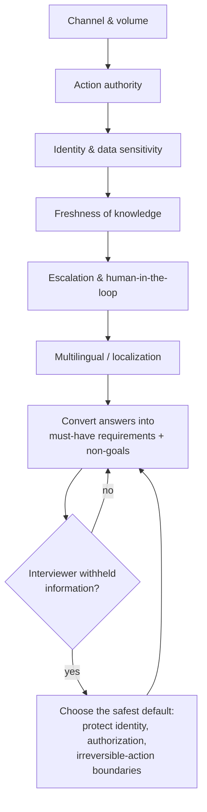

> 🎯 **Interview Pointer:** Be ready to name the six discovery areas fast and unprompted — interviewers reward candidates who structure discovery instead of free-associating questions.

## 3. Scale Estimates, SLOs, and Capacity

### From Average Load to the Load That Breaks the System

- Do not size for the average ticket volume — size for the **peaks, tail latency, and failure modes that force human intervention.**
- A naive first architecture (single orchestration service, retrieval layer, classifier, agent fallback) looks fine at monthly average load but can collapse at:
  - a morning spike after a product incident,
  - a support surge from a new region,
  - a deadline-driven rush after a billing change.
- Realistic practice numbers: **2 million tickets/month, 100 QPS peak, 20 languages.**
  - 2M tickets/month ≈ 67,000 tickets/day average, but the system must still absorb bursts far above that.
  - 100 QPS peak → the control plane cannot be a fragile single-threaded pipeline.
  - 20 languages → language detection, retrieval quality, routing, and fallback policies all matter; English-only assumptions are unsafe.
- The naive "every message → one LLM call → decide answer or escalate, with retrieval as needed" design can miss both customer-facing latency targets and the deflection goal if the model call, retrieval, or agent console saturate together.

### Working the Envelope: Model and Retrieval Call Volume

- A good FDE answer turns rough volume into operational decisions — total monthly model calls is **not** simply "tickets × 1."
- Structural breakdown of calls per ticket:
  - one routing/triage call for most tickets,
  - one retrieval-backed answer call for routine cases,
  - one or more extra calls for ambiguity, safety review, or tool use,
  - a separate path for escalated cases that packages context for the human agent.
- Worked example at **2M tickets/month = 70% routine, 20% ambiguous-but-automatable, 10% escalated**:
  - Routine: 1.4M tickets × 2 model calls (triage + answer) = **2.8M model calls/month**
  - Ambiguous: 0.4M tickets × 3 model calls (triage + grounding + verification/rewrite) = **1.2M model calls/month**
  - Escalated: 0.2M tickets × 1 model call (triage only, plus handoff packaging) = **0.2M model calls/month**
  - Total ≈ **4.2M model calls/month**, plus retries, moderation checks, and tool invocations.
  - The exact number is not the point — the signal is turning volume into a capacity estimate instead of hand-waving.
- Retrieval-call breakdown (routine = 1 lookup; ambiguous = 2 lookups for policy + latest product/billing article):
  - Routine: 1.4M × 1 = **1.4M retrieval calls/month**
  - Ambiguous: 0.4M × 2 = **0.8M retrieval calls/month**
  - Escalated: 0.2M × 0–1 (depending on whether the handoff bundle includes cited context) = **0 to 0.2M retrieval calls/month**
  - Total retrieval tier ≈ **2.2M–2.4M calls/month** — retrieval is not just a "cheap helper," it can dominate freshness logic, cache design, and failure isolation.

### Agent-Seat Savings and Storage Footprints

- A 2M-ticket/month queue might otherwise need roughly **25–40 full-time agents** to cover routine load and service targets (depends on average handle time, occupancy, business-hours coverage).
- If automation deflects or shortens **30%–50%** of tickets, the realistic business impact is not "eliminate half the team" — more realistically:
  - delay hiring for growth,
  - reduce overtime and queue spillover,
  - move agents from repetitive questions to complex cases,
  - hold service levels steady with fewer incremental seats.
- Interview framing: capacity plans should translate to **"agent-seat savings or avoidance,"** not just GPU/compute savings.
- Three storage footprints, each with different freshness/retention/searchability needs:
  - **conversation history** (continuity and audit),
  - **retrieval corpus** (policies and help articles),
  - **telemetry/log stream** (evaluation and incident response).
- At 2M tickets/month, even compact records can mean storing on the order of **millions of records per month** for active use, plus longer-term compliance/analytics archives.
- Practical consequence: storage is not a back-office concern — it affects freshness, retention policy, searchability, and replay for debugging misresolutions.

### Risk-Tiered Latency Targets

- A support system should **not** have one flat latency SLO for every case — it needs risk-tiered behavior:
  - **Low-risk routine requests**: target **p95 < 3s** end-to-end, automate by default, escalate only if confidence drops below threshold or the user asks for an agent.
  - **Ambiguous requests**: target **p95 < 8s** for grounded response or handoff, use retrieval + a second pass if needed, automate only when confidence-plus-policy clears the bar.
  - **High-risk or policy-sensitive requests**: target **p95 < 15s** for a safe handoff bundle — **do not automate the final decision**; abstain or escalate with full context.
- Tie the technical SLO to the customer workflow it serves: "get an answer now" → tight latency budget optimized for fast grounded responses; "collect context and transfer to an agent" → SLO is about packaging completeness and handoff speed, not answer-generation time.

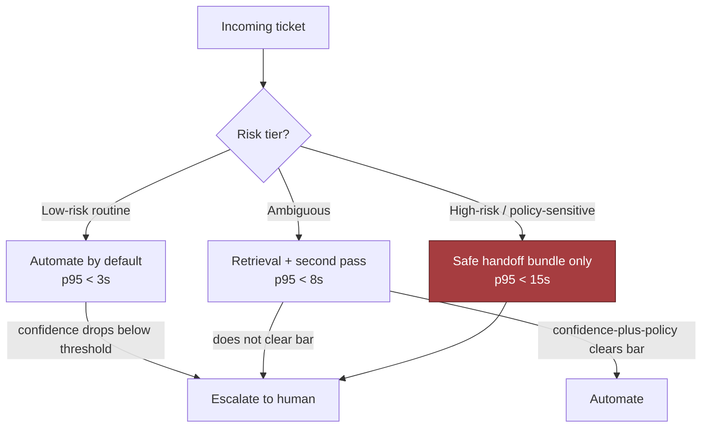

### Core Indicators Defined

- **Availability**: can routing, retrieval, and escalation accept work when traffic arrives?
- **Latency**: how long until the customer gets a grounded answer or a human handoff?
- **Freshness**: how current is the policy/knowledge-base content used for a response?
- **Quality**: how often does the system answer correctly, abstain appropriately, or escalate when it should?
- **Security**: are customer data, tools, and agent actions protected from unauthorized access or prompt injection?
- **Cost**: what does each answered, escalated, or retried ticket consume in model, retrieval, and human time?

### The NetValue Equation

- **NetValue = V<sub>time saved</sub> − C<sub>model</sub> − C<sub>wrong resolution</sub> − C<sub>recontact</sub>**
- Whiteboard-style derivation:
  1. **Start with time saved** — reduced average handle time or an avoided human touch produces V<sub>time saved</sub>.
  2. **Subtract model and retrieval costs** — every automated/assisted ticket consumes inference, orchestration, and often retrieval (C<sub>model</sub>).
  3. **Subtract wrong-resolution cost** — a confidently wrong answer costs more than the model bill: customer frustration, policy harm, downstream escalation (C<sub>wrong resolution</sub>).
  4. **Subtract repeat-contact cost** — an incomplete/unsafe/confusing first answer means paying again in labor and satisfaction (C<sub>recontact</sub>).
  5. **Net the terms** → the same equation above.
- V<sub>time saved</sub> = value of shorter handling time, lower queue pressure, fewer repetitive interactions.
- C<sub>model</sub> = inference, retrieval, orchestration cost.
- C<sub>wrong resolution</sub> = cost of confidently wrong answers (often much larger than a slow answer).
- C<sub>recontact</sub> = cost of a reopened case.
- Automation must be judged **after** quality and repeat-contact costs, not before: a system that saves ten seconds per ticket but increases recontact is not a win; a system that deflects routine work while preserving trust is.

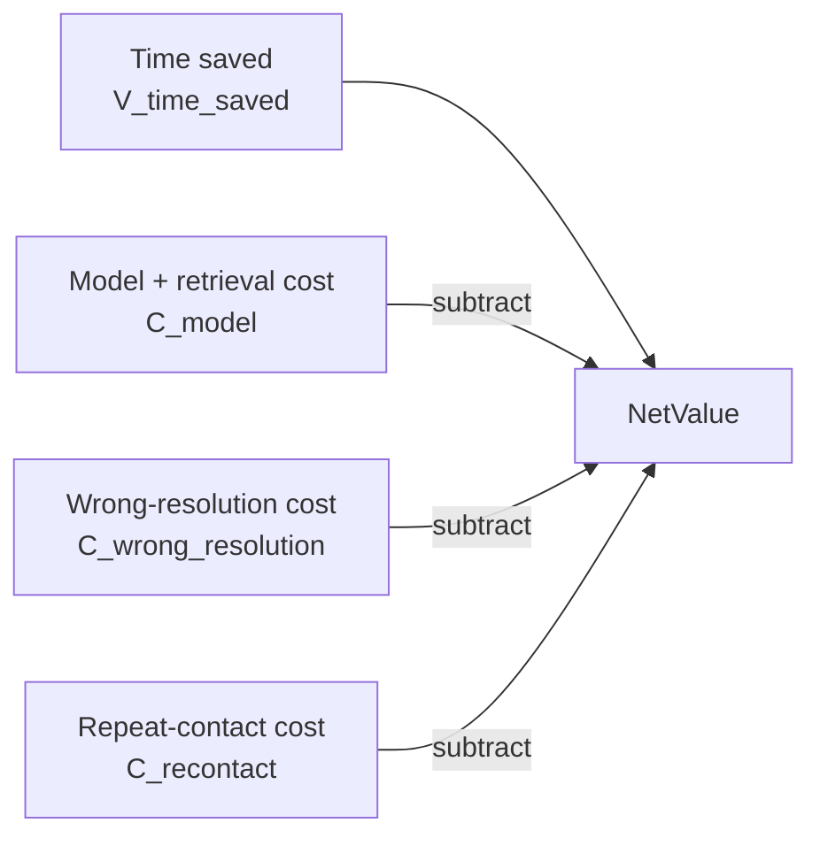

> 🎯 **Interview Pointer:** Memorize the NetValue equation verbatim and be ready to derive it term-by-term on a whiteboard — it is the single most reusable "connect architecture to business value" move in this chapter.

### Sensitivity: Baseline vs. 10x Growth

- State average, peak, growth, and headroom rather than false precision: *"I'd design for the current 2 million-ticket monthly volume, the 100 QPS peak, and at least a healthy growth factor so the system does not need immediate redesign... The most sensitive estimate is the peak concurrent request load, because it drives queuing, concurrency limits, and whether the system needs asynchronous fallbacks."*
- If growth is 10x, revisit **partitioning**, not just server count: split online answering from offline summarization, isolate escalation traffic from routine classification, move long-running enrichment out of the critical path.

| Scenario | Monthly tickets | Peak pressure | Likely impact |
|---|---|---|---|
| Baseline | 2M | 100 QPS | Single-region or modest multi-region design may suffice |
| 10x growth | 20M | Much higher burst concurrency | Routing, retrieval, and agent handoff need stronger partitioning and backpressure |

- Lesson: don't optimize every dimension at once — identify the estimate that most changes the shape of the system. Here, **peak concurrency and escalation rate** matter more than exact monthly ticket count.

### What This Proves in an Interview

- Tests whether the candidate can make pragmatic capacity decisions without overengineering.
- A good FDE justifies why one path is synchronous, another asynchronous, where the human handoff lives, and which estimate controls the architecture.
- Estimates are decision tools; each number should justify an architectural choice or operational limit.

## 4. Architecture and End-to-End Flow

### Top-Level Architecture and Trust Boundaries

- The single-sentence framing — automate routine requests, escalate risky/ambiguous/failed ones to a human with full context — dictates the entire architecture: a **routed decision pipeline**, not a chatbot.
- Same billing-double-charge example as Section 1 motivates the same requirements: verify identity, determine if money is touched, decide if safe to act, preserve context for human takeover, degrade safely on dependency failure.
- Think in dependency order, not box order — each component exists because the one before it needs a narrow, well-defined next step.
- Textual architecture diagram: Customer channels → Omnichannel gateway → Identity verification → Intent and risk router → Knowledge retrieval → Response generator → Tool policy gateway → Confidence calibrator → Auto-resolve / approval / human-agent queue → Quality evaluation store.
- Trust boundaries map onto architectural zones:
  - **External ingress boundary**: customer channels and the omnichannel gateway.
  - **Identity boundary**: identity verification — owns the assurance session, consults auth systems of record.
  - **Control boundary**: intent and risk router, confidence calibrator, tool policy gateway.
  - **Knowledge boundary**: retrieval over approved policy and account context.
  - **Operational boundary**: human-agent queue and quality evaluation store.

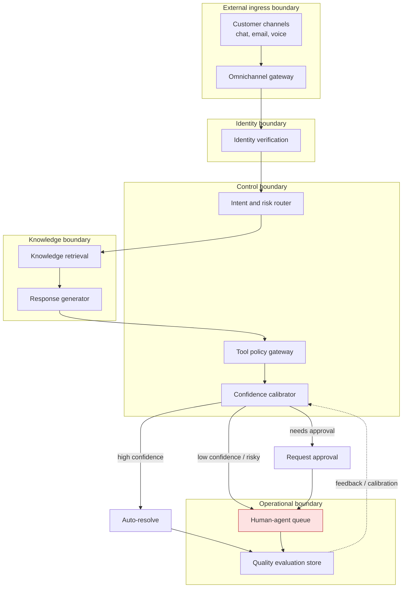

### Component Responsibilities

| Component | Primary responsibility | Trust boundary / state owner |
|---|---|---|
| Omnichannel gateway | Receives chat, email, web, voice transcript, or in-app message and normalizes it into one conversation envelope | External ingress boundary; does not own business state |
| Identity verification | Confirms the customer's identity and assigns an assurance level | Owns identity session state; consults auth/verification systems of record |
| Intent and risk router | Classifies the issue, tags urgency, and detects policy-sensitive or high-risk intents | Control-plane decision service; reads conversation state, writes routing decision |
| Knowledge retrieval | Pulls policy articles, account facts, and previous case context | Reads from systems of record and approved indexes; no independent authority |
| Response generator | Drafts a proposed answer or action plan from retrieved context | Model inference layer; never the final authority |
| Tool policy gateway | Enforces deterministic rules for what actions may be taken, by whom, and under what confidence | Hard authorization and action guardrail; owns action approval rules |
| Confidence calibrator | Scores whether the draft is reliable enough for auto-resolve, approval, or escalation | Decision support; consumes model outputs and policy signals |
| Human-agent queue | Surfaces escalations with full context and reason codes | Operational queue; owns handoff lifecycle |
| Quality evaluation store | Records outcomes, reopens, overrides, and feedback for measurement and improvement | Analytics and evaluation store; not the source of truth for live actions |

### Control Plane vs. Data Plane

- **Data plane**: carries the user conversation, retrieved facts, and drafted response through the low-latency path.
- **Control plane**: decides whether that path is allowed to continue, whether extra checks are needed, and whether a human must intervene.
- Many failures are not about raw generation quality — they are about control decisions being made too late or in the wrong place.
- The **system of record** belongs to the underlying customer, billing, CRM, and identity systems — not the support automation layer.
  - The support layer can cache safe, read-heavy artifacts (policy snippets, recent interaction summaries) but must treat them as **derived data**.
  - If the source says an account is locked, the automation layer must not invent a different truth from a stale cache.

> 🎯 **Interview Pointer:** When asked "why did the escalation happen late," the strongest diagnosis is almost always a control-plane failure (a decision made too late or in the wrong place), not a generation-quality failure — lead with that distinction.

### End-to-End Flow of a Routine Request

1. **Ingest conversation and verify identity.** Gateway creates a conversation envelope; identity verification runs synchronously if the request might expose account-specific data or trigger an action. Low-risk pre-auth FAQ traffic can stay in a limited, generic mode.
2. **Classify intent and risk.** Router decides billing/login/shipping/cancellation/refund/abuse/general-info, and tags risk: informational, account-sensitive, money-moving, legal/policy-sensitive, or safety-sensitive.
3. **Retrieve policy and account context.** Synchronous for critical facts the model needs; noncritical enrichment can be asynchronous and arrive after the first draft.
4. **Generate proposed response or action.** The response generator produces a suggested reply, a proposed tool call, or both — still a recommendation, not a final decision.
5. **Validate against deterministic policy.** Tool policy gateway checks: is identity assurance sufficient, is the requested action allowed, does the refund exceed threshold, does the case require human review, is the data accessible to this agent tier?
6. **Auto-resolve, request approval, or escalate.** High confidence + policy pass → auto-resolve. Plausible answer but action needs approval → pause for human confirmation. Risky/ambiguous/missing-context/failed check → route to human-agent queue with full trail.
7. **Measure outcome and repeat contact.** Quality evaluation store records solved / reopened / reopened quickly / corrected by human / repeat contact — feeds calibration, routing, and policy updates.

### Sequence Diagram: Happy Path and Failure-Path Overlay

- Happy-path sequence (11 steps):
  1. Customer sends a message to the omnichannel gateway.
  2. Gateway verifies whether identity checks are needed before exposing account-specific data.
  3. Identity verification returns an assurance level and session state to the intent and risk router.
  4. Router requests policy and account context from knowledge retrieval.
  5. Retrieval provides facts, approved policy excerpts, and prior cases to the response generator.
  6. Response generator submits a proposed response/action to the tool policy gateway.
  7. Tool policy gateway applies deterministic checks and passes signals to the confidence calibrator.
  8. Calibrator + policy gate decide: auto-resolve, request approval, or escalate.
  9. If escalation required, the case goes to the human-agent queue with full context and reason codes.
  10. Quality evaluation store records the outcome for later analysis, calibration, and policy tuning.
  11. Future router/policy improvements use those stored outcomes to reduce repeat contact and unsafe automation.
- Failure-path overlay (dependency outage — billing timeout, 8 steps):
  1. Customer sends a message to the omnichannel gateway.
  2. Gateway verifies whether identity checks are needed.
  3. Identity verification returns assurance level + session state to the router.
  4. Router requests policy/account context from knowledge retrieval.
  5. Knowledge retrieval attempts billing lookup — external billing system times out.
  6. Response generator drafts a reply, but the tool policy gateway **blocks the action** because source facts are incomplete.
  7. The decision routes the case to the human-agent queue with the failure reason and conversation history.
  8. The quality evaluation store records the dependency outage and fallback outcome so routing, escalation, and incident reviews can learn from it.
- The point of the diagram: make boundaries visible — which service can decide, which can merely suggest, which state is authoritative, and which failure should trigger a human rather than a retry loop.

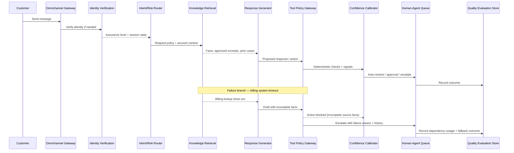

### Failure-Path Overlay on the Architecture

- If **identity verification fails or is unavailable**, the system stays in limited non-account mode or escalates immediately.
- If **retrieval is stale or missing critical facts**, the response generator may still draft language, but the tool policy gateway blocks action.
- If **confidence is low**, the case goes to the human-agent queue.
- If **the human queue is saturated**, it prioritizes by risk and customer impact rather than arrival order alone.
- If **the quality evaluation store detects repeat contacts or corrections**, those signals feed routing and policy tuning.

### Queues, Caches, Backpressure, and Partitioning

- The human-agent queue sits on the boundary between automation and operations, not deep inside the model path — keeps high-volume routine traffic from competing with slower manual work.
- Backpressure in three places:
  - **Ingress backpressure**: on a burst, the gateway sheds nonessential enrichment, preserves the conversation, and returns a graceful "we're processing your request" state instead of collapsing.
  - **Retrieval backpressure**: if lookup slows down, the router degrades to a narrower safe mode instead of waiting indefinitely.
  - **Escalation backpressure**: if humans are saturated, the queue prioritizes by risk and customer impact, not arrival order.
- Caching rules:
  - Safe to cache: policy articles, language detection results, nonauthoritative summaries.
  - Not safe to cache: identity assertions, money movements, account status, authorization decisions.
  - The system can cache **references** to those facts but must re-check the authoritative source before any live action.
- Partitioning key (conversation ID, customer ID, or account ID) is essential:
  - preserves ordering, especially when a case moves from automation to human review and back;
  - without it, duplicate replies, inconsistent state transitions, and out-of-order handoffs become much more likely under load.

### MVP versus Later Evolution

- **MVP**: omnichannel gateway, identity verification, intent/risk routing, retrieval from approved policy and account sources, response generation, deterministic policy gating, human escalation, outcome logging. Enough to safely automate routine work while protecting risky cases.
- **Later evolution**: confidence calibration models, smarter prioritization, richer replay and evaluation pipelines, proactive contact deflection, multilingual optimization, agent-assist summaries, automated policy regression testing. These improve throughput and quality but should not replace the basic control structure.

### Why This Architecture Solves the Customer Problem

- Core requirement: reduce handling time and cost **without increasing incorrect or harmful resolutions.**
- Identity verification prevents unsafe action on the wrong account.
- The intent/risk router keeps high-stakes cases on a cautious path.
- Retrieval grounds the model in approved facts.
- The tool policy gateway stops a fluent-but-invalid response from becoming an action.
- The human queue preserves service quality under uncertainty.
- The evaluation store closes the loop so the business can prove whether automation helped or shifted work around.
- One-minute interview summary: request received → identity verified when necessary → intent/risk classified → authoritative context retrieved → proposed response drafted → deterministic policy gate applied → low-risk auto-resolves, medium-confidence seeks approval, high-risk/ambiguous/failed escalates with context. Control plane decides routing/enforcement; data plane carries conversation and retrieved facts; system of record stays in the customer's operational systems.

## 5. Data Model, APIs, and Working Code

### Three Core Records

- The automation layer does not own the customer's source of truth — it owns its own workflow state and the evidence needed to justify decisions.
- **`Case(id, customer_id, channel, intent, risk, state)`** — the live workflow object.
  - Primary key: `id`.
  - Tracks customer, entry channel, inferred/confirmed intent, current risk classification, and lifecycle state (`new`, `triaged`, `waiting_approval`, `escalated`, `resolved`).
  - Retention: keep active cases in hot storage, archive/purge per policy once the support window ends.
- **`ProposedAction(id, case_id, tool, args_hash, decision)`** — the system's proposed or executed step.
  - Primary key: `id`.
  - `args_hash` lets you deduplicate logically identical requests without storing/replaying raw sensitive arguments everywhere — this is where idempotency starts to become real.
  - Lifecycle: `draft` → `approved`/`rejected`/`executed`, then immutable once the outcome is recorded.
  - Retention: narrower than `Case` — long enough for audit, debugging, and replay protection, then expire per retention policy (it's operational evidence, not the customer's canonical record).
- **`Handoff(case_id, summary, evidence_refs, attempted_actions)`** — the artifact humans receive when the machine must stop.
  - Job: make the agent faster and safer, not "look pretty."
  - `summary` explains what happened; `evidence_refs` point to the documents/messages/retrieval hits that justified the decision; `attempted_actions` shows what was already tried so the human doesn't repeat failed work.
  - Retention: same narrow, evidence-driven policy as `ProposedAction`.
- Lifecycle: message arrives → becomes a case → router scores risk → policy layer decides auto-resolve/draft/approval/escalate → every irreversible step recorded as a distinct write. This is the practical answer to "how do you keep the system defensible?"

### Contracts That Keep the Model on a Leash

- API surface should be small and boring. Boring is good here.
- `POST /v1/support/messages` — creates or updates a case from an incoming customer message. Request: message content, customer/tenant identity, channel, idempotency key. Response: case id, current state, risk level, next action.
- `POST /v1/cases/{id}/actions` — submits a proposed or approved action. Requires authentication, policy context, and an idempotency key so retries don't create duplicate side effects.
- `POST /v1/cases/{id}/escalate` — creates a handoff for a human agent. Response confirms state changed to escalated, provides the handoff record id.
- `POST /v1/cases/{id}/quality-review` — queues the case for audit or coaching review after resolution.
- Every endpoint needs: authenticated caller, tenant scoping, schema validation, idempotency semantics, clear error behavior.
  - `409 Conflict` = case state no longer permits that transition.
  - `422 Unprocessable Entity` = request passed transport checks but failed typed validation.
  - `401`/`403` = identity or authorization is wrong.
- Versioning exists at two layers: schema versioning on payloads and contract versioning on endpoint behavior — keeps the workflow from breaking as model/policy/tooling evolve. A case written at one version should remain readable even if the policy engine later learns a new risk label.

### Idempotency in Practice

- Concrete example: a chat client sends `POST /v1/support/messages` twice with the same `Idempotency-Key: msg_9f1c` because the first response timed out.
  - First request creates `case_123`, returns `{"case_id": "case_123", "state": "triaged", "risk": "medium", "next_action": "draft_for_agent"}`.
  - Second request must **not** create `case_124` — it returns the same `case_123` response (or a semantically equivalent replay), and the system logs that the duplicate was deduplicated at the write boundary.
- That is what "idempotent" means in practice, not just in theory.

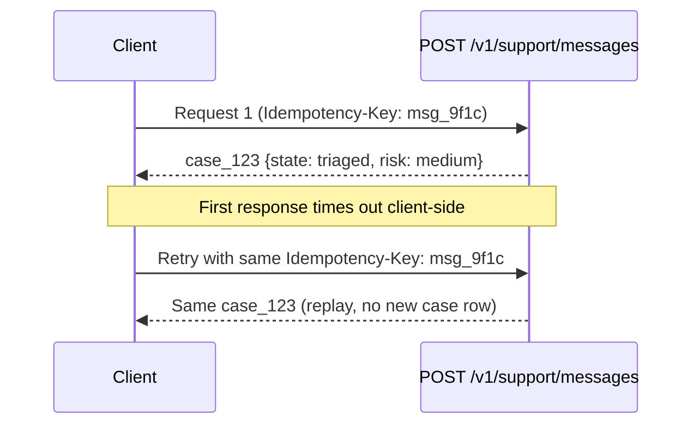

### The Routing Decision Function

- The highest-risk branch to implement in an interview is routing — a wrong decision either annoys customers with needless escalation or lets a bad answer go out.

```python
from __future__ import annotations

from dataclasses import dataclass
from enum import Enum
from typing import Any, Optional


class DecisionType(str, Enum):
    ESCALATE = "escalate"
    DRAFT_FOR_AGENT = "draft_for_agent"
    REQUIRE_APPROVAL = "require_approval"
    AUTO_RESOLVE = "auto_resolve"


@dataclass(frozen=True)
class Case:
    id: str
    customer_id: str
    channel: str
    intent: str
    risk: str
    state: str
    version: int = 0


@dataclass(frozen=True)
class Prediction:
    confidence: float
    policy_conflict: bool = False
    response: Optional[str] = None
    action: Optional[dict[str, Any]] = None
    model_version: str = "unknown"


@dataclass(frozen=True)
class RoutingDecision:
    decision: DecisionType
    reason: str


class ValidationError(ValueError):
    pass


def _validate_prediction(prediction: Prediction) -> None:
    if not 0.0 <= prediction.confidence <= 1.0:
        raise ValidationError("confidence must be between 0 and 1")
    if prediction.action is not None and not isinstance(prediction.action, dict):
        raise ValidationError("action must be a mapping when present")


def decide(case: Case, prediction: Prediction) -> RoutingDecision:
    _validate_prediction(prediction)

    if case.risk == "high" or prediction.policy_conflict:
        return RoutingDecision(DecisionType.ESCALATE, "risk_or_policy")
    if prediction.confidence < 0.70:
        return RoutingDecision(DecisionType.DRAFT_FOR_AGENT, "low_confidence")
    if prediction.action and prediction.action.get("amount", 0) > 50:
        return RoutingDecision(DecisionType.REQUIRE_APPROVAL, "high_impact_action")
    return RoutingDecision(DecisionType.AUTO_RESOLVE, "safe_to_automate")
```

- Line-by-line intent:
  - Enums constrain output so the model cannot invent new decision types.
  - `Case` captures minimum routing state, including a `version` field for later optimistic concurrency.
  - `Prediction` separates model output from application truth — it is only a suggestion until validated.
  - `_validate_prediction` is the typed boundary check that stops malformed/out-of-range outputs before policy logic touches them.
  - `decide` is the core safety gate: high risk or policy conflict → escalate immediately; low confidence → draft for agent; high-impact action → require approval; only the safest path auto-resolves.
- The `amount > 50` threshold is illustrative — in a real deployment, externalize this rule by tenant, action type, and approval policy. The interview point is the **pattern** of keeping high-impact actions behind approval, not the specific number.

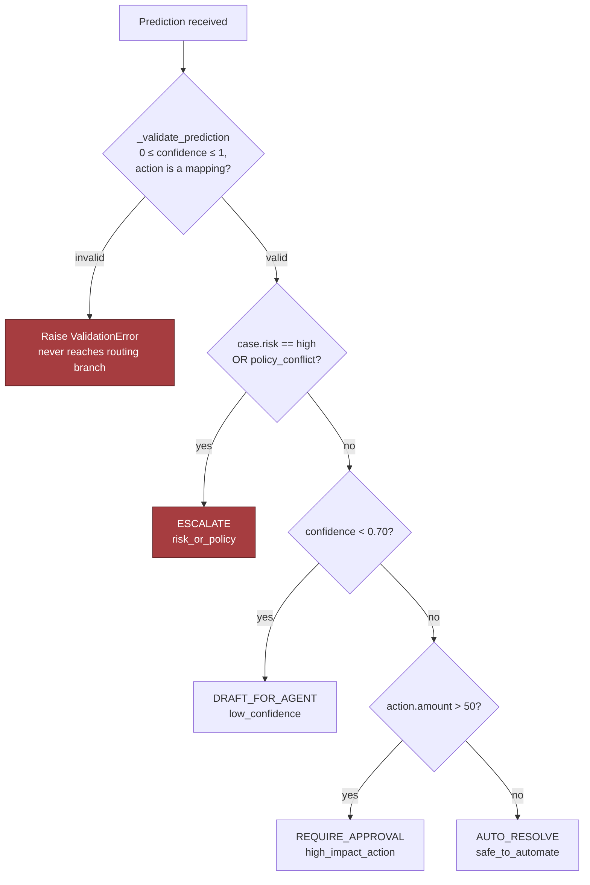

> 🎯 **Interview Pointer:** Be ready to trace the `decide()` branch order from memory (risk/policy conflict → confidence → action amount → auto-resolve) — interviewers will probe by changing one input (e.g., `confidence=1.2`, or a non-mapping `action`) and asking what happens.

### Production-Shaped Concerns: Concurrency, Retries, Observability

- A whiteboard snippet hides the hard parts — production must account for concurrency, retries, and observability.
- **Concurrency**: `Case.version` supports optimistic concurrency control — read the case, compute a decision, write only if the version is unchanged. If another worker already updated the case, the write fails cleanly and the router re-reads the latest state instead of overwriting it. Matters for duplicate messages, agent interventions, and races between automation and human review.
- **Retries**: every write boundary should accept an idempotency key — repeated message/action/escalation requests return the same case/transition instead of creating duplicates. A duplicate request under network retries is normal operation, not an edge case.
- **Observability**: log case id, tenant id, idempotency key, model version, decision type, validation errors, and policy reason. Emit metrics for auto-resolve rate, escalation rate, approval latency, and rejection reasons. Without these hooks you cannot tell how automation is performing.

### Tests That Make the Design Defensible

- **Contract test**: a repeated `POST /v1/support/messages` with the same idempotency key must return the same case state and not create a second case.
  - Example: send the same payload twice with `Idempotency-Key: msg_9f1c`; assert both responses return `case_123` with no new case row inserted.
- **Failure-injection test**: force the model to return `confidence = 1.2` or a non-mapping `action` and confirm the validator rejects it before any side effect occurs.
  - Example: `Prediction(confidence=1.2, action={"amount": 25})` passed into `decide` should raise `ValidationError` and never reach the routing branch.
- Critical invariant: **a risky action above policy threshold must produce approval, not automation.**

```python
from dataclasses import dataclass
from enum import Enum
from typing import Any, Mapping


class DecisionType(str, Enum):
    AUTO_RESOLVE = "auto_resolve"
    REQUIRE_APPROVAL = "require_approval"
    ESCALATE = "escalate"
    REJECT = "reject"


@dataclass(frozen=True)
class Prediction:
    refund: float
    confidence: float


@dataclass(frozen=True)
class RequireApproval:
    reason: str


@dataclass(frozen=True)
class AutoResolve:
    action: str


@dataclass(frozen=True)
class Reject:
    reason: str


def _validate_prediction(pred: Any) -> Prediction:
    if not isinstance(pred, Prediction):
        raise TypeError("prediction must be a Prediction")
    if not (0.0 <= pred.confidence <= 1.0):
        raise ValueError("confidence must be between 0 and 1")
    if pred.refund < 0:
        raise ValueError("refund must be non-negative")
    return pred


def decide(low_risk_case: bool, pred: Prediction):
    pred = _validate_prediction(pred)

    if not low_risk_case and pred.refund > 50:
        return RequireApproval("refund exceeds auto-approval threshold")

    if pred.confidence < 0.7:
        return RequireApproval("insufficient confidence")

    return AutoResolve("approve_refund")


def prediction(*, refund: float, confidence: float) -> Prediction:
    return Prediction(refund=refund, confidence=confidence)


def test_refund_above_limit_requires_approval():
    outcome = decide(low_risk_case=False, pred=prediction(refund=75, confidence=0.99))
    assert isinstance(outcome, RequireApproval)
```

- This code is intentionally narrow — it teaches one invariant: a refund above threshold should not slip through because the model is confident.
- A production implementation would add structured logging, a request ID, typed request schemas, approval-state persistence, replay protection, and explicit handling for validation errors.

> 🎯 **Interview Pointer:** The exact test to have ready verbatim: `decide(low_risk_case=False, pred=prediction(refund=75, confidence=0.99))` must return `RequireApproval` even at 0.99 confidence — this is the invariant interviewers use to check you separated "model confidence" from "action permission."

### What to Say When the Dependency Is Down

- If the policy retrieval service is unavailable, do **not** silently substitute a stale answer as if it were fresh.
- If the identity provider is down, account tools should be **unavailable, not half-working.**
- If the model endpoint fails intermittently, the system should:
  - circuit-break to protect the rest of the workflow,
  - queue eligible tickets for later retry,
  - route risky cases directly to humans.
- Timeouts should be short enough to protect customer experience; retries should be bounded and jittered; dead-letter queues should preserve failed jobs for inspection instead of dropping them.
- These are not decorations — they are the difference between graceful degradation and a hidden incident.

### Pre-Launch Readiness: Runbooks and Evidence

- Before launch, the team needs explicit runbooks for: incident triage, rollback, human escalation, evidence preservation, and dependency-outage response.
- Runbooks should tell on-call staff:
  - who owns the decision,
  - how to disable automation for a workflow or tenant,
  - how to confirm whether a side effect completed,
  - how to hand a case to a human with the right context,
  - where to find the immutable logs and policy snapshots needed for review.
- Pre-launch audit evidence should include: the approval path for risky tools, the last successful failure-injection test, validation results for handoff payloads, and alerting checks proving the queue, retry, and dead-letter behavior are observable.

### The Interview Point This Section Is Testing

- Not whether you can make an AI assistant answer questions — whether you can protect a support operation from a system that is partially intelligent, partially deterministic, and always accountable.
- An FDE is expected to own safe rollout, support, and incident response, not just the happy path.
- If you can explain the failure policy, the recovery path, the audit trail, and the escalation boundary, you are speaking like someone who can ship the system, not just sketch it.
- The sentence to keep in your pocket: if you can name the records, define the endpoints, explain idempotency and versioning, and show how typed validation blocks unsafe model output, you are describing a system a customer could actually trust.

## 6. Security, Reliability, and Failure Handling

### Model Output Is Not Truth

- The most interesting interview moment is not when the automation works — it's when security/ops interrupts and injects a bad answer: the assistant confidently claims a refund policy that is wrong.
- A weak candidate patches the wording. A strong FDE immediately asks:
  - Was any irreversible action taken?
  - Was a customer misdirected into a harmful path?
  - Can we preserve the raw prompt, the model output, and the policy version that produced the answer?
- Core stance: **model output is not truth — only one input to a controlled workflow.** Every place the system can take a customer action, reveal account data, or assert a policy needs a guardrail around identity, authorization, validation, and recovery (defense in depth, in practice).

### Threat Model: The Four Seams

- **Untrusted customer text (prompt injection)**: customer text can contain prompt injection, malformed account numbers, copied ticket history, hostile instructions, or social-engineering attempts. It belongs in a message channel, not a control channel — never treat it as a privileged instruction source.
- **Least-privilege tool scoping**: a support assistant that can read orders does not automatically need refund/address-change/cancellation/full-payment-history power. Split tool permissions by workflow — if a request only needs order status, don't hand the model a refund tool at all; scoped workflows need extra checks and, above a threshold, human approval.
- **Identity verification before account tools**: "the customer sounds right" is not authentication. Once the workflow reaches billing, PII, address changes, password resets, or account access, confirm identity through the customer's approved authentication path before the tool layer can act.
- **Immutable audit trail + human override for high-risk actions**: record who requested the action, which model version suggested it, which tool was invoked, what input fields were validated, what policy version was in force, and whether a human reviewed or overrode it. Evidence must survive the incident.

### Failure Policy by Scenario

- **Confidently wrong policy answer**: fails closed at the policy boundary. The assistant can explain uncertainty, cite the authoritative source if available, and escalate — it must not invent certainty. Incident-response goal: containment (prevent the wrong answer from becoming a customer promise) and preserve evidence (model output + policy retrieval trace).
- **Refund executes but response times out**: treat the operation as *potentially successful* and reconcile before retrying. Idempotency keys matter here — the retry should not blindly repeat the refund; the workflow should query the ledger/action record, confirm whether the side effect completed, and only then return success, continue waiting, or escalate. Classic "action may have succeeded, response did not" case.
- **Tool returns stale account state**: degrade the automation rather than paper over the inconsistency — mark the result as potentially outdated, ask the customer to refresh, or route to an agent with the stale snapshot attached. Staleness is dangerous when a model uses old state to make new commitments.
- **Language detection fails**: never guess and proceed as if certain — degrade into a language-neutral intake path, optionally show a brief multilingual/icon-based prompt, escalate to a human or multilingual workflow when confidence is too low.
- **Handoff omits important context**: this is operational leakage, not just UX — the human agent gets a thinner ticket, repeats questions, and the customer loses trust. The handoff payload must carry the original message, parsed intent, tool outputs, policy checks, identity status, error codes, and the model's own uncertainty markers. Missing any field should fail handoff validation rather than silently forward a broken case.

### Decision Table: Fail-Open, Fail-Closed, Degrade, Queue, Escalate

| Situation | Default policy | Why |
|---|---|---|
| FAQ answer with no account access | Degrade or queue | Low risk; preserve customer experience if model confidence is low |
| General order status lookup | Fail closed on malformed input; otherwise degrade if tool is unavailable | No irreversible action, but the answer must be accurate |
| Refund or address change | Require human intervention above a threshold | Irreversible or customer-impacting action |
| Identity verification failure | Fail closed | Do not allow account tools without verified identity |
| Language detection failure | Degrade and escalate | Routing error is safer than a guessed interaction |
| Tool timeout after side effect may have happened | Queue for reconciliation | Avoid duplicate actions |

- The goal is not to make everything manual — it's to make high-consequence paths explicit, removing ambiguity about which failures can be retried, which must escalate, and which must stop immediately.

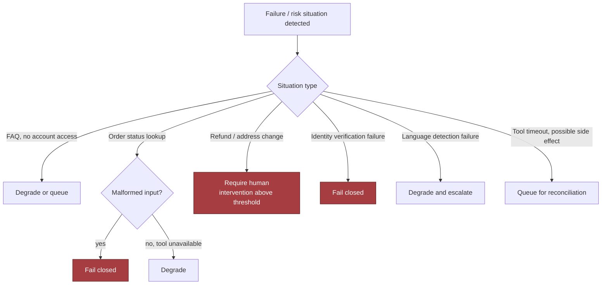

> 🎯 **Interview Pointer:** Memorize this table's six rows well enough to reproduce it from memory — it is the single artifact most likely to be requested directly ("walk me through your fail-open/fail-closed policy").

### Incident Drill: Wrong Policy Answer (Containment / Recovery / Prevention)

- **Detection**: policy answer checks, confidence thresholds, or retrieval mismatches surface an answer that conflicts with the approved policy source.
- **Containment**: stop automated delivery — the answer never reaches a customer as an authoritative promise; preserve the full interaction record.
- **Recovery**: hand the case to a human with the exact model output and evidence.
- **Prevention**: the next version adds better retrieval grounding, policy versioning, answer validation, and a regression test that simulates the same failure.
- The response security/ops wants to hear: not "we will fine-tune it more," but "we will bound it, record it, stop it, and learn from it."

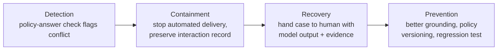

- **Related drill — refund times out after possible execution:**
  - Detect: response times out after a refund call was issued.
  - Contain: treat the action as potentially successful; do not blindly retry.
  - Recover: query the ledger/action record to confirm completion, then return success, continue waiting, or escalate.
  - Prevent: this is exactly what idempotency keys and `ProposedAction.args_hash` deduplication are designed to guarantee going forward.

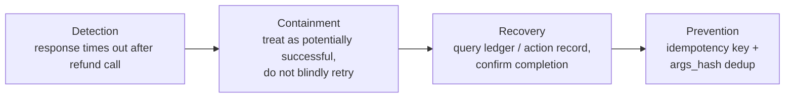

### Defense in Depth and Blast Radius

- Security here is a **chain**, not a single check:
  - verify customer identity before account tools,
  - use scoped credentials so the assistant cannot do more than the current workflow needs,
  - validate every tool argument (type, range, enum membership, object fields),
  - treat customer text as untrusted input at every handoff,
  - require human override for risky actions,
  - keep immutable logs so the incident can be reconstructed.
  - Any one control can fail — that's why the chain matters.
- Blast radius should be defined in layers:
  - **by tenant** — a bad policy prompt should not disable support for all customers;
  - **by region** — a regional queue outage should not corrupt the global audit log;
  - **by workflow** — a refund-tool failure should not affect FAQs;
  - **by dependency** — a language-routing outage should not take down the whole ticketing system.

### The Critical Invariant, Proven in Code

- Same invariant as Section 5's failure-injection test: **a risky action above policy threshold must produce approval, not automation.**

```python
from dataclasses import dataclass
from enum import Enum
from typing import Any, Mapping


class DecisionType(str, Enum):
    AUTO_RESOLVE = "auto_resolve"
    REQUIRE_APPROVAL = "require_approval"
    ESCALATE = "escalate"
    REJECT = "reject"


@dataclass(frozen=True)
class Prediction:
    refund: float
    confidence: float


@dataclass(frozen=True)
class RequireApproval:
    reason: str


@dataclass(frozen=True)
class AutoResolve:
    action: str


@dataclass(frozen=True)
class Reject:
    reason: str


def _validate_prediction(pred: Any) -> Prediction:
    if not isinstance(pred, Prediction):
        raise TypeError("prediction must be a Prediction")
    if not (0.0 <= pred.confidence <= 1.0):
        raise ValueError("confidence must be between 0 and 1")
    if pred.refund < 0:
        raise ValueError("refund must be non-negative")
    return pred


def decide(low_risk_case: bool, pred: Prediction):
    pred = _validate_prediction(pred)

    if not low_risk_case and pred.refund > 50:
        return RequireApproval("refund exceeds auto-approval threshold")

    if pred.confidence < 0.7:
        return RequireApproval("insufficient confidence")

    return AutoResolve("approve_refund")


def prediction(*, refund: float, confidence: float) -> Prediction:
    return Prediction(refund=refund, confidence=confidence)


def test_refund_above_limit_requires_approval():
    outcome = decide(low_risk_case=False, pred=prediction(refund=75, confidence=0.99))
    assert isinstance(outcome, RequireApproval)
```

- Same narrow-but-deliberate scope as before: it teaches one invariant (a refund above threshold should not slip through on confidence alone), and production would add structured logging, request IDs, typed schemas, approval-state persistence, replay protection, and explicit validation-error handling.

### Dependency-Outage Behavior

- Policy retrieval unavailable → never silently substitute a stale answer as fresh.
- Identity provider down → account tools go fully **unavailable**, not half-working.
- Model endpoint intermittently failing → circuit-break, queue eligible tickets for retry, route risky cases directly to humans.
- Timeouts short enough to protect customer experience; retries bounded and jittered; dead-letter queues preserve failed jobs instead of dropping them.

### Pre-Launch Readiness (Recap)

- Same runbook and audit-evidence requirements as Section 5: incident triage, rollback, human escalation, evidence preservation, dependency-outage response runbooks; pre-launch evidence covering approval paths, the last failure-injection test, handoff validation results, and queue/retry/dead-letter observability checks.

### The Interview Point This Section Is Testing

- Not whether the AI can answer questions, but whether you can protect a support operation from a system that is partially intelligent, partially deterministic, and always accountable.
- An FDE owns safe rollout, support, and incident response — not just the happy path.

## 7. Delivery Plan, Observability, and Business Impact

### Convert the Prototype into a Release Plan

- Every external dependency and irreversible action needs an explicit failure and recovery policy — if you can't say what happens when the model is wrong, the tool is stale, the language detector fails, or the refund call times out, the design isn't production-ready.
- A practical rollout should be deliberately boring at first:
  1. **Launch as agent-assist only.** Model drafts replies, summarizes history, extracts intent, and suggests next actions, but a human sends the final response — proves retrieval quality, escalation logic, and workflow integration before the system "speaks for itself."
  2. **Automate low-risk intents.** Start with narrow, high-confidence, bounded-and-reversible requests (password reset guidance, order status lookup, subscription FAQ). Money movement, account changes, legal policy, and sensitive disputes stay human-reviewed.
  3. **Add action tools one at a time.** Enable one tool class at a time (ticket tagging → order lookup → refund initiation → address change) — each tool expands the blast radius, so each needs its own gate.
  4. **Review samples and rollback by intent.** Keep a regular human review loop sampling both automated and assisted cases. If one intent drifts (e.g., overconfident on warranty eligibility), roll back that intent, disable its tool, or drop it back to agent-assist while the rest keeps running — no need to shut down the whole system.
- Production trust is earned in layers, not granted all at once.

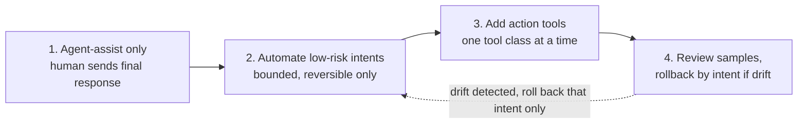

### Ownership and Go/No-Go Gates

- **Support operations lead**: workflow adoption and escalation policy.
- **Engineering owner**: service reliability, integrations, guardrails.
- **Product/program owner**: the go/no-go gate and the business scorecard.
- **Security/legal/privacy**: data access, retention, and tool permission policy.
- **Frontline support manager**: training, feedback collection, day-to-day quality review.
- A good go/no-go gate is **not** "the demo looked good" — it is a short checklist:
  - retrieval accuracy on the target intent set is stable,
  - human reviewers approve a representative sample,
  - fallback behavior is correct,
  - logging is complete,
  - the rollback path has been exercised.
- If any item is missing, the launch is delayed — even if the model sounds fluent.

### Measure the Right Layer for the Right Question

- A strong dashboard separates four layers instead of piling every metric into one chart:
  - **Technical health** (is it alive and safe to operate?): latency, tool failure rate, queue depth, circuit-breaker trips, fallback frequency, error budget burn. Degradation here = operational incident.
  - **Model quality** (is the AI making sound decisions?): answer accuracy on reviewed samples, retrieval precision, escalation correctness, hallucination/unsupported-answer rate, share of cases that should have escalated but didn't.
  - **Adoption** (are people actually using it?): agent-assist usage rate, automation acceptance rate, percentage of tickets routed through the new workflow, agent override frequency.
  - **Business outcome** (is the customer getting value?): average handling time, first-contact resolution, repeat-contact rate, CSAT, cost per resolved case, safe automation rate.
- Cross-layer diagnostics:
  - cost per resolved case improves + repeat-contact rate rises → value has **not** been delivered, work shifted from first to second contact;
  - safe automation rate rises + CSAT falls → wrong intents automated, or fast-but-unhelpful answers;
  - handling time drops for agents + first-contact resolution stays flat → saving typing time without improving resolution quality.

### The Scorecard: Calculation, Source, Owner, Alert Threshold

- Define each metric with four things: calculation, source, owner, alert threshold.
- **Safe automation rate**: automated cases resolved without correction/complaint/harmful escalation ÷ all automated cases. Source: ticketing system + review labels. Owner: support operations with engineering support. Alert: rate drops for a given intent or customer segment.
- **Incorrect-resolution rate**: automated/assisted cases marked wrong by review, reopened for the same issue, or corrected by an agent. Source: QA review + ticket reopen events. Owner: support QA. Alert: rises above the intent-specific baseline.
- **First-contact resolution**: cases resolved without a repeat contact in the defined window. Source: CRM + ticket timeline. Owner: support ops. Alert: weakens after automation expansion.
- **Average handling time**: total agent- or system-assisted handling time per case. Source: contact-center telemetry. Owner: operations. Alert: improves only because the system is deflecting work into unresolved follow-ups.
- **Repeat-contact rate**: share of cases with another contact on the same issue. Source: CRM correlation across tickets. Owner: support analytics. Alert: increases after an automation change.
- **CSAT**: customer satisfaction score from post-contact surveys. Source: survey platform. Owner: product or support leadership. Alert: automation improves throughput but depresses sentiment.
- **Cost per resolved case**: operational cost ÷ resolved cases. Source: finance + support volume reporting. Owner: finance-ops partnership. Alert: apparent savings offset by rework, escalations, or longer resolution chains.
- The formula tells you how to compute the number; the meaning tells you whether the number can be trusted as a launch gate.

> 🎯 **Interview Pointer:** For every metric you propose, be ready to state its calculation, source, owner, and alert threshold in one breath — interviewers will push past "what metric" into "how would you actually operationalize it."

### Rollback and Migration as Part of the Design

- Reversible migration path: human-only → agent-assist → narrow automation on selected intents → gradual traffic migration by customer segment, channel, or intent family.
- Keep a **kill switch per intent and per tool**, not just for the whole service.
- Canary rollout should be tiny, visible, and reversible — a small slice of low-risk traffic exposes prompt regressions, retrieval drift, or bad tool permissions before impact spreads.
- If a canary reveals confident-but-wrong behavior on a policy edge case, roll back **by intent**, not by debating the whole product — one bad automated answer can be multiplied across many similar tickets.
- Training, support, and documentation are not nice-to-haves:
  - agents need to know when to trust the assistant, when to override it, and how to flag a bad case;
  - support managers need a triage playbook for recurring failure patterns;
  - documentation should cover the intent catalog, escalation triggers, approved tool actions, and the review process.
  - If the team cannot operate the system without a developer in the room, the system is not really delivered.

### Configuration vs. Adapters vs. Shared Services vs. Core Product

- An FDE should separate reusable product leverage from customer-specific wiring:
  - **Configuration**: intent thresholds, escalation rules, routing weights, language preferences, retention windows, the low-risk intent list.
  - **Adapters**: connectors to CRM, ticketing system, identity provider, knowledge base, survey platform, and customer-specific channels (chat, email).
  - **Shared service**: retrieval, policy evaluation, audit logging, prompt assembly, response classification, observability plumbing — reusable across deployments.
  - **Core product**: the trust boundary, escalation framework, safe tool execution model, and operational metrics pipeline every customer deployment needs.
- Commercial stakes: if every new customer requires rewriting the same approval logic, you have a consulting script, not a product. If the core stays stable while adapters/configuration absorb customer variation, the system becomes reusable.

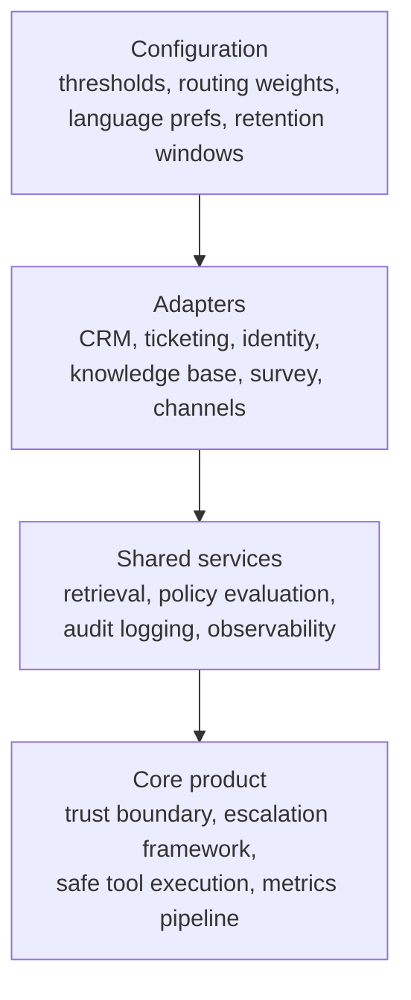

### The Risk Register Drives the Rollout

- Name owner, mitigation, and trigger for each risk:
  - **Hallucinated policy answer**: owner = support QA; mitigation = retrieval grounding + mandatory escalation on low-confidence policy intents; trigger = spike in incorrect-resolution rate or sample review finding unsupported answers.
  - **Stale account lookup tool**: owner = engineering; mitigation = freshness checks + timeout handling; trigger = output-tool mismatches between tool output and CRM records.
  - **Customer segment with unusual wording**: owner = operations; mitigation = intent-specific tuning + agent-assist fallback; trigger = rising override rates.
- Job-market signal: an FDE is responsible for delivery from prototype through adoption, feedback, and reusable learning. The winning answer is not "the model is accurate" — it's "the workflow improves, the operating team can support it, and the system can be trusted because rollout, observability, and rollback are engineered up front."
- Measurable customer-impact statement: after staged rollout, the support team should resolve routine work faster, keep risky cases human-reviewed, and reduce cost per resolved case without increasing incorrect or harmful resolutions.

### A Rollout That Can Survive Contact with Production

- A well-presented section leaves the evaluator hearing three things: you know how to move from prototype to controlled release; you know how to instrument business outcome as well as model quality; you know how to protect the customer while learning in production.
- That is the difference between a clever demo and a support system a company can actually trust.

## 8. Interview Walkthrough, Trade-Offs, and Practice

### Outcome-First Opening

- Open by speaking like the person the customer would hire: *"I'd like to optimize for the outcome first—reduce handling time and cost without increasing incorrect or harmful resolutions. I'll clarify the highest-risk intents, estimate scale, sketch the control flow, and then spend most of my time on escalation, safety, and operability. If you want me to go deeper on model choice, multi-region policy, or human handoff, I can zoom in there."*
- This signals disciplined time allocation and invites redirection — you are not trying to "cover everything," you are trying to cover the **riskiest everything.**

### Minute-by-Minute 50-Minute Answer Plan

- **0–1 min — outcome-first opening**: state the customer outcome in one sentence (automate routine requests, escalate risky/ambiguous/failed cases with full context).
- **1–3 min — scope and redirection**: ask which intents are in scope, what must never be auto-resolved, and where the interviewer wants more depth.
- **3–5 min — risk framing**: identify highest-risk cases first — refunds, account changes, policy exceptions, regulated topics, identity/money.
- **5–7 min — assumptions**: state explicit assumptions on ticket volume, peak concurrency, repetitive-intent share, latency tolerance, escalation rate; flag illustrative numbers.
- **7–10 min — success metrics**: ask whether the company values deflection, response time, satisfaction, or quality most; tie back to reduced handling time/cost without harmful resolutions.
- **10–13 min — intake and routing**: entry point, channel normalization, auth state, intent classification, eligibility checks.
- **13–16 min — policy and risk gating**: how policy rules/risk thresholds decide answer, act, clarify, or escalate.
- **16–19 min — retrieval and account context**: knowledge-base retrieval, account lookup, case history, freshness before money/identity/access actions.
- **19–22 min — response generation**: model drafts a reply only inside constraints set by intent, policy, and retrieved facts.
- **22–25 min — escalation path**: handoff to a human — structured summary, evidence, reasons for escalation.
- **25–28 min — trade-offs**: automation rate vs. risk; general model vs. intent-specific flows; live lookup vs. cached context; global policy vs. regional variants.
- **28–31 min — failure modes**: prompt injection, stale data, duplicate refunds, unsupported answers, confidently-wrong responses.
- **31–34 min — idempotency and audit**: action records, case state, audit logs preventing duplicate actions and supporting investigation.
- **34–37 min — human experience**: what the agent sees, how they understand why the AI escalated.
- **37–41 min — rollout**: read-only suggestions first, then low-risk automations, then broader coverage with sampling, rollback, review.
- **41–45 min — measurement**: success in terms of handle time, first-contact resolution, escalation quality, harm prevention.
- **45–48 min — risks and follow-ups**: invite the interviewer to challenge the riskiest assumption; answer likely follow-ups directly.
- **48–50 min — concise summary**: crisp recap plus the first production gate.

```mermaid
flowchart LR
    B1["0–1 min<br/>Outcome-first opening"] --> B2["1–3 min<br/>Scope & redirection"]
    B2 --> B3["3–5 min<br/>Risk framing"]
    B3 --> B4["5–7 min<br/>Assumptions"]
    B4 --> B5["7–10 min<br/>Success metrics"]
    B5 --> B6["10–13 min<br/>Intake & routing"]
    B6 --> B7["13–16 min<br/>Policy & risk gating"]
    B7 --> B8["16–19 min<br/>Retrieval & account context"]
    B8 --> B9["19–22 min<br/>Response generation"]
    B9 --> B10["22–25 min<br/>Escalation path"]
    B10 --> B11["25–28 min<br/>Trade-offs"]
    B11 --> B12["28–31 min<br/>Failure modes"]
    B12 --> B13["31–34 min<br/>Idempotency & audit"]
    B13 --> B14["34–37 min<br/>Human experience"]
    B14 --> B15["37–41 min<br/>Rollout"]
    B15 --> B16["41–45 min<br/>Measurement"]
    B16 --> B17["45–48 min<br/>Risks & follow-ups"]
    B17 --> B18["48–50 min<br/>Concise summary"]
```

### A 90-Second Architecture Summary

> "In this design, the support system is a decision pipeline, not just a chatbot. A user message enters through the channel layer, where we identify the customer, normalize the request, and classify the intent. Low-risk, high-confidence intents like order status or shipping ETA can be answered or fulfilled automatically if policy checks pass and the needed facts are fresh. For anything involving refunds, account changes, identity, policy exceptions, or weak evidence, the system escalates to a human with a structured handoff that includes the original message, extracted intent, retrieved facts, account state, confidence signals, and the specific reason for escalation. The key controls are an intent gate, a policy and risk gate, live account lookup before irreversible actions, and an immutable audit trail so we can prevent duplicate actions and investigate failures. I would start with the most repetitive, lowest-risk intents, measure handle time and escalation quality, and only expand automation after the handoff and rollback path prove reliable."

### A Realistic Interview Narrative

- **Interviewer**: "Design an AI customer-support automation system."
- **Candidate**: "I'll assume the goal is to automate routine requests while escalating risky, ambiguous, or failed cases to a human with full context. Before architecture, I'd ask which intents are highest volume, which actions are reversible, and which cases must never be auto-resolved. If refunds or account changes are in play, I'd treat them differently from password resets or order status."
- **Interviewer**: "We want broad automation."
- **Candidate**: "Broad automation is attractive, but the risk rises fast. I'd start with low-risk, high-frequency intents, because that gives product leverage without exposing customers to confident but wrong actions. If the business wants broader coverage, I'd expand only after the human-review and rollback path is proven."
- **Interviewer**: "What if the model is confident and wrong?"
- **Candidate**: "Then confidence alone is not a release criterion. I'd separate model confidence from action permission. A response can be fluent and still blocked by policy if the intent is risky, the account state is uncertain, or the retrieval evidence is weak. For high-impact intents, the system should prefer escalation over pretending certainty."
- **Interviewer**: "How do you avoid duplicate refunds?"
- **Candidate**: "I'd make refund issuance idempotent and stateful. The support workflow should check the current case state before acting, write an immutable action record, and require a single source of truth for whether a refund was already approved, sent, reversed, or pending. The human console should show the action history so an agent does not repeat it by accident."
- **Interviewer**: "How does the human see why the AI escalated?"
- **Candidate**: "The handoff should be explainable at the workflow level, not just the model level. The agent should see the triggering intent, the risk rule that fired, missing facts, conflicting evidence, or the exact uncertainty that blocked automation. If the system escalated because it saw a possible policy exception, the agent needs that reason in plain language."
- **Interviewer**: "Which intent would you automate first?"
- **Candidate**: "I'd pick the one with high volume, low harm, stable rules, and clear verification—something like order status, password reset, or shipping ETA. The first intent should teach the organization how the system behaves, not just maximize coverage."

### Balanced Trade-Offs to Defend

- **Automation rate versus risk.** Higher automation improves cost/speed but increases blast radius of bad decisions. Discipline: maximize *safe* automation, not the highest automation percentage; if pushed for a number, anchor on intent-specific rollout and measurable gates.
- **Single general model versus intent-specific flows.** One general model is simpler to maintain but brittle across differing action/threshold/safety needs per intent. Intent-specific flows cost more to build but win on retrieval and action-permission control. Strong answer: general model for language understanding, explicit intent flows for action control.
- **Live account lookup versus cached context.** Live lookup improves freshness, reduces stale decisions, but adds latency/dependency risk/cost. Cached context is faster but can be dangerously outdated for orders/billing/plan changes. Safe position: hybrid — cache non-sensitive, slowly changing context; fetch live data before any action that changes money, identity, or access.
- **Global policy versus regional variants.** A single global policy is easier to reason about and test, but support rules/retention/escalation thresholds may differ by region. Regional variants add complexity but may be required for language, regulatory, or customer-policy reasons. Show that you expect a policy layer with override points, not a hard-coded universal behavior.

> 🎯 **Interview Pointer:** These four trade-off pairs are the most reusable "defend a position" material in the chapter — practice stating the balanced verdict for each in under 20 seconds, since interviewers will push on at least one.

### Common Weak Answers and Repairs

| Weak answer | Repair |
|---|---|
| "I'd just use an LLM agent and let it solve tickets." | Add explicit intent routing, action gating, and escalation thresholds. |
| "I'd optimize for full automation." | Prioritize safe automation and reversible actions. |
| "The model will know when it's unsure." | Introduce external signals: retrieval quality, policy rules, account state, confidence calibration. |
| "The agent can read the chat." | Require a structured handoff summary with reasons, not just the transcript. |
| "I'd start with the hardest ticket, because it matters most." | Choose the most repetitive, lowest-risk, highest-confidence intent first. |

### A Scoring Rubric for Practice

- **Discovery**: Did you ask the questions that change the design? Did you identify high-risk intents and non-negotiables?
- **Estimation**: Did you give a reasonable scale frame and state which numbers are illustrative?
- **Architecture**: Did you separate intake, policy, retrieval, action, escalation, and audit?
- **Depth**: Did you explain at least one critical failure path and one idempotency mechanism?
- **Security**: Did you address prompt injection, account authorization, data minimization, and unsafe actions?
- **Delivery**: Did you propose staged rollout, monitoring, human review, and rollback?
- **Communication**: Did you stay outcome-first, invite correction, and finish with a clear summary?

### Practice Targets

- **Solo exercise**: give a 90-second whiteboard answer explaining why you would not automate refunds first.
- **Pair mock**: one person plays a skeptical support leader, interrupting every three minutes with a risk question.
- **Implementation exercise**: sketch the handoff payload that lets a human agent understand the AI's intent, evidence, and reason for escalation.

### Interview Worksheet

- The chapter assumes a companion worksheet for deliberate practice, containing:
  - clarifying questions to ask in the first three minutes,
  - a quick estimate template for volume, risk, and escalation rate,
  - a trade-off table for the four comparisons above,
  - a rubric for scoring your own answer,
  - mock-interview prompts, including the confident-and-wrong challenge.
- If the worksheet isn't printed in your edition, treat this section as the handoff point and build the same checklist in your notes before your next mock interview.

### A Concise Close

> "My design optimizes for the customer outcome of reducing handling time and cost without increasing incorrect or harmful resolutions. I would begin with the highest-volume, lowest-risk intents, route risky or ambiguous cases to humans with full context, and use explicit policy gates so confidence never overrides safety. The riskiest trade-off is automation rate versus harmful mistakes, so the first production gate is a limited rollout on low-risk intents with idempotent actions, human review, and rollback if incorrect-resolution or duplicate-action rates rise."

- That is the level of answer that sounds like an FDE: structured, quantitative, safe, customer-aware, and explicit about trade-offs.

## Coverage Notes (self-review against the decomposition rubric)

- One review pass ran against this draft; the pass found no further closeable gaps supported by the source chapter, so it stopped early (the process allows up to three passes).

### Phase 1 — Problem Framing & Discovery

- **Item 1 (feature → business-outcome reframing):** Fully covered — Section 1, "the product is not a chatbot."
- **Item 2 (stakeholder/persona mapping):** Fully covered — Section 1 and Section 4 traceability/component-responsibility tables.
- **Item 3 (clarifying questions that change the architecture):** Fully covered — Section 2 discovery tree.
- **Item 4 (requirements split + prioritization):** Fully covered — Section 2 functional/non-functional lists.
- **Item 5 (explicit non-goals/scope fence):** Fully covered — Sections 1–2 MVP exclusion list.

### Phase 2 — Estimation & Architecture

- **Item 6 (back-of-envelope scale & capacity math):** Fully covered — Section 3 model/retrieval-call derivations.
- **Item 7 (unit economics/cost-driver breakdown):** Fully covered — Section 3 NetValue equation and agent-seat savings.
- **Item 8 (end-to-end architecture & data flow):** Fully covered — Section 4 diagrams and sequence flows.
- **Item 9 (data model & API contracts):** Fully covered — Section 5 Case/ProposedAction/Handoff and REST endpoints.
- **Item 10 (build-vs-buy / vendor & model-selection trade-offs):** Partial — model confidence, calibration, and routing are discussed extensively, but building a custom model/pipeline is never explicitly weighed against buying a vendor platform or foundation-model API.

### Phase 3 — Trade-offs, Security & Reliability

- **Item 11 (named trade-off pairs with balanced verdict):** Fully covered — Section 8, four trade-off pairs.
- **Item 12 (threat model/security controls):** Fully covered — Section 6, four threat seams.
- **Item 13 (failure-mode & reliability drills):** Fully covered — Section 6 decision table and containment/recovery/prevention drill.
- **Item 14 (testing strategy):** Fully covered — Section 5 contract and failure-injection tests.

### Phase 4 — Delivery, Governance & Communication

- **Item 15 (layered evaluation metrics & observability):** Fully covered — Section 7 four-layer scorecard.
- **Item 16 (phased rollout/risk register/rollback gates):** Fully covered — Section 7 four-step release plan and risk register.
- **Item 17 (regulatory/governance depth):** Absent — the chapter's risk/compliance language stays at the level of internal policy, audit trails, and retention windows; it never names an external regulatory framework (e.g., GDPR, CCPA, industry-specific consumer-protection rules).
- **Item 18 (responsible-AI/risk framing beyond the obvious failure mode):** Fully covered — Section 6's "model output is not truth" stance and Section 1's harm-avoidance non-goals; the source treats this through a safety/escalation lens rather than a bias/fairness lens, noted for completeness rather than as a separate gap.
- **Item 19 (change-management/adoption narrative):** Fully covered — Section 7's adoption metric layer plus training/documentation/triage-playbook content.
- **Item 20 (structured communication plan + self-scoring rubric):** Fully covered — Section 8's 50-minute plan and seven-dimension rubric.

### My Perspective on the Gaps

> **Item 10 — Build vs. buy / vendor and model-selection trade-offs.** *(Supplementary perspective, not sourced from the original chapter.)*
> - This chapter's architecture already names the model-dependent components explicitly — the response generator and the confidence calibrator (Section 4) — and that's exactly where a build-vs-buy conversation belongs in a live interview. I would say out loud: the response generator is a strong candidate to buy (a foundation-model API), because generating fluent, grounded language is a commodity capability multiple vendors compete on, and the chapter's own guardrail design (tool policy gateway, deterministic `decide()` gating in Section 5) means the vendor model is never the final authority anyway — the safety-critical logic sits outside it.
> - The confidence calibrator is a better candidate to build, at least eventually, because it consumes this business's own labeled outcomes (the quality evaluation store from Section 4) and its accuracy is a direct competitive differentiator — a generic vendor calibration score won't be tuned to this company's specific refund thresholds, intent mix, or repeat-contact patterns.
> - I'd frame the general heuristic the same way the chapter frames its other trade-offs: buy the commodity language capability behind a hard policy gate you fully control; build only the narrow decision logic that consumes your own outcome data and that no vendor can be accountable for.

> **Item 17 — Regulatory/governance depth.** *(Supplementary perspective, not sourced from the original chapter.)*
> - Given this chapter's own scenario — refunds, PII, payment data, and 20-language support — I would name GDPR/CCPA-style data-subject rights and PCI-DSS scoping explicitly, and map them onto components the chapter already built: the `Handoff` record's `evidence_refs` (Section 5) would need a redaction or access-control layer before a payment-related evidence trail could be shown to a human agent without unnecessary card-data exposure, and the retention windows already called out as "configuration" in Section 7 are precisely where a data-subject deletion/right-to-be-forgotten request would need to hook in.
> - I'd also flag that the least-privilege tool-scoping principle in Section 6's threat model generalizes naturally into a PCI/PII data-minimization argument — "the refund tool doesn't need full card data, only a token" is the same design move the chapter already makes for account-change tools, just applied to a named regulatory framework instead of an internal policy.
> - Saying this out loud costs nothing and shows the interviewer you know regulatory depth is a specific, nameable extension of the trust-boundary work already on the whiteboard, not a separate workstream bolted on afterward.
