# Chapter 9: Design an LLM Evaluation and Release-Gating Platform

*Source: THE FORWARD DEPLOYED ENGINEER SYSTEM DESIGN INTERVIEW: 20 REAL-WORLD AI SYSTEM DESIGN CASE STUDIES, Chapter 9*

*Tutorial format: Interview-ready v2 (bullet-only cram format) — regenerated from the original tutorial's verified content, no new source material added.*

## Table of Contents

- [1. The Customer Problem and Discovery](#1-the-customer-problem-and-discovery)
  - [Restating the Ask](#restating-the-ask)
  - [Stakeholder Map and Jobs-to-Be-Done](#stakeholder-map-and-jobs-to-be-done)
  - [Feature vs. Outcome Framing](#feature-vs-outcome-framing)
  - [The Two-Minute Opening Answer](#the-two-minute-opening-answer)
  - [Priority Clarifying Questions](#priority-clarifying-questions)
  - [Building the Assumption Ledger](#building-the-assumption-ledger)
  - [Measuring the Business Outcome](#measuring-the-business-outcome)
  - [Discovery Takeaway](#discovery-takeaway)
- [2. Clarifying Questions, Requirements, and Constraints](#2-clarifying-questions-requirements-and-constraints)
  - [Forcing the Hidden Constraint Into the Open](#forcing-the-hidden-constraint-into-the-open)
  - [The Six-Question Tree](#the-six-question-tree)
  - [Must-Have Functional Requirements](#must-have-functional-requirements)
  - [Must-Have Nonfunctional Requirements](#must-have-nonfunctional-requirements)
  - [Condensed Question Sequence](#condensed-question-sequence)
  - [MVP Exclusions](#mvp-exclusions)
  - [Requirements-to-Component Traceability](#requirements-to-component-traceability)
  - [Protecting the Riskiest Assumption](#protecting-the-riskiest-assumption)
  - [What to Say in the Room](#what-to-say-in-the-room)
- [3. Scale Estimates, SLOs, and Capacity](#3-scale-estimates-slos-and-capacity)
  - [Why the Whiteboard Architecture Breaks](#why-the-whiteboard-architecture-breaks)
  - [Anchoring on the Release Rhythm](#anchoring-on-the-release-rhythm)
  - [Average vs. Peak Load](#average-vs-peak-load)
  - [The Baseline Comparison Formula](#the-baseline-comparison-formula)
  - [Selective Caching](#selective-caching)
  - [SLOs Tied to the Release Workflow](#slos-tied-to-the-release-workflow)
  - [Growth Sensitivity](#growth-sensitivity)
  - [Unit Economics and Tiered Evaluation](#unit-economics-and-tiered-evaluation)
  - [What to Defend Under Pressure](#what-to-defend-under-pressure)
- [4. Architecture and End-to-End Flow](#4-architecture-and-end-to-end-flow)
  - [Control Plane vs. Data Plane](#control-plane-vs-data-plane)
  - [Component Map](#component-map)
  - [Component-Responsibility Table](#component-responsibility-table)
  - [Happy-Path and Failure-Path Sequences](#happy-path-and-failure-path-sequences)
  - [Trust Boundaries and Consistency Points](#trust-boundaries-and-consistency-points)
  - [Failure Path: Grader Rewards Verbosity](#failure-path-grader-rewards-verbosity)
  - [MVP vs. Later Evolution](#mvp-vs-later-evolution)
  - [Why This Architecture Matters](#why-this-architecture-matters)
- [5. Data Model, APIs, and Working Code](#5-data-model-apis-and-working-code)
  - [Core Records and Their Lifecycle](#core-records-and-their-lifecycle)
  - [Contract Surface and Request Semantics](#contract-surface-and-request-semantics)
  - [Multidimensional Gate Example](#multidimensional-gate-example)
  - [The release_decision Function](#the-release_decision-function)
  - [Why This Is the Right Teaching Slice](#why-this-is-the-right-teaching-slice)
  - [Idempotency, Versioning, and Optimistic Concurrency](#idempotency-versioning-and-optimistic-concurrency)
  - [Contract Test and Failure-Injection Test](#contract-test-and-failure-injection-test)
  - [What Production Hardening Still Needs](#what-production-hardening-still-needs)
- [6. Security, Reliability, and Failure Handling](#6-security-reliability-and-failure-handling)
  - [When the Gate Itself Becomes the Risk](#when-the-gate-itself-becomes-the-risk)
  - [Threat-Model the Controls, Not Just the Model](#threat-model-the-controls-not-just-the-model)
  - [Failure Policies by Component](#failure-policies-by-component)
  - [Failure Drill: Grader Rewards Verbose but Wrong Answers](#failure-drill-grader-rewards-verbose-but-wrong-answers)
  - [Failure Drill: Test Set Becomes Stale](#failure-drill-test-set-becomes-stale)
  - [Failure Drill: Candidate Overfits Benchmark](#failure-drill-candidate-overfits-benchmark)
  - [Failure Drill: Online Sample Contains PII](#failure-drill-online-sample-contains-pii)
  - [Failure Drill: Small Sample Produces False Confidence](#failure-drill-small-sample-produces-false-confidence)
  - [Evidence and Runbooks Before Launch](#evidence-and-runbooks-before-launch)
  - [Critical Invariant Sketch](#critical-invariant-sketch)
  - [Interview-Ready Takeaway](#interview-ready-takeaway)
- [7. Delivery Plan, Observability, and Business Impact](#7-delivery-plan-observability-and-business-impact)
  - [The Production Question](#the-production-question)
  - [Phase 1: Prove It on One Critical Application](#phase-1-prove-it-on-one-critical-application)
  - [Phase 2: Calibrate Automated Graders Against Humans](#phase-2-calibrate-automated-graders-against-humans)
  - [Phase 3: Add Latency and Cost Gates](#phase-3-add-latency-and-cost-gates)
  - [Phase 4: Expand With a Shared Schema and App-Specific Rubrics](#phase-4-expand-with-a-shared-schema-and-app-specific-rubrics)
  - [The Scorecard That Actually Matters](#the-scorecard-that-actually-matters)
  - [Scorecard Categories](#scorecard-categories)
  - [A Concrete Launch Review Example](#a-concrete-launch-review-example)
  - [Operating Model: Who Owns What After Launch](#operating-model-who-owns-what-after-launch)
  - [Rollout and Support Artifacts](#rollout-and-support-artifacts)
  - [The Interview Answer That Lands](#the-interview-answer-that-lands)
- [8. Interview Walkthrough, Trade-Offs, and Practice](#8-interview-walkthrough-trade-offs-and-practice)
  - [Minute-Zero Framing](#minute-zero-framing)
  - [A 50-Minute Answer Plan](#a-50-minute-answer-plan)
  - [Trade-Off: Generic Metrics vs. Task-Specific Rubrics](#trade-off-generic-metrics-vs-task-specific-rubrics)
  - [Trade-Off: Model Graders vs. Human Review](#trade-off-model-graders-vs-human-review)
  - [Trade-Off: Large Suites vs. Iteration Speed](#trade-off-large-suites-vs-iteration-speed)
  - [Trade-Off: Fixed Thresholds vs. Statistical Tests](#trade-off-fixed-thresholds-vs-statistical-tests)
  - [Follow-Up: How Do You Validate a Model Grader?](#follow-up-how-do-you-validate-a-model-grader)
  - [Follow-Up: What Belongs in the Golden Set?](#follow-up-what-belongs-in-the-golden-set)
  - [Follow-Up: How Do You Compare Nondeterministic Outputs?](#follow-up-how-do-you-compare-nondeterministic-outputs)
  - [Follow-Up: How Does Online Feedback Enter Offline Evaluation?](#follow-up-how-does-online-feedback-enter-offline-evaluation)
  - [Defending the Riskiest Assumption](#defending-the-riskiest-assumption)
  - [Weak-Answer Traps and Repairs](#weak-answer-traps-and-repairs)
  - [Self-Scoring Rubric](#self-scoring-rubric)
  - [90-Second Closing Summary](#90-second-closing-summary)
  - [Practice Drills](#practice-drills)
  - [Why This Matters for the Job Market](#why-this-matters-for-the-job-market)
- [Coverage Notes](#coverage-notes)
  - [Phase 1 — Problem Framing & Discovery](#phase-1--problem-framing--discovery)
  - [Phase 2 — Estimation & Architecture](#phase-2--estimation--architecture)
  - [Phase 3 — Trade-offs, Security & Reliability](#phase-3--trade-offs-security--reliability)
  - [Phase 4 — Delivery, Governance & Communication](#phase-4--delivery-governance--communication)
  - [My Perspective on the Gaps](#my-perspective-on-the-gaps)

## 1. The Customer Problem and Discovery

### Restating the Ask

- The customer meeting opens with: "We need one platform that lets 30 AI applications decide whether prompt, model, retrieval, or tool changes are safe to release."
- The first job is not architecture — it is restating the problem without smuggling in a design.
  - The platform is not the goal; the goal is making quality, safety, latency, and cost regressions visible before and after deployment.
- The real question is not "What system should we build?" but "Whose workflow changes, what decisions will they make differently, and what evidence will they trust?"
- In the room, stakeholders usually want the same feature and disagree everywhere else.

> 🎯 **Interview Pointer:** Interviewers reward candidates who restate the prompt as an operating-rules problem before touching architecture — this is the single most repeated signal in the chapter.

### Stakeholder Map and Jobs-to-Be-Done

- Four stakeholder groups to map, each pulling in a different direction:
  - AI application engineers — want fast feedback on whether a prompt, retrieval chain, or model swap broke behavior.
  - Domain evaluators — judge correctness, tone, policy adherence, or task completion against examples they understand.
  - Safety teams — care about unsafe outputs, policy violations, prompt injection exposure, and edge cases under stress.
  - Release managers — need a go/no-go signal, an audit trail, and a defensible explanation when something is blocked.
- Concrete stakeholder-map roles for this prompt:
  - End user = AI application engineer.
  - Operator = release manager or platform owner.
  - Security owner = safety team.
  - Executive sponsor = product/engineering leader funding the shared platform across 30 applications.
  - Roles are not interchangeable, even if one person fills more than one seat in a smaller org.
- Jobs-to-be-done framing keeps the four roles distinct — each stakeholder hires the platform to answer a different question:
  - Engineer: "Did my change worsen behavior?"
  - Evaluator: "What should I score and why?"
  - Safety lead: "Is this release safe enough for the risk profile?"
  - Release manager: "Can I approve this with evidence?"
- Failing to separate these needs produces a system that is technically impressive but operationally unusable.

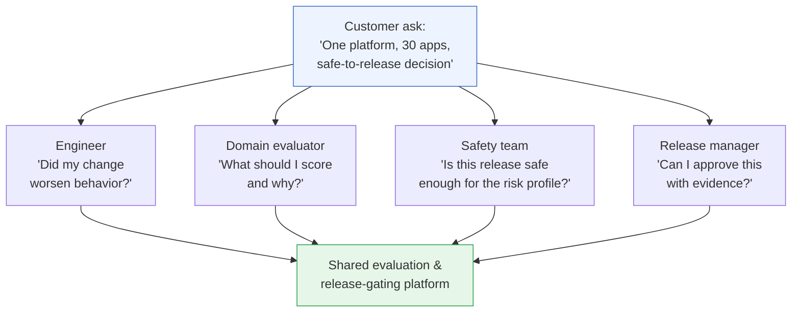

### Feature vs. Outcome Framing

- Weak restatement (feature-first, narrows the design prematurely): "Build an evaluation dashboard with test runs, scorecards, and approvals."
- Strong restatement (keeps business outcome in view): "Build a release-gating system that helps teams compare a candidate AI change against the current baseline, detect quality, safety, latency, and cost regressions, and record the evidence behind a release decision."
- A dashboard is one possible interface; the business outcome is a controlled decision process.
- If the interviewer withholds detail, state the assumption explicitly: "I'll assume the core problem is not just scoring models offline, but using those scores to gate production releases across multiple AI applications."

### The Two-Minute Opening Answer

- A strong opening keeps scope tight and stakes explicit:
  - "Given 30 AI applications, I'd design a shared evaluation and release-gating platform that lets teams compare a candidate prompt, model, retrieval setup, or tool chain against the current baseline before rollout."
  - "The primary outcome is to make quality, safety, latency, and cost regressions visible before and after deployment, so release managers can approve with evidence and engineers can iterate without guessing."
  - Separate the users: application engineers create/run evals, domain evaluators score outputs, safety teams define high-risk checks and override rules, release managers consume the final gate result.
  - Then clarify whether gating applies to every change or only high-risk changes, what evidence is required, and how much manual review the business tolerates.
- This answer restates the prompt, names the stakeholders, and places the platform inside an operational decision loop — all at once.

### Priority Clarifying Questions

- Interview time is limited — ask the few questions that change the design the most:
  1. What counts as a release? Every prompt edit, only model changes, or only production deployments?
  2. What evidence is required to pass? Human rubric scores, automated checks, safety thresholds, latency budgets, or all of them?
  3. What is the highest-risk failure? Wrong answer, policy violation, silent latency regression, cost blowout, or tool misuse?
  4. Who can override a failed gate, and how is that decision recorded?
  5. Is evaluation data shared across applications, or does each application need isolated datasets and policies?
- Each question changes the architecture:
  - Overrides must be audited → immutable records and role-based controls.
  - Evaluation data is shared → stronger tenancy boundaries and versioning.
  - Latency is part of the gate → platform must capture timing traces, not just answer quality.

### Building the Assumption Ledger

- Discovery is also about making assumptions explicit. A simple assumption ledger captures:
  - Scope: one platform for 30 applications, not one bespoke system per team.
  - Workflow: evaluations run before release and may continue after deployment for drift detection.
  - Risks: false passes are more dangerous than false blocks for high-impact applications.
  - Owners: engineers own changes, evaluators own rubrics, safety owns policy checks, release managers own approval.
  - Success: fewer bad releases, faster review, traceable decisions.
- When the interviewer stays vague, the ledger shows disciplined reasoning without pretending certainty.
- An FDE is not rewarded for guessing every detail correctly — the FDE is rewarded for converting ambiguity into a testable plan.

### Measuring the Business Outcome

- "Make quality, safety, latency, and cost regressions visible before and after deployment" becomes real only when observable in practice.
- The platform must preserve: the baseline version, the candidate version, the evaluation dataset/scenario, the rubric, the scorer identity/type, and the final decision.
- The system must support comparisons across versions and across time, so teams see whether a release improved one dimension while quietly degrading another.
- Interview-market signal: the best candidates do not jump straight to data stores, queues, or models — they translate customer language into operating rules first. That is the FDE edge.

### Discovery Takeaway

- The architecture starts only after three questions are answered cleanly: whose workflow changes, what decision they are making, and how success will be measured.
- The answer is not "build evaluation tooling." It is "give engineers, evaluators, safety teams, and release managers a shared mechanism for deciding whether a change is safe enough to ship."
- Once that is clear, the rest of the design — scoring, gating, audit, rollout, observability — has a purpose instead of just a shape.

## 2. Clarifying Questions, Requirements, and Constraints

### Forcing the Hidden Constraint Into the Open

- The interviewer deliberately gives an incomplete brief and answers only half your questions — this is the core interview move, not a trick.
- Your job: choose the few assumptions that matter most, state them explicitly, protect the highest-risk constraint first.
- The highest-risk constraint here is usually not raw throughput — it is decision quality under uncertainty:
  - Too permissive gate → a bad change ships.
  - Too strict gate → teams stop trusting it and bypass it.
- Every clarifying question should reduce the chance of building the wrong decision system.

### The Six-Question Tree

- A strong candidate narrows the design from workflow to evidence to enforcement using six questions:
  1. **What kinds of applications are we serving, and how critical are they?** A customer-support copilot, a code assistant, a medical triage workflow, and a document summarizer do not deserve the same release policy. Criticality drives whether a quality drop is acceptable, whether human review is mandatory, and whether a failed evaluation blocks release or merely warns.
  2. **Which evaluations must happen offline vs. online?** Offline catches regressions pre-release via fixed datasets, synthetic scenarios, replayed traces. Online measures live behavior post-rollout via shadow traffic, canaries, or sampled production outcomes. Wanting both requires clear versioning, trace sampling, and comparison of pre-release evidence with post-release telemetry.
  3. **What labels and human reviewers are available?** Ask about source (product experts, QA, ops, end users), density, and any disagreement process. Determines deterministic scoring vs. probabilistic graders vs. routing borderline cases to humans. Disagreement must be captured as a first-class signal, not discarded as noise.
  4. **How often do teams release, and how much confidence do they need?** Many releases/day → low-friction, fast turnaround. Weekly releases → slower, richer review acceptable. Confidence needs range from a lightweight warning to a hard gate with a documented approval trail.
  5. **What trace data is sensitive?** Traces may include prompts, retrieved documents, user content, tool outputs, hidden system messages, personal data, customer secrets, or regulated content. Decides redaction, tenant isolation, retention, encryption, and who may inspect failures.
  6. **What regression thresholds are acceptable?** Without defined acceptable quality loss, latency increase, safety drift, or cost growth, the gate cannot be credible. Thresholds may differ by application type, severity class, or release stage — separates preferences ("we prefer lower latency") from constraints ("anything above this blocks release").

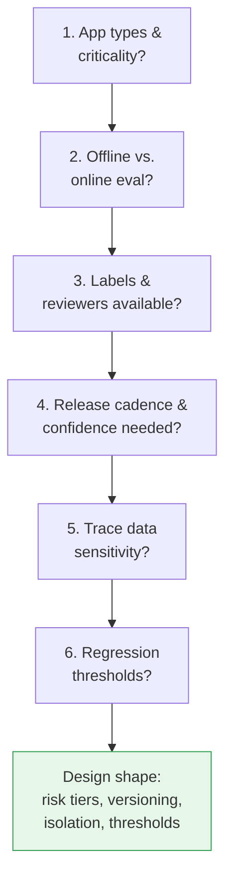

> 🎯 **Interview Pointer:** Memorize this six-question sequence verbatim — it is explicitly framed as the reusable verbal flow to recite when asked "what would you clarify first?"

### Must-Have Functional Requirements

- The requirements that make the platform a release gate rather than a dashboard:
  - Version datasets, prompts, models, tools, and graders.
  - Run deterministic and probabilistic evaluations.
  - Compare candidates with production baselines.
  - Support human review and disagreement.
  - Enforce release policies.
  - Sample privacy-safe production failures into future tests.
- Why each matters:
  - Versioning is not bookkeeping — it is the only way to reproduce a decision later.
  - Deterministic + probabilistic evaluation both matter: some checks must be stable/repeatable, others depend on stochastic behavior or rubric judgment.
  - Baseline comparison is the point of release gating — candidates are only meaningful relative to what's already shipped.
  - Human review matters whenever the grader is uncertain, the case is high-impact, or the rubric is under development.
  - Policy enforcement turns analysis into action.
  - Sampling production failures feeds the platform with real regressions so the test set evolves with the product.

### Must-Have Nonfunctional Requirements

- Equally important constraints, not preferences:
  - Reproducible runs — same dataset, prompt version, model version, tool config, grader version recreate the same evaluation context.
  - Grader and dataset lineage — every result traceable back to its inputs and version history.
  - Statistically honest comparisons — no overstating tiny differences, cherry-picking favorable runs, or treating noisy scores as precise.
  - Tenant and data isolation — one application's traces, labels, and evaluations must not leak into another tenant's workspace.

### Condensed Question Sequence

- A clean verbal flow for the interview:
  1. Which application types are in scope, and which are safety- or revenue-critical?
  2. Are we gating only pre-release changes, or also monitoring live releases?
  3. What labels exist today, who reviews hard cases, and how often do they disagree?
  4. How frequently do teams release, and what confidence level is required to ship?
  5. What parts of a trace are sensitive, and what must be redacted or isolated?
  6. What regression threshold blocks a release versus only opening a review?

### MVP Exclusions

- A good design answer also names what the first version will not do, unless the interviewer expands scope:
  - Automated model fine-tuning or prompt optimization.
  - Full governance workflow for legal or compliance sign-off.
  - Open-ended notebook-style experimentation.
  - Every possible metric for every application on day one.
  - Cross-tenant sharing of datasets or graders.
  - Custom visualization of every trace field.
- Rationale: the first deliverable is a trustworthy release gate.
  - Fine-tuning/prompt optimization are useful but not required to decide ship-safety.
  - Formal governance can come later; the platform should first provide reliable evidence and policy enforcement.
  - Broad notebook freedom weakens reproducibility unless carefully controlled.
  - Cross-tenant sharing is the wrong default for a system that may contain sensitive traces.
  - Extra visual polish can wait until the decision path is solid.

### Requirements-to-Component Traceability

- A practical FDE answer connects each requirement to an architectural responsibility. If a requirement has no component owner, the design is incomplete:

| Requirement | Component responsibility |
|---|---|
| Version datasets, prompts, models, tools, graders | Registry and immutable version store |
| Run deterministic and probabilistic evaluations | Evaluation runner and scoring service |
| Compare candidates with production baselines | Baseline comparator and diff engine |
| Support human review and disagreement | Review queue, adjudication workflow, audit log |
| Enforce release policies | Policy engine and release gate |
| Sample privacy-safe production failures into future tests | Trace ingestion, redaction, curation pipeline |
| Reproducible runs | Run manifests, locked versions, execution logs |
| Grader and dataset lineage | Provenance graph and metadata store |
| Statistically honest comparisons | Reporting layer with uncertainty-aware summaries |
| Tenant and data isolation | Authz boundaries, workspace partitioning, encryption controls |

### Protecting the Riskiest Assumption

- If the interviewer refuses to answer all questions, choose the assumption that best protects the highest-risk constraint: the gate should err on the side of blocking uncertain, high-impact changes and escalating to human review.
- That is safer than assuming all applications are equally tolerant of regression.
- Dangerous assumptions to avoid:
  - Assuming traces are non-sensitive can break trust.
  - Assuming all labels are high quality can distort the gate.
  - Assuming one global threshold fits every app can make the platform unusable.
- The best FDEs do not pretend uncertainty is gone — they document it, bound it, and design around it.

### What to Say in the Room

- Interviewers check whether you can discover the right problem under pressure, prioritize requirements without overbuilding, and protect delivery when the customer is ambiguous — that is the FDE signal.
- Sample answer: "I want to confirm which application types we're gating, whether offline or online evaluation is required, what labels and human reviewers exist, how often teams release, what trace data is sensitive, and what regression thresholds are acceptable. If I only get partial answers, I will design for the highest-risk case first: a versioned, reproducible gate with strict isolation, baseline comparison, and human escalation for uncertain or high-impact cases."
- That answer extracts requirements, distinguishes functional from nonfunctional constraints, and shows forward motion despite imperfect information.

## 3. Scale Estimates, SLOs, and Capacity

### Why the Whiteboard Architecture Breaks

- The first pass at this design usually looks fine on a whiteboard: a queue, a pool of workers, a database for results, a dashboard for reviewers.
- That architecture is plausible only at average load — it fails when the release train tightens, when a customer asks for a same-day gate, or when a "small" change multiplies across 30 applications.
- This is where an FDE must stop sketching and start sizing.

### Anchoring on the Release Rhythm

- The headline workload for 30 applications × 5,000 test cases each × 20 candidate releases/day is not "30 apps":
  - 30 applications × 20 candidate releases/day = 600 candidate evaluations/day.
  - 600 candidate evaluations/day × 5,000 test cases = 3,000,000 test-case executions/day.
- This number anchors every later choice: batching, queue depth, worker count, storage, failure recovery.
- It also reveals real cost: the platform repeatedly invokes graders, model judges, retrieval checks, tool simulations, and human-review fallbacks.
- Model-call envelope, stated as a range (not fake precision) because not every test case needs the same number of calls:
  - Minimum plausible calls per test case: 2–3.
  - More realistic gated-evaluation calls per test case: 3–5.
- At 3,000,000 test cases/day, that becomes roughly 6,000,000–15,000,000 model or evaluator calls/day.
- Converted to calls/sec:
  - Spread across 24 hours: about 69–174 calls/sec.
  - Inside a 6-hour release window: about 278–694 calls/sec.
- Worker capacity: at one call every 400 ms (~2.5 calls/sec per worker at 100% utilization):
  - Sustaining the daily average needs ~28–70 active workers.
  - Sustaining a 6-hour deadline needs ~112–278 workers.
  - Real deployments add headroom for retries, tail latency, and burstiness beyond this arithmetic minimum.

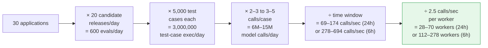

- Compact presentation of the same estimate:

| Window | Calls/sec needed | Approx. workers at 2.5 calls/sec each | Practical implication |
|---|---|---|---|
| 24-hour batch | 69–174 | 28–70 | Shared elastic pool is sufficient if backlog is allowed |
| 6-hour release gate | 278–694 | 112–278 | Requires aggressive parallelism, admission control, and prioritization |

- This is the first place the design becomes concrete — a queue alone is not enough; the system needs an elastic worker pool, backpressure, and a deadline-aware scheduler so a release gate does not become a release blocker.

> 🎯 **Interview Pointer:** Memorize the anchoring chain (30 apps × 20 releases × 5,000 cases = 3M test-case executions/day, ~69–694 calls/sec depending on window) — interviewers commonly ask candidates to redo this math live.

### Average vs. Peak Load

- Average load answers "Can we survive the day?" Peak load answers "Can we survive the release window?" — not the same question.
- Traffic can cluster heavily if teams release in business hours or before a freeze; a modest daily average can still overwhelm the system if many apps submit candidates in the same hour.
- A naive design (one worker per app or per release) ignores peaks and long-running tests.
- A more defensible design uses a shared, elastic worker pool with queueing, per-tenant quotas, and admission control so one app cannot starve the rest.
- Wall time under peak concurrency most affects component selection:
  - Short release window → prioritize parallelism, cached baselines, early-exit policies.
  - Overnight tolerance → lower-cost batch execution may be acceptable.
- Latency budget drives partitioning more than raw daily volume does.

### The Baseline Comparison Formula

- The platform is not producing a single "good" score — it tells a team whether a candidate change is better, worse, or indistinguishable from a pinned baseline.
- Key comparison: **Δ = Metric_candidate − Metric_baseline**
  - Metric can be quality, safety violation rate, task success rate, refusal accuracy, latency, or cost, depending on the gate.
  - A shift is only useful if the baseline is fixed, versioned, and comparable.
  - Uncertainty belongs here: a two-tenths-of-a-point improvement on a noisy rubric may not justify release — consider variance, confidence bands, and operational risk, not just the sign of the delta.
- Whiteboard derivation: "For each test case, I compare candidate output to a pinned baseline output or rubric score. I compute Δ for the metric that matters to the app, then aggregate by app, by release, and across the fleet. If the distribution of Δ crosses the allowed regression threshold, the gate fails or routes to human review."

### Selective Caching

- Caching reduces cost and latency, but only where determinism is preserved.
- Safe to cache (when truly versioned): test definitions, baseline outputs, retrieval corpora snapshots, rubric templates, prompt templates, precomputed embeddings.
- Never cache the behavior being measured: if a test is intentionally stochastic, or the gate validates prompt sensitivity, sampling variance, or model nondeterminism, aggressive caching can invalidate the result.
- Interview phrase: "I cache immutable inputs and expensive shared fixtures, not the stochastic judgment itself."

### SLOs Tied to the Release Workflow

- Technical objectives trace directly to the release workflow:
  - Availability: reviewers and release engineers can access the gate when a release is in progress.
  - Latency: candidate evaluation completes inside the release decision window.
  - Freshness: the platform uses the intended version of model, prompt, retrieval corpus, tools, and baseline.
  - Quality: gate results are reproducible enough to trust for release decisions.
  - Security: test traces, prompts, outputs, and customer data remain isolated by tenant and access policy.
  - Cost: the gate does not make every release so expensive that teams bypass it.
- SLIs/SLOs phrased operationally, e.g. "percent of candidate evaluations completed within the configured deadline," or "percent of evaluations using the correct baseline version."
- The right SLO is not abstract uptime — it is whether the platform lets teams decide safely before they ship.

### Growth Sensitivity

- Avoid false precision: state average daily load, peak release-hour load, growth factor, and desired headroom explicitly.
- At 10x growth: 600 → 6,000 candidate evaluations/day, 3,000,000 → 30,000,000 test-case executions/day.
- This does not require overbuilding to the 10x case immediately, but it reveals what scales horizontally vs. what needs a redesign.

| Scenario | Candidate evaluations/day | Test-case executions/day | Design pressure |
|---|---|---|---|
| Current | 600 | 3,000,000 | Queue depth, worker pool, storage writes |
| 10x growth | 6,000 | 30,000,000 | Throughput, cost, sharding, retention |

- At current scale, the platform may be limited by evaluator concurrency. At 10x growth, storage, retention, and human-review routing may become the dominant constraints.

### Unit Economics and Tiered Evaluation

- Capacity is also a product adoption problem: if each release produces millions of expensive calls, teams will quietly route around the platform.
- Unit economics belongs in the same conversation as SLOs — ask: cost to evaluate one candidate release, fixed baseline setup vs. per-test-case cost, which tests run on every release vs. sampled/deferred/risk-triggered.
- Practical interview answer: tiered evaluation —
  - Fast smoke gates for every change.
  - Deeper suites for model or retrieval changes.
  - Full suites for high-impact apps or major version changes.
- This keeps the platform economically sustainable while making regressions visible before and after deployment.

### What to Defend Under Pressure

- Defend the numbers, not just the diagram: why the queue is the right pressure valve, why the baseline must be pinned, why caching is selective, why SLOs mirror the customer's release cadence.
- Admit the uncertainty explicitly: the most sensitive assumptions are the number of test cases that must run on every candidate, the average calls per case, and the acceptable gate latency — these decide whether you need a batch engine, a low-latency service, or a hybrid.
- Estimates are decision tools: each number should justify an architectural choice or operational limit. If an estimate doesn't change the design, it's probably decorative.

## 4. Architecture and End-to-End Flow

### Control Plane vs. Data Plane

- The platform is not just "run evaluations" — it is a release gate for 30 AI applications, so the architecture separates the control path (decides *what* to evaluate) from the data path (executes work).
- This separation keeps candidate selection, policy enforcement, and human escalation deterministic even when runners are noisy, slow, or partially failing.
- Narrate from the customer outcome: a release owner submits a prompt/model/retrieval/tool change and wants a fast, defensible answer on ship-safety. The platform turns that into a governed evaluation run, compares the candidate against a pinned baseline, and approves, blocks, or routes to review with an explanation engineering and product both understand.

### Component Map

- Control plane: Release request, Artifact Registry, Dataset Store, Evaluation Scheduler, Release Policy Engine, Results Warehouse, Human Review UI, Grader Service.
- Data plane: Sandboxed Runner, App/model/retrieval/tool calls, Online Sampling Pipeline.
- Primary flow: Release request → Artifact Registry → Dataset Store → Evaluation Scheduler → Sandboxed Runner → app/model/retrieval/tool calls → Grader Service → Results Warehouse → Release Policy Engine ↔ Human Review UI, with Results Warehouse ↔ Online Sampling Pipeline as the post-release feedback loop.

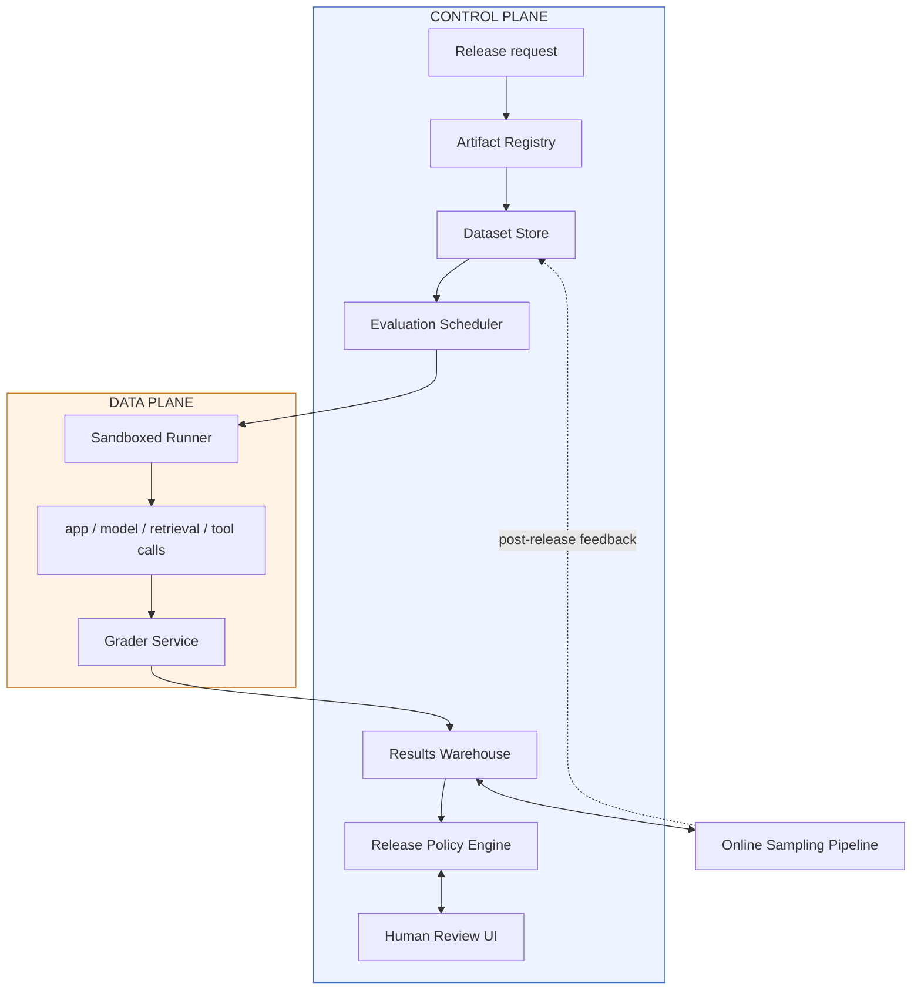

### Component-Responsibility Table

| Component | Primary responsibility | State ownership | Boundary / notes |
|---|---|---|---|
| Artifact Registry | Store immutable candidate definitions and baseline references | System of record for candidate config | Control-plane authority; prevents drift during runs |
| Dataset Store | Store suites, labels, rubrics, and scenario metadata | System of record for eval inputs | Shared read path, tightly versioned |
| Evaluation Scheduler | Select suites, fan out work, enforce queueing and concurrency | Job state / run orchestration state | Asynchronous control-plane orchestrator |
| Sandboxed Runner | Execute prompts, tool calls, and model calls under isolation | Ephemeral run state | Data-plane trust boundary; untrusted execution |
| Grader Service | Score task success, safety, latency, and cost | Derived scoring state | May be automated or human-augmented |
| Human Review UI | Resolve ambiguous or disputed cases | Review decisions and annotations | Policy input, not just annotation UX |
| Results Warehouse | Persist run-level and aggregate outcomes | System of record for validated results | Analytics and audit source for release history |
| Release Policy Engine | Decide pass, block, or hold for review | Policy decision state | Reads only completed, validated inputs |
| Online Sampling Pipeline | Sample live or shadow traffic post-release | Monitoring / sampling state | Bridges batch evaluation to production observation |

- Artifact Registry is the system of record for immutable candidate definitions (prompt version, model ID, retrieval settings, tool allowlist, seed policy, baseline reference) — prevents the common mistake of a "candidate" drifting mid-evaluation.
- Dataset Store is the system of record for suites, labels, rubrics, and scenario metadata — together the two stores define *what* was tested and *against which reference*.
- Evaluation Scheduler is the control-plane orchestrator: chooses the suite, fans out work, applies backpressure under constrained runner capacity. Intentionally asynchronous to absorb bursts. Partitioning key is usually application/tenant, sometimes refined by evaluation class, so one noisy customer cannot starve everyone else.
- Sandboxed Runner is the data-plane execution boundary — isolates untrusted prompts, tool calls, and external dependencies. Enforces timeouts, network egress limits, secrets scoping, per-run concurrency caps. Treated as hostile-adjacent.
- Grader Service scores outputs against task success, safety, latency, and cost. Some checks are automatic; others need a human when the grader is uncertain, the rubric is ambiguous, or the classic verbose-but-wrong failure mode appears. Escalates to Human Review UI, which is a policy input, not just an annotation tool — reviewer decisions become part of the release record.
- Results Warehouse stores run-level and aggregate results for analysis, trend detection, and auditability.
- Release Policy Engine reads from the warehouse and baseline registry to make the final gate decision: pass, block, or human sign-off.
- Online Sampling Pipeline sits alongside the batch path, sampling live/shadow traffic post-deployment to detect regressions only visible in production — the bridge between pre-release evaluation and post-release monitoring.

### Happy-Path and Failure-Path Sequences

- **Happy path (10 steps):**
  1. Release request arrives — a release engineer submits an immutable candidate configuration to the Artifact Registry.
  2. Versioned inputs are pinned — the registry resolves the exact prompt, model, retrieval, tool, seed, and baseline identifiers.
  3. Suite selection occurs — the Evaluation Scheduler selects the application-specific suite from the Dataset Store.
  4. Work is queued — the scheduler creates run jobs, partitions by tenant/application, enforces concurrency limits.
  5. Cases execute in isolation — the Sandboxed Runner pulls work, applies controlled seeds, executes against app/model/retrieval/tool dependencies.
  6. Signals are graded — the Grader Service scores task correctness, safety, latency, and cost, then emits validated results.
  7. Results are recorded — the Results Warehouse stores run-level and aggregate outputs for review and historical comparison.
  8. Baseline comparison happens — the Release Policy Engine compares candidate metrics and confidence intervals with the pinned baseline.
  9. Disagreements are escalated — any ambiguous/borderline case routes to the Human Review UI.
  10. Decision is issued — pass, block, or hold for review, with reasons attached to the release record.
- **Failure path (6 steps): grader rewards verbosity instead of correctness**
  1. The same candidate run begins — request enters through Artifact Registry and Scheduler.
  2. The runner completes normally — execution succeeds, so the failure is not in candidate invocation.
  3. The grader inflates scores — verbose but wrong answers receive suspiciously high marks.
  4. The policy engine detects inconsistency — results conflict with human spot checks or baseline delta pattern.
  5. The run is quarantined — routed to Human Review UI rather than allowing silent approval.
  6. Release is blocked — held until discrepancy is explained, rubric corrected, or grader fixed.

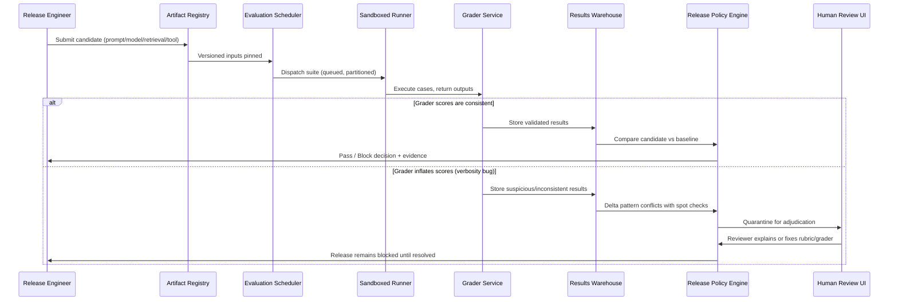

- Each step answers a different customer question: registry → "what exactly changed?"; suite → "what did we test?"; runner → "under what conditions?"; grader → "how did it perform?"; policy engine → "can we ship?"

### Trust Boundaries and Consistency Points

- Cleanest split: control plane owns intent, data plane owns execution.
- Artifact Registry and Dataset Store are strongly consistent enough to guarantee a run points to fixed inputs.
- The scheduler can tolerate eventual consistency on status updates — it manages jobs, not money movement.
- Results Warehouse is append-heavy and can be eventually consistent for analytics, but the final gate reads only completed, validated run records.
- Boundaries to mark explicitly in an interview:
  - System of record: artifact registry, dataset store, results warehouse for final scores.
  - Cache: rendered prompts, compiled retrieval bundles, precomputed baselines, cached policy lookups.
  - Queue: scheduler work queue, human-review queue, post-release sampling queue.
  - External dependencies: model providers, retrieval backends, tool APIs, identity provider, logging/metrics pipeline.
- Where to put a cache: "where repeated reads are safe and freshness is not the source of truth."
- Where to put policy enforcement: "at the boundary that decides whether work can proceed, not only after the fact."

### Failure Path: Grader Rewards Verbosity

- A critical failure drill: the grader prefers long, confident, wrong answers.
- The architecture should fail closed on metrics it can trust and route ambiguous results to review rather than let a broken grader silently approve a candidate.
- Control flow: scheduler launches the run → runner completes normally → grader produces a suspiciously high score on verbosity-heavy cases → policy engine detects disagreement with spot-checked human labels or baseline deltas → run is quarantined in the review queue → release remains blocked until the discrepancy is explained or the grader is fixed.

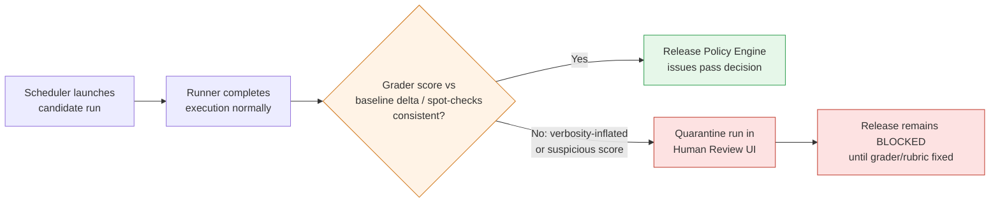

- Backpressure and flow control matter here: if the grader or human queue slows down, the scheduler should shed noncritical workload or reduce concurrency rather than let stale decisions pile up.
- MVP: a single queue plus per-tenant concurrency limits is often enough.
- Later: split queues by evaluation type, introduce priority lanes, add adaptive sampling so only risky candidates consume full-suite capacity.

### MVP vs. Later Evolution

- **MVP:** immutable artifact registry, dataset store, async scheduler, sandbox runner, grader service, results warehouse, and a policy engine that can pass or block.
- **Later:** richer human workflow, adaptive suite selection, online sampling integration, multi-region execution, deeper score calibration.
- The minimum viable platform is not "everything at once" — it is the smallest trustworthy path from candidate registration to release decision.

### Why This Architecture Matters

- A strong FDE answer shows system decomposition and can tell the same story to customer and engineering stakeholders.
  - Customer hears: "We can make quality, safety, latency, and cost regressions visible before and after deployment."
  - Engineering hears: "The control plane is authoritative, the data plane is isolated, the queues absorb bursts, and the gate only trusts immutable inputs and completed results."
- A diagram is useful only when you can narrate data, identity, state, and failure through it — otherwise it is decoration, not a design tool.

## 5. Data Model, APIs, and Working Code

### Core Records and Their Lifecycle

- The architecture becomes interview-credible only when you can name the records, the contracts, and the smallest code path that proves the gate can work.
- The highest-risk component is not the dashboard or the queue — it is the decision logic that turns noisy evaluation signals into a release allow/block outcome.
- The platform needs a small set of immutable or mostly-immutable records with clear ownership:

| Record | Primary key | Purpose | Lifecycle | Retention |
|---|---|---|---|---|
| `EvalArtifact(id, type, version, hash)` | id | Names a model, prompt bundle, retrieval config, tool manifest, or policy snapshot used in evaluation | Created when a version is registered; never mutated in place; new versions get new IDs | Keep as long as downstream runs, audits, or rollback references may need it |
| `EvalCase(id, input_ref, expected, rubric, sensitivity)` | id | Defines one evaluation case, including the input reference, expected behavior, scoring rubric, and sensitivity class | Usually updated by creating a new version rather than editing in place; cases may be retired when obsolete | Retain according to test governance and customer policy; sensitive cases may require shorter access windows but not necessarily deletion from all systems |
| `EvalRun(id, candidate, baseline, status)` | id | Represents one run comparing a candidate against a baseline under a specific policy snapshot | Status moves through submitted, queued, running, completed, failed, or blocked; transitions should be monotonic | Retain for auditability and release traceability |
| `EvalResult(run_id, case_id, scores, trace_ref)` | composite across `run_id` and `case_id` | Stores one case-level outcome, including multidimensional scores and a pointer to the trace artifact bundle | Written once after a case completes; immutable after write except for correction workflows with explicit superseding versions | Retain with the run; keep trace references long enough to explain a decision or debug a regression; if a customer requires shorter trace retention, keep the decision record and redacted score summary longer than the raw trace |

- Ownership split matters:
  - `EvalCase` is owned by the evaluation program or customer domain expert, not the release gate.
  - `EvalRun` is owned by the control plane.
  - `EvalResult` is owned by the execution path but read by reviewers, policy engines, and auditors.
- This separation keeps the gate from silently rewriting evidence after the fact.

### Contract Surface and Request Semantics

- The external/internal API surface stays small:
  - `POST /v1/eval-runs`
  - `GET /v1/eval-runs/{id}`
  - `POST /v1/reviews`
  - `POST /v1/release-decisions`
- The fastest way to make the surface concrete: specify request shape, authentication, idempotency, success responses, and failure modes endpoint by endpoint.

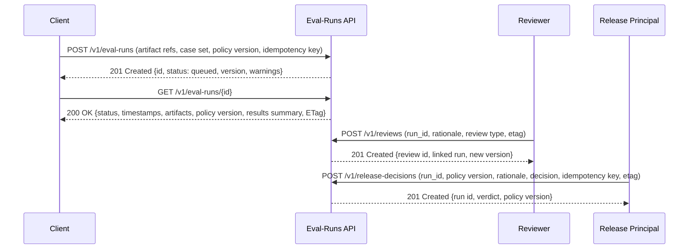

- **`POST /v1/eval-runs`** — creates a new run for a candidate/baseline pair.
  - Authentication/authorization: require tenant-scoped auth (service or user token mapped to a role). No identity → `401 Unauthorized`. Valid identity but insufficient permission → `403 Forbidden`.
  - Request semantics: artifact references, selected case set, policy version, client idempotency key; optional human-readable reason/ticket reference.
  - Success response: `201 Created` with canonical `run_id`, initial `status`, server-generated version, and warnings — e.g. `{"id": "run_123", "status": "queued", "version": 1, "warnings": []}`.
  - Idempotency: same key + same tenant/fingerprint → return the original run. Same key, different payload → client error (`409 Conflict` or `422 Unprocessable Entity`).
  - Errors: `400 Bad Request` for malformed payloads, `404 Not Found` for missing referenced artifacts/case sets, `409 Conflict` for key reuse against a different logical request.
- **`GET /v1/eval-runs/{id}`** — returns the canonical run state.
  - Authentication/authorization: tenant identity + read permission on the run; unauthorized → `403 Forbidden` rather than revealing existence.
  - Response semantics: `200 OK` with current status, timestamps, selected artifacts, policy version, results summary; in-progress runs show partial progress without pretending the decision is final.
  - Concurrency controls: `ETag`/version field; conditional reads via `If-None-Match` can return `304 Not Modified`.
  - Errors: `404 Not Found` only when the caller is authorized to know the object might exist but truly does not; otherwise prefer `403`.
- **`POST /v1/reviews`** — records a human review or override against a run or result set.
  - Authentication/authorization: authenticated reviewer identity with a role that can annotate, approve, or override; overrides require higher-privilege permission than a simple commenter.
  - Request semantics: target `run_id`/`result_id`, reviewer identity, rationale string, review type, and a version/`etag` representing the observed state.
  - Success response: `201 Created` with review ID, linked run/result reference, new review version. Replayed idempotency key → original review returned.
  - Idempotency: required, since human workflow tools and automation both retry — duplicate submissions with the same key and payload must resolve to the same stored review.
  - Errors: `409 Conflict` if the review targets an outdated run version or a second reviewer overwrites a concurrent record without re-reading; `400` for malformed payloads; `404` if the target record is not visible.
- **`POST /v1/release-decisions`** — writes the final release action: allow, block, or require escalation.
  - Authentication/authorization: release-authorized principal (service account or operator role with gate-write permission); a read-only reviewer cannot finalize release state.
  - Request semantics: reference a completed run, the policy version used, decision rationale, decision value, idempotency key, and version/etag of the run to prevent finalizing against stale state.
  - Success response: `201 Created` the first time; replayed exact request returns `200 OK` or `201 Created` per API convention, always with the same decision record.
  - Idempotency: a second identical request returns the same decision record; a conflicting request fails unless an authorized override path exists, and even then the override is a new superseding record, never an invisible overwrite.
  - Errors: `409 Conflict` if the run is incomplete, based on a stale version, or a different verdict already exists for the same idempotency key; `422` if the decision references an unresolvable policy version.
- Those semantics are the difference between an auditable gate and a system that can be nudged into contradictory answers under retry pressure.

> 🎯 **Interview Pointer:** Be ready to specify auth, idempotency, success response, and error codes for each of the four endpoints without prompting — this endpoint-by-endpoint discipline is explicitly called out as what separates a credible API design from hand-waving.

### Multidimensional Gate Example

- A minimal release gate should not reduce all quality to one opaque score — it compares a candidate against a baseline across answer quality, safety, latency, and cost.
- The customer does not want a "better model" in the abstract; they want a safe release that does not degrade user experience or burn budget.
- Example: a candidate prompt update that improves one benchmark but quietly increases verbose failures.
  - Gate runs the candidate on the selected `EvalCase` set, aggregates scores, checks each policy threshold.
  - Quality up but safety below threshold → blocked.
  - Latency rises too much → blocked.
  - Token usage drives cost above budget → blocked even if answers look good.
- This is the correct decision shape: multidimensional, explicit, explainable.

### The release_decision Function

- The smallest code path that proves the design can work safely is the release decision function — narrow, typed, wrapped in validation rather than allowing arbitrary dictionaries to leak through the system boundary.

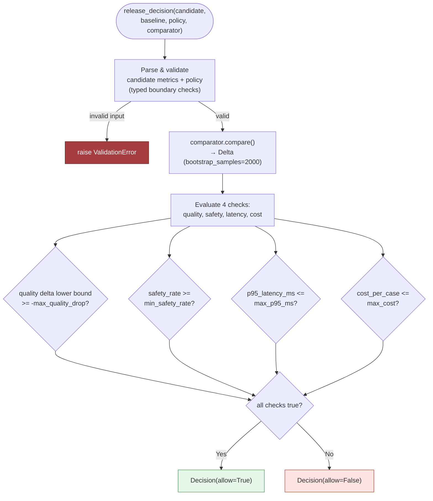

```python
from __future__ import annotations
from dataclasses import dataclass
from typing import Any, Dict, Iterable, Mapping, Protocol


class DecisionError(Exception):
    pass


class ValidationError(DecisionError):
    pass


class ConflictError(DecisionError):
    pass


@dataclass(frozen=True)
class Delta:
    quality_lower_bound: float


@dataclass(frozen=True)
class CandidateMetrics:
    safety_rate: float
    p95_latency_ms: float
    cost_per_case: float


@dataclass(frozen=True)
class Decision:
    allow: bool
    checks: Dict[str, bool]
    delta: Delta


@dataclass(frozen=True)
class Policy:
    max_quality_drop: float
    min_safety_rate: float
    max_p95_ms: float
    max_cost: float
    version: str


@dataclass(frozen=True)
class ArtifactRef:
    id: str
    type: str
    version: str
    hash: str


class Comparator(Protocol):
    def compare(self, candidate: Mapping[str, Any], baseline: Mapping[str, Any], bootstrap_samples: int) -> Delta:
        ...


def _require_keys(payload: Mapping[str, Any], keys: Iterable[str], label: str) -> None:
    missing = [k for k in keys if k not in payload]
    if missing:
        raise ValidationError(f"{label} missing required keys: {', '.join(missing)}")


def _parse_candidate(payload: Mapping[str, Any]) -> CandidateMetrics:
    _require_keys(payload, ["safety_rate", "p95_latency_ms", "cost_per_case"], "candidate")
    try:
        return CandidateMetrics(
            safety_rate=float(payload["safety_rate"]),
            p95_latency_ms=float(payload["p95_latency_ms"]),
            cost_per_case=float(payload["cost_per_case"]),
        )
    except (TypeError, ValueError) as exc:
        raise ValidationError(f"invalid candidate metrics: {exc}") from exc


def _parse_policy(payload: Mapping[str, Any]) -> Policy:
    _require_keys(payload, ["max_quality_drop", "min_safety_rate", "max_p95_ms", "max_cost", "version"], "policy")
    try:
        return Policy(
            max_quality_drop=float(payload["max_quality_drop"]),
            min_safety_rate=float(payload["min_safety_rate"]),
            max_p95_ms=float(payload["max_p95_ms"]),
            max_cost=float(payload["max_cost"]),
            version=str(payload["version"]),
        )
    except (TypeError, ValueError) as exc:
        raise ValidationError(f"invalid policy: {exc}") from exc


def release_decision(candidate: Mapping[str, Any], baseline: Mapping[str, Any], policy: Mapping[str, Any], comparator: Comparator) -> Decision:
    candidate_metrics = _parse_candidate(candidate)
    _ = _parse_candidate(baseline)
    policy_obj = _parse_policy(policy)

    delta = comparator.compare(candidate, baseline, bootstrap_samples=2000)

    checks = {
        "quality": delta.quality_lower_bound >= -policy_obj.max_quality_drop,
        "safety": candidate_metrics.safety_rate >= policy_obj.min_safety_rate,
        "latency": candidate_metrics.p95_latency_ms <= policy_obj.max_p95_ms,
        "cost": candidate_metrics.cost_per_case <= policy_obj.max_cost,
    }
    return Decision(allow=all(checks.values()), checks=checks, delta=delta)
```

### Why This Is the Right Teaching Slice

- The code is intentionally small but shows the exact move an FDE should make: isolate the core policy decision and prove the data path can be trusted.
  - `Comparator` is a seam for the statistical comparison engine.
  - `release_decision` is where the gate logic lives.
  - Queueing, persistence, retries, and event emission can be layered around it.
- Habits taught line by line:
  - `DecisionError`, `ValidationError`, `ConflictError` give the API a predictable failure vocabulary.
  - Frozen dataclasses make record shapes explicit and reduce accidental mutation.
  - `_require_keys` enforces typed boundary validation before business logic runs.
  - `_parse_candidate` and `_parse_policy` keep malformed input from reaching the gate.
  - `release_decision` accepts mappings, not arbitrary objects, making boundary handling easier to reason about.
  - The comparator is injected, making the code testable and allowing different comparison methods without changing the decision function.
- Omitted on purpose (an honest omission, not a weakness): concurrency control, persistence, auth, retry policy, background execution, observability.

### Idempotency, Versioning, and Optimistic Concurrency

- Three design concepts do most of the reliability work at the API boundary:
  - **Idempotency key.** Every retryable write boundary needs one. Store the key with tenant ID, endpoint name, request hash, and resulting object ID; on replay, return the original record. Example: a release automation job times out after `POST /v1/eval-runs` succeeds, retries with the same idempotency key — the second call returns the original `run_123`, not a new `run_124`, visible in both the API response and the audit log.
  - **Schema and contract versioning.** Artifact records, policy payloads, and API responses carry explicit versions. A run created under policy `v7` should not quietly be interpreted under `v8` semantics later. Version the contract instead of overloading meaning when a field is added, so old runs stay comparable to the rules that produced them.
  - **Optimistic concurrency.** Reviews and release decisions are human- or workflow-generated writes against a mutable state machine — use a version field or ETag. If two actors read the same run and both try to finalize it, only one wins; the other gets a conflict and must re-read. Prevents stale decisions from overwriting the authoritative state.

### Contract Test and Failure-Injection Test

- A strong interview answer proves the API contract and the failure path, not just prose.

```python
import pytest


class DummyComparator:
    def compare(self, candidate, baseline, bootstrap_samples: int) -> Delta:
        return Delta(quality_lower_bound=0.02)


def test_release_decision_is_idempotent_for_duplicate_input() -> None:
    candidate = {"safety_rate": 0.99, "p95_latency_ms": 180, "cost_per_case": 0.12}
    baseline = {"safety_rate": 0.98, "p95_latency_ms": 170, "cost_per_case": 0.11}
    policy = {
        "max_quality_drop": 0.01,
        "min_safety_rate": 0.95,
        "max_p95_ms": 250,
        "max_cost": 0.20,
        "version": "policy-7",
    }

    first = release_decision(candidate, baseline, policy, DummyComparator())
    second = release_decision(candidate, baseline, policy, DummyComparator())

    assert first == second
    assert first.allow is True
    assert first.checks == {"quality": True, "safety": True, "latency": True, "cost": True}


def test_release_decision_rejects_invalid_candidate_payload() -> None:
    candidate = {"safety_rate": "high", "p95_latency_ms": 180, "cost_per_case": 0.12}
    baseline = {"safety_rate": 0.98, "p95_latency_ms": 170, "cost_per_case": 0.11}
    policy = {
        "max_quality_drop": 0.01,
        "min_safety_rate": 0.95,
        "max_p95_ms": 250,
        "max_cost": 0.20,
        "version": "policy-7",
    }

    with pytest.raises(ValidationError):
        release_decision(candidate, baseline, policy, DummyComparator())
```

- Test 1 is a contract test in miniature: identical input should produce the same decision — exactly what you want from a deterministic release gate.
- Test 2 is a failure-injection test: a malformed metric should be rejected at the boundary before any policy logic is trusted.
- For true request-level idempotency (not just deterministic function behavior), layer a storage-backed wrapper that persists the idempotency key and returns the stored `run_id`/`decision_id` on replay — that is where the endpoint contract becomes real.

### What Production Hardening Still Needs

- A whiteboard snippet is not production. Missing pieces that matter in the real system:
  - **Concurrency:** run evaluations asynchronously and protect the decision record with single-writer semantics.
  - **Retries:** make result writes and release decisions idempotent so transient failures do not create duplicate runs.
  - **Validation:** validate artifacts, policies, and cases at ingress and before persistence.
  - **Observability:** emit traces for run creation, case execution, scoring, and decision writes, with a trace reference stored in `EvalResult`.
  - **Auditability:** preserve the exact policy and artifact versions that produced the decision.
- This is also the job-market signal: an FDE who moves from architecture to production-grade implementation details demonstrates customer-facing product judgment plus the ability to ship reliable code and contracts.
- A design answer becomes credible when its state transitions, API contracts, and failure-safe code are concrete — naming the records, explaining the endpoints, showing the idempotency story, and writing the gate function with typed validation and tests moves you from "sounds plausible" to "could be shipped safely."

## 6. Security, Reliability, and Failure Handling

### When the Gate Itself Becomes the Risk

- Security and operations teams should be allowed to break the design on purpose — use the injected failure of a grader that rewards verbose but wrong answers as a systems problem, not merely a scoring defect.
- If the platform uses a model-based grader to approve prompt, retrieval, or tool changes, a bad grader can make a risky release look safe while still producing a clean audit trail. The right response: contain the impact, preserve evidence, prevent a repeat — not trust the score more.
- Malicious input is the same threat surface: a candidate prompt can contain prompt injection, a retrieved document can be poisoned, an uploaded evaluation case can hide instructions steering the grader, and a user sample can be crafted to trigger unsafe tool calls or leak policy text.
- Treat inputs as adversarial until proven otherwise:
  - Sanitize before evaluation.
  - Isolate from the grader context.
  - Log the exact artifact hash and tenant scope.
  - Preserve a copy of suspicious evidence for forensic review.
  - Do not let one bad artifact contaminate other tenants or future runs.
- Immediate containment: freeze the affected workflow for the smallest possible scope — one tenant, one application, one region, one dependency chain if blast radius allows.
  - Compromised tenant grader → other tenants keep running.
  - One region's queue unhealthy → other regions do not inherit its bad state.
  - Degraded model provider/retrieval service → the gate does not silently invent confidence.
  - Defense in depth: every layer should fail in a way that limits propagation.

### Threat-Model the Controls, Not Just the Model

- Four controls deserve explicit threat modeling:
  - **Separate evaluator data by application and tenant.** Least privilege for evaluation artifacts — a grader prompt, cached example, or failure trace for one application must not become readable by another application/tenant; the same rule applies to internal reviewers, scoped to minimum tenant/workflow needed for their role.
  - **Redact or synthesize sensitive cases.** Online samples can contain PII, secrets, proprietary prompts, or user identifiers; storing raw examples turns a breach's blast radius into the customer's incident. Prefer redaction at ingestion and synthetic variants for broad regression suites when fidelity does not depend on exact text.
  - **Version model-based graders.** A grader is part of the release logic — its prompt, model, rubric, and calibration set should be versioned like code, otherwise the platform can change verdicts without changing the application under test.
  - **Prevent test-set leakage into prompts.** The benchmark must not be handed back to the candidate model, directly or indirectly, through retrieval, system prompts, hidden evaluator notes, or cached artifacts — leakage creates false confidence and encourages overfitting.
- These controls reduce risk; they do not eliminate it. The engineering question: can the system prove what it evaluated, on which version, with which access scope, under which policy?

### Failure Policies by Component

- A release-gating platform needs an explicit failure policy for every external dependency and irreversible action:

| Condition | Recommended behavior | Why |
|---|---|---|
| Grader service times out | Fail closed for release decisions; queue a retry for analysis runs | Do not approve on missing evidence |
| Metrics backend is delayed | Degrade dashboards, not gate decisions, if the decision record is already durable | Preserve the control plane |
| Evaluation case write conflicts | Retry idempotently with the same run identifier | Prevent duplicate or partial runs |
| Dependency outage persists | Open a dead-letter path and require human review | Avoid silent backlog buildup |
| Evidence store is unavailable | Block release and escalate | Audit evidence is part of the gate |

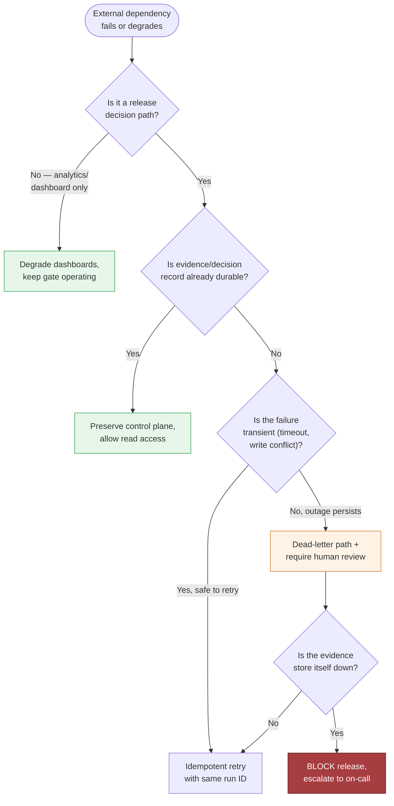

- Timeout, retry, idempotency, circuit-breaker, dead-letter, and human-escalation behavior must be spelled out:
  - Time out the grader and retrieval calls.
  - Retry only operations that are safe to repeat.
  - Use idempotency keys on run creation and decision writes.
  - Put repeated failures behind a circuit breaker so the platform stops hammering a broken dependency.
  - Send unreconciled evaluation jobs to a dead-letter queue.
  - Escalate any unresolved release decision to a human rather than guessing.

> 🎯 **Interview Pointer:** The failure-policy table is a good template to reproduce verbatim in an interview — mapping each dependency to fail-closed vs. fail-degrade behavior is exactly the kind of concrete answer that beats vague "we'll add retries" hand-waving.

### Failure Drill: Grader Rewards Verbose but Wrong Answers

- **Detect:** score distributions shift toward long responses with low factual alignment; compare against a baseline grader or a smaller rule-based check.
- **Contain:** pause the grader version for that tenant or application and require human approval for release decisions.
- **Recover:** re-run the affected cases with a pinned prior grader version and a manually sampled audit set.
- **Prevent:** version the grader, store rubric hashes, and require a calibration suite that includes concise-correct and verbose-wrong examples.

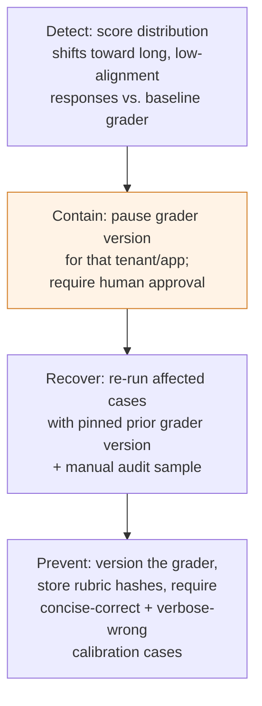

### Failure Drill: Test Set Becomes Stale

- **Detect:** the benchmark stops distinguishing candidate versions, or production incidents cluster in areas the test set never exercises.
- **Contain:** mark the stale suite non-authoritative for release gates; keep it for trend monitoring only.
- **Recover:** refresh the cases with new customer workflows and re-baseline thresholds.
- **Prevent:** schedule periodic suite review and tie each test set to the application version and domain scope it was built for.

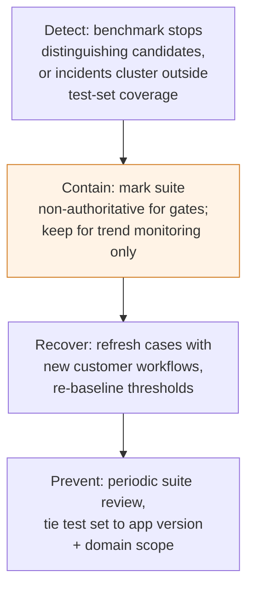

### Failure Drill: Candidate Overfits Benchmark

- **Detect:** large offline gains with flat or worsening real-world behavior, especially when the model learns benchmark-specific phrasing.
- **Contain:** require holdout sets, adversarial variants, and hidden evaluation cases.
- **Recover:** rotate the hidden set and compare against human review samples.
- **Prevent:** never expose the full gate suite to the candidate prompt, retrieval index, or developer-facing logs.

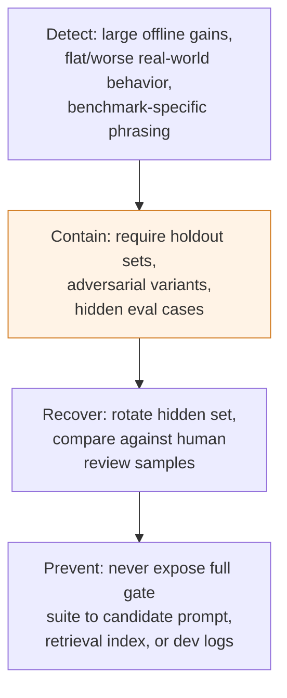

### Failure Drill: Online Sample Contains PII

- **Detect:** boundary scanners or human review flag sensitive text before persistence.
- **Contain:** quarantine the sample, redact or synthesize it, and prevent propagation into prompts or analytics.
- **Recover:** delete or reclassify the raw artifact according to policy; record the action in the audit trail.
- **Prevent:** ingress filtering, tenant-scoped retention, and least-privilege access to raw traces.

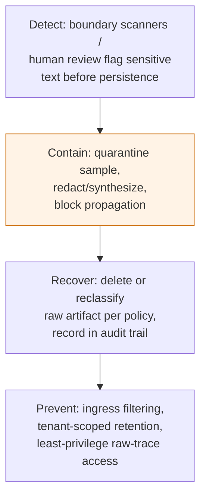

> 🎯 **Interview Pointer:** The PII drill is the one most likely to connect to a compliance follow-up (GDPR/data-handling) — be ready to note that the chapter's governance language stays internal (redaction, retention, access) rather than naming an external regulatory framework.

### Failure Drill: Small Sample Produces False Confidence

- **Detect:** the result set is too narrow to support a release decision, even if all scores look good.
- **Contain:** keep the gate in "insufficient evidence" rather than "approved."
- **Recover:** expand the sample or fall back to a higher-touch review path.
- **Prevent:** define minimum sample sizes per workflow and do not let a tiny run unlock production automatically.

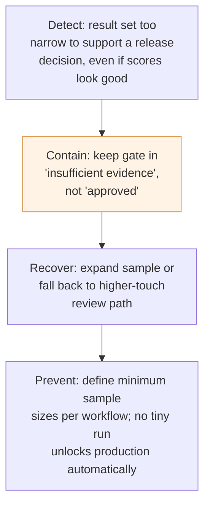

### Evidence and Runbooks Before Launch

- Before the first rollout gate is trusted, the team should be able to show audit evidence for:
  - Who changed the policy.
  - Which grader version was used.
  - Which tenant and application were evaluated.
  - Which cases were redacted or synthesized.
  - Which external dependencies were called.
  - What happened on each retry.
- The runbook should cover: broken grader versions, stalled queues, redaction failures, stale test suites, malicious or poisoned evaluation inputs, and emergency rollback of a bad gate policy.
- For the "grader rewards verbose but wrong answers" drill specifically, preserve: the raw inputs, the grader version, the decision record, and the exact evidence that caused the rollback — so the team learns without re-running the same mistake.

### Critical Invariant Sketch

- The test below captures one release principle: quality gains cannot override a safety regression. Intentionally interview-sized — it omits surrounding persistence, validation, and distributed workflow code (add typed models, request validation, durable storage, structured logging, and dependency-pinned tests in production).

```python
from dataclasses import dataclass


@dataclass(frozen=True)
class Score:
    quality: float
    safety_rate: float


@dataclass(frozen=True)
class Policy:
    min_safety_rate: float


@dataclass(frozen=True)
class Decision:
    allow: bool


baseline = Score(quality=0.90, safety_rate=0.999)


def release_decision(candidate: Score, baseline: Score, policy: Policy) -> Decision:
    # Quality can improve only if safety stays above the release floor.
    allow = candidate.safety_rate >= policy.min_safety_rate and candidate.quality >= baseline.quality
    return Decision(allow=allow)


def scores(quality: float, safety_rate: float) -> Score:
    return Score(quality=quality, safety_rate=safety_rate)


def policy(min_safety_rate: float) -> Policy:
    return Policy(min_safety_rate=min_safety_rate)


def test_quality_win_cannot_hide_safety_regression():
    candidate = scores(quality=0.95, safety_rate=0.97)
    assert not release_decision(candidate, baseline, policy(min_safety_rate=0.995)).allow
```

- The invariant is the lesson: a more persuasive or more accurate release cannot be approved if it falls below the safety floor — the production judgment employers want from an FDE, not merely the happy path.

### Interview-Ready Takeaway

- If asked how the platform behaves under failure, answer in three moves: isolate by tenant and workflow, make every repeated action idempotent, and default unresolved release decisions to human review.
- Core rule: every external dependency and every irreversible action needs an explicit failure and recovery policy.

## 7. Delivery Plan, Observability, and Business Impact

### The Production Question

- Shipping a prototype is not the moment it is safe to ship. The production question is narrower and harder: what has to be true for this platform to become a dependable gate between model changes and real users?
- The answer is not "add more tests" — it is a staged delivery plan with clear owners, measurable exit criteria, and a support model that makes the system visible to the people who will live with its mistakes.

### Phase 1: Prove It on One Critical Application

- Start with the application where a bad release would be most expensive or embarrassing, but still operationally containable.
- Goal is not coverage across all 30 apps on day one — it is demonstrating the platform can catch the failures that matter in one workflow, with a decision that a product owner and an engineer both trust.
- Owner: the application team, paired with one platform engineer.
- Exit criteria: the app can submit evaluation runs, compare candidate behavior to a baseline, and produce a release recommendation that humans can understand.
- Every metric at this stage is a learning signal, not a hard gate — calibrating which checks are trustworthy, where labels are noisy, and which failures actually represent customer pain.

### Phase 2: Calibrate Automated Graders Against Humans

- Compare automated judgments with human review on the same sample set — this is where the platform starts earning trust.
- A grader rewarding verbose but wrong answers may look productive while quietly teaching the system to optimize for style over correctness; false confidence scales faster than human review.
- Use a shared adjudication workflow: human reviewers label a sample, the automated grader scores the same cases, disagreements are bucketed by failure mode.
  - Some disagreements reveal rubric gaps.
  - Others expose ambiguity in the prompt or task itself.
- Exit criterion is not perfect agreement — it is stable, explainable agreement on the cases that drive release decisions.
- Owner: evaluation lead or applied scientist.
- Go/no-go gate: human-grader agreement is good enough for the specific class of decisions this app needs, and the disagreement set is understood rather than ignored.

### Phase 3: Add Latency and Cost Gates

- Once correctness and safety checks are credible, add operational constraints — a release that improves quality but doubles response time or run cost may still be a bad customer outcome.
- Shift from "does it work?" to "can we afford to run it at scale and keep users engaged?"
- Latency gate covers both evaluation run duration and user-facing inference constraints.
- Cost gate tracks model calls, retrieval, tool execution, and human review expense.
- These are the bridge between technical change and business leverage — a prompt version that slightly improves quality but slows evaluations and raises inference cost should surface that trade-off immediately.
- Owner: platform engineering with product and finance input.
- Go/no-go gate: the candidate stays within agreed performance and cost envelopes, or the exception is explicitly approved with a customer rationale.

### Phase 4: Expand With a Shared Schema and App-Specific Rubrics

- Only after the first application is stable should the platform be generalized.
- The shared schema should become core product: run metadata, model version, prompt version, dataset version, rubric version, outcome labels, trace references, and release decision — consistent across teams so results can be compared and audited.
- App-specific rubrics should usually remain configuration — a support bot, a coding assistant, and a summarization workflow do not need identical grading criteria.
- The platform lets teams attach their own evaluation dimensions without forking the core service:
  - Adapters handle per-app input formats, tool traces, or provider-specific metadata.
  - Shared service owns storage, run orchestration, scoring, alerting, and audit trails.
  - Configuration owns thresholds, rubric text, and which gates apply to which application.
- This separation turns the project into reusable product leverage instead of one-off consulting.

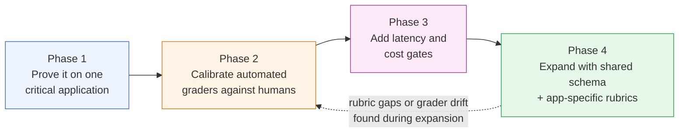

### The Scorecard That Actually Matters

- A good evaluation platform needs a scorecard showing both technical health and business impact — keep categories separate so the team does not confuse a healthy pipeline with a healthy product.
- Thresholds below are illustrative until tuned to the customer's traffic, risk tolerance, and release cadence:

| Metric | Calculation | Source | Owner | Illustrative alert threshold |
|---|---|---|---|---|
| Evaluation coverage | executed evaluation cases / planned evaluation cases for a release | evaluation runner logs, dataset manifest, run metadata | platform ops | alert if coverage falls below 95% for critical apps, or below the minimum sample size agreed for the rubric |
| Release regression escape rate | harmful changes that pass the gate and later reach production / total harmful changes discovered | release outcomes, incident tickets, post-release review labels | release manager with incident review board | alert if the rolling 30-day rate exceeds 5%, if the same regression class escapes twice in one month, or if any severe escape appears in a critical app |
| Human-grader agreement | exact or rubric-weighted match rate between automated grader and sampled human labels | adjudication workflow, human review labels, grader output | evaluation lead | alert if agreement falls below 85% for a stable rubric, or below the app-specific floor agreed during calibration |
| Run duration | end time of final scoring event minus submission time of candidate | orchestration timestamps, pipeline telemetry, queue events | platform engineering | alert if p95 exceeds 20 minutes for the release window, or if median duration grows by more than 20% week over week |
| Cost per run | compute + storage + tool calls + human review spend per evaluation run | cloud billing, model usage logs, review time tracking | platform owner with finance visibility | alert if cost per run rises above $25 for the critical app, or if the monthly trend would break the approved release budget |
| Flaky case rate | cases whose pass/fail or score changes across repeated runs without a material input change / repeated cases | repeated evaluation runs, deterministic replay jobs, versioned inputs | QA or evaluation infra | alert if flaky rate exceeds 2% overall, or exceeds 5% in any rubric dimension that affects release decisions |
| Production failure capture rate | production regressions detected by evaluation before release or immediately after deploy / total known production regressions | incident reviews, canary reports, gate decisions | incident review board | alert if capture rate falls below 80% over a release quarter, or drops by more than 10 points from the prior quarter |

> 🎯 **Interview Pointer:** Know at least three of these seven metrics cold, including the calculation and a threshold — "evaluation coverage," "release regression escape rate," and "human-grader agreement" are the ones most likely to get a direct follow-up.

### Scorecard Categories

- **Technical health:** run duration, flaky case rate, service uptime, queue backlog, failed job retries.
- **Model quality:** evaluation coverage, human-grader agreement, rubric pass rate, per-dimension quality deltas.
- **Adoption:** number of applications onboarded, percentage of releases using the gate, reviewer turnaround time, share of releases resolved without manual escalation.
- **Business outcome:** release regression escape rate, production failure capture rate, cost per run, and the percentage of high-risk changes blocked before reaching users.

### A Concrete Launch Review Example

- Evaluation coverage: 97% of planned cases executed for the critical app; investigate any missing high-risk cases before the next release.
- Release regression escape rate: 1 severe regression escaped in the last 20 releases; pause expansion if that repeats in the same failure class.
- Human-grader agreement: 89% exact or rubric-weighted agreement on sampled cases; acceptable for launch only if the disagreement set is explainable.
- Run duration: p95 evaluation time of 14 minutes, below the 20-minute release window.
- Cost per run: $18 per release evaluation, within the approved operating budget.
- Flaky case rate: 1.5% across repeated runs, concentrated in one ambiguous rubric dimension; revise the rubric before broad rollout.
- Production failure capture rate: 4 of 5 known regression classes caught before release, 1 caught by canary; require a postmortem on the missed class before generalizing.
- These metrics should sit on dashboards linking a user outcome to component telemetry — e.g. "customers saw fewer bad answer escalations" links to rubric failures, tool-call errors, retrieval misses, and release decisions. That trace from outcome to component makes the platform defensible in front of product leaders.

### Operating Model: Who Owns What After Launch

- Named owners, not a generic "platform team":
  - Release gate owner decides whether a change can ship.
  - Application owner explains whether the gate reflects the app's real risk.
  - On-call engineer handles pipeline failures.
  - Evaluation lead maintains rubrics and samples.
  - Support owner writes the runbook and responds when a team asks why a release failed.
- Go/no-go gates should be explicit: coverage met, agreement within tolerance, latency and cost within bounds, no unresolved data or authorization issue.
- Rollback triggers should be equally explicit: a bad canary signal, a spike in flaky cases, a post-release incident tied to an unchecked class of failures, or a failed dependency that prevents trustworthy scoring.
- Handoff responsibilities matter: the moment the platform crosses from pilot to production, ambiguity becomes downtime.

### Rollout and Support Artifacts

- Canary: gate only a small fraction of releases or one low-risk branch of the critical app.
- Migration: make the legacy evaluation path read-only before turning it off.
- Training: teach app teams how to read a failed run, update a rubric, and request a new sample set.
- Documentation: ship a short operator guide, a decision glossary, and a "what to do when the gate blocks a release" playbook.
- Risk register should be short and operational (owner, mitigation, trigger):
  - "Grader disagreement spikes on verbose outputs" — owned by evaluation lead, mitigated by rubric refinement, triggered when human-grader agreement drops below the agreed floor.
  - "Queue backlog delays releases" — owned by platform engineering, mitigated by capacity scaling and priority lanes, triggered when run duration exceeds the release window.

### The Interview Answer That Lands

- Not "we built a platform." Instead: "We delivered one critical app first, validated automated graders against humans, added latency and cost controls once trust existed, then expanded through a shared schema and app-specific rubrics so other teams could adopt it without redoing the core system."
- The FDE role is obvious here: not just designing the mechanism, but converting a prototype into a product-shaped operating model teams will actually use — accountable for delivery, adoption, support, and the feedback loop turning one app's learning into reusable leverage for the next.
- Measurable customer impact statement: the platform makes quality, safety, latency, and cost regressions visible before and after deployment, so the organization can release faster without guessing whether a model change is actually safe.

## 8. Interview Walkthrough, Trade-Offs, and Practice

### Minute-Zero Framing

- Open with the business result: "The customer wants one platform for 30 AI applications that can tell them whether a prompt, model, retrieval, or tool change is safe to release. The platform has to make quality, safety, latency, and cost regressions visible before deployment, and it has to do that in a way teams will actually trust enough to use."
- Immediately name the hidden constraint: "The tricky part is that the apps are not homogeneous. Some are high-volume support assistants, some are low-volume workflows, and some have narrow safety requirements. So I would not force one universal metric. I would build a shared evaluation spine and allow app-specific rubrics and gates on top."
- This opening aligns with customer value and shows assumption management — you tell the interviewer what you believe while inviting correction before the system locks into a bad shape.

### A 50-Minute Answer Plan

- Use time in proportion to risk, not diagram size:
  - **0–5 min — discovery and assumptions.** Clarify users, what counts as a release, top failure modes, who owns approval. State assumptions aloud: "I'm assuming 30 apps, shared infra, and both pre-release and post-release measurement." Ask whether to optimize for strict safety, fast iteration, or broad internal reuse.
  - **5–10 min — scope and success criteria.** Define the outcome operationally: catch regressions before launch, make live degradation visible after launch, preserve a common reporting layer across teams. Distinguish platform-wide vs. app-level metrics.
  - **10–18 min — architecture.** Walk the control flow: evaluation request → dataset/golden-set selection → rubric execution → model grading or human review → thresholding or statistical comparison → release decision → feedback ingestion post-deployment. Keep it aligned to the key trust boundary: anything affecting release approval must be auditable.
  - **18–28 min — evaluation design (the depth budget).** Spend the most time here: generic metrics vs. task-specific rubrics, model graders vs. human review, large suites vs. iteration speed. The interviewer probes whether you understand a platform can become useless if too slow or too blunt.
  - **28–35 min — security, reliability, and failure modes.** Cover access control, data isolation, prompt/output retention, secret handling, safe handling of tool traces or customer content; then queue backlogs, nondeterministic outputs, flaky graders, and overfitting the golden set.
  - **35–42 min — rollout and adoption.** Start with one critical app, validate automated graders against humans, add latency/cost controls after trust is established, then expand through a shared schema. Show product leverage and organizational change awareness.
  - **42–47 min — follow-ups and defensive depth.** Answer likely follow-ups directly: grader validation, golden-set design, nondeterministic comparisons, online-to-offline feedback.
  - **47–50 min — concise executive summary.** Restate the customer outcome, the riskiest trade-off, and the first production gate.

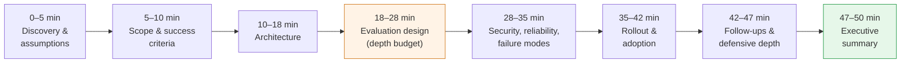

> 🎯 **Interview Pointer:** The 18–28 minute evaluation-design block is explicitly called the "depth budget" — allocate the most time there, since that's where interviewers probe trade-off understanding hardest.

### Trade-Off: Generic Metrics vs. Task-Specific Rubrics

- Generic metrics: easier to standardize across 30 applications, simpler dashboards, easier comparison, faster adoption — but they often flatten the behavior you care about. A support bot, a retrieval assistant, and a tool-using workflow can all be "good" for different reasons.
- Task-specific rubrics: harder to design/maintain, but capture what matters — groundedness for retrieval-heavy apps, tool correctness for action-taking flows, policy adherence for safety-sensitive interactions, user satisfaction proxies where direct correctness is not enough.
- Strongest answer: "Use generic metrics for platform-level trend visibility, but require task-specific rubrics for release decisions." Keeps the platform reusable without making it shallow.

### Trade-Off: Model Graders vs. Human Review

- Model graders scale well — cheap, fast, consistent enough to run on every change — but can be wrong systematically: preferring verbose answers, rewarding style over substance, missing domain-specific failures.
- Human review is slower and more expensive but is the best calibration source — especially valuable for the golden set, rubric design, and periodic audits of grader drift.
- Weak answer: "We should automate everything." Better answer: "I would use model graders for breadth and human review for calibration, dispute resolution, and periodic quality checks."

### Trade-Off: Large Suites vs. Iteration Speed

- A large suite gives better coverage and makes regressions harder to hide, but if it takes too long to run, teams stop using it before release and treat it as a bureaucratic obstacle — a safety tool becomes a shadow process.
- Iteration speed matters because FDE customers change prompts, retrieval, models, and tools rapidly.
- Solution: tiered evaluation — a fast smoke suite for every commit/candidate, a broader regression suite for pre-release, deeper audits for high-risk changes. The release gate should depend on the risk profile of the change, not one universal batch size.

### Trade-Off: Fixed Thresholds vs. Statistical Tests

- Fixed thresholds are easy to explain ("Pass if accuracy is above X"), simple to automate, simple to defend — but LLM outputs are often noisy, especially when prompt, context, or sampling changes; a single run may not reflect true quality.
- Statistical tests are more robust for nondeterministic outputs or small score deltas, avoiding overreaction to noise — but are harder to explain, require careful sample sizing, and can feel abstract to product teams.
- Strong answer: "Use fixed thresholds for critical safety invariants and statistical comparison for noisy quality metrics." A practical release philosophy.

> 🎯 **Interview Pointer:** All four trade-off pairs share the same rhetorical shape — "use X for breadth/standardization, Y for the decision that actually matters" — reuse that pattern live if you blank on a specific answer.

### Follow-Up: How Do You Validate a Model Grader?

- Start with the premise that a grader is itself a product and needs evaluation.
- Validate against human judgments on a representative sample, not just easy cases. Measure agreement on the cases that matter most to release decisions, then inspect disagreement patterns.
- If the grader systematically rewards verbosity, misses unsafe hedging, or fails on domain-specific terminology, tighten the rubric or split it into narrower criteria.
- Mention calibration over time: "I would periodically re-score a held-out set with humans to detect grader drift, especially after rubric changes or model upgrades." Shows the grader can degrade even if the platform itself is stable.

### Follow-Up: What Belongs in the Golden Set?

- Small enough to maintain carefully, broad enough to reflect real release risks.
- Include: representative happy paths, known hard cases, policy-sensitive cases, examples that previously caused incidents or near misses.
- Include edge cases where the old system failed quietly: malformed tool inputs, ambiguous queries, retrieval misses, cases where a verbose answer looked strong but was factually wrong.
- Do not fill it with only obvious examples — a weak golden set creates false confidence. "I would include cases that exercise the real decision boundary, not just the easy majority class."

### Follow-Up: How Do You Compare Nondeterministic Outputs?

- Compare distributions, not only single outputs. Run repeated trials when needed, seed what you can, and compare aggregated rubric scores or pass rates across candidate systems.
- For some dimensions, the right unit is not exact text match but outcome equivalence: did the answer satisfy the task, respect policy, and avoid harmful behavior?
- If pushed, add stratification by scenario type — a change may improve average performance while hurting rare but high-risk cases, exactly why the platform needs app-specific gates.

### Follow-Up: How Does Online Feedback Enter Offline Evaluation?

- Online feedback should not be copied blindly into offline scorecards — it needs cleaning, labeling, and routing.
- Use live signals such as thumbs-up, abandonment, escalation, correction, and repeated retries as candidates for new evaluation samples.
- Sample and label those events into the golden set or a shadow evaluation set after removing privacy-sensitive content and confirming labels are trustworthy.
- Right framing: "Online feedback is a discovery channel for new failure modes; offline evaluation is where I make those failure modes measurable and releasable."

### Defending the Riskiest Assumption

- A good interviewer will press: "How do you know the grader is reliable enough to gate releases?"
- Do not get defensive — treat this as the right challenge.
- Strong response: separate the gate into levels.
  - Early on, the grader is advisory — it can block only low-risk deploys or require human approval on uncertain cases.
  - As calibration improves, the system can move to stronger automatic gating for high-confidence checks.
  - You are not pretending the grader is perfect — you are designing a path to trust.
- This shows operational maturity — the fastest way to lose adoption is to overpromise and then let one false block or one false pass destroy confidence.

### Weak-Answer Traps and Repairs

- Weak answers usually fall into one of five traps:
  1. **Too generic:** "We'll track accuracy and latency." Repair: name task-specific rubrics and release-specific decisions.
  2. **Too automated:** "The model grader decides everything." Repair: add human calibration and periodic audits.
  3. **Too big too soon:** "We'll run the full suite on every commit." Repair: tiered evaluation and risk-based gating.
  4. **Too binary:** "Pass or fail." Repair: thresholds, confidence bands, graded escalation paths.
  5. **Too narrow:** "We only care about pre-release quality." Repair: include online feedback and post-release drift detection.
- If you can identify the weakness yourself, the interviewer is more likely to believe you can operate the system in production.

### Self-Scoring Rubric

- Use this rubric to self-check your answer or evaluate a mock candidate:

| Area | Strong signal | Weak signal |
|---|---|---|
| Discovery | Clarifies users, risk, release flow, and constraints before proposing architecture | Jumps straight to tools and components |
| Estimation | Uses scale assumptions to shape design and labels them clearly | Throws out numbers without explaining why they matter |
| Architecture | Separates shared platform concerns from app-specific logic | Forces one metric or one gate on all apps |
| Depth | Spends time on the riskiest parts: graders, golden set, nondeterminism | Spends equal time on everything |
| Security | Mentions access control, isolation, secrets, and auditability in practical terms | Treats security as a box to check |
| Delivery | Describes phased rollout, calibration, and adoption | Assumes teams will adopt the platform automatically |
| Communication | Gives a concise executive summary and invites redirection | Talks in a monologue without checkpoints |

### 90-Second Closing Summary

- "I would build a shared evaluation platform that ingests candidate changes, runs a tiered suite of task-specific and generic checks, and produces release recommendations with audit trails. The platform would separate shared infrastructure from app-specific rubrics so teams can compare prompt, model, retrieval, and tool changes without rebuilding evaluation logic. I would use model graders for scale, human review for calibration, and a small golden set of representative and high-risk cases to keep the system aligned with real failures. For nondeterministic outputs, I would compare repeated runs and use statistical tests where the signal is noisy. Online feedback would feed a labeling pipeline that discovers new failure modes and updates the offline suite after review. The riskiest trade-off is false confidence from a grader that looks consistent but is systematically wrong, so I would start with human-calibrated advisory gates and gradually tighten automation as agreement improves. The first production gate would be one critical app, because that proves value, creates trust, and gives the platform a reusable pattern for the next teams."
- Strong because it is structured, quantitative in spirit, safe, customer-aware, and explicit about trade-offs.

### Practice Drills

- **Solo exercise:** Write your own 50-minute outline for this question, then compress it into a 90-second closing. If your closing cannot stand alone, your interview answer is still too dependent on the whiteboard.
- **Pair mock:** Have a partner interrupt every five minutes: "Why not one universal rubric?", "Why not fully automate grading?", "What do you do when the golden set is too small?", "How do you know the gate isn't blocking good releases?" Practice answering without losing the thread.
- **Implementation exercise:** Take one representative app and design a tiny release-gating flow: a request format, a rubric, a golden-set sample, a grader output schema, and a pass/fail decision rule. The goal is not code volume — prove you can turn an interview talk into an operational shape.

### Why This Matters for the Job Market

- This conversation separates a generic systems candidate from an FDE candidate — proving you can design a service, translate customer pain into a deployable control loop, defend trade-offs with product and engineering stakeholders, and generalize one team's learning into a platform others can use.
- Job-market signal: practical architecture, measurable safety, and adoption-aware delivery.
- Final takeaway: a strong answer is a disciplined story about how you help 30 AI applications release faster without flying blind — start with the outcome, state assumptions, choose task-specific evaluation where it matters, validate graders against humans, treat nondeterminism honestly, and roll out in phases that build trust.

## Coverage Notes

### Phase 1 — Problem Framing & Discovery

- **Item 1 (feature → business-outcome reframing):** Fully covered — Section 1's weak-vs-strong restatement.
- **Item 2 (stakeholder/persona mapping):** Fully covered — Section 1's four-group stakeholder map.
- **Item 3 (clarifying questions that change the architecture):** Fully covered — Section 2's six-question tree.
- **Item 4 (requirements split + prioritization):** Fully covered — Section 2's must-have functional/nonfunctional split.
- **Item 5 (explicit non-goals/scope fence):** Fully covered — Section 2's MVP exclusion list.

### Phase 2 — Estimation & Architecture

- **Item 6 (back-of-envelope scale & capacity math):** Fully covered — Section 3's anchoring chain and worker math.
- **Item 7 (unit economics/cost-driver breakdown):** Partial — cost per run and cost gates appear as SLO/scorecard inputs, no full cost-per-unit decomposition model.
- **Item 8 (end-to-end architecture & data flow):** Fully covered — Section 4's control/data plane and flow.
- **Item 9 (data model & API contracts):** Fully covered — Section 5's records and endpoint semantics.
- **Item 10 (build-vs-buy/model-selection trade-offs):** Fully covered — Section 8's generic-vs-task-specific and grader-vs-human trade-offs.

### Phase 3 — Trade-offs, Security & Reliability

- **Item 11 (named trade-off pairs with balanced verdict):** Fully covered — Section 8's four trade-off pairs.
- **Item 12 (threat model/security controls):** Fully covered — Section 6's four threat-modeled controls.
- **Item 13 (failure-mode & reliability drills):** Fully covered — Section 6's four named failures plus failure-policy table.
- **Item 14 (testing strategy):** Fully covered — Section 5's contract and failure-injection tests.

### Phase 4 — Delivery, Governance & Communication

- **Item 15 (layered evaluation metrics & observability):** Fully covered — Section 7's seven-metric scorecard.
- **Item 16 (phased rollout, risk register, rollback gates):** Fully covered — Section 7's four-phase plan.
- **Item 17 (regulatory/governance depth):** Absent — only internal governance language (release policy, audit trail, sign-off); no named external framework (SOC 2, GDPR, etc.).
- **Item 18 (responsible-AI risk framing beyond the obvious failure mode):** Absent — risk framing stays scoped to release-quality failures; no fairness/bias or societal-impact treatment.
- **Item 19 (change-management/adoption narrative):** Fully covered — Section 7's operating model and rollout artifacts.
- **Item 20 (structured communication plan + self-scoring rubric):** Fully covered — Section 8's pacing plan and rubric.

### My Perspective on the Gaps

*The following is supplementary perspective, not sourced from the original chapter — my own view on how I would address these gaps live in an interview for this chapter's scenario.*

**Item 7 — Unit economics/cost-driver breakdown.**
- I would take the chapter's existing cost-per-run scorecard line (Section 7, "$18 per release evaluation") and decompose it into its actual drivers: model/grader calls (the dominant term, since Section 3 estimates 2–5 calls per test case), sandboxed-runner compute for tool/retrieval replay, human-review time for escalated cases, and storage for trace retention.
- Given the anchoring math in Section 3 (3,000,000 test-case executions/day at current scale), even a small per-call cost compounds fast, so I'd propose tracking cost per tier separately: smoke-gate cost (cheap, runs on every change), deep-suite cost (moderate, model/retrieval changes only), and full-suite cost (expensive, high-impact apps only) — mirroring the tiered evaluation strategy the chapter already proposes for latency reasons.
- The lever I'd emphasize in the room: human review is almost certainly the most expensive per-unit cost driver, so the unit-economics conversation is really a proxy for "how good is the grader," which ties directly back to Section 6/8's grader-calibration story — better grader agreement directly lowers cost per run by shrinking the human-review tail.

**Item 17 — Regulatory/governance depth.**
- The chapter's Artifact Registry, Dataset Store, and Results Warehouse (Section 4/5) already give the platform the pieces a compliance framework needs — immutable versioning, lineage, and an audit trail — so I would frame governance as "the plumbing already exists, we just need to map it to a named framework" rather than a redesign.
- For a platform touching 30 AI applications' traces, I'd expect at least SOC 2-style controls (access logging, change management, incident response) to be a near-term ask, and if any application handles regulated content, GDPR/CCPA-style data-subject rights (deletion, export) would need to reconcile with the chapter's retention policy for `EvalResult` and raw traces (Section 5, Section 6's redaction controls).
- I would raise this proactively in the security section (Section 6) rather than wait for the interviewer to ask, since the tenant-isolation and redaction controls already described are 80% of the compliance story — the missing 20% is an explicit control mapping and a named external framework.

**Item 18 — Responsible-AI risk framing beyond the obvious failure mode.**
- The chapter's risk framing is entirely about release-quality failures (verbose-but-wrong grading, stale test sets, overfitting, PII leakage in Section 6) — all real, but none of them ask whether the candidate change shifts behavior unevenly across user segments.
- I would extend the golden-set discussion in Section 8 to explicitly require demographic or use-case stratification alongside the existing "happy path / hard case / policy-sensitive case" categories, so a release that improves aggregate quality but degrades performance for a specific user population would surface as a per-segment Δ, not just a fleet-wide average.
- Concretely, I'd add a fairness/bias check as a fifth policy dimension alongside the existing quality/safety/latency/cost checks in the `release_decision` function (Section 5) — same shape, same fail-closed philosophy, just a different metric — since the chapter's own architecture (multidimensional gate, Section 5) already supports adding dimensions without redesigning the decision logic.
