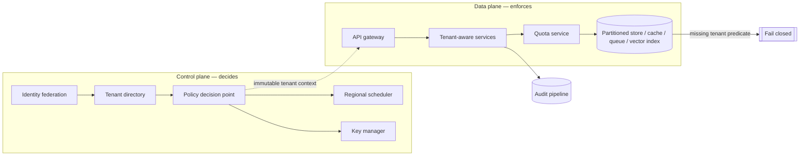

# Secure Multi-Tenant AI Platform - Answer Key

This answer key is designed for interview preparation. It shows what a strong GenAI FDE candidate should ask, design, evaluate, secure, and communicate before moving from demo to production.

## Strong discovery questions
- Which tenant data classes are in scope, and which are explicitly out of scope for the first release?
- Are regional controls hard requirements, soft preferences, or customer-specific exceptions? That answer reshapes routing, storage, backup, and logging.
- What does "predictable performance" mean here: throughput, latency, queue time, or fairness across tenants?
- Which tenants can share infrastructure, and which require a dedicated tier? This decides one topology or a hybrid.
- What evidence do auditors need: logs, policy snapshots, access reviews, or data lineage?
- Which failure is most expensive: data leakage, unavailability, slow inference, or misrouted regional traffic?
- Do customers bring their own identity provider and their own keys, and is deletion hard or best-effort?
- What is the workload shape — steady, bursty, skewed, or mixed — and what noisy-neighbor tolerance is acceptable?

## Strong functional requirements
- Support the core workflow: a tenant user authenticates through their own IdP, the platform derives immutable tenant context, authorizes, and serves inference scoped to that tenant alone.
- Provide a tenant-aware control plane to onboard tenants, assign policies, provision configuration, manage keys, and record admin actions.
- Carry tenant identity and policy context through the entire data-plane call chain, never re-deriving tenancy from ad hoc metadata.
- Enforce per-tenant policy, quotas, keys, and configuration without bespoke code paths per customer.
- Route requests and artifacts to the allowed region and retain or delete per that tenant's policy.
- Offer a dedicated deployment tier as an explicit escape hatch for exceptional customers, not as the default.

## Strong non-functional requirements
- Latency: per-tenant p95 measured and alerted separately; a 2-second budget forces fewer hops, a 15-second budget permits durable queues.
- Availability: size for load shape, not average — 200 QPS peak with 20x skew makes any uniform-tenant assumption unsafe.
- Security: zero cross-tenant reads or writes; tenant context derives from verified identity, never the request body.
- Compliance: append-only audit of tenant, actor, action, resource, and decision, retained per tenant policy.
- Reliability: bounded contention and tenant-scoped blast radius, so a bad policy or deploy touches the minimum tenant set.
- Cost: `C_tenant = C_fixed/N + C_usage + C_isolation`; pay the isolation premium only where a requirement demands it.

## Architecture explanation
- Tenant identity is established once, becomes immutable, and drives every downstream decision; nothing later re-decides tenancy.
- The control plane decides who may do what, where, and under which limits: identity federation, tenant directory, policy decision point, regional scheduler, quota configuration, key selection.
- The data plane does the work: API gateway, tenant-aware services, partitioned databases and indexes, caches, queues, and inference workers.
- Dependency order is strict — federate identity, resolve tenant membership and posture, evaluate policy, then admit at the gateway before any expensive work begins.
- Tenant-aware services execute only on immutable context; partitioned stores carry the tenant key in both physical layout and query predicates.
- The quota service applies concurrency, token, and burst limits before inference; the key manager selects tenant encryption context; the regional scheduler places work in an allowed region.
- Seven isolation layers must agree independently — row, object, cache, queue, log, vector index, and key — so one missed check is not a full breach.
- The audit pipeline records tenant-scoped events after the action but close to it. Caches never act as the source of truth for membership or authorization.

## Data model / integration assumptions
- Tenant(id, region, tier, key_ref, retention_policy); Membership(user_id, tenant_id, role, status); UsageLedger(tenant_id, period, tokens, requests, cost); AuditEvent(tenant_id, actor, action, resource, decision).
- Assume these four records are ownership boundaries, not just tables: data ownership, authority, commercial control, and defensibility respectively.
- Assume retention is part of the data model, attached to the tenant record or a versioned policy it references, so no service rediscovers policy from brittle config.
- Assume every write boundary needs both an idempotency key, which stops duplicate writes from retries, and optimistic concurrency, which stops lost updates from concurrent writers.
- Assume model output never flows raw into the system; it is parsed into a typed schema and policy-checked before persistence, because the typed boundary is the application boundary.

## Red-team risks
- missing tenant predicate, cache key without tenant scope, shared queue leaking payload metadata, noisy-neighbor quota exhaustion, misrouted regional traffic
- Missing tenant predicate in a query, cache lookup, export job, or admin action; the system must fail closed, never read whatever matches.
- Cache bleed where a shared cache replays another tenant's object even though the database stayed protected; treat as a security incident, not a performance bug.
- Shared queue or dead-letter channel exposing metadata that reveals another customer's workload shape even when the payload is encrypted.
- Vector-index leakage where semantic search surfaces neighboring customer content because scoping was applied at query time but not at ingestion.
- Noisy neighbor exhausting model quota, which is a fairness and reliability failure rather than a confidentiality breach, and must degrade only that tenant.

## Rollout plan
- Week 0-1: name stakeholders, the dangerous failure mode, measurable success, and explicit MVP exclusions.
- Week 1-2: onboard internal test tenants; prove identity propagation, row filtering, partitioning, and attributable admin actions.
- Week 2-3: run the adversarial isolation suite — cross-tenant access, stale caches, replayed tokens, missing predicates.
- Week 3-4: hold promotion until that suite passes; one unexplained boundary failure halts external admission.
- Week 5: introduce low-risk shared tenants under conservative quotas, with support on call.
- Week 6-8: validate boundaries hold, latency stays in target, and operators explain incidents without guessing.
- After pilot: offer the dedicated tier on measurable thresholds, not as a special case for whoever asks loudest.

## Evaluation plan
| Metric | What it proves | Strong threshold | Dataset / method |
|---|---|---|---|
| Cross-tenant incident count | The central promise of the platform holds | Zero confirmed; any incident halts promotion | Incident reports and audit-log review |
| Isolation-test pass rate | The boundary fails safely and visibly under attack | Full pass; any new boundary failure blocks release | Adversarial negative-test suite |
| Per-tenant p95 latency | Shared capacity does not mean unpredictable capacity | Within SLO per tenant, not just in aggregate | Request telemetry segmented by tenant |
| Quota rejection rate | Quotas are sized to protect neighbors without false failures | Low and explainable per tenant class | Admission and quota logs |
| Cost per tenant | Pooled economics actually materialize | Within expected band for the tenant class | Billing mapped to tenant usage |
| Regional failover time | Residency and recovery promises survive a real outage | Within the agreed RTO | Game-day and failover drills |

## Weak answer
I would use microservices and Kubernetes, put a tenant_id column on every row, and add row-level security. This is weak because it is solution-first, names no customer outcome, treats one row label as the whole enforcement stack, and ignores caches, queues, vector indexes, backups, regional routing, and what happens when a predicate is simply omitted.

## Average answer
I would build a shared platform with per-tenant authorization, quotas to stop noisy neighbors, and regional routing for residency. I would add audit logging and monitor latency per tenant. This is better, but still incomplete because it does not say where tenant context originates, does not make every isolation layer agree, and never defines when a customer should graduate to dedicated infrastructure.

## Strong answer
I would default to a shared platform, because pooled economics are the point across 500 tenants, and make isolation defensible rather than absolute. Tenant context is derived once from verified identity, never from the request body, and becomes immutable. The control plane decides policy, region, quota, and key; the data plane enforces it at the gateway, the services, and every store. Seven layers enforce independently so one missed check is not a breach, and a missing tenant predicate fails closed. I would prove it with an adversarial isolation suite before any external tenant, then stage through internal tenants, small shared tenants, and a dedicated tier justified by policy and economics. The key is not just multi-tenancy, but proving the boundary and recovering without widening the blast radius.

## Interviewer scorecard
| Area | 1 - Weak | 3 - Average | 5 - Strong |
|---|---|---|---|
| Problem framing | Jumps to Kubernetes and microservices | Names tenants and an isolation goal | Separates feature from business result, names shared-by-default with an exception path |
| Requirements | "Keep tenants separate" | Lists functional needs and some limits | MoSCoW split, measurable safety goals, explicit MVP exclusions, traceability to components |
| Architecture | Row of generic services | Gateway, policy, partitioned storage | Control/data plane split, strict dependency order, immutable context, fail-closed enforcement |
| Data/integration | Mentions a tenants table | Names the core records | Ownership boundaries, retention in the model, idempotency plus optimistic concurrency |
| Evaluation | "We would test isolation" | Some negative tests | Adversarial suite as a gate, per-tenant latency, quota rejections, cost per tenant, failover drills |
| Safety/security | "tenant_id on every query" | Adds RBAC and audit logs | Defense in depth across row, object, cache, queue, log, vector, key; blast radius as design unit |
| Rollout | Launch to all tenants | Pilot then expand | Internal tenants, isolation gate, small shared tenants, dedicated tier with named owners and rollback |
| Communication | Reads the whiteboard aloud | Clear but generic | Leads with outcome, states assumptions, invites redirection, closes with the first production gate |

## Final 2-minute spoken answer
I would not start with the model. I would start by separating the feature they asked for — one AI application for 500 tenants — from the business result, which is a cost-efficient shared platform with defensible isolation plus a dedicated path for the exceptions. Four stakeholders mean four definitions of success, so I would clarify which data classes are in scope, whether regional controls are hard requirements, what predictable performance means, and which failure is most expensive. My default is shared-by-default with tiered isolation. The non-negotiable rule is that tenant context comes from verified identity, never the request body, is established once, and becomes immutable. The control plane federates identity, resolves the tenant directory, evaluates policy, schedules the region, and selects keys; the data plane admits at the gateway, applies quotas before expensive inference, and reads and writes only tenant-scoped resources. Seven isolation layers enforce independently — row, object, cache, queue, log, vector index, and key — so a single missed check is not a breach, and a missing tenant predicate fails closed rather than reading whatever matches. I would size for load shape rather than the average, since 20x skew means a few tenants drive peak. I would gate the rollout on an adversarial isolation suite, then internal tenants, small shared tenants, and finally a dedicated tier justified by measurable thresholds. Success is not elegance; it is adoption, an improved workflow, and an operations team that can support it.
