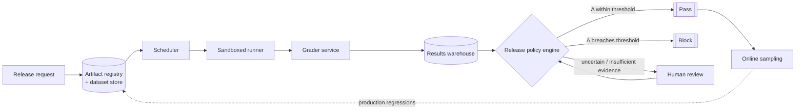

# LLM Evaluation and Release-Gating Platform - Answer Key

This answer key is designed for interview preparation. It shows what a strong GenAI FDE candidate should ask, design, evaluate, secure, and communicate before moving from demo to production.

## Strong discovery questions
- What counts as a release — every prompt edit, only model changes, or only production deployments?
- What evidence is required to pass: human rubric scores, automated checks, safety thresholds, latency budgets, or all of them?
- What is the highest-risk failure: a wrong answer, a policy violation, a silent latency regression, a cost blowout, or tool misuse?
- Who can override a failed gate, and how is that override recorded?
- Is evaluation data shared across the 30 applications, or does each need isolated datasets and policies?
- Which evaluations must run offline before release, and which must run online against shadow or sampled traffic?
- What labels and human reviewers exist, and how is reviewer disagreement captured rather than discarded?
- What regression thresholds are acceptable per application class, since without them the gate cannot be credible?

## Strong functional requirements
- Support the core workflow: a release owner submits a candidate change, the platform compares it to a pinned baseline and returns pass, block, or hold with evidence.
- Version datasets, prompts, models, tools, and graders, because versioning is the only way to reproduce a decision later.
- Run both deterministic and probabilistic evaluations, since some checks must be stable and others depend on rubric judgment.
- Compare every candidate against a pinned production baseline rather than reporting an absolute score.
- Support human review and record reviewer disagreement as a first-class signal feeding the release record.
- Sample privacy-safe production failures back into future test suites so the test set evolves with the product.

## Strong non-functional requirements
- Latency: the gate must finish inside the release window; p95 run duration beyond about 20 minutes turns a gate into a blocker.
- Availability: peak matters more than average, because 30 teams releasing in the same business hour can overwhelm a daily-average design.
- Security: the sandboxed runner is hostile-adjacent, enforcing timeouts, egress limits, secrets scoping, and per-run concurrency caps.
- Compliance: tenant and data isolation so one application's traces, labels, and evaluations never leak into another workspace.
- Reliability: fail closed on release decisions when evidence is missing; never approve on an incomplete or unvalidated run.
- Cost: at roughly 3,000,000 test-case executions a day, tier the suites — if every release costs a fortune, teams route around the gate.

## Architecture explanation
- Separate the control plane, which decides what to evaluate, from the data plane, which executes it, so policy stays deterministic when runners are slow or failing.
- The artifact registry is the system of record for immutable candidate definitions — prompt version, model ID, retrieval settings, tool allowlist, baseline reference — preventing a candidate from drifting mid-run.
- The dataset store owns suites, labels, rubrics, and scenario metadata; together the two stores define what was tested and against which reference.
- The evaluation scheduler fans out work asynchronously, applying per-tenant quotas and admission control so one noisy application cannot starve the rest.
- The sandboxed runner executes prompts, model calls, and tool calls under isolation and is treated as an untrusted execution boundary.
- The grader service scores task success, safety, latency, and cost, escalating to human review when the grader is uncertain or the rubric is ambiguous.
- The results warehouse persists run-level and aggregate outcomes; the release policy engine reads only completed, validated records and decides `Δ = Metric_candidate − Metric_baseline` against thresholds.
- An online sampling pipeline observes live or shadow traffic after rollout, bridging pre-release evaluation to post-release monitoring.

## Data model / integration assumptions
- EvalArtifact(id, type, version, hash); EvalCase(id, input_ref, expected, rubric, sensitivity); EvalRun(id, candidate, baseline, status); EvalResult(run_id, case_id, scores, trace_ref).
- Assume artifacts are never mutated in place; a new version gets a new ID, so an old decision remains reconstructable.
- Assume EvalRun status transitions are monotonic through submitted, queued, running, completed, failed, or blocked.
- Assume EvalResult is written once and immutable afterward, except through an explicit superseding correction with its own version.
- Assume the decision record and redacted score summary outlive the raw trace, so a shorter trace-retention policy never destroys auditability.

## Red-team risks
- grader rewarding verbosity over correctness, stale test sets, benchmark overfitting, PII in online samples, false confidence from tiny runs
- A grader that scores long answers highly, shifting score distributions toward verbose responses with low factual alignment.
- Test sets going stale, so the benchmark stops distinguishing candidates while incidents cluster in areas it never exercised.
- Candidates overfitting the benchmark, showing large offline gains alongside flat or worsening real-world behavior.
- Online samples carrying PII, prompts, retrieved documents, or customer secrets into prompts, analytics, or developer-facing logs.
- Small samples producing false confidence, where every score looks good but the run is too narrow to support a release decision.

## Rollout plan
- Week 0-1: name the gate's scope, the evidence required to pass, override authority, and per-application regression thresholds.
- Week 1-2: prove the platform on one critical application end to end rather than onboarding all thirty.
- Week 2-3: calibrate automated graders against sampled human labels, including concise-correct and verbose-wrong examples.
- Week 3-4: hold the gate advisory until human-grader agreement is stable enough to trust on that application.
- Week 5: add latency and cost gates alongside quality and safety, so no dimension improves while another quietly degrades.
- Week 6-8: expand with a shared schema plus application-specific rubrics, keeping per-tenant isolation and quotas intact.
- After pilot: widen only while coverage, escape rate, and flaky-case rate hold; a suite that stops discriminating is retired from gating.

## Evaluation plan
| Metric | What it proves | Strong threshold | Dataset / method |
|---|---|---|---|
| Release regression escape rate | Harmful changes are actually caught before production | Under 5% rolling 30-day; zero severe in critical apps | Release outcomes against incident tickets |
| Human-grader agreement | The automated grader can be trusted to gate | At or above 85% on a stable rubric | Adjudication against sampled human labels |
| Evaluation coverage | The gate ran on enough of the suite to mean anything | At or above 95% for critical applications | Runner logs against dataset manifest |
| Flaky case rate | Results are reproducible rather than noise | Under 2% overall; under 5% per rubric dimension | Repeated runs with versioned inputs |
| Run duration | The gate fits inside the release window | p95 under 20 minutes in the release window | Orchestration timestamps and queue events |
| Production failure capture rate | The suite reflects real production risk | At or above 80% per release quarter | Incident reviews against gate decisions |

## Weak answer
I would build an evaluation dashboard with test runs, scorecards, and approvals so teams can see their scores. This is weak because it is feature-first — it never pins a baseline, never defines what regression blocks a release, never says who may override, and produces numbers nobody is obliged to act on.

## Average answer
I would run a test suite against each candidate, score quality and safety, compare it to the previous version, and block the release if scores drop. I would store the results. This is better, but still incomplete because it does not version graders and rubrics, does not handle grader drift, and treats a small sample of good scores as sufficient evidence to ship.

## Strong answer
I would frame this as a controlled decision process rather than a dashboard: help teams compare a candidate against a pinned baseline, detect quality, safety, latency, and cost regressions, and record the evidence behind the decision. Control plane decides what to evaluate, data plane executes it in a sandbox treated as untrusted. Everything is versioned — datasets, prompts, models, tools, and graders — because reproducing a decision later is the whole point. The policy engine reads only completed, validated runs and computes the delta against thresholds set per application criticality. Missing evidence fails closed and insufficient sample size holds rather than approves. I would prove it on one critical application, calibrate graders against humans, then add latency and cost gates before expanding.

## Interviewer scorecard
| Area | 1 - Weak | 3 - Average | 5 - Strong |
|---|---|---|---|
| Problem framing | "Build an eval dashboard" | Names engineers and release managers | Controlled decision process; separates the four stakeholders' distinct questions |
| Requirements | "Score the model" | Lists suites and thresholds | Versioning, baseline comparison, human disagreement, production failure sampling |
| Architecture | Queue plus workers plus DB | Scheduler, runner, results store | Control/data plane split, pinned artifacts, sandboxed runner, policy engine reads validated only |
| Data/integration | Mentions test results | Names runs and cases | Immutable artifacts, monotonic run status, write-once results, trace vs. decision retention |
| Evaluation | "Scores went up" | Tracks pass rate | Escape rate, grader agreement, coverage, flakiness, capture rate with thresholds |
| Safety/security | "It is internal" | Adds tenant separation | Hostile-adjacent runner, egress limits, PII ingress filtering, least-privilege trace access |
| Rollout | Onboard all 30 apps | Pilot then expand | One critical app, grader calibration, latency and cost gates, shared schema with per-app rubrics |
| Communication | Reports metrics | Clear but generic | Leads with the decision, names what fails closed, closes with the calibration gate |

## Final 2-minute spoken answer
I would not start with the model. The ask is one platform so 30 applications can decide whether a change is safe to release, but the platform is not the goal — making quality, safety, latency, and cost regressions visible before and after deployment is. So I would restate it as a release-gating system that compares a candidate against the current baseline and records the evidence behind the decision, then separate the four stakeholders, because an engineer asking "did my change worsen behavior," an evaluator asking "what should I score," a safety lead asking "is this safe enough," and a release manager asking "can I approve this with evidence" are different jobs. Architecturally, the control plane decides what to evaluate and the data plane executes it inside a sandbox I treat as hostile-adjacent. An artifact registry pins the candidate so it cannot drift mid-run, a dataset store owns suites and rubrics, a scheduler fans out work with per-tenant quotas, a grader scores across all four dimensions, and a policy engine reads only completed validated runs to compute the delta against thresholds. Missing evidence fails closed, and a sample too small to support a decision holds rather than approves. The named failure is a grader that rewards verbosity over correctness, so graders are versioned, rubric hashes stored, and a calibration suite includes concise-correct and verbose-wrong cases. I would prove it on one critical application, calibrate against human labels, add latency and cost gates, then expand. The gate is only useful if teams trust it enough not to route around it.
