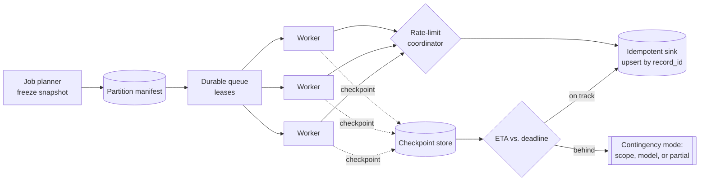

# High-Volume Batch Inference System - Answer Key

This answer key is designed for interview preparation. It shows what a strong GenAI FDE candidate should ask, design, evaluate, secure, and communicate before moving from demo to production.

## Strong discovery questions
- Who consumes the output, and what actually breaks if it is late — is the deadline hard, soft, or tiered by segment?
- Can the batch be partial, or must it be all-or-nothing? That single answer determines retry, checkpointing, and handoff.
- What happens when the job is behind at 4 a.m. — speed up, reduce scope, use a cheaper model, or ship partial results?
- How often does the model change, and who approves it, since that drives version pinning and rollout control?
- What downstream system receives the classifications, and what capacity can it actually absorb?
- Does downstream need original ordering, or only exactly-once logical results?
- Are there native batch APIs and per-tenant rate limits, which turn a worker pool into a submission scheduler?
- Is there a hard cost ceiling, and which degraded mode is preferred when catching up would blow it?

## Strong functional requirements
- Support the core workflow: freeze a nightly input snapshot, partition it, classify every record under quota, and publish usable output before the deadline.
- Partition work into independent, balanced units so the system scales by parallelism rather than by heroics.
- Schedule and autoscale workers, batching model calls where the provider supports it.
- Rate-limit globally and per tenant so retries never stampede the provider into self-inflicted throttling.
- Checkpoint progress and write idempotently, so a replay never produces duplicate logical results.
- Forecast completion continuously and invoke a pre-agreed contingency mode when the deadline is at risk.

## Strong non-functional requirements
- Latency: `RPS = (N_records / T_window) × (1 + h)` — 100M records in a 6-hour window is about 4,630 records/sec, or 5,320 with 15% headroom.
- Availability: size against the tail of large or slow records, not the mean, because the last 5% of a batch is the hardest.
- Security: inputs, prompts, and outputs protected per the customer's access and retention rules across every hop.
- Compliance: an auditable record of which snapshot, model version, and partition produced every classification.
- Reliability: no missing or duplicate logical results, with bounded replay from durable checkpoints after any crash.
- Cost: measure cost per million records and watch retries, which can double token spend, and stragglers, which keep workers warm.

## Architecture explanation
- The job planner accepts the nightly run, freezes the input snapshot, and writes the batch plan; that snapshot is the system of record for what "this batch" means.
- The partition manifest lists balanced work units with status and attempts, which is what makes the run replayable and auditable.
- Partitioning favors even processing cost rather than data locality alone, combining tenant, payload-size band, or historical latency instead of record count.
- A durable work queue hands out partition leases, so the planner never waits on any worker and a failed worker never holds the run hostage.
- The rate-limit coordinator is where backpressure lives: workers request capacity before calling, and tightening quota slows leases rather than triggering a retry storm.
- Autoscaled inference workers batch records, call the model, and validate output at a typed boundary before anything is stored.
- The checkpoint store persists completed ranges so recovery never rescans, and the idempotent result sink upserts by record key so replays cannot duplicate.
- An ETA forecaster and operations console make progress and deadline risk visible long before the final hour, which is what lets an operator decide rather than react.

## Data model / integration assumptions
- BatchJob(id, input_snapshot, deadline, model, state); Partition(job_id, partition_id, range, lease, attempts, checkpoint); InferenceResult(record_id, label, confidence, model_version, run_id).
- Assume `input_snapshot` is an immutable pointer to the exact dataset version, which is the ownership boundary that makes replay possible.
- Assume partitions move through available, leased, and completed, with retryable on transient failure and dead-lettered after too many attempts.
- Assume the sink upserts on the logical record key, so duplicate work becomes harmless rather than something the producer must perfectly avoid.
- Assume transient errors retry with backoff while validation errors surface as data-quality problems rather than being retried indefinitely.

## Red-team risks
- behind schedule at 4 a.m., provider quota cut, hot-partition stragglers, worker crash after the model call, result sink throttling
- Falling behind with no plausible path to the deadline, where shipping late output can be worse for the business than shipping none.
- A provider quota reduction mid-run, where naive retries become a stampede that makes the throttling permanent.
- Hot partitions producing stragglers, so one pathological shard monopolizes the fleet while most workers idle.
- A worker crashing after the model call but before the write, which duplicates cost and results unless the sink is idempotent.
- Corrupted checkpoints, broken snapshot hashes, or an unknown model version, all of which must fail closed rather than proceed.

## Rollout plan
- Week 0-1: agree who consumes the output, whether partial results have value, and the cost ceiling.
- Week 1-2: benchmark the representative token distribution — short records, long records, edge cases, known skew — not a toy sample.
- Week 2-3: run a 1% load test proving parsing, auth, model invocation, sink writes, and checkpointing hold under real concurrency.
- Week 3-4: run a 10% test proving retry behavior, throttling, and downstream capacity still fit the deadline envelope; a failed 1% gate blocks it.
- Week 5: practice failure on purpose — crash a worker, cut quota, kill a downstream dependency, drain and restore a queue.
- Week 6-8: confirm bounded replay, durable checkpoints, and graceful degradation rather than retry-storm oscillation.
- After pilot: define deadline contingency modes with named owners before the job is ever late, not after the first miss.

## Evaluation plan
| Metric | What it proves | Strong threshold | Dataset / method |
|---|---|---|---|
| Completion forecast vs. deadline | The run will actually land before 6 a.m. | Never crosses the deadline without a contingency activated | Progress rate against remaining work |
| Duplicate logical result count | Replay is safe and the sink is truly idempotent | Within the tolerated replay window | Comparison on logical keys, not storage rows |
| Records per second | Sustained throughput meets the required rate | At or above the forecast needed to finish | Worker telemetry and sink acknowledgments |
| Straggler age | No single partition can monopolize the fleet | Oldest active partition within the recovery budget | Partition duration histograms |
| Retry rate | Failures are transient rather than systemic | Within the normal band by failure class | Retry counters and failure taxonomy |
| Cost per million records | Unit economics hold under retries and stragglers | Inside the approved budget envelope | Cloud billing plus model usage logs |

## Weak answer
I would build a batch classifier with an inference service and a scheduler, then run it nightly. This is weak because it names tools instead of value, saying nothing about freezing a snapshot, what happens at 4 a.m., or how a crashed worker replays without duplicating.

## Average answer
I would partition the records, run a pool of workers against the model with retries, checkpoint progress, and write results to a table. I would alert if the job is late. This is better, but still incomplete because it does not make the deadline a design constraint, does not shape outbound calls against quota, and treats "alert when late" as a recovery plan.

## Strong answer
I would restate the goal as a replayable, cost-controlled batch delivered by deadline with clear recovery decisions when behind, because throughput is not the hard part. The planner freezes an immutable snapshot so the run cannot drift, the manifest makes partitions replayable, and leases separate scheduling from execution. Backpressure lives in a rate-limit coordinator that slows leases rather than letting retries stampede the provider. Checkpoints bound recovery and the sink upserts by record key, so duplicate work is harmless. I would size from the tail, not the mean, and surface a completion forecast long before the final hour. The key is that at 45% done at 4 a.m., the contingency mode was already agreed with a named owner.

## Interviewer scorecard
| Area | 1 - Weak | 3 - Average | 5 - Strong |
|---|---|---|---|
| Problem framing | "Run inference on 100M records" | Names the deadline and consumers | Replayable, cost-controlled batch with recovery decisions; four stakeholders separated |
| Requirements | "Finish on time" | Lists partitioning and retries | Partial-result question answered first; functional and quality bars split with cost ceiling |
| Architecture | Queue plus workers | Adds checkpointing and scaling | Snapshot, manifest, leases, rate-limit coordinator, idempotent sink, ETA forecaster |
| Data/integration | Mentions a results table | Names jobs and partitions | Immutable snapshot pointer, lease lifecycle, upsert on logical key, typed output validation |
| Evaluation | "The job finished" | Tracks throughput | Completion forecast, duplicates, straggler age, retry rate, cost per million |
| Safety/security | Not addressed | Mentions access control | Fail closed on snapshot hash, unknown model version, corrupted checkpoint, unauthorized worker |
| Rollout | Run it at full scale | Test then launch | Token-distribution benchmark, 1% and 10% ladder with gates, deliberate failure drills, contingency modes |
| Communication | Quotes throughput | Clear but generic | Leads with the 4 a.m. decision, names owners, closes with the go/no-go gate |

## Final 2-minute spoken answer
I would not start with the model. The prompt sounds like a throughput problem — classify 100 million records every night before 6 a.m. — but the room splits three ways immediately: the business owner wants classifications by morning, the platform lead wants the warehouse intact, and the on-call engineer wants to rerun safely when something fails. That disagreement is the real problem, so I would restate the target as completing a replayable, cost-controlled batch by deadline with clear recovery decisions when behind schedule. The first question I need answered is whether partial results have value, because that one answer determines retry strategy, checkpointing cadence, and how much money to spend on the last ten percent. On sizing, 100 million records across a six-hour window is about 4,630 records per second, and with fifteen percent headroom for retries and stragglers, roughly 5,320 — and I would size from the tail of large records, not the mean. Architecturally, a planner freezes an immutable snapshot, a manifest splits it into partitions balanced for processing cost rather than row count, a durable queue hands out leases, and a rate-limit coordinator holds backpressure so tightening quota slows leases instead of triggering a retry storm. Checkpoints make recovery bounded and the sink upserts on the record key so replay cannot duplicate. The failure I would rehearse out loud is being 45% complete at 4 a.m., and the answer is that the contingency mode — narrow scope, cheaper model, or partial output with explicit status — was agreed with a named owner before launch.
