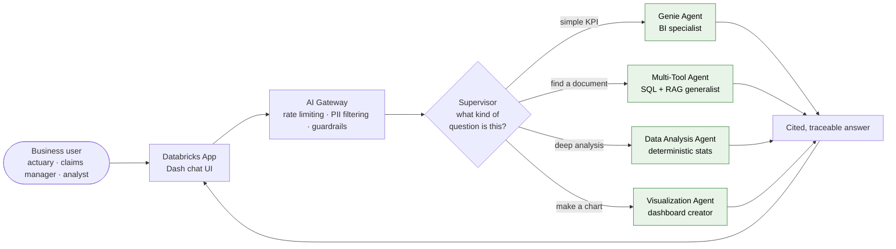
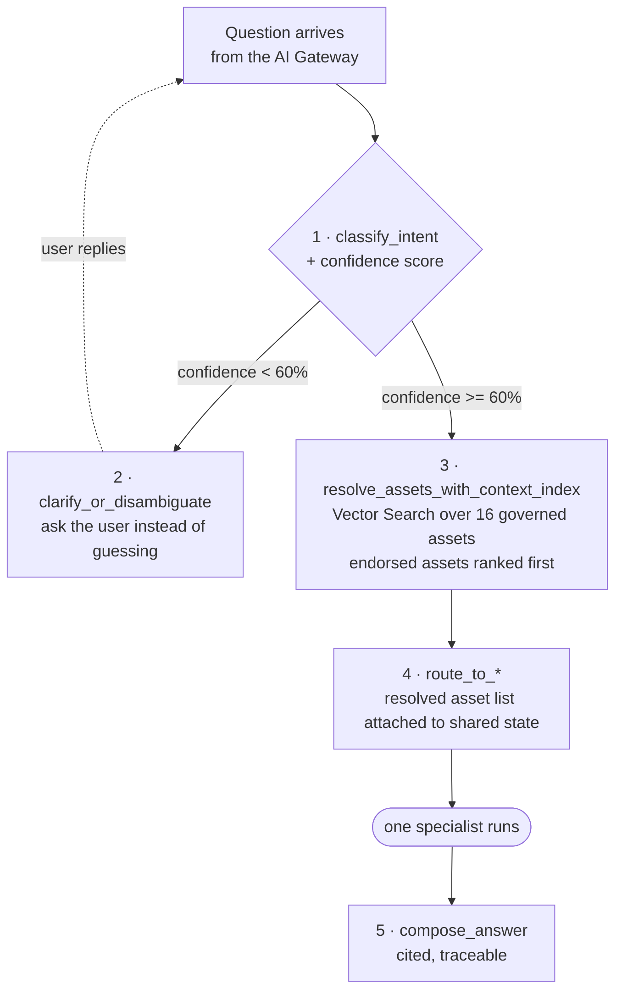
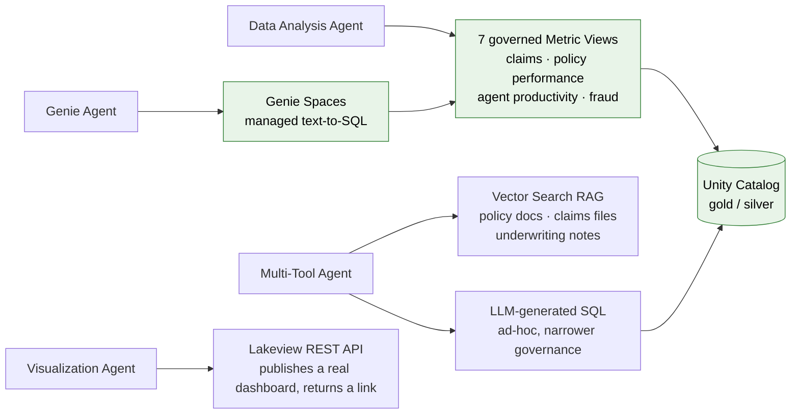
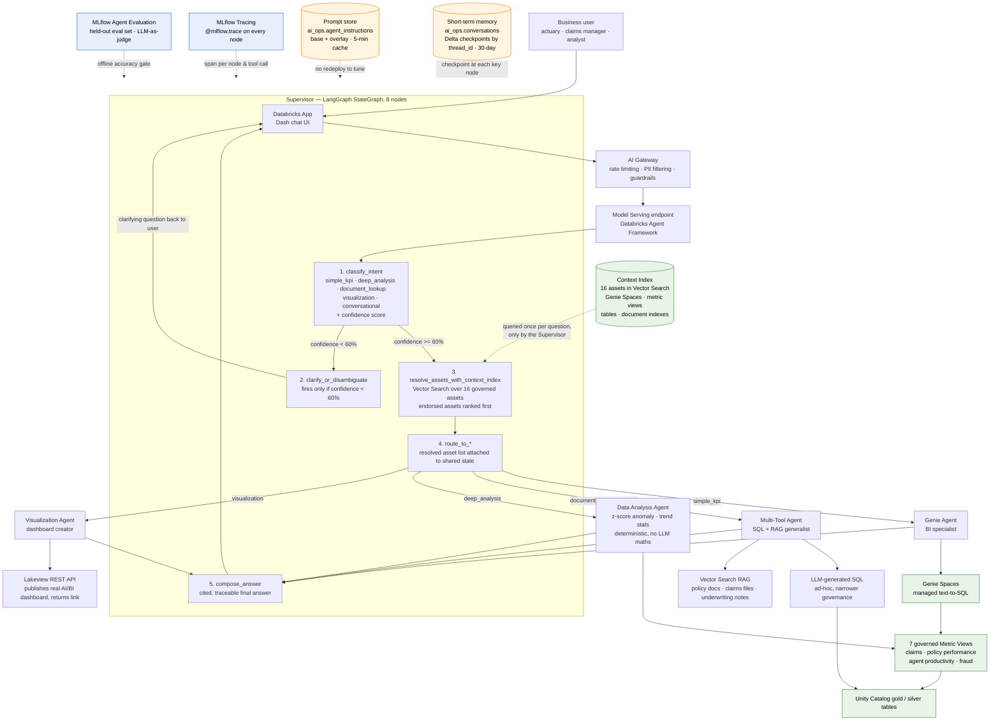
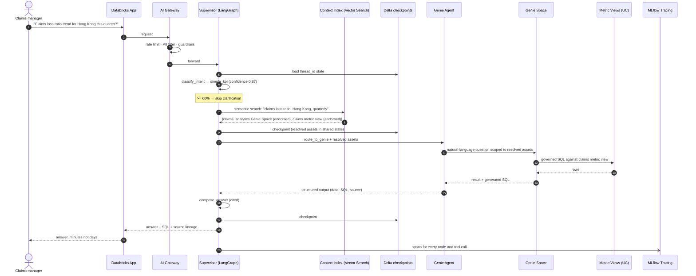
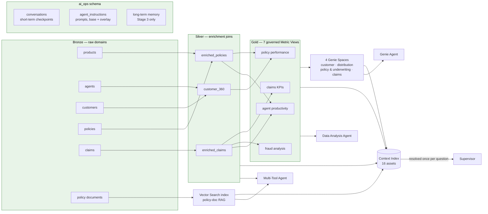
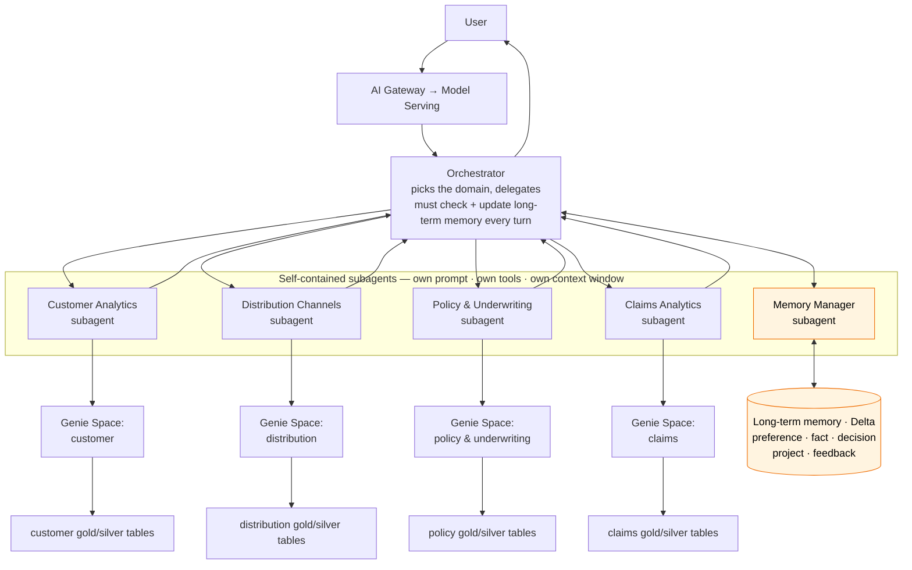
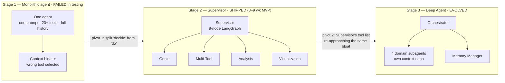
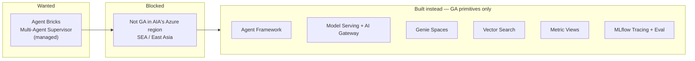

# AIA Group — Multi-Agent Architecture, End-to-End (Mermaid)

### Governed Multi-Agent Data Assistant on Databricks · companion to AIA_Technical_Implementation_Flow.md

> Six views of the same system. Section 1 is split into four small panels — panel **1a** is the one to draw on a whiteboard; the rest are the layers an interviewer will ask you to zoom into.

---

## 1. End-to-end request flow (Stage 2 — the Supervisor pattern that shipped)

> Four small panels instead of one crowded canvas. Draw **1a** on the whiteboard — it is the whole system in ten boxes. The other three are the zoom-ins an interviewer will ask for, in the order they usually ask.

### 1a · The whole system in ten boxes

**Talk track:** a question enters through the App and the AI Gateway, the Supervisor decides *what kind* of question it is, exactly one specialist does the work, and the answer comes back cited. One sentence, and the interviewer has the shape of the system.

### 1b · Inside the Supervisor

**Talk track:** two design decisions live here and both get lost in a bigger picture. First, the system **asks when it is unsure** rather than guessing confidently — that is the 60% gate. Second, asset resolution happens **once, centrally**, so every specialist works from the same governed asset list instead of each rediscovering it.

Intents in full: `simple_kpi` · `deep_analysis` · `document_lookup` · `visualization` · `conversational`.

### 1c · What each specialist actually reads

**Talk track:** green is the governed path — a KPI question lands on a versioned metric view, so the agent and a human analyst computing "claims by region" get the same number. `W2 → SQL` is the one edge that leaves that lane, and naming it before the interviewer finds it is the strong move: ad-hoc SQL is the escape hatch for questions no governed asset covers, and it is deliberately the narrowest-trust path in the system.

> Section 3 below shows how this data gets *built* (bronze → silver → gold). This panel only shows who reads what.

### 1d · The cross-cutting layer

Four things wrap every request. They have no flow of their own, so they read better as a list than as dotted lines crossing the diagram:

| Layer | What it is | Why it is there |
| --- | --- | --- |
| **Context Index** | 16 governed assets in Vector Search — Genie Spaces, metric views, tables, document indexes | Queried **once per question, only by the Supervisor** (node 3 above) |
| **Short-term memory** | `ai_ops.conversations` — Delta checkpoints keyed by `thread_id`, 30-day retention | Checkpoint at each key node; resume a conversation, replay a failure |
| **Prompt store** | `ai_ops.agent_instructions` — base + overlay, 5-minute cache | Tune prompts with no redeploy |
| **MLflow Tracing** | `@mlflow.trace` on every node | One span per node and per tool call |
| **Agent Evaluation** | Held-out eval set, LLM-as-judge | Offline accuracy gate before release |

<strong>The original single-canvas version</strong> — everything above on one diagram, kept for reference

---

## 2. One question, step by step (sequence view)

**Low-confidence branch (not shown above):** "show me the numbers" → `classify_intent` confidence 0.35 → `clarify_or_disambiguate` → *"Which numbers — claims, policies, agents, or customers?"* → user answers → re-enters at `classify_intent`.

---

## 3. The governed data foundation underneath the agents

**Why this matters:** agents never touch raw tables. A KPI question resolves to one of the seven metric views, so an agent and a human analyst computing "claims by region" share one versioned definition — that is what keeps trust in the system intact.

---

## 4. Stage 3 — Deep Agent / "Synaptic Command" (evolved as domains grew)

**What changed vs Stage 2:** asset resolution moved *inside* each domain subagent (each is wired to its own Genie Space and tables), the orchestrator's job narrowed to picking a domain, and cross-conversation memory became a dedicated subagent. Same principle as the first pivot — specialize, keep each unit's context small — applied one level up.

---

## 5. Architecture evolution — why there were two pivots

---

## 6. Platform constraint and guardrails (the cross-cutting layer)

**Trade-off stated plainly:** more code to own than a managed service, in exchange for a production path that did not depend on a regional Beta timeline nobody controlled.

---

## Quick reference — the numbers on the diagrams

| Item | Value |
| --- | --- |
| Supervisor nodes | 8 (LangGraph StateGraph) |
| Clarification threshold | confidence < 60% |
| Context Index | 16 governed assets, Vector Search, endorsed-first ranking |
| Specialist workers (Stage 2) | 4 — Genie · Multi-Tool · Data Analysis · Visualization |
| Domain subagents (Stage 3) | 4 + Memory Manager |
| Governed metric views | 7 |
| Genie Spaces | 4 domains |
| Short-term memory | `ai_ops.conversations`, Delta, keyed by `thread_id`, 30-day retention |
| Prompt store | `ai_ops.agent_instructions`, base + overlay, 5-minute cache |
| Long-term memory categories | preference · fact · decision · project · feedback |
| Outcome | 2–10 days → minutes · ~4 wk dashboards → self-serve · ~35% YTD consumption growth (correlated, not causal) · MVP in 8–9 weeks |

---

*Companion to *`AIA_Technical_Implementation_Flow.md`* and *`AIA_MultiAgent_DeepDive_15-20min.md`* · MongoDB Staff FDE prep*
