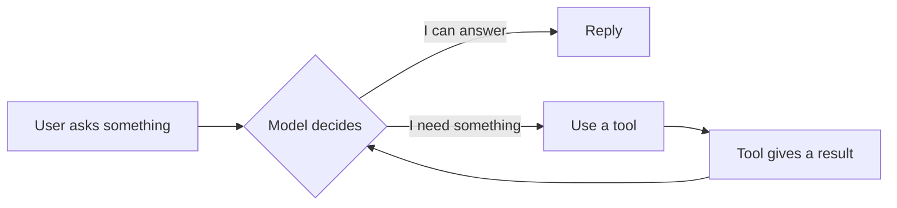
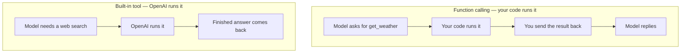
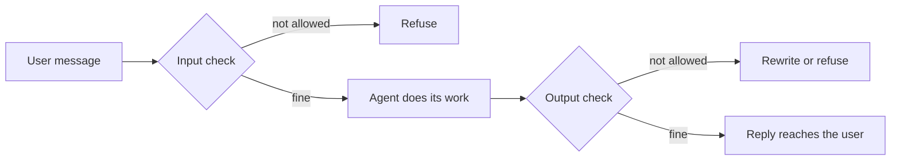
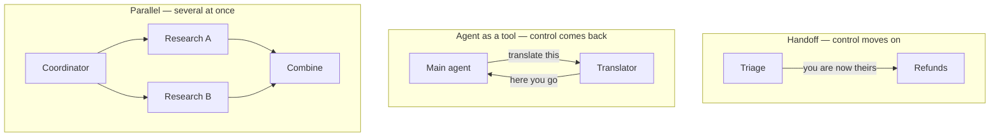
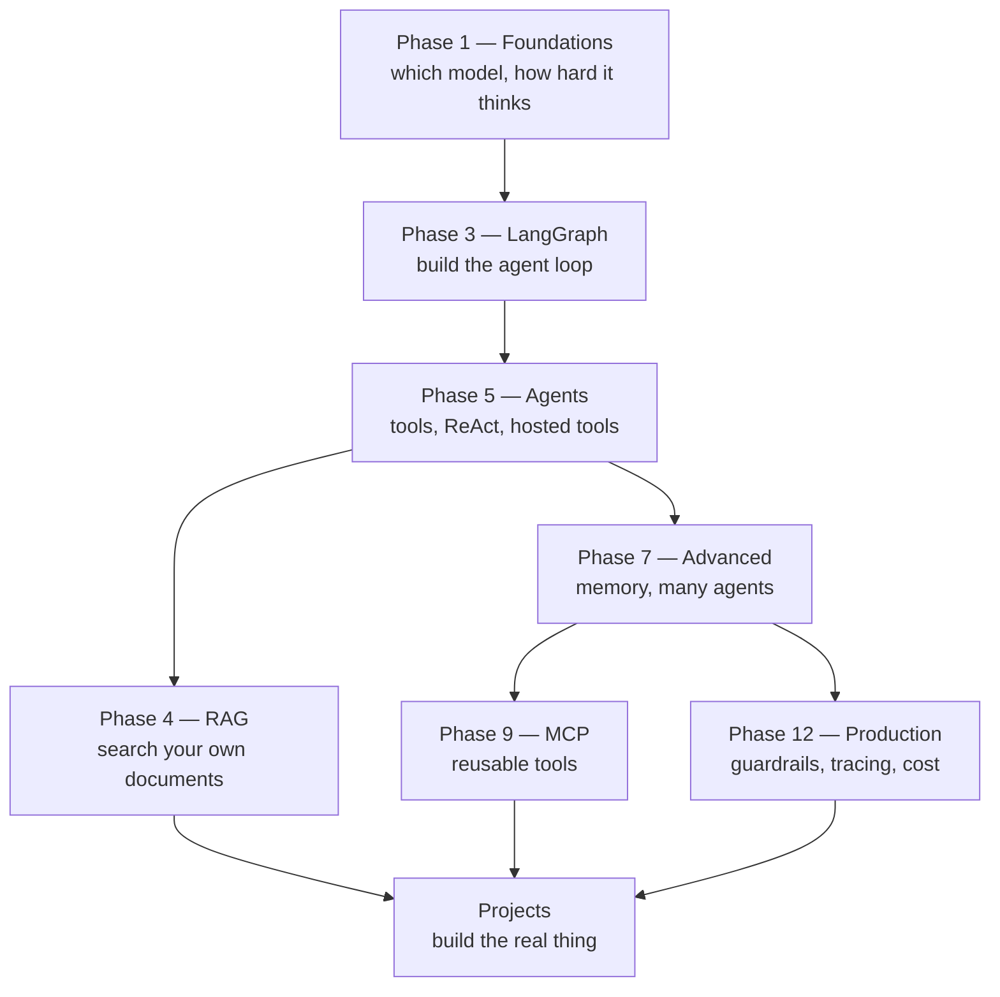

# Building Agents — A Plain-English Tutorial

A walkthrough of OpenAI's [Building Agents track](https://developers.openai.com/tracks/building-agents),
written in simple language, with the notebook in **this repo** that teaches each idea properly.

**How to read this:** every concept gets 3–4 lines. That is enough to understand *what it is
and why you would use it*. When you want the real thing — code you can run, trade-offs,
failure modes — open the notebook listed under it.

**All notebook paths are relative to the repository root**, not to this file, so you can
paste them straight into `jupyter lab` or an editor.

> **Companion document:** `[OPENAI_BUILDING_AGENTS_COVERAGE.md](OPENAI_BUILDING_AGENTS_COVERAGE.md)`,
> beside this file, is the audit — which track topics this repo covers, which were
> deliberately skipped, and why. **That one is the record; this one is the lesson.**

---


## How to work through it — the TODO tracker

Every concept ends with a `- [ ] TODO` line. Tick it off as you go: this file *is* the
tracker, so commit it as you work and `git log` becomes your study history.

The TODOs are deliberately **not** "read the notebook". Each asks you to produce something
small — a number you measured, a cell you changed, a failure you reproduced — because that
is the difference between having read about agents and being able to talk about them under
questioning. **If you can tick a box without opening an editor, the box is wrong.**

**24 TODOs.** Check your progress with:

```bash
cd 06_Interview_Prep/OpenAI_Applied
grep -c '^- \[ \]' OPENAI_BUILDING_AGENTS_TUTORIAL.md   # left to do
grep -c '^- \[x\]' OPENAI_BUILDING_AGENTS_TUTORIAL.md   # done
```

---


## Contents


| #   | Chapter                                                                              | TODOs |
| --- | ------------------------------------------------------------------------------------ | ----- |
| 1   | [What is an agent?](#1-what-is-an-agent)                                             | 1     |
| 2   | [Core concepts](#2-core-concepts) — picking a model, building the loop, adding tools | 4     |
| 3   | [Tools](#3-tools) — your functions vs. OpenAI's built-in ones                        | 8     |
| 4   | [Orchestration](#4-orchestration) — handoffs, guardrails, memory, many agents        | 4     |
| 5   | [Example use cases](#5-example-use-cases)                                            | 3     |
| 6   | [Best practices](#6-best-practices)                                                  | 4     |
| 7   | [A path through this repo](#7-a-path-through-this-repo)                              | —     |


---


## 1. What is an agent?

A normal chatbot takes your message and writes a reply. An **agent** can also *do things*
first — look something up, run a calculation, call your API — and then reply using what it
found. The model is not just writing text; it is deciding what to do next.

The whole thing is a loop. The model looks at the conversation, decides whether it can
answer or whether it needs something, uses a tool if it does, sees the result, and looks
again. It keeps going until it can answer.




Three parts make up an agent, and you control all three:

- **Instructions** — what it should do, and how it should behave.
- **Tools** — what it is allowed to reach for.
- **Guardrails** — what it must not do, checked before and after.

**In this repo:** `02_Core/03_LangGraph_Fundamentals/` builds this loop from scratch, step
by step. It is the best starting point in the whole repo.

- [x] **TODO** — run one notebook in `02_Core/03_LangGraph_Fundamentals/01_Foundations/` and
  say in one sentence where the loop decides to *stop*. That condition is the agent.

---


## 2. Core concepts


### 2.1 Choosing the right model

Some models answer immediately. **Reasoning models** think privately first — they work
through the problem internally, then answer. That thinking costs time and money, so it is
worth it for hard problems and wasteful for easy ones.

The useful habit is to start with the cheap fast model and only move up when it actually
fails. Most people guess wrong about which tasks need thinking, so measure rather than
assume.

**In this repo:**

- `01_Foundations/00_Theory_and_Foundations/Reasoning_and_Model_Selection/01_Reasoning_vs_NonReasoning.ipynb`
— the same tasks on both kinds of model, **including one where the reasoning model does worse**.
- `01_Foundations/00_Theory_and_Foundations/Reasoning_and_Model_Selection/02_Reasoning_Effort_Levers.ipynb`
— how hard to let it think, and where extra thinking stops helping.

- [x] **TODO** — run `01_Reasoning_vs_NonReasoning.ipynb` and write down **the task where the
  reasoning model does worse**. That single example is what stops you defaulting to the big model.


### 2.2 Using a cheap model for easy turns and an expensive one for hard turns

You do not have to pick one model for the whole app. You can look at each incoming request
and send it to a small model or a big one. Most real traffic is easy, so this usually cuts
cost a lot without anyone noticing.

The catch is that *deciding* which model to use costs something too. If the decision is as
expensive as just using the big model, you have gained nothing.

**In this repo:** `02_Core/05_AI_Agent_Fundamentals/4. Workflow_Pattern/2. Routing/notebooks/Routing_By_Model_Tier.ipynb`
— routing by difficulty, with the cost of the routing step measured honestly.

- [x] **TODO** — run `Routing_By_Model_Tier.ipynb` and note the measured saving. Then answer:
  at what traffic mix would the routing step cost more than it saves?


### 2.3 Building the core logic

OpenAI offers two ways to build the loop: the **Responses API** (you write the loop
yourself) and the **Agents SDK** (the loop is written for you). Other frameworks —
LangGraph, CrewAI, AutoGen — do the same job in their own way.

This repo teaches the loop mainly through **LangGraph**, because once you understand the
loop you can rebuild it in any of them. The ideas transfer; the function names do not.

**In this repo:**

- `02_Core/03_LangGraph_Fundamentals/` — the loop, taught as a loop.
- `03_Advanced/06_Agent_SDKs_First_Party/OpenAI_Agents_SDK/01_Foundations/01_Agents_Handoffs_Guardrails.ipynb`
— OpenAI's own SDK, with a table mapping each of its pieces to the LangGraph equivalent.

- [x] **TODO** — open section 6 of `01_Agents_Handoffs_Guardrails.ipynb` (the LangGraph
  comparison table) and cover the right-hand column. Can you fill it in from memory?


### 2.4 Giving your agent tools

A tool is just a function you describe to the model — its name, what it does, what
arguments it takes. The model cannot run it. It can only say *"please run this one, with
these arguments"*, and your code does the running.

That is the important bit: the model is choosing, not executing. Everything about safety
and control follows from that split.

**In this repo:**

- `02_Core/03_LangGraph_Fundamentals/01_Foundations/05_Augmented_LLM_with_Tools.ipynb` — the simplest possible version.
- `02_Core/05_AI_Agent_Fundamentals/2. LangChain_Tools_and_Agents/01_Tools_and_Functions/` — writing real tools.

- [x] **TODO** — write one tool of your own in `02_Core/05_AI_Agent_Fundamentals/2. LangChain_Tools_and_Agents/01_Tools_and_Functions/` and get the model to
  call it. Then give it a vague description and watch the model call it wrongly. Tool
  descriptions are prompts.

---


## 3. Tools


### 3.1 Your functions vs. OpenAI's built-in tools

With **function calling**, the model asks and *your code runs it*. With a **built-in tool**,
the model asks and *OpenAI runs it on their servers* — the answer comes back already
finished, and you never see the middle.




The trade is simple. Built-in tools mean no infrastructure to run. Your own functions mean
you can inspect the arguments, block a bad call, log it, stub it in tests, and point it at
your own systems. You only get that seam when the execution is yours.

**In this repo:** `02_Core/05_AI_Agent_Fundamentals/5. Agent Pattern/01_Tool_Use/07_Hosted_vs_Client_Side_Tools.ipynb`
— the **same capability built both ways**, side by side, including a guard that refuses a
tool call, which is only possible when you run it.

- [x] **TODO** — run `07_Hosted_vs_Client_Side_Tools.ipynb` and change the guard to block a
  *different* call. Then try to do the same to the hosted version, and be able to say why you can't.


### 3.2 Web search

The agent looks something up on the internet before answering. This is the standard fix for
"the model's training data is old" and for questions about things happening now.

You can do it with a search provider you call yourself, or with OpenAI's hosted version.
Same capability, different amount of control.

**In this repo:**

- Your own: `02_Core/05_AI_Agent_Fundamentals/3. AI_Agents_with_LangGraph/01_Research_Assistant_Chatbot.ipynb` (and 37 other notebooks use Tavily).
- Hosted: `.../01_Tool_Use/07_Hosted_vs_Client_Side_Tools.ipynb`.

- [x] **TODO** — run the research chatbot and ask it something from this week. Then break the
  search tool on purpose: what does the agent do when a tool returns nothing useful?


### 3.3 File search

Search *your* documents instead of the web. You chop documents into pieces, store them so
they can be looked up by meaning rather than exact words, and hand the model the relevant
pieces. This is what people mean by **RAG**.

OpenAI can host the whole thing for you. Building it yourself is more work and teaches you
far more about why retrieval fails.

**In this repo:**

- `02_Core/04_Retrieval_and_RAG/` — the fundamentals, built by hand.
- `03_Advanced/08_Advanced_RAG/` — the harder version, where the agent checks and corrects its own retrieval.

- [x] **TODO** — in `02_Core/04_Retrieval_and_RAG/`, ask a question your documents *cannot*
  answer. Does the system say so, or invent something? That behaviour is the whole game.


### 3.4 Code interpreter

The model writes Python and **actually runs it**, then answers using the real output. This
matters because a model doing arithmetic in its head is guessing digits; a model running
`statistics.stdev` is computing.

The nice surprise is that this tool hands back **the code it ran**, so you can check its
method even though you did not run it yourself.

**In this repo:** `.../01_Tool_Use/09_Hosted_Code_Execution.ipynb` — a maths task the model
gets wrong unaided and right with execution, plus how to cap the sandbox's memory and cut
its internet access.

- [x] **TODO** — run `09_Hosted_Code_Execution.ipynb`, compare the unaided answer to the truth
  digit by digit, then read the code it ran and check *which* standard deviation it used.


### 3.5 Computer use

The agent is shown a **picture of a screen** and replies with where to click. No element
names, no page structure — just pixels and coordinates, the way a person uses a screen.

It is slow and it misclicks, but it is the only option when there is no API to call, and it
is what "agent that tests my website" actually means.

**In this repo:**

- `.../01_Tool_Use/08_Vision_Driven_Computer_Use.ipynb` — real screenshots in, click coordinates out.
- `.../01_Tool_Use/06_BrowserAgent_Computer_Use_Applied.ipynb` — the same loop with text instead of pixels, which is easier to follow first.

- [x] **TODO** — run `08_Vision_Driven_Computer_Use.ipynb`, then move one button somewhere
  awkward. Does the agent still find it, and how many more steps did it need?


### 3.6 Image generation

The agent decides, mid-conversation, that the right answer is a picture — and writes its
own image prompt from whatever you were discussing. You get raw image bytes back.

There is one trap worth knowing before you use this. **The agent describes the image it
meant to make, not the one it made** — it never looks at the result. So it will cheerfully
tell you the label says "NINTH STREET" when the label actually says `NINTH STRFET`.

The fix is to send the picture back in and ask a second model to read it out loud.

**In this repo:** `.../01_Tool_Use/10_Agentic_Image_Generation.ipynb` — that exact failure,
reproduced on two live runs, and the check that catches it.

- [x] **TODO** — run `10_Agentic_Image_Generation.ipynb` and put the agent's description next
  to the actual image. Satisfy yourself that it described the prompt, not the picture.


### 3.7 MCP

**MCP** is a standard plug shape for tools. Instead of writing a custom integration for
every agent framework, a tool provider exposes an MCP server once and any MCP-aware agent
can use it.

Think USB for agent tools: write the tool once, plug it in anywhere.

**In this repo:** `03_Advanced/09_Agent_Protocols/MCP/` — using MCP servers, and building
your own server and client.

- [x] **TODO** — connect an existing MCP server to an agent, then build the smallest server you
  can that exposes one tool of your own.


### 3.8 One thing to remember about built-in tools

They are not equally transparent, and they are not equally checkable:


| Tool             | What you get back                | Can you verify it?                                 |
| ---------------- | -------------------------------- | -------------------------------------------------- |
| Web search       | a conclusion                     | compare against the source                         |
| Code interpreter | **the code it ran** + the output | re-run the code                                    |
| Image generation | the prompt it wrote + the bytes  | **no easy way** — needs a second model with vision |


That last row is the one people get caught by. A wrong number looks wrong. A wrong picture
arrives with a confident paragraph explaining how good it is.

- [x] **TODO** — for a feature you actually want to build, write one sentence naming how you
  would *check* the tool's output. If you can't, that is the risk to design around — say so
  out loud rather than discovering it in production.

---


## 4. Orchestration


### 4.1 Handoffs

Instead of one agent that knows everything, you build several specialists and let them pass
the conversation along. A triage agent works out what you want and hands you to the refunds
agent, which takes over completely.

This keeps each agent's instructions short, which is the real win — long instructions are
where agents start ignoring things.

**In this repo:** `03_Advanced/07_Advanced_Agentic_Systems/Multi_Agent_Orchestration/Production_Course_Multi_Agent/03_agent_handoffs.ipynb`

- [x] **TODO** — run `03_agent_handoffs.ipynb`, then merge two of the agents into one with a
  longer prompt. Find the instruction it starts ignoring. That is why handoffs exist.


### 4.2 Guardrails

Guardrails are checks around the agent, not inside it. An **input guardrail** runs before
the agent sees the message — blocking abuse, off-topic requests, or attempts to talk it out
of its instructions. An **output guardrail** runs before the user sees the reply.

Both matter. Input guardrails stop bad requests; output guardrails stop bad answers, which
includes the agent leaking its own instructions.




**In this repo:**

- `03_Advanced/12_Production_and_Observability/Safety_and_Alignment/01_Moderating_Chains.ipynb` — the basics.
- `03_Advanced/12_Production_and_Observability/Safety_and_Alignment/03_Guardrails_LLM_and_Rule_Based.ipynb`
— the full pipeline above, including a reply blocked for leaking the system prompt.

- [x] **TODO** — run `03_Guardrails_LLM_and_Rule_Based.ipynb`, then try to get the agent to leak
  its system prompt *past* the output guardrail. Whatever gets through is your next rule.


### 4.3 Memory and conversation history

An agent has no memory between calls unless you give it one. The simple version is keeping
the message list and sending it every time. That works until the conversation gets long and
expensive.

Then you need real choices: summarise old turns, keep separate conversations apart, save to
a database, and sometimes rewind to an earlier point.

**In this repo:** `03_Advanced/07_Advanced_Agentic_Systems/Memory_and_State/` — 23 notebooks
on exactly this, plus LangGraph's built-in saving, separate threads per user, and time travel.

- [x] **TODO** — run a conversation long enough to get expensive, then turn on summarising and
  measure the token count before and after.


### 4.4 Many agents working together

Beyond handoffs there are two other shapes, and mixing them up is a common design mistake:




- **Handoff** — the other agent takes over and replies to the user itself.
- **Agent as a tool** — the other agent does a job and reports back; the first agent still owns the conversation.
- **Parallel** — several run at the same time and someone merges the results. Faster, but only when the pieces are truly independent.

**In this repo:**

- `03_Advanced/07_Advanced_Agentic_Systems/Multi_Agent_Orchestration/` — supervisor and swarm setups.
- `02_Core/03_LangGraph_Fundamentals/02_Core_Capabilities/02_Routing/` — sending work down different paths.
- `03_Advanced/10_Alternative_Agent_Frameworks/` — how CrewAI, AutoGen and DSPy each express the same thing.

- [x] **TODO** — take one of your own problems, write down which of the three shapes it is, and
  why the other two are wrong for it. Most design mistakes here are picking the wrong shape.

---


## 5. Example use cases


### 5.1 A support agent that asks a human first

Some actions should not be automatic — refunds, cancellations, anything that moves money.
The agent does the work up to that point, then pauses and waits for a person to approve,
then carries on from where it stopped.

The interesting engineering is the pause: the agent has to survive being stopped for an
hour and then resumed.

**In this repo:** `02_Core/03_LangGraph_Fundamentals/02_Core_Capabilities/03_Human_in_the_Loop/`

- [x] **TODO** — run a human-in-the-loop notebook, then **restart the kernel while it is
  paused** and try to resume. What survives the restart is the real lesson.


### 5.2 A customer service agent network

A front agent works out what the customer needs and routes it — billing, technical,
returns — with each specialist having its own knowledge and its own tools. This is handoffs
and RAG combined into one real system.

**In this repo:**

- `03_Advanced/08_Advanced_RAG/Agentic_RAG/1. Build_a_Healthcare_Customer_Support_Router_Agentic_RAG_System.ipynb`
- `05_Projects/AI_Powered_Customer_Support/` — the deployable version, with Docker and tests.

- [x] **TODO** — run the healthcare router and send it a question that sits between two
  specialists. Watch how it decides — and whether it decides the same way twice.


### 5.3 A frontend testing agent

Point an agent at your web app, tell it what a user should be able to do, and let it try.
It clicks around from screenshots and reports whether the thing worked.

The valuable part is telling *two different failures* apart: the agent clicked the button
and nothing happened (your app is broken), versus the agent never found the button (your
agent is confused).

**In this repo:** section 4 of `.../01_Tool_Use/08_Vision_Driven_Computer_Use.ipynb` — a
deliberately broken button, and that exact diagnosis.

- [x] **TODO** — break a *different* control in section 4 and confirm the diagnosis still tells
  "the app is broken" apart from "the agent is confused".

---


## 6. Best practices


### 6.1 Check what comes in

Assume some users are hostile. People will try to talk your agent out of its instructions,
pull out its system prompt, or get it to do something it should not. Filter before the
model sees the message.

**In this repo:** `03_Advanced/12_Production_and_Observability/Safety_and_Alignment/`,
and `03_Advanced/12_Production_and_Observability/Production_Course_Ops/03_security_patterns.ipynb`.

- [x] **TODO** — spend ten honest minutes trying to talk one of your own agents out of its
  instructions. Write down what worked; that list is your test suite.


### 6.2 Make the output a shape, not a paragraph

If your code has to use the answer, ask for structured output — a fixed set of fields with
fixed types — instead of free text you then have to parse. You define the shape, and you get
that shape back.

This removes an entire category of bug: the one where the model answered correctly but
phrased it differently today.

**In this repo:**

- `02_Core/01_LangChain_Fundamentals/07_LangChain_1x_Agents_and_Middleware/7.4_Structured_Output.ipynb`
- `02_Core/03_LangGraph_Fundamentals/01_Foundations/08_Pydantic_State_Validation.ipynb`

- [x] **TODO** — convert one agent that returns prose into structured output. Then feed it a
  question it cannot answer and see what lands in your required fields.


### 6.3 Watch it in production

You cannot fix what you cannot see. You want a record of every step — which tools were
called, how long each took, how many tokens it burned, where it went wrong.

Build this early. Debugging an agent without a trace of its steps is guesswork.

**In this repo:**

- `03_Advanced/12_Production_and_Observability/LLMOps_and_AI_Infrastructure/Tracing_and_Observability/LangSmith/01_LangSmith_Basics.ipynb`
- `03_Advanced/12_Production_and_Observability/Production_Course_Ops/01_monitoring.ipynb` — the same thing built by hand, which is how you learn what a trace actually is.

- [x] **TODO** — run `01_monitoring.ipynb` and add one thing it does not track yet. Building a
  trace by hand once is what makes every dashboard afterwards readable.


### 6.4 Decide about speed, cost and reliability up front

These three pull against each other. A more careful agent is slower and pricier; a cheaper
one is more likely to be wrong. Pick which one you are protecting before you build, because
retrofitting it later means rewriting the design.

**In this repo:**

- `03_Advanced/12_Production_and_Observability/LLMOps_and_AI_Infrastructure/` — caching, cost tracking.
- `06_Interview_Prep/Study_Guides/Cost_Latency_Optimization/` — the same as design decisions rather than operations.

- [x] **TODO** — for something you are building, finish this sentence: *"when these three
  conflict, I protect ___ first, because ___."* Then check your design actually does that.

---


## 7. A path through this repo

If you are starting from the beginning, this is the order that works:




**The short version if you only have a weekend:**

1. `02_Core/03_LangGraph_Fundamentals/01_Foundations/` — what the loop is.
2. `02_Core/05_AI_Agent_Fundamentals/5. Agent Pattern/01_Tool_Use/02_Tool_Calling_vs_ReAct.ipynb` — two ways to run it.
3. `.../01_Tool_Use/07_Hosted_vs_Client_Side_Tools.ipynb` — who runs the tool, and why it matters.
4. `03_Advanced/12_Production_and_Observability/Safety_and_Alignment/03_Guardrails_LLM_and_Rule_Based.ipynb` — how you keep it safe.

**When every box above is ticked**, the check is not that you finished the file. It is that
you can take any one row of the table in section 3.8 and argue it from something you
actually ran.

---


## What OpenAI's track covers that this repo deliberately skips

Four topics were reviewed and **intentionally left out**, because they are OpenAI's spelling
of something this repo already teaches in more depth. The reasoning for each is recorded in
`OPENAI_BUILDING_AGENTS_COVERAGE.md`:


| Topic                                        | Why it was skipped                                                                        |
| -------------------------------------------- | ----------------------------------------------------------------------------------------- |
| Responses API                                | It is OpenAI's request format. The concepts it carries are taught framework-neutrally     |
| Agents SDK (beyond the foundations notebook) | The remaining folders would add API surface, not new ideas                                |
| Sessions                                     | OpenAI's automatic history is a simpler version of memory the repo covers in 23 notebooks |
| Tracing (OpenAI's dashboard)                 | A different screen for spans and token counts the repo already builds from scratch        |


Everything else in the track is covered.