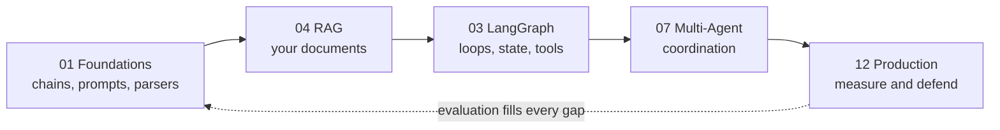

# 🎓 Interview Tutorials

Nine interview-prep tutorials generated by the
[`notebook-interview-tutorial`](../.claude/skills/notebook-interview-tutorial/SKILL.md)
skill: a five-part series built from `production-course-main-code-main/` on
2026-09-06, plus four standalone tutorials built directly from this repo's own
roadmap folders on 2026-09-09 and 2026-09-16.

Target roles: **Applied AI / AI Engineer**, **Agentic AI Engineer**, and
**Forward Deployed Engineer**.

## The series

Read in order. Each builds on the one before, and each links to the others where a
concept lives elsewhere rather than repeating it. Filenames are numbered to match
their **source folder number** in this repo, not their reading order, so the
sequence below is 01 -> 04 -> 03 -> 07 -> 12, not 01 -> 05.



| # | Tutorial | Source folder | The one thing it teaches |
|---|---|---|---|
| 01 | [LangChain Foundations](01_langchain_foundations_INTERVIEW_TUTORIAL.md) | `02_Core/01_LangChain_Fundamentals` (whole folder) | Everything is a Runnable, and `\|` composes them |
| 04 | [RAG & Retrieval](04_rag_and_retrieval_INTERVIEW_TUTORIAL.md) | `02_Core/04_Retrieval_and_RAG` (subfolders 01-06) | Retrieval and generation fail independently |
| 03 | [LangGraph Fundamentals](03_langgraph_fundamentals_INTERVIEW_TUTORIAL.md) | `02_Core/03_LangGraph_Fundamentals` (whole folder) | Checkpointing gives you memory, approval and time travel |
| 07 | [Multi-Agent Systems](07_multi_agent_systems_INTERVIEW_TUTORIAL.md) | `03_Advanced/07_Advanced_Agentic_Systems/Multi_Agent_Orchestration/Production_Course_Multi_Agent` | Most multi-agent systems should be one agent |
| 12 | [Production & Operations](12_production_and_operations_INTERVIEW_TUTORIAL.md) | `03_Advanced/12_Production_and_Observability` (whole folder, evaluation excluded) | If you can't measure it, you can't defend it |

## Standalone tutorials

Four more tutorials, generated the same way but each scoped to one folder (or a
narrow pair of subfolders) rather than part of the five-part series above. Read
independently — they don't assume you've read 1-5, and 1-5 don't assume you've
read these.

| Tutorial | Source folder(s) | Built |
|---|---|---|
| [Agent Fundamentals & Advanced Agentic Systems](agent_fundamentals_and_advanced_agentic_systems_INTERVIEW_TUTORIAL.md) | `02_Core/05_AI_Agent_Fundamentals/` + `03_Advanced/07_Advanced_Agentic_Systems/` (162 notebooks) | 2026-09-09 |
| [Parent Document Retrieval](parent_document_retrieval_INTERVIEW_TUTORIAL.md) | `02_Core/04_Retrieval_and_RAG/03_Indexing_Techniques/Parent_Document_Retrieval.ipynb` + `02_Core/04_Retrieval_and_RAG/06_RAG_Naive_to_Production/05_Parent_Document_Retriever/08_BetterRetriever.ipynb` | 2026-09-09 |
| [07 — Agent Memory & State](07_memory_and_state_INTERVIEW_TUTORIAL.md) | `03_Advanced/07_Advanced_Agentic_Systems/Memory_and_State/` (`Agentic_Memory_Architectures/`, `LangChain/Memory/`, `LangGraph/`; 22 notebooks) | 2026-09-16 |
| [08 — Advanced RAG Techniques](08_advanced_rag_techniques_INTERVIEW_TUTORIAL.md) | `03_Advanced/08_Advanced_RAG/Comprehensive_RAG_Techniques/` (`all_rag_techniques/`, `all_rag_techniques_runnable_scripts/`; excludes `evaluation/`) + `03_Advanced/08_Advanced_RAG/RAG_with_LangGraph_Advanced/` (48 notebooks) | 2026-09-16 |

Each also has its own standalone HTML artifact source (`agent_fundamentals_and_advanced_agentic_systems_INTERVIEW_TUTORIAL.html`,
`parent_document_retrieval_INTERVIEW_TUTORIAL.html`) versioned next to its markdown,
the same way the five-part series' source lives in `INTERVIEW_DRILL_HUB.html` below —
but **no published artifact URL is on record for either of these two**. If you've
already published them from a past session, paste the URL here; otherwise treat them
as not-yet-published and regenerate/publish per the skill's own instructions.

`07_memory_and_state_INTERVIEW_TUTORIAL.md` and `08_advanced_rag_techniques_INTERVIEW_TUTORIAL.md`
are markdown-only for now (no HTML artifact built yet). Like the series above, their
numbers match their source folder — `03_Advanced/07_Advanced_Agentic_Systems/Memory_and_State` and
`03_Advanced/08_Advanced_RAG` — which is also why `07` is shared with the Multi-Agent Systems
tutorial (both live under `03_Advanced/07_Advanced_Agentic_Systems`, different subfolders).
`08_advanced_rag_techniques` deliberately excludes `GraphRAG`, `CacheRAG`,
`RAG_Ecosystem`, `building-adaptive-rag` and the `evaluation/` subfolder — evaluation
is covered as its own separate tutorial, not folded in here.

## The interactive drill

The five-part series above (not the two standalone tutorials) is also published as
one drillable page, with a tab per tutorial, click-to-reveal answers, role filtering,
gotcha flip-cards and self-scoring that runs across the whole series:

**[AI Engineering Interview Drill](https://claude.ai/code/artifact/0bf71791-2308-4bc7-9ffc-8b6f5003bd8c)**

Its source is `INTERVIEW_DRILL_HUB.html` in this folder, versioned alongside the
markdown. The markdown is the full written version; the page is built for recall
practice, so its concept sections are condensed and its question bank is complete.

## What's covered where

Verified by scanning the source notebooks, not assumed. Use this to find which tutorial
answers a given interview topic. Scope: the five-part series only (01, 04, 03, 07, 12
above) — the other standalone tutorials aren't cross-referenced into this matrix.

| Topic | 01 | 04 | 03 | 07 | 12 |
|---|:--:|:--:|:--:|:--:|:--:|
| LCEL, prompts, parsers | ✅ | | | | |
| Structured output | ✅ | ✅ | | ✅ | ✅ |
| Streaming | ✅ | | | | |
| Retrieval, chunking, vector stores | | ✅ | | | |
| Embeddings and caching | | ✅ | | | ✅ |
| Conversation memory | ✅ | ✅ | ✅ | | |
| Graph state, reducers, cycles | | | ✅ | ✅ | |
| Checkpointing and durability | | | ✅ | | |
| Tool calling / agent loop | | | ✅ | | |
| Human-in-the-loop | | | ✅ | ✅ | |
| Retries and fallbacks | ✅ | | ✅ | | |
| Multi-agent coordination | | | | ✅ | |
| Tracing and observability | ✅ | | ✅ | | ✅ |
| Cost control and routing | | ✅ | | | ✅ |
| Security and injection | | | | | ✅ |
| Evaluation and testing | | | | | ✅ |
| **Async** | ❌ | ❌ | ❌ | ❌ | ❌ |

### The one gap nothing covers

**Async.** No folder uses `ainvoke`, `astream` or `async def`. Every question about
concurrency, load, or serving many users at once lands on this gap. It is the single
highest-value thing to build for yourself before interviewing — a small async service
with `astream`, load-tested, closes it.

## How to use these

**Interviewing next week?** Read the Production & Operations tutorial (`12`) first.
Evaluation, cost and security are where prototype-only candidates get found out.

**Building toward agentic roles?** LangGraph Fundamentals (`03`) and Multi-Agent
Systems (`07`) are your core. Read `03` properly before `07` — every multi-agent
pattern is just that graph, nested.

**Applied AI roles?** RAG & Retrieval (`04`) and Production & Operations (`12`).
Retrieval quality and measuring it are the whole interview.

**Forward Deployed roles?** Every tutorial has an FDE track in section 5. They share a
theme: scoping, customer data, cost conversations, and refusing to promise numbers you
can't measure.

## Each tutorial's shape

| Section | What's in it |
|---|---|
| Mental model | One diagram the rest of the tutorial hangs from |
| Coverage and gaps | What the notebooks prove you built, and what they don't |
| Core concepts | Plain explanation, then mechanism, then code from your own notebooks |
| Gotchas | Symptom, cause, fix, and how it gets asked |
| Tradeoffs | A table with a "pick when" column, and the line you say out loud |
| Interview questions | Web-sourced, each with a source link |
| Role tracks | Separate questions for the three target roles |
| Self-check | Rapid-fire recall |

## Regenerating

```
/notebook-interview-tutorial <path-to-notebook-folder>
```

The skill re-runs a live web search each time, so the interview questions track what is
currently being asked. Regenerating an existing tutorial overwrites the markdown; to
update its published page, pass the existing artifact URL so self-scores survive.
