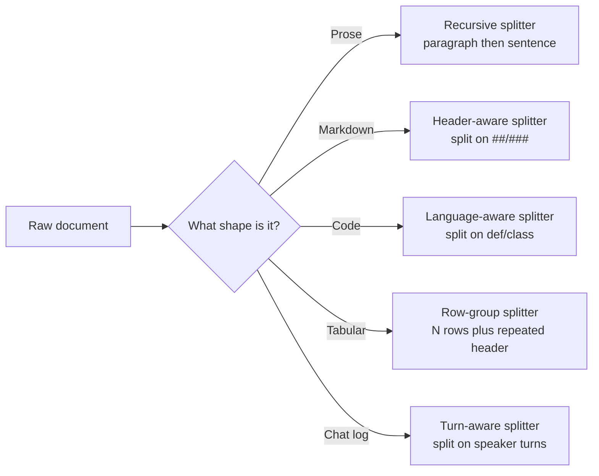
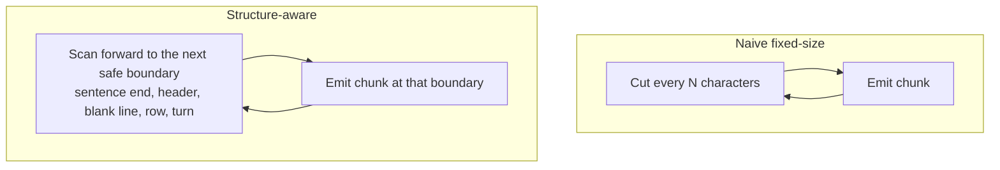

# Chunking Strategies by Document Type: one splitter does not fit all

*RAG Retrieval Lab — Part 1*

Every RAG pipeline starts with the same quiet decision: how do you cut a document into pieces small enough to embed but large enough to still mean something? Get it wrong and the retriever hands the LLM half a sentence, half a function, or half a support ticket — and no amount of prompt engineering fixes a chunk that was broken before it ever reached the model.

## TL;DR

- A single fixed-size splitter applied to every document type will cut sentences, headers, functions, table rows, and conversation turns right down the middle.
- Each document type has a natural "safe boundary" — a place it's fine to cut. Prose breaks at sentence ends, Markdown breaks at headers, code breaks between functions, tables break at row ends, chat logs break between turns.
- A structure-aware splitter that respects those boundaries produces zero broken chunks, at the cost of variable chunk sizes — that trade-off is almost always worth it.

## The problem with one splitter for everything

- A fixed `chunk_size=130` splitter has no idea what it's cutting — it counts characters and stops, regardless of what's at that position.
- On five different document types run through the same 130-character splitter in this lab, the naive approach broke a boundary on **72–83% of its cuts** depending on the type.
- Structure-aware splitting fixes this not by tuning the chunk size, but by changing *where* the splitter is allowed to cut.

## The core mechanism: safe boundaries, not fixed offsets

Every document type has natural points where a cut loses nothing:

    Prose      → end of a sentence (. ! ?)
    Markdown   → start of a new header (##, ###)
    Code       → blank line between top-level functions/classes
    Tabular    → end of a row (with the header repeated per chunk)
    Chat log   → between speaker turns (never mid-turn)

A structure-aware splitter scans forward until it hits one of these points, then cuts — even if that means one chunk is 76 characters and the next is 213. A naive splitter cuts at a fixed offset regardless of what's there.

## Visualizing the two approaches



Routing on document shape, rather than reaching for one default splitter, is the single highest-leverage decision in a chunking pipeline.



Same loop shape, different stopping rule. That one difference is what separates a clean chunk from a broken one.

## Results from the lab (130-character naive baseline)

| Document type | Source length | Naive chunks | Naive broken cuts | Aware chunks | Aware broken cuts |
|---|---|---|---|---|---|
| Prose | 790 chars | 7 | 5 | 6 | 0 |
| Markdown | 675 chars | 6 | 5 | 4 | 0 |
| Code | 703 chars | 6 | 5 | 2 | 0 |
| Tabular | 403 chars | 4 | 3 | 3 | 0 |
| Chat log | 623 chars | 5 | 4 | 4 | 0 |

The aware splitter almost always produces *fewer* chunks, not more — because it's allowed to run past a fixed offset to reach a real boundary, so it doesn't waste a chunk on a tiny leftover fragment.

## Recommended strategy per document type

| Document type | Safe boundary | LangChain building block | What breaks without it |
|---|---|---|---|
| Prose / articles | Sentence, then paragraph | `RecursiveCharacterTextSplitter` with `["\n\n", "\n", ". ", " "]` separators | A retrieved chunk ends mid-sentence, so the embedding captures half an idea |
| Markdown / technical docs | Header boundary | `MarkdownHeaderTextSplitter` | A code sample or warning gets separated from the header that gives it context |
| Source code | Function / class boundary | `RecursiveCharacterTextSplitter.from_language(Language.PYTHON, ...)` | A function's docstring is returned without its body, or vice versa |
| Tabular / CSV data | Row boundary | Custom row-group splitter, header repeated per chunk | A row's fields get split across two chunks, corrupting every value in it |
| Chat / conversational logs | Speaker turn boundary | Custom turn-aware splitter | A customer's question and the agent's answer end up in different chunks |

## When to use structure-aware splitting — and when a simple splitter is fine

- **Use structure-aware splitting when:** the document has an internal grammar the LLM depends on — headers, function definitions, table schemas, speaker turns — and losing that grammar changes what the content means.
- **A plain recursive splitter is fine when:** the source is genuinely unstructured free text with no meaningful internal boundaries beyond sentences and paragraphs — most prose falls here, which is why `RecursiveCharacterTextSplitter` is the right default starting point, not the wrong one.
- **Watch for mixed documents:** a Markdown file with embedded code blocks, or a PDF that's mostly prose but has an embedded table, needs a splitter that detects the sub-region and applies the *right* rule locally rather than one rule globally.

## Interview Spotlight: 5 Questions You Might Get Asked

*The kind of production/real-time-use-case questions this concept shows up in at OpenAI-, Anthropic-, and Google-caliber interviews.*

### 1. An insurance client's knowledge base mixes underwriting guides written in Markdown with scanned policy PDFs that come through as raw prose. You have one sprint to ship chunking for both. How do you decide the strategy per source, and what breaks if you apply one fixed splitter to everything?

**What a strong answer covers:**
- Recognizes the two sources have different internal grammars (headers vs. sentences) and need different safe-boundary rules
- Proposes detecting source type at ingestion (file extension, or a lightweight structure check) and routing to the matching splitter
- Names the specific failure of a one-size-fits-all splitter here: header context gets separated from its underwriting rule, or PDF prose gets cut mid-sentence
- Flags that PDF extraction quality (layout noise, broken paragraphs) is often the bigger problem than the splitter itself

### 2. Three weeks after launch, someone notices the assistant answers a code-related support question with a docstring but no function body. How do you find out whether this is a chunking bug or a retrieval bug?

**What a strong answer covers:**
- First isolates whether the retrieved chunk itself is incomplete (chunking bug) or the complete chunk was retrieved but the wrong one (retrieval bug)
- Pulls the raw chunk from the vector store for that document and checks its boundaries against the source file
- If the chunk is genuinely half a function, checks whether the code splitter's boundary regex is failing on a specific pattern (e.g. nested functions, decorators, multi-line signatures)
- Proposes a regression check: re-run the splitter over the whole corpus and count chunks that don't start/end on a valid boundary, not just spot-check the one complaint

### 3. Your team is deciding between chunking by fixed token count (fast, simple, works everywhere) versus a custom structure-aware splitter per document type (slower to build, needs maintenance per format) for a fintech client's onboarding. You have two weeks before launch. Which do you ship, and why?

**What a strong answer covers:**
- Frames the decision around the mix of document types actually in scope, not a general preference
- Defaults to fixed-size for anything genuinely unstructured, and reserves structure-aware effort for document types where broken boundaries would cause real harm (e.g. transaction tables, contract clauses)
- Proposes shipping fixed-size first with monitoring in place, then adding structure-aware splitters for the highest-volume or highest-risk document types post-launch
- Explicitly weighs maintenance cost — a custom splitter per format is another thing that breaks when the source format changes

### 4. How would you know, without manually reading chunks, that your chunking pipeline is silently producing broken boundaries in production as new document types get added over time?

**What a strong answer covers:**
- Proposes an automated boundary-integrity check per document type run at ingestion time — e.g. for code, verify every chunk starts at a `def`/`class` or a blank line; for tables, verify every chunk's row count and column count match the header
- Suggests sampling a percentage of chunks for a periodic manual audit as a backstop, not the primary check
- Ties this to a concrete metric that can alert (percentage of chunks failing the boundary check, tracked over time and by document type)
- Notes that a rising broken-boundary rate is often the first sign a new document type slipped through without a matching splitter rule

### 5. A Markdown document has a code block embedded inside a prose section, using triple-backtick fences. Your header-aware splitter treats `##` inside a comment in the code block as a real header. What goes wrong, and how do you fix it?

**What a strong answer covers:**
- Identifies the specific failure: the splitter cuts inside the code block, producing a chunk with an unterminated code fence and another with a dangling closing fence
- Proposes making the header splitter fence-aware — tracking whether the parser is currently inside a ` ``` ` block and suppressing header detection there
- Considers a two-pass approach: extract and protect code blocks first, split the remaining prose/headers, then reinsert the protected blocks
- Recognizes this as a general class of problem — any structure-aware splitter needs to know what counts as "inside" a different structure it shouldn't split through

## Key Takeaways

- There is no universal chunk size or splitter — the right choice depends on the document's internal grammar, not a rule of thumb in tokens.
- A structure-aware splitter's job is to find the next *safe* boundary, not to hit a target size — variable chunk sizes are the expected, correct output.
- Mixed-format documents (Markdown with embedded code, PDFs with embedded tables) need boundary-aware splitting applied per sub-region, not one rule for the whole file.
- Broken boundaries are silent failures — they don't throw an error, they just quietly degrade what the LLM sees. Build an automated check for this rather than relying on manual review.
