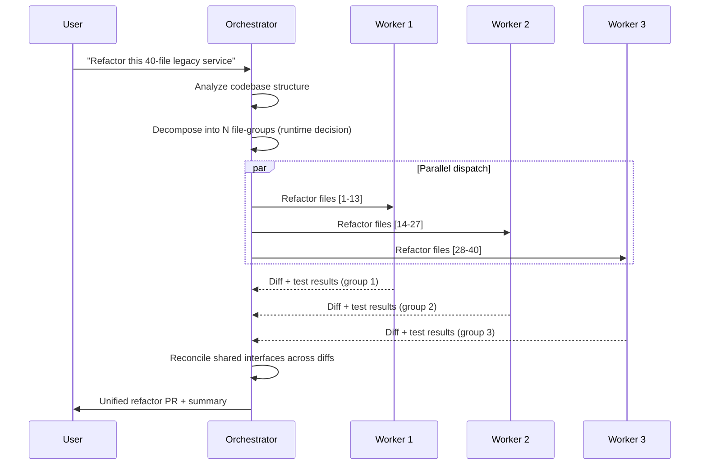
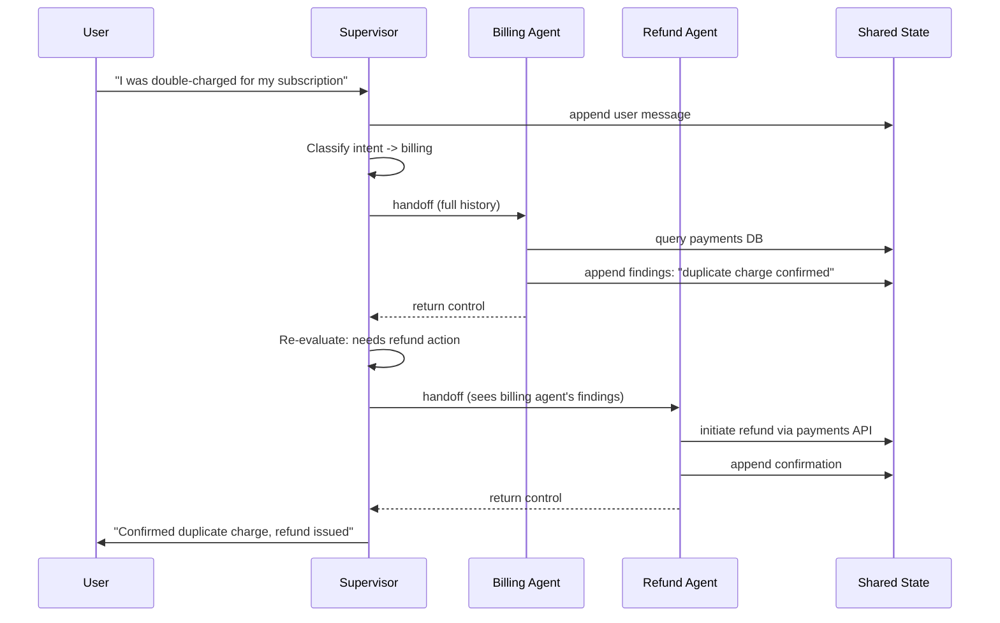
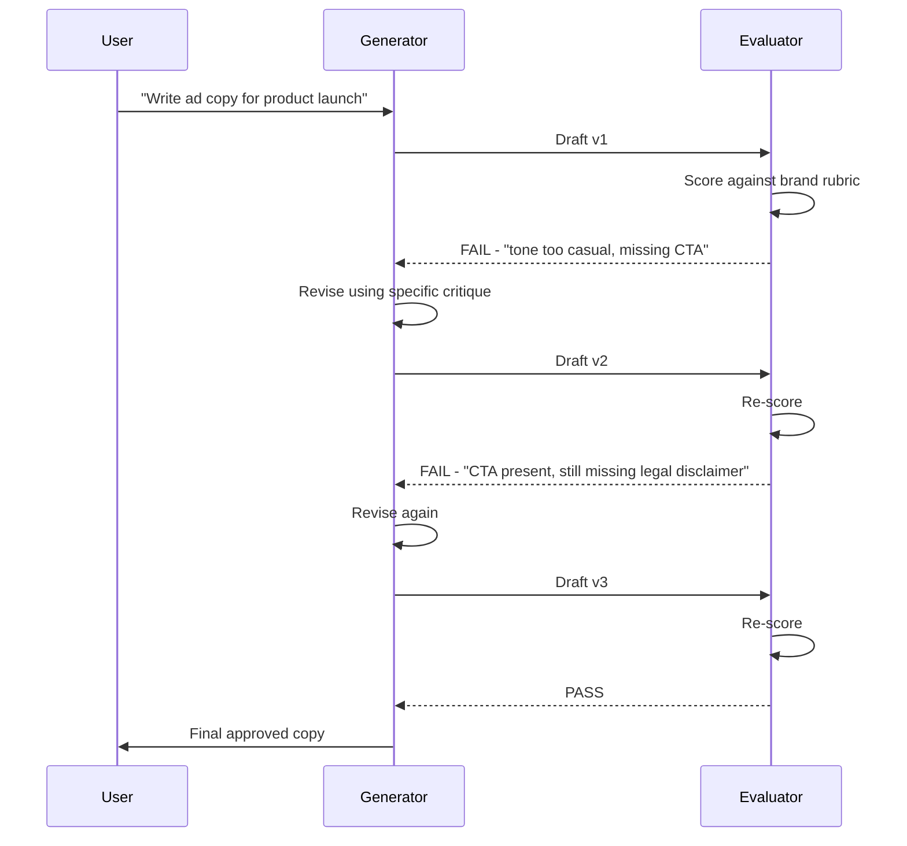

# Multi-Agent Coordination Patterns: Execution Flow & Real-World Use Cases

This document walks through the three core multi-agent coordination patterns — **Orchestrator-Workers**, **Multi-Agent Supervisor**, and **Evaluator-Optimizer** — with a step-by-step internal execution trace and a concrete production use case for each.

---

## 1. Orchestrator-Workers Pattern

### Overview

A single orchestrator agent inspects the incoming task, decides **at runtime** how many subtasks it needs and what each one is, dispatches them to generic worker agents (often in parallel), and synthesizes the results. Workers have no persistent identity — they're spun up, given a narrow task, and discarded.

### Step-by-Step Execution Flow

1. **Task ingestion** — Orchestrator receives the raw user request as a single string/object.
2. **Task analysis** — Orchestrator LLM call reasons about the task's structure: what needs to happen, and whether it decomposes into independent parts.
3. **Dynamic decomposition** — Orchestrator emits a structured plan: a list of subtasks, each with its own scoped instructions and inputs. The *number* of subtasks is decided here, not hardcoded.
4. **Worker dispatch** — Each subtask is sent to a worker agent instance. This can be:
   - **Parallel** — all workers fire simultaneously (independent subtasks)
   - **Sequential** — workers run one after another (subtask N depends on N-1's output)
5. **Isolated execution** — Each worker receives *only* its own task-scoped payload — not the full conversation history, not other workers' outputs. It runs its own reasoning/tool-use loop independently.
6. **Result collection** — Orchestrator waits for all dispatched workers to return (in the parallel case) or for the chain to complete (sequential case).
7. **Aggregation / synthesis** — Orchestrator LLM call merges the worker outputs into one coherent final response — resolving conflicts, deduplicating, and reconciling formatting.
8. **Quality gate (optional)** — Orchestrator may re-check the merged output against the original task before returning it; if incomplete, it can re-dispatch additional workers for the gaps.
9. **Final response** — Synthesized output returned to the user/caller.

### Internal Working — Sequence Diagram

### Real-Time Use Case: Enterprise Codebase Migration Assistant

**Scenario:** An engineering team asks an AI system: *"Migrate our 40-file Java payment module to Kotlin, preserving all existing test coverage."*

**Internal walkthrough:**

1. The **orchestrator** receives the request and first runs a static analysis pass — walking the file tree, identifying module boundaries, and mapping which files depend on which.
2. Rather than migrating file-by-file in a fixed loop, the orchestrator makes a *judgment call at runtime*: it groups the 40 files into 3 clusters based on dependency locality (e.g., "core domain models," "payment gateway adapters," "test fixtures"). This grouping is not predetermined — a different codebase shape would produce a different number of clusters.
3. It dispatches **3 worker agents in parallel**, each given only its cluster's files, the target Kotlin idioms style guide, and nothing about the other clusters.
4. Each worker independently runs its own ReAct loop: read file → propose Kotlin translation → run compiler check tool → fix errors → run unit tests → return diff.
5. Because workers don't share context, Worker 1 doesn't know Worker 2 renamed a shared interface — so after collection, the **orchestrator runs a reconciliation pass**: it detects the interface signature mismatch between cluster 1 and cluster 2's outputs and issues a *targeted follow-up task* to Worker 2 alone to fix just that mismatch.
6. Once reconciled, the orchestrator assembles a single pull request with a synthesized summary: files changed, test pass rate, and flagged manual-review items.
7. **Why this pattern fits:** the number of logical migration clusters can't be known until the orchestrator actually inspects the repo — a fixed pipeline (prompt chaining) would either over- or under-decompose the work.

---

## 2. Multi-Agent Supervisor Pattern

### Overview

Multiple **specialist agents** exist with fixed roles decided at design time (a billing agent, a technical agent, a refund agent). A supervisor agent's job is purely to **route** — decide which specialist should handle the current turn — not to invent new task structure. All agents typically read and write to one shared state/message history.

### Step-by-Step Execution Flow

1. **Input received** — Supervisor gets the incoming message (appended to shared state).
2. **Intent classification** — Supervisor LLM call reasons: *"which specialist domain does this belong to?"*
3. **Routing decision** — Supervisor emits a structured routing decision (e.g., `route: "billing_agent"`).
4. **Handoff** — Control (and the shared state, including full message history so far) passes to the selected specialist agent.
5. **Specialist execution** — The specialist agent runs its own tool-calling loop using its domain-specific tools (e.g., billing agent queries the payments DB).
6. **State update** — Specialist appends its response/actions to the shared state (not a private log — visible to the supervisor and any agent that reads state next).
7. **Return to supervisor** — Control returns to the supervisor, which checks: is the task complete, or does it need another specialist (e.g., billing issue turns out to require a refund)?
8. **Re-routing (if needed)** — Supervisor may hand off again to a second specialist, which now sees the first specialist's prior turn in the shared history.
9. **Termination check** — Supervisor decides the conversation/task is resolved and returns the final response to the user.

### Internal Working — Sequence Diagram

### Real-Time Use Case: Customer Support Ticket Resolution

**Scenario:** A SaaS company's support inbox routes incoming customer messages through an AI system with three specialist agents: **Billing Agent**, **Technical Agent**, and **Refund Agent**.

**Internal walkthrough:**

1. A customer message arrives: *"I was charged twice this month and now my dashboard won't load."* This is appended as the first entry in shared state.
2. The **supervisor** reasons that this message actually contains *two* distinct issues — a billing issue and a technical issue — and decides to handle them in sequence, billing first.
3. Supervisor routes to the **Billing Agent**, handing off the full shared state. The Billing Agent has tools scoped only to the payments system (query transactions, check subscription status) — it cannot touch the ticketing system or push code fixes.
4. Billing Agent queries the payment ledger, confirms a duplicate charge, and **appends its finding directly into the shared message state** — it doesn't return a private summary to the supervisor; the raw finding becomes part of the visible history.
5. Control returns to the supervisor, which re-reads the (now updated) shared state and decides: *"billing confirmed a refund is owed — route to Refund Agent next."*
6. The **Refund Agent** — a different specialist with refund-API tool access — reads the same shared state (including the billing agent's finding, which it never independently re-derives) and issues the refund, appending a confirmation.
7. Supervisor now sees both the billing finding and refund confirmation in state, and separately routes the *dashboard won't load* portion to the **Technical Agent**, which has log-query tools instead of payment tools.
8. Once both specialist threads resolve, the supervisor composes one unified customer-facing reply covering both issues.
9. **Why this pattern fits:** the three domains (billing, refunds, technical support) are known in advance and benefit from being deeply specialized with distinct, restricted tool access — a dynamic orchestrator would have no advantage here since the roles never change shape.

---

## 3. Evaluator-Optimizer Pattern

### Overview

One agent (the **generator**) produces a candidate solution. A second agent (the **evaluator**) critiques it against explicit criteria. If it fails, the generator revises using the evaluator's feedback — looping until the evaluator approves or a max-iteration cap is hit.

### Step-by-Step Execution Flow

1. **Initial generation** — Generator agent produces a first-draft output from the task brief.
2. **Evaluation** — Evaluator agent receives the draft (and the original criteria/rubric) and scores it, producing structured feedback: pass/fail plus specific issues.
3. **Branch check** — If evaluator returns **pass**, skip to step 6. If **fail**, continue to step 4.
4. **Feedback-conditioned regeneration** — Generator receives its own previous draft *plus* the evaluator's specific critique, and produces a revised draft targeting exactly those issues (not a blind rewrite).
5. **Loop** — Return to step 2 with the new draft. Repeat until pass or iteration cap reached.
6. **Finalization** — The passing draft (or the best-scoring draft if the cap was hit) is returned as the final output, often with the evaluator's approval rationale attached.

### Internal Working — Sequence Diagram

### Real-Time Use Case: Brand-Compliant Marketing Copy Generation

**Scenario:** A marketing team asks the system to generate a product launch announcement that must comply with a strict brand voice guide and legal disclaimer requirements.

**Internal walkthrough:**

1. The **generator agent** receives the brief ("announce our new pricing tier") and produces a first draft — punchy, casual copy with a strong hook.
2. The **evaluator agent** — which holds the brand rubric (tone rules, required disclaimer text, banned superlatives like "best-in-class") as its system context — scores the draft. It finds two violations: the tone is too casual for the "confident but measured" brand voice, and there's no call-to-action.
3. Critically, the evaluator's feedback is **specific and structured**, not just "fail" — it returns exact line references and the rule violated, e.g. `{issue: "opening line uses exclamation + slang", rule: "brand-voice-3.2"}`.
4. The **generator receives its own draft plus this structured critique** and produces v2 — it doesn't start over from the brief; it does a targeted revision addressing only the flagged lines.
5. The evaluator re-scores v2: tone now passes, CTA is present, but it catches a *new* issue — the required legal disclaimer for pricing changes is missing entirely.
6. Generator revises again (v3), this time inserting the disclaimer boilerplate while preserving the now-approved tone and CTA.
7. Evaluator scores v3 and returns **pass** — copy is released.
8. **Why this pattern fits:** the task has an objective, checkable rubric (brand rules, legal requirements) that a second reasoning pass can verify better than the generator can self-check in one shot — separating "produce" from "judge" catches issues a single agent tends to miss when scoring its own work.

---

## Cross-Pattern Comparison Summary

| Dimension | Orchestrator-Workers | Multi-Agent Supervisor | Evaluator-Optimizer |
|---|---|---|---|
| Number of roles | 1 orchestrator + N generic workers | Fixed N specialists + 1 router | 2 fixed roles (generator, evaluator) |
| Decomposition timing | Runtime, dynamic | Design-time, fixed | N/A — single task, iterative refinement |
| Shared history | No (task-scoped only) | Yes (shared state) | Partial (generator sees own history + critique) |
| Loop structure | Fan-out / fan-in, usually once | Route → act → re-route, event-driven | Fixed generate → evaluate → revise cycle |
| Best fit | Unpredictable task shape/size | Known domains needing deep specialization | Objective, checkable quality criteria exist |

---

*Reference: see the accompanying `multi_agent_coordination_patterns.html` for an interactive version with expandable sections.*
