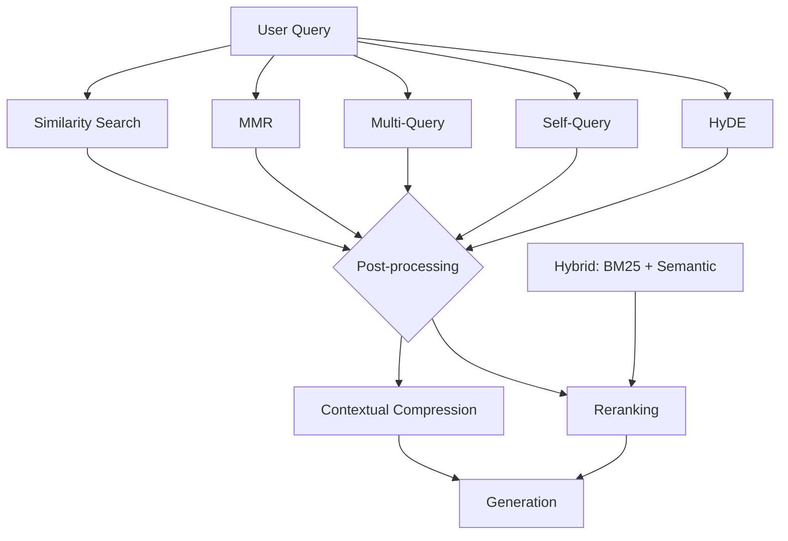

# RAG Retrieval Strategies: A Practical Tutorial

A retriever is the component that decides *what context the LLM sees*. Everything downstream — accuracy, cost, latency, hallucination rate — is bounded by how good that context is. This tutorial walks through nine retrieval strategies, from naive top-k search to reranked hybrid pipelines, with runnable LangChain code for each.

All examples assume:

```python
from dotenv import load_dotenv
load_dotenv()

from langchain_openai import OpenAIEmbeddings, ChatOpenAI
from langchain_chroma import Chroma
from langchain_core.documents import Document

embeddings = OpenAIEmbeddings(model="text-embedding-3-small")
llm = ChatOpenAI(model="gpt-4o-mini", temperature=0)
```

---

## Overview: Which Strategy, When

| Strategy | Solves | Cost | Complexity |
|---|---|---|---|
| Similarity Search | Baseline retrieval | 1 embed call | Trivial |
| MMR | Redundant/near-duplicate chunks | 1 embed call | Trivial |
| Multi-Query | Vocabulary mismatch, low recall | +N LLM calls | Low |
| Self-Query | "Filter by date/author/type" queries | +1 LLM call | Medium |
| Contextual Compression | Context window bloat, noisy chunks | +1 LLM call per doc | Medium |
| Hybrid (BM25 + Semantic) | Exact keyword/code/ID matches | Cheap (no LLM) | Medium |
| Parent-Document | Small-chunk precision vs. large-chunk context | 1 embed call | Medium |
| HyDE | Sparse/short queries, domain jargon gap | +1 LLM call | Low |
| Reranking (Cross-Encoder) | Imprecise top-k ordering | +1 local/API call | Medium |



---

## 1. Basic Similarity Search

**What it is:** Embed the query, run a nearest-neighbor (cosine/dot-product) search against the vector store, return the top-k chunks. This is the default retriever every LangChain vector store exposes.

**When to use it:** Baseline for any RAG system. Start here before reaching for anything fancier — most complexity below is justified only once you've measured this isn't good enough.

**Limitation:** Returns the k *most similar* chunks, which are often near-duplicates of each other (e.g., five chunks all restating the same fact), wasting context budget.

```python
vectorstore = Chroma.from_documents(docs, embedding=embeddings)

retriever = vectorstore.as_retriever(search_kwargs={"k": 4})
results = retriever.invoke("What is LangGraph used for?")

for doc in results:
    print(doc.page_content[:150])
```

---

## 2. Maximal Marginal Relevance (MMR)

**What it is:** Retrieves a larger candidate pool (`fetch_k`), then greedily selects `k` results that balance **relevance to the query** against **diversity from already-selected results**. Controlled by `lambda_mult` (1.0 = pure relevance, 0.0 = pure diversity).

**When to use it:** Your corpus has redundant or overlapping content (e.g., multiple versions of similar docs, or chunking with heavy overlap) and top-k similarity keeps returning near-duplicates.

```python
retriever = vectorstore.as_retriever(
    search_type="mmr",
    search_kwargs={
        "k": 4,           # final results returned
        "fetch_k": 20,    # candidate pool before diversity filtering
        "lambda_mult": 0.5,  # 0 = max diversity, 1 = max relevance
    },
)

results = retriever.invoke("What frameworks exist for building LLM applications?")
```

---

## 3. Multi-Query Retrieval

**What it is:** An LLM rewrites the user's query into several phrasings (different vocabulary, different angles), each is searched independently, and the unique union of results is returned.

**When to use it:** Recall problems caused by vocabulary mismatch — the user's phrasing doesn't match the embedding space of the source documents (common with jargon-heavy technical corpora).

```python
from langchain.retrievers.multi_query import MultiQueryRetriever
import logging

# See the generated query variations in the logs
logging.getLogger("langchain.retrievers.multi_query").setLevel(logging.INFO)

base_retriever = vectorstore.as_retriever(search_kwargs={"k": 3})

multi_query_retriever = MultiQueryRetriever.from_llm(
    retriever=base_retriever,
    llm=llm,
)

docs = multi_query_retriever.invoke("How do I persist embeddings?")
print(f"Retrieved {len(docs)} unique documents across all query variations")
```

**Tradeoff:** One extra LLM call to generate variations, plus N searches instead of 1. Higher recall, higher latency and cost.

---

## 4. Self-Query Retrieval

**What it is:** An LLM parses the natural-language query into a **structured filter** (metadata constraints) plus a **semantic search string**, using a schema you define over your document metadata. E.g., "papers by Vaswani after 2019 about attention" becomes `filter: author=="Vaswani" AND year>2019` + semantic query `"attention"`.

**When to use it:** Your documents carry rich metadata (author, date, category, source type) and users naturally ask questions that mix semantic intent with hard filters.

```python
from langchain.chains.query_constructor.schema import AttributeInfo
from langchain.retrievers.self_query.base import SelfQueryRetriever

metadata_field_info = [
    AttributeInfo(name="source", description="The document source file", type="string"),
    AttributeInfo(name="year", description="Year the document was published", type="integer"),
    AttributeInfo(name="topic", description="Primary topic: 'rag', 'agents', or 'langgraph'", type="string"),
]

document_content_description = "Technical notes on LLM application frameworks"

self_query_retriever = SelfQueryRetriever.from_llm(
    llm=llm,
    vectorstore=vectorstore,
    document_contents=document_content_description,
    metadata_field_info=metadata_field_info,
)

# The LLM infers: filter topic == "langgraph", semantic query "state management"
docs = self_query_retriever.invoke("Find langgraph docs about state management")
```

---

## 5. Contextual Compression

**What it is:** Wraps a base retriever. After retrieval, an LLM (or lightweight extractor) strips each returned chunk down to only the sentences relevant to the query, discarding the rest.

**When to use it:** Chunks are long and only a fraction of each is actually relevant — compression reduces prompt size and cuts noise the generator has to reason around.

```python
from langchain.retrievers import ContextualCompressionRetriever
from langchain.retrievers.document_compressors import LLMChainExtractor

base_retriever = vectorstore.as_retriever(search_kwargs={"k": 4})
compressor = LLMChainExtractor.from_llm(llm)

compression_retriever = ContextualCompressionRetriever(
    base_compressor=compressor,
    base_retriever=base_retriever,
)

docs = compression_retriever.invoke("What database stores embeddings?")
for doc in docs:
    print(f"({len(doc.page_content)} chars) {doc.page_content}")
```

**Tradeoff:** One LLM call *per retrieved document* — this is the most expensive strategy on this list per-query. Reserve it for cases where prompt-size reduction genuinely improves answer quality, not as a default.

---

## 6. Hybrid Search (BM25 + Semantic / Ensemble)

**What it is:** Combines a sparse **keyword** retriever (BM25 — exact term matching, good for IDs, acronyms, code symbols) with a **dense** semantic retriever, merging ranked results via `EnsembleRetriever` using Reciprocal Rank Fusion.

**When to use it:** Your queries mix natural language with exact-match needs — product codes, error messages, function names, SQL keywords — that embeddings alone tend to miss or under-rank.

```python
from langchain_community.retrievers import BM25Retriever
from langchain.retrievers import EnsembleRetriever

bm25_retriever = BM25Retriever.from_documents(docs)
bm25_retriever.k = 3

semantic_retriever = vectorstore.as_retriever(search_kwargs={"k": 3})

ensemble_retriever = EnsembleRetriever(
    retrievers=[bm25_retriever, semantic_retriever],
    weights=[0.4, 0.6],  # keyword weight, semantic weight
)

# Keyword-heavy query: BM25 will surface this reliably
docs = ensemble_retriever.invoke("ACID transactions PostgreSQL")
```

**Note:** This is the pattern Databricks Vector Search's hybrid mode and most production search stacks (Elasticsearch + dense vectors) implement natively — worth knowing whether your platform already does this fusion for you before hand-rolling it.

---

## 7. Parent-Document Retriever

**What it is:** Indexes **small child chunks** for precise similarity matching, but returns the **larger parent chunk** (or full document) they belong to at query time — decoupling "what's searched" from "what's returned."

**When to use it:** Small chunks retrieve more precisely (less semantic dilution per chunk) but lack enough context for the LLM to answer well; large chunks have the opposite problem. This strategy gets both.

```python
from langchain.retrievers import ParentDocumentRetriever
from langchain.storage import InMemoryStore
from langchain_text_splitters import RecursiveCharacterTextSplitter

parent_splitter = RecursiveCharacterTextSplitter(chunk_size=800, chunk_overlap=100)
child_splitter = RecursiveCharacterTextSplitter(chunk_size=200, chunk_overlap=20)

parent_store = InMemoryStore()
vectorstore = Chroma(collection_name="parent_child", embedding_function=embeddings)

parent_doc_retriever = ParentDocumentRetriever(
    vectorstore=vectorstore,       # indexes the small child chunks
    docstore=parent_store,          # stores the full parent chunks
    child_splitter=child_splitter,
    parent_splitter=parent_splitter,
)

parent_doc_retriever.add_documents([long_document])

# Search matches a precise child chunk, but returns its parent
docs = parent_doc_retriever.invoke("What is LangGraph used for?")
print(f"Returned parent chunk: {len(docs[0].page_content)} chars")
```

---

## 8. HyDE (Hypothetical Document Embeddings)

**What it is:** Instead of embedding the user's (often short, underspecified) query directly, an LLM first generates a **hypothetical answer** to the question. That hypothetical answer — written in the same style/vocabulary as your corpus — is embedded and used for the similarity search.

**When to use it:** Short or vague queries that don't share vocabulary with your documents (a two-word query embeds poorly against dense technical paragraphs; a fabricated "ideal answer" embeds much closer to real matching content).

```python
from langchain_core.prompts import ChatPromptTemplate
from langchain_core.output_parsers import StrOutputParser

hyde_prompt = ChatPromptTemplate.from_template(
    "Write a short, plausible passage that would answer this question:\n{question}"
)

hyde_chain = hyde_prompt | llm | StrOutputParser()

def hyde_retrieve(question: str, k: int = 4):
    hypothetical_doc = hyde_chain.invoke({"question": question})
    # Embed the hypothetical answer, not the raw question
    return vectorstore.similarity_search(hypothetical_doc, k=k)

docs = hyde_retrieve("state management in graphs")
```

**Tradeoff:** One extra LLM call before retrieval even starts. Works best when your corpus is dense, technical prose (the hallucinated "answer" resembles real chunks) — less useful over structured/tabular data.

---

## 9. Reranking (Cross-Encoder)

**What it is:** A two-stage pipeline. Stage 1 (bi-encoder / vector search) casts a wide net cheaply (`k=20-50`). Stage 2 runs a **cross-encoder** — a model that scores the (query, document) pair *jointly* rather than comparing pre-computed embeddings — over that candidate set, and reorders by the more accurate joint score. Only the reranked top-k is passed to the LLM.

**When to use it:** Your bi-encoder recall is fine (the right chunk is in the top 20-50) but precision at low k is poor (the right chunk isn't in the top 3-5 by raw cosine similarity). Reranking is the standard fix in production search and RAG systems.

```python
from langchain.retrievers import ContextualCompressionRetriever
from langchain.retrievers.document_compressors import CrossEncoderReranker
from langchain_community.cross_encoders import HuggingFaceCrossEncoder

cross_encoder = HuggingFaceCrossEncoder(model_name="BAAI/bge-reranker-base")
reranker = CrossEncoderReranker(model=cross_encoder, top_n=3)

# Cast a wide net first
wide_retriever = vectorstore.as_retriever(search_kwargs={"k": 20})

reranking_retriever = ContextualCompressionRetriever(
    base_compressor=reranker,
    base_retriever=wide_retriever,
)

docs = reranking_retriever.invoke("How does contextual compression differ from reranking?")
```

---

## Putting It Together: A Production-Style Composite Retriever

Real systems rarely use one strategy in isolation. A common, battle-tested pipeline: **hybrid retrieval → generous candidate pool → cross-encoder rerank → compression**.

```python
from langchain_community.retrievers import BM25Retriever
from langchain.retrievers import EnsembleRetriever, ContextualCompressionRetriever
from langchain.retrievers.document_compressors import CrossEncoderReranker
from langchain_community.cross_encoders import HuggingFaceCrossEncoder

# Stage 1: hybrid recall (semantic + keyword), wide net
bm25 = BM25Retriever.from_documents(docs)
bm25.k = 10
semantic = vectorstore.as_retriever(search_kwargs={"k": 10})
hybrid = EnsembleRetriever(retrievers=[bm25, semantic], weights=[0.3, 0.7])

# Stage 2: cross-encoder rerank down to the best few
cross_encoder = HuggingFaceCrossEncoder(model_name="BAAI/bge-reranker-base")
reranker = CrossEncoderReranker(model=cross_encoder, top_n=5)

production_retriever = ContextualCompressionRetriever(
    base_compressor=reranker,
    base_retriever=hybrid,
)

docs = production_retriever.invoke("What is the tradeoff between orchestrator-workers and supervisor patterns?")
```

---

## Choosing a Strategy: Decision Checklist

- **Start with similarity search.** Measure recall/precision before adding anything.
- **Redundant chunks?** → Add MMR (near-zero cost).
- **Low recall on paraphrased questions?** → Multi-Query.
- **Users filter by metadata (date, author, category)?** → Self-Query.
- **Right chunk retrieved but ranked low?** → Reranking.
- **Mix of exact-match and semantic queries?** → Hybrid (BM25 + semantic).
- **Chunks too small for context / too large for precision?** → Parent-Document.
- **Short, vague queries against dense technical prose?** → HyDE.
- **Chunks are long with lots of irrelevant filler?** → Contextual Compression.
- **Production system, budget allows it?** → Compose hybrid + rerank as your default; add compression only if prompt size is still a problem.

For evaluating whether a change actually helped, pair this with offline evaluation (RAGAS / golden datasets) before pushing any retriever change to production — retrieval strategy changes should be measured, not assumed.
