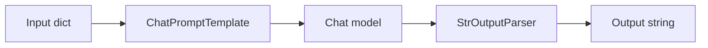
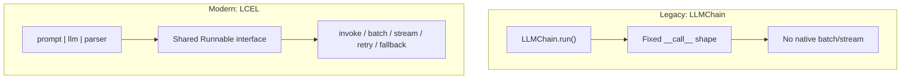
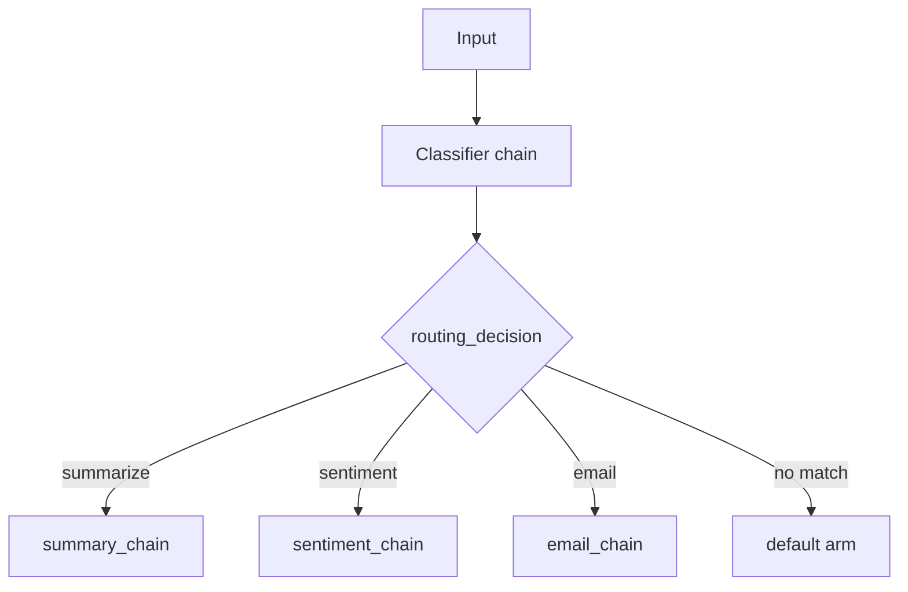
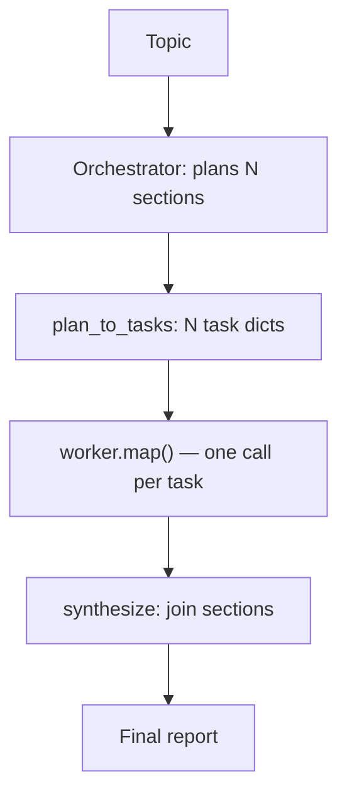
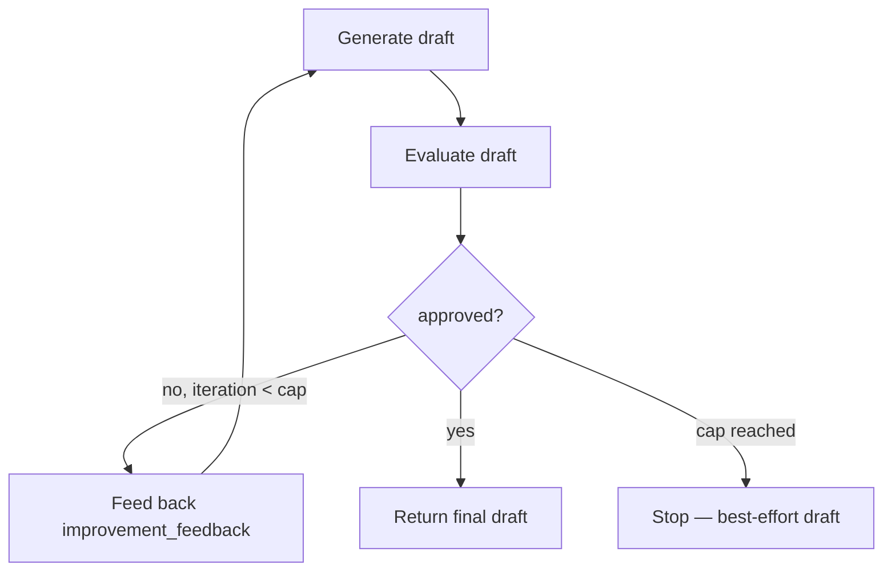
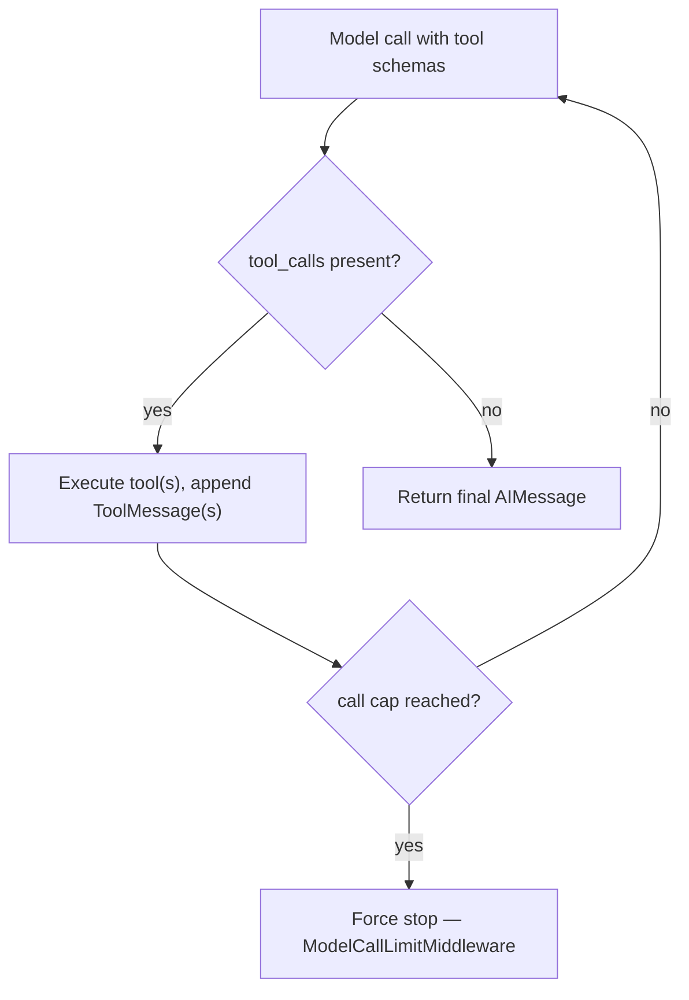
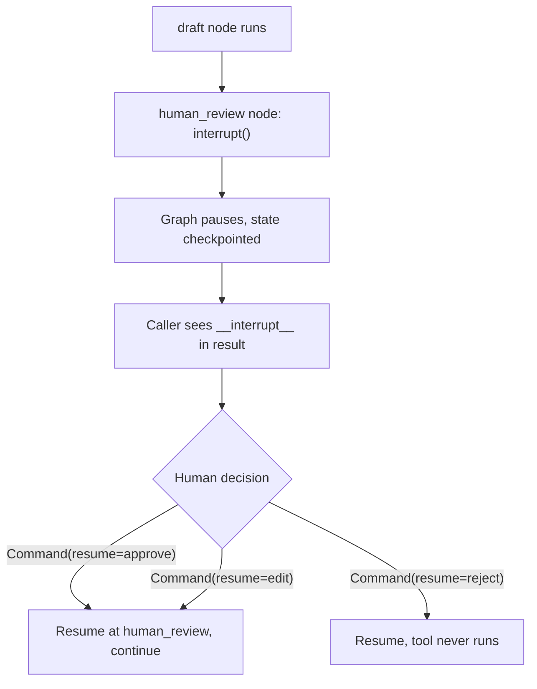

# 🦜 LangChain Fundamentals — Interview Tutorial

|                  |                                                                                                                                                                                                                                                        |
| ---------------- | ------------------------------------------------------------------------------------------------------------------------------------------------------------------------------------------------------------------------------------------------ |
| **Source**       | `01_LangChain_Fundamentals/` — all 8 subfolders: `01_Getting_Started`, `02_Inputs_Outputs_Prompts`, `03_Legacy_Chains`, `04_LCEL`, `05_Summarization`, `06_Workflow_Patterns`, `07_LangChain_1x_Agents_and_Middleware`, `08_Production_Course_Foundations` |
| **Notebooks**    | 46                                                                                                                                                                                                                                                    |
| **Built**        | 2026-09-16                                                                                                                                                                                                                                            |
| **Target roles** | Applied AI / AI Engineer · Agentic AI Engineer · Forward Deployed Engineer                                                                                                                                                                            |
| **Note**         | Expands the prior version of this tutorial (which only covered `08_Production_Course_Foundations`) to the entire LangChain Fundamentals folder. Section 4 is web-sourced live this run. |

## What this covers

| Concept                                                          | Source notebook                                                                 | Interview weight |
| ----------------------------------------------------------------- | -------------------------------------------------------------------------------- | ----------------- |
| Provider-agnostic model initialization (`init_chat_model`)        | `1.2_Commercial_LLMs_with_LangChain.ipynb`, `01_core_concepts.ipynb`, `02_working_with_llms.ipynb` | High |
| The four message types (System/Human/AI/Tool)                     | `7.3_Messages.ipynb`, `03_prompt_messages.ipynb`                                  | High |
| Prompt templates, few-shot & `MessagesPlaceholder`                 | `2.2_Prompt_Templates.ipynb`, `2.4_PromptTemplate_with_LangChain.ipynb`, `04_prompt_templates_all.ipynb` | Medium |
| Output parsing: string/JSON/Pydantic parsers vs. `with_structured_output` | `2.5_Output_Parser.ipynb`, `05_output_parsers_demo.ipynb`, `06_output_parsers_final.ipynb`, `7.4_Structured_Output.ipynb` | High |
| LCEL & the `Runnable` interface (`invoke`/`batch`/`stream`)        | `3.1_LCEL_Introduction.ipynb`, `01_core_concepts.ipynb`, `07_chains_v1.ipynb`      | High |
| Legacy `Chains` → LCEL migration (`LLMChain`, `RetrievalQA`)       | `4.0_Basics_of_Chains.ipynb`, `4.1_Chains_Basics_and_OutputParsers.ipynb`, `3.5_Chain_Migrations.ipynb`, `3.6_Chain_Migration_Advanced.ipynb` | High |
| Branching, routing & merging with `RunnableParallel`/`RunnableBranch` | `3.7_Branching_Routing_Merging_Chains.ipynb`, `6.2_Routing.ipynb`              | High |
| Reliability primitives: `.with_retry()` / `.with_fallbacks()`     | `6.1_Prompt_Chaining.ipynb`                                                       | High |
| Fan-out/fan-in: orchestrator-worker with `.map()`                  | `6.4_Orchestrator_Worker.ipynb`                                                   | High |
| Evaluator-optimizer loops (LCEL loop and agent middleware)         | `6.5_Evaluator_Optimizer.ipynb`                                                   | Medium |
| Summarization: stuff vs. map-reduce                                | `5.0_Summarization_Essentials.ipynb`, `5.1_Doc_Chains_to_LCEL_LangChain_v1.ipynb` | Medium |
| Conversation memory (trimming, windowing, summary, persistent)     | `08_conversation_memory.ipynb`                                                    | High |
| Agents: `create_agent` and the tool-calling loop                   | `7.0_LangChain_First_Agent.ipynb`, `7.2_Tools.ipynb`                              | High |
| Middleware: summarization triggers, PII redaction, call limits, custom hooks | `7.5_Middleware.ipynb`                                                    | High |
| Human-in-the-loop & the `interrupt()` primitive                    | `7.6_LangGraph_Interrupt_Primitive.ipynb`, `7.5_Middleware.ipynb`                 | High |
| Observability with LangSmith                                      | `09_langsmith_setup.ipynb`, `10_smart_bot_section1.ipynb`                         | Medium |

## Coverage gaps

Gaps specific to building production LangChain systems — not the generic 10-topic checklist run against every notebook in this repo:

- **Evaluation** `(not in your notebooks — build this)` — no offline eval set, no recall/precision harness, and no LLM-as-judge anywhere in the folder. Every chain, agent and middleware demo is verified by eyeballing printed output, which is exactly the habit an interviewer will probe.
- **Async execution** `(not in your notebooks — build this)` — `01_core_concepts.ipynb` demonstrates sync `.stream()`, but it's commented out of the `__main__` run, and no notebook in the folder calls `.ainvoke()`, `.astream()` or `.abatch()`. Every chain and agent here is built and exercised synchronously, which is the wrong shape for a concurrent production server.
- **Multi-agent coordination** `(not in your notebooks — build this)` — every agent in `07_LangChain_1x_Agents_and_Middleware` is a single `create_agent` with tools; nothing here has two agents delegating to each other or a supervisor pattern.

---

## 1. Core concepts

### 1.1 Provider-agnostic model initialization

Hardcoding `ChatOpenAI(...)` couples your code to one vendor's class. `init_chat_model()` takes a `"provider:model"` string and returns the same `Runnable` interface regardless of vendor.

- **How it works**: pass a model string once; swapping providers means changing that string, not your chain's imports or downstream code.
- **Code** (`01_core_concepts.ipynb`):
  ```python
  from langchain.chat_models import init_chat_model

  llm_openai = init_chat_model("gpt-4o-mini", model_provider="openai")
  llm_claude = init_chat_model("claude-sonnet-4-5", model_provider="anthropic")
  # Both expose the same .invoke()/.batch()/.stream() Runnable interface
  ```
- **Say this in an interview**: "I initialize models through `init_chat_model` so a provider outage or a pricing change is a one-line config swap, not a refactor across every chain that touches an LLM."

---

### 1.2 Messages — the unit of context

Every LLM call is ultimately a list of typed messages, not a single string. LangChain's four message classes map directly to the roles a chat API actually accepts.

- **How it works**: `SystemMessage` sets behavior, `HumanMessage` is user input, `AIMessage` is model output (and carries `tool_calls`), `ToolMessage` carries a tool's result back keyed to the call that requested it.
- **Code** (`7.3_Messages.ipynb`):
  ```python
  from langchain.messages import AIMessage, HumanMessage, SystemMessage, ToolMessage

  messages = [
      SystemMessage("You are a concise support agent."),
      HumanMessage("What's the weather in Boston?"),
      AIMessage(content="", tool_calls=[{"name": "get_weather", "args": {"city": "Boston"}, "id": "call_1"}]),
      ToolMessage(content="Sunny, 68F", tool_call_id="call_1"),
  ]
  ```
- **Say this in an interview**: "An agent's entire state is just this growing message list — that's why `AIMessage.tool_calls` and `ToolMessage.tool_call_id` have to line up, or the next model call can't resolve what a tool result answers."

---

### 1.3 Prompt templates, few-shot prompting & message placeholders

A prompt template turns a Python dict of variables into a formatted list of messages, so prompts are versioned code, not string concatenation.

- **How it works**: `ChatPromptTemplate.from_messages([...])` accepts `(role, template)` tuples; `FewShotChatMessagePromptTemplate` injects example Q/A pairs before the real question; `MessagesPlaceholder` reserves a slot for a variable-length list (like chat history) inside an otherwise fixed template.
- **Code** (`04_prompt_templates_all.ipynb`):
  ```python
  from langchain_core.prompts import ChatPromptTemplate, MessagesPlaceholder

  prompt = ChatPromptTemplate.from_messages([
      ("system", "You are a helpful assistant."),
      MessagesPlaceholder("chat_history"),
      ("human", "{question}"),
  ])
  prompt.invoke({"chat_history": [], "question": "What is LCEL?"})
  ```
- **Say this in an interview**: "`MessagesPlaceholder` is what lets a fixed template accept a variable-length conversation history — without it you're manually splicing message lists into a string template."

---

### 1.4 Parsing model output: parsers vs. `with_structured_output`

Free text needs re-parsing before code can trust it; schema-constrained output skips the parsing step entirely.

- **How it works**: `StrOutputParser`/`JsonOutputParser`/`PydanticOutputParser` extract structure from a text response after the fact; `with_structured_output(Schema)` instead constrains the model's own decoding (via tool-calling or JSON mode under the hood) so the return value is already a validated Pydantic object.
- **Code** (`06_output_parsers_final.ipynb`):
  ```python
  from pydantic import BaseModel, Field

  class Movie(BaseModel):
      title: str = Field(description="Movie title")
      year: int = Field(description="Release year")

  structured_llm = llm.with_structured_output(Movie)
  structured_llm.invoke("Extract: Inception came out in 2010")  # -> Movie(title=..., year=2010)
  ```
- **Say this in an interview**: "`PydanticOutputParser` still asks the model to *emit* valid JSON and validates after the fact — a malformed response is a parse-time failure. `with_structured_output` constrains generation itself, so the failure mode shrinks to 'the schema doesn't fit the answer,' not 'the model forgot to close a brace.'"

---

### 1.5 LCEL and the `Runnable` interface

LCEL (LangChain Expression Language) composes a prompt, a model and a parser into one object with the `|` pipe operator. Every piece — and the composite — implements the same `Runnable` interface.

- **How it works**: `|` wires the left side's output into the right side's input; the resulting chain exposes `.invoke()` (one input), `.batch()` (concurrent list), `.stream()` (token-by-token), and schema introspection, regardless of what's piped together.
- **Code** (`3.1_LCEL_Introduction.ipynb`):
  ```python
  from langchain_core.prompts import ChatPromptTemplate
  from langchain_core.output_parsers import StrOutputParser

  chain = ChatPromptTemplate.from_template("Explain {topic} in 1 line") | chatgpt | StrOutputParser()
  chain.invoke({"topic": "Generative AI"})
  ```
- **Say this in an interview**: "LCEL's value isn't the `|` syntax, it's that every link in the chain shares one interface — so `.batch()`, `.stream()`, retries and fallbacks all work on the composite without special-casing what's inside it."



---

### 1.6 From legacy `Chains` to LCEL

Pre-1.x LangChain expressed pipelines as chain *classes* (`LLMChain`, `SimpleSequentialChain`, `RetrievalQA`); LCEL replaces the class hierarchy with composition.

- **How it works**: `LLMChain(llm=llm, prompt=prompt).run(...)` becomes `(prompt | llm | parser).invoke(...)` — same behavior, but now a `Runnable` you can batch, stream and compose further; `RetrievalQA` becomes an explicit LCEL pipe with the retriever wired in as one of the steps.
- **Code** (`3.5_Chain_Migrations.ipynb`):
  ```python
  # Legacy
  from langchain_classic.chains.llm import LLMChain
  legacy_chain = LLMChain(llm=ChatOpenAI(model="gpt-4o-mini"), prompt=prompt)
  legacy_chain({"adjective": "funny"})

  # Modern LCEL — same behavior, now a composable Runnable
  chain = prompt | ChatOpenAI(model="gpt-4o-mini") | StrOutputParser()
  chain.invoke({"adjective": "funny"})
  ```
- **Say this in an interview**: "A legacy `Chain` subclass hid its steps behind a fixed `.run()`/`__call__` signature. LCEL makes the same steps visible objects you can batch, stream, retry, or insert a branch into — the migration is mechanical once you see each `Chain` as 'prompt, then model, then maybe a parser.'"



---

### 1.7 Branching, routing & merging chains

Real pipelines aren't always linear — some steps run in parallel, some pick one of several paths, and results get merged back together.

- **How it works**: `RunnableParallel` (or a plain dict) runs multiple chains concurrently on the same input and returns a dict of their outputs; `RunnableBranch` evaluates `(condition, runnable)` pairs in order and runs the first match; `RunnablePassthrough.assign(...)` carries the original input forward while adding a new key.
- **Code** (`3.7_Branching_Routing_Merging_Chains.ipynb`):
  ```python
  from langchain_core.runnables import RunnableParallel, RunnableBranch, RunnablePassthrough

  branch_chain = RunnableParallel(topic=itemgetter("topic"), pros=pro_chain, cons=con_chain)
  router = RunnableBranch(
      (lambda x: x["kind"] == "summarize", summary_chain),
      (lambda x: x["kind"] == "sentiment", sentiment_chain),
      email_chain,  # default — required
  )
  ```
- **Say this in an interview**: "`RunnableBranch` needs an explicit default arm — there's no implicit `else` — and it evaluates conditions in order, so ordering the most specific check first matters exactly like an `if/elif` chain."



---

### 1.8 Reliability: retries and fallbacks in LCEL

A chain call can fail transiently (rate limit) or fail a business rule (bad output) — LCEL has one mechanism for both.

- **How it works**: `.with_retry(retry_if_exception_type=..., stop_after_attempt=N)` re-invokes the whole wrapped chain on a matching exception; `.with_fallbacks([...])` runs an alternate `Runnable` only after retries are exhausted, so a hard failure degrades gracefully instead of raising.
- **Code** (`6.1_Prompt_Chaining.ipynb`):
  ```python
  safe_extract = (
      RunnablePassthrough.assign(key_points=RunnableLambda(extract_with_logging))
      | RunnableLambda(validate_key_points)          # raises KeyPointsRejected on a bad extraction
  ).with_retry(
      retry_if_exception_type=(KeyPointsRejected,),
      stop_after_attempt=3,
      wait_exponential_jitter=False,                 # no backoff — the gate isn't rate-limited
  ).with_fallbacks([RunnableLambda(fail_validation)], exceptions_to_handle=(KeyPointsRejected,))
  ```
- **Say this in an interview**: "I use a custom exception as the retry signal, not a bare `except`, so `.with_retry()` only re-runs on the failure mode I actually expect — a quality gate rejecting vague output — and falls back to a terminal 'we stopped' result instead of silently returning a weak draft."

<details>
<summary>🔍 Deep Dive: what actually gets re-run on a retry</summary>

`.with_retry()` wraps the *entire* runnable it's called on, not just the failing sub-step — every cell before the raise re-executes too.

- In the notebook's example, `extract_with_logging` appends to an `attempts` log on every call — so a retry means the log (and any printed side effect, or a real API call to another service) runs again, not just the validation check.
- `stop_after_attempt=3` counts the *first* attempt as attempt 1, so this raises after 3 total tries, not 3 retries beyond the first.
- `wait_exponential_jitter` defaults to `True` in `.with_retry()` — the notebook turns it off deliberately because the failure here is a business-logic rejection, not rate-limiting; leaving jitter on for a non-rate-limit failure just adds latency with no benefit.
- The interview trap: candidates assume retry re-runs "the failing part." If a step upstream of the raise has a side effect (writes to a DB, sends a webhook), a naive retry duplicates that side effect on every attempt unless the step is made idempotent first.
</details>

---

### 1.9 Fan-out/fan-in: orchestrator-worker with `.map()`

Some tasks need a variable number of parallel sub-tasks decided at runtime — a fixed pipeline can't express that, but a plan-then-map pattern can.

- **How it works**: an "orchestrator" chain (with structured output) decides how many sub-tasks exist; a "worker" chain runs once per sub-task via `.map()`, which invokes the same `Runnable` concurrently over a list; results are joined by a synthesis step.
- **Code** (`6.4_Orchestrator_Worker.ipynb`):
  ```python
  class Section(BaseModel):
      name: str
      description: str

  class ReportPlan(BaseModel):
      sections: list[Section]

  orchestrator = prompt | llm.with_structured_output(ReportPlan)
  worker = RunnableLambda(write_section)          # writes exactly one section

  report_chain = (
      RunnableLambda(lambda p: {"topic": p["topic"], "plan": orchestrator.invoke(p)})
      | RunnableLambda(plan_to_tasks)              # plan -> list[dict], one per worker
      | worker.map()                               # fan out
      | RunnableLambda(synthesize)                 # fan in
  )
  ```
- **Say this in an interview**: "The orchestrator's job is only to decide *how many* workers and *what each one covers* — the fan-out itself is `.map()`, because a fixed `RunnableParallel` can't handle a plan whose length isn't known until runtime."



<details>
<summary>🔍 Deep Dive: why `.map()` and not `RunnableBranch`</summary>

The same notebook runs a negative example first, on purpose: a 5-section plan piped into a `RunnableBranch` that checks `len(plan) > 3` and picks one of two lambdas.

- Output: `"RunnableBranch result: big-report branch ran ONCE"` — the branch ran a single time, producing one string, not five section writes.
- The mechanism: `RunnableBranch` picks *one* runnable to execute once per invocation, no matter what that runnable's input looks like — it is a routing primitive, not a fan-out primitive.
- `.map()` is the fix because it turns any `Runnable` into one that accepts a *list* and invokes itself once per element, concurrently — the correct primitive when the branch count is data, not a fixed set of named cases.
- Interview framing: "routing" (pick 1 of N known paths) and "fan-out" (run N-of-unknown-size copies of the same path) look similar but need different LCEL primitives — conflating them is the exact mistake this notebook stages as a negative example.
</details>

---

### 1.10 Evaluator-optimizer loops

Some outputs improve by critiquing and refining, not by better prompting alone — the evaluator-optimizer pattern automates that loop.

- **How it works**: a generator chain produces a draft; an evaluator chain (structured output: approved/needs-improvement + feedback) grades it; if not approved, the feedback is fed back into the generator and it retries, up to a hard iteration cap.
- **Code** (`6.5_Evaluator_Optimizer.ipynb`):
  ```python
  MAX_ITERATIONS = 5
  feedback = None
  for iteration in range(1, MAX_ITERATIONS + 1):
      draft = generator.invoke({"topic": topic, "feedback_block": feedback_block(feedback)})
      verdict = evaluator.invoke({"joke": draft})
      if verdict.quality_grade == "approved":
          break
      feedback = verdict.improvement_feedback
  ```
- **Say this in an interview**: "The same loop can live as a plain Python `for` loop over LCEL calls, or as agent middleware — `@after_model` that jumps back to the model node via `can_jump_to=["model"]` — capped either way by a hard iteration limit, never by hoping the model decides it's done."



---

### 1.11 Summarization: stuff vs. map-reduce

Summarizing text longer than the model's context window needs a different strategy than summarizing text that fits in one call.

- **How it works**: "stuff" concatenates everything into one prompt and summarizes once — simplest, but breaks once the text exceeds the context window; "map-reduce" splits the text into chunks, summarizes each chunk independently (the map, run via `.batch()`), then summarizes the summaries (the reduce).
- **Code** (`5.0_Summarization_Essentials.ipynb`):
  ```python
  from langchain_text_splitters import RecursiveCharacterTextSplitter

  chunks = RecursiveCharacterTextSplitter(chunk_size=100, chunk_overlap=20).split_text(input_text)
  summarization_chain = prompt | llm | StrOutputParser()

  chunk_summaries = summarization_chain.batch([{"text": c} for c in chunks])  # map
  final = summarization_chain.invoke({"text": " ".join(chunk_summaries)})     # reduce
  ```
- **Say this in an interview**: "Map-reduce is what you reach for once the source text doesn't fit one context window — the map step's `.batch()` call is what makes per-chunk summarization concurrent instead of a sequential loop."

---

### 1.12 Conversation memory strategies

An LLM has no memory between calls — every strategy for "remembering" a conversation is really about what gets re-sent as input on the next call.

- **How it works**: `RunnableWithMessageHistory` wires a chain to a per-session message store; **trimming** (`trim_messages`) drops oldest messages once a token budget is hit; **windowing** keeps only the last *k* exchange pairs; **summary memory** periodically replaces old turns with a running LLM-written summary; `SQLChatMessageHistory` persists messages past process restart, unlike `InMemoryChatMessageHistory`.
- **Code** (`08_conversation_memory.ipynb`):
  ```python
  class WindowedChatHistory(InMemoryChatMessageHistory):
      k: int = 3
      def add_messages(self, messages):
          super().add_messages(messages)
          if len(self.messages) > self.k * 2:
              self.messages = self.messages[-(self.k * 2):]   # keep last k pairs
  ```
- **Say this in an interview**: "Windowing is cheap and predictable but forgets abruptly at the boundary; a running summary costs an extra LLM call per trim but degrades gracefully — I pick windowing for short-lived sessions and summary memory for anything that needs to recall something from 50 turns ago."

---

### 1.13 Agents: `create_agent` and the tool-calling loop

An agent is a model given tools and let loop: call a tool, read the result, decide whether to call another or answer.

- **How it works**: `@tool`-decorated (or plain) functions are bound to the model; the model's `AIMessage.tool_calls` names a function and arguments (model-generated, not string-parsed); the runtime executes it and appends a `ToolMessage`; the loop repeats until the model returns a message with no tool calls.
- **Code** (`7.0_LangChain_First_Agent.ipynb`):
  ```python
  from langchain.agents import create_agent

  def get_weather(city: str) -> str:
      """Get the weather for a city."""
      return f"The weather in {city} is sunny."

  agent = create_agent(model="gpt-4.1", tools=[get_weather], system_prompt="You are a helpful assistant.")
  response = agent.invoke({"messages": [{"role": "user", "content": "Weather in New York?"}]})
  ```
- **Say this in an interview**: "Tool arguments are model-generated JSON, not parsed from text — the notebook demonstrates this with a deliberate typo, 'New Yourk,' that the model still resolves to the right city argument, because the tool schema (not string matching) drives what gets extracted."

<details>
<summary>🔍 Deep Dive: the tool execution loop, step by step</summary>

`create_agent` compiles this into a small graph, but the mechanism is:

1. Model is called with the message history plus the bound tool schemas.
2. If the response `AIMessage` has `tool_calls`, the runtime looks up each named tool, executes it with the model-supplied args, and appends one `ToolMessage` per call (matched by `tool_call_id`).
3. The updated message list — including the new `ToolMessage`s — goes back to the model.
4. Repeat until an `AIMessage` with no `tool_calls` comes back — that's the "done" signal, decided by the model, not a fixed step count.

The interview trap: because termination is model-decided, nothing here stops the loop from running forever on a model that keeps calling tools. That's exactly what `ModelCallLimitMiddleware` (section 1.14) exists to bound externally.


</details>

---

### 1.14 Middleware: controlling the agent loop

Middleware hooks into an agent's graph — before or after each model call — without touching the agent's own logic, which is where cross-cutting production concerns belong.

- **How it works**: `SummarizationMiddleware` compresses history once a `trigger` threshold fires (message count, token count, or context-window fraction), keeping only the most recent `keep` amount verbatim; `HumanInTheLoopMiddleware` pauses before named tools run; `PIIMiddleware` redacts a PII type from input/output; `ModelCallLimitMiddleware` caps calls per run or per thread; custom middleware subclasses `AgentMiddleware` with `before_model`/`after_model` hooks.
- **Code** (`7.5_Middleware.ipynb`):
  ```python
  from langchain.agents.middleware import SummarizationMiddleware, ModelCallLimitMiddleware, PIIMiddleware

  agent = create_agent(
      model="gpt-4o-mini",
      tools=[search_hotels],
      middleware=[
          PIIMiddleware("email", strategy="redact", apply_to_input=True),
          SummarizationMiddleware(model="gpt-4o-mini", trigger=("tokens", 550), keep=("tokens", 200)),
          ModelCallLimitMiddleware(run_limit=5),
      ],
  )
  ```
- **Say this in an interview**: "Middleware is how you add cost, safety and observability controls to an agent without forking `create_agent` — a summarization trigger, a PII redactor and a call cap compose as an ordered list, the same way Express or Django middleware chains."

<details>
<summary>🔍 Deep Dive: the three `SummarizationMiddleware` trigger types</summary>

`trigger` and `keep` both take a `(unit, amount)` tuple, and the unit changes what's actually being measured:

- `("messages", 10)` — fires once the raw message count exceeds 10; simplest but blind to how long each message actually is.
- `("tokens", 550)` — fires on an estimated token count crossing 550; closer to what actually matters for context-window and cost limits, but requires a tokenizer call to estimate.
- `("fraction", 0.005)` — fires once history consumes a fraction of the model's total context window (0.5% of 128k ≈ 640 tokens here); this is the one that actually scales correctly across models with different context sizes without hardcoding a number per model.
- In every mode, the message count *visibly drops* in the notebook's printed output the turn summarization fires — that drop, not an explicit event, is the only signal it happened unless you log around it.
</details>

---

### 1.15 Human-in-the-loop & the `interrupt()` primitive

Some actions are irreversible enough that a human should approve them before the agent's tool actually runs — LangGraph's `interrupt()` is the primitive that pause is built on.

- **How it works**: `interrupt(payload)` pauses the graph mid-run, persists state via a `checkpointer`, and returns control to the caller with `"__interrupt__"` in the result; execution resumes exactly where it paused when the caller calls `.invoke(Command(resume=value), config)` with the same `thread_id`; `HumanInTheLoopMiddleware` is the built-in agent-level wrapper around this for gating specific tool calls (`approve`/`edit`/`reject`).
- **Code** (`7.6_LangGraph_Interrupt_Primitive.ipynb`):
  ```python
  from langgraph.types import interrupt, Command

  def human_review(state):
      decision = interrupt({"question": "Approve this plan?", "draft_plan": state["draft_plan"]})
      return {"approved_plan": decision.get("edited_plan", state["draft_plan"])}

  result = app.invoke({"topic": "..."}, config)          # pauses at human_review
  final = app.invoke(Command(resume={}), config)          # resumes, same thread_id
  ```
- **Say this in an interview**: "`interrupt()` isn't a pause-and-retry-from-scratch — it's a checkpoint. The graph resumes from the exact node that called `interrupt()`, using the same `thread_id`, so nothing before that node re-executes."



<details>
<summary>🔍 Deep Dive: the "never re-run Step 1 on a parked thread" failure mode</summary>

`7.5_Middleware.ipynb` calls this pitfall out explicitly, and it's a named interview trap:

- A `thread_id`-scoped checkpoint holds exactly one pending interrupt at a time.
- Re-running the cell that *sent the original request* (not the resume cell) on the same `config`/`thread_id` starts a second, independent run against a thread that already has a paused one — the tool-call approval/edit/reject you send afterward can resolve the wrong pending decision, or the run can silently re-attempt the same side-effecting tool call.
- The fix demonstrated in the notebook: mint a fresh `thread_id` per test scenario (`new_thread("approve")`, `new_thread("reject")`, `new_thread("edit")`) rather than reusing one thread across independent test runs.
- Interview framing: "how do you make sure a resumed agent doesn't re-execute a side effect" is really two questions — idempotent tools, *and* not accidentally starting a second run on a thread that already has one paused.
</details>

---

### 1.16 Observability with LangSmith

You can't debug or improve what you can't see — LangSmith traces every LCEL/agent run automatically once enabled, and lets you attach metadata for filtering later.

- **How it works**: setting `LANGSMITH_TRACING=true` (plus an API key) in the environment auto-traces every `Runnable` invocation; `RunTree` and `.with_config(run_name=..., tags=[...], metadata={...})` let you name and tag individual runs for later filtering in the UI.
- **Code** (`09_langsmith_setup.ipynb`):
  ```python
  chain = prompt | llm | StrOutputParser()
  chain.invoke(
      {"topic": "LangSmith"},
      config={"run_name": "demo_named_run", "tags": ["tutorial"], "metadata": {"user_id": "abc123"}},
  )
  ```
- **Say this in an interview**: "Tracing is opt-in via environment variables, not a code change to the chain itself — that's what makes it safe to turn on in production without touching business logic, and tags/metadata are what make a trace searchable instead of just a wall of spans."

---

## 2. Gotchas

**`RunnableBranch` runs one branch once — it is not a fan-out primitive**
- **Symptom**: `"RunnableBranch result: big-report branch ran ONCE"` — a 5-item plan produces one string, not five outputs.
- **Cause**: `RunnableBranch` evaluates its conditions against the whole input and executes exactly one matched runnable a single time, regardless of the input's internal shape.
- **Fix**: use `.map()` on the runnable that should run once per item, driven by a list built from the variable-length plan.
- **Interview angle**: "Your orchestrator's plan has a variable number of steps — how do you run one worker per step?"

**`.map()` aborts the entire batch on one item's exception**
- **Symptom**: `flaky.map().invoke([0, 1, 2])` raises `ZeroDivisionError` and the two successful results (`"ok-0"`, `"ok-2"`) are lost entirely.
- **Cause**: `.map()` propagates the first exception it hits instead of collecting partial results.
- **Fix**: use `.batch(inputs, return_exceptions=True)` when a partial fan-out result is acceptable — it returns the exception object in place of a failed item's result instead of raising.
- **Interview angle**: "One worker in your fan-out fails — what happens to the other nine?"

**`create_agent` returns a compiled graph, not an object with a `.middleware` attribute**
- **Symptom**: there is no way to inspect `agent.middleware` after construction — it doesn't exist.
- **Cause**: `create_agent(...)` returns a compiled LangGraph `Runnable`, and the middleware list was consumed at compile time to build graph nodes.
- **Fix**: inspect the compiled structure instead — `agent.get_graph().nodes` — to see what's actually wired in.
- **Interview angle**: "How would you verify which middleware is actually active on a deployed agent?"

**A bare agent object as a cell's last line silently makes a network call**
- **Symptom**: Jupyter's rich `_repr_mimebundle_` on a `create_agent` result calls `.get_graph().draw_mermaid_png()`, which POSTs the graph structure to a public mermaid-rendering service to get a PNG back.
- **Cause**: LangGraph's default rich repr for a compiled graph renders itself as a diagram image by default, and that renderer is remote, not local.
- **Fix**: never end a notebook cell with a bare agent variable in an environment where an unexpected outbound call is unacceptable — call `print(agent.get_graph().nodes)` or `.draw_mermaid()` (text, no network) instead.
- **Interview angle**: "Why would displaying an agent object in a notebook ever be a compliance concern?"

**Resuming an interrupted agent by re-running the original request cell, not the resume cell**
- **Symptom**: a tool-call approval/edit/reject sent after re-running the "send the request" cell resolves against the wrong pending interrupt, or the side-effecting tool appears to run twice.
- **Cause**: a `thread_id` holds one pending interrupt at a time; re-invoking the *original* request on the same thread starts a second run rather than resuming the parked one.
- **Fix**: resume only via `agent.invoke(Command(resume=...), config)` on the same `thread_id` that produced the interrupt; use a fresh `thread_id` per independent test/run.
- **Interview angle**: "How do you guarantee a paused agent doesn't re-execute a side effect on resume?"

**`.with_retry()` re-runs the whole wrapped chain, not just the failing step**
- **Symptom**: an attempt-logging side effect (a counter, a print, an upstream API call) fires again on every retry, not only the validation step that actually raised.
- **Cause**: `.with_retry()` wraps and re-invokes the composite `Runnable` it's called on from its start, so anything upstream of the raise re-executes too.
- **Fix**: make any step with a side effect idempotent before wrapping the composite in `.with_retry()`, or scope the retry to only the step that can actually fail.
- **Interview angle**: "Your retry logic is duplicating a side effect on every attempt — why, and how do you fix it without disabling retries?"

**`PIIMiddleware` does nothing to the model's input unless `apply_to_input=True` is passed explicitly**
- **Symptom**: PII in the user's message reaches the model unredacted even with `PIIMiddleware("email", strategy="redact")` configured, because the flag defaults off.
- **Cause**: the middleware's redaction target (input vs. output vs. both) is an explicit, non-default argument, not implied by adding the middleware at all.
- **Fix**: pass `apply_to_input=True` (and/or the output-side equivalent) explicitly for every PII type that needs redaction on that side of the call.
- **Interview angle**: "You added PII redaction middleware and PII still shows up in your traces — what did you miss?"

**`ModelCallLimitMiddleware`'s `run_limit` caps one invocation, not the whole conversation thread**
- **Symptom**: an agent that looped past its expected call count within a single `.invoke()` call was capped correctly, but the same agent still ran unbounded total calls across many turns on the same thread.
- **Cause**: `run_limit` and `thread_limit` are two independent caps — one per `.invoke()` call, one cumulative across a `thread_id`'s history — and only setting the first leaves the second unbounded.
- **Fix**: set `thread_limit` alongside `run_limit` whenever the agent runs multiple turns on a persisted thread.
- **Interview angle**: "Your agent's per-call cap looks right, but the customer racked up an unexpectedly large bill on one long conversation — why?"

---

## 3. Tradeoffs

### Legacy `Chain` classes vs. LCEL composition
| Option | Costs you | Buys you | Pick when |
|---|---|---|---|
| Legacy `Chain` (`LLMChain`, `RetrievalQA`) | No native `.batch()`/`.stream()`; frozen `.run()`/`__call__` API; in maintenance mode | Familiar OOP shape, minimal code for a simple one-off | You're reading, not writing, LangChain 0.x code |
| LCEL pipe (`prompt \| llm \| parser`) | More primitives to learn (`Runnable`, `RunnableLambda`, etc.) | `.batch()`, `.stream()`, retries, fallbacks, composability for free | Any new code, and any migration off legacy chains |

**The one-liner**: "Legacy chains are a fixed-shape wrapper; LCEL is composition, so it's the only one that scales to branching, batching and retries without a rewrite."

### Structured output: parser vs. `with_structured_output`
| Option | Costs you | Buys you | Pick when |
|---|---|---|---|
| `PydanticOutputParser` / `JsonOutputParser` | Model can emit invalid JSON; parse failure is a separate error path | Works with any model, even ones without native structured-output support | Provider has no tool-calling/JSON-mode support, or you need a raw-text fallback |
| `with_structured_output(Schema)` | Requires provider support (tool-calling or JSON mode); schema must be expressible in that mode | Generation itself is constrained — fewer malformed-output failures | The provider supports it (most do) and you're extracting a fixed shape |

**The one-liner**: "Parse-after-the-fact and constrain-during-generation solve the same problem at different layers — constrain when you can, parse when the provider forces you to."

### Windowed vs. summary vs. trimmed conversation memory
| Option | Costs you | Buys you | Pick when |
|---|---|---|---|
| Windowed (last *k* pairs) | Forgets everything before the window abruptly | Zero extra LLM cost, fully predictable size | Short-lived sessions where old context genuinely stops mattering |
| Trimmed by token budget | Same abrupt loss, just token-precise instead of turn-precise | Guarantees you stay under a hard context limit | You need a hard token ceiling, not just a turn count |
| Summary memory | One extra LLM call per compression | Degrades gracefully — old context becomes a lossy summary, not silence | Long-running sessions where something from 50 turns back may matter |

**The one-liner**: "Windowing and trimming forget a cliff at a time; summarization forgets a little of everything — pick the second whenever a stale fact costs more than a stale summary."

### `init_chat_model` vs. a direct provider class (`ChatOpenAI`, `ChatAnthropic`)
| Option | Costs you | Buys you | Pick when |
|---|---|---|---|
| Direct provider class | Switching providers means touching every import and constructor call | Full access to provider-specific constructor kwargs | You depend on a provider-specific feature the generic wrapper doesn't expose |
| `init_chat_model("provider:model")` | One more layer of indirection to learn | Provider swap is a config string, not a code change | Multi-provider fallback, cost/latency experiments, or general production code |

**The one-liner**: "`init_chat_model` is the difference between a provider outage being a config change or a deploy."

### `RunnableBranch` routing vs. a dict lookup table
| Option | Costs you | Buys you | Pick when |
|---|---|---|---|
| `RunnableBranch` | Verbose for many routes; conditions evaluated in order | Reads like an `if/elif` chain; easy to reason about precedence | Few routes (2-4), or precedence between overlapping conditions matters |
| Dict lookup (`ROUTES.get(key, default)` inside a `RunnableLambda`) | Loses the explicit ordering semantics of `RunnableBranch` | Scales to many routes without a long conditional chain | Many mutually-exclusive routes keyed by one exact classifier value |

**The one-liner**: "Both dispatch on the same classifier output — `RunnableBranch` is for a short list of possibly-overlapping conditions, a dict is for a long list of exact keys."

### Human-in-the-loop gating vs. fully autonomous tool execution
| Option | Costs you | Buys you | Pick when |
|---|---|---|---|
| Autonomous (no `interrupt()`) | Any bad tool call executes immediately, no chance to catch it first | Lower latency, no human bottleneck | The tool is read-only or its side effect is cheaply reversible |
| `HumanInTheLoopMiddleware` / `interrupt()` | Adds a pause, a checkpointer requirement, and a human in the latency path | A human catches a wrong or unauthorized action before it happens | The tool is irreversible (sends money, an email, deletes data) |

**The one-liner**: "Gate the tools you can't undo, not the ones you can — a checkpointed pause is a cost you should pay selectively, not on every tool call."

### Stuff vs. map-reduce summarization
| Option | Costs you | Buys you | Pick when |
|---|---|---|---|
| Stuff (single pass) | Breaks once source text exceeds the context window | One LLM call, simplest to reason about and debug | The source reliably fits in one context window |
| Map-reduce | One call per chunk (map) plus one more (reduce); can lose cross-chunk context | Scales to arbitrarily long input | Source length is unbounded or already exceeds the window |

**The one-liner**: "Reach for map-reduce only once stuffing actually breaks — it's strictly more calls and more places for context to fall through the cracks between chunks."

### Message-count vs. token-count vs. context-fraction summarization triggers
| Option | Costs you | Buys you | Pick when |
|---|---|---|---|
| Message count | Blind to message length — 10 one-word messages trigger the same as 10 huge ones | Cheapest check, no tokenizer call | Message sizes in your app are roughly uniform |
| Token count | Requires a token-estimate pass every turn | Ties the trigger to actual cost/context pressure | You need a specific, model-independent token ceiling |
| Context fraction | Same tokenizer cost as token count, plus needs the model's context size | Portable across models with different context windows without a hardcoded number | You swap models or serve multiple models behind one agent |

**The one-liner**: "Fraction-based triggers are the only one of the three that doesn't need re-tuning every time you change the underlying model."

---

## 4. Top 10 interview questions: real-time agentic system design

1. **Your LangChain agent's response feels laggy in a chat UI even though the model itself is fast — what's the fix?**
   Switch from `.invoke()` to `.stream()` (or `.astream()` in an async server) so tokens render as they're generated instead of after the full response completes — this cuts *perceived* latency even when total generation time is unchanged. LangChain's `Runnable.stream()` is exposed on every LCEL chain and every agent built with `create_agent`, so no special chain shape is required. The real fix is UX-level: buffer partial tokens client-side and start rendering before the final token arrives. — [Streaming — Docs by LangChain](https://docs.langchain.com/oss/python/langchain/streaming)

2. **When do you reach for `.ainvoke()`/`.astream()` over the sync API in a production LangChain service?**
   Any server handling concurrent requests — a FastAPI endpoint, a chat backend with many simultaneous users — needs the async variants, because the sync API blocks the event loop for the full duration of each LLM call. `.abatch()` and `.astream()` let one process serve many in-flight requests without spinning up a thread per request. The notebooks in this repo never call the async API, which is exactly the gap a production interviewer will probe. — [.stream() vs .invoke() vs .astream() — The Neural Base](https://theneuralbase.com/langchain-advanced/learn/beginner/stream-vs-invoke-vs-astream/)

3. **Your agent occasionally loops through tool calls far longer than expected — how do you bound it in production?**
   Set `ModelCallLimitMiddleware(run_limit=N, thread_limit=M)` so the loop terminates on a hard call count regardless of what the model decides, with `exit_behavior` controlling whether it ends cleanly or raises. This is external to the model — you cannot rely on the model to decide it's "done" reliably, because termination is a probabilistic judgment call, not a guarantee. Log the call count per run so a spike is visible before it becomes a cost incident. — [LangChain Interview Questions: Real Production Probes — Interview Baba](https://interviewbaba.com/langchain-interview-questions/)

4. **You need a human to approve an agent's action before it sends an email or moves money — how do you wire that in without losing the run's state?**
   Use `HumanInTheLoopMiddleware` (or the underlying `interrupt()` primitive) with a `checkpointer` — the graph pauses at the gated tool call, persists full state, and resumes exactly there on `Command(resume=...)` once a human decides `approve`/`edit`/`reject`. Without a checkpointer, a pause has nothing to resume *from* — the state would be lost on process restart. The interview trap is forgetting that the resume must target the same `thread_id`, or the decision resolves against the wrong pending interrupt. — [Human-in-the-loop — Docs by LangChain](https://docs.langchain.com/oss/python/langchain/human-in-the-loop)

5. **A transient rate-limit error occasionally breaks your production chain — what's your retry strategy?**
   Wrap the chain with `.with_retry(retry_if_exception_type=(RateLimitError,), stop_after_attempt=3, wait_exponential_jitter=True)` so only the expected transient failure triggers a retry, with backoff and jitter to avoid a thundering herd against the provider. Pair it with `.with_fallbacks([...])` to degrade to a cheaper model or a cached answer once retries are exhausted, rather than surfacing a raw exception to the user. Scope the retry-eligible exception type narrowly — retrying a validation error the same way as a network error just wastes latency on a failure that will never succeed. — [Top LangChain Interview Questions — DataCamp](https://www.datacamp.com/blog/langchain-interview-questions)

6. **A long-running conversational agent's context window keeps filling up — how do you keep it production-safe?**
   Attach `SummarizationMiddleware` with a `("fraction", x)` trigger so summarization scales with the model's actual context window instead of a hardcoded token or message count, keeping the most recent turns verbatim via `keep`. This bounds both the per-call token cost and the risk of a context-window overflow error mid-conversation. The visible signal it fired is simply that the message count in the returned state drops on that turn — there's no separate event to subscribe to unless you log around it yourself. — [LangChain Interview Questions — Interview Baba](https://interviewbaba.com/langchain-interview-questions/)

7. **When is a multi-agent system actually the wrong call for a "real-time" production requirement?**
   Multi-agent coordination adds inter-agent messaging latency and failure surface — a single agent with well-scoped tools is almost always faster and easier to debug for the same task, and multi-agent should be reserved for genuinely independent sub-problems that benefit from separate context windows or separate tool sets. If message-passing overhead between agents exceeds the savings from specialization, you've added latency and cost for no capability gain. This repo's agent notebooks are all single-agent — a strong candidate says so and explains why that's the right default, not a gap. — [7 Agentic AI & Multi-Agent System Interview Questions](https://callsphere.ai/blog/agentic-ai-multi-agent-interview-questions-2026)

8. **Your chain that worked fine under `.invoke()` in dev times out under concurrent load in prod — diagnosis?**
   Check first whether the deployment is calling the sync API from a request-handling thread pool sized too small for the concurrency, and second whether `.batch()` (which runs concurrently, bounded by `max_concurrency`) is even being used where multiple independent inputs exist. A single synchronous `.invoke()` per request serializes on I/O-bound LLM latency, so throughput caps at (thread pool size ÷ per-call latency) — a number that looks fine in a dev demo and collapses under real concurrent traffic. The fix is almost always async endpoints plus explicit concurrency limits, not a faster model. — [LangChain Software Engineer Interview Guide — Exponent](https://www.tryexponent.com/guides/langchain-software-engineer-interview-guide)

9. **How do you resume an agent's human-review step correctly after a pod restart mid-approval?**
   The `checkpointer` backing `interrupt()`/`HumanInTheLoopMiddleware` must be a persistent backend (Postgres, Redis) in production, not `InMemorySaver` — an in-memory checkpoint is lost the moment the process restarts, stranding the paused thread with no way to resume. On restart, a new process pointed at the same persistent checkpointer and the same `thread_id` can accept the deferred `Command(resume=...)` exactly as if the original process were still running. This is the production-hardening step every notebook in this repo skips by using `InMemorySaver()` for demos. — [Agents Work. Now the Hard Part: Notes from LangChain Interrupt 2026 — 8th Light](https://8thlight.com/insights/production-is-the-new-prototype-notes-from-langchain-interrupt-2026)

10. **How do you decouple a production agent from one model provider so an outage or price change isn't a fire drill?**
    Initialize models through `init_chat_model("provider:model")` (or an equivalent factory) everywhere instead of instantiating `ChatOpenAI`/`ChatAnthropic` directly, so a provider swap is a config value, not a refactor across every call site. Layer `.with_fallbacks([alternate_provider_chain])` on critical paths so a provider outage degrades to a secondary provider automatically rather than failing every request. The interview signal is whether the candidate treats the model as a swappable dependency from day one, not something to abstract only after the first outage. — [Top LangChain Interview Questions and Answers — DataCamp](https://www.datacamp.com/blog/langchain-interview-questions)

---

## 5. Role tracks

### 5.1 Applied AI / AI Engineer

**What they probe**: whether your prompts, parsers and chains produce reliably good, measurable output — not just output that looked fine once.

1. `with_structured_output` vs. `PydanticOutputParser` — when would you still reach for the parser? *(Provider lacks native structured-output/tool-calling support, or you need the raw text kept alongside the parsed object.)*
2. Your JSON parser throws on a real production response — what do you check first? *(Whether the model actually supports structured decoding for this schema shape, before assuming a prompting fix.)*
3. How do you decide chunk size for map-reduce summarization? *(Big enough to hold coherent context, small enough that per-chunk summaries stay cheap and parallelizable via `.batch()`.)*
4. Windowed memory vs. summary memory — which loses information more gracefully? *(Summary memory — it degrades to a lossy summary instead of a hard cutoff.)*
5. How do you know your prompt template change actually improved output? *(An eval set with a fixed rubric or reference answers — not re-reading a handful of outputs.)*
6. When would you skip `init_chat_model` and instantiate a provider class directly? *(You need a provider-specific constructor kwarg the generic wrapper doesn't expose.)*
7. Your `.with_retry()`'d chain keeps a side effect firing multiple times — diagnose it. *(Retry re-runs the whole wrapped chain, not just the failing step; the side effect sits upstream of the raise.)*
8. What's the actual cost driver in a map-reduce summarization pipeline? *(Number of chunks × per-chunk call, not the reduce step, which runs once.)*

**Take-home task**:
- Build a small structured-extraction pipeline over 10 sample documents using `with_structured_output`, with a fallback `PydanticOutputParser` path for one provider that lacks structured-output support.
- Report how many of the 10 required the fallback path and why.

### 5.2 Agentic AI Engineer

**What they probe**: whether your agent's loop terminates on purpose, fails safely, and can be resumed without re-running side effects.

1. What stops `create_agent`'s tool-calling loop from running forever? *(`ModelCallLimitMiddleware` — `run_limit` per invocation, `thread_limit` per thread — set externally, not left to the model.)*
2. Design the resume path for a `send_email` tool gated by `HumanInTheLoopMiddleware`. *(`Command(resume={"decisions": [{"type": "approve"/"edit"/"reject"}]})` on the same `thread_id` the interrupt paused on.)*
3. One worker in a `.map()` fan-out throws — what happens to the other nine? *(All nine results are lost too — `.map()` propagates the first exception; use `.batch(return_exceptions=True)` if partial success is acceptable.)*
4. When is `RunnableBranch` the wrong tool for a variable-length plan? *(Always — it picks one branch once; a plan of unknown length needs `.map()`.)*
5. Your `PIIMiddleware` is configured but PII still reaches the model — what did you miss? *(`apply_to_input=True` isn't the default; the redaction target must be set explicitly.)*
6. What checkpointer requirement does `interrupt()` impose in production? *(A persistent backend, not `InMemorySaver` — the pause must survive a process restart.)*
7. Design the termination condition for an evaluator-optimizer loop. *(A hard `MAX_ITERATIONS` cap alongside the approval condition — never approval alone.)* `(Not in your notebooks as a standalone eval harness — build the grading rubric itself.)`
8. Why is displaying a raw agent object in a notebook a production concern? *(Its default rich repr can trigger `draw_mermaid_png()`, an outbound network call to render a diagram.)*

**Take-home task**:
- Take the orchestrator-worker pattern and add a hard cap on total workers spawned per run, with a structured error (not a raised exception) when the cap is hit.
- Add a custom `AgentMiddleware` that logs latency per model call, matching the shape of `TimingLoggerMiddleware`.

### 5.3 Forward Deployed Engineer (FDE)

**What they probe**: whether you can stand a LangChain agent up inside a specific customer's constraints, fast, and keep it alive under their real traffic.

1. Customer wants an agent that emails their customers — where do you insist on a human gate, and where do you not? *(Gate the send; a read-only lookup tool needs no gate.)*
2. Their agent works in your demo, loops forever on their real support tickets — first thing you check? *(Whether a call-limit middleware is even attached — demos rarely need one, production always does.)*
3. Customer's compliance team won't allow an in-memory checkpoint for a human-approval workflow — what do you propose? *(A persistent checkpointer — Postgres/Redis-backed — so an approval pause survives infrastructure restarts.)*
4. They ask why their LangChain agent feels "slow" compared to their old chatbot. *(Probably synchronous `.invoke()` calls under real concurrency, or no streaming — walk through both before touching the model.)*
5. Customer wants a second LLM provider as a fallback for outages — smallest change that gets this? *(`init_chat_model` already in place, plus `.with_fallbacks([alt_chain])` on the critical path.)*
6. Their support queue has messages in 4 languages — sketch this with what's in the notebooks. *(A detect-then-translate-then-respond-then-translate-back LCEL pipeline, chained via `RunnablePassthrough.assign`, matching `3.7`'s multilingual example.)*
7. Explain the cost of their agent's summarization middleware to a non-engineer. *(An extra LLM call fires only when the conversation gets long enough to need compressing — not on every turn.)*
8. Walk me through a LangChain deployment that went badly. *(No fixed answer — a strong candidate volunteers the retry-duplicates-a-side-effect or the parked-thread interrupt gotcha as a real incident shape.)*

**Take-home task**:
- Given "customer needs human approval on any outbound message, must survive a restart mid-approval, and wants provider fallback for an outage," sketch the architecture: checkpointer backend, middleware stack, and where `.with_fallbacks()` sits.
- Present it as a one-page design doc a non-engineer stakeholder could sign off on.

---

## 6. Mock system design: real-time multilingual support-ticket triage agent

**The prompt**: "Design a support system that reads an incoming ticket in any language, classifies its intent, drafts a resolution, and translates the resolution back — at a p95 latency under 3 seconds, safe to run unattended for routine tickets but requiring a human to approve any ticket that looks like a refund or account-closure request."

**A scoring rubric**:
- [ ] Chooses LCEL composition (not legacy `Chain` classes) and explains why: batching, streaming, retries all come free
- [ ] Names the pipeline stages explicitly: detect language → classify intent → route → draft/translate
- [ ] Uses `RunnableBranch` or a dict-lookup for intent routing, with a required default arm
- [ ] Gates the risky intents (refund, account-closure) with `interrupt()`/`HumanInTheLoopMiddleware`, backed by a persistent checkpointer
- [ ] Bounds retries with `.with_retry()` on the LLM-calling steps and a `.with_fallbacks()` path for a provider outage
- [ ] Breaks the 3s latency budget down by stage and explains where streaming helps perceived latency
- [ ] Names how ticket volume spikes are handled (`.batch()` with `max_concurrency`, or async endpoints)
- [ ] Says what happens on a classification the router doesn't recognize — no silent drop

**A worked strong answer**:
- Pipeline: `detect_language_chain | RunnablePassthrough.assign(intent=classifier_chain) | RunnableBranch(...)`, each step an LCEL pipe of `prompt | llm | StrOutputParser()`, matching the pattern in `3.7_Branching_Routing_Merging_Chains.ipynb`.
- Router: `RunnableBranch` with named intents (`refund`, `account_closure`, `general`) plus a required default `general` arm — never let an unrecognized classification fall through silently.
- Gate: refund/closure branches call a `human_review` node that calls `interrupt()`, checkpointed on Postgres (not `InMemorySaver`) so a pending approval survives a pod restart; resume via `Command(resume={"decisions": [...]})` on the ticket's `thread_id`.
- Reliability: `.with_retry(retry_if_exception_type=(RateLimitError,), stop_after_attempt=3)` on every LLM-calling step, `.with_fallbacks([secondary_provider_chain])` on the classifier (the step that must never hard-fail a ticket into limbo).
- Latency budget for p95 ≤ 3s: ~200ms language detection, ~300ms classification, ~1.5s draft generation (dominant cost — stream it to cut perceived latency), ~500ms back-translation, leaving headroom for the router's negligible overhead.
- Scale: process incoming tickets through `.batch()` with an explicit `max_concurrency` cap sized to the LLM provider's rate limit, or move to an async FastAPI endpoint calling `.ainvoke()` per ticket under real concurrent load.
- Observability: LangSmith tracing on, tagged per ticket with `metadata={"ticket_id": ..., "intent": ...}`, so a bad triage can be traced back to the exact classification step that caused it.

---

## 7. Self-check

**15 rapid-fire Q → A**

1. Q: What does `init_chat_model` buy you over `ChatOpenAI(...)`? A: Swapping providers is a config string, not a code change.
2. Q: What are the four LangChain message types? A: `SystemMessage`, `HumanMessage`, `AIMessage`, `ToolMessage`.
3. Q: What replaced `LLMChain` in LangChain 1.x? A: An LCEL pipe — `prompt | llm | parser`.
4. Q: Why doesn't `RunnableBranch` work for a variable-length plan? A: It runs exactly one matched branch once, regardless of the input's internal shape.
5. Q: What LCEL primitive turns a runnable into one that fans out over a list? A: `.map()`.
6. Q: What happens to the other results when `.map()` hits one exception? A: All are lost — the whole call raises.
7. Q: What does `.with_retry()` actually re-run on failure? A: The entire wrapped runnable, not just the step that raised.
8. Q: What's the difference between "stuff" and "map-reduce" summarization? A: Stuff does one pass over everything; map-reduce chunks, summarizes each, then summarizes the summaries.
9. Q: Why is `interrupt()` different from just pausing a Python function? A: It persists state via a checkpointer and resumes exactly at that node on `Command(resume=...)`.
10. Q: What checkpointer backend is unsafe for production human-in-the-loop? A: `InMemorySaver` — it's lost on process restart.
11. Q: What does `apply_to_input=True` control on `PIIMiddleware`? A: Whether redaction applies to the model's input side at all — it's off by default.
12. Q: Difference between `ModelCallLimitMiddleware`'s `run_limit` and `thread_limit`? A: Per-invocation cap vs. cumulative cap across a whole conversation thread.
13. Q: What signal shows `SummarizationMiddleware` fired? A: The message count in the returned state visibly drops that turn.
14. Q: Why does displaying a bare `create_agent` object risk a network call? A: Its default rich repr renders a mermaid diagram via a remote PNG-rendering call.
15. Q: What does the model-generated typo demo in `7.0` prove? A: Tool arguments come from the model's own extraction, not string parsing of the input.

**"Explain to a skeptical staff engineer" prompts**
- "Justify LCEL's `|` syntax over just writing a Python function that calls things in order — what do you actually gain?"
- "Your agent has no eval set, no async path, and no multi-agent story — which of those actually blocks a production launch, and why?"
- "Walk me through exactly what state survives a pod restart in your human-in-the-loop flow, and what doesn't."
