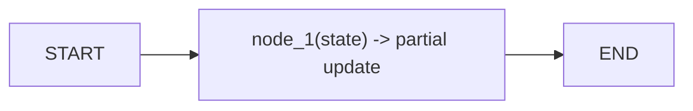
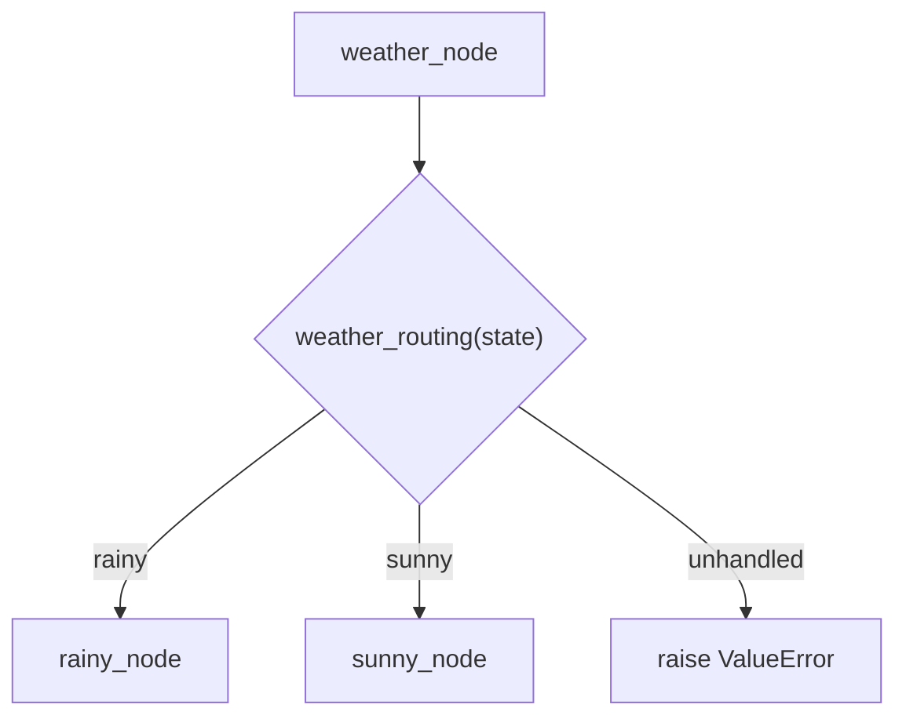
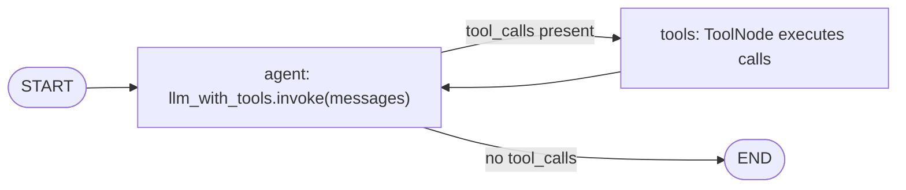
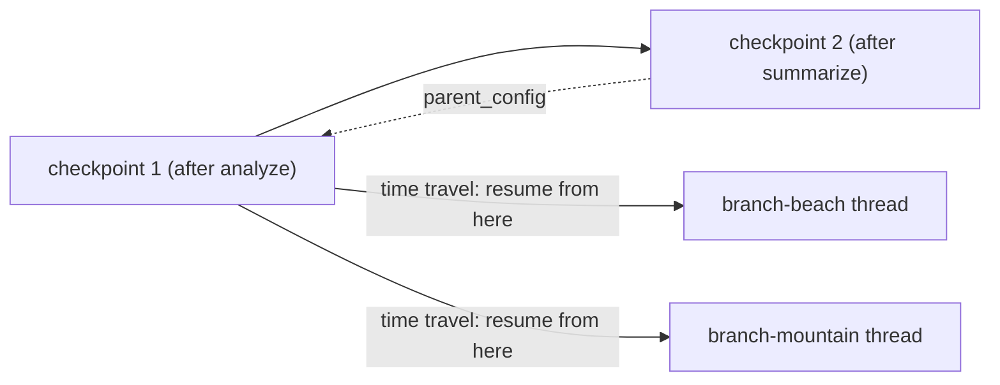
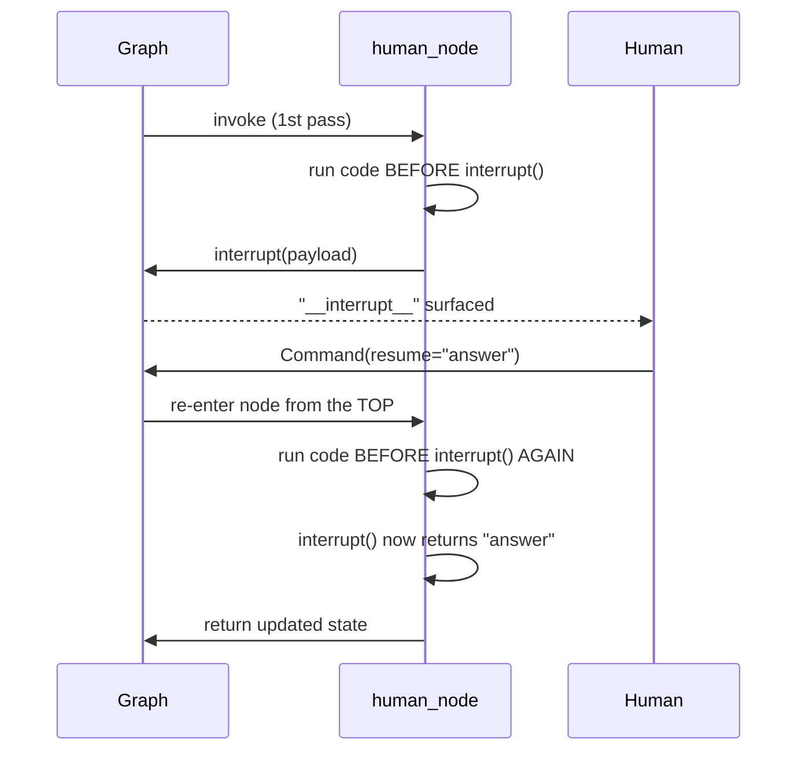
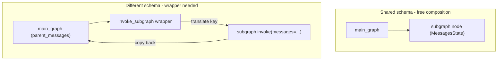
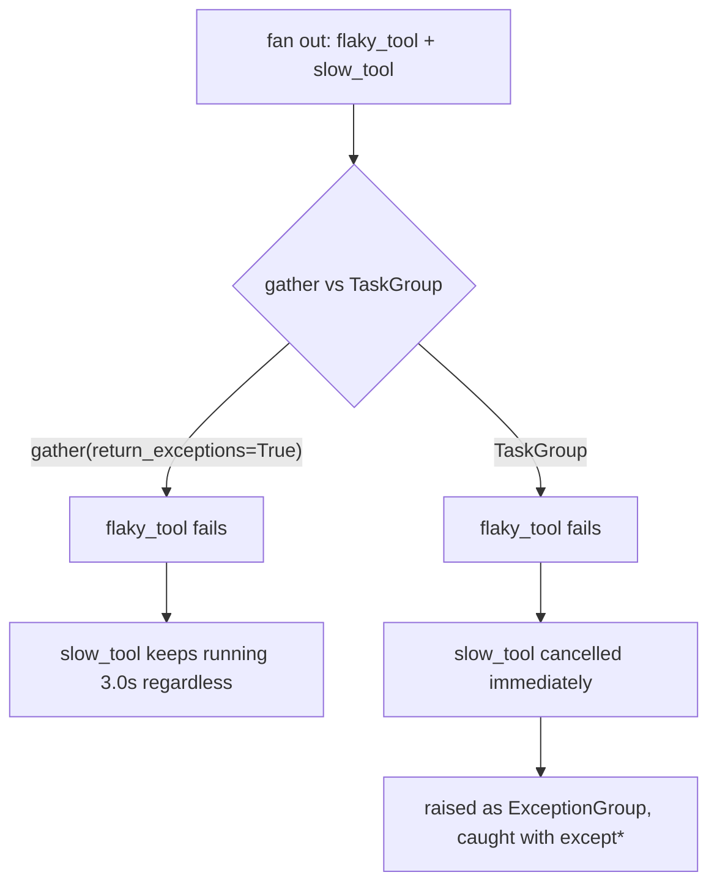
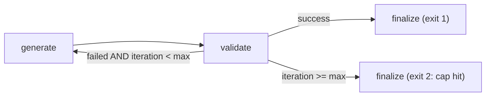

# 🕸️ LangGraph Fundamentals — Interview Tutorial

| <br> | <br> |
| --- | --- |
| **Source** | `03_LangGraph_Fundamentals/01_Foundations/` (12 notebooks), `03_LangGraph_Fundamentals/02_Core_Capabilities/` (12 notebooks across Checkpointing, Routing, Human-in-the-Loop, Advanced State, Subgraphs, Async & Streaming, Retries, Cycles & Loops) |
| **Notebooks** | 24 |
| **Built** | 2026-09-16 |
| **Target roles** | Applied AI / AI Engineer · Agentic AI Engineer · Forward Deployed Engineer |
| **Note** | Section 4 is web-sourced live this run — every question below carries a real citation. This folder leans hardest into the Agentic AI Engineer track (graphs, state, control flow, reliability); all three tracks are still covered in full. |

## What this covers

| Concept | Source notebook | Interview weight |
| --- | --- | --- |
| State, nodes, edges — the graph primitives | `01_State_and_Graph_Basics.ipynb` | High |
| Reducers (default overwrite vs. `add_messages`/`operator.add`) | `01_State_and_Graph_Basics.ipynb`, `02_MessageState.ipynb` | High |
| Conditional edges — dynamic routing | `03_Conditional_Routing.ipynb` | High |
| `Command` — combined routing + state update | `11_Command_Objects.ipynb` | Medium |
| `TypedDict` vs. Pydantic `BaseModel` state | `08_Pydantic_State_Validation.ipynb`, `07_Different_Graph_States.ipynb` | High |
| Node argument patterns & `Runtime[ContextSchema]` | `09_Node_Patterns.ipynb`, `10_Runtime_Context.ipynb` | Medium |
| Input / output / private state schemas | `01_Advanced_State.ipynb` | Medium |
| Tool calling loop & graceful tool-error handling | `05_Augmented_LLM_with_Tools.ipynb`, `06_ReAct_Agent.ipynb`, `12_Tool_Calling_with_Error_Handling.ipynb` | High |
| Checkpointing, threads, checkpoint anatomy | `01_Checkpointing.ipynb` | High |
| Human-in-the-loop: `interrupt()` mechanics & resume lifecycle | `01_HITL_Mechanics.ipynb` | High |
| HITL applied patterns: approve/reject, edit/review, tool review | `02_HITL_Patterns.ipynb` | High |
| Subgraphs — composition and state-key mapping | `01_Subgraphs.ipynb` | Medium |
| Async & streaming — `ainvoke`, `stream_mode` | `01_Async_and_Streaming.ipynb` | High |
| Concurrency control for agent fan-out (`gather`/`TaskGroup`, `Semaphore`) | `02_Async_Patterns_for_Agentic_Systems.ipynb` | High |
| `RetryPolicy` — built-in node-level retries | `01_Retries.ipynb` | High |
| Manual reliability patterns — circuit breaker, fallback chain | `02_Manual_Reliability_Patterns.ipynb` | Medium |
| Cycles and loops with termination guards | `01_Cycles_and_Loops.ipynb` | High |
| A real router / classification agentic RAG system | `01_Router_Agentic_RAG_System.ipynb`, `02_Router_Agentic_RAG_System_Modular.ipynb` | Medium |

## Coverage gaps

Interview-critical gaps specific to LangGraph orchestration itself — not the generic
checklist that fires on any notebook:

- **Evaluation of routed/looped behavior** `(not in your notebooks — build this)` — the router notebooks classify inquiries into categories and sentiment with an LLM, and the cyclic notebooks loop until a validator passes, but nothing measures routing accuracy or loop-convergence quality against a labeled set. This bears directly on whether the control flow you built actually works, not just whether it runs.

---

## 1. Core concepts

### 1.1 State, nodes, edges — the graph's three primitives

LangGraph models an application as a graph: a **state** (shared data every step reads and writes), **nodes** (plain Python functions that transform it), and **edges** (the wiring that decides execution order). It replaces an implicit call stack with an explicit, inspectable data structure.

- **How it works**: `StateGraph(State)` builds a graph typed to a schema; `add_node`/`add_edge` wire functions and transitions; `.compile()` produces a runnable.
- **Code** (`01_State_and_Graph_Basics.ipynb`):
```python
from typing_extensions import TypedDict
from langgraph.graph import StateGraph, START, END

class State(TypedDict):
messages: str

def node_1(state: State) -> State:
return {"messages": "Hello this is node 1"}   # a partial state update

builder = StateGraph(State)
builder.add_node("node_1", node_1)
builder.add_edge(START, "node_1")
builder.add_edge("node_1", END)
graph = builder.compile()
```
- **Say this in an interview**: "A node returns a dict of the fields it wants to change, not the whole state — LangGraph merges that into the shared state using each field's reducer."



---

### 1.2 Reducers — why state overwrites by default, and how to accumulate

A **reducer** decides how a node's returned value merges into existing state. With no reducer, LangGraph's default is last-write-wins: a later node's return simply replaces the field.

- **How it works**: `Annotated[list, add_messages]` (or `operator.add`) tells LangGraph to append instead of overwrite, which is what lets a multi-node chain build a conversation instead of erasing it each step.
- **Code** (`01_State_and_Graph_Basics.ipynb`):
```python
from typing import Annotated
from langgraph.graph.message import add_messages

class State(TypedDict):
messages: Annotated[list, add_messages]   # appends, doesn't overwrite

def add_hello(state): return {"messages": "Hello!"}
def add_reply(state): return {"messages": "How are you?"}
# both nodes' outputs now accumulate in `messages` instead of clobbering each other
```
- **Say this in an interview**: "The default reducer is overwrite — you opt into accumulation per field with `Annotated[type, reducer_fn]`, so a counter can overwrite while messages append, in the same state object."

---

### 1.3 Conditional edges — dynamic routing

A **conditional edge** calls a routing function after a node runs; whatever node name that function returns is where the graph goes next.

- **How it works**: `add_conditional_edges(source, routing_fn, [possible_destinations])` — the routing function reads state and returns a string that must match a registered node name exactly.
- **Code** (`03_Conditional_Routing.ipynb`):
```python
def weather_routing(state: State) -> str:
if state["weather"] == "rainy":
return "rainy"
elif state["weather"] == "sunny":
return "sunny"
raise ValueError(f"Unknown weather condition: {state['weather']}")

graph_builder.add_conditional_edges("weather_node", weather_routing, ["rainy", "sunny"])
```
- **Say this in an interview**: "A routing function is just a state → string mapping, so any decision — an LLM classification, a regex, a business rule — can drive the branch, and an unhandled case should raise loudly rather than fall through silently."



---

### 1.4 Command — combined routing + state update

`Command` lets a node return a state update *and* pick the next node in one object, replacing a separate conditional-edge function for that transition.

- **How it works**: `return Command(update={...}, goto="node_name")` — the type hint `Command[Literal["a", "b"]]` documents (and validates at compile time) every node this function can route to.
- **Code** (`11_Command_Objects.ipynb`):
```python
def check_temp_node(state: GraphState) -> Command[Literal["warn_user", "success"]]:
if state["temperature"] > 90:
return Command(update={"warning_sent": True}, goto="warn_user")
return Command(update={}, goto="success")
# no add_edge from check_temp_node needed — Command.goto handles it
```
- **Say this in an interview**: "`Command` collapses 'what changed' and 'where next' into one return value, which is useful when the routing decision and the state update come from the same piece of logic and shouldn't be split across two functions."

---

### 1.5 TypedDict vs. Pydantic BaseModel — when state validates itself

`TypedDict` state fields are type hints only — nothing enforces them at runtime. A Pydantic `BaseModel` is a drop-in replacement that validates every field the moment `.invoke()` is called.

- **How it works**: with `TypedDict`, a bad type (an `int` where a `str` is annotated) sails past `graph.invoke()` and only fails once a node tries to use it. With `BaseModel`, `graph.invoke({"name": 123})` raises a `ValidationError` before any node runs.
- **Code** (`08_Pydantic_State_Validation.ipynb`):
```python
class PydanticState(BaseModel):
name: str          # enforced — ValidationError at graph.invoke() on bad input

def greet_p(state: PydanticState) -> dict:
return {"name": f"Hello, {state.name}!"}   # attribute access, not state["name"]
```
- **Say this in an interview**: "TypedDict fails deep inside a node, Pydantic fails at the boundary — I use TypedDict for internal graphs I fully control, and switch to Pydantic the moment input comes from a user or API."

---

### 1.6 Node argument patterns & injecting runtime context

A node can declare a second parameter to receive either `RunnableConfig` (LangChain's per-call config bag) or a typed `Runtime[ContextSchema]` — both let a node read per-invocation settings that never live in persisted state.

- **How it works**: LangGraph inspects the node's signature and passes `config`/`runtime` automatically when declared; `Runtime[ContextSchema]` additionally type-checks the context dataclass.
- **Code** (`09_Node_Patterns.ipynb`, `10_Runtime_Context.ipynb`):
```python
from langgraph.runtime import Runtime
from dataclasses import dataclass

@dataclass
class ContextSchema:
user_id: str

def context_access_node(state: GraphState, runtime: Runtime[ContextSchema]) -> dict:
return {"greeting": f"Hello, {runtime.context.user_id}"}
```
- **Say this in an interview**: "Config and context carry per-call settings — a user id, a feature flag, a language preference — that shouldn't be checkpointed as conversation state, and shouldn't be crammed into `configurable`, which LangGraph reserves for the checkpointer's own `thread_id`/`checkpoint_id`."

---

### 1.7 Input, output, and private state schemas

By default a `StateGraph` has one schema, so every internal bookkeeping field leaks into what the caller sends and receives. Splitting `input_schema`/`output_schema` from the full internal schema hides that bookkeeping.

- **How it works**: `OverallState` (what nodes read/write) inherits from `InputState`, `PrivateState`, and `OutputState`; `StateGraph(state_schema=OverallState, input_schema=InputState, output_schema=OutputState)` restricts what crosses the API boundary.
- **Code** (`01_Advanced_State.ipynb`):
```python
class InputState(TypedDict):   question: str
class PrivateState(TypedDict): llm_calls: int     # never sent or returned
class OutputState(TypedDict):  answer: str
class OverallState(InputState, PrivateState, OutputState): pass

workflow = StateGraph(state_schema=OverallState, input_schema=InputState, output_schema=OutputState)
```
- **Say this in an interview**: "A single shared schema is fine for a demo — the moment a graph has a real caller, split input/output from internal state so a call counter or a scratch field doesn't become part of your public contract."

---

### 1.8 The tool-calling loop, and letting tools fail gracefully

An "augmented LLM" calls a tool once; an **agent** wraps that in a loop — `agent → tools → agent` — so the model can call several tools in sequence based on what earlier calls returned.

- **How it works**: `should_continue` inspects the last message for `tool_calls`; if present, route to a `ToolNode` and loop back to the agent; otherwise end. A tool that catches its own exception and returns a string keeps the failure inside the conversation instead of crashing the graph.
- **Code** (`12_Tool_Calling_with_Error_Handling.ipynb`):

```python
@tool
def divide(a: int, b: int) -> str:
try:
return str(a / b)
except ZeroDivisionError as e:
return f"Error: {e}"       # LLM sees this and can recover in-conversation

def should_continue(state: AgentState) -> Literal["tools", "end"]:
last = state["messages"][-1]
return "tools" if getattr(last, "tool_calls", None) else "end"
```
- **Say this in an interview**: "A tool that raises kills the graph run; a tool that catches and returns a descriptive string turns the failure into another message the model can react to — that's the difference between a crash and a graceful degrade."



---

### 1.9 Checkpointing — threads, persistence, and checkpoint anatomy

A **checkpointer** saves a full snapshot of state after every node runs; a **thread** (`thread_id` in the config) is what scopes which snapshots belong to the same conversation.

- **How it works**: `graph.compile(checkpointer=...)` turns any graph stateful. `MemorySaver` is fast but gone on process exit; `SqliteSaver`/`PostgresSaver` share the same interface and survive restarts. `app.get_state(config)` reads the latest snapshot; `app.get_state_history(config)` walks every one, newest first.
- **Code** (`01_Checkpointing.ipynb`):
```python
from langgraph.checkpoint.sqlite import SqliteSaver

with SqliteSaver.from_conn_string(db_path) as saver:
app = graph.compile(checkpointer=saver)
config = {"configurable": {"thread_id": "persistent-user"}}
app.invoke({"messages": [HumanMessage("Remember: code ALPHA-7")]}, config)
# a brand-new SqliteSaver session against the same db_path can still recall it
```
- **Say this in an interview**: "Two calls with the same `thread_id` share history; different `thread_id`s are fully independent — swapping `MemorySaver` for `SqliteSaver`/`PostgresSaver` is a one-line change because both implement the same checkpointer interface."

<details>
<summary>🔍 Deep Dive: checkpoint anatomy and time-travel</summary>

A checkpoint snapshot (`app.get_state(config)`) bundles six fields, each answering a specific question:

- `values` — the actual state data at this point.
- `next` — which node(s) run next; `()` means the graph has finished.
- `config` — the `thread_id` + `checkpoint_id` that uniquely address this snapshot.
- `parent_config` — a pointer to the previous checkpoint, forming a linked list back through the run.
- `metadata` — provenance: which node wrote this checkpoint, at what step.
- `created_at` — when it was saved.

Because checkpoints form a linked list via `parent_config`, **time travel** is just resuming with an older `checkpoint_id` — the graph re-enters from that point as if nothing after it happened. This is also how **branching** works: `app.update_state(new_thread_config, old_state.values)` copies one checkpoint's values into a brand-new thread, and the two threads evolve independently from there — `main`, `branch-beach`, and `branch-mountain` never see each other's future writes.

Checkpoints are saved before the first node runs, after every node completes, and at interrupt points — which is exactly the mechanism human-in-the-loop (section 1.10) is built on.


</details>

---

### 1.10 Human-in-the-loop — interrupt() mechanics and the resume lifecycle

`interrupt()` pauses execution *from inside a node*, hands a payload to the caller, and waits; `Command(resume=value)` supplies the human's answer and continues from exactly that point.

- **How it works**: `interrupt(payload)` raises internally and surfaces `payload` on `result["__interrupt__"]`; the checkpointer holds the paused state. `interrupt_before=[...]`/`interrupt_after=[...]` are the compile-time alternative — no code change inside the node, just a pause between two named nodes.
- **Code** (`01_HITL_Mechanics.ipynb`):
```python
def human_node(state: State):
value = interrupt({"text_to_revise": state["some_text"]})  # pauses here
return {"some_text": value}                                 # runs on resume

graph = graph_builder.compile(checkpointer=InMemorySaver())
result = graph.invoke({"some_text": "original text"}, config)
# result["**interrupt**"] -> [{"text_to_revise": "original text"}]
final = graph.invoke(Command(resume="Edited text"), config)
```
- **Say this in an interview**: "`interrupt()` needs a checkpointer to survive the pause — without one there's no saved state to resume from — and a node can call `interrupt()` repeatedly in a loop to re-prompt until it gets valid human input."

<details>
<summary>🔍 Deep Dive: why the whole node re-runs on resume</summary>

The single most-missed fact about `interrupt()`: on resume, **the entire interrupted node re-executes from the top**, not just the code after the `interrupt()` call. The notebook demonstrates this directly — a `counting_node` that prints before calling `interrupt()` prints that line *twice*: once on the initial run, once again when the node re-runs on resume.

```python
def counting_node(state):
    print(f"Node execution started - Counter: {state['counter']}")   # prints TWICE
    new_counter = state['counter'] + 1
    print(f"Incremented counter to: {new_counter}")                  # prints TWICE
    human_input = interrupt({"current_counter": new_counter, ...})
    return {"counter": new_counter, "message": human_input}
```

Why this matters: any code before the `interrupt()` call that has a side effect — an API call, a database write, an increment that isn't idempotent — runs twice for one logical pass through the node. The fix is not "avoid interrupt" but to make everything before it either read-only or idempotent, and to push side-effecting work to *after* the interrupt point (or into a separate node) wherever the flow allows it. This is exactly the kind of thing an interviewer probes with "your human-in-the-loop node calls a paid API before pausing — what happens on resume, and how do you fix it?"


</details>

---

### 1.11 HITL applied patterns — approve/reject, edit/review, and reviewable tool calls

`01_HITL_Mechanics.ipynb`'s primitives compose into three concrete, LLM-facing patterns: pause before the model acts, let a human edit state mid-run, or gate a specific tool call before it executes.

- **How it works**: `interrupt_before=["assistant"]` pauses every turn before the LLM node runs; `graph.update_state(thread, {...})` lets you rewrite a human message while paused, so the agent responds to the edited version instead of the original; wrapping a tool's own body in `interrupt()` gates that one action specifically.
- **Code** (`02_HITL_Patterns.ipynb`):
```python
graph = builder.compile(interrupt_before=["assistant"], checkpointer=memory)
# ... graph pauses before every assistant turn ...
graph.update_state(thread, {"messages": [HumanMessage("No, please multiply 15 and 6")]})
for event in graph.stream(None, thread, stream_mode="values"):   # resumes with the edit
event['messages'][-1].pretty_print()
```
- **Say this in an interview**: "Approval, editing, and reviewable tool calls are the same primitive — pause and resume — applied at three different points: before a whole turn, on the state itself, or inside one specific tool."

---

### 1.12 Subgraphs — composing graphs and mapping state at the boundary

A **subgraph** is a compiled `StateGraph` used as a node inside a parent graph. When the child's state schema shares key names with the parent, it plugs in directly; when it doesn't, a wrapper node must translate between them.

- **How it works**: `main_graph.add_node("subgraph", subgraph)` works with zero glue code if both graphs use `MessagesState`. If the parent's key is named differently (e.g. `parent_messages`), a wrapper node calls `subgraph.invoke(...)` explicitly and copies the result back onto the parent's own key.
- **Code** (`01_Subgraphs.ipynb`):
```python
# Shared key name -> direct composition, no glue:
main_graph.add_node("subgraph", subgraph)          # subgraph shares MessagesState

# Different key name -> explicit invocation + copy-back:
def invoke_subgraph(state: MessagesState):          # parent's own (different) schema
out = subgraph.invoke({"messages": state["parent_messages"]})
state["parent_messages"] = out["messages"]
return state
```
- **Say this in an interview**: "Subgraphs compose for free when the schemas share field names; the moment they don't, you write one wrapper node that translates keys at the boundary — that's the entire integration cost."



---

### 1.13 Async and streaming — non-blocking runs and three ways to observe progress

`graph.ainvoke()` is the non-blocking counterpart of `.invoke()`; `graph.astream()` yields partial results as the run progresses instead of making the caller wait for the whole thing.

- **How it works**: converting a node to `async def` and calling `await model.ainvoke(...)` is the only change needed — graph structure stays identical. `stream_mode="updates"` yields one dict per finished node (good for "which step is it on"); `stream_mode="messages"` yields individual `AIMessageChunk` tokens (good for a typing effect), and chunks support `+` to reassemble the full message. `04_LLM_Powered_Chatbot.ipynb` first draws this same `invoke()` (blocks for the full response) vs. `stream()` (partial output as it's generated) distinction on a plain chatbot, before this notebook adds the async half.
- **Code** (`01_Async_and_Streaming.ipynb`):
```python
async def call_model(state: MessagesState):
response = await model.ainvoke(state["messages"])   # was: model.invoke(...)
return {"messages": [response]}

gathered = None
async for msg, metadata in graph.astream(inputs, stream_mode="messages", config=config):
if isinstance(msg, AIMessageChunk):
gathered = msg if gathered is None else gathered + msg
```
- **Say this in an interview**: "`ainvoke` is what you call from an async web handler so one slow request doesn't block others on the same process; `stream_mode` is a separate axis — pick `updates` for step-level progress UI, `messages` for token-level typing effects."

---

### 1.14 Concurrency control for agent fan-out — gather, TaskGroup, and Semaphore

An agent that calls three independent tools sequentially pays for all three latencies; running them concurrently with `asyncio.gather`/`TaskGroup` collapses that to roughly the slowest single call.

- **How it works**: sequential `await`s serialize independent work; `asyncio.gather(*coros)` runs them concurrently. Unbounded fan-out gets you rate-limited fast, so a `Semaphore` caps how many calls run at once.
- **Code** (`02_Async_Patterns_for_Agentic_Systems.ipynb`):
```python
async def truly_async_agent():
r1 = await fake_llm("plan")
r2, r3, r4 = await asyncio.gather(       # 3 independent tools run concurrently
web_search("q"), vector_search("q"), sql_query("q"),
)
r5 = await fake_llm("summarise")
return r1, r2, r3, r4, r5
# measured: sync-style ~15s for a 5-step agent vs. async fan-out ~max single step
```
- **Say this in an interview**: "Fanning out independent tool calls with `gather` turns a sum-of-latencies budget into a max-of-latencies budget — the plan and summarize calls stay sequential because each depends on the previous step's output, but the three lookups in the middle don't depend on each other."

<details>
<summary>🔍 Deep Dive: gather vs. TaskGroup when one call fails</summary>

`asyncio.gather(*coros, return_exceptions=True)` and `asyncio.TaskGroup` look interchangeable until something fails mid-fan-out — and the notebook demonstrates the difference directly:

```python
async def flaky_tool():
    await asyncio.sleep(0.3)
    raise RuntimeError("vector index timeout")

async def slow_tool():
    try:
        await asyncio.sleep(3.0)
        return "done"
    except asyncio.CancelledError:
        print("slow_tool: got cancelled - cleaning up")   # only prints under TaskGroup
        raise

async with asyncio.TaskGroup() as tg:
    tg.create_task(flaky_tool())
    tg.create_task(slow_tool())
# -> flaky_tool's failure cancels slow_tool automatically; caught via `except* RuntimeError`
```

With plain `gather(..., return_exceptions=True)`, `slow_tool` keeps running for its full 3 seconds even though `flaky_tool` already failed — nothing tells it to stop, so you pay the full latency of every in-flight call and risk an orphaned task doing unnecessary (or unsafe) work. `TaskGroup`'s structured concurrency cancels every sibling the instant one member raises, and Python 3.11's `except*`/`ExceptionGroup` syntax is required to catch what it raises. For an agent fanning out real tool calls — where "still running" can mean "still charging the API" — that cancellation guarantee is the reason `TaskGroup` is the safer default, not just a syntax preference.


</details>

---

### 1.15 RetryPolicy — declarative, node-level retries with backoff and jitter

`RetryPolicy` attaches automatic retry behavior to a single node at graph-construction time, so a flaky call doesn't need hand-written `try`/`except` retry logic inside the node itself.

- **How it works**: on a matching exception, LangGraph waits `initial_interval * backoff_factor^attempt` (capped at `max_interval`), optionally randomized by `jitter`, and retries up to `max_attempts` times; `retry_on` scopes retries to specific exception types so unrelated errors propagate immediately.
- **Code** (`01_Retries.ipynb`):
```python
builder.add_node(
"fetch_weather", fetch_weather,
retry_policy=RetryPolicy(
max_attempts=5, initial_interval=1.0, backoff_factor=2.0,
max_interval=10.0, jitter=True, retry_on=APIError,
),
)
```
- **Say this in an interview**: "Exponential backoff without jitter means every caller retrying the same failure wakes up at the same instant and re-floods the service — `jitter=True` randomizes the wait so retries spread out instead of synchronizing into a second thundering herd."

---

### 1.16 Manual reliability patterns — circuit breaker and fallback chain

Retries help with transient blips; a **circuit breaker** stops hammering a service that is *consistently* down, and a **fallback chain** tries a different model/provider instead of failing outright.

- **How it works**: the circuit breaker tracks a `closed → open → half-open` state machine — too many recent failures trips it `open` (calls rejected immediately, no real service hit); after `recovery_timeout`, one probe call is let through `half-open` to test recovery. A fallback chain tries models in priority order and caches successful responses so a repeated query short-circuits for free.
- **Code** (`02_Manual_Reliability_Patterns.ipynb`):
```python
class CircuitBreaker:
def call(self, func, *a, **kw):
if self.state == "open":
if time.time() - self.last_failure_time > self.recovery_timeout:
self.state = "half-open"
else:
raise Exception("Circuit breaker is OPEN")
try:
result = func(*a, **kw)
if self.state == "half-open":
self.state, self.failures = "closed", 0   # full reset on ONE success
return result
except Exception as e:
self.failures += 1
if self.failures >= self.failure_threshold:
self.state = "open"
raise
```
- **Say this in an interview**: "A circuit breaker trades a slow failure for a fast one — once it's open, calls fail in microseconds instead of waiting out a timeout, which protects both the caller's latency budget and the struggling downstream service."

---

### 1.17 Cycles and loops — the same shape drives retry-until-valid and iterative refinement

A cycle in LangGraph is nothing more than a conditional edge whose "not done" branch routes back to a node the graph has already visited — the same shape powers self-correcting code generation and progressively-deeper research.

- **How it works**: `generate → validate → (loop back to generate | finalize)` retries on a failing test case; `research → generate_questions → (loop back to research | synthesize)` uses the identical loop-back wiring to go deeper instead of to retry. Both guard the loop with a counter checked in the routing function.
- **Code** (`01_Cycles_and_Loops.ipynb`):
```python
def should_continue(state: CodeGenState) -> Literal["generate", "end"]:
if state["success"]:
return "end"
elif state["iteration"] >= state["max_iterations"]:   # the guard
return "end"
return "generate"                                      # loop back

graph.add_conditional_edges("validate", should_continue, {"generate": "generate", "end": "finalize"})
```
- **Say this in an interview**: "A cycle is just a graph edge pointing backward — the interesting engineering is entirely in the guard condition, because the graph itself will happily loop forever without one."



---

### 1.18 A real router — structured-output classification driving control flow

`01_Router_Agentic_RAG_System.ipynb` puts sections 1.3 and 1.5 to work in a real system: an LLM classifies each customer inquiry into a `QueryCategory` and `QuerySentiment` via a Pydantic schema, and the graph routes on that structured result rather than on a raw string.

- **How it works**: a Pydantic model constrains the classifier's output to a fixed set of categories, so the routing function branches on `state["category"]` with type safety instead of parsing free text; sentiment is classified the same way to trigger an escalation path for angry customers.
- **Code** (`01_Router_Agentic_RAG_System.ipynb`):
```python
class QueryCategory(BaseModel):
category: Literal["billing", "technical", "general"]

class QuerySentiment(BaseModel):
sentiment: Literal["positive", "neutral", "negative"]

def analyze_inquiry_sentiment(state: CustomerSupportState) -> dict:
result = llm.with_structured_output(QuerySentiment).invoke(state["inquiry"])
return {"sentiment": result.sentiment}
```
- **Say this in an interview**: "Structured output turns a routing decision into a typed field instead of a string you have to parse defensively — the router's conditional edge trusts `category` exactly the way `weather_routing` trusts `state['weather']`, just produced by an LLM instead of a human."

---

## 2. Gotchas

`TypedDict`** lets bad types travel deep before failing**
- **Symptom**: `typeddict_graph.invoke({"name": 123})` runs every node with no error, then raises a `TypeError` only when a node tries `name + " How are you?"` — an int has no string concatenation, so it fails deep inside node logic, not at the graph boundary.
- **Cause**: `TypedDict` annotations are documentation only; LangGraph passes whatever dict values it's given straight into nodes.
- **Fix**: switch the state schema to a Pydantic `BaseModel` for any graph that takes external input — `ValidationError` then fires at `graph.invoke()`, before any node runs.
- **Interview angle**: "Your graph crashed three nodes deep with a `TypeError` — where do you actually go look, and how do you stop it happening again?"

**Sequential nodes silently erase each other's output**
- **Symptom**: a 3-node chain (`node_1 → node_2 → node_3`) each returning `{"messages": "..."}` ends with only the last node's string — the original user input is gone from the final state.
- **Cause**: the default reducer for a field with no `Annotated[...]` is overwrite, so each node's partial update replaces the previous value rather than merging with it.
- **Fix**: annotate the field with an accumulating reducer, `Annotated[list, add_messages]` for chat history or `Annotated[list, operator.add]` for any other list.
- **Interview angle**: "Your chatbot forgot what the user said two turns ago — what's the first thing you check in the state schema?"

**Interrupt resume re-runs the whole node, not just the code after **`interrupt()`
- **Symptom**: a node that prints before calling `interrupt()` prints that line *twice* — once on the initial call, once again on `Command(resume=...)`.
- **Cause**: LangGraph resumes an interrupted node by re-executing it from the top with the saved state; only the `interrupt()` call itself returns a different value (the human's input) on the second pass.
- **Fix**: keep everything before an `interrupt()` call read-only/idempotent, or move side-effecting work after the interrupt point (or into its own node) so a resume never repeats it.
- **Interview angle**: "Your human-in-the-loop node calls a billing API before pausing for approval — what happens on resume, and how do you fix it?"

`asyncio.gather(..., return_exceptions=True)`** doesn't cancel its siblings on failure**
- **Symptom**: one tool call raises, but a second, unrelated in-flight call keeps running for its full duration instead of stopping.
- **Cause**: `gather` collects results (or exceptions) as each coroutine finishes on its own; it has no structured-concurrency link between siblings, so nothing tells the others to stop.
- **Fix**: use `asyncio.TaskGroup()` for agent tool fan-out — one member raising cancels every other task in the group automatically, surfaced as an `ExceptionGroup` caught with `except*`.
- **Interview angle**: "One tool in your 4-way fan-out throws — what happens to the other three, and does that differ between `gather` and `TaskGroup`?"

**A subgraph with a differently-named state key doesn't just plug in**
- **Symptom**: composing a subgraph built on `MessagesState` under a parent whose schema uses `parent_messages` produces no automatic mapping — the subgraph never sees the parent's data.
- **Cause**: LangGraph only auto-composes a subgraph as a node when the parent and child share the state's key names; there's no implicit key translation.
- **Fix**: write a small wrapper node that calls `subgraph.invoke({"messages": state["parent_messages"]})` explicitly and copies the result back onto the parent's own key.
- **Interview angle**: "You dropped a reusable subgraph into a new parent graph and it silently did nothing with the input — why, and what's the one-line fix?"

**A cycle with no iteration guard loops forever**
- **Symptom**: a `should_continue` routing function that only checks a `success` flag — never an iteration count — never terminates if the underlying task can never succeed.
- **Cause**: LangGraph itself doesn't impose a completion condition on a loop-back edge; the graph will follow it exactly as long as the routing function keeps returning the same destination.
- **Fix**: check an iteration/depth counter in the same routing function that checks success, and route to a terminal node once either condition is met (LangGraph does back this with a hard default `recursion_limit` — around 25 super-steps by default, raising `GraphRecursionError` — but that's a safety net, not a substitute for a real guard).
- **Interview angle**: "Your self-correcting agent loops on 3% of tasks that can never pass validation — how do you guarantee it terminates?"

**A circuit breaker's **`half-open`** state fully resets on one success**
- **Symptom**: after tripping `open` from repeated failures, a single successful probe call resets the failure counter straight to zero — the breaker has no memory of how close it was to tripping again.
- **Cause**: the `half-open → closed` transition in the reference implementation sets `self.failures = 0` unconditionally on any success, discarding the failure history entirely.
- **Fix**: for a service that's flapping rather than fully down, track a rolling failure rate instead of an absolute counter that resets to zero on any single success.
- **Interview angle**: "Your circuit breaker keeps flapping open/closed against a degraded-but-not-dead service — why, and what would you change?"

**App-level context doesn't belong in **`configurable`** alongside checkpointer keys**
- **Symptom**: stuffing a `user_id` or feature flag into `config["configurable"]` next to `thread_id` works today, but the notebook's own migration note flags it as the wrong place going forward.
- **Cause**: LangGraph reserves `configurable` for the checkpointer's own addressing keys (`thread_id`, `checkpoint_id`); anything else sharing that namespace risks colliding with future checkpointer keys.
- **Fix**: carry app-level runtime context through `context=` + a typed `Runtime[ContextSchema]` node parameter instead, keeping `configurable` exclusively the checkpointer's.
- **Interview angle**: "Where do you put a per-request user id so it's available to a node but never gets checkpointed as conversation state?"

---

## 3. Tradeoffs

### State schema: TypedDict vs. Pydantic BaseModel
| Option | Costs you | Buys you | Pick when |
| --- | --- | --- | --- |
| `TypedDict` | No runtime validation; bad input fails deep in a node | Lower overhead, dict-style access | Internal graphs, notebooks, you control every input |
| Pydantic `BaseModel` | Slightly higher overhead; nodes must return dicts, never mutate | Fail-fast `ValidationError` at `invoke()` | Externally-facing graphs, user or API input |

**The one-liner**: "TypedDict is fine until the input stops being yours to control — that's the exact moment to switch to Pydantic."

### Checkpointer: MemorySaver vs. SqliteSaver/PostgresSaver
| Option | Costs you | Buys you | Pick when |
| --- | --- | --- | --- |
| `MemorySaver` | Wiped on process restart, single-process only | Zero setup, fastest iteration | Local dev, tests, a demo |
| `SqliteSaver` / `PostgresSaver` | A real datastore to run and manage | Survives restarts, shareable across processes | Anything a user will actually resume tomorrow |

**The one-liner**: "`MemorySaver` is a demo default — the moment a conversation needs to survive a restart or a second process, you're on a durable checkpointer."

### Interrupt style: runtime interrupt() vs. compile-time interrupt_before/interrupt_after
| Option | Costs you | Buys you | Pick when |
| --- | --- | --- | --- |
| `interrupt()` inside a node | Code change inside the node; whole node re-runs on resume | Fine-grained control — pause mid-logic, validate in a loop | The pause point depends on data computed inside the node |
| `interrupt_before`/`interrupt_after` | Only pauses between whole nodes | Zero code change inside the node itself | The pause point is always "before/after this node," full stop |

**The one-liner**: "Compile-time interrupts are the right default for a fixed approval gate; reach for `interrupt()` only when the decision to pause depends on something the node just computed."

### Agent fan-out: asyncio.gather vs. asyncio.TaskGroup
| Option | Costs you | Buys you | Pick when |
| --- | --- | --- | --- |
| `gather(..., return_exceptions=True)` | No sibling cancellation — a failed call leaves others running | Simple, works on any Python 3.x, one flat result list | You genuinely want every result regardless of individual failures |
| `TaskGroup` (3.11+) | Requires Python 3.11+, `except*`/`ExceptionGroup` syntax | Structured concurrency — one failure cancels every sibling | Fanning out real tool calls where a stray in-flight call has cost or risk |

**The one-liner**: "`gather` collects results independently; `TaskGroup` treats the whole fan-out as one unit of work that fails together — pick the second one the moment 'still running after a sibling failed' would be a problem."

### Reliability: RetryPolicy vs. manual patterns (circuit breaker, fallback chain)
| Option | Costs you | Buys you | Pick when |
| --- | --- | --- | --- |
| `RetryPolicy` | Only handles retry-and-hope; no cross-call memory of a service being *down* | Zero extra code — a `retry_policy=` kwarg on `add_node` | Transient, independent failures (timeouts, rate limits) |
| Circuit breaker / fallback chain | You build and maintain state-machine/chain logic yourself | Stops hammering a dead service; degrades to another model instead of failing | A dependency can be *consistently* down, or you have a fallback worth trying |

**The one-liner**: "Retries assume the next call might succeed; a circuit breaker assumes it won't for a while and stops wasting the attempt."

### Loop shape: retry-until-valid vs. iterative refinement
| Option | Costs you | Buys you | Pick when |
| --- | --- | --- | --- |
| Retry-until-valid (`generate → validate → loop`) | Terminates on a pass/fail signal only | Corrects a concrete, checkable failure (a failing test, a syntax error) | There's an objective validator to loop against |
| Iterative refinement (`research → question → loop`) | No pass/fail signal — must terminate on depth alone | Produces progressively deeper output with no "correct" endpoint | The task has no binary success condition, only "more" |

**The one-liner**: "If you can write a validator, loop on pass/fail; if you can't, loop on a depth counter instead — either way, the guard condition is the entire design."

### Subgraph composition: shared schema vs. wrapper node
| Option | Costs you | Buys you | Pick when |
| --- | --- | --- | --- |
| Shared state schema (e.g. both use `MessagesState`) | The subgraph must adopt the parent's exact field names | Zero glue code — `add_node("sub", subgraph)` just works | Building the subgraph specifically for this parent |
| Wrapper node translating keys | One extra node, extra invoke/copy-back logic | The subgraph stays reusable across parents with different schemas | The subgraph is meant to be dropped into multiple, differently-shaped parents |

**The one-liner**: "A subgraph that shares the parent's field names is free to compose; a genuinely reusable subgraph needs one wrapper node per parent instead."

### Routing input: raw state field vs. LLM structured-output classification
| Option | Costs you | Buys you | Pick when |
| --- | --- | --- | --- |
| Raw state field (e.g. `state["weather"]`) | Someone upstream must have already produced a clean, typed value | Deterministic, free, instant routing | The routing signal already exists as clean data |
| LLM structured-output classification (`with_structured_output`) | An extra model call, plus its latency and cost, on every routed request | Can route on judgment (sentiment, intent) that no upstream system computed | The routing signal requires understanding free-text input |

**The one-liner**: "Route on a field you already have for free; reach for an LLM classifier only when the thing you're routing on doesn't exist as data yet."

---

## 4. Top 10 interview questions: real-time agentic system design

1. **"What's the difference between LangGraph's checkpointer and a cross-thread Store, and when do you use each?"**
The checkpointer is short-term, within-thread memory — it saves the full graph state after every step, scoped by `thread_id`, so one conversation can resume. A Store is long-term, cross-thread memory for facts that should persist across different conversations with the same user. Use the checkpointer for "resume this exact run," the Store for "remember this user forever." — [Top 35 LangGraph Interview Questions (2026), Interview Coder](https://www.interviewcoder.co/blog/langgraph-interview-questions)
1. **"Your agent process crashes mid-run — how does resume actually work, and what doesn't survive the crash?"**
Resume re-enters at the node after the last saved checkpoint, without replaying already-completed work — but checkpoints recover *state*, not side effects already sent to the outside world. Any tool call that hit a real API before the crash may or may not have completed, so external actions need their own idempotency keys so a resumed run's retry doesn't duplicate them. — [Top 35 LangGraph Interview Questions (2026), Interview Coder](https://www.interviewcoder.co/blog/langgraph-interview-questions)
1. **"Design the human escalation path for an agent that can take irreversible actions — what has to be in the handoff?"**
Escalate on policy-driven triggers (irreversible/high-value actions, repeated verification failures, budget exhaustion), not the agent's own judgment about when it's stuck. The handoff packet needs the original goal as an immutable copy, a side-effect ledger with external IDs, and the system's own classification of why it escalated — not the agent's self-reported explanation, which can be wrong exactly when escalation matters most. — [Agent Reliability Engineering Design Guide, hidekazu-konishi.com](https://hidekazu-konishi.com/entry/agent_reliability_engineering_design_guide.html)
1. **"What stops an agentic loop from running forever, and what breaks if you only implement one of the guards?"**
Production loops need three independent terminal paths: goal satisfaction (an externally checkable success condition), budget exhaustion (a hard step/token/time cap), and guard activation (loop or stagnation detection). Implement only the first and a task that can never succeed hangs forever; only the second and it burns a full budget on something that became impossible at step two; only the third and it never finishes cleanly on a slow-but-legitimate run. — [Agent Reliability Engineering Design Guide, hidekazu-konishi.com](https://hidekazu-konishi.com/entry/agent_reliability_engineering_design_guide.html)
1. **"You have nested retries at the model-call, tool-call, and step level — what's the worst-case wall-clock time?"**
Nested attempts multiply: worst-case time is roughly `steps × step_retries × call_retries × call_timeout`, plus accumulated backoff — a 30s call timeout with 3 SDK attempts, 2 step retries, across 40 steps, is over two hours worst case. Bound it by propagating an absolute deadline (not a duration) down through every layer, and reserve 10-20% of the task budget for wind-down. — [Agent Reliability Engineering Design Guide, hidekazu-konishi.com](https://hidekazu-konishi.com/entry/agent_reliability_engineering_design_guide.html)
1. **"How do you tell an agent stuck in exact repetition apart from one that's stagnating or cycling — and what do you do about each?"**
Exact repetition is the same tool call with the same arguments; stagnation is different actions producing no observable progress; cycling is alternating between conflicting states — each needs its own detector, since they have different root causes. Respond on a graduated ladder: inform the agent with explicit feedback first, then constrain its available choices, then escalate or terminate if the pattern persists. — [Agent Reliability Engineering Design Guide, hidekazu-konishi.com](https://hidekazu-konishi.com/entry/agent_reliability_engineering_design_guide.html)
1. **"LangGraph's default recursion limit trips at around 25 super-steps — what does that error actually mean, and is raising the limit the fix?"**
`GraphRecursionError` fires when a run exceeds the configured `recursion_limit` (a super-step count, not a token or wall-clock limit), almost always because a conditional edge routes back to itself with no path to `END`. Raising the limit just delays the same failure; the real fix is an iteration/depth counter checked in the routing function itself, with the recursion limit kept as a backstop, not the primary guard. — [LangGraph GraphRecursionError — Causes, Fix & Prevention, The Neural Base](https://theneuralbase.com/agents/errors/langgraph-graph-recursion-error/)
1. **"Fan out three independent tool calls from an agent node — **`gather`** or **`TaskGroup`**, and why?"**
`TaskGroup` (Python 3.11+) is structured concurrency: if one task raises, every sibling task in the group is cancelled automatically, and the group surfaces failures as an `ExceptionGroup` caught with `except*`. Plain `gather` has no such link between siblings — a failed call doesn't stop the others, which matters when "still running" means "still spending money or holding a resource." — [asyncio.gather vs asyncio.wait vs asyncio.TaskGroup, Codemia](https://codemia.io/knowledge-hub/path/asynciogather_vs_asynciowait_vs_asynciotaskgroup)
1. **"How do you fan a task out to N parallel workers in LangGraph and merge their results back?"**
Use the `Send` API to dispatch a variable number of parallel invocations of the same node (`Send("worker", payload)` per item), each producing a partial update that a reducer on the shared state field merges back together — the map-reduce pattern for an unknown-at-compile-time number of branches. — [Top 35 LangGraph Interview Questions (2026), Interview Coder](https://www.interviewcoder.co/blog/langgraph-interview-questions)
1. **"Your chat UI needs a typing effect, not a spinner — which LangGraph stream mode, and what do you avoid leaking?"**
`stream_mode="messages"` yields individual LLM tokens as they're generated, which is what a typing effect needs — as opposed to `stream_mode="values"` (full state after every step) or `"updates"` (per-node deltas), both of which risk leaking internal state fields to a client that should only ever see the model's own output tokens. — [Top 35 LangGraph Interview Questions (2026), Interview Coder](https://www.interviewcoder.co/blog/langgraph-interview-questions)

---

## 5. Role tracks

### 5.1 Applied AI / AI Engineer

**What they probe**: whether the routing/classification logic you built actually produces good decisions, and whether you can defend that with an eval, not a vibe.

1. The router notebook classifies inquiries with an LLM into fixed categories — how do you know the classifier is accurate? *(Build a labeled eval set of inquiries with a known-correct category/sentiment, measure accuracy per class, not just overall.)*
2. When would you route on a raw state field instead of an LLM classification? *(When the signal already exists as clean data — don't pay a model call to re-derive something you already have.)*
3. Your router misclassifies angry customers as "neutral" sentiment — where do you look first? *(The classifier's prompt/schema and a labeled sample of misses — not the routing edge, which just trusts whatever category comes in.)*
4. `RetryPolicy` retried a node 5 times before giving up — how does that show up in latency, and how do you budget for it? *(Worst case is *`max_attempts`* × backoff-summed delay; that has to fit inside your end-to-end latency SLA, not be additive on top of it.)*
5. Streaming `stream_mode="messages"` vs. `"updates"` — which would you pick to show a user "searching knowledge base..." between tool calls? *("updates" — it's per-node, so you get a signal exactly when a named step finishes, not a token stream to parse for state changes.)*
6. Pydantic state validation failed at `graph.invoke()` in production — is that a bug or working as intended? *(Working as intended — that's the fail-fast boundary; the bug is whatever upstream sent bad input.)*
7. You added a circuit breaker in front of your LLM calls — what metric tells you it's helping vs. hurting? *(Compare p95 latency and error rate with the breaker on vs. off; if it trips on healthy-but-slow periods, the threshold is too aggressive.)*
8. When is a fallback chain across models actively worse than just failing? *(When the fallback model gives a materially different — cheaper, less capable — answer silently, and the caller has no idea which model actually served the response.)*

**Take-home task**:
- Given the router agentic RAG notebook's category/sentiment classifier, build a 30-example labeled eval set and report per-category accuracy plus confusion pairs.
- Propose one prompt or schema change that would fix the largest confusion pair, and show the before/after accuracy.

### 5.2 Agentic AI Engineer

**What they probe**: whether your loops terminate, your tools fail safely, and your state survives a crash or a resume.

1. Your self-correcting code-gen loop never terminates on an impossible task — what's missing? *(An iteration cap checked in the same routing function that checks *`success`*, independent of whether the task can ever pass.)*
2. A human-in-the-loop node calls a paid API before its `interrupt()` — what happens on resume? *(The whole node re-runs from the top, including that API call, a second time — move the side effect after the interrupt point.)*
3. Design the tool-call review pattern for a tool with real side effects (e.g. sending an email). *(Wrap the tool body itself in *`interrupt()`*, surfacing the exact call/args for approval before execution, not after.)*
4. One tool in a 4-way `TaskGroup` fan-out throws — what happens to the other three? *(All three are cancelled automatically via structured concurrency, unlike plain *`gather`*, which lets them keep running.)*
5. Where do you store per-request context like a user id so a node can read it but it never gets checkpointed? *(*`context=`* + a typed *`Runtime[ContextSchema]`* parameter — not *`config["configurable"]`*, which is reserved for the checkpointer's own keys.)*
6. A subgraph you built for one parent silently does nothing when dropped into a new parent graph — why? *(The new parent's state uses different key names; subgraphs only auto-compose when schemas share field names — otherwise you need a wrapper node.)*
7. How do you make a checkpointed agent survive a pod restart mid-run? *(Swap *`MemorySaver`* for *`SqliteSaver`*/*`PostgresSaver`* — same interface, and resume re-enters at the last saved checkpoint.)*
8. When is a circuit breaker worse than just letting retries run? *(Against a service that's flapping rather than fully down — the breaker's single-success reset can mask a service that's about to fail again.)*

**Take-home task**:
- Take the retries notebook's `RetryPolicy` node and wrap the whole graph in a `CircuitBreaker`, so five consecutive exhausted-retry failures trip the breaker open for 30 seconds.
- Add a `max_iterations`-style guard to a cyclic graph of your own design, and demonstrate it terminating on a task engineered to never succeed.

### 5.3 Forward Deployed Engineer (FDE)

**What they probe**: whether you can stand a checkpointed, human-gated LangGraph system up inside a specific customer's constraints, fast.

1. Customer wants approvals on every refund over $500 — where does the interrupt go, and how do you avoid double-processing on resume? *(*`interrupt()`* inside the refund tool itself, gated before the side-effecting call — never after — so resume never re-issues a refund already sent.)*
2. Their infra team says no in-memory checkpointing in production — what changes? *(Swap to *`PostgresSaver`*; the graph and node code don't change, only the *`compile(checkpointer=...)`* argument.)*
3. Customer's data can't leave their VPC for an LLM classification call — how do you adapt the router pattern? *(Swap in a self-hosted/in-VPC model for *`with_structured_output`*; the routing edge and schema don't change, only which model produces the classification.)*
4. It works in your demo, but their support tickets never trigger the escalation path — how do you find out why? *(Pull real ticket examples through the sentiment classifier manually and compare against the customer's own definition of "angry" — the demo's threshold may not match their data.)*
5. Customer asks for the agent to "never get stuck" — how do you respond? *(Translate that into concrete termination paths — a step cap, a token budget, a wall-clock deadline — and show what each one guards against; "never" isn't an engineering spec.)*
6. Their support team needs to see agent progress live, not just a final answer — which streaming mode, and why? *(*`stream_mode="updates"`* surfaces named steps for a progress UI without leaking raw model tokens or full internal state.)*
7. Explain to a non-engineer why the agent sometimes pauses for a minute mid-conversation. *(It's paused at a human-in-the-loop approval gate waiting for someone to approve or reject an action — not stuck, and it will resume exactly where it left off.)*
8. Walk me through a LangGraph deployment that went badly. *(A strong answer volunteers a concrete failure shape from these notebooks — e.g. a resumed node re-firing a side effect, or a cycle with no guard — not a vague "it was hard.")*

**Take-home task**:
- Given "approvals must persist through a pod restart, and no refund can ever be double-sent," sketch which checkpointer, which interrupt placement, and what idempotency key protects the refund tool.
- Present it as a one-page architecture note a non-engineer stakeholder could sign off on.

---

## 6. Mock system design: a real-time, human-gated support-ticket agent

**The prompt**: "Design an agent that triages incoming support tickets, auto-resolves simple ones, and routes complex or high-risk ones (refunds, account deletion) to a human for approval before acting. It must survive a pod restart mid-conversation, keep p95 response latency under 3 seconds for auto-resolved tickets, and never take an irreversible action twice."

**A scoring rubric**:
- [ ] Uses structured-output classification to route tickets (category + risk level), not free-text parsing
- [ ] Places `interrupt()` immediately before any irreversible tool call, not before the whole turn
- [ ] Names a durable checkpointer (`PostgresSaver`/`SqliteSaver`), not `MemorySaver`, given the restart requirement
- [ ] Has an idempotency key or side-effect ledger so a resumed run can't double-fire a refund/deletion
- [ ] Fans out independent lookups (order history, account status) concurrently, not sequentially
- [ ] Has an explicit iteration/step guard on any self-correction or retry loop
- [ ] Breaks down the latency budget by stage, summing under 3s at p95 for the auto-resolve path
- [ ] Says what happens on a low-confidence classification — escalate, don't guess

**A worked strong answer**:
- Router: an LLM with `with_structured_output` classifies each ticket into `{category, risk_level}`; low-risk + high-confidence routes straight to an auto-resolve subgraph, everything else routes to a human-gated path.
- Checkpointer: `PostgresSaver`, `thread_id` = ticket id — a pod restart resumes exactly where the ticket left off, including mid-approval.
- Human gate: `interrupt()` lives inside the refund/deletion tool itself, not before the assistant's whole turn — so read-only steps (looking up order history) never pause, only the irreversible action does.
- Idempotency: the refund tool's side effect is keyed on `ticket_id + action_type`, checked before executing, so a resumed run after a crash mid-refund can't re-send it.
- Concurrency: order history, account status, and prior-ticket lookups run under one `asyncio.TaskGroup()` — independent reads, fanned out, cancelled together if one fails.
- Loop guard: the auto-resolve subgraph's self-correction loop (retry a failed automated response) caps at 3 iterations, then escalates to a human rather than looping.
- Latency budget for p95 ≤ 3s (auto-resolve path only): ~150ms classification call, ~200ms concurrent lookups, ~2s generation (streamed to cut perceived latency), ~50ms checkpoint write — leaving headroom under 3s.
- Low confidence: below a classification-confidence threshold, route to human review by default rather than guessing a category.

---

## 7. Self-check

**15 rapid-fire Q → A**

1. Q: What does a node return to update state? A: A dict of just the fields it wants to change — a partial update.
2. Q: What's the default reducer if a field has no `Annotated[...]`? A: Overwrite — the new value replaces the old one.
3. Q: What does `Command(update=..., goto=...)` replace? A: A separate conditional-edge function for that transition.
4. Q: Why does Pydantic state fail faster than TypedDict state? A: It validates at `graph.invoke()`, before any node runs; TypedDict only fails when a node actually misuses the bad value.
5. Q: Where do per-invocation settings like a language preference belong? A: `config["configurable"]` or `Runtime[ContextSchema]` — never persisted state.
6. Q: What does `input_schema`/`output_schema` hide from the caller? A: Any field in the full internal state that isn't part of the public contract, like a call counter.
7. Q: What's the difference between a checkpointer and a Store? A: Checkpointer is within-thread memory (resume this run); Store is cross-thread memory (remember this user).
8. Q: What re-runs when a graph resumes after `interrupt()`? A: The entire interrupted node, from the top — not just the code after the interrupt call.
9. Q: What's the one requirement for a subgraph to compose with zero glue code? A: It must share the parent's state schema field names.
10. Q: What's the difference between `stream_mode="updates"` and `"messages"`? A: `"updates"` yields one dict per finished node; `"messages"` yields individual LLM tokens.
11. Q: What does `TaskGroup` do that `gather` doesn't, on a sibling failure? A: Cancels every other task in the group automatically.
12. Q: What does `jitter=True` on a `RetryPolicy` prevent? A: A thundering herd — many callers retrying in lockstep at the same delay.
13. Q: What state does a circuit breaker's `half-open → closed` transition reset? A: The failure counter, fully, back to zero, on a single success.
14. Q: What's the one thing every cycle in LangGraph needs to avoid running forever? A: A guard condition (iteration/depth counter) checked in the routing function.
15. Q: Name one thing not in these notebooks a strong candidate should build anyway. A: An evaluation harness for the router's classification and the loop's convergence quality.

**"Explain to a skeptical staff engineer" prompts**

- "Why does a cycle need an explicit guard when LangGraph already has a recursion limit?"
- "Walk me through exactly what state exists, and doesn't, the instant a pod is killed mid-`interrupt()` — and how a `PostgresSaver` changes that answer."
- "Why is `TaskGroup` the safer default for tool fan-out, given `gather` is simpler code?"
