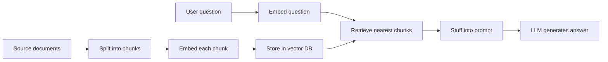
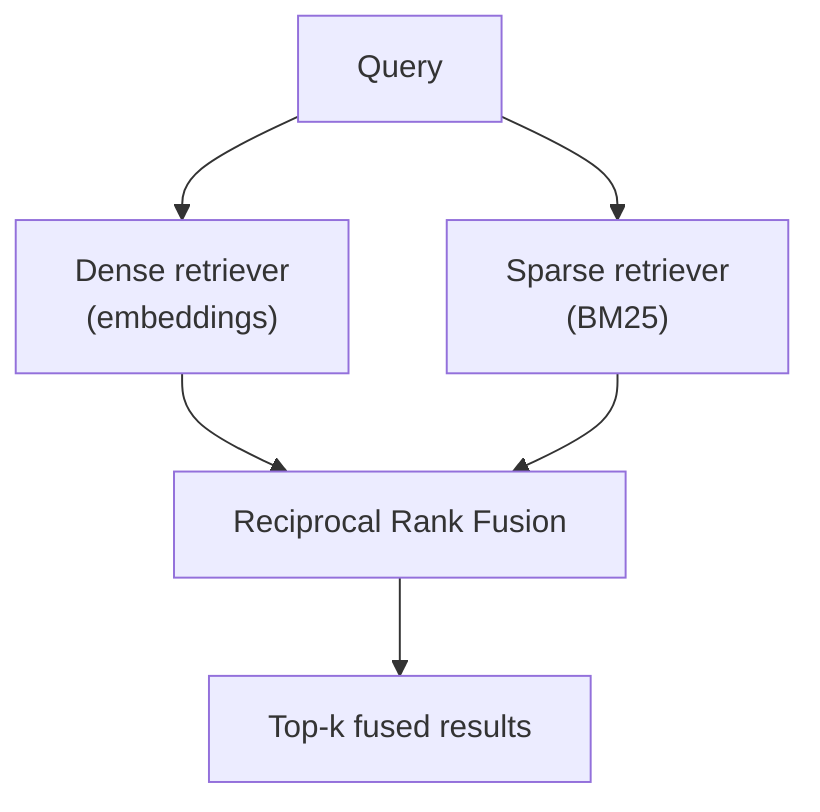
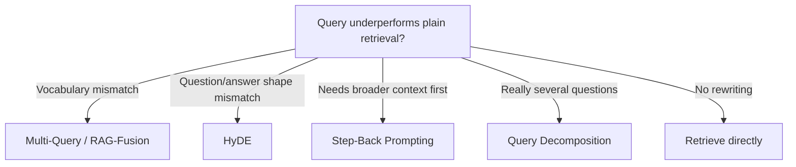
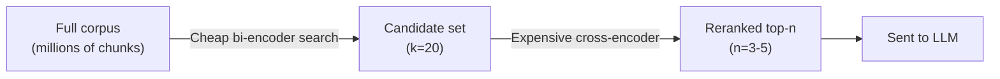
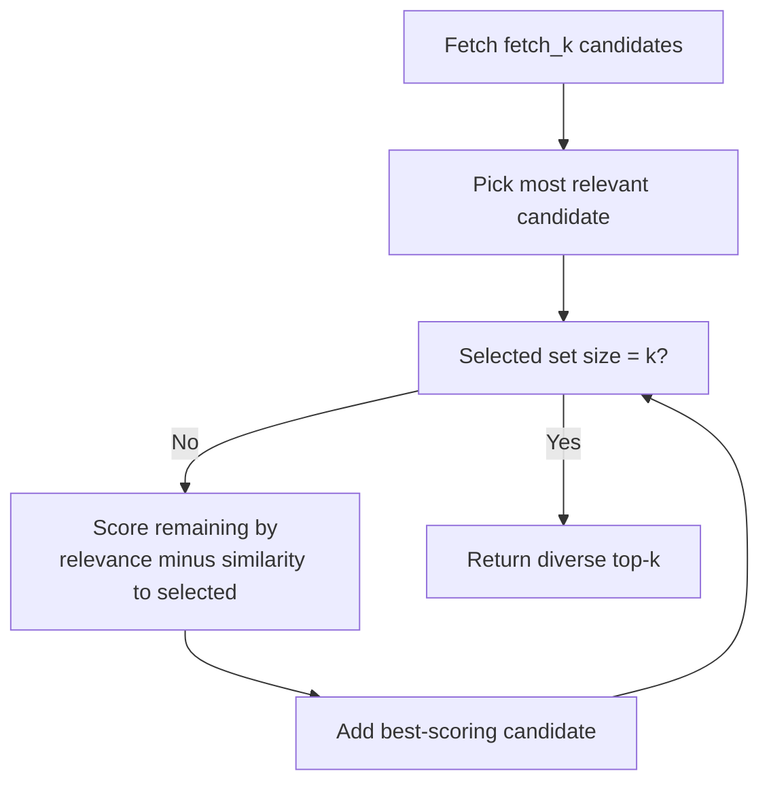
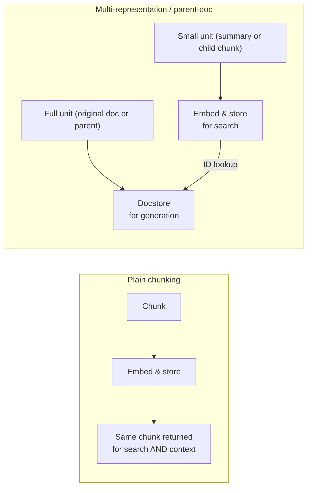

# 🔎 Retrieval & RAG — Interview Tutorial

| | |
|---|---|
| **Source** | `04_Retrieval_and_RAG/01_Introduction_to_RAG`, `04_Retrieval_and_RAG/02_Embeddings_and_Vector_Databases`, `04_Retrieval_and_RAG/03_Indexing_Techniques`, `04_Retrieval_and_RAG/04_Query_Transformation_Techniques`, `04_Retrieval_and_RAG/05_Post_Retrieval_Techniques`, `04_Retrieval_and_RAG/06_RAG_Naive_to_Production` |
| **Notebooks** | 60 |
| **Built** | 2026-09-16 |
| **Target roles** | Applied AI / AI Engineer · Agentic AI Engineer · Forward Deployed Engineer |
| **Note** | Section 4 is web-sourced live this run. Parent document retrieval (`06_RAG_Naive_to_Production/05_Parent_Document_Retriever`) gets one paragraph here — see `14_Interview_Preparation/Study_Guides/parent_document_retrieval_INTERVIEW_TUTORIAL.md` for the dedicated deep dive. |

## What this covers

| Concept | Source notebook | Interview weight |
|---|---|---|
| Naive RAG pipeline (load → split → embed → store → retrieve → generate) | `01_Introduction_to_RAG/Naive_RAG.ipynb`, `1_rag_overview.ipynb` | High |
| Embeddings & cosine similarity | `02_Embeddings_and_Vector_Databases/1. Embedding_Models.ipynb`, `1.1. Embedding.ipynb` | High |
| Vector stores (Chroma, FAISS, Pinecone, Astra) | `02_Embeddings_and_Vector_Databases/2.1–2.5*.ipynb` | High |
| Retriever types (similarity, MMR, ensemble, contextual compression) | `02_Embeddings_and_Vector_Databases/3. Retrievers.ipynb` | High |
| Hybrid search (BM25 + dense, RRF fusion) | `06_RAG_Naive_to_Production/03_Hybrid_Search_Strategies/1-densesparse.ipynb`, `1.1. Hybrid_Search_RAG.ipynb` | High |
| Cross-encoder reranking | `05_Post_Retrieval_Techniques/CrossEncoder_Reranking.ipynb`, `06_.../06_Postprocessing_Documents/10_RerankingCrossEncoder.ipynb` | High |
| Maximal Marginal Relevance (MMR) | `06_RAG_Naive_to_Production/03_Hybrid_Search_Strategies/3-mmr.ipynb` | Medium |
| Multi-representation & multi-vector indexing | `03_Indexing_Techniques/Multi_Representation_Indexing.ipynb` | Medium |
| Parent document retrieval (pointer — see dedicated tutorial) | `03_Indexing_Techniques/Parent_Document_Retrieval.ipynb`, `06_.../05_Parent_Document_Retriever/08_BetterRetriever.ipynb` | Medium |
| Query rewriting: Multi-Query, RAG-Fusion, Step-Back, HyDE | `04_Query_Transformation_Techniques/1. Rewriting or Query Expansion/*.ipynb` | High |
| Query decomposition | `04_Query_Transformation_Techniques/2. Decomposition/Decomposition.ipynb`, `06_.../04_Query_Enhancement/2-querydecomposition.ipynb` | Medium |
| Routing (LLM classifier & semantic) | `04_Query_Transformation_Techniques/3. Routing/a*.ipynb`, `b*.ipynb` | Medium |
| Self-querying retrieval (metadata filtering) | `04_Query_Transformation_Techniques/3. Routing/c. Self_Querying_Retrieval.ipynb` | Medium |
| Chunking strategies (fixed, recursive, semantic) | `06_.../02_Splitting_and_Chunking/1*.ipynb`, `2. Semantichunking.ipynb` | High |
| Document loaders (PDF, CSV, JSON, URL, YouTube, custom) | `06_.../01_Loading_Data/*.ipynb` | Low |
| Contextual retrieval (per-chunk LLM-generated context) | `06_.../07_Building_RAG_Systems/2. Build a Contextual Retrieval based RAG System.ipynb` | High |
| RAG with sources & citations | `06_.../07_Building_RAG_Systems/3*.ipynb`, `4*.ipynb` | Medium |

## Coverage gaps

Gaps that specifically bear on whether *retrieval* works in production — not the
generic 10-topic checklist:

- **Retrieval evaluation** `(not in your notebooks — build this)` — no notebook computes recall@k, MRR, or runs an offline eval set before/after a change (chunk size, reranker, hybrid weight). Every technique here is justified by "this should retrieve better" with no measurement backing it.
- **Streaming & async retrieval** `(not in your notebooks — build this)` — every retriever call is synchronous and blocking; none of the fan-out techniques (Multi-Query, RAG-Fusion) run their sub-queries concurrently, even though they are independent.
- **Retries & partial failure on retrieval calls** `(not in your notebooks — build this)` — no notebook handles a vector store timeout, an embedding API rate limit, or a reranker call failing mid-pipeline; a real system needs a fallback (skip reranking, degrade to vector-only) rather than crashing the whole answer.

---
## 1. Core concepts

### 1.1 Naive RAG: the four-stage pipeline

Retrieval-augmented generation (RAG) answers questions by fetching relevant text at query time and handing it to an LLM as context, instead of relying only on what the model memorized during training.

- **How it works**: split documents into chunks -> embed each chunk into a vector -> store vectors in a database -> at query time, embed the question and pull the nearest chunks -> stuff them into a prompt for the LLM.
- **Code** (`01_Introduction_to_RAG/Naive_RAG.ipynb`):
  ```python
  splitter = RecursiveCharacterTextSplitter(chunk_size=1000, chunk_overlap=200)
  chunks = splitter.split_documents(PyPDFLoader(path).load())

  vectorstore = Chroma.from_documents(chunks, OpenAIEmbeddings())
  docs = vectorstore.similarity_search_with_score(query, k=4)

  prompt = ChatPromptTemplate.from_template(
      "Answer using only this context:\n{context}\n\nQuestion: {question}"
  )
  ```
- **Say this in an interview**: "Naive RAG is index-then-retrieve-then-stuff — every later technique in this tutorial improves exactly one of those three stages."



---

### 1.2 Embeddings and cosine similarity

An embedding is a list of numbers (a vector) that represents the *meaning* of a piece of text — texts with similar meaning land close together in that vector space. Cosine similarity measures how close two vectors point in the same direction, which is what lets a search engine find text by meaning instead of by matching keywords.

- **How it works**: `embed_query()` and `embed_documents()` call the same model so the query and the corpus live in the same space; comparing vectors with cosine similarity ranks documents by semantic closeness.
- **Code** (`02_Embeddings_and_Vector_Databases/1.2. Openaiembeddings.ipynb`):
  ```python
  embeddings = OpenAIEmbeddings(model="text-embedding-3-small")
  doc_vecs = embeddings.embed_documents(corpus)
  query_vec = embeddings.embed_query("What is LangSmith?")
  scores = cosine_similarity([query_vec], doc_vecs)[0]
  ```
- **Say this in an interview**: "Cosine similarity ignores vector length and compares angle only, which matters because embedding magnitude isn't meaningful — only direction is."

<details>
<summary>🔍 Deep Dive: why a bare `OpenAIEmbeddings()` is a silent trap</summary>

`OpenAIEmbeddings()` with no `model=` argument still defaults to the legacy
`text-embedding-ada-002` model, not the newer `text-embedding-3-small` or `-large`.
Several notebooks (`b. RAG_Fusion.ipynb`, `d. HyDE.ipynb`) pin the model explicitly and
comment on this: *"Pinned explicitly: a bare `OpenAIEmbeddings()` still defaults to the
legacy ada-002."* The real failure mode: if you re-embed a corpus with a new model
version but forget to also re-embed your stored query-time embeddings (or vice versa),
similarity scores become meaningless — you're comparing vectors from two different
spaces that happen to have the same dimensionality. This is a common on-call incident
after a "quick embedding model upgrade."
</details>

---

### 1.3 Vector stores: what they actually add over a NumPy array

A vector store is a database purpose-built for storing embeddings and answering "find me the k nearest vectors to this one" fast, at a scale where brute-force comparison is too slow.

- **How it works**: on insert, it indexes vectors (commonly HNSW — hierarchical navigable small world graphs) for approximate nearest-neighbor (ANN) search; on query, it returns the top-k nearest by a configured distance metric.
- **Code** (`02_Embeddings_and_Vector_Databases/2.1. Chromadb.ipynb`):
  ```python
  vectorstore = Chroma.from_documents(
      documents=chunks,
      embedding=OpenAIEmbeddings(),
      collection_metadata={"hnsw:space": "cosine"},  # NOT the default
  )
  retriever = vectorstore.as_retriever(search_kwargs={"k": 5})
  ```
- **Say this in an interview**: "A vector store trades exact nearest-neighbor for approximate — HNSW gives sub-linear query time at the cost of occasionally missing the true nearest match."

<details>
<summary>🔍 Deep Dive: Chroma's default distance metric is euclidean, not cosine</summary>

`06_.../07_Building_RAG_Systems/2. Build a Contextual Retrieval based RAG System.ipynb`
flags this directly in a comment: *"need to set the distance function to cosine else it
uses euclidean by default."* Since OpenAI embeddings are meant to be compared by cosine
similarity, leaving Chroma on its default euclidean distance silently changes which
documents rank as "closest" — the ranking isn't wrong exactly, but it isn't the ranking
the embedding model was designed to produce. This is exactly the kind of default that
passes a smoke test (you still get *some* documents back) and fails a real eval.
</details>

---

### 1.4 Retriever types beyond plain similarity search

LangChain's `Retriever` interface wraps several different search strategies behind one `.invoke(query)` call, so swapping strategies means swapping the retriever, not the pipeline.

- **How it works**: `as_retriever(search_type=...)` selects `similarity`, `mmr`, or `similarity_score_threshold`; `EnsembleRetriever` combines multiple retrievers' rankings; `ContextualCompressionRetriever` post-filters or compresses what a base retriever returns.
- **Code** (`02_Embeddings_and_Vector_Databases/3. Retrievers.ipynb`):
  ```python
  compressor = LLMChainExtractor.from_llm(llm)
  compression_retriever = ContextualCompressionRetriever(
      base_compressor=compressor, base_retriever=vectorstore.as_retriever()
  )
  ```
- **Say this in an interview**: "The retriever abstraction decouples *how* you search from the rest of the RAG chain — I can go from similarity to MMR to an ensemble without touching the prompt or the LLM call."

---

### 1.5 Hybrid search: dense + sparse (BM25)

Dense (embedding) search finds meaning; sparse search (BM25, a keyword-frequency ranking algorithm) finds exact terms — codes, acronyms, IDs — that embeddings often blur together. Hybrid search runs both and merges the results.

- **How it works**: `BM25Retriever` scores documents by term frequency, `EnsembleRetriever` merges its ranked list with a dense retriever's using Reciprocal Rank Fusion (RRF) weighted by each retriever's assigned weight.
- **Code** (`06_.../03_Hybrid_Search_Strategies/1-densesparse.ipynb`):
  ```python
  bm25 = BM25Retriever.from_documents(chunks); bm25.k = 5
  dense = Chroma.from_documents(chunks, OpenAIEmbeddings()).as_retriever(search_kwargs={"k": 5})
  hybrid = EnsembleRetriever(retrievers=[bm25, dense], weights=[0.4, 0.6])
  ```
- **Say this in an interview**: "Dense retrieval alone fails on exact-match queries — a part number or an acronym — because embeddings smooth over surface form; BM25 catches exactly that case."



---

### 1.6 Reciprocal Rank Fusion (RRF)

RRF is the formula that merges several *ranked lists* into one ranking, used both to combine hybrid search's dense/sparse results and to combine RAG-Fusion's multiple query rewrites.

- **How it works**: every document gets a score of `1 / (rank + k)` summed across every list it appears in, so a document several lists agree on outranks one that scored #1 in only one list.
- **Code** (`04_Query_Transformation_Techniques/1. Rewriting or Query Expansion/b. RAG_Fusion.ipynb`):
  ```python
  def reciprocal_rank_fusion(results: list[list[Document]], k: int = 60):
      fused_scores = {}
      for docs in results:
          for rank, doc in enumerate(docs):
              key = doc.page_content            # content identity, not object identity
              fused_scores[key] = fused_scores.get(key, 0) + 1 / (rank + k)
      return sorted(fused_scores.items(), key=lambda x: x[1], reverse=True)
  ```
- **Say this in an interview**: "RRF uses rank position, not raw similarity score, specifically because scores from different retrievers or query variants aren't on comparable scales — ranks are."

<details>
<summary>🔍 Deep Dive: what the constant k actually controls</summary>

With the conventional `k=60`, the formula dampens how much a #1 rank dominates: `1/(1+60)
≈ 0.0164` vs `1/(4+60) ≈ 0.0156` — barely different. That's deliberate: RRF is built so
that *appearing in many lists* outweighs *ranking first in one list*, which is the whole
point of using multiple query rewrites or multiple retrievers — consensus across
independent views is stronger evidence than one strong opinion. A small `k` makes rank #1
dominate almost completely (closer to "trust the single best list"); a large `k` flattens
differences until fusion barely changes the ordering. The notebook's original bug — keying
fused scores by `str(doc)` instead of `doc.page_content`, and returning that string instead
of the `Document` object — is a real trap: two chunks with identical content but different
object identity get treated as different documents, and downstream code receives an
unusable repr string instead of a `Document`.
</details>

---

### 1.7 Query rewriting: Multi-Query, Step-Back, and HyDE

A user's question is often a poor search string. Several techniques rewrite it before retrieval instead of searching with it verbatim.

- **How it works**: Multi-Query asks an LLM for several phrasings of the same question and unions the retrieved results; Step-Back Prompting asks a more general question first to pull broader context; HyDE (Hypothetical Document Embeddings) asks the LLM to *write a fake answer* and embeds that answer instead of the question, because an answer looks more like the target chunks than a question does.
- **Code** (`04_Query_Transformation_Techniques/1. .../d. HyDE.ipynb`):
  ```python
  hyde = HypotheticalDocumentEmbedder.from_llm(llm, base_embeddings, prompt_key="web_search")
  hypothetical_vector = hyde.embed_query("What is LangSmith, and why do we need it?")
  docs = vectorstore.similarity_search_by_vector(hypothetical_vector)
  ```
- **Say this in an interview**: "HyDE fixes an asymmetry problem — a 9-word question and a 400-token answer chunk don't land near each other in embedding space even when the answer is correct, so I search with a hallucinated answer's embedding instead."



<details>
<summary>🔍 Deep Dive: HyDE always needs two separate models doing two different jobs</summary>

The LLM writes the hypothetical answer (it never sees your real documents); the embedding
model turns text into vectors (it never writes text). Neither step alone is HyDE. The
notebook underlines a subtler requirement: the *same* embedding model must embed both the
hypothetical answer and the real corpus — if you use `text-embedding-3-small` for the
corpus and default to `ada-002` for the hypothetical vector (see 1.2's Deep Dive on the
bare-`OpenAIEmbeddings()` trap), the two vectors are not comparable and similarity search
silently degrades. This is a named interview failure mode: candidates often describe HyDE
as "embed a fake answer" without naming that the embedding model must match end to end.
</details>

---

### 1.8 Query decomposition and routing

Some questions are really several questions, and some questions should not all go to the same retriever.

- **How it works**: decomposition breaks a complex question into ordered sub-questions, answers each with retrieval, then composes a final answer; routing sends a query to one of several retrievers/prompts, either via an LLM classifier with structured output or by comparing the query's embedding to each route's descriptive embedding (semantic routing).
- **Code** (`04_Query_Transformation_Techniques/3. Routing/b. Semantic_Routing.ipynb`):
  ```python
  route_embeddings = embeddings.embed_documents([r["description"] for r in routes])
  def prompt_router(query):
      q_vec = embeddings.embed_query(query)
      scores = cosine_similarity([q_vec], route_embeddings)[0]
      return routes[scores.argmax()]
  ```
- **Say this in an interview**: "Semantic routing skips an LLM call entirely — it's a cosine-similarity lookup against pre-embedded route descriptions, so it's cheaper and faster than an LLM classifier when the routes are stable."

---

### 1.9 Self-querying retrieval: metadata filters from natural language

Vector similarity can't express "rated above 4.5" or "published after 2020" — those are facts in metadata, not meaning in the text. Self-querying retrieval uses an LLM to split a question into a semantic part and a structured filter.

- **How it works**: `AttributeInfo` describes each metadata field's name, type and purpose; `SelfQueryRetriever.from_llm()` prompts the LLM to emit a structured query (semantic text + filter expression), then the vector store's own query translator turns that filter into its native syntax.
- **Code** (`04_Query_Transformation_Techniques/3. Routing/c. Self_Querying_Retrieval.ipynb`):
  ```python
  metadata_field_info = [AttributeInfo(name="rating", type="float", description="book rating out of 5")]
  retriever = SelfQueryRetriever.from_llm(llm, vectorstore, "book summaries", metadata_field_info)
  retriever.invoke("books rated above 4.5 published after 2003")
  ```
- **Say this in an interview**: "Self-querying puts an LLM in front of the retriever specifically to translate a numeric or categorical constraint into the vector store's native filter syntax — similarity search alone has no notion of greater-than."

---

### 1.10 Chunking strategies: the recall/precision dial

How you split documents into chunks controls both what gets embedded and what an LLM sees at generation time — chunk size is a tuning knob, not a fixed setting.

- **How it works**: fixed-size splitters (`CharacterTextSplitter`, `RecursiveCharacterTextSplitter`) cut by character/token count with configurable overlap; semantic chunking instead measures embedding-similarity drops between consecutive sentences and splits where meaning actually shifts.
- **Code** (`06_.../02_Splitting_and_Chunking/2. Semantichunking.ipynb`):
  ```python
  chunker = SemanticChunker(OpenAIEmbeddings(), breakpoint_threshold_type="percentile")
  semantic_chunks = chunker.split_documents(docs)
  ```
- **Say this in an interview**: "Smaller chunks make retrieval more precise but starve generation of context; bigger chunks give more context but blur the embedding — semantic chunking tries to cut at real topic boundaries instead of a fixed length, at the cost of one embedding-similarity pass per document before you even index it."

---

### 1.11 Cross-encoder reranking

A bi-encoder (the usual embedding model) encodes the query and each document *separately* and compares vectors — fast, but it can't model interaction between the two texts. A cross-encoder reranker feeds the query and a candidate document *together* into one model and scores relevance directly — much more accurate, much slower.

- **How it works**: retrieve a larger candidate set cheaply with the vector store (e.g. k=20), then rerank only those with a cross-encoder and keep the top few for generation.
- **Code** (`05_Post_Retrieval_Techniques/CrossEncoder_Reranking.ipynb`):
  ```python
  reranker = CrossEncoderReranker(model=HuggingFaceCrossEncoder(model_name="BAAI/bge-reranker-base"), top_n=3)
  compression_retriever = ContextualCompressionRetriever(base_compressor=reranker, base_retriever=vectorstore.as_retriever(search_kwargs={"k": 20}))
  ```
- **Say this in an interview**: "Reranking is a two-stage retrieve-then-rerank pattern precisely because a cross-encoder is too slow to run over the whole corpus — it only pays its accuracy cost on a small, pre-filtered candidate set."



---

### 1.12 Maximal Marginal Relevance (MMR): relevance vs. diversity

Plain top-k similarity search can return k near-duplicate chunks that all say the same thing. MMR re-ranks candidates to balance relevance to the query against dissimilarity to documents already selected.

- **How it works**: iteratively pick the candidate maximizing `λ · relevance − (1−λ) · max_similarity_to_selected`; `λ=1` is plain similarity search, `λ=0` maximizes diversity only.
- **Code** (`06_.../03_Hybrid_Search_Strategies/3-mmr.ipynb`):
  ```python
  retriever = vectorstore.as_retriever(
      search_type="mmr",
      search_kwargs={"k": 3, "fetch_k": 20, "lambda_mult": 0.5},
  )
  ```
- **Say this in an interview**: "MMR fetches a larger candidate pool (`fetch_k`) than it returns (`k`), specifically so it has room to trade off a slightly-less-relevant-but-different document against a near-duplicate of one already picked."



---

### 1.13 Multi-representation & parent document indexing

Sometimes the best unit to *search* isn't the best unit to *feed the LLM*. Multi-representation indexing stores a compact representation (a summary, or a small "child" chunk) for search, and swaps in a fuller document at generation time.

- **How it works**: `MultiVectorRetriever` embeds LLM-generated summaries but stores the full original document in a linked docstore, keyed by the same ID; parent document retrieval does the same trick with a small/large chunk pair instead of a summary/original pair (full treatment in `14_Interview_Preparation/Study_Guides/parent_document_retrieval_INTERVIEW_TUTORIAL.md`).
- **Code** (`03_Indexing_Techniques/Multi_Representation_Indexing.ipynb`):
  ```python
  retriever = MultiVectorRetriever(vectorstore=summary_vectorstore, byte_store=InMemoryByteStore(), id_key="doc_id")
  retriever.vectorstore.add_documents(summary_docs)   # search unit
  retriever.docstore.mset(list(zip(doc_ids, full_docs)))  # generation unit
  ```
- **Say this in an interview**: "This decouples the retrieval unit from the generation unit — you can index whatever representation searches best and still hand the LLM whatever context it needs, as long as an ID links the two."



---

### 1.14 Contextual retrieval

A chunk in isolation often loses the context that made it findable — "the model" means nothing without knowing which paper it came from. Contextual retrieval has an LLM prepend a short situating context to each chunk *before* embedding it.

- **How it works**: for every chunk, call an LLM with the whole source document plus that chunk, asking for a 3-4 sentence context; prepend that context to the chunk text, then embed the combined text.
- **Code** (`06_.../07_Building_RAG_Systems/2. Build a Contextual Retrieval based RAG System.ipynb`):
  ```python
  def create_contextual_chunks(file_path, chunk_size=3500):
      doc_chunks = splitter.split_documents(PyMuPDFLoader(file_path).load())
      original_doc = '\n'.join(c.page_content for c in doc_chunks)
      return [Document(page_content=generate_chunk_context(original_doc, c.page_content) + '\n' + c.page_content,
                        metadata=c.metadata) for c in doc_chunks]
  ```
- **Say this in an interview**: "Contextual retrieval trades one extra LLM call per chunk at indexing time for better standalone retrievability of every chunk — it's an indexing-time cost, not a query-time one, so it's a one-off bill that scales with corpus size, not query volume."

---

## 2. Gotchas

**`LANGSMITH_PROJECT` silently loses to a pre-set `LANGCHAIN_PROJECT`**
- **Symptom**: traces from a new notebook land in the wrong LangSmith project with no error.
- **Cause**: the SDK checks the `LANGSMITH_`-prefixed env vars first; if the legacy `LANGCHAIN_PROJECT` is already set in `.env`, it wins even though `LANGSMITH_PROJECT` was set in the notebook.
- **Fix**: standardize on the `LANGSMITH_*` prefix everywhere and remove any lingering `LANGCHAIN_PROJECT`/`LANGCHAIN_TRACING_V2` from `.env`.
- **Interview angle**: "Your traces for a new feature show up mixed into an old project's dashboard — what's the first thing you check?"

**A bare `OpenAIEmbeddings()` still returns `text-embedding-ada-002`**
- **Symptom**: similarity scores look subtly off after "upgrading" only part of a pipeline; no exception is raised.
- **Cause**: the LangChain wrapper's default model has not tracked OpenAI's own embedding model recommendations, so omitting `model=` silently opts into the legacy 2022 model.
- **Fix**: always pass `model="text-embedding-3-small"` (or `-large`) explicitly, and re-embed the full corpus whenever the model changes.
- **Interview angle**: "Search quality dropped after a deploy and nobody touched the retrieval code — what would you check first?"

**Chroma's default distance metric is euclidean, not cosine**
- **Symptom**: retrieval rankings differ from what cosine similarity on the same vectors would produce, with no error or warning.
- **Cause**: `Chroma.from_documents()` defaults its HNSW index to squared-L2 (euclidean) distance unless `collection_metadata={"hnsw:space": "cosine"}` is passed explicitly.
- **Fix**: set the distance function at collection creation time — it cannot be changed on an existing collection without reindexing.
- **Interview angle**: "You switched vector stores and retrieval quality changed even though the embeddings didn't — what's the likely cause?"

**HyDE and self-querying need two matched models, and it's easy to mismatch them**
- **Symptom**: similarity scores are uniformly poor even though the hypothetical-answer text looks reasonable when printed.
- **Cause**: the LLM generating the hypothetical answer and the embedding model comparing it against the corpus are two independent components — if the corpus and the hypothetical answer are embedded with different models (or model versions), the vectors are not in the same space.
- **Fix**: pin one embedding model explicitly and use it for both the corpus and every query-time embedding, HyDE included.
- **Interview angle**: "Walk me through what could make HyDE perform *worse* than plain query embedding."

**RRF keyed by `str(doc)` silently corrupts fusion**
- **Symptom**: downstream code receives raw Python repr strings instead of usable `Document` objects, and identical chunks get double-counted as different documents.
- **Cause**: using `str(doc)` (object identity plus repr formatting) as the dictionary key for fusion, instead of `doc.page_content` (content identity).
- **Fix**: key and return by `page_content` (or a stable content hash), keeping a separate lookup back to the real `Document` object.
- **Interview angle**: "Your fusion step's output documents look wrong downstream — where would you look?"

**MMR's `fetch_k` must exceed `k`, or diversity has nothing to select from**
- **Symptom**: MMR returns results indistinguishable from plain similarity search even with `lambda_mult` turned down.
- **Cause**: MMR selects the diverse subset from `fetch_k` candidates; if `fetch_k` equals or barely exceeds `k`, there's no pool to trade relevance against.
- **Fix**: set `fetch_k` to several times `k` (e.g. `fetch_k=20, k=3`) so MMR has real alternatives to weigh.
- **Interview angle**: "You turned on MMR and got the same results as before — why?"

**Free-text LLM parsing (`split("\n")`) corrupts every downstream fusion step**
- **Symptom**: a model's numbered list, header, or preamble line becomes a "query" that gets sent to the retriever and returns junk documents.
- **Cause**: parsing a chat model's raw text reply with a naive string split assumes a rigid output format the model doesn't reliably produce.
- **Fix**: bind a Pydantic schema with `with_structured_output()` so the provider returns validated JSON instead of freeform text.
- **Interview angle**: "For RAG-Fusion specifically, why does a bad parser hurt more than for a single-query pipeline?" (Bad entries don't just add noise — they still *vote* in the ranking, corrupting fusion.)

**Contextual retrieval's per-chunk LLM call is an indexing-time cost that scales with corpus size**
- **Symptom**: indexing a modest set of PDFs takes minutes and racks up a real LLM bill, unlike ordinary chunking which is instant and free.
- **Cause**: `create_contextual_chunks()` makes one LLM call per chunk (passing the *entire* source document as context each time) before anything is embedded.
- **Fix**: batch or cache context generation per document, and budget indexing cost as `chunks × LLM call cost`, not as a one-time flat fee.
- **Interview angle**: "A colleague wants contextual retrieval for a 50,000-document corpus re-indexed nightly — what do you tell them about cost?"

---
## 3. Tradeoffs

### Chunk size
| Option | Costs you | Buys you | Pick when |
|---|---|---|---|
| Small chunks (~200-400 tokens) | Less context per hit, more chunks to manage | Precise, focused embeddings | Queries target specific facts |
| Large chunks (~1000+ tokens) | Blurred embeddings, wasted context tokens | Fuller context per hit | Queries need surrounding narrative |

**The one-liner**: "Chunk size is a recall/precision dial, not a config default — I tune it against an eval set, not a gut feeling."

### Dense-only vs. hybrid (dense + BM25) retrieval
| Option | Costs you | Buys you | Pick when |
|---|---|---|---|
| Dense only | Misses exact-match terms (IDs, acronyms, jargon) | Simpler pipeline, one index | Corpus is prose-heavy, few exact codes |
| Hybrid (dense + BM25) | Extra index, a fusion weight to tune | Catches both meaning and exact terms | Corpus mixes prose with codes, IDs, product names |

**The one-liner**: "If a query could reasonably be answered by ctrl-F, dense retrieval alone will eventually miss it."

### Adding a reranker
| Option | Costs you | Buys you | Pick when |
|---|---|---|---|
| Vector search only | Lower relevance ceiling on ambiguous queries | Lowest latency, cheapest | Latency budget is tight, corpus is narrow |
| Vector search + cross-encoder rerank | Extra network hop, higher p95 latency | Meaningfully better top-k precision | Retrieval quality is the bottleneck, not latency |

**The one-liner**: "Retrieve wide and cheap, rerank narrow and expensive — never run a cross-encoder over the whole corpus."

### Query rewriting: none vs. Multi-Query/RAG-Fusion vs. HyDE
| Option | Costs you | Buys you | Pick when |
|---|---|---|---|
| No rewriting | Misses phrasing mismatches | Lowest latency, one retrieval call | Query vocabulary matches corpus vocabulary well |
| Multi-Query / RAG-Fusion | N extra LLM + retrieval calls | Covers multiple phrasings/facets | Users phrase the same intent very differently |
| HyDE | One extra LLM call, needs matched embedding model | Fixes question/answer asymmetry | Short questions, long answer-shaped chunks |

**The one-liner**: "Rewriting trades one retrieval call for several, so it only pays off when the phrasing gap is the actual bottleneck — measure that before adding it."

### Self-querying vs. plain metadata post-filtering
| Option | Costs you | Buys you | Pick when |
|---|---|---|---|
| Post-filter after retrieval | May filter out the only good hits if k was too small | Simple, no extra LLM call | Filters are rare or simple equality checks |
| Self-querying (LLM builds the filter) | One extra LLM call, needs a maintained `AttributeInfo` schema | Handles ranges, comparisons, natural-language constraints | Users phrase numeric/categorical constraints in free text |

**The one-liner**: "Self-querying is worth its LLM call the moment users start typing constraints like 'above 4.5' instead of clicking a filter widget."

### MultiVectorRetriever / parent document retrieval vs. plain chunking
| Option | Costs you | Buys you | Pick when |
|---|---|---|---|
| Plain chunking | One coupled unit for both search and context | Simplest to build and debug | Chunks are already a good size for both jobs |
| Multi-representation / parent-doc | A second store (docstore) to keep in sync, dedup logic | Precise search, full context at generation | Search-optimal and generation-optimal units genuinely differ |

**The one-liner**: "The moment your best search unit and your best context unit disagree in size, decouple them instead of compromising on one number."

### Contextual retrieval vs. plain chunking
| Option | Costs you | Buys you | Pick when |
|---|---|---|---|
| Plain chunking | Chunks lose context when read in isolation | Free, instant indexing | Corpus is small or budget-constrained |
| Contextual retrieval | One LLM call per chunk at index time | Better standalone retrievability per chunk | Corpus has many context-dependent chunks (multi-doc technical corpora) |

**The one-liner**: "Contextual retrieval moves cost from 'never' to 'once per chunk at index time' — measure the retrieval lift against that bill before adopting it corpus-wide."

---
## 4. Top 10 interview questions: real-time agentic system design

1. **Your RAG system returns a confident, wrong answer. How do you debug it?**
   Isolate the stage: print the retrieved chunks first — if they're irrelevant, the problem is retrieval (chunking, embedding model, or index); if they're relevant but the answer is still wrong, the problem is the prompt or the LLM ignoring context. Check whether the answer used the context at all versus the model's parametric memory. A strong answer names both failure classes and how to distinguish them in under a minute.
   Source: [Top 10 RAG Engineer Interview Questions and Answers for 2026 — The Interview Guys](https://blog.theinterviewguys.com/rag-engineer-interview-questions-and-answers/)

2. **How do you decide chunk size for a new corpus, and how do you know it's right?**
   Chunk size is a recall/precision tradeoff, not a fixed number — start from a baseline (e.g. 500-1000 tokens with ~15% overlap), then measure recall@k on a labeled eval set as you vary it, rather than eyeballing outputs. A strong answer ties the choice to document structure (are natural sections shorter or longer than the default?) and to what the reranker downstream can tolerate.
   Source: [Chunking Strategies in RAG Systems: Insights from 80+ GenAI Interviews](https://levelup.gitconnected.com/chunking-strategies-in-rag-systems-insights-from-80-genai-interviews-8ceb4a17701a)

3. **Explain how an ANN vector index (HNSW) works and why it's not exact.**
   HNSW builds a multi-layer graph where higher layers have fewer, longer-range links for fast coarse navigation and lower layers are densely connected for fine-grained search, greedily walking toward the query vector layer by layer. It's approximate because it can get stuck in a local neighborhood and never see the true nearest neighbor, trading a small, tunable recall loss for sub-linear query time versus brute-force comparison.
   Source: [HNSW indexing in Vector Databases: Simple explanation and code](https://medium.com/@wtaisen/hnsw-indexing-in-vector-databases-simple-explanation-and-code-3ef59d9c1920)

4. **Your p95 retrieval latency doubled after adding a cross-encoder reranker. What do you do?**
   First confirm the reranker is the cause by comparing latency with it bypassed; if confirmed, shrink the candidate set it reranks (`fetch_k`) before optimizing the model itself, since reranker cost scales with candidates × query. Consider a lighter/distilled cross-encoder, batching, or running rerank only when initial similarity scores are ambiguous rather than on every query.
   Source: [RAG pipeline latency budget: where the ms go — Boundev](https://www.boundev.ai/blog/latency-budget-rag-pipeline)

5. **How do you evaluate whether a retrieval change actually helped, without shipping and hoping?**
   Build a small labeled eval set of query → relevant-document pairs from real or synthetic queries, and measure recall@k and mean reciprocal rank (MRR — the average of 1/rank of the first correct hit) before and after the change. For generation quality on top of that, use an LLM-as-judge rubric, but pair it with a human-reviewed sample since judges have their own biases (verbosity bias, position bias) that need calibrating out.
   Source: [How to Evaluate RAG Systems: Metrics, Methods, and What to Measure First — Comet](https://www.comet.com/site/blog/rag-evaluation/)

6. **When would you choose hybrid (dense + BM25) search over dense-only?**
   Whenever the corpus contains exact-match-sensitive content — product codes, error strings, acronyms, names — that embeddings tend to blur together by meaning rather than preserve as literal tokens. A strong answer names the fusion mechanism (typically Reciprocal Rank Fusion, an `EnsembleRetriever`-style weighted merge of ranked lists) and says the dense/sparse weight itself needs tuning against an eval set, not guessing.
   Source: [Vector Databases for System Design Interviews — DesignGurus](https://www.designgurus.io/system-design-interview/concepts/vector-databases)

7. **Design a RAG system for a customer who cannot send data to a third-party LLM API.**
   Scope down to what's actually needed: a self-hosted or VPC-deployed embedding model and LLM (open-weights, e.g. via a hosted-in-their-cloud endpoint), a vector store that runs inside their network boundary, and no external calls in the retrieval or generation path at all. A strong answer names the tradeoff up front — lower ceiling on model quality and more infra to own — and gives a scoped two-week plan rather than promising parity with a hosted frontier model.
   Source: [Gen AI System Design Interview: RAG, Agents, and Scaling — TopGenAIJobs](https://www.topgenaijobs.com/blog/genai-system-design-interview)

8. **A single slow retrieval call is blocking your whole agent loop. How do you fix it?**
   Put a hard timeout and a fallback path on every retrieval call (e.g. degrade to a cached or vector-only result if the reranker or a secondary index times out), and run independent retrieval calls (multi-query fan-out, hybrid dense+sparse) concurrently instead of sequentially. A strong answer states the latency budget explicitly — e.g. "retrieval gets 300ms of a 2s end-to-end budget" — rather than treating latency as unbounded.
   Source: [A Latency Budget for Production RAG](https://www.technovice.net/post/latency-budget-production-rag)

9. **What's the actual difference between a bi-encoder (embedding model) and a cross-encoder (reranker), and why use both?**
   A bi-encoder embeds the query and each document independently, so document embeddings can be precomputed and searched at scale; a cross-encoder feeds the query and one document together into the model and outputs a relevance score, which is far more accurate because it lets the two texts interact, but it can't be precomputed and doesn't scale to a full corpus. The two-stage retrieve-then-rerank pattern exists specifically to get the cross-encoder's accuracy only on a small, cheaply pre-filtered candidate set.
   Source: [Reranking for RAG: Cross-Encoders vs LLM Rerankers — thegeocommunity](https://thegeocommunity.com/blogs/generative-engine-optimization/reranking-cross-encoder-llm-reranker/)

10. **How would you design and optimize a RAG system end to end, given a real interview prompt like "build search over our internal docs"?**
    Walk the pipeline in order and name a decision at each stage: loader choice per document type, chunk size backed by an eval, embedding model choice, hybrid search if the corpus has codes/IDs, reranking if latency budget allows it, and a citation/source-attribution step so answers are checkable. A strong answer volunteers where it would measure (an eval set) and where it would degrade gracefully under load, rather than describing only the happy path.
    Source: [Design and optimize a RAG system — OpenAI Interview Question, prachub](https://prachub.com/interview-questions/design-and-optimize-a-rag-system)

---
## 5. Role tracks

### 5.1 Applied AI / AI Engineer
Probes whether you can diagnose *where* retrieval failed and prove a change helped, with real numbers.

- **Q: Your retriever's top result is topically related but doesn't actually answer the question — what's wrong?** A: Likely a chunking or embedding-granularity issue — the chunk is "about" the right topic but doesn't contain the specific fact; check chunk size and consider metadata filtering or reranking to surface the precise passage.
- **Q: How do you pick between prompting, RAG, and fine-tuning for a knowledge gap?** A: RAG when the gap is fresh or frequently changing factual knowledge; fine-tuning when the gap is about output *format* or *behavior*, not facts; prompting alone when the model already knows the domain and just needs steering.
- **Q: What does recall@k actually measure, and why isn't precision enough alone?** A: Recall@k is the fraction of truly relevant documents that appear anywhere in the top k results; precision alone can look great with k=1 but miss all the other relevant chunks a generation step might need.
- **Q: Your embedding model upgrade improved offline eval but degraded prod. What do you check?** A: Whether the corpus was fully re-embedded with the new model (a mixed-model index compares incompatible vector spaces) and whether the eval set represents real production query distribution.
- **Q: When do you add a reranker versus just improving chunking?** A: Add a reranker when initial retrieval brings back the right documents but ranks them badly; fix chunking when the right documents aren't in the candidate set at all — reranking can't fix a recall problem.
- **Q: How would you build an eval set with no labeled data?** A: Generate synthetic query-document pairs by asking an LLM to write questions a chunk answers, then have a human spot-check a sample before trusting it.
- **Q: What's LLM-as-judge's biggest failure mode?** A: Bias toward longer, more confident-sounding answers regardless of correctness (verbosity/position bias) — calibrate with a human-labeled sample and prefer pairwise comparison over absolute scoring where possible.
- **Q: Your p95 latency doubled after adding hybrid search. What's your first move?** A: Profile which retriever (dense or BM25) or the fusion step is the bottleneck before touching either — they usually run sequentially by default and can be parallelized.

**Take-home task**:
- Given a small document set and 15 labeled queries, build a naive RAG pipeline and report recall@5 and MRR.
- Add one improvement (chunk size, hybrid search, or reranking) and report the delta with numbers, not vibes.
- State in one paragraph when you would *not* recommend shipping the improvement.

### 5.2 Agentic AI Engineer
Probes whether retrieval calls inside an agent loop fail safely and terminate.

- **Q: A tool-calling agent uses RAG as one of its tools. What happens if the retrieval call times out?** A: The tool should return a structured error the agent can reason about ("no results, try rephrasing"), not raise an unhandled exception that kills the whole run.
- **Q: How do you stop an agent from calling the retriever in an infinite refine-and-retry loop?** A: A hard call cap on the retrieval tool specifically, separate from the overall agent step budget, since retrieval loops are a common specific failure mode.
- **Q: Your multi-query fan-out (5 rewritten queries) is 5x slower than single-query retrieval. How do you fix it without losing the technique's benefit?** A: Run the 5 retrieval calls concurrently (`retriever.map()` or `asyncio.gather`) since they're independent — the notebooks in this tutorial run them sequentially, which is a real gap to close before production.
- **Q: One of your ensemble retriever's two backends (dense or BM25) goes down. What happens to the agent's answer?** A: It should degrade to the surviving retriever with a lower confidence flag, not fail the whole turn — treat retrieval as a fan-out with partial-failure tolerance, same as any other tool call.
- **Q: When would you route a query to a different retrieval strategy mid-conversation rather than fixed at setup?** A: When query type varies turn to turn — e.g. semantic routing to send factual lookups to a vector store and structured/numeric asks to self-querying — decided per-turn, not once per session.
- **Q: How do you make contextual retrieval's indexing cost bounded for an agent that ingests documents live?** A: Cap or batch per-chunk LLM calls, and consider generating context only for chunks that are actually retrieved cold rather than for the whole corpus upfront.
- **Q: What do you log per retrieval call so a bad agent run is debuggable from a trace?** A: The query sent, the retriever/strategy used, the chunk IDs and scores returned, and which chunks were actually used in the final prompt — enough to answer "why did it retrieve that" after the fact.
- **Q: Why is multi-agent retrieval (a dedicated "retrieval agent") often worse than a single retrieval tool call?** A: It adds a coordination and communication-format overhead (agent-to-agent messages) without adding capability, when a well-designed tool schema does the same job with a single call.

**Take-home task**:
- Take the RAG-Fusion notebook's 5-query fan-out and rewrite it to run concurrently with a per-call timeout and a fallback to fewer variations on partial failure.
- Add a hard cap so the whole retrieval step never exceeds a stated latency budget.
- Log per-query and per-fusion-step timings.

### 5.3 Forward Deployed Engineer (FDE)
Probes whether the retrieval system survives a real customer's data, constraints, and questions.

- **Q: A customer's docs are 40GB of unstructured PDFs and scanned images. What's your first two weeks?** A: Week one: get a narrow slice (one document type) through the loader → chunk → embed → retrieve pipeline end to end with a rough eval; week two: expand coverage and add the loaders/OCR the actual corpus needs, informed by what broke in week one.
- **Q: Your demo works great on your test docs and fails on the customer's real data. How do you find out why?** A: Pull a sample of the customer's actual failing queries and documents, run them through the pipeline stage by stage (loader output, chunk boundaries, retrieved docs), and compare against your test corpus's structure — document structure mismatches are the most common cause.
- **Q: The customer can't send data to OpenAI. What do you tell them, and what changes in the architecture?** A: Explain that the LLM and embedding model both need to be self-hosted or run in their VPC — the loaders, chunking and vector store logic don't change, only the model endpoints do, and the tradeoff is a lower model quality ceiling.
- **Q: The customer asks for 99% retrieval accuracy. How do you respond?** A: Reframe around a measurable metric they'd accept (recall@k on their own labeled examples) and be honest that no retrieval system hits 99% on open-ended natural language queries — set the expectation before building, not after.
- **Q: The customer's documents mix scanned images, Word docs, and a wiki export. What's your loader strategy?** A: Pick the loader per source type up front (`PyMuPDFLoader`/OCR for scans, `UnstructuredWordDocumentLoader` for Word, a custom loader for the wiki export) rather than forcing one loader to handle everything, and normalize to a common `Document` schema before chunking.
- **Q: How do you build an eval set for a customer who has no labeled data and doesn't want to spend time labeling?** A: Mine their support tickets or existing FAQ for real questions with known answers, or ask 3-4 of their power users for 10 questions each — a small, real eval beats a synthetic one for customer-specific evaluation.
- **Q: The customer's compliance team asks where their document text is sent.** A: Name every hop explicitly — loader (local), embedding API (external unless self-hosted), vector store (where is it hosted, what region), LLM call (external unless self-hosted) — and flag which hops need a signed data processing agreement.
- **Q: They want citations in every answer so their users can verify it. How do you build that without a major redesign?** A: Attach chunk metadata (source file, page) through the pipeline and have the generation prompt cite by ID, matching the pattern in `06_.../07_Building_RAG_Systems/4. Building a RAG System with Citations.ipynb` — the pattern here already threads a citation schema through a Pydantic-typed LLM output.

**Take-home task**:
- Given 5 mixed-format sample documents (PDF, CSV, Markdown) and no labeled queries, build a working retrieval slice in a time-boxed session.
- Write a one-page eval plan using only what the customer would realistically hand over.
- List, in bullets, what you deliberately faked or scoped out to hit the deadline.

---
## 6. Mock system design: a real-time agentic RAG support assistant

**The prompt** (as an interviewer would give it): "Design a support assistant that answers customer questions from our product docs and internal runbooks, in under 2 seconds, for 10,000 users a day. It sometimes needs to search both sources and combine them. How do you build it?"

**Scoring rubric** (what a strong answer covers):
- Names a concrete latency budget split across stages (e.g. embed query 50ms, retrieve 150ms, rerank 200ms, generate 1200ms).
- Chooses hybrid search or routing between "product docs" and "runbooks" as two separate indices, not one blended index, and justifies it.
- Handles the case where the two sources disagree or only one has an answer.
- Names a fallback for a slow or failed retrieval call rather than assuming it always succeeds.
- Describes how they'd know the system is working before and after shipping a change (an eval set, not vibes).
- Addresses cost at 10,000 users/day scale (embedding cache, reranker only on ambiguous queries).
- Volunteers a failure mode: what happens when the answer isn't in either source at all.

**A worked strong answer**:
- Two separate vector indices (product docs, runbooks) plus BM25 on each, so an exact error code or SKU still surfaces even if it embeds poorly.
- A lightweight semantic router decides which index(es) to query per question — cheap cosine-similarity lookup, not an LLM call, to stay inside the latency budget.
- Retrieve k=20 per source concurrently, rerank the merged candidate set down to top 5 with a cross-encoder only when the top similarity scores are close together (ambiguous); skip reranking when the top hit is a clear winner, to save p95 latency.
- Cache query embeddings for repeated/similar questions (support queries cluster heavily) to cut embedding-call cost and latency.
- Hard 400ms budget on the retrieval stage combined; on timeout, fall back to whichever source returned in time rather than failing the whole answer.
- Generation prompt requires citing which source (product docs vs. runbook) each claim came from, and the system explicitly says "I don't have that in my docs" when nothing crosses a relevance threshold, rather than letting the LLM guess.
- Weekly recall@k check against a growing labeled query set built from real support tickets, tracked over time as a regression gate before any retrieval-stage change ships.

---
## 7. Self-check

**Rapid-fire (one line each)**
1. What does RAG stand for and why does it exist? -> Retrieval-augmented generation; it grounds an LLM's answer in fetched text instead of only its training-time memory.
2. What does cosine similarity measure? -> The angle between two vectors, ignoring magnitude.
3. Why does `OpenAIEmbeddings()` with no arguments matter? -> It silently defaults to the legacy `text-embedding-ada-002` model.
4. What's Chroma's default distance metric? -> Euclidean, not cosine — must be set explicitly.
5. What does BM25 add that dense retrieval misses? -> Exact keyword/term matching for codes, acronyms, IDs.
6. What does RRF's constant `k` control? -> How much a #1 rank in one list dominates versus consensus across lists.
7. What problem does HyDE solve? -> The asymmetry between a short question and a long answer-shaped chunk in embedding space.
8. What does self-querying retrieval add over plain vector search? -> Metadata filters (ranges, comparisons) parsed from natural language by an LLM.
9. Why rerank instead of just retrieving more documents? -> A cross-encoder scores query+document jointly for much better accuracy, but is too slow to run over a whole corpus.
10. What does MMR's `lambda_mult` control? -> The balance between relevance (1.0) and diversity (0.0) in result selection.
11. Why does `fetch_k` need to exceed `k` for MMR? -> MMR needs a larger candidate pool to select a diverse subset from.
12. What's the difference between parent document retrieval and multi-representation indexing? -> Same pattern (search unit ≠ generation unit); parent-doc uses a small/large chunk pair, multi-representation uses a summary/original pair.
13. What does contextual retrieval cost that plain chunking doesn't? -> One LLM call per chunk at indexing time.
14. What's recall@k? -> The fraction of truly relevant documents that appear anywhere in the top k retrieved results.
15. Name one thing missing from every notebook in this folder that a production system needs. -> An offline retrieval eval set (recall@k/MRR) measuring whether any of these techniques actually helped.

**Explain to a skeptical staff engineer**
- "Why does adding a reranker sometimes make p95 latency unacceptable, and how would you keep the accuracy gain without the tail latency?"
- "Walk me through why RRF uses rank instead of raw similarity score, with a concrete case where raw scores would mislead you."
- "You want to add HyDE to an existing pipeline. What's the one config detail that will silently break it if you get it wrong?"
- "Justify decoupling the search unit from the generation unit (multi-vector / parent-doc) instead of just picking one chunk size — what evidence would you want before adding that complexity?"
