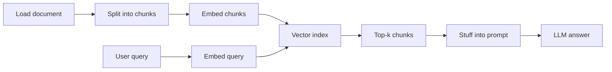
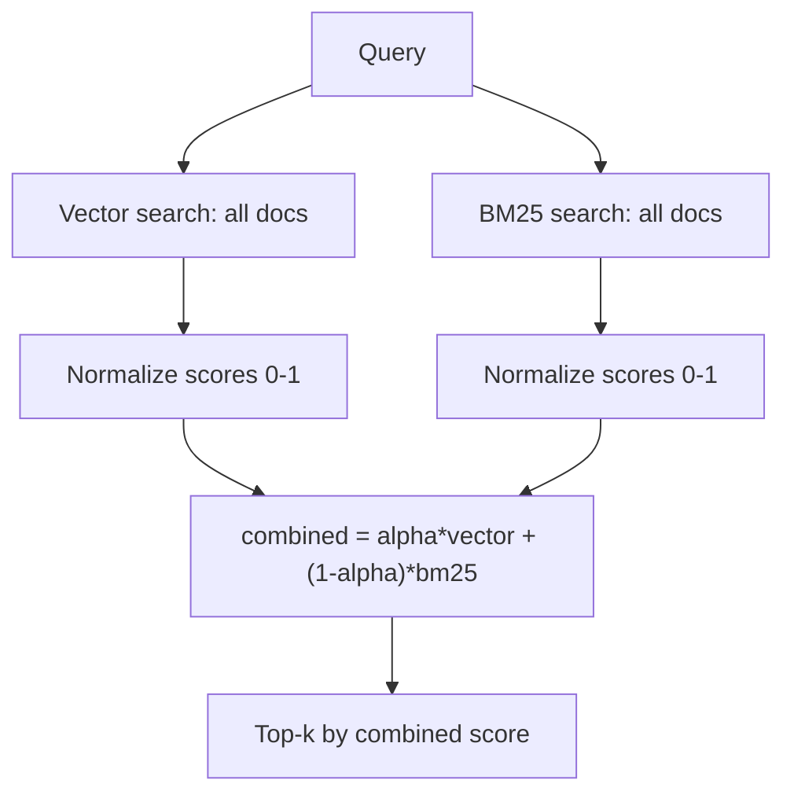
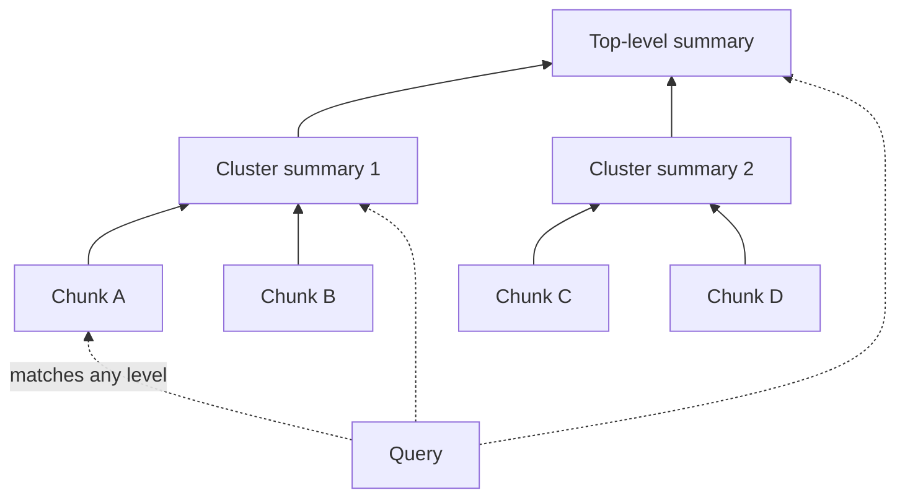
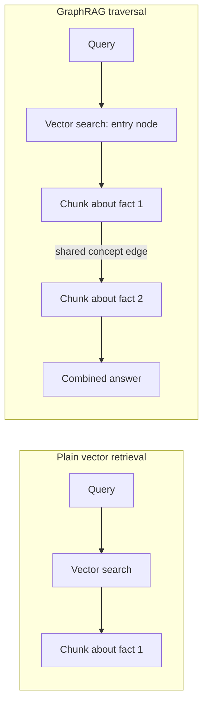
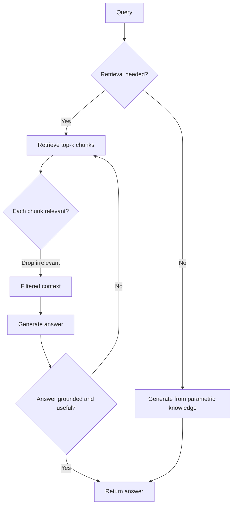
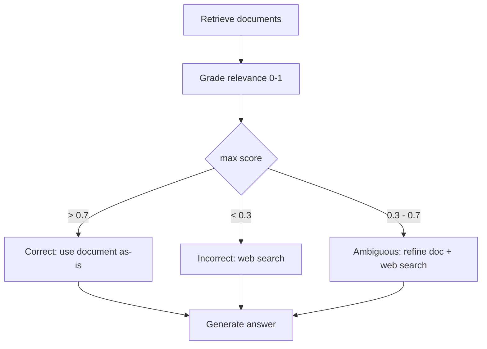
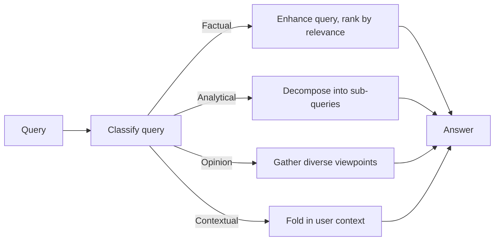

# 🧬 Advanced RAG Techniques — Interview Tutorial

| | |
|---|---|
| **Source** | `08_Advanced_RAG/Comprehensive_RAG_Techniques/all_rag_techniques/`, `08_Advanced_RAG/Comprehensive_RAG_Techniques/all_rag_techniques_runnable_scripts/`, `08_Advanced_RAG/RAG_with_LangGraph_Advanced/` |
| **Notebooks** | 48 (42 in `all_rag_techniques/` + 6 in `RAG_with_LangGraph_Advanced/`), plus 21 runnable `.py` mirrors of the same techniques |
| **Built** | 2026-09-16 |
| **Target roles** | Applied AI / AI Engineer · Agentic AI Engineer · Forward Deployed Engineer |
| **Note** | Scope excludes `Comprehensive_RAG_Techniques/evaluation/` and the `GraphRAG`, `CacheRAG`, `RAG_Ecosystem`, `building-adaptive-rag` sibling folders — evaluation is its own separate tutorial, not covered here at all. Section 4 was web-sourced live this run. Given the technique count, this tutorial trades depth-per-technique for breadth across all of them, per the Density rule. |

## What this covers

| Concept | Source notebook | Interview weight |
|---|---|---|
| Naive RAG baseline (load → chunk → embed → retrieve → stuff) | `1. simple_rag.ipynb` | High |
| Chunk size as a recall/precision dial | `4. choose_chunk_size.ipynb` | High |
| Semantic & structure-aware chunking (proposition, semantic, header-based) | `5. proposition_chunking.ipynb`, `semantic_chunking.ipynb`, `contextual_chunk_headers.ipynb` | Medium |
| Query rewriting, step-back prompting, sub-query decomposition | `6. query_transformations.ipynb` | High |
| HyDE — Hypothetical Document Embeddings | `7. HyDe_Hypothetical_Document_Embedding.ipynb` | High |
| HyPE — Hypothetical Prompt Embeddings | `HyPE_Hypothetical_Prompt_Embeddings.ipynb` | Medium |
| Fusion retrieval (BM25 + vector hybrid search) | `fusion_retrieval.ipynb` | High |
| Reranking (cross-encoder, LLM-as-judge) | `reranking.ipynb` | High |
| Relevant Segment Extraction (RSE) | `relevant_segment_extraction.ipynb` | Medium |
| Contextual compression | `contextual_compression.ipynb` | Medium |
| Context enrichment window | `context_enrichment_window_around_chunk.ipynb` | Medium |
| Hierarchical indices (summary → detail) | `hierarchical_indices.ipynb` | Medium |
| RAPTOR (recursive tree of cluster summaries) | `raptor.ipynb` | High |
| GraphRAG (entity graph + traversal retrieval) | `graph_rag.ipynb` | High |
| Self-RAG (reflection tokens gate retrieval & generation) | `self_rag.ipynb`, `4. Build_a_Self_RAG_System.ipynb` | High |
| Corrective RAG / CRAG (grade → refine or web-search fallback) | `crag.ipynb`, `2. Build_an_Agentic_Corrective_RAG_System_with_LangGraph.ipynb` | High |
| Adaptive RAG (classify query → route to strategy) | `adaptive_retrieval.ipynb`, `3. Build_an_Adaptive_RAG_System.ipynb` | High |
| Agentic RAG — retrieval as a tool call with loop control | `02_RAG_as_Tool_in_Agents.ipynb`, `01_Advanced_RAG_Agent.ipynb` | High |
| Router agentic RAG systems (category + sentiment → department + escalation) | `1. Build_a_Healthcare_Customer_Support_Router_Agentic_RAG_System.ipynb` | High |
| Multi-faceted filtering (metadata, threshold, keyword, diversity) | `multi_faceted_filtering.ipynb` | Medium |
| Retrieval with a feedback loop | `retrieval_with_feedback_loop.ipynb` | Low |
| Multi-modal RAG (image captioning vs. late-interaction visual embeddings) | `multi_model_rag_with_captioning.ipynb`, `multi_model_rag_with_colpali.ipynb` | Low |

## Coverage gaps

Interview-critical gaps specific to advanced RAG techniques themselves — not the
generic 10-topic checklist, and not evaluation (that's a separate tutorial):

- **Multi-agent RAG orchestration** `(not in your notebooks — build this)` — every agentic notebook here is one agent with branching logic (a router, a corrective loop, an adaptive classifier), never multiple specialized agents (e.g. a retriever agent per data source) coordinating through a supervisor. That's the natural next step from `1. Build_a_Healthcare_Customer_Support_Router_Agentic_RAG_System.ipynb`, and interviewers ask for it directly.
- **Production persistence & incremental updates for the advanced index structures** `(not in your notebooks — build this)` — RAPTOR's tree and GraphRAG's graph are both rebuilt from scratch in-memory every run; nothing here shows re-clustering only the changed subtree or incrementally merging new entities into an existing graph, which is exactly what breaks first at scale.

---

## 1. Core concepts

### 1.1 Naive RAG — the baseline everything else improves on

Retrieval-Augmented Generation (RAG) grounds an LLM's answer in retrieved text instead of only its training data. The naive pipeline is: load a document, split it into chunks, embed each chunk, and at query time retrieve the top-k nearest chunks by vector similarity, then stuff them into the prompt.



Every technique in this tutorial modifies one box in this diagram — a different split (§1.3), a different query (§1.4-§1.6), an extra index (§1.7), an extra pass after retrieval (§1.8-§1.11), a different index shape (§1.12-§1.14), or a control loop wrapped around the whole thing (§1.15-§1.19).

- **How it works**: `RecursiveCharacterTextSplitter` cuts by character count, `FAISS.from_documents` embeds and indexes, `.as_retriever(search_kwargs={"k": 2})` does top-k cosine search at query time.
- **Code** (`1. simple_rag.ipynb`):
  ```python
  loader = PyPDFLoader(path)
  documents = loader.load()
  text_splitter = RecursiveCharacterTextSplitter(chunk_size=1000, chunk_overlap=200)
  texts = text_splitter.split_documents(documents)
  vectorstore = FAISS.from_documents(texts, OpenAIEmbeddings())
  retriever = vectorstore.as_retriever(search_kwargs={"k": 2})
  ```
- **Say this in an interview**: "Naive RAG is one dial — chunk size — controlling both what gets embedded and what the LLM sees; every technique below exists to break that single dial into independent ones."

---

### 1.2 Chunk size — a recall/precision dial, not a config default

Smaller chunks embed more precisely (one topic per vector) but give the LLM less context per hit; larger chunks do the reverse. The notebook measures this directly instead of guessing.

- **How it works**: sweep `chunk_size` values, generate eval questions per size, and score faithfulness/relevancy with an LLM judge to find the size that actually answers better.
- **Code** (`4. choose_chunk_size.ipynb`):
  ```python
  chunk_sizes = [128, 256]
  for chunk_size in chunk_sizes:
      Settings.chunk_size = chunk_size
      Settings.chunk_overlap = chunk_size // 5
      vector_index = VectorStoreIndex.from_documents(eval_documents)
      # ...faithfulness_gpt4 / relevancy_gpt4 scored per chunk_size
  ```
- **Say this in an interview**: "Chunk size is the cheapest lever in the whole pipeline to tune, and the only defensible way to pick a value is to measure faithfulness and relevancy at a few sizes on real questions, not to copy a default."

---

### 1.3 Structure-aware chunking — splitting on meaning, not character count

A fixed character count can cut a sentence in half. Semantic chunking splits where embedding similarity between adjacent sentences actually drops; proposition chunking splits into single, self-contained factual statements.

- **How it works**: `SemanticChunker` embeds sentence-level windows and cuts at similarity valleys; proposition chunking asks an LLM to rewrite text into atomic, context-independent propositions before embedding each one separately.
- **Code** (`semantic_chunking.ipynb`):
  ```python
  from langchain_experimental.text_splitter import SemanticChunker
  text_splitter = SemanticChunker(OpenAIEmbeddings(), breakpoint_threshold_type="percentile")
  docs = text_splitter.create_documents([content])
  ```
- **Say this in an interview**: "Semantic chunking trades a cheap heuristic (character count) for an embedding call per boundary decision — worth it when chunk boundaries visibly cut through ideas in your baseline's failure cases, not by default."

---

### 1.4 Query rewriting, step-back, and decomposition

A vague or compound user query rarely matches how the answer is phrased in the source text. Three LLM-driven rewrites close that gap before retrieval ever runs: **rewrite** (more specific), **step-back** (more general, for background), and **decompose** (split into sub-questions).

- **How it works**: each is one `PromptTemplate | ChatOpenAI` chain — no retrieval happens until the LLM has reshaped the query.
- **Code** (`6. query_transformations.ipynb`):
  ```python
  subquery_decomposition_prompt = PromptTemplate(
      input_variables=["original_query"],
      template="...decompose it into 2-4 simpler sub-queries...",
  )
  sub_queries = (subquery_decomposition_prompt | sub_query_llm).invoke(original_query)
  ```
- **Say this in an interview**: "Query transformation adds one LLM round-trip before retrieval to buy a better-matched query — decomposition specifically is what turns a multi-hop question into several single-hop ones a vector index can actually answer."

---

### 1.5 HyDE — Hypothetical Document Embeddings

Instead of embedding the user's short question, HyDE asks an LLM to write a fake, detailed answer first, then embeds *that* — because a full answer's embedding sits closer to real answer chunks in vector space than a terse question's does.

- **How it works**: generate a hypothetical document sized to match the chunk size, embed it, and run similarity search with that embedding instead of the query's.
- **Code** (`7. HyDe_Hypothetical_Document_Embedding.ipynb`):
  ```python
  self.hyde_prompt = PromptTemplate(
      input_variables=["query", "chunk_size"],
      template="Given the question '{query}', generate a hypothetical document that directly answers this question...",
  )
  hypothetical_doc = (self.hyde_prompt | self.llm).invoke({"query": query, "chunk_size": self.chunk_size}).content
  similar_docs = self.vectorstore.similarity_search(hypothetical_doc, k=k)
  ```
- **Say this in an interview**: "HyDE swaps a question embedding for an answer-shaped embedding, closing the question/answer semantic gap at the cost of one extra LLM call per query."

<details>
<summary>🔍 Deep Dive: why HyDE can retrieve confidently wrong context</summary>

HyDE's retrieval quality is only as good as the hallucinated document's *shape*, not its *facts* — the embedding captures topic and structure, so even a factually wrong hypothetical document usually still points at the right neighborhood of real chunks. But on questions outside the corpus's actual content, the LLM invents a plausible-sounding wrong answer, embeds it, and retrieves real chunks that are topically similar to the *fabrication* rather than to the true answer — the retrieved context then reinforces the hallucination instead of catching it. This is why HyDE pairs well with a relevance-grading step (Self-RAG's `RelevanceResponse` or CRAG's `retrieval_evaluator`) rather than being trusted alone.
</details>

---

### 1.6 HyPE — Hypothetical Prompt Embeddings

HyPE moves the same idea to index time: instead of generating one hypothetical document per query, it generates several hypothetical *questions* per chunk when the chunk is indexed, and embeds those questions as proxies for the chunk.

- **How it works**: for each chunk, an LLM writes questions it would answer; each question is embedded and stored pointing back at the same chunk, so a real user question matches a generated question directly.
- **Code** (`HyPE_Hypothetical_Prompt_Embeddings.ipynb`):
  ```python
  question_gen_prompt = PromptTemplate.from_template(
      "Analyze the input text and generate essential questions that, when answered, "
      "capture the main points of the text.\n\nText:\n{chunk_text}\n\nQuestions:\n"
  )
  # each generated question is embedded and mapped back to chunk_text at index time
  ```
- **Say this in an interview**: "HyPE pays the LLM cost once at ingestion instead of on every query — the right choice for a high query-volume, low-update-frequency corpus; HyDE is the right choice when the corpus changes too often to re-index for it."

---

### 1.7 Fusion retrieval — combining keyword and vector search

Dense vector search misses exact tokens (IDs, codes, rare names) that keyword search catches easily. Fusion retrieval runs both a BM25 keyword index and a vector index, normalizes their scores, and blends them.

- **How it works**: normalize BM25 scores and vector distances to `[0, 1]`, then combine with a weight `alpha` (vector weight) vs. `1 - alpha` (BM25 weight), and return the top-k by combined score.
- **Code** (`fusion_retrieval.ipynb`):
  ```python
  bm25 = BM25Okapi([doc.page_content.split() for doc in cleaned_texts])

  def fusion_retrieval(vectorstore, bm25, query, k=5, alpha=0.5):
      bm25_scores = bm25.get_scores(query.split())
      vector_results = vectorstore.similarity_search_with_score(query, k=len(all_docs))
      # normalize both to [0,1], combined = alpha*vector + (1-alpha)*bm25
  ```
- **Say this in an interview**: "Fusion retrieval is the fix for queries with exact tokens a dense embedding blurs past — `alpha` is the knob, and it should be tuned on a labeled set with real ID/code-bearing queries, not left at 0.5."



---

### 1.8 Reranking — a second, more expensive relevance pass

Initial retrieval (vector or fusion) optimizes for speed over many candidates; reranking takes a smaller candidate set and re-scores it with a model that can actually compare the query against each document directly, not just via a precomputed vector.

- **How it works**: a **cross-encoder** (`CrossEncoder('cross-encoder/ms-marco-MiniLM-L-6-v2')`) scores query-document pairs jointly, locally and cheaply; an **LLM-as-judge** reranker asks a chat model to rate 1-10 relevance per document, more accurate but far more expensive per call.
- **Code** (`reranking.ipynb`):
  ```python
  cross_encoder = CrossEncoder('cross-encoder/ms-marco-MiniLM-L-6-v2')
  pairs = [[query, doc.page_content] for doc in initial_docs]
  scores = cross_encoder.predict(pairs)
  reranked = [doc for doc, _ in sorted(zip(initial_docs, scores), key=lambda x: x[1], reverse=True)]
  ```
- **Say this in an interview**: "Retrieve wide with a cheap method, then rerank narrow with an expensive one — a cross-encoder over 10-30 candidates costs milliseconds, an LLM judge over the same set costs an API call per candidate."

---

### 1.9 Relevant Segment Extraction (RSE) — returning spans, not fixed chunks

Instead of returning whole chunks, RSE scores every chunk's relevance to the query, then solves a constrained max-sum-subarray problem to find the best *contiguous run* of chunks — so an answer split across a few adjacent chunks comes back as one coherent segment.

- **How it works**: subtract a penalty from each chunk's relevance score (biasing against including irrelevant filler), then search for the highest-scoring contiguous ranges under a max segment length and a max total length.
- **Code** (`relevant_segment_extraction.ipynb`):
  ```python
  irrelevant_chunk_penalty = 0.2
  relevance_values = [v - irrelevant_chunk_penalty for v in chunk_values]
  best_segments, scores = get_best_segments(
      relevance_values, max_length=20, overall_max_length=30, minimum_value=0.7
  )
  ```
- **Say this in an interview**: "RSE answers queries whose answer spans multiple adjacent chunks — like 'the consolidated financial statements' — by treating segment boundaries as an optimization output instead of a fixed chunk size."

---

### 1.10 Contextual compression — trimming a chunk after retrieval, not before

A retrieved chunk usually contains the right sentence plus a lot of irrelevant surrounding text. Contextual compression runs an LLM over each retrieved document *after* retrieval to extract only the sentences relevant to the specific question.

- **How it works**: `LLMChainExtractor` wraps a base retriever; each hit is passed through an extraction prompt before reaching the generation step.
- **Code** (`contextual_compression.ipynb`):
  ```python
  compressor = LLMChainExtractor.from_llm(llm)
  compression_retriever = ContextualCompressionRetriever(
      base_compressor=compressor, base_retriever=retriever
  )
  ```
- **Say this in an interview**: "Compression is a per-document LLM call at query time — it shrinks what reaches generation, which helps the 'lost in the middle' problem, but it adds one LLM call per retrieved document to the latency budget."

---

### 1.11 Context enrichment window — retrieving small, returning wide

Similar to parent document retrieval, but simpler: index small chunks for precise search, then at query time fetch the `n` chunks immediately before and after each hit (by stored index) and concatenate them, instead of maintaining a separate parent docstore.

- **How it works**: chunks are indexed with a sequential `index` in their metadata; retrieval fetches a hit, then looks up neighboring indices and stitches the text back together, accounting for the original overlap.
- **Code** (`context_enrichment_window_around_chunk.ipynb`):
  ```python
  def retrieve_with_context_overlap(vectorstore, retriever, query, num_neighbors=1,
                                      chunk_size=200, chunk_overlap=20):
      relevant_chunks = retriever.get_relevant_documents(query)
      # for each hit, fetch chunks at index-1..index+1 and concatenate, minus overlap
  ```
- **Say this in an interview**: "This is parent document retrieval without a docstore — neighbors are found by a stored sequential index instead of a separate id lookup, which is simpler but only works when chunks came from one linear document."

---

### 1.12 Hierarchical indices — search summaries first, details second

A two-level index: one vector index of document/section **summaries**, one of the original **detailed chunks**. Retrieval searches summaries first to find the right region, then searches only the detailed chunks tied to the matched summaries.

- **How it works**: summaries act as a coarse routing layer, cutting how many detailed chunks a query has to be compared against.
- **Code** (`hierarchical_indices.ipynb`):
  ```python
  summary_vectorstore = FAISS.from_documents(summaries, embeddings)
  detailed_vectorstore = FAISS.from_documents(detailed_chunks, embeddings)
  top_summaries = summary_vectorstore.similarity_search(query, k=k_summaries)
  # then search detailed_vectorstore filtered to chunks under those summaries
  ```
- **Say this in an interview**: "Hierarchical indices are a manual, two-level version of what RAPTOR builds automatically and recursively — same idea, one fixed level instead of a tree."

---

### 1.13 RAPTOR — a recursive tree of cluster summaries

RAPTOR (Recursive Abstractive Processing and Thematic Organization for Retrieval) builds a multi-level tree: cluster similar chunks, summarize each cluster, then repeat clustering-and-summarizing on the summaries themselves, several levels up. Retrieval can then match a query against any level — a specific chunk or a broad theme.

- **How it works**: embed all texts, cluster with a Gaussian Mixture Model, summarize each cluster with an LLM, and recurse on the summaries for up to `max_levels`.
- **Code** (`raptor.ipynb`):
  ```python
  def build_raptor_tree(texts, max_levels=3):
      for level in range(1, max_levels + 1):
          embeddings = embed_texts(current_texts)
          n_clusters = min(10, len(current_texts) // 2)
          cluster_labels = perform_clustering(np.array(embeddings), n_clusters)
          # summarize each cluster -> becomes current_texts for the next level
  ```
- **Say this in an interview**: "RAPTOR indexes every level of the tree, not just the leaves, so 'what is the greenhouse effect broadly' and 'what's the exact CO2 ppm figure' can both hit the right granularity in the same index."



<details>
<summary>🔍 Deep Dive: the clustering step that decides how much of the tree actually forms</summary>

`n_clusters = min(10, len(current_texts) // 2)` means the branching factor shrinks automatically as content runs out going up the tree — with 8 chunks at level 0, level 1 gets only 4 clusters, and by level 2 there may be too few texts left to cluster meaningfully at all. A Gaussian Mixture Model (a soft clustering method that assigns each point a probability of belonging to each cluster, rather than a hard single assignment like k-means) is used specifically because a chunk can genuinely belong to more than one theme — a paragraph about climate policy affecting agriculture is real content for both an "agriculture" and a "policy" cluster. In an interview, the failure mode to name is a *small or highly homogeneous corpus*: if everything embeds close together, GMM converges to one or two clusters immediately, and RAPTOR silently degenerates into "one summary of everything" instead of a useful tree — worth checking cluster counts per level before trusting the tree's depth.
</details>

---

### 1.14 GraphRAG — retrieval over an explicit knowledge graph

Instead of a flat vector index, GraphRAG extracts concepts from each chunk with an LLM, builds a graph where nodes are chunks/concepts and edges are similarity or shared-concept links, then answers a query by traversing the graph outward from the best entry points — not just by nearest-neighbor search.

- **How it works**: `KnowledgeGraph.build_graph()` embeds chunks, extracts a `Concepts` list per chunk via structured output, and adds an edge between two chunks when their concept overlap or embedding similarity clears `edges_threshold`; `QueryEngine` traverses from the top vector hits along graph edges, checking after each hop whether the accumulated context is a complete answer.
- **Code** (`graph_rag.ipynb`):
  ```python
  class KnowledgeGraph:
      def __init__(self):
          self.graph = nx.Graph()
          self.edges_threshold = 0.8   # similarity cutoff for adding an edge

  class AnswerCheck(BaseModel):
      is_complete: bool  # does context after this hop fully answer the query?
  ```
- **Say this in an interview**: "GraphRAG answers questions that need connecting two facts from different documents — plain retrieval finds either fact alone, but only graph traversal finds the edge between them."



---

### 1.15 Self-RAG — reflection tokens gate every step

Self-RAG wraps three yes/no decisions around plain retrieval: should I retrieve at all, is each retrieved chunk relevant, and does the final answer stay grounded in the context. Each decision is its own small, structured-output LLM call.

- **How it works**: sequential `RetrievalResponse` → `RelevanceResponse` (per doc, filtering out irrelevant ones) → generation → `SupportResponse`/`UtilityResponse` grading, all via `with_structured_output`.
- **Code** (`self_rag.ipynb`, `4. Build_a_Self_RAG_System.ipynb`):
  ```python
  class RelevanceResponse(BaseModel):
      response: str = Field(..., description="Output only 'Relevant' or 'Irrelevant'.")

  retrieval_decision = retrieval_chain.invoke({"query": query}).response.strip().lower()
  if retrieval_decision == 'yes':
      docs = vectorstore.similarity_search(query, k=top_k)
      # each doc individually graded 'Relevant'/'Irrelevant' before use
  ```
- **Say this in an interview**: "Self-RAG trades 3-4 extra sequential LLM calls for a system that can skip retrieval entirely on questions it doesn't need it for, and can silently drop irrelevant hits instead of feeding them to generation."



---

### 1.16 Corrective RAG (CRAG) — grade, then refine or search the web

CRAG scores every retrieved document's relevance (0-1), then branches on the *best* score: high confidence uses the document as-is, low confidence throws it out and falls back to a live web search, and the ambiguous middle band blends both refined-document knowledge and a web search.

- **How it works**: `retrieval_evaluator` returns a float per document; `crag_process` picks one of three actions based on `max(eval_scores)` against a fixed threshold.
- **Code** (`crag.ipynb`, `2. Build_an_Agentic_Corrective_RAG_System_with_LangGraph.ipynb`):
  ```python
  max_score = max(eval_scores)
  if max_score > 0.7:
      final_knowledge = retrieved_docs[eval_scores.index(max_score)]   # Correct
  elif max_score < 0.3:
      final_knowledge = perform_web_search(query)                      # Incorrect
  else:
      final_knowledge = knowledge_refinement(best_doc) + perform_web_search(query)  # Ambiguous
  ```
- **Say this in an interview**: "CRAG treats the corpus as fallible — it doesn't just trust retrieval, it grades it and has an explicit escape hatch to the live web when the corpus doesn't have the answer."



<details>
<summary>🔍 Deep Dive: why a single relevance threshold is a named interview failure mode</summary>

A hard cutoff like `> 0.7` turns a continuous, noisy relevance score into a discrete decision, and LLM-generated relevance scores are not well-calibrated across query types — a score of 0.68 on one query and 0.72 on a near-identical one can trigger completely different code paths (use the document vs. discard it and hit the web) for no real difference in retrieval quality. Interviewers ask this as "your CRAG system keeps triggering unnecessary web searches (or the reverse — never triggers one)" specifically to see whether a candidate reaches for *per-corpus threshold calibration on a held-out set* rather than nudging the constant by hand, and whether they'd rather use a relative signal (e.g., top score vs. second-best gap) than an absolute one.
</details>

---

### 1.17 Adaptive RAG — classify the query, then route to a strategy

Different question types need different retrieval: a factual lookup wants precision, an analytical question wants sub-query decomposition, an opinion question wants multiple viewpoints, a contextual one needs the user's context folded in. Adaptive RAG classifies the query first, then dispatches to a strategy built for that category.

- **How it works**: `QueryClassifier` outputs one of `Factual | Analytical | Opinion | Contextual`; `AdaptiveRetriever` looks up the matching `*RetrievalStrategy` and calls its (very different) `retrieve()` implementation.
- **Code** (`adaptive_retrieval.ipynb`, `3. Build_an_Adaptive_RAG_System.ipynb`):
  ```python
  class categories_options(BaseModel):
      category: str  # "Factual, Analytical, Opinion, or Contextual"

  class AdaptiveRetriever:
      def get_relevant_documents(self, query):
          category = self.classifier.classify(query)
          return self.strategies[category].retrieve(query)   # e.g. AnalyticalRetrievalStrategy
  ```
- **Say this in an interview**: "The entire pipeline's behavior for a query is decided by one upfront classification call — that single point of failure is exactly what a strong answer should flag."



---

### 1.18 Agentic RAG — retrieval as a tool call, with a loop the model controls

Instead of a fixed retrieve-then-generate pipeline, the LLM is given retrieval as a bindable *tool* and decides for itself, per turn, whether to call it — the same `should_continue` loop pattern used for any tool-calling agent.

- **How it works**: `create_retriever_tool` wraps a retriever as a LangChain tool; a `bind_tools([...])` agent node checks `last_message.tool_calls` each turn to route to a `ToolNode` or end.
- **Code** (`02_RAG_as_Tool_in_Agents.ipynb`):
  ```python
  retriever_tool = create_retriever_tool(retriever, "retriever_tool", "Info about pricing, hours, founder.")

  def should_continue(state) -> Literal["tools", END]:
      return "tools" if state["messages"][-1].tool_calls else END
  ```
- **Say this in an interview**: "Agentic RAG isn't a new retrieval technique — it's handing an existing retriever to a tool-calling loop, so the model decides whether and how many times to search, not the pipeline."

---

### 1.19 Router agentic RAG — category + sentiment decide the entire path

A support-style LangGraph agent classifies the incoming query into a department (`Billing`, `Appointments`, `Records`, `Insurance`) *and* separately scores its sentiment (`Positive`...`Distress`), then routes to a department-specific retrieval-and-response node, or diverts to a human-escalation form on negative sentiment.

- **How it works**: two independent structured-output classifiers feed a `StateGraph`'s conditional edges; each department node applies its own Chroma metadata `filter` before generating.
- **Code** (`1. Build_a_Healthcare_Customer_Support_Router_Agentic_RAG_System.ipynb`):
  ```python
  class QueryCategory(BaseModel):
      categorized_topic: Literal['Billing', 'Appointments', 'Records', 'Insurance']
  class QuerySentiment(BaseModel):
      sentiment: Literal['Positive', 'Neutral', 'Negative', 'Distress']

  metadata_filter = {"category": "billing"}
  kbase_search.search_kwargs["filter"] = metadata_filter
  ```
- **Say this in an interview**: "This is a router, not a single monolithic retriever — category picks *which* knowledge base slice to search, sentiment picks *whether* a human should be in the loop at all, and those are independent axes."

---

### 1.20 Multi-faceted filtering — narrowing candidates after retrieval

After an initial similarity search, four independent filters can each remove candidates: exact metadata match, a similarity-score floor, required content keywords, and a greedy near-duplicate (diversity) filter — composed in sequence.

- **How it works**: each filter takes and returns `(Document, score)` pairs, so they chain; the diversity filter greedily keeps a candidate only if its embedding isn't too close to any already-kept one.
- **Code** (`multi_faceted_filtering.ipynb`):
  ```python
  def multi_faceted_filter(doc_score_pairs, metadata_filters=None, score_threshold=None,
                            required_keywords=None, diversity_threshold=None, embeddings=None):
      filtered = apply_metadata_filter(doc_score_pairs, metadata_filters)
      filtered = apply_similarity_threshold(filtered, score_threshold)
      filtered = apply_content_filter(filtered, required_keywords)
      filtered = apply_diversity_filter(filtered, embeddings, diversity_threshold)
      return filtered
  ```
- **Say this in an interview**: "Filtering after retrieval is cheaper than re-querying — the vector search still runs once with a wide `k`, and every filter below it is a fast, deterministic pass over already-fetched candidates."

---

### 1.21 Retrieval with a feedback loop

Real user ratings on past answers (relevance, quality 1-5) are stored, then used two ways: to re-rank future retrievals when a stored feedback query looks similar to the current one, and periodically to re-embed a corpus that includes the best past (query, answer) pairs as extra "documents."

- **How it works**: `adjust_relevance_scores` asks an LLM whether a stored feedback entry is relevant to the *current* query before using it; `fine_tune_index` filters for `relevance >= 4 and quality >= 4` responses and folds them into a fresh index.
- **Code** (`retrieval_with_feedback_loop.ipynb`):
  ```python
  good_responses = [f for f in feedback_data if f['relevance'] >= 4 and f['quality'] >= 4]
  additional_texts = " ".join(f['query'] + " " + f['response'] for f in good_responses)
  new_vectorstore = encode_from_string(texts + additional_texts)   # full re-embed
  ```
- **Say this in an interview**: "This is human-in-the-loop for retrieval quality, not for actions — the human signal never blocks a live answer, it only shapes future re-indexing."

---

### 1.22 Multi-modal RAG — captioning vs. late-interaction visual embeddings

Two different answers to "how do you RAG over PDFs with figures and charts": generate a text **caption** for each image with a vision model and embed the caption like any other chunk, or embed the page **image directly** with a model built for visual similarity (e.g. ColPali-style late interaction), skipping captioning entirely.

- **How it works**: captioning re-uses the existing text pipeline unchanged downstream of the caption step; direct visual embedding needs a retriever built for image vectors, not text ones.
- **Code** (`multi_model_rag_with_captioning.ipynb`):
  ```python
  extracted_image = extract_image(page)  # PyMuPDF page -> PIL image
  caption = gemini_model.generate_content([extracted_image, "Describe this image factually."])
  Document(page_content=caption.text, metadata={"source": "figure", "page": page_num})
  ```
- **Say this in an interview**: "Captioning is the pragmatic default — it reuses a text-only vector store and generation pipeline unchanged; direct visual embedding is worth the extra infrastructure only when a caption provably loses the information that answers the question, like exact numbers in a chart."

---

## 2. Gotchas

**HyDE retrieves confidently on a hallucinated premise**
- **Symptom**: for a question outside the corpus, the hypothetical document is fluent and specific, and the chunks it retrieves are topically similar to that fabrication, not to any real answer.
- **Cause**: retrieval matches the *hypothetical document's* embedding, not the query's or the truth's — a wrong-but-plausible hypothetical still has a normal-looking embedding.
- **Fix**: pair HyDE with a relevance/groundedness check on the retrieved chunks before generation (Self-RAG's or CRAG's grading step), not HyDE alone.
- **Interview angle**: "HyDE retrieved something confidently — how do you know it's not confidently wrong?"

**HyPE's indexing cost scales with question-generation quality, not chunk count**
- **Symptom**: the notebook's own comment warns: *"Chunk size can be quite large with HyPE... test how exhaustive your model is in generating sufficient amount of questions per chunk. This will mostly depend on your information density."*
- **Cause**: HyPE's retrieval quality depends on the LLM generating enough *distinct* questions per chunk to act as proxies — a chunk that gets 2 generic questions instead of 6 specific ones is under-indexed and simply won't surface for many real user phrasings.
- **Fix**: sample-check generated questions per chunk before full ingestion; increase chunk size or the question-count target for dense, high-information content.
- **Interview angle**: "You moved the LLM cost to index time with HyPE — what makes sure that upfront cost actually bought you good coverage?"

**Self-RAG's yes/no gates are brittle string comparisons**
- **Symptom**: `retrieval_decision == 'yes'` after `.strip().lower()` — any output other than the exact literal string `"yes"` (e.g. `"yes."`, `"Yes, retrieval is necessary"`) silently falls through to the `else` branch.
- **Cause**: the reflection tokens are enforced by pydantic's `Field` description text, not real constrained decoding — the model can still phrase a compliant-looking but non-exact string.
- **Fix**: use an enum-constrained structured output (`Literal["yes", "no"]`) instead of a free-text `Field` description, so a non-conforming output raises a validation error instead of silently mis-routing.
- **Interview angle**: "Your Self-RAG system sometimes skips retrieval it should have done — where do you look first?"

**CRAG's single relevance threshold flips the whole action on noise**
- **Symptom**: two nearly identical documents score 0.69 and 0.71 against the same query, and the system takes the "Incorrect → web search" path for one and the "Correct → use as-is" path for the other.
- **Cause**: `max_score > 0.7` / `< 0.3` are hard cutoffs applied to an LLM-generated float that isn't calibrated to be consistent near the boundary.
- **Fix**: calibrate thresholds on a held-out labeled set per corpus, or use a relative signal (score gap to the runner-up) instead of an absolute cutoff. See the Deep Dive on Corrective RAG.
- **Interview angle**: "Your CRAG system keeps triggering (or never triggering) the web-search fallback — diagnose it."

**Adaptive RAG's classification is a single point of failure**
- **Symptom**: a genuinely analytical question gets classified `Factual`, so it runs the `FactualRetrievalStrategy` (query enhancement + LLM ranking) instead of the sub-query decomposition an analytical question actually needs — and there's no second chance.
- **Cause**: exactly one upfront classifier call picks the strategy; nothing downstream re-evaluates whether the chosen strategy is actually working.
- **Fix**: log the (query, category, retrieved docs, answer) tuple for every request, and periodically audit misclassifications; consider a low-confidence fallback to running two strategies and picking the better result.
- **Interview angle**: "How would you even notice that your query classifier is silently picking the wrong strategy in production?"

**Fusion retrieval's score normalization requires scanning the whole index**
- **Symptom**: `fusion_retrieval()` calls `vectorstore.similarity_search("", k=vectorstore.index.ntotal)` — every single call fetches *every* indexed document to compute min/max normalization.
- **Cause**: BM25 and vector scores live on different scales, and min-max normalization needs the full score distribution to be comparable — the notebook computes it fresh per query instead of maintaining running statistics.
- **Fix**: precompute and cache global score-distribution stats (or use a rank-based fusion like reciprocal rank fusion, which needs no normalization) instead of a full-index scan per query.
- **Interview angle**: "Your hybrid search's p99 latency scales with corpus size even though it returns `k=5` — why, and how do you fix it?"

**RAPTOR's cluster count silently collapses on small or uniform corpora**
- **Symptom**: with a short or narrowly-focused document, `n_clusters = min(10, len(current_texts) // 2)` returns 1-2 clusters at level 1, and the "tree" is effectively one summary of everything by level 2.
- **Cause**: the branching factor is derived from remaining item count, not from a measured diversity signal — homogeneous content clusters into very few groups regardless of how many chunks exist.
- **Fix**: check per-level cluster counts before trusting tree depth; for small corpora, cap `max_levels` or fall back to hierarchical indices (§1.12) instead of a degenerate tree. See the Deep Dive on RAPTOR.
- **Interview angle**: "How do you know your RAPTOR tree is actually adding value over a flat index for this corpus?"

**RSE's segment quality hinges on one hand-tuned constant**
- **Symptom**: `irrelevant_chunk_penalty = 0.2 # empirically, something around 0.2 works well` — the notebook's own comment flags this as tuned by trial, not learned or validated.
- **Cause**: the max-sum-subarray optimization needs *some* penalty to keep low-relevance filler chunks out of a segment, and that penalty directly trades off segment length against segment purity with no principled default.
- **Fix**: sweep the penalty against a labeled eval set per corpus type rather than reusing 0.2, since the right value depends on how noisy the underlying chunk relevance scores are.
- **Interview angle**: "This 'best segment' algorithm has a hardcoded 0.2 penalty — what does changing it actually do, and how would you pick it for a new corpus?"

**Router agentic RAG's metadata filter is exact-match and case-sensitive**
- **Symptom**: the notebook itself runs the same query with `{"category": "billing"}` and then `{"category": "Billing"}` back to back — only the case that matches what was written into the documents' metadata at ingestion returns any hits.
- **Cause**: Chroma's metadata filter does an exact string match with no normalization; the classifier's output casing and the ingested metadata's casing have to agree by construction, not by luck.
- **Fix**: normalize category strings (e.g. always lowercase) at both ingestion and classification time before ever using them as a filter value.
- **Interview angle**: "Your router's category filter returns zero results for a category you know exists — first thing you check?"

---

## 3. Tradeoffs

### Where to spend the extra LLM call: HyDE (query-time) vs. HyPE (index-time)

| Option | Costs you | Buys you | Pick when |
|---|---|---|---|
| HyDE | One LLM call per query | Adapts instantly to any new/changed corpus | Corpus updates often, query volume is moderate |
| HyPE | One (batched) LLM call per chunk at ingestion | Zero LLM cost per query | Query volume is high, corpus is relatively static |

**The one-liner**: "Whichever side of the query/ingest boundary you're not willing to pay latency on is where the hypothetical-embedding LLM call should live."

### Dense vector search alone vs. BM25 + vector fusion

| Option | Costs you | Buys you | Pick when |
|---|---|---|---|
| Dense only | Misses exact tokens (IDs, codes, rare names) | Simpler stack, one index | Queries are natural language, no exact identifiers |
| BM25 + vector fusion | A second index, a tuned `alpha`, per-query full-index scan (§2) | Recovers exact-match recall dense embeddings blur past | Support tickets, code, docs with IDs/error codes/version strings |

**The one-liner**: "The moment a real query contains an error code or a SKU, dense-only search is going to miss it — that's fusion's whole reason to exist."

### Cross-encoder rerank vs. LLM-as-judge rerank

| Option | Costs you | Buys you | Pick when |
|---|---|---|---|
| Cross-encoder | A local model to host, slightly lower ceiling on nuance | Milliseconds per candidate, no per-call API cost | High query volume, latency-sensitive path |
| LLM-as-judge | One API call per candidate document, real $ and latency | Handles nuanced, intent-aware relevance judgments | Low query volume, or the highest-value queries only |

**The one-liner**: "Rerank wide and cheap with a cross-encoder in the hot path; save an LLM judge for the queries where getting it wrong is expensive."

### Choosing a retrieval-control loop: plain RAG vs. Self-RAG vs. CRAG vs. Adaptive RAG

| Option | Costs you | Buys you | Pick when |
|---|---|---|---|
| Plain RAG | Nothing extra | Lowest latency, simplest to debug | Corpus reliably covers the query domain |
| Self-RAG | 3-4 sequential LLM calls per query | Can skip retrieval, drop irrelevant hits, self-grade groundedness | Corpus coverage is uneven and hallucination risk matters most |
| CRAG | 1 grading call + conditional web search | An explicit fallback when the corpus doesn't have the answer | The corpus is known to be incomplete, and a live web search is acceptable |
| Adaptive RAG | 1 classification call, but 4 separate strategy codepaths to maintain | Retrieval tailored to factual vs. analytical vs. opinion vs. contextual queries | Query types genuinely need different retrieval logic, not just different prompts |

**The one-liner**: "Add exactly the control loop that fixes your system's actual failure mode — coverage gaps want CRAG, hallucination wants Self-RAG, query-type mismatch wants Adaptive RAG; stacking all three by default just stacks latency."

### Flat/hierarchical retrieval vs. RAPTOR's recursive tree

| Option | Costs you | Buys you | Pick when |
|---|---|---|---|
| Flat or 2-level hierarchical (§1.12) | Manual level design, doesn't generalize to depth | Simple to build and reason about | One coarse-to-fine level is genuinely enough |
| RAPTOR | Clustering + summarization pipeline, degrades on small corpora (§2) | Automatic multi-granularity retrieval at any depth | Questions range from broad themes to specific facts across a large corpus |

**The one-liner**: "RAPTOR is hierarchical indices generalized to as many levels as the content supports — build it when you don't know in advance how many levels you need."

### Plain chunk retrieval vs. GraphRAG

| Option | Costs you | Buys you | Pick when |
|---|---|---|---|
| Plain chunk retrieval | Can't connect facts across separate chunks/documents | Cheap to build, no graph-construction pipeline | Answers live inside a single chunk |
| GraphRAG | LLM-driven entity/edge extraction per document, ongoing graph maintenance cost | Multi-hop answers that require traversing between facts | Questions require connecting information across documents |

**The one-liner**: "If your failure mode is 'the answer needs two separate facts joined together,' that's a graph-traversal problem, not a bigger-k retrieval problem."

---

## 4. Top 10 interview questions: real-time agentic system design

1. **"Your GraphRAG pipeline uses an LLM to extract entity-relationship triplets. It's flawless in the demo. Now you're ingesting 50K docs a week and your indexing bill is on fire. What did you trade away?"**
  LLM-based extraction is a perpetual per-document cost, not a one-time build cost, and without deduplication the graph bloats with duplicate nodes from non-deterministic extraction. A tiered pipeline — rule/model-based extraction for high-volume structured content, LLM extraction reserved for complex low-frequency documents, mandatory entity dedup before ingestion — recovers the cost curve. — [AI Interview Prep: The GraphRAG Scaling Trap](https://aiinterviewprep.substack.com/p/rag-interview-questions-21-the-graphrag)
2. **"When does BM25/hybrid search rescue recall where vector-only search fails?"**
  Dense embeddings are strong on semantic similarity but weak on exact-match tokens — error codes, ticket IDs, version strings, negation, legal clause language. A query about `ORA-00942` retrieves generic database help from dense-only search but the exact troubleshooting page from BM25. Fusion wins hardest in support systems, engineering docs, and API references. — [OptyxStack: Hybrid Search + Reranking Playbook](https://optyxstack.com/rag-reliability/hybrid-search-reranking-playbook)
3. **"What are the cost and latency tradeoffs of adding a reranking stage in production?"**
  Reference production numbers: BM25 ~10-25ms median, vector search ~15-40ms, cross-encoder reranking ~30-80ms median (60-150ms p95) — reranking is typically the dominant latency cost in the pipeline. Mitigate by shrinking the rerank candidate set (e.g. top-200 to top-100), using a cheaper model, two-stage reranking, or caching by normalized query. — [OptyxStack: Hybrid Search + Reranking Playbook](https://optyxstack.com/rag-reliability/hybrid-search-reranking-playbook)
4. **"Recall deteriorates on ambiguous and multi-hop questions in production — what does the query layer need to decide before retrieval even runs?"**
  A one-size-fits-all query cleaner shreds multi-hop questions into noise while helping simple lookups. The fix is an upstream adaptive classifier that diagnoses query shape first — simple lookup vs. multi-step reasoning — and only then decides whether to reformulate, decompose, or retrieve directly. This is exactly Adaptive RAG's query-classification step generalized to the query-cleaning layer. — [AI Interview Prep: The Reformulation Trap](https://aiinterviewprep.substack.com/p/rag-interview-questions-6-the-reformulation)
5. **"Design a private, VPC-deployed RAG system for a healthcare customer with HIPAA constraints and 50M documents."**
  Embedding and generation models must run inside the customer's VPC or a compliant private endpoint, not a public API; the vector store and any knowledge graph stay inside the same boundary. At 50M documents, hierarchical indices or RAPTOR-style multi-level retrieval control how many vectors any single query touches, and access control has to be enforced at the metadata-filter layer, not just the network layer. — [Exponent: Forward Deployed Engineer Interview Guide](https://www.tryexponent.com/blog/forward-deployed-engineer-interview-the-definitive-2026-guide-fde)
6. **"A customer demands sub-100ms latency for an LLM-powered search; naive RAG is 1.5 seconds. Walk me through getting to 100ms."**
  At that budget, generation itself (the dominant cost in naive RAG) has to be cut or streamed, so most of the win comes from making retrieval near-instant: cache hot queries, use a cross-encoder (not an LLM) for any reranking, cap `k` aggressively, and consider serving a smaller/distilled model or pre-computed answers for the highest-frequency queries rather than full RAG on every request. — [Exponent: Forward Deployed Engineer Interview Guide](https://www.tryexponent.com/blog/forward-deployed-engineer-interview-the-definitive-2026-guide-fde)
7. **"Your customer's data is split across SAP, Salesforce, and a custom Postgres warehouse. How do you unify it for an AI agent to use?"**
  Don't force one schema — give the agent retrieval as a tool per source (the §1.18 pattern) so it queries each system in its native shape, and unify only at the answer layer. A thin normalization layer maps each source's key entities to shared identifiers so results can be cross-referenced without a costly upfront ETL project. — [Exponent: Forward Deployed Engineer Interview Guide](https://www.tryexponent.com/blog/forward-deployed-engineer-interview-the-definitive-2026-guide-fde)
8. **"What is Corrective RAG (CRAG) and when do you reach for it over plain RAG?"**
  CRAG reviews retrieved documents for relevance before generation and only proceeds with documents that pass; below a confidence threshold it discards them and falls back to a live web search instead of generating from bad context. Reach for it when the corpus is known to have coverage gaps a plain retriever can't detect on its own. — [DataCamp: Top 30 RAG Interview Questions](https://www.datacamp.com/blog/rag-interview-questions)
9. **"What does Self-RAG add on top of Corrective RAG's document grading?"**
  Self-RAG extends grading past the documents to the generated response itself — checking that the final answer stays aligned with and supported by the retrieved context, not just that the input documents looked relevant. That's the extra reflection step that catches hallucination introduced during generation, not just during retrieval. — [DataCamp: Top 30 RAG Interview Questions](https://www.datacamp.com/blog/rag-interview-questions)
10. **"What is Agentic RAG, and why call it 'agentic' when the retrieval logic itself doesn't change?"**
  Agentic RAG introduces a retrieval *agent* — the LLM itself decides whether or not to pull information from a source on a given turn, rather than a pipeline always retrieving first. The retrieval mechanism underneath (vector search, hybrid, whatever) is unchanged; what's new is handing the decision of *whether and when* to call it to the model's own tool-calling loop. — [DataCamp: Top 30 RAG Interview Questions](https://www.datacamp.com/blog/rag-interview-questions)

---

## 5. Role tracks

### 5.1 Applied AI / AI Engineer

**What they probe**: whether you can diagnose *where* a retrieval technique is failing — chunking, embedding, ranking, or the control loop around them — and back a technique choice with a measured comparison, not intuition.

1. Your reranker improves offline metrics but production answers didn't improve — where do you look? *(Check whether the reranked top-k actually changed what reaches the prompt, and whether the generation prompt uses the new order at all.)*
2. When would HyDE make retrieval worse, not better? *(Highly technical/rare-term queries where the model can't write a plausible hypothetical — the hallucinated document misleads more than a literal query would.)*
3. Fusion retrieval's `alpha` is a magic number — how do you actually set it? *(Sweep it against a labeled eval set with a mix of natural-language and exact-token queries; there's no universal default.)*
4. Adaptive RAG's classifier picks the wrong strategy 15% of the time — is that acceptable? *(Depends on the cost of a wrong strategy vs. always running two strategies and picking the better result — quantify before deciding.)*
5. Your RAPTOR tree seems to add no value over a flat index for this corpus — how do you tell? *(Check per-level cluster counts; a collapsed tree means the corpus is too homogeneous for the tree to add granularity.)*
6. GraphRAG's edge threshold (`0.8`) is a hardcoded constant — what happens if it's wrong? *(Too high: a fragmented graph with no useful traversal paths; too low: a densely connected graph where every node reaches every other, and traversal stops being selective.)*
7. Contextual compression adds an LLM call per retrieved document — when is that not worth it? *(When "lost in the middle" isn't actually your failure mode — e.g., `k` is already small and chunks are already short.)*
8. How would you A/B test CRAG against plain RAG on live traffic? *(Shadow-run both, compare answer groundedness and how often CRAG's web-search fallback actually fires — a fallback that never fires means the threshold or corpus assumption is wrong.)*

**Take-home task**:
- Given 3 corpora (a support-ticket set with error codes, a legal-clause set, and a narrative-document set), implement fusion retrieval and tune `alpha` per corpus against a small labeled eval set.
- Report recall@5 for dense-only vs. fusion on each, and explain the `alpha` difference across corpora.

---

### 5.2 Agentic AI Engineer

**What they probe**: whether the retrieval-control loops here (Self-RAG, CRAG, Adaptive RAG, the router agent) actually terminate, fail safely, and stay debuggable — not just whether they demo well.

1. Self-RAG's relevance check can reject every retrieved document — what happens next, and should it retry? *(It should fall back to answering from parametric knowledge with a caveat, or say "I don't know" — not loop indefinitely re-retrieving.)*
2. `01_Advanced_RAG_Agent.ipynb`'s query-optimization step caps at 2 attempts before giving up — why is that cap necessary at all? *(Without it, a query that never becomes "relevant enough" loops forever re-optimizing — the same termination-guard problem as any agent loop.)*
3. The healthcare router escalates to a human on `Distress` sentiment — where exactly does that interrupt happen in the graph, and what state must survive it? *(Before any final response is generated; the customer's original query and category must persist through the escalation form so no context is lost.)*
4. In the tool-calling RAG agent (§1.18), what stops the model from calling the retriever tool in an unbounded loop? *(Nothing in the notebook — this is a `(not in your notebooks — build this)` gap: add a call-count cap enforced outside the model, not a prompt instruction.)*
5. CRAG's web search depends on `DuckDuckGoSearchResults` — what's your fallback if that call fails or rate-limits mid-run? *(Return the best-available retrieved-but-low-confidence document with an explicit low-confidence flag, rather than raising and killing the run.)*
6. Design the retriever tool's return type for the agentic case — what happens on zero hits? *(A structured empty result the model can reason about, not an exception — silence is a valid signal the agent should be able to act on, e.g. by trying a rewritten query.)*
7. Two department nodes in the router graph could both plausibly answer a query — how do you avoid double-classification drift over time? *(Log every (query, category) pair and periodically audit against human-labeled ground truth, same fix as Adaptive RAG's classifier gap.)*
8. When is a multi-department *router* worse than one agent with all knowledge bases as tools? *(When departments overlap heavily — the router's hard categorical split forces a wrong choice on ambiguous queries a single agent with judgment wouldn't have to make.)*

**Take-home task**:
- Add a hard call cap and a structured (not exception-based) empty-result type to the `02_RAG_as_Tool_in_Agents.ipynb` retriever tool.
- Add one log line per tool call (query, hit count, top score) tied to a run id, so a bad run is debuggable from the log alone.

---

### 5.3 Forward Deployed Engineer (FDE)

**What they probe**: whether you can pick the right technique(s) from this whole toolbox for a specific customer's data, constraints, and timeline — not whether you know every technique exists.

1. Customer wants GraphRAG over their internal wiki in two weeks — realistic? *(Ship plain retrieval or hierarchical indices first to prove value fast; graph construction and edge-threshold tuning is a second-phase investment, not a week-one deliverable.)*
2. "Design a private, VPC-deployed RAG system for a healthcare customer with HIPAA constraints and 50M documents" — first architectural decision? *(Where embedding and generation run — inside the VPC or a compliant private endpoint — before any retrieval-technique choice matters at all.)* — [Exponent: FDE Interview Guide](https://www.tryexponent.com/blog/forward-deployed-engineer-interview-the-definitive-2026-guide-fde)
3. Customer demands sub-100ms search, naive RAG measures 1.5s — where do the biggest cuts come from? *(Retrieval path first — cache, cap `k`, cross-encoder not LLM rerank — generation is the harder, more expensive cut.)* — [Exponent: FDE Interview Guide](https://www.tryexponent.com/blog/forward-deployed-engineer-interview-the-definitive-2026-guide-fde)
4. Customer's data spans SAP, Salesforce, and Postgres — how do you avoid a multi-month unification project? *(Retrieval-as-tool per source, per §1.18/§1.19, with a thin identifier-mapping layer — not a unified schema migration.)* — [Exponent: FDE Interview Guide](https://www.tryexponent.com/blog/forward-deployed-engineer-interview-the-definitive-2026-guide-fde)
5. Customer's documents can't leave their network for embedding — what changes across every technique in this tutorial? *(Every embedding call — HyDE's hypothetical doc, HyPE's question generation, GraphRAG's concept extraction — must hit an in-VPC or self-hosted model; the retrieval *logic* itself is unaffected.)*
6. Works in your demo on 50 documents, returns garbage on the customer's real 500K-document corpus — how do you find out why? *(Check retrieval first with real production queries logged from day one; a technique that looked fine on a small demo corpus can degrade non-obviously — RAPTOR's cluster collapse and GraphRAG's edge-threshold sensitivity are two techniques in this tutorial that specifically don't scale the same way a small demo suggests.)*
7. Customer asks "why did the system answer that wrong?" about one specific bad answer — what's your investigation order? *(Retrieved docs first — were they relevant; if yes, was context lost in compression/reranking; if not, was retrieval itself the failure — the same isolate-by-stage method regardless of which technique is in play.)*
8. Customer wants to know what this will cost per month at their query volume — how do you build that estimate? *(Multiply per-query LLM calls — query rewriting, HyDE, reranking, Self-RAG's 3-4 calls, CRAG's grading — by expected volume and per-call token cost; a "smart" retrieval loop can cost 5-10x a plain retriever per query.)*

**Take-home task**:
- Given "the customer's data can't leave their VPC, they need this live in three weeks, and their corpus has both short FAQ-style docs and 100-page manuals," pick which 2-3 techniques from this tutorial you'd ship first and which you'd explicitly defer.
- Present it as a one-page plan: what ships week one, what's deferred, and why.

---

## 6. Mock system design: real-time customer-support search over a fragmented, growing knowledge base

**The prompt**: "Design a support-search system for a SaaS company with three knowledge sources — a help-center wiki (5,000 articles), a ticket history with exact error codes, and release notes with version numbers. Growing ~50 articles/day. p95 latency under 1.5 seconds, and answers must not silently ignore an exact error code the customer typed."

**A scoring rubric**:
- [ ] Recognizes this needs hybrid search (BM25 + vector), not dense-only, because of exact error codes/version strings
- [ ] Names a control loop (Self-RAG, CRAG, or Adaptive RAG) and justifies it against this scenario's actual failure mode, not by default
- [ ] Specifies a reranking stage and picks cross-encoder over LLM-judge given the latency budget
- [ ] Breaks down the 1.5s budget by retrieval stage, summing under budget
- [ ] Handles incremental ingestion (50/day across 3 sources) without a full nightly reindex
- [ ] Says what happens when confidence is low — an explicit fallback, not a forced answer
- [ ] Addresses the multi-source problem (wiki + tickets + release notes) explicitly, not as one merged index
- [ ] Names how they'd know it's working (without leaning on a full evaluation harness, which is out of scope here)

**A worked strong answer**:
- Hybrid search per source: BM25 catches error codes and version strings the wiki's natural-language embeddings would blur past; fuse with vector search per §1.7, `alpha` tuned separately per source since tickets skew token-heavy and wiki articles skew semantic.
- CRAG-style grading (§1.16) rather than Self-RAG: the known failure mode here is coverage gaps (new error codes not yet documented), not hallucination from a rich corpus — grade the top hit and fall back to a "log for a human" path (not a public web search, since this is internal data) below threshold.
- Cross-encoder reranking (§1.8) on the fused top-20 before generation — an LLM judge here would blow the 1.5s budget per the §1.8 latency numbers.
- Latency budget: ~40ms fusion retrieval (§2's full-scan gotcha means this needs cached score stats, not per-query full scans), ~80ms cross-encoder rerank on 20 candidates, ~50ms metadata routing across the 3 sources, leaving ~1.3s for generation — the dominant remaining cost, worth streaming.
- Ingestion: each source gets its own incremental append (new wiki articles, new tickets, new release notes) into the same fused index with a `source` metadata field, filterable per query — no full reindex, matching §1.20's metadata-filter pattern.
- Confidence gate: below the CRAG threshold, route the ticket to a human agent queue with the retrieved-but-low-confidence context attached, rather than generating a possibly-wrong customer-facing answer.
- Correctness check without a full eval harness: track fallback-rate (how often CRAG's low-confidence path fires) as a live proxy signal — a rising fallback rate flags a coverage gap before it shows up as bad customer answers.

---

## 7. Self-check

**15 rapid-fire Q → A**

1. Q: What does HyDE embed — the query or something else? A: A hypothetical LLM-generated answer document.
2. Q: When does HyPE pay its LLM cost — index time or query time? A: Index time, generating questions per chunk.
3. Q: What does fusion retrieval combine? A: BM25 keyword scores and vector similarity scores, weighted by `alpha`.
4. Q: Why rerank after retrieving, instead of just retrieving fewer, better documents directly? A: The fast initial retriever (vector/BM25) can't afford the per-pair comparison cost a reranker can.
5. Q: What optimization problem does RSE solve? A: A constrained max-sum-subarray problem over chunk relevance scores.
6. Q: What's the difference between contextual compression and context enrichment window? A: Compression shrinks a hit's content; enrichment window adds neighboring chunks back in.
7. Q: What clustering algorithm does RAPTOR use, and why not k-means? A: Gaussian Mixture Model — a chunk can genuinely belong to more than one theme, which GMM's soft assignment allows.
8. Q: What does an edge in a GraphRAG knowledge graph represent? A: Similarity or shared-concept overlap above a threshold between two chunks.
9. Q: Name Self-RAG's three reflection checks. A: Should I retrieve, is each document relevant, is the answer grounded.
10. Q: What are CRAG's three possible actions after grading? A: Use the document (Correct), web search (Incorrect), or refine + web search (Ambiguous).
11. Q: What does Adaptive RAG classify a query into? A: Factual, Analytical, Opinion, or Contextual.
12. Q: What makes Agentic RAG "agentic" if the retriever itself doesn't change? A: The model decides whether and when to call the retriever as a tool, rather than always retrieving first.
13. Q: What are the four filter types in multi-faceted filtering? A: Metadata match, similarity threshold, content keywords, diversity (near-duplicate removal).
14. Q: Why is a hardcoded `0.7`/`0.3` threshold in CRAG risky? A: LLM relevance scores aren't calibrated to be consistent near a boundary, so near-identical documents can trigger different actions.
15. Q: Name one gap not covered in these notebooks that a strong candidate should build anyway. A: Multi-agent RAG orchestration — specialized retriever agents coordinated by a supervisor, versus one agent with branching logic.

**"Explain to a skeptical staff engineer" prompts**

- "You've added query rewriting, HyDE, fusion retrieval, reranking, and CRAG grading — justify every one of those LLM calls before I approve this in production."
- "RAPTOR and GraphRAG both build expensive structures at ingestion time — what's your evidence either one actually beats a well-tuned flat index for this specific corpus?"
- "Your CRAG threshold is a hardcoded constant someone picked once — why should I trust it holds as the corpus grows tenfold?"
