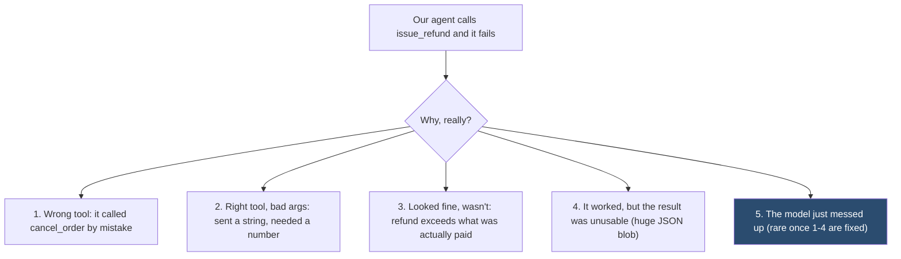
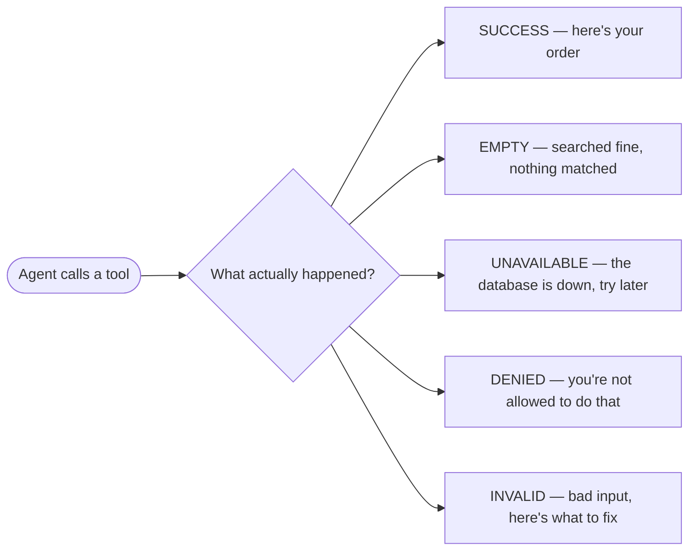
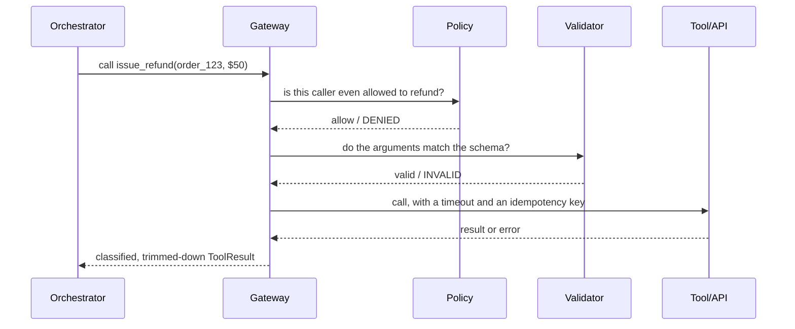
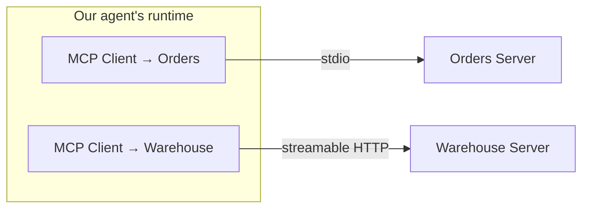
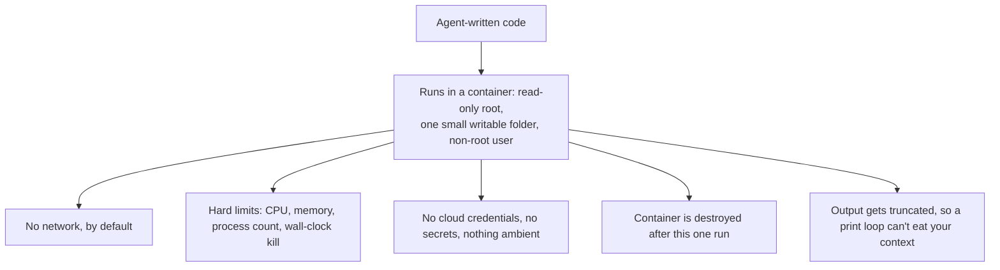

# Chapter 5 — Tool Use and the Agent-Computer Interface

Picture a support agent that can look up orders and issue refunds. This is
the layer that decides whether that agent is reliable or a liability: how you
write its tools, shape their results, gate every call through one safe path,
plug in MCP, keep it accurate at hundreds of tools, and let it run code
without taking down a server. We'll keep coming back to this one agent as
each piece gets added.

## The Agent-Computer Interface

**Everything your agent can see and touch — its tools, their schemas, what
comes back, and who's allowed to call what. That whole surface is called the
agent-computer interface (ACI), and it sets the ceiling on how reliable the
agent can ever be.**

Here's the mental shift that matters: treat your tools like a public API for
a partner who can't read your docs and can't ask you a question. Our support
agent doesn't know your `search_orders` tool returns `null` for "no such
order" vs. "database is down" — unless you tell it, explicitly, every time.



**Key points**
- Only #5 is a model problem — the other four are bugs in *your* design, not the LLM's judgment.
- If refund calls succeed less than ~90% of the time, don't reach for a bigger model — fix the interface first.

> **🎯 OpenAI Interview Pointer**
> Naming this order out loud — "I'd check the interface before blaming the model" — is exactly the kind of judgment call a system-design panel wants to hear. It signals you've actually debugged a tool layer, not just read about one.

## Eight Rules of Tool Schema Design

**A checklist that fixes most tool failures before you ever touch the model.**

Say we're writing `issue_refund` for our support agent. Here's what changes,
rule by rule:

| Rule | Before | After |
|---|---|---|
| 1. Name the action | `ordersV2Query` | `search_orders` — the verb a person would actually say |
| 2. Say what *not* to use it for | (nothing) | "Use to find orders. Do NOT use for refunds — call `issue_refund`." |
| 3. Constrain everything | `status: string` | `status: enum[open, shipped, delivered, cancelled]` |
| 4. Put units in the name | `timeout` | `timeout_seconds` — otherwise you'll get ms, sec, and min from the same model on different days |
| 5. Keep args flat, ≤6 | `filters: {...}` nested object | flat fields: `order_id`, `reason`, `amount_cents` |
| 6. Return small results | the whole 40-field order record | 6 fields the agent actually needs |
| 7. Make errors teachable | `400 Bad Request` | "`end_date` is before `start_date` — send a later end date" |
| 8. Make writes idempotent | call `issue_refund` twice → refunded twice | same idempotency key → same result, only refunded once |

**Key points**
- Every constraint (an enum, a bound) is one more mistake the model literally *cannot* make.
- Rule 8 alone stops the "agent retries and double-refunds the customer" incident before it happens.

## Typed Results: The Five States That Matter

**Instead of a tool just returning a string, give it a typed result with five
possible states — `SUCCESS`, `EMPTY`, `UNAVAILABLE`, `DENIED`, `INVALID`.
This one change fixes more agents than anything else in this chapter.**

Back to our agent: it searches for an order and gets nothing back. Was there
genuinely no matching order (`EMPTY`), or is the order database just down
right now (`UNAVAILABLE`)? If your tool can't tell these apart, neither can
your agent — and an agent that treats a real outage as "no results" will just
keep rewording the same query until it burns through its whole budget.



**Key points**
- Mixing up `EMPTY` and `UNAVAILABLE` causes retry storms during a real outage.
- Mixing up `DENIED` and `INVALID` teaches the agent to work around your policy instead of respecting it.

> **🔍 Deep Dive: never explain a denial**
> Say `issue_refund` returns `DENIED` with the message *"refunds over $500 need manager approval."* The agent reads that as an instruction, not a wall — and next time it wants to refund $600, it just issues two $300 refunds instead. Denials should be a dead end to the model — no reasoning, no workaround hints — and fully explained only in the trace a human reads later. It's a deliberate asymmetry, and interviewers like to probe it.

> **🎯 OpenAI Interview Pointer**
> "How would you design your tool's result types?" is a near-certain question. Answering with these five named states — and the refund-splitting failure mode above — is the specific detail that separates a strong answer from a vague one.

## The Tool Gateway

**One single doorway between the agent and anything real happening in the
world. Every call — refund, lookup, anything — walks through the same seven
checks, in the same order, no exceptions.**



**Key points**
- Order matters: **authorize before you validate.** Otherwise a denied caller learns the tool's schema just from the validation error it gets back.
- The idempotency key is just a hash of `run_id + tool_name + arguments` — call twice with the same key, get the same result, refund happens once.
- Trim the result down to what's declared before it goes back. One real team's support-agent cost doubled overnight — and got 9 seconds slower — because a backend team added 14 new fields to the order record and the tool returned all of it, unfiltered, on every step.

> **🎯 OpenAI Interview Pointer**
> "How do you stop an agent from doing something it shouldn't?" — the strong answer names the mechanism (authorize → validate → idempotent call → trim → log), not "we add guardrails."

## The Model Context Protocol (MCP)

**MCP is a shared protocol for handing an agent its tools, its data, and its
prompt templates — instead of every team writing a one-off integration for
every tool, everyone speaks the same client-server language.**

Without it: if you have 5 apps and 10 tools, that's 50 custom integrations
(5×10). With MCP, it's 5 clients + 10 servers = 15 pieces (5+10). That gap
only grows as you add more of either side.



**Key points**
- **Tools** — the agent decides to call them, and they can have side effects (like `issue_refund`).
- **Resources** — the *host app* decides what goes in, addressed by a URI, no side effects (like a policy doc).
- **Prompts** — the *user* invokes them on purpose (think a slash command).
- Mixing these up is a real mistake: expose a huge document library as a "tool" and the model will call it over and over with slightly different queries, burning budget. Expose it as a "resource" instead and the host controls what actually enters context.
- **stdio** transport = runs as a subprocess, no network, fine for one developer's laptop. **Streamable HTTP** = a real network service, needs real auth, the only sane choice once more than one person or team shares it.

> **🔍 Deep Dive: two ways MCP quietly breaks security**
> - **Confused deputy** — the MCP server runs with its *own* credentials, usually broader than the end user's. If you don't pass the actual user's identity through and check it server-side, your agent can do anything any user could do, for any user.
> - **Cross-server data flow** — hook one client to a private customer-data server and another to a public web-search server, and you've built a leak path: private data in, public egress out. (This is a preview of Chapter 16's "lethal trifecta.") Keep servers in different trust domains on separate clients.

> **🎯 OpenAI Interview Pointer**
> MCP sits right in the "Tools & Protocols" part of most evals. Explain the three primitives by *who's in control* (model, app, or user) rather than "a way to plug in tools" — that's the difference between real understanding and a buzzword.

## Tool Selection at Scale

**The more tools you hand the agent, the worse it gets at picking the right
one — it's discriminating between similar-sounding options inside a fixed
attention budget.**

Our support agent has 200 internal APIs behind it, not just two. Here's how you keep it sane:

| Strategy | What it means | Extra latency | Use when |
|---|---|---|---|
| Principal filtering | Only show tools *this* caller can use | none | always |
| Namespacing | One façade tool with an `operation` enum instead of 10 near-duplicate ones | none | lots of similar operations |
| Retrieval | Embed tool descriptions, pull the top-k for this request | 20-60ms | more than ~40 tools |
| Hierarchical routing | A small router picks the right *domain* first, then picks the tool | one small extra call | domains with genuinely different data |

**Key points**
- Split façades by **who's allowed to do what**, not by which service it happens to hit — never bundle a write and a read behind the same façade.
- Watch two numbers separately: did it pick the right tool, and did it fill in the right arguments? Consolidating tools tends to help the first and can quietly hurt the second.

> **🔍 Deep Dive: the "200 tools" design question**
> This is a real interview drill from the book. The strong answer: don't advertise 200 tools — collapse reads behind scope-based façades first (typically down to 20-40), filter by who's calling, then add retrieval only once you're past ~40. Always keep a couple of tools *pinned* and visible no matter what — like `clarify` and `escalate` — so the agent is never stuck with nothing useful to call. And always check the real user's permissions server-side; never trust the gateway's filtered list as the only gate.

> **🎯 OpenAI Interview Pointer**
> This exact "200 tools" scenario shows up as a stock system-design prompt. Open with "collapse the surface first" — most candidates jump straight to embeddings/retrieval and skip the façade-and-authorization design, which is the part that actually shows judgment.

## Sandboxing Code Execution

**If your agent can run arbitrary code, that's the single most dangerous tool
you can give it — you can't validate your way to safety here, because there's
no way to know in advance what a piece of code will do. Isolation is the only
real answer.**

Imagine a data-analysis agent that writes and runs its own Python to answer
"what were our top 10 refund reasons last month." Now imagine someone tricks
it into running `os.system('rm -rf /')` instead.



**Key points**
- Six controls, and none of them are "ask the model nicely": isolate, no default network, resource caps, no ambient creds, single-use, truncated output.
- A static check that blocks `os.system`/`eval`/`exec` before the code even runs is a nice *extra* layer — it is never the main defense.

> **🔍 Deep Dive: what this looks like in practice**
> ```
> docker run --rm --network none --read-only \
>   --tmpfs /work:rw,size=256m,noexec \
>   --user 65534:65534 --memory 512m --cpus 1.0 \
>   --pids-limit 128 --cap-drop ALL \
>   --security-opt no-new-privileges \
>   agent-sandbox:python-3.12 timeout --signal=KILL 30s python /work/task.py
> ```
> Every single flag here maps to one of the six controls above — this is what "isolation" actually looks like, not a hand-wave.

> **🎯 OpenAI Interview Pointer**
> "Someone tricked your code-interpreter agent into running `rm -rf /` — how did that happen, and how do you stop it?" is a documented interview question. The strong answer: you can't count on the model refusing every time. Sandboxing is the actual control, not a better prompt.

---

## Cheat Sheet

| Concept | The one thing to remember |
|---|---|
| Agent-Computer Interface | 4 of 5 tool failures are interface bugs — fix the interface before blaming the model |
| Eight schema rules | Every constraint you add is a mistake the model can't make anymore |
| Typed results (5 states) | Never blur EMPTY/UNAVAILABLE or DENIED/INVALID; never explain *why* something was denied |
| Tool gateway | Authorize → validate → idempotent call → trim → log, always in that order |
| MCP | Tools = model picks, Resources = app picks, Prompts = user picks — mixing these up wastes budget or leaks data |
| Tool selection at scale | Collapse by scope/permissions first — retrieval only once you're past ~40 tools |
| Sandboxing | Isolation, not validation, is what actually stops arbitrary code from doing damage |
