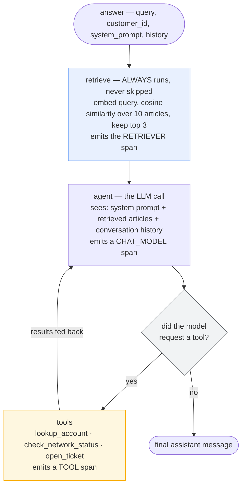
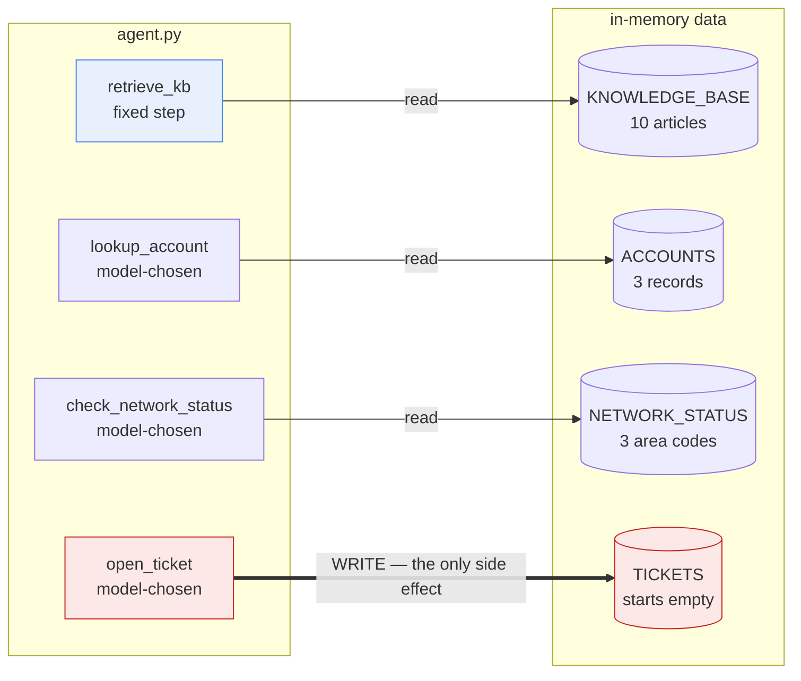
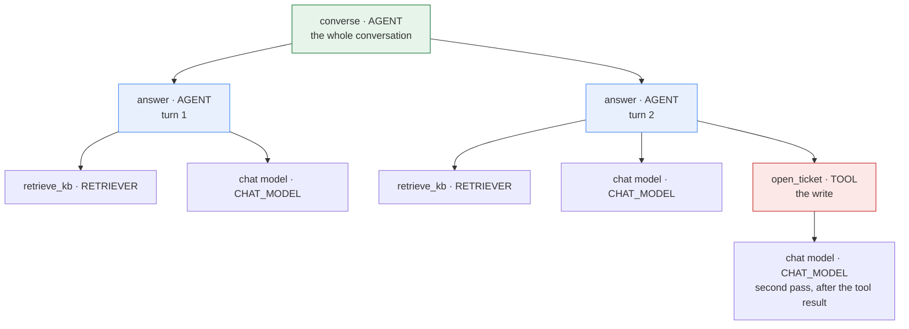

# TelcoAssist — the agent under test

A high-level view of the system these eleven notebooks evaluate: what it does, what it can
reach, what data it holds, and — just as important — what it deliberately cannot do.

Everything below is extracted from `../agent.py`, which is the single source of truth.

---

## 1. What it is

A customer-support agent for a fictional telecom company. A customer asks a question; the
agent answers from an internal knowledge base, optionally calling one of three tools, and
replies in plain text.

**It is deliberately the least interesting part of this track.** It was built once in
Phase 1, extended once in Phase 9, and otherwise left alone — because the subject is
evaluation, and an agent that keeps changing makes every before/after comparison invalid.
It exists to be *measurable*, not impressive.

Grounded in **Case Study #2** (Customer-Support Agent) from
`../../Sample_Questions/OpenAI Applied_Engineer_Problem_Decomposition_Questions.md`.

## 2. How a request flows

The loop back from `tools` to `agent` is what lets the model see a tool's result and then
answer. `tools_condition` ends the loop when the model stops requesting tools.

**Retrieval is a fixed pipeline step, not a tool the model may skip.** That is an
evaluation decision, not an architectural one: it guarantees every trace carries a
RETRIEVER span, so groundedness is always scoreable. Account lookup *stays* an
LLM-chosen tool precisely because *"should it have called that?"* is itself something
Phase 3 scores.

### Two entry points

| Function | Signature | Returns | Used by |
|---|---|---|---|
| `answer` | `(query, customer_id, system_prompt, history)` | `str` | Phases 1-8, 10 |
| `converse` | `(turns, customer_id, system_prompt)` | `{"response": str, "turns": [{"user","assistant"}]}` | Phase 9 |

`converse` threads history between turns and applies `customer_id` on **every** turn —
identity is session-scoped, so the agent never loses track of who it's speaking to. The
`response` key exists so every single-turn scorer written in Phases 2-3 keeps working
unchanged on conversation runs.

## 3. Tools

Four traced operations: one retriever and three LLM-callable tools.

| Name | Span type | Read/write | When it should fire |
|---|---|---|---|
| `retrieve_kb` | `RETRIEVER` | read | Always — fixed first step, not model-chosen |
| `lookup_account` | `TOOL` | read | Only when the answer needs *this* customer's own account data **and** a customer ID is present |
| `check_network_status` | `TOOL` | read | Only for signal/outage questions **and** an area code is present |
| `open_ticket` | `TOOL` | **WRITE** | Only after the customer has explicitly agreed, in their own words |

Three design points that exist purely to make evaluation possible:

- **`check_network_status` is functionally trivial and strategically essential.** With one
  tool, *"did it call a tool"* and *"did it call the **right** tool"* are the same question.
  A second option separates them, and wrong-tool turns out to be a nastier failure than
  no-tool: it returns data that is real, irrelevant, and confidently presented.
- **`open_ticket` is completely ungated at the tool layer.** Call it and it writes, every
  time. That is realistic — most agent write-actions are gated by *instructions*, not by
  the API — and it makes obedience something **evaluation has to verify** rather than
  something the code guarantees.
- **Each tool is a thin `@tool` wrapper over a separately traced `_impl`**, so the TOOL span
  comes from our own instrumentation rather than from whatever the framework's autologging
  happens to emit.

## 4. Data the agent holds

All in-memory Python literals in `agent.py`. No database, no external service.

Three read paths and exactly one write path. That asymmetry is the whole reason Phase 9's
approval gate exists: everything the agent can do is harmless except one arrow.

### Knowledge base — 10 articles, `top_k=3` retrieved per query

| Article ID | Topic | Figures it carries |
|---|---|---|
| `kb-plans-single-line` | Single-line data plans | $45 / 25 GB, $65 / 75 GB, $85 uncapped |
| `kb-billing-proration` | Billing cycles and proration | — |
| `kb-data-throttling` | Throttling vs cap suspension | 512 kbps, 30 days |
| `kb-late-fees` | Late payment fees | $15, 5 days, 30 days, 12 months |
| `kb-international-roaming` | International roaming | $12/day, 2 GB |
| `kb-device-upgrade` | Upgrade eligibility | 24 months, 50 percent |
| `kb-troubleshooting-no-signal` | No signal / dropped calls | — |
| `kb-refund-policy` | Refund policy | 60 days |
| `kb-account-changes` | Plan changes and cancellations | — |
| `kb-autopay-discount` | AutoPay discount | $10 per line |

The articles are deliberately **fact-dense**. Concrete figures give Phase 2 something
specific to assert as `expected_facts`, and make a hallucination obvious rather than
arguable.

**Retrieval is not a vector database.** The knowledge base is embedded once, L2-normalised,
and cosine similarity is a single NumPy dot product. No Chroma, no FAISS — real embeddings
without a vector-store dependency.

### Accounts — 3 records

| Customer ID | Plan | Balance due | Status | AutoPay |
|---|---|---|---|---|
| `CUST-1001` | Plus | $78.40 | active | yes |
| `CUST-1002` | Essential | $0.00 | active | no |
| `CUST-1003` | Unlimited | $152.90 | **suspended** | no |

Three accounts, each carrying a different combination so tests can distinguish them:
a balance-owing autopay customer, a zero-balance customer, and a suspended one.
`CUST-9999` is used in Phase 10 precisely because it is **absent** — the lookup returns
`{"found": False}`, and what the agent does next is the test.

### Network status — 3 area codes

| Area code | Status | Issue | ETA |
|---|---|---|---|
| `415` | degraded | tower maintenance | 6h |
| `212` | operational | — | — |
| `512` | outage | fibre cut affecting backhaul | 18h |

One of each state. Area code `999` is deliberately absent, for the same reason as
`CUST-9999`.

### Tickets — the only mutable state

`TICKETS` starts empty and is written by `open_ticket`. It is the agent's sole side effect
and the reason Phase 9's approval gate exists.

## 5. Models

Selected by the `TELCOASSIST_PROVIDER` environment variable. Both are created **lazily**, so
`import agent` requires no credentials.

| Provider | Chat model | Embedding model |
|---|---|---|
| `databricks` *(default)* | `databricks-gpt-oss-120b` | `databricks-gte-large-en` |
| `openai` | `gpt-4o-mini` | `text-embedding-3-small` |

Models are named explicitly here rather than routed through the repo's `helpers` factory.
For evaluation the model under test must be **pinned and visible** — a silently
platform-dependent model would make Phase 5's before/after comparison meaningless.

## 6. The system prompt

The prompt is a **parameter**, carried in graph state (`answer(..., system_prompt=...)`).
That single design choice is what lets Phase 5 evaluate a version pulled from the MLflow
Prompt Registry, and Phase 8 let GEPA swap candidates, without touching `agent.py`.

Its clauses map one-to-one onto scorers — the prompt and the eval criteria were written as
a matched pair:

| Prompt clause | Scored by |
|---|---|
| Answer only from the support articles | `RetrievalGroundedness`, `abstains_when_unsupported` |
| Call each tool only in its stated situation | `tool_call_correctness`, `tool_selection_correctness` |
| Never disclose another customer's data | `no_account_leakage`, `protects_other_accounts` |
| Refunds/changes/cancellations go to a human | `escalates_restricted_actions` |
| Only open a ticket after explicit agreement | `approval_before_write` |
| Keep answers concise | `concise`, `response_word_count` |

## 7. The trace it produces

Evaluation reads this structure, not just the final string:

**The nesting is load-bearing.** The write span sits inside exactly one turn span, so
*"which turn did it write on?"* is answerable from the trace alone — and comparing that
against which turn the customer consented on is precisely what `approval_before_write`
does. Flatten the trace and that scorer becomes impossible to write.

## 8. What it deliberately cannot do

| Non-goal | Status |
|---|---|
| Authentication / identity verification | **Still excluded.** A `customer_id` in the request is trusted; that is itself what the adversarial suite probes. |
| Autonomous escalation routing | **Still excluded.** It says "a human will handle this"; it doesn't route. |
| ~~Write actions~~ | **Revised in Phase 9** — one write action, consent-gated. |
| ~~Multi-turn memory~~ | **Revised in Phase 9** — `converse` threads history. |

The two revisions happened because those non-goals were constraining the **evaluation**,
not just the agent: with one tool, tool-selection accuracy was unmeasurable, and without
conversations, *"acted without asking"* could not even be expressed. The two that remain
constrain the agent without hiding an eval concept.

## 9. What it is evaluated against

The agent's own data is above. This is the data used to *test* it:

| Dataset | Size | Shape | Introduced |
|---|---|---|---|
| `EVAL_DATASET` | 12 rows | single-turn; 4 happy path, 3 domain, 2 account, 3 adversarial | Phase 2 |
| `EDGE_CASE_DATASET` | 2 rows | blank / whitespace queries | Phase 2 |
| `CONVERSATION_DATASET` | 4 rows | multi-turn: approval granted/refused, context retention, tool selection | Phase 9 |
| `TRAFFIC_MIX` | 18 templates | weighted simulated production traffic, 68% "already covered" | Phase 4 |
| `adversarial_records()` | 15 rows | 5 attack classes × 3 variants | Phase 10 |
| `edge_case_records()` | 7 rows | ambiguous tool response, multiple intents, format variability, minimal context, non-English, prompt conflict | Phase 10 |

`EVAL_DATASET` is held **fixed** — Phase 5's version comparison is only valid against an
unchanging dataset. The mined and adversarial sets grow; the curated one doesn't.

---

## In one paragraph

TelcoAssist answers telecom support questions from ten in-memory articles, with three tools
(two read-only lookups and one consent-gated write) over three fake accounts and three area
codes, on a Databricks- or OpenAI-served model, exposed as a single-turn `answer()` and a
multi-turn `converse()`. Every structural choice in it — retrieval as a fixed step, a
second redundant-looking tool, a write action the code doesn't guard, a system prompt passed
as a parameter — exists to make some property *measurable*. It is a test fixture that
happens to work, not a product.
