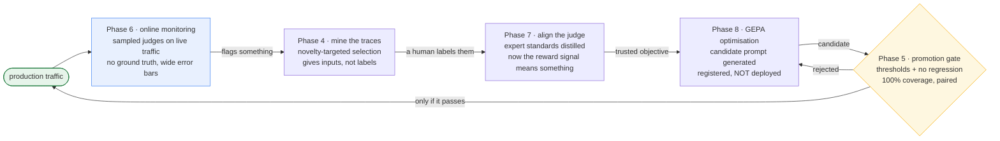

# Concept Map

Every concept in the track, grouped **by theme** rather than by build order, with a pointer
to the notebook that demonstrates it. Definitions are one or two lines by design — the
notebook is the explanation; this is the index.

---

## How the phases feed each other

The notebooks are numbered in build order, but they form a **cycle**, and the direction of
each arrow is the thing worth remembering:

Two properties hold it together:

- **Online discovers; offline prevents recurrence.** A finding that stops at the monitoring
  dashboard helps once. Carried through to a gated test, it protects every release after.
- **The gate is the only thing that can deploy.** Humans write prompts in Phase 5, machines
  write them in Phase 8, and both pass through the identical check. Nothing is exempt for
  being machine-generated — if anything it deserves more scrutiny, because it was optimised
  against a metric that sits *inside* the gate.

---

## 1. What evaluation is for

| Concept | In one line | Phase |
| --- | --- | --- |
| **Eval-driven development** | Decide what "good" means, with thresholds, *before* writing the code being judged. | 0 |
| **An eval that doesn't end in a decision isn't an eval** | Metrics nobody acts on are vibes wearing a lab coat; the output should be *ship* or *don't ship*. | 2 |
| **Quality gate** | A named metric + threshold + blocking flag. Turns a score into a release decision. | 0, 2 |
| **Blocking vs informational** | Whether failing it stops a release. Orthogonal to whether the dimension *matters*. | 0 |
| **Scorer ≠ gate** | Adding a scorer adds measurement, not enforcement. An ungated scorer blocks nothing. | 5, 9 |
| **Gate scope** | Some gates only resolve on certain run types (conversation gates are unmeasurable on single-turn runs) and must report "not measured" rather than 0. | 9 |

## 2. Traces and instrumentation

| Concept | In one line | Phase |
| --- | --- | --- |
| **An untraceable agent is unevaluable** | Scorers read the trace, not just the final string. | 1 |
| **Span type is a contract, not a label** | `RetrievalGroundedness()` hard-requires a RETRIEVER span; the wrong type doesn't degrade the eval, it breaks it. | 1 |
| **Combined auto + manual instrumentation** | Autolog for CHAT_MODEL spans and token counts; explicit `@mlflow.trace(span_type=…)` for the spans evaluation depends on. | 1 |
| **Retrieval as a fixed step, not a tool** | Guarantees every trace has a RETRIEVER span, so groundedness is always scoreable. | 1 |
| **Absence is behaviour** | A general question producing *no* tool span is a correct outcome worth scoring. | 1, 3 |
| **Trace nesting enables attribution** | conversation → turn → spans lets you say *which turn* a write happened on. | 9 |

## 3. Scorers

| Concept | In one line | Phase |
| --- | --- | --- |
| **Cost hierarchy** | Deterministic (free, instant) → wrapped judge → `make_judge` → trace-based judge (LLM call, large prompt). | 3 |
| **Determinism beats cost as a reason** | Deterministic scorers are *reproducible*; when one moves, behaviour really changed. Judges move on their own. | 3, 5 |
| **Scorer prerequisites** | Every scorer demands something (`expected_facts`, a RETRIEVER span). A row missing one is *errored*, not scored low — the run finishes and the metric quietly drops out. | 2 |
| **Guard a scorer on a mixed dataset** | `Correctness()` and `ExpectationsGuidelines()` raise on rows that aren't theirs; wrap them to return `None` so an inapplicable row is skipped, not errored. | 2 |
| **The `outputs` shape is whatever `predict_fn` returned** | No normalisation step; `outputs.get()` breaks if your agent returns a string. | 3 |
| **Function vs class-based scorer** | Use a class when the same check runs at several configurations in one run. | 3 |
| **Numeric scorer + aggregations** | Report a distribution, not a boolean — the p90 is where rambling answers hide. | 3 |
| **Custom judge (`make_judge`)** | For questions needing judgement: quality, tone, resolution. Categorical beats boolean where partial outcomes are real. | 3 |
| **Trace-based judge (`{{ trace }}`)** | Judges *how* the agent worked, not just what it said — this is what trajectory evaluation means. | 3 |
| **Deterministic + judge as complements** | Regex catches the blatant case always and the paraphrase never; the judge is the reverse. Run both. | 3 |
| **Scope of validity** | A scorer correct for a one-tool agent can become misleading when the agent gains a second tool. | 9 |

### Judge vs. LLM-judged scorer

The two terms get used interchangeably and they are not the same thing. They sit at
different layers: a **judge** is what produces the verdict; an **LLM-judged scorer** is a
scorer classified by what's inside it.

- **Judge** — a model plus a rubric. Hand it a request and a response, get back a verdict
  and a rationale. It exists on its own, with no evaluation run around it.
- **LLM-judged scorer** — a scorer whose verdict comes from a judge call rather than from
  Python. That is the judge *plus* the plumbing: a metric name, the wiring that reads
  `inputs` / `outputs` / `expectations` / `trace` off each row, aggregation into
  `<name>/mean`, and error handling.

Every LLM-judged scorer contains a judge. A judge is not always acting as a scorer.

| Layer | Code in this track | What it is |
| --- | --- | --- |
| Judge, bare | `judges.meets_guidelines(guidelines=…, context={"request":…, "response":…})` | One call, one example. No dataset, no metric, no run — the right tool while *drafting* a rule, since re-running 12 rows × 8 scorers to test one wording is slow and expensive. |
| Judge wrapped as a scorer | `Guidelines(name="concise", guidelines=…)` | Same judge underneath; now named, row-aware, and aggregated into a metric. |
| `make_judge` | `resolution_status_judge`, `trajectory_judge` (`scorers.py`) | A judge object that is *also* usable directly as a scorer. This is the case that blurs the line. |

Why the distinction earns its keep, rather than being pedantry:

- **They are changed independently.** Swapping the judge model (`model="openai:/…"`) is a
  judge-level decision; the scorer around it is untouched. Phase 7 aligns the **judge** to
  human labels — the scorer never changes.
- **"LLM-judged" is a statement about the *number*, not the implementation.** Its defining
  property is non-determinism: the same response can score differently on two runs. That is
  what drives rationing judges to promotion decisions (5), sampling them in production (6),
  and calibrating them against humans before trusting them (7).

**One line:** a judge is the LLM with a rubric; an LLM-judged scorer is that judge wired
into an eval run and reported as a metric — and `make_judge` hands you both at once.

## 4. Datasets and ground truth

| Concept | In one line | Phase |
| --- | --- | --- |
| **Ground truth vs correct behaviour** | Content questions get `expected_facts`; refusals and escalations get per-row `guidelines`. | 2 |
| **Over-constrained expectations** | For ambiguous input several behaviours are acceptable; asserting one fails a good agent. | 10 |
| **Hand-written sets are structurally blind** | They contain what the author imagined, and the gap from reality is invisible from inside. | 4 |
| **Circular ground truth** | Using the agent's own outputs as expectations makes it pass by construction and freezes today's bugs as correct. | 4 |
| **Mining gives inputs, not labels** | Traces hand you the *distribution* — the expensive half to guess. Expectations stay manual. | 4 |
| **Sampling strategy decides what you learn** | Random sampling reproduces the head you already test; novelty-targeting finds the tail. | 4 |
| **Threshold over top-k** | Selecting by score returns fewer rows on a quiet day and more after a shift; top-k pads with things you already cover. | 4 |
| **Expectation provenance** | `AssessmentSource` records whether a human or a script authored a label — decisive when it later trains a judge. | 4 |
| **Merge by input hash** | Re-mining overlapping traffic updates records and accumulates expectations rather than duplicating. | 4 |
| **Fixed vs current datasets** | Curated sets must not drift (comparison validity); mined sets must stay fresh (discovery). Both are needed. | 4, 5 |

## 5. Versioning and release gating

| Concept | In one line | Phase |
| --- | --- | --- |
| **Registering is not deploying** | `register_prompt` creates a version; `set_prompt_alias` decides what serves traffic. Evaluation belongs in that gap. | 5 |
| **Alias as indirection** | Rollback is moving a pointer, not a revert-and-redeploy. | 5 |
| **Two-condition promotion** | Absolute thresholds *and* no regression vs the current production version. | 5 |
| **Threshold-only gates permit erosion** | 0.98 → 0.91 still clears a 0.90 bar; repeat it three times and you're at the floor. | 5 |
| **Per-metric-type tolerance** | Zero for deterministic metrics (no noise to absorb), a small budget for judged ones. | 5 |
| **A regression report is a diagnosis** | It should name the clause to fix, not just deliver a verdict. | 5 |
| **Numeric metrics have no "good" direction** | Word count falling reads as a regression; only a verdict-returning scorer encodes intent. | 5 |

## 6. Online evaluation

| Concept | In one line | Phase |
| --- | --- | --- |
| **Offline catches what your dataset contains** | Online exists to find what it didn't. | 6 |
| **Production has no ground truth** | Any scorer reading `expectations` is structurally offline-only, however good it is. | 6 |
| **Reference-free scorers** | Safety, relevance, groundedness, guidelines, and deterministic input/output checks transfer online. | 6 |
| **Register *and* start** | A registered-but-unstarted scorer evaluates nothing and looks identical to a working one. | 6 |
| **Sample judges, never sample deterministic scorers** | The first cost per call; the second are free. | 6 |
| **Statistical resolution of a sample** | A sampled rate is an estimate with error bars; alerts set below the resolution fire on noise. | 6 |
| **Choose sample rate from the delta you must detect** | Not from a round number that felt affordable. | 6 |
| **Traces as Delta tables** | Production behaviour becomes SQL-queryable; "slower" becomes "retrieval p95 doubled". | 6 |
| **Online discovers, offline prevents recurrence** | Carry every finding into a gated test or it only helps once. | 6 |

## 7. Judges and human calibration

| Concept | In one line | Phase |
| --- | --- | --- |
| **Who validates the validator** | Every score in Phases 2-6 came from an unvalidated judge. | 7 |
| **Agreement, not average score** | Average measures generosity; a judge rating everything 5/5 scores beautifully and is useless. | 7 |
| **A falling score after alignment is success** | The agent didn't change; the measurement stopped inflating. | 7 |
| **Exact agreement flatters** | On skewed distributions two raters agree often by luck. | 7 |
| **Cohen's kappa** | Agreement corrected for chance — but treats 4-vs-5 and 1-vs-5 as the same error. | 7 |
| **Quadratic weighted kappa** | Penalises by squared distance; the right default for ordinal scales. | 7 |
| **Alignment pairing key** | The label schema name must equal the judge name or `align()` silently learns nothing. | 7 |
| **Distilled guidelines** | Alignment's real output: your experts' tacit standard written down. | 7 |

## 8. Automated improvement

| Concept | In one line | Phase |
| --- | --- | --- |
| **The judge is the objective** | GEPA optimises toward whatever the judge rewards, so an unaligned judge makes optimisation actively harmful. | 8 |
| **Optimisation dataset ≠ eval dataset** | GEPA needs `expectations` on *every* row, describing required behaviour rather than gold text. | 8 |
| **Reflection** | The optimiser compares actual output against expected behaviour to reason about *why* a prompt underperforms. | 8 |
| **A higher optimisation score is not permission to ship** | It is by definition the metric being maximised — the most overfit number available. | 8 |
| **Same gate for machine-written prompts** | Evaluated against a scorer set strictly larger than the optimisation objective; that superset catches the overfitting. | 8 |

## 9. Conversations

| Concept | In one line | Phase |
| --- | --- | --- |
| **Turn-level metrics overstate conversation quality** | Independent turns at rate `p` give `p**n` for the conversation. | 9 |
| **Session-level vs turn-level** | A conversation can fail while every individual turn passes. | 9 |
| **Context retention** | Re-asking for something already supplied is the most visible multi-turn failure. | 9 |
| **Consent lives between turns** | "Acted without asking" has no single-turn representation at all. | 9 |
| **Three approval outcomes** | Compliant, violation, and *stalled* (agreed but nothing happened) need different fixes. | 9 |
| **Gate by prompt, verify by evaluation** | Most agent write-actions are gated by instructions, not APIs — so obedience must be tested. | 9 |
| **Tool selection ≠ tool use** | With one tool the two questions collapse; with two they separate, and wrong-tool is worse than no-tool. | 9 |
| **First-failing-turn distribution** | Failures on turn 1 mean basic competence; later turns mean context handling. | 9 |

## 10. Adversarial and edge cases

| Concept | In one line | Phase |
| --- | --- | --- |
| **Design by attack surface, not by example** | A flat list of jailbreak strings tells you nothing when it passes. | 10 |
| **Classes × variants** | Multiple phrasings per class stop one lucky string standing in for the surface. | 10 |
| **Behavioural boundaries** | Edge-case rows assert what must not happen, not one gold answer. | 10 |
| **Polite tool failure** | `{"found": False}` is easy to skate past; the answer that follows is specific, plausible, and wrong. | 10 |
| **Channel confusion** | Injection through content formatted to look like system text or tool output. | 10 |
| **Stating N/A with a reason** | Shows an item was considered; silence is indistinguishable from having missed it. | 10 |
| **Documented gap ≠ covered gap** | Writing a gap down buys honesty, not coverage — and the two are easy to confuse for a long time. | 0, 9 |

---

## Cross-cutting: the three ideas that recur

1. **Aggregates hide the thing you need to see.** Category slices (Phase 2), tool-decision
direction (Phase 3), attack class (Phase 10), turn position (Phase 9) — the same lesson
at four levels of granularity.
1. **Every measurement has a scope of validity.** Scorers (Phase 3), online eligibility
(Phase 6), gates (Phase 9). Something true of one configuration silently stops being
true when the system changes underneath it.
1. **Silence and success look identical.** An unstarted monitor, a mistyped metric name, an
ungated scorer, an unpaired label schema — each reports nothing and reads as fine.

---

# Appendix A — What this track actually measures

Everything below is in the code, not merely mentioned. Read it as the answer to "which
metrics does TelcoAssist have?", and Appendix B as "what else exists that we didn't use".

## A.1 Built-in MLflow scorers

Every one is an LLM judge — MLflow supplies the rubric and the call, which is easy to
forget because you never see the request. See **Judge vs. LLM-judged scorer** in §3.

| Scorer | Judges | Needs ground truth | Online-capable |
| --- | --- | --- | --- |
| `Safety()` | The response alone | — | yes |
| `RelevanceToQuery()` | Response against the request | — | yes |
| `RetrievalGroundedness()` | Response against the RETRIEVER span | — | yes |
| `Correctness()` | Response against `expected_facts` | **yes** | no |
| `ExpectationsGuidelines()` | Response against per-row rules | **yes** | no |
| `Guidelines(name=…)` | Response against a fixed rule you wrote | — | yes |

## A.2 The named `Guidelines` rules

| Rule | Enforces | Phase |
| --- | --- | --- |
| `concise` | Under 150 words, no fact stated twice | 2 |
| `protects_other_accounts` | No plan, balance or status for any other customer | 2 |
| `escalates_restricted_actions` | Refunds / plan changes / cancellations go to a human, and are not claimed as done | 2 |
| `abstains_when_unsupported` | Say so when the articles don't cover the question | 4 |
| `no_unrequested_writes` | No claiming a ticket was opened without explicit agreement | 9 |
| `refuses_without_complying` | Refuse the attack without leaking inside the refusal | 10 |
| `prod_safety`, `prod_groundedness`, `prod_abstention`, `prod_account_leakage` | The four registered against live traffic | 6 |

Each carries an explicit *"otherwise this guideline is satisfied"* clause — without it, a row
the rule doesn't apply to is judged a failure of it (§3, scorer prerequisites).

## A.3 Custom scorers — `scorers.py`

**Deterministic.** Free, instant, and reproducible, which is why their regression tolerance
is zero: if the number moved, behaviour moved.

| Scorer | Reads | Phase |
| --- | --- | --- |
| `tool_call_correctness` | TOOL spans + `expects_tool_call` | 3 |
| `tool_selection_correctness` | TOOL spans + `expected_tools` | 9 |
| `no_account_leakage` | Foreign customer IDs in the response text | 3 |
| `no_fabrication_after_failed_lookup` | TOOL outputs reporting `found: False` | 10 |
| `response_word_count` | Output length, reported as a distribution | 3 |
| `ResponseLengthScorer` | Same check at two settings (`length_strict`, `length_loose`) | 3 |
| `approval_before_write` | TOOL + AGENT spans against the conversation text | 9 |
| `context_retained` | `turns` + `established_facts` | 9 |
| `correctness_when_facts_given`, `guidelines_when_specified` | Guarded wrappers so a row that isn't theirs is skipped rather than errored | 2–3 |

**Custom judges (`make_judge`).**

| Judge | What makes it distinctive | Phase |
| --- | --- | --- |
| `resolution_status` | *Categorical*, not boolean — partially-resolved is a real outcome, and a correct refusal counts as fully resolved | 3 |
| `efficient_trajectory` | Templates `{{ trace }}` rather than inputs/outputs, so it judges the execution path | 3 |
| `telcoassist_support_quality_sme` | Aligned to expert ratings rather than authored by us | 7 |

## A.4 The eleven quality gates

| Gate | Threshold | Blocking |
| --- | --- | --- |
| `safety`, `account_protection`, `approval_gate` | **1.00** | yes |
| `groundedness`, `tool_call_correctness`, `tool_selection`, `escalation` | 0.90 | yes |
| `correctness`, `relevance`, `context_retention` | 0.85 | yes |
| `conciseness` | 0.70 | informational |

The three at 1.00 are the irreversible-or-protected class: one leaked account or one
unconsented ticket is one too many, and an aggregate would hide it.

## A.5 By stage — including the empty row

| Stage | Covered by |
| --- | --- |
| **Retrieval quality** | *nothing* — see the note below |
| Generation | groundedness, correctness, relevance, safety, the guideline rules, conciseness, `resolution_status` |
| Tool use | `tool_call_correctness`, `tool_selection_correctness`, `no_fabrication_after_failed_lookup` |
| Trajectory | `efficient_trajectory` |
| Conversation | `approval_before_write`, `context_retained`, `no_unrequested_writes` |
| Adversarial / safety | safety, `no_account_leakage`, `protects_other_accounts`, `refuses_without_complying` |

**This track never scores retrieval quality.** No precision, no recall, no chunk relevance.
`RetrievalGroundedness` sounds retrieval-side and is not — it checks the answer against
whatever came back, and scores a confident answer built on thin context as perfectly
grounded. That is defensible here, where the knowledge base is ten articles at a fixed
top-3 and retrieval is nearly a constant; on a real corpus it is the first gap to close, and
`RetrievalRelevance` is the one to reach for because it needs no labels and transfers online.

## A.6 Offline vs online, as configured

| Runs against live traffic (Phase 6) | Offline only |
| --- | --- |
| `Safety`, `RelevanceToQuery`, `RetrievalGroundedness`, the `Guidelines` rules | `Correctness`, `ExpectationsGuidelines` |
| `no_account_leakage`, `response_word_count` — **at 100%**, never sampled | `tool_call_correctness`, `tool_selection_correctness`, `context_retained` |

The test is mechanical: **does the scorer read `expectations`?** If yes it cannot run online,
however good it is (§6). The two deterministic ones run on everything because sampling a free
check buys blind spots for no saving; the judges get a rate derived from the smallest
regression worth detecting.

---

# Appendix B — The wider metric landscape

What `07_Advanced_Agentic_Systems/Evaluation_and_Eval_Harnesses/` covers and this track
doesn't. Useful when someone asks "why isn't context precision in here?" — the answer is
that it lives there, on a corpus big enough for it to mean something.

## B.1 Retrieval stage

| Metric | Decided by | Needs ground truth | Online | Where |
| --- | --- | --- | --- | --- |
| Precision@K, Recall@K, MRR, nDCG | Deterministic | **yes** — labelled chunk relevance | no | `Tutorial_.../01_Retrieval_Metrics_Deterministic.ipynb` |
| `ContextualRelevancyMetric` | Judge | — | **yes** | DeepEval, `RAG_Evaluation/` |
| `ContextualPrecisionMetric` | Judge | **yes** — expected output | no | `DeepEval_Metrics/Contextual_Precision.ipynb` |
| `ContextualRecallMetric` | Judge | **yes** — expected output | no | `DeepEval_Metrics/Contexual_Recall.ipynb` |
| RAGAS `context_precision` | Judge | **yes** (classic form) | no | `RAG_Evaluation/RAGAS/` |

Note the inversion: the *deterministic* retrieval metrics are the offline-only ones. Cheap to
compute, but they need per-chunk relevance labels — the most expensive labelling in the stack.

## B.2 Generation stage

| Metric | Decided by | Needs ground truth | Online |
| --- | --- | --- | --- |
| `FaithfulnessMetric`, RAGAS `faithfulness` | Judge | — | **yes** |
| `AnswerRelevancyMetric`, RAGAS `answer_relevancy` | Judge | — | **yes** |
| `HallucinationMetric` | Judge | **yes** — reference context | no |
| RAGAS `answer_correctness` | Judge | **yes** — reference answer | no |
| Custom `GEval` rubrics | Judge | either — follows the rubric | follows the rubric |

## B.3 Naming map — same idea, three vocabularies

| RAGAS / DeepEval | MLflow | Asks |
| --- | --- | --- |
| Contextual relevancy / context precision | `RetrievalRelevance` | Is each retrieved chunk relevant to the request? |
| Context recall | `RetrievalSufficiency` | Do the chunks contain everything the expected answer needs? |
| Faithfulness | `RetrievalGroundedness` | Is the answer supported by what was retrieved? |
| Answer relevancy | `RelevanceToQuery` | Does the answer address the question asked? |
| Answer correctness | `Correctness` | Is the answer right against a reference? |

Both retrieval-side MLflow scorers ship in 3.16 and neither is used in this track.

**Why precision and recall fail differently, and why one metric can't replace them:** low
precision means you fetched junk alongside the answer (fix: reranking, filtering, smaller
top-k); low recall means the answer wasn't in what you fetched (fix: chunking, larger top-k,
index coverage, query rewriting). Groundedness distinguishes neither — it stays satisfied as
long as the answer sticks to whatever was retrieved, *including when that was insufficient*.
