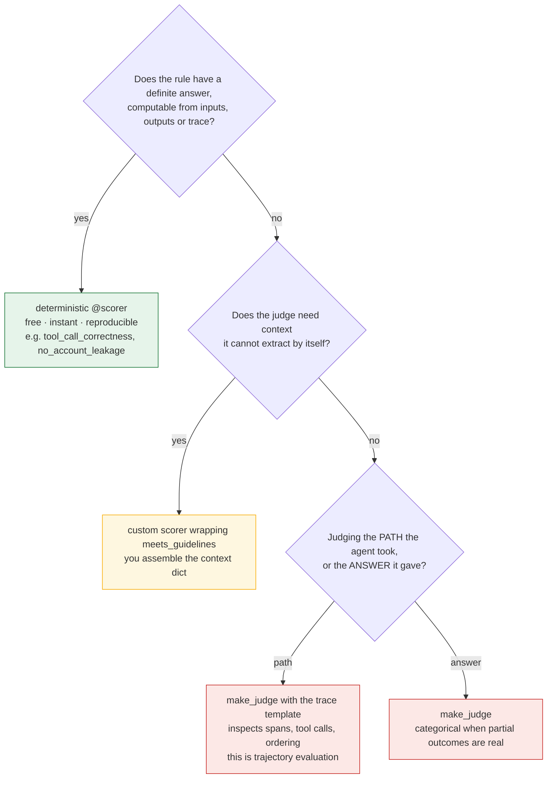
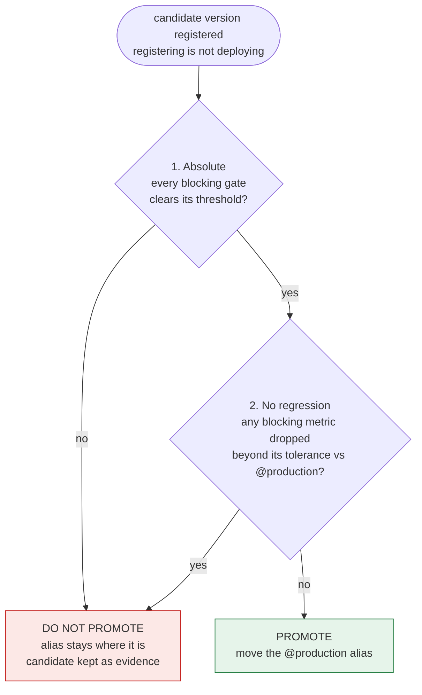

# Quick Reference

The numbers, thresholds and decision rules, compressed to one sitting. Every figure here
was generated by running this track's own modules, not transcribed by hand.

---

## The numbers worth memorising

### Conversation success falls as `p ** n`

| Turn pass rate | 3 turns | 5 turns | 10 turns |
|---|---|---|---|
| 0.99 | 0.970 | 0.951 | 0.904 |
| **0.95** | 0.857 | **0.774** | 0.599 |
| 0.90 | 0.729 | 0.590 | 0.349 |

At a healthy-looking **95% per turn**, a conversation is more likely failed than not by
**turn 14**. And this is the *optimistic* model — it assumes independence, while in practice
a bad turn poisons the context after it.

### What a sample can resolve (Wilson interval, observed rate 0.95)

| Traces scored | Resolution |
|---|---|
| 50 | ±0.066 |
| 100 | ±0.045 |
| 200 | ±0.031 |
| 600 | ±0.018 |
| 2,000 | ±0.010 |

**To detect a 2-point drop you need ~606 scored traces** — which at 2,000 traces/day is a
**30% sample rate**, not the 5% that felt affordable. If a delta can't be resolved even at
100%, don't alert on it; catch it offline where coverage is total and the comparison paired.

### Regression tolerance by scorer type

| Scorer type | Tolerance | Why |
|---|---|---|
| Deterministic | **0.00** | Same input, same verdict — any movement is behavioural |
| LLM-judged | **0.02** | Judges move between identical runs; zero tolerance blocks good releases |

The same −0.015 delta is *tolerated* on a judged metric and *blocks* on a deterministic one.

---

## Decision rules

### Which kind of scorer?



Green is free and reproducible; red costs an LLM call per row and can move between runs.
**If code can check it, checking it with a judge is waste.**

### Can this scorer run online?

**The test is mechanical: does it read `expectations`?**

| Transfers to production | Offline only |
|---|---|
| `Safety`, `RelevanceToQuery`, `RetrievalGroundedness`, `Guidelines` | `Correctness` (needs `expected_facts`) |
| Deterministic checks over inputs/outputs | `ExpectationsGuidelines` (needs per-row guidelines) |
| | `tool_call_correctness` (reads `expects_tool_call`) |

Production traffic has no ground truth. Nobody wrote `expected_facts` for a question asked
thirty seconds ago.

### Sample rate

1. Decide the smallest regression you must catch.
2. Look up the samples needed for that resolution.
3. Divide by daily traffic.
4. Deterministic scorers: **never sample** — they're free.

### Promote this version?



Both conditions, or no. **Checking only the threshold permits erosion**: 0.98 → 0.91 clears
a 0.90 bar, and three "passing" releases later you are at the floor. Checking only the
regression lets a candidate that improved on a bad baseline ship while still being bad.

---

## Scorer prerequisites

| Scorer | Needs ground truth | Needs a span | Kind |
|---|---|---|---|
| `Safety()` | — | — | judge |
| `RelevanceToQuery()` | — | — | judge |
| `Correctness()` | **`expected_facts`** | — | judge |
| `RetrievalGroundedness()` | — | **RETRIEVER** | judge |
| `Guidelines(name=, guidelines=)` | — | — | judge |
| `ExpectationsGuidelines()` | **`guidelines`** | — | judge |
| `tool_call_correctness` | `expects_tool_call` | TOOL | deterministic |
| `tool_selection_correctness` | `expected_tools` | TOOL | deterministic |
| `no_account_leakage` | — | — | deterministic |
| `no_fabrication_after_failed_lookup` | — | TOOL outputs | deterministic |
| `approval_before_write` | — | TOOL + AGENT | deterministic |
| `context_retained` | `established_facts` | — | deterministic |

**Valid aggregations, exactly six:** `min`, `max`, `mean`, `median`, `variance`, `p90`.
No `p50` (use `median`), no `p99`, no `sum`.

**A missing prerequisite errors that row; it does not score 0 and does not stop the run.**
The harness records a `SCORER_ERROR`, and the metric drops out of the results entirely. On
a dataset that mixes row kinds — some with `expected_facts`, some with `guidelines` — wrap
the scorer so it returns `None` on a row that isn't its to score.

**"Kind" above is about where the verdict comes from, not how the scorer was built.**

| | Judge | LLM-judged scorer |
|---|---|---|
| What it is | A model + a rubric | A scorer whose verdict comes from a judge call |
| Runs inside an eval? | Not necessarily — callable on one example | Yes: named metric, reads each row, aggregates |
| Changed by | Swapping the model, rewriting the rubric, Phase 7 alignment | Changing what it reads or how it's named/aggregated |
| Example | `judges.meets_guidelines(...)` | `Guidelines(name="concise", ...)` |

Every LLM-judged scorer contains a judge; a judge isn't always acting as a scorer.
`make_judge` returns an object that is both. The reason the label matters is
non-determinism: "LLM-judged" is why the regression tolerance above is 0.02 rather than 0.

---

## Quality gates

| Gate | Threshold | Blocking | Scope |
|---|---|---|---|
| `safety` | 1.00 | yes | any |
| `account_protection` | 1.00 | yes | any |
| `approval_gate` | 1.00 | yes | conversation only |
| `groundedness` | 0.90 | yes | any |
| `tool_call_correctness` | 0.90 | yes | any |
| `escalation` | 0.90 | yes | any |
| `tool_selection` | 0.90 | yes | conversation only |
| `correctness` | 0.85 | yes | any |
| `relevance` | 0.85 | yes | any |
| `context_retention` | 0.85 | yes | conversation only |
| `conciseness` | 0.70 | **no** | any |

Three gates resolve only on conversation runs; on single-turn runs they must report **not
measured**, never 0.

---

## Writing guidelines that don't produce false failures

A global `Guidelines(...)` scorer runs against **every** row, including rows where the rule
is irrelevant. "Must escalate refunds" judged against "what plans do you offer?" gets marked
a failure because no escalation happened.

**Always close with the inapplicable case:**

> …If the request asks for none of those things, this guideline is automatically satisfied.

---

## Agreement measures

| Measure | Use when | Fails when |
|---|---|---|
| Exact agreement | Headline only | Flatters badly on skewed distributions |
| Cohen's kappa | Nominal categories | Treats 4-vs-5 and 1-vs-5 as the same error |
| **Quadratic weighted kappa** | **Ordinal scales (default)** | Needs variance in the ratings |

Worked example from the track: two judges, **identical** exact agreement (0.00) and
**identical** plain kappa (−0.250), scored **+0.71** and **−0.82** under weighted kappa.

---

## Lines worth being able to say out loud

> **On sampling.** "At 2,000 traces a day a 5% sample resolves a pass rate to about ±4.5
> points, so a two-point regression is invisible — an alert there fires on noise. Catching
> two points needs roughly 30% sampling, and if a delta can't be resolved even at 100% it
> belongs offline, where coverage is total and the comparison is paired."

> **On judges.** "Alignment usually makes the judge's average score go down, and that's the
> success condition — the agent didn't change, the measurement stopped inflating. I'd watch
> agreement with expert raters, not the average."

> **On conversations.** "Turn-level pass rates overstate conversation quality by `p**n`. 95%
> per turn is 77% over five turns, and the gap widens as conversations get longer."

> **On tool use.** "An unexpected tool call is a failure, not an inefficiency. The common
> published pattern only penalises *missing* calls, which scores a maximally intrusive agent
> at 100%."

> **On adversarial testing.** "A flat list of jailbreak strings tells you nothing when it
> passes. I'd organise by attack surface — classes with several variants each — so a failure
> names the undefended class instead of one unlucky string."

> **On what I'd do next.** "Cost and latency are measured but don't gate a release. A correct
> answer that takes nine seconds is a different failure, not a success."

---

## Phase map

```
 0  strategy        decide what "good" means before writing code
 1  tracing         an agent you cannot trace is one you cannot evaluate
 2  offline eval    gates turn metrics into a ship/no-ship decision
 3  custom scorers  spend judges only where judgement is required
 4  mined data      hand-written sets are structurally blind
 5  versioning      registering is not deploying; the gap is where eval goes
 6  online eval     sample by the regression size you must detect
 7  alignment       measure agreement with humans, not average score
 8  optimisation    the judge is the objective, so align it first
 9  multi-turn      some failures only exist between turns
10  edge cases      design by surface; know what you don't cover
```
