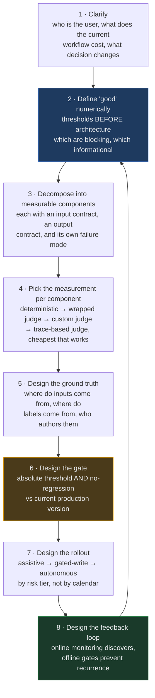

# Agentic AI System Design & Decomposition — Case-Study Question Bank

**Source material:** `07_Advanced_Agentic_Systems/Evaluation_and_Eval_Harnesses/`, `07_Advanced_Agentic_Systems/Deep_Agents_and_Harness_Engineering/`, and `17_OpenAI_Applied_Engineer_Preparation/` from [AI-ENGINEERING-DEMYSTIFIED](https://github.com/Sourav692/AI-ENGINEERING-DEMYSTIFIED).

**Target rounds:** Agentic AI system design / problem decomposition at OpenAI (Applied AI Engineer), Anthropic (Applied AI / Forward Deployed), Google (Applied AI Engineer, Vertex Agents), Microsoft (Copilot Applied Science / Cloud Solution Architect - AI).

**How to use this:** These are **practice cases, not leaked questions**. Every scenario below is a situation an applied AI engineer or FDE actually walks into on a customer engagement. Each one is written to be answered out loud in 30-45 minutes, with the interviewer pushing back.

---

## Section 0 — What This Round Actually Measures

The decomposition round is not a knowledge quiz. Interviewers at all four companies are scoring roughly the same five axes:

| Axis | What a weak answer looks like | What a strong answer looks like |
|---|---|---|
| **Ambiguity handling** | Starts drawing a RAG diagram in minute two | Spends 5-8 minutes establishing who the user is, what the current workflow costs, and what "good" means numerically |
| **Decomposition** | One monolithic "the agent does X" | Named components with explicit contracts, each independently measurable and independently failable |
| **Measurement discipline** | "We'd use RAGAS" | Separates retrieval / generation / tool-mechanics / trajectory / outcome, and says which are *blocking* vs *informational* |
| **Failure reasoning** | Assumes the happy path | Names the blast radius of each wrong decision, and designs the system so the model is allowed to be wrong |
| **Judgment under constraint** | Says yes to the stated goal | Pushes back on the business ask with a reason and an alternative sequencing |

**The single highest-signal behaviour:** treat evaluation as a *design input*, not a phase that happens after the build. If you cannot describe how you would measure a component, you have not finished designing it.

---

## Section 1 — The Decomposition Spine

Use this as the backbone for every case in this document. It is deliberately eval-first.

**Two properties to say out loud when you draw this:**

- **Online discovers; offline prevents recurrence.** A finding that stops at the monitoring dashboard helps once. Carried into a gated offline test, it protects every release after.
- **The gate is the only thing that can deploy.** Human-written prompts and machine-optimised prompts pass through the identical check. Nothing is exempt for being auto-generated — if anything it deserves more scrutiny, because it was optimised against a metric that sits *inside* the gate.

---

## Section 2 — The Evaluation Taxonomy You Must Be Able to Draw

Almost every follow-up in this round is a disguised version of *"which layer are you actually measuring?"* Have this ready.

```mermaid
flowchart LR
    subgraph L1["Retrieval"]
        R1["deterministic<br/>precision@k, recall@k, MRR, NDCG"]
        R2["LLM-judged<br/>contextual relevancy / precision / recall"]
    end
    subgraph L2["Generation"]
        G1["referenceless<br/>faithfulness, answer relevancy"]
        G2["reference-based<br/>correctness, expected_facts"]
    end
    subgraph L3["Tool mechanics"]
        T1["tool selection accuracy"]
        T2["argument correctness"]
        T3["redundant / unexpected calls"]
    end
    subgraph L4["Trajectory"]
        J1["step-wise accuracy"]
        J2["trajectory match"]
        J3["recovery / self-correction rate"]
        J4["cost & efficiency proxy"]
    end
    subgraph L5["Outcome"]
        O1["task success rate"]
        O2["END-STATE VERIFICATION<br/>read the system of record"]
    end

    L1 --> L2 --> L3 --> L4 --> L5
    style O2 fill:#1a3a2a,stroke:#137333,color:#e8eaed
```

**Mechanics ≠ process ≠ outcome.** Right tool with right arguments does not guarantee a sound sequence, and a sound sequence does not guarantee the user's goal was met. Evaluate all three, not just the cheapest to check.

**The strongest signal is always end-state verification.** Wherever a real, checkable side effect exists — a database row, a booking, a sent message, a created ticket — reading the system of record beats every LLM-judged metric. It cannot be fooled by a confident sentence that misrepresents what actually happened.
---

# Tier A — Building an Evaluation Strategy From Zero

## Case 1 — "We have an agent in production and no idea if it's any good"

> A telecom customer has had an LLM support agent live for four months. It answers from an internal knowledge base and can look up accounts, check network status, and open tickets. There are no evals. Leadership wants to know whether to expand it to three more business units. You have two weeks. What do you do?

**What's being tested:** Whether you can bootstrap measurement on a system you didn't build, without stopping it.

**Decompose into:**

- **Instrumentation first.** An untraceable agent is unevaluable. Before any metric exists, confirm every request emits: a retriever span, a chat-model span per LLM call, and a tool span per tool call, with token counts and latency.
- **Span type is a contract, not a label.** A groundedness scorer *hard-requires* a span typed RETRIEVER. A retrieval function traced without the correct span type doesn't degrade the eval, it breaks it.
- **Decide what "good" means before you measure.** Name 5-7 dimensions (groundedness, correctness, tool-selection, safety, escalation-appropriateness, latency, cost) and give each a threshold and a blocking/informational flag.
- **Mine the dataset from real traffic, don't hand-write it.** Hand-written sets are structurally blind: they contain what the author imagined, and the gap from reality is invisible from inside.
- **Mining gives inputs, not labels.** Traces hand you the *distribution* — the expensive half to guess. Expectations still have to be authored by a human, and provenance of each label needs recording.
- **Stratify the sample.** Random sampling reproduces the head you already understand. Novelty-targeted selection — embedding distance from what's already in the set, or low-confidence/high-latency/tool-error traces — finds the tail.

**The trap:** Using the agent's own historical outputs as expectations. This is **circular ground truth** — the agent passes by construction, and today's bugs get frozen as correct. If someone proposes it as a shortcut, name it.

**Killer follow-ups:**
- *"You have no labelled data and no SME time for three weeks. What do you ship in week one?"* → Referenceless scorers only (faithfulness, safety, format, deterministic input/output checks). They need no ground truth and can run on live traffic immediately.
- *"Your eval says 91% pass. Is the agent good?"* → Not answerable yet. 91% of *what distribution*, against *whose* standard, with an unvalidated judge. Aggregate pass rate with no category slices and no judge calibration is a number, not evidence.

**Strong-answer signal:** You say out loud that an eval which doesn't end in a decision isn't an eval. The output of a two-week engagement should be *expand / don't expand / expand only for these two intents*, not a dashboard.

---

## Case 2 — "Design the eval before you design the system"

> A bank wants an agent that answers relationship managers' questions about client portfolios, pulling from a document store and a transactions warehouse. Nothing is built. The first thing your interviewer asks is: before you draw any architecture, tell me how you'd know it works.

**What's being tested:** Eval-driven development as a genuine method, not a slogan.

**Decompose into:**

- **The objective, in one sentence with a number.** "Reduce RM portfolio-prep time from 40 minutes to under 10, with zero fabricated holdings figures" is an objective. "Improve productivity" is not.
- **A gate is a named metric + a threshold + a blocking flag.** Write the gate table *first*. It becomes the architecture's requirements document.
- **Blocking vs informational is orthogonal to whether the dimension matters.** Tone matters and probably shouldn't block a release. Fabricated figures matter and must.
- **Architectural decisions made *for* measurability.** The big one: make retrieval a fixed pipeline step rather than a tool the model may skip. That guarantees every trace carries a retriever span, so groundedness is always scoreable. Keep account lookup as a model-chosen tool precisely *because* "should it have called that?" is itself something you want to score.
- **Scorer cost hierarchy.** Deterministic (free, instant) → built-in judge wrapped as a scorer → custom judge with a rubric → trace-based judge reading the whole trajectory. Pick the cheapest layer that answers the question.
- **Determinism beats cost as the reason.** Deterministic scorers are *reproducible*. When one moves, behaviour really changed. Judges move on their own.

**The trap:** Proposing one mega-judge that rates "overall quality 1-5." It compresses five independent failure modes into one number that can't diagnose anything and can't gate anything specific.

**Killer follow-ups:**
- *"Which of your gates would you make blocking on day one, and which on day ninety?"*
- *"A deterministic regex scorer and an LLM judge disagree on the same row. Who wins?"* → Neither. They're complements: regex catches the blatant case always and the paraphrase never; the judge is the reverse. Run both, and treat the disagreement set as your highest-value review queue.

---

## Case 3 — "Prove it's safe enough to go from copilot to autonomous"

> An insurer runs an AI claims assistant in assistive mode — it drafts, a human decides. The business wants automated adjudication for low-value claims within two quarters. What evidence would you require before allowing that, and how would you generate it?

**What's being tested:** Risk-tiered rollout, and whether you can say no with a plan attached.

**Decompose into:**

- **Tier the actions by blast radius**, not by claim value: read-only extraction → triage/routing → missing-info detection → recommendation → adjudication. Each tier earns autonomy independently.
- **Assistive mode is a free labelling factory.** Every human override is a ground-truth label with perfect provenance. Instrument the override itself — what the agent proposed, what the human chose, and why — and you have your eval set for the autonomous phase.
- **Agreement with human adjudicators, not accuracy against a gold file.** And measure agreement corrected for chance, because on a skewed distribution (most claims approved) raw agreement flatters badly.
- **Define the reversal path before the automation path.** What does an incorrect auto-adjudication cost, how is it detected, how long until it's caught, and can it be reversed?
- **Shadow mode as the gate.** Run autonomous decisions in parallel with humans for N weeks, gate promotion on both an absolute agreement threshold *and* no regression against the assistive baseline.

**The trap:** Answering the question as asked. "Prove it's safe" invites a single number. The right move is to reframe: safety isn't one threshold, it's a per-claim-type decision with different thresholds and different human-review rates.

**Killer follow-ups:**
- *"The business says the governance review will take six weeks and they want to skip it for the MVP. What do you do?"* → Offer a scope reduction, not a control reduction. MVP on read-only extraction needs no adjudication governance.
- *"Your agreement number is 94%. The remaining 6% — how do you know they're not concentrated in one claim type?"* → You don't, unless you sliced. Aggregates hide the thing you need to see.

---

# Tier B — Diagnosing a Failing System in Production

## Case 4 — "Quality dropped after we upgraded the model"

> A customer upgraded to a newer model. Offline benchmarks improved. Users say quality got worse. Walk me through your investigation.

**What's being tested:** Whether you can separate *model quality* from *application quality* — the most reliably asked question in this family.

**Decompose into:**

- **Reproduce the complaint as a measurable claim.** "Worse" is not a metric. Get 20 specific conversations users flagged.
- **Diff everything that changed, not just the model.** Model version, prompt template, tool schemas, retrieval index, context-window truncation behaviour, temperature, structured-output mode.
- **Check prompt sensitivity.** A prompt tuned against the old model's quirks can degrade on a new one that follows instructions more literally. Format compliance and tool-argument shape are the usual casualties.
- **Check the metric that nobody was watching.** The classic: the metric someone asked about improving went up, and three others collapsed. Conciseness improves; groundedness and escalation-appropriateness fall.
- **Check whether the benchmark is the thing that's wrong.** A benchmark that improves while users complain is evidence that the benchmark's distribution doesn't match production traffic.

**The trap:** Concluding "the new model is worse." It usually isn't. The application was overfit to the old one.

**Killer follow-ups:**
- *"The offline benchmark improved but users disagree. Give me three explanations."* → (1) benchmark distribution ≠ traffic distribution; (2) the benchmark measures dimensions users don't care about and misses ones they do; (3) the benchmark's judge is unaligned and was inflating the new model.
- *"How do you prevent this next time?"* → A regression gate that is two-condition: absolute thresholds *and* no regression versus the current production version, across the full scorer set — not just the metric being optimised.

---

## Case 5 — "The agent confidently told a customer something that doesn't exist"

> An agent told a customer their account plan and balance. The account number didn't exist. The tool returned `{"found": false}`. No error was raised, nothing crashed, nothing alerted. How did this happen and how do you stop it?

**What's being tested:** Recognising **polite tool failure** — the single most under-tested failure mode in production agents.

**Decompose into:**

- **The mechanism.** Tools that return a soft failure object rather than raising give the model something that looks like data. The model skates past it and fills the gap with fluent, plausible, wrong content.
- **Why standard scorers miss it.** Groundedness checks the answer against *retrieved documents*, not against *tool outputs*. Task-success checks the final string. Neither reads the tool span.
- **The fix is a deterministic scorer, not a better prompt.** Read the TOOL span output; if it indicates failure, assert that the response does not state the facts that tool was supposed to supply. Deterministic because you want it reproducible and free.
- **Second-order fix:** make soft failures loud at the tool layer where you control it, and make "I couldn't retrieve that" an explicitly rewarded behaviour in the rubric.
- **Absence is behaviour.** A question that correctly produces *no* tool call is a correct outcome worth scoring, not an absence of signal.

**The trap:** Proposing to fix this with prompt engineering alone. Instructions reduce the rate; they don't make it detectable.

**Killer follow-ups:**
- *"Where else does this pattern appear?"* → Empty retrieval results, a permission-filtered search returning zero rows, a downstream API returning 200 with an empty payload, a rate-limited call returning a cached stale value.
- *"How would this have surfaced in monitoring?"* → It wouldn't have, and that's the point. Silence and success look identical.

---

## Case 6 — "Responses got slow, and only during peak"

> An enterprise reports p95 latency tripled. It only happens during business hours. Investigate.

**What's being tested:** Whether you can decompose latency across an agentic trace rather than treating the system as one box.

**Decompose into:**

- **Latency is per-span, not per-request.** Break it down: input assembly → retrieval (embed + search + rerank) → first LLM call → tool round-trips → subsequent LLM calls → output streaming. An agent loop that takes two extra turns is a *behavioural* regression showing up as a latency one.
- **Traces as queryable tables.** Once production traces land in a warehouse, "it got slower" becomes "retrieval p95 doubled while chat-model p95 was flat." That's the whole value of the trace store.
- **Peak-only narrows it fast.** Candidates: provider rate limiting and retry backoff, vector index cache eviction under concurrency, connection-pool exhaustion, a reranker that batches poorly, a noisy-neighbour tenant.
- **Check whether step count changed, not just step duration.** More tool calls per request during peak can mean a different traffic mix, not a slower system.
- **Only six aggregations are usually available** — min, max, mean, median, variance, p90. If you need p99, you need to compute it from the raw trace table yourself.

**Killer follow-up:** *"Latency is fine at p50 and terrible at p90. Which do you optimise and why?"* → Depends entirely on whether the tail correlates with a user segment or an intent class. Slice before you optimise.

---

# Tier C — Trajectory and Multi-Agent Evaluation

## Case 7 — "The agent gets the right answer but takes six steps to do it"

> A research agent reliably produces correct final answers. It also makes redundant tool calls, retries failed calls blindly, and costs 4x what was budgeted. Task success is 96%. Design the evaluation that would have caught this.

**What's being tested:** Understanding that **outcome metrics hide process failures** — and that you need both.

**Decompose into the nine trajectory-level metrics:**

| # | Metric | What it catches |
|---|---|---|
| 1 | **Tool selection accuracy** | Did the called set cover the gold set? Loosest of the nine — passes with wrong order and extra calls |
| 2 | **Tool call correctness (arguments)** | Right tool, malformed arguments |
| 3 | **Redundant / unnecessary calls** | A `(tool, args)` pair that already *succeeded* earlier in the same trace |
| 4 | **Step-wise accuracy** | Fraction of all steps that made real forward progress |
| 5 | **Task success rate** | Ground-truth outcome for the run |
| 6 | **Trajectory match (fuzzy/set-based)** | Successful tool set vs gold set, ignoring order and retries |
| 7 | **End-state verification** | Read the mutated system of record directly |
| 8 | **Recovery / self-correction rate** | After an error, did a later step call the same tool and succeed? |
| 9 | **Cost / efficiency proxy** | Redundant calls + errors treated as waste |

**The trap in the standard pattern:** The commonly published tool-selection scorer computes both *missing* and *unexpected* tools, then bases the verdict only on the missing ones. An agent that calls **every tool on every request scores 100%**. Fail both directions — an unexpected account lookup is a privacy problem, not an inefficiency.

**Killer follow-ups:**
- *"Is a high recovery rate good or bad?"* → Genuinely good on its own. An error caught and corrected mid-run is a very different system from one that fails silently or retries blindly with the same bad input. But pair it with step-wise accuracy, or you're rewarding a system that generates errors so it can recover from them.
- *"A capable model usually picks a minimal trajectory anyway. Why build the harness?"* → Because "usually" is the problem. The harness exists to catch the ambiguous-query and edge-case runs where it doesn't, and those are exactly the runs nobody reports.
- *"Exact sequence match or fuzzy set match?"* → Fuzzy by default. Exact-sequence fails on a mid-trace typo or a harmless extra lookup even when the agent did the right things. Reserve exact match for regulated workflows where order is the requirement.

---

## Case 8 — "Multi-agent system, and we can't tell which agent is wrong"

> A deep-agent orchestrator routes to specialised subagents — a research agent, a code writer, a code reviewer, a memory manager, and four domain analytics agents over separate data domains. End-to-end quality is inconsistent. Design the evaluation.

**What's being tested:** Attribution in a system where the failure and the symptom are in different components.

**Decompose into:**

- **Trace nesting enables attribution.** Session → orchestrator turn → subagent invocation → spans. Without nesting you can say quality dropped; with it you can say *which subagent*, on *which turn*.
- **Evaluate at three levels.** Routing/handoff accuracy (did the orchestrator pick the right subagent?), per-subagent specialisation quality (is the research agent good at research?), and end-to-end outcome.
- **Handoff accuracy is its own metric** and usually the first thing to break when a new subagent is added — the routing rubric was written for N agents and is now running with N+1.
- **Scope of validity.** A scorer that was correct for a one-tool agent becomes misleading when the agent gains a second tool. The same is true of a router rubric. Every measurement has a scope of validity, and it silently stops being true when the system changes underneath it.
- **Cross-domain queries are the hard case.** When a question requires two analytics subagents plus the research agent, define whether partial coverage counts as success, and score the *composition* separately from each part.
- **Memory as an evaluable component.** Cross-thread persistence needs its own tests: does a saved fact recall correctly in a new thread, does a forget instruction actually remove it, does memory leak between users.

**Killer follow-ups:**
- *"Every subagent scores above 0.9 and the end-to-end system scores 0.6. Explain."* → Composition. Independent components at rate p compose to p^n; plus routing errors and context loss at handoff boundaries, which no per-agent metric sees.
- *"Circular handoffs — agent A routes to B, B routes back to A. How do you detect and evaluate this?"* → A deterministic trace scorer for cycles, with a step-budget gate. It's cheap, reproducible, and this is a class of failure where an LLM judge adds nothing.

---

## Case 9 — "The conversation fails even though every turn passes"

> A multi-turn assistant reports 95% turn-level pass rate. Users say it's frustrating. Reconcile these.

**What's being tested:** Session-level vs turn-level reasoning, and basic composition arithmetic.

**Decompose into:**

- **The arithmetic.** Independent turns at rate p give p^n for the conversation. At 95% per turn and 5 turns, that's a **77% conversation success rate** — and the overstatement grows with length, so the metric looks best exactly where the product is worst.
- **Failures that have no single-turn representation at all:**
  - **Context retention** — re-asking for something the user already supplied. The most visible multi-turn failure.
  - **Consent, which lives between turns.** "Acted without asking" cannot be expressed as a property of one turn.
  - **Three approval outcomes, not two:** compliant, violation, and *stalled* (agreed but nothing happened). They need different fixes.
- **Gate by prompt, verify by evaluation.** Most agent write-actions are gated by instructions, not by APIs. The tool will happily write every time it's called. So obedience is something evaluation has to *verify*, not something the code guarantees.
- **First-failing-turn distribution.** Failures on turn 1 mean basic competence problems. Failures on turn 4 mean context handling. Same aggregate, completely different fix.
- **Gate scope.** A conversation gate is unmeasurable on a single-turn run. It must report **"not measured"**, never 0 — an unmeasured gate and a failed gate must never look alike.

**The harness trap:** Applying the user identity only to turn 1. The agent loses track of who it's talking to from turn 2 onward, and every conversation fails context-retention for a plumbing reason. You'd be measuring your harness, not the agent.

**The off-by-one trap:** Treating a write on the *same* turn consent arrived as premature. Consent arrives in the user's message at the start of a turn; the write happens in the agent's response within that turn. Same-turn is correct — and getting this wrong fails the agent for behaving correctly.

**Killer follow-up:** *"Tool selection vs tool use — same thing?"* → With one tool they collapse into one question. With two they separate, and wrong-tool is worse than no-tool: it returns data that is real, irrelevant, and confidently presented.
---

# Tier D — Judges and Human Calibration

## Case 10 — "Who validates the validator?"

> Your eval suite has been running for three months. Every quality number in it came from an LLM judge that nobody ever checked against a human. A VP asks whether the numbers mean anything. What's your answer, and what do you do next?

**What's being tested:** Whether you treat LLM-as-judge as a tool with known failure modes or as an oracle.

**Decompose into:**

- **The honest answer first:** the numbers are internally consistent and externally unvalidated. They're useful for detecting *change*, not for asserting *quality*.
- **Collect human labels on the same traces.** Small (100-200 rows), from actual domain experts, on the same rating schema the judge uses.
- **Measure agreement, not average score.** Average measures generosity. A judge that rates everything 5/5 scores beautifully and is useless.
- **Raw agreement flatters.** On a skewed rating distribution two raters agree often by luck. A case with 85% raw agreement had a Cohen's kappa of **0.20**.
- **Use the weighted form on ordinal scales.** Plain kappa treats 4-vs-5 and 1-vs-5 as the same error. Two judges with *identical* exact agreement and *identical* plain kappa can score **+0.71 and −0.82** under quadratic weighted kappa.
- **A falling score after alignment is the success condition.** The agent didn't change. The measurement stopped inflating. Say this before the VP says "you made it worse."
- **The real output of alignment is the distilled guidelines** — your experts' tacit standard, finally written down. That artifact outlives the judge model.

**The silent failure:** If the human label schema name doesn't match the judge name, alignment completes without error and learns nothing. The aligned judge is byte-identical to the base. Define the name once as a variable and use it in both places.

**Killer follow-ups:**
- *"Your experts disagree with each other. Now what?"* → Measure inter-annotator agreement first. If humans can't agree, the rubric is underspecified and no judge can be aligned to it. Fix the rubric, don't fix the judge.
- *"Can you use a judge to grade a judge?"* → For triage and disagreement-surfacing, yes. As the ground truth, no — you've just moved the unvalidated layer one level up.

---

## Case 11 — "Automated prompt optimisation made the score go up. Ship it?"

> An automated optimiser ran against your judge-based objective and produced a candidate prompt scoring 12 points higher. The team wants to deploy it Friday.

**What's being tested:** Overfitting reasoning, and whether you understand what an optimiser is actually maximising.

**Decompose into:**

- **The judge is the objective.** The optimiser moves toward whatever the judge rewards. An unaligned judge doesn't just make optimisation useless — it makes it **actively harmful**, because you're now systematically steering the system toward a miscalibrated standard.
- **A higher optimisation score is not permission to ship.** It is by definition the metric being maximised: the most overfit number available in the building.
- **Machine-written prompts pass the identical gate as human-written ones**, evaluated against a scorer set *strictly larger* than the optimisation objective. That superset is what catches the overfitting.
- **The optimisation dataset is not the eval dataset.** Optimisation needs expectations on *every* row describing required behaviour; the eval set deliberately holds rows the optimiser never saw.
- **Registering is not deploying.** Creating a prompt version and pointing production traffic at it are separate operations, and evaluation belongs in the gap between them.

**Killer follow-ups:**
- *"What would convince you to ship it?"* → It clears absolute thresholds on the full scorer set, shows no regression on any metric versus the current production version, and holds on a held-out slice the optimiser never touched.
- *"The optimiser ran its whole budget and the prompt barely changed. What's wrong?"* → Almost always the prediction function closed over a fixed prompt string instead of re-loading from the registry each call — so every candidate ran against the same old text.

---

---

## Case 12 — "Stand up the human evaluation programme"

> Leadership has agreed to fund domain-expert review time for an agent, but nobody has done this before. They want to know: how many reviewers, reviewing what, how often, and how you'd know the reviews themselves are any good. Design the programme.

**What's being tested:** Whether you treat human evaluation as an engineered system with its own failure modes, or as "ask some experts what they think." This is the layer everything else in the eval stack rests on — and the one candidates most often wave at.

**Decompose into:**

- **Human eval is a dataset generator, not a scorer.** It doesn't run in CI and it doesn't gate releases directly. Its outputs are (a) labels that calibrate judges, (b) the distilled rubric your experts couldn't previously articulate, and (c) a periodic ground-truth check on whether the automated stack has drifted. Every one of those is expensive and none of them is continuous.
- **Pick the protocol from the question, not from convenience.**

| Protocol | Use when | Cost per judgement | Main hazard |
|---|---|---|---|
| **Blinded pairwise (A vs B)** | Comparing two candidates — model, prompt, retrieval config | Low; humans are fast at "which is better" | Position bias, length bias, ties |
| **Single-answer absolute rating** | Building a labelled set to align a judge, or tracking quality over time | Medium | Scale drift, anchoring, generosity |
| **Reference-guided rating** | Domain where a gold answer exists (policy lookup, calculation) | Medium | Penalises correct answers phrased differently |
| **Critique / error annotation** | You don't yet know what the failure modes *are* | High | Unstructured output that doesn't aggregate |

- **Blinding is load-bearing, and it has to be real.** Strip model names, strip anything that identifies which arm a response came from, and randomise A/B order per row. Then *measure* whether order mattered: if position A wins meaningfully more often across a balanced set, your pairwise numbers include a bias term, not just a quality signal.
- **Length is the confound nobody controls for.** Longer answers win pairwise comparisons at a rate unrelated to quality. Report win rate alongside a length distribution per arm, or you'll ship verbosity and call it improvement.
- **Validate the raters before you trust the ratings.** Inter-annotator agreement is the first number to compute, not the last. If humans can't agree with each other, the rubric is underspecified and **no judge can be aligned to it** — you fix the rubric, not the judge.
  - Two raters, ordinal scale → **quadratic weighted kappa**.
  - Three or more raters → **Fleiss' kappa** or **Krippendorff's alpha**.
  - Report raw agreement too, but never alone: on a skewed distribution two raters agree often by luck.
- **Consensus rules must be decided in advance.** Majority vote is the cheap default and it hides systematic disagreement — a persistent 2-1 split on one claim category is a rubric defect wearing a resolved label. Prefer: majority for the bulk, mandatory adjudication by a senior reviewer wherever agreement falls below threshold, and a standing log of adjudicated cases that feeds back into the rubric.
- **Record provenance on every label.** Who authored it, human or script, which rubric version, which date. This becomes decisive later, when those labels train a judge and you need to know which ones predate a rubric change.
- **Design against annotator drift.** Standards move over weeks. Seed 5-10% of every batch with previously-labelled gold rows and track each rater's agreement with their own past self. A rater whose self-agreement is falling needs recalibration, not replacement.
- **Separate the people who wrote the rubric from the people applying it**, at least for the validation batch. Authors score their own rubric far more consistently than anyone else can, which makes agreement look excellent and generalisation look fine right up until it isn't.
- **Size the programme from what it has to decide.** A pairwise win rate of 55% is not distinguishable from a tie on 100 comparisons. Work backwards from the smallest difference you need to detect — same reasoning as production sample rates, applied to people instead of traffic.

**The trap:** Treating human labels as ground truth rather than as a sample from one population of annotators, taken under one rubric version, at one point in time. They're the best signal available and they are still an estimate with error bars. State that before someone else does.

**The second trap:** Running human eval continuously. It's the most expensive measurement you have and its throughput caps your release cadence if you make it blocking. Ration it to the three moments that justify it — judge alignment, major model or architecture changes, and a scheduled drift check.

**Killer follow-ups:**

- *"Your experts disagree 30% of the time. Is the programme broken?"* → Not necessarily — first find out *where*. Disagreement concentrated in one claim category is a rubric gap and it's fixable. Disagreement spread evenly means the task is genuinely subjective, and the honest move is to narrow what you're asking them to rate rather than pretend the number will improve.
- *"Can you replace human eval entirely once the judge is aligned?"* → No. The judge is aligned to a snapshot of expert standards under one rubric on one traffic distribution. All three move. A periodic human batch is what tells you the judge has drifted, and without it you have a confident number and no way to know it stopped meaning anything.
- *"You have budget for 200 expert-hours a year. Spend it."* → Roughly: one large alignment batch up front (the highest-leverage spend, because it converts into an automated judge that runs unlimited times), quarterly drift batches, and reserve for adjudication and for whichever failure mode online monitoring surfaces that nobody anticipated.
- *"Pairwise says the new prompt wins 58-42. Ship it?"* → Not yet. Check the confidence interval at that sample size, check position balance, check the length distributions, and check whether the 42% losses cluster in one intent category. A win rate is an aggregate, and aggregates hide the thing you need to see.

**Strong-answer signal:** You name inter-annotator agreement as the *first* thing you'd measure, and you connect the programme forward — its output isn't a quality verdict, it's the calibrated judge and the written-down rubric that let you stop paying for human review on every release.

# Tier E — Release Gating and CI

## Case 13 — "Design the CI gate for an agent"

> A platform team wants every prompt change, tool-schema change, and model upgrade to pass an automated gate before reaching production. Design it.

**What's being tested:** Whether you can turn measurement into enforcement — and whether you know the difference.

**Decompose into:**

- **Scorer ≠ gate.** Adding a scorer adds measurement, not enforcement. Scorers are informational by default. An ungated scorer blocks nothing.
- **Two-condition promotion.** Absolute thresholds *and* no regression versus the current production version. Either alone is insufficient.
- **Threshold-only gates permit erosion.** 0.98 → 0.91 still clears a 0.90 bar. Repeat that three times and you are sitting on the floor, having passed every gate.
- **Per-metric-type tolerance.** Zero tolerance for deterministic metrics — there is no noise to absorb, so any movement is real. A small budget for judged ones, because they move on their own.
- **A regression report is a diagnosis, not a verdict.** It should name the prompt clause to fix, not just say FAIL.
- **Alias as indirection.** Production points at an alias, not a version. Rollback is moving a pointer, not a revert-and-redeploy.
- **Resolve gates against the keys the run actually produced.** A mistyped metric name looks up nothing, defaults to 0, and reports as a catastrophically broken agent. Unmatched gates must report **"not measured"**, separately from failures.
- **Fixed vs current datasets, and you need both.** The curated regression set must *not* drift, or before/after comparisons are invalid. The mined set must stay fresh, or it stops discovering anything.

**The recurring failure to name:** a scorer added without a corresponding gate entry. This happens repeatedly even to teams who know about it — an agent opening a support ticket nobody asked for was measured and released, because the scorer existed and the gate didn't.

**Killer follow-ups:**
- *"Judged metrics are non-deterministic. How do you gate on them without flaky CI?"* → Fixed judge model and version, temperature 0 where available, a tolerance band sized from a measured run-to-run variance study, and a rerun-on-boundary policy. Never gate on a single row.
- *"How long should the gate take?"* → Whatever keeps it in the merge path. A 40-minute gate gets bypassed. Tier it: deterministic scorers on every commit, full judged suite on merge to main.

---

## Case 14 — "Score went up on the metric we asked about"

> Someone asked for more concise answers. The next release: conciseness up, ship approved. Two weeks later, complaints. What happened?

**What's being tested:** The most common real-world eval failure in one sentence.

**Decompose into:**

- The metric someone asked about improving rose. Three that nobody was watching collapsed — typically groundedness (shorter answers drop citations), escalation-appropriateness (less room to hedge), and completeness.
- **This is exactly what the no-regression condition exists for.** A gate that checks only the target metric is a gate that optimises one dimension into the ground.
- **Raw numeric metrics carry no direction.** Word count falling reads as a regression to a naive check. Only a verdict-returning scorer encodes intent — wrap numeric metrics before gating on them.
- **Report distributions, not booleans.** The p90 is where rambling answers hide; the p10 is where truncated ones do.

**Killer follow-up:** *"How would you have caught this before release, not after?"* → Full-scorer-set evaluation on every candidate, with per-metric regression tolerance, plus category slices. Aggregates hide the thing you need to see — and they hide it most reliably when one number is moving in the direction someone wanted.

---

# Tier F — Online Monitoring and Statistics

## Case 15 — "Set up production monitoring for the agent"

> The agent serves roughly 2,000 conversations a day. Design online evaluation and alerting.

**What's being tested:** Knowing which scorers can even run in production, and whether you can reason about sample statistics.

**Decompose into:**

- **Offline catches what your dataset contains. Online exists to find what it didn't.** Both, always.
- **Production has no ground truth.** Any scorer that reads expectations is structurally offline-only, however good it is. The test is mechanical: does it read expectations? If yes, it cannot go online.
- **Reference-free scorers transfer:** safety, relevance, groundedness, guideline adherence, and all deterministic input/output checks.
- **Sample judges; never sample deterministic scorers.** The first cost money per call. The second are free — run them on 100% of traffic.
- **Choose the sample rate from the delta you must detect**, not from a round number that felt affordable. At 2,000 traces/day, a 5% sample resolves to roughly **±4.5 points**. A 2-point drop is indistinguishable from noise; detecting it reliably needs around 30% sampling.
- **Alerts set below the sampling resolution fire on noise** and get muted within a month — at which point you have monitoring that looks healthy and alerts nobody.
- **Traces as warehouse tables.** Once production behaviour is SQL-queryable, incident response changes character: "it got worse" becomes "retrieval p95 doubled for tenant 14 starting Tuesday."
- **Carry every finding into a gated offline test.** A finding that stops at the dashboard helps once.

**The silent failure:** A registered-but-never-started monitor. Registration creates the scorer; starting it begins evaluating. A registered scorer that was never started evaluates nothing and looks identical to a working one on every list view. Verify by checking each scorer has a live sampling config.

**Killer follow-ups:**
- *"Your best offline scorer is tool-call correctness. Can it run online?"* → No. It compares against expected tool calls, which production traffic doesn't have. It will report skip on 100% of traces while appearing perfectly healthy.
- *"What's your first alert?"* → Not a quality metric. A structural one — trace volume, error-span rate, and scorer-coverage rate — because those catch the case where monitoring itself has silently stopped.

---

# Tier G — Adversarial and Edge-Case Evaluation

## Case 16 — "We tested 15 jailbreak strings and passed 12"

> A security team hands you their adversarial test results: 80% pass rate on a list of prompt-injection strings. They consider the system cleared. Do you agree?

**What's being tested:** Eval-set *design* discipline, which is a different skill from metric selection.

**Decompose into:**

- **Design by attack surface, not by example.** A flat list of strings tells you nothing when it passes — you learn that those 15 strings failed, not that the surface is defended.
- **Structure as classes × variants.** Name the classes: direct instruction override, role-play framing, **channel confusion** (content formatted to look like system text or tool output), injection via retrieved documents, injection via tool responses, encoding/obfuscation, multi-turn gradual escalation. Multiple phrasings per class stop one lucky string standing in for a whole surface.
- **Report per class, never in aggregate.** A real case: **80% overall with one entire class at 0%.** The aggregate was the thing hiding it.
- **Retrieved content is untrusted input.** In a RAG system the document corpus *is* an injection channel, and it's the one most teams never test.
- **Edge-case rows assert what must not happen**, not one gold answer. Behavioural boundaries, not gold text.
- **Over-constrained expectations fail good agents.** For genuinely ambiguous input several behaviours are acceptable; asserting one specific response penalises correct handling.
- **Documented gap ≠ covered gap.** Writing a gap down buys honesty, not coverage — and the two are easy to confuse for a long time. Say "not measured," with a reason, rather than leaving silence: silence is indistinguishable from having missed it.

**Killer follow-ups:**
- *"Design the adversarial eval set for a banking agent with a write-capable tool."* → Classes must include: privilege escalation through conversational framing, injection via the transaction-description field, tool-argument manipulation, consent-forgery ("as I said earlier, go ahead"), and cross-customer data requests.
- *"How do you avoid over-refusal?"* → Test both directions. A refusal-rate scorer on *benign* inputs is as necessary as a jailbreak scorer on hostile ones. A system that refuses everything scores perfectly on safety.

---

## Case 17 — "The agent must never do X"

> A regulated customer gives you a hard constraint: the agent must never disclose another customer's data, never commit the firm to a price, and never take a write action without explicit confirmation. Design the enforcement and the evaluation.

**What's being tested:** Whether you distinguish *enforcement* from *evaluation*, and put each where it belongs.

**Decompose into:**

- **Enforce in code where you can, evaluate where you can't.** Cross-customer data access is enforceable at the retrieval layer — filter by identity before the model ever sees a row. Never make that a prompt instruction.
- **Everything gated by instructions rather than APIs must be verified by evaluation.** Most agent write-actions fall here. The tool writes every time it's called; obedience is a behaviour, and behaviours get tested.
- **Three layers, named:** hard constraints in code (ACL-filtered retrieval, typed tool signatures rejecting malformed arguments, allowlisted write scopes), soft constraints in the prompt, and verification in the eval harness for both.
- **Permission freshness is its own problem.** A user with access today and revoked access tomorrow must not retrieve from a stale index or a cached embedding. Decide whether you filter at query time or re-index, and be explicit about the staleness window.
- **Blast-radius design.** Assume the model will occasionally decide wrongly. Limit what a wrong decision can reach: read-only by default, write scopes narrow and reversible, dollar/row-count caps, idempotency keys, and an audit record of what was proposed versus what executed.
- **End-state verification closes the loop.** Don't trust the agent's claim that it asked for confirmation — read the actual write log and reconcile it against the consent turns.

**Killer follow-up:** *"The agent wants to issue a refund. Should it be allowed to do so automatically?"* → Under a value threshold, with a reversal window, an idempotency key, a daily cap, and 100% end-state verification — yes. Above it, propose-and-confirm. The question is never "autonomous or not," it's "autonomous within what bounded, reversible envelope."

---

# Tier H — Harness and Platform Engineering

## Case 18 — "Build the eval platform, not the eval"

> An enterprise wants a reusable evaluation capability that eight product teams can use for their own agents. Design it.

**What's being tested:** Platform thinking — the FDE-to-product-engineering transition.

**Decompose into:**

- **What's shared vs what's per-team.** Shared: tracing schema and span-type contracts, scorer library, dataset storage and versioning, gate execution, the trace warehouse, judge-model access and cost accounting. Per-team: the rubrics, the thresholds, the domain expectations.
- **The span-type contract is the platform's actual API.** If teams instrument inconsistently, no shared scorer works. Ship instrumentation as a library, not a document.
- **Scorer registry with declared prerequisites.** Every scorer declares what it needs (expected facts, a retriever span, a tool span) and whether it's reference-free. That declaration is what makes online-eligibility checkable automatically instead of discovered in production.
- **Guard scorers on mixed datasets.** Built-in correctness and guideline scorers *raise* on rows that aren't theirs — they have no "not applicable" verdict. On a dataset that deliberately mixes factual and behavioural rows, each scorer errors on every row belonging to the other kind. Wrap them to return null so an inapplicable row is skipped, not errored. Return null rather than a "skip" verdict: a pass rate counts "skip" as a non-pass and quietly deflates.
- **An errored row is not a scored row.** The harness catches the exception, records an error assessment, and the run completes — so the symptom is log noise plus a metric that quietly vanished from the results, not a crash. Easy to scroll past for weeks.
- **The output shape is whatever the prediction function returned.** There's no normalisation step. Normalise in one helper every scorer routes through, or half your scorers break on the first team that returns a string instead of a dict.
- **Infrastructure prerequisites are real design constraints.** Prompt registries and evaluation datasets typically require a SQL-backed tracking store, not a file backend. Decide that on day one; two features depend on it.

**Killer follow-up:** *"Team 6 says your scorers don't fit their agent. How much customisation do you allow?"* → Rubrics and thresholds: fully theirs. Span contracts and gate semantics: not negotiable. The moment gate semantics fork, you no longer have a platform, you have eight harnesses with a shared logo.

---

## Case 19 — "Cost is 4x the estimate"

> An agentic system in production is costing four times what was modelled. The customer wants it cheaper without losing quality. Where do you look?

**What's being tested:** Cost as a first-class design dimension, including eval cost — which most candidates forget entirely.

**Decompose into:**

- **Cost decomposes like latency.** Per-span token counts, split by: context assembly (retrieved chunks, conversation history), model calls per request, tool round-trips triggering more calls, retries, and output length.
- **Step count usually beats model price.** An agent averaging 5 LLM calls where 2 would do is a 2.5x problem that no model swap fixes. This is where the trajectory metrics earn their keep — redundant calls and blind retries are directly priced.
- **Context growth is the silent multiplier.** Every turn appends history; every retrieval appends chunks. Measure tokens-per-turn as a trend, not an average.
- **Tiered model routing.** A cheap model for classification, routing, and extraction; the expensive one only where reasoning is genuinely needed. Gate the routing decision itself — a misrouted hard query is worse than the saved cost.
- **Eval cost is production cost.** Judges are LLM calls. Sampling rate, judge-model choice, and trace-based judges (which carry a large prompt) all show up on the bill. Ration judges to promotion decisions and sampled production traffic; run deterministic scorers everywhere.
- **Caching by layer:** embedding cache, retrieval cache, exact-match response cache, prefix cache for the system prompt. Each has a different staleness risk and a different correctness cost.

**Killer follow-up:** *"Cut cost 60% without a quality regression. What's your first move?"* → Measure the token distribution before touching anything, because the 60% is almost never where the team assumes. Then: context pruning, step-count reduction, and tiered routing — in that order, each gated by the full scorer set so "without a quality regression" is a checkable claim rather than a hope.

---

# Appendix A — The Silent-Failure Catalogue

These are the failures worth naming unprompted. Every one reports nothing and reads as fine. Dropping two or three of these into an answer is the fastest way to signal you've actually operated a system rather than read about one.

| # | Symptom | Cause | Fix |
|---|---|---|---|
| 1 | A metric regresses and ships anyway | Scorer added, no gate entry. Scorers are informational by default | Add a gate whenever you add a scorer |
| 2 | A gate fails at 0.000, looks like a broken agent | Mistyped metric name; lookup defaults to 0 | Resolve gates against keys the run produced; report unmatched as **not measured** |
| 3 | Monitoring dashboard is quiet, everything looks healthy | Scorer registered but never started | Register *and* start; verify sampling config exists |
| 4 | Judge alignment completes; aligned judge is identical to base | Label schema name ≠ judge name | Define the name once, use the variable in both places |
| 5 | Production scorer reports skip on 100% of traces | It reads expectations; production has no ground truth | Check reference-freeness before registering |
| 6 | Optimiser burns its full budget, prompt barely moves | Prediction function closed over a fixed prompt string | Load the prompt from the registry inside the prediction function |
| 7 | "Passed 12/15 jailbreaks" while one class is 0% | Examples without a taxonomy | Classes × variants, reported per class |
| 8 | Agent states a plan and balance for a non-existent account | Tool returned a soft failure; model skated past it | Deterministic scorer reading the tool span |
| 9 | A metric silently vanishes from results | Built-in scorer raised on rows that aren't its type | Wrap to return null on inapplicable rows |
| 10 | Tool-selection scorer reports 100% for an agent calling every tool | Verdict based only on missing tools, not unexpected ones | Fail both directions |
| 11 | Annotator agreement looks excellent, judge generalises badly | The rubric authors were also the validation raters | Validate with raters who did not write the rubric |

---

# Appendix B — Misreadings That Sound Like Insight

| Claim | Why it's wrong |
|---|---|
| "The aligned judge scored lower, so the agent regressed" | The agent didn't change. The unaligned judge was inflating. A falling score after alignment is the success condition — read agreement, not average |
| "Raw agreement is 85%, the judge is fine" | On a skewed distribution, raters agree by luck. That same data had Cohen's kappa of 0.20 |
| "Plain kappa says both judges are equally bad" | Plain kappa treats 4-vs-5 and 1-vs-5 as the same error. Under quadratic weighted kappa those same two judges scored +0.71 and −0.82 |
| "A 5% sample shows a 2-point drop — page someone" | At 2,000 traces/day a 5% sample resolves to ±4.5 points. Indistinguishable from noise |
| "95% of turns pass, the assistant is in good shape" | At five turns that's 77% conversation success. The metric looks best where the product is worst |
| "Word count went down, that's a regression" | A raw numeric metric carries no directional information. Wrap it in a verdict-returning scorer before gating |
| "Conciseness improved, ship it" | The watched metric rose; the unwatched ones may have collapsed |
| "We documented the coverage gap" | Documented ≠ covered. Honesty, not coverage |
| "The new prompt wins 58-42 on blinded pairwise" | Check the interval at that sample size, check A/B position balance, check length distributions per arm — longer answers win regardless of quality |
| "Our experts labelled it, so it's ground truth" | It's a sample from one annotator population, under one rubric version, at one point in time. Still an estimate with error bars |

---

# Appendix C — Company-Specific Flavour

The core decomposition is identical everywhere. What differs is which follow-up you'll get pushed hardest on.

| Company | Where the round tilts | Vocabulary to have ready | The follow-up to expect |
|---|---|---|---|
| **OpenAI** | Ambiguity → scoped use case → architecture → eval → production, in that order. Evals treated as a product surface, not a QA activity | Responses API, Agents SDK, `Agent` / `Handoff` / `Guardrail` / `Session`, built-in tools (file search, web search, code interpreter, computer use), structured outputs | "You have no labelled data. What do you ship in week one?" and "What's the smallest thing you could launch that produces a measurable business number?" |
| **Anthropic** | Safety and human oversight as design inputs rather than a review stage. Refusal calibration in *both* directions | Harm taxonomies, red-teaming as eval-set design, over-refusal, human-in-the-loop escalation design, tool-use safety, model-written evals | "How would you know if the system is being *too* cautious?" and "What would you need to see before you'd let this act without a human?" |
| **Google** | Scale, multi-tenancy, and statistical rigour. Expect to be pushed on sampling, significance, and infrastructure economics | Vertex AI Agent Builder, grounding, per-tenant isolation, batch vs online eval, data lineage, p50/p90/p99 trace analysis | "Now serve 100 tenants with per-tenant quality SLAs. What changes?" and "Justify your sample rate statistically" |
| **Microsoft** | Enterprise governance, identity, and integration into existing workflow surfaces. Compliance is load-bearing, not a caveat | Copilot extensibility, Graph/M365 permission trimming, ACL-aware retrieval, Azure AI Foundry evaluations, content safety, data residency | "A user loses access to a document today. How do you prevent retrieval of stale permissions tomorrow?" and "Walk me through the audit trail a regulator would ask for" |

---

# Appendix D — Rapid-Fire Drill Set

Use these as spoken-answer drills. Target 60-90 seconds each.

1. Give me three things a task-success metric cannot see.
2. Which of your scorers can run in production, and what's the mechanical test?
3. When would you *not* use an LLM judge?
4. Your judge and your regex scorer disagree. What do you do with that row?
5. Why is retrieval a fixed pipeline step in this design and not a tool?
6. What's the difference between a scorer and a gate?
7. What's wrong with a threshold-only promotion gate?
8. Why is an unmeasured gate more dangerous than a failed one?
9. Name a correct agent behaviour that produces no tool call.
10. Why is wrong-tool worse than no-tool?
11. What's the failure mode of using production outputs as expectations?
12. When is exact-sequence trajectory match the right choice?
13. How do you evaluate a summary when there's no single correct summary?
14. Why does a falling score after judge alignment mean things are working?
15. What breaks when a one-tool agent gains a second tool?
16. How would you detect a circular handoff between two subagents?
17. Your conversation-level gate reports 0 on a single-turn run. What's wrong?
18. What's the first alert you'd set on a production agent, and why isn't it a quality metric?
19. How do you test that an agent isn't over-refusing?
20. The customer wants 80% autonomous resolution in six months. What do you challenge?
21. Your annotators agree 70% of the time. What do you fix — the rubric or the annotators?
22. Why is a 58-42 pairwise win rate not yet a decision?
23. Once the judge is aligned, why keep paying for human review at all?

---

## Closing Note

The throughline across all nineteen cases: **task success alone is never enough, and aggregates hide the thing you need to see.** A trace can reach the right final answer while being inefficient, unsafe, or lucky rather than reliable. A dashboard can be green while an entire attack class is at zero, an entire customer segment is failing, or the monitor itself stopped running three weeks ago.

Say that out loud in the round, then show the decomposition that would have caught it.
