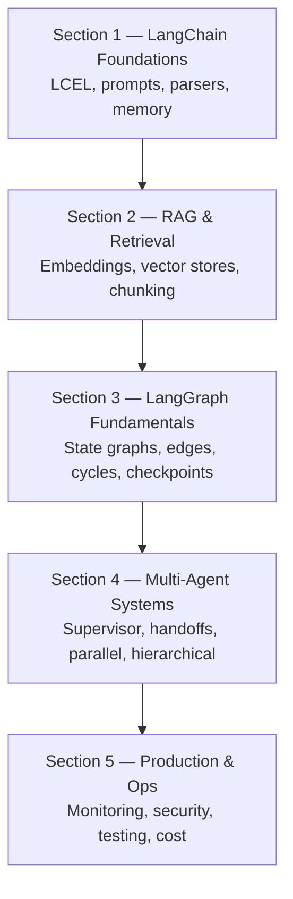

# LangChain / LangGraph Project — Concept Coverage Map

A structured index of every file in this codebase and the concepts it teaches.
The project is organized as a five-stage progressive curriculum.

---

## Learning Path Overview



---

## Repository Layout

Scripts are grouped into one folder per section and numbered in teaching order,
so reading them top to bottom follows the learning path above.

```
01_LangChain_Foundations/       01_core_concepts.py  ...  10_smart_bot_section1.py
02_RAG_and_Retrieval/           01_document_loaders.py  ...  08_research_assistant.py
03_LangGraph_Fundamentals/      01_langgraph_core.py  ...  08_tool_calling_agent.py
04_Multi_Agent_Systems/         01_multi_agent.py  ...  07_multi_agent_research_system.py
05_Production_and_Operations/   01_monitoring.py  ...  04_testing_patterns.py
main.py                         environment / version check (stays at root)
docs/                           sample PDF used by the loader and splitter demos
```

The highest number in each folder is that section's project or capstone.

### Running a script

Run from the **repository root**, not from inside a section folder:

```bash
uv run python 02_RAG_and_Retrieval/01_document_loaders.py
```

Several scripts read and write paths relative to the current directory —
`./docs/langchain_demo.pdf`, `./chat_history.db`, and the `graph*.png` renders —
so running them from elsewhere will fail to find inputs or scatter outputs.

## Section 1 — LangChain Foundations

| File | Concepts Covered |
|---|---|
| `01_LangChain_Foundations/01_core_concepts.py` | LCEL, Runnables, pipe operator, `invoke` / `batch` / `stream`, schema inspection |
| `01_LangChain_Foundations/02_working_with_llms.py` | Multi-provider LLMs (OpenAI, Anthropic), `init_chat_model`, temperature/config, streaming |
| `01_LangChain_Foundations/03_prompt_messages.py` | `ChatPromptTemplate`, System/Human/AI messages, prompt formatting & inspection |
| `01_LangChain_Foundations/04_prompt_templates_all.py` | Few-shot prompting, `FewShotChatMessagePromptTemplate`, `MessagesPlaceholder` |
| `01_LangChain_Foundations/05_output_parsers_demo.py` | Parser basics, string output, message-based prompting |
| `01_LangChain_Foundations/06_output_parsers_final.py` | `StrOutputParser`, `JsonOutputParser`, `PydanticOutputParser`, structured output schemas |
| `01_LangChain_Foundations/07_chains_v1.py` | Chain composition, `RunnableParallel`, `RunnablePassthrough`, `RunnableLambda`, debugging |
| `01_LangChain_Foundations/08_conversation_memory.py` | Chat history, `trim_messages`, `InMemoryChatMessageHistory`, session-scoped memory |
| `01_LangChain_Foundations/09_langsmith_setup.py` | LangSmith tracing, `@traceable`, `RunTree`, observability setup |
| `01_LangChain_Foundations/10_smart_bot_section1.py` | **Project:** production Q&A bot — structured output, batching, graceful error handling |
| `main.py` | Environment/version verification for `langchain-core` and `langgraph` |

---

## Section 2 — RAG & Retrieval

| File | Concepts Covered |
|---|---|
| `02_RAG_and_Retrieval/01_document_loaders.py` | `TextLoader`, `WebBaseLoader`, `DirectoryLoader`, `PyPDFLoader`, BeautifulSoup parsing |
| `02_RAG_and_Retrieval/02_text_splitters.py` | Recursive, character, token, markdown-header splitting; language-aware chunking |
| `02_RAG_and_Retrieval/03_embeddings.py` | OpenAI vs HuggingFace vs Ollama embeddings, dimensions & cost tradeoffs |
| `02_RAG_and_Retrieval/04_embeddings_deep.py` | `embed_query` vs `embed_documents`, vector math, cosine similarity |
| `02_RAG_and_Retrieval/05_vector_stores.py` | Chroma persistence, similarity search, metadata filtering |
| `02_RAG_and_Retrieval/06_rag_pipeline.py` | Full RAG chain: retrieve → format context → prompt → generate |
| `02_RAG_and_Retrieval/07_advanced_rag.py` | Multi-query, self-query, contextual compression, BM25 + ensemble hybrid search, parent-document retriever |
| `02_RAG_and_Retrieval/08_research_assistant.py` | **Project:** RAG + conversation memory + structured research responses with citations |

---

## Section 3 — LangGraph Fundamentals

| File | Concepts Covered |
|---|---|
| `03_LangGraph_Fundamentals/01_langgraph_core.py` | `StateGraph`, nodes, edges, `START` / `END`, state schemas |
| `03_LangGraph_Fundamentals/02_first_graph.py` | First working graph, `TypedDict` + `Annotated` reducers, `operator.add` |
| `03_LangGraph_Fundamentals/03_conditional_edges.py` | Routing, branching, `Literal` return types, classifier-driven paths |
| `03_LangGraph_Fundamentals/04_cycles_loops.py` | Iterative refinement, self-correction, loop-exit conditions |
| `03_LangGraph_Fundamentals/05_checkpointing.py` | `MemorySaver`, `SqliteSaver`, thread IDs, resume/replay state |
| `03_LangGraph_Fundamentals/06_human_in_loop.py` | Interrupt-before/after, review, modify state, resume execution |
| `03_LangGraph_Fundamentals/07_error_handling.py` | Retries with backoff, fallback models, circuit breakers, reliability decorators |
| `03_LangGraph_Fundamentals/08_tool_calling_agent.py` | `@tool`, `ToolNode`, `ToolMessage`, agent-tool loop |

---

## Section 4 — Multi-Agent Systems

| File | Concepts Covered |
|---|---|
| `04_Multi_Agent_Systems/01_multi_agent.py` | Supervisor state, agent routing, `next_agent` control flow |
| `04_Multi_Agent_Systems/02_supervisor_agent.py` | Supervisor architecture, specialist agents, structured routing decisions |
| `04_Multi_Agent_Systems/03_agent_handoffs.py` | Control transfer, context passing, handoff protocols |
| `04_Multi_Agent_Systems/04_agent_communication.py` | Shared state, message passing, blackboard pattern |
| `04_Multi_Agent_Systems/05_parallel_agents.py` | Fan-out / fan-in, concurrent agents, map-reduce summarization, synthesis node |
| `04_Multi_Agent_Systems/06_hierarchical_agents.py` | Multi-level supervisors, subgraphs, department routing, `MessagesState` |
| `04_Multi_Agent_Systems/07_multi_agent_research_system.py` | **Capstone:** supervisor + `Send` API parallelism + blackboard state + quality loop |

---

## Section 5 — Production & Operations

| File | Concepts Covered |
|---|---|
| `05_Production_and_Operations/01_monitoring.py` | Structured JSON logging, custom `BaseCallbackHandler`, latency/token metrics, alerts |
| `05_Production_and_Operations/02_cost_optimization.py` | Response caching (hashing, `lru_cache`), model tiering, token reduction |
| `05_Production_and_Operations/03_security_patterns.py` | PII detection & redaction, prompt-injection defense, input validation |
| `05_Production_and_Operations/04_testing_patterns.py` | Unit tests with mocks, `pytest`, LLM-as-judge evaluation, LangSmith datasets |

---

## Cross-Cutting Themes

| Theme | Where It Appears |
|---|---|
| Structured output (Pydantic) | `01_LangChain_Foundations/06_output_parsers_final`, `01_LangChain_Foundations/10_smart_bot_section1`, `02_RAG_and_Retrieval/08_research_assistant`, `04_Multi_Agent_Systems/02_supervisor_agent` |
| State management | All LangGraph files (`TypedDict`, `Annotated`, reducers) |
| Observability / LangSmith | `01_LangChain_Foundations/09_langsmith_setup`, `01_LangChain_Foundations/10_smart_bot_section1`, `05_Production_and_Operations/01_monitoring`, `05_Production_and_Operations/02_cost_optimization`, `05_Production_and_Operations/04_testing_patterns` |
| Memory & persistence | `01_LangChain_Foundations/08_conversation_memory`, `03_LangGraph_Fundamentals/05_checkpointing`, `02_RAG_and_Retrieval/08_research_assistant` |
| Error resilience | `03_LangGraph_Fundamentals/07_error_handling`, `01_LangChain_Foundations/10_smart_bot_section1`, `05_Production_and_Operations/01_monitoring` |

---

## Capstone Projects

| Project File | Section | What It Combines |
|---|---|---|
| `01_LangChain_Foundations/10_smart_bot_section1.py` | 1 | Prompts + structured output + batching + tracing + error handling |
| `02_RAG_and_Retrieval/08_research_assistant.py` | 2 | Chroma RAG + chat history + Pydantic research responses |
| `04_Multi_Agent_Systems/07_multi_agent_research_system.py` | 4 | Supervisor planning + `Send` parallel search + shared findings + quality-scored refinement loop |
