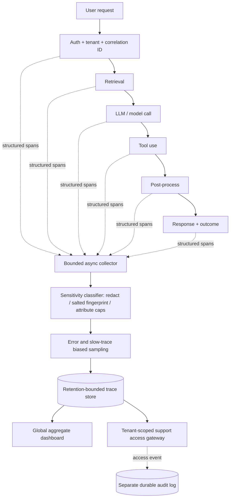

# G14 — Observability and Production Diagnosis: Main Interview Guide

**Diagnosis process** is: a user says “it’s slow and sometimes wrong.” You need the hop that hurt — without turning traces into a second copy of their tickets.

**G14 covers one slice:** one correlation id through the AI path, redacted spans, tenant-scoped debug. Not a new product feature.

End to end, as Acme’s German refund flow:

1. **Request gets a correlation id** at auth.
2. **Each hop records time and outcome** — retrieval, model, tool — not the raw prompt by default.
3. **A classifier redacts** before storage. “Retrieval 1.2s, 3 docs” yes; full SSN no.
4. **Support sees Acme only.** L1 cannot open Globex tickets to “help debug.”
5. **You see first token vs last sentence**, empty retrieval vs made-up answer vs tool 500.
6. **Errors and outliers stay; most happy traffic is sampled.**

That’s it: **trace the path → hide the secrets → find the hop.** Telemetry must not stall the user.

> **Full source:** [G14_Observability_And_Production_Diagnosis.md](/modules/15-fde-case-studies/delivery-evaluation-operations/observability-and-production-diagnosis#full-pack), especially §§1–9 for the anchor architecture and §§10–15 for incidents and variants. Use the [Deep Dive](/modules/15-fde-case-studies/delivery-evaluation-operations/observability-and-production-diagnosis#deep-dive) for diagnostic detail and the [Cheat Sheet](/modules/15-fde-case-studies/delivery-evaluation-operations/observability-and-production-diagnosis#cheat-sheet) for rehearsal.

## The anchor and its family

The anchor is a customer-facing AI application that is “slow and sometimes wrong.” The goal is to connect a complaint to a cause quickly **without making telemetry a second copy of customer data**. The same traces answer several related prompts.

| Related case | Shared foundation | What changes |
|---|---|---|
| #87 Latency spike | Correlated stage spans | Diagnose stacked retrieval, reranker, queue and provider delays. |
| #88 Cost spike | Versioned request and token metadata | Find prompt expansion, model-route change and unsafe cache-key regression. |
| #53 / #74 Latency questions | Per-hop timing | Separate application queueing from inference prefill and decode. |
| #54 Poor RAG quality | Retrieval and answer evidence | Separate retrieval, synthesis, prompt, output and user-experience faults. |
| Cost/latency pivots #44, #104–#121 | Tenant/workflow attribution | Apply measure → route → bound → cache safely. |

## Questions to ask the interviewer

| Question to ask | What it's really asking | What you then decide |
| --- | --- | --- |
| What is slow: first token, full response or a specific workflow percentile? | Is the user staring at a blank box, or waiting for the last sentence? | SLO and which spans to time. |
| What is wrong: empty retrieval, unsupported answer, tool failure or partial response? | Empty search, made-up answer, tool 500, or a truncated reply? | Outcome labels and quality checks. |
| Which tenants and workflows are affected? | Is only Acme’s German refund flow slow, or everyone? | Sampling and blast radius. |
| What content is forbidden in telemetry by default? | Can we store the full prompt, or only “retrieval 1.2s, 3 docs”? | No-capture list and redaction. |
| Who must diagnose incidents, and what may support see? | Can L1 support open another tenant’s raw tickets while debugging? | Tenant-scoped views and access roles. |
| What overhead, retention and sampling budget are acceptable? | Can we afford 100% traces for 90 days, or 5% for 14? | Collector and store size. |

## Requirements: Functional + Non-Functional

The easiest way to frame requirements in an interview is:

> **Functional = what the system does. Non-functional = how well it does it and what constraints it must satisfy.**

### Functional requirements — what the system must do

1. **Propagate one correlation ID** through auth, tenant, retrieval, model, tools, post-process, and queues.
2. **Collect structured per-hop timings and outcome tags.**
3. **Separate global health from tenant-scoped support views.**
4. **Let support find a request family without raw content.**
5. **Keep an access audit** independent of sampled debug traces.

### Non-functional requirements — how well / under what constraints

| Requirement | Example target / constraint |
|---|---|
| **Non-blocking** | Telemetry cannot stall the user request. |
| **Overhead** | Stay within an agreed budget. |
| **Privacy** | No full prompts, raw documents, secrets, or unbounded free-form labels by default; redact before storage. |
| **Isolation** | Tenant isolation; bounded retention. |
| **Audit** | Protected-action evidence has a stricter failure policy than ordinary traces. |
| **Volume (illustrative)** | 500 rps × ~6 spans ≈ 3,000 raw spans/s. Keep all errors/outliers (~2–5%) plus ~5% of normal traffic. ~200 B/redacted span × 30 days ⇒ hundreds of GB. Classifier/export capacity matters more than disk. |

### Interview shortcut

If asked **“What are the requirements?”**, say:

> **“Functionally, one ID through every hop, timings and outcomes, tenant-scoped debug. Non-functionally, don’t block the user, don’t store the prompt, and still find why it was slow or wrong.”**

## Architecture

The AI request path may use retrieval, an LLM and tools; the observability path describes those steps but cannot authorize, alter or stall them. A bounded asynchronous export separates the two. Nothing raw crosses the classifier boundary into the trace store.

### Step-by-step architecture

- Give each authorized request a correlation ID and tenant scope; propagate both across services, queues and integrations.
- Trace retrieval, model/LLM, tool and post-processing timings with structured version, error and outcome metadata while the request continues to the user.
- Export spans asynchronously through a bounded buffer. If export fails, serve the user and alert on the diagnostic gap.
- Classify and redact sensitive fields before storage; use a salted HMAC fingerprint where correlation is needed, and cap attribute cardinality.
- Preferentially keep error and slow traces, with exemplars and incident overrides so rare failures remain diagnosable.
- Store only bounded, retention-limited traces; send platform-wide aggregates to the global dashboard and enforce tenant/role access for support views.
- Write support access events to a separate, durable audit path so trace sampling cannot erase who viewed evidence.

## Diagnose from the complaint down

Start with the user outcome: p95/p99, first-token time, failure/partial rate and affected tenant. Then split request time into retrieval, rerank, model queue, provider, tools and delivery. For a wrong answer, compare retrieved evidence with the answer: empty/stale/off-topic evidence points upstream; good evidence contradicted by the answer points to synthesis or prompt; one-tenant failures point to config, permission or integration state. Track completion, abandonment and support contacts alongside technical quality.

**If sampling dropped the only bad trace:** compare complaints with trace coverage, temporarily raise fidelity for the affected slice, reconstruct from gateway/dependency evidence, mark the trace gap, then add error-class overrides and always-on exemplars. Do not claim the absence of a trace means no failure.

**Latency incident #87:** p95 reached 22.18s against a 7s target. Retrieval 4.2s, reranker 3.1s, gateway queue 2.8s and provider 9.36s stacked after a larger reranker and model-route change. Roll back the route, cap candidates, enable a light-reranker fallback and keep EU traffic near an EU endpoint; load-test peak queue depth before repeating the experiment.

**Cost incident #88:** requests rose only 7%, while input tokens rose 351%, cache hit rate fell from 67% to 4%, and a larger prompt crossed an expensive model-routing threshold. Roll back the template, restore compression and context caps, invalidate the flawed cache entries, and version cost gates. The cache key also lost `role_scope`, making this a permission incident as well as a budget incident.

## Failure policy, cost and rollout

Telemetry export may degrade; missing auth, cross-tenant support lookup, raw-content redaction failure and required audit evidence fail closed. Retriever/model outages can use bounded retries or safe reduced answers; repeated failures trip a circuit breaker. Queue overflow needs a restricted dead-letter path and alert. Limit blast radius by tenant, region, workflow and dependency.

Roll out in four phases: agree on user-facing SLOs; instrument one critical path; give support a trace-linked workflow; then add quality and cost signals with sampling. Gate wider release on adequate trace coverage and tolerable overhead. Measure mean time to diagnose, privacy invariant, trace coverage, telemetry overhead, latency, retrieval/tool success, quality-event rate and token cost by workflow.

## Two-minute interview answer

“I would first define what slow and wrong mean for this customer and write the no-capture list. Every request gets a correlation ID and structured spans through retrieval, model and tools, but full prompts and raw documents stay out of telemetry by default. Spans export asynchronously through redaction and bounded sampling into a retention-limited store. Global dashboards show aggregate health; authorized support gets tenant-scoped evidence, with a separate audit trail. I diagnose from the complaint down: user outcome, then the slow or failing span, then retrieval evidence versus final answer. I retain error and slow traces preferentially so the rare incident is still visible, and I prove the instrumentation itself does not hurt latency or privacy before expanding.”
