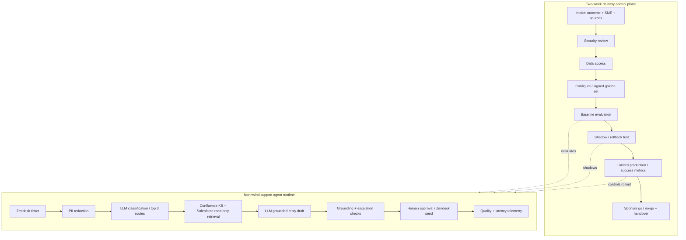

# G12 — Scoping to Deployed Agent: Main Interview Guide

**Delivery process** is: customer wants an agent, you ship something real in two weeks, with a named person who can say stop.

**G12 covers one slice:** intake → gates → a small live agent → rollback. Not “we’ll figure production out later.” The source uses a Northwind support-triage demo.

End to end, as Northwind tickets:

1. **Intake:** success is “first response under five minutes,” not “launch an agent.” SME and sources named now.
2. **Security and data access** — Zendesk + Confluence + Salesforce read. If that’s a six-week ticket, two weeks is a lie.
3. **Configure, golden set, baseline eval.**
4. **Shadow, then a tested rollback** (kill send in two minutes).
5. **Limited production.** Humans still send. Autonomy is earned.
6. **Sponsor go/no-go and handover.** A failed gate does not become a quiet exception.

That’s it: **name the outcome → prove each gate → ship small → own rollback.** Open-ended custom planners wait.

> **Source:** [G12_Scoping_To_Deployed_Agent.md](/modules/15-fde-case-studies/delivery-evaluation-operations/scoping-to-deployed-agent#full-pack). The [Deep Dive](/modules/15-fde-case-studies/delivery-evaluation-operations/scoping-to-deployed-agent#deep-dive) covers gate mechanics and limitations; the [Cheat Sheet](/modules/15-fde-case-studies/delivery-evaluation-operations/scoping-to-deployed-agent#cheat-sheet) is for rehearsal.

## The case in one sentence

Turn a customer request into a governed, two-week agent deployment with measurable value, named approvers, evidence-backed gates, a working rollback and a clear owner. The source demonstrates this with a Northwind support-triage agent; its day-14 numbers are scripted demo results, not live production evidence.

## Questions to ask the interviewer

| Question to ask                                                       | What it's really asking                                                               | What you then decide                     |
| --------------------------------------------------------------------- | ------------------------------------------------------------------------------------- | ---------------------------------------- |
| What customer outcome and baseline define success by week four?       | Are we cutting first-response time from 40 minutes to 5, or just “launch an agent”? | Whether the build has a measurable goal. |
| Who is the sponsor, subject-matter expert and go/no-go owner?         | If the Confluence owner is on vacation, who can still say ship or stop?               | Approvals and escalation.                |
| Which data sources, credentials and policies are available now?       | Do we already have Zendesk + Salesforce read access, or is that a six-week ticket?    | Whether two weeks is even possible.      |
| Which accelerator parts can be reused, and what is bespoke?           | Can we reuse the support template, or are we writing a custom planner?                | Delivery time and later maintenance.     |
| What happens when a gate fails or an SME misses a deadline?           | If golden-set review slips two days, do we ship anyway?                               | No-go, escalation, and schedule impact.  |
| Which agent actions require human review, and how is rollback tested? | If drafts go weird, can we kill send in two minutes?                                  | Production autonomy and containment.     |

Do not start the engagement clock without measurable success metrics, a named SME and named sources. The source uses those as intake requirements.

## Requirements: Functional + Non-Functional

The easiest way to frame requirements in an interview is:

> **Functional = what the system does. Non-functional = how well it does it and what constraints it must satisfy.**

### Functional requirements — what the system must do

**Delivery**

1. **Intake and scope** — measurable outcome, named SME, named sources.
2. **Evidence-backed security and data access.**
3. **Configure the agent and sign a golden set.**
4. **Baseline evaluation, shadow, tested rollback.**
5. **Limited production, sponsor go/no-go, handover** — runbook, dashboard, owner.
6. **Advance only after each gate** — authorized role and evidence recorded.

**Northwind agent (demo)**

1. **Triage the top three Zendesk categories.**
2. **Use Confluence plus Salesforce read-only context.**
3. **Redact sensitive data; draft grounded replies; apply escalation rules.**
4. **Keep people in control of sending** while autonomy is earned.

### Non-functional requirements — how well / under what constraints

| Requirement           | Example target / constraint                                                                        |
| --------------------- | -------------------------------------------------------------------------------------------------- |
| **Schedule**    | Two-week delivery target.                                                                          |
| **Governance**  | Auditability, separation of duties; failed gate stops advancement.                                 |
| **Reuse**       | Accelerators over bespoke planners.                                                                |
| **Security**    | Tenant isolation, secure credentials.                                                              |
| **Reliability** | Reliable escalations; demo rollback under two minutes.                                             |
| **Value**       | Measurable first value. Northwind demo: first response <5 min; ≥60% zero-edit sends by week four. |

### Interview shortcut

If asked **“What are the requirements?”**, say:

> **“Functionally, gated two-week delivery plus a small triage agent that drafts, not sends. Non-functionally, two weeks, tested rollback, and a number for first-response time — not ‘launch an agent.’”**

## Architecture: delivery gates and the deployed agent

The delivery state machine is deterministic; an LLM does not approve its own release. Within the delivered support agent, model calls can classify and draft replies. The latter architecture is a source-grounded design sketch, not a claim that every runtime component was implemented in the source demo.

### Step-by-step architecture

1. Intake records target outcome, baseline, sponsor, SME and data sources; incomplete intake does not start the delivery clock.
2. Security and data-access reviewers sign their own gates with evidence before the agent touches customer data.
3. The team pulls reusable connectors, prompts, evals and dashboards, then builds only the customer-specific escalation policy; the SME signs the golden set.
4. A baseline evaluation tests quality and safety. Shadow mode compares agent behavior without granting unrestricted sending, and the team proves rollback.
5. Limited production measures agreed success metrics. The sponsor makes the day-14 go/no-go decision; the team hands over a runbook, dashboard, owner and credentials plan.
6. At runtime, a Zendesk ticket is redacted, classified by a model, enriched with scoped KB/CRM context, drafted by an LLM, checked for grounding and escalation, and sent only under the chosen human approval policy.

## Gates, evidence and ownership

| Stage                           | Source gate                | Signer                                          |
| ------------------------------- | -------------------------- | ----------------------------------------------- |
| Scoping, days 1–2              | `security_review_passed` | Security reviewer                               |
| Data readiness, days 3–4       | `data_access_granted`    | Customer SME; pending access escalates on day 3 |
| Configure, days 5–7            | `golden_set_signed_off`  | Customer SME                                    |
| Evaluate, days 8–9             | `eval_baseline_met`      | FDE                                             |
| Shadow, days 10–11             | `rollback_tested`        | FDE                                             |
| Limited production, days 12–13 | `success_metrics_met`    | Sponsor                                         |
| Day 14                          | Go/no-go and handover      | Named decision owner                            |

The gate API should reject wrong roles, missing evidence and skipped prior stages; deny decisions override optimistic state and every attempt is logged. Free-text evidence is weak: require structured checklist items and links to evaluation or rollback proof. A no-go is a valid outcome.

## Trade-offs, cost and honest limits

Northwind reuses five of six accelerator components (about 83%); the bespoke part is escalation policy. The demonstration reports 4m12s first response, 63% zero-edit sends, .83 evaluation score against .75 baseline, and rollback under two minutes. Week-four retention was not observed; `None` does not mean zero. The source's deterministic gate demo has 17 tests but does not implement full agent provisioning, eval-harness wiring, scope-change approval, versioned rollback or multi-engagement operations. State those gaps plainly in the interview.

For cost, agree on cost per resolved ticket at intake; bound model steps and tokens, reuse common connectors, and sample evaluation proportionally to risk. Keep customer credentials in a vault with scoped access and revoke or transfer them at handover. Record tenant boundaries and override rate. A low-cost pilot that fails its outcome metric is not success.

## Evaluation and rollout

Golden tickets must cover the top categories, retrieval misses, PII, policy escalations and cases where a draft should not be sent. Measure response time, zero-edit sends, groundedness, escalation correctness, human overrides, rollback time, cost per resolved ticket and week-four retention when it actually exists. Shadow before limited production; refuse broad rollout until sponsor-approved metrics and rollback evidence hold.

## Two-minute interview answer

“I start with a measurable business result, a named SME and real data sources; without those, the two-week clock is fiction. I run seven gated stages from scoping and security through data access, configuration, evaluation, shadow, limited production and sponsor go/no-go. Each gate needs evidence from the right owner and cannot be skipped. For the support-triage agent, a ticket is redacted, classified, enriched from read-only knowledge and CRM, drafted by an LLM, checked for grounding and escalation, then human-approved as needed. I reuse standard components, measure first response and zero-edit sends, prove rollback, and hand over ownership. If a gate fails, I stop or escalate rather than calling an unverified demo deployed.”
