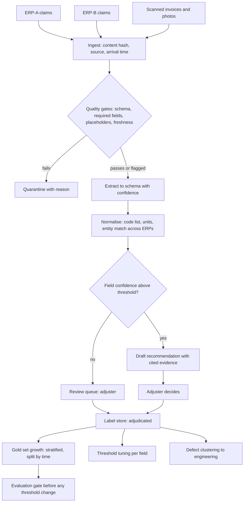

# Build an AI System When the Customer's Data Is Poor

*The customer wants value this quarter, and the data can only prove what it actually contains.*

◷ 26 min

Poor data is not a reason to refuse the work. It is a reason to change what gets built first. The page answers case #62 from the OpenAI Applied problem-decomposition bank. It follows the scoping discipline of [G12](/modules/15-fde-case-studies/delivery-evaluation-operations/scoping-to-deployed-agent#full-pack) and the gating discipline of [G13](/modules/15-fde-case-studies/delivery-evaluation-operations/evaluation-and-release-gating#full-pack) without repeating them.

| Case | What the page adds |
|---|---|
| #62 Build an AI System When the Customer's Data Is Poor (Question 18) | Sections 1 to 15: diagnosis, readiness scoring, the build-anyway decision, a worked warranty-claims design, evaluation with poor labels, the customer conversation, a phased plan, the script and the cost card |

The source gives this case one prompt, eleven talking points and one closing line. It has no "likely follow-up" block, unlike most questions in the bank. Everything past those lines is assembled from other repo material or marked *(own construction)*. The worked example in sections 6 to 10 is entirely own construction, and every number in it is an assumption.

---

## 1. Refuse to Start With the Model

The prompt, verbatim from the question bank:

> "The customer wants an AI solution, but its data is incomplete, inconsistent, and poorly documented."

The source lists what a strong answer discusses: data-quality profiling, ownership, missingness, duplicates, and schema inconsistencies. It adds label quality, freshness and data contracts. It ends with human-in-the-loop correction, narrowing the initial use case, and whether AI is actually the right solution.

It also gives the conclusion to land on:

> "I would not begin with model selection. I would first determine whether the available data can support a measurable workflow improvement."

Say that sentence early. A model cannot be more reliable than the evidence it is given. A better model mostly produces more fluent answers from the same broken records. The interviewer is testing whether that instinct arrives before the architecture does.

The bank's list of mistakes to avoid applies with extra force here. "Starting with 'I would use RAG and agents'" is mistake one. "Discussing model accuracy without defining evaluation" is mistake five. Poor data makes both worse, because the labels that would define accuracy are themselves suspect.

## 2. Ask the Questions That Decide Whether Data Matters

Not every data problem blocks every use case. The clarifying questions find out which defects touch the decision the customer actually wants improved.

| QUESTION | WHAT CHANGES WITH THE ANSWER |
|---|---|
| Which decision or task should improve, and who makes it today? | Which fields matter; the rest of the data can stay poor |
| What does "poor" mean to the person saying it? Missing, wrong, or unfindable? | Whether the fix is collection, correction, or integration |
| Who owns each source, and who can fix it upstream? | Whether defects get repaired at source or patched downstream forever |
| Is there any trusted outcome record: approvals, refunds, audits? | Whether historical labels exist at all, and how far to trust them |
| How is the task done today without AI, and how long does it take? | The human baseline, which is the bar the system must beat |
| Which errors are tolerable, and which need a human? | Where confidence thresholds and review queues sit |
| What data may leave which boundary? | Whether scanned documents can go to a hosted model |
| Is a rules or reporting fix enough? | Whether AI is the right solution at all |

The last question is on the source's list for a reason. Some "AI projects" are a missing dropdown on an entry form. Fixing the form beats building a model to guess what the dropdown would have said. Saying so is a signal of judgement, not a failure to sell.

The bank's reusable opening fits this case well. Clarify the outcome, user, workflow, constraints and success measure, then state assumptions. The difference here is one extra promise: "and I will measure the data before I trust it."

## 3. Split "Poor" Into Failure Types You Can Measure

"The data is bad" is not actionable. Eight distinct failure types hide inside it, and each has a different week-one measurement and a different remedy *(own construction, built on the source's talking points)*.

| FAILURE TYPE | SYMPTOM | MEASURE IN WEEK 1 | WHAT IT BLOCKS | REMEDY |
|---|---|---|---|---|
| Missing | Empty or placeholder fields ("N/A", "OTHER", 0) | Null and placeholder rate per field, per source | Any feature or answer that needs the field | Extract from free text or attachments; make the field required at entry |
| Wrong | Values present but false | Error rate on a 100-record sample checked by an SME | Trusting any single field without corroboration | Cross-check against a second source; flag, do not silently fix |
| Inconsistent labels | Same case, different label across teams or years | Agreement between two SMEs relabelling the same sample | Supervised training; historical labels as ground truth | Adjudicated relabel of a stratified sample; a written label guide |
| Stale | Correct once, not now | Age of last update against how fast the fact changes | Any answer about current state | Freshness per source; a staleness flag shown to users |
| Siloed or unjoinable | No shared key across systems | Join success rate on a sample | Any view spanning two systems | Entity resolution with a reviewed match table |
| Unstructured or scanned | The fact is in a PDF, photo or email | Share of records whose key fact is only in an attachment | Rules and reports; cheap retrieval | Extraction to a schema, with confidence and review |
| Biased or unrepresentative | History covers some segments, not others | Record counts by segment and period against current traffic | Any claim of accuracy outside the covered segments | Stratified sampling; explicit out-of-scope segments |
| Access-restricted | Data exists, but the project cannot use it | Sources with access granted versus requested | Everything downstream of that source | Escalate by day 3; design around the gap |

Two rows deserve emphasis, because they fool teams most often.

**Inconsistent labels are worse than missing labels.** A missing label is visibly missing. An inconsistent one looks like ground truth, gets trained on, and then scores the model's copied errors as correct. The Cracking book's routing case is the canonical example. A fine-tune reported 94% accuracy against an 81% prompted baseline, then reached only ~78% in production. One of three compounding causes was that labels came from a previous version of the same system's routing decisions. The model learned the old system's errors, and evaluation marked them right. After deduplication, a split by time and a human-adjudicated relabel, the honest number came out near 83%. Production matched it within two points.

**Access restrictions are a data-quality problem in disguise.** The delivery framework in G12 treats data access as its own risk, with a mechanism attached: "Start day 1, escalate day 3". Data nobody can read has quality zero, whatever it contains.

## 4. Score Readiness in One Week

A readiness assessment turns "poor" into a number the customer can argue with. It also produces the decision memo that justifies what gets built. One week is enough if the scope is one decision, not the whole estate *(own construction)*.

| Day | Activity | Output |
|---|---|---|
| 1 | Confirm access; inventory sources, owners and refresh schedules | Source map with an owner per source |
| 2 | Profile every field the decision needs: nulls, placeholders, distinct values, duplicates, schema drift | Profile report per source |
| 3 | Pull a stratified sample of about 200 records; two SMEs label 100 independently | Measured label agreement |
| 4 | Test joins across systems; check freshness; count records by segment and period | Join rate, staleness, coverage by segment |
| 5 | Score the card; write the decision memo | Build, narrow, or not yet |

Day 3 is the most important day. Relabelling by two SMEs measures label consistency directly, instead of asking someone whether the labels are good. Use Cohen's kappa rather than raw agreement: agreement corrected for what two random labellers would achieve by chance. The Cracking book explains why. Raw agreement overstates quality when one label dominates, because always guessing the majority class looks accurate. Its floor for a judge is κ ≥ 0.60, and the same floor works for a pair of humans.

The scorecard scores only the dimensions the target decision depends on *(own construction)*:

| DIMENSION | GREEN | AMBER | RED |
|---|---|---|---|
| Coverage of required fields | ≥ 90% populated | 60–90% | < 60% |
| Correctness on SME spot check | ≤ 5% wrong | 5–15% | > 15% |
| Label agreement (κ) | ≥ 0.75 | 0.60–0.75 | < 0.60 |
| Freshness versus rate of change | Within tolerance | Lagging, flaggable | Unknown or unbounded |
| Join rate across needed sources | ≥ 95% | 80–95% | < 80% |
| Access to needed sources | All live and verified | Requested, in progress | Refused or no owner |
| Segment coverage versus current traffic | All in-scope segments present | Gaps named and excludable | Main segment missing |
| Ownership and documentation | Named owner, known meaning | Owner known, meaning inferred | Nobody can say what a field means |

The thresholds are assumptions to adjust per domain. The decision rule is not. A red on a dimension the chosen design depends on means redesign or wait. A red on a dimension the design can route around means narrow the scope and say so in writing.

The delivery framework in G12 already has the slot for this week. It allocates days 3–4 to data readiness, and its gate is `data_access_granted`, signed by the customer SME. The scorecard is what raises the evidence bar behind that signature. Access being live is necessary. Access to data that scores red is not readiness.

## 5. Decide What to Build Anyway, or Say Not Yet

Poor data rules out some designs and barely affects others. The move is to pick a design whose weakest input is one the data can supply *(own construction)*.

| DESIGN THAT TOLERATES POOR DATA | WHY IT TOLERATES IT | WHAT IT STILL NEEDS |
|---|---|---|
| Retrieval over a curated subset | Uses only documents someone vouched for; ignores the rest | An owner who curates, and a freshness flag |
| LLM-assisted extraction and normalisation, with review | Turns scanned or free-text records into structured fields; review catches errors | A schema, confidence scores, reviewer time |
| Rules plus an LLM | Rules handle the clean, high-volume cases; the model handles the messy tail | Rules owned by the business, not the model |
| Human-in-the-loop labelling loop | Every reviewed item becomes a trusted label | Reviewers whose corrections are captured, not typed around |
| Weak supervision | Several cheap, noisy labelling rules vote; the votes become a training signal | A small trusted set to measure the rules against |
| Synthetic data | Covers rare cases the history lacks | Real data to validate against; never the only evaluation |

Weak supervision needs a gloss. Instead of hand-labelling every record, write several cheap labelling rules: a keyword match, a lookup table, a model's guess. Each rule is individually unreliable. Their combined votes, weighted by how often each agrees with a small trusted sample, give a usable label at scale.

Synthetic data carries the sharpest caveat. The RAG study guide's advice on eval sets applies directly: "a small, real eval beats a synthetic one for customer-specific evaluation." Synthetic examples fill gaps in coverage. They cannot tell anyone how the system performs on this customer's records.

Say "not yet" when three things line up. The target decision depends on a field that scores red. No design can route around it. And no human process exists that could generate the missing truth. The honest answer then is a data project with a date, not an AI project with a hope. The delivery framework's intake rule says the same thing about metrics: "Refuse to start. A two-week clock against an unmeasurable goal is worse than no clock."

## 6. State Requirements as Testable Constraints

A worked example makes the method concrete. The scenario is invented for this page, and every number in sections 6 to 10 is an assumption *(own construction)*.

**The customer.** A manufacturer of industrial pumps processes about 12,000 warranty claims a month. Adjusters decide approve, reject, or request more information, and route suspected design defects to engineering. Each claim takes an adjuster about 11 minutes. The customer wants AI to cut that time and catch defect patterns earlier.

**The data, as found in week 1.**

| Source | Defect found |
|---|---|
| Two ERP systems, merged after an acquisition | Different failure-code lists; no shared claim key; 14% of claims appear in both |
| Failure code field | 38% of claims coded "OTHER" |
| Serial number field | Missing on 27% of claims |
| Attachments | 55% of invoices and photos are scanned, with the key facts only there |
| Decisions | Outcome recorded; the reason for the outcome is not |
| Relabel of 100 claims by two adjusters | κ = 0.52 on failure code; κ = 0.81 on approve or reject |

That last row decides the design. Adjusters agree on outcomes, so outcomes are a usable label. They disagree on failure codes, so failure codes are not ground truth. Any design that trains on historical failure codes would learn the disagreement.

**Functional requirements.**

| ID | Requirement | Test |
|---|---|---|
| FR1 | Extract serial number, part, failure description and invoice amount from each claim and its attachments | Field-level precision and recall on the adjudicated set |
| FR2 | Normalise failure descriptions to one agreed code list, with a confidence | Agreement with adjudicated codes, reported with κ |
| FR3 | Link duplicate claims across the two ERPs | Match precision on a reviewed pair set |
| FR4 | Draft a recommendation with the evidence behind it | Adjuster agreement rate; every draft cites the fields it used |
| FR5 | Route low-confidence fields and all rejections to an adjuster | No claim auto-decided in phase 1 |
| FR6 | Capture every adjuster correction as a label | Corrections appear in the label store within one day |

**Non-functional requirements.**

| NFR | Threshold | Why |
|---|---|---|
| Latency | Draft ready within 5 minutes of claim arrival | Adjusters work a queue, not a chat |
| Throughput | 12,000 claims a month, peaks of 1,500 a day | Month-end surges |
| Data boundary | Scanned documents stay in the customer's cloud region | Invoices carry customer names and prices |
| Auditability | Every draft stores inputs, model version, confidence and reviewer action | Warranty decisions get disputed |
| Quality floor | No field shown as fact below its confidence threshold | A confident wrong serial number is worse than a blank |

**Success metrics.** Adjuster minutes per claim fall from 11 to 6. Share of "OTHER" codes on new claims falls from 38% to under 10%. Defect clusters surface in engineering's queue within two weeks of the first claim, against a current lag of about a quarter.

## 7. Draw the Architecture End to End

The architecture is a data-repair pipeline with a small decision layer on top. Draw it that way round. Most of the value in phase 1 comes from the lower half.

```
  ERP-A ──┐                                        ┌──> quarantine + reason (dead letter)
  ERP-B ──┼──> INGEST ──> VALIDATE / QUALITY GATES ─┤
  scans ──┘    (hash,      (schema, required fields,└──> clean + flagged records
               source,      placeholder detection,              │
               arrival)     freshness)                          v
                                                  EXTRACT (scans, free text -> schema, confidence)
                                                                │
                                                                v
                                                  NORMALISE (code list, units, entity match)
                                                                │
                                                                v
                                         confidence >= threshold ?
                                          │ yes                  │ no
                                          v                      v
                                   DRAFT RECOMMENDATION     REVIEW QUEUE (adjuster)
                                   (fields + evidence)            │
                                          │                       │ correction
                                          v                       v
                                   ADJUSTER DECIDES ──────> LABEL STORE (adjudicated)
                                                                   │
                                          ┌────────────────────────┼─────────────────┐
                                          v                        v                 v
                                   GOLD SET GROWTH         THRESHOLD TUNING     DEFECT CLUSTERS
                                   (stratified, by time)   (per field)          -> engineering
```



Read the components in dependency order *(own construction)*:

| Component | Job | What goes wrong without it |
|---|---|---|
| Ingest with content hash | Records source and arrival; skips unchanged records | Re-extraction cost on every sync; duplicates look new |
| Quality gates | Reject or flag records that fail schema, required fields or placeholder checks | "OTHER" and "N/A" flow downstream as real values |
| Quarantine with reason | Keeps rejected records queryable, with why | Bad records vanish; nobody fixes the source |
| Extraction | Pulls fields from scans and free text into a schema, with per-field confidence | Half the facts stay locked in attachments |
| Normalisation | Maps descriptions to one code list; matches claims across ERPs | Two code lists and 14% duplicates survive the merge |
| Confidence router | Sends only uncertain fields to people | Reviewers check everything, or nothing |
| Draft with evidence | Recommendation that cites the fields it used | An adjuster cannot tell why the draft says reject |
| Review queue | Adjusters fix fields in the tool, not around it | Corrections happen in email and are lost |
| Label store | Every adjudicated field and decision, with reviewer and time | The system never gets better data than it started with |
| Gold set growth | Stratified, time-split sample of the label store | The eval set drifts toward whatever was easy |
| Threshold tuning | Per-field confidence thresholds set from measured precision | One global threshold, wrong for every field |
| Defect clustering | Groups normalised failures by part and period | The early-warning value never reaches engineering |
| Evaluation gate | Blocks threshold or prompt changes that regress on the gold set | A tuning change quietly lowers precision |
| Data contract with source owners | Agreed required fields and code list at entry | The same defects arrive again next month |

## 8. Put Quality Gates at Ingestion, Not After the Model

A defect caught at ingestion costs one rejected record. The same defect caught after the model costs a wrong recommendation, a reviewer's time, and some trust. So the gates sit before extraction, not in the output guardrail.

The repo's enterprise RAG ingestion pipeline states the rule in one line: "An unmappable document is quarantined, not defaulted to `internal`." Defaulting is how a latent defect gets indexed. The same rule applies to a warranty claim. A claim with a placeholder serial number is flagged as missing, never assigned a guessed value. The pipeline also records per-source `last_synced_at` and every rejected document with its reason. It keeps those queryable after the process exits, not just printed. That is the quarantine box in section 7.

Content hashing belongs here too. The same pipeline hashes each document's text and skips re-embedding anything unchanged. In the claims design, that hash stops re-extraction of scanned invoices that have not changed. Extraction is the most expensive step, so this matters for cost as well as correctness.

Repairing at the pipeline treats the symptom. Repairing at source treats the cause. The FDE cross-team case resolved exactly this conflict with data contracts. Software teams wanted speed, while data and AI teams needed stable, high-quality data. "Data contracts turned an ownership argument into an interface agreement." In this design, the contract makes serial number required at entry and fixes one failure-code list across both ERPs. The pipeline's quarantine report becomes the evidence that the contract is needed.

## 9. Grow Labels From the Review Queue

Poor labels are a starting condition, not a permanent one. The review queue is the machine that turns adjuster time into trusted labels. Design it that way from day one *(own construction)*.

Three rules make corrections usable as labels. First, the correction happens in the tool, on the field, with the original value kept. A reviewer who fixes a claim in the ERP directly leaves no trace the system can learn from. Second, each correction records who made it and when. Labels from a reviewer with low agreement can then be weighted down. Third, disagreements go to adjudication, not to whoever clicked last.

The Cracking book's dataset hygiene applies unchanged. Deduplicate first, because "100,000 raw traces might be a few thousand distinct problems". Split held-out cases by time and user, never at random. Route low-agreement, high-impact cases to human adjudication. It also names the trap in automatic labels. An automatic outcome label such as "user didn't complain" is not the same as "correct." For claims, "approved and not disputed" is a weak label, not a gold one.

Weak supervision earns its place on the failure-code field, where κ was 0.52. Three cheap rules vote: a keyword map from description to code, the part's historical most-common failure, and the extraction model's own guess. Each vote is scored against the adjudicated sample. Where the rules agree with high confidence, the label is used for training. Where they disagree, the claim goes to the review queue. The disagreement itself is the signal that tells the system where people are needed.

Synthetic claims fill one gap only: rare failure modes the history lacks, such as a new pump model with no claims yet. They are tagged as synthetic in the label store and excluded from any headline metric.

## 10. Build the Eval Set Before the Labels Are Clean

An evaluation set cannot wait for clean labels, because clean labels are what the project produces. Build a small, trusted set first and grow it from the label store.

The source material gives three ways to seed it. The RAG study guide suggests mining support tickets or an existing FAQ for real questions with known answers. Its alternative is to "ask 3-4 of their power users for 10 questions each". The question bank's evaluation case lists sampling production traffic, expert labelling, weak supervision and synthetic examples used carefully. It adds measuring grader agreement and human review of difficult cases. For claims, the seed is the 100 claims already relabelled in week 1, adjudicated where the two adjusters disagreed.

Size the set honestly. The Cracking book's arithmetic is `n ≈ 15.7 × p(1−p) / δ²` per arm, to detect a difference δ near a success rate p. At p = 0.8, a 5-point gain needs ~1,000 cases per arm. A 200-case suite cannot reliably detect anything smaller than ~12 points. A 100-claim seed set therefore gates only large changes. Say so, and detect smaller changes through paired evaluation on the same cases, or through production metrics.

Stratify the set and report per stratum. The book's list is intent, tenant size, data recency and difficulty. For claims it becomes ERP source, product line, attachment type and period. Aggregate accuracy hides a collapse on scanned claims from the acquired ERP, which is exactly where the data is worst.

Include the "insufficient data" case at a realistic rate. A system never shown a claim that should be returned for more information learns to always decide. The book makes the same point about refusal and escalation cases.

Watch the labels in the eval set as closely as the system under test. The enterprise RAG golden set's first war story is a label defect, not a system defect. A document was reported as leaked to an account manager who was permitted to read it. It was simply irrelevant. The fix split the label into two fields, one that gates and one that is only tracked, plus a test that stops the labels drifting again. Its lesson travels: *a false alarm from a bad label costs as much trust as a real failure.*

Ship the set with a datasheet: collection window, filters, dedup method, split strategy, label source and known biases. The Cracking book's estimate is that an hour of documentation saves weeks of debugging six months later.

## 11. Tell the Customer Their Data Is Poor

The hardest part of this case is a conversation, not a component. Nobody enjoys hearing that their data is poor, and the person told is often the person responsible for it *(own construction)*.

Lead with measurements, not adjectives. "Your data is messy" invites a defence. "38% of claims are coded OTHER, and two of your adjusters agree on the code about half the time beyond chance" invites a plan. The scorecard exists partly to make this conversation factual.

Frame phase 0 as value, not as delay. The readiness week already produces things the customer can use. It shows where the claim backlog is duplicated across the two ERPs. It gives a measured estimate of how much adjuster time goes to hunting for facts in scans. And it produces an agreed code list the business needed anyway. A data contract that stops "OTHER" at entry improves every report the customer runs, with or without AI.

Offer a narrow first win alongside the repair. Extraction of serial numbers and invoice amounts from scans is useful on day one and needs no historical labels. It shortens every claim while the failure-code work matures. The customer then sees progress on the same dashboard where the data problems are tracked.

Name what will not be promised. In the worked example, the first release makes no automatic decisions and gives no defect prediction on product lines with under two quarters of history. Written non-goals protect the relationship when the pressure to overpromise arrives.

## 12. Phase the Work So Data Fixes Ship as Value

The phases follow the readiness scores, not a generic timeline. Each phase exits on a measured condition, in the spirit of G12's gates *(own construction)*.

| Phase | Weeks | Ships | Exit condition |
|---|---|---|---|
| 0 Readiness | 1 | Scorecard, decision memo, quarantine report, draft data contract | Customer signs the scope and the non-goals |
| 1 Extract | 2–5 | Field extraction from scans with confidence; review queue; label store | Field precision ≥ 95% above threshold on the seed set |
| 2 Normalise | 6–9 | Unified code list, cross-ERP matching, weak-supervision labels | κ between the system and adjudicated codes ≥ 0.70 |
| 3 Draft | 10–13 | Recommendation drafts with evidence, in shadow mode | Adjuster agreement ≥ 85%; minutes per claim measurably down |
| 4 Assist | 14+ | Drafts shown live; defect clusters to engineering | The success metrics from section 6 are trending to target |

Shadow mode in phase 3 has the same meaning as in the delivery framework. The system runs against real traffic, decides what it would do, and takes no action, while humans compare. Its first real action is never also the first time nobody is watching.

The data contract runs in parallel with every phase. Its effect shows up as a falling quarantine rate and a falling "OTHER" rate on new claims. Both are tracked on the same dashboard as model quality.

## 13. Name the Failure Modes Before the Interviewer Does

Most failures in this case come from trusting data or labels more than the week-1 numbers justify *(own construction, except where attributed)*.

| FAILURE | HOW IT SHOWS UP | DEFENCE IN THE DESIGN |
|---|---|---|
| Training on inconsistent historical labels | High offline accuracy, lower production accuracy | Adjudicated relabel; the 94% → ~78% routing case as the warning |
| Random train and test split on repeated records | Offline numbers inflated by near-twins | Deduplicate; split by time and user |
| Defaulting a missing value | A guessed serial number presented as fact | Quarantine or flag; never default |
| Review done outside the tool | Corrections lost; labels never improve | Corrections only through the review queue |
| Automation bias in reviewers | Adjusters accept drafts they should question | Track agreement on seeded known-wrong drafts |
| Segment collapse | Good average, bad on scanned claims from one ERP | Per-stratum reporting in the gate |
| Schema drift at source | A new form version breaks extraction silently | Quality gates on schema; quarantine spikes alert |
| Synthetic data inflating metrics | Headline accuracy rises with no production change | Synthetic cases tagged and excluded from headline metrics |
| Upstream never fixed | The pipeline patches the same defects forever | Data contract with a named owner and a quarantine report |
| Scope creep into auto-decisions | Pressure to approve claims without review | Written non-goal; approval only after the phase 3 gate |

## 14. Deliver It in Forty-Five Minutes

The round rewards spending the first third on diagnosis. A candidate who draws the pipeline at minute three has skipped the part being tested *(own construction)*.

| Minutes | Move |
|---|---|
| 0–3 | Restate; say the source's closing line about not starting with model selection |
| 3–10 | Clarifying questions from section 2; pick the decision to improve |
| 10–17 | Split "poor" into failure types; describe the readiness week and the scorecard |
| 17–22 | Decide what to build anyway; name the "not yet" condition |
| 22–32 | Draw the pipeline: quality gates, extraction, normalisation, review queue, label store |
| 32–38 | Evaluation with poor labels: seed set, κ, sample size, strata, time split |
| 38–42 | The customer conversation and the phased plan |
| 42–45 | Failure modes; what would change the plan |

**The two-minute spoken answer.**

> "I wouldn't start with a model. I'd first find out whether the data can support a measurable improvement in one specific decision. So I'd pick that decision with the customer and spend a week measuring the data it depends on. That means null and placeholder rates, a join test across systems, freshness, and — most important — two experts relabelling the same hundred records so I know whether the historical labels are ground truth or noise. That gives me a scorecard. If the field the decision depends on is red and nothing can route around it, the honest answer is a data project first. Usually something can: extraction from documents doesn't need historical labels, and a review queue turns every correction into a trusted label. So phase one ships extraction with confidence scores and human review. Quality gates at ingestion quarantine bad records rather than defaulting them, and a data contract fixes the worst defects at source. Evaluation starts from a small adjudicated set, reported per segment and split by time. I'd say out loud that a set that small only catches large regressions. Every phase exits on a measured condition, and the system doesn't decide anything on its own until it has matched the experts in shadow mode."

**Likely follow-ups.** The source gives none for this question, so these are *(own construction)*, each with a one-line answer.

- *"The customer says there's no time for a readiness week."* Then scope it to two days on one decision; skipping it means discovering the same facts in production, more expensively.
- *"What if the experts themselves disagree?"* Their disagreement is a finding. Write a label guide, adjudicate, and measure κ again. A task humans cannot agree on cannot have an accuracy target.
- *"Can't a large model just handle messy data?"* It can read messy text well. It cannot recover a fact that is missing or wrong. And it cannot be evaluated against labels nobody trusts.
- *"How do you know the data is getting better?"* Quarantine rate, placeholder rate on new records and κ against adjudicated labels, tracked on the same dashboard as model quality.

## 15. Answer the Cost Pivot in Ten Minutes

The pivot is "what does all this review and relabelling cost, and how do you stop it growing?" There is no playbook drill for this case, so the card is a self-drill *(own construction)*.

| | |
|---|---|
| Dominant driver | Human time: SME relabelling and adjuster review; then extraction calls on scanned pages |
| Cheapest lever first | Route only low-confidence fields to review; hash content so unchanged scans are never re-extracted; label a stratified sample, not the backlog |
| Metric that proves it | Cost per correctly processed claim, including reviewer minutes; review rate per field; re-extraction rate |
| Do not | Label the entire history before shipping anything, or send every page to the largest model |
| 60-second line | The expensive resource here is expert time, not tokens. Spend it only where confidence is low, turn every minute of it into a reusable label, and never pay twice to extract the same page. |

The four verbs from the cost playbook apply in order. Measure cost per correctly processed claim, including reviewer minutes. Route easy fields to a cheap extractor and uncertain ones to people. Bound the review queue with per-field thresholds tuned from measured precision. Cache safely by content hash, so a re-sync never re-extracts an unchanged scan.

Review cost falls on its own as labels accumulate. Thresholds can then be set from measured precision rather than caution. That is the economic argument for building the label store in phase 1 rather than later.

---

## Key Takeaways

- Start by testing whether the data can support a measurable improvement, not by picking a model.
- Clarifying questions find which data defects touch the decision being improved.
- "Poor" splits into eight failure types, each with its own week-one measurement and remedy; inconsistent labels are the most dangerous.
- A one-week readiness assessment produces a scorecard and a build, narrow or not-yet decision.
- Some designs tolerate poor data; say "not yet" only when a red field blocks every route.
- The worked warranty example turns measured defects into testable requirements.
- The architecture is a data-repair pipeline with a small decision layer on top.
- Quality gates at ingestion quarantine bad records instead of defaulting them, and data contracts fix defects at source.
- The review queue is a label factory, with deduplication, time splits and adjudication.
- The eval set starts small and trusted, is sized honestly, and is reported per stratum.
- Tell the customer with measurements, and frame phase 0 as value.
- Phases exit on measured conditions, with shadow mode before any live decision.
- Most failure modes come from trusting data or labels more than the numbers justify.
- The forty-five minutes front-load diagnosis; the spoken answer ends on shadow mode.
- The dominant cost is expert time, so spend it only where confidence is low and keep every correction.

## Check Yourself

1. **What sentence should open the answer?** "I would not begin with model selection. I would first determine whether the available data can support a measurable workflow improvement."
2. **Why ask whether a rules or form fix is enough?** Because some data problems are an entry-form defect, and fixing the form beats building a model to guess the missing value.
3. **Why are inconsistent labels worse than missing ones?** Missing labels look missing; inconsistent labels look like ground truth, get trained on, and make evaluation score copied errors as correct.
4. **What happens on day 3 of the readiness week, and why use kappa?** Two SMEs relabel the same sample; kappa corrects agreement for chance, so a dominant class cannot flatter it. The floor is 0.60.
5. **When is "not yet" the right answer?** When the decision depends on a red field, no design routes around it, and no human process can generate the missing truth.
6. **In the warranty example, why are outcomes usable as labels but failure codes are not?** Adjusters agree on outcomes at κ = 0.81 and on codes at only κ = 0.52.
7. **Where do quality gates sit, and what do they do with a bad record?** At ingestion, before extraction; they quarantine it with a reason and never default a value.
8. **What makes a review correction usable as a label?** It is made in the tool, on the field, with the original kept, the reviewer and time recorded, and disagreements adjudicated.
9. **What can a 200-case eval set detect at p = 0.8?** Nothing reliably smaller than about 12 points; a 5-point gain needs about 1,000 cases per arm.
10. **Why split the eval set by time rather than at random?** Random splits put near-identical records on both sides and inflate every number.
11. **How should the customer hear that their data is poor?** As measurements with a plan, with phase 0 framed as value they can use without AI.
12. **What must be true before the system shows live drafts?** Adjuster agreement in shadow mode clears the phase-3 bar, and minutes per claim are measurably down.
13. **What is the sixty-second cost answer?** Expert time is the expensive resource: spend it only on low-confidence fields, turn every minute into a label, and never re-extract an unchanged page.

## References

All paths are relative to `06_Interview_Prep/`.

| Section | Source |
|---|---|
| 1, 2 (last question), 5, 14 (opening) | `OpenAI_Applied/Sample_Questions/OpenAI Applied_Engineer_Problem_Decomposition_Questions.md` — Question 18 (#62), the reusable answer template, the mistakes to avoid |
| 10 | Same file, Question 11 and its "What if there is no labeled data?" follow-up |
| 3, 9, 10 | `FDE/Cracking_Agentic_AI_System_Design_Interviews/ch08_learning_in_agentic_systems.md` — dataset hygiene gates and the 94% → ~78% routing case |
| 4, 10 | `FDE/Cracking_Agentic_AI_System_Design_Interviews/ch12_validation_and_measurement.md` — Cohen's kappa and the 0.60 floor, sample-size arithmetic, stratification, datasheets |
| 3, 4, 5, 12 | `Handbook/10_FDE_Delivery_Operating_Model/03_Scoping_To_Production_In_Two_Weeks.md` and `04_Gates_Risks_Metrics.md` — data-readiness days, `data_access_granted`, "start day 1, escalate day 3", refuse at intake, shadow mode |
| 8 | `Handbook/04_Enterprise_RAG/03_Ingestion_Pipeline.md` — quarantine not default, content hash, freshness and dead-letter records |
| 10 | `Handbook/04_Enterprise_RAG/07_Evaluation_Golden_Sets_Judges.md` — the false-alarm label war story |
| 5, 10 | `Study_Guides/04_rag_and_retrieval_INTERVIEW_TUTORIAL.md` — eval set without labelled data |
| 8 | `FDE/System_Design and Delivery/10. Cross Team Collaboration.md` — data contracts and two-phase delivery |
| 15 | `Study_Guides/Cost_Latency_Optimization/` — the measure, route, bound, cache-safely sequence |

Related packs, for cross-reference rather than repetition: [G12 Scoping to Deployed Agent](/modules/15-fde-case-studies/delivery-evaluation-operations/scoping-to-deployed-agent#full-pack) for gates and intake refusal; [G13 Evaluation and Release Gating](/modules/15-fde-case-studies/delivery-evaluation-operations/evaluation-and-release-gating#full-pack) for the release gate; [G01 Enterprise Knowledge Assistant](/modules/15-fde-case-studies/knowledge-retrieval/enterprise-knowledge-assistant#full-pack) for messy enterprise documents and permission normalisation; [G06 NL Over Governed Data](/modules/15-fde-case-studies/knowledge-retrieval/nl-over-governed-data#full-pack) for governed metric definitions; [Decomposition Classics](/modules/15-fde-case-studies/judgement-and-decomposition/decomposition-classics-67-68-69) for #68, the bank-fraud case built on inconsistent labels.

Sections 2 (all questions but the last), 3 (the table), 4 (procedure, scorecard, thresholds), 5 (design table, weak-supervision and not-yet rule), 6 to 9 (the warranty scenario, its numbers and architecture), 11 to 13, 14 (script, spoken answer, follow-ups) and 15 (the card) are own construction, built for this page from the sources' arguments. They are not source material.
