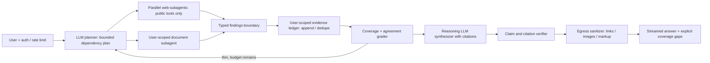

# G11 — Deep Research Agent: Main Interview Guide

**Research process** is: a question, hunt on the web and in *your* files, a cited brief. Failed hunt should look incomplete, not confident-fake.

**G11 covers one slice:** bounded, read-only research with citations. It cannot send email or buy anything.

End to end, as “Who is Acme’s CEO, with sources?”

1. **You authenticate.** Budgets and rate limits lock in. First signal in seconds.
2. **A planner splits work:** public web vs your Drive. Web never inherits Drive tokens.
3. **Subagents search.** Wikipedia timeout is “couldn’t check,” not “not found.”
4. **Findings go to a ledger.** A grader asks: enough coverage, or one more hop?
5. **A synthesizer writes only from that ledger.** Every fact needs a citation.
6. **A verifier and sanitizer** strip bad links/HTML. Gaps stay visible.

That’s it: **plan → search in isolation → cite or show the hole → stop.** External actions stay out.

> **Source:** [G11_Deep_Research_Agent.md](/modules/15-fde-case-studies/knowledge-retrieval/deep-research-agent#full-pack). Use the [Deep Dive](/modules/15-fde-case-studies/knowledge-retrieval/deep-research-agent#deep-dive) for state and security mechanics and the [Cheat Sheet](/modules/15-fde-case-studies/knowledge-retrieval/deep-research-agent#cheat-sheet) for rehearsal.

## The case in one sentence

Build a read-only research agent for public web and a user's private documents: about 100,000 daily users and 40,000 research runs/day, p95 under 90 seconds, first signal under 3 seconds, 3–12 steps/run, cited claims, and about $0.20/run. A failed branch yields an explicitly incomplete answer, not fabricated certainty.

## Questions to ask the interviewer

| Question to ask                                                        | What it's really asking                                                              | What you then decide                                                |
| ---------------------------------------------------------------------- | ------------------------------------------------------------------------------------ | ------------------------------------------------------------------- |
| What is an acceptable citation, and must every factual claim have one? | If we say “Acme’s CEO is Jane,” must we show the URL and span, or is a vibe okay? | Evidence schema and verifier.                                       |
| Which sources are public and which are user-scoped?                    | Can the web agent see my Drive, or only public pages?                                | Tool identities and isolation.                                      |
| What happens when a source is unavailable or search finds nothing?     | If Wikipedia timed out, do we say “not found” or “we couldn’t check”?           | `EMPTY` vs `UNAVAILABLE`, and when a partial answer is allowed. |
| What makes a research run complete?                                    | After 12 hops we still lack a number — keep going, or stop and show the gap?        | Coverage rubric, hop cap, and no-progress stop.                     |
| May answers contain external links, images or rendered HTML?           | Can the answer include a tracking pixel or a`javascript:` link from a random page? | Egress sanitization.                                                |
| Is $0.20 a hard cap or target, and at what traffic peak?               | At noon, if a run would cost $0.50, do we stop mid-research?                         | Model routing and search budgets.                                   |

## Requirements: Functional + Non-Functional

The easiest way to frame requirements in an interview is:

> **Functional = what the system does. Non-functional = how well it does it and what constraints it must satisfy.**

### Functional requirements — what the system must do

1. **Authenticate and rate-limit.**
2. **Plan a bounded research task.**
3. **Search web and user documents with separate privileges.**
4. **Merge typed evidence.**
5. **Check coverage and replan** if useful and budget remains.
6. **Synthesize with citations.**
7. **Verify claims and sanitize** rendered output.
8. **Stream status and return explicit gaps.**

### Non-functional requirements — how well / under what constraints

| Requirement | Example target / constraint |
|---|---|
| **Latency** | p95 run <90 s; first progress <3 s. |
| **Cost** | Roughly **$0.20/run**. |
| **Security** | Strict cross-user isolation; untrusted web content sanitized. |
| **Bounds** | Cap tool calls and retries. |
| **Audit** | Citations are auditable. |
| **Autonomy** | Read-only; no external actions. |
| **Scale (illustrative)** | 40,000 runs/day ≈ 28/min; 3× peak ≈ 100/min; ~70 s active ⇒ ~120 in flight (~170 slots at 70% util.). Naive seven-step plans can send ~30k input tokens. |

### Interview shortcut

If asked **“What are the requirements?”**, say:

> **“Functionally, plan bounded research, search public and private sources separately, cite every claim, and show gaps. Non-functionally, under 90 seconds, about 20 cents, no cross-user leak, and no invented certainty.”**

## Architecture

The planner and synthesizer use a reasoning-tier LLM; narrower web/document agents can use smaller models. The supervisor is bounded by deterministic hop, budget and no-progress rules. Web agents never inherit private-document access.

### Step-by-step architecture

1. Authenticate the user, apply run budgets and rate limits, and emit a first progress signal quickly.
2. A reasoning LLM makes a small dependency-aware plan; deterministic controls cap hops, elapsed time, calls and spend.
3. Independent web subagents search public sources in parallel while a separate document subagent retrieves only documents that this user may read.
4. Each branch returns typed findings and citations, not instructions. A reducer appends and deduplicates evidence in a user-scoped ledger.
5. A coverage grader compares findings with the plan. It may request a capped replan; repeated delegation without new evidence stops.
6. A synthesizer writes claims grounded in the ledger; a verifier checks claim-citation support and marks unavailable or uncovered areas.
7. An egress sanitizer removes image/markup fetches and disallowed links before streaming a cited answer or clearly labelled partial result.

## Key choices and failure modes

**Isolation is the hard boundary.** Web pages and retrieved content are untrusted. The web agent gets no private-document credentials. Prompt text cannot enforce this. The final rendered answer is also an egress path, so strip Markdown images and fetch-inducing markup. Never share private-answer caches across users.

**Parallel merge must be correct.** If branches write a single `summary` field, last-write-wins can silently drop findings. Store a list of typed evidence with an append/concatenate reducer, provenance and dedupe. Sum budget consumption across branches.

**Termination matters.** Use a hard hop cap (the source gives eight as an example), per-run money/tool limits and no-progress detection. Distinguish no evidence found from a failed source. On a cap or outage, provide a partial answer with the missing section named.

**Cost and latency:** isolate subagent contexts; use smaller models for narrow extraction and a stronger model for planning/synthesis; cap rounds; deduplicate searches; cache public facts and user-scoped private work separately; measure cost by branch, hop and synthesis tokens. Parallelism helps only when tasks are independent and provider limits permit it.

## Evaluation, rollout and variants

### What to score

Score **outcome and trajectory**, not only the final paragraph.

| Metric | What it catches |
|---|---|
| Citation support | Claims that are not backed by the ledger |
| Unsupported-claim rate | Invented facts |
| Coverage | Plan items left unanswered |
| Cross-user leak rate | Private docs in another user’s run |
| p95 latency / first signal | Slow runs; silent first seconds |
| Cost/run | Budget blow-ups |
| Hop count and tool routing | Loops, wrong worker, wasted searches |

### What to test

- Poisoned web pages
- Missing documents
- Conflicting sources
- Empty search (`EMPTY`)
- Unavailable tools (`UNAVAILABLE`)

Audit **the evidence ledger and the link sanitizer**, not only the final answer.

### Related AWS research platform

It uses API limits, Bedrock guardrails, Redis/RDS memory, a search–summarize–write–critic loop, and observability.

Its source **does not** give per-user ACL or deterministic release gating. Do **not** copy those defaults into this enterprise case.

### When to use multiple agents

A supervisor–worker split is worth it for **parallelism**, **distinct permissions**, or **context isolation** (web vs Drive).

If the decomposition is predictable, a **deterministic workflow** is simpler.

## Two-minute interview answer

“I would clarify citation quality, private-document permissions and the partial-answer contract first. The planner builds a bounded research plan, then public-web workers and a separate user-scoped document worker gather typed findings in parallel. Their evidence is appended into a user-scoped ledger; a coverage check can trigger a limited replan. A stronger LLM synthesizes the answer, and a claim verifier plus egress sanitizer ensures citations support the claims and rendered output cannot leak private content through images or links. I enforce hop, time and spend caps, return explicit gaps on failure, and measure both answer quality and the path the agents took.”
