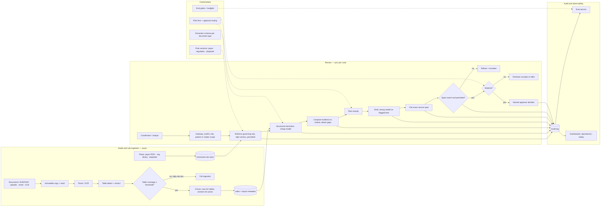

# Document Review Copilot with a Policy Check

*Extraction is cheap and judgement is expensive, and the copilot must never let the cheap step stand in for the expensive one.*

◷ 31 min

The three personas in this group look like three products: a prior-authorization assistant, a compliance reviewer, a contract copilot. They are one system with one spine. A document comes in. Structure is extracted and compared against a policy, a playbook or clinical criteria. Gaps are flagged, risk is classified, and material cases go to a human who decides. This page consolidates group G08 of `CASE_STUDY_INDEX.xlsx` into one read for the day before. The purchased answer keys are templated. So the argument here is built from their workflows, records, risks and rollout, plus the vendor's prior-authorization case. Anything constructed for this page rather than taken from a source is labelled as such.

| Case in the group | What it contributes here |
|---|---|
| #30 Healthcare Prior Authorization Assistant (anchor) | Sections 1 to 10: the design, the PHI boundary, the payer-rule versioning, the spoken answer; the vendor PDF's personas, workflow, red-team list and rollout phases |
| #29 Financial Compliance Document Reviewer | The rule-citation and risk-classification variant in sections 3 and 7; the red-team mock in section 12 |
| #31 Legal Contract Review Copilot | The clause-versus-playbook variant and fallback language in sections 3 and 7 |
| #47 OpenAI Q3 Claims-Processing Assistant | The lower-risk-first ordering in section 10 and its follow-up in section 11 |
| #56 OpenAI Q12 Deploying AI in a Highly Regulated Industry | The governance checklist in section 8 and its follow-up in section 11 |
| #89 Incident: correct answer, misleading citation | Section 14 |
| #92 Incident: PDF parser drops critical tables | Sections 6 and 14 |
| Self-drill for #30, cost per document | Section 13 |

---

## 1. Frame the Copilot as a Drafter, Never a Decider

Open by saying what the system is not. It does not make the clinical decision, the compliance ruling or the legal call. It gathers evidence, maps it to the governing rule, writes the draft and explains the risk. A named human approves. That is the whole design. Every component below exists to keep the cheap step from being mistaken for the expensive one.

> *"I would design this as a permission-aware prior-authorization drafting system, not a clinical decision-maker. Every generated claim must point back to a source note, code, lab result, or payer rule. If evidence is missing, stale, or conflicting, the assistant should not invent language. It should flag the gap and route the case to a clinician."*

The three answer tiers from the answer keys show what that framing buys. The weak answer connects the documents to a vector database and lets an LLM answer, maybe behind a chatbot UI. It ignores the workflow, the permission boundary, source freshness, evaluation, human approval and monitoring. The average answer builds RAG with citations and tests it on sample questions. It never separates low-risk assistance from high-risk actions. It never defines the data model or the rollout gates. The strong answer maps the workflow and the risk boundary first. It ingests approved sources with metadata, freshness and ACLs. It filters by permission before generation. It cites every claim, exposes uncertainty and missing evidence, and routes risky actions to approval. It proves all of that with golden cases, permission red-team tests, groundedness and citation metrics, and latency and cost budgets. The rollout is staged: offline prototype, shadow mode, read-only pilot, approved write-back.

Ask the discovery questions the answer keys share. Add the vendor case's domain ones. Each answer decides a component.

| Question to ask | What the answer decides |
|---|---|
| Which exact review workflow is slow, risky or inconsistent today, and what decision does the user make at the end of it? | The scope of the first slice and the definition of done |
| Who is the primary user, who reviews the output, and who owns the risk if the assistant is wrong? | The approval routing and the audit trail's audience |
| Which tasks are read-only, which are draft-only, and which need explicit human approval before write-back? | The tool allowlist and the risk tiers |
| Which systems hold the trusted source of truth, and how do their permissions, freshness and ownership differ? | The connector list, the ACL mapping, the freshness SLO per source |
| What are the top 5 recurring cases by volume and the top 5 highest-risk cases by impact? | Where the cheap path and the expensive path each go |
| What answer must the assistant refuse or escalate instead of generating? | The output policy engine's refuse and escalate modes |
| What audit evidence must be stored so security, legal or management can reconstruct why the system answered? | The audit record's fields |
| Are payer rules structured policies, PDFs, web portals or internal documents? | The ingestion pipeline and the table-extraction gate |
| Are we allowed to generate text that goes directly to the payer, or only internal drafts? | Whether external submission exists at all in version one |
| How should the system behave when clinical notes conflict with payer rules? | The conflict policy: surface, prefer the approved current source, escalate |
| Which PHI fields are necessary, and what is excluded from prompts and logs? | Data minimisation and the log redaction rules |

Map the people. Each notices a different failure first. The vendor case names four for prior authorization. The other two personas have their equivalents.

| User | Workflow | Failure they notice first | What the copilot gives them | Approval role |
|---|---|---|---|---|
| Coordinator, analyst or contract reviewer | Selects the case, gathers the packet, checks required evidence, identifies what is missing | A packet that comes back incomplete or wrong | Draft with citations, a missing-evidence list, a denial-risk or deviation explanation | Prepares; does not approve |
| Clinician, compliance manager or counsel | Reviews the draft, confirms necessity or risk, overrides wrong suggestions, approves | Language that reads as a decision they did not make | An editable draft where every claim links to its source, with confidence and escalation reason | Approves, rejects, edits, or asks for more documentation |
| Revenue-cycle, surveillance or legal-ops manager | Tracks denial patterns, false-positive burden, turnaround | A tool that adds review time without improving first-pass rate | Dashboards separating operational from safety metrics | Approves rollout stages |
| Compliance or privacy officer | Reviews audit logs, access controls, PHI handling | A record accessed without a reason, or PHI in a log | Immutable audit of evidence IDs, policy versions, edits and approvals; least-privilege access | Any violation blocks release |

Scope out loud before drawing. One document type, one policy source, draft-only. Internal drafts, not external submission. Human approval on every material case. Two assumptions are worth stating if withheld. The assistant is administrative drafting, and the professional judgement stays with the reviewer. A source that lacks ACL metadata is excluded from production retrieval until it is mapped.

## 2. State Requirements as Testable Constraints

A requirement the reviewer cannot test is a preference. Say so. "Catch the risky ones" is a preference. "Recall above the agreed bar on severe violations, with the false-positive burden below the analyst's budget" is a constraint. Only the second one changes the architecture. Split the functional list with MoSCoW. The launch gate is then the smallest set that keeps the promise.

The must-haves are five. Each is a test. Retrieve the governing rule for the case. That is the payer-policy version by payer, plan, procedure, diagnosis and date of service, the regulatory obligation by jurisdiction and product, or the playbook position by clause type. Extract the relevant evidence or clauses from the document and the records, mapped to that rule. Generate a draft with a citation to the exact source span for every claim, and never invent language where evidence is missing. Identify missing evidence, outdated or conflicting documentation and rule gaps, and route ambiguous or high-risk cases to the named human. Keep a complete audit trail of retrieved rules, generated text, reviewer actions and final state.

The should-haves belong in the first usable version. Produce a denial-risk, deviation-risk or violation-risk explanation before the case leaves the system. Let the reviewer edit, approve, reject or override the draft in place. Show confidence, missing evidence and the escalation reason whenever the system is uncertain. Collect reviewer corrections for evaluation, never for model training without governance. Provide admin controls for source inclusion, document freshness, policy rules, blocked actions and audit export. Version every rule source so a decision is judged against the rule in force at the time of the request. Autonomous submission, fine-tuning, cross-tenant review and external communication can wait, and most of them should never arrive.

Declare the non-goals:

- no clinical, regulatory or legal decision by the model
- no submission to a payer, regulator or counterparty without an approver
- no generated text sent externally in version one
- no PHI or privileged content in prompts or logs beyond what the task needs
- no learning from reviewer edits without a governance step

The non-functional requirements are the operating constraints, each stated so a test can fail it.

| Constraint | Stated so it can be tested |
|---|---|
| Latency | Interactive questions 3 to 8 s; packet generation under 10 to 20 s per the vendor case; bulk surveillance runs overnight as batch with an interactive p95 under 10 s for analyst drill-down. Longer workflows go asynchronous with progress state |
| Availability | Business-critical hours with graceful degradation when the LLM, the vector store or a source system is down: partial packet with gaps labelled, or refusal, never a silent guess |
| Cost | Token budgets, caching for stable policy documents, retrieval pruning, small models for classification and extraction, the strong model routed only to flagged risk. Reported as cost per document and cost per true issue found |
| Security and privacy | SSO; RBAC and ABAC; source-level ACLs and patient-level access restrictions; encryption in transit and at rest; secrets management; no training on customer data unless the contract allows; PHI minimised in prompts and redacted from logs |
| Audit and compliance | Immutable log of queries, retrieved evidence IDs, policy versions, model and prompt version, policy decisions, reviewer edits, approvals and final output, with full evidence traceability for every generated statement |
| Reliability | Fail closed on permission uncertainty, stale rules, missing citations and any high-risk write action. Degrade on retrieval quality. Low hallucination tolerance for clinical, payer or policy claims |

Every must-have then needs an owner in the architecture. This table is the proof.

| Requirement | Primary component(s) |
|---|---|
| Governing rule by version | Policy ingestion pipeline, rule versioning store, rule retriever |
| Evidence and clause extraction | Parser with table extraction, extraction service with schema, evidence mapper |
| Draft with span-level citations | Drafting service, citation builder, citation verifier |
| Missing evidence and gap detection | Completeness and risk checker |
| Route material cases to a human | Risk tiering, review queue, approval workflow |
| Complete audit trail | Audit and compliance layer, trace store |
| No cross-user or cross-patient disclosure | Identity mapping, permission-aware retrieval, output policy engine |
| Fail closed on missing citation | Citation verifier, output policy engine |

## 3. Map the Three Personas Onto One Spine

The spine is the same in every persona. The interviewer will pick one. Learn the spine once and swap the nouns.

| | Prior authorization (#30) | Financial compliance (#29) | Legal contract (#31) |
|---|---|---|---|
| Document in | Patient encounter, clinical notes, labs, imaging, prior therapies | Advisor email, chat, marketing draft, client or regulatory document | Uploaded contract |
| Governing rule | Payer policy, versioned by payer, plan, procedure, diagnosis, date of service | Regulatory rule library and internal policy, by jurisdiction and product | Negotiation playbook and clause library, by clause type |
| Extraction | Medical-necessity evidence mapped to payer requirements | Policy gaps, promissory language, disclosure gaps | Clauses by type, normalised text |
| Comparison | Evidence versus criteria; missing documents; conflicting notes | Text versus obligation; severity | Clause versus preferred position; deviation |
| Output | Draft packet with citations, denial-risk explanation | Findings with rule citations, risk class, remediation notes | Flagged deviations, risk rationale, proposed fallback language |
| Human | Clinician approves before submission | Analyst then supervisor or legal on high risk | Counsel on material changes |
| Records | Patient, Encounter, PayerPolicy, AuthRequest, EvidenceLink, AuditLog | Document, Rule, Finding, ReviewerDecision, AuditLog | Contract, Clause, PlaybookRule, RiskFinding, ReviewAction |
| Sources | EHR via FHIR, payer portals, document store, claims system, IdP, audit logs | DMS, policy repository, regulatory rule library, GRC platform, case management, IdP | CLM, contract repository, clause library, playbook, DMS, e-signature, IdP |
| Persona-specific red-team | PHI leakage, invented necessity, stale payer rule, wrong patient, "just submit it anyway" | Missed violation, outdated regulation, hallucinated rule, over-automation of legal judgement | Unauthorised legal advice, privilege leakage, wrong jurisdiction, hallucinated clause, risky fallback accepted without a lawyer |

The claims-processing prompt from the OpenAI bank is the same spine again. Its discussion list is classification, OCR and structured extraction, policy lookup, missing-information detection, fraud or anomaly signals, human review thresholds, explainability, regulatory constraints, PII protection, evaluation against human decisions, and gradual rollout by claim type. Its one instruction is to avoid promising full automation. Start with extraction, triage, summarisation and missing-information detection before any adjudication.

Map each source with its permission model before choosing an embedding model. The connector's job is translating that model into one internal representation.

| Data source | Format | Owner | Freshness | Permission model | Risk |
|---|---|---|---|---|---|
| EHR via FHIR | Structured codes, notes, labs, imaging reports | Clinical informatics | Minutes; event-driven | Patient-level and role-based; break-the-glass audited | Wrong patient; PHI over-exposure; "rule out" read as confirmed |
| Payer policy portals and PDFs | Semi-structured PDFs, portal pages | Payer relations | Days to weeks; versioned by effective date | Public or contract-restricted | Outdated rule version; tables dropped by the parser; injection in an uploaded PDF |
| Regulatory rule library and GRC | Structured obligations, policy documents | Compliance | Weeks; versioned | Business-unit and jurisdiction | Superseded obligation; wrong jurisdiction |
| Advisor communications | Email, chat, drafts | Surveillance | Real time; immutable ingestion | Supervisory and legal hold | Injection inside reviewed messages; PII and financial data |
| CLM and contract repository | Contracts, clause library, playbook | Legal ops | Days | Matter-level and confidentiality level; privilege | Privilege leakage; wrong jurisdiction; stale playbook |
| Case, claims and e-signature systems | Structured records | Operations | Minutes | Queue and role membership | Write-back without approval |

## 4. Draw the Architecture End to End

One diagram carries the whole design. It is this page's construction from the three answer keys and the vendor case. The organising split is control plane against data plane. Rule versions, schemas, risk thresholds, credentials and evaluation gates live in the control plane. Every document, extraction, comparison, draft and approval lives in the data plane. A control-plane change is a release. A data-plane call is a case.

```
 ╔══════════════════════════════ CONTROL PLANE (changes are releases) ═══════════════════════════════╗
 ║  rule versions (payer policy · regulation · playbook) · extraction schema per document type          ║
 ║  risk tiers + approval routing rules · ACL mapping · credentials · prompt/model/parser versions       ║
 ║  eval gates (extraction audit · citation span · escalation · PHI leak = 0) · budgets                  ║
 ╚═════════════════════════════════════════╤═════════════════════════════════════════════════════════╝
                                           │ configures every box below
 ╔══════════════════════════════ DATA PLANE (calls are cases) ═══════════════════════════════════════╗
 ║                                                                                                     ║
 ║  INTAKE + RULE INGESTION — asynchronous                                                             ║
 ║   documents (EHR/FHIR · uploads · email · CLM)     rules (payer PDFs · reg library · playbook)       ║
 ║        │ immutable copy + content hash                    │ versioned by effective date             ║
 ║        v                                                  v                                         ║
 ║   PARSE / OCR ─> TABLE DETECT + EXTRACT ─> layout QA gate ─> chunk (rows for tables) ─> index      ║
 ║        │ table coverage < threshold on a high-risk doc = FAIL ingestion, not warn                    ║
 ║                                                                                                     ║
 ║  REVIEW — synchronous per case, ordered by risk                                                     ║
 ║   user ─> gateway (authN, role, patient/matter scope) ─> RULE RETRIEVE (right version, permitted)   ║
 ║        ─> STRUCTURED EXTRACT (schema, cheap model) ─> COMPARE (evidence ↔ criteria, gap detect)     ║
 ║        ─> RISK CLASSIFY (tier) ─> DRAFT (strong model only on flagged tiers) ─> CITE (exact span)   ║
 ║        ─> VERIFY (span match + permission) ─> ROUTE ─┬─ low tier: reviewer accepts/edits            ║
 ║                                                      └─ material: named approver decides            ║
 ║                                              refuse + escalate when evidence missing/conflicting    ║
 ║                                                                                                     ║
 ║  AUDIT + OBSERVABILITY — every stage writes                                                         ║
 ║   audit log (rule IDs + versions · evidence IDs · draft · edits · approval)                          ║
 ║   trace store ─> eval service (golden cases · red-team · shadow) ─> dashboards (operational | safety)║
 ╚═════════════════════════════════════════════════════════════════════════════════════════════════════╝
```

The same flow as a rendered diagram, for viewers that draw Mermaid:



Read the components in dependency order. That is the order they exist and the order they fail.

| Component | Responsibility | Fails how |
|---|---|---|
| Gateway and identity | Authenticate via SSO, load role and tenant, scope to the patient or matter, classify the request as read, draft or action | Closed: no scope, no case |
| Rule ingestion and version store | Ingest payer policies, regulations, playbooks; version by effective and expiry date | Degrades: an unversioned rule is excluded, not guessed |
| Parser, table extractor, layout QA | Convert PDFs to text and tables; emit coverage and confidence; gate high-risk documents | Closed: low table coverage on a high-risk document fails ingestion |
| Extraction service | Map document content into the schema for its type with a cheap model | Degrades: low-confidence fields flagged as missing, never filled |
| Rule retriever | Fetch the governing rule at the right version, under the user's permissions | Closed: no permitted rule, no draft |
| Comparison and gap detector | Evidence against criteria; missing, stale, conflicting flagged | Degrades: gaps listed, draft marked incomplete |
| Risk classifier and router | Assign a tier; decide reviewer-accept versus named-approver | Closed: unknown tier routes up, never down |
| Drafting service | Strong model only on flagged tiers; never writes decision language | Refuses when evidence is missing or conflicting |
| Citation builder and verifier | Cite the exact supporting span; reject any citation that is not the span used or not permitted | Closed on span mismatch |
| Approval workflow | Named approver edits, approves, rejects; nothing external leaves without it | Closed: no approver, no submission |
| Audit, trace, eval, dashboards | Rule IDs and versions, evidence IDs, draft, edits, approval; golden and red-team evals; operational and safety metrics apart | Degrades: case still served, gap logged |

Three boundaries are worth pointing at with the diagram up. Each one is a line on the board. The cheap-to-expensive boundary sits between EXTRACT and DRAFT. Everything to the left runs a small model on every page. Everything to the right runs the strong model only on what was flagged. The trust boundary sits at VERIFY: no citation leaves that was not the span used and permitted. And the decision boundary sits at ROUTE: to its left the system drafts and explains, to its right a named human decides.

## 5. Make the Extraction Schema the Seam

The schema is where the copilot stops being a chatbot. It becomes a workflow. Structured extraction with a typed schema per document type is the one component every downstream step depends on. Comparison, risk tiering and citation all key on fields, not on prose. A model cannot compare evidence to criteria it has not first named.

For prior authorization the fields are payer, plan, procedure, diagnosis codes, date of service, prior therapies, labs, imaging and the clinical facts that map to each payer requirement. For compliance they are document type, jurisdiction, business unit, the obligation that applies, and the evidence span that meets or breaks it. For contracts they are clause type, the normalised clause text, the counterparty, the jurisdiction and the confidentiality level. Every record in the answer keys is a row in one of those schemas. The EvidenceLink, Finding and RiskFinding records are the join between an extracted field and the rule it was compared against, with a confidence.

Two rules follow. Extraction runs on the cheap model and on every page. It is a classification task with a checkable answer. A low-confidence field is flagged as missing rather than filled. A confident wrong field poisons every step after it. The vendor case's step-therapy test names the failure. A payer rule requires step therapy and the EHR has no record of it. The right output is a gap, not an invented history.

## 6. Refuse to Index What the Parser Dropped

A model cannot reason over data that never reached the index. That is the whole section. Table-heavy policy documents are where that happens silently. A generic PDF loader flattens a table into disconnected fragments. The header row and the data rows land in different chunks with no schema linking them. The parser incident in section 14 is exactly this. 17 tables detected, 9 extracted, pages 31 to 33 missing. An escalation-threshold matrix that was never indexed.

The chunking reference gives the rule. For PDFs, validate extraction order before trusting chunk boundaries. Keep page-number metadata as the only anchor back to the source. Extract tables separately with a table-mode parser rather than as prose. For tables, chunk by row or row group and never split a row. Use zero overlap, because rows are independent records. Then gate ingestion on what the parser reports: `extraction_coverage`, `table_count_detected`, `table_count_extracted` and `layout_confidence`. Fail a high-risk policy document when table coverage falls below the agreed threshold instead of logging a warning. Classify documents as policy-with-tables when they are. The incident's gate only warned because the document had been labelled plain policy text.

Store page-level extraction coverage in the retrieval metadata. A query that lands on a section with ingestion warnings then carries a warning to the reviewer. Re-run the offline evaluation after any parser or chunking change. Chunking is a retrieval-model change, not a set-once parameter.

## 7. Cite the Span That Supported the Claim, Then Verify It

Answer correctness and citation correctness are separate dimensions. In a regulated workflow the second one is what the reviewer relies on. A correct answer with a wrong citation is more dangerous than a refusal. The reviewer trusts the citation and repeats it in a negotiation or a submission.

So the citation builder quotes the exact span the drafting step used. Not the most concise chunk, not the highest-ranked chunk nearby. The verifier then checks two things before anything leaves. The cited span actually contains the claim. The user is permitted to see it. A span mismatch fails closed. The citation incident in section 14 shows the alternative. A citation generator was changed to prefer concise citations. A verifier over-weighted answer groundedness. A termination clause was cited to the data-processing addendum.

Playbook comparison in the contract persona is the same mechanism pointed at a rule. Each extracted clause is compared against the playbook's preferred position for its type. A deviation is flagged with a rationale. The copilot proposes the playbook's fallback language rather than inventing its own. Material deviations route to counsel. A fallback is never accepted without a lawyer's approval. In the compliance persona the rule citation is the obligation text by jurisdiction and product. The finding carries the evidence span and a severity.

## 8. Handle Sensitive Data as a Boundary, Not a Setting

PHI, privileged material and financial data change where content may travel. Not only who may read it. Minimise what enters the prompt to the fields the task needs. Redact unnecessary PHI from logs. Store policy and evidence IDs rather than raw content with every generated claim. Keep patient-level and matter-level access restrictions in retrieval, never in the prompt. Break-the-glass access, where it exists, is audited with a reason. No training on customer data unless the contract allows it. No vendor system sees raw content that the data classification forbids.

The regulated-industry prompt from the OpenAI bank is a checklist for this section. Each item already has a home in the design:

- data classification and sensitive-data handling
- encryption
- access control
- tenant isolation
- retention and deletion
- audit logging
- data residency
- human oversight
- explainability
- model and prompt versioning
- incident response
- vendor and third-party risk
- governance approvals

When the business wants to skip the governance review for the MVP, narrow the scope. Use synthetic or masked data where possible. Start read-only or assistive. Define explicit approval gates, and obtain security and legal review before any production exposure.

Risk tiers decide what reaches a human. The vendor case's list is the model. Refuse unsupported claims. Flag missing evidence. Escalate to the clinician. Cite the source. Prevent unauthorised access. Never submit without approval. Anything that would read as a clinical decision, a regulatory ruling or legal advice is a tier the model does not write.

## 9. Degrade on Everything Except the Decision

Design the failure path with the happy path. One rule organises the table. The human decision, the permission check and the citation fail closed. Everything else degrades visibly, with the gap labelled.

| Fails | Behaviour |
|---|---|
| Parser drops tables or pages on a high-risk document | Ingestion fails; document reprocessed with OCR and table fallback; affected questions blocked until the corrected index is live |
| Rule version missing or stale for the date of service | Draft refused; policy-version mismatch counted; reviewer told which version was expected |
| Evidence missing, conflicting, or a note says "rule out" | Gap flagged, no language invented, case escalated to the clinician or analyst |
| Citation span does not match the claim | Response rejected; low citation-accuracy answers routed to human review |
| Wrong patient or matter in scope | Closed: patient-level restriction in retrieval, never in the prompt |
| Retrieved document carries embedded instructions | Treated as data, never as instructions; suspicious chunks flagged; red-team test in the gate |
| LLM, vector store or a source system down | Partial packet with gaps labelled, or refusal; overnight batch queued; never a silent guess |
| User asks to "just submit it anyway" | Refused; autonomous submission is disabled by design |
| Approval workflow unavailable | Fail closed. Nothing leaves. |

Say what breaks first at scale. Bulk surveillance is a batch problem, so tier the screening. Rules and small classifiers run on everything. The LLM runs only on borderline cases. Low-risk traffic is sampled. Interactive drill-down keeps its own p95 under 10 s by precomputing embeddings and policy matches and prioritising high-risk queues. Strong-model cost is bounded because the flagged tier is a small fraction of pages. That fraction is the metric to watch.

## 10. Gate the Release on Extraction, Citation and Escalation

The answer keys share one evaluation table. The vendor case adds workflow and safety metrics on top. The gate is not a groundedness score alone. The citation incident passed a groundedness gate. It is four separate dimensions, each with its own dataset.

| Metric | Good threshold | Bad threshold | Test dataset | Owner |
|---|---:|---:|---|---|
| Extraction accuracy on a sampled audit | Agreed bar per field; high-risk fields audited every release | Any drop on a high-risk field | Sampled documents with SME-labelled fields | SME / eval |
| Answer groundedness | >= 90% supported claims | < 80% | Golden Q&A + SME review | FDE / SME |
| Citation accuracy at span level | >= 95% correct citations | < 85% | Source-span audit with clause-level labels | SME |
| Permission and PHI violations | 0 | > 0 | ACL and PHI red-team suite | Security |
| Escalation quality | >= 95% correct escalation on high-risk cases | Missed high-risk case | Risk-labelled scenarios | Product / compliance |
| Task completion | >= 80% workflows completed with less manual effort | < 65% | Workflow replay tests | Product |
| Unsupported claim rate | Blocked or flagged, trending to zero | Any unsupported claim in an approved packet | Evidence-faithfulness review | SME |
| Reviewer override rate and edits | Falling over the pilot; spikes investigated | Rising | Production telemetry | Product |
| p95 latency and cost per document | Within budget; cost per true issue found tracked | Breach | Load test + telemetry | Platform |

The vendor case's workflow metrics belong on the operational dashboard, kept apart from safety. They are first-pass approval rate, time to prepare a packet, coordinator rework, clinician review time, and denial rate by payer and category. For compliance the equivalents are recall on high-risk violations, false-positive review burden, escalation precision, prompt-injection resilience, audit completeness and model drift by product line.

Red-team the boundary with the vendor case's ten tests. They are concrete, and each maps to one control:

- missing diagnosis code
- outdated payer rule
- conflicting clinical notes
- patient record from the wrong patient
- payer rule requiring step therapy not found in the EHR
- prompt injection hidden inside an uploaded payer PDF
- a clinician note that says "rule out" treated as confirmed
- medical necessity not documented
- a user who asks to "just submit it anyway"
- a coordinator who tries to open a restricted patient record

The claims-processing follow-up asks how to prove the system is safe enough for production. This section is the answer. Evaluate against human decisions on historical cases. Block the release on any red-team violation. Roll out by claim type, starting with extraction and triage.

## 11. Roll Out in Shadow, Then One Category at a Time

Week one is not the whole diagram. It is one document type and one policy source. It is the extraction schema agreed with the SMEs. It is a golden set built from historical cases with their human decisions. The purchased keys and the vendor case describe the same staircase.

| Stage | Gate |
|---|---|
| Week 0-1 | Define the workflow, the risk boundary, success metrics, source owners, approval rules and non-goals |
| Week 1-2 | Ingest a limited approved corpus; offline prototype with no write-back and no external communication |
| Week 2-3 | Golden dataset from historical cases and SME-approved answers; red-team and permission tests |
| Week 3-4 | Shadow mode: drafts generated, compared with human decisions, never shown to end users; thresholds calibrated by risk category |
| Week 5 | Read-only pilot with citations, confidence, feedback capture and an escalation path; coordinators use drafts, every request needs the approver |
| Week 6-8 | Draft-only workflow actions behind human approval; one high-volume low-risk category first, such as imaging authorization or one business unit |
| After | Outcome measurement: approval rate, denial reasons, preparation time, override rate. Expand payers, categories or document types only while eval metrics, incident rate, latency and cost hold; keep the rollback plan |

The OpenAI claims prompt gives the ordering rule for what to automate. Extraction, triage, summarisation and missing-information detection come first. Adjudication comes only after evaluation and governance. That is the risk tiers, applied over time.

## 12. Survive the Red-Team Round

The financial-compliance mock is the adversarial version of this design. It is the round to rehearse. Its customer wants "the AI to review all advisor messages and tell us which ones are risky". The demo caught banned phrases, missed subtle promissory language and followed instructions embedded inside emails. The strong framing is regulated decision support, not autonomous compliance judgement. Extract evidence, map it to policy clauses, propose risk labels with confidence, and preserve an audit trail. Launch requires high recall on severe violations, controlled false positives and explicit resistance to adversarial instructions.

The interviewer pushes on five objections in order. Each has a prepared shape.

| Objection | Answer |
|---|---|
| They want a prototype fast, no discovery | A 3 to 5 day discovery-and-prototype sprint: one workflow, only approved sources, a small eval set, a demo on real examples. Speed without pretending a broad assistant is production-ready |
| The first version should cover everything | Split scope into read-only, draft, and action layers; ship read-only or draft-only first; action needs approval until evaluation and telemetry earn it |
| Just add a disclaimer | A disclaimer does not stop permission leakage, stale data, wrong citations, unsafe tool calls or over-trust. Constrain what the model sees and does before generation, do not apologise after |
| 18 seconds per answer | Set the budget: batch overnight for bulk, p95 under 10 s for drill-down; decompose by stage; parallelise, cache embeddings, cut top-k before rerank, stream, small model for low risk. Do not remove citation verification; make it asynchronous for low-risk explanatory answers only |
| Too expensive at scale | Cost per true issue found, not per request. Tiered screening: rules and small classifiers for bulk, the LLM only for borderline cases. Never downgrade the model globally; route by risk |

The mock's five follow-ups are the ones to have ready. A retrieved document with malicious instructions is data, never instructions. The red-team suite plants such instructions in documents, tickets, emails and logs. A correct answer that cites the wrong source is the incident in section 14. One customer seeing another's data is a tenant predicate on every retrieval, which G07 owns. Cost after launch is the tiered screening above. What is human-approved versus automated is the risk tiers in section 8.

The scoring rubric rewards the same things in every dimension. Quantified business value and failure cost. An explained data flow with auth, eval gates and rollback. Threat-modelled misuse, adversarial tests and launch gates. A phased launch with incident response, and executive-ready honesty about limits. The debrief line is to give concrete numbers: the p95 target, the acceptable false-positive rate, the minimum citation accuracy, the launch-blocking security threshold, and the expected ROI.

## 13. Answer the Cost Pivot in Ten Minutes

The interviewer's pivot after a good design is "the copilot costs too much per document". The self-drill on the index answers it with the same architecture. The cheap-to-expensive boundary in section 4 was drawn for exactly this.

| | |
|---|---|
| Dominant driver | Input tokens on long documents, and every page going through the strongest model |
| Cheapest lever first | Extract only the relevant sections first; dedupe templated documents by hash; cheap model for extraction, strong model only on flagged risk; batch the non-urgent queue off-peak |
| Metric that proves it | Cost per document; tokens per document; escalation rate; extraction accuracy on a sampled audit |
| Do not | Send the whole document to the premium model every time |

The sixty-second line: extraction is cheap, judgement is expensive. Route pages to extraction. Route only the flagged risks to the strong model. Prove quality by sampling. Every strong cost answer is generated by four verbs in order. Measure, by tracing and attributing first. Route, matching model and path to risk. Bound, with limits on tokens, top-k, timeouts and budgets. Cache safely, with tenant, permission and version in the key.

## 14. Debug the Incidents on This Design

Both incidents are questions about where the design would have caught the failure. Answer each as detect, contain, root cause, prevent. Read the telemetry aloud. The numbers are the argument.

### Correct answer, misleading citation (#89)

An account executive asked whether a customer could terminate for convenience with 30 days' notice. The assistant answered correctly. It cited Section 12.4, the Data Processing Addendum, instead of Section 8.2, Termination for Convenience.

```text
2026-07-08T11:28:03.331Z level=warn service=citation-verifier
  trace_id=trc_cite_2088 request_id=req_legal_33102 tenant_id=acme
  query="Can Contoso terminate for convenience with 30 days notice?"
  answer_supported=true answer_clause_id=clause_8_2
  citation_doc_id=doc_contoso_msa_2026 citation_clause_id=clause_12_4
  citation_span_match=false citation_generation_version=cite_v5

2026-07-08T11:28:03.401Z level=info service=reranker
  trace_id=trc_cite_2088 retrieved_chunk_rank_for_true_clause=7
  top_ranked_chunk_id=chk_12_4_dpa top_ranked_score=0.74
  true_supporting_chunk_id=chk_8_2_term score=0.68
  reranker_features=[semantic_similarity,heading_match] missing_feature=clause_type_boost

2026-07-08T11:28:04.010Z level=error service=response-evaluator
  trace_id=trc_cite_2088 eval=bad_citation severity=high
  grounding_score=0.91 citation_accuracy_score=0.38
  policy_action=allowed reason="answer_supported=true AND grounding_score>0.85"
```

Detect: `answer_supported=true` with `citation_span_match=false`, and the true clause ranked seventh. Contain: roll back to `cite_v4`. Require citation span match for legal workflows. Route low citation-accuracy answers to human review. Root cause: `cite_v5` changed citation selection from "quote the exact supporting span" to "select the most concise citation from retrieved context". The verifier allowed it because it over-weighted groundedness and under-weighted span matching. The release gate never evaluated citation accuracy separately. Prevent: split evaluation into answer correctness, citation correctness and quote-span faithfulness. Add clause-type features to the reranker. Require the citation to come from the actual supporting span, and highlight the exact clause in the UI.

> *"I would treat this as a high-severity citation faithfulness issue. The telemetry shows `answer_supported=true` but `citation_span_match=false`, with the real clause ranked 7th. I would roll back the citation generator, require span-level verification, and add separate citation accuracy evals. In legal workflows, a correct answer with a wrong citation can be more dangerous than an answer that clearly refuses."*

### PDF parser drops critical tables (#92)

A compliance reviewer asked what approval is needed for a restricted-list trade exception above €5M. The assistant gave the general escalation process. It missed the table row requiring Head of Compliance plus Legal sign-off.

```text
2026-07-08T07:44:12.002Z level=warn service=pdf-parser
  document_id=doc_trade_policy_2026_v4 source_file=TradingPolicy_2026_v4.pdf
  parser_version=pdf_extract_v3.2 page_count=48
  table_count_detected=17 table_count_extracted=9 table_extraction_coverage=52.9%
  layout_confidence=0.61 ocr_fallback_triggered=false ingestion_status=success

2026-07-08T08:02:31.515Z level=info service=chunker
  document_id=doc_trade_policy_2026_v4 chunks_created=184
  pages_with_no_text=[31,32,33] missing_sections=[restricted_list_threshold_matrix]
  chunking_strategy=heading_aware_v2 embedding_model=text_embed_v5

2026-07-08T10:19:07.724Z level=error service=response-evaluator
  trace_id=trc_parse_8827 request_id=req_fin_55019
  query="approval needed for restricted-list trade exception above €5M"
  expected_source_page=32 retrieved_pages=[12,13,14,21]
  table_required=true table_chunk_present=false answer_completeness_score=0.46
```

Detect: 17 tables detected and 9 extracted, 52.9% coverage, pages 31 to 33 with no text, `ingestion_status=success` anyway. Contain: reprocess with OCR and table-extraction fallback. Validate pages 31 to 33 by hand. Disable autonomous answers on restricted-list threshold questions until the corrected index is live. Root cause: the parser upgrade from `pdf_extract_v2.9` to `pdf_extract_v3.2` regressed on rotated landscape tables. The ingestion gate treated low coverage as a warning, because the document was classified as plain policy text rather than policy with tables. Prevent: classify table-heavy policies correctly and fail ingestion below the coverage threshold. Add visual and table regression tests to parser releases. Store page-level coverage in retrieval metadata, and warn at retrieval time when a query targets a section with ingestion warnings. Retrieval tuning cannot recover content that was dropped before indexing.

> *"The telemetry shows the parser detected 17 tables but extracted only 9, with pages 31–33 missing. The relevant threshold matrix was never indexed. I would reprocess with OCR/table fallback, block affected answers, and add ingestion gates so high-risk PDFs fail if table coverage is low."*

## 15. Deliver It in Sixty Minutes

Spend minutes in proportion to risk. The decision boundary, the citation verifier and the ingestion gate deserve more of the hour than the embedding model. Write the budget in the corner of the board. Say it once.

| Minutes | Phase |
|---|---|
| 0–8 | Clarify: the workflow, the decision owner, what the model must never decide (section 1) |
| 8–15 | The spine and the source map (section 3), the end-to-end diagram (section 4) |
| 15–35 | Deep dive: the extraction schema, the ingestion gate, span-level citation, the sensitive-data boundary (sections 5 to 8) |
| 35–45 | Failure modes, scale, the evaluation gate (sections 9 and 10) |
| 45–55 | Rollout, the red-team objections, the cost pivot (sections 11 to 13) |
| 55–60 | Close: three sentences, trade-offs, week one |

The three-sentence close is this page's construction. A permission-aware drafting system extracts structure on every page with a cheap model and spends the strong model only on flagged risk. Every claim cites the exact span that supported it, and a verifier fails closed on any mismatch. A named human decides every material case. The release is gated on extraction accuracy, citation accuracy, escalation quality and zero sensitive-data violations.

The two-minute spoken answer, from the anchor's key:

> *I would not start with the model. I would start by clarifying the broken healthcare prior authorization workflow, who uses the system, what decision they need to make, and what risk we cannot automate. For Healthcare Prior Authorization Assistant, I would design a permission-aware assistant around the workflow: staff prepares prior-auth package by checking payer policy, patient record facts, clinical criteria, missing documents, and drafts a submission for clinician approval. The architecture would ingest approved sources from systems like EHR via FHIR, payer policy portals, document store, claims/prior-auth system, identity provider, audit/compliance logs, preserve metadata, freshness, and ACLs, then use hybrid retrieval with permission filtering before generation. The LLM would produce cited answers, show uncertainty, and escalate when evidence is missing or risk is high. Tool use would be allowlisted: read-only tools can run automatically, but any write-back or externally visible action needs preview and human approval. I would evaluate with SME-approved golden cases, citation accuracy, groundedness, permission red-team tests, task completion, latency, and cost. Rollout would be staged: offline prototype, shadow mode, read-only pilot, then limited approved actions with monitoring and rollback. The production goal is not a flashy demo; it is a trusted workflow assistant that is secure, auditable, and measurably improves the business process.*

The lines that carry the round, drawn from the sources and this page:

1. *"The AI produces an evidence-backed draft, not a final medical or payer decision."*
2. *"Extraction is cheap, judgement is expensive. Route pages to extraction, route only the flagged risks to the strong model."*
3. *"Answer correctness and citation correctness are separate evaluation dimensions."*
4. *"A correct answer with a wrong citation can be more dangerous than an answer that clearly refuses."*
5. *"Retrieval tuning cannot recover content that was dropped before indexing."*
6. *"If evidence is missing, stale, or conflicting, the assistant should not invent language. It should flag the gap."*
7. *"Constrain what the model can see and do before the answer is generated; do not apologise after the mistake."*
8. *"Never submit without approval. Autonomous submission is disabled by design."*

The follow-ups arrive in a predictable order.

| Follow-up | Answer |
|---|---|
| How would you prove the system is safe enough for production? (OpenAI Q3) | Evaluation against human decisions on historical cases; the four-dimension gate in section 10 with a red-team suite that blocks on any violation; shadow mode before any user sees a draft; rollout by claim type starting with extraction and triage |
| The business wants to skip the governance review for the MVP. What do you do? (OpenAI Q12) | Narrow the scope, use synthetic or masked data, start read-only or assistive, define explicit approval gates, and get security and legal review before production exposure. Speed comes from a smaller slice, not a skipped gate |
| What if the retrieved document contains malicious instructions? | It is data, never instructions; the system prompt separates task from content; suspicious chunks are flagged; the red-team suite plants instructions in documents, emails and logs |
| What if the answer is correct but cites the wrong source? | Section 14: span-level verification fails closed, citation accuracy is its own eval, the citation is the span used |
| What if one customer sees another customer's data? | Tenant predicate on every retrieval and cache key, G07's design; patient-level and matter-level scope in retrieval, never in the prompt |
| What should be human-approved versus automated? | Extraction, triage, summarisation and gap detection automated; any draft that leaves the system, any decision language and any external submission approved by the named human |
| How should the system behave when clinical notes conflict with payer rules? | Surface the conflict, prefer the approved current source, flag the case and escalate; never resolve it in the draft |
| What if the payer rule changed after the request was started? | Rule versioning by effective date; the request is judged against the version in force at the date of service, and a mismatch is counted and shown |

Repair the common weak answers on the spot. "The answer is correct, so the citation is cosmetic" becomes citation faithfulness as a high-severity dimension. "Increase top-k or tell the model to read tables" becomes an ingestion gate. Absent content cannot be retrieved. "Put the user's role in the prompt" becomes permissions enforced in retrieval and tool execution. "Use a faster model if it is slow" becomes a latency budget by stage and tiered routing. "Test a few examples and ask users" becomes a golden set with human decisions, adversarial cases and launch gates.

---

## Key Takeaways

- The copilot drafts and explains; a named human decides, and every component exists to keep that boundary.
- Requirements are stated so a reviewer can fail them: five must-haves as the launch gate, latency by workflow, cost per true issue found.
- Three personas are one spine: document in, structured extraction, comparison against a rule, gaps and risk, human approval.
- One diagram splits control plane from data plane, and the cheap-to-expensive boundary sits between extraction and drafting.
- The extraction schema is the seam; a low-confidence field is flagged, never filled.
- A high-risk document with low table coverage fails ingestion, because a model cannot reason over what never reached the index.
- The citation is the span that supported the claim, and a verifier fails closed on any mismatch.
- Sensitive data is a boundary on where content travels, and the regulated-industry checklist already has a home in the design.
- The decision, the permission check and the citation fail closed; everything else degrades with the gap labelled.
- The release gate has four dimensions with four datasets, and groundedness alone is not one of them.
- Rollout starts in shadow mode and expands one category at a time, extraction and triage before any adjudication.
- The red-team round is won by narrowing scope, refusing disclaimers as controls, and pricing cost per true issue found.
- The cost pivot is answered by the same architecture: cheap extraction everywhere, the strong model only on flagged risk.
- Incidents on this design are answered by reading the telemetry aloud and naming the gate that was missing.

## Check Yourself

1. **Why is a correct answer with a wrong citation treated as high severity?** The reviewer relies on the citation and repeats it in a negotiation or submission, so a wrong citation launders an unsupported claim; answer correctness and citation correctness are separate dimensions.
2. **What did the citation incident's release gate check, and what did it miss?** It checked answer groundedness, which scored 0.91, and never evaluated citation span accuracy separately, which scored 0.38.
3. **Why does increasing top-k not fix the parser incident?** The threshold matrix on pages 31 to 33 was never chunked or indexed; retrieval cannot return content that is absent from the index.
4. **What should the ingestion gate have done with 52.9% table coverage on a trading policy?** Failed the job, because the document is a high-risk policy with tables; it only warned because the document was classified as plain policy text.
5. **Where does the strong model run, and why?** Only on the flagged risk tier after cheap extraction on every page, because extraction is a checkable classification task and judgement is the expensive step.
6. **A payer rule requires step therapy and the EHR shows none. What is the right output?** A flagged gap routed to the clinician, never an invented treatment history.
7. **How is "which version of the rule" decided?** By payer, plan, procedure, diagnosis and date of service against a versioned rule store with effective and expiry dates; a mismatch is counted and shown.
8. **What is the answer to "add a disclaimer and let users decide"?** A disclaimer does not prevent leakage, stale data, wrong citations, unsafe actions or over-trust; the system constrains what the model sees and does before generation.
9. **What is the sixty-second cost answer?** Extraction is cheap and judgement is expensive: route pages to extraction, route only flagged risks to the strong model, dedupe by hash, batch the non-urgent queue, and prove quality by sampling.

## References

All paths are relative to `06_Interview_Prep/`. Purchased material lives under `FDE/Complete GEN AI FDE Interview System — Core + GenAI/`, abbreviated below as `FDE/Complete…/`.

| Section | Source |
|---|---|
| 1, 2, 3, 9, 10, 11, 15 | `FDE/Complete…/01_CUSTOMER_DISCOVERY_AND_DECOMPOSITION/04_CASE_STUDY_WORKSHEET/04_healthcare_prior_auth_assistant.md` and `answer_keys/answer-keys-in-md/04_healthcare_prior_auth_assistant_answer_key.md` |
| 1, 2, 3, 8, 10, 11 (personas, functional and non-functional lists, workflow, red-team tests, monitoring, rollout phases, strong answer) | `FDE/Complete…/10_RRK_AND_CASE_STUDY_REFERENCE_LIBRARY/02_Healthcare Prior-Authorization Assistant.pdf`, 9 pages, untracked vendor PDF, read via pypdf |
| 3, 7 (compliance variant) | `…/04_CASE_STUDY_WORKSHEET/03_financial_compliance_reviewer.md` and its answer key |
| 3, 7 (contract variant) | `…/04_CASE_STUDY_WORKSHEET/05_legal_contract_copilot.md` and its answer key |
| 12, 15 (objections, follow-ups, rubric) | `FDE/Complete…/07_MOCK_INTERVIEWS_AND_SCORECARDS/02_SHORT_PRACTICE_MOCK/03_financial_red_team_mock.md` and `03_FULL_MOCK_INTERVIEWS/03_financial_red_team_full_mock.md` |
| 3, 10, 11, 15 (OpenAI Q3) and 8, 15 (OpenAI Q12) | `OpenAI_Applied/Sample_Questions/OpenAI Applied_Engineer_Problem_Decomposition_Questions.md`, questions 3 and 12 |
| 14 | `FDE/Complete…/05_PRODUCTION_DEBUGGING_OBSERVABILITY_AND_OPTIMIZATION/04_PRODUCTION_INCIDENT_LOGS/05_bad_citations.md` and `08_ingestion_parser_failure.md` |
| 6 | `Study_Guides/chunking/chunking-reference-by-doc-type.md`, sections 3.4, 3.6 and 7 |
| 13 | `CASE_STUDY_INDEX.xlsx`, Drill Add-ons tab, self-drill for #30 |
| This page's own construction | The end-to-end diagrams and component table in section 4, the persona table in section 3, the constraints and traceability tables in section 2, the failure table in section 9, the extraction-schema argument in section 5, the three-sentence close and the follow-up answers not attributed above |
| Not included | The docx answer keys and the canonical combined docx, which repeat the markdown keys; the site mirror under `site/content/` |
