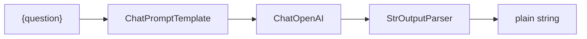
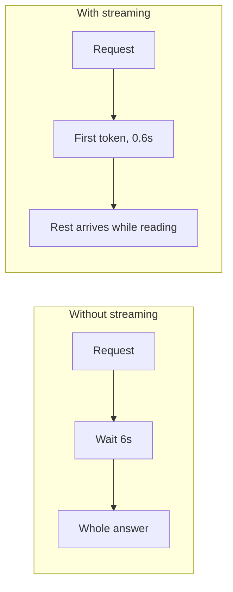
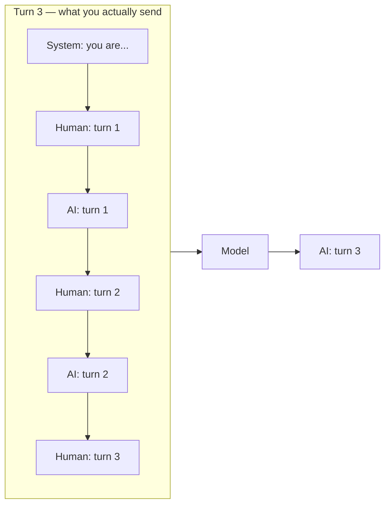
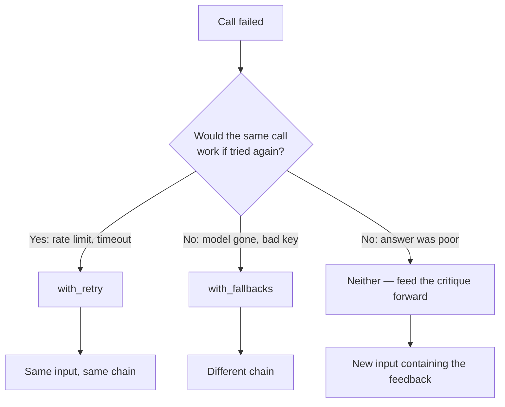
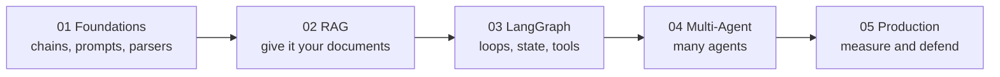

# 🧱 LangChain Foundations — Interview Tutorial

> Built from 10 notebooks in `production-course-main-code-main/01_LangChain_Foundations/` on 2026-09-06.
> Target roles: Applied AI / AI Engineer · Agentic AI Engineer · Forward Deployed Engineer
> Part of a 5-tutorial series — see [Where this fits](#where-this-fits) at the end.

This is the base layer. Everything in the other four tutorials is built out of the
pieces here: a prompt, a model, a parser, and the pipe that joins them.

**LCEL** stands for **LangChain Expression Language**. It is the `|` operator you see
everywhere in LangChain code. `prompt | model | parser` means "run the prompt, feed
the result to the model, feed that to the parser". That's it — the rest is detail.

---

## The one idea: everything is a Runnable

A **Runnable** is anything with an `.invoke()` method. Prompts are Runnables. Models
are Runnables. Parsers are Runnables. When you pipe two Runnables together you get
another Runnable, which is why chains nest without limit.



Because the composed object is itself a Runnable, it gets the same four methods every
Runnable has — and those four methods are most of what an interviewer asks about.

| Method | Takes | Gives back | Use it for |
|---|---|---|---|
| `.invoke(x)` | one input | one output | a single request |
| `.batch([x, y])` | a list | a list | many independent inputs at once |
| `.stream(x)` | one input | a generator of chunks | showing text as it arrives |
| `.astream(x)` | one input | an async generator | the same, without blocking |

```python
# From 01_core_concepts.ipynb
prompt = ChatPromptTemplate.from_template(
    "You are a helpful assistant. Answer in one sentence: {question}"
)
model  = ChatOpenAI(model="gpt-4o-mini", temperature=0.7)
parser = StrOutputParser()

chain = prompt | model | parser          # composition, nothing runs yet
result = chain.invoke({"question": "What is LangChain?"})
```

Nothing executes until `.invoke()`. Building the chain is free; that's what lets you
inspect it, reuse it, and swap parts without re-running anything.

---

## What this covers

| Concept | Source notebook | Interview weight |
|---|---|---|
| LCEL, the pipe, Runnable methods | `01_core_concepts.ipynb` | **High** |
| Model parameters, provider swapping | `02_working_with_llms.ipynb` | Medium |
| Message types: system, human, AI | `03_prompt_messages.ipynb` | Medium |
| Prompt templates, few-shot, partials | `04_prompt_templates_all.ipynb` | **High** |
| Output parsers, Pydantic schemas | `05_output_parsers_demo.ipynb`, `06_output_parsers_final.ipynb` | **High** |
| Chains, branching, fallbacks | `07_chains_v1.ipynb` | **High** |
| Conversation memory | `08_conversation_memory.ipynb` | Medium |
| Tracing with LangSmith | `09_langsmith_setup.ipynb` | **High** |
| A full assistant | `10_smart_bot_section1.ipynb` | Medium |

## Coverage gaps

Missing here, but covered in a sibling tutorial. Follow the link rather than
re-learning it from scratch.

| Gap | Where it lives |
|---|---|
| Retrieval and RAG | [02 RAG & Retrieval](02_rag_and_retrieval_INTERVIEW_TUTORIAL.md) |
| Tool calling and the agent loop | [03 LangGraph Fundamentals](03_langgraph_fundamentals_INTERVIEW_TUTORIAL.md) |
| Durable state and checkpointing | [03 LangGraph Fundamentals](03_langgraph_fundamentals_INTERVIEW_TUTORIAL.md) |
| Multi-agent orchestration | [04 Multi-Agent Systems](04_multi_agent_systems_INTERVIEW_TUTORIAL.md) |
| Evaluation and testing | [05 Production & Operations](05_production_and_operations_INTERVIEW_TUTORIAL.md) |
| **Async** (`ainvoke`, `astream`) | **Nowhere in this repo — build it yourself** |

---

## 1. Core concepts

### 1.1 The pipe is function composition, not magic

**Plain version.** `a | b` builds a new object that runs `a`, takes its output, and
feeds it to `b`. Python's `|` operator is overloaded on Runnables to do exactly that.

**Why it matters in an interview.** People describe LCEL as "LangChain's syntax". It
isn't syntax — it's an object graph you can inspect. That inspectability is the
selling point over hand-rolled function calls.

```python
# From 01_core_concepts.ipynb — a chain describes itself
print(chain.input_schema.model_json_schema())
print(chain.output_schema.model_json_schema())
```

**Say this in an interview.** "The pipe builds a composed Runnable, so the whole chain
has the same interface as its parts. That's what makes it inspectable and swappable —
I can print the input schema, or replace the model without touching anything else."

### 1.2 Batch is not a loop

**Plain version.** `.batch([a, b, c])` sends all three at once. A `for` loop sends
three separate requests and waits for each.

```python
# From 01_core_concepts.ipynb
chain = ChatPromptTemplate.from_template("Translate to French: {text}") | model | parser

results = chain.batch([
    {"text": "Hello, how are you?"},
    {"text": "What is your name?"},
    {"text": "Where is the nearest restaurant?"},
])
```

**The gotcha to volunteer.** Batch runs concurrently, so ordering of *completion* is
not ordering of *results* — but the returned list is in input order regardless. And
there is no automatic rate limiting, so a 500-item batch will hit a provider limit.
Cap it with `config={"max_concurrency": N}`.

**Say this in an interview.** "Batch is one concurrent submission, not a loop. Results
come back in input order. I'd cap concurrency in the run config, because the default
will happily exceed a provider's rate limit."

### 1.3 Streaming is what makes an app feel fast

**Plain version.** A model generates one token at a time. `.stream()` hands you each
piece as it arrives instead of waiting for the whole answer.

```python
# From 01_core_concepts.ipynb
for chunk in chain.stream({"topic": "nature"}):
    print(chunk, end="", flush=True)
```

**Why interviewers care.** Total latency doesn't change at all. What changes is **time
to first token**, which is what a user actually experiences. Any question about a
"real-time" or "sub-second" system is really a question about streaming.



**Say this in an interview.** "Streaming doesn't reduce total latency, it reduces
time to first token, which is the number users feel. It's the first thing I reach for
before any model-level optimisation."

> **Async is the gap.** `.astream()` and `.ainvoke()` are the non-blocking versions,
> and nothing in this repo demonstrates them. Under real concurrency a synchronous
> handler blocks a worker for the whole generation. Know that, and say so.

### 1.4 Three message types, three jobs

**Plain version.** A chat model takes a list of messages, not a string. Each has a role.

- **SystemMessage** — the standing instructions. Who the model is, what rules apply.
- **HumanMessage** — what the user said.
- **AIMessage** — what the model said before. This is how history is represented.

**The mechanism that matters.** Conversation memory is nothing more than replaying
previous Human and AI messages before the new question. There is no hidden state on
the provider's side — you resend the history every time, and you pay for it every time.



Turn 3 pays for turns 1 and 2. Turn 50 pays for 49 of them. That is why windowing or
summarising stops being optional.

```python
# From 03_prompt_messages.ipynb
messages = [
    SystemMessage(content="You are a concise assistant."),
    HumanMessage(content="What is LangChain?"),
    AIMessage(content="A framework for building LLM applications."),
    HumanMessage(content="Who created it?"),      # "it" resolves via history
]
```

**Say this in an interview.** "Memory is just replaying prior messages in the next
request. The model is stateless, so history is a cost that grows every turn — which is
why windowing or summarising isn't optional past a certain length."

### 1.5 Output parsers turn text into things your code can use

**Plain version.** A model returns text. Your code wants a number, a list, or an
object. A parser bridges that.

`StrOutputParser` just extracts the text from an `AIMessage`. The interesting one is
Pydantic-backed structured output, where you define a schema and get back a typed
object.

```python
# From 06_output_parsers_final.ipynb style
class Analysis(BaseModel):
    sentiment: str = Field(description="positive, negative, or neutral")
    confidence: float = Field(description="0.0 to 1.0")
    key_points: List[str] = Field(description="main points from the text")

structured_llm = model.with_structured_output(Analysis)
result = structured_llm.invoke("The product arrived late but works well.")

result.sentiment       # a real attribute, not a substring you fished out
```

**Why `with_structured_output` beats parsing prose.** It uses the provider's tool
calling or JSON mode to constrain generation, so the model is far less able to produce
something unparseable. A regex over free text is a bug you chose to write.

**Say this in an interview.** "If code consumes the output, constrain the schema.
`with_structured_output` pushes the constraint into decoding rather than hoping a
regex holds. It still fails sometimes, so I validate and have a retry path."

### 1.6 Fallbacks and retries are one line each

**Plain version.** Models fail — rate limits, timeouts, overload. Two built-ins handle
most of it.

```python
# From 07_chains_v1.ipynb style
robust = (
    chain
    .with_retry(stop_after_attempt=3)               # same chain, try again
    .with_fallbacks([cheaper_chain])                # different chain, on failure
)
```

**The distinction interviewers probe.** `with_retry` runs the *same* thing again,
which fixes transient failures. `with_fallbacks` runs a *different* thing, which fixes
the case where the first option is simply unavailable. Retrying a request that fails
because the model is deprecated will fail three times and then still fail.



The third branch is the one candidates miss. Retry is blind: it carries no memory of
why the last attempt failed, so it cannot fix a quality problem, only a flaky one.

**Say this in an interview.** "Retry for transient failures, fallback for structural
ones. And retry is blind — it carries no memory of why the last attempt failed, so it
can't fix a quality problem, only a flaky one."

### 1.7 Tracing is how you debug anything non-trivial

**Plain version.** LangSmith records every step of a chain — inputs, outputs, latency,
tokens, cost. You turn it on with environment variables and it captures automatically.

```python
# From 09_langsmith_setup.ipynb
# In .env:
#   LANGSMITH_TRACING=true
#   LANGSMITH_API_KEY=...
#   LANGSMITH_PROJECT=my-project

from langsmith import traceable

@traceable(name="custom_step")
def my_step(x):
    return transform(x)
```

**Why this is a high-weight topic.** Every production question eventually becomes
"how would you find out?". Without traces the answer is guesswork. `@traceable` is how
you get your own non-LangChain functions into the same timeline.

**Say this in an interview.** "Tracing is environment-variable-driven, so it captures
chains automatically, and `@traceable` pulls my own functions into the same trace. The
field I care about most is the actual prompt sent, because that's where most bugs turn
out to live."

---

## 2. Gotchas

### **`temperature=0` is not deterministic**
- **Symptom**: the same prompt returns slightly different text across runs even at zero.
- **Cause**: temperature 0 makes sampling greedy, but floating-point non-determinism in
  batched GPU inference, model version changes behind an alias, and provider-side
  routing all still vary.
- **Fix**: treat `temperature=0` as "low variance", not "reproducible". If you need
  reproducibility for tests, snapshot the output and assert on properties rather than
  exact strings.
- **Interview angle**: "Your test asserts exact model output and fails randomly. Why?"

### **A prompt template silently swallows missing variables at build time**
- **Symptom**: `KeyError` at invoke time, far from the line that caused it.
- **Cause**: `from_template` records placeholders but doesn't validate you'll supply
  them until you actually run.
- **Fix**: check `prompt.input_variables` in a test, or use `.partial()` to bind the
  values you already know so the remaining surface is small.
- **Interview angle**: "How do you catch prompt bugs before production?"

### **`StrOutputParser` hides tool calls**
- **Symptom**: you add tools to a model, pipe through `StrOutputParser`, and the tool
  calls vanish — you get an empty string.
- **Cause**: when a model decides to call a tool, the text content is empty and the
  payload is in `.tool_calls`. The string parser reads `.content` and finds nothing.
- **Fix**: don't put `StrOutputParser` after a tool-bound model. Inspect the
  `AIMessage` directly. See [03 LangGraph](03_langgraph_fundamentals_INTERVIEW_TUTORIAL.md).
- **Interview angle**: "Your agent returns empty strings. Where would you look?"

### **Conversation history grows without bound**
- **Symptom**: cost per turn climbs steadily, then requests start failing on context length.
- **Cause**: history is resent every turn. Turn 50 pays for turns 1 through 49.
- **Fix**: window (keep the last N), summarise (compress the prefix), or both. Pin
  user-stated constraints outside the transcript so they can't be trimmed away.
- **Interview angle**: "Your chatbot gets more expensive the longer people use it. Why?"

### **`with_retry` retries blind**
- **Symptom**: three attempts, three identical bad answers, three times the cost.
- **Cause**: retry re-runs the same input. It has no memory of the previous failure, so
  a quality problem reproduces exactly.
- **Fix**: retry only for transient errors, and pass the exception type explicitly with
  `retry_if_exception_type`. For quality, feed the critique forward instead — see the
  evaluator-optimizer pattern.
- **Interview angle**: "When is a retry the wrong tool?"

### **Batch has no default concurrency limit**
- **Symptom**: a large `.batch()` triggers 429 rate-limit errors.
- **Cause**: batch submits everything to a thread pool at once.
- **Fix**: `chain.batch(inputs, config={"max_concurrency": 5})`. Also consider
  `return_exceptions=True` so one failure doesn't discard every successful result.
- **Interview angle**: "You batch 1000 documents and get rate limited. Two fixes?"

### **Tracing sends your prompts to a third party**
- **Symptom**: a security review blocks your deployment.
- **Cause**: `LANGSMITH_TRACING=true` ships inputs and outputs — including customer
  data — to an external service.
- **Fix**: know this before a customer asks. Self-hosted LangSmith, or a local tracer,
  or field-level redaction before the trace. Never discover it in the review.
- **Interview angle**: "Your customer is in healthcare. What breaks about your
  observability stack?"

---

## 3. Tradeoffs

### Chain versus graph
| Option | Costs you | Buys you | Pick when |
|---|---|---|---|
| LCEL chain | No cycles, no durable state | Simple, inspectable, fast to write | The path is fixed and known |
| LangGraph | More concepts, more code | Cycles, checkpoints, interrupts | You need to loop, pause, or resume |

**The one-liner**: "LCEL is acyclic — the moment I need a loop, a pause, or a resume, I
need a graph."

### Streaming versus buffering
| Option | Costs you | Buys you | Pick when |
|---|---|---|---|
| Stream | Harder error handling mid-response | Fast perceived response | A human is watching output appear |
| Buffer | Feels slow on long answers | Simple; you can validate before showing | Output must be checked before display |

**The one-liner**: "Stream when a human is reading it, buffer when code has to validate
it first — you can't un-show a token you already streamed."

### Structured output versus free text
| Option | Costs you | Buys you | Pick when |
|---|---|---|---|
| `with_structured_output` | Schema upkeep; occasional validation errors | Typed fields, constrained decoding | Code consumes the answer |
| Free text + parser | Fragile, breaks on format drift | Nothing much, honestly | The output is read by a human only |

**The one-liner**: "Constrained decoding beats hopeful parsing — if my code branches on
it, it gets a schema."

### One big prompt versus a chain of small ones
| Option | Costs you | Buys you | Pick when |
|---|---|---|---|
| One prompt | Hard to debug, all-or-nothing quality | One call, lowest latency and cost | The task is genuinely single-step |
| Chained prompts | N calls, N times the latency | Each step checkable and fixable | Quality matters more than latency |

**The one-liner**: "Chain when I need a checkpoint between steps — otherwise I'm paying
N times for the privilege of more moving parts."

---

## 4. Top 10 interview questions

Web-sourced 2026-09-06, focused on the foundations layer.

### 1. What does `prompt | model | parser` actually build?
A composed Runnable. Each part implements the same interface, so piping produces
another object with `invoke`, `batch`, `stream` and `astream`. Nothing executes at
composition time. That laziness is what makes the chain inspectable — you can print its
input and output schemas before running it, and swap the model without touching the
prompt.
[Source](https://myengineeringpath.dev/genai-engineer/llm-interview-questions/)

### 2. When would you not use LangChain at all?
When the task is one model call with one prompt. The abstraction earns its place when
you have composition, provider swapping, structured output, retries, or tracing. For a
single call to one provider, the raw SDK is less indirection and easier to debug. Say
this out loud — interviewers use it to check you can criticise your own tools.
[Source](https://www.datacamp.com/blog/llm-interview-questions)

### 3. How do you get reliable JSON out of a model?
`with_structured_output` with a Pydantic schema, which routes through the provider's
tool-calling or JSON mode so the constraint applies during decoding rather than after.
Then validate anyway and have a retry path, because constrained decoding reduces
failures rather than eliminating them. Parsing free text with a regex is the answer
that loses the point.
[Source](https://www.datacamp.com/blog/llm-interview-questions)

### 4. Explain the difference between `stream` and `astream`.
Both yield chunks as they are generated. `stream` is synchronous and blocks the calling
thread for the whole generation. `astream` is a coroutine and releases the event loop
between chunks, so one process can serve many concurrent users. For a web service the
async form is the one that matters, because the sync form ties up a worker per request.
[Source](https://myengineeringpath.dev/genai-engineer/llm-interview-questions/)

### 5. How does conversation memory actually work?
There is no server-side session. You resend prior Human and AI messages with every
request. That means memory is a cost that grows linearly with conversation length, and
eventually hits the context limit. The engineering content is the policy: window,
summarise, or store facts separately from the transcript.
[Source](https://myengineeringpath.dev/genai-engineer/llm-interview-questions/)

### 6. Your chain works locally and fails in production. How do you find out why?
Traces. Turn on LangSmith and compare a working run to a failing one step by step. The
field that resolves most of these is the fully-rendered prompt, because the difference
is usually an input you didn't expect — a longer document, a different locale, a null
where you assumed a string. Instrument first, theorise second.
[Source](https://createif-labs.de/en/journal/llmops-llm-betrieb)

### 7. What is the difference between a retry and a fallback?
Retry runs the same thing again, which fixes transient failures like rate limits and
timeouts. Fallback runs something different, which fixes structural failures like a
model being unavailable or deprecated. Retrying a structural failure just fails N
times more slowly. Both are one line in LCEL, and knowing which to reach for is the
actual question.
[Source](https://www.datacamp.com/blog/llm-interview-questions)

### 8. How do you control cost at this layer?
Four levers before you touch architecture. Cap output length, because output tokens
usually cost several times input tokens. Route easy queries to a cheaper model. Cache
repeated calls. Trim the prompt and any retrieved context. Then measure per-request
token usage so you can tell which lever actually moved.
[Source](https://createif-labs.de/en/journal/llmops-llm-betrieb)

### 9. How do you test something whose output is non-deterministic?
Assert on properties, not exact strings. Does it parse into the schema? Does it contain
the required field? Is it under the length limit? Does it refuse when it should? For
quality, use a frozen eval set and a judge, and validate the judge against human labels.
Exact-match assertions on model output produce flaky tests and get deleted.
[Source](https://medium.com/@santosh.rout.cr7/llm-engineering-interviews-how-to-prepare-for-prompting-fine-tuning-and-evaluation-df888e76340e)

### 10. What are the risks of turning on tracing?
Traces contain your prompts and completions, which means customer data leaves your
network. For a regulated customer that is a blocker, not a detail. Options are
self-hosted collection, redaction before the trace, or sampling with sensitive fields
stripped. The wrong answer is discovering this during their security review.
[Source](https://createif-labs.de/en/journal/llmops-llm-betrieb)

---

## 5. Role tracks

### 5.1 Applied AI / AI Engineer
1. **How do you pick temperature?** Low for extraction and classification where you
   want one right answer; higher for generation where variety helps. And say that zero
   is low-variance, not reproducible.
2. **Few-shot or fine-tune?** Few-shot first — no training loop, instant iteration.
   Fine-tune when the examples stop fitting in context or when you need consistent
   format at scale.
3. **How do you measure a prompt change?** Frozen eval set, property assertions, and a
   judge for quality. Detail in [05 Production](05_production_and_operations_INTERVIEW_TUTORIAL.md).
4. **Which parser for which job?** `StrOutputParser` when a human reads it, Pydantic
   structured output when code does. Never a regex over prose.
5. **How do you cut token cost without hurting quality?** Cap output length first,
   because output is the expensive half. Then trim the system prompt, then route by
   difficulty. Measure after each.
6. **Provider swap — what breaks?** Tool-calling formats, structured-output support,
   token limits, and stop-sequence behaviour. `init_chat_model` abstracts construction,
   not capability differences.

### 5.2 Agentic AI Engineer
1. **Why isn't a chain an agent?** The chain's path is decided by code. An agent's path
   is decided by the model at run time. See [03 LangGraph](03_langgraph_fundamentals_INTERVIEW_TUTORIAL.md).
2. **What breaks when you add tools to a chain?** `StrOutputParser` returns empty
   because content is empty and the payload is in `tool_calls`. You also now need a
   loop, which LCEL cannot express.
3. **How would you add a cycle to an LCEL chain?** You can't. `a | b | a` runs `a`
   twice. Cycles need a Python loop or a graph.
4. **Where does message history live in an agent?** In state, not in the chain. That's
   the transition point from LCEL to LangGraph.
5. **What does `@traceable` give you in an agent?** Your own functions in the same
   timeline as the framework's steps, which is the difference between a partial trace
   and a debuggable one.
6. **Streaming from an agent — what's different?** You're streaming a sequence of
   steps, not one completion, so you need `stream_mode` to say whether you want tokens,
   state updates, or both.

### 5.3 Forward Deployed Engineer
1. **Customer wants a chatbot over their FAQs by Friday.** LCEL chain plus their FAQ in
   the prompt if it fits. Retrieval only if it doesn't. Ship the simple thing, measure,
   then add machinery.
2. **They can't use OpenAI.** `init_chat_model` swaps the provider string, but verify
   tool calling and structured output separately — those are where providers actually
   differ.
3. **Their security team asks where prompts go.** Know your tracing configuration
   before the meeting. Prompts and completions leave your network when tracing is on.
4. **The bill tripled.** Check conversation length first. History resent every turn is
   the most common cause, and windowing is a one-line fix.
5. **"Can you guarantee it never says X?"** No, and say so plainly. Then describe the
   layers: system prompt, output validation, and a blocklist check in code, in
   increasing order of actual enforceability.
6. **Demo works, their data breaks it.** Print the fully-rendered prompt for a failing
   case. Their inputs are longer, messier, or in a different language than your sample.

---

## 6. Self-check

1. What does `|` actually return? *A composed Runnable with the same interface.*
2. When does a chain execute? *On `.invoke()`. Composition is lazy.*
3. `.batch()` vs a for loop? *Concurrent submission vs sequential; results stay in input order.*
4. Does streaming reduce total latency? *No. It reduces time to first token.*
5. Where does conversation history live? *In your request. The model is stateless.*
6. Why does `StrOutputParser` break tool calling? *Content is empty; the payload is in `tool_calls`.*
7. Retry or fallback for a deprecated model? *Fallback. Retry repeats the same failure.*
8. Is `temperature=0` reproducible? *Low-variance, not deterministic.*
9. What does `@traceable` add? *Your own functions into the framework's trace timeline.*
10. Cheapest lever on token cost? *Cap output length — output tokens cost more.*

---

## Where this fits

This is tutorial **1 of 5**. The series follows the order you'd actually build in.



| Tutorial | What it adds on top of this one |
|---|---|
| [02 RAG & Retrieval](02_rag_and_retrieval_INTERVIEW_TUTORIAL.md) | Your own documents as the model's knowledge |
| [03 LangGraph Fundamentals](03_langgraph_fundamentals_INTERVIEW_TUTORIAL.md) | Cycles, durable state, tools, human approval |
| [04 Multi-Agent Systems](04_multi_agent_systems_INTERVIEW_TUTORIAL.md) | Several agents coordinating |
| [05 Production & Operations](05_production_and_operations_INTERVIEW_TUTORIAL.md) | Cost, monitoring, security, testing |

**The one topic missing from all five folders is async.** No `ainvoke`, no `astream`,
no `async def` anywhere in the repo. Every "how does this handle concurrency" question
lands on that gap, so build a small async example yourself before interviewing.
