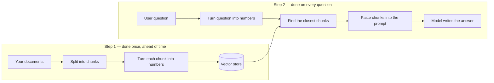
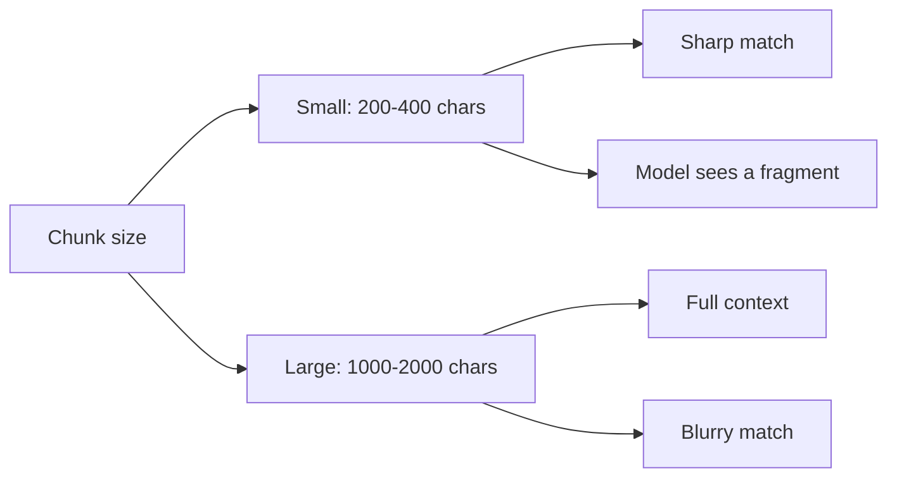
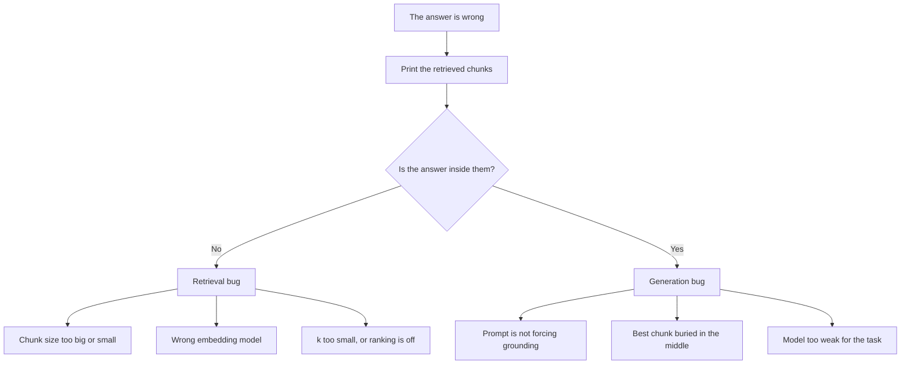
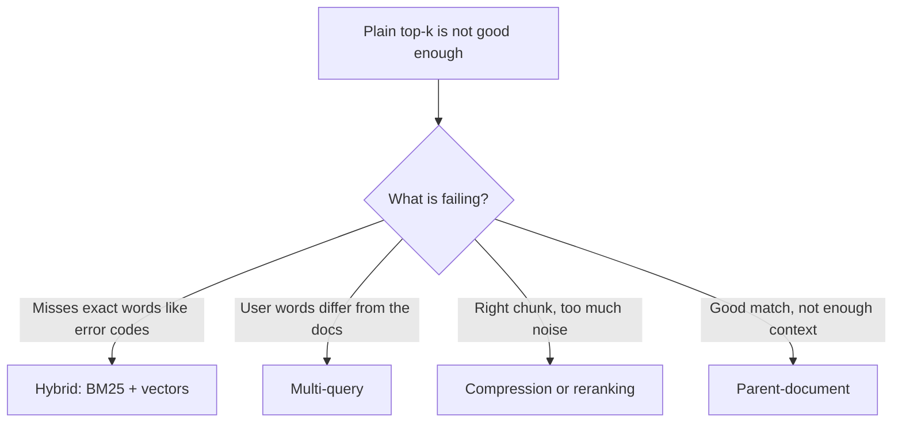
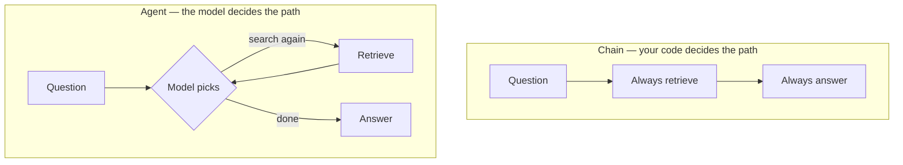
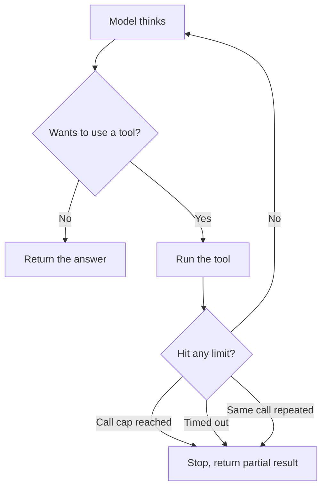
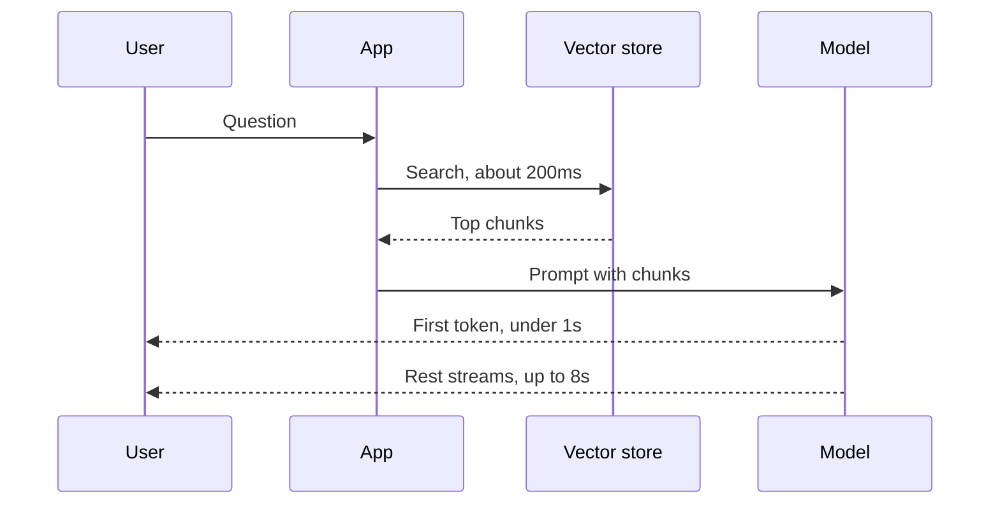
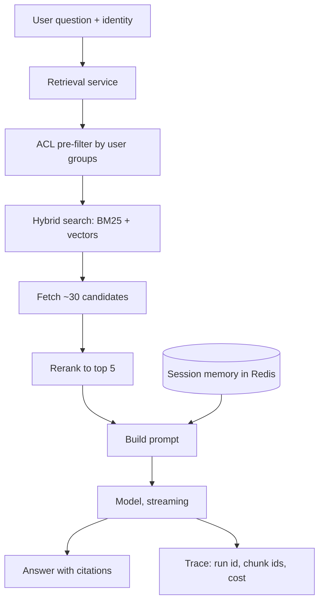
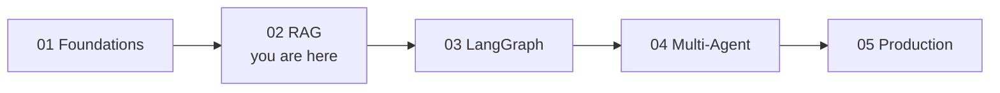

# 🎯 RAG & Retrieval — Interview Tutorial

> Built from 8 notebooks in `production-course-main-code-main/02_RAG_and_Retrieval/` on 2026-09-06.
> Target roles: Applied AI / AI Engineer · Agentic AI Engineer · Forward Deployed Engineer
> Section 5 was web-sourced live on the build date; every question there carries a source link.

**RAG** stands for **Retrieval-Augmented Generation**. It means: before you ask a
language model a question, you go find the relevant documents and paste them into the
prompt. The model then answers from those documents instead of from memory.

That is the whole idea. Everything below is about doing it well.

This folder teaches **retrieval**. It does not teach agents. That shapes your prep:
retrieval is your strong ground, and everything that happens *after* retrieval in an
agentic system is your exposure. Both are covered here, and the gaps are labelled so
you never claim to have built something you haven't.

---

## The whole pipeline in one picture

Read this once and the rest of the tutorial has somewhere to attach.



The top row happens once when you load your documents. The bottom row happens every
time someone asks something. Almost every bug lives in one specific box, which is why
naming the boxes matters.

---

## Words you need first

| Word | What it means |
|---|---|
| **Embedding** | A list of numbers that stands for a piece of text. Similar meanings give similar numbers. |
| **Chunk** | A small piece of a document. You split documents because whole documents are too big to search well. |
| **Vector store** | A database built to search lists of numbers fast. Chroma, FAISS and Pinecone are examples. |
| **Retriever** | The thing that takes a question and hands back the most relevant chunks. |
| **Top-k** | How many chunks you fetch. `k=3` means "give me the best 3". |
| **Cosine similarity** | A score from -1 to 1 saying how close two embeddings are in meaning. Higher is closer. |
| **BM25** | An older keyword-matching algorithm. It finds exact words, which embeddings are bad at. |
| **Reranker** | A second, smarter model that reorders your top chunks so the best one is first. |
| **recall@k** | Out of all the questions you tested, how often was the correct chunk in the top k? |
| **p95 latency** | 95% of requests finish faster than this. The number users actually feel. |
| **ACL** | Access Control List. The rules for which user is allowed to see which document. |

---

## What this covers

| Concept | Source notebook | Interview weight |
|---|---|---|
| Loading documents from files, the web, folders | `01_document_loaders.ipynb` | Low |
| Splitting documents into chunks | `02_text_splitters.ipynb` | **High** |
| Choosing an embedding model | `03_embeddings.ipynb` | Medium |
| Vectors, similarity, caching | `04_embeddings_deep.ipynb` | **High** |
| Vector stores, filtering, saving to disk | `05_vector_stores.ipynb` | **High** |
| Building the full RAG chain | `06_rag_pipeline.ipynb` | **High** |
| Better retrieval: hybrid, multi-query, compression | `07_advanced_rag.ipynb` | **High** |
| Multi-turn assistant with memory | `08_research_assistant.ipynb` | Medium |

## Coverage gaps

Topics an interviewer will ask about that this folder never shows. Each is taught
below and marked `(not in your notebooks — build this)`. Learn them. Don't claim
you've shipped them.

| Gap | Why it still gets asked | Where it lives in this series |
|---|---|---|
| **Evaluation** | The most-asked Applied AI topic. Nothing here measures quality. | [05 Production](05_production_and_operations_INTERVIEW_TUTORIAL.md) |
| **Agents & tool calling** | Every agentic role assumes it. Your retrieval is a chain, not an agent. | [03 LangGraph](03_langgraph_fundamentals_INTERVIEW_TUTORIAL.md) |
| **Retries & fallbacks** | `06` has a prompt that says "I don't know", which is not retry logic. | [03 LangGraph](03_langgraph_fundamentals_INTERVIEW_TUTORIAL.md) |
| **Observability** | "LangSmith" appears only inside a sample document in `06`. Nothing is traced. | [01 Foundations](01_langchain_foundations_INTERVIEW_TUTORIAL.md), [05 Production](05_production_and_operations_INTERVIEW_TUTORIAL.md) |
| **Human-in-the-loop** | No approval steps, no pausing. | [03 LangGraph](03_langgraph_fundamentals_INTERVIEW_TUTORIAL.md) |
| **Multi-agent** | No supervisor, no handoff. | [04 Multi-Agent](04_multi_agent_systems_INTERVIEW_TUTORIAL.md) |
| **Streaming** | You cannot answer a "real-time" question without it. | [01 Foundations](01_langchain_foundations_INTERVIEW_TUTORIAL.md) |
| **Async** | Concurrency questions land here. | **Nowhere in this repo — build it yourself** |

> **A note on the automated scan.** The inventory script said memory was missing and
> observability was present. Reading the actual code reversed both.
> `08_research_assistant.ipynb` really does implement conversation memory, so memory
> **is** covered. Observability is **not**.

---

## 1. Core concepts

Eleven ideas. Everything else in this tutorial rests on them.

### 1.1 An embedding is just a list of numbers

**Plain version.** You cannot do maths on the word "dog". So you convert text into a
list of numbers — 1536 of them for OpenAI's `text-embedding-3-small`. Text that means
similar things gets similar numbers. Now "how close in meaning?" becomes arithmetic.

**The mechanism.** OpenAI scales every embedding so its length is 1. Imagine every
piece of text as an arrow of the same length, all starting from the centre of a
sphere. Only the *direction* differs. So closeness is the angle between two arrows,
not the distance between their tips.

That has a practical payoff: when all arrows are the same length, cosine similarity
and the dot product give the same answer, and the dot product is cheaper.

```python
# From 04_embeddings_deep.ipynb
single = embeddings_model.embed_query("What is Machine Learning?")

print(len(single))                      # 1536 numbers
print(np.linalg.norm(single))           # 1.0002  <- length is always ~1
```

The `norm` line is the one to notice. It prints ≈ 1.0 no matter what text you pass.
That is the "all arrows the same length" fact, made visible.

```python
# The whole of similarity search, by hand — also from 04_embeddings_deep.ipynb
def cosine_similarity(v1, v2):
    return np.dot(v1, v2) / (np.linalg.norm(v1) * np.linalg.norm(v2))

doc_vectors  = embeddings_model.embed_documents(docs)
query_vector = embeddings_model.embed_query("What programming languages exist?")

scores = [cosine_similarity(query_vector, dv) for dv in doc_vectors]
ranked = sorted(zip(docs, scores), key=lambda pair: pair[1], reverse=True)
```

When this ran, it scored `0.4427` for "Python is a programming language" and `0.1144`
for "Cats are popular pets". That gap is the entire mechanism working.

**Say this in an interview.** "An embedding is a direction, not a position. OpenAI
normalises them to length 1, so similarity is an angle and the dot product works. I've
written the ranking loop by hand — embed, score, sort. A vector store is that same
loop plus an index so it stays fast on millions of documents."

### 1.2 Two embedding methods, and they are not interchangeable

**Plain version.** There are two calls. `embed_query` takes **one** string, for the
question. `embed_documents` takes a **list**, for your documents. Use the list one for
documents — it sends everything in a single request instead of one request per item.

**The mechanism.** Beyond speed, some providers train the two sides differently — a
question and a document that mean the same thing are deliberately embedded a little
differently. Use the wrong method and nothing errors. The shapes still match. The
rankings just quietly get worse, which is the hardest kind of bug to find.

```python
# One question -> one vector
q_vec  = embeddings_model.embed_query("What is Machine Learning?")

# Three documents -> three vectors, ONE network request
d_vecs = embeddings_model.embed_documents([
    "What is Machine Learning?",
    "Explain overfitting in ML.",
    "How does a neural network work?",
])
```

**Say this in an interview.** "Never loop `embed_query` over a corpus. It's N round
trips instead of one, and on models with asymmetric training it's also the wrong
vector space for the document side — no error, just worse results."

### 1.3 Chunk size is a dial, not a setting

**Plain version.** You split documents before embedding them. How big should the pieces
be? There is no right answer, only a trade.

Small pieces are about one idea each, so they match a question sharply — but the model
only sees a fragment. Big pieces carry full context — but the embedding has to
represent several ideas at once, so it lands somewhere in the middle and matches
nothing precisely.



**Overlap** is why you repeat a bit of text at each boundary. If a fact sits exactly
where you cut, overlap means it survives whole in at least one chunk.

```python
# From 02_text_splitters.ipynb / 08_research_assistant.ipynb
splitter = RecursiveCharacterTextSplitter(
    chunk_size=1000,
    chunk_overlap=200,                          # 20% of chunk_size
    separators=["\n\n", "\n", ". ", " ", ""],   # try paragraph, then line, then sentence
)
chunks = splitter.split_documents(documents)
```

The `separators` list is the clever part. It tries to break at a paragraph first, then
a line, then a sentence, and only cuts mid-word if it has no choice. Your notebooks
also split by structure where structure exists — `MarkdownHeaderTextSplitter` for
docs, `from_language` for code.

**Say this in an interview.** "Chunk size trades recall against precision, so I measure
it rather than accept a default. Where a document has structure, splitting on that
structure beats any fixed size — a markdown section stays whole instead of being cut
mid-argument."

### 1.4 When the answer is wrong, there are exactly two suspects

**Plain version.** A RAG answer can be wrong for one of two reasons. Either you fetched
the wrong documents, or you fetched the right ones and the model ignored them. These
are different bugs with different fixes, and one check tells you which you have.

**The check**: print the chunks that came back and read them. Was the answer in there?



```python
# From 08_research_assistant.ipynb — see exactly what the model was given
docs = retriever.invoke(question)
for i, doc in enumerate(docs):
    print(f"Chunk {i+1} [{doc.metadata.get('source')}] {len(doc.page_content)} chars")
    print(doc.page_content[:150])
```

**Say this in an interview.** "First thing I ask is whether the answer was even in the
retrieved context. That single check halves the search space. I built a harness that
dumps the retrieved chunks and their sizes so I can see what the model actually saw."

### 1.5 Telling the model to stay grounded is a request, not a rule

**Plain version.** You can write "only answer from the context below, otherwise say you
don't know". It genuinely helps. It does not always work, because you are asking a
probabilistic system nicely, not enforcing a constraint.

```python
# From 06_rag_pipeline.ipynb
prompt = ChatPromptTemplate.from_template("""
Answer the question based ONLY on the following context.
If the answer is not in the context, respond with:
"I don't have information about that in my knowledge base."

Context:
{context}

Question: {question}
""")
```

That notebook tests it honestly — it asks about LangSmith pricing (in the documents)
and about OpenAI's stock price (not in the documents), and checks the second one
refuses.

**The mechanism.** Real enforcement has to sit outside the model. After it answers,
check that every source it cited actually exists in what you retrieved. A citation to
nothing is a failed generation, and you can detect that in code.

**Say this in an interview.** "Prompt-level grounding is a contract the model usually
honours, not always. In production I verify the cited sources exist in the retrieved
set, and treat a citation to nothing as a failure rather than trusting the text."

### 1.6 Metadata filtering is how you do security

**Plain version.** Each chunk can carry labels — which file it came from, which team
owns it, which customer it belongs to. You can tell the search "only look at chunks
where `topic` is `database`". That filter runs **before** the search, not after.

**Why before matters.** If you search first and filter after, you asked for 3 results
and might end up with 1, or 0. Filtering first means the 3 you get are 3 that already
passed the rule.

```python
# From 05_vector_stores.ipynb
results = vectorstore.similarity_search(
    "What databases are available?",
    k=5,
    filter={"topic": "database"},     # applied BEFORE the search runs
)
```

**Why this is the security answer.** Swap `topic` for `tenant_id` or `acl_group` and
this is what stops one customer's documents appearing in another customer's answer.
It is enforced in code, so it either ran or it didn't. Putting "do not show documents
from other customers" in the prompt is not access control, because you cannot prove it
held.

**Say this in an interview.** "Metadata filters are pre-filters, which matters for
getting a full k and matters more for tenancy. Access control belongs in the filter,
never in the prompt — a prompt instruction is unprovable."

### 1.7 Conversation memory is state you have to own

**Plain version.** For follow-up questions like "how does the second one work?" to make
sense, the system needs to remember what was already said. That memory is not
automatic. You store it, you decide how much to keep, and you pass it back in.

```python
# From 08_research_assistant.ipynb
self.session_store: Dict[str, InMemoryChatMessageHistory] = {}

def _get_session_history(self, session_id: str):
    if session_id not in self.session_store:
        self.session_store[session_id] = InMemoryChatMessageHistory()
    return self.session_store[session_id]

# ...then the last 10 messages get injected into the prompt
prompt = ChatPromptTemplate.from_messages([
    ("system", "You are an AI Research Assistant..."),
    MessagesPlaceholder(variable_name="history"),   # <- memory slot
    ("human", "Context: {context}\n\nQuestion: {question}"),
])
response = chain.invoke({..., "history": history.messages[-10:]})
```

**Two things to notice**, because both are interview material. `session_store` is a
plain Python dictionary living in one process — restart the app and it's gone. And
`[-10:]` **throws away** older messages rather than summarising them, so a constraint
the user set 12 messages ago silently disappears.

**Say this in an interview.** "I built session-scoped memory keyed by session ID with a
10-message window. Two things I'd fix for production: in-process storage only works
with one worker, and a slice is truncation, not summarisation."

### 1.8 Four ways to make retrieval better

**Plain version.** When plain top-k search isn't good enough, there are four standard
upgrades. Pick by what is actually failing.



- **Hybrid** runs a keyword search and a vector search, then blends the scores.
  Embeddings are bad at exact tokens; BM25 is excellent at them.
- **Multi-query** asks the model to rewrite the question several ways, searches with
  each, and pools the results.
- **Compression** runs a model over each retrieved chunk to pull out only the relevant
  sentences.
- **Parent-document** searches over small chunks but returns the bigger parent
  document they came from.

```python
# Hybrid search, from 07_advanced_rag.ipynb
bm25 = BM25Retriever.from_documents(TECH_DOCS)     # keyword side
bm25.k = 3
semantic = vectorstore.as_retriever(search_kwargs={"k": 3})   # vector side

ensemble = EnsembleRetriever(
    retrievers=[bm25, semantic],
    weights=[0.4, 0.6],        # 40% keyword, 60% semantic
)
```

Those weights are the tuning knob. More keyword weight when users search identifiers,
more semantic weight when they ask conceptual questions.

**Say this in an interview.** "I've built all four. I'd reach for hybrid first because
it's cheap and fixes the most common failure, exact terms. Compression I'd leave last
— it costs one model call per retrieved chunk."

### 1.9 Caching embeddings saves real money

**Plain version.** Embedding the same text twice costs twice and returns the same
numbers. A cache checks a store first, so only genuinely new text reaches the API.

```python
# From 04_embeddings_deep.ipynb
cached = CacheBackedEmbeddings.from_bytes_store(
    underlying_embeddings=embeddings_model,   # only called on a cache miss
    document_embedding_cache=LocalFileStore(root_path=tempdir),
    namespace="exercise",                     # keeps models from colliding
    key_encoder="sha256",                     # default "sha1" prints a warning
)
```

**The line that matters is `namespace`.** The cache key is a hash of the *text*. Two
different embedding models given the same text produce the same key. Without a
namespace they overwrite each other, and you silently get vectors from the wrong
model — no error, just bad results.

**Say this in an interview.** "Re-embedding unchanged documents is pure waste. The part
people forget is the namespace — get it wrong and it's a silent correctness bug, not a
crash."

### 1.10 Evaluation `(not in your notebooks — build this)`

**Plain version.** How do you know a change made things better? You need a set of
questions where you already know the right answer, and a number that goes up or down.
Without it, "the answers look better to me" is all you have, and that is not
convincing in an interview.

**Measure the two halves separately**, because they fail separately.

- **Retrieval**: write questions, label which chunk should be found. Measure
  **recall@k** (how often the right chunk was in the top k) and **MRR** (Mean
  Reciprocal Rank — how *high* it ranked). No language model needed, so it's cheap
  enough to run on every change.
- **Generation**: given the chunks and the answer, score **faithfulness** (is every
  claim actually supported by the chunks?) and **relevance** (does it answer the
  question?). These usually need a model as judge, and that judge needs checking
  against human labels before you trust it.

```python
# What you would write — this does not exist in your notebooks yet
EVAL_SET = [
    {"q": "Who created LangChain?",      "chunk_id": "kb_intro_0"},
    {"q": "What does LangGraph add?",    "chunk_id": "kb_langgraph_0"},
]

def recall_at_k(retriever, eval_set, k=5):
    hits = 0
    for row in eval_set:
        got = retriever.invoke(row["q"])[:k]
        if any(d.metadata["chunk_id"] == row["chunk_id"] for d in got):
            hits += 1
    return hits / len(eval_set)
```

**Say this in an interview.** "There's no eval harness in this project and that's the
first thing I'd add. Fifty hand-labelled question-to-chunk pairs, recall@k first
because it's free and catches most regressions, faithfulness on top of that. Without
it I can't defend a claim that a change helped."

### 1.11 Chains versus agents `(not in your notebooks — build this)`

**Plain version.** What you built is a **chain**: retrieval always runs, once, because
your code says so. An **agent** is different — the model decides what to do next, and
can choose to search zero times, once, or five times.



**Why this matters so much.** In the chain, the path is fixed, so you always know what
will happen and how much it costs. In the agent, the loop has no guaranteed end. Every
hard problem in agentic engineering — termination, runaway cost, containment — comes
from that arrow looping back.

**Say this in an interview.** "What I built is a chain. Retrieval always runs once
because my code says so. An agent would decide whether to retrieve at all, possibly
several times. That's more capable and strictly harder to bound, which is why I'd keep
the chain unless the task really needs the model to choose."

---

## 2. Gotchas

Things that are true, surprising, and expensive. Most are live in your notebooks now.

### **Chroma gives you distance, not similarity**
- **Symptom**: your "similarity score" gets *worse* for better matches, and goes above 1.0.
- **Cause**: `similarity_search_with_score` returns **distance** — how far apart, where
  lower is better. Cosine similarity is the opposite, where higher is better.
- **Fix**: convert it, as `05_vector_stores.ipynb` does with `1 / (1 + score)`, or
  configure the collection to use cosine. Never show a raw distance to a user as a
  confidence score.
- **Interview angle**: "Your relevance scores are above 1.0. What's going on?"

### **In-process memory dies on restart and breaks with two workers**
- **Symptom**: conversations reset after every deploy, and under load users randomly
  lose their history.
- **Cause**: `08_research_assistant.ipynb` keeps history in a plain dict on one Python
  object. A second worker process has its own separate dict.
- **Fix**: move history to Redis or Postgres, keyed by session ID. Sticky sessions are
  a patch, not a fix — they still lose everything on restart.
- **Interview angle**: "You scaled to three replicas and users say the bot forgot them. Why?"

### **`[-10:]` throws messages away, it does not summarise them**
- **Symptom**: in a long chat the assistant forgets a rule the user set early on, while
  still sounding perfectly coherent.
- **Cause**: slicing the last 10 messages drops everything older. Nothing carries forward.
- **Fix**: summarise the dropped part into a running note, or store constraints
  separately so they can't be truncated away.
- **Interview angle**: "How do you handle a conversation longer than the context window?"

### **The expensive retriever is on by default**
- **Symptom**: latency and cost are several times the simple baseline, even for trivial
  questions.
- **Cause**: `AIResearchAssistant.ask()` defaults to `use_advanced=True`, which routes
  through `MultiQueryRetriever` — one extra model call plus a search per rewritten
  query, on **every** question.
- **Fix**: make it opt-in, or trigger it only when the cheap path looks weak, such as a
  low top-1 score.
- **Interview angle**: "Your RAG costs 4x what you projected. Where does it go?"

### **Compression costs one model call per document**
- **Symptom**: latency scales with `k` and jumps by seconds when you increase it.
- **Cause**: `LLMChainExtractor` calls the model once for **each** retrieved chunk.
  `k=4` means four extra sequential calls.
- **Fix**: use a cross-encoder reranker instead — one cheap pass over all candidates.
  Keep compression for when you must cut downstream tokens and can afford the wait.
- **Interview angle**: "Compression cut your token bill but tripled p95. Now what?"

### **Your two search indexes can drift apart**
- **Symptom**: hybrid search returns deleted documents, or misses new ones, while plain
  vector search is fine.
- **Cause**: in `07_advanced_rag.ipynb`, `BM25Retriever.from_documents(TECH_DOCS)`
  builds from a Python list while the vector side reads Chroma. Two indexes, no shared
  write path.
- **Fix**: rebuild both from one source of truth on every write, or use a store with
  built-in hybrid search so there's only one index.
- **Interview angle**: "How do you keep a hybrid index consistent under writes?"

### **The model's confidence score means nothing**
- **Symptom**: answers marked "high" confidence are wrong about as often as "medium" ones.
- **Cause**: `06` and `08` both ask the model to output a `confidence` field. That's the
  model *describing* its confidence, not measuring it. It isn't calibrated.
- **Fix**: derive confidence from things you can measure — the gap between top
  retrieval scores, agreement across chunks, a separate scoring pass — and check any
  threshold against labelled data.
- **Interview angle**: "You gate on self-reported confidence. Convince me that number means something."

### **`_collection.count()` uses a private API**
- **Symptom**: `AttributeError` after a routine library upgrade.
- **Cause**: `05` and `08` both call `vectorstore._collection.count()`. The leading
  underscore is the maintainers saying "this is not a supported interface".
- **Fix**: use the public API where one exists, or wrap it in one helper so an upgrade
  breaks a single line instead of five files.
- **Interview angle**: "How do you manage dependency risk in fast-moving AI libraries?"

### **Changing the embedding model breaks everything silently**
- **Symptom**: retrieval quality collapses to near-random, with no errors at all.
- **Cause**: the question's numbers and the stored numbers must come from the same
  model. A different model produces a different number space. The maths still runs, so
  nothing crashes — you just get nonsense rankings.
- **Fix**: treat a model change as a full reindex. Put the model name in the collection
  name so a mismatch is impossible to reach by accident.
- **Interview angle**: "You upgraded to a better embedding model. What's your rollout?"

### **A cache namespace collision is silent**
- **Symptom**: two models share a cache and return each other's vectors. No error.
- **Cause**: the cache key is a hash of the text. Without a model-specific `namespace`,
  the same text maps to the same key for every model.
- **Fix**: set `namespace` to something identifying the model. `04_embeddings_deep.ipynb`
  also sets `key_encoder="sha256"` to silence the SHA-1 warning the default prints.
- **Interview angle**: "What could go wrong with an embedding cache?"

### **`persist_directory` writes into your repo and never cleans up**
- **Symptom**: a `./chroma_db/` folder appears, grows every run, and retrieval starts
  returning duplicates.
- **Cause**: `persist_chroma()` uses a relative path and never deletes it. Re-running
  `from_documents` **appends** rather than replacing.
- **Fix**: temp directory for demos, a configured absolute path in production, and
  stable document IDs so a rerun updates instead of duplicating.
- **Interview angle**: "Your ingestion job ran twice. What does retrieval return now?"

### **Too much overlap wastes your index**
- **Symptom**: your top 3 results are three near-identical chunks, so you effectively
  retrieved one thing.
- **Cause**: high overlap relative to chunk size means neighbouring chunks share most
  of their text, so they embed almost identically and rank together.
- **Fix**: keep overlap around 10-20% of chunk size — `08` uses 200 on 1000.
  Deduplicate after retrieval, or use MMR to force variety.
- **Interview angle**: "Your top 3 results are the same paragraph. Why, and what changes?"

### **MMR deliberately drops relevant results**
- **Symptom**: you switch to MMR and an obviously-correct top hit disappears.
- **Cause**: MMR (Maximal Marginal Relevance) re-ranks to maximise *variety*, penalising
  documents that resemble ones already picked. `05` uses `k=3` with `fetch_k=5`.
- **Fix**: raise `fetch_k` so it has a wider pool to pick from, and use MMR only when
  repetition is your actual problem. For single-fact lookups, plain similarity wins.
- **Interview angle**: "When would MMR hurt you?"

### **Four of these notebooks are structurally broken**
- **Symptom**: `05`, `06`, `07` and `08` show every cell as one enormous unbroken line
  in Jupyter. Unreadable and uneditable.
- **Cause**: their `source` arrays store one entry per line **without trailing
  newlines**. The notebook format requires the newline on all but the last entry, so
  every viewer joins them into one line.
- **Fix**: rejoin each `source` list with `"\n"` and rewrite the file. Verified: `01`
  through `04` are clean, `05` through `08` have this in every multi-line cell.
- **Interview angle**: not an interview question — a repo bug to fix before you
  screen-share any of these.

---

## 3. Tradeoffs

### Chunk size
| Option | Costs you | Buys you | Pick when |
|---|---|---|---|
| Small (200-400) | Model sees fragments | Sharp, precise matching | Facts, FAQs, reference material |
| Large (1000-2000) | Blurrier embeddings, more tokens | Coherent context | Narrative, argument, code |
| Small + parent-doc | One more moving part | Precise search **and** full context | You can afford the extra store |

**The one-liner**: "Search on small chunks, generate on large ones — parent-document
gets you both, and I've built it."

### Dense-only versus hybrid
| Option | Costs you | Buys you | Pick when |
|---|---|---|---|
| Dense only | Misses exact terms | One index, simple ops | Prose corpus, conceptual questions |
| Hybrid (BM25 + dense) | Two indexes to keep in sync | Exact matching on codes and names | Users search identifiers |

**The one-liner**: "Embeddings are bad at exact tokens, so if users search product
codes or error strings, hybrid isn't optional."

### Reranking versus compression
| Option | Costs you | Buys you | Pick when |
|---|---|---|---|
| Cross-encoder rerank | One model pass over candidates | Big precision gain, modest latency | Default when top-k precision is weak |
| LLM compression | One model call **per document** | Fewer tokens downstream | Token cost dominates, latency is slack |
| Neither | Lower precision | Lowest latency and cost | Top-k is already fine — measure first |

**The one-liner**: "Rerank to fix ranking, compress to fix token bills — different
problems, and compression is the expensive one."

### Single query versus multi-query
| Option | Costs you | Buys you | Pick when |
|---|---|---|---|
| Single | Misses wording mismatches | One search, predictable cost | Users speak the corpus's language |
| Multi-query | 1 model call + N searches | Recall when phrasing differs | Recall is the measured failure |
| Conditional | Branch logic to maintain | Single-query cost on the common path | You can detect weak retrieval cheaply |

**The one-liner**: "Multi-query is a recall fix I'd escalate to, not something every
query should pay for."

### Ephemeral versus persistent store
| Option | Costs you | Buys you | Pick when |
|---|---|---|---|
| In-memory / temp | Re-embed on every start | Zero state, reproducible | Demos, tests, small corpora |
| Local persist dir | Duplicate risk, cleanup | Fast restarts, no re-embedding | Single node, stable corpus |
| Managed service | Cost, a vendor, a network hop | Scale, replication, real ops | Multi-node, large corpus, uptime matters |

**The one-liner**: "Persistence is about not paying the embedding bill twice, and the
moment you persist you own idempotent ingestion."

### Structured output versus free text
| Option | Costs you | Buys you | Pick when |
|---|---|---|---|
| Free text | Fragile parsing downstream | Maximum fluency | A human reads it directly |
| Structured (Pydantic) | Schema upkeep, validation failures | Fields your code can branch on | Code consumes the answer |

**The one-liner**: "If code reads the output, constrain the schema — parsing prose is a
bug you chose to write."

### RAG versus fine-tuning versus long context
| Option | Costs you | Buys you | Pick when |
|---|---|---|---|
| RAG | Retrieval infrastructure | Fresh data, citations, cheap updates | Knowledge changes, or you must cite |
| Fine-tuning | Training pipeline, labels | Consistent format and behaviour | You need behaviour, not new facts |
| Stuff the context | Tokens, latency, lost-in-the-middle | Radical simplicity | Corpus fits and the bill is fine |

**The one-liner**: "RAG for knowledge, fine-tuning for behaviour, long context when the
corpus is small enough that infrastructure is the pricier choice."

---

## 4. Two diagrams for the agentic questions

Section 5 asks about agents. These two pictures are what most of those answers refer
back to.

**How you stop an agent that won't stop.** Three independent exits, because any one of
them can fail.



**Where the time goes in a real-time system.** The trick is that "under 1 second" means
*first token*, not the finished answer.



---

## 5. Top 10 interview questions: real-time agentic system design

Web-sourced on 2026-09-06. These lean towards production and real-time concerns, which
is what separates people who have run agents from people who have read about them.

### 1. Your agent loops forever on a fraction of requests. How do you stop it without breaking the successful path?
Termination is the most-cited failure in agentic design interviews. Answer in three
layers. **Hard ceilings**: a maximum number of model calls per run, a wall-clock
timeout, and a token budget. Cheap, always on, and they limit the damage.
**Progress checks**: if the agent makes the same tool call with the same arguments
twice, it isn't making progress — treat that as an ending. **An explicit done signal**:
the model says it's finished and your code verifies that against something checkable.
Say the symmetry out loud — stopping too early abandons solvable work, never stopping
burns money on unsolvable work — and note that hitting a ceiling should return partial
results with a reason, not a bare exception.
[Source](https://www.systemdesignhandbook.com/guides/agentic-system-design/) ·
[Source](https://galileo.ai/blog/why-multi-agent-systems-fail)

### 2. Design a real-time agentic assistant with a sub-second first-token target. Where does the time go?
Name the budget before the architecture. Each reasoning step takes roughly 1-3 seconds,
so a multi-step agent **cannot** produce a complete answer in under a second. What you
can promise is a first token in under a second. Break the time down: input processing,
retrieval, prefill, decode, and tool execution per step. Then attack it. Stream, so
what the user feels is separated from total time. Start retrieval and prompt
preparation at the same time rather than in sequence. Send easy requests to a small
model and save the big one for real reasoning. Cache embeddings and prompt prefixes.
Then say the honest thing: a multi-hop agent is the wrong architecture for a hard
real-time deadline, and under load you would fall back to a single-shot RAG path.
[Source](https://atul4u.medium.com/the-complete-agentic-ai-system-design-interview-guide-2026-f95d0cfeb7cf) ·
[Source](https://www.systemdesignhandbook.com/guides/llm-system-design/)

### 3. How do you design memory for an agent — what do you keep, summarise, and evict?
Interviewers report this is the piece candidates most often skip. Split it by lifetime.
**Working memory** is the current run's messages, limited by the context window.
**Session memory** is the conversation — keep a window verbatim and summarise what
falls out of it. **Long-term memory** is durable facts in a store, fetched by relevance
rather than recency. The engineering content is the policy: keep anything the user
stated as a constraint, summarise narrative history, throw away tool output you've
already acted on. Add that fetching long-term memory adds latency to **every** step, so
it has to be selective rather than automatic.
[Source](https://www.novelvista.com/blogs/ai-and-ml/agentic-ai-interview-questions-answers) ·
[Source](https://atul4u.medium.com/the-complete-agentic-ai-system-design-interview-guide-2026-f95d0cfeb7cf)

### 4. Your multi-agent system is accurate but too expensive. Trim cost without hiding failure.
The trap is suggesting changes that cut spend by quietly cutting quality. Do the
accounting first: cost per run, broken down by agent and by step, so you know whether
the money is going on reasoning tokens, tool calls, or retries. Then take the cheap
wins — send only genuinely hard steps to the expensive model, cache prompt prefixes,
and delete any agent whose only job is passing messages along. The "without hiding
failure" clause is the real test: every cost reduction ships with a quality number
showing your evaluation scores didn't move.
[Source](https://www.systemdesignhandbook.com/guides/agentic-system-design/) ·
[Source](https://galileo.ai/blog/why-multi-agent-systems-fail)

### 5. Where do guardrails live, and why not in the prompt?
The principle they want to hear: **the model proposes, the system decides**. Guardrails
written as instructions are probabilistic. Guardrails written as code are not. In
practice: validate tool arguments against a schema before running anything, enforce
permissions in your runtime rather than asking the model to respect them, sandbox
anything touching files or the network, and require human approval for irreversible
actions. Add that an agent without guardrails can drain your API budget in a loop or
leak private data, and that filtering malicious input matters as much as checking
output.
[Source](https://galileo.ai/blog/why-multi-agent-systems-fail) ·
[Source](https://callsphere.ai/blog/ai-agent-system-design-interview-common-questions-how-to-answer)

### 6. Design a document Q&A system over a customer's private corpus.
The most common concrete RAG design prompt. Walk the pipeline: ingestion and chunking,
embedding and indexing, retrieval, generation, citation. Then get to the parts that
separate candidates. **Access control** as a metadata pre-filter, never a prompt
instruction. **Freshness** through incremental reindexing with stable IDs, so running
ingestion twice updates rather than duplicates. **Evaluation** split into retrieval
metrics and generation metrics. **Failure behaviour** when nothing relevant comes
back — say "I don't know" and record it, rather than letting the model improvise.
[Source](https://github.com/alexeygrigorev/ai-engineering-field-guide/blob/main/interview/questions/04-ai-system-design.md) ·
[Source](https://igotanoffer.com/en/advice/generative-ai-system-design-interview)

### 7. A tool call fails mid-run. What happens to the rest of the work?
This is the distributed-systems question wearing an agent costume. Sort the failure
into one of three kinds: temporary (retry with backoff), permanent (fall back or fail
that branch), or **ambiguous** — a timeout where the action may or may not have
happened. Ambiguity is the interesting one and it demands **idempotency keys**, so a
retry cannot charge the card twice. For parallel work, decide deliberately whether one
failure kills the batch or the batch returns partial results with errors attached, and
say which you picked. Feed the error text back to the model as a tool result so it can
adapt, rather than crashing the run.
[Source](https://www.systemdesignhandbook.com/guides/agentic-system-design/) ·
[Source](https://buildml.substack.com/p/what-interviewers-ask-after-you-say)

### 8. How do you debug a bad agent run in production?
The answer is a trace, and they want to know what's in it. For each step: inputs, the
action the model chose, the tool arguments, the tool result, tokens, latency and cost —
all linked by a run ID and a session ID so one user complaint maps to one timeline.
Then say what you look for first: the step where the run diverged from what a correct
run would have done. Note that you cannot debug what you didn't instrument, so this
gets designed in from the start, and mention sampling, because logging every token from
every run at scale becomes its own cost problem.
[Source](https://atul4u.medium.com/the-complete-agentic-ai-system-design-interview-guide-2026-f95d0cfeb7cf) ·
[Source](https://www.kdnuggets.com/how-to-answer-ai-system-design-interview-questions)

### 9. When is multi-agent actively worse than one agent with more tools?
The expected answer is "usually". Multi-agent adds coordination overhead,
message-passing latency, and a failure mode that doesn't exist with one agent: agents
waiting on a peer that never says it's done. Justify it only when you have real
parallelism over independent subtasks, genuinely different tool permissions per role,
or more context than one agent can hold. Otherwise one agent with a well-designed set
of tools is simpler, cheaper and far easier to debug. This question exists to catch
people choosing architecture by fashion.
[Source](https://galileo.ai/blog/why-multi-agent-systems-fail) ·
[Source](https://callsphere.ai/blog/agentic-ai-multi-agent-interview-questions-2026)

### 10. How do you know a prompt or retrieval change made the product better, not just your one test case?
Described as the question that separates people who evaluate from people who
vibe-check. You need a frozen set of representative inputs with expected behaviour,
metrics that keep retrieval and generation apart, and a run on **every** change. Add
that scores from a model-as-judge need checking against human labels on a sample before
you trust them, that you read the whole distribution rather than the average because
regressions hide in the tail, and that live signals — thumbs, edits, follow-up
questions — close the loop that offline testing can't.
[Source](https://www.datacamp.com/blog/rag-interview-questions) ·
[Source](https://igotanoffer.com/en/advice/generative-ai-system-design-interview)

---

## 6. Role tracks

### 6.1 Applied AI / AI Engineer

They want to know whether your output is **good**, and whether you can prove it.

1. **How do you choose chunk size?** By measuring, against a retrieval eval set. I ran
   size and overlap comparisons in `02_text_splitters.ipynb`. Size trades recall
   against precision; the practice is measuring rather than guessing.
2. **Your RAG returns confident wrong answers. Debug it.** Check whether the answer was
   in the retrieved chunks. If not, it's retrieval — chunking, then embedding fit, then
   ranking. If it was, it's generation — prompt, context order, model. I built
   `compare_retrievers()` to dump exactly what the model saw.
3. **Which half is broken, and how do you measure each?** They fail independently.
   Retrieval: recall@k and MRR against known-correct chunks, no model needed.
   Generation: faithfulness and relevance, which need a judge you've validated.
4. **How do you evaluate with no labels?** Have a model generate questions *from* known
   chunks — that gives you question-to-chunk pairs for free. Check a sample by hand. It
   is biased toward your corpus's own wording, so add real user queries as they arrive.
5. **When does hybrid beat dense?** Whenever exact tokens matter — product codes, error
   strings, names. Embeddings blur precisely what BM25 nails. I built the ensemble at
   `weights=[0.4, 0.6]` in `07_advanced_rag.ipynb`.
6. **Rerank or compress?** Reranking fixes ranking cheaply. Compression fixes token
   spend at one model call per document. I'd rerank first.
7. **How do you pick an embedding model?** Dimension against storage and latency, domain
   fit against your corpus, and cost. It isn't a runtime choice — changing it means a
   full reindex, so version it into the collection name.
8. **RAG or fine-tuning?** RAG for knowledge that changes or must be cited. Fine-tuning
   for behaviour and format. The evidence that would change my mind is the error type:
   missing facts point to retrieval, wrong style points to fine-tuning.
9. **What does an embedding cache save, and what's the trap?** It saves re-embedding
   unchanged documents. The trap is the namespace — omit it and two models silently
   overwrite each other.
10. **p95 doubled after adding reranking. Now what?** Find out where it went: the
    reranker itself, or the bigger candidate pool feeding it. Then decide whether the
    precision gain is worth it, using the eval set rather than instinct.

**Take-home style task**: build a 50-question eval set for the `07_advanced_rag.ipynb`
corpus, label the correct chunk for each, then measure recall@k for plain similarity
versus the ensemble retriever. Report which wins and by how much.

### 6.2 Agentic AI Engineer

They want to know whether your **loop terminates** and your failures stay contained.

1. **Is what you built an agent?** No, it's a chain — retrieval always runs once because
   my code says so. An agent decides whether and how often to retrieve. I'd rather be
   precise about that than overclaim.
2. **Make retrieval a tool. What changes?** It becomes optional and repeatable. You gain
   the ability to skip it and to refine the query across turns. You take on termination,
   tool-error handling, and unbounded cost.
3. **What stops the loop?** Layers: hard call, token and time ceilings; repetition
   detection; and a validated done signal. Ceilings return partial results with a
   reason, never a bare exception.
4. **Design memory for a research agent.** Working memory is the run's messages. Session
   memory is the conversation, windowed then summarised — I built the windowed half in
   `08_research_assistant.ipynb`. Long-term memory is durable facts fetched by
   relevance, which costs latency on every step.
5. **Your retrieval tool times out. What does the agent do?** Return a structured error
   as the tool result so the model can adapt. Never crash, and never return an empty
   list silently — to the model, empty reads as "nothing exists", which produces a
   confident wrong answer instead of a retry.
6. **Where do you put a human?** Before irreversible or expensive actions. The
   requirement people miss is **resuming**: the run must continue without re-running
   side effects it already completed, which needs checkpointing plus idempotent tools.
7. **Ten parallel workers, one fails.** Decide deliberately: abort the batch, or return
   partial results with the failure attached. For research, partial plus an explicit gap
   note is usually right. The wrong answer is failing all ten silently.
8. **When is one agent better than three?** Almost always. Multi-agent buys parallelism
   over independent subtasks and different permissions per role. It costs coordination,
   latency, and peers waiting on a signal that never comes.
9. **What would you log per step?** Inputs, chosen action, tool arguments, result,
   tokens, latency and cost, keyed by run and session ID. In RAG-backed agents the
   critical field is the retrieved chunk IDs — without them "why did it say that" is
   unanswerable.
10. **What did you make deterministic on purpose?** The whole retrieval path. Chunking,
    ranking and prompt assembly are code, so the only randomness is generation. That
    makes regressions attributable instead of mysterious.

**Take-home style task**: wrap `AIResearchAssistant.ask()` as a tool on an agent, add a
call-count ceiling and a repeated-call detector, and show a run that stops at the
ceiling with partial results rather than raising.

### 6.3 Forward Deployed Engineer (FDE)

An FDE embeds with a customer to build and ship something that solves *their* specific
problem. They want to know whether it **survives contact with a customer**. Expect an
ambiguous case study — it carries the highest weight and the lowest pass rate of any
FDE round.

1. **Customer has 40 GB of Confluence and wants an agent. First two weeks?** Week one:
   narrow to one team's space and one type of question, ingest it, demo end to end on
   their real content. Week two: build an eval from questions their team actually asked,
   and measure. Resist the general solution — they need one narrow thing working by a
   date, and a working slice buys credibility for the rest.
2. **It works in your demo and fails on their data. Why?** Their documents have
   structure yours didn't — tables, scans, boilerplate headers, mixed languages,
   restricted sections. Dump the retrieved chunks for failing queries first; that
   separates ingestion problems from retrieval problems in minutes.
3. **They can't send data to OpenAI.** The deployment changes, not the architecture.
   Self-hosted embeddings and an open-weights model inside their network, plus an honest
   statement of the quality difference and what closing it costs.
4. **They ask for 99% accuracy.** Refuse the number, then reframe. Accuracy of what,
   measured how, on which questions? Propose a labelled set from their own data, measure
   the baseline, agree a target against that. A number with no measurement is a promise
   you can't keep.
5. **Multi-tenant retrieval — how do you stop leakage?** Tenant ID as a metadata
   pre-filter enforced in the retrieval layer, never a prompt instruction. I built
   metadata filtering in `05_vector_stores.ipynb`; production makes the filter a
   required argument so retrieval can't be called without it.
6. **The bill is 3x the estimate. Explain it to their VP.** Break it down by component
   in their language, not in tokens. Here the likely culprit is advanced retrieval being
   on by default. Then present options with the quality tradeoff attached, so it's their
   decision rather than your surprise.
7. **A third-party API times out intermittently.** Establish the pattern first — time of
   day, payload size, which endpoints. Then retry with backoff and jitter, a circuit
   breaker so you fail fast, and idempotency keys so retries can't double-apply.
   Instrument before theorising.
8. **Hosted or self-hosted for a regulated customer?** Hosted wins on capability and
   speed. Self-hosted wins on data residency, auditability and predictable cost at
   volume. Their compliance team usually decides, not benchmarks, so ask early.
9. **How do you evaluate with their data?** Sit with their users, collect 50 real
   questions with expected answers, treat that as the acceptance gate. Public benchmarks
   tell you nothing about their corpus.
10. **A deployment that went badly.** Have a real one ready with a specific
    misjudgement, what it cost, and the process change you made. The failure to avoid is
    blaming the customer.

**Take-home style task**: take `08_research_assistant.ipynb` and write a one-page
production readiness memo — what breaks with 100 concurrent users, what breaks on
restart, what leaks across tenants, and the three changes you'd make first.

---

## 7. Mock system design

> **Prompt.** Design a real-time research assistant for an enterprise. It answers
> questions over 500k internal documents, streams responses, supports multi-turn
> follow-ups, must cite sources, and must never surface a document the asking user
> cannot access. Target: first token under 1 second, p95 complete answer under 8
> seconds. Walk me through it.



### Scoring rubric

| Area | A strong answer includes |
|---|---|
| Clarifying first | Asks about volume, document churn, tenancy and what "cite" means before designing |
| Ingestion | Chunking with a reason, stable IDs for safe reruns, incremental updates |
| Access control | Metadata pre-filter in the retrieval layer; explicitly rejects prompt-based rules |
| Retrieval | Hybrid for exact terms, reranking for precision, a measurement justifying each |
| Latency | Separates first-token from total; streams; overlaps work; routes by difficulty |
| Memory | Session-scoped, windowed with summarisation, in a shared store |
| Failure | Behaviour on empty retrieval; timeouts; partial results over silent failure |
| Evaluation | Retrieval and generation measured apart; frozen set; live feedback loop |
| Observability | Per-request trace with run and session IDs; cost and latency per stage |
| Cost | Embedding cache, prefix cache, model tiering, a stated cost-per-query target |

### A worked strong answer

**Clarify first.** How many questions per second at peak? How often do documents
change? Is "cannot access" per-document permissions or coarse group membership? Does
citing mean a filename or an exact quote? All four change the design.

**Ingestion.** Chunk around 500 tokens with 15% overlap to start, then tune against an
eval set rather than shipping the default. Split on structure where structure exists.
Every chunk carries `doc_id`, `acl_group`, `source` and `updated_at`. Chunk IDs are
derived from document ID plus offset, so re-running ingestion updates instead of
duplicating. Embeddings go through a cache with a model-specific namespace, so
reindexing after a chunking change only pays for chunks that actually changed.

**Access control.** The permission filter is a pre-filter on the search, enforced in a
retrieval service that takes the user's identity as a **required** argument. You cannot
call retrieval without it. This is a security boundary, so it gets its own tests, and
it never appears as a prompt instruction.

**Retrieval.** Hybrid BM25 plus vectors, because internal corpora are full of ticket
numbers, system names and identifiers that embeddings blur. Fetch about 30 candidates,
rerank to the top 5. Both indexes are written through one ingestion path so they can't
drift apart.

**Latency.** The 1-second target is time to first token, and I'd say so explicitly. The
budget: retrieval and reranking around 200 ms, prompt assembly under 50 ms, then
stream. Retrieval starts while session history is still loading, since neither depends
on the other. Stable prompt prefixes go first so they're cache-friendly. Simple lookups
go to a small model; only genuinely synthetic questions reach the big one. If p95
degrades under load, drop to a single-shot path rather than queuing.

**Memory.** Session history in Redis keyed by session ID, not in process, because
several replicas must see the same conversation and it has to survive a deploy. Keep
the last N turns verbatim and summarise the rest into a running note. Pin
user-stated constraints separately so truncation can't lose them.

**Failure.** If nothing comes back above a score threshold, return "I don't have that"
as a distinct response type rather than a generated sentence, so the interface and the
metrics can both see it. Model and tool calls get bounded retries with backoff;
generation falls back to a smaller model on timeout. Never a bare 500.

**Evaluation.** A frozen set of a few hundred real questions with labelled correct
chunks. Retrieval measured by recall@k and MRR on every change, because it needs no
model and costs nothing. Generation measured by faithfulness and citation validity —
every cited source must exist in the retrieved set, checked in code. Judge scores
validated against human labels before being trusted. Live: thumbs, edits, follow-up
rate.

**Observability.** One trace per request keyed by run ID and session ID, recording
retrieved chunk IDs and scores, prompt size, tokens, per-stage latency and cost. The
chunk IDs are the field that turns "why did it say that" from a five-hour question into
a five-minute one.

**Cost.** Embedding cache on ingestion, prefix caching on generation, model tiering by
difficulty, and a target cost per query I'd state and measure against. Every cost
reduction ships with its eval numbers, so savings can't quietly become quality loss.

---

## 8. Self-check

Answer out loud before reading on.

1. Why is an OpenAI embedding's length always about 1.0, and what does that let you skip?
   *They're normalised, so cosine similarity equals the dot product.*
2. `embed_query` vs `embed_documents` — when does the wrong one hurt silently?
   *On asymmetric models: shapes match, rankings quietly get worse.*
3. Chroma gives you a score of 1.4. Is that good?
   *It's a distance, so lower is better. Convert before showing anyone.*
4. Your top 3 chunks are nearly identical. Two causes?
   *Overlap too high for the chunk size; no variety step like MMR.*
5. What does MMR trade away, and which setting controls it?
   *Pure relevance, for variety. `fetch_k` sets the pool it picks from.*
6. Why is metadata filtering a security control?
   *It runs in code before the search, so it's provable. A prompt isn't.*
7. New embedding model, quality collapsed, no errors. Why?
   *Question and stored vectors are now in different spaces. Reindex.*
8. What breaks if the embedding cache has no namespace?
   *Two models collide on one key. Wrong vectors, no error.*
9. Compression: what scales with `k`?
   *Model calls — one per retrieved document.*
10. One check that tells you whether retrieval or generation broke?
    *Was the answer present in the retrieved chunks?*
11. "Only use the context" — enforcement or request?
    *A request. Verify the cited sources exist afterwards.*
12. Agent never terminates. Three layers of defence?
    *Hard ceilings, repetition checks, validated done signal.*
13. Tool timed out and the action may have happened. What saves you?
    *Idempotency keys.*
14. Sub-second target on a multi-step agent — what do you actually promise?
    *First token, via streaming. Not the finished answer.*
15. How do you prove a prompt change helped?
    *Frozen eval set, retrieval and generation measured apart, read the tail.*

**Explain to a skeptical staff engineer:**

- Why hybrid search is worth running two indexes.
- Why you would refuse to put access control in the system prompt.
- Why your session memory fails on a second replica, and what you'd change.
- Why multi-agent is probably the wrong answer to their problem.
- Why "the answers look better" is not evidence.

---

## Where this fits

This is tutorial **2 of 5**.



| Tutorial | Relationship to this one |
|---|---|
| [01 Foundations](01_langchain_foundations_INTERVIEW_TUTORIAL.md) | The RAG chain here is LCEL. Start there if the `\|` operator is unfamiliar. |
| [03 LangGraph](03_langgraph_fundamentals_INTERVIEW_TUTORIAL.md) | Turns retrieval into a tool an agent chooses, and adds the loop, state and approval this folder lacks. |
| [04 Multi-Agent](04_multi_agent_systems_INTERVIEW_TUTORIAL.md) | Several agents over one corpus. Share a retrieval step rather than duplicating it per agent. |
| [05 Production](05_production_and_operations_INTERVIEW_TUTORIAL.md) | The eval harness this folder is missing, plus indirect prompt injection through retrieved documents. |

**Repo-wide gap: async.** No folder in this repo uses `ainvoke`, `astream` or
`async def`. Build a small async example before interviewing.

---

## Sources

- [The Complete Agentic AI System Design Interview Guide 2026](https://atul4u.medium.com/the-complete-agentic-ai-system-design-interview-guide-2026-f95d0cfeb7cf)
- [Agentic System Design For Interviews — System Design Handbook](https://www.systemdesignhandbook.com/guides/agentic-system-design/)
- [LLM System Design: The Complete Guide (2026)](https://www.systemdesignhandbook.com/guides/llm-system-design/)
- [Why Multi-Agent Systems Fail — Galileo](https://galileo.ai/blog/why-multi-agent-systems-fail)
- [AI System Design Questions — ai-engineering-field-guide](https://github.com/alexeygrigorev/ai-engineering-field-guide/blob/main/interview/questions/04-ai-system-design.md)
- [Top 30 RAG Interview Questions and Answers — DataCamp](https://www.datacamp.com/blog/rag-interview-questions)
- [Generative AI System Design Interview — IGotAnOffer](https://igotanoffer.com/en/advice/generative-ai-system-design-interview)
- [Forward Deployed Engineer Interview: The Definitive 2026 Guide](https://www.tryexponent.com/blog/forward-deployed-engineer-interview-the-definitive-2026-guide-fde)
- [What Interviewers Ask After You Say 'I Built an AI Agent'](https://buildml.substack.com/p/what-interviewers-ask-after-you-say)
- [AI Agent System Design Interview: Common Questions](https://callsphere.ai/blog/ai-agent-system-design-interview-common-questions-how-to-answer)
- [7 Agentic AI & Multi-Agent System Interview Questions](https://callsphere.ai/blog/agentic-ai-multi-agent-interview-questions-2026)
- [How to Answer AI System Design Interview Questions — KDnuggets](https://www.kdnuggets.com/how-to-answer-ai-system-design-interview-questions)
- [Agentic AI Interview Questions & Answers (2026 Guide) — NovelVista](https://www.novelvista.com/blogs/ai-and-ml/agentic-ai-interview-questions-answers)
