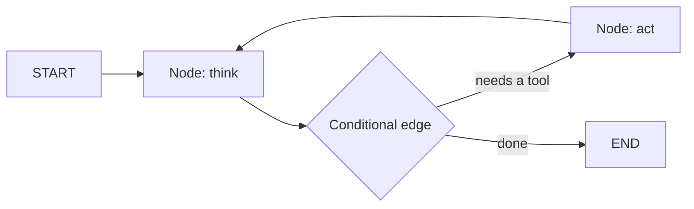
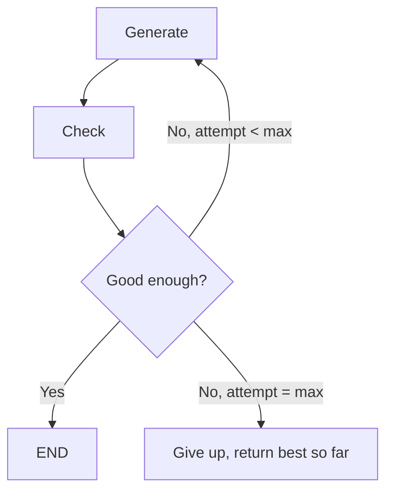
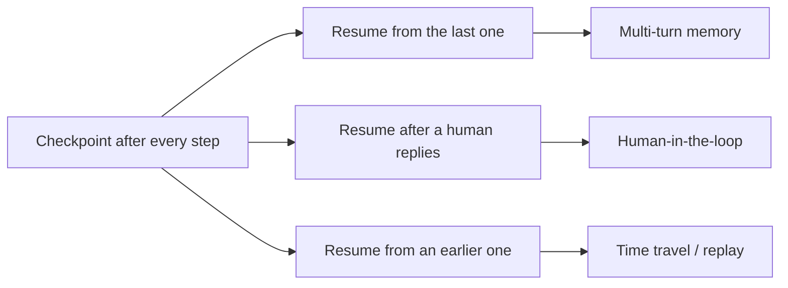
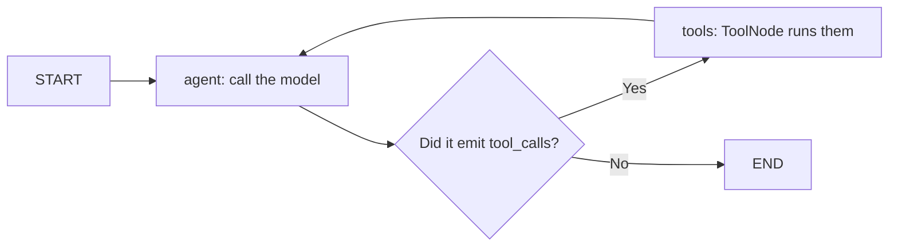
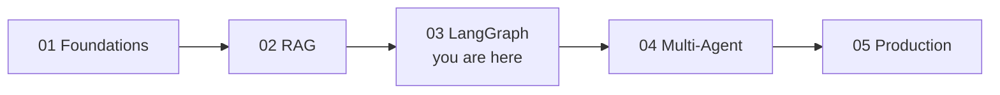

# 🔗 LangGraph Fundamentals — Interview Tutorial

> Built from 8 notebooks in `production-course-main-code-main/03_LangGraph_Fundamentals/` on 2026-09-06.
> Target roles: Applied AI / AI Engineer · Agentic AI Engineer · Forward Deployed Engineer
> Part of a 5-tutorial series — see [Where this fits](#where-this-fits) at the end.

This is the tutorial that turns a chain into an agent. [Tutorial 01](01_langchain_foundations_INTERVIEW_TUTORIAL.md)
built pipelines that always run the same steps in the same order. LangGraph adds the
three things a pipeline cannot do: **loop**, **pause**, and **resume**.

If you are interviewing for an agentic role, this folder is your strongest ground.

---

## The one idea: a graph is a state machine over shared state

A LangGraph app has three parts. **State** is a dictionary every node reads and writes.
**Nodes** are functions that take state and return updates. **Edges** decide which node
runs next, and can be conditional.



That arrow from `act` back to `think` is the whole point. LCEL cannot draw it.

```python
# From 01_langgraph_core.ipynb / 02_first_graph.ipynb
class State(TypedDict):
    messages: Annotated[list[BaseMessage], operator.add]   # <- reducer

builder = StateGraph(State)
builder.add_node("think", think_node)
builder.add_node("act", act_node)
builder.add_edge(START, "think")
builder.add_conditional_edges("think", route, {"act": "act", "end": END})
builder.add_edge("act", "think")          # the cycle
graph = builder.compile()
```

### The reducer is the piece people miss

`Annotated[list, operator.add]` says *how* to merge updates to `messages`. Without it,
the last write wins and earlier writes are lost. With it, updates are concatenated.

This matters the moment two nodes write the same key — which happens whenever branches
run in parallel. `add_messages` is the message-aware version and is what you almost
always want for a message list, because it also handles deduplication by ID.

**Say this in an interview.** "State keys need a reducer whenever more than one node
writes them. Without it you get last-write-wins and silently lose updates. For messages
I use `add_messages` rather than `operator.add` because it deduplicates by ID."

---

## What this covers

| Concept | Source notebook | Interview weight |
|---|---|---|
| State, nodes, edges, reducers | `01_langgraph_core.ipynb`, `02_first_graph.ipynb` | **High** |
| Conditional edges and routing | `03_conditional_edges.ipynb` | **High** |
| Cycles and loop termination | `04_cycles_loops.ipynb` | **High** |
| Checkpointing, threads, time travel | `05_checkpointing.ipynb` | **High** |
| Human-in-the-loop with `interrupt` | `06_human_in_loop.ipynb` | **High** |
| Retries, fallbacks, error handling | `07_error_handling.ipynb` | **High** |
| Tool calling and the agent loop | `08_tool_calling_agent.ipynb` | **High** |

Almost everything here is high-weight. That is unusual, and it reflects that this is
the layer agentic interviews are actually about.

## Coverage gaps

| Gap | Where it lives |
|---|---|
| Retrieval and RAG | [02 RAG & Retrieval](02_rag_and_retrieval_INTERVIEW_TUTORIAL.md) |
| Multi-agent, supervisors, handoffs | [04 Multi-Agent Systems](04_multi_agent_systems_INTERVIEW_TUTORIAL.md) |
| Evaluation and testing | [05 Production & Operations](05_production_and_operations_INTERVIEW_TUTORIAL.md) |
| Structured output | [01 Foundations](01_langchain_foundations_INTERVIEW_TUTORIAL.md) |
| **Async and streaming from a graph** | **Nowhere in this repo — build it yourself** |

---

## 1. Core concepts

### 1.1 Conditional edges are how the graph decides

**Plain version.** A conditional edge runs a plain Python function that returns the
name of the next node. Your code decides, using whatever is in state.

```python
# From 03_conditional_edges.ipynb style
def route(state: State) -> Literal["act", "end"]:
    last = state["messages"][-1]
    return "act" if getattr(last, "tool_calls", None) else "end"

builder.add_conditional_edges("think", route, {"act": "act", "end": END})
```

**The part that trips people up.** The third argument is a *map* from the strings your
function returns to actual node names. If your function returns a string that isn't a
key in that map, the graph raises at run time, not at compile time.

**Say this in an interview.** "Routing is ordinary Python reading graph state. The
mapping is explicit, which means the decision is loggable and testable without invoking
a model — that's a real advantage over letting the model route implicitly."

### 1.2 Cycles need a stop condition you own

**Plain version.** Once you add an edge back to an earlier node, the graph can run
forever. LangGraph gives you a `recursion_limit` as a backstop, but hitting it is an
exception, not a graceful stop.



Notice there are **two** exits from the check, not one. The `max` branch is what turns
a runaway loop into a bounded one that still returns something useful.

```python
# The pattern from 04_cycles_loops.ipynb — count attempts in state
class State(TypedDict):
    attempts: Annotated[int, operator.add]     # each pass adds 1

def route(state) -> Literal["generate", "give_up", "end"]:
    if state["passed"]:
        return "end"
    return "generate" if state["attempts"] < MAX_ATTEMPTS else "give_up"
```

**Say this in an interview.** "Every cycle gets an explicit counter in state and a
give-up branch that returns partial results. `recursion_limit` is a backstop that
raises — it's not a termination strategy, it's the thing that fires when your
termination strategy failed."

### 1.3 Checkpointing is what makes a graph durable

**Plain version.** A checkpointer saves the full state after every step. That single
feature unlocks three things that look unrelated but aren't: multi-turn memory,
human-in-the-loop, and time travel.

```python
# From 05_checkpointing.ipynb
from langgraph.checkpoint.memory import MemorySaver
from langgraph.checkpoint.sqlite import SqliteSaver

graph = builder.compile(checkpointer=MemorySaver())      # dev
# graph = builder.compile(checkpointer=SqliteSaver(conn))  # survives restart

config = {"configurable": {"thread_id": "user-42"}}
graph.invoke({"messages": [HumanMessage("Hi")]}, config)
graph.invoke({"messages": [HumanMessage("What did I just say?")]}, config)
```

**The `thread_id` is the whole API.** Same thread ID means same conversation, and state
is loaded automatically. Different thread ID means a fresh conversation. There is no
other session concept.

**Why all three features come from one mechanism**: if the full state is saved after
every step, you can resume from any step. Resuming from the last step is memory.
Resuming after a human answers is human-in-the-loop. Resuming from an *earlier* step is
time travel.



**Say this in an interview.** "Checkpointing saves full state per step, keyed by thread
ID. Memory, human-in-the-loop and time travel are all the same mechanism used three
ways. `MemorySaver` is for development — anything that must survive a restart needs
SQLite or Postgres."

### 1.4 `interrupt` pauses the graph mid-run

**Plain version.** You mark a point where the graph should stop and wait for a human.
The run ends, state is checkpointed, and your application decides what to do. Later you
resume with the human's answer.

```python
# From 06_human_in_loop.ipynb style
graph = builder.compile(
    checkpointer=MemorySaver(),
    interrupt_before=["execute_action"],     # pause before the risky node
)

result = graph.invoke(inputs, config)        # returns at the interrupt
state = graph.get_state(config)              # inspect what it wants to do

graph.update_state(config, {"approved": True})
graph.invoke(None, config)                   # None = resume, don't restart
```

**The two details interviewers probe.** First, `interrupt` requires a checkpointer —
without one there is no state to come back to. Second, resuming passes `None` as input,
because you are continuing an existing run rather than starting a new one.

**The design requirement people miss**: resumption must not re-execute side effects
that already happened. If the node before the interrupt charged a card, resuming must
not charge it again. That means idempotency, not just checkpointing.

**Say this in an interview.** "`interrupt_before` pauses at a named node and
checkpoints. Resume by invoking with `None`. The requirement people forget is
idempotency — the resume path must not re-run completed side effects, so tools need
idempotency keys."

### 1.5 Error handling has three separate layers

**Plain version.** Things fail at three levels, and each has its own fix.

| Level | What fails | Fix |
|---|---|---|
| The call | Rate limit, timeout | Retry with backoff |
| The provider | Model down, deprecated | Fall back to another provider |
| The node | Bad input, bug | Catch, write an error into state, route around it |

```python
# The shape from 07_error_handling.ipynb — a retry decorator on a node
def with_retry(max_attempts=3, backoff=1.0):
    def deco(fn):
        @wraps(fn)
        def wrapper(state):
            for attempt in range(max_attempts):
                try:
                    return fn(state)
                except Exception:
                    if attempt == max_attempts - 1:
                        raise
                    time.sleep(backoff * (2 ** attempt))   # exponential
        return wrapper
    return deco
```

That notebook also keeps a second provider ready (`ChatAnthropic` alongside
`ChatOpenAI`) so a provider outage degrades instead of failing, and wraps nodes with
`@traceable` so failures land in the trace.

**Say this in an interview.** "Retry for transient, fallback for structural, and
route-around for logical errors. The third is graph-specific: I write the error into
state and add a conditional edge to a recovery node, so a bad step doesn't kill the run."

### 1.6 The agent loop is a graph with two nodes

**Plain version.** An agent is a model node and a tool node, with a conditional edge
between them. That's genuinely all it is.

```python
# From 08_tool_calling_agent.ipynb
llm_with_tools = llm.bind_tools([search, calculator])

def call_model(state):
    return {"messages": [llm_with_tools.invoke(state["messages"])]}

def should_continue(state) -> Literal["tools", END]:
    last = state["messages"][-1]
    return "tools" if last.tool_calls else END

builder.add_node("agent", call_model)
builder.add_node("tools", ToolNode([search, calculator]))
builder.add_conditional_edges("agent", should_continue)
builder.add_edge("tools", "agent")        # results go back to the model
```



Two nodes and one conditional edge. That really is the whole agent.

**What `bind_tools` does.** It attaches the tool schemas to the model so the provider
can emit a structured `tool_calls` payload instead of prose. `ToolNode` then executes
whatever the model asked for and appends the results as `ToolMessage`s.

**The gotcha worth volunteering**: when the model calls a tool, `AIMessage.content` is
empty. Any code expecting text there gets an empty string. See the same gotcha from the
chain side in [01 Foundations](01_langchain_foundations_INTERVIEW_TUTORIAL.md).

**Say this in an interview.** "An agent is two nodes and a conditional edge. The model
decides whether to emit tool calls, `ToolNode` runs them, results go back as messages,
repeat. Everything hard about agents comes from that edge having no guaranteed exit."

---

## 2. Gotchas

### **Missing reducer means silent data loss**
- **Symptom**: two branches both update state, and only one update survives.
- **Cause**: a plain `list` key uses last-write-wins. Concurrent writes overwrite.
- **Fix**: `Annotated[list, operator.add]`, or `add_messages` for message lists. Any key
  written by more than one node needs one.
- **Interview angle**: "Two parallel nodes append to the same list. What do you get?"

### **`recursion_limit` raises, it does not stop gracefully**
- **Symptom**: a runaway loop ends in `GraphRecursionError` and the user gets a 500.
- **Cause**: the limit is a backstop against infinite loops, not a termination policy.
- **Fix**: count attempts in state and add an explicit give-up branch that returns the
  best result so far with a reason.
- **Interview angle**: "Your agent hits the recursion limit in production. What does the
  user see, and what should they see?"

### **`interrupt` without a checkpointer does nothing useful**
- **Symptom**: the graph pauses, and you cannot resume it.
- **Cause**: resumption reads state from a checkpoint. No checkpointer, no state.
- **Fix**: always compile with a checkpointer when using interrupts, and use a durable
  one if the pause can outlive the process.
- **Interview angle**: "Your approval step works in a notebook and breaks as a web
  service. Why?"

### **`MemorySaver` loses everything on restart**
- **Symptom**: conversations reset on every deploy; approvals pending overnight vanish.
- **Cause**: `MemorySaver` is an in-process dictionary. It is a development tool.
- **Fix**: `SqliteSaver` for single-node, Postgres for real deployments. This is the
  same class of bug as in-process chat history in
  [02 RAG](02_rag_and_retrieval_INTERVIEW_TUTORIAL.md).
- **Interview angle**: "What's the first thing you change before shipping this graph?"

### **Resuming can re-run side effects**
- **Symptom**: a resumed run sends the email twice.
- **Cause**: checkpointing restores state, but a node that already ran and had an
  external effect has no way to know it did.
- **Fix**: idempotency keys on anything with a side effect, so a repeat is a no-op.
  Interrupt *before* the effectful node, not after.
- **Interview angle**: "How do you stop a tool being called twice after a resume?"

### **A node that mutates state in place breaks the checkpoint**
- **Symptom**: state looks wrong after a resume, or updates apply twice.
- **Cause**: nodes must **return** an update dict. Mutating the passed-in state
  directly bypasses the reducer and the checkpoint machinery.
- **Fix**: always return `{"key": new_value}` and never assign into the state argument.
- **Interview angle**: "Why must a node return its updates instead of mutating state?"

### **The conditional-edge map must cover every return value**
- **Symptom**: `ValueError` at run time on an unexpected branch.
- **Cause**: your routing function returned a string that isn't in the mapping dict.
- **Fix**: type the return with `Literal[...]` so a type checker catches it, and keep
  the mapping keys and the Literal in sync.
- **Interview angle**: "How do you make graph routing safe to change?"

### **Tool calls make `content` empty**
- **Symptom**: your logging shows blank assistant messages.
- **Cause**: when the model emits tool calls, the payload is in `.tool_calls` and
  `.content` is empty.
- **Fix**: log `tool_calls` too, and never pipe a tool-bound model into
  `StrOutputParser`.
- **Interview angle**: "Your agent trace shows empty messages. Is it broken?"

---

## 3. Tradeoffs

### Chain versus graph
| Option | Costs you | Buys you | Pick when |
|---|---|---|---|
| LCEL chain | No cycles, no pause, no durable state | Fewer concepts, less code | The path is fixed |
| LangGraph | State schema, reducers, more setup | Loops, checkpoints, interrupts | You need any of those three |

**The one-liner**: "The moment I need to loop, pause, or resume, a chain can't express
it — that's the whole decision."

### Checkpointer choice
| Option | Costs you | Buys you | Pick when |
|---|---|---|---|
| `MemorySaver` | Everything lost on restart, single process | Zero setup | Notebooks and tests |
| `SqliteSaver` | Single node, file locking | Survives restart | Single-instance apps |
| Postgres | Infrastructure to run | Multi-node, durable, queryable | Anything real |

**The one-liner**: "MemorySaver is a development convenience — if a pause can outlive
the process, it needs a database."

### Where the model decides versus where you decide
| Option | Costs you | Buys you | Pick when |
|---|---|---|---|
| Conditional edge in code | You must enumerate the cases | Deterministic, testable, loggable | The cases are known |
| Model picks the tool | Unbounded paths, harder to test | Handles cases you didn't enumerate | The space is genuinely open |

**The one-liner**: "I give the model the smallest decision that still solves the
problem — every decision it makes is one I can't unit test."

### Interrupt before versus after
| Option | Costs you | Buys you | Pick when |
|---|---|---|---|
| `interrupt_before` | Human waits before anything happens | Nothing irreversible has run yet | The action is risky or costly |
| `interrupt_after` | The action already happened | Human reviews a real result | The action is safe and reversible |

**The one-liner**: "Interrupt before the effect, not after — you can't un-send an email
because the reviewer said no."

---

## 4. Top 10 interview questions

Web-sourced 2026-09-06, focused on graph orchestration and durability.

### 1. When do you choose LangGraph over a plain chain?
When you need cycles, durable state, human-in-the-loop, or full auditability. A linear
chain has no way to loop back, pause for input, or resume after a restart. Say the
inverse too, because it shows judgement: for a fixed pipeline the graph is extra
concepts for no gain, and I'd stay on LCEL.
[Source](https://www.interviewcoder.co/blog/langgraph-interview-questions) ·
[Source](https://medium.com/@dewasheesh.rana/langgraph-explained-2026-edition-ea8f725abff3)

### 2. What exactly is a checkpoint, and what is in it?
A recovery point, not a log entry. It holds the full graph state as of that step, plus
metadata: which step number it is, which nodes just ran, and pending-writes records
used for retry safety. It becomes mandatory the moment you need multi-turn memory
across separate calls, interrupt-based approval, or time travel — all three are built
on checkpoint history.
[Source](https://eastondev.com/blog/en/posts/ai/20260424-langgraph-agent-architecture/) ·
[Source](https://www.interviewcoder.co/blog/langgraph-interview-questions)

### 3. What is a `thread_id` and why does it matter?
It is the conversation key. Passing the same thread ID in the run config loads that
conversation's checkpoint history; a different one starts fresh. There is no other
session concept, so thread ID is what maps a user, a chat window, or a task to durable
state — and getting it wrong means users see each other's history.
[Source](https://eastondev.com/blog/en/posts/ai/20260424-langgraph-agent-architecture/)

### 4. How do you stop an agent looping forever?
Three layers. Count attempts in state and branch to a give-up node at the cap. Detect
no progress, such as the same tool call with the same arguments twice. And keep
`recursion_limit` as a backstop — but say clearly that it raises rather than returning,
so it is the thing that fires when your real termination logic failed.
[Source](https://www.interviewcoder.co/blog/langgraph-interview-questions) ·
[Source](https://galileo.ai/blog/why-multi-agent-systems-fail)

### 5. Walk me through adding human approval to an agent.
Compile with a checkpointer and `interrupt_before` the risky node. The run returns at
the pause; inspect with `get_state` to see the proposed action; record the human's
decision with `update_state`; resume by invoking with `None`. Then volunteer the hard
part: the resume path must not re-execute side effects, so effectful tools need
idempotency keys.
[Source](https://shaveen12.medium.com/langgraph-human-in-the-loop-hitl-deployment-with-fastapi-be4a9efcd8c0) ·
[Source](https://www.interviewcoder.co/blog/langgraph-interview-questions)

### 6. Why does state need reducers?
Because more than one node can write the same key, especially when branches run
concurrently. Without a reducer the last write wins and earlier updates disappear
silently — no error, just missing data. `operator.add` concatenates; `add_messages` is
the message-aware version that also deduplicates by ID.
[Source](https://medium.com/@dewasheesh.rana/langgraph-explained-2026-edition-ea8f725abff3)

### 7. What is time travel and when would you use it?
Rewinding to an earlier checkpoint and re-running from there, optionally with modified
state. In practice it is a debugging tool: reproduce a bad run, change one input, and
see whether the trajectory changes. It also powers "edit and retry" features, where a
user corrects the agent's assumption mid-conversation rather than starting over.
[Source](https://eastondev.com/blog/en/posts/ai/20260424-langgraph-agent-architecture/)

### 8. A tool call fails mid-graph. What happens?
Classify it. Transient gets retry with exponential backoff. Structural gets a fallback
provider. Logical gets caught, written into state as an error, and routed to a recovery
node by a conditional edge. Critically, the error text should go back to the model as a
tool result so it can adapt, rather than crashing the run.
[Source](https://www.systemdesignhandbook.com/guides/agentic-system-design/)

### 9. How do you stream from a graph, and what are you streaming?
Not tokens by default — graph execution emits state updates per step. `stream_mode`
selects what you get: `values` for full state, `updates` for deltas, `messages` for
token-level output. For a chat interface you usually want messages for the text plus
updates to drive a progress indicator.
[Source](https://www.interviewcoder.co/blog/langgraph-interview-questions)

### 10. How would you test a graph?
Test nodes as plain functions, because they are just state in, dict out — no model
needed for most of them. Test routing functions directly against handcrafted state.
Then test the compiled graph end to end with a stubbed model. The property that graphs
make testable, and chains don't, is that routing decisions are inspectable values.
[Source](https://medium.com/@santosh.rout.cr7/llm-engineering-interviews-how-to-prepare-for-prompting-fine-tuning-and-evaluation-df888e76340e)

---

## 5. Role tracks

### 5.1 Agentic AI Engineer

This is your home track. Expect most of your interview here.

1. **Design an agent that books travel.** Two-node agent loop, tools for search and
   booking, `interrupt_before` the booking node, idempotency keys on the booking tool,
   attempt counter with a give-up branch, Postgres checkpointer.
2. **What's in your state schema, and why?** Messages with `add_messages`, an attempt
   counter with `operator.add`, and any flags routing reads. Every multi-writer key has
   a reducer.
3. **Your agent calls the same tool three times with identical arguments.** That's the
   no-progress signal. Detect it in the routing function and treat it as terminal.
4. **How do you resume after a crash?** Same thread ID, invoke with `None`. It picks up
   from the last checkpoint. Requires a durable checkpointer, not `MemorySaver`.
5. **Where do guardrails live?** In nodes and edges, not the prompt. Validate tool
   arguments before `ToolNode` runs them; the model proposes, the graph decides.
6. **When would you flatten a graph back into a chain?** When there's no cycle, no
   pause and no resume. Graphs cost concepts; don't pay for them unused.
7. **How do you debug a bad run?** Trace plus checkpoint history. The trace shows what
   happened; time travel lets you replay from the step before it went wrong.
8. **Subgraph or node?** Subgraph when a unit has its own multi-step state; node when
   it's one function. Subgraphs compose — see [04 Multi-Agent](04_multi_agent_systems_INTERVIEW_TUTORIAL.md).

### 5.2 Applied AI / AI Engineer
1. **When is a graph overkill for a RAG system?** Usually. Retrieve-then-generate is
   acyclic. Graphs earn their place for self-correcting RAG that re-queries on low
   confidence.
2. **How would you add retrieval to this graph?** As a node, or a tool. As a node it
   always runs; as a tool the model decides. See
   [02 RAG](02_rag_and_retrieval_INTERVIEW_TUTORIAL.md).
3. **How do you evaluate a graph?** Per-node unit tests, plus trajectory evaluation —
   did it take a sensible path, not just reach a sensible answer. Detail in
   [05 Production](05_production_and_operations_INTERVIEW_TUTORIAL.md).
4. **What does a cycle cost?** One model call per iteration. Cap it, and measure the
   average iteration count, because that number is your real cost multiplier.
5. **Temperature in a routing node?** Zero. Routing should be as deterministic as you
   can make it, and better still, done in code.
6. **How do you keep prompt changes from breaking routing?** Route on structured
   fields, not on parsing the model's prose.

### 5.3 Forward Deployed Engineer
1. **Customer wants approval before any write.** `interrupt_before` on every write
   node, a durable checkpointer, and a UI that renders `get_state`. Two weeks, not two
   days, because the resume path needs idempotency.
2. **Their agent stalled overnight; what happened to the state?** With `MemorySaver`,
   gone. This is the first thing to check and the first thing to fix.
3. **They ask "can we see what it was about to do?"** Yes — that's `get_state` at the
   interrupt. It's a genuinely good demo moment.
4. **Their compliance team wants an audit trail.** Checkpoint history is one, and it's a
   strong answer, but say where it lives and how long it's retained.
5. **The agent is too slow.** Count model calls per run first. Cycles are usually the
   cost, and capping iterations often beats optimising any single call.
6. **They want it to never take action X.** Enforce in a node before the tool runs.
   Prompt instructions are not enforcement.

---

## 6. Self-check

1. Three things a graph does that a chain can't? *Loop, pause, resume.*
2. What does a reducer do? *Says how to merge updates when several nodes write one key.*
3. `operator.add` vs `add_messages`? *The latter is message-aware and deduplicates by ID.*
4. What's in a checkpoint? *Full state at that step, plus step metadata and pending writes.*
5. What does `thread_id` identify? *The conversation. Same ID, same state.*
6. What three features come from checkpointing? *Memory, human-in-the-loop, time travel.*
7. How do you resume after an interrupt? *Invoke with `None` and the same config.*
8. Does `recursion_limit` stop a loop gracefully? *No, it raises. Add your own counter.*
9. Why is `AIMessage.content` empty sometimes? *The model emitted tool calls instead.*
10. What must a node return? *An update dict. Never mutate the state argument.*
11. Where do you interrupt for a payment? *Before the node, so nothing irreversible ran.*
12. What makes resume safe? *Idempotency keys on effectful tools.*

---

## Where this fits

This is tutorial **3 of 5**.



| Tutorial | Relationship to this one |
|---|---|
| [01 Foundations](01_langchain_foundations_INTERVIEW_TUTORIAL.md) | The nodes inside your graph are LCEL chains. Start there if `\|` is unfamiliar. |
| [02 RAG & Retrieval](02_rag_and_retrieval_INTERVIEW_TUTORIAL.md) | Retrieval becomes a node or a tool here. Its chain-based version is the contrast. |
| [04 Multi-Agent](04_multi_agent_systems_INTERVIEW_TUTORIAL.md) | Every pattern there is this graph, nested. Read this first. |
| [05 Production](05_production_and_operations_INTERVIEW_TUTORIAL.md) | How you measure, cost-control and secure what you built here. |

**Repo-wide gap: async.** Nothing in any of the five folders uses `ainvoke`, `astream`
or `async def`. For LangGraph specifically that also means no `astream_events`, which
is how you'd stream token output from a real service. Build one before interviewing.
