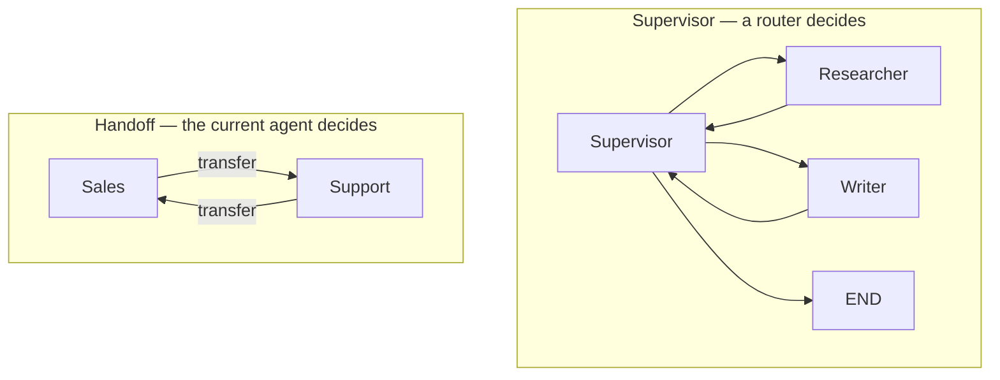
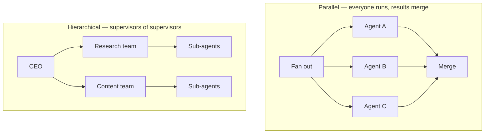
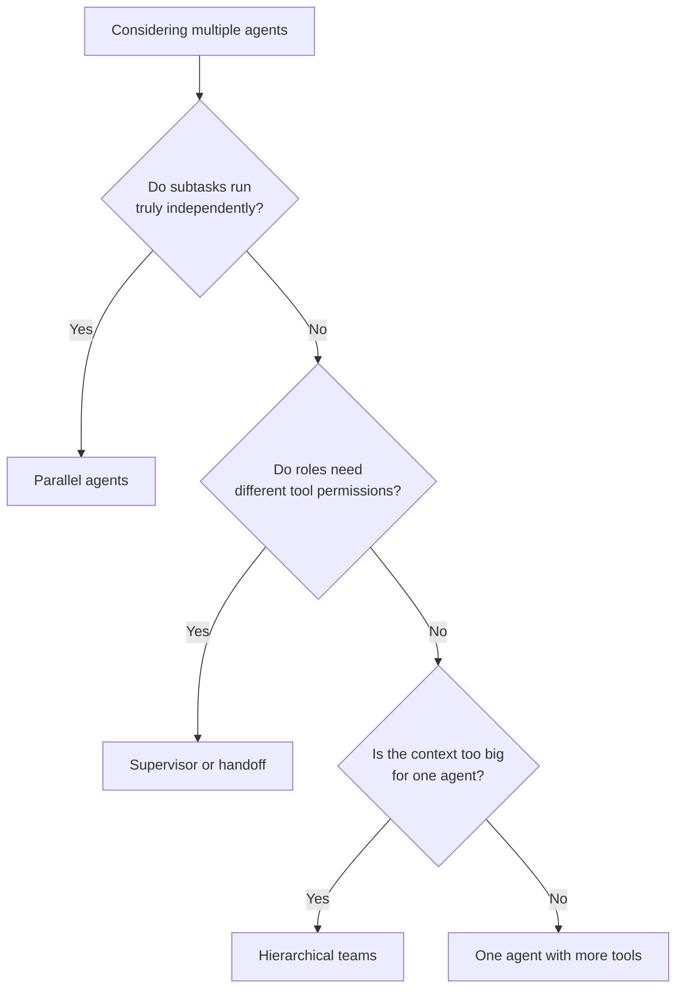
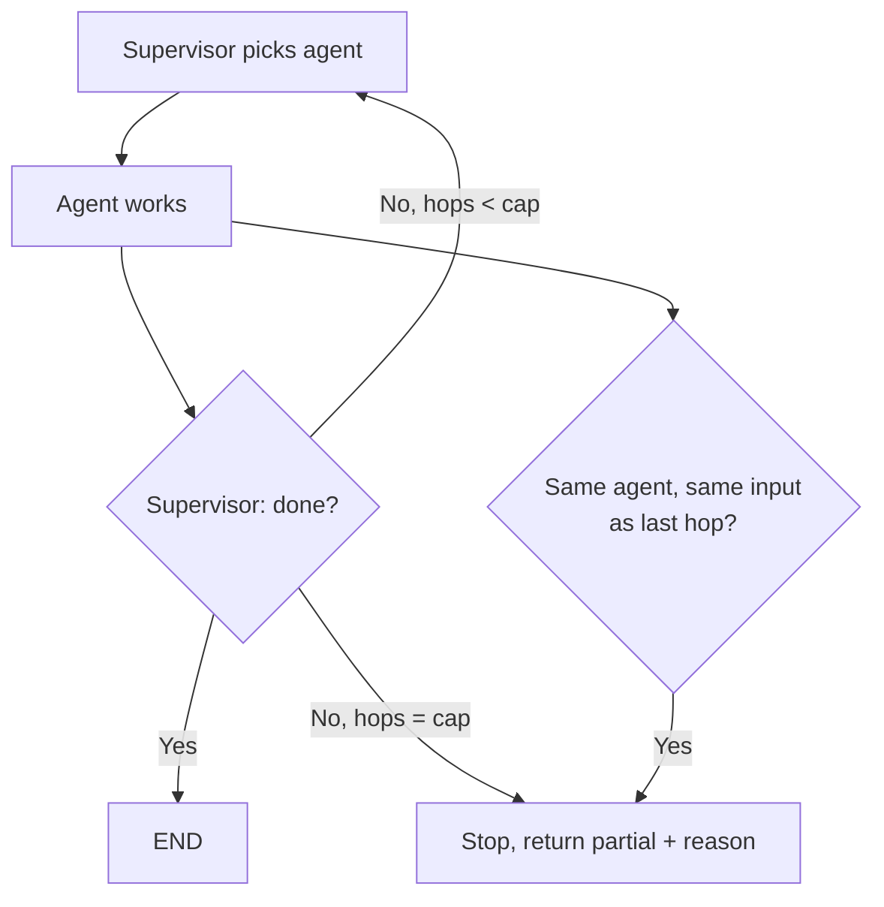
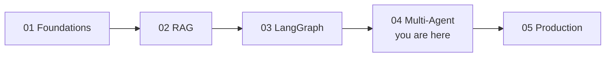

# 🕸️ Multi-Agent Systems — Interview Tutorial

> Built from 7 notebooks in `production-course-main-code-main/04_Multi_Agent_Systems/` on 2026-09-06.
> Target roles: Applied AI / AI Engineer · Agentic AI Engineer · Forward Deployed Engineer
> Part of a 5-tutorial series — see [Where this fits](#where-this-fits) at the end.

Everything here is a LangGraph graph with more than one agent in it. If
[tutorial 03](03_langgraph_fundamentals_INTERVIEW_TUTORIAL.md) is unfamiliar, read that
first — state, reducers, conditional edges and checkpointing all apply unchanged.

**Start with the answer interviewers actually want**: most multi-agent systems should
have been one agent with more tools. Lead with that, then show you can build the real
thing when it's justified.

---

## The one idea: agents are nodes, coordination is edges

A "multi-agent system" in LangGraph is a graph where several nodes each own a role, a
prompt, and a tool set. They share state. Something decides who runs next.

The four patterns are four answers to "who decides who runs next".





| Pattern | Who decides next | Costs | Use when |
|---|---|---|---|
| **Supervisor** | A dedicated router node | 1 extra model call per hop | Roles are distinct and a central plan helps |
| **Handoff** | The agent currently running | No extra call | Conversation should transfer, like support tiers |
| **Parallel** | Nobody — all run | N calls, latency of the slowest | Subtasks are genuinely independent |
| **Hierarchical** | Supervisors at each level | Most expensive | Too many agents for one router to choose well |

---

### Should you use multiple agents at all?

Answer this before choosing a pattern. Most of the time it stops here.



If you land on the bottom-right box, say so in the interview. Choosing the simpler
architecture out loud scores better than building the complicated one.

---

## What this covers

| Concept | Source notebook | Interview weight |
|---|---|---|
| Shared state across agents | `01_multi_agent.ipynb` | **High** |
| Supervisor routing with structured output | `02_supervisor_agent.ipynb` | **High** |
| Handoffs between peer agents | `03_agent_handoffs.ipynb` | **High** |
| Inter-agent communication and context | `04_agent_communication.ipynb` | Medium |
| Parallel agents and merging | `05_parallel_agents.ipynb` | **High** |
| Hierarchical teams via subgraphs | `06_hierarchical_agents.ipynb` | **High** |
| A full research system | `07_multi_agent_research_system.ipynb` | Medium |

## Coverage gaps

| Gap | Where it lives |
|---|---|
| Single-agent loop, tools, checkpointing | [03 LangGraph](03_langgraph_fundamentals_INTERVIEW_TUTORIAL.md) |
| Retrieval as an agent capability | [02 RAG](02_rag_and_retrieval_INTERVIEW_TUTORIAL.md) |
| Evaluating and costing all this | [05 Production](05_production_and_operations_INTERVIEW_TUTORIAL.md) |
| Retries and fallbacks | [03 LangGraph](03_langgraph_fundamentals_INTERVIEW_TUTORIAL.md) |
| **Async** | **Nowhere in this repo — build it yourself** |

---

## 1. Core concepts

### 1.1 Shared state is the communication channel

**Plain version.** Agents don't call each other. They read and write one shared state
dictionary, and the graph decides who runs next. That's the entire messaging model.

```python
# From 01_multi_agent.ipynb / 02_supervisor_agent.ipynb
class SupervisorState(TypedDict):
    messages: Annotated[list[BaseMessage], add_messages]  # every agent appends
    next_agent: str          # who the supervisor picked
    task_complete: bool      # the termination flag
    final_response: str      # what the user gets
```

**Read that schema closely**, because it is the interview. `messages` has a reducer
because every agent writes it. `next_agent` is the routing decision as a plain value,
so it can be logged and asserted on. `task_complete` is the termination flag — without
something like it, the supervisor loops forever.

**Say this in an interview.** "Agents communicate through shared state, not direct
calls. Every key more than one agent writes needs a reducer. And I keep the routing
decision and the done flag as explicit fields, so termination is a value I can test
rather than a behaviour I hope for."

### 1.2 The supervisor is a router with a schema

**Plain version.** A supervisor is one node that looks at state and picks the next
agent. The reliable way to build it is structured output, so the choice is constrained
to real agent names.

```python
# From 06_hierarchical_agents.ipynb
class DepartmentRoute(BaseModel):
    department: Literal["research", "content", "analysis"] = Field(
        description="Which department should handle this request"
    )
    reasoning: str = Field(description="Why this department was chosen")

router_llm = llm.with_structured_output(DepartmentRoute)
```

**Two things this buys you.** The `Literal` means the model cannot invent an agent that
doesn't exist. And `reasoning` gives you a logged justification per hop, which is what
makes a bad routing decision debuggable afterwards.

**The cost to state out loud**: a supervisor adds one model call per hop. A five-hop
task is five routing calls on top of five agent calls. That is where multi-agent cost
goes, and interviewers want you to name it unprompted.

**Say this in an interview.** "I constrain the supervisor with a `Literal` over real
agent names so it can't route to something that doesn't exist, and I capture its
reasoning so bad routes are debuggable. The honest cost is one extra model call per
hop."

### 1.3 Handoff moves control without a central router

**Plain version.** Instead of returning to a supervisor, the agent currently running
decides to transfer. Cheaper, because there is no router call, but there is no central
view of the plan.

```python
# The shape from 03_agent_handoffs.ipynb
class HandoffState(TypedDict):
    messages: Annotated[list[BaseMessage], add_messages]
    current_agent: str
    handoff_reason: str        # why control moved
    context_summary: str       # what the next agent needs to know
```

**`context_summary` is the interesting field.** Passing the whole message history to
every agent is expensive and dilutes focus. A summary at the handoff point is the
compromise: the receiving agent gets what it needs without re-reading everything.

**The failure mode to volunteer**: two agents that each think the other should handle
it, transferring back and forth. That's a loop, and it needs the same defence as any
other — a hop counter in state with a cap.

**Say this in an interview.** "Handoff is cheaper than a supervisor because there's no
router call, but nothing holds the overall plan. The classic failure is a transfer
ping-pong, so I count hops in state and cap them."

### 1.4 Parallel agents need reducers and a merge policy

**Plain version.** Fan out to several agents at once, then merge. Latency becomes the
slowest agent instead of the sum, which is the whole reason to do it.

**Two things break if you're careless.** Without a reducer on the key they all write,
you lose all but one result. And if one agent fails, you need to have decided in
advance whether that kills the batch or returns partial results.

```python
# The shape from 05_parallel_agents.ipynb
class ParallelState(TypedDict):
    findings: Annotated[list[str], operator.add]    # each agent appends its own

builder.add_edge("dispatch", "agent_a")
builder.add_edge("dispatch", "agent_b")   # both edges from one node = parallel
builder.add_edge("agent_a", "merge")
builder.add_edge("agent_b", "merge")      # merge waits for both
```

**Say this in an interview.** "Two edges out of one node is the fan-out; two edges into
one node is the join, and the join waits for all of them. The key they write needs
`operator.add` or you keep exactly one result. And I decide up front whether one
failure aborts the batch or returns partial with the gap flagged."

### 1.5 Hierarchy is subgraphs, compiled and used as nodes

**Plain version.** A compiled graph can be a node in another graph. That's how you get
teams: each department is its own graph with its own supervisor, and a top-level
supervisor routes between departments.

```python
# From 06_hierarchical_agents.ipynb
def create_hierarchical_system():
    research_team = build_research_team().compile()
    content_team  = build_content_team().compile()
    analysis_team = build_analysis_team().compile()
    # each compiled subgraph is added as a single node in the parent graph
```

**Why bother.** A supervisor choosing between four agents routes well. A supervisor
choosing between twenty routes badly — the prompt gets long and the choices blur.
Hierarchy keeps each routing decision small.

**The cost.** Every level adds a routing call. A two-level hierarchy is two routing
calls before any real work happens.

**Say this in an interview.** "Subgraphs compile to nodes, so hierarchy is composition
rather than a new mechanism. I reach for it when one router has too many choices to
pick well — but each level costs another routing call before any work happens."

### 1.6 Termination is harder with several agents

**Plain version.** One agent stops when it stops calling tools. Several agents can
disagree about whether the work is done, and each hop costs money.

The failure the literature calls out most is a supervisor rejecting a worker's output,
the worker retrying, and the supervisor rejecting again — burning budget with no
progress. Related: an agent that never signals done, so peers keep waiting.



```python
# All three defences — one in state, all three read by the routing function
MAX_HOPS = 8

class SupervisorState(TypedDict):
    messages: Annotated[list[BaseMessage], add_messages]
    next_agent: str
    task_complete: bool                        # 1. explicit done flag
    hops: Annotated[int, operator.add]         # 2. hard cap
    last_delegation: str                       # 3. no-progress detector

def route(state) -> Literal["agent", "give_up", "end"]:
    if state["task_complete"]:
        return "end"
    if state["hops"] >= MAX_HOPS:
        return "give_up"                       # partial results, with a reason

    # Same agent, same request as last hop -> the loop is not converging
    signature = f"{state['next_agent']}::{state['messages'][-1].content[:200]}"
    if signature == state.get("last_delegation"):
        return "give_up"
    return "agent"
```

The `last_delegation` signature is the piece people leave out. A hop cap alone still
lets a supervisor and worker burn the whole budget rejecting and retrying the identical
request — it just bounds how much they burn. Comparing this delegation to the previous
one catches that on hop two instead of hop eight.

**Say this in an interview.** "Termination needs care in both directions — stopping
early abandons solvable work, never stopping burns budget on unsolvable work. I combine
an explicit done flag from the supervisor with a hard hop cap and a no-progress check
for repeated identical delegations."

---

## 2. Gotchas

### **Multi-agent is usually the wrong answer**
- **Symptom**: three agents, three times the cost and latency, no better output than one.
- **Cause**: architecture chosen by fashion. Coordination overhead is real and buys
  nothing when the subtasks weren't independent.
- **Fix**: justify it by naming what you're buying — real parallelism, distinct tool
  permissions per role, or context that won't fit in one agent. If you can't name one,
  use one agent with more tools.
- **Interview angle**: "When is multi-agent actively worse than a single agent?"

### **A missing reducer silently discards parallel results**
- **Symptom**: you fan out to four agents and get one result back.
- **Cause**: all four wrote the same state key with last-write-wins semantics.
- **Fix**: `Annotated[list, operator.add]` on any key written by more than one node.
- **Interview angle**: "Four agents ran, one result came back. What did you forget?"

### **Supervisor and worker can loop forever**
- **Symptom**: the run burns tokens without converging; the supervisor keeps rejecting.
- **Cause**: no hop cap, and no no-progress detection. The supervisor rejects, the
  worker retries the same way, repeat.
- **Fix**: hop counter in state with a give-up branch, plus a check for the same agent
  receiving the same input twice.
- **Interview angle**: "Your supervisor and worker are stuck in a rejection loop. Fix it."

### **Passing full history to every agent is expensive and worse**
- **Symptom**: cost grows superlinearly with hops, and agents get less focused.
- **Cause**: every agent receives the entire message list, so hop N pays for hops 1..N-1
  and has more irrelevant context to filter.
- **Fix**: pass a `context_summary` at the handoff, as `03_agent_handoffs.ipynb` does,
  or filter messages per agent role.
- **Interview angle**: "Why does your five-agent run cost more than five single calls?"

### **The supervisor can route to an agent that doesn't exist**
- **Symptom**: `KeyError` on the routing map at run time.
- **Cause**: a free-text routing decision, or a `Literal` that drifted out of sync with
  the graph's node names.
- **Fix**: structured output with a `Literal`, and derive both the `Literal` and the
  routing map from one list of agent names.
- **Interview angle**: "How do you keep routing safe when you add a sixth agent?"

### **One parallel agent fails and takes the whole run with it**
- **Symptom**: nine agents succeed, one raises, you get nothing.
- **Cause**: no decision was made about partial failure, so the default applied.
- **Fix**: decide deliberately. For research, partial results plus an explicit gap note
  is usually right. Catch inside the node and write an error marker into state.
- **Interview angle**: "Ten parallel workers, one fails. What does the user get?"

### **Hierarchy multiplies routing cost invisibly**
- **Symptom**: a two-level system costs far more per task than the flat version.
- **Cause**: every level adds a routing call before any work happens.
- **Fix**: only add a level when one router genuinely has too many choices. Measure
  routing calls as a share of total calls.
- **Interview angle**: "What does adding a management layer cost you?"

### **Agents overwrite each other's conclusions**
- **Symptom**: the final answer reflects only the last agent that ran.
- **Cause**: several agents write a scalar key like `summary` with no reducer, so the
  last writer wins.
- **Fix**: accumulate into a list and synthesise at the end, rather than having each
  agent overwrite a shared conclusion.
- **Interview angle**: "Your research system only reports one agent's findings. Why?"

---

## 3. Tradeoffs

### One agent versus many
| Option | Costs you | Buys you | Pick when |
|---|---|---|---|
| One agent, more tools | Long tool list can confuse selection | Simplest, cheapest, easiest to debug | Almost always — start here |
| Multi-agent | Coordination, latency, new failure modes | Parallelism, role isolation, context split | You can name which of those you need |

**The one-liner**: "I use multiple agents when I can name what I'm buying —
parallelism, permissions, or context limits. Otherwise it's one agent with more tools."

### Supervisor versus handoff
| Option | Costs you | Buys you | Pick when |
|---|---|---|---|
| Supervisor | One model call per hop | Central plan, easy to log and audit | The work needs orchestrating |
| Handoff | No global view of progress | Cheaper, natural for conversation | Control should transfer, like support tiers |

**The one-liner**: "Supervisor when someone needs to hold the plan, handoff when the
conversation itself should move."

### Parallel versus sequential
| Option | Costs you | Buys you | Pick when |
|---|---|---|---|
| Sequential | Latency is the sum | Later agents see earlier results | Steps genuinely depend on each other |
| Parallel | N calls at once, merge logic, partial failure | Latency of the slowest, not the sum | Subtasks are independent |

**The one-liner**: "Parallel only when no agent needs another's output — otherwise
you're paying for concurrency you can't use."

### Flat versus hierarchical
| Option | Costs you | Buys you | Pick when |
|---|---|---|---|
| Flat | Router degrades with many choices | One routing call per hop | Under roughly five agents |
| Hierarchical | A routing call per level | Each decision stays small | Many agents in clear groups |

**The one-liner**: "Add a level when one router has too many choices to pick well, and
accept that every level costs a call before any work happens."

---

## 4. Top 10 interview questions

Web-sourced 2026-09-06, focused on coordination, failure and cost.

### 1. When is multi-agent actively worse than one agent with more tools?
Usually. Multi-agent adds coordination overhead, message-passing latency, and a failure
class single agents don't have — agents waiting on a peer that never signals done.
Justify it only for genuine parallelism over independent subtasks, distinct tool
permissions per role, or context one agent can't hold. This question exists to catch
architecture-by-fashion.
[Source](https://galileo.ai/blog/why-multi-agent-systems-fail) ·
[Source](https://callsphere.ai/blog/agentic-ai-multi-agent-interview-questions-2026)

### 2. Your supervisor and worker are stuck rejecting and retrying. Diagnose it.
This is the canonical multi-agent failure. The supervisor rejects output, the worker
retries the same way, the supervisor rejects again — budget burns with no progress.
Fix in layers: a hard hop cap that returns partial results, a no-progress check for the
same agent receiving the same input twice, and feedback that is specific enough for the
worker to actually change its approach.
[Source](https://galileo.ai/blog/why-multi-agent-systems-fail) ·
[Source](https://www.systemdesignhandbook.com/guides/agentic-system-design/)

### 3. How do agents communicate?
Through shared state, not direct calls. Each agent reads the state and returns updates;
the graph merges them using reducers and decides who runs next. Say the consequence:
any key more than one agent writes needs a reducer, or updates are silently lost. Direct
agent-to-agent calls would remove the graph's ability to checkpoint and resume.
[Source](https://medium.com/@dewasheesh.rana/langgraph-explained-2026-edition-ea8f725abff3)

### 4. Your multi-agent system is accurate but too expensive. Trim it without hiding failure.
Account first: cost per run split by agent and by hop, so you know whether it's routing
calls, agent calls or retries. Then the cheap wins — collapse agents whose only job is
passing messages along, route only hard steps to the expensive model, cache prompt
prefixes, and pass summaries instead of full history. Every cut ships with an eval
number showing quality held.
[Source](https://www.systemdesignhandbook.com/guides/agentic-system-design/) ·
[Source](https://galileo.ai/blog/why-multi-agent-systems-fail)

### 5. Ten agents run in parallel, one fails. What happens?
Whatever you decided in advance — and the point of the question is whether you decided
at all. Options are abort the batch, or return partial results with the failure
attached. For research tasks, partial plus an explicit gap note is usually right. The
wrong answer is losing nine successes to one failure because you never chose.
[Source](https://www.systemdesignhandbook.com/guides/agentic-system-design/)

### 6. How do you stop the whole system running forever?
Termination needs care in both directions: stopping early abandons solvable work,
never stopping burns money on unsolvable work. Combine an explicit done signal from the
supervisor, hard ceilings on hops and total model calls, and progress checks. Every
ceiling returns partial results with a reason rather than raising.
[Source](https://www.systemdesignhandbook.com/guides/agentic-system-design/) ·
[Source](https://galileo.ai/blog/why-multi-agent-systems-fail)

### 7. Design a research system with a supervisor and workers.
Supervisor plans N queries, workers execute independently in parallel, a synthesiser
merges. State carries findings with `operator.add` so parallel writes accumulate.
Bound it with a hop cap and a per-run model-call budget. Then volunteer the honest
tradeoff: the supervisor's planning call is pure overhead if the query decomposition
was predictable, in which case hardcode it.
[Source](https://github.com/alexeygrigorev/ai-engineering-field-guide/blob/main/interview/questions/04-ai-system-design.md)

### 8. Where do guardrails live in a multi-agent system?
Outside the model, at the graph level. Validate tool arguments before execution,
enforce per-agent tool permissions in the runtime rather than in prompts, and require
human approval for irreversible actions. The principle to state: the model proposes,
the system decides. Per-agent permissions are one of the few genuinely good reasons to
split agents at all.
[Source](https://galileo.ai/blog/why-multi-agent-systems-fail) ·
[Source](https://callsphere.ai/blog/ai-agent-system-design-interview-common-questions-how-to-answer)

### 9. How do you debug a multi-agent run that produced a bad answer?
A trace keyed by run ID, recording per hop: which agent ran, why the supervisor chose
it, the inputs it saw, and what it returned. The supervisor's `reasoning` field is the
highest-value thing to log, because most bad multi-agent outputs are bad routing rather
than bad agents. Then find the first hop where the trajectory diverged.
[Source](https://atul4u.medium.com/the-complete-agentic-ai-system-design-interview-guide-2026-f95d0cfeb7cf)

### 10. How would you evaluate a multi-agent system?
Two levels. Outcome evaluation asks whether the final answer was right. Trajectory
evaluation asks whether it took a sensible path — did the supervisor route correctly,
did agents stay in role, how many hops. Trajectory matters more here, because a system
that reaches the right answer through six wasted hops is one prompt change away from
not reaching it.
[Source](https://www.kdnuggets.com/how-to-answer-ai-system-design-interview-questions)

---

## 5. Role tracks

### 5.1 Agentic AI Engineer

Your home track alongside [03 LangGraph](03_langgraph_fundamentals_INTERVIEW_TUTORIAL.md).

1. **Design a customer support system with tiers.** Handoff, not supervisor —
   conversation should move. `current_agent` and `context_summary` in state, hop cap
   against ping-pong, human escalation as the terminal tier.
2. **Which pattern for a research task?** Supervisor plans, workers run in parallel,
   synthesiser merges. Parallel because the queries are independent.
3. **How do you give agents different permissions?** Different tool lists per node, and
   validate in the runtime. This is one of the strongest arguments for splitting agents.
4. **What's your termination story?** Done flag from the supervisor, hop cap, and a
   no-progress check on repeated identical delegations. All three.
5. **How do you keep context from exploding?** Summarise at handoff, filter messages
   per role, and never pass the whole history to every agent by default.
6. **When would you collapse three agents into one?** When they share tools, share
   context, and never run concurrently. Then they're three prompts, not three agents.
7. **Subgraph or node?** Subgraph when the unit has its own multi-step state and
   deserves its own supervisor. Node when it's one function.

### 5.2 Applied AI / AI Engineer
1. **Do you need multiple agents for RAG?** Almost never. Retrieve-then-generate is one
   path. See [02 RAG](02_rag_and_retrieval_INTERVIEW_TUTORIAL.md).
2. **How would you evaluate routing accuracy?** Label a set of requests with the correct
   agent and measure the supervisor like a classifier. It is one.
3. **Parallel agents over the same corpus — what's the risk?** Duplicate retrieval and
   duplicate cost. Share one retrieval step upstream instead.
4. **How do you compare one-agent and multi-agent versions?** Same eval set, measure
   quality, cost and latency for both. Usually the single agent wins on two of three.
5. **What does the supervisor's `reasoning` field give you?** Labelled training and
   debugging data for the routing decision, essentially free.

### 5.3 Forward Deployed Engineer
1. **Customer asks for "a team of AI agents".** Ask what each would do differently.
   Often the honest answer is one agent, and saying so early builds trust.
2. **Their multi-agent demo costs too much per query.** Count routing calls first.
   Collapsing pass-through agents is usually the biggest single win.
3. **They want an audit trail of which agent did what.** Per-hop trace with the
   supervisor's reasoning. This demos well and is genuinely useful.
4. **Different departments need different data access.** This is a legitimate reason to
   split agents — enforce per-agent tool permissions in code, not prompts.
5. **The system gives different answers to the same question.** Check routing
   consistency before blaming the agents. Non-deterministic routing is the usual cause.
6. **How long to build this properly?** Longer than the demo. Termination, partial
   failure and per-agent permissions are where the real time goes.

---

## 6. Self-check

1. How do agents communicate? *Shared state, not direct calls.*
2. What breaks without a reducer on a parallel-written key? *All but one result is lost.*
3. Supervisor vs handoff, in one line? *Central plan vs control transferring.*
4. What does a supervisor cost per hop? *One extra model call.*
5. Why constrain routing with a `Literal`? *The model can't route to a non-existent agent.*
6. What's the canonical multi-agent failure? *Supervisor-worker rejection loop with no progress.*
7. Three defences against it? *Hop cap, no-progress check, specific feedback.*
8. What makes a fan-out a fan-in? *Several edges into one node; it waits for all.*
9. What does hierarchy cost? *One routing call per level, before any work.*
10. When do you collapse agents? *Shared tools, shared context, never concurrent.*
11. What's the highest-value thing to log? *The supervisor's routing reasoning.*
12. Outcome or trajectory evaluation? *Both, and trajectory matters more here.*

---

## Where this fits

This is tutorial **4 of 5**.



| Tutorial | Relationship to this one |
|---|---|
| [03 LangGraph](03_langgraph_fundamentals_INTERVIEW_TUTORIAL.md) | **Read first.** Every pattern here is that graph, nested. State, reducers and checkpointing are unchanged. |
| [01 Foundations](01_langchain_foundations_INTERVIEW_TUTORIAL.md) | `with_structured_output`, which is how supervisor routing stays safe. |
| [02 RAG](02_rag_and_retrieval_INTERVIEW_TUTORIAL.md) | Give your agents documents. Share one retrieval step rather than duplicating it per agent. |
| [05 Production](05_production_and_operations_INTERVIEW_TUTORIAL.md) | Cost accounting per hop, tracing per agent, and evaluating trajectories. |

**Repo-wide gap: async.** Parallel agents here run on threads, not an event loop.
Nothing in any folder uses `ainvoke` or `astream`. For a service handling concurrent
users that's the missing piece, so build a small async example before interviewing.
