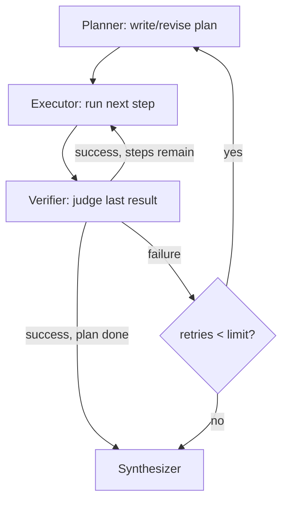
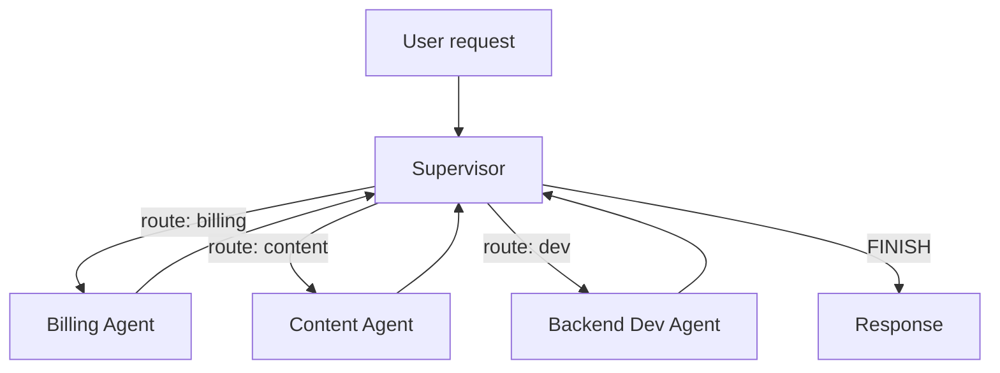

# 🤖 Agent Fundamentals & Advanced Agentic Systems — Interview Tutorial

> Built from 162 notebook(s) in `05_AI_Agent_Fundamentals/` and `07_Advanced_Agentic_Systems/` on 2026-09-09.
> Target roles: Applied AI / AI Engineer · **Agentic AI Engineer (primary focus)** · Forward Deployed Engineer
>
> This run is weighted toward **agentic system design** — architecture choices, state/memory, tool
> design, failure handling, and evaluation/observability — because that is the shape of the coding
> round this guide was built for.

## What this covers

| Concept | Source notebook | Interview weight |
|---|---|---|
| ReAct (reason + act loop) | `3. Planning Pattern.ipynb`, `04_ReAct_Alt.ipynb` | High — table stakes |
| Tool use & tool-calling agents | `2. Tool Use Pattern.ipynb`, `01_Tool_Use_Agentic_Systems.ipynb` | High |
| Plan → Execute → Replan | `02_Planning_Decompose_Execute_Replan.ipynb` | High |
| Planner → Executor → Verifier (PEV) | `01_PEV.ipynb` | High — the failure-recovery pattern |
| Reflection & Reflexion | `01_Reflection_Agents.ipynb`, `02_Reflexion_Agents.ipynb` | Medium |
| Supervisor multi-agent pattern | `02_supervisor_agent.ipynb`, `Supervisor_Multi_Agent_Financial_Research.ipynb` | High |
| Swarm multi-agent (peer handoff) | `01_Multi_Agent_Swarm.ipynb` | High |
| Hierarchical / subgraph agents | `06_hierarchical_agents.ipynb` | Medium |
| Blackboard coordination | `01_Blackboard.ipynb` (x2) | Medium |
| Short/long-term memory (checkpointer vs store) | `01_Memory_and_Conversational_Agent.ipynb`, `05_Long_Term_Semantic_Memory_SQLite.ipynb`, `06_Long_Term_Episodic_Memory_SQLite.ipynb`, `07_Long_Term_Procedural_Memory_SQLite.ipynb` | High |
| Deep agents (multi-agent harness) | `DEEP_AGENT_OVERVIEW.md`, `MEMORY_TYPES.md` | High |
| Human-in-the-loop interrupts | `5_Edge_Cases_and_Errors.ipynb` | High |
| Retries & node-level failure containment | `5_Edge_Cases_and_Errors.ipynb`, `5_System_Wide_Error_Handling.ipynb` | High |
| Orchestrator-worker (`Send` API, map-reduce) | `Orchestrator_Worker.ipynb`, `05_parallel_agents.ipynb` | Medium |
| Routing, evaluator-optimizer, prompt chaining | `Routing.ipynb`, `Evaluator_Optimizer.ipynb`, `Prompt_Chaining.ipynb` | Medium |
| Agent, RAG & tool evaluation (deterministic + LLM-judge) | `Agent_RAG_Tools_Evaluation_MASTER.ipynb`, `12_Agent_Trajectory_Evaluation.ipynb` | High |
| Observability / tracing | `Lab 2 - Tracing your Agent.ipynb` (Phoenix), `mlflow_evaluation.ipynb` | High |

## Coverage gaps

The source notebooks do **not** demonstrate these interview-critical topics. They are taught below
from first principles and marked `(not in your notebooks — build this)`:

- **Streaming & async agent responses** — no notebook streams tokens/events to a real client over
  SSE/websockets end-to-end (the Deep Agent app does this in its FastAPI backend, but that's
  infra code, not a teaching notebook).
- **Retries & reliability at the network/API layer** (exponential backoff on rate limits, circuit
  breakers for a downstream service) — the notebooks show LangGraph's node-level `RetryPolicy`,
  which is close but not the same as an HTTP client retry policy.

---

## 1. Core concepts

### 1.1 ReAct — Reason, then Act, in a loop

**What it is**: ReAct interleaves the model's reasoning ("thought") with an actual tool call
("action"), then feeds the tool's result back in before the next thought. It's the default loop
underneath almost every "agent" you'll build.

**How it works**: The LLM is given a system prompt describing available tools and asked to emit
either a final answer or a structured tool call. The runtime executes the tool, appends the
result as a new message, and calls the LLM again. This repeats until the model stops calling
tools or a step/iteration cap is hit.

**Code** (`05_AI_Agent_Fundamentals/2. LangChain_Tools_and_Agents/01_Tools_and_Functions/6.2_Tool_Calling_Agents.ipynb`):
```python
from langgraph.prebuilt import create_react_agent
from helpers import get_llm

llm = get_llm()
agent = create_react_agent(llm, tools=[get_stock_price, get_weather, search_database])
result = agent.invoke({"messages": [("user", "What's AAPL trading at, and is it raining in NYC?")]})
```

**In your notebooks**: `3. Planning Pattern.ipynb` builds ReAct from raw OpenAI calls (no
framework); `10_1_Agents.ipynb` and every `create_react_agent` call in Phase 5/7 use the prebuilt
LangGraph version.

**Say this in an interview**: "ReAct is thought-action-observation in a loop — the model reasons
about what to do, calls a tool, sees the result, and reasons again. It's the simplest agent
architecture and the one you should default to before reaching for anything fancier."

---

### 1.2 Tool design — schemas and errors that teach the model to recover

**What it is**: A tool is a typed function the LLM can call: a name, a description, and a JSON
schema for its arguments. The description is a prompt — it's the only thing standing between the
model calling the tool correctly and the model guessing.

**How it works**: Frameworks turn a Python function (often decorated `@tool` or wrapped in a
Pydantic model) into a JSON schema that gets sent to the model's function-calling API. When the
tool raises or returns an error, that error string becomes the next message the model sees — so a
vague `"Error"` teaches the model nothing, while a specific one (`"Error: room 105 already booked
2025-04-22 to 2025-04-25"`) lets the model self-correct on the next turn.

**Code** (`05_AI_Agent_Fundamentals/2. LangChain_Tools_and_Agents/01_Tools_and_Functions/6.1_Tool_Calling_LangChain.ipynb`):
```python
from pydantic import BaseModel, Field
from langchain_core.tools import StructuredTool

class CalculatorInput(BaseModel):
    a: float = Field(description="first operand")
    b: float = Field(description="second operand")

calculator = StructuredTool.from_function(
    func=lambda a, b: a + b, name="add", args_schema=CalculatorInput,
    description="Add two numbers. Use for any arithmetic sum.",
)
```

**In your notebooks**: The "flaky" tool in `01_PEV.ipynb` intentionally returns
`"Error: Could not retrieve data. The API endpoint is currently unavailable."` — a string a model
can actually reason about, which is what lets the Verifier catch it and re-plan.

**Say this in an interview**: "A tool's error message is part of the prompt. I design tool errors
to be specific enough that the model's next action is different from its last one — otherwise you
get infinite retry loops of the exact same failing call."

---

### 1.3 Plan → Execute → Replan

**What it is**: Instead of deciding one step at a time (ReAct), the agent first writes a full
multi-step plan, executes steps against it, and — if a step invalidates the plan — regenerates the
remaining plan rather than the whole thing.

**How it works**: A `Planner` node emits an ordered list of steps. An `Executor` node pops and
runs the next step. A router checks whether the plan is exhausted, still has steps, or needs a
`Replanner` pass (usually triggered by a tool result that contradicts an assumption baked into the
plan).

**Code** (`05_AI_Agent_Fundamentals/5. Agent Pattern/02_Planning/02_Planning_Decompose_Execute_Replan.ipynb`):
```python
class PlanExecuteState(TypedDict):
    input: str
    plan: list[str]
    past_steps: list[tuple]
    response: str | None

def should_end(state: PlanExecuteState):
    return "end" if state.get("response") else "agent"
```

**In your notebooks**: `06_Reflective_Dynamic_Planning_Agent.ipynb` builds this over a real
multi-step research query; `Planning_Agent_Deep_Research.ipynb` scales it to report generation.

**Say this in an interview**: "Plan-and-execute trades ReAct's per-step LLM call for one planning
call plus n execution calls — cheaper and more predictable for tasks with a known shape, but it
needs a replanning path or it breaks the moment reality disagrees with the plan."

---

### 1.4 Planner → Executor → Verifier (PEV) — the failure-recovery architecture

**What it is**: PEV adds a dedicated **Verifier** node after every execution step. The Verifier's
only job is to judge whether the last tool result is actually usable — not to move the task
forward. This is the pattern to reach for when tools are unreliable and a wrong answer is
expensive.

**How it works**: `Plan → Execute → Verify → route`. If the Verifier says success, continue
executing the remaining plan. If it says failure, clear the remaining plan and loop back to the
Planner *with the failure context attached*, so the new plan is informed, not blind. A retry
counter caps the number of re-plans so the loop terminates even under repeated tool failure.

**Code** (`05_AI_Agent_Fundamentals/5. Agent Pattern/04_Advanced_Cognitive_Patterns/01_PEV.ipynb`):
```python
class VerificationResult(BaseModel):
    is_successful: bool = Field(description="True if the tool output is valid, not an error.")
    reasoning: str

def verifier_node(state: PEVState):
    verdict = llm.with_structured_output(VerificationResult).invoke(
        f"Verify if this tool output is success or error: '{state['last_tool_result']}'"
    )
    if verdict.is_successful:
        return {"intermediate_steps": state["intermediate_steps"] + [state["last_tool_result"]]}
    return {"plan": [], "intermediate_steps": state["intermediate_steps"] + [f"Verification Failed: {state['last_tool_result']}"]}
```

**In your notebooks**: `01_PEV.ipynb` runs this head-to-head against a plain Planner-Executor on a
deliberately "flaky" tool. The plain agent silently synthesizes a wrong answer from an error
string; the PEV agent's Verifier catches the error text, re-plans with a different query, and
recovers. Both runs are then scored by an LLM-as-judge on `error_handling_score` — the PEV agent
wins that dimension even when its raw `task_completion_score` is similar.

**Say this in an interview**: "PEV is what you reach for when tool failures are common and silent
failure is unacceptable — it costs one extra LLM call per step, but that call is what turns 'the
agent confidently returned garbage' into 'the agent noticed, retried with a different approach,
and told me when it gave up.'"



---

### 1.5 Reflection & Reflexion

**What it is**: Reflection is a generate-critique-revise loop where the *same* agent critiques its
own output and rewrites it. Reflexion extends this by turning the critique into a persistent
lesson ("verbal reinforcement") the agent carries into its *next* attempt at a similar task,
rather than discarding it.

**How it works**: A `generate` node produces a draft. A `reflect` node (often the same LLM, given
a critique-focused prompt) scores it and lists concrete problems. A router loops back to `generate`
with the critique attached until a quality bar is met or a max-iteration count is hit.

**Code** (`07_Advanced_Agentic_Systems`-adjacent, `05_AI_Agent_Fundamentals/5. Agent Pattern/03_Reflection/02_Reflexion_Agents.ipynb`):
```python
class Reflection(BaseModel):
    missing: str = Field(description="What's missing from the answer")
    superfluous: str = Field(description="What's unnecessary")

class AdaptiveResponder(BaseModel):
    answer: str
    reflection: Reflection
    search_queries: list[str] = Field(description="Queries to improve the answer next round")
```

**In your notebooks**: `01_Reflection_Agents.ipynb` and `03_Reflection_Overview_Alt.ipynb` /
`04_Reflection_Overview_Alt2.ipynb` build plain reflection over generated code; `02_Reflexion_Agents.ipynb`
adds the structured `Reflection` + follow-up `search_queries` that make critique actionable
instead of vague.

**Say this in an interview**: "Reflection catches errors within one task; Reflexion carries the
lesson across tasks. I'd use plain reflection for one-shot content generation, and add Reflexion
only if the same agent handles a stream of similar tasks where accumulated lessons compound."

---

### 1.6 Multi-agent topology — supervisor vs. swarm vs. hierarchical

**What it is**: Once one agent can't hold the whole job in its context or tool budget, you split it
across agents. The three shapes: **supervisor** (one router agent delegates to specialists and
gets control back after each), **swarm** (specialists hand off directly to each other, no central
router), **hierarchical** (supervisors of supervisors — a "department" pattern).

**How it works** (supervisor): A `Router`/`Supervisor` node uses structured output to pick the
next specialist by name. Control always returns to the supervisor after a specialist runs, via a
conditional edge, so the supervisor can decide whether the task is done or needs another
specialist.

**Code** (`07_Advanced_Agentic_Systems/Multi_Agent_Orchestration/Production_Course_Multi_Agent/02_supervisor_agent.ipynb`):
```python
class RouteDecision(BaseModel):
    next_agent: Literal["billing_agent", "content_creator", "backend_dev", "FINISH"]
    reasoning: str

def route_to_agent(state: SupervisorState):
    decision = llm.with_structured_output(RouteDecision).invoke(build_prompt(state))
    return decision.next_agent
```

**In your notebooks**: `02_Supervisor_Multi_Agent_Alt.ipynb` and
`Supervisor_Multi_Agent_Financial_Research.ipynb` build supervisor patterns with `Command`-based
handoffs; `01_Multi_Agent_Swarm.ipynb` uses `langgraph_swarm` for peer-to-peer handoff; the Deep
Agent (`DEEP_AGENT_OVERVIEW.md`) is a real production supervisor over 8 subagents including a
dedicated memory manager; `06_hierarchical_agents.ipynb` nests department subgraphs under a "CEO"
supervisor.

**Say this in an interview**: "I default to a single agent with more tools before reaching for
multi-agent at all. When I do split, supervisor is my default — it's easier to debug because
every decision passes through one router I can log. Swarm buys lower latency (no round-trip
through a supervisor) but costs you a single place to see 'what happened' — you're now tracing
handoffs across peers."



---

### 1.7 Blackboard coordination

**What it is**: A shared read/write workspace ("blackboard") that multiple agents contribute to
and read from, coordinated by a controller that decides who writes next — used when the right next
contributor isn't knowable in advance and depends on what's already on the board.

**How it works**: State holds a `Blackboard` object (a dict of named contributions). Each turn, a
`ControllerDecision` (structured output) picks the next contributor based on what's missing or
weak on the board. Contributors read the whole board, add their piece, and hand back to the
controller.

**Code** (`07_Advanced_Agentic_Systems/Multi_Agent_Orchestration/03_Blackboard/01_Blackboard.ipynb`):
```python
class ControllerDecision(BaseModel):
    next_contributor: Literal["researcher", "critic", "writer", "DONE"]
    reason: str

class BlackboardState(TypedDict):
    blackboard: Blackboard
    contributions: list[Contribution]
```

**In your notebooks**: `01_Blackboard.ipynb` (both the Phase 5 advanced-cognitive-patterns
version and the Phase 7 multi-agent-orchestration version) runs a fact-checked article draft this
way.

**Say this in an interview**: "Blackboard is the right call when the sequence of contributors is
genuinely data-dependent — you can't hardcode 'researcher then writer' because sometimes you need
research twice. The cost is a controller LLM call before *every* contribution, so it's more
expensive per unit of work than a fixed supervisor routing table."

---

### 1.8 Short-term vs. long-term memory

**What it is**: Short-term memory is the message history for one conversation thread — it resets
when the thread ends. Long-term memory persists facts *across* threads and restarts, and needs its
own backend, retrieval strategy, and eviction policy.

**How it works**: LangGraph splits these into two different objects. A **checkpointer**
(`MemorySaver`, `SqliteSaver`, `PostgresSaver`) snapshots full graph state after every step, keyed
by `thread_id` — that's short-term. A **store** (`InMemoryStore`, `PostgresStore`) is a separate
key-value/semantic-search layer the agent explicitly reads/writes via tools — that's long-term,
and it survives across threads because it isn't keyed by `thread_id`.

**Code** (`07_Advanced_Agentic_Systems/Memory_and_State/LangGraph/01_Memory/memory/05_Long_Term_Semantic_Memory_SQLite.ipynb`):
```python
from langgraph.checkpoint.sqlite import SqliteSaver
from langgraph.store.sqlite import SqliteStore

checkpointer = SqliteSaver.from_conn_string("checkpoints.db")   # short-term: per thread_id
store = SqliteStore.from_conn_string("store.db")                 # long-term: cross-thread

@tool
def save_user_fact(user_id: str, fact: str):
    store.put(("users", user_id, "facts"), key=str(uuid4()), value={"fact": fact})
```

**In your notebooks**: `01_Long_Term_Memory.ipynb` uses `PostgresStore`; the memory track builds
up semantic (`05_`), episodic (`06_`), and procedural (`07_`) long-term memory as three distinct
notebooks, each with its own recall/prune functions; `02_Memory_Optimizations.ipynb` handles
context growth via `RemoveMessage` + summarization instead of an unbounded list.

**Say this in an interview**: "Checkpointer and store solve different problems and I don't
conflate them: checkpointer gives you resumability within a conversation — 'what was the state
three turns ago' — store gives you memory across conversations — 'what do I know about this user
that predates this thread.' `MemorySaver`/`InMemoryStore` are dev-only; anything durable needs
`SqliteSaver`/`PostgresStore` or equivalent."

---

### 1.9 Deep agents: a real production multi-agent harness

**What it is**: A "deep agent" is an orchestrator agent that delegates to multiple named subagents,
each with its own tools and system prompt (`SKILL.md`), plus a dedicated long-term memory layer and
a filesystem/artifact backend — the shape most production agentic systems actually take, as
opposed to a single-file notebook demo.

**How it works**: The orchestrator is instructed to call `recall_memories()` at the start of every
turn and `save_memory()` before finishing it — memory management is a mandatory step in the
system prompt, not an afterthought. Subagents are invoked as tools from the orchestrator's
perspective; each has its own scoped toolset (e.g. the Code Reviewer subagent has *no* tools —
it only reasons over context the orchestrator hands it).

**Code** (pattern from `07_Advanced_Agentic_Systems/Deep_Agents_and_Harness_Engineering/examples/long_term_memory_agent.py`, shape only):
```python
from deepagents import create_deep_agent
from langgraph.checkpoint.memory import MemorySaver

agent = create_deep_agent(
    tools=[save_memory, recall_memories, forget_memory],
    subagents=[senior_developer, code_reviewer, research_agent],
    checkpointer=MemorySaver(),   # short-term, per thread
)                                  # long-term memory lives in a JSON file / Delta table, not here
```

**In your notebooks**: `DEEP_AGENT_OVERVIEW.md` documents a real deployed system ("Synaptic
Command") — one orchestrator on `databricks-claude-opus-4-6`, 8 subagents, 3 memory layers
(conversation / long-term Delta table / project artifact Unity Catalog volume), streamed to a
React frontend over SSE. `MEMORY_TYPES.md` is the clearest single artifact in the repo for the
"how many kinds of memory does an agent actually need" interview question.

**Say this in an interview**: "A deep agent is a supervisor pattern plus three things notebooks
usually skip: an explicit long-term memory contract the orchestrator is *forced* to use every
turn, per-subagent tool scoping so a code-review subagent can't accidentally call a database tool,
and a real persistence backend for artifacts, not just chat state."

---

### 1.10 Human-in-the-loop: interrupts and safe resume

**What it is**: A deliberate pause in an agent's execution where a human must approve, reject, or
edit before the agent continues — for actions too risky, expensive, or ambiguous to let the model
decide alone.

**How it works**: LangGraph exposes this via `NodeInterrupt`, raised inside a node to halt the
graph and surface a message to a human reviewer; the graph's checkpointed state means execution
can resume from exactly that point once a human responds, without re-running earlier steps or
re-triggering their side effects.

**Code** (`05_AI_Agent_Fundamentals/3. AI_Agents_with_LangGraph/10_Hotel_Reservations_Multi_Agent_System/Module_2_Core_Agents/5_Edge_Cases_and_Errors.ipynb`):
```python
from langgraph.errors import NodeInterrupt

def choose_next_node(state: MessagesState):
    last = state["messages"][-1]
    if any(w in last.content for w in ("violate", "illegal", "concern")):
        raise NodeInterrupt(
            "Warning! The user request violates our policies. "
            "The conversation is forwarded to a human assistant for investigation."
        )
    return "__end__"
```

**In your notebooks**: `5_Edge_Cases_and_Errors.ipynb` raises `NodeInterrupt` when a compliance
check flags a SQL-injection-shaped booking request; `last_state.tasks` then shows the interrupted
task with its `Interrupt(...)` payload, and the graph's `.next` shows exactly which node will run
on resume.

**Say this in an interview**: "The hard part of human-in-the-loop isn't pausing — it's resuming
without re-executing a side effect that already happened. LangGraph's checkpointer means the
interrupted node hasn't committed its write yet, so resume re-enters cleanly; if you build this
yourself, you need the same guarantee — idempotency keys on anything that isn't a pure read."

---

### 1.11 Retries and node-level failure containment

**What it is**: A policy for what happens when a single step in an agent's execution throws — how
many times to retry, with what backoff, and what counts as retryable versus fatal.

**How it works**: LangGraph's `RetryPolicy` wraps a node; on an exception matching `retry_on`, it
re-invokes the node up to `max_attempts` times with exponential backoff (`initial_interval *
backoff_factor^n`, capped at `max_interval`), with jitter to avoid thundering-herd retries against
a flaky downstream.

**Code** (`05_AI_Agent_Fundamentals/3. AI_Agents_with_LangGraph/10_Hotel_Reservations_Multi_Agent_System/Module_2_Core_Agents/5_Edge_Cases_and_Errors.ipynb`):
```python
from langgraph.pregel import RetryPolicy

builder.add_node(
    "reservation_assistant",
    sql_assistant,
    retry=RetryPolicy(max_attempts=5),   # default: initial_interval=0.5, backoff_factor=2.0, jitter=True
)
```

**In your notebooks**: The same notebook deliberately injects `if random() > 0.5: raise
Exception("Oh no")` inside a node, shows the run crash uncaught with a real traceback, then adds
`RetryPolicy(max_attempts=5)` to the node and reruns successfully — the before/after is the
clearest retry gotcha in the whole repo.

**Say this in an interview**: "Not everything should retry — a malformed-tool-call error from the
model retrying with the same bad arguments five times just burns budget. I retry on
transient/infra exceptions (timeouts, 5xx) and route logic errors (bad arguments, failed
validation) to a re-plan or a human, not a blind retry."

---

### 1.12 Orchestrator-worker with dynamic fan-out (`Send` API)

**What it is**: A pattern for parallel work whose *count* isn't known until runtime — e.g. "write
one section per topic the planner decided on" — as opposed to a fixed number of parallel branches
wired at graph-build time.

**How it works**: An orchestrator node returns a list of `Send(node_name, payload)` objects, one
per dynamically-decided unit of work; LangGraph fans these out as parallel node executions, then a
reducer on shared state (`Annotated[list, operator.add]`) merges their outputs back when they all
complete.

**Code** (`05_AI_Agent_Fundamentals/4. Workflow_Pattern/4. Orchestrator_Worker/notebooks/Orchestrator_Worker.ipynb`):
```python
from langgraph.types import Send

def assign_workers(state: ReportState):
    return [Send("write_section", {"section": s}) for s in state["sections"]]

builder.add_conditional_edges("orchestrator", assign_workers, ["write_section"])
```

**In your notebooks**: `Orchestrator_Worker.ipynb` uses this for a report with a planner-decided
number of sections; `05_parallel_agents.ipynb` shows the map-reduce variant summarizing parallel
research branches.

**Say this in an interview**: "`Send` is for fan-out where the number of workers is data-dependent
— I'd reach for it over a fixed parallel graph whenever the branching factor comes from a planner
decision rather than a static schema."

---

### 1.13 Workflow patterns: routing, evaluator-optimizer, prompt chaining

**What it is**: Three narrower, more deterministic patterns that sit below "agent" on the autonomy
spectrum — useful when you don't want the model deciding control flow at all. **Routing**: an LLM
call whose only job is to classify and dispatch. **Evaluator-optimizer**: a generator paired with a
separate evaluator that grades output and triggers regeneration. **Prompt chaining**: a fixed
sequence of LLM calls with a validation gate between steps.

**How it works** (evaluator-optimizer): A `generate` node produces output; an `evaluate` node
scores it against a rubric via structured output; a conditional edge loops back to `generate` with
the evaluator's feedback attached, or proceeds, until an approval or a max-round cap.

**Code** (`05_AI_Agent_Fundamentals/4. Workflow_Pattern/5. Evaluator_Optimizer/notebooks/Evaluator_Optimizer.ipynb`):
```python
class ContentEvaluation(BaseModel):
    grade: Literal["pass", "fail"]
    feedback: str

def determine_next_action(state: WorkflowState):
    return "END" if state["evaluation"].grade == "pass" else "generate"
```

**In your notebooks**: `Routing.ipynb`, `Evaluator_Optimizer.ipynb`, `Prompt_Chaining.ipynb`,
`Parallelization.ipynb` each build one pattern in isolation with a runnable mermaid diagram.

**Say this in an interview**: "These are the patterns I reach for *before* calling something an
agent — routing gives you branching without letting the model own the control flow, and
evaluator-optimizer gives you a quality gate without full agentic autonomy. I only escalate to a
tool-calling agent loop when the task genuinely needs the model to decide *what* to do next, not
just fill in a fixed template."

---

### 1.14 Agent, RAG & tool evaluation

**What it is**: Three overlapping but distinct evaluation surfaces: **retrieval** metrics (is the
right context being pulled), **generation** metrics (is the answer faithful to that context), and
**agent/tool** metrics (did the agent call the right tool, with the right arguments, and finish the
task).

**How it works**: Deterministic metrics (precision@k, recall@k, DCG@k) don't need an LLM and are
cheap to run on every commit. LLM-as-judge metrics (faithfulness, contextual relevancy, G-Eval)
score things deterministic metrics can't — "is this answer actually supported by the retrieved
text" — at the cost of nondeterminism and judge-model bias. Agent-specific metrics
(`ToolCorrectnessMetric`, `TaskCompletionMetric`, trajectory match) score the *sequence* of actions,
not just the final text.

**Code** (`07_Advanced_Agentic_Systems/Evaluation_and_Eval_Harnesses/RAG_Evaluation/1.Retriever_Evaluation_Metrics.ipynb`
and `multi-turn eval and tool evaluations/evaluation.ipynb`):
```python
from deepeval.metrics import ContextualPrecisionMetric, ToolCorrectnessMetric
from deepeval.test_case import LLMTestCase, ToolCall

retrieval_case = LLMTestCase(input=q, actual_output=a, retrieval_context=chunks, expected_output=ref)
ContextualPrecisionMetric(threshold=0.7).measure(retrieval_case)

tool_metric = ToolCorrectnessMetric()
tool_metric.measure(LLMTestCase(input=q, actual_output=a,
                                 tools_called=[ToolCall(name="search_flights")],
                                 expected_tools=[ToolCall(name="search_flights")]))
```

**In your notebooks**: `Agent_RAG_Tools_Evaluation_MASTER.ipynb` (995 lines) is the single most
complete reference in the repo — deterministic retrieval metrics, DeepEval faithfulness/relevancy,
`ConversationalGEval` for multi-turn, `ToolCorrectnessMetric` and `TaskCompletionMetric` for agent
trajectories, all in one notebook. `Lab 2 - Tracing your Agent.ipynb` adds real OpenTelemetry
tracing via Arize Phoenix; `mlflow_evaluation.ipynb` shows the same idea with MLflow `@scorer`
judges over trace spans.

**Say this in an interview**: "I don't use one eval metric — I use a stack: deterministic recall/
precision on retrieval because it's cheap and stable, LLM-as-judge faithfulness on generation
because 'is this text supported by that context' genuinely needs a judge, and tool/trajectory
correctness on the agent layer because a right final answer reached via the wrong tool call is
still a bug I want to catch."

---

### 1.15 Observability: tracing an agent run

**What it is**: Structured, per-step visibility into what an agent actually did — which tool was
called with what arguments, what the model reasoned, how long each span took — so a bad
production run can be debugged from its trace instead of reproduced from scratch.

**How it works**: Each LLM call and tool call becomes a **span** with a type (`SpanType.LLM`,
`SpanType.TOOL`), attributes (model, tokens, latency), and a parent-child relationship to the turn
that triggered it. A tracer collects spans into a **trace** per request; a UI (Phoenix, LangSmith,
MLflow) lets you query traces by attribute — "show me every trace where a tool call errored."

**Code** (`07_Advanced_Agentic_Systems/Evaluation_and_Eval_Harnesses/Agent_Evaluation/DeepLearningAI_Arize/Lab 2 - Tracing your Agent/L5.ipynb`):
```python
from opentelemetry.trace import Status, StatusCode
from openinference.semconv.trace import SpanAttributes

with tracer.start_as_current_span("generate_sql_query", openinference_span_kind="chain") as span:
    span.set_attribute(SpanAttributes.INPUT_VALUE, question)
    try:
        sql = generate_sql_query(question)
        span.set_attribute(SpanAttributes.OUTPUT_VALUE, sql)
        span.set_status(Status(StatusCode.OK))
    except Exception as e:
        span.set_status(Status(StatusCode.ERROR, str(e)))
        raise
```

**In your notebooks**: `Lab 2`–`Lab 5` of the Arize DeepLearning.AI course build tracing, then
router/skill evals, then trajectory evals, then structured evals, all *on top of* the same traced
spans — showing how observability data feeds directly into evaluation rather than being a separate
system.

**Say this in an interview**: "In production, a bad agent run isn't reproducible by re-running the
prompt — the tool results, timing, and even the model's sampling all differ. So the trace *is* the
debugging artifact. I'd instrument every tool call and every LLM call as a span before I need it,
because you cannot retroactively add tracing to a run that already happened."

---

## 2. Gotchas

**RetryPolicy silently doesn't fire on the exception you expect**
- **Symptom**: A node keeps failing on `Exception("Oh no")` even though `RetryPolicy(max_attempts=5)`
  is attached — or conversely, it retries a deterministic bug five times before finally surfacing
  the traceback.
- **Cause**: `RetryPolicy.retry_on` defaults to a specific set of retryable exception types; a bare
  `Exception` subclass may or may not match depending on the default predicate, and a logic bug
  (not a transient failure) will just fail identically five times, burning latency and API calls
  before it surfaces.
- **Fix**: Pass an explicit `retry_on` predicate (e.g. only `requests.exceptions.Timeout,
  requests.exceptions.ConnectionError`) so retries target infra failures, not logic bugs.
- **Interview angle**: "Your agent's error rate looks the same with and without retries enabled —
  what's wrong?" — the answer is usually "you're retrying a deterministic failure."

**`NodeInterrupt` looks like it crashed the graph**
- **Symptom**: The stream ends abruptly with an `Interrupt(...)` object buried in
  `state.tasks[0].interrupts`, and `state.next` shows the node that was about to run — easy to
  mistake for an unhandled exception if you're only reading the printed message stream.
- **Cause**: `NodeInterrupt` is LangGraph's *intentional* pause mechanism, not an error path — it
  halts execution and checkpoints state exactly where it stopped, waiting for a human response.
- **Fix**: Check `graph.get_state(config).next` and `.tasks[*].interrupts` to detect and handle an
  interrupt explicitly, rather than treating a truncated stream as a failure.
- **Interview angle**: "How do you distinguish 'the agent is waiting for approval' from 'the agent
  crashed' in your logs?"

**Structured output schema drift breaks silently across Pydantic versions**
- **Symptom**: `PydanticDeprecatedSince20: 'max_items' is deprecated ... use 'max_length' instead`
  — a warning, not an error, so it's easy to miss until a future Pydantic major version turns it
  into a hard failure.
- **Cause**: `with_structured_output()` schemas are just Pydantic models; field constraints renamed
  between Pydantic v1 and v2 semantics still work today via a deprecation shim, but that shim is
  not permanent.
- **Fix**: Use `max_length` (not `max_items`) on `List` fields under Pydantic v2.
- **Interview angle**: a cheap "do you actually read your own warnings" check — this exact warning
  is sitting in `01_PEV.ipynb`'s output.

**A `flaky_web_search` tool teaches you nothing if the model doesn't check for the error string**
- **Symptom**: A basic Planner-Executor (no Verifier) confidently synthesizes "Apple's R&D spend
  per employee is approximately $186,969" using an *estimated* employee count, because the
  synthesizer received `"Error: Could not retrieve data..."` as if it were valid retrieved data.
- **Cause**: Nothing in the pipeline distinguishes a tool's error-shaped string from its
  success-shaped string — both are just strings appended to `intermediate_steps`.
- **Fix**: Add a Verifier step (§1.4) whose only job is to classify tool output as
  success/failure before it's allowed into the synthesis context.
- **Interview angle**: "Your RAG/agent system returns confident wrong answers — walk me through
  debugging it" — this is a concrete, sourced example of exactly that failure mode.

**ChromaDB `n_results` warning when the collection has fewer docs than `k`**
- **Symptom**: `WARNING:chromadb.segment.impl.vector.local_hnsw:Number of requested results 2 is
  greater than number of elements in index 1, updating n_results = 1` — appears repeatedly in
  `5_Edge_Cases_and_Errors.ipynb` because the compliance-rules collection has exactly one document.
- **Cause**: A retriever configured for `k=2` against a tiny/toy collection silently clamps to the
  available count rather than erroring — fine in a demo, a real bug signal in production if it
  means your index is nearly empty.
- **Fix**: Alert (don't just log) when retrieved count < requested `k` in production; in a demo
  it's harmless.
- **Interview angle**: shows you actually read notebook output instead of skimming code.

**`MemorySaver()` / `InMemoryStore()` amnesia on every restart**
- **Symptom**: A multi-turn conversation works perfectly in the notebook session, then the agent
  "forgets everything" the moment the kernel restarts or the app redeploys.
- **Cause**: `MemorySaver` and `InMemoryStore` are RAM-only — explicitly documented as such in
  `MEMORY_TYPES.md` ("Lost when the script exits").
- **Fix**: `SqliteSaver`/`PostgresSaver` for the checkpointer, `SqliteStore`/`PostgresStore` for
  the long-term store, in anything that needs to survive a restart.
- **Interview angle**: "Design an agent that remembers user preferences across sessions" —
  candidates who reach for `MemorySaver` and stop there haven't solved the actual problem.

**Loop-guard math surprises: `retries > 3` still allows a 4th attempt**
- **Symptom**: A retry-limit designed to stop after "3 retries" actually executes 4 planning
  passes (retries 0, 1, 2, 3) before the guard trips, because the check is `if retries > 3` not
  `if retries >= 3`.
- **Cause**: Off-by-one in the boundary condition, visible directly in `01_PEV.ipynb`'s
  `pev_planner_node`.
- **Fix**: Be explicit about whether a "max N retries" spec is inclusive or exclusive of the first
  attempt, and write the guard to match — this is exactly the kind of detail an interviewer will
  probe on a whiteboard.
- **Interview angle**: "Your agent loops forever on 3% of requests, diagnose and fix" — a wrong
  boundary condition on the loop guard is a realistic root cause to volunteer.

**SQL-injection-shaped input reaching a text-to-SQL tool**
- **Symptom**: A user query `"...Family Suite' OR '1'='1 from 22.04.2025..."` is passed straight
  into a booking flow; nothing in the base graph blocks it — it's only caught because a separate
  compliance-checker RAG agent happens to flag "security concerns" in free text, not because the
  SQL tool itself is safe.
- **Cause**: `SQLDatabaseToolkit`'s `sql_db_query` tool executes whatever SQL the LLM emits;
  safety here depends entirely on the LLM *choosing* not to construct dangerous SQL, which is not
  a guarantee.
- **Fix**: Use parameterized queries / a read-only DB role / a query-allowlist at the tool layer,
  not LLM judgment, as the actual injection defense; treat any LLM-side "compliance check" as
  defense-in-depth, not the primary control.
- **Interview angle**: "How do you stop an agent's SQL tool from being exploited?" — a strong
  answer says "the tool layer enforces safety, not the prompt," and this notebook is a live
  example of a prompt-only defense that *happens* to catch this one case.

**A planner that returns free-text instead of the promised JSON**
- **Symptom**: `OutputParserException` on `planner_llm.invoke(prompt)` even though the prompt says
  "return ONLY valid JSON."
- **Cause**: Instruction-following via prompt text alone is probabilistic — the model sometimes
  adds a preamble or trailing prose despite the instruction.
- **Fix**: `01_PEV.ipynb`'s `pev_planner_node` wraps the call in a 2-attempt retry loop that
  re-prompts with a stricter "Return ONLY valid JSON" reminder on failure, plus a hardcoded
  fallback plan so the graph never crashes outright — combine this with true schema-constrained
  decoding (`with_structured_output(..., strict=True)`) where the provider supports it.
- **Interview angle**: "Why use structured output/function-calling instead of parsing free text?"
  — because free-text parsing needs exactly this kind of retry-and-fallback scaffolding, and
  schema-constrained decoding mostly removes the need for it.

**Summarization middleware runs silently — you won't see it in your own logs**
- **Symptom**: Old conversation turns quietly disappear from the message list with no explicit
  call anywhere in your code.
- **Cause**: `SummarizationMiddleware` (deepagents) triggers automatically once history crosses a
  token/message threshold — by design, "neither the user nor the agent explicitly triggers it"
  (`MEMORY_TYPES.md`).
- **Fix**: If you need to *know* when summarization fired (for debugging or cost accounting), log
  or trace the middleware's own summarization event rather than assuming message count in state
  reflects full history.
- **Interview angle**: "Your agent's cost/latency is fine most of the time but spikes on long
  conversations — what's happening?" is one honest answer; the other is "why did the agent forget
  something from 40 turns ago" — same root cause, opposite symptom.

---

## 3. Tradeoffs

### Single agent vs. multi-agent
| Option | Costs you | Buys you | Pick when |
|---|---|---|---|
| Single agent, more tools | Bigger tool list to reason over per call; one context window to manage | Simpler to build, trace, and debug — one place decisions happen | The task's subtasks share context and don't need independent specialization |
| Multi-agent (supervisor/swarm) | Coordination overhead, harder tracing, compounding error risk across handoffs | Each agent's context/tools/prompt stay small and specialized; independent subtasks can parallelize | Subtasks are genuinely independent, or need domain-specific prompts/tools that would bloat one agent |

**The one-liner**: "I reach for multi-agent only after a single agent with more tools actually
fails — not by default, because every extra agent is another place for errors to compound."

### Supervisor vs. swarm topology
| Option | Costs you | Buys you | Pick when |
|---|---|---|---|
| Supervisor | Extra hop through the router on every specialist call (latency, cost) | One place to see and log every routing decision | You need auditability / a single control point for approvals |
| Swarm (peer handoff) | Harder to answer "why did agent A hand off to agent B" from a partial trace | Lower latency — no round-trip through a central router | Specialists have a natural conversational handoff (e.g. billing → refunds) and speed matters more than centralized audit |

**The one-liner**: "Supervisor is my default for anything I'll need to audit or add a human
approval gate to; swarm is for latency-sensitive handoffs between agents that trust each other."

### Plain Planner-Executor vs. PEV (add a Verifier)
| Option | Costs you | Buys you | Pick when |
|---|---|---|---|
| Planner-Executor only | Silent failure on bad tool output — errors flow straight into synthesis | Fewer LLM calls, lower latency/cost | Tools are reliable and a wrong answer is cheap to catch downstream |
| PEV (+ Verifier) | One extra LLM call per step; more latency and cost | Catches and recovers from tool failures instead of hallucinating around them | Tools are flaky, or a confidently-wrong answer is expensive (finance, healthcare, anything customer-facing) |

**The one-liner**: "PEV's extra LLM call is the price of not silently returning garbage — worth it
exactly when 'wrong but confident' is worse than 'slow but right.'"

### Checkpointer choice: `MemorySaver` vs `SqliteSaver` vs `PostgresSaver`
| Option | Costs you | Buys you | Pick when |
|---|---|---|---|
| `MemorySaver` | Zero durability — lost on restart | Zero setup, fastest for local dev | Prototyping, unit tests |
| `SqliteSaver` | Single-writer, not built for concurrent multi-instance deployment | Durability with no external dependency | A single-process app that needs to survive restarts |
| `PostgresSaver`/`PostgresStore` | Operational overhead of running Postgres | Durable, concurrent, scales across app instances | Production, multi-user, anything horizontally scaled |

**The one-liner**: "The checkpointer backend is a deployment decision, not a modeling decision —
swap it without touching agent logic, and never ship `MemorySaver` to production."

### ReAct vs. Plan-and-Execute
| Option | Costs you | Buys you | Pick when |
|---|---|---|---|
| ReAct | One LLM call per step — cost/latency scale with steps taken | Adapts step-by-step to unexpected tool results | The task's shape is genuinely unknown ahead of time |
| Plan-and-Execute | Needs a replanning path or it breaks on surprises | Fewer total LLM calls for tasks with a known shape; more predictable trace | The task decomposes cleanly into a knowable sequence of steps |

**The one-liner**: "If I can sketch the steps on a whiteboard before running anything, I plan
first; if the next step genuinely depends on what the last tool call returns, ReAct."

### Workflow (deterministic) vs. agent (autonomous control flow)
| Option | Costs you | Buys you | Pick when |
|---|---|---|---|
| Workflow (routing, chaining, evaluator-optimizer) | Doesn't handle cases outside the wired paths | Predictable, cheap to trace, cheap to test | The set of paths through the system is small and known |
| Agent (tool-calling loop, autonomous next-step decision) | Unpredictable step count, harder to bound cost/latency, needs loop guards | Handles open-ended tasks a fixed workflow can't anticipate | The model genuinely needs to decide *what to do next*, not just fill a template |

**The one-liner**: "I pick the least autonomous option that solves the problem — workflow beats
agent whenever the paths are enumerable, because every bit of autonomy you don't need is a bit of
unpredictability you're signing up for."

### Reflection vs. Reflexion
| Option | Costs you | Buys you | Pick when |
|---|---|---|---|
| Reflection | Critique is discarded after the task | Simple, self-contained per task | One-shot generation tasks |
| Reflexion | Needs a place to persist lessons across tasks (memory, not just state) | Compounds improvement across a stream of similar tasks | The same agent handles many similar tasks over time |

**The one-liner**: "Reflexion is Reflection plus long-term memory — don't build it unless you
actually have a stream of related tasks for the lessons to apply to."

### Deterministic retrieval metrics vs. LLM-as-judge metrics
| Option | Costs you | Buys you | Pick when |
|---|---|---|---|
| Deterministic (precision@k, recall@k, DCG@k) | Needs labeled ground truth; can't judge semantic correctness | Cheap, fast, fully reproducible | You have (or can build) a labeled eval set and want a CI-gateable signal |
| LLM-as-judge (faithfulness, G-Eval, contextual relevancy) | Nondeterministic, judge-model bias, costs an LLM call per eval | Can judge things no formula can — "is this actually supported by the context" | No ground truth exists yet, or the quality dimension is inherently semantic |

**The one-liner**: "I run both — deterministic metrics as a cheap CI gate, LLM-as-judge for the
semantic dimensions nothing else can score, and I never trust an LLM judge without spot-checking
its verdicts against a human."

---

## 4. Top 10 interview questions: real-time agentic system design

Sourced live on 2026-09-09; biased toward production and real-time concerns per the role focus.

**1. Design an autonomous research/coding/customer-support agent — what's your architecture, and
where does a human have to approve an action?**
A strong answer picks the least autonomous shape that works (workflow → single agent → multi-agent,
in that order), names the specific irreversible actions (sending an email, charging a card,
deleting data) that get an approval gate, and describes how the run resumes after approval without
re-executing anything already done.
*Source: [Design an Agentic AI System — Level Up Coding](https://levelup.gitconnected.com/design-an-agentic-ai-system-a-new-class-of-system-design-question-fdf692ac8825)*

**2. How do you prevent an agent from looping forever?**
Name concrete mechanisms: a step/call budget, a cost ceiling, a wall-clock timeout, and (per §1.4)
a retry-with-context-attached cap on re-planning specifically — not just "the model will figure out
it's done."
*Source: [SystemDesignHandbook — Agentic System Design](https://www.systemdesignhandbook.com/guides/agentic-system-design/)*

**3. What's your memory management strategy, and why is it the hardest part of a production
agent?**
Distinguish short-term (thread-scoped, checkpointer) from long-term (cross-thread, store) memory
(§1.8), explain what gets evicted/summarized and when, and say what happens if the store is
unavailable — does the agent degrade gracefully or fail the whole request?
*Source: [Agentic AI Interview Questions — NovelVista](https://www.novelvista.com/blogs/ai-and-ml/agentic-ai-interview-questions-answers)*

**4. Design guardrails for an agent that can take real-world actions (spend money, send messages,
modify data).**
An agent without guardrails is a liability — it can burn through API credits in an infinite loop,
leak private data, or act on fabricated information; guardrails belong at the tool layer
(parameterized queries, allowlists, rate limits), not just in the prompt (per the SQL-injection
gotcha, §2).
*Source: [NovelVista — Agentic AI Interview Questions](https://www.novelvista.com/blogs/ai-and-ml/agentic-ai-interview-questions-answers)*

**5. When does a multi-agent system actually outperform a single strong agent — and when is it
worse?**
Multi-agent wins when the task decomposes into independent, parallelizable subtasks; it's worse
when subtasks share heavy context (duplicated context per agent) or when coordination failures
(miscommunication, compounding errors across handoffs) outweigh the specialization benefit.
*Source: [Why Multi-Agent LLM Systems Fail — orq.ai](https://orq.ai/blog/why-do-multi-agent-llm-systems-fail), and the underlying paper [arXiv:2503.13657](https://arxiv.org/pdf/2503.13657)*

**6. Design a real-time, low-latency agent pipeline — what do you optimize?**
Streaming responses instead of waiting for the full completion, caching frequent tool
results/embeddings, minimizing round-trips (batch tool calls where possible), and picking smaller/
cheaper models for classification-shaped subtasks (routing) versus reserving the largest model for
the step that actually needs deep reasoning.
*Source: [NovelVista — Agentic AI Interview Questions](https://www.novelvista.com/blogs/ai-and-ml/agentic-ai-interview-questions-answers)*

**7. One worker in a parallel fan-out fails — what happens to the other nine?**
State whether partial failure means partial results returned with a clear "N of 10 failed" signal,
or an all-or-nothing abort; either is defensible, but the interviewer is checking that you have an
explicit answer rather than not having thought about it. Ties directly to §1.12's `Send`-based
fan-out and needing a reducer that tolerates missing entries.
*Source: [The Agentic System Design Interview — PromptLayer](https://blog.promptlayer.com/the-agentic-system-design-interview-how-to-evaluate-ai-engineers/)*

**8. Design the state machine for an agent's execution loop.**
Name explicit states — `PLANNING`, `EXECUTING`, `WAITING_FOR_APPROVAL`, `PROCESSING_RESULT`,
`TERMINATED` — and the transition conditions between them, including every path that leads to
`TERMINATED` (success, budget exhausted, fatal error, human rejection).
*Source: [aiinterviewprep — LLM Inference Interview Questions #8, The Multi-Agent Trap](https://aiinterviewprep.substack.com/p/llm-inference-interview-questions-016)*

**9. How do you validate tool calls before executing them, especially ones with side effects?**
Schema validation on arguments (type + range, not just "is it JSON"), an allowlist of callable
tools per agent role, and — for destructive/costly calls — a confirmation step (human or a second
LLM check) before execution, distinct from the tool's own error handling.
*Source: [SystemDesignHandbook — Agentic System Design](https://www.systemdesignhandbook.com/guides/agentic-system-design/)*

**10. How do you debug a bad agent run in production with no repro and partial logs?**
Trace-first: reconstruct the run from spans (§1.15) — which tool was called with what arguments,
what the model's intermediate reasoning was, where latency went — rather than trying to reproduce
non-deterministic model output from a prompt alone.
*Source: [The Agentic System Design Interview — PromptLayer](https://blog.promptlayer.com/the-agentic-system-design-interview-how-to-evaluate-ai-engineers/)*

---

## 5. Role tracks

### 5.1 Applied AI / AI Engineer

**What they probe**: whether the model-backed feature's *output* is good — retrieval quality,
answer reliability, cost/latency, and whether you can pick between prompting, RAG, and
fine-tuning with evidence.

**Questions**
1. Your RAG system returns confident wrong answers. Walk me through debugging it. — *Start with
   retrieval: are the right chunks even being retrieved (precision@k)? Then generation: is the
   answer faithful to what was retrieved? Only then suspect the prompt.*
2. How do you know your retriever got better after a change? — *A frozen eval set with
   `ContextualPrecisionMetric`/`ContextualRecallMetric` run before and after, not vibes.*
3. Your p95 latency doubled after adding a reranker. What do you do? — *Profile: is the reranker
   itself slow, or did it change what gets retrieved such that generation now needs more tokens?
   A cross-encoder reranker is O(k) extra model calls — that's the first suspect.*
4. When would you *not* use RAG? — *When the answer needs to be deterministic/computed (use a
   tool), when the knowledge base is small enough to fit in-context, or when latency budget can't
   afford the retrieval round-trip.*
5. Compare deterministic and LLM-as-judge evaluation metrics for a generation task (§3, last row).
6. What does `FaithfulnessMetric` actually measure, and where does it fail? — *It checks whether
   claims in the answer are supported by retrieved context; it can be fooled by context that's
   topically relevant but doesn't actually support the specific claim made.*
7. Design an offline eval set for a customer-support RAG bot with no existing labeled data. —
   *Mine real support tickets for question/answer pairs, or use `EvolutionConfig`-style synthetic
   golden generation (seen in `4. End_to_End_RAG_System_Evaluation.ipynb`) as a bootstrap, then
   validate a sample by hand.*
8. Your chunking strategy uses fixed 512-token chunks. What's wrong with that as a default? —
   *Chunk size is a recall/precision dial, not a config default — too large and irrelevant text
   dilutes the embedding; too small and you lose the context a claim needs to be verifiable.*

**Take-home style task**: "Given a support-ticket RAG bot with a `FaithfulnessMetric` score of
0.6, propose three concrete changes and how you'd measure whether each one helped."

### 5.2 Agentic AI Engineer

**What they probe**: whether your loops terminate, your tools fail safely, and your state
survives — autonomy is the feature and the liability.

**Questions**
1. Your agent loops forever on 3% of requests. Diagnose and fix. — *Check the loop-guard boundary
   condition first (§2's off-by-one gotcha is a realistic root cause), then check whether the
   model is retrying an identical failing tool call because the error message gives it nothing new
   to act on (§1.2).*
2. Design an agent that books travel. Where does a human approve? — *Before any payment or
   irreversible booking confirmation; search/comparison steps don't need approval.*
3. One worker in your fan-out fails. What happens to the other nine? (Q7 in §4, apply it
   concretely to `Send`-based fan-out, §1.12.)
4. How do you stop a tool from being called twice after a resume? — *Idempotency: either the
   checkpointer guarantees the side-effecting node hasn't committed before the interrupt (§1.10),
   or the tool itself is idempotent (e.g. keyed by a client-generated request ID).*
5. When is multi-agent actively worse than one agent? (§3, first tradeoff, and the compounding-
   error framing from the multi-agent-failure research in §4 Q5.)
6. Walk me through PEV vs. plain Planner-Executor on a flaky tool, with the actual failure mode
   each produces. — *Use the exact `01_PEV.ipynb` trace: the plain agent synthesizes a plausible-
   sounding wrong answer from an error string; PEV's Verifier catches it and re-plans.* (§1.4)
7. Design the short-term/long-term memory split for a multi-user support agent. — *Checkpointer
   per conversation thread; a `PostgresStore` keyed by user ID for cross-session facts; explicit
   TTL/pruning policy for episodic memory so it doesn't grow unbounded (`06_Long_Term_Episodic_
   Memory_SQLite.ipynb` implements exactly this with `prune_old_episodes`).*
8. Your supervisor's routing decision is wrong half the time. How do you debug it? — *Trace the
   supervisor's structured-output call directly — is the routing prompt ambiguous, or is the
   `RouteDecision` schema missing a category the router needs?*
9. Design retry policy for a node that calls three different external APIs. — *Per-API retry
   policies (§1.11) since each has different failure modes; distinguish "infra failure, retry" from
   "logic error, don't retry, re-plan or escalate."*
10. What did you make deterministic on purpose, and why? — *Routing/classification steps
    (§1.13) — pin these to a workflow rather than letting the model own that decision, because
    determinism there is cheap to buy and valuable to keep.*

**Take-home style task**: "Design (diagram + state schema) a multi-agent order-support system:
one agent handles order lookup, one handles refunds (needs human approval above $50), one handles
general Q&A. Specify the topology, the memory split, and every path that terminates the run."

### 5.3 Forward Deployed Engineer (FDE)

**What they probe**: whether you can turn a vague customer ask into a working system inside their
constraints, fast, and communicate honestly when something won't work.

**Questions**
1. The customer wants an agent over their 40GB of Confluence. First two weeks? — *Week 1: narrow
   scope to their top 10 actual questions, stand up retrieval + a small eval set from their own
   docs. Week 2: demo on that slice, get feedback, only then expand.*
2. It works in your demo and fails on their data. What's different, and how do you find out? —
   *Their documents are probably structured differently (tables, scanned PDFs, inconsistent
   headers) — pull 20 real failing queries and manually trace each through retrieval before
   touching the prompt.*
3. The customer asks for 99% accuracy. How do you respond? — *Ask what "accuracy" means for their
   task specifically, propose an eval set built from their examples, and set expectations that no
   LLM system ships at 99% without heavy guardrails and human review on the remaining cases.*
4. They can't send data to OpenAI. Now what? — *Self-hosted or VPC-scoped model options
   (Databricks Model Serving, Bedrock, on-prem open-weight models) — the repo's own `get_llm()`
   factory pattern (platform-aware provider switching) is a real example of designing for this
   from day one rather than hardcoding one provider.*
5. Walk me through a deployment that went badly. — *Have a real one ready; the FDE track explicitly
   red-flags "no plan for customer-specific evaluation."*
6. The customer's compliance team asks what data leaves their network. What do you tell them? —
   *Be specific: which calls go to which external endpoint, what's logged where, and whether any
   PII crosses a boundary — "I'd need to check" is a worse answer than an honest gap you're closing.*
7. Design a customer-specific eval set when they have no labeled data, in the first week. —
   *Same synthetic-golden bootstrap as the Applied AI track (Q7 there), but sourced from their
   actual documents/tickets, not a public benchmark.*
8. The system works, but the customer's usage pattern is nothing like what you tested. How do you
   find out before they tell you? — *Trace/observability from day one (§1.15) — instrument before
   you need it, so real usage patterns show up in traces rather than complaint tickets.*

**Take-home style task**: "A customer wants a Slack bot answering questions from their internal
wiki, no data leaving their VPC, live in two weeks. Scope the smallest demonstrable slice, name
what you'd deliberately fake for the demo, and name the first three things you'd measure once it's
live."

---

## 6. Mock system design: a real-time customer support agent for a travel booking platform

### The prompt (as an interviewer would give it)

"Design an AI agent for a travel booking company's customer support. Customers ask about existing
bookings, request cancellations/changes, and ask general questions about policies. The system must
handle spikes during weather disruptions (thousands of concurrent conversations), never lose a
conversation mid-flight, and must not let the agent process a refund without a human checking
anything over $200. You have 45 minutes — whiteboard the architecture."

### Scoring rubric — what a strong answer covers

- **Topology choice with justification**: picks the least autonomous shape that works (a
  supervisor over 2-3 specialists, not a single mega-agent and not an unnecessary swarm), and says
  *why*.
- **Explicit approval gate**: names exactly where the human-in-the-loop interrupt fires (refund
  >$200), and how the run resumes without double-processing the refund.
- **Memory design**: separates thread-scoped conversation state from cross-session customer
  history, and names a durable backend for both (not `MemorySaver`).
- **Termination and loop guards**: names a step/cost budget and what happens when it's hit.
- **Failure handling at the tool layer**: names retry vs. escalate distinctly, and doesn't rely on
  the LLM to be the error handler.
- **Scale/real-time story**: addresses concurrency (thousands of threads = thousands of
  checkpointer rows, not a shared in-memory dict) and streaming responses so a customer sees
  progress instead of a long silent wait.
- **Observability**: says what gets traced and how a bad run gets debugged after the fact.
- **States when it would *not* use an agent at all** for a sub-piece (e.g. "what's your baggage
  policy" is a lookup, not agentic).

### A worked strong answer

**Topology**: A supervisor agent routes to three specialists: `booking_lookup` (read-only,
low-risk), `policy_qa` (RAG over the policy docs, no tools with side effects), and
`change_or_cancel` (the only agent with write access to the booking system). Not a swarm — I want
every routing decision logged through one place for audit, since refunds are involved.

**Approval gate**: `change_or_cancel` computes the refund amount as pure logic (no LLM call for the
number itself), and if it's over $200, raises a `NodeInterrupt` before calling the actual
refund-processing tool. The refund tool call itself is idempotent (keyed by booking ID + a
generated request ID), so if a human approves and the graph resumes, a retry or a duplicate resume
can't double-refund.

**Memory**: `PostgresSaver` as the checkpointer, one thread per conversation — durable across app
restarts and shared across however many app instances are running behind the load balancer.
Cross-session customer memory (past complaints, preferences) lives in a separate `PostgresStore`
keyed by customer ID, read once at the start of each new thread, not on every turn — to keep
latency down.

**Termination**: A hard cap of 15 total steps per conversation before the supervisor is forced to
either resolve or hand off to a human agent, plus a per-conversation cost ceiling logged and
alerted on.

**Failure handling**: `RetryPolicy` on the booking-system API calls specifically (transient
network failures), not on the LLM calls themselves; a malformed tool call from the model routes
back through the supervisor for a re-plan rather than blindly retrying the same bad call.

**Scale**: Each conversation is an independent LangGraph thread — horizontally scalable across app
instances since state lives in Postgres, not process memory. Streaming (`stream_mode="messages"`)
so the customer sees the agent's response incrementally instead of waiting for the full turn,
which matters a lot during a disruption spike when latency is already elevated.

**Observability**: Every tool call and LLM call is a traced span (Phoenix/OpenTelemetry-style);
alerting on span error rate per tool and on interrupt-approval wait time, since a backlog of
pending refund approvals during a disruption is itself an incident.

**Where I wouldn't use an agent**: "What's your baggage allowance" doesn't need routing through an
agent at all — it's a direct RAG lookup with no tool calls and no state, wired as a workflow, not
routed through the supervisor's decision-making.

---

## 7. Self-check

**15 rapid-fire Q → A**

1. What's the difference between a checkpointer and a store in LangGraph? → Checkpointer =
   short-term, thread-scoped, snapshots full graph state. Store = long-term, cross-thread,
   explicitly read/written by tools.
2. What does `RetryPolicy` retry, and what should it *not* retry? → Transient/infra exceptions;
   not logic errors or malformed model output — those need a re-plan, not a blind retry.
3. What's the difference between `NodeInterrupt` and an unhandled exception? → `NodeInterrupt` is
   an intentional, checkpointed pause waiting for human input; an exception is a failure. Check
   `state.next` / `state.tasks[*].interrupts` to tell them apart in logs.
4. Name the three multi-agent topologies covered. → Supervisor, swarm, hierarchical.
5. What does a Verifier node in PEV actually check? → Whether the last tool result is valid data,
   not an error — nothing about task progress.
6. Why is `MemorySaver` unsafe for production? → It's RAM-only; state is lost on restart, and it
   doesn't share state across multiple app instances.
7. What's the `Send` API for? → Dynamic fan-out where the number of parallel workers is decided at
   runtime (e.g. by a planner), not fixed at graph-build time.
8. Name a deterministic retrieval metric and what it needs to run. → precision@k / recall@k /
   DCG@k; needs labeled ground-truth relevant documents.
9. Why can `FaithfulnessMetric` still be fooled? → Retrieved context can be topically related
   without actually supporting the specific claim the answer makes.
10. What's the actual difference between Reflection and Reflexion? → Reflexion persists the
    critique as a lesson across future tasks; Reflection's critique is discarded after the task.
11. Why does a tool's error message matter for agent design? → It's the only signal the model gets
    to change its next action; a vague error produces identical retries.
12. What three things does a production "deep agent" typically add beyond a notebook demo agent?
    → Per-subagent tool scoping, a mandatory long-term memory contract, a real persistence backend
    for artifacts.
13. When would you pick a workflow pattern (routing/chaining) over a full agent? → When the set of
    paths through the system is small and enumerable — you don't need the model deciding control
    flow.
14. What's the idempotency concern with human-in-the-loop resume? → A side-effecting tool call
    must not re-execute (or must be safely repeatable) if the graph resumes after an interrupt.
15. Why trace every tool/LLM call as a span instead of relying on reproducing the prompt? → LLM
    output and tool results aren't reproducible on re-run; the trace is the only faithful record of
    what actually happened.

**"Explain to a skeptical staff engineer" prompts**

- "Why does this system need three different memory backends instead of just one database?"
- "Convince me PEV's extra LLM call per step is worth the latency, with a number, not a vibe."
- "Why is a supervisor pattern more debuggable than a swarm, concretely — what would you actually
  grep for in a trace?"
- "Your loop guard caps at 15 steps. Defend that number, or tell me how you'd actually pick it."
