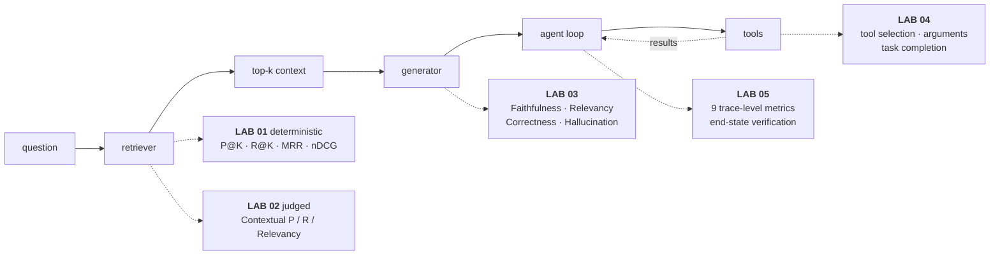

# RAG, Agent & Tool Evaluation — Tutorial Index

*A five-part interactive tutorial built from the `Tutorial_RAG_Agent_Tool_Evaluation` notebooks in `Sourav692/AI-ENGINEERING-DEMYSTIFIED`.*

Each part is a matched pair: an **interactive HTML lab** you can manipulate, and a **written companion** with diagrams, comparison tables and interview prep. Read them in order — every surface caps the ones downstream.

---

## TL;DR

- "Evaluate the RAG system" is not one task. It is **five narrower questions**, each with its own failure modes, its own metrics, and its own cost profile.
- **Reference-based vs referenceless** is the axis that decides everything operational. Reference-based gates the deploy; referenceless watches what happens after it.
- **LLM-as-judge is not a ground-truth oracle.** It is non-deterministic, sensitive to rubric wording, expensive at volume, and can be gamed by fluent-but-wrong output.
- The single strongest signal in the whole stack is **end-state verification** — reading the system of record — precisely because it cannot be talked past.

---

## The Five Surfaces

**Verify left to right, then look underneath.** Faithfulness scores are meaningless while recall is broken. Trajectory metrics are meaningless while the tools underneath are returning nothing usable.

---

## The Five Parts

### Part 01 — Deterministic Retrieval Metrics
**Files:** `01-deterministic-retrieval-metrics.html` · `.md` — from `01_Retrieval_Metrics_Deterministic.ipynb`

Precision@K, Recall@K, MRR and nDCG@K over the notebook's exact toy eval set. No LLM, no API key, no cost.

- **The lab:** drag K from 1 to 5. Precision moves non-monotonically, recall stalls at **0.67**, and MRR is pinned at **0.50** at every value of K.
- **The payoff:** one relevant chunk was never retrieved, so three of the four metrics are structurally capped. No value of K fixes a retriever that cannot reach the chunk.

### Part 02 — LLM-Judged Retrieval
**Files:** `02-llm-judged-retrieval-metrics.html` · `.md` — from `02_Retrieval_Metrics_LLM_Judged.ipynb`

The same question without hand-labelled chunk IDs. Contextual Precision cares about order, Recall about coverage, Relevancy about signal-to-noise.

- **The lab:** inject one failure at a time and watch exactly which score reacts. Reordering three chunks — adding nothing, removing nothing — drops precision from **1.00 to 0.58** while the other two stay flat.
- **The payoff:** the "thin coverage" case scores **1.00 on precision and relevancy** and 0.50 on recall — a broken retriever that looks perfect if you only run the referenceless metric.

### Part 03 — Generator Metrics
**Files:** `03-generator-metrics.html` · `.md` — from `03_Generator_Metrics_Referenceless.ipynb` + `04_Generator_Metrics_Reference_Based.ipynb`

Faithfulness, Answer Relevancy, Hallucination, Answer Correctness (`GEval`) and Answer Semantic Similarity on four answers to one question.

- **The lab:** switch between grounded, faithful-but-irrelevant, relevant-but-unfaithful, and faithful-to-bad-context.
- **The payoff:** the fourth answer scores **Faithfulness 1.00 and Answer Relevancy 1.00** while being flatly false. No referenceless metric can detect a corrupted knowledge base.

### Part 04 — Tool-Use Evaluation
**Files:** `04-tool-use-evaluation.html` · `.md` — from `09_Tool_Use_Evaluation.ipynb` + `10_Task_Completion_Evaluation.ipynb`

`ToolCorrectnessMetric` scored across six traces under three configurations.

- **The lab:** with the default name-only comparison, an extra billed call, a reversed sequence, a dropped output and a **wrong booking date** all score 1.00. Mean: **0.92**.
- **The payoff:** adding `should_exact_match=True` catches all five broken traces and collapses the mean to **0.17**. The metric didn't change — the contract you asked it to enforce did.

### Part 05 — Agent Trajectory Evaluation
**Files:** `05-agent-trajectory-evaluation.html` · `.md` — from `12_Agent_Trajectory_Evaluation.ipynb`

Nine trace-level metrics on a refund agent with one error, one recovery and one redundant call.

- **The lab:** remove waste one piece at a time across four trace variants.
- **The payoff:** **five of the nine metrics never move.** Task success, end-state and trajectory match all report a clean pass on a run where 40% of steps were waste.

---

## Reference-Based vs Referenceless

| | Reference-based | Referenceless |
|---|---|---|
| **Compares against** | `expected_output`, `expected_tools`, a gold trajectory | Internal consistency, or a judge against a rubric |
| **Someone must write** | The reference, per case, and keep it current | Nothing |
| **Scales to production traffic** | No — curated test sets only | Yes, at any volume |
| **Precision of signal** | High and repeatable | Lower, judge-quality dependent |
| **Belongs in** | Development and CI, as a hard pass/fail bar | Production monitoring |
| **Examples here** | P@K · R@K · nDCG · Contextual Precision/Recall · Answer Correctness · `ToolCorrectnessMetric` | Contextual Relevancy · Faithfulness · Answer Relevancy · `ArgumentCorrectnessMetric` · `TaskCompletionMetric` |

Mature setups run **both**, at different points in the lifecycle — not as a choice between them.

---

## Where LLM-as-Judge Actually Breaks

- **Judge-model choice matters.** A weaker judge produces noisier scores. The judge needs to be at least as capable as the task requires — sometimes more than the system being judged.
- **Non-determinism.** Two runs on the same input can disagree, especially near the threshold. Treat `metric.score` as a noisy estimate, and set thresholds away from where your scores cluster.
- **Criteria sensitivity.** A vague `GEval` criteria string produces a vague judge. The specificity in the rubric is the specificity in the judgement — which is why `evaluation_steps` beats a one-line `criteria` for anything that matters.
- **Cost compounds.** Five judged metrics over 500 test cases is 2,500+ judge calls per run. This is why the reference-based/referenceless split is an operational decision, not a philosophical one.
- **It can be gamed by fluency.** A judge reads text and reasons about whether it *sounds* right. That is exactly why Part 5 puts the most weight on end-state verification.

---

## What Breaks Where

| | ① Retrieval (det.) | ② Retrieval (judged) | ③ Generation | ④ Tool use | ⑤ Trajectory |
|---|---|---|---|---|---|
| **Symptom** | "It hallucinated" | No chunk labels exist | Answer wrong, metrics green | "Your flight is booked!" | 99% success, cost tripling |
| **Key metric** | `recall@K` | Contextual Recall | Answer Correctness | Argument correctness | End-state verification |
| **Cost** | Free, ms | 1 judge call per metric | 1–3 judge calls per metric | Free (deterministic) or 1 call | Full graph run per case |
| **Needs** | Labelled chunk IDs | `expected_output` for 2 of 3 | `expected_output` for correctness | `expected_tools` or nothing | Trace + system of record |
| **Runs in CI?** | Every commit | Smoke set per commit | Nightly full suite | Every commit | Pre-release |

---

## The 15 Source Notebooks

| Notebook | Covers | Lab |
|---|---|---|
| `00_Evaluation_Landscape` | Taxonomy, reference-based vs referenceless, judge failure modes, tooling map | this index |
| `01_Retrieval_Metrics_Deterministic` | Precision@K, Recall@K, MRR, nDCG | **01** |
| `02_Retrieval_Metrics_LLM_Judged` | Contextual Precision / Recall / Relevancy | **02** |
| `03_Generator_Metrics_Referenceless` | Faithfulness, Answer Relevancy, Hallucination | **03** |
| `04_Generator_Metrics_Reference_Based` | Answer Correctness via `GEval`, Semantic Similarity | **03** |
| `05_RAG_Eval_Inside_the_Pipeline` | Evaluation as LangGraph nodes — gates, not after-the-fact scoring | 03 · 05 |
| `06_RAGAS_in_Practice` | RAGAS quickstart, multi-metric, the pytest/CI pattern | 03 |
| `07_RAG_Capstone_Build_and_Evaluate` | Build a RAG system, synthesize a golden dataset, run the full suite | 01 · 02 · 03 |
| `08_MultiTurn_Conversational_Evaluation` | `ConversationalGEval`, turn relevancy, knowledge retention | — |
| `09_Tool_Use_Evaluation` | `ToolCorrectnessMetric`, `ArgumentCorrectnessMetric`, `ToolUseMetric` | **04** |
| `10_Task_Completion_Evaluation` | `TaskCompletionMetric`, custom rubrics, outcome verification | **04** |
| `11_Same_Evals_with_MLflow` | The same questions via `mlflow.genai.evaluate()` scorers over traces | 04 · 05 |
| `12_Agent_Trajectory_Evaluation` | The 9-metric trace-level suite on a refund-agent scenario | **05** |
| `13_Production_Grade_Agent_Eval_Overview` | Live tracing + offline experiments (Arize Phoenix) | 05 |
| `14_Capstone_CrewAI_Travel_Planner_Eval` | Task completion against a real running 3-agent app | 04 · 05 |

Multi-turn conversational evaluation (`08`) is the one module without a lab in this series — it is a distinct enough surface to deserve its own.

---

## The Four Tools, and What Each Is Actually For

| Tool | What it's really for |
|---|---|
| **DeepEval** | The general-purpose metric library — retrieval, generation, tool use, task completion, conversational, plus `GEval` for custom rubrics. Pytest-friendly, good for CI. |
| **RAGAS** | RAG-specific, older and narrower, a common ecosystem default. Useful as a second opinion on the same test case. |
| **MLflow** | Evaluation inside an experiment-tracking platform — the same metrics, versioned and comparable across runs. |
| **Arize Phoenix** | Production tracing plus an offline experiment framework. The only one built around live traces rather than one-off test cases. |

None is "the right one." DeepEval and RAGAS answer *is this output good*; MLflow answers *is it good, tracked against my experiment history*; Phoenix answers *is it good, and here is the full trace of how it got there*.

---

## Suggested Reading Order

- **Open `00-evaluation-index.html`** for the interactive surface map.
- **Part 01** — get deterministic retrieval metrics into CI. Free, fast, highest leverage available.
- **Part 02** — add judged retrieval where labels don't exist, and validate the judge before trusting it.
- **Part 03** — measure generation, and understand exactly which failure your referenceless metrics cannot see.
- **Part 04** — check your `ToolCorrectnessMetric` configuration before believing its score.
- **Part 05** — only once the layers above are measured. Instrument every step, then grade the path.

**If you only have an hour:** this index → Part 02 → Part 04 → Part 05.

---

## Key Takeaways

- **Five surfaces, five questions, five different fixes.** A single "eval score" destroys the diagnostic value that justifies running any of it.
- **Deterministic before judged, always.** Arithmetic is free, repeatable, and safe as a gate. Spend judge calls only on what arithmetic cannot decide.
- **Every evaluator is a system that can fail.** Judges drift, golden sets go stale, metric configurations quietly weaken. Version them, validate them, and report the configuration alongside the score.
- **Read the system of record.** When the stakes are real, the only check a confident sentence cannot defeat is the one that looks at what actually changed.
