=-

# Deterministic Retrieval Metrics: Four Numbers That Are Supposed to Disagrees

*RAG, Agent & Tool Evaluation — Part 1 of 5*

Before any judge model, any API key, or any cost, there is a layer of retrieval evaluation that is pure arithmetic over labelled ground truth. It is the cheapest signal in the entire stack and it caps everything downstream — so it is where the tutorial starts.

**Companion lab:** `01-deterministic-retrieval-metrics.html` — drag `K` and watch precision and recall pull in opposite directions while MRR refuses to move at all.

**Source module:** `01_Retrieval_Metrics_Deterministic.ipynb`

---

## TL;DR

- Four metrics — **Precision@K, Recall@K, MRR, nDCG@K** — score the same ranked list and answer four different questions. Reporting one of them is how retrieval bugs hide.
- All four need **pre-labelled ground truth** (`relevant_ids`, `relevance_grades`). That's what makes them free and deterministic, and also what confines them to curated eval sets rather than production traffic.
- In the tutorial's toy set, no value of `K` fixes the problem: the most useful chunk was **never retrieved**, so recall stalls at 0.67 and MRR is pinned at 0.50 forever.
- A wrong answer can come from a broken retriever *or* a broken generator. These metrics are how you tell which, before spending anything on a judge.

---

## The Problem: "The Model Hallucinated"

Every RAG bug report arrives with the same diagnosis attached, and it is usually wrong.

- If the relevant chunk never entered the prompt, the generator was **not** hallucinating in any meaningful sense — it answered faithfully from a context that didn't contain the answer.
- Faithfulness, answer relevancy, and every other generation metric are **bounded by retrieval**. Measuring them while recall sits at 0.67 tells you nothing about your generator.
- The fix is completely different in each case. Retrieval failures want chunking, hybrid search, or reranking. Generation failures want prompt or model changes. Guessing wrong costs a sprint.

---

## Core Mechanism: The Four Formulas

    Precision@K = (relevant chunks in top K) / K
    Recall@K    = (relevant chunks in top K) / (total relevant chunks that exist)
    MRR         = 1 / (rank of the FIRST relevant chunk)
    nDCG@K      = DCG@K / IDCG@K,  where DCG = Σ  grade_i / log2(i + 2)

Unpacking each:

- **Precision@K** — *"how much of what I paid for was useful?"* Penalises noise. Falls as `K` rises, always.
- **Recall@K** — *"did I find everything that mattered?"* Penalises misses. Rises with `K`, up to a ceiling set by what the retriever can reach at all.
- **MRR** — *"is the best chunk at the top?"* Only looks at the first hit. A retriever can have perfect recall and terrible MRR, which means the model reads three pieces of noise before it reaches the answer.
- **nDCG@K** — *"is the ranking good when relevance is a matter of degree?"* Uses graded relevance (0–3) rather than a binary in/out, and discounts by rank position. The `log2(i + 2)` denominator is why rank 1 is worth full credit and rank 5 is worth about 39% of it.

The critical detail in nDCG: **IDCG is computed over the ideal ranking of all graded chunks, including ones the retriever never returned.** That is why it stays capped below 1.0 in the lab no matter how you reorder what *was* retrieved.

---

## The Eval Set, and Why It's Built This Way

```mermaid
flowchart LR
    Q["query:<br/>BST delete complexity"] --> RET["retriever"]
    RET --> R1["#1 chunk_3<br/>grade 0 · noise"]
    RET --> R2["#2 chunk_1<br/>grade 3 · relevant"]
    RET --> R3["#3 chunk_7<br/>grade 1 · not labelled relevant"]
    RET --> R4["#4 chunk_2<br/>grade 2 · relevant"]
    RET --> R5["#5 chunk_9<br/>grade 0 · noise"]
    GT["chunk_5<br/>grade 3 · relevant"] -.->|"never retrieved"| RET

    style GT fill:#2a1620,stroke:#5c2b40
    style R2 fill:#14261c,stroke:#24523a
    style R4 fill:#14261c,stroke:#24523a
```

`chunk_5` is the whole lesson. It is labelled relevant, graded 3, and the retriever never returned it — so it is invisible to precision and MRR, and it is the single reason recall and nDCG are capped.

---

## What the Numbers Actually Do as K Moves

| K | Precision@K    | Recall@K       | MRR            | nDCG@K         |
| - | -------------- | -------------- | -------------- | -------------- |
| 1 | 0.00           | 0.00           | 0.50           | 0.00           |
| 2 | 0.50           | 0.33           | 0.50           | 0.39           |
| 3 | 0.33           | 0.33           | 0.50           | 0.41           |
| 4 | 0.50           | 0.67           | 0.50           | 0.51           |
| 5 | **0.40** | **0.67** | **0.50** | **0.51** |

Three things worth noticing:

- **Precision is not monotonic.** It drops at K=3 (a non-relevant chunk enters) and recovers at K=4 (a relevant one does). A single precision number without its K is meaningless.
- **MRR is constant at 0.50 across every K.** The first relevant chunk sits at rank 2 and no amount of retrieving more can change that. When MRR is flat and low, you have a *ranking* problem, and the fix is a reranker or hybrid search — not a bigger K.
- **Recall and nDCG both flatline after K=4.** That flatline is the signature of a chunk that isn't reachable at all. Raising K past a recall plateau buys tokens and latency and nothing else.

---

## Reading the Four Together — a Triage Table

| What you see                        | What it means                              | Where to look                                             |
| ----------------------------------- | ------------------------------------------ | --------------------------------------------------------- |
| Low recall, any precision           | The answer isn't in the prompt             | Chunking, embedding model, hybrid search, query rewriting |
| Good recall, low MRR                | It's in the prompt, buried                 | Reranker / cross-encoder                                  |
| Good recall, falling precision      | K is too large for this query              | Dynamic K, or retrieve wide and rerank narrow             |
| Good recall and MRR, low nDCG       | Ranking ignores degrees of usefulness      | Graded labels + a ranking-aware retriever                 |
| Everything good, answer still wrong | Retrieval is fine — go look at generation | Part 3's faithfulness and correctness metrics             |

---

## When to Use It — and When Not To

**Use deterministic retrieval metrics when:**

- You are setting up evaluation for the first time. This is the highest-leverage day of work available: no keys, no cost, runs on every commit.
- You are comparing retrievers, chunk sizes, or embedding models. The comparison is exact and repeatable, with no judge variance in the way.
- You need a CI gate that will not flake. An LLM-judged metric can disagree with itself across runs; this cannot.

**Don't rely on them alone when:**

- You have no labelled `relevant_ids` and can't produce them. Hand-labelling doesn't scale to arbitrary production traffic — that's what Part 2's LLM-judged contextual metrics exist for.
- Relevance is genuinely fuzzy or query-dependent. Binary in/out labels force a judgement someone has to make and keep current.
- Your golden set was built once and never refreshed. A stale eval set silently stops measuring your live query distribution, and the metric stays green while quality drifts.

---

## Interview Spotlight: 5 Questions You Might Get Asked

*Production, real-time framing — the kind asked at OpenAI-, Anthropic-, and Google-caliber interviews.*

### 1. Your support RAG serves 30k queries/day. Leadership asks for "one number" for retrieval quality on the exec dashboard. What do you put there, and what do you say about the request?

**What a strong answer covers:**

- Picks recall@K as the single number if forced, because it is the ceiling on everything downstream and its failure mode is the most severe
- Explains what that single number hides — a good recall figure is compatible with the answer sitting at rank 8 under seven pieces of noise
- Proposes recall@K on the dashboard with precision@K and MRR one click away, rather than refusing the request outright
- Notes that the number is only meaningful against a golden set that tracks the live query distribution, and commits to a refresh cadence

### 2. Retrieval recall@5 is 0.94 on your eval set, but users keep reporting wrong answers for queries containing product SKUs like `SKU-88213`. Walk through the diagnosis.

**What a strong answer covers:**

- Immediately suspects the eval set's query distribution rather than the metric — a 0.94 average can hide a segment at 0.2
- Segments recall by query type (natural language vs. exact identifier) before touching the retriever
- Names the likely mechanism: dense embeddings blur rare literal tokens, so exact-ID queries need a sparse/BM25 channel
- Proposes adding the failing query shape to the golden set permanently, so the fix is regression-protected

### 3. Your team wants to raise K from 5 to 20 "to be safe." Argue for or against, with the specific evidence you'd collect first.

**What a strong answer covers:**

- Requires the recall-vs-K curve first: if recall has plateaued, the extra 15 chunks add cost and latency for zero recall
- Quantifies the cost side concretely — tokens per query times query volume, plus the latency impact on p95
- Raises the quality risk, not just the cost: long noisy contexts make the generator likelier to ground on the wrong chunk
- Offers the alternative that usually wins — retrieve wide, rerank, and pass a small K to the model

### 4. How would you know your retrieval eval set has gone stale, without waiting for a customer to complain?

**What a strong answer covers:**

- Compares the distribution of production queries against the eval set's queries on some cheap signal (embedding clusters, intent labels, length)
- Watches for divergence between offline metrics and online proxies like click-through, thumbs-down rate, or escalation rate
- Treats the golden set as versioned infrastructure alongside the index, refreshed from sampled real logs on a schedule
- Notes the specific trap: metrics that never move are more often a dead eval set than a stable system

### 5. MRR is 0.50 and flat across every K you try. What is that telling you, and what would you change?

**What a strong answer covers:**

- Reads it correctly as a ranking problem, not a coverage problem — the right chunk is retrieved but never first
- Explains why K is structurally incapable of fixing it: MRR only looks at the first relevant hit's position
- Proposes a cross-encoder reranker over a wide candidate set as the standard fix, and names the latency cost it adds
- Points out the downstream consequence — a low-MRR context makes the generator read noise first, which shows up later as a faithfulness failure

---

## Key Takeaways

- **Four metrics, four questions.** Precision catches noise, recall catches misses, MRR catches burial, nDCG catches bad ranking under graded relevance. Any one alone is a blind spot.
- **A recall plateau is a hard ceiling.** When recall stops moving as K rises, the missing chunk is unreachable — raising K past that point buys tokens and nothing else.
- **Flat, low MRR means reranking, not more retrieval.** No value of K can promote a chunk that is already retrieved.
- **These metrics are free, and that is the point.** Run them on every commit. Save the judge calls for the questions arithmetic genuinely cannot answer.

---

*Next: Part 2 — LLM-Judged Retrieval: Contextual Precision, Recall and Relevancy.*
