# LLM-Judged Retrieval: Three Metrics Because There Are Three Failures

*RAG, Agent & Tool Evaluation — Part 2 of 5*

Part 1's metrics need a hand-written `relevant_ids` list for every query. That does not scale past a curated eval set. DeepEval's three **Contextual** metrics answer the same "is retrieval working" question using an LLM judge instead of hand-labelled IDs — and they answer it three separate times, on purpose.

**Companion lab:** `02-llm-judged-retrieval-metrics.html` — inject one failure at a time and watch exactly which of the three numbers reacts.

**Source module:** `02_Retrieval_Metrics_LLM_Judged.ipynb`

---

## TL;DR

- **Contextual Precision** cares about **order**, **Contextual Recall** cares about **coverage**, **Contextual Relevancy** cares about **signal-to-noise**. A retriever can fail any one while passing the other two.
- Reordering three chunks — adding nothing, removing nothing — drops precision from **1.00 to 0.58** while recall and relevancy do not move at all.
- Only **Relevancy** is referenceless. The other two need `expected_output`, which puts them in CI rather than production monitoring.
- The judge produces **verdicts**; the score is arithmetic over those verdicts. That split is why the same verdicts always give the same score, and why two judge runs can still disagree.

---

## The Problem: One "Retrieval Score" Hides Three Bugs

- Averaging the three into a single number is the fastest way to make a ranking bug invisible: precision halves, the average moves a little, nobody investigates.
- The three failures have **completely different fixes**. Bad ranking wants a reranker. Thin coverage wants better chunking or a larger K. Noise dilution wants a tighter retriever or a smaller K. A blended score tells you none of that.
- Two of the three need a reference answer. If you only have production traffic and no labels, you are running one metric, not three — and you should know which blind spots that leaves.

---

## Core Mechanism: Verdicts, Then Arithmetic

The judge's only job is to label. The scoring is deterministic:

    Contextual Precision = Σ (precision@i for each position i holding a relevant chunk) / (number of relevant chunks)
    Contextual Recall    = (claims in expected_output supported by the context) / (total claims)
    Contextual Relevancy = (relevant chunks) / (total chunks retrieved)

- **Precision is rank-weighted.** A relevant chunk at position 1 contributes `1/1`; the same chunk at position 3 contributes at most `1/3`. That weighting is the entire reason reordering changes the score.
- **Recall compares context to `expected_output`, not `actual_output`.** It asks whether enough was *fetched to support* the full answer, independent of whether the generator used it. This trips people up constantly.
- **Relevancy is the simplest and the only referenceless one.** No ground truth, no order sensitivity — just what fraction of what you retrieved was on topic.

---

## The Three Metrics as a Decision Tree

```mermaid
flowchart TD
    S["Retrieval looks wrong"] --> Q1{"Do you have an<br/>expected_output?"}
    Q1 -->|no| REL["Contextual Relevancy only<br/>signal-to-noise, runs on live traffic"]
    Q1 -->|yes| Q2{"Are all the answer's<br/>claims supported?"}
    Q2 -->|no| CR["Contextual Recall fails<br/>→ chunking, K, query rewriting"]
    Q2 -->|yes| Q3{"Are the relevant chunks<br/>ranked above the noise?"}
    Q3 -->|no| CP["Contextual Precision fails<br/>→ reranker, hybrid search"]
    Q3 -->|yes| OK["Retrieval is sound<br/>→ go look at generation (Part 3)"]

    style CR fill:#14261c,stroke:#24523a
    style CP fill:#12352f,stroke:#2c5a56
    style REL fill:#241d12,stroke:#6b4c18
```

The order matters. Coverage before ranking: there is no point tuning a reranker over a context that never contained the answer.

---

## The Lab's Four Scenarios

One query — *"What is Apache Spark used for?"* — and four retrieval outcomes:

| Scenario | Precision | Recall | Relevancy | What moved |
|---|---|---|---|---|
| Healthy retrieval | 1.00 | 1.00 | 0.67 | Baseline — relevancy is *already* below 1.0 |
| **Bad ranking** (same chunks, reordered) | **0.58** | 1.00 | 0.67 | Precision alone |
| **Thin coverage** (one perfect chunk) | 1.00 | **0.50** | 1.00 | Recall alone |
| **Noise dilution** (1 relevant of 4) | **0.33** | 1.00 | **0.25** | Relevancy, dragging precision with it |

Three observations that are easy to miss:

- **Healthy retrieval scores 0.67 on relevancy.** That is not a defect. Relevancy is a ratio, and a perfect 1.00 usually means K is too small rather than the retriever being flawless.
- **Thin coverage scores 1.00 on two of three metrics.** If you are running relevancy alone — the only option without labels — this broken retriever looks perfect.
- **Relevancy and precision fail together under noise dilution.** They decouple under bad ranking, not here: noise ranked *above* signal is simultaneously a ranking failure and a signal-to-noise failure.

---

## The Threshold Trap

Thin coverage scores exactly **0.50** recall against DeepEval's default `threshold=0.5`. That test case sits precisely on the pass/fail line, which means:

- One flipped claim verdict on a re-run flips the whole test case.
- The judge is non-deterministic, so re-running the identical input can genuinely produce a different verdict.
- A score sitting on its threshold should be read as a coin toss, not a pass. In CI, either move the threshold away from where your scores cluster, or run near-threshold cases multiple times and take a majority.

---

## When to Use It — and When Not To

**Use LLM-judged contextual metrics when:**

- You have production traffic and no labelled chunk IDs. Relevancy runs on anything.
- Your golden set exists but does not cover the query shapes users actually send, and hand-labelling every new one is not realistic.
- You want a reason string alongside the score. `include_reason=True` gives you the judge's justification, which is often more actionable than the number.

**Stay with Part 1's deterministic metrics when:**

- You are gating CI on a hard pass/fail bar. Judge non-determinism makes flaky gates.
- You are comparing two retrievers head to head. Deterministic metrics remove judge variance from the comparison entirely.
- Cost matters at volume. Three contextual metrics over 500 test cases is 1,500+ judge calls per run, before you have measured generation at all.

---

## Interview Spotlight: 5 Questions You Might Get Asked

*Production, real-time framing — the kind asked at OpenAI-, Anthropic-, and Google-caliber interviews.*

### 1. You're standing up retrieval evaluation for a customer-facing KB assistant with no labelled data and a launch in three days. Which of the three contextual metrics do you ship, and what do you tell the team you can't see?

**What a strong answer covers:**
- Ships Contextual Relevancy first, because it's the only one that needs no `expected_output` and can run over real traffic immediately
- States the blind spot explicitly: relevancy cannot detect missing coverage, so a retriever returning one perfectly on-topic chunk scores 1.00 while the answer is unwriteable
- Proposes hand-labelling a small set (30–50 queries) in parallel to unlock precision and recall for CI, rather than treating labels as all-or-nothing
- Names a cheap compensating signal for coverage in the meantime — abstention rate, or answer length collapse

### 2. Contextual Precision drops from 0.91 to 0.62 after a release. Recall and relevancy are unchanged. What shipped?

**What a strong answer covers:**
- Reads the signature correctly: same chunks retrieved, different order — so the retrieval set is intact and the *ranking* changed
- Suspects a reranker change, a scoring/fusion weight change, or a switch in how ties are broken, not an embedding or chunking change
- Notes what recall being flat rules out: nothing was lost from the candidate set
- Proposes diffing the ranked lists for the same queries pre- and post-release as the fastest confirmation

### 3. Your Contextual Recall scores cluster tightly around 0.5, the default threshold. Why is that dangerous, and what would you do?

**What a strong answer covers:**
- Identifies the flakiness: LLM judges are non-deterministic, so cases at the threshold flip between runs and CI becomes unreliable
- Distinguishes the two possible causes — a genuinely mediocre retriever, versus a threshold placed where the score distribution happens to pile up
- Proposes plotting the score distribution and setting the threshold in a sparse region, or requiring N-of-M runs for near-threshold cases
- Connects it back to a broader rule: never treat `metric.score` as an exact value; treat it as a noisy estimate

### 4. How do you validate that the judge itself is any good, before you let it gate a deploy?

**What a strong answer covers:**
- Treats the judge as a classifier: hand-label a set, then measure the judge's own precision and recall against those human labels
- Checks agreement at the *verdict* level (is this chunk relevant?) rather than only at the final score, since verdicts are what the judge actually produces
- Tests judge-model sensitivity by running the same cases through a weaker and a stronger model and comparing
- Notes that a judge weaker than the task will be systematically noisy, and that the reason strings are the fastest way to spot a miscalibrated rubric

### 5. A stakeholder wants "one retrieval health number" for a weekly report. What do you give them?

**What a strong answer covers:**
- Resists the straight average, and explains concretely what it hides — the reordering case where precision halves and the mean barely moves
- Offers a min or a worst-of-three instead, so the reported number degrades when any single dimension does
- Alternatively reports pass rates per metric against thresholds, which is more interpretable than an averaged score
- Keeps the three sub-scores one click away, since the fix depends entirely on *which* one failed

---

## Key Takeaways

- **Three metrics, three failure modes, three different fixes.** Order, coverage, signal-to-noise. Averaging them destroys the diagnostic value that justifies running them.
- **Reordering alone moves precision by a third.** If your retrieval score doesn't respond to ranking, it isn't measuring ranking.
- **Relevancy is the only one you can run without labels** — which makes it the production metric and the one with the biggest blind spot.
- **The judge labels; the arithmetic scores.** Validate the labelling before trusting the number, and treat any score sitting on its threshold as unresolved.

---
*Previous: Part 1 — Deterministic Retrieval Metrics. Next: Part 3 — Generator Metrics: Referenceless vs Reference-Based.*
