# Generator Metrics: Faithful, Relevant, and Completely Wrong

*RAG, Agent & Tool Evaluation — Part 3 of 5*

Parts 1 and 2 asked whether the right chunks reached the prompt. This part asks whether the answer built on top of them is any good — and finds one failure that no referenceless metric can see, however many of them you run.

**Companion lab:** `03-generator-metrics.html` — four answers to one question; the fourth scores 1.00 on both referenceless metrics while being flatly false.

**Source modules:** `03_Generator_Metrics_Referenceless.ipynb`, `04_Generator_Metrics_Reference_Based.ipynb`

---

## TL;DR

- **Answer Relevancy** compares to the `input`. **Faithfulness** compares to the `retrieval_context`. **Hallucination** compares to a separate trusted `context`. Three different reference points, three different failures.
- An answer can be **faithful but irrelevant** (grounded, doesn't answer the question), **relevant but unfaithful** (answers it, invents facts), or **faithful to bad context** (perfectly grounded in a chunk that was wrong).
- That third case scores **Faithfulness 1.00 and Answer Relevancy 1.00**. No referenceless metric catches a corrupted knowledge base.
- **Hallucination runs inverted** — higher means worse. Always check a metric's score direction rather than assuming.
- **Answer Correctness has no DeepEval class.** "Correct" is task-specific, so the recommended pattern is a custom `GEval` rubric.

---

## The Problem: "The Answer Is Wrong" Has Four Meanings

- It didn't answer the question → **Answer Relevancy**
- It invented facts beyond the context → **Faithfulness**
- It contradicts what we know to be true → **Hallucination**
- It faithfully repeated something false → **only Answer Correctness**

These are the most confused metrics in the entire space, because from the outside all four look identical: a user gets a bad answer. From the inside they have entirely different fixes — prompt work, grounding constraints, index repair, and reference curation respectively.

---

## Core Mechanism: Claim Decomposition, Then Ratios

The judge does not score the answer as one blob. It decomposes first:

    Faithfulness    = (claims supported by retrieval_context) / (total claims)
    Answer Relevancy = (statements that address the input) / (total statements)
    Hallucination    = (claims contradicting the trusted context) / (total claims)

- Faithfulness and Answer Relevancy use **different decompositions of the same text** — factual claims versus statements. An answer can have three grounded claims and only one on-topic statement.
- Hallucination checks a **separately supplied `context`**, not `retrieval_context`. That distinction is the entire reason it can catch what Faithfulness cannot.
- All three are ratios over judge verdicts. Same verdicts, same score — but the verdicts themselves are non-deterministic.

Reference-based metrics work differently:

- **Answer Correctness** is a custom `GEval`, written by you, in either `criteria` (one sentence) or `evaluation_steps` (an explicit procedure) style.
- **Answer Semantic Similarity** is plain embedding cosine similarity. No LLM call, fast and cheap — and it measures *topical* closeness, not factual agreement.

---

## The Four Answers, Scored

Question: *"What is the time complexity of deleting a node from a BST?"*

| Answer | Relevancy | Faithfulness | Hallucination ↓ | Correctness | Similarity |
|---|---|---|---|---|---|
| Grounded & relevant | 1.00 | 1.00 | 0.00 | 0.95 | 0.94 |
| Faithful but irrelevant | **0.33** | 1.00 | 0.00 | 0.35 | **0.78** |
| Relevant but unfaithful | 1.00 | **0.50** | 0.50 | 0.40 | **0.91** |
| **Faithful to bad context** | **1.00** | **1.00** | **1.00** | **0.10** | **0.83** |

Read the last row carefully. The retriever returned a chunk claiming BST deletion is O(1). The generator repeated it accurately. Every claim is supported by the context it was given, and the answer directly addresses the question — so both referenceless metrics report a perfect score on an answer that is simply false.

The Semantic Similarity column is its own warning: **0.83** for an answer that says O(1) where the truth is O(h). Embeddings measure topic, and "constant time" and "logarithmic time" are topically adjacent.

---

## Where Each Metric Can and Cannot See

```mermaid
flowchart TD
    A["actual_output"] --> Q1{"Does it address<br/>the input?"}
    Q1 -->|no| AR["Answer Relevancy fails<br/>→ prompt / instruction problem"]
    Q1 -->|yes| Q2{"Is every claim in<br/>retrieval_context?"}
    Q2 -->|no| FA["Faithfulness fails<br/>→ grounding / decoding problem"]
    Q2 -->|yes| Q3{"Was retrieval_context<br/>itself correct?"}
    Q3 -->|"referenceless metrics<br/>cannot ask this"| BLIND["BLIND SPOT<br/>faithful and wrong"]
    Q3 -->|"needs expected_output<br/>or trusted context"| AC["Answer Correctness<br/>Hallucination"]

    style BLIND fill:#2a1620,stroke:#5c2b40
    style AC fill:#2a2140,stroke:#a487f5
```

The blind spot is structural, not a tuning problem. Faithfulness is defined relative to the retrieved context, so it cannot evaluate that context.

---

## Faithfulness vs Hallucination — the Distinction That Matters

| | Faithfulness | Hallucination |
|---|---|---|
| Compares against | `retrieval_context` — whatever *this* query fetched | a separate curated `context` you supply |
| Score direction | Higher is better | **Higher is worse** |
| Catches | The generator inventing beyond its input | The answer contradicting known truth |
| Misses | A wrong chunk faithfully repeated | Anything outside your curated context |
| Runs on production traffic | Yes | Only where you have trusted context |

Use Faithfulness to catch a generator that goes beyond what it was given. Use Hallucination when you have an independent, trusted source and want to check against it regardless of what retrieval returned.

---

## When to Use It — and When Not To

**Referenceless metrics (Relevancy, Faithfulness) when:**

- Monitoring production traffic where nobody is writing reference answers.
- Catching decoding-level failures — invention, over-claiming, drifting off the question.
- You need volume: they scale to any input with zero labelling cost.

**Reference-based metrics (Correctness, Similarity) when:**

- Gating CI, where you control the test set and want a hard pass/fail bar.
- The failure you fear is *wrongness*, not ungroundedness — which includes every index-corruption and stale-document scenario.
- Comparing prompt or model versions, where a fixed reference makes the comparison meaningful.

**Watch out for:**

- **Semantic Similarity as a correctness proxy.** It will happily score a wrong number at 0.83. Pair it with a judged correctness check; never substitute it.
- **Vague `GEval` criteria.** The specificity you put into the rubric is the specificity you get back. One-line criteria produce one-line thinking.
- **Cost compounding.** Five judged metrics over 500 test cases is 2,500+ judge calls per run, before agents enter the picture.

---

## Interview Spotlight: 5 Questions You Might Get Asked

*Production, real-time framing — the kind asked at OpenAI-, Anthropic-, and Google-caliber interviews.*

### 1. Your production RAG monitors Faithfulness and Answer Relevancy on live traffic. Both sit above 0.95 for a month. Then a customer proves the assistant has been giving wrong compliance guidance the whole time. How is that possible, and what do you add?

**What a strong answer covers:**
- Identifies the mechanism precisely: both metrics are referenceless, so a document that is itself wrong produces a perfectly faithful, perfectly relevant, wrong answer
- Points out that no threshold on either metric could have caught this — it is a structural blind spot, not a calibration failure
- Proposes reference-based coverage for the high-stakes slice: a curated golden set for compliance queries, checked with Answer Correctness
- Adds the upstream fix too — index freshness monitoring and source-level review, since the root cause is the knowledge base, not the model

### 2. Faithfulness is 0.62 and Answer Relevancy is 0.97 on a set of failing cases. Where do you look first?

**What a strong answer covers:**
- Reads it as a grounding problem, not a retrieval or prompt-comprehension problem: the model is answering the right question and inventing while it does
- Checks whether the retrieved context is thin — a model handed insufficient context often fills gaps rather than abstaining
- Looks at decoding and prompt constraints: temperature, explicit "answer only from the context" instruction, and whether abstention is even an allowed output
- Uses the per-claim verdicts rather than the aggregate score, since the unsupported claims name the failure directly

### 3. A teammate proposes replacing your LLM-judged Answer Correctness with embedding cosine similarity to cut cost by 90%. Make the case either way.

**What a strong answer covers:**
- Names the specific weakness with a concrete example: an answer saying O(1) where the truth is O(h) scores ~0.83 because the two are topically adjacent
- Concedes where similarity genuinely works — catching answers that are off-topic entirely, and as a cheap pre-filter before the expensive judge
- Proposes the tiered design rather than the swap: similarity on everything, judged correctness on the cases similarity flags plus a random sample
- Quantifies what "90% cheaper" is actually buying, and whether the failure it lets through is one the product can absorb

### 4. How would you design an Answer Correctness rubric for a medical Q&A assistant, and what makes `evaluation_steps` better than `criteria` here?

**What a strong answer covers:**
- Writes explicit, ordered steps rather than one sentence, so the judge's procedure is auditable and reviewable by a domain expert
- Weights failures asymmetrically — a wrong dosage is not the same class of error as different phrasing of the same advice
- Combines multiple test-case fields in one rubric: agreement with `expected_output` *and* grounding in `retrieval_context`
- Notes that a vague criteria string produces a vague judge, and that in a regulated domain the rubric is itself a reviewable artifact

### 5. Your Hallucination metric jumps from 0.05 to 0.40 and the team celebrates the improvement. What went wrong?

**What a strong answer covers:**
- Catches the score-direction trap immediately: Hallucination is inverted, so 0.40 is four times worse, not better
- Generalises the lesson — always verify a new metric's direction from its documentation rather than assuming higher is better
- Suggests guarding against it operationally: name dashboard panels with the direction, or normalise all metrics to higher-is-better before display
- Then actually investigates the regression: what changed in the trusted context, the retriever, or the generator to quadruple contradictions

---

## Key Takeaways

- **Three referenceless metrics, three reference points.** Relevancy sees the question, Faithfulness sees the retrieved context, Hallucination sees a trusted source. None of them sees whether the retrieved context was true.
- **Faithful and wrong is a real, common, invisible state.** It is the reason a mature suite runs reference-based metrics somewhere, even if only on a curated slice.
- **Semantic similarity measures topic, not truth.** 0.83 for a factually opposite answer is not an edge case; it is what embeddings do.
- **Write the correctness rubric yourself.** There is no generic "is it right" class because "right" is a property of your task, not of language.

---
*Previous: Part 2 — LLM-Judged Retrieval. Next: Part 4 — Tool-Use Evaluation.*
