# Tool-Use Evaluation: The Metric Is Only as Strict as Its Constructor

*RAG, Agent & Tool Evaluation — Part 4 of 5*

Tool use is where agents actually fail. A travel bot that says *"Your flight is booked!"* is useless if it never called the booking API — and the sentence reads exactly the same either way. This part covers the metrics that look underneath the sentence, and the configuration decisions that determine whether they see anything at all.

**Companion lab:** `04-tool-use-evaluation.html` — six traces, three metric configurations, and a default setting that scores four broken traces at 1.00.

**Source modules:** `09_Tool_Use_Evaluation.ipynb`, `10_Task_Completion_Evaluation.ipynb`

---

## TL;DR

- **`ToolCorrectnessMetric` is deterministic, not judged** — it compares `tools_called` against `expected_tools`. Its strictness lives entirely in `evaluation_params` and `should_exact_match`.
- With the **default name-only comparison**, an extra billed API call, a reversed sequence, a dropped output and a **wrong travel date** all score 1.00. Mean across six traces: **0.92**.
- Adding `ToolCallParams.INPUT_PARAMETERS` catches the wrong date. Adding `OUTPUT` plus `should_exact_match=True` catches everything and turns the metric **binary** — mean collapses to **0.17**.
- `ArgumentCorrectnessMetric` is the referenceless counterpart for production. `TaskCompletionMetric` asks the question none of them ask: **did the user actually get what they wanted?**
- Validate schemas **deterministically first**. A malformed call is worth zero without spending a judge call to discover that.

---

## The Problem: The Output Is the Tip of the Iceberg

In standard LLM evaluation you compare an output to a reference. With tool-using agents, the output sits on top of a sequence of decisions — which tools, in what order, with what arguments, and how the results were interpreted. Each is a separate failure point.

Take a support agent with `OrderLookup`, `PolicyRetriever`, and `RefundProcessor`. A user asks about returning an item from order #12345. The correct behaviour is lookup → policy → refund if eligible. What can go wrong:

- The agent **skips the lookup** and hallucinates the order details.
- The agent calls the right tools with the **wrong order ID**.
- The agent calls `RefundProcessor` **before checking eligibility**.

The final response sounds correct in all three cases. Only tool-level evaluation catches any of them.

---

## Core Mechanism: Three Metrics at Three Granularities

| Metric | Type | Needs | Best for |
|---|---|---|---|
| `ToolCorrectnessMetric` | Reference-based, **deterministic** | `expected_tools` | Regression and CI, where correct behaviour is known |
| `ArgumentCorrectnessMetric` | Referenceless, **LLM-judged** | Tool descriptions only | Dynamic workflows, production monitoring |
| `ToolUseMetric` | Multi-turn, LLM-judged | `available_tools` (required) | Conversational agents; final score is the **min** of the selection and argument sub-scores |
| `TaskCompletionMetric` | Referenceless, outcome-level | `input` + `actual_output` | The question the mechanics never ask |

The `min` in `ToolUseMetric` is worth internalising: a failure in either dimension pulls the whole score down, so a perfect tool selection with garbage arguments does not average its way to a pass.

---

## The Configuration Is the Metric

```mermaid
flowchart TD
    T["tools_called vs expected_tools"] --> A{"evaluation_params?"}
    A -->|"none — names only"| S1["extra calls: pass<br/>wrong order: pass<br/>wrong args: pass<br/>dropped output: pass"]
    A -->|"+ INPUT_PARAMETERS"| S2["wrong args: FAIL<br/>extra / order / output: still pass"]
    A -->|"+ OUTPUT"| B{"should_exact_match?"}
    B -->|false| S3["output compared<br/>order and extras still invisible"]
    B -->|true| S4["exact list equality<br/>everything fails, metric goes binary"]

    style S1 fill:#2a1620,stroke:#5c2b40
    style S4 fill:#242c12,stroke:#4b5a1f
```

Same metric class, same trace, four different verdicts. The strictness is not a property of the metric — it is a contract you write in the constructor.

---

## The Six Traces, Scored Three Ways

Expected: `FlightSearch(NYC → London, 2026-03-13)` with a recorded output, then `WeatherCheck(London, 2026-03-13)`.

| Trace | A · names only | B · + params | C · exact + output |
|---|---|---|---|
| Exact match | 1.00 | 1.00 | 1.00 |
| Extra tool (unrequested currency conversion) | **1.00** | **1.00** | 0.00 |
| Wrong order (weather before flight) | **1.00** | **1.00** | 0.00 |
| Output dropped from the span | **1.00** | **1.00** | 0.00 |
| **Wrong argument** (date `03-31` not `03-13`) | **1.00** | 0.50 | 0.00 |
| Tool missing entirely | 0.50 | 0.50 | 0.00 |
| **Mean** | **0.92** | 0.83 | **0.17** |
| **Broken traces caught** | **1 of 5** | 2 of 5 | 5 of 5 |

Config A is the one worth staring at. A dashboard reporting **0.92 tool correctness** is not measuring tool correctness — it is measuring whether the agent knows the tool exists. The flight booked for the wrong day passes.

Config C catches everything, and the cost is that it goes binary and order-sensitive. That is right for a CI regression gate against a fixed expected trajectory, and wrong for production monitoring, where a legitimately different-but-valid path fails every time.

---

## Validate Deterministically, Then Judge

The notebook's pattern separates two kinds of correctness and gets the cheap one for free:

    1. Schema check   — required keys present? no unexpected keys? date parses as YYYY-MM-DD?
       → fails: score 0, reason returned, LLM judge never runs
    2. LLM judgement  — given the user's request and the tool descriptions,
       were these argument *values* the right ones?

- **Structural correctness is deterministic and free.** There is no reason to spend a judge call having a model tell you `"March 15, 2026"` is not `YYYY-MM-DD`.
- **Semantic correctness needs a judge.** Whether `origin="NYC"` was the right interpretation of *"New York"* is not a schema question.
- The gate also improves signal: judge scores are no longer diluted by cases that were malformed before anyone reasoned about them.

---

## Tool Mechanics Are Not Task Success

Every metric above scores mechanics. None of them asks whether the job got done.

- An agent can call every tool correctly and still **book the wrong hotel** because it ignored a stated budget.
- It can silently **drop one constraint** from a multi-part request while every individual call is valid.
- Conversely, a slightly inefficient sequence can land on a perfectly satisfactory outcome.

`TaskCompletionMetric` covers this: LLM-judged, referenceless, reading `input`, `actual_output` and (optionally but strongly recommended) `tools_called`. When "done" is domain-specific — *"the summary must cite at least two sources"*, *"a refund reply must never promise an amount before policy lookup"* — write it as a custom `GEval` rubric instead of relying on the generic definition.

And when the stakes are high enough that an LLM judge is not enough, verify the **end state directly**: read the system the agent acted on. That is Part 5.

---

## When to Use It — and When Not To

**Reach for `ToolCorrectnessMetric` when:**

- You have a fixed set of tasks with known-correct trajectories — regression suites, pre-release gates.
- You want a deterministic, non-flaky CI signal with no judge variance.
- You are diffing agent versions and need the comparison to be exact.

**Reach for `ArgumentCorrectnessMetric` when:**

- Argument values legitimately vary run to run and cannot be pre-written.
- You are monitoring production traffic with no labels available.

**Be careful when:**

- **Using the default configuration and believing the number.** Name-only matching is a very weak claim, and the score looks identical to a strong one.
- **Applying `should_exact_match=True` to production traffic.** Real agents take valid alternative paths; exact matching calls all of them failures.
- **Reporting tool correctness as agent quality.** It is a mechanics metric. Pair it with task completion or end-state verification, always.

---

## Interview Spotlight: 5 Questions You Might Get Asked

*Production, real-time framing — the kind asked at OpenAI-, Anthropic-, and Google-caliber interviews.*

### 1. Your travel agent reports 0.92 tool correctness in CI. A customer's flight was booked for the wrong date and the test suite was green. Explain how, and what you change.

**What a strong answer covers:**
- Identifies the likely cause immediately: the metric was configured with name-only matching, so argument values were never compared
- Names the one-line fix — add `ToolCallParams.INPUT_PARAMETERS` — and shows what it now catches
- Goes further than the fix: adds a deterministic schema validator so a malformed or out-of-range date fails before execution, not after
- Points out the general lesson — a metric score is meaningless without its configuration attached, so the config belongs in the report

### 2. You're monitoring a production agent with no expected trajectories. What tool-level signal can you actually get?

**What a strong answer covers:**
- Rules out `ToolCorrectnessMetric` correctly: it is reference-based and there is nothing to compare against
- Reaches for `ArgumentCorrectnessMetric`, which judges arguments against the user's request and the tool descriptions with no labels
- Adds the free deterministic layer regardless: schema validation, duplicate-call detection, error-rate per tool — none of which need a reference
- Notes that end-state verification is the strongest available signal in production, because it cannot be fooled by a fluent output

### 3. Would you set `should_exact_match=True`? Argue both sides with a concrete scenario.

**What a strong answer covers:**
- For CI against a fixed regression suite: yes — order and completeness matter, and a deviation is a real change worth failing on
- For production monitoring: no — valid alternative paths exist, and exact matching produces an alert stream nobody reads
- Raises the middle ground: exact matching only for the subset of tasks with genuinely canonical trajectories, looser matching elsewhere
- Mentions the consequence of the binary output — you lose the gradient, so you can no longer tell a near-miss from a total failure

### 4. Your agent scores 1.00 on tool correctness and 0.45 on task completion. What's happening?

**What a strong answer covers:**
- Reads it as the mechanics being right while the outcome is wrong — every call valid, the user's actual goal unmet
- Names the usual culprits: a dropped constraint from a multi-part request, a stated budget or deadline ignored, the right tool called on the wrong entity
- Proposes reading the `tools_called` list alongside the original request to find which requirement has no corresponding call
- Suggests a custom `GEval` rubric that enumerates the product's specific constraints, since the generic task-completion prompt won't encode them

### 5. How would you catch an agent that calls a payment tool twice for the same request?

**What a strong answer covers:**
- Deterministic duplicate detection on `(tool, arguments)` pairs within a single trace — no judge needed, catches it instantly
- Distinguishes read from write tools: a duplicate read is a cost problem, a duplicate payment is an incident
- Argues for idempotency keys at the tool boundary as the real fix, since evaluation catches it after the fact and the money has already moved
- Adds end-state verification against the payment system of record, because the agent's own summary will report one charge either way

---

## Key Takeaways

- **A tool-correctness score without its configuration is not a number, it's a mood.** Name-only matching passed four broken traces including a wrong booking date.
- **Deterministic checks come first and cost nothing.** Schema validation rejects malformed calls before a judge call is spent, and improves the signal of the judge scores that remain.
- **Reference-based for CI, referenceless for production.** `ToolCorrectnessMetric` and `ArgumentCorrectnessMetric` are the same question asked in the two places you can afford to ask it.
- **Mechanics are not success.** Every call can be correct while the user's actual request goes unmet — which is why task completion and end-state verification exist.

---
*Previous: Part 3 — Generator Metrics. Next: Part 5 — Agent Trajectory Evaluation.*
